# Chapter 10 Local Illumination 局部光照

## 目录

-   [10.1 面光源](#101-面光源)
    -   [10.1.1 光泽材质](#1011-光泽材质)
    -   [10.1.2 一般光源形状](#1012-一般光源形状)
-   [10.2 环境光照](#102-环境光照)
-   [10.3 球面函数和半球函数](#103-球面函数和半球函数)
    -   [10.3.1简单表格形式](#1031简单表格形式)
    -   [10.3.2 球面基底](#1032-球面基底)
        -   [球面径向基函数](#球面径向基函数)
        -   [球面高斯函数](#球面高斯函数)
        -   [球谐函数](#球谐函数)
        -   [其他球面表示](#其他球面表示)
    -   [10.3.3 半球基底](#1033-半球基底)
        -   [AHD基底](#AHD基底)
        -   [辐射法向映射/《半条命2 》基底](#辐射法向映射半条命2-基底)
        -   [半球谐波/H-Basis](#半球谐波H-Basis)
-   [10.4 环境映射](#104-环境映射)
    -   [10.4.1 经纬度映射](#1041-经纬度映射)
    -   [10.4.2 球面映射](#1042-球面映射)
    -   [10.4.3 立方体映射](#1043-立方体映射)
    -   [10.4.4 其他投影方法](#1044-其他投影方法)
-   [10.5 基于图像的高光照明](#105-基于图像的高光照明)
    -   [10.5.1 预过滤环境映射](#1051-预过滤环境映射)
        -   [卷积环境贴图](#卷积环境贴图)
    -   [10.5.2 微表面BRDF的分裂积分近似](#1052-微表面BRDF的分裂积分近似)
    -   [10.5.3 不对称和各向异性波瓣](#1053-不对称和各向异性波瓣)
-   [10.6 irradiance环境映射](#106-irradiance环境映射)
    -   [10.6.1 球谐irradiance](#1061-球谐irradiance)
    -   [10.6.2 其他表示方法](#1062-其他表示方法)
-   [10.7 误差来源](#107-误差来源)
-   [补充阅读和资源](#补充阅读和资源)

> Andrew Glassner——“Light makes right.”

> 安德鲁·格拉斯纳——“有了光，世界才变得美好。”（光明即正义。）（计算机图形专家）

在第9章中，我们讨论了基于物理的材质的相关理论，以及如何使用精确光源来计算它们。有了这些前置内容，我们就可以通过模拟光线与表面之间的相互作用，来进行着色计算，以便计算这个着色点在给定方向上，向虚拟相机发出了多少radiance。这个光谱radiance是场景参考的像素颜色，它最终会被转换为图像中给定像素的显示参考颜色，这个过程详见章节8.2。

实际上，我们需要考虑的交互作用从来都不是发生在某一个点上的。在章节9.13.1中，我们已经看到，为了正确计算着色效果，我们必须要对整个像素足迹（pixel footprint，即屏幕像素区域在表面上的投影面积）上的表面BRDF进行积分。这个积分的过程也可以被认为是一种抗锯齿方法。着色函数一般都是一个连续函数，并在一定区域范围内进行积分，我们并不会使用一个无上限的采样频率来对着色函数进行采样，相反我们会对其进行预积分。

到目前为止，我们只描述了点光源和方向光的效果，在这种光照条件下，表面只能接收来自少数离散方向上的光线，这种光照条件是不完整的。但是实际上，表面可以接收来自任意入射方向的光线。户外场景也不仅仅只是由太阳光（方向光）照亮的，如果只由太阳光照亮的话，那么所有处于阴影区域或者背对太阳的表面将会是纯黑的。因为太阳光会在大气层中发生散射，因此天空同样也是一个十分重要的光源。从月球的照片就可以看出天光的重要性，由于月球没有大气层，因此不存在天光，如图10.1所示。

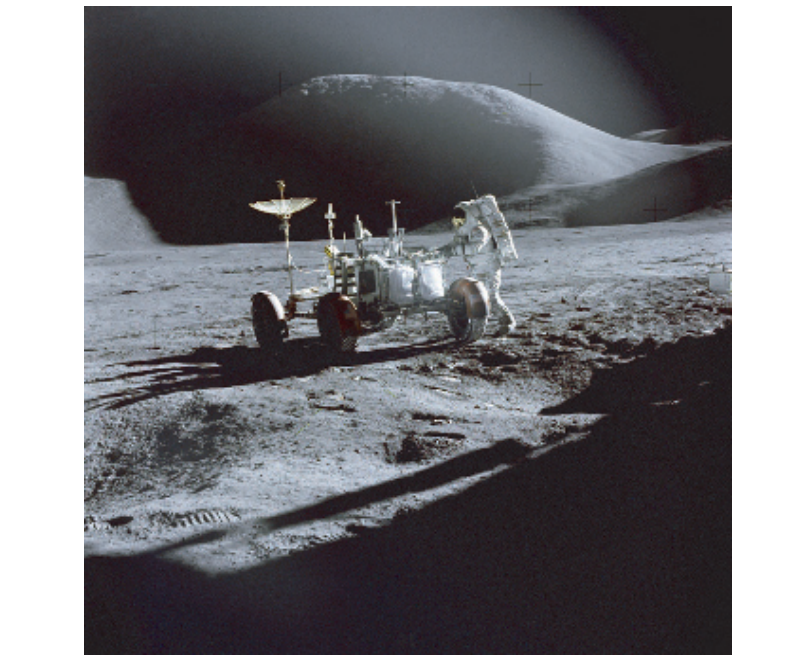

在阴天，黄昏或者黎明时分，室外的光照基本都来自于天光。即使是在晴朗的日子里，从地球上看向太阳，太阳也具有一定的面积，其所占据的视野区域是一个圆锥体，因此太阳并不是一个无穷小的光源。奇怪的是，虽然太阳和月球的尺寸差异巨大，太阳半径要比月球半径大两个数量级，但是从地球上看，它们基本具有相似的大小，二者直径所占据的视野角度大约都为半度。

在现实中，光源从来都不是精确的，但是在某些情况下，使用无穷小的实体来作为廉价近似，或者作为完整模型中的一部分是十分有用的。为了构建一个更加真实的光照模型，我们需要在表面着色点的半球范围内，对来自入射方向的BRDF进行积分。在实时渲染中，我们更喜欢通过找到方程的封闭形式解或者近似值，来求解渲染方程（章节11.1）所必须的积分。我们通常都会避免对多个样本（光线）的结果进行平均（蒙特卡洛方法），因为这种方法往往会很慢，如图10.2所示。

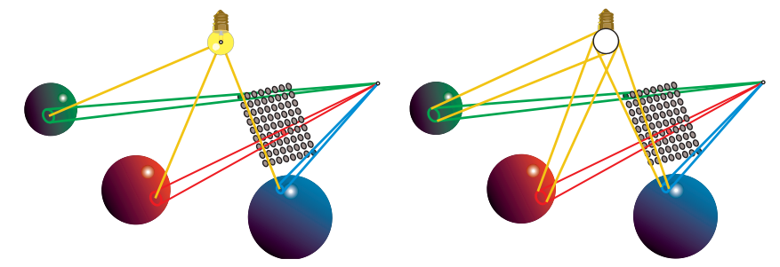

本章节将对这些解决方案进行探索和讨论，尤其是我们想通过计算各种非精确光源的BRDF，来对之前所介绍的着色模型进行一些扩展。通常来说，为了找到一种廉价的解决方案（或者是任意的解决方案），我们需要对光源或者BRDF进行近似，有时候也会对二者同时进行近似。在一个感知框架中来评估最终的着色结果是十分重要的，这要求我们了解最终图像中哪些视觉元素更加重要，从而来为这些元素分配更多的精力和计算资源。

在本章节的最开始部分，我们将对面光源的公式进行解析积分。面光源将会成为场景中的主要光源，它负责大部分的直接光照强度，因此在计算面光源效果的时候，我们需要保留之前所有选择的材质属性。我们还会计算面光源的阴影，因为漏光会导致明显的视觉瑕疵。然后我们会对更加一般的光照环境的表示方法进行研究，这些光照环境由入射半球上的任意分布组成。在这些情况下，我们通常会使用一些更加近似的解决方案。环境光照通常用于表示大型、复杂但是不太强烈的光源，例如：包括来自天空和云的散射光；场景中大型物体反射的间接光（indirect light）；以及一些很暗的面光源的直接光照。这样的近似光源对于正确的图像白平衡十分重要，不然画面会显得太暗。即使我们在这里考虑了间接光照对场景照明的影响，但是我们仍然没有进入全局光照的领域（第11章），全局光照还依赖于场景中其他表面的显式知识和信息。

## 10.1 面光源

在第9章中，我们描述了理想的无穷小光源：精确光源和方向光。图10.3展示了一个表面着色点上的入射半球，以及无穷小光源和非零面光源（area light source）之间的差异。其中左侧光源使用了章节9.4中讨论的定义，它从单一方向$\mathbf{l}_{c}$照射到表面上，其亮度由颜色$\mathbf{c}_{light}$进行表示，这个颜色代表了从一个正对光源的白色Lambertian表面，所反射出的radiance。点光源或者方向光在方向$\mathbf{v}$上，对出射radiance$L_{o}(\mathbf{v})$的贡献为$\pi f\left(\mathbf{l}_{c}, \mathbf{v}\right) \mathbf{c}_{\text {light }}\left(\mathbf{n} \cdot \mathbf{l}_{c}\right)^{+}$，其中符号$x^{+}$代表了将负数限制到0，详见章节1.2。相对地，面光源的亮度由其radiance$L_{l}$来进行表示，并且面光源与表面着色点位置之间会形成一个立体角，记为$ω_l$，此时这个面光源在方向$\mathbf{v}$上，对出射radiance的贡献是$f(\mathbf{l}, \mathbf{v}) L_{l}(\mathbf{n} \cdot \mathbf{l})^{+}$在立体角$ω_l$上的积分。

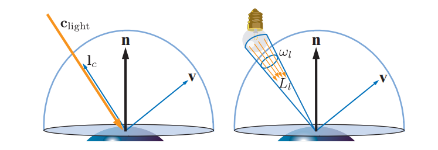

对无穷小光源的基本近似可以表示为如下形式：

$$
L_{o}(\mathbf{v})=\int_{\mathbf{l} \in \omega_{l}} f(\mathbf{l}, \mathbf{v}) L_{l}(\mathbf{n} \cdot \mathbf{l})^{+} d \mathbf{l} \approx \pi f\left(\mathbf{l}_{c}, \mathbf{v}\right) \mathbf{c}_{\mathrm{light}}\left(\mathbf{n} \cdot \mathbf{l}_{c}\right)^{+}
\tag{10.1} 
$$

而面光源对表面着色点的照明贡献量，与radiance（$L_{l}$）和从该位置所看到的光源尺寸（$ω_l$）有关。正如我们在章节9.4中所看到的，点光源和方向光是一种抽象近似，它在现实中并不存在，因为它们的可见立体角为0，这意味着在单位面积上的radiance无穷大。理解这种由近似所引入的视觉误差，将有助于知道何时能够使用这种近似方法，以及在不能使用这种近似方法的时候，我们可以采取什么方法来进行替代。这些近似误差主要取决于两个因素：第一个是光源的尺寸有多大，即从着色点看向光源，该光源会覆盖多大的立体角；第二个则是表面的光泽程度。

图10.4展示了一个表面上的高光大小和高光形状，是如何受到表面材质的粗糙度和光源大小的影响的。对于一个很小的光源，它相对于相机视野只占据了一个很小的立体角，因此产生的误差也很小。相对于光泽表面来说，粗糙表面更加能够显示出光源尺寸对高光的影响。一般来说，面向表面点的面光源，其发光情况与表面BRDF的镜面波瓣都是球面函数。如果考虑哪些方向集合对这两个函数的贡献最显著，我们可以得到两个立体角。误差的决定因素与面光源发射角和BRDF镜面高光立体角的相对大小成正比。

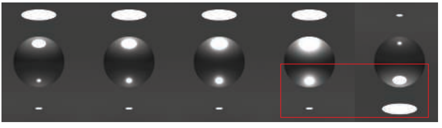

最后请注意观察，面光源的高光效果，可以通过使用精确光源并增加表面材质的粗糙度来进行近似。这个观察结果对于推导面光源积分的低成本近似十分有用，这也解释了为什么在实践中，许多实时渲染系统只使用精确光源就能够产生合理的结果：因为艺术家可以通过手动调整材质，来对误差进行一些补偿（compensate）。但是这样做肯定是有坏处的，因为它将材质属性与特定的光照设置耦合在了一起，当场景中的光照条件发生改变的时候，以这种方式生成的光影和画面看起来就不太正确了。

对于Lambertian表面这种特殊情况，直接使用点光源来表示面光源是很精确的。对于这样的表面，其出射的radiance与irradiance成正比：

$$
L_{o}(\mathbf{v})=\frac{\rho_{\mathrm{ss}}}{\pi} E
\tag{10.2} 
$$

方程中的$\rho_{\mathrm{ss}}$是表面的次表面反照率（subsurface albedo），或者叫做漫反射颜色（diffuse color）。有了这个关系，我们可以对方程10.1进行等价变换，从而计算irradiance，这样要简单得多：

$$
E=\int_{\mathbf{l} \in \omega_{l}} L_{l}(\mathbf{n} \cdot \mathbf{l})^{+} d \mathbf{l} \approx \pi \mathbf{c}_{\text {light }}\left(\mathbf{n} \cdot \mathbf{l}_{c}\right)^{+}
\tag{10.3}  
$$

向量irradiance（vector irradiance）的概念对于当面光源存在时，理解irradiance的行为十分有用。向量irradiance的概念由Gershun \[526]提出，他将其称之为光源向量（light vector），Arvo \[73]将这个概念进一步推广。利用向量irradiance，可以将任意大小和任意形状的面光源，精确地转换为点光源或者方向光。

想象一个分布为$L_i$的radiance进入到了空间中的点$\mathbf{p}$，如图10.5所示。现在我们假设$L_i$与光线的波长无关，因此可以将其表示为一个标量。对于每个以入射方向$\mathbf{l}$为中心的、无限小的立体角$d\mathbf{l}$，我们都构建一个与入射方向$\mathbf{l}$平行的向量，其长度等于从该方向入射的radiance（标量）与$d\mathbf{l}$的乘积。再对所有构建的向量进行求和（积分），最终可以得到向量irradiance $\mathbf{e}$，这个过程的数学形式如下：

$$
\mathbf{e}(\mathbf{p})=\int_{\mathbf{l} \in \Theta} L_{i}(\mathbf{p}, \mathbf{l}) \mathbf{l} d \mathbf{l}
\tag{10.4}  
$$

其中的$\Theta$表示在整个球面方向上进行积分。

向量irradiance $\mathbf{e}$可以通过与任意平面的表面法线进行点乘运算，从而获得点$\mathbf{p}$处的净irradiance，其数学表达如下：

$$
E(\mathbf{p}, \mathbf{n})-E(\mathbf{p},-\mathbf{n})=\mathbf{n} \cdot \mathbf{e}(\mathbf{p})
\tag{10.5}  
$$

其中$\mathbf{n}$是平面的表面法线。通过平面的净irradiance，是指流经平面“正面”（表面法线$\mathbf{n}$所指向的方向）和流经平面“背面”的irradiance之差。虽然说净irradiance本身对于着色计算来说没有什么用处，但是如果说没有任何radiance被发射通过平面的“背面”的话（换句话说，对于所分析的光线分布，光线方向$\mathbf{l}$和表面法线$\mathbf{n}$之间的夹角都不会超过$90^{\circ}$，所有的入射光线都来自于着色点的正半球方向），即$E(\mathbf{p},-\mathbf{n})=0$，那么此时有：

$$
E(\mathbf{p}, \mathbf{n})=\mathbf{n} \cdot \mathbf{e}(\mathbf{p})
\tag{10.6} 
$$

单个面光源的向量irradiance可以实用方程10.6中的方法，来照亮具有任意法线$\mathbf{n}$的Lambertian表面，只要这个面光源整体位于表面的正面方向即可。也就是说面光源上任意一点与着色点之间的连线，和表面法线之间的夹角都不超过$90^{\circ}$，如图10.6所示。

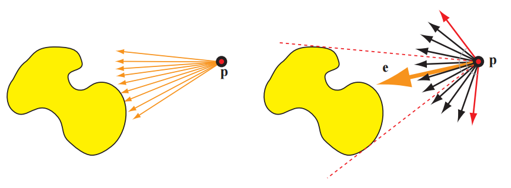

如果入射radiance $L_i$与波长无关的假设不成立的话，那么在一般情况下，我们就不能再定义单个向量irradiance $\mathbf{e}$了。然而，彩色光通常在所有点上都具有相同的相对光谱分布，这意味着我们可以将$L_i$分解为颜色$\mathbf{c}^{\prime}$，以及与波长无关的radiance分布$L_i^{\prime}$。在这种情况下，我们可以计算$L_i^{\prime}$的向量irradiance $\mathbf{e}$，并对方程10.6进行一些扩展，将$\mathbf{n} \cdot \mathbf{e}$乘上颜色$\mathbf{c}^{\prime}$。这样做的结果与计算方向光irradiance的方程相同，只是做了以下替换：

$$
\begin{aligned} \mathbf{l}_{c} & =\frac{\mathbf{e}(\mathbf{p})}{\|\mathbf{e}(\mathbf{p})\|}, \\ \mathbf{c}_{\text {light }} & =\mathbf{c}^{\prime} \frac{\|\mathbf{e}(\mathbf{p})\|}{\pi} .\end{aligned}
\tag{10.7}  
$$

到此为止，我们已经可以将任意形状和任意大小的面光源转换为方向光，同时不会引入任何误差。

对于一些简单情况，用于求取向量irradiance的方程10.4可以求出解析解。例如：想象现在有一个以$\mathbf{p}_l$为中心、半径为$r_l$的球形光源。球面上的每一点都会向各个方向发出具有恒定radiance $L_l$的光线。对于这种光源，将方程10.4和方程10.7联立，可以获得如下结果：

$$
\begin{aligned} \mathbf{l}_{c} & =\frac{\mathbf{p}_{l}-\mathbf{p}}{\left\|\mathbf{p}_{l}-\mathbf{p}\right\|}, \\ \mathbf{c}_{\text {light }} & =\frac{r_{l}^{2}}{\left\|\mathbf{p}_{l}-\mathbf{p}\right\|^{2}} L_{l} .\end{aligned}
\tag{10.8} 
$$

上述方程，与具有$\mathbf{c}_{\text {light }_{0}}=L_{l}, r_{0}=r_{l}$和标准距离平方反比衰减函数的泛光灯（章节5.2.2）完全相同。可以对这个衰减函数进行一些修正，使得光线从球体表面才开始发生衰减，并在光源的最大影响距离处衰减到0，有关这些调整的更多细节，详见章节5.2.2。

> 请注意，对于球形光源而言，确实会采取通常的距离平方反比函数来控制光线强度的衰减，但是这种方式通常并不适用于所有形状的面光源。值得注意的是，圆盘光的衰减率与$1/(d^2 + 1)$成正比。

在没有来自“背面”irradiance的情况下，上述所描述的一切都是正确的。另一种思考方式是，面光源的任何部分都不能“位于地平线以下”，或者是被表面遮挡。我们可以将这个说法推广，对于表面而言，面光源和点光源之间的所有差异，都是由于遮挡差异所造成的。对于光线没有被遮挡的任意着色点，点光源的irradiance服从余弦衰减定律。Snyder推导出了一个考虑遮挡情况的球形光源的解析表达式 \[1671]，这个表达相当复杂。然而，由于这个表达式只和两个量有关（$r/r_l$，表面法线$\mathbf{n}$和$\mathbf{l}_c$之间的夹角$θ_i$)，因此可以对其进行预计算，并存储在一个二维纹理中。Snyder还给出了两个适用于实时渲染的函数近似。

在图10.4中我们可以看到，对于较为粗糙的表面，面光源的光照效应其实不太明显。基于这一观察结果，我们可以使用一种不太物理正确，但是仍然有效的方法，来对Lambertian表面上的面光源效果进行模拟，这种方法叫做环绕光照（wrap lighting）。在这种方法中，首先会对$\mathbf{n} \cdot \mathbf{l}$的结果进行一些简单的修改，然后再将其限制到0。Forsyth \[487]给出了环绕光照的一种形式：

$$
E=\pi \mathbf{c}_{\text {light }}\left(\frac{(\mathbf{n} \cdot \mathbf{l})+k_{\mathrm{wrap}}}{1+k_{\mathrm{wrap}}}\right)^{+}
\tag{10.9} 
$$

其中$k_{wrap}$的取值范围为$[0,1]$，对于点光源而言，$k_{wrap}=0$；对于覆盖整个半球范围的面光源而言，$k_{wrap}=1$。Valve采用了另一种形式的环绕光照\[1222]，来模仿大尺寸的面光源效果：

$$
E=\pi \mathbf{c}_{\text {light }}\left(\frac{(\mathbf{n} \cdot \mathbf{l})+1}{2}\right)^{2}
\tag{10.10} 
$$

一般来说，如果我们要计算面光源的话，我们还应当对阴影计算进行一定的修改，如果我们不这样做，一些面光源的视觉效果可能会被强烈的阴影所抵消\[193]。正如我们在第7章中所讨论的，柔和的软阴影可能是面光源最明显的视觉效果。

### 10.1.1 光泽材质

面光源对非Lambertian表面的影响要更为复杂。Snyder推导出了一个球形光源的解\[1671]，但是这个解仅适用于原始的反射向量Phong材质模型，并且极其复杂，在实际应用中需要对其进行近似。

面光源在光泽（glossy）表面上的主要视觉效果是高光，如图10.4所示。这个高光的大小和形状类似于产生该效果的面光源，高光的边缘则会根据该表面的粗糙度，被一定程度的模糊。基于这一观察结果，研究者提出了几个针对该效应的经验近似值，这些近似方法在实践中是相当令人信服的。例如：我们可以对高光计算的结果进行修改，将其加上一个截止阈值，从而生成一个大而平坦的高光区域\[606]。这可以有效地产生一个球面光源镜面反射的视错觉，如图10.7所示。

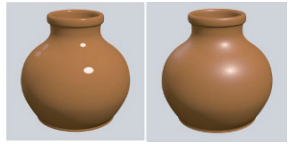

在实时渲染中，大多数对面光源光照效果的实用近似，都是基于了这样的一个想法：为每个着色点都寻找一个等效的精确光源，从而模拟非无穷小光源的效果。这种方法经常被用于实时渲染中，以解决各种各样的问题。这与我们在第9章中，在表面像素足迹所覆盖的区域内，对BRDF进行积分的原理相同。这种方式所产生的近似值，其计算成本通常会很低，因为我们只需要修改着色方程的输入即可，不会引入任何其他额外的复杂性。由于背后的数学运算并没有发生改变，因此我们通常可以保证，在某些条件下，我们可以恢复对原始着色结果的计算，并保留其所有的属性。由于大多数渲染系统的着色代码都是基于精确光源的，因此用它们来实现面光源只会引入局部的代码变化。

第一个被开发出来的近似方法是Mittring在虚幻引擎的“Elemental demo”\[1229]中所使用的粗糙度修正（roughness modification）。这个想法首先会找到一个圆锥体，其中包了含入射到表面半球范围内的大部分光源irradiance。然后我们在镜面波瓣的附近放置一个类似的圆锥体，它会包含“大部分”的BRDF，如图10.8所示。这两个圆锥体是半球上函数的替代品，它们各自包含了一组方向，在这组方向上，这两个函数的输出值都会大于给定的任意阈值。这样做之后，我们可以寻找一个新的BRDF波瓣，来近似光源和材质BRDF之间的卷积，这个新的BRDF波瓣具有不同的粗糙度，它同样有一个对应的圆锥体，这个圆锥体的立体角等于光源波瓣立体角和材质波瓣立体角的和。

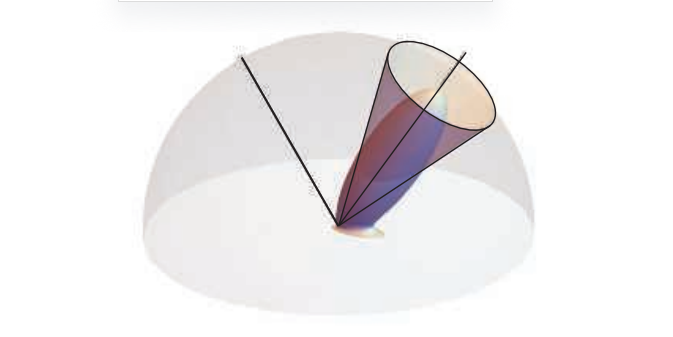

Karis \[861]将Mittring所提出原理应用在了GGX/Trowbridge-Gereitz BRDF（章节9.8.1）和一个球面光源中，并对GGX的粗糙度参数$α_g$进行了简单的修改：

$$
\alpha_{g}^{\prime}=\left(\alpha_{g}+\frac{r_{l}}{2\left\|\mathbf{p}_{l}-\mathbf{p}\right\|}\right)^{\mp}
$$

注意这里使用了章节1.2中介绍的符号$x^{\mp}$，它表示将输入值限制到0-1之间。对于具有一定光泽的表面而言，这种近似方法的效果相当好，而且计算成本很低；但是对于闪亮的、几乎像镜子一样的材质来说就会失效。这种失效的原因是因为镜面波瓣总是光滑的，它无法模拟由面光源在表面上因尖锐反射所产生的锐利高光。此外，大多数微表面BRDF模型的波瓣并不是那么“紧凑”（即反射分布的扩散角度较大），同时会表现出一个较宽的衰减（高光拖尾），这使得粗糙度重映射的方法不太有效，如图10.9所示。

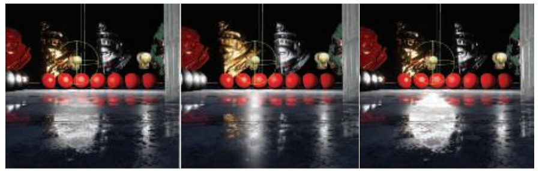

除了改变材质的粗糙度之外，还有另一个思路：根据被着色的表面点来改变的光线方向，从而来表示面光源的照明效果。这种方法被称为代表性点技术（most representative point），它通过对光线向量进行修改，使其在面光源表面方向上，能够对着色表面产生最大的能量贡献，如图10.9最右侧所示。Picott \[1415]使用了光源表面上与反射光线夹角最小的点。Karis \[861]对Picott的公式进行了改进，他将这个形成最小角度的点，近似为面光源到反射光线最近的点，从而进一步提高效率。他还提出了一个廉价的公式来对光线强度进行缩放，从而尽可能保持整体发射的能量，如图10.10所示。大多数代表性点的解都是很容易推导的，并且这种方法适用于各种几何形状的光源，因此对它们背后的理论进行一些了解是很重要的。这些方法的核心思路，类似于蒙特卡洛积分中重要性采样的思想，蒙特卡洛积分是指，我们通过在积分域上对样本结果进行平均，从而对定积分的值进行数值计算。为了更高效地做到这一点（使用较少的样本），我们可以尝试优先考虑那些对总体平均值具有较大贡献的样本。

 \mathbf{r}-1 。然后再计算球面上距离点 \mathbf{p}_{\mathrm{cr}} 最近的点： \mathbf{p}_{\mathrm{cs}}=\mathbf{l}+\mathbf{p}_{\mathrm{cr}} \cdot \min \left(1, \frac{\text { radius }}{\left\\|\mathbf{p}_{\mathrm{cr}}\right\\|}\right)")

定积分的中值定理可以更加严格地证明其有效性的，它允许我们用函数的单次求值来代替该函数的积分，其数学表达如下：

$$
\int_{D} f(x) d x=f(c) \int_{D} 1
\tag{10.11} 
$$

如果$f(x)$在区域$D$上是连续的，则$\int_{D} 1$代表了该区域的面积，点$c∈D$位于区域$D$中函数最小值与最大值之间的连线上。对于光照，我们考虑的是BRDF与光源irradiance的乘积，这个乘积在被光照覆盖的半球面上的积分。通常我们会认为光源是均匀照射的，因此我们只需要考虑光线随距离的衰减即可，并且大多数近似方法还会假设区域$D$在着色点位置上是完全可见的。即使有了上述这些假设，确定点$c$和归一化系数$\int_{D} 1$的计算成本仍然可能会很高，因此我们需要对其进行进一步的近似。

代表性点的解也可以通过它们对高光形状的影响来限定。在部分的表面着色点上，代表性点可能不会发生改变，因为反射向量位于面光源所覆盖的方向锥之外，对于这些区域，我们可以使用一个点光源来进行高效照明，因为高光的形状只取决于镜面波瓣的底层形状。而对于那些反射向量指向面光源的表面着色点，其代表性点将会不断变化，以便能够指向能量贡献最大的方向。这样做有效地扩展了镜面波瓣的峰值，使其“变宽”，其效果类似于图10.7左侧的硬阈值。

这个较宽的、恒定的高亮峰值，也是近似值中剩余的误差来源之一。在较为粗糙的表面上，面光源反射看起来要比真实值（ground-truth，即通过蒙特卡罗积分获得）更加“尖锐”，这是一种与粗糙修正技术过度模糊相反的视觉瑕疵。为了解决这个问题，Iwanicki和Pesce \[807]将BRDF波瓣、软阈值、代表性点参数与缩放因子，拟合到通过数值积分计算而来的球形区域光照结果中，从而得到了近似结果。这些拟合的函数生成了一个参数表，这个参数表通过材质粗糙度、球形光源的半径、光源中心与表面法线之间的夹角、观察向量来进行索引。由于在着色器中直接使用这种多维查找表的开销很大，因此他们还提供了封闭形式的近似。最近，de Carpentier \[231]推导出了一种改进的方程，这个方程对于基于微表面的BRDF，可以更好地保留掠射角度下球形面光源所生成的高光形状。该方法的原理是找到一个使得$\mathbf{n} \cdot \mathbf{h}$最大化的代表性点，而不是原始方程中的$\mathbf{n} \cdot \mathbf{r}$（这是通过Phong BRDF推导出的），这里的$\mathbf{n} \cdot \mathbf{h}$是表面法线和半向量（光线方向-观察方向）之间的点积。

### 10.1.2 一般光源形状

到目前为止，我们介绍了几种方法，它们可以从均匀辐射的球形光源和任意的光泽BRDF中计算着色效果。其中的大多数都采用了各种近似策略，从而能够获得可以快速实时计算的数学方程，但是与ground-truth的方法相比，它们都具有不同程度的误差。然而，即使我们的计算能力足够强，能够推导出完全精确的解决方案，我们仍然会犯一个很大的错误，这个错误来源于我们在光照模型中的假设。因为现实世界的光源通常并不是球形的，而且它们向外辐射的能量也并不是完美均匀的，如图10.11所示。但是球形光源在实践中仍然非常有用，因为它们提供了一种最简单的方法，来打破精确光源所引入的光照和表面粗糙度之间的错误关联。然而，只有在光源相对较小的情况下，球形光源才能对现实中的大多数光源进行良好的近似。

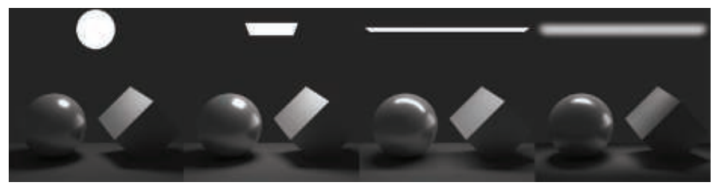

基于物理的实时渲染，其目标是生成令人信服的、可信的图像，因此我们只能通过将自己限制在一个理想化的场景中来实现这个目标。这就是在计算机图形学中反复出现的trade-off（权衡），通常我们可以选择为简化假设的简单问题生成精确的解，或者是为更加一般化的问题推导出一个近似的解决方案，从而更好的对现实进行模拟。即选择简单问题的精确解，还是选择复杂问题的近似解。

![图10.12：一个管状光源。使用了代表性点方法来计算图像中的光照效果。 \[807\]](images/Chapter-10/202306161343643.png "图10.12：一个管状光源。使用了代表性点方法来计算图像中的光照效果。 \[807]")

管状光源（也叫做胶囊体光源）是对球形光源的最简单扩展之一，它可以用来表示现实世界中的荧光灯管，如图10.12所示。对于Lambertian BRDF，Picott \[1415]给出了一个封闭形式的光照积分方程，它相当于在线性光源分段（light segment）的极值处，使用适当的衰减函数来评估两个点光源的照明效果，其数学形式如下：

$$
\int_{\mathbf{p}_{0}}^{\mathbf{p}_{1}}\left(\mathbf{n} \cdot \frac{\mathbf{x}}{\|\mathbf{x}\|}\right) \frac{1}{\|\mathbf{x}\|^{2}} d \mathbf{x}=\frac{\frac{\mathbf{n} \cdot \mathbf{p}_{0}}{\left\|\mathbf{p}_{0}\right\|^{2}}+\frac{\mathbf{n} \cdot \mathbf{p}_{1}}{\left\|\mathbf{p}_{1}\right\|^{2}}}{\left\|\mathbf{p}_{0}\right\|\left\|\mathbf{p}_{1}\right\|+\left(\mathbf{p}_{0} \cdot \mathbf{p}_{1}\right)}
\tag{10.12} 
$$

其中$\mathbf{p}_{0}$和$\mathbf{p}_{1}$是线性光源的两个端点，$\mathbf{n}$是表面法线。Picott还推导了一个Phong镜面BRDF积分的代表性点解，来将其作为位于光源分段位置上点光源照明的近似，将这个代表性点与表面着色点相连接，可以与反射向量形成最小的夹角。这个代表性点的解可以动态地将线性光源转换为一个点光源，因此我们可以使用任意球形光源的近似，通过“叠加”的方式来构建一个胶囊光源。

在球形光源的情况下，Karis \[861]在Picott原始解决方案的基础上，提出了一个更加高效（但是不太准确）的变体，该方法使用了与反射向量距离最短的光源表面点（而不是最小的夹角），并提出了一个缩放公式，试图恢复光照中的能量守恒。

许多其他光源形状的代表性点近似也可以很容易地获得，例如圆环光源和Bezier光源，但是通常我们并不希望着色器的分支过多。一个良好的光源形状，应当能够表示许多现实世界中的光源。其中最具表现力的一类形状是平面光源（planar area light），它位于一个平面上，被给定的几何形状所约束，例如：矩形光源（在这种情况下，它们也称为卡片光源），圆盘光源或者更加普遍的多边形光源。这些平面光源可以用于发出光线的面板（例如广告牌和电视屏幕），可以代替常用的摄影光源（例如柔光箱和反光板)，可以用于模拟复杂照明装置的光圈，又或者是用于表示场景中墙壁和其他较大表面所反射出的光线。

最早的卡片光源（和圆盘光源）的实用近似，是由Drobot \[380]推导出来的，它也是一个代表性点的解决方案，但是它特别值得注意，因为将这种方法扩展到平面上的二维区域十分复杂，而且对于求解的整体方法来说也是如此。Drobot 从中值定理出发，他认为一个良好的光源计算候选点，应该位于光照积分的全局最大值附近。

对于一个Lambert BRDF而言，这个积分是：

$$
L_{l} \int_{\mathbf{l} \in \omega_{l}}(\mathbf{n} \cdot \mathbf{l})^{+} \frac{1}{r_{1}^{2}} d \mathbf{l}
\tag{10.13}  
$$

其中$L_l$是光源发出的恒定radiance；$ω_l$是光源几何形状所对应的立体角；$r_1$是沿光照方向$\mathbf{l}$，从着色点到光源平面的射线长度；$(\mathbf{n} \cdot \mathbf{l})^{+}$是Lambertian点积的限制结果。从着色点出发，沿法线方向发射一条射线，将这条射线与光源平面的交点记为$\mathbf{p}^{\prime}$；光源边界上距离点$\mathbf{p}^{\prime}$最近的点记作$\mathbf{p}_c$，将点$\mathbf{p}_c$与着色点相连接，在这个方向上可以获得$(\mathbf{n} \cdot \mathbf{l})^{+}$的最大值。类似的，我们将光源平面上距离着色点最近的点记为$\mathbf{p}^{\prime \prime}$，点$\mathbf{p}_r$是光源边界上距离点$\mathbf{p}^{\prime \prime}$最近的点，在点$\mathbf{p}^{\prime \prime}$处，我们可以获得$1 / r_{1}^{2}$的最大值，如图10.13所示。这个被积函数的全局最大值位于点$\mathbf{p}_r$和点$\mathbf{p}_c$之间的某处，即：$\mathbf{p}_{\max }=t_{m} \mathbf{p}_{c}+\left(1-t_{m}\right) \mathbf{p}_{r}$，其中$t_m \in [0,1]$。Drobot使用数值积分方法来找到不同配置下的最佳代表性点，然后再找到一个平均表现最好的参数$t_{m}$。

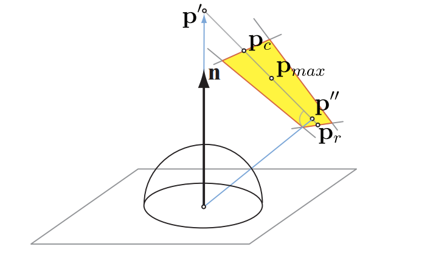

在Drobot的最终解决方案中，对漫反射光照和镜面光照的进行了进一步的近似，所有这些都是通过与数值上的ground-truth解决方案进行对比来实现的。他还为纹理卡片光源（textured card light）推导出了一种算法，这种光源在矩形区域上的光线发射是不均匀的，具体的发光强度由一个纹理进行控制。这个过程是使用一个三维查找表来实现的，这个表中包含了自发光纹理在不同半径的圆形区域上的预积分。Mittring \[1228]采用了类似的方法来进行光泽反射，它将反射光线与一个纹理化的矩形广告牌相交，并根据光线相交的距离，来检索预先计算的、模糊版本的纹理。这项工作要早于Drobot所提出的方法，但这个方法是一种更加经验主义的，不那么有原则性的方法，它确实试图与ground-truth的积分解决方案相匹配。

对于更加一般的平面多边形面光源（polygonal area light），Lambert \[967]最早给出了完美漫反射表面的一个精确封闭形式的解。Arvo对该方法进行了改进，将光泽材质建模为Phong镜面波瓣。Arvo\[74]通过将向量irradiance的概念扩展到高维irradiance张量，并利用Stoke定理，将面积积分转换为沿积分域轮廓的简单积分，从而实现了这一点。Arvo的方法仅有一个假设：光源对于表面着色点是完全可见的（这是一个常见的假设，可以对与表面相切的光源多边形进行裁剪，来绕过这个假设），并且BRDF是一个径向对称的余弦波瓣。不幸的是，在实践中，Arvo的解析方法对于实时渲染而言十分昂贵，因为它需要计算一个方程，其时间复杂度与Phong波瓣中所使用的指数线性相关，同时还与每个面光源多边形的边缘数量有关。最近，Lecocq \[1004]找到了轮廓积分函数的一个$O(1)$近似，并将这个解扩展到了一般的、基于半向量的BRDF中，这使得该方法更加实用。

到目前为止，我们所描述的所有实用的实时面光源光照方法，都采用了某些简化的假设，从而允许对解析结构的推导，以及对结果积分的近似处理。Heitz等人\[711]采用了一种不同的线性变换余弦（linearly transformed cosine，LTC）方法，据此产生了一种实用、准确且通用的技术。在他们的方法中，首先会在球体上设计一组具有高度表现力的函数（即这些函数可以具有多种不同的形状），这些函数可以很容易地在任意球面多边形上进行积分，如图10.14所示。

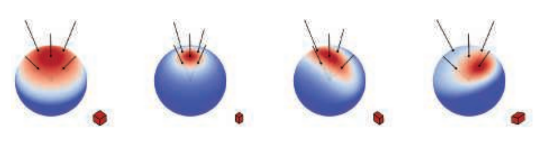

LTC只使用了一个由$3×3$矩阵变换的余弦波瓣，因此它们可以在半球上调整大小、拉伸、旋转，从而适应各种形状。一个简单的余弦波瓣（与Blinn-Phong不同，它不包含进行指数运算）与球面多边形的积分已经很成熟了，它可以追溯到Lambert的工作\[74, 967]。Heitz等人观察到，在波瓣上使用变换矩阵来对积分进行扩展，并不会改变它的复杂性，我们可以通过逆矩阵来对多边形定义域进行变换，并消去位于积分内部的矩阵，最终的被积函数仅仅是一个简单的余弦波瓣，如图10.15所示。

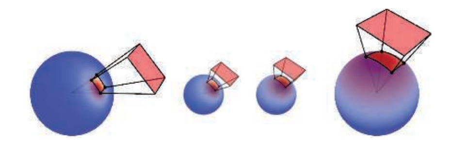

对于一般的BRDF和面光源形状，剩下的唯一工作，就是找到将球体上的BRDF函数表示为一个或者多个LTC的方法（或者近似值），这些工作可以离线完成并构建一个查找数组，通过BRDF参数（粗糙度、入射角等）来进行索引。基于余弦的线性变换方法既适用于一般的纹理多边形面光源，也适用于专门的、更易于计算的光源形状，例如卡片光源、圆盘光源和管状光源。LTC方法可能要比代表性点方法更加昂贵，但是相应地也更加准确。

## 10.2 环境光照

原则上，反射（方程9.3）并不会区分是从光源发出的直接光，还是从天空或者场景其他物体散射过来的间接光，在着色点半球内的所有入射方向上都存在radiance，反射方程会对所有方向进行积分。然而在实践中，通常我们会认为直接光具有较高的radiance和相对较小的立体角，而间接光往往会以中等或者较低的radiance，来覆盖半球方向上的其余部分。基于这种划分方式和理由，我们可以将二者分开进行处理。

到目前为止，我们讨论了面光源的技术，它对从光源形状发出的恒定radiance进行了积分。这样做为每个表面着色点都创建了一组方向，在这些方向上都具有恒定的非零入射radiance。现在我们将要研究的是，在所有可能的入射方向上，对由不同函数定义的radiance进行积分的方法，如图10.16所示。

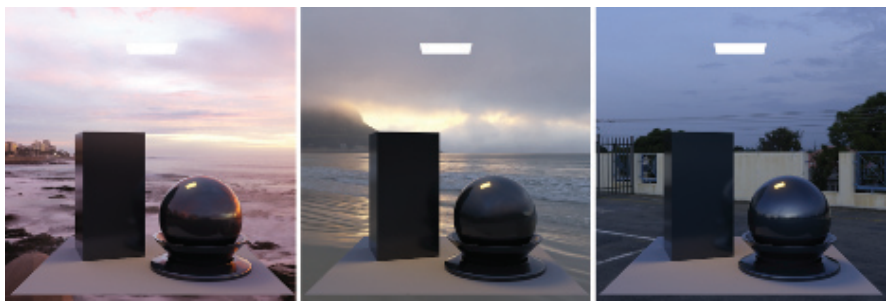

虽然我们将在这里对有关间接光照和“环境”光照的内容进行讨论，但是我们所讨论的并不是全局光照算法。这里最关键的区别在于，在本小节所讨论的方法中，所有的着色数学表达式都不依赖于场景中其他表面的知识，而是仅仅依赖于一组少量的光源图元。因此，虽然我们可以使用一个面光源来模拟光线在墙壁上的反射效果，而且它确实也是一个全局效果，但是其中的着色算法并不需要知道这个墙壁的存在；它所拥有的全部信息都来自于这个光源，并且所有的着色计算都是在局部完成的。全局照明技术（第11章）通常会与本章中的概念紧密相关，因为全局光照的许多解决方案，都可以被视为计算正确的局部光源图元集合的方法，并将这些局部光源作用于每个物体或者每个表面位置上，从而模拟光线在场景中相互反弹的作用效果。

环境光（ambient light）是最简单的环境光照模型，环境光的radiance不会随着方向发生变化，具有恒定的值$L_A$。但是即使是这样一个最基本的环境光照模型，也可以显著提升视觉质量。一个不考虑光线在物体之间反弹的场景会显得很不真实，在这样的场景中，处于阴影中的物体或者背对光源的物体将会是纯黑的，这与现实中我们所看到场景都不同。图10.1中所展示的月球表面很接近我们刚才描述的场景，但是即使在这样的场景中，也会有一些间接光线被附近的物体所反射。

环境光的确切影响将取决于BRDF。对于Lambertian表面而言，无论表面法线$\mathbf{n}$或者观察方向$\mathbf{v}$的具体情况如何，环境光固定的radiance $L_A$对于出射radiance 的贡献都是恒定的：

$$
L_{o}(\mathbf{v})=\frac{\rho_{\mathrm{ss}}}{\pi} L_{A} \int_{\mathbf{l} \in \Omega}(\mathbf{n} \cdot \mathbf{l}) d \mathbf{l}=\rho_{\mathrm{ss}} L_{A}
\tag{10.14} 
$$

在进行着色计算的时候，这种恒定的出射radiance 贡献会被添加到直接光源的贡献中。对于任意的BRDF，这个等价方程为：

$$
L_{o}(\mathbf{v})=L_{A} \int_{\mathbf{l} \in \Omega} f(\mathbf{l}, \mathbf{v})(\mathbf{n} \cdot \mathbf{l}) d \mathbf{l}
\tag{10.15}  
$$

方程10.15中的积分部分与定向反照率$R(\mathbf{v})$相同（章节9.3中的方程9.9），因此这个方程等价于$L_{o}(\mathbf{v})=L_{A} R(\mathbf{v})$。在一些较老的实时渲染应用中，有时会假设$R(\mathbf{v})$是一个恒定的值，它被称为环境颜色$\mathbf{c}_{amb}$，因此可以进一步将方程简化为$L_{o}(\mathbf{v})=\mathbf{c}_{\mathrm{amb}} L_{A}$。

这里的反射方程忽略了遮挡情况，也就是说，在实际情况中，表面着色点的某些入射方向，会被其他物体或者同一物体的其他部分所遮挡。这种简化通常会降低画面的真实感，对于环境光照来说尤其明显；在忽略遮挡情况的时候，环境光照会显得非常均匀平坦。我们将在章节11.3中（环境光遮蔽）详细讨论解决该问题的方法，尤其是在章节11.3.4中。

## 10.3 球面函数和半球函数

上一小节中我们所讨论的环境光照还只是一个常数，为了将环境光照扩展到常数项之外，我们需要一种数学方法，来表示从任何方向照射到物体上的入射radiance。首先，我们会将radiance考虑为一个仅对方向进行积分的函数，而不是针对表面位置进行积分。之所以这样做，是因为我们假设光照环境是无限远的。

到达给定着色点上的radiance，在每个入射方向上可能都是不同的。从左边入射的光线可能是红色的，从右边入射的光线可能是绿色的；从顶部入射的光线会被遮挡，而从侧面入射的光线则不会被遮挡。这种类型的量可以使用球面函数（spherical function）来进行表示，这些函数定义在单位球体的表面上，或者定义在$\mathbb{R}^{3}$的方向空间中，我们将这个定义域记为$S$。最终生成单个值还是多个值并不会对这些函数的运行产生影响，例如：通过为每个颜色通道存储单独的标量函数，这些相同的标量函数同样也可以用于对颜色值进行编码。

假设现在我们有一个Lambertian表面，球面函数可以通过存储预先计算的irradiance函数来计算环境光照，例如：对于每个可能的表面法线方向，计算radiance与余弦波瓣的卷积。更加先进（sophisticated）的方式是存储radiance，并在运行过程中，计算每个表面着色点的BRDF积分。球面函数也广泛应用于全局光照算法中（第11章）。

与球面函数相关的是半球函数（hemisphere function），即只有一半方向上的值是有定义的，这些函数用于描述那些没有光线会从下方照射的表面时的入射radiance。

我们将这些表示函数称为球面基底（spherical base），因为它们都是定义在球面函数向量空间中的基底。虽然环境/高光/方向形式（AHD，章节10.3.3）在技术上来说，并不是数学意义上的基底，但是我们也将使用基底这个术语来指代它们。将一个函数转换为给定表示形式的操作被称为投影（projection），从给定表示形式中计算函数值的过程被称为重建（reconstruction）。

每种基底表示方法都有自己的一套权衡方式，我们将会在给定的基底中寻找如下属性，这些属性是我们想要基底能够具备的：

-   高效的编码（投影）和解码（查找）。
-   使用较少的系数和较低的重建误差来表示任意球面函数的能力。
-   投影的旋转不变性（rotational invariance），也就是将一个函数的投影结果进行旋转，与旋转这个函数，然后再进行投影所得到的结果是一样的。这个旋转不变性意味着使用近似函数（球谐函数）在旋转的时候，并不会改变所得到的结果。
-   易于计算编码函数的和与编码函数的乘积。
-   易于计算球面积分和球面卷积。

### 10.3.1简单表格形式

想要表示球面函数或者半球函数，最直接方法就是直接选择几个方向，并为每个方向都存储一个值。在使用的时候，在所求方向周围找到一定数量的样本，并用某种形式的插值来对函数值进行重建。

虽然这种表示方式很简单，但是它的表征能力很强。将这些球面函数相加或者相乘十分简单，就像直接将它们所对应的表项相加或者相乘一样。我们可以对许多不同的球面函数进行编码，并使用更多的样本来降低重建误差。

想要以一种允许高效检索，同时又能相对平均地表示所有方向的方式，来将样本分布在一个球体上（如图10.17所示）并不是一件容易的事情。最常用的方法是，首先将球面展开为一个矩形区域（类似于世界地图），然后在该矩形区域内，使用点状网格来对其进行采样。由于一个二维纹理刚好可以和矩形区域内的网格相对应，因此我们可以使用纹素来作为样本值的底层存储方式。这样做可以让我们利用GPU加速的双线性纹理过滤，来进行快速查找（重建）。在章节10.5中我们将讨论有关环境贴图的内容，它就是这种形式的球面函数，在该小节中我们还会讨论将展开球面的不同方式。

这种简单表格形式当然也存在缺点。如果我们使用较低分辨率的贴图来存储这个表格，那么硬件过滤所提供的质量通常是不可接受的。卷积计算是处理光照时的常见操作，其计算复杂度与样本数量成正比，这可能会导致非常高的计算开销。此外，使用表格形式存储球面函数不具备投影不变性，这在某些应用中可能会出现一些问题，例如：想象一下，当光线从一组方向照射到物体表面上，此时我们已经有了对其radiance的编码；但是如果此时物体发生了旋转的话，那么编码结果可能会以不同的方式进行重建，这可能会导致编码的辐射能量发生变化，从而导致在场景动画的过程中，可能会出现脉冲瑕疵（pulsating artifact）。通过在投影和重建过程中，仔细构造与每个样本相关的核函数，可以缓解这些问题。不过更加常见的情况是，仅仅增加样本数量就足以掩盖这些问题。

通常来说，当我们需要存储复杂的高频函数，并且这些函数需要对许多数据点进行编码，从而保持较低误差的时候，就会使用表格形式。如果我们需要以一种更加紧凑的形式来对球面函数进行编码，并且这些函数只有少数几个参数的时候，我们可以选择使用更加复杂的基底。

作为一种常见的基底选择，环境立方体（ambient cube，AC）是最简单的表格形式之一，它由六个沿着主轴方向的平方余弦波瓣构成\[1193]。之所以它会被称为环境“立方体”，是因为这种方法相当于在立方体的六个表面上存储数据，并在我们从一个方向移动到另一个方向的时候进行插值。对于任何给定的方向，只有三个波瓣是与之相关的，因此我们并不需要从内存中获取另外三个波瓣的参数\[766]。在数学上，环境立方体可以被定义为：

$$
F_{A C}(\mathbf{d})=\mathbf{d} d \cdot \operatorname{sel}_{+}\left(\mathbf{c}_{+}, \mathbf{c}_{-}, \mathbf{d}\right)
\tag{10.16} 
$$

其中$\mathbf{c}_{+}$和$\mathbf{c}_{-}$包含了立方体六个表面上的值；$\operatorname{sel}_{+}\left(\mathbf{c}_{+}, \mathbf{c}_{-}, \mathbf{d}\right)$是一个向量函数，它将一个方向向量作为输入，并会输出一个向量；对于输入参数$\mathbf{d}$中的每个分量，会根据其正负性来选择取$\mathbf{c}_{+}$还是$\mathbf{c}_{-}$。

环境立方体和立方体贴图（详见章节10.4）很类似，二者的不同之处在于，环境立方体的每个表面上只会存储一个纹素。在某些渲染系统中，针对这种特殊情况，在软件中执行重建过程可能要比在立方体贴图上使用GPU的双线性过滤更快。Sloan \[1656]推导了一个简单的方程，可以在环境立方体和球谐函数基底之间进行转换（详见章节10.3.2）。

使用环境立方体进行重建的质量相当低。通过对8个值（而不是6个）进行存储和插值，可以获得稍微好一点的结果，这8个值对应了立方体上的8个顶点。最近，Iwanicki和Sloan \[808]提出了另一种被称为环境骰子（ambient dice ，AD）的方法，它的基底由沿二十面体顶点方向的平方和四次余弦波瓣组成。在重建的时候，需要使用12个存储值中的6个，确定检索哪6个值的逻辑要比环境立方体的稍微复杂一些，但是这种方法的质量要高得多。

### 10.3.2 球面基底

有无数种方法可以将函数投影（编码）到使用固定数量值（系数）的表示方法上。我们所需要的是一个跨球面的数学表达式，它具有一些可以改变的参数。然后，我们可以通过拟合，来对任意给定的函数进行近似，即找到一组参数，使得表达式与给定函数之间的误差最小。

最简单的选择是使用 一个常量：

$$
F_{c}(\theta, \phi)=c \cdot 1.
$$

我们可以通过将给定函数$f$在球面上进行求平均，从而将其投影到这个基底中，即$ c=\dfrac{1}{4 \pi} \int_{\Omega} f(\theta, \phi)  $。一个周期函数的平均值$c$也被称为DC分量（直流分量）。这种基底的构建十分简单，甚至也符合我们正在寻找的一些性质（易于重构、加法、乘积、旋转不变性）。然而对于大多数球面函数而言，这种方法的表达能力并不好，因为这种方法只是使用了函数的平均值来代替这些函数。我们可以使用两个系数$a$和$b$来构造一个稍微复杂的近似：

$$
F_{\text {hemi }}(\theta, \phi)=a+\frac{\cos (\theta)+1}{2}(b-a),
$$

这种表示方法可以对位于球体两极的值进行精确编码，并可以在球体表面上对其进行插值。这个表示方法的表现能力更强，但是投影过程变得更加复杂了，并且不是所有旋转都具有旋转不变性。事实上，这个基底可以看作是一个包含两个样本的表格形式，这两个样本分别位于球体的两个极点上。

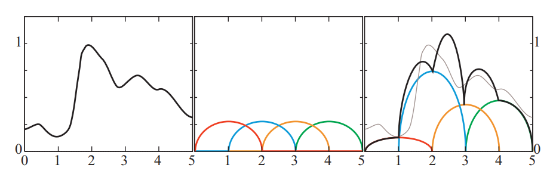

一般来说，当我们讨论函数空间中的一组基底时，我们的意思是：存在这样的一组函数，它们的线性组合（加权和求和操作）可以用来表示给定域中的其他函数。图10.18展示了这个概念的一个例子。本小节的剩余部分，将讨论一些可以用于近似球面函数的基底选择。

#### 球面径向基函数

使用GPU硬件过滤的表格方法，其重建质量较低，这种较低的重建质量，在一定程度上是由插值样本时所使用的双线性函数造成的。可以使用其他函数来对样本进行加权重建，这样的函数可以产生比双线性滤波更高质量的结果，而且它们可能还会具有其他的一些优点。一类经常用于此目的的函数就是球面径向基函数（spherical radial basis function，SRBF），这些函数都是径向对称的（沿轴旋转对称），因此这些函数都只有一个输入参数，即函数所指方向与计算方向之间的夹角。基底就是由一组这样的函数所组成的，每个函数都被称为一个波瓣（lobe），它们分布在整个球面上。每个函数都由波瓣的一组参数进行表示，这个参数集合可以包含它们的方向，但是这样会使得投影过程变得更加困难（需要非线性的全局优化）。因此，我们通常会假定波瓣的方向是固定的，它们均匀地分布在整个球体上；并使用一些其他的参数，例如每个波瓣的大小或者每个波霸所覆盖的角度（分布）。通过在给定方向上，对所有波瓣进行计算，并将结果进行求和，从而完成重建过程。

#### 球面高斯函数

球面高斯分布（spherical Gaussian，SG）是一种十分常见的SRBF波瓣，在方向统计（directional statistic）中也被称为von-Mises-Fisher分布。需要注意的是，von-Mises-Fisher分布通常都会包含一个归一化常数，我们在方程中会避免使用这个常数。单个波瓣可以定义为：

$$
G(\mathbf{v}, \mathbf{d}, \lambda)=e^{\lambda(\mathbf{v} \cdot \mathbf{d}-1)}
\tag{10.17} 
$$

其中$\mathbf{v}$是需要计算的方向，它是一个单位向量；$\mathbf{d}$是波瓣的方向轴，即分布的平均方向，同样也是一个单位向量；其中的$\lambda \ge 0$，它代表了波瓣的尖锐程度，即控制了波瓣的角宽度（angular width），也被称为集中参数（concentration parameter）或者扩散参数（spread）\[1838]。

为了构造球面基底，我们会使用给定数量的球面高斯函数的线性组合：

$$
F_{G}(\mathbf{v})=\sum_{k} w_{k} G\left(\mathbf{v}, \mathbf{d}_{k}, \lambda_{k}\right)
\tag{10.18} 
$$

将一个球面函数投影（编码）到这种表示方法中，需要找到一组参数集合$\{w_k, \mathbf{d}_k， λ_k\}$，来使得重建误差最小化。这个过程通常会通过数值优化的方法来完成，通常会使用一个非线性的最小二乘优化算法（例如Levenberg-Marquardt法）。需要注意的是，如果我们允许在优化过程中改变整个参数集合，那么我们就不会使用函数的线性组合来构造基底，此时方程10.18并不代表一组基底。只有当我们选择一组固定的波瓣（固定的方向和固定的扩散角度）时，才能获得一个适当的基底，从而很好地覆盖整个定义域\[1127]，并且只需要对权重$w_k$进行拟合就可以完成投影过程。这样做也大大简化了优化问题，因为现在它可以使用普通的最小二乘法来进行优化。如果我们需要在不同的数据集（投影函数）之间进行插值，这也是一个很好的解决方案，对于这种情况而言，允许波瓣方向和波瓣锐度能够发生变化的坏处是很大的，因为这些参数是高度非线性的，很难进行拟合。

这种表示方法的一个优点是，在SG上进行的许多操作都有简单的解析形式，两个球面高斯函数的相乘，会产生另一个球面高斯函数\[1838]：

$$
G_{1} G_{2}=G\left(\mathbf{v}, \frac{\mathbf{d}^{\prime}}{\left\|\mathbf{d}^{\prime}\right\|}, \lambda^{\prime}\right),
$$

其中：

$$
\mathbf{d}^{\prime}=\frac{\lambda_{1} \mathbf{d}_{1}+\lambda_{2} \mathbf{d}_{2}}{\lambda_{1}+\lambda_{2}}, \quad \lambda^{\prime}=\left(\lambda_{1}+\lambda_{2}\right)\left\|\mathbf{d}^{\prime}\right\|.
$$

球面高斯函数在球面上的积分，也可以使用解析方法来进行计算：

$$
\int_{\Omega} G(\mathbf{v}) d \mathbf{v}=2 \pi \frac{1-e^{2 \lambda}}{\lambda}
$$

这意味着对两个球面高斯函数的乘积进行积分，也有一个很简单的方程。

如果我们能够将光线的radiance表示为一个球面高斯函数，那么可以将其与一个BRDF（以相同的形式进行编码）相乘，然后再对乘积进行积分，从而进行光照计算\[1408, 1838]。由于这些原因，SG在许多研究项目\[582, 1838]和工业应用中得到了应用\[582, 1838]。（译者注：3D Gaussian Splatting）

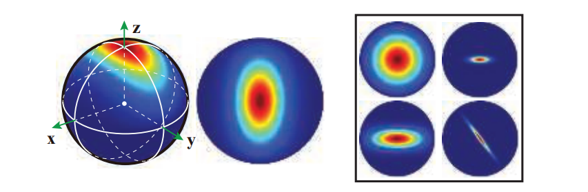

对于平面上的高斯分布而言，可以将von Mises-Fisher分布进行推广，从而允许各向异性。Xu等人\[1940]引入了各向异性的球面高斯函数（anisotropic spherical Gaussians，ASG），如图10.19所示，它是通过在单个方向$\mathbf{d}$上，增加两个补充轴$\mathbf{t
}$和$\mathbf{b
}$来实现的，它们共同形成一个正交的切线坐标系：

$$
G(\mathbf{v},[\mathbf{d}, \mathbf{t}, \mathbf{b}],[\lambda, \mu])=S(\mathbf{v}, \mathbf{d}) e^{-\lambda(\mathbf{v} \cdot \mathbf{t})^{2}-\mu(\mathbf{v} \cdot \mathbf{b})^{2}}
\tag{10.19} 
$$

其中的$\mu,\lambda \ge 0$，它们控制了波瓣沿切线坐标系（$\mathbf{t
}$和$\mathbf{b
}$）的扩散程度；其中$S(\mathbf{v}, \mathbf{d})=(\mathbf{v} \cdot \mathbf{d})^{+}$是一个平滑项，这个平滑项是方向统计中的Fisher-Bingham分布与计算机图形学中所使用的ASG的主要区别。Xu等人还提供了积分算子、乘积算子和卷积算子的解析近似。

虽然SG具有许多令人满意的特性，但是它们具有这样的一个缺点，与表格形式和具有有限范围（带宽）的一般内核不同，SG具有全局支持（global support）的特性，即每个波瓣都会对球面上的任意一个方向产生影响。即使每个波瓣的衰减速度都很快，但是球体上的每个波瓣都是非零的。这个全局范围意味着，如果我们使用$N$个波瓣来表示一个函数，那么对于任意一个需要重建的计算方向，我们都需要对所有的$N$个波瓣进行计算，才能获得最终的重建结果。

#### 球谐函数

> 我们在这里所讨论的基函数，更恰当的名称应当是“实数球谐函数”，因为它们表示了复数球谐函数的实部。

球谐函数（spherical harmonic，SH）是球面上的一组正交的基函数。一组基函数的正交集（orthogonal set）具有如下特点：任意两个不同基函数之间的内积（inner product）为零。内积是一个类似于点积的概念。两个向量之间的内积就是它们的点积，即各个分量对应相乘再相加的结果。我们可以类似地推导出两个函数的内积的定义，即将这两个函数相乘再进行积分，其数学表达如下：

$$
\left\langle f_{i}(x), f_{j}(x)\right\rangle \equiv \int f_{i}(x) f_{j}(x) d x
\tag{10.20} 
$$

上述方程是在相关定义域上进行积分的，即$ x
  $轴上。对于图10.18所示的函数，其相关的定义域位于$x$轴上的0-5之间（请注意，图10.18所展示的基函数并不是正交的）。对于球面函数而言，定义域有所不同，但是基本的形式和概念都是相同的：

$$
\left\langle f_{i}(\mathbf{n}), f_{j}(\mathbf{n})\right\rangle \equiv \int_{\mathbf{n} \in \Theta} f_{i}(\mathbf{n}) f_{j}(\mathbf{n}) d \mathbf{n}
\tag{10.21} 
$$

其中$\mathbf{n} \in \Theta$代表了在单位球面方向上进行积分。

标准正交集（orthonormal set）也是一个正交集，其附加条件是该集合中的任意一个函数与自身的内积都为1。更加正式的表述方式为，一组函数$\{f_j()\}$是标准正交的条件是：

$$
\left\langle f_{i}(), f_{j}()\right\rangle=\left\{\begin{array}{ll}0, & \text { where } i \neq j, \\ 1, & \text { where } i=j .\end{array}\right.
\tag{10.22} 
$$

图10.20展示了一个类似于图10.18的例子，不同之处在于，其中的基函数都是标准正交的。请注意，图10.20中的所展示的标准正交基函数都是互不重叠的，这个条件对于非负函数的标准正交集合是十分必要的，因为任何的重叠都意味着内积非零。而对于那些在部分范围内为负的基函数，则可以发生重叠，它们仍然可以形成标准正交集。这种重叠通常会得到更好的近似结果，因为它允许使用更加平滑的基底。而那些互不重叠的基函数，往往会导致近似结果的不连续性。

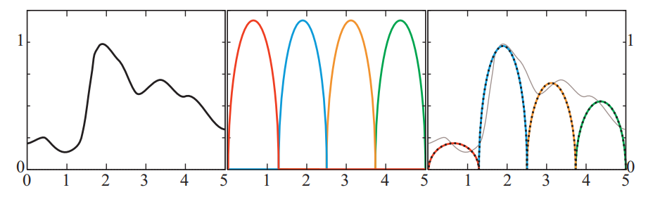

标准正交基的优点在于，想要找到最接近目标函数的近似值十分简单。为了完成投影操作，每个基函数的权重系数都是目标函数$ f_{\text {target }}()  $与相应基函数的内积：

$$
\begin{array}{c}k_{j}=\left\langle f_{\text {target }}(), f_{j}()\right\rangle, \\[2mm]
 f_{\text {target }}() \approx \sum_{j=1}^{n} k_{j} f_{j}() .\end{array}
 \tag{10.23} 
$$

在实践中，这个积分只能通过数值方法来进行计算，通常会使用蒙特卡罗采样，对平均分布在球面上的$n$个方向进行计算，然后再取平均值。

标准正交基在概念上类似于章节4.2.4中所介绍的三维向量的“标准基底（standard basis）”。不同之处在于，标准基的目标并不是函数，而是一个点的位置；标准基由三个向量组成（每个维度一个向量），而不是一组函数。根据方程10.22中使用的定义，标准基也是标准正交的。将一个点投影到标准基上的方法也是一样的，每个权重系数都是位置向量和基向量点积的结果。这里有一个十分重要的区别，那就是标准基可以精确地再现每个点，而一组有限的基函数只能对目标函数进行近似。由于标准基使用了三个基向量来表示三维空间，而函数空间所具有的维度是无限的，因此有限数量的基函数永远无法完美地表示函数空间中的信息。也就说，对于有限数量的基函数，其近似结果永远都不可能是精确的。

球谐函数函数都是正交或者标准正交的，它们还具有其他一些优点。球谐函数是旋转不变的，并且SH基函数的计算成本也不高，它们都是单位向量在$x-$、$y-$、$z-$坐标中的简单多项式。然而，与球面高斯函数一样，它们都具有全局支持的特点，因此在重建的过程中，需要对所有的基函数都进行计算。有关基函数的表示方法可以在一些参考文献中找到，包括Sloan\[1656]的一篇演讲。他的演讲十分值得关注，因为他讨论了许多使用球谐函数的实用技巧，包括方程以及一些着色器代码。最近，Sloan还提出了一些方法，来对高效完成SH的重建过程\[1657]。

SH基函数可以按照频带（frequency band）进行排列。第一个基函数是一个常数；接下来的三个基函数是线性函数，它们会在球面上缓慢变化；再接下来的五个基函数是变化稍快的二次函数，如图10.21所示。频率较低的函数（即在球面上变化缓慢的函数），例如irradiance等，可以用相对较少的SH系数来精确地进行表示（我们将在章节10.6.1中看到）。

当投影到球谐函数的时候，所获得的系数代表了投影函数在各个频率上的振幅（amplitude），即其频谱（frequency spectrum），它代表了信号或者波形中各个频率成分中的强度分布。在这个光谱域（spectral domain）中，有这样一个基本的性质：两个函数乘积的积分等于函数投影系数的点积。这个特性能够使我们能够高效地计算光照积分。

球谐函数的许多运算在概念上十分简单，可以将其归结为对系数向量的矩阵变换\[1657]。在这些操作中，有几个操作是很重要的，它们分别是：计算投影到球谐函数上的两个函数的乘积、旋转投影函数、计算卷积。在实际操作中，SH中的矩阵变换意味着，这些操作的复杂度与所使用的系数数量呈二次关系，这可能会是一个很大的复杂度。但幸运的是，这些矩阵通常都具有一些特殊结构，可以利用这些结构设计出效率更高的算法。Kautz等人\[869]提出了一种优化旋转计算的方法，它将旋转分解为关于$x$轴和关于$z$轴的两次旋转。Hable \[633]给出了一种快速旋转低阶SH投影的常用方法。Green的综述\[583]讨论了如何利用旋转矩阵的块结构，来实现更快的计算。目前，最先进的技术（the state of the art）是由Nowrouzezahrai等人\[1290]提出的，他将SH分解为球带谐波（zonal harmonic）。

光谱变换（例如球谐函数和H-basis）的一个常见问题是，它们会表现出一种叫做ringing的视觉瑕疵（也称为Gibbs现象）。如果原始信号中包含了无法使用带限（band-limited）近似来表示的快速变化，那么在重建的时候就会出现振荡瑕疵。在极端情况下，这个重建出来的函数甚至可能会产生负值。当然这个问题是有解决方法的，可以使用各种预过滤方法来解决这个问题\[1656, 1659]。

#### 其他球面表示

还有许多其他的表示方法，也可以使用有限数量的系数来对球面函数进行编码。线性变换余弦（章节10.1.2）就是其中一个例子，它可以有效地对BRDF函数进行近似，同时易于在球面的多边形截面上进行积分。

球面小波（spherical wavelet）\[1270, 1579, 1841]是一种具有平衡空间局部性（具有紧支撑，compact support）和频率局部性（平滑性）的基底，它可以用于高频函数的压缩表示。球面分段常数基函数（spherical piecewise constant basis function）\[1939]将球面划分为常数值的区域；依赖于矩阵分解的双聚类近似（biclustering approximation）\[1723]也被用于环境光照。

### 10.3.3 半球基底

尽管上面所介绍的基底都可以用来表示半球函数，但是它们太过浪费，因为总有一半的信号为零。在这些情况下，我们通常会更加倾向于使用直接在半球域上构造的表示方法，这对那些定义在表面上的函数而言特别相关，常见的例子包括：BRDF、入射radiance、到达物体某一点的irradiance等。这些函数天然局限于以给定着色点为中心，并与表面法线对齐的半球范围内，它们都不会指向物体内部。

#### AHD基底

沿着这个思路，一种最简单的表示方法就是将一个常数函数，与半球面上信号最强的单一方向结合起来。它通常被称为环境/高光/方向（ambient/highlight/direction，AHD）基底，它最多的用途就是用来存储irradiance。AHD的名字体现了各个分量的含义：A代表一个恒定的环境光；H代表一个方向光，它用于近似“高光”方向上的irradiance；D代表大部分入射光所集中的方向。AHD基底通常需要存储8个参数，其中两个参数代表了角度，用于表示方向向量；另外六个参数（两个RGB颜色）用于环境光强度和方向光强度。它的首次显著应用是在游戏《雷神之锤3》中，动态物体的体积光照就是以这种方式进行存储的。从那时起，它便被广泛应用于许多游戏中，例如《使命召唤》系列。

想要投影到这种表示方法上有些棘手，因为它是非线性的，对于给定的输入，想要找到其最优的近似参数，具有很高的计算成本。在实践中，通常会使用一些启发式方法。该信号首先会被投射到球谐函数上，并使用最优的线性方向来确定余弦波瓣的方向。有了这个方向，可以使用最小二乘法来计算环境光和高光。Iwanicki和Sloan \[809]展示了如何在保证非负性的同时，来执行这个投影操作。

#### 辐射法向映射/《半条命2 》基底

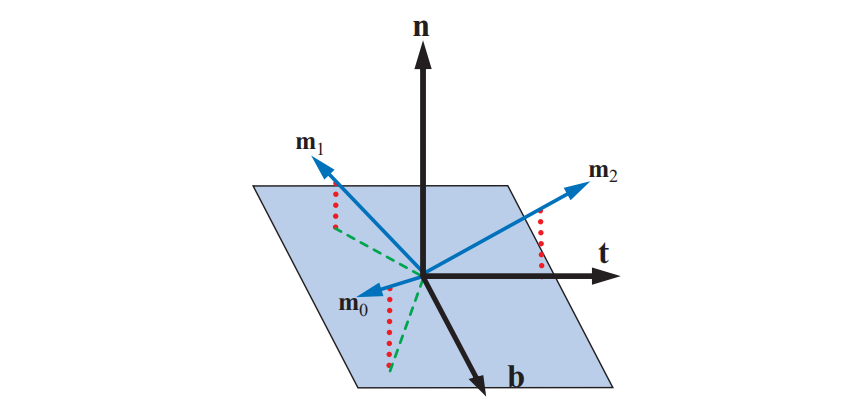

Valve在《半条命2》系列游戏中\[1193, 1222]使用了一种十分新颖的表示方式，用于表示定向irradiance，它被称为辐射法向映射（radiosity normal mapping）。其最初的设计目的是为了存储预计算的漫反射光照，同时允许使用法线映射，它现在通常被称为《半条命2》基底。它通过在切线空间中采样三个方向来表示表面上的半球函数，如图10.22所示。三个相互垂直的基向量在切线空间中的坐标分别为：

$$
\mathbf{m}_{0}=\left(\frac{-1}{\sqrt{6}}, \frac{1}{\sqrt{2}}, \frac{1}{\sqrt{3}}\right), \quad \mathbf{m}_{1}=\left(\frac{-1}{\sqrt{6}}, \frac{-1}{\sqrt{2}}, \frac{1}{\sqrt{3}}\right), \quad \mathbf{m}_{2}=\left(\frac{\sqrt{2}}{\sqrt{3}}, 0, \frac{1}{\sqrt{3}}\right).
 \tag{10.24} 
$$

在重建的时候，对于一个给定的切线空间方向$\mathbf{d}$，我们可以沿着基向量的方向，对$E_0$，$E_1$，$E_2$进行插值，其数学表达如下：

$$
E(\mathbf{n})=\dfrac{\sum_{k=0}^{2} \max \left(\mathbf{m}_{k} \cdot \mathbf{n}, 0\right)^{2} E_{k}}{\sum_{k=0}^{2} \max \left(\mathbf{m}_{k} \cdot \mathbf{n}, 0\right)^{2}}.
 \tag{10.25} 
$$

> GDC 2004中给出的表达形式是不正确的，方程10.25中的形式来自于SIGGRAPH 2007的演示文稿\[579]。

Green指出\[579]，如果在切线空间方向$\mathbf{d}$上预先计算以下三个值，则可以显著降低方程10.25的计算量：

$$
d_{k}=\dfrac{\max \left(\mathbf{m}_{k} \cdot \mathbf{n}, 0\right)^{2}}{\sum_{k=0}^{2} \max \left(\mathbf{m}_{k} \cdot \mathbf{n}, 0\right)^{2}},
 \tag{10.26} 
$$

其中$k=0,1,2$，因此方程10.25可以简化为如下形式：

$$
E(\mathbf{n})=\sum_{k=0}^{2} d_{k} E_{k}
 \tag{10.27} 
$$

Green总结了这种表示方法的其他几个优点，其中一些将在章节11.4中进行讨论。

《半条命2》基底可以很好地用于表示定向irradiance。Sloan \[1654]发现这种表示所产生的结果要优于低阶的球谐函数。

#### 半球谐波/H-Basis

Gautron等人\[518]将球谐函数特化到半球域上，他们称之为半球谐波（hemispherical harmonic，HSH）。有很多种方法可以实现这种特化。

例如：Zernike多项式是类似于球谐函数一样的正交函数，但是它是定义在单位圆盘上的。与SH一样，这些函数也可以用于对频域（频谱）函数进行变换，这会产生许多很方便的性质。由于我们可以将一个单位半球转换为一个圆盘，因此我们可以用Zernike多项式来表示半球函数 \[918]。然而，使用这些数据来进行重建的计算成本很高。Gautron等人的解决方案具有较低的计算开销，同时还允许对系数向量使用矩阵乘法，来进行相对较快的旋转操作。

然而，HSH基底的计算开销仍然要比球谐函数更高，因为它是通过将球体的负极移动到半球的外边缘来构建的。这种移位操作使得基函数不再是一个多项式，在计算过程中涉及除法和平方根运算，这在GPU硬件上通常会很慢。此外，在半球边缘处的基底总是不变的，因为它在移位之前会被映射到球体上的一个极点。在边缘附近的近似误差可能会很大，尤其是当只使用少数几个系数（球谐函数的频带）时。

Habel \[627]引入了H-Basis，它在经度参数化中使用了部分球谐函数基底，在纬度参数化中使用了部分HSH基底。这个基底混合了移位版本的SH和非移位版本的SH，它仍然是正交的，同时计算效率更高。

## 10.4 环境映射

将一个球面函数记录在一个或者多个图像中的做法，被称为环境映射（environment mapping），因为我们通常会使用纹理映射来实现对表格的查找。这种表现形式是目前最强大且最流行的环境光照形式之一。与其他球面表示方法相比，虽然它占据了更多的内存，但是这种方法的实时解码过程十分简单、速度很快。此外，它可以表达任意高频的球面信号（通过增加纹理分辨率即可），并且能够准确捕捉任何范围内的环境radiance（通过增加每个通道的bit即可）。但是这种准确性是有代价的，与存储在其他常用纹理中的颜色和着色器属性不同，存储在环境贴图中的radiance值通常都具有高动态范围（HDR）。每个纹素会使用更多的bit，这意味着环境贴图往往要比其他纹理占用更多的存储空间，并且其访问速度要更慢。

对于任何的全局球面函数，我们都有这样的一个基本假设：场景中所有物体的入射radiance $L_i$都只依赖于方向这一个参数。这个假设要求物体与被反射的光线位于很远的地方，并且不会发生自反射现象（将自身反射的光线再次反射）。

依赖于环境映射的着色技术，其典型特征并不是它们表现环境光照的能力，而是我们如何将它们与给定的材质整合在一起。也就是说，为了进行积分，我们必须对BRDF采用哪种方式的近似和假设？反射映射（reflection mapping）是环境映射中最基本的一种情况，在这种情况下，我们会假设BRDF是一个完美的镜面。一个光学平面或者镜面会将入射光线反射到光线的反射方向$\mathbf{r}_{i}$上（章节9.5）。类似地，出射radiance只来源于一个方向上的入射radiance，即反射的观察向量$\mathbf{r}$，该向量的计算方法与$\mathbf{r}_{i}$相同（方程9.15）：

$$
\mathbf{r}=2(\mathbf{n} \cdot \mathbf{v}) \mathbf{n}-\mathbf{v}
\tag{10.28} 
$$

这样可以大大简化镜面的反射方程：

$$
L_{o}(\mathbf{v})=F(\mathbf{n}, \mathbf{r}) L_{i}(\mathbf{r})
\tag{10.29} 
$$

其中$F$是菲涅尔项（详见章节9.5）。请注意，与基于半向量的BRDF中的菲涅尔项（使用半向量$\mathbf{h}$与$\mathbf{l}$或者$\mathbf{v}$之间的夹角）不同，方程10.29中的菲涅尔项使用了表面法线$\mathbf{n}$与反射向量$\mathbf{r}$之间的夹角（与表面法线$\mathbf{n}$与观察向量$\mathbf{v}$之间的夹角相同）。

由于入射radiance $L_i$只与方向有关，因此可以将其存储在一个二维表格中。这种表示方法能够让我们对一个具有任意入射radiance分布和一个具有任何形状的镜面进行高效照明，我们通过计算每个着色点所对应的反射向量$\mathbf{r}$，并在表中查找对应radiance来实现这个操作。Blinn和Newell \[158]引入了这个表格，并将其称为环境贴图（environment map），如图10.23所示。

 转换为纹理坐标，从而检索环境贴图所存储的radiance。")

反射映射算法的步骤如下：

-   生成或者加载表示环境的纹理贴图。
-   对于包含反射物的每个像素，计算物体表面位置上的法线。
-   根据观察向量和表面法线，计算反射的观察向量。
-   使用反射观察向量来计算环境贴图的索引，通过这个索引来获取入射radiance值。
-   使用来自环境贴图的纹素数据，来作为方程10.29中的入射radiance。

环境映射有一个潜在障碍值得一提，在使用环境映射的时候，平坦表面通常无法很好地工作。这是因为平面所反射出来的光线差异通常不会超过几度，这些反射方向紧密的聚集在一起，会导致环境贴图中的一小部分被映射到一个相对较大的表面上。使用章节11.6.1中所讨论的那些利用radiance发射位置信息的技术，可以获得更好的结果。此外，如果我们已知一个表面是完全平坦的（例如地板），我们完全可以使用实时的平面反射技术来进行实现（章节11.6.2）。

使用纹理数据来对场景进行照明的想法，也称为基于图像的光照（image-based lighting，IBL），这种环境贴图通常是从现实世界中的场景获得的，一般会使用相机来捕获360度全景的、高动态范围的图像\[332, 1479]。

将环境映射与法线映射组合使用特别有效，可以产生丰富的视觉效果，如图10.24所示。这些特性的组合在历史上也十分重要（译者注：可能体现在PS3时代游戏画面上的油腻感）。一种受限的凹凸环境映射首次在消费级图形硬件中使用了依赖纹理读取（章节6.2），这使得这种能力成为像素着色器的一部分。

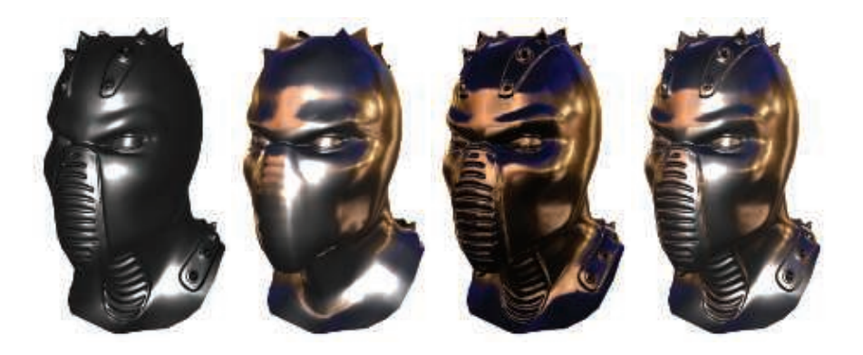

有各种各样的投影函数可以将反射观察向量存储到一个或者多个纹理中。我们将在本小节中讨论一些比较流行的映射方法，并指出每种映射的优缺点。\[218]

### 10.4.1 **经纬度映射**

1976年，Blinn和Newell \[158]实现了第一个环境映射算法。他们所使用的映射方式与地球上所使用的纬度/经度系统相类似，这也就是为什么这种技术通常会被称为纬度-经度映射（latitude-longitude mapping）或者lat-long映射。他们的方案并不像是一个从外面进行观察的地球仪，而更像是夜空中的星座地图。就像地球仪上的信息可以被平展到Mercator投影或者其他投影地图上一样，空间中一个点周围的环境也可以被映射到纹理上。在计算特定表面位置上的反射观察向量时，这个向量会被转换为球坐标$(\rho, \phi)$。这里的$\phi$相当于经度，其弧度值在$[-\pi,\pi]$之间变化；$\rho$相当于纬度，其弧度值在$[0,π]$之间变化。球坐标$(\rho, \phi)$可以由方程10.30计算而来，其中$\mathbf{r} = (r_x, r_y, r_z)$是归一化的反射观察向量，$z$轴正方向指向上方：

$$
\rho=\arccos \left(r_{z}\right) \quad and \quad \phi=\operatorname{atan} 2\left(r_{y}, r_{x}\right).
\tag{10.30} 
$$

有关$\operatorname{atan2}$的描述，详见章节1.2。在获得对应的球坐标之后，使用这些值来访问环境贴图，并检索在反射观察方向上所看到的颜色。请注意，这里所描述的经纬度映射与Mercator投影并不相同，经纬度映射会保持纬度线之间的距离恒定，而Mercator投影的纬度线距离会在两极处趋于无穷大。

在将一个球体展开为一个平面的时候，总是会发生一些变形，尤其是在不允许多次切割的情况下，而且每种投影方法在保持面积、距离和局部角度之间都有自己的权衡。这种映射方法的一个问题，球面上的信息密度是非常不均匀的。在图10.25顶部和底部的极端拉伸中可以看到这种情况，相较于靠近赤道的区域，在靠近两极的区域上会有更多数量的纹素。这种扭曲会带来一定的问题，首先它无法产生最高效的编码，其次在使用硬件进行纹理滤波的时候也会产生瑕疵，尤其是在两极处。滤波核不会随着纹理一起进行拉伸，因此会在具有较高纹素密度的区域过度收缩。还需要注意的是，虽然这个投影操作在数学上很简单，但是实际执行起来的效率可能会很低，因为诸如反余弦（arccosine）这样的超越函数（transcendental function），在GPU上的计算成本会很高。这里的超越函数是指：一种在数学中无法用有限次基本代数运算（加、减、乘、除和开方）进行表示的函数。

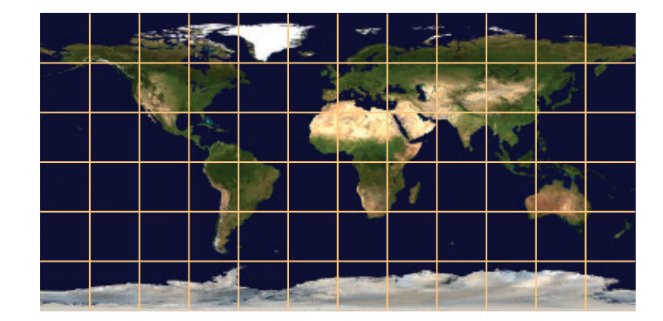

### 10.4.2 球面映射

球面映射（sphere mapping）是第一个在商业图形硬件中所使用的环境映射技术，它最初是由Williams \[1889]提出的，并由Miller和Hoffman \[1212]独立开发而来的。这个纹理图像来自于环境的外观，就像是在一个完全反射的球体中，以正交投影的方式来进行观察的那样，所以这个纹理也被称为球面贴图（sphere map）。一种制作真实环境球面贴图的方法是，对着一个闪亮的球体（例如圣诞树装饰品）进行拍摄，如图10.26所示。

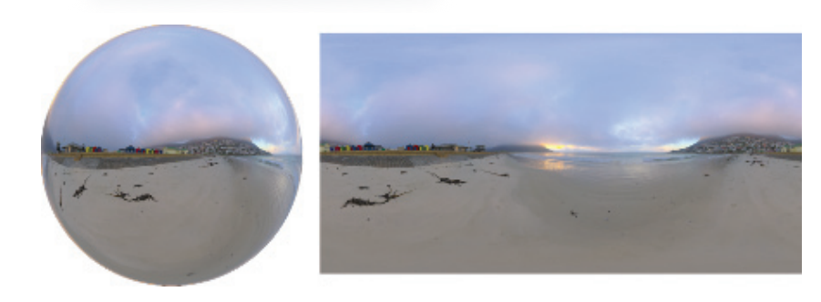

由此产生的圆形图像也称为光照探针（light probe），因为它捕获了球体所在位置的光照情况。即使我们在运行过程中使用其他的编码方法，拍摄球形探针也是一种捕捉基于图像照明的有效方法。我们总是能够在球面投影和其他形式之间进行转换，例如稍后我们所讨论的立方体映射（章节10.4.3），前提是捕获的图像有足够的分辨率来克服不同方法之间的失真差异。

反射球只会在球的正面显示整个环境。它会将每个反射观察方向映射到球面二维图像上的一个点。假设我们看向另一个方向，即球面贴图上给定的一个点，我们需要计算反射的观察方向。为了实现这一点，我们首先会获取该点上的球面法线，然后再生成反射的观察方向。在检索的时候我们会反转这个过程，通过反射的观察方向来获得球面上的具体位置，因此我们需要推导球面上的表面法线，然后才能得到访问球面贴图所需的$(u, v)$参数。

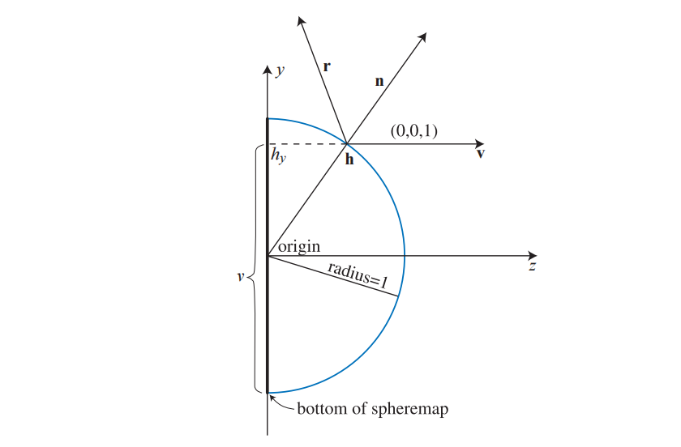

球面上的法线，是反射观察向量$\mathbf{r}$与原始观察向量$\mathbf{v}$之间的半角向量，这里的原始观察向量$\mathbf{v}$在球面贴图空间中为$(0,0,1)$，如图10.27所示。因此这里的球面法线$\mathbf{n}$是原始观察向量$\mathbf{v}$和反射观察向量$\mathbf{r}$的和，即$\left(r_{x}, r_{y}, r_{z}+1\right)$，将这个向量归一化，就可以得到单位球面法线：

$$
\mathbf{n}=\left(\frac{r_{x}}{m}, \frac{r_{y}}{m}, \frac{r_{z}+1}{m}\right), \ \text{ where} \quad m=\sqrt{r_{x}^{2}+r_{y}^{2}+\left(r_{z}+1\right)^{2}}.
\tag{10.31} 
$$

如果这个球体位于原点处，并且半径为1，那么单位法线的坐标实际上就是这个法线在球面上的位置$\mathbf{h}$。我们并不需要知道$h_z$，因为$(h_x, h_y)$已经能够描述球面图像上的一个点了，其中每个值都在$[- 1,1]$的范围内。为了能够访问球面贴图，我们需要将坐标映射到$[0,1)$范围内，因此要将坐标分别除以2并再加上0.5，即：

$$
m=\sqrt{r_{x}^{2}+r_{y}^{2}+\left(r_{z}+1\right)^{2}}, \\[3mm] u=\frac{r_{x}}{2 m}+0.5, \\[3mm] v=\frac{r_{y}}{2 m}+0.5
\tag{10.32} 
$$

与经纬度映射相比，球面映射的计算过程要简单得多，并且只会有一个位于图像圆边缘的奇异点。球面映射的缺点是，球面贴图纹理所捕获的环境视图仅对单一的观察方向有效。这个纹理确实捕获了整个环境中的光照信息，因此可以根据新的观察方向，重新计算一个纹理坐标，但是这样做可能会导致一些视觉瑕疵，因为球面贴图的一小部分会因为新的观察方向而被放大，同时边缘周围的奇点也会变得更加明显。在实践中，我们通常假设球面贴图会跟随相机一起运动，并在观察空间中进行操作。

由于球面贴图被定义为固定的观察方向，原则上球面贴图上的每个点不仅定义了反射方向，还定义了表面法线的方向，如图10.27所示。对于任意各向同性的BRDF而言，可以求解其反射方程，并将结果存储在球面贴图中，这种BRDF可以包括漫反射、镜面反射、逆反射和其他项。只要光照和观察方向是固定的，那么球面贴图就是正确的。只要球体的BRDF是均匀且各向同性的，那么还可以使用在实际照明下，真实球体的摄影图像来作为球面贴图。

还可以索引两个球面贴图，一个存储反射向量，另一个存储表面法线，从而模拟镜面反射和漫反射环境效果。如果我们根据表面材质的颜色和粗糙度，来调整存储在球面贴图中的值，我们就获得了一种廉价的技术，它可以生成令人信服的材质效果，尽管这个材质效果与观察方向无关。这种方法被雕塑软件Pixologic ZBrush推广为“MatCap”着色，如图10.28所示。

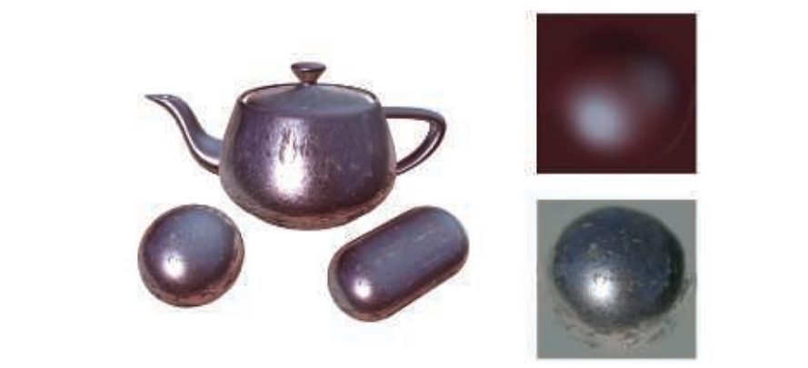

### 10.4.3 立方体映射

1986年，Greene \[590]引入了立方体环境贴图（cubic environment map），但是通常会将其称为立方体贴图（cube map），它是目前最流行的方法，其投影操作可以直接在现代GPU硬件上实现。通过将环境投影到以相机位置为中心的立方体侧面，来创建一个立方体贴图，然后将立方体表面上的图像用作环境贴图，如图10.29和图10.20所示。立方体贴图通常会以“交叉”图的形式呈现，即将立方体展开到一个平面上。然而在硬件实现的时候，立方体贴图会被存储为6个正方形纹理，而不是将立方体展开后的平面直接存储为一个大的矩形纹理，因此并不会浪费存储空间。

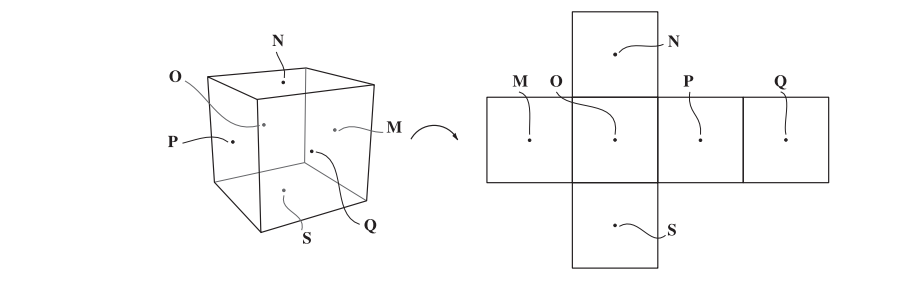

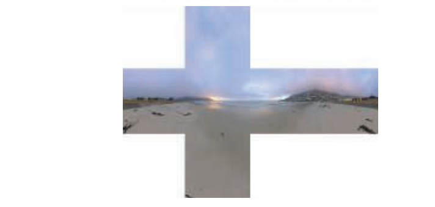

可以将相机放置在立方体的中心，然后以$90^{\circ}$的视场角（FOV）看向每个立方体表面，依次进行渲染从而创建一个立方体贴图，如图10.31所示。为了能够从真实世界中生成立方体贴图，通常会将专用相机拍摄而来的（或者拼接而来的）球形全景图，投影到立方体贴图的坐标系中。

与球面映射不同，立体体环境映射是与视角无关的。立方体贴图具有比经纬度映射更加均匀的采样特征，经纬度映射往往会在两极处过度采样（相对于赤道地区而言）。Wan等人\[1835, 1836]提出了一种被称为等立方体（isocube）的映射方法，它比立方体映射具有更低的采样率差异，同时仍然利用立方体映射的纹理硬件来提高性能表现。

访问立方体贴图的方法非常简单，可以直接将输入向量作为一个三分量的纹理坐标，在其所指的方向上获取数据。因此，对于反射而言，我们可以直接将反射方向$\mathbf{r}$传递给GPU，甚至不需要将其归一化。在一些老旧的GPU上，双线性滤波可能会凸显立方体边缘处的缝隙，因为那时的纹理硬件无法在不同的立方体表面之间进行正确地过滤（执行这个操作的开销很大）。为了避免这个问题，研究人员开发了一些技术，例如让视图投影更宽一些，这样单个立方体表面就可以包含这些相邻的纹素了。但是，所有现代的GPU都可以正确地执行这种过滤操作，因此这些方法不再是必须的了。

### 10.4.4 其他投影方法

如今，立方体贴图是最流行的环境光照表格表示方法，原因是其通用性（versatility）、再现高频细节的准确性、以及在GPU上的执行速度很快。但是，还有一些其他的投影方法值得一提。

Heidrich和Seidel \[702, 704]提出使用两个纹理来进行双抛物面环境映射（dual paraboloid environment mapping）。这个想法类似于球面映射，但是它并不是通过记录环境在球面上的反射信息来生成纹理的，而是使用了两个抛物线投影。每个抛物面都会创建一个类似于球面贴图的圆形纹理，每个圆形纹理都会覆盖一个环境半球。

与球面映射一样，反射观察向量是在贴图的基底上计算的，即在贴图的参考坐标系中进行计算的。反射观察向量的$z$分量的符号，用于决定访问具体哪一个纹理。这个访问函数为：

$$
u=\frac{r_{x}}{2\left(1+r_{z}\right)}+0.5, \quad v=\frac{r_{y}}{2\left(1+r_{z}\right)}+0.5
\tag{10.33} 
$$

方程10.33用于正面图像；同理，当$r_{z}$的符号取反时，则用于背面图像。

与球面贴图相比，抛物线贴图具有更加均匀的环境采样，甚至均匀性可以与立方体贴图相比。但是，当在两个投影之间的接缝处进行采样和插值的时候，必须十分小心，这使得访问双抛物面环境贴图的成本很高。

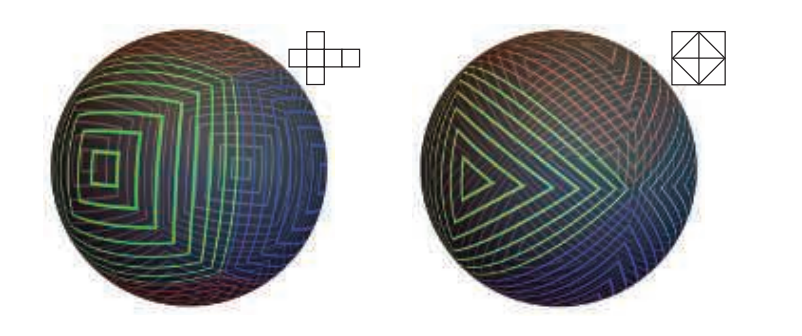

八面体映射（octahedral mapping）\[434]是另一个值得注意的投影方法。它没有将周围的球面环境映射到一个立方体中，而是映射到了一个八面体中（如图10.32所示）。为了将这个八面体展开平铺成一个纹理，它的八个三角形面会被切开并排列在一个平面上，在理论上，将其排列成正方形结构或者矩形结构都是可以的。如果我们将其排列成正方形结构，那么访问八面体贴图的效率将会很高。对于给定的反射方向$\mathbf{r}$，我们使用$L_1$范数的绝对值来将其归一化：

$$
\mathbf{r}^{\prime}=\frac{\mathbf{r}}{\left|r_{x}\right|+\left|r_{y}\right|+\left|r_{z}\right|}
$$

如果$r_{y}^{\prime}$为正，那么我们可以使用下面的坐标来索引正方形的纹理贴图：

$$
u=r_{x}^{\prime} \cdot 0.5+0.5, \quad v=r_{y}^{\prime} \cdot 0.5+0.5
\tag{10.34} 
$$

如果$r_{y}^{\prime}$为负，那么我们则需要通过变换，来将八面体的后半部分向外“折叠”：

$$
u=\left(1-\left|r_{z}^{\prime}\right|\right) \cdot \operatorname{sign}\left(r_{x}^{\prime}\right) \cdot 0.5+0.5, \quad v=\left(1-\left|r_{x}^{\prime}\right|\right) \cdot \operatorname{sign}\left(r_{z}^{\prime}\right) \cdot 0.5+0.5
\tag{10.35} 
$$

与双抛物面环境映射不同，八面体映射并不会受到过滤问题的影响，因为参数化的接缝与所用纹理的边缘相对应。纹理的“wrap”采样模式可以自动从另一边访问纹素，并进行正确的插值。虽然八面体映射投影操作的数学计算要稍微复杂一些，但是在实践中的表现会更好。八面体贴图所引入的变形量与立方体贴图差不多，所以当立方体贴图纹理硬件不存在或者不支持的时候，八面体贴图是一个不错的选择。另外一个值得注意的用法是，仅使用两个坐标来表示三维的归一化方向，从而能够对纹理进行一定程度的压缩（详见章节16.6）。

有一种特殊情况是，环境贴图会围绕一个轴径向对称。对于这种情况，Stone \[1705]提出了一种简单的分解方法，使用一个一维纹理，存储来自对称轴子午线（meridian line）上的radiance值。后来他将这个方案扩展到二维纹理，在每一行中都存储一个环境贴图，并与不同的Phong波瓣进行预卷积。这种编码方式可以模拟大量材质，并被应用于编码从晴朗天空所发出的radiance。

## 10.5 基于图像的高光照明

环境映射最初是作为一种镜面渲染技术发展起来的，但是也可以将它扩展到光泽（glossy）反射中。当用于模拟无限远处光源的镜面效果时，这样的环境贴图也被称为高光探针（specular light probe）。之所以使用这样一个术语，是因为它捕获（探测）了场景中给定点的各个方向上的radiance，并使用这个信息来计算一般的BRDF——而不仅仅针对于纯镜面或者Lambertian表面的特殊情况。可以将环境光照存储在立方体贴图中，并使用这些立方体贴图来控制光泽材质的反射效果，这样的贴图也被叫做高光立方体贴图（specular cube map）。

为了模拟表面的粗糙度，可以对纹理中的环境光照信息进行预滤波（prefiltered）\[590]。通过对环境贴图进行模糊处理，我们可以表现出比完美镜面反射稍微粗糙一些的镜面反射效果。这种模糊处理应当以一种非线性的方式进行，即不同部分的纹理应当以不同的方式进行模糊。这种非线性处理是有必要的，因为环境贴图的纹理代表了一种到理想球面方向空间的非线性映射，两个相邻纹素中心之间的角距离是不固定的，单个纹素所覆盖的立体角也是不固定的。一些专门用于预处理立方体贴图的工具，例如AMD的CubeMapGen（现在是开源的），在对立方体贴图进行过滤的时候会考虑到这些因素。来自其他面的邻近样本会被用来创建mipmap，并且每个纹素所覆盖的角度范围也会被考虑在内。图10.33展示了这样的一个例子。

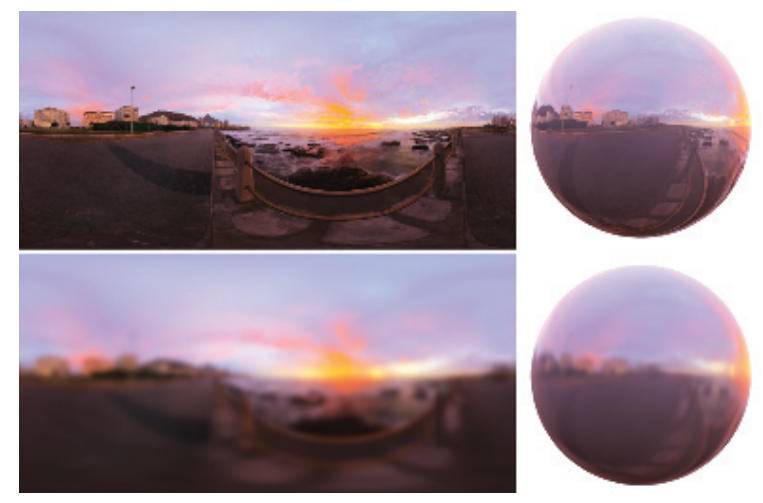

这种通过对环境贴图进行模糊，同时根据经验来近似粗糙表面的外观，这个过程与实际的BRDF没有任何联系。一个更有原则的方法是，当给定表面法线和观察方向的时候，考虑BRDF函数在球面上的形状，然后我们再使用这个分布来对环境贴图进行过滤，如图10.34所示。使用一个镜面波瓣来对环境贴图进行过滤，这并不是一件简单的事情，因为BRDF可以表现出任意的形状，这取决于其粗糙度参数、观察向量和法线方向；也就是说，至少有五个维度的输入值（粗糙度和两组极坐标角度，分别用于表示观察方向和法线方向）控制了最终的波瓣形状。为其中的每个参数组合存储多张环境贴图是不现实的。

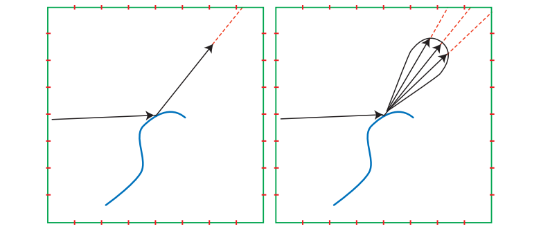

### 10.5.1 预过滤环境映射

在实际实现中，应用于光泽材质的预过滤环境光照需要使用BRDF的近似值，以便生成的纹理能够独立于观察方向和表面法线。如果我们将BRDF的形状变化限制在材质光泽度上，即只有材质的光泽度会对BRDF的形状产生影响，那么我们就可以根据不同的粗糙度参数，预计算并存储对应的环境贴图，并在运行过程中，选择一个合适的环境贴图进行使用。在实践中，这意味着我们不需要使用模糊滤波核，也可以对波瓣形状进行控制，使得这个波瓣在反射向量周围径向对称。

想象从一个给定的反射观察方向射入的一组光线，直接来自这个反射观察方向上的光线将提供最大的贡献值，随着入射光线方向与反射观察方向之间的夹角越来越大，这些光线的贡献也会越来越小。环境贴图的纹素面积与纹素的BRDF贡献值相乘，给出了该纹素的相对影响力。这个加权贡献乘上环境贴图的纹素颜色，并将结果进行求和可以获得$\mathbf{q
}$，同时也会计算加权贡献的总和$s$。最后的结果$\mathbf{q}/s$，就是在反射观察方向的波瓣上整体的颜色，将其存储在生成的反射贴图中。

如果我们使用Phong材质模型，那么这种径向对称的假设自然而然是成立的，我们几乎可以准确地计算环境光照。Phong \[1414]是根据经验来推导出这个模型的，与我们在章节9.8中所看到的BRDF相比，这个模型并没有物理依据。Phong模型和我们在章节9.8.1中讨论的Blinn-Phong BRDF  \[159]都是幂次的余弦波瓣，但是在Phong模型中，这个余弦是由反射向量（详见方程9.15）和观察向量的点积而来的；而在Blinn-Phong BRDF中，这个余弦是由半向量（详见方程9.33）和表面法线点积而来的。这使得反射波瓣是旋转对称的，详见图9.35所示。

对于一个径向对称的镜面波瓣，我们仍然无法接受的唯一效果是地平线裁剪（horizon clipping），因为它会使得镜面波瓣的形状依赖于观察方向。想象现在我们有一个闪亮的球体（其表面并不是镜面），此时如果我们观察球体表面的中心区域，就会得到一个对称的Phong波瓣。而如果我们观察球体轮廓的表面区域时，实际上波瓣的一部分必须要被切割掉，因为来自地平线以下的光线无法到达相机，如图10.35所示。这和我们之前讨论面光源近似值（章节10.1）时所看到的问题是一样的，但是在实际应用中，这种现象经常会被实时方法所忽略。忽略这个效应，会使得在掠射角度下形成过于明亮的着色效果。

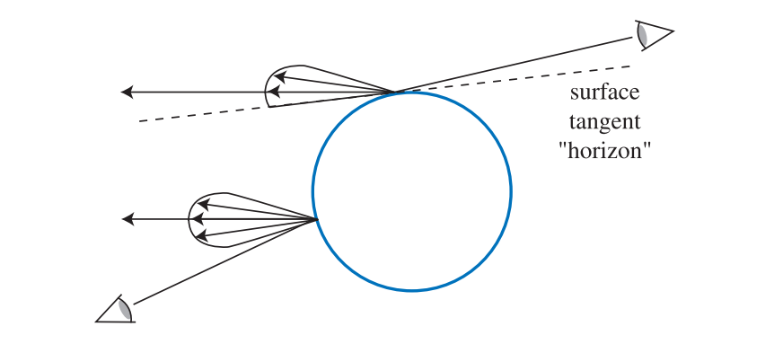

Heidrich和Seidel \[704]以这种方式，使用单个反射贴图来模拟表面的模糊性。为了适应不同的粗糙度水平，通常会使用环境立方体贴图的mipmap（章节6.2.2）。mipmap的每个级别都存储了入射radiance的模糊版本，较高级别的mipmap用于存储较为粗糙的表面，即更宽的Phong波瓣 \[80, 582, 1150, 1151]。在运行过程中，我们通过使用反射向量来索引立方体贴图，并根据所需的Phong指数（材质粗糙度）来强制选择给定的mipmap层级，如图10.36所示。

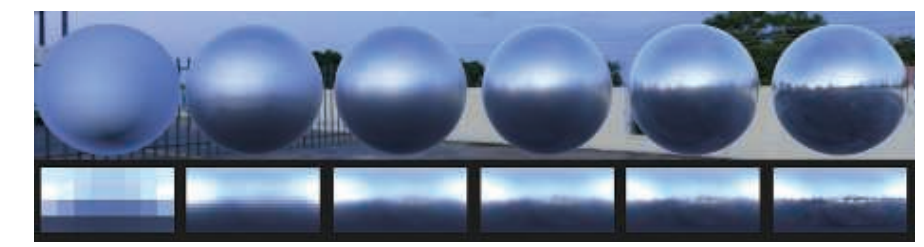

对于比较粗糙的材质，会使用较宽的滤波核来去除高频信息，因此需要使用较低的分辨率才能得到充分模糊的结果，这正好与mipmap结构完美对应。此外，通过使用GPU硬件的三线性插值，可以在预滤波的mipmap层级之间进行采样，从而模拟我们没有精确表示的粗糙度值。当与菲涅尔项结合时，这种反射贴图对于光泽表面的效果要更好。

出于性能和抗锯齿的原因，具体选择要使用哪一个mipmap层级，不仅要考虑着色点处的材质粗糙度，还要考虑屏幕像素足迹所覆盖的表面区域内的法线变化和粗糙度变化。Ashikhmin和Ghosh \[80]指出，为了获得最佳效果，应当对两个候选mipmap层级进行比较（由纹理硬件计算而来的最小化层级与当前滤波器宽度所对应的层级），并在二者中选择使用分辨率较低的那个mipmap层级。为了使得结果更加准确，还应当考虑表面方差的扩大效应，并使用一个新的粗糙度水平，这个粗糙度水平与一个BRDF波瓣项有关，这个BRDF波瓣可以视为像素足迹内的平均波瓣。这个问题与BRDF抗锯齿（章节9.13.1）完全相同，并且适用相同的解决方案。

前面提出的过滤方案都有着这样的一个假设，即对于给定的反射方向，所有的波瓣都具有相同的形状和高度。这个假设也意味着波瓣必须是径向对称的。除了上述我们提到地平线裁剪问题之外，大多数BRDF波瓣在所有角度也上并不都是均匀的、径向对称的，例如：在掠射角度下，波瓣通常会变得更尖更薄；此外，波瓣的长度通常也会随着仰角的变化而变化。

上述的这些效应对于弯曲表面而言通常是很难感知到的，然而对于一些平坦的表面而言（例如地板），径向对称的滤波器可能会引入明显的误差。（详见图9.35）

#### 卷积环境贴图

想要生成预过滤的环境贴图意味着，要对与方向$\mathbf{v}$相关的每个纹素上，计算环境radiance与镜面波瓣$D$的积分：

$$
\int_{\Omega} D(\mathbf{l}, \mathbf{v}) L_{i}(\mathbf{l}) d \mathbf{l}.
$$

这个积分是一个球面卷积（spherical convolution），由于其中的$L_i$只能通过环境贴图的表格形式获得，因此这个积分通常无法解析求解，只能通过数值方法进行求解。一种流行的数值方法是采用蒙特卡罗方法：

$$
\int_{\Omega} D(\mathbf{l}, \mathbf{v}) L_{i}(\mathbf{l}) d \mathbf{l} \approx \lim _{N \rightarrow \infty} \frac{1}{N} \sum_{k=1}^{N} \frac{D\left(\mathbf{l}_{k}, \mathbf{v}\right) L_{i}\left(\mathbf{l}_{k}\right)}{p\left(\mathbf{l}_{k}, \mathbf{v}\right)}
\tag{10.36} 
$$

其中$ \mathbf{l}_{k}  $（$k=1,2, \ldots, N$）是单位球面上的离散样本（方向）；$p\left(\mathbf{l}_{k}, \mathbf{v}\right)$是在方向$ \mathbf{l}_{k}  $上生成样本（采样）的概率密度函数，如果我们对球面进行均匀采样，则总有$p\left(\mathbf{l}_{k}, \mathbf{v}\right)=1$。虽然这个总和对于我们想要积分的每个方向$  \mathbf{v} $而言都是正确的，但是当结果存储在环境贴图中时，我们还必须考虑投影所带来的失真扭曲，因此需要对每个纹素，按照其所占据的立体角进行加权（详见Driscoll \[376]）。

虽然蒙特卡洛方法是简单且正确的（无偏），但是它需要大量的样本才可能会收敛到积分的数值，即使对于离线过程而言也是很慢的。这种情况对于mipmap的第一级而言尤其明显，在第一级中，我们会对较浅的高光波瓣进行编码（在Blinn-Phong模型中是高指数，在Cook-Torrance模型中是指低粗糙度）。在这种情况下，我们不仅需要对更多的像素进行计算（因为我们需要更高的分辨率来存储高频细节），而且对于那些不接近完美反射的方向而言，其波瓣可能会接近于零。当$D\left(\mathbf{l}_{k}, \mathbf{v}\right) \approx 0$时，大多数样本都是无效的，这样的样本只会浪费计算量。

为了避免这种现象，我们可以使用重要性采样（importance sampling），在这种情况下，我们会使用一个概率分布来生成采样方向，这个概率分布会尽量贴合镜面波瓣的形状。这是蒙特卡罗积分中一种常见的方差降低技术，并且对于大多数常用的波瓣而言，都存在使用重要性采样的策略\[279, 878, 1833]。为了获得更加有效的采样方案，还可以将环境贴图中的radiance分布与镜面波瓣的形状结合起来考虑 \[270, 819]。然而，所有依赖于点采样的技术，通常只能用于离线渲染和生成ground-truth中，因为这个过程通常需要使用数百个样本，需要耗费的时间过长。

为了进一步降低采样方差（即噪声），我们还可以对样本之间的距离进行估计，并使用锥形方向上的和，而不是单一方向来进行积分。使用锥形对环境贴图进行采样，可以通过对其中一个mipmap层级进行点采样来近似，直到某个层级的纹素与锥形占据大致相同的立体角\[280]。虽然这样做会引入偏差，但是它可以大大降低实现无噪声结果所需的样本数量，这种类型的采样可以在GPU的帮助下，以交互式速率进行执行。

McGuire等人\[1175]开发了一种同样使用区域样本的技术，它旨在对镜面波瓣的卷积结果进行实时近似，并且不需要任何预计算。这个过程十分巧妙，它对非预过滤环境立方体贴图的多个mipmap层级进行了混合，以便能够重建Phong波瓣的形状。类似地，Hensley等人\[718, 719, 720]使用了SAT（详见章节6.2.2）来快速实现近似。McGuire等人和Hensley等人的技术严格来说还是存在预计算的，因为在渲染环境贴图之后，它们仍然需要生成mipmap层级或者前缀和（prefix sum，用于SAT），而对于这两种常见操作，都存在一些高效算法，因此所需的预计算量要比执行整个镜面波瓣卷积少得多。这两种技术的速度都很快，甚至可以用于环境光照的实时表面着色，但是缺点在于，不如其他依赖于预过滤的方法准确。

Kautz等人\[868]提出了另一种变体方法，一种快速生成滤波抛物面反射贴图的分层技术。最近，Manson和Sloan \[1120]使用了一种高效的二次B样条滤波方案，来生成环境贴图的mipmap，这显著提高了SOTA的水平。这些经过特殊计算的B样条滤波mipmap，之后会通过组合少量样本进行使用，这与McGuire等人和Kautz等人的技术相类似，它可以生成快速且准确的近似结果。使用这种方法可以实时生成结果，而且与使用重要性采样的蒙特卡罗方法所计算出的ground-truth相比，二者的质量相当。

当我们想要过滤的环境贴图是动态渲染而来的时候，快速卷积技术允许我们对预过滤立方体贴图进行实时更新。使用环境贴图通常会使得物体难以在不同的光照情况下进行移动，例如：从一个房间移动到另一个房间。我们可以逐帧生成立方体环境贴图，或者每隔几帧重新生成一次；如果我们采用了一些比较高效的滤波方案，那么替换新的镜面反射贴图也是相对高效的。

另一种重新生成整个环境贴图的方法是，将动态光源的高光效果叠加到基础的静态环境贴图上，所添加的高光可以是预先过滤的“亮斑”，这些亮斑会被添加到预过滤的基础环境贴图中，这样做可以避免在运行时执行过滤操作。这种思路也有一些局限性，这个局限性来自于环境贴图的基本假设：光源和反射物体都位于远处，因此不会随着观察物体位置的改变而改变。这个基本假设意味着我们不能轻易使用局部光源。

如果场景中的几何物体是静态的，但是一些光源（例如太阳）是动态的，此时有一种十分廉价的技术，它不需要将场景动态渲染到立方体贴图中，而是将表面属性（位置、法线、材质）存储在在一个G-buffer 环境贴图中。有关G-buffer的内容将在章节20.1中进行详细讨论。然后，我们使用这些属性计算表面的出射radiance，并将其记录在环境贴图中。《使命召唤：无限战争》\[384]、《巫师3》\[1778]和《孤岛惊魂4》\[1154]等游戏都使用了这种技术。

### 10.5.2 微表面BRDF的分裂积分近似

环境光照十分有用，因此出现了许多技术来减少立方体贴图预过滤中固有的BRDF近似问题。

到目前为止，我们假设所使用的BRDF是一个Phong波瓣，然后再将其乘以一个完美镜面的菲涅尔项，从而构建了如下形式的近似：

$$
\int_{\mathbf{l} \in \Omega} f(\mathbf{l}, \mathbf{v}) L_{i}(\mathbf{l})(\mathbf{n} \cdot \mathbf{l}) d \mathbf{l} \approx F(\mathbf{n}, \mathbf{v}) \int_{\mathbf{l} \in \Omega} D_{\text {Phong }}(\mathbf{r}) L_{i}(\mathbf{l})(\mathbf{n} \cdot \mathbf{l}) d \mathbf{l},
\tag{10.37} 
$$

其中$\int_{\Omega} D_{\text {Phong }}(\mathbf{r})$是环境贴图中每个反射方向$\mathbf{r}$的预计算结果。如果此时我们考虑方程9.34中所使用的镜面微表面BRDF $f_{\text {smf}}$，这里为了方便理解，我们再次给出这个BRDF的方程：

$$
f_{\mathrm{smf}}(\mathbf{l}, \mathbf{v})=\frac{F(\mathbf{h}, \mathbf{l}) G_{2}(\mathbf{l}, \mathbf{v}, \mathbf{h}) D(\mathbf{h})}{4|\mathbf{n} \cdot \mathbf{l}||\mathbf{n} \cdot \mathbf{v}|}
\tag{10.38} 
$$

我们可以注意到，即使$D(\mathbf{h}) \approx D_{\text {Phong }}(\mathbf{r})$是有效的，我们在方程10.37中积分也去掉了BRDF最重要的几个部分：shadowing-masking项$G_{2}(\mathbf{l}, \mathbf{v}, \mathbf{h})$和半向量菲涅尔项$F(\mathbf{h}, \mathbf{l})$。并且将菲涅尔项放到积分外部是没有理论基础的。Lazarov指出\[998]，与完全不使用菲涅尔项相比，使用依赖于$\mathbf{n} \cdot \mathbf{v}$的完美镜面的菲涅尔项，而不是微表面BRDF中的$\mathbf{n} \cdot \mathbf{h}$，会产生更大的误差。Goanda\[573]， Lazarov\[999]和Karis\[861]都独立推导出了一个类似的分裂积分近似（split-integral approximation）：

$$
\int_{\mathbf{l} \in \Omega} f_{\mathrm{smf}}(\mathbf{l}, \mathbf{v}) L_{i}(\mathbf{l})(\mathbf{n} \cdot \mathbf{l}) d \mathbf{l} \approx \int_{\mathbf{l} \in \Omega} D(\mathbf{r}) L_{i}(\mathbf{l})(\mathbf{n} \cdot \mathbf{l}) d \mathbf{l} \int_{\mathbf{l} \in \Omega} f_{\mathrm{smf}}(\mathbf{l}, \mathbf{v})(\mathbf{n} \cdot \mathbf{l}) d \mathbf{l}
\tag{10.39} 
$$

请注意，尽管这个解决方案通常被称为“分裂积分（split integral）”，但是我们实际上并没有将积分分解为两个拆开的项，因为那并不是一个很好的近似。需要牢记的是，$f_{\text {smf}}$中包含了镜面波瓣$D$，同时我们注意到$D$和$\mathbf{n} \cdot \mathbf{l}$项都出现在了右侧的第一个被积函数中。在上面的分裂积分近似中，我们在两个被积函数里都包含了环境贴图中围绕反射向量对称的所有项。Karis将他的推导称为分裂求和（split-sum），因为它是在预计算中所使用的重要性采样数值积分器（方程10.36）上完成的，但实际上它是完全相同的解。

由此得到的两个积分都可以进行高效地预计算。其中第一种方法假设波瓣$D$是径向对称的，该方法仅依赖于表面的粗糙度和反射向量，而在实践中，我们可以使用任意的波瓣，只要让$\mathbf{n}=\mathbf{v}=\mathbf{r}$即可。这个积分可以像之前一样进行预计算，并存储在立方体贴图的mipmap中。当将半向量BRDF转换为绕反射向量的波瓣时，为了在环境光照和解析光源（analytic light）之间获得类似效果的高光，径向对称的波瓣应当使用修正的粗糙度。例如：要将一个基于Phong的反射向量镜面项，转换为一个基于半角的Blinn-Phong BRDF，可以将指数除以4，来获得较好的拟合结果\[472, 957]。

第二个积分是镜面项的半球定向反射率$R_{\text {spec }}(\mathbf{v})$（详见章节9.3）。函数$R_{\text {spec }}$取决于仰角$θ$，粗糙度$α$和菲涅尔项$F$。通常菲涅尔项$F$是使用Schlick近似（方程9.16）实现的，它只有$F_0$一个参数，因此函数$R_{\text {spec }}$是一个拥有三个输入参数的函数。Gotanda对函数$R_{\text {spec }}$进行了数值预计算，并将结果存储在一个三维查找表中。Karis和Lazarov注意到，可以将$F_0$从$R_{\text {spec }}$中提取出来，这会产生两个因子，每个因子都取决于这两个参数：仰角$θ$和粗糙度$α$。基于这种观察和发现，Karis将函数$R_{\text {spec }}$的预计算查找表压缩成了一个可以存储在双通道纹理中的二维表格，而Lazarov则通过函数拟合，对这两个因子分别进行了解析近似。后来，Iwanicki和Pesce \[807]推导出了一种更加精确且更加简单的解析近似。请注意，$R_{\text {spec }}$还可以用于提高漫反射BRDF模型的准确度（详见方程9.65）。如果应用程序中同时实现了这两种技术，那么$R_{\text {spec }}$的实现可以同时用于这两种技术中，从而提高效率。

对于一个恒定的环境贴图，分裂积分的解是精确的。立方体贴图部分提供了与镜面反射率成比例的光照强度，这是均匀光照下的正确BRDF积分。根据经验，Karis和Lazarov都观察到，这种近似也适用于一般的环境贴图，尤其是当内容频率相对较低的时候（低频信息），这种情况在一些户外场景中很常见，如图10.37所示。与ground-truth相比，该技术最大的误差来源是，它假设预过滤环境立方体贴图是径向对称的、没有被裁剪的镜面波瓣（如图10.35所示）。Lagarde建议\[960]，可以根据表面粗糙度，将用于检索预过滤环境贴图的向量，从反射方向往法线方向稍稍倾斜，因为从经验上来看，与ground-truth相比，这样做可以减少误差。这样做其实是有理论依据的，因为它对没有被表面入射radiance半球所剪切的波瓣进行了部分补偿。

### 10.5.3 不对称和各向异性波瓣

到目前为止，我们所看到的解决方案都局限于各向同性的镜面波瓣，这意味着当入射方向和出射方向围绕表面法线旋转的时候，这些波瓣的形状和大小不会发生改变（详见章节9.3），并且仍然会围绕反射向量径向对称。微表面BRDF波瓣是围绕着半向量$\mathbf{h}=(\mathbf{l}+\mathbf{v}) /\|\mathbf{l}+\mathbf{v}\|$（方程9.33）进行定义的，因此即使是在各向同性的情况下，也不会出现我们所需要的对称性。半向量依赖于光线方向$\mathbf{l}$，对于环境光照而言，光线方向并不是唯一的。因此，与Karis \[861]的做法一样，对于这样的BRDF，我们会让$\mathbf{n}=\mathbf{v}=\mathbf{r}$，并推导出一个恒定的粗糙度修正因子，来让镜面高光的尺寸与原始的半向量方程相匹配。这些假设都是相当大的误差来源，如图10.38所示。

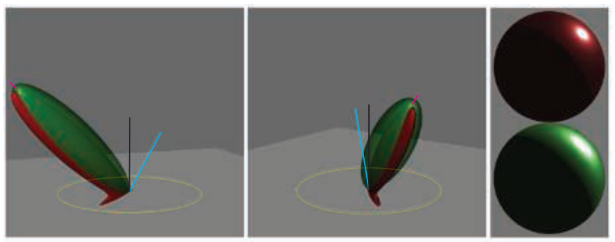

我们在章节10.5.1中所提到的一些方法（例如来自Luksch等人\[1093]、Colbert和Krivanek \[1093]的方法），可以在交互速率下计算具有任意BRDF的环境光照。然而，由于这些方法往往需要几十个样本来收敛，因此很少用于物体的实时表面着色，它们可以被视为蒙特卡洛积分中的重要性采样技术。

通过在镜面波瓣上施加径向对称来创建预过滤的环境贴图，使用这个环境贴图的逻辑也很简单直接，即访问与当前表面镜面粗糙度相适应的预过滤波瓣即可。我们的结果只有在直视表面（$\mathbf{n}=\mathbf{v}$）的情况下才能保证是正确，而在其他任何其他情况下我们都不能保证正确；并且在掠射视角下，无论BRDF 波瓣的形状如何，都会产生一些误差，因为我们忽略了真实的波瓣不能低于着色表面点视界这一事实（地平线裁剪）。一般来说，在使用这种方法的情况下，镜面反射方向上所对应的数据很可能与实际情况不那么匹配。

Kautz和McCool通过对存储在预过滤环境贴图中的径向对称波瓣使用更好的采样方案，从而对原生的预积分进行了改进\[867]。他们提出了两种方法：第一种方法使用单个样本，它试图找到一个最佳波瓣，来对当前观察方向上的BRDF进行近似，而不是依赖一个恒定的修正因子。第二种方法则是对来自不同波瓣的几个样本进行平均。第一种方法可以更好地模拟掠射角度下的表面。他们还推导出了一个修正因子，以修正使用径向对称波瓣近似方法与原始BRDF相比，反射出的总能量差异。第二种方法还对结果进行了扩展，包括典型半向量模型的拉伸高光。在这两种情况下，都使用了优化技术来计算驱动预过滤波瓣采样的参数表。Kautz和McCool的技术还使用了贪婪拟合算法和抛物线环境贴图。

最近，Iwanicki和Pesce \[807]推导了一种GGX BRDF与环境立方体贴图的类似近似，他们使用了一种称为Nelder-Mead 最小化的方法。他们还分析了利用现代GPU硬件的各向异性过滤能力来加速采样的想法。

使用预过滤立方体贴图中的单个样本，但是将其位置调整到一个更加复杂的镜面BRDF峰值的想法，被Revie \[1489]用于与延迟着色相结合的毛皮渲染中（章节20.1）。在这种情况下，方法的限制并不是直接来自于环境贴图，而是需要在G-buffer中编码数量尽可能少的参数。McAuley \[1154]对这个想法进行了扩展，将这种技术用于延迟渲染系统中的所有表面。

McAllister等人\[1150, 1151]开发了一种技术，该技术通过利用Lafortune BRDF的特性，可以实现各种渲染效果，包括各向异性和逆反射。这个BRDF \[954]本身就是一种基于物理渲染的近似，它由多个Phong波瓣组成，这些波瓣会在反射方向周围进行扰动。Lafortune通过将这些波瓣拟合到He-Torrance模型\[686]中，并通过一个叫做goniorereflectometer的装置，来对真实材质进行测量，证明了这种BRDF表达复杂材质的能力。McAllister的技术基于这样一种观察：由于Lafortune波瓣是广义的Phong波瓣，因此可以使用传统的预过滤环境贴图，利用其mipmap层级来对不同的Phong指数进行编码。Green等人\[582]提出了一种类似的方法，该方法使用了高斯波瓣来代替Phong波瓣；此外，他们的方法还可以进行扩展，从而支持环境贴图的定向阴影（章节11.4）。

## 10.6 irradiance环境映射

上一小节中我们讨论了如何使用预过滤环境贴图来实现光泽反射，这些贴图同样也可以用于实现漫反射\[590, 1212]。镜面反射所使用的环境贴图具有一些共同的属性，无论它们是用于镜面反射的未过滤贴图，还是用于光泽反射的过滤贴图。在这两种情况下，高光环境贴图都是使用反射观察向量来进行索引的，并且它们都包含了radiance值，其中未过滤的环境贴图包含了入射的radiance，而过滤的环境贴图则包含了出射的radiance。

相反，漫反射环境贴图只需要使用表面法线$\mathbf{n}$来进行索引，并且它们所包含的是irradiance值，因此它们也被称为irradiance环境贴图\[1458]。从图10.35中可以看出，使用环境贴图的光泽反射，由于其固有的模糊性（波瓣扩散角度），因此在某些条件下会产生误差（地平线裁剪），相同的反射观察向量可能会对应不同的反射情况。这些问题并不会发生在irradiance环境贴图中，因为表面法线包含了漫反射所有的相关信息。与原始光照相比，irradiance贴图是极其模糊的，因此可以使用较低的分辨率来进行存储。通常会使用预过滤镜面环境贴图的最低mipmap层级来存储irradiance数据。此外，与我们上一小节研究的光泽反射不同，我们不再针对BRDF波瓣进行积分，BRDF波瓣会被裁剪到表面法线周围的半球范围内。环境光照与clamped余弦波瓣（即clamp到0过后的余弦函数）的卷积是一个精确值，而不是一个近似值。

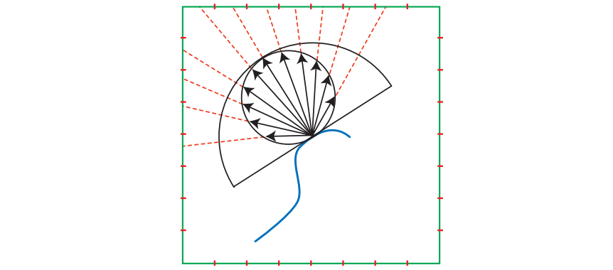

对于贴图中的每个纹素，我们需要将影响给定的法线方向表面的所有光照，将其贡献按照余弦进行加权并求和。irradiance环境贴图是通过对原始环境贴图应用一个far-reaching（意味影响深远的，波及广泛的）的滤波器创建的，这个滤波器会覆盖整个可见的半球范围，同时该滤波器还包含了余弦因子，如图10.39所示。图10.26中所展示的球面贴图与图10.40所展示的irradiance贴图相对应。图10.41则展示了一个实际使用中的irradiance贴图。

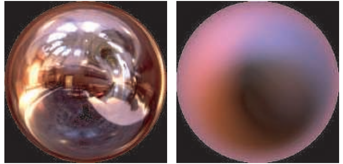

irradiance环境贴图的访问和存储通常是与高光环境贴图或者高光反射贴图分开的，其访问和存储方式通常是一种视图无关的表示形式，例如立方体贴图，如图10.42所示。在访问这个立方体贴图的时候，会使用表面法线来检索irradiance值，而不是之前的反射观察向量。从irradiance环境贴图中获得的值会和漫反射率相乘，从高光环境贴图中获得的值会和镜面反射率相乘。通过在掠射角度下增加镜面反射率（可能也会降低漫反射率），还可以模拟菲涅尔效应\[704, 960]。

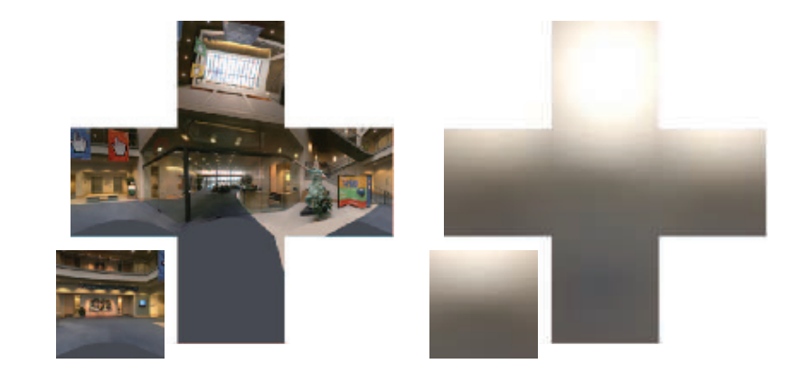

由于生成irradiance环境贴图使用了非常宽的滤波器，因此很难通过采样来在运行时高效地创建它们。King \[897]讨论了如何在GPU上使用卷积操作来创建irradiance贴图，他通过将环境贴图转换到频域（frequency domain），能够在2004年的硬件上，以超过300 FPS的速率来生成irradiance贴图。

漫反射表面或者粗糙表面的过滤环境贴图可以以较低的分辨率进行存储，有时候也可以从相对较小的反射贴图中直接生成，例如一个每个面具有$64 × 64$ 纹素的立方体贴图。这种方法存在一个问题，将面光源渲染到如此小的纹理中，光线可能会“落在纹素之间的区域”，这会导致光线闪烁甚至完全消失。为了避免这个问题，Wiley和Scheuermann \[1886]建议在渲染动态环境贴图的时候，使用较大的“卡片（即有纹理的矩形）”来表示这样的面光源。

在光泽反射的情况下，动态光源也可以被添加到预过滤的irradiance环境贴图中。Brennan \[195]给出了一种廉价的方法，想象现在有一个单一光源的irradiance贴图，在光源的方向上，当光线直射到表面上的时候，radiance会达到最大值。给定表面法线（即给定纹素）的radiance会随着与光线夹角的余弦值而下降，并且在表面背对光源的地方达到0。GPU可以通过渲染一个半球，这个半球代表了余弦波瓣，以观察者为中心，半球的极点指向光源，从而快速地将这个光源的贡献添加到现有的irradiance贴图中。

### 10.6.1 球谐irradiance

上文中，我们讨论了仅使用贴图（例如立方体贴图）来表示irradiance环境贴图，还有一些其他表示方法也可以用来存储环境irradiance信息，如章节10.3所述。尤其是球谐函数，使用它来表示irradiance环境贴图是相当流行的，因为环境光照中的irradiance是平滑的。将radiance与余弦波瓣进行卷积，可以从环境贴图中去除所有高频信息。

Ramamoorthi和Hanrahan表明\[1458]，仅使用前9个SH系数（每个系数都是一个RGB向量，因此我们需要存储27个浮点数）就可以以1%的误差来表示irradiance环境贴图。这样一来，任何irradiance环境贴图都可以表示为一个球面函数$E(\mathbf{n})$，并使用方程10.21和方程10.23将其投影到9个RGB系数上。相比立方体贴图和抛物线贴图而言，这种表示形式更加紧凑；并且在渲染的过程中，可以通过一些简单的多项式计算来重建irradiance信息，而不是去读取和检索纹理。一半来说，如果irradiance环境贴图表示的是间接照明，那么只需要较少的精度即可，这在交互式应用中十分常见。在这种情况下，我们只使用常量基函数和三个线性基函数，即一共四个系数（四个RGB向量，共12个浮点数）就可以产生很好的结果了，因为间接光照本身往往就是低频的，它随着角度的变化很缓慢。

Ramamoorthi和Hanrahan还指出\[1458]，通过将每个系数乘上一个常数，可以将入射radiance函数$L(\mathbf{l})$的SH系数，转换为irradiance函数$E(\mathbf{n})$的SH系数。这样做可以生成一种将环境贴图快速过滤为irradiance环境贴图的方法，通过将环境贴图投影到SH基底上，然后再将每个SH系数乘上一个常数即可完成。例如：King \[897]的快速irradiance滤波就是这样实现的，其核心思想是：从radiance中计算irradiance，实际上相当于在入射radiance函数$L(\mathbf{l})$与clamped余弦函数$\cos \left(\theta_{i}\right)^{+}$之间进行球面卷积。由于clamped余弦函数围绕球体的$z$轴是旋转对称的，因此它在SH中具有一种特殊的形式：它的投影在每个频带中只有一个非零系数。而这个非零系数则对应了图10.21中间一列的基函数，它们也被称为球带谐波（zonal harmonic）。

将一个一般的球面函数与旋转对称函数（例如clamp过的余弦函数）之间进行球面卷积，所产生结果是球面上的另一个函数，这种卷积操作可以在函数的SH系数上高效进行。卷积结果的SH系数等于两个函数SH系数的点积（乘法），再通过$\sqrt{4 \pi /(2 l+1)}$进行缩放，其中$l$是频带指数（frequency band index）。irradiance函数$E(\mathbf{n})$的SH系数，等于radiance函数$L(\mathbf{l})$的系数乘以clamped余弦函数$\cos \left(\theta_{i}\right)^{+}$的系数，再按照频带常数进行缩放。clamped余弦函数的前九个系数值很小，这也就解释了为什么只使用九个系数就足以表示irradiance函数$E(\mathbf{n})$。SH irradiance环境贴图可以使用这种方式来进行快速计算，Sloan \[1656]描述了一种高效的GPU实现。

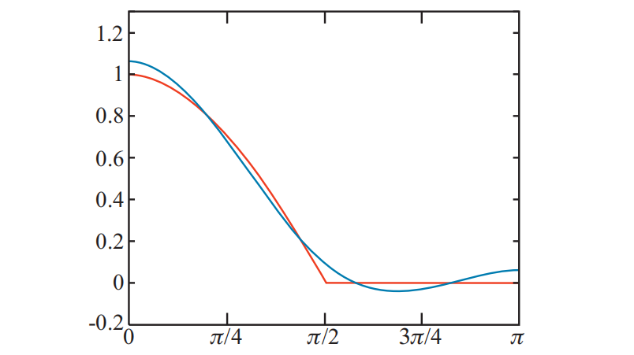

这里还存在一个固有的近似值，因为尽管函数$E(\mathbf{n})$的高阶系数值很小，但是它们并不为零，如图10.43所示。虽然$π/2$到$π$之间的曲线会发生“摆动”，这在信号处理中被称为振铃（ringing），但是这种近似总体还是非常接近的。这种振铃现象通常会发生在用少量基函数来对具有高频部分的函数进行近似的时候，详见章节10.3.2。在$π/2$处将函数clamp为0，会带来一个急剧的变化，这意味着我们的clamped余弦函数具有无限大的信号频率。振铃现象在大多数情况下都是不明显的，但是在一些极端的光照条件下仍然可以看到这种现象，例如颜色的剧烈变化或者位于物体阴影附近的明亮斑点。如果irradiance环境贴图只是用来存储间接光照的话（通常会这么做），那么振铃现象就不太可能成为一个问题。还有一些预过滤方法可以最小化这个问题\[1656, 1659]，如图10.44所示。

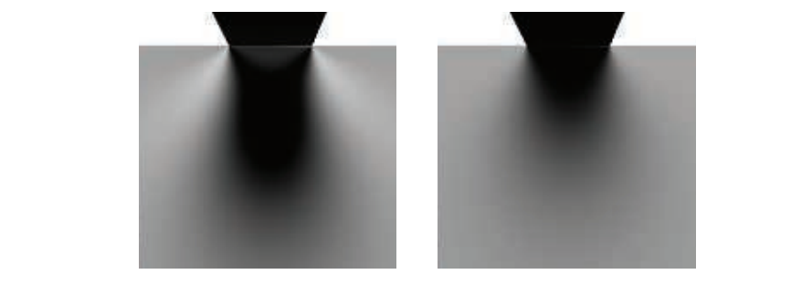

图10.45展示了直接导出的irradiance贴图，与使用包含九个系数的球谐函数的对比结果。这种SH表示可以在渲染的过程中，使用当前表面的法线$\mathbf{n}$进行计算\[1458]，也可以使用SH来快速创建一个立方体贴图或者抛物线贴图供之后进行使用。对于漫反射而言，这样的光照效果虽然很廉价，但是可以提供不错的视觉效果。

动态渲染的立方体环境贴图可以被投影到SH基底上\[871, 897, 1458]。由于立方体环境贴图是入射radiance函数的离散表示，因此方程10.21中对球面的积分就变成了对立方体贴图纹素值的求和：

$$
k_{L j}=\sum_{t} f_{j}(\mathbf{r}[t]) L[t] d \omega[t]
\tag{10.40} 
$$

其中$t$是当前立方体贴图纹素的索引，$\mathbf{r}[t]$为指向当前纹素的方向向量，$f_{j}(\mathbf{r}[t])$是第$j$个SH基函数在$\mathbf{r}[t]$处的值，$L[t]$是存储在纹素中的radiance值，$d \omega[t]$是该纹素所对应的立体角。Kautz \[871]、King \[897]和Sloan \[1656]描述了如何计算这个立体角$d \omega[t]$。

为了将radiance系数$k_{L j}$转换为irradiance系数，需要将其乘以clamped余弦函数的缩放系数：

$$
k_{E j}=k_{\cos ^{+} j}^{\prime} k_{L j}=k_{\cos ^{+} j}^{\prime} \sum_{t} f_{j}(\mathbf{r}[t]) L[t] d \omega[t]
\tag{10.41} 
$$

其中$k_{E j}$是irradiance函数$E(\mathbf{n})$的第$j$个系数，$k_{L j}$是入射radiance函数$L(\mathbf{l})$的第$j$个系数，$ k_{\cos ^{+} j}^{\prime}
  $是clamped余弦函数$\cos \left(\theta_{i}\right)^{+}$按$\sqrt{4 \pi /(2 l+1)}$（其中$l$是频带系数）进行缩放的第$j$个系数。

给定$t$和立方体贴图的分辨率，对于每个基函数$f_j()$，系数$k_{\cos ^{+} j}^{\prime} f_{j}(\mathbf{r}[t]) d \omega[t]$都是恒定的。这些基函数的系数可以离线预计算，并将其存储在立方体贴图中，它应当与将要渲染的动态环境贴图具有相同的分辨率。可以通过在每个颜色通道中打包一个单独的基函数系数，来减少所要使用的纹素数量。为了计算动态立方体贴图的irradiance系数，需要将相应基函数系数贴图中的纹素，与动态立方体贴图中的纹素相乘，并对结果进行求和。除了关于动态irradiance立方体贴图的相关信息，King \[897]还提供了在GPU上实现SH投影的细节。

动态光源还可以被添加到现有的SH irradiance环境贴图中。这种合并是通过计算光线irradiance贡献的SH系数，并将其添加到现有系数中来实现的，这样做可以避免对整个irradiance环境贴图进行重新计算。这是一个十分简单的过程，因为点光源、圆盘光源和球形光源的系数都存在简单的解析表达式\[583, 871, 1656, 1690]，对这些系数求和的效果与对irradiance求和的效果相同。对于那些与$z$轴对齐的光源，通常这些表示都是以球带谐波（zonal harmonic）的方式给出的，然后可以通过旋转操作，来将光源定位到任意的方向上。球带谐波的旋转是SH旋转（详见章节10.3.2）的一种特殊情况，它的效率更高，只需要进行一个点积操作即可，而不需要执行一个完整的矩阵变换。对于具有复杂形状的光源，可以先将它们绘制到一个图像中，然后再将图像数值投影到SH基底上\[1690]，从而获得这些光源所对应的系数。对于物理天空模型这个特殊情况，Habel \[626]展示了Preetham天光在球谐函数中的一种直接扩展。

能够将常见的分析光源很容易地投影到SH中，这一点也是很重要的，因为通常环境光照会被用来代替远处或者较弱的光源，其中一个重要的例子就是补光灯（fill light）。在渲染中，这些光源会被放置在场景的特殊位置上，用于模拟场景中的间接光照，即被表面反弹的光线。这些补光灯通常不会计算高光效果，尤其是当这些光源在物理尺寸上相对于着色物体而言很大，并且相对于场景中的其他光源而言相对昏暗的时候，这些因素会使得它们的高光变得更加分散，在场景中不那么明显。这种类型的光源与在现实世界中的电影光照和视频光照有相似之处，在现实世界中，会使用一些补光灯来在阴影中添加一些照明，使得阴影看起来没有那么黑。

在球谐函数空间中，也可以简单地进行相反的推导，即从投影在SH上的radiance中，提取出解析光源。在Sloan \[1656]对SH技术的研究中，给定一个已知轴的方向光，他展示了如何从SH irradiance表示中计算出光源应当具有的强度，来使得其自身与编码irradiance之间的误差最小化。

在他之前的工作中\[1653]，Sloan展示了如何在仅使用第一个（线性）频段系数的情况下，来选择一个接近最优的方向，该综述中还包含了一种用于提取多个方向光的方法。这项工作表明，对应光照求和而言，球谐函数是一个实用的基底。我们可以将多个光源同时投影到SH中，并提取出少量的方向光，这些光源可以对原来的光源集合进行较好地近似。lightcuts框架提供了一种聚合次要光源的一般性方法\[1832]。

虽然SH投影最常用于irradiance中，但是它也可以用来模拟有光泽的、视角相关的BRDF光照。Ramamoorthi和Hanrahan \[1459]描述了这样一种技术，他们在立方体贴图中没有存储单一的颜色，而是存储了使用视角相关的环境贴图进行编码的球谐函数投影系数。然而在实践中，这种技术要比我们之前所介绍的预过滤环境贴图方法占据更多的存储空间。Kautz等人 \[869]推导出了一种更加经济的解决方案，该方法利用了SH系数的二维表格，但是这种方法只能用于相当低频的光照信息。

### 10.6.2 其他表示方法

立方体贴图和球谐函数是irradiance环境贴图最常用的表示方法，但是还有一些其他的表示方法，如图10.45所示。

。")

许多irradiance环境贴图有两种主要颜色：顶部的天空颜色和底部的地面颜色。受到这一观察现象的启发，Parker等人\[1356]提出了一种只使用两种颜色的半球光照（hemisphere lighting）模型，该方法假设上半球会发出一个均匀的radiance $L_{sky}$，下半球则会发出另一个均匀的radiance $L_{ground}$，在这种情况下，irradiance的积分是：

$$
E=\left\{\begin{array}{ll}\pi\left(\left(1-\frac{1}{2} \sin \theta\right) L_{\mathrm{sky}}+\frac{1}{2} \sin \theta L_{\text {ground }}\right), & \text { where } \theta<90^{\circ} \\[2mm]
 \pi\left(\frac{1}{2} \sin \theta L_{\mathrm{sky}}+\left(1-\frac{1}{2} \sin \theta\right) L_{\text {ground }}\right), & \text { where } \theta \geq 90^{\circ}\end{array}\right.
\tag{10.42} 
$$

其中方程中的$θ$是表面法线与天空半球轴之间的夹角。Baker和Boyd提出了一个计算速度更快的近似方程，Taylor \[1752]对其进行了描述：

$$
E=\pi\left(\frac{1+\cos \theta}{2} L_{\mathrm{sky}}+\frac{1-\cos \theta}{2} L_{\mathrm{ground}}\right)
\tag{10.43} 
$$

方程10.43在天空和地面之间进行了线性插值，使用$(\cos \theta+1) / 2$作为插值因子。其中$\cos \theta$通常可以通过向量点积来进行快速计算，并且当天空半球轴与某个基本轴（例如$y$轴或者$z$轴）重合的时候，$\cos \theta$实际上根本不需要计算，因为它就等于法线$\mathbf{n}$的某个世界空间的坐标分量。这个近似结果与原结果相当接近，而且速度要快得多，因此对于大多数应用而言，它比原本完整的表达式更加好用。

Forsyth \[487]提出了一种廉价且灵活的光照模型，被称为三重光源（trilight），其中包括了定向光照、双向光照、半球光照，还有作为特殊情况的环绕光照（wrap lighting）。

Valve最初使用了环境立方体（章节10.3.1）来表示irradiance。一般来说，我们在章节10.3中所看到的所有球面函数表示方法，都可以用于预计算的irradiance。对于irradiance函数所表示的低频信号，我们知道SH是一个很好的近似。我们倾向于使用特殊的方法来简化或者使用比球谐函数更少的存储空间。

如果我们想计算遮挡和其他全局光照效果，或者想整合光泽反射，就需要能够表达高频信号的复杂的表示方法（章节10.1.1）。将所有的相互作用考虑在内，并对光照结果进行预计算，这个思想被称为预计算radiance传输（precomputed radiance transport，PRT），我们将在章节11.5.3中进行详细讨论。能够捕获光泽照明的高频信号的光照方法，也称为全频率（all-frequency）光照，在这种情况下经常会使用小波（wavelet）表示来作为压缩环境贴图的手段\[1059]，并以一种与之前所介绍的球谐函数相类似的方式，来设计高效的运算方法。Ng等人\[1269, 1270]展示了使用Haar小波来对irradiance环境映射进行推广，从而对自阴影效应进行建模。他们在小波基底中存储环境贴图以及在物体表面上变化的shadowing函数。这种表示十分值得注意，因为它相当于对环境立方体贴图进行了变换，在每个立方体表面上执行二维的小波投影，因此它也可以被视为一种立方体贴图的压缩技术。

## 10.7 误差来源

为了正确地进行着色计算，我们必须在非定点光源上计算积分。在实践中，这一要求意味着，我们可以根据所计算光源的属性，采用许多不同的技术。实时引擎通常会以解析方式来对一些重要的光源进行建模，对光源照亮区域计算近似积分，并通过阴影贴图来计算遮挡信息。而所有其他光源（远距离光源、天光、补光和表面反弹光源），通常都会使用环境立方体贴图来表示高光分量，使用球面基底来表示漫反射irradiance。

使用这种混合照明技术意味着，我们永远不会直接使用给定的BRDF模型，而是使用具有不同程度误差的近似值。有时候BRDF近似是显式的，因为我们对中间模型进行了拟合，从而计算光照积分，LTC就是这样一个例子。但是在其他时候，我们所构建的近似值只有在某些条件（通常很少）下，对于给定的BRDF才是精确的，在大多数情况下都会出现误差，预过滤立方体贴图就属于这一类。

在开发实时着色模型的时候，需要考虑一个重要因素，即确保不同形式光照之间的差异不明显。从视觉上看，来自不同表示的连贯光照效果，甚至可能要比每种表示的绝对近似误差更加重要。

遮挡对于真实感渲染而言也很重要，因为在没有光线的地方出现“漏光”现象，在视觉上通常要比在应当有光的地方没有光更加明显。大多数面光源表示对于阴影而言都是很难处理的，在如今，即使使用了各种阴影“软化”技术（章节7.6），也没有任何一种实时阴影技术能够准确考虑光源的形状。我们计算了一个标量因子，当物体投射阴影的时候，我们将其相乘以减少给定光源的贡献值，这实际上是错误的，在使用BRDF进行积分的时候，我们应当考虑到这种遮挡所带来的影响。这对于环境光照而言尤其困难，因为我们没有一个明确的、主要的光源方向，因此无法使用任何精确光源的阴影技术。

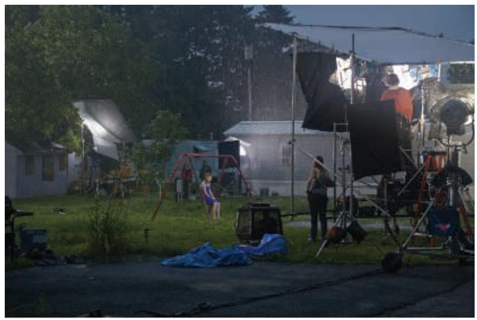

即使我们已经看到了一些相当先进的光照模型，但是请记住，它们都不是对现实世界光照来源的精确表示，例如：在环境光照中，我们会假设radiance来自于无限远处，但是现实中这是不可能的。而且，我们看到的所有解析光源都基于了这样一个更加强势的假设：光源表面上的每个点，都会均匀地向半球方向上发出radiance。但是在实践中，这种假设也是一种可能的误差来源，因为真实世界中的光源往往具有很强的方向性。在摄影照明和电影照明中，被称为镜头挡光板（gobo）、剪影遮光片（cuculori）或者cookies的特制蒙版和滤镜，经常被用来实现某些艺术效果。如图10.46所示，摄影师Gregory Crewdson所拍摄的照片，展示了电影光照的复杂情况。为了限制光源的照明角度，同时保持大面积的光线发射，可以在大型发光面板（即所谓的柔光箱）前面添加栅格化的黑色屏蔽材料，这种装置被称作honeycombs（蜂窝）。光源的外壳处也会使用复杂的镜面和反光板，例如：室内照明、汽车前灯和手电筒等。如图10.47所示，这些光学系统会远离其物理中心的地方，生成一个或者多个发射光线的虚拟发射器，在进行光源衰减计算的时候，也应当考虑到这个偏移。

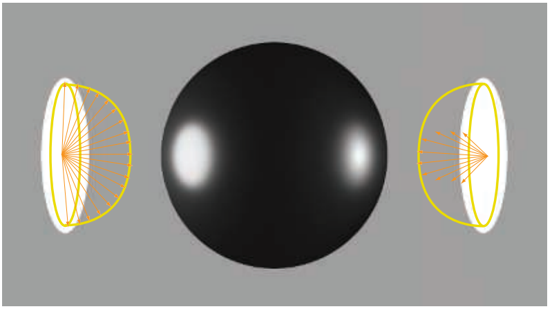

请注意，我们始终应当在一个面向感知的、面向结果的框架中对这些误差进行评估，除非我们的目标是进行预测渲染，即精确可靠地模拟真实世界的表面外观。在艺术家手中，即使某些简化并不真实，但是仍然可以生成有用并且富有表现力的光照效果。当这些基于物理的模型能够使艺术家更容易创建视觉可信的图像时，那么它们就是有用的，因为我们的最终目标是渲染出令人信服的图像，而不是这些物理模型本身。

## 补充阅读和资源

Hunter \[791]所撰写的《Light Science and Magic: An Introduction to Photographic Lighting》一书，是一个理解现实世界摄影光源良好参考。对于电影照明而言，《Set Lighting Technician’s Handbook: Film Lighting Equipment, Practice, and Electrical Distribution》\[188]是一个很好的介绍。

Debevec在基于图像的照明领域做出了开创性工作，这对于任何需要从现实场景中捕捉环境贴图的人而言都十分具有吸引力。这项工作的大部分内容都涵盖在SIGGRAPH 2003的课程中\[333]，以及由Reinhard等人\[1479]编写《High Dynamic Range Imaging: Acquisition, Display, and Image-Based Lighting》一书中。

光源描述文件（light profile）是一个可以帮助模拟光源的资源。照明工程学会（Illuminating Engineering Society，IES）出版了一本用于照明测量的手册和文件格式标准\[960, 961]。这种格式的数据通常可以从相关设备制造商那里获得。IES标准仅限于对光源的发射角度（angular emission profile）进行了描述，它没有完全模拟由于光学系统所带来的衰减影响，也没有对光源表面区域上的发射情况进行模拟。

Szirmay-Kalos \[1732]关于镜面效果的最新报告中，包括了许多有关环境映射技术的参考文献。
