# Chapter 11 Global Illumination 全局光照

## 目录

-   [11.1 渲染方程](#111-渲染方程)
-   [11.2 通用全局光照](#112-通用全局光照)
    -   [11.2.1 辐射度](#1121-辐射度)
    -   [11.2.2 光线追踪](#1122-光线追踪)
-   [11.3 环境光遮蔽](#113-环境光遮蔽)
    -   [11.3.1 环境光遮蔽理论](#1131-环境光遮蔽理论)
    -   [11.3.2 可见性和obscurance](#1132-可见性和obscurance)
    -   [11.3.3 考虑相互反射](#1133-考虑相互反射)
    -   [11.3.4 预计算环境光遮蔽](#1134-预计算环境光遮蔽)
    -   [11.3.5 环境光遮蔽的动态计算](#1135-环境光遮蔽的动态计算)
    -   [11.3.6 屏幕空间方法](#1136-屏幕空间方法)
    -   [11.3.7 使用环境光遮蔽进行着色](#1137-使用环境光遮蔽进行着色)
-   [11.4 定向遮蔽](#114-定向遮蔽)
    -   [11.4.1 预计算定向遮蔽](#1141-预计算定向遮蔽)
    -   [11.4.2 定向遮蔽的动态计算](#1142-定向遮蔽的动态计算)
    -   [11.4.3 使用定向遮蔽进行着色](#1143-使用定向遮蔽进行着色)
-   [11.5 漫反射全局光照](#115-漫反射全局光照)
    -   [11.5.1 表面预照明（Surface Prelighting）](#1151-表面预照明Surface-Prelighting)
    -   [11.5.2 定向表面预照明](#1152-定向表面预照明)
    -   [11.5.3 预计算传输](#1153-预计算传输)
    -   [11.5.4 存储方法](#1154-存储方法)
    -   [11.5.5 动态漫反射全局光照](#1155-动态漫反射全局光照)
    -   [11.5.6 光照传播体积](#1156-光照传播体积)
    -   [11.5.7 基于体素的方法](#1157-基于体素的方法)
    -   [11.5.8 屏幕空间方法](#1158-屏幕空间方法)
    -   [11.5.9 其他方法](#1159-其他方法)
-   [11.6 镜面全局光照](#116-镜面全局光照)
    -   [11.6.1 局部环境贴图](#1161-局部环境贴图)
    -   [11.6.2 环境贴图的动态更新](#1162-环境贴图的动态更新)
    -   [11.6.3 基于体素的方法](#1163-基于体素的方法)
    -   [11.6.4 平面反射](#1164-平面反射)
    -   [11.6.5 屏幕空间方法](#1165-屏幕空间方法)
-   [11.7 统一方法](#117-统一方法)
-   [补充阅读和资源](#补充阅读和资源)

> Jeremy Birn——“If it looks like computer graphics，it is not good computer graphics.”

> 杰里米·伯恩——“如果它看起来像是计算机图形学生成的，那它就不是一个好的计算机图形学。”（皮克斯动画公司的光照技术总监）

渲染过程最终计算的是radiance，到目前为止，我们一直在使用反射方程（reflectance equation）来对其进行计算：

$$
L_{o}(\mathbf{p}, \mathbf{v})=\int_{\mathbf{l} \in \Omega} f(\mathbf{l}, \mathbf{v}) L_{i}(\mathbf{p}, \mathbf{l})(\mathbf{n} \cdot \mathbf{l})^{+} d \mathbf{l}
\tag{11.1} 
$$

其中$L_{o}(\mathbf{p}, \mathbf{v})$是表面位置$\mathbf{p}$在观察方向$\mathbf{v}$上的出射radiance；$\Omega$是表面位置$\mathbf{p}$的上半球范围；$f(\mathbf{l}, \mathbf{v})$是观察方向$\mathbf{v}$和当前光线入射方向$\mathbf{l}$上的BRDF；$L_{i}(\mathbf{p}, \mathbf{l})$是从光线方向$\mathbf{l}$到达表面位置$\mathbf{p}$的入射radiance；$(\mathbf{n} \cdot \mathbf{l})^{+}$是光线方向$\mathbf{l}$和表面法线$\mathbf{n}$之间的点积，并将负数结果clamp到0，即将来自表面下方的光线过滤掉。

## 11.1 渲染方程

反射方程是完整渲染方程的一种特殊情况，它由Kajiya在1986年提出\[846]。渲染方程具有各种不同的表达形式，我们将使用以下这个版本：

$$
L_{o}(\mathbf{p}, \mathbf{v})=L_{e}(\mathbf{p}, \mathbf{v})+\int_{\mathbf{l} \in \Omega} f(\mathbf{l}, \mathbf{v}) L_{o}(r(\mathbf{p}, \mathbf{l}),-\mathbf{l})(\mathbf{n} \cdot \mathbf{l})^{+} d \mathbf{l}
\tag{11.2} 
$$

其中多出来的一项为$L_{e}(\mathbf{p}, \mathbf{v})$，它表示了从表面位置$\mathbf{p}$向观察方向$\mathbf{v}$发射的radiance，用于描述自发光表面的出射radiance。被积函数中有一项做了如下替换：

$$
L_{i}(\mathbf{p}, \mathbf{l})=L_{o}(r(\mathbf{p}, \mathbf{l}),-\mathbf{l})
\tag{11.3} 
$$

这一项意味着，从方向$\mathbf{l}$进入表面位置$\mathbf{p}$的入射radiance，等于另一个表面位置向相反方向$-\mathbf{l}$的出射radiance。在这种情况下，这里的“另一个表面位置”由光线投射函数（ray casting function）$r(\mathbf{p}, \mathbf{l})$所定义的，这个函数会从表面位置$\mathbf{p}$向方向$\mathbf{l}$上发射一条光线，并返回所击中的第一个表面位置，如图11.1所示。

 ，着色点 \mathbf{p} 的入射radiance  L_{i}(\mathbf{p}, \mathbf{l}) ，以及表面点 r(\mathbf{p}, \mathbf{l}) 的出射radiance  L_{o}(r(\mathbf{p}, \mathbf{l}),-\mathbf{l}) 。")

渲染方程的含义很简单。为了对表面位置$\mathbf{p}$进行渲染，我们需要知道在观察方向$\mathbf{v}$上，离开表面位置$\mathbf{p}$的出射radiance $L_o$，它等于该点自身发射的radiance $L_e$，再加上反射出的radiance。有关光源发射和反射率的内容，在前面几章我们已经讨论过了。甚至这里的光线投射操作好像看起来也不是那么陌生，例如：z-buffer实际上就计算了从相机投射到场景中的光线。

这里我们所遇到的唯一的新项是$L_{o}(r(\mathbf{p}, \mathbf{l}),-\mathbf{l})$，这一项明确指出，入射到某一点上的radiance，一定是从另一点发出的。不幸的是，这是一个递归项，也就是说，如果我们想要计算点$r(\mathbf{p}, \mathbf{l})$在方向上$-\mathbf{l}$上的出射radiance，那么我们首先还要知道来自表面位置$r\left(r(\mathbf{p}, \mathbf{l}), \mathbf{l}^{\prime}\right)$的出射radiance，接下来还需要计算来自表面位置$r\left(r\left(r(\mathbf{p}, \mathbf{l}), \mathbf{l}^{\prime}\right), \mathbf{l}^{\prime \prime}\right)$的出射radiance，直到无穷。令人十分惊讶的是，如此复杂的计算量，现实世界居然可以对其进行实时计算。

我们凭借直觉可以知道，光源照亮了一个场景，它所发出的光子（photon）在场景中四处反弹，每次与表面发生碰撞的时候，都会以各种方式被吸收、反射或者折射。渲染方程十分重要，因为它在一个简单的方程中总结了所有可能的光线路径。

渲染方程有一个重要的属性，即它与所发射出的光线呈线性关系。如果我们使光源的强度翻倍，那么最终的着色结果也会加倍变亮。同时，材质对于每种光源的响应也是相互独立的，也就是说，一种光源的存在并不会影响另一种光源与材质之间的相互作用。

在实时渲染中，只使用局部光照模型也是很常见的，我们只需要对可见点的表面数据进行光照计算即可，而这正是GPU最擅长的。传入GPU的各种图元被独立处理和光栅化，然后它们就会被丢弃，我们在点$\mathbf{b}$执行光照计算时，无法访问点$\mathbf{a}$的光照计算结果。诸如透明、反射和阴影效果，都是全局光照算法的范畴，它们利用了来自其他物体的信息，而不仅仅是被光源所照亮的物体。这些效果大大增强了渲染图像的真实感，并提供了视觉暗示（cues）来帮助观察者理解空间中的位置关系。同时，这些效果模拟起来也十分复杂，可能需要进行预计算或者渲染多个pass来计算一些必须的中间信息。

有一种思考光照问题的方法，即通过光子的传播路径来理解光照。在局部光照模型中，光子从光源出发，传播到表面上（忽略中间的物体），然后到达眼睛。阴影算法考虑了这些中间物体的直接遮挡效果。环境贴图可以捕捉从远处光源到达物体表面的光线，然后将其应用到局部的光泽物体上，这些物体会以镜面反射的方式，将这些光线反射到眼睛中。irradiance贴图还可以捕捉到光源对遥远物体的影响，并在半球范围的方向上进行积分，被这些物体所反射的光线会进行加权求和，从而计算出一个表面的光照效果，最终被眼睛所看到。

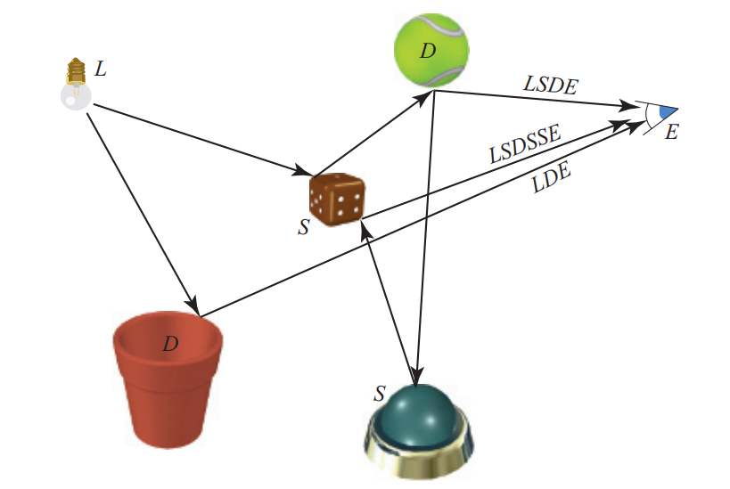

以一种更加正式的方式来思考光线传输路径的不同类型和不同组合，有助于理解现有的各种算法。Heckbert \[693]提出了一个符号方案，它用于描述由某种技术所模拟的光线路径。光子从光源（$L$）到眼睛（$E$）的每次相互作用，都可以标记为漫反射（$D$）或者镜面反射（$S$），还可以通过添加其他表面类型来进一步分类，例如“有光泽的（glossy）”，它代表了有光泽，但是又不像镜子的表面，如图11.2所示。可以使用正则表达式来简单地概括这些算法，从而展示它们所模拟的交互类型。表11.1对基本符号进行了总结。

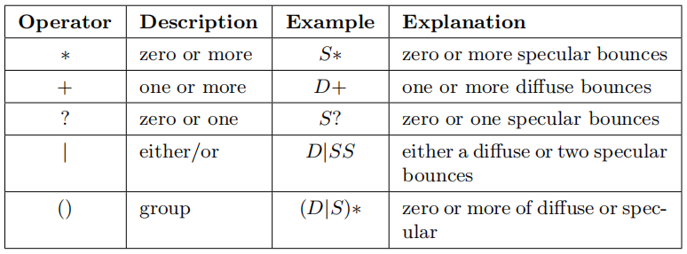

从光源出发的光子可以通过各种路径最终到眼睛。最简单的路径是$LE$，光源被眼睛直接看到。一个基本的z-buffer是$L(D |S)E$，或者写成其等价形式$LDE|LSE$。光子离开光源，到达一个漫反射表面或者一个镜面，然后再到达眼睛。请注意，在一个基础的渲染系统中，点光源没有对应的物理表示，它不会被眼睛直接观察到。对于一个具有几何形状的光源而言，将会产生这样一个路径$L(D|S)?E$，除了照射到表面之外，从光源发出的光线也可以直接进入眼睛。

如果将环境映射添加到渲染器中，那么这个表达式就不再那么简单了。虽然Heckbert的表示法是从光源出发最终到达眼睛，但是对于渲染而言，从相反方向来构建表达式通常要更加容易。眼睛将首先看到一个镜面或者一个漫反射表面，即$(S|D)E$，如果这个表面是一个镜面，那么它也可以选择反射到一个环境贴图中的镜面，或者是一个漫反射表面上。因此，存在一条额外的可能路径：$((S|D)?S|D)E$。同时再加上眼睛直接看到光源的路径，那么这个表达式最终会变为：$L((S|D)?S|D)?E$。

可以将这个表达式展开：$LE|LSE|LDE|LSSE|LDSE$，它代表了所有可能存在的路径，或者简写为：$L(D |S) S?E$。每一种表示方法在理解关系和限制方面都有各自的优势。这种符号表示法的部分用途是表达算法的效果，并能够以此为基础进行构建，例如：$L(S |D)$是生成环境贴图时所编码的内容，而$SE$则代表了随后访问该贴图的过程。

渲染方程本身也可以用简单的表达式$L(D|S) * E$来进行概括，即来自光源的光子在到达眼睛之前，可以与0到几乎无限数量的漫反射表面或者镜面发生相互作用。

对于全局光照的研究，主要集中在计算光线在这些路径上传播的方法。当将其应用于实时渲染时，我们通常愿意牺牲一些质量或者正确性，来换取更快的计算速度。最常见的两种策略就是简化和预计算。例如：我们可以假设所有反射到眼睛中的光线都是漫反射的，这种简化在某些环境和场景中表现很好。我们还可以离线环境中，对一些物体之间效果的相关信息进行预计算，例如生成记录表面光照水平的纹理，然后在运行过程中，根据这些存储的信息进行一些基本计算，从而获得全局光照效果。本章节将展示如何使用这些策略，来实时实现各种全局光照效果。

## 11.2 通用全局光照

我们在前面几章中，着重介绍了求解反射方程的各种方法。我们假设入射radiance $L_i$具有一定的分布，并分析了它是如何影响着色计算的。而在本章节中，我们将介绍用于求解完整渲染方程的算法。二者之间的区别在于，前者忽略了radiance的来源，它假设是直接给出的；而后者则明确地说明了这一点：到达某一点的radiance是从其他点发射或者反射而来的。

![图11.3：路径追踪可以生成照片级逼真的图像，但是其计算成本较高。上面图像中的每个像素都使用了超过2000条路径（2000spp），每个路径长达64段（深度，即反弹次数）。它花费了两个多小时来进行渲染，但是仍然会表现出一些轻微的噪声。 \[149\]](images/Chapter-11/202306221436182.png "图11.3：路径追踪可以生成照片级逼真的图像，但是其计算成本较高。上面图像中的每个像素都使用了超过2000条路径（2000spp），每个路径长达64段（深度，即反弹次数）。它花费了两个多小时来进行渲染，但是仍然会表现出一些轻微的噪声。 \[149]")

能够求解完整渲染方程的算法，可以生成令人惊叹的、照片级逼真的图像，如图11.3所示。然而对于实时应用来说，这些方法的计算成本都太高了，那么为什么我们还要讨论它们呢？第一个原因是：在静态或者部分静态的场景中，这样的算法可以在预处理阶段执行，并将计算结果存储下来，以供稍后在实时渲染期间使用。这在游戏中是一种十分常见的方法，稍后我们将对这类系统的不同方面进行讨论。

第二个原因是：全局光照算法都建立在严格的理论基础上，它们是直接从渲染方程中推导出来的，它们所做的任何近似都是经过仔细分析的。在设计实时解决方案的时候，可以且应该应用类似的推理思路；即使我们走了某些捷径，使用了一些技巧，但是我们也应当知道这么做的后果是什么，什么才应该是正确的方法。随着图形硬件变得越发强大，我们将能够做出更少的妥协和近似，并且能够创建出更加接近正确物理结果的实时渲染图像。

求解渲染方程的两种常用方法是有限元法（finite element）和蒙特卡罗法（Monte Carlo）。其中辐射度算法（radiosity）基于了第一种方法，而不同形式的光线追踪算法（ray tracing）则使用了第二种方法。在这两种不同思路的算法中，光线追踪要更加流行。这主要是因为它可以在同一个算法框架内，对一般的光线传输效果进行有效处理，包括体积散射等效果。而且光线追踪算法也更加容易扩展和并行化。

我们将简要介绍这两种方法，有兴趣的读者还应该参考其他优秀的书籍，它们涵盖了在非实时情况下求解渲染方程的细节\[400, 1413]。

### 11.2.1 辐射度

辐射度算法（Radiosity）\[566]是第一种用于模拟漫反射表面之间光线反弹的计算机图形技术，其名字来源于该算法所计算的物理量。在经典的算法形式中，辐射度算法可以计算相互反射以及面光源所产生软阴影。辐射度算法的基本思想相对简单，并且已经有了完整的书籍对这个算法进行介绍\[76, 275, 1642]。光线会在环境中发生弹射，当我们打开一盏灯时，房间内的照明会很快达到平衡，在这种稳定状态下，每个表面都可以被看作是一个光源。基本的辐射度算法作出了一种简化的假设，即所有场景中的间接光都来自于漫反射表面。对于具有抛光大理石地板或者墙上有巨大镜面的场景而言，这个假设是不成立的，但是对于现实中的许多建筑而言，这是一个相对合理的近似。辐射度算法可以对无限数量的有效漫反射进行追踪。如果使用本章节开头所介绍的符号表示法，那么可以将它的光线传输路径写为$LD*E$。

辐射度算法假设每个物体表面都由一定数量的面片（patch）组成。对于每个较小的区域（面片），辐射度算法都会计算一个平均辐射度值（radiosity value），因此这些面片的尺寸需要足够小，才能够捕捉所有的照明细节（例如阴影边缘）。这些面片不需要和底层表面的三角形一一匹配，甚至面片的大小尺寸也可以不一样。

从渲染方程出发，我们可以推导出第$i$个面片的辐射度为：

$$
B_{i}=B_{i}^{e}+\rho_{\mathrm{ss}} \sum_{j} F_{i j} B_{j}
\tag{11.4} 
$$

其中$B_{i}$代表了面片$i$的辐射度；$B_{i}^{e}$为面片$i$的辐射出度（radiant exitance），即面片$i$所发出的辐射度；$\rho_{\mathrm{ss}}$是次表面反照率（详见章节9.3）。只有光源的辐射出度才不为0。$F_{ij}$是面片$i$和面片$j$之间的形状因子（form factor），这个形状因子的定义为：

$$
F_{i j}=\frac{1}{A_{i}} \int_{A_{i}} \int_{A_{j}} V(\mathbf{i}, \mathbf{j}) \frac{\cos \theta_{i} \cos \theta_{j}}{\pi d_{i j}^{2}} d a_{i} d a_{j}
\tag{11.5} 
$$

其中$A_i$是面片$i$的面积；$V(\mathbf{i}, \mathbf{j})$是点$i$与点$j$之间的可见性函数，如果它们之间没有物体遮挡光线，则该项为1，否则为0。角度值$\theta_{i}$和$\theta_{j}$分别是两个面片的法线，与点$i$和点$j$的之间连线的夹角。最后，$d_{ij}$是点$i$和点$j$的之间距离。如图11.4所示。

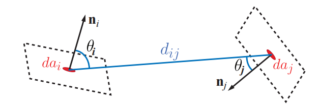

形状因子是一个纯粹的几何项，它描述了离开面片$i$的均匀漫反射辐射能量，有多少能够入射到面片$j$上\[399]。两个面片的面积、距离、相对朝向、以及它们之间存在的任何表面，都会对它们的形状因子产生影响。想象现在有一个面片，假设它代表了一个计算机显示器；房间里的其他每个面片，都会直接接收到这个显示器所发出的部分光线。位于显示器背面或者看不见显示器的表面，它们无法接收到显示器发射出来的光线，对于这些表面而言，这个比例因子为零。这些比例因子的和为1。辐射度算法的一个重要部分，就是准确确定场景中面片之间的形状因子。

在计算出形状因子之后，所有面片的方程（方程11.4）会被组合为一个的线性系统（一个由线性方程组成的数学模型）。然后对这个线性系统进行求解，从而得到每个面片的辐射度值。随着面片数量的不断增加，会导致计算复杂度变得很高，化简（reduce）这样一个矩阵的成本是相当大的，因此求解这个线性系统的成本也是相当大的。

由于这个算法的扩展性很差，并且存在一些其他的限制，因此经典的辐射度算法很少用于作为光照解决方案。然而，在现代实时全局光照系统中，预先计算形状因子，并在运行过程中使用它们来执行某种形式的光线传播，这个思想仍然很流行。我们将在章节11.5.3中来讨论这些方法。

### 11.2.2 光线追踪

光线投射（ray casting）是指从某个表面位置上发射一根光线，从而确定在特定方向上存在哪些物体的过程。光线追踪（ray tracing）使用光线来确定不同场景元素之间的光线传输。在其最基本的形式中，光线会从相机所在的位置出发，穿过像素网格进入到场景中。对于每条光线，都找到第一个与光线相交的物体。然后，通过从交点向各个光源发射光线，并查找交点与光源之间是否存在遮挡物体，来检查这个交点是否位于阴影中。不透明的物体会遮挡光线，透明的物体会减弱光线。还可以在交点处发射其他光线，如果表面具有光泽，则可以在反射方向上生成光线。这条光线会获取第一个相交物体的颜色，然后再对相交点进行阴影测试。也可以在透明固体的折射方向上生成光线，然后再进行递归计算。光线追踪的基本机制非常简单，以致于最基础的光线追踪渲染器的代码，甚至可以写在一张名片的背面\[696]。

经典的光线追踪算法只能提供有限的效果：尖锐的反射和折射，以及硬阴影。然而，光线追踪的基本思想可以用于求解完整的渲染方程。Kajiya认识到\[846]，可以利用光线的发射机制以及评估它们所携带的光线能量，从而计算方程11.2中的积分项。方程11.2是递归的，这意味着对于每条光线，我们需要在不同的位置重新计算积分。幸运的是，我们已经有了处理这个问题的坚实数学基础。在曼哈顿计划（Manhattan Project）期间，为物理实验而开发的蒙特卡罗（Monte Carlo）方法就是专门为处理这类问题而设计的。我们并不是直接按照积分规则来计算每个着色点上的积分值，而是通过在积分域上采样一定数量的随机点，从而获得被积函数的具体数值。然后我们使用这些被积函数值来计算积分的估计值，采样点越多，最终的精度就越高。这种方法最重要的性质是，我们只需要对被积函数上的点进行求值计算，给定足够的时间，我们就可以以任意的精度来计算积分。在渲染领域中，这正是光线追踪所能提供的，当我们投射光线的时候，就相当于对方程11.2中的被积函数进行了点采样。尽管在交点处我们还需要递归计算另一个积分，但是我们不需要计算它的最终精确值，我们可以再次对这个积分进行点采样。当光线在场景中反弹的时候，就形象的建立了一条路径（path），我们沿每条光线路径，对被积函数进行一次计算，这个过程被称为路径追踪（path tracing），如图11.5所示。

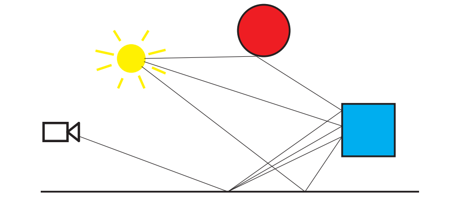

对路径进行追踪是一个非常强大的概念。这些路径可以用于渲染光泽材质或者漫反射材质。使用它们，我们还可以生成软阴影、渲染透明物体以及焦散效果。通过对路径追踪进行扩展，我们还可以对体积内的点进行采样，而不仅仅是对物体表面进行采样，这样我们就可以处理雾和次表面散射等效果。

路径追踪的唯一缺点是，想要实现高视觉保真度的画面，所需要的计算复杂度是很高的。对于电影级的图像，我们可能需要对数十亿条路径进行追踪，因为我们计算的只是积分的估计值，而不是真实值。如果使用的路径太少，那么这种近似将会是不精确的，在一些特殊情况下会极其不精确，从而产生大量噪声。此外，即使是两个相邻的点，最终的着色结果也可能会差异很大，这与我们的期望不太相符，我们总是希望相邻点具有相似的光照结果。我们将这样的结果称为具有高方差（high variance），从视觉上看，方差会体现为图像中的噪声（如图11.6所示）。现在已经有了很多方法，可以在不增加额外追踪路径的前提下，消除或者减弱这种噪声所带来的影响。其中一种流行的技术是重要性采样（importance sampling），这个方法的思路是，通过向光线来源的主要方向发射更多的光线，从而大大降低方差。

![图11.6：使用蒙特卡罗路径追踪时，由于样本数量不足而产生的噪声。左侧图像为每像素8个路径（8 spp），右侧图像为每像素1024个路径（1024 spp）。 \[149\]](images/Chapter-11/202306231022715.png "图11.6：使用蒙特卡罗路径追踪时，由于样本数量不足而产生的噪声。左侧图像为每像素8个路径（8 spp），右侧图像为每像素1024个路径（1024 spp）。 \[149]")

许多已经出版了的论文和书籍对路径追踪及其相关方法进行了详细讨论。Pharr等人\[846]为现代离线光线追踪技术提供了一个很好的介绍。Veach \[846]为光线传输算法的现代推理奠定了数学基础。我们将在本章最后的章节11.7中，讨论交互式的光线追踪和路径追踪。

## 11.3 环境光遮蔽

上一小节中所介绍的通用全局光照算法，它们的计算成本都很高。虽然它们可以产生各种复杂的效果，但是生成一幅图像往往需要好几个小时。我们将首先介绍一些最简单的，但是在视觉上很有说服力的方法，并在本章节逐步探索实时替代方案，逐步构建更加复杂的效果。

一种基本的全局光照效果是环境光遮蔽（ambient occlusion，AO）。这项技术是在21世纪初，由工业光魔的Landis \[974]所开发的，当时是用于提高电影《珍珠港》中，由计算机生成的飞机的环境光照质量。尽管这种效应的物理基础进行了相当程度的简化，但是最终的结果看起来却令人惊讶地可信。当光照缺乏方向变化，无法展现物体细节时，这种廉价方法可以提供对于物体形状的视觉暗示。

### 11.3.1 环境光遮蔽理论

环境光遮蔽的理论背景可以直接从反射方程中推导出来。这里为了简单起见，我们将首先关注Lambertian表面，该表面的出射radiance $L_o$与表面irradiance $E$成正比。irradiance是入射radiance的余弦加权积分，一般来说，它取决于表面位置$\mathbf{p}$和表面法线$\mathbf{n}$。同样，为了简单起见，我们将假设来自所有方向$\mathbf{l}$上的入射radiance都是恒定的，即$L_{i}(\mathbf{l})=L_{A}$。基于上述假设，此时计算irradiance的方程如下所示：

$$
E(\mathbf{p}, \mathbf{n})=\int_{\mathbf{l} \in \Omega} L_{A}(\mathbf{n} \cdot \mathbf{l})^{+} d \mathbf{l}=\pi L_{A}
\tag{11.6} 
$$

在这里，我们将对半球$Ω$的所有可能入射方向进行积分。在恒定均匀光照的假设下，irradiance（以及由此产生的出射radiance）与表面位置和表面法线无关，并且在整个物体上都是恒定的。这会生成一个平坦均匀的外观。

方程11.6并没有考虑任何的可见性。着色点半球范围内的某些方向，可能会被自身物体的其他部分或者是场景中的其他物体所遮挡。在这些方向上将会具有不同的入射radiance，而不是恒定的$L_A$。为了简单起见，我们假设来自这些遮挡方向上的入射radiance为零。虽然这个假设忽略了场景中可能会被其他物体反弹，并最终从这些遮挡方向到达点$\mathbf{p}$的光线，但是它极大地简化了推理过程。基于上述假设，我们可以得到以下方程，它由Cook和Torrance首次提出\[285, 286]：

$$
E(\mathbf{p}, \mathbf{n})=L_{A} \int_{\mathbf{l} \in \Omega} v(\mathbf{p}, \mathbf{l})(\mathbf{n} \cdot \mathbf{l})^{+} d \mathbf{l}
\tag{11.7} 
$$

其中$v(\mathbf{p}, \mathbf{l})$是一个可见性函数，如果从点$\mathbf{p}$向方向$\mathbf{l}$投射的光线会被物体遮挡，则该函数值为0，反之为1。

将可见性函数进行余弦加权积分，然后再进行归一化，最终的结果被称为环境遮挡系数：

$$
k_{A}(\mathbf{p})=\frac{1}{\pi} \int_{\mathbf{l} \in \Omega} v(\mathbf{p}, \mathbf{l})(\mathbf{n} \cdot \mathbf{l})^{+} d \mathbf{l}.
\tag{11.8} 
$$

这个系数代表了未被遮挡的半球的余弦加权百分比，它的范围位于$[0,1]$内，对于完全被遮挡的着色点，它的值为0；对于没有任何遮挡的着色点，它的值为1。值得注意的是，凸面（convex）物体，例如球体或者立方体，不会对自身造成遮挡。因此当场景中不存在其他物体时，凸面物体的环境遮挡值将为1。如果物体表面存在凹陷区域，则这些区域的遮挡值将小于1。

在定义$k_A$之后，考虑遮挡情况的环境irradiance方程为：

$$
E(\mathbf{p}, \mathbf{n})=k_{A}(\mathbf{p}) \pi L_{A}
\tag{11.9} 
$$

注意，在方程11.9中，irradiance会随着表面位置的变化而变化，因为$k_A$确实是由表面位置所决定的，这样所得到的结果会更加真实，如图11.7所示。由于尖锐折痕处的$k_A$值较低，因此这里的表面位置会显得较暗。

![图11.7：仅使用恒定环境光照（左）和使用环境光遮蔽（右）渲染的物体。即使光照是恒定均匀的，环境光遮蔽也可以表现出物体的细节。 \[149\]](images/Chapter-11/202306231308507.png "图11.7：仅使用恒定环境光照（左）和使用环境光遮蔽（右）渲染的物体。即使光照是恒定均匀的，环境光遮蔽也可以表现出物体的细节。 \[149]")

比较图11.8中的表面位置$\mathbf{p}_{0}$和$\mathbf{p}_{1}$，可以发现表面朝向也会对$k_A$有影响，因为可见性函数$v(\mathbf{p}, \mathbf{l})$在积分的时候会被余弦因子加权。比较图11.8左侧的表面位置$\mathbf{p}_{1}$和$\mathbf{p}_{2}$，虽然二者具有一个大小相同的未遮挡立体角，但是表面位置$\mathbf{p}_{1}$的大部分未遮挡区域都位于其表面法线附近，该位置上的余弦因子相对较大，从箭头的亮度就可以看出。相比之下，表面位置$\mathbf{p}_{2}$的大部分未遮挡区域都位于其表面法线的一侧，因此该位置的余弦因子相对较小，也就是说，在$\mathbf{p}_{2}$处的$k_A$较低。从这里开始，为简单起见，我们将不再显式说明遮挡系数对表面位置$\mathbf{p}$的依赖。

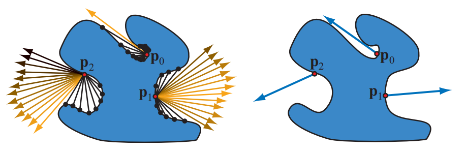

除了$k_A$，Landis \[974]还计算了一个平均的未遮挡方向，它称为环境法线（bent normal），这个方向向量是未遮挡方向的余弦加权平均值：

$$
\mathbf{n}_{\mathrm{bent}}=\frac{\int_{\mathbf{l} \in \Omega} \mathbf{l} v(\mathbf{l})(\mathbf{n} \cdot \mathbf{l})^{+} d \mathbf{l}}{\left\|\int_{\mathbf{l} \in \Omega} \mathbf{l} v(\mathbf{l})(\mathbf{n} \cdot \mathbf{l})^{+} d \mathbf{l}\right\|}
\tag{11.10} 
$$

其中符号$\|\mathbf{x}\|$代表了向量$\mathbf{x}$的长度。积分的结果再除以它自身的长度，可以得到归一化的结果，如图11.8右侧所示。这样产生的向量可以在着色期间代替几何法线，从而提供更加准确的结果，同时不需要额外的性能开销（详见章节11.3.7）。

### 11.3.2 可见性和obscurance

用于计算环境遮挡因子$k_A$（方程11.8）的可见性函数$v(\mathbf{l})$需要仔细定义。例如：对于一个物体，比如人物或者车辆，定义这个函数$v(\mathbf{l})$是很简单的，我们只需要从表面位置向方向$\mathbf{l}$投射光线，然后检查光线是否会与同一物体的任何其他部分相交即可。然而，这种方法并没有考虑到附近其他物体的遮挡情况。通常，为了进行光照，可以假设物体被放置在一个平面上，通过将该平面加入到可见性计算中，可以实现更加真实的遮挡效果。这样做的另一个好处是，物体对地面的遮挡可以模拟接触阴影的效果\[974]。

不幸的是，这种可见性函数方法对于封闭的几何体是不起作用的。想象现在有一个场景，它是一个包含各种物品的封闭房间。在这种情况下，所有表面的$k_A$值都会为0，因为来自表面的所有射线都会击中某个物体（墙壁或者物体）。对于这类场景而言，经验方法会更加合适，它会试图重现环境遮挡的外观，但是不一定会对物理可见性进行模拟。其中的一些方法的灵感来自于Miller的可访问性着色（accessibility shading）\[1211]，该方法对在表面角落和缝隙处如何捕获污垢或者腐蚀进行了建模。

Zhukov等人\[1970]引入了obscurance的思想，它通过使用距离映射函数$\rho(\mathbf{l})$来代替可见性函数$v(\mathbf{l})$，从而对环境光遮蔽的计算进行了修改：

$$
k_{A}=\frac{1}{\pi} \int_{\mathbf{l} \in \Omega} \rho(\mathbf{l})(\mathbf{n} \cdot \mathbf{l})^{+} d \mathbf{l}
\tag{11.11} 
$$

可见性函数$v(\mathbf{l})$只有两个有效值，其中1代表没有相交，0表示有相交，而距离映射函数$\rho(\mathbf{l})$则是一个连续函数，其返回值取决于射线与表面相交之前所传播的距离。当相交距离为0时，函数$\rho(\mathbf{l})$的值为0；当相交距离大于设定的最大距离$d_{max}$时，或者根本没有相交时，函数$\rho(\mathbf{l})$的值为1。对于相交距离大于$d_{max}$的交点，实际上不需要进行任何测试，这样可以大大加快$k_A$的计算速度。图11.9展示了环境光occlusion和环境光obscurance之间的区别。请注意，使用环境光occlusion进行渲染的图像要暗得多，这是因为即使在很远的距离也会对相交情况进行检测，这样会减小$k_A$的值。

![图11.9：环境光occlusion和环境光obscurance之间的区别。左侧图像的遮挡是使用无限长的射线进行计算的。右侧图像则使用了有限长度的射线。 \[149\]](images/Chapter-11/202306231359869.png "图11.9：环境光occlusion和环境光obscurance之间的区别。左侧图像的遮挡是使用无限长的射线进行计算的。右侧图像则使用了有限长度的射线。 \[149]")

尽管人们试图从物理角度为其辩护，但实际上obscurance在物理上是不正确的。然而，obscurance通常可以给出符合观众期望的合理结果。obscurance方法的一个缺点在于，这个最大相交距离$d_{max}$的值需要进行手动调整，才能达到令人满意的效果。这种类型的妥协会在计算机图形学中经常出现，一些技术可能并没有直接的物理基础，但是“在感知上却令人信服”。计算机图形学的目标通常是渲染一张可信的图像，因此这些技术当然是可以使用的。也就是说，基于物理理论的方法具有这样一些优点，它们可以自动进行工作，并且可以通过推理现实世界中的工作原理，来对其进一步改进。

### 11.3.3 考虑相互反射

尽管环境光遮蔽所产生的结果在视觉上是令人信服的，但是与完整全局光照模拟产生的结果相比，环境光遮蔽的结果要更暗一些，如图11.10中图像的对比。

![图11.10：不具有相互反射和具有相互反射的环境光遮蔽之间的区别。左侧图像只使用了可见性信息，右侧图像使用了一次反弹的间接照明。 \[149\]](images/Chapter-11/202306231357936.png "图11.10：不具有相互反射和具有相互反射的环境光遮蔽之间的区别。左侧图像只使用了可见性信息，右侧图像使用了一次反弹的间接照明。 \[149]")

环境光遮蔽与完整全局光照之间的一个重要区别是相互反射（interreflection）。方程11.8假设被遮挡方向上的radiance为零，但是实际上相互反射会为这些方向引入一个非零的radiance。如图11.10所示，与右侧模型相比，左侧模型的折痕处和凹陷处会更暗。这种差异可以通过适当增加$k_A$的值来解决。使用obscurance距离映射函数来代替可见性函数（章节11.3.2）也可以缓解这个问题，因为obscurance函数的值通常会大于零。

以一种更加精确的方式来追踪相互反射是很昂贵的，因为它需要求解一个递归问题。想要给一个点进行着色，必须首先对其他点进行着色，以此类推。虽然计算$k_A$的值相比于执行一个完整的全局光照计算而言要便宜得多，但是我们还是希望能够以某种形式来包含这部分丢失的光线，从而避免过度暗化。Stewart和Langer \[1699]提出了一种廉价、但是却惊人准确的方法来近似相互反射。它基于在漫反射光照下对Lambertian场景的观察，即从一个给定位置能够看见的表面，往往会具有相似的radiance。我们假设遮挡方向的radiance $L_i$，等于当前着色点的出射radiance $L_o$，从而打破了递归，可以得到这样一个解析表达式：

$$
E=\frac{\pi k_{A}}{1-\rho_{\mathrm{ss}}\left(1-k_{A}\right)} L_{i}
\tag{11.12} 
$$

其中$\rho_{\mathrm{ss}}$是次表面反照率，或者叫做漫反射率。方程11.12相当于使用一个新的环境遮挡因子$k_{A}^{\prime}$来代替之前的$k_{A}$：

$$
k_{A}^{\prime}=\frac{k_{A}}{1-\rho_{\mathrm{ss}}\left(1-k_{A}\right)}
\tag{11.13} 
$$

方程11.13倾向于让环境遮挡因子变得更大（更亮），从而使得它在视觉上更加接近一个完整全局光照所产生的结果，它在一定程度上模拟了相互反射效应。这种效应高度依赖于$\rho_{\mathrm{ss}}$的值，其隐含的假设是：在着色点附近的表面颜色是相同的，这样可以产生有点像类似颜色渗透（color bleeding）的效果。Hoffman和Mitchell \[755]使用了这种方法，从而可以实用天光来照亮地形。

Jimenez等人\[835]提出了一种不同的解决方案。他们对许多场景执行了完整的离线路径追踪，每个场景都使用均匀的、白色的、无限远的环境贴图来进行照亮，从而获得考虑相互反射的适当遮挡值。在此基础上，他们拟合了一个三次多项式，来对环境遮挡因子$k_A$和次表面反照率$\rho_{\mathrm{ss}}$映射到遮挡值$k_{A}^{\prime}$的函数$f$进行近似，这个新的遮挡值会被相互反射的光线照亮。他们的方法同样假设反照率是局部恒定的，并且可以根据给定点的反照率，推导出入射反弹光的颜色。

### 11.3.4 预计算环境光遮蔽

环境遮挡因子的计算可能会很耗时，通常都是在渲染之前离线计算的。预计算任何与光照相关的信息（包括环境光遮蔽），这个过程通常被称为烘焙（baking）。

预计算环境光遮蔽最常见的方法就是蒙特卡罗方法。发射光线并检查光线与场景的交点，然后对方程11.8进行数值计算，例如：我们在法线$\mathbf{n}$的半球方向上均匀随机选择$N$个方向$\mathbf{l}$，然后沿着这些方向发射光线并进行追踪。基于光线的相交结果，我们对可见性函数$v$进行计算，这种计算环境光遮蔽的方法，可以表达成如下方程：

$$
k_{A}=\frac{1}{N} \sum_{i}^{N} v\left(\mathbf{l}_{i}\right)\left(\mathbf{n} \cdot \mathbf{l}_{i}\right)^{+}.
\tag{11.14} 
$$

在计算环境光obscurance时，可以将投射的光线限制在一个最大距离内，通过最大距离内的相交距离来计算$v$的值。

环境光occlusion或者环境光obscurance的环境遮挡因子，其计算过程都包含一个余弦加权因子。虽然我们可以像方程11.14那样将其直接纳入计算，但更加有效的方法是通过重要性采样。现在我们对光线发射的分布进行调整，将其修改为按余弦加权进行发射光线，而不是先在半球范围内均匀投射光线，然后再对结果进行余弦加权。换句话说，光线会更有可能被投射到接近表面法线的方向上，因为来自这些方向的结果具有更大的贡献值，它们是更加重要的样本。这种抽样方案被称为Malley方法。

环境光遮蔽的预计算可以在CPU或者GPU上进行。在这两种计算环境下，都有一些针对复杂几何图形的光线投射加速库。其中最受欢迎的两个分别是：用于CPU的Embree \[1829]和用于GPU的OptiX \[951]。在过去，来自GPU管线的生成结果，例如深度图\[1412]或者遮挡查询\[493]等，也会被用于计算环境光遮蔽，但是随着更加通用的光线投射解决方案在GPU上的日益普及，它们在今天不太常用了。大多数商业建模和渲染软件都会提供预计算环境光遮蔽的选项。

遮挡数据对于物体上的每个顶点都是唯一的。它们通常会存储在纹理、体积或者网格顶点中。而无论存储的信号类型如何，不同存储方法都具有类似的特点和问题。同样的方法还可以用于存储环境光遮蔽、定向遮蔽或者预计算光照等，详见章节11.5.4。

预计算数据也可以用来模拟物体之间的环境光遮蔽效果。Kontkanen和Laine \[924, 925]将物体对其周围的环境光遮蔽效应存储在一张立方体贴图中，并将其称为环境光遮蔽场（ambient occlusion field）。他们使用了一个二次多项式的倒数，来模拟环境光遮蔽随物体之间距离的变化情况。这个多项式的系数存储在一张立方体贴图中，以模拟遮挡的方向性变化。在运行过程中，利用遮挡物的距离和相对位置来获取合适的系数，从而对遮挡值进行重建。

Malmer等人\[1111]将环境遮挡因子和环境法线（可选）存储一个三维网格中，从而对结果进行了改进，他们将这个三维网格称为环境光遮蔽体（ambient occlusion volume）。这种方法的计算成本较低，因为可以从纹理中直接读取出环境遮挡因子，不用实时计算。与Kontkanen和Laine的方法相比，这种方法需要存储的标量值要更少一些，两种方法的纹理分辨率都比较低，总体的存储需求是类似的。Hill \[737]和Reed \[1469]描述了Malmer等人的方法在商业游戏引擎中的实现，他们对算法的各个实现方面以及一些有用的优化方法进行了讨论。这两种方法都适用于刚体物体，而且可以扩展到具有少量运动部件的铰接物体上，其中每个运动部件都会被视为一个单独的物体。

无论我们选择哪种方法来存储环境光遮蔽值，我们都需要明确，我们正在处理的是一个连续信号。当我们从空间中的特定点发射光线的时候，我们进行的是采样（sample）；当我们在着色之前对这些数值插值的时候，我们进行的是重建（reconstruct）。信号处理领域中的所有相关工具都可以用来提高这个采样-重建过程的质量。Kavan等人\[875]提出了一种方法，他们将其称之为最小二乘烘焙（least-squares baking）。在这个方法中，遮挡信号会在网格上进行均匀采样，然后推导出顶点对应的值，从而可以在最小二乘法中，将插值和采样顶点之间的总差异最小化。他们还专门讨论了在顶点存储数据的方法，同样的推理方法也可以用于导出存储在纹理或者体积中的值。

《命运》是一款广受好评的游戏，它使用了预计算的环境光遮蔽作为基础的间接光照解决方案（如图11.11所示）。这款游戏是在两代主机硬件之间的过渡时期发行的，因此它需要一个解决方案，来平衡新平台上预期的高质量画面与老平台上性能和内存使用限制。这个游戏的其中一个特点是，一天中的光照效果会随着时间动态变化，因此任何预计算的解决方案都必须正确地考虑到这一点。开发者选择使用环境光遮蔽，是因为它在有着较低开销的同时，可以提供可信的外观表现。同时，由于环境光遮蔽将可见性计算与光照渲染过程相解耦，因此可以在一天中的任何时间，使用相同的预计算数据。Sloan等人\[1658]完整介绍了这个系统，包括基于GPU的烘焙管线。

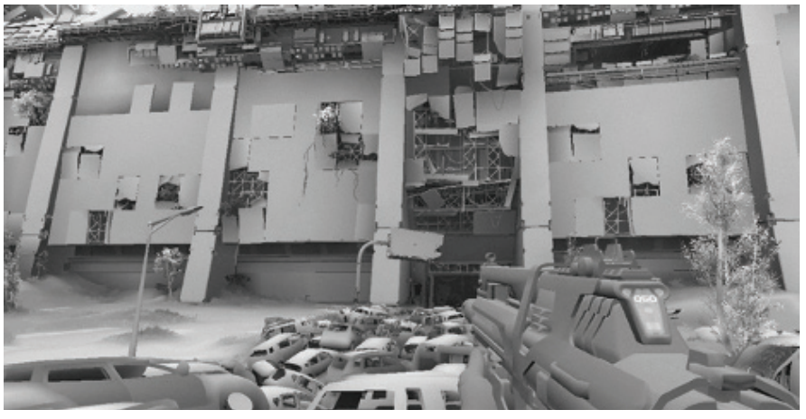

育碧的《刺客信条》\[1692]和《孤岛惊魂》\[1154]系列，也使用了一种预计算的环境光遮蔽，来增强他们的间接光照解决方案。他们以自上而下的视角来渲染世界，并对产生的深度图进行处理，从而计算大范围的遮挡信息。根据相邻深度样本的分布情况，采用了多种启发式算法来对遮挡值进行估计。通过将世界空间位置投影到纹理空间中，所产生的世界空间AO贴图可以应用于所有物体。他们将这种方法称为世界AO（World AO）。Swoboda \[1728]也描述了类似的方法。

### 11.3.5 环境光遮蔽的动态计算

对于静态场景，可以预先计算环境遮挡因子$k_A$和环境法线$\mathbf{n}_{\text {bent }}$。但是，对于存在移动或者形状改变物体的场景，必须要通过实时计算这些参数才能获得更好的结果。执行这个操作的方法按照空间可以划分为两类：在物体空间中执行的方法；在屏幕空间中执行的方法。

计算环境光遮蔽的离线方法，通常会从每个表面点向场景中投射大量光线（数十到数百条），并对交点进行检查。这是一个成本很高的操作，而实时渲染中则重点关注如何进行近似，或者如何避免大部分的计算。

Bunnell \[210]通过将表面建模为放置在网格顶点处的圆盘元素，从而计算环境遮挡因子$k_A$和环境法线$\mathbf{n}_{\text {bent }}$。这里选择圆盘的原因是，圆盘之间的遮挡情况可以通过解析计算获得，不需要单独投射光线。简单地将一个圆盘与所有其他圆盘的遮挡因子加起来，会产生双重阴影从而导致表面过暗。也就是说，如果一个圆盘位于另一个圆盘的后面，那么这两个圆盘都将被视为遮挡表面，但是实际上只有最近的圆盘才应当是。Bunnell使用了一种巧妙的两pass方法来避免这个问题：第一个pass正常计算环境光遮蔽效果，包括错误的双重阴影在内。在第二个pass中，会根据第一个pass中的遮挡情况，来减少每个圆盘的贡献值。实际上这只是一个近似值，但在实践中，它能够产生令人信服的结果。

计算每对元素之间的遮挡情况具有$O(n^2)$的复杂度，除非场景构成十分简单，否则这个复杂度对于实时渲染而言太高了。对于远距离的表面，可以使用一些简化的表示，从而降低部分计算开销。Bunnell构建了一个分层的元素树，其中每个节点都是一个圆盘，它代表了其子树圆盘的聚合。在进行圆盘之间的遮挡计算时，对于较远的表面会使用较高层级的的节点。这可以将时间复杂度降低到$O(n \log n)$，这是一个更加合理的复杂度。Bunnell的技术很高效，并且能够产生高质量的结果，该技术被应用在了加勒比海盗电影（Pirates  of the Caribbean）的最终渲染中\[265]。

Hoberock \[751]对Bunnell的算法进行了几项修改，使用更高的计算成本进一步提高了质量。他还提出了一种距离衰减因子，其结果与Zhukov等人\[1970]所提出的obscurance因子相类似。

Evans \[444]描述了一种基于符号距离场（signed distance field，SDF）的动态环境光遮蔽近似方法。在这种表示方法中，物体会被嵌入到一个三维网格中。网格中的每个位置都会存储到最近物体表面的距离。对于在物体内部的点，这个值为负；对于在物体外部的点，这个值为正。Evans在体积纹理中创建并存储场景的SDF。为了估计物体上某个表面位置的遮挡情况，他使用了一种启发式方法，该方法会沿着表面法线进行点采样，这些点会距离表面越来越远。Quilez指出\[1450]，当SDF以解析方式进行表示（章节17.3），而不是存储在三维纹理中的时候，也可以使用相同的方法进行处理。虽然这种方法是非物理的，但是生成的结果在视觉上令人满意。

Wright \[1910]进一步扩展了使用符号距离场来进行环境光遮蔽的方法。Wright并没有使用启发式方法来生成遮挡值，而是进行了锥形追踪（cone tracing）。这个圆锥的顶点位于着色点，并对编码在距离场中的场景表示进行相交测试。锥形追踪会沿轴执行一组步进操作，在每一次步进之后都会使用一个更大半径的球，来与SDF进行相交测试。如果此时距离最近的遮挡物距离（从SDF中采样的值）小于球体的半径，那么圆锥的这部分就会被遮挡（如图11.12所示）。如果仅仅追踪一个锥形区域，那么结果将是很不精确的，并且无法包含余弦项，出于这个原因，Wright追踪了一组覆盖整个半球的圆锥，从而来估计环境光遮蔽。为了提高视觉保真度（visual fidelity），他的解决方案不仅使用了场景的全局SDF，还使用局部的SDF，这个局部SDF用于代表单个物体或者在逻辑上相连接的物体集合。

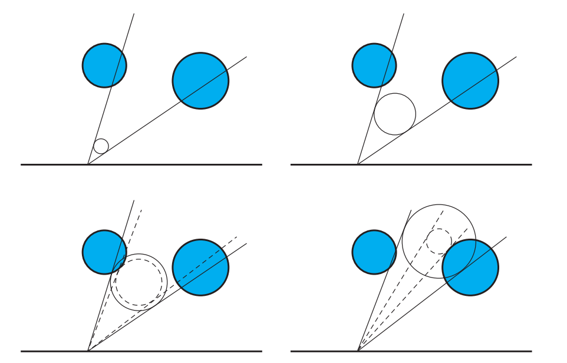

Crassin等人\[305]在场景的体素表示中描述了一种类似的方法。他们使用稀疏体素八叉树（章节13.10）来存储场景的体素化信息。他们用于计算环境光遮蔽的算法，实际上是一种通用完整全局光照算法的特例（详见章节11.5.7）。

Ren等人\[1482]则将遮挡物近似为球体，如图11.13所示，并使用球谐函数来表示表面点被单个球体遮挡的可见性函数，这样一组球体聚合起来的可见性函数，就是单个球体可见性函数的乘积。但不幸的是，计算球谐函数的乘积是一个成本很高的操作。他们的核心思想是：对单个球谐可见性函数的对数进行求和，然后再对结果取指数。这样所产生的结果与可见性函数相乘的结果相同，但是球谐函数的求和操作，其计算成本明显要比乘法小。这篇论文表明，在正确的近似方法下，可以通过执行快速的对数运算和指数运算，从而获得整体加速效果。

这种方法计算出的不仅仅是环境遮挡因子，而是一个完整的球面可见性函数，它使用了球谐函数来进行表示（详见章节10.3.2）。其中，球谐函数的第一个系数（0阶）可以作为环境遮挡因子$k_A$，后面三个系数（1阶）可以用于计算环境法线$\mathbf{n}_{\text {bent }}$。更高阶的系数可以用于阴影环境贴图或者圆形光源。由于这种方法将几何体近似为包围球，因此无法对来自折痕或者其他小细节的遮挡情况进行建模。

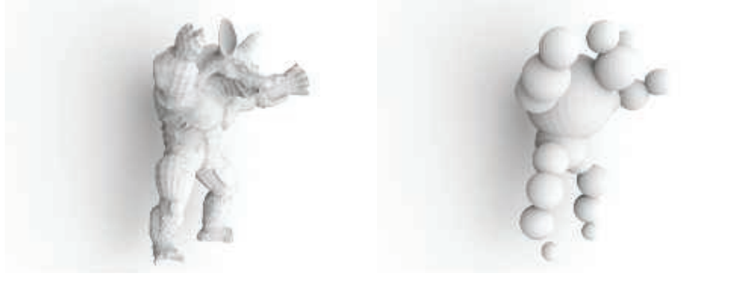

Sloan等人\[1655]在屏幕空间中，对Ren所描述的可见性函数进行了求和。对于每个遮挡物，他们都会考虑一组像素，这组像素距离着色点的距离，小于所规定的世界空间距离。这个操作可以通过渲染一个球体，并在着色器中执行距离测试或者使用模板测试来实现。对于所有受到影响的屏幕区域，会将一个适当的球谐函数值添加到一个离屏缓冲区中。在获得所有遮挡物的可见性之后，会对缓冲区中的值进行求幂运算，最终获得每个屏幕像素上的组合可见性函数。Hill \[737]使用了相同的方法，但是他将球谐可见性函数限制到二阶系数。在这种假设下，球谐函数的乘积运算只涉及到少量的标量乘法，甚至可以通过GPU的固定功能混合硬件来完成。这使得我们可以在性能有限的主机硬件上使用这种方法。由于该方法只使用了低阶的球谐函数，因此无法生成具有清晰边界的硬阴影，只能生成无方向的遮挡。

### 11.3.6 屏幕空间方法

基于模型空间的方法，其开销与场景的复杂度成正比。然而，我们完全可以从屏幕空间中已有的数据出发，推导出一些有关遮挡的信息，例如深度和法线。这种基于屏幕空间的算法，具有恒定的开销，其复杂度与与场景的细节程度无关，只与渲染时所使用的画面分辨率有关。

> 在实践中，屏幕空间算法的执行时间，还取决于数据在深度缓冲或者法线缓冲中的分布，因为这种数据分散效应，在进行遮挡计算的时候，会降低GPU缓存的命中率，从而延长算法的执行时间。

。未通过深度测试的样本点使用红色进行表示，即该样本所对应的深度，超过了z-buffer中对应位置的深度；通过的样本则使用绿色进行表示。环境遮挡因子 k_A 的值是通过测试的样本数与总样本数的加权比值。为了简单起见，这里我们先忽略了可变的样本权重，假设所有的样本都具有相同的权重。对于左边的像素点，总共10个样本，其中有6个通过，因此 k_A=0.6 。对于中间的像素点，只有3个样本通过了测试。还有一个样本虽然在物体外部，但是没有通过深度测试，如图中红色箭头所示，最终计算出的 k_A=0.3 。对于右边的像素点，只有1个样本通过了测试，因此 k_A=0.1 。")

Crytek \[1227]开发了一种动态的屏幕空间环境光遮蔽（screen-space ambient occlusion，SSAO）算法，并用在了《孤岛危机》中。他们使用z-buffer作为唯一的输入，在一个全屏pass中计算来环境光遮蔽效果。每个像素都有一个环境遮挡因子$k_A$，它会在该像素周围的球形范围内采样一组点，并将样本与z-buffer进行深度测试，然后来估计$k_A$。$k_A$的值与z-buffer中位于像素点深度前面的测试样本有关，通过的样本数量越少，$k_A$的值就越低，如图11.14所示。与obscurance因子相类似\[1970]，这些样本的权重会随着到像素距离的增大而减小，即距离像素越远，该样本的权重就越小。需要注意的是，由于这些样本并没有被余弦因子$(\mathbf{n} \cdot \mathbf{l})^{+}$加权，因此所产生的环境光遮蔽效果是不正确的。该方法会将球形范围内的所有样本都考虑在内，而不是只考虑表面上半球范围内的样本。这种简化意味着会对表面以下的样本进行计数，但是实际上我们是不应当对它们进行计数的。这样做会导致表面变暗（因为环境遮挡因子$k_A$变大了），同时边缘会比周围环境更亮。尽管如此，最终产生结果在视觉上令人十分满意，如图11.15所示。

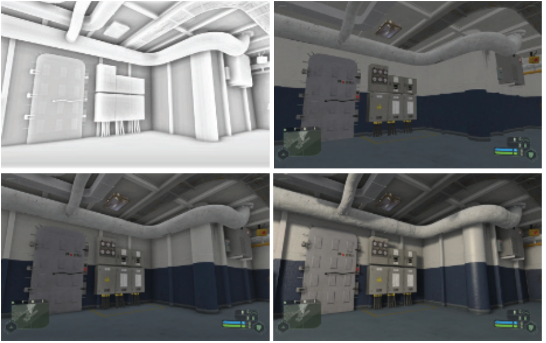

Shanmugam和Arikan \[1970]同时提出了一种类似的方法。在他们的论文中，他们描述了两种方法，其中一种可以从附近的小细节中生成良好的环境光遮蔽效果；另一种可以从较大的物体中生成较为粗略的环境光遮蔽效果。将二者的结果结合起来，就可以生成最终的环境遮挡因子。其中，他们的精细尺度环境光遮蔽方法使用了一个全屏pass，在这个pass中，不仅访问了z-buffer，还访问了可见像素表面的法线缓冲。对于每个着色像素，会从z-buffer中对附近的像素进行采样，被采样的像素分布在球体内部，会根据其法线信息来计算着色像素的遮挡项。这种方法并没有将双重阴影考虑在内，因此结果会显得有点暗。他们的粗略遮挡方法，与Ren等人的物体空间方法相类似（我们在上文中讨论过），它同样将遮挡几何体近似为球体。然而不同的是，Shanmugam和Arikan的方法是在屏幕空间进行遮挡计算的，并使用了与屏幕对齐的广告牌，来覆盖每个遮挡球体的“效果区域”。与Ren等人\[1482]的方法不同，这里的粗略遮挡方法也没有考虑双重阴影。

由于这两种方法极其简洁，因此很快引起了工业界和学术界的注意，并催生了大量的后续工作。许多方法，例如Filion等人\[471]在游戏《星际争霸II》中所使用的方法，以及McGuire等人\[471]所使用的可扩展环境光obscurance方法，都使用了这种特别启发式方法（ad hoc heuristics）来生成遮挡因子。这类方法具有良好的性能表现，并暴露出了一些参数，可以通过手动调整参数来达到预期的艺术效果。

其他的一些方法旨在提供更有原则和理论基础的遮挡计算方法。Loos和Sloan \[1072]注意到，Crytek的方法可以被解释为蒙特卡洛积分。他们将计算出来的值称为体积obscurance，并将其定义为：

$$
v_{A}=\int_{\mathbf{x} \in X} \rho(d(\mathbf{x})) o(\mathbf{x}) d \mathbf{x}
\tag{11.15} 
$$

其中$X$是围绕该像素点的一个三维球形邻域；$ρ$是距离映射函数，与方程11.11所描述的相类似；$d$是距离函数；$o(\mathbf{x})$是占用函数（occupancy function），如果$\mathbf{x}$未被占用，则$o(\mathbf{x})$等于0，否则等于1。他们注意到，$ρ(d)$函数对于最终视觉质量的影响很小，因此可以使用常数函数。在这个假设下，体积obscurance是对占用函数在像素点邻域上的积分。Crytek的方法是在三维邻域内进行随机采样从而计算积分，而Loos和Sloan则通过对像素的屏幕空间邻域随机采样，在$xy$维度上进行积分，对$z$轴的积分过程则是解析的。如果该点的球面邻域中不包含任何几何图形，则积分值等于射线与球体$X$相交的长度。如果该点的球面邻域中存在几何图形，则会使用深度缓冲来作为占用函数的近似值，并且仅会在每个线段的未占用部分上进行积分，如图11.16左侧所示。该方法最终生成的结果，其质量与Crytek的方法相当，但是使用的样本数量较少，因为在其中一个维度上（$z$轴）的积分是精确的。如果可以使用表面法线的话，还可以对这个方法进一步扩展，从而获得更好的结果。在这个考虑法线的版本中，线积分会被限制在由像素点法线所定义的平面上。

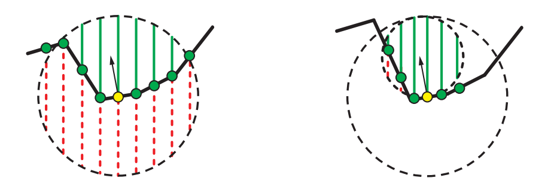

Szirmay-Kalos等人\[1733]提出了另一种使用法线信息的屏幕空间方法，它被称为体积环境光遮蔽（volumetric ambient occlusion）。方程11.6描述了在法线半球上进行的积分，这个积分还包含了余弦项。他们提出，这种类型的积分，可以将被积函数中的余弦项移除，并使用余弦分布来限制积分范围，从而对余弦因子进行近似。这样做可以将积分转换到一个球面上，而不是在一个半球上；这个球体的半径为半球的一半，并且会沿着法线移动一个球体半径的距离，最终这个球体会与半球内接，被半球完全包裹。其中未被占用部分的体积，其计算方法与Loos和Sloan的方法一样，都是通过在像素邻域上进行随机采样，并在$z$轴上对占用函数进行解析积分，如图11.16右侧所示。

Bavoil等人\[119]提出了一种不同的方法，用于解决估计局部可见性的问题，他们从Max \[1145]的视界映射（horizon mapping）中获得了灵感。他们的方法被称为基于视界的环境光遮蔽（horizon-based ambient occlusion，HBAO），它假设z-buffer中的数据表示了一个连续的高度场。通过确定视界角（horizon angle），可以对像素点的可见性进行估计，这里的视界角，指的是切面上方被邻域遮挡的最大角度。也就是说，对于某个点上的给定方向，我们会记录最高的可见物体所对应的角度。如果我们忽略积分中的余弦项，那么环境遮挡因子可以被计算为视界上未被遮挡部分的积分，或者是1减去视界下被遮挡部分的积分：

$$
k_{A}=1-\frac{1}{2 \pi} \int_{\phi=-\pi}^{\pi} \int_{\alpha=t(\phi)}^{h(\phi)} W(\omega) \cos (\theta) d \theta d \phi
\tag{11.16} 
$$

其中$h(\phi)$是切平面的视界角；$t(\phi)$是切平面与观察向量的切角（tangent angle）；$W(\omega)$是衰减函数，如图11.17所示。积分前面的${1}/{2 \pi}$是归一化系数，它将积分的结果归一化到$[0,1]$之间。

对于定义视界的角度$\phi$，我们利用角度的线性衰减，可以解析地计算内部的积分：

$$
k_{A}=1-\frac{1}{2 \pi} \int_{\phi=-\pi}^{\pi}(\sin (h(\phi))-\sin (t(\phi))) W(\phi) d \phi
\tag{11.17}
 
$$

这个剩余的积分，是通过对一些方向进行采样，来找到视界角度，从而进行数值计算的。

Jimenez等人\[835]也使用了这种基于视界的方法，他们称之为真实环境光遮蔽（ground-truth ambient occlusion ，GTAO）。他们的目标是实现ground-truth的结果，并能够与光线跟踪的结果相匹配，该方法所使用的唯一信息，就是由z-buffer构建的高度场。HBAO在计算遮挡的时候并不包括余弦项，并且它还增加了一个特殊的衰减（没有出现在方程11.8中），因此它的结果最多只能与光线追踪相接近，但是始终还是不一样的。GTAO引入了缺失的余弦因子，去除了这个特殊的衰减函数，并在绕观察向量的参考系中给出了遮挡积分，该方法的遮挡因子定义如下：

$$
k_{A}=\frac{1}{\pi} \int_{0}^{\pi} \int_{h_{1}(\phi)}^{h_{2}(\phi)} \cos (\theta-\gamma)^{+}|\sin (\theta)| d \theta d \phi
\tag{11.18} 
$$

其中$h_1(\phi)$和$h_2(\phi)$为给定$\phi$的左右视界角；$γ$为表面法线与观察方向之间的夹角。这里积分的归一化项为${1}/{\pi}$，这与HBAO中的不同，因为GTAO包含了余弦项，这使得开放半球的积分结果为$\pi$，如果方程中不包含余弦项，则开放半球的积分结果为$2\pi$。在给定高度场假设的情况下，方程11.18与与方程11.8完全匹配，如图11.17所示。这里的内部积分仍然可以进行解析求解，因此只需要对外部积分进行数值计算即可，这个积分过程与HBAO中的积分过程基本相同，都是对给定像素周围的多个方向上进行采样。

在这些基于视界的方法中，成本最高的操作就是沿着屏幕空间的线段对深度缓冲进行采样，从而确定视界角度。Timonen \[1771]提出了一种方法，专门用于提高这一步的性能表现。他指出，用于估计给定方向上视界角度的样本，可以在屏幕空间中沿直线排列的像素之间进行大量重用。他将遮挡计算分为两步，首先，他会在整个z-buffer中执行线段追踪。在追踪的每一步中，他都会根据所规定的最大影响距离，在沿着线段移动的时候更新视界角度，并将这个信息写入一个缓冲区中。在视界映射（horizon mapping）中，每个屏幕空间方向上都会创建一个这样的缓冲区。这些缓冲区的大小不需要与原始的深度缓冲区相同，而是取决于线段之间的间距，以及沿着线段的步长，在选择这些参数的时候有一定的灵活性。不同的设置会对最终的质量产生影响。

第二步是根据存储在缓冲区中的视界角度信息来计算遮挡因子。Timonen使用HBAO（方程11.17）所定义的遮挡因子，但是也可以使用其他遮挡估计方法，例如GTAO中的遮挡因子（方程11.18）。

深度缓冲并不是一个完美的场景表示，因为在一个给定的方向上，只有最近的物体会被记录下来，我们实际上并不知道它背后发生了什么。有许多技术使用了启发式方法，来尝试推断可见物体的厚度信息，这些近似值在许多情况下都表现良好，人眼对于稍微不准确的结果是很宽容的。虽然有一些方法使用了多层深度来缓解这个问题，但是由于将其集成到渲染引擎中太过复杂，并且这类方法的运行时成本很高，因此它们从未流行过。

屏幕空间中的方法依赖于对z-buffer进行反复采样，从而在给定点周围构建一些简化的几何模型。实验表明，想要获得较高的视觉质量，可能需要多达几百个样本，这个级别的样本数量太多了，想要用于交互式渲染，每个像素最多只能采样10-20个样本，甚至更少。Jimenez等人\[835]报告提到，为了适应60 FPS的性能预算，他们只能在每个像素上使用1个样本！为了弥合理论和实践之间的差距，屏幕空间方法通常会采用某种形式的空间抖动。在最常见的形式中，每个屏幕像素都会使用略有不同的随机样本集合，然后进行旋转或者径向移动。并在AO计算的主要阶段之后，执行一次全屏的滤波pass。联合双边滤波（章节12.1.1）可以避免在表面的不连续处进行过滤，从而保持尖锐的边缘。它可以利用可用的深度信息或者法线信息来对过滤进行限制，即它只会对属于同一表面的样本进行过滤。还有一些方法使用了随机变化的采样模式，以及经过实验选择的滤波核；另一些方法则使用了固定大小的屏幕空间采样模式（例如$4 × 4$像素），以及一个限制在该邻域上的滤波核。

环境光遮蔽的计算也可以在时域上进行超采样\[835, 1660, 1916]。通常会在每一帧中应用不同的采样模式，并对计算出来的遮挡因子进行指数平均从而实现这个目的。使用上一帧的z-buffer、相机变换和动态物体的运动信息，来将上一帧的数据重新投影到当前视图中，然后再将其与当前帧的结果进行混合。还会使用一些基于深度、法线、速度的启发式方法，来检测上一帧数据的可靠性，对于不可靠的数据需要丢弃（例如：由于一些新物体进入了视野中，因此上一帧中的数据与当前帧存在差异)。章节5.4.2在更一般的情况下，介绍了时域超采样和时域抗锯齿技术。时域过滤的成本较小，并且很容易实现，虽然它并不总是完全可靠的，但是在实践中出现的大多数问题都不太明显。这主要是因为环境光遮蔽不会直接单独显示在画面上，它只是光照计算的输入之一。在将这种环境光遮蔽效果与法线贴图、反照率纹理以及直接光照相结合之后，任何微小的瑕疵都会被掩盖掉，人眼一般很难观察到这些瑕疵。

### 11.3.7 使用环境光遮蔽进行着色

虽然我们是在恒定、遥远光照环境中推导出的环境光遮蔽值，但是我们也可以将其应用于更复杂的光照场景中。再次回顾一些反射方程：

$$
L_{o}(\mathbf{v})=\int_{\mathbf{l} \in \Omega} f(\mathbf{l}, \mathbf{v}) L_{i}(\mathbf{l}) v(\mathbf{l})(\mathbf{n} \cdot \mathbf{l})^{+} d \mathbf{l}.
\tag{11.19} 
$$

如章节11.3.1中所介绍的，方程11.19中包含了可见性函数$ v(\mathbf{l})  $。

假如我们现在正在处理一个漫反射表面，我们可以使用Lambertian BRDF来代替方程11.19中的$f(\mathbf{l}, \mathbf{v})$，这个BRDF等于次表面反照率$\rho_{\mathrm{ss}}$除以$\pi$，将其带入方程11.19，可得：

$$
L_{o}=\int_{\mathbf{l} \in \Omega} \frac{\rho_{\mathrm{ss}}}{\pi} L_{i}(\mathbf{l}) v(\mathbf{l})(\mathbf{n} \cdot \mathbf{l})^{+} d \mathbf{l}=\frac{\rho_{\mathrm{ss}}}{\pi} \int_{\mathbf{l} \in \Omega} L_{i}(\mathbf{l}) v(\mathbf{l})(\mathbf{n} \cdot \mathbf{l})^{+} d \mathbf{l}.
\tag{11.20} 
$$

我们对方程11.20进行一些化简整理，可得：

$$
\begin{aligned} L_{o} & =\frac{\rho_{\mathrm{ss}}}{\pi} \int_{\mathbf{l} \in \Omega} L_{i}(\mathbf{l}) v(\mathbf{l})(\mathbf{n} \cdot \mathbf{l})^{+} d \mathbf{l} \\ & =\frac{\rho_{\mathrm{ss}}}{\pi} \frac{\int_{\mathbf{l} \in \Omega} L_{i}(\mathbf{l}) v(\mathbf{l})(\mathbf{n} \cdot \mathbf{l})^{+} d \mathbf{l}}{\int_{\mathbf{l} \in \Omega} v(\mathbf{l})(\mathbf{n} \cdot \mathbf{l})^{+} d \mathbf{l}} \int_{\mathbf{l} \in \Omega} v(\mathbf{l})(\mathbf{n} \cdot \mathbf{l})^{+} d \mathbf{l} \\ & =\frac{\rho_{\mathrm{ss}}}{\pi} \int_{\mathbf{l} \in \Omega} L_{i}(\mathbf{l}) \frac{v(\mathbf{l})(\mathbf{n} \cdot \mathbf{l})^{+}}{\int_{\mathbf{l} \in \Omega} v(\mathbf{l})(\mathbf{n} \cdot \mathbf{l})^{+} d \mathbf{l}} d \mathbf{l} \int_{\mathbf{l} \in \Omega} v(\mathbf{l})(\mathbf{n} \cdot \mathbf{l})^{+} d \mathbf{l} .\end{aligned}
\tag{11.21} 
$$

如果我们使用方程11.8中所定义的环境光遮蔽，则方程11.21可以简化为：

$$
L_{o}=k_{A} \rho_{\mathrm{ss}} \int_{\mathbf{l} \in \Omega} L_{i}(\mathbf{l}) K(\mathbf{n}, \mathbf{l}) d \mathbf{l}
\tag{11.22} 
$$

其中：

$$
K(\mathbf{n}, \mathbf{l})=\frac{v(\mathbf{l})(\mathbf{n} \cdot \mathbf{l})^{+}}{\int_{\mathbf{l} \in \Omega} v(\mathbf{l})(\mathbf{n} \cdot \mathbf{l})^{+} d \mathbf{l}}
\tag{11.23} 
$$

上述形式为我们提供了一个全新的视角来看待这个过程。方程11.22中的积分，可以认为是对入射radiance $L_i$应用了一个方向性的滤波核$K$。滤波器$K$以一种复杂的方式在空间和方向上同时变化，但它具有两个重要的属性。首先，由于对点积进行了clamp操作，因此它最多只能覆盖点$\mathbf{p}$法线周围的半球范围。其次，由于分母中包含归一化因子，因此它在整个半球上的积分等于1。

为了进行着色，我们需要计算两个函数乘积的积分，即入射radiance $L_i$和滤波器函数$K$乘积的积分。在某些情况下，我们可以使用一种简化的方式来描述这个滤波器，并以很低的成本来计算这个二重积分，例如当$L_i$和$K$都使用球谐函数来进行表示的时候（章节10.3.2）。降低这个方程复杂度的另一种方法是，使用一个具有类似特性，但是更简单的滤波器来对其近似。最常见的选择就是归一化的余弦核函数$H$：

$$
H(\mathbf{n}, \mathbf{l})=\frac{(\mathbf{n} \cdot \mathbf{l})^{+}}{\int_{\mathbf{l} \in \Omega}(\mathbf{n} \cdot \mathbf{l})^{+} d \mathbf{l}}
\tag{11.24} 
$$

在没有入射光线被阻挡的时候，这种近似是十分准确的。它还涵盖了与原本滤波器相同的角度范围。虽然它完全忽略了可见性函数，但是方程11.22中仍然包含了环境光遮蔽$k_A$，因此在被着色的表面上会有一些与可见性相关的暗化。

选择了这个近似滤波核，那么方程11.22就变成了：

$$
L_{o}=k_{A} \rho_{\mathrm{ss}} \int_{\mathbf{l} \in \Omega} L_{i}(\mathbf{l}) \frac{(\mathbf{n} \cdot \mathbf{l})^{+}}{\int_{\mathbf{l} \in \Omega}(\mathbf{n} \cdot \mathbf{l})^{+} d \mathbf{l}} d \mathbf{l}=\frac{k_{A}}{\pi} \rho_{\mathrm{ss}} E.
\tag{11.25} 
$$

这意味着，在最简单的形式中，可以通过计算irradiance，并将其乘上环境光遮蔽值来完成环境光遮蔽的效果着色。这里的irradiance可以来自任何来源，例如：它可以从irradiance环境贴图（章节10.6）中进行采样。这种方法的准确性，取决于这个近似滤波器有多大能力能够表现正确滤波器。对于在球面上平滑变化的光照，这种近似方式能够给出合理的结果。如果$L_i$在所有可能的方向上都是恒定的，就好像场景是由全白的环境贴图所照亮的那样，在这种情况下，它是完全准确的。

这个方程还让我们了解到，为什么环境光遮蔽对于精确光源或者很小的面光源而言是一个很差的可见性近似，因为这些光源在表面上只占据了很小的一个立体角（对于精确光源而言是无穷小的），而可见性函数对光照积分会产生重要影响。它几乎是以二进制的方式来控制光源的贡献，也就是说，它要么完全启用，要么完全禁用。忽略可见性（正如我们在方程11.25中所做的那样）是一个影响很大的近似操作，这样做通常不会产生符合预期的结果。在这种近似情况下，所产生的阴影缺乏清晰度，并且没有任何预期的方向性，也就是说，它们看起来并不像是由特定光源产生的。对这种光源的可见性进行建模，环境光遮蔽并不是一个好的选择，应当使用一些其他的方法，例如阴影贴图等。然而，值得注意的是，有时候我们会使用较小的局部光源来模拟间接光照的效果，在这种情况下，使用环境光遮蔽值来调整它们的贡献是合理的。

到目前为止，我们都是假设在Lambertian表面上进行着色的。在处理更加复杂的、非常数的BRDF时，这一项无法从积分中提出来（就像我们在方程11.20中所做的那样）。对于镜面材质而言，$K$不仅取决于可见性和法线，还取决于观察方向。对于一个典型的微表面BRDF而言，其波瓣会在整个区域上发生显著改变；使用单一的、预先确定的形状来对其近似会显得过于粗糙，无法产生可信的结果。这也就是为什么在漫反射BRDF中，使用环境光遮蔽进行着色最有意义的原因。我们会在接下来的若干小节中讨论一些其他方法，它们更加适合复杂的材质模型。

使用环境法线（详见方程11.10）可以更加精确地近似滤波器$K$。虽然滤波器中仍然没有包含可见性项，但是其最大值与未被遮挡的平均方向相匹配，这使得它在总体上可以更好地逼近方程11.23。当几何法线和环境法线不匹配的时候，使用环境法线将会给出更加准确的结果。Landis \[974]不仅将它用在环境贴图的着色中，还用在了一些直接光照的着色中，来代替常规的阴影技术。

对于环境贴图的着色，Pharr \[1412]提出了一种替代方案，该方法使用GPU的纹理过滤硬件来动态执行滤波操作。滤波器$K$的形状是动态确定的，其滤波中心位于环境法线的方向上，其大小取决于$k_A$的值，这样可以更加精确地与方程11.23中的原始滤波器相匹配。

## 11.4 定向遮蔽

尽管单独使用环境光遮蔽可以极大地提高图像的视觉质量，但它毕竟是一个大大简化了的模型。在处理大面积光源的时候，它所给出的可见性近似很差，更不用说较小的光源或者精确光源了。它也无法正确处理光滑的BRDF或者更加复杂的光照环境。想象现在有一个表面，它被远处的圆形顶灯所照亮，这个圆形顶灯的颜色从红色渐变为绿色。这个圆形顶灯可能会用来代表来自天空的光线，又或者是来自某个遥远的星球的光线，如图11.18所示。即使环境光遮蔽会让点$\mathbf{a}$和点$\mathbf{b}$的光照变暗，但是它们仍然会被红色和绿色的天空所照亮。使用环境法线可以缓解这种效果，但是这样做也不是完美的。我们之前所提出的简单模型不够灵活，无法处理这种特殊情况，其中一种解决方案是，使用一些更具表现力的方式来描述可见性。

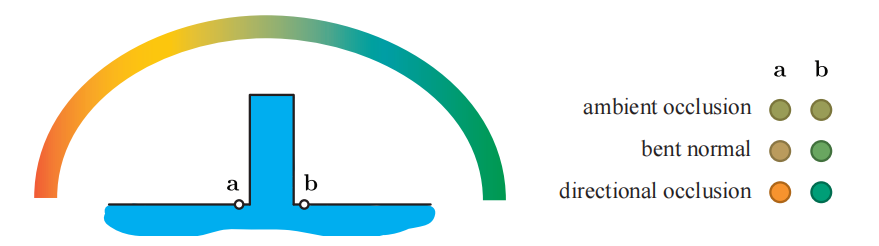

我们将专注于编码整个球面可见性或者半球可见性的方法，即描述哪些方向会阻挡入射radiance的方法。这些信息可以用来为精确光源产生阴影，但这并不是它的主要目的。针对这些特定类型光源的专用方法（详见第7章），能够生成质量更好的阴影，因为它们只需要对光源的某个位置或者某个方向进行可见性编码即可。

这里我们所要描述的解决方案，主要是用于为大面积光源或者环境照明提供遮挡效果，这些方法可以生成柔和的阴影，并且由近似可见性所引起的瑕疵也不是很明显。此外，这些方法还可以在常规阴影技术无法运行的时候，提供一些遮挡效果，例如凹凸贴图细节所产生的自阴影，以及超大场景的阴影，导致阴影贴图没有足够的分辨率。

### 11.4.1 预计算定向遮蔽

Max \[1145]引入了视界映射（horizon mapping）的概念来描述高度场表面的自遮挡现象。在视界映射中，对于表面上的每个点，会根据一组方位角方向来确定视界角度，例如8个方向：北、东北、东、东南、以此类推。

我们可以不存储在给定方位上的视界角，而是将未遮挡的三维方向集合作为一个整体，将其建模为椭圆\[705, 866]或者圆形\[1306, 1307]孔径，其中后一种技术被称为环境光圈照明（ambient aperture lighting，如图11.19所示）。这些技术对存储的要求比视界映射低，但是当未遮挡的方向不像椭圆或者圆的时候，可能会产生错误的阴影效果。例如在一个平面上，以规则间隔突出的山峰，应该设置一个星形的未遮挡方向，这与上述椭圆方案和圆形方案不匹配。

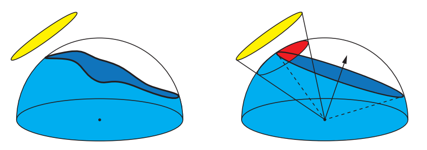

遮挡技术有许多变种。Wang等人\[1838]使用了球形符号距离函数（spherical signed distance function，SSDF）来表示可见性。它将一个到被遮挡区域边界的符号距离编码到球体上。章节10.3节中所讨论的任何球面基底或者半球基底，都可以用来对可见性进行编码\[582, 632, 805, 1267]。就像环境光遮蔽一样，这些定向可见性信息可以存储在纹理、网格顶点或者体积中\[1969]。

### 11.4.2 定向遮蔽的动态计算

许多用于生成环境光遮蔽的方法，同样也可以用于生成定向的可见性信息。Ren等人\[1482]提出的球谐函数指数方法，以及Sloan等人\[1655]提出的屏幕空间变体，以球谐向量的形式来生成可见性。如果使用多个SH频带，这些方法本身就可以提供方向信息，同时使用更多的频带可以更加精确的对可见性进行编码。

锥形追踪方法，例如Crassin等人\[305]和Wright \[1910]所提出的方法，它们为每个追踪区域都提供了一个遮挡值。出于质量原因，即使是对环境光遮蔽进行估计，也是会进行多次锥形追踪，这些可用的信息本身就已经具有方向性了。如果还需要某些特定方向的可见性，我们还可以在该方向上执行较少次数的锥形追踪。

Iwanicki \[806]也使用了锥形追踪，但他将其限制在了一个方向上。该方法将动态角色近似为一组球体，追踪的结果用于生成投射到静态几何体上的软阴影，这与Ren等人\[1482]和Sloan等人\[1655]的方法相类似。在这个解决方案中，静态几何物体的照明使用AHD进行编码存储（详见章节10.3.3）。环境光遮蔽和定向遮蔽这两部分的可见性可以独立进行处理，其中在对于定向可见性而言，会对指定方向进行一次锥形追踪，并与球体进行相交，从而计算其衰减因子。

许多屏幕空间中的方法也可以进行扩展，从而提供定向的遮挡信息。Klehm等人\[904]使用z-buffer数据来计算屏幕空间中的环境圆锥（screen-space bent cone），这些圆锥实际上就是圆形孔径，这与Oat和Sander\[1307]离线预计算的圆锥非常相似（章节11.4.1）。当对像素的邻域进行采样的时候，它会将未遮挡的方向相加，最终的结果向量，其长度可以用来估计可见性锥（visibility cone）的顶角大小，其方向则定义了可见锥的轴。Jimenez等人\[835]使用视界角度来估计圆锥的轴方向，并使用环境遮挡因子来推导出圆锥的顶角大小。

### 11.4.3 使用定向遮蔽进行着色

由于编码定向遮蔽的方式实在太多，因此我们无法提供一个标准通用的着色方案，具体所使用的解决方案将取决于我们想要达到的特定效果。

让我们再次回顾反射方程，在这个版本的方程中，我们将入射radiance拆分为远处的照明$L_i$及其可见性$v$：

$$
L_{o}(\mathbf{v})=\int_{\mathbf{l} \in \Omega} f(\mathbf{l}, \mathbf{v}) L_{i}(\mathbf{l}) v(\mathbf{l})(\mathbf{n} \cdot \mathbf{l})^{+} d \mathbf{l}
\tag{11.26} 
$$

我们能够做的最简单的操作，就是使用可见形信号来遮挡精确光源。由于大多数编码可见性的方法都很简单，其结果的质量往往也不太令人满意，但是这样的方法可以让我们在一个基本的例子中进行推理。这种方法同样也可以用于传统阴影方法由于分辨率不足而失效的情况，在这种情况下，生成的结果精度没有那么重要，总比没有任何形式的遮挡要好得多。这种情况包括：面积非常大的地形模型，使用凹凸贴图表示的表面微小细节等。

根据章节9.4中的讨论，当处理精确光源的时候，方程11.26会变为：

$$
L_{o}(\mathbf{v})=\pi f\left(\mathbf{l}_{c}, \mathbf{v}\right) \mathbf{c}_{\text {light }} v\left(\mathbf{l}_{c}\right)\left(\mathbf{n} \cdot \mathbf{l}_{c}\right)^{+}
\tag{11.27} 
$$

其中$\mathbf{c}_{\text {light }}$是一个纯白的Lambertian表面正对光源时所反射出的颜色，$\mathbf{l}_{c}$是指向光源的方向。

我们可以把上面的方程解释为，首先计算材质对未遮挡光源的响应结果，再将结果乘以可见性函数的值。如果光线方向位于视界以下（当使用视界映射时）、或者位于可见锥之外（当使用环境光圈照明时）、或者位于SSDF的负区域，那么可见性函数的值为零，因此不需要考虑来自光源的任何贡献。值得一提的是，尽管可见性函数被定义为一个二进制函数，但是许多表示方式都可以返回整个范围内的值，即$[0,1]$，而不仅仅是非0即1，位于范围内的非整数值代表部分遮挡的情况。

> 至少在大多数情况下是这样。在某些情况下，我们希望可见性函数取0和1以外的值，但是仍然位于$[0,1]$范围内。例如：当对由半透明材质所引起的遮挡进行编码时，我们可能会希望使用小数遮挡值。

由于振铃效应，球谐函数或者H-basis甚至可能会重建出负值，这些行为是我们不想要的，它只是编码方式的固有属性。

我们可以对面光源进行类似的推理。在这种情况下，位于光源所对应的立体角内，$L_i$等于光源发出的radiance；位于光源所对应的立体角外，$L_i$为零。我们将其记作$L_l$，并假设它在光源立体角上是恒定的。此时我们可以将对整个球体$\Omega$的积分，转换为对光源立体角$\Omega_l$的积分，即：

$$
L_{o}(\mathbf{v})=L_{l} \int_{\mathbf{l} \in \Omega_{l}} v(\mathbf{l}) f(\mathbf{l}, \mathbf{v})(\mathbf{n} \cdot \mathbf{l})^{+} d \mathbf{l}
\tag{11.28} 
$$

如果我们假设方程中的BRDF也是常数，例如Lambertian表面，那么它也可以从积分中提出来，即：

$$
L_{o}(\mathbf{v})=\frac{\rho_{\mathrm{ss}}}{\pi} L_{l} \int_{\mathbf{l} \in \Omega_{l}} v(\mathbf{l})(\mathbf{n} \cdot \mathbf{l})^{+} d \mathbf{l}
\tag{11.29} 
$$

为了确定被遮挡的光照，我们需要计算可见性函数乘上余弦项，在光源所对应的立体角上的积分。在某些情况下，这个积分可以通过解析计算出来。Lambert \[967]推导了一个方程，用于计算一个球面多边形上的余弦积分。如果我们的面光源是多边形的，并且我们可以根据可见性表示来对其进行剪裁的话，那么我们只需要使用这个Lambert方程就可以得到精确的结果，如图11.20所示。例如：当我们选择视界角作为可见性表示的时候，就可以这么做。然而，如果出于某种原因，我们选择了其他的编码方式，例如环境圆锥（bent cone），此时再对光源进行裁剪将会产生圆形片段，因此我们将无法再使用Lambert方程。如果我们的面光源是非多边形的话，上述原则同样适用。

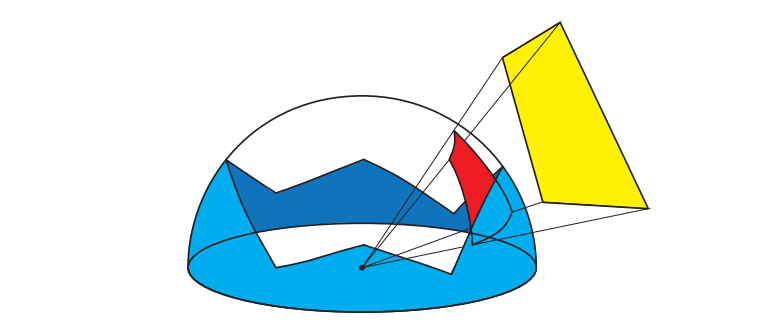

还有另外一种可能的假设方法，即假设余弦项的值在整个积分域中是个常数。如果面光源的尺寸很小的话，那么这种近似是相当精确的。简单起见，我们可以使用面光源中心方向所对应的余弦值。这时，我们只需要计算可见性函数在光源立体角上的积分即可。下一步的操作，还是取决于我们所选择的可见性表示方法和面光源类型。如果我们使用球形光源，并且使用环境圆锥来表示可见性的话，那么积分的值就是可见性圆锥与光源圆锥相交部分所对应的立体角。这部分是可以解析计算的，Oat和Sander \[1307]推导出了一种计算方法，虽然精确求解的方程相当复杂，但是好在他们还提供了一个近似解，这个近似解在实践中十分有效。如果使用球谐函数来编码可见性的话，那么这个积分同样也可以解析计算。

对于环境光照而言，我们无法限制积分的范围，因为光照是来自四面八方的。我们需要找到一种方法来计算方程11.26中的完整积分。为了简单起见，让我们首先考虑Lambertian BRDF：

$$
L_{o}(\mathbf{v})=\frac{\rho_{\mathrm{ss}}}{\pi} \int_{\mathbf{l} \in \Omega} L_{i}(\mathbf{l}) v(\mathbf{l})(\mathbf{n} \cdot \mathbf{l})^{+} d \mathbf{l}
\tag{11.30} 
$$

这个方程中的积分叫做三重乘积积分（triple product integral）。如果其中的单个函数可以使用特定的方式来进行表示的话（例如球谐函数或者小波），那么它是可以通过解析计算出来的。但不幸的是，这对于通常的实时应用程序而言太昂贵了，尽管这样的解决方案已经被证明，可以在简单的环境设置中以交互式帧率来运行\[1270]。

不过，我们的这个例子稍微简单一些，因为其中一个函数是余弦函数。我们可以将方程11.30改写为：

$$
L_{o}(\mathbf{v})=\frac{\rho_{\mathrm{ss}}}{\pi} \int_{\mathbf{l} \in \Omega} \overline{L_{i}}(\mathbf{l}) v(\mathbf{l}) d \mathbf{l}
\tag{11.31} 
$$

或者：

$$
L_{o}(\mathbf{v})=\frac{\rho_{\mathrm{ss}}}{\pi} \int_{\mathbf{l} \in \Omega} L_{i}(\mathbf{l}) \bar{v}(\mathbf{l}) d \mathbf{l}
\tag{11.32} 
$$

其中：

$$
\begin{aligned} \overline{L_{i}}(\mathbf{l}) & =L_{i}(\mathbf{l})(\mathbf{n} \cdot \mathbf{l})^{+}, \\ \overline{v}(\mathbf{l}) & =v(\mathbf{l})(\mathbf{n} \cdot \mathbf{l})^{+} .\end{aligned}
$$

与$L_{i}(\mathbf{l})$和$v(\mathbf{l})$一样，$\overline{L_{i}}(\mathbf{l})$和$\overline{v}(\mathbf{l})$都是球面函数。我们没有尝试直接去计算这个三重乘积积分，而是首先将余弦项乘以$L_i$（方程11.31）或者$v_i$（方程11.32），这样做使得被积函数变成两个函数的乘积。虽然这看起来只是一个数学技巧，但是它可以极大地简化计算。如果被积函数中的乘积因子，使用了标准正交基（例如球谐函数）来进行表示，那么这个二重乘积积分可以很简单的计算出来，积分的结果就是它们系数向量的点积（章节10.3.2）。

但是我们仍然需要计算$\overline{L_{i}}(\mathbf{l})$或者$\overline{v}(\mathbf{l})$，由于它们都包含了余弦项，因此要比完全一般的情况稍微简单一些。如果我们使用球谐函数来表示这些函数，那么余弦函数将会被投影到球带谐波（zonal harmonics，ZH）上。球带谐波是球谐函数的一个子集，其中每个频带只有一个系数是非零的（详见章节10.3.2）。这个投影的系数有一个很简单的解析公方程\[1656]。SH和ZH的乘积计算效率，要比SH和SH的乘积高得多。

如果我们决定先将余弦项乘以$v$（方程11.32），那么我们可以在离线环境中对其进行预计算，同时只需要存储可见性即可。正如Sloan等人\[1651]所描述的那样（章节11.5.3），这是一种形式的预计算radiance传输（precomputed radiance transfer）。然而，在这种形式下，我们无法对法线进行任何精细的修改，因为由法线控制的余弦项已经和可见性函数融合在一起了。如果我们想要模拟精细尺度的法线细节，则可以先用$L_i$乘以余弦项（方程11.31）。由于我们事先并不知道法线的具体方向，因此可以预先计算出不同法线所对应的乘积\[805]，或者是在运行过程中动态执行乘法操作\[809]。离线预计算$L_i$和余弦项的乘积意味着，我们对光照的任何修改都会受到限制，并且允许光照在空间上发生变化会消耗大量的内存。另一方面，在运行时计算这个乘积的开销也很高。Iwanicki和Sloan \[809]描述了如何降低这一操作的成本，在他们的例子中，这个乘积可以在更低的粒度（顶点）上进行计算。乘积的结果与余弦项进行卷积，再投影到一个更简单的表示方法（AHD）上，然后再使用逐像素的法线进行插值和重建。这种方法允许他们在60 FPS的游戏中，使用$L_i$乘以余弦项的策略。

Klehm等人\[904]提出了一种使用环境贴图表示光照，并使用锥形编码可见性的解决方案。他们使用了不同大小的滤波核来对环境贴图进行过滤，这些滤波核代表了不同锥形开口的可见性与光照乘积的积分。他们按照锥形开口角度大小的增加，将结果存储在纹理的mipmap中。这样做是合理的，因为较大锥形开口的预过滤结果在球体上会平滑变化，因此不需要使用较高分辨率来进行存储。在预过滤的过程中，他们假设可见性锥的方向与法线是对齐的，这是一个近似假设，但是在实践中可以给出较为可信的结果。他们还分析了这种近似是如何对最终质量产生影响的。

如果我们需要处理光泽BRDF和环境光照，那么情况就要更加复杂了。此时我们无法再将BRDF从积分中提取出来，因为它并不是一个常数。为了解决这个问题，Green等人\[582]建议用一组球面高斯函数（spherical Gaussian）来对BRDF本身进行近似。这些球面高斯函数都是径向对称的，它们可以使用三个参数来进行表示（十分紧凑）：方向（或者平均值）$\mathbf{d}$，标准差$μ$和振幅$w$。这个近似BRDF可以定义为球面高斯函数的和：

$$
f(\mathbf{l}, \mathbf{v}) \approx \sum_{k} w_{k}(\mathbf{v}) G\left(\mathbf{d}_{k}(\mathbf{v}), \mu_{k}(\mathbf{v}), \mathbf{l}\right)
\tag{11.33} 
$$

其中$G(\mathbf{d}, \mu, \mathbf{l})$是一个球面高斯波瓣，它指向方向$\mathbf{d}$，锐度为$\mu$（详见章节10.3.2）；$w_{k}$是第$k$个波瓣的振幅。对于各向同性的BRDF而言，其波瓣的形状仅仅取决于法线方向和观察方向之间的夹角。我们可以将一组近似值存储在一维查找表中，并在运行时进行插值重建。

有了这个BRDF近似，我们可以将方程11.26改写成：

$$
\begin{aligned} L_{o}(\mathbf{v}) & \approx \int_{\mathbf{l} \in \Omega} \sum_{k} w_{k}(\mathbf{v}) G\left(\mathbf{d}_{k}(\mathbf{v}), \mu_{k}(\mathbf{v}), \mathbf{l}\right) L_{i}(\mathbf{l}) v(\mathbf{l})(\mathbf{n} \cdot \mathbf{l})^{+} d \mathbf{l} \\ & =\sum_{k} w_{k}(\mathbf{v}) \int_{\mathbf{l} \in \Omega} G\left(\mathbf{d}_{k}(\mathbf{v}), \mu_{k}(\mathbf{v}), \mathbf{l}\right) L_{i}(\mathbf{l}) v(\mathbf{l})(\mathbf{n} \cdot \mathbf{l})^{+} d \mathbf{l} .\end{aligned}
\tag{11.34} 
$$

Green等人还假设可见性函数在每个球面高斯的范围内都是恒定的，这使得他们可以将可见性项从积分中提取出来。他们在波瓣的中心方向上计算了可见性函数，最终的方程形式如下：

$$
L_{o}(\mathbf{v}) \approx \sum_{k} w_{k}(\mathbf{v}) v_{k}\left(\mathbf{d}_{k}(\mathbf{v})\right) \int_{\mathbf{l} \in \Omega} G\left(\mathbf{d}_{k}(\mathbf{v}), \mu_{k}(\mathbf{v}), \mathbf{l}\right) L_{i}(\mathbf{l})(\mathbf{n} \cdot \mathbf{l})^{+} d \mathbf{l}
\tag{11.35} 
$$

剩余的积分代表了入射光线与球面高斯进行卷积，这个球面高斯是给定方向和给定标准差的。这个卷积的结果可以进行预先计算，并存储在一个环境贴图中，其中较大的$\mu$所对应的卷积结果存储在较低的mipmap层级中。这里的可见性可以使用较低阶的球谐函数进行编码，或者是任何其他的表示方法，因为这里只需要进行点计算即可。

Wang等人\[1838]以类似的方式来对BRDF进行近似，不同的是他们以一种更加精确的方式来处理可见性。他们的表示方法允许在可见性函数的范围内，计算单个球面高斯函数的积分。他们使用这个积分值来引入一个新的球面高斯函数，它具有相同的方向和标准差，但是振幅不同，他们会在实际的光照计算中使用这个新的球面高斯函数。

对于某些应用程序而言，这种方法可能会过于昂贵。因为它需要从预过滤的环境贴图中进行多次采样，而纹理采样往往会成为渲染过程中的瓶颈。Jimenez等人\[835]和El Garawany \[414]给出了更简单的近似方法，为了计算遮挡因子，他们使用一个圆锥来表示整个BRDF波瓣，忽略了BRDF波瓣对观察角度的依赖，只考虑材质粗糙度等参数，如图11.21所示。它们将可见性近似为一个圆锥体，并计算可见性圆锥与BRDF圆锥相交部分的立体角，就像环境光圈照明所做的那样。这个计算出来的标量结果会用于对光照的衰减，虽然这是一个重大的简化，但是最终的结果看起来是可信的。

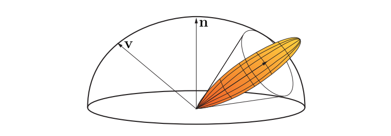

## 11.5 漫反射全局光照

接下来几个小节将介绍的各种方法，它们不仅可以实时模拟遮挡效果，还可以模拟完整的光线弹射。它们可以大致分为两种算法，它们各自拥有不同的假设，即光线在到达眼睛之前，从一个漫反射表面反射回来，还是从一个镜面反射回来。相应的光线路径可以表示为$L(D|S)∗DE$或者$L(D|S)∗SE$，其中有许多方法都对早期的反弹类型进行了限制。第一组解决方案假设光线的入射方向在着色点上半球范围内平滑变化，或者直接忽略这种变化。第二组解决方案则假设光线的入射方向具有很高的变化率，这个假设依赖于这样的一个事实，即光线只会从一个相对较小的立体角中照射到着色点上。由于这两种约束条件的差别很大，因此将它们分开处理是有益的。我们在本小节中介绍漫反射全局照明的方法，在下一节中介绍镜面全局光照的方法，然后在最后一节中介绍未来很可能会应用的统一方法。

### 11.5.1 表面预照明（Surface Prelighting）

辐射度算法和路径追踪算法都是为离线使用而设计的。虽然已经有了一些在实时环境中使用它们的尝试，但是结果仍然太不成熟，无法用于实际的产品中。目前最为常见的做法是使用它们来预先计算与光照相关的信息。这个昂贵的离线过程是预计算的，计算出来的结果会被存储起来，然后在显示期间使用，从而提供高质量的光照效果。正如章节11.3.4中所述，以这种方式对静态场景进行预计算的过程被称为烘焙（baking）。

这种做法有一定的限制。如果我们提前进行光照计算，那么我们将无法在运行过程中更改场景的设置。场景中的所有几何体、灯光和材质都需要保持不变，我们无法改变一天中的时间，也不能在墙上炸一个洞。但是在许多情况下，这种限制是一种可以接受的权衡，例如：建筑可视化的相关应用可以假设用户只在虚拟环境中走动；游戏同样也会限制玩家的行动等。在这样的应用中，我们可以将几何物体分为静态物体（static）和动态物体（dynamic）。在预计算过程中会使用静态物体来计算光照，让它们与光源充分进行交互作用。比如静态的墙壁会投下阴影，静态的红地毯反射出红光。动态物体只会充当接收者，它们不会遮挡光线，也不会产生间接的光照效果。在这样的场景中，动态几何物体的尺寸通常会被限制得相对较小，这样可以忽略它们对光照的影响，或者是使用其他技术来进行建模，从而最小化光照质量的损失。例如：动态几何物体可以使用屏幕空间中的一些方法来生成遮挡效果。常见的动态物体包括角色、装饰性的几何体以及车辆等。

可以进行预计算的、最简单的照明信息就是irradiance。对于一个平坦的Lambertian表面，irradiance和表面颜色一起，完整描述了材质对于光照的反应。因为光源的照明效果是彼此独立的，所以动态光源可以被添加在预计算的irradiance之上，如图11.22所示。

1996年的《雷神之锤》和1997年的《雷神之锤2》是第一个使用预计算irradiance的商业交互式应用程序。Quake预先计算了静态光源的直接贡献，这主要是作为一种提高性能的方法。《雷神之锤2》还计算了一个间接分量，使其成为第一款使用全局光照算法来生成更加真实光照的游戏。它使用了一种基于辐射度的算法，因为这种技术非常适合用于计算Lambertian环境中的irradiance。此外，由于内存的时间限制，光照的分辨率相对较低，这与辐射度解决方案中典型的模糊、低频阴影匹配得很好。

预计算的irradiance通常会和漫反射颜色或者albedo贴图相乘，并单独存储在一个纹理集合中。虽然在理论上可以预先计算出辐射出度（exitance，等于irradiance乘以漫反射颜色），并将其存储在一组纹理中，但是在大多数实际情况下，许多应用都没有采用这个做法。因为颜色贴图的使用频率通常会很高，它们利用了各种类型的分块平铺，并且其中的部分区域经常会在模型之间进行重复使用，所有的这些操作都是为了保持合理的内存使用。而irradiance的使用频率则要低得多，重复使用的情况也很少。因此将光照信息和表面颜色分开存储，可以消耗更少的内存空间。

除了限制最为严格的硬件平台之外，如今已经很少使用预计算irradiance的方法了。因为根据定义，irradiance是针对给定的法线方向进行计算的，这意味着我们无法对物体的表面法线进行修改，我们无法使用法线映射来提供高频的表面细节。这也意味着只能对平面进行预计算irradiance。如果我们需要在动态几何物体上使用烘焙光照，我们就需要其他的方法来存储这些光照信息。这些限制条件促使人们寻找一种方法，来存储带有方向分量的预计算光照。

### 11.5.2 定向表面预照明

为了在Lambertian表面上使用预照明和法线映射，我们需要一种方法来表示irradiance随表面法线的变化。为了给动态几何物体提供间接光照，我们还需要在每个可能的表面方向上进行计算。幸运的是，我们已经有了各种工具可以用于表示这样函数。在章节10.3中，我们描述了根据法线方向确定光照的各种方法。这些方法中包括了针对半球函数域的专门解决方案，就像不透明表面的情况一样，球体下半部分的值是无关紧要的。

最常用的方法是存储完整的球面irradiance信息，例如使用球谐函数来进行存储。该方案首先是由Good和Taylor \[564]在加速光子映射（photon mapping）的背景下提出的，并被Shopf等人\[1637]在应用在了实时场景中。在这两种情况下，定向的irradiance都会存储在纹理中。如果采用9个球谐系数（即三阶SH），可以获得较好的质量，但是存储和带宽的成本较高。如果只使用四个系数（即二阶SH）的话，虽然成本较低，但是会丢失许多细节信息，光线的对比度较低，法线贴图也不太明显。

Chen \[257]使用了《光环3》方法的一种变体，这种方法的目的是以较低的成本来实现三阶SH的质量。他从球面信号中提取出最主要的光照，并将其分离存储为一个颜色和一个方向。剩余的基底则使用二阶SH来进行编码，使用这种方法，可以将系数的数量从27个减少到18个，而且质量损失很小。Hu \[Lightmap Compression in Halo 3", Yaohua Hu, GDC 2008]描述了如何对这些数据进行进一步地压缩。Chen和Tatarchuk \[258]在生产环境中使用了基于GPU的烘焙管线，他们提供了进一步的信息。

Habel等人\[627]所提出的H-basis是另一种可选的解决方案。由于它只对半球面上的信号进行编码，因此可以使用较少的系数提供与球谐函数相同的精度。仅仅使用六个系数就可以获得与三阶SH相当的质量。因为H-basis只会针对一个半球进行定义，所以我们需要表面上的一些局部坐标系来正确地确定它的朝向。通常，由$uv$参数化所产生的切线坐标系可以用于此目的。如果想要在纹理中存储H-basis的分量，那么纹理的分辨率应当足够高，从而适应底层切线空间的变化。如果不同切线空间中的多个三角形覆盖了同一个纹素，那么重建出的信号将会是不精确的。

球谐函数和H-basis的一个问题是，它们都会出现振铃现象（章节10.6.1）。虽然预过滤可以减轻这种现象，但它也会使光照变得更加平滑，这可能并不总是我们想要的。此外，即使是成本较低的变体方法，在存储和计算方面仍然具有相对较高的成本。在一些限制更加严格的情况下，例如在低端平台或者虚拟现实平台上，这种开销可能会令人望而却步。

成本是那些简单替代方案最重要的流行原因。《半条命2》使用了一个自定义的半球基底（章节10.3.3），每个样本存储了三个颜色值，总共有九个系数。尽管AHD（章节10.3.3）很简单，但它也是一个较为流行的选择，它被用在了许多游戏中，例如使命召唤系列\[809, 998]和《最后生还者》\[806]，如图11.23所示。

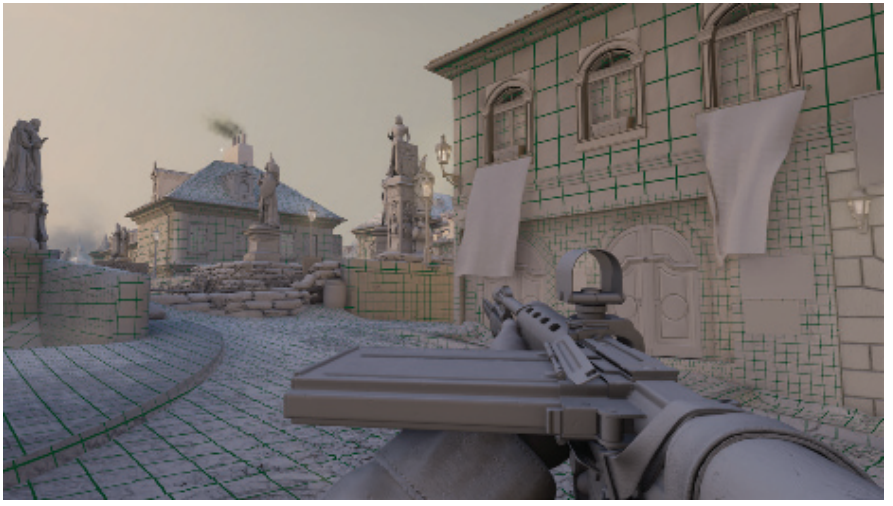

Crytek在游戏《孤岛惊魂》\[806]中使用了一个变体。这种Crytek表示方法包含了切线空间中的平均光线方向、平均光线颜色和一个标量的方向因子。其中最后一个值用于混合环境（ambient）项和定向（directional）项，它们都使用了相同的颜色。这样可以将每个样本的存储空间减少到6个系数：3个系数用于颜色，2个系数用于方向，1个用于方向因子。Unity引擎在它的其中一个模式中也使用了类似的方法\[315]。

这种类型的表示方法是非线性的，这意味着，在技术上而言，对单个组件进行线性插值（无论是在纹素之间还是顶点之间）在数学上是不正确的。如果主要光源的方向变化很快，例如在阴影边界上变化很快，那么在阴影中很可能会出现视觉瑕疵。尽管有这些不准确的地方，但是最终的结果在视觉上还是令人满意的。由于环境光照和定向光照区域之间具有较高的对比度，法线贴图的效果会被增强，这通常是我们想要发生的。此外，定向光照的分量还可以用于计算BRDF的高光响应，这可以为低光泽材质的环境贴图提供一种低成本的替代方案。

在这类算法谱系的另一端，是为高质量视觉表现而设计的方法。Neubelt和Pettineo \[1268]在游戏《教团：1886》中，使用纹理贴图来存储球面高斯函数的系数，如图11.24所示。他们存储的是入射radiance，而不是irradiance，radiance会被投影到一组高斯波瓣上（章节10.3.2），它被定义在一个切线坐标系中。根据具体场景中光照的复杂程度，他们会使用5到9个波瓣。为了产生漫反射响应效果，球面高斯函数会与沿表面法线方向的余弦波瓣进行卷积。通过将高斯函数与镜面BRDF波瓣进行卷积，这种表示方法也足够精确，可以提供低光泽的高光效果。Pettineo详细描述了整个系统\[1408]，他还提供了一个应用程序的源代码，这个应用程序能够烘焙和渲染不同的光照表示方法。

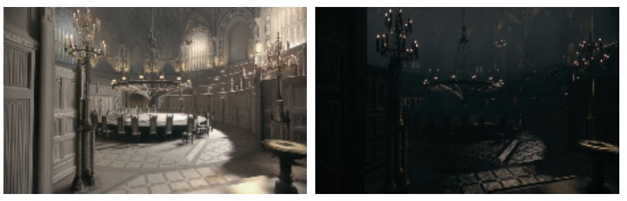

如果我们需要着色点任意方向上的光照信息，而不仅仅是在着色点是半球范围内的光照信息（例如：为动态几何物体提供间接照明），那么我们可以使用一些编码完整球面信号的方法。这里自然而然会提到球谐函数。当不太关心内存开销的时候，三阶SH（每个颜色通道有9个系数）是最流行的选择；否则也可以使用二阶SH（每个颜色通道有4个系数，这与RGBA纹理的通道数量相匹配，因此一个贴图可以存储一个颜色通道的SH系数)。球面高斯函数也适用于完整球体的情况，因为波瓣可以分布在整个球体上，或者也可以只分布在法线周围的半球上。然而，由于需要被波瓣覆盖的立体角是球面技术的两倍，因此可能需要使用更多的波瓣来保持相同的质量。

如果我们想避免处理振铃问题，同时又负担不起使用大量波瓣所带来的开销，那么环境立方体（章节10.3.1）是一个可行的选择\[1193]。它由六个clamped $cos^2$波瓣组成，它们都沿着主轴方向。每个余弦波瓣只覆盖一个半球，即它们具有局部性（local support），这意味着它们只在其球面域的一个子集上具有非零值。因此，在重建过程中只需要使用6个存储值中的3个可见波瓣即可，这限制了光照计算的带宽成本。其重建质量与二阶球谐函数相类似。

环境骰子\[808]（章节10.3.1）可以生产比环境立方体更高质量的结果。该方案采用了12个沿二十面体顶点方向的波瓣，这些波瓣是$cos^2$和$cos^4$波瓣的线性组合。在重建期间会使用12个存储值中的6个，其重建质量可以与三阶球谐函数相媲美。这些表示方法和其他的类似表示方法（例如：由三个$cos^2$波瓣和一个$cos$波瓣所组成的基底，它们被扭曲从而覆盖整个球面）已经在许多商业成功的游戏中进行了使用，例如《半条命2》\[1193]，使命召唤系列\[766, 808]，《孤岛惊魂3》\[533]，《全境封锁》\[1694]和《刺客信条4：黑旗》\[1911]等。

### 11.5.3 预计算传输

虽然上述的预计算光照看起来很惊艳，但是它本质上还是静态的。任何几何物体或者光照的改变都会使整个解决方案失效。就像在现实世界中一样，拉开窗帘（场景中几何物体的局部变化）可能会让整个房间充满光线（光照的全局变化）。人们花费了大量的研究工作来寻找能够允许某些类型变化的解决方案。

如果我们假设场景中的几何物体没有发生变化，只有光照发生了变化，那么我们可以对光线与模型的相互作用进行预计算。物体之间的影响（例如相互反射或者次表面散射），可以预先进行一定程度的分析，并将结果存储下来，而不需要对实际的radiance进行操作。接收入射光线，并将其转换为整个场景的radiance分布，这个函数被称为传输函数（transfer function）。这样的方法被称为预计算传输（precomputed transfer）或者预计算radiance传输（precomputed radiance transfer，PRT）。

与之前所介绍的完全离线的烘焙光照不同，这类技术确实具有明显的运行时间开销。当在屏幕上显示场景时，我们需要计算特定光照环境中的radiance。为了实现这一点，我们需要将一定数量的直接光源“注入”到系统中，然后应用传输函数来将其传播到整个场景中。有些方法会假设这种直接光照来自于环境贴图，还有一些其他的解决方案允许任意的光照设置，并且能够以灵活的方式来进行改变。

Sloan等人\[1651]将预计算radiance传输的概念引入了图形学，他们使用球谐函数来描述它，但是这个方法其实不必使用球谐函数。该方法的基本思想很简单，如果我们使用一定数量（最好是数量较少）的“构件（building block）”光源来描述直接光照，那么我们就可以对场景如何被这些光源单独照亮进行预计算。想象一下，现在房间里有三台电脑显示器，每个显示器只能显示一种颜色，但是其亮度可以发生变化。我们将每个显示器的最大亮度设为1，即归一化的“单位”亮度。我们可以独立地预计算每个显示器对房间照明的影响，这个过程可以使用章节11.2中介绍的方法来完成。因为光线的传输是线性的，所以三个显示器同时照亮场景的结果，就相当于每个显示器直接或者间接发出的光线总和。并且显示器的光照彼此相互独立，互不影响，因此如果我们将其中一个显示器设置为最大亮度的一半，那么这样做只会改变这个显示器对总照明的贡献，并不会影响其他的显示器。

这样做允许我们快速计算整个房间内的全部反弹光线。我们将每个预计算的光源解决方案，乘上显示器的实际亮度，然后再对这些结果进行求和。我们可以打开或者关闭显示器，让它们变得更亮或者更暗，甚至是改变它们的颜色，想要获得最终的光照效果，我们只需要做这些乘法和加法即可，如图11.25所示。&#x20;

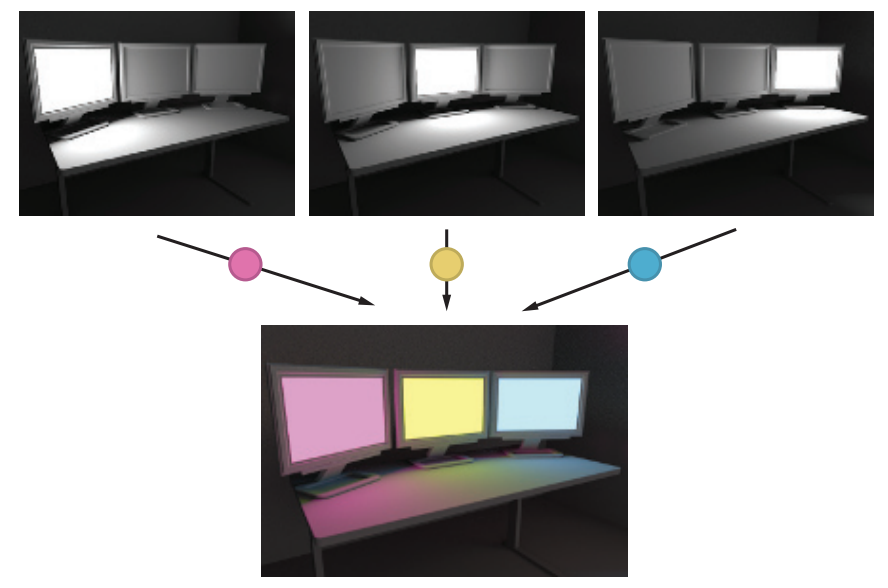

上述过程可以写出如下数学形式：

$$
L(\mathbf{p})=\sum_{i} L_{i}(\mathbf{p}) \mathbf{w}_{i}
\tag{11.36} 
$$

其中$L(\mathbf{p})$是点$\mathbf{p}$的最终radiance；$L_{i}(\mathbf{p})$是来自显示器$i$的预计算单位（归一化）贡献；$\mathbf{w}_{i}$是该显示器的当前亮度。这个方程在数学意义上定义了一个向量空间（vector space），$L_i$是这个空间中的基向量。任何可能的光照效果，都可以通过这些光源贡献的线性组合来生成。

Sloan等人\[1651]的原始PRT论文使用了与上文相同的推理过程，但是具体的背景有所不同，他们使用球谐函数来表示的无限远的环境光照。同时，他们没有存储场景对显示器的响应，而是存储场景对于周围光线的响应，并使用球谐函数来定义周围光线的分布。通过对一些SH波段进行这样的操作，他们可以渲染一个被任意光照环境照亮的场景。他们将这种光照投影到球谐函数上，将每个结果系数乘以其各自的归一化“单位”贡献，然后再将结果加在一起，就像是我们对显示器所做的那样。

请注意，用于将光线“注入”到场景中的基底表示，与用于表达最终光照的表示是独立的。例如：我们可以使用球谐函数来描述场景是如何被照亮的，但是选择另一种基底来存储到达任意给定点上的radiance。假设我们使用一个环境立方体来进行存储，我们会计算有多少radiance会从顶部到达着色点，有多少radiance会从两侧到达着色点。每个方向上的传输都会单独进行存储，而不是作为表示总传输的单个标量值。

Sloan等人\[1651]的PRT论文分析了两个案例。第一种是当接收基底只是表面上的一个标量irradiance时，此时接收物需要是一个完全漫反射的表面，并且需要具有预先定义好的法线，这意味着它无法使用法线贴图来获取精细尺度的细节。传输函数的形式是：输入光照的SH投影与预计算传输向量之间的点积。其中后者可以在整个场景中进行空间变化。

如果我们需要渲染非Lambertian材质，或者要使用法线映射，那么我们可以使用第二种变体。在这种情况下，周围光照的SH投影会被转换为给定点入射radiance的SH投影。因为这个操作为我们提供了整个球面上（或者半球，如果我们处理的是静态不透明物体的话）的完整radiance分布，我们可以将其与任何BRDF进行正确地卷积。此时的传输函数会将SH向量映射到其他的SH向量上，它具有一个矩阵乘法的形式，但是这种乘法操作的成本是很高的，无论是计算量还是内存开销。如果我们对源基底和接收基底都使用三阶SH，那么我们需要为场景中的每个点都存储一个$9×9$的矩阵，并且这些数据仅仅用于黑白（monochrome）传输。如果我们想要实现彩色效果，那么我们就需要3个这样的矩阵，这样每个点需要的内存量就十分惊人了。

一年以后，Sloan等人\[1652]解决了这个问题。他们没有直接存储传输向量或者传输矩阵，而是使用主成分分析（principal component analysis，PCA）技术对整个集合进行了分析。这里的传输系数可以被认为是多维空间中的点（例如：$9 × 9$矩阵意味着空间是81维)，但是这些点在该空间中并不是均匀分布的。它们会形成维数较低的簇，这种聚类就像是沿着直线分布的三维点一样，实际上它们都位于三维空间的一维子空间中。PCA可以有效地检测出这种统计意义上的关系。一旦PCA发现了子空间，就可以使用更少的坐标来表示这些点，因为我们可以使用更少的维度来存储子空间中的位置。用刚才的直线例子来类比，我们不需要使用三个坐标来存储一个点的完整位置信息，我们只要存储该点沿直线的距离即可。Sloan等人使用这种方法，将传输矩阵的维度从625维（$25 × 25$传输矩阵）降低到256维。虽然这个维度对于常见的实时应用程序而言还是太高了，但是它为后续方法拓展了思路，许多后来的光线传输算法均采用了PCA来作为数据压缩的一种方式。

这种降维存储本质上是有损压缩的。在极少数情况下，数据点会形成完美的子空间；但是大多数情况下它只能对原始数据进行近似，因此将原始数据投影到子空间中的数据上会导致一些退化。为了提高质量，Sloan等人将一组传输矩阵划分为若干个簇，分别对每个簇进行PCA操作。这个过程还包括了一个优化步骤，以确保聚类边界上不会出现不连续现象。他们还提出了一种允许物体发生有限形变的扩展变体，被称为局部可变形预计算radiance传输（local deformable precomputed radiance transfer，LDPRT）\[1653]。

PRT已经在一些游戏中以各种形式进行了使用。PRT在玩法侧重于户外区域的游戏中尤其受欢迎，因为这些区域的时间和天气条件都是动态变化的。《孤岛惊魂3》和《孤岛惊魂4》都使用了PRT，其中源基底是二阶SH，接收基底是一个自定义的四方向基底\[533, 1154]。《刺客信条4：黑旗》使用一个基底函数作为来源（太阳颜色），在一天中的不同时间中对传输进行了预计算。这种表示方式可以理解为在时间维度上来定义源基底函数，而不是在方向维度上。《刺客信条4：黑旗》中的接收基底与《孤岛惊魂》系列中所使用的相同。

SIGGRAPH 2005关于预计算radiance传输的课程\[870]，对这个领域的研究进行了很好地综述。Lehtinen \[1019, 1020]给出了一个数学框架，这个框架可以用来分析各种算法之间的差异，并据此开发新的算法。

原始PRT方法假设周围的光照是无限远的。虽然这个模型可以很好的模拟室外场景的光照效果，但是它对室内环境的限制太大了。然而，正如我们之前所提到的，这里的核心概念是：光照的初始来源是完全不可知的。Kristensen等人\[941]描述了一种方法，该方法对一组分散在整个场景中的光源进行了PRT计算。这对应了存在大量的“源”基底函数，然后这些光源会被组合成聚类，接收光照的几何物体也会被划分到若干个区域中，每个区域中的物体都会受到不同光源子集的影响。这个过程会显著压缩传输的数据。在运行过程中，会通过从预计算集合中对最近的光源进行插值，从而来近似计算放置在任意位置上的光源所产生的光照效果。Gilabert和Stefanov \[533]在游戏《孤岛惊魂3》中使用了这种方法来生产间接光照效果。但是这种方法的基本形式只能处理点光源，无法处理其他类型的光源。虽然这类方法也可以进行扩展，从而支持其他类型的光源，但是其开销会随着每个光源的自由度成指数级增长。

到目前为止所讨论的PRT技术预计算了来自一些元素之间的传输函数（向量和矩阵），然后会将其用于模拟光源。另一类流行的方法是对表面之间的传输进行预计算，在这种类型的系统中，光照的实际来源变得无关紧要。可以使用任何类型、任意位置的光源，因为这类方法的输入是来自某些表面集合的出射radiance（或者其他相关的物理量，例如irradiance，如果方法假设只存在漫反射表面的话)。这些直接光照的计算，可以使用阴影（第7章）、irradiance环境贴图（章节10.6），或者本章前面所讨论的环境光遮蔽和定向遮蔽等方法。场景中的任何表面，可以通过设置其出射radiance，来将其转换为一个面光源。

根据这些原则设计实现的系统，其中最流行的就是由Geomerics开发的Enlighten，如图11.26所示。虽然该算法的确切细节从未完全公开过（不开源），但是许多演讲和演示都准确描述了该系统的原理\[315, 1101, 1131, 1435]。这个系统应用于早期版本的Unity引擎中。

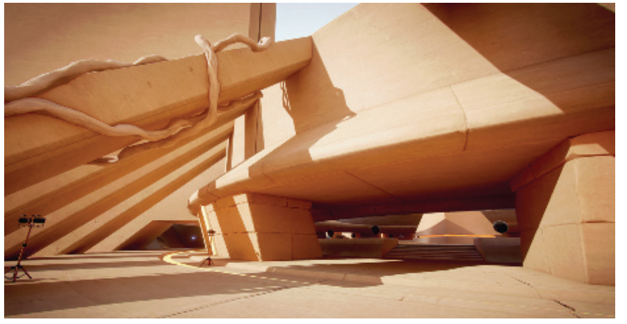

为了实现光线传输的目的，我们假设场景中的表面都是Lambertian的。使用Heckbert的符号表示法，这里我们处理的路径集合是$LD∗(D|S)E$，因为眼睛所看到的最后一个表面不需要是纯漫反射的，只是在计算光线传输的时候，光线会在场景中的漫反射表面上进行弹射预计算。系统定义了一组“源”元素和另一组“接收”元素。源元素存在于表面上，并共享表面上的一些属性，例如漫反射颜色和表面法线。预处理步骤会计算光线在源元素和接收元素之间的传输情况和传输信息。这种信息的确切形式取决于源元素具体是什么，以及用于在接收器上收集光照的基底是什么。在最简单的形式中，源元素可以是点，然后我们会在接收位置处生成irradiance；在这种情况下，传输系数就是源和接收物之间的相互可见性。在运行过程中，会将所有源元素的出射radiance提供给系统，根据这些信息，我们可以利用预计算的可见性，以及已知的源和接收物的位置、方向等信息，来对反射方程（方程11.1）进行数值积分。使用这种方法，就完成了光线的一次弹射，由于大多数间接光照效果都来源于第一次弹射，因此仅仅执行一次弹射就足以提供合理的光照效果了。然而，我们可以使用这个光线，再次运行传播步骤来生成第二次反弹的光线。这个过程通常是在几帧中完成的，其中上一帧的输出会作为下一帧的输入。

使用点作为源元素会产生大量的连接（connection）。为了提高性能表现，法线和颜色相似区域的聚类（簇）也可以用作源集合。在这种情况下，传输系数与辐射度算法中所看到的形状因子相同（章节11.2.1）。请注意，尽管二者有相似之处，但是该算法与经典的辐射度算法是不同的，因为它每次只会计算一次弹射的光线，并且不涉及求解线性方程组的问题。该算法借鉴了渐进辐射度（progressive radiosity）的思想\[275, 1642]。在这个系统的一次迭代过程中，一个patch可以确定它能够从其他patch接收到多少能量。将radiance传输到接收位置的过程被称为聚集（gathering）。

接收元素处的radiance可以使用不同的形式进行聚集。向接收元素的传输过程，可以使用我们之前所描述过的任何定向基底。在这种情况下，原来的单个系数会变成一个向量，其维数等于接收基底中的函数数量。当使用定向表示方法来执行聚集操作的时候，生成的结果与章节11.5.2中所描述的离线解决方案相同，因此它可以与法线映射方法一起使用，也可以提供低光泽材质的高光响应。

在许多变体中都使用了这个思想。为了节省内存，Sugden和Iwanicki \[1721]使用了SH传输系数，对它们进行了量化，并将它们间接地存储为调色板中某个记录（entry）的索引（index）。Jendersie等人\[820]构建了一个包含源patch的层次结构，当子patch所覆盖的立体角太小时，会将高层元素的引用存储在这个树中。Stefanov \[1694]引入了一个中间步骤，其中表面元素的radiance首先会传播到场景的体素化表示中，然后再作为传输的源。

（在某种意义上）将表面划分为源patch的理想分割方式，取决于接收物的位置。对于距离较远的元素而言，将它们作为独立的实体会产生不必要的存储成本，但是当近距离观察它们的时候，则应当将其单独对待。层次化的源patch在一定程度上缓解了这个问题，但是并不能完全解决它。能够为特定接收物进行组合的patch，它们可能要相距足够远才能防止这种合并。Silvennoinen和Lehtinen \[1644]提出了一种解决该问题的新方法。该方法没有显式地创建源patch，而是为每个接收位置生成一组不同的patch。物体会被渲染到散布在场景周围的一组稀疏环境贴图中。每个贴图都会被投影到球谐函数上，而这个低频版本则会“虚拟（virtually）”投影回环境中。接收点会记录它们能够看到多大的投影，并且这个过程会针对每个发送者的SH基函数分别完成。这样做会根据环境探针（probe）和接收点的可见性信息，为每个接收物创建一组不同的源元素。

由于源基底是由投影到SH的一个环境贴图构成的，因此它很自然地结合了更远的表面。为了选择要进行使用的探针，接收物会使用一种倾向于附近的探针的启发式方法，这使得接收物可以以相似的尺度来“观察”环境。为了限制必须存储的数据量，会使用聚类PCA对传输信息进行压缩。

Lehtinen等人\[1021]描述了另一种形式的预计算传输方法。在这种方法中，源元素和接收元素都不位于网格上，而是位于体积中，因此可以在三维空间中的任何位置上进行查询。这种形式可以很方便地在静态物体和动态物体之间提供一致的光照效果，但是其计算量相当大。

Loos等人\[1073]预计算了具有不同侧壁（side wall）配置的、模块化的、单元格内的传输。然后将多个这样的单元格缝合和扭曲，从而对场景的几何形状进行近似。radiance首先会传播到单元格边界处，然后使用预计算模型来将其传播到邻近的单元格中。这种方法的计算速度很快，即使是在移动平台上也可以有效运行，但是其结果质量较低，可能无法满足要求更高的应用程序。

### 11.5.4 存储方法

无论我们是想使用完全预计算的光照，还是对传输信息进行预计算，从而允许一些光照的变化，其生成的结果数据都必须要以某种形式进行存储，同时这种形式必须是GPU友好的。

光照贴图（light map）是存储预计算光照最常用的方法之一，它们是存储了预计算信息的纹理。虽然有时像irradiance贴图这样的术语，会用来表示存储特定类型的数据，但是术语光照贴图可以对这些数据和纹理进行统称。在运行过程中，会使用GPU内置的纹理机制，获取到的值通常都是双线性过滤的，这在某些情况下可能并不是完全正确的。例如，当我们使用AHD表示方法时，经过滤波后的D（方向）分量在插值之后将不再是单位长度，因此需要重新对其进行归一化。使用插值也意味着A（环境）和H（高亮）与我们在直接在采样点计算它们所获得的结果相比，也并不是完全相同的。但是，即使表示方法是非线性的，但是结果通常看起来也还能接受。

在大多数情况下，光照贴图都不会使用mipmap，通常而言都是没有必要的，因为与常见的albedo贴图或者法线贴图相比，光照贴图的分辨率都很小。即使在一些高质量的应用程序中，光照贴图中单个纹素所覆盖的面积至少也有$20×20$厘米，甚至是更多。对于这种尺寸的纹素而言，几乎不需要添加额外的mipmap层级。

为了在纹理中存储光照信息，场景中的模型物体需要提供一个唯一的参数化（unique parameterization）。在将一个漫反射颜色纹理映射到一个模型上的时候，对于网格的不同部分使用相同的纹理区域，这样做通常是比较好的，尤其是当模型被一个包含重复图案的贴图纹理化时。但是想要重复使用光线贴图是非常困难的，网格上每个点的光照情况都是唯一的，因此场景中的每个三角形，都需要在光照贴图上占据一块属于自己的唯一区域。创建一个参数化的过程，最开始是将网格分割为更小的块，这可以使用一些启发式方法来自动完成\[1036]，也可以在创作工具中手动完成。通常情况下，其他纹理映射中已经包含了一部分的分割信息，这部分信息也会被使用。接下来，每个块都会被独立地参数化，从而确保它在纹理空间中不会发生重叠\[1057, 1617]。在纹理空间中产生的元素会称为图表（chart）或者壳（shell）。最后，所有生成的chart都会被打包到同一个纹理中，如图11.27所示。

![图11.27：光照信息被烘焙到一个场景中，将光照贴图应用到物体表面上从而实现光照。光照贴图使用了一个唯一的参数化。场景会被划分成多个元素，这些元素被展开并打包成一个共同的纹理。例如：右图左下角的小块对应了地面，它展示了两个立方体的阴影。 \[218\]](images/Chapter-11/202307011533930.png "图11.27：光照信息被烘焙到一个场景中，将光照贴图应用到物体表面上从而实现光照。光照贴图使用了一个唯一的参数化。场景会被划分成多个元素，这些元素被展开并打包成一个共同的纹理。例如：右图左下角的小块对应了地面，它展示了两个立方体的阴影。 \[218]")

必须要小心确保chart之间不会发生重叠，并且chart之间的过滤占用空间（filtering footprint）也必须保持相互独立。当渲染一个给定chart的时候（双线性过滤会访问四个相邻的纹素），其他所有可以被访问的纹素都应该被标记为已使用，这样就不会有其他chart与它们发生重叠。否则，chart之间可能会出现颜色溢出现象，即其中一个chart的光照可能会出现在另一个chart中。对于光照贴图系统来说，提供一个用户可以控制的“排水沟（gutter）”量，用于调整光线贴图chart之间的间距，虽然这种做法十分常见，但是这种chart的分离是没有必要的。一个chart正确的过滤占用空间，可以通过使用一套特殊的规则，在光照贴图空间中通过光栅化来自动确定，如图11.28所示。如果以这种方式光栅化的shell不会发生重叠，那么我们就可以保证不会发生颜色溢出现象。

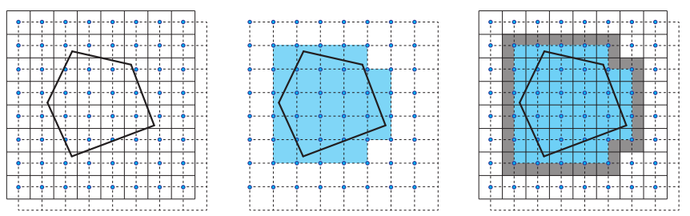

避免颜色溢出是光照贴图很少使用mipmap的另一个原因。chart的过滤占用空间需要在所有mipmap层级上都保持独立，这将会导致shell之间的间距过大。

将chart打包到纹理中的最优方法是一个NP-完全问题，这意味着没有任何已知的算法能够产生一个具有多项式级别复杂度的解。在实时应用程序中，单个纹理可能就会包含数十万个chart，所有现实世界的解决方案，都使用了微调的启发式方法和精心优化的代码来快速进行打包\[183, 233, 1036]。如果这些光照贴图稍后会进行分块压缩（章节6.2.6），那么为了提高压缩质量，还可以向打包器添加一些额外的约束，从而确保单个块中只包含类似的值。

光照贴图的一个常见问题是接缝（seam，如图11.29所示）。因为模型网格被分割成了不同的chart，并且每个chart都是独立进行参数化的，所以不可能确保沿分割边缘两侧的光照效果是完全相同的，这种情况会表现为视觉上的不连续性。如果模型网格是手动分割（参数化）的，可以通过将它们的接缝设置在不可见的区域，从而来避免这个问题。然而，这样做是一个费时费力的过程，并且无法应用在自动生成参数化表示的过程中。Iwanicki \[806]对最终生成的光照贴图进行后处理，对沿着分割边缘的纹素进行修改，从而最小化两侧插值结果的差异。Liu和Ferguson等人\[1058]通过等式约束（equality constraint）来让插值结果与边缘强制匹配，并求解出最能保持两侧平滑的纹素值。另一种方法则是在创建参数化和打包chart的时候考虑这个约束。Ray等人\[1467]展示了如何使用保持网格的参数化（grid-preserving parameterization）来创建不受接缝瑕疵影响的光照贴图。

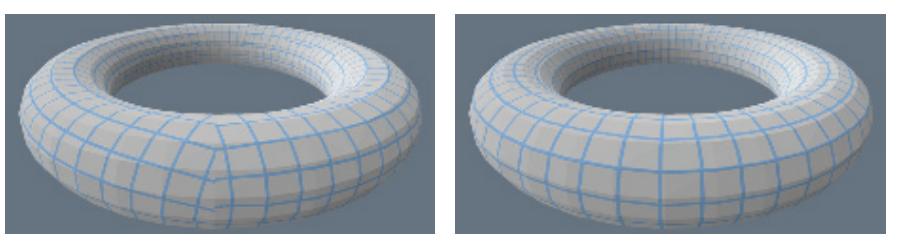

预计算的光照信息也可以存储在网格的顶点上。这样做的缺点是光照质量取决于网格细分的精细程度。因为这个决定通常是在模型创作的早期阶段就做出的，因此很难确保网格上有足够的顶点，使得在所有预期的光照情况下看起来都表现很好。此外，这个网格细分的操作成本可能是很高的。如果网格被细分得很精细，那么光照信号将会被过采样。如果使用定向的光照存储方法，则需要通过GPU在顶点之间对整个光照表示进行插值，并将其传递到像素着色器阶段，从而执行光照计算。在顶点和像素着色器之间传递这么多参数的情况是相当罕见的，并且会产生现代GPU未经优化的工作负载，这会导致效率和性能的低下。由于这些原因，因此很少会在顶点上存储预计算的光照信息。

虽然我们需要表面上的入射radiance信息（第14章会讨论的体渲染除外），但是我们可以通过体积的方式对其进行预计算和存储。这样做可以在空间中的任意位置上查询光照效果，并为预计算阶段不存在于场景中的物体提供照明。但是请注意，这些物体并不会正确地反射光线或者遮挡光线。

Greger等人\[594]提出了irradiance体积的概念，它代表了对irradiance环境贴图进行稀疏空间采样的五维（三个空间和两个方向）irradiance函数。即空间中存在一个三维网格，每个网格点上都是一个irradiance环境贴图。动态物体会从最近的贴图中插值出irradiance值。Greger等人使用了一个两级的自适应网格来进行空间采样，但是也可以使用其他一些体积数据结构，例如八叉树\[1304, 1305]等。

在原始irradiance体积中，Greger等人将每个样本点的irradiance存储在一个小纹理中，但这种表示方法无法在GPU上进行高效过滤。如今，体积光照数据通常会存储在三维纹理中，因此对体积进行采样也可以使用GPU的硬件加速过滤。样本点处的irradiance函数包含以下常见表示方法：

-   二阶和三阶的球谐函数（SH），其中二阶球谐函数要更为常见，因为其单个颜色通道需要使用四个系数，可以很方便地打包成常见纹理格式的四个通道（RGBA）。
-   球面高斯函数。
-   环境立方体或者环境骰子。

AHD编码方法，虽然它在技术上能够表示球面上的irradiance信息，但同时也会产生视觉可见的、分散观众注意力的瑕疵。如果使用SH的话 ，还可以使用球谐梯度（harmonic gradient）来进一步提高质量\[54]。上述这些表示方法在许多游戏中都进行了成功的应用\[766, 808, 1193, 1268, 1643]。

Evans \[444]描述了一个应用在《小小大星球》中计算irradiance体积的技巧，它没有存储完整的irradiance贴图，而是在每个点上存储平均irradiance。根据irradiance场的梯度信息，即irradiance变化最迅速的方向，来计算近似的方向因子。这个梯度并不是显式计算出来的，而是通过在irradiance场中取两个样本，其中一个样本位于表面点$\mathbf{p}$处，另一个样本位于沿方向$\mathbf{n}$上稍微偏移的点上，并让一个样本减去另一个样本，从而计算梯度与表面法线$\mathbf{n}$之间的点积。这种近似表示方法的动机是，《小小大星球》中的irradiance体积是动态计算的。

irradiance体积也可用于为静态物体表面提供照明效果。这样做的好处是不需要为光照贴图提供单独的参数化，因此该技术也不会产生接缝瑕疵。静态物体和动态物体都可以使用相同的光照表示方法，这样两种不同类型的几何物体之间可以得到一致的光照效果。在延迟渲染（章节20.1）中使用这种体积表示方法是很方便的，因为所有光照计算都可以在一个pass中完成。这种方法的主要缺点是内存开销过大，光照贴图所使用的内存量与分辨率的平方成正比；而对于规则的体积结构而言，它所使用的内存量则与分辨率的立方成正比。由于这个原因，网格体积表示方法使用了相当低的分辨率。自适应的、分层的光照体积具有更好的特性，但是它们仍然要比光照贴图存储更多的数据。与规则间距的网格体积相比，它们的执行速度要更慢，因为额外的间接表示会在着色器代码中创建加载依赖，这可能会导致停滞阻塞以及执行速度的变慢。

在体积结构中存储表面照明有些棘手。因为具有截然不同光照特征的多个表面，有时可能会占据相同的体素，我们不确定应当存储哪些数据。当从这样的体素中进行采样时，所获得的光照效果通常是不正确的。这种情况经常会发生在明暗交界处，例如明亮室外和黑暗室内之间的墙壁附近，最终会导致室外出现的黑暗面片或者室内出现的明亮面片。解决方法也很直接，让体素的尺寸足够小即可，使得一个体素永远不会跨越这样的边界，但是这样做通常是不切实际的，因为需要的数据量实在是太大了。处理这个问题最常见的方法是：将采样位置沿着法线进行一些移动，或者是插值过程中调整所使用的三线性混合权重。这些做法通常也是不完美的，可能还需要对几何形状进行手动调整来掩盖问题。Hooker \[766]在irradiance体积中添加了额外的裁剪平面，从而将它们的影响限制在凸多面体的内部。Kontkanen和Laine \[766]讨论了减少颜色溢出的各种策略。

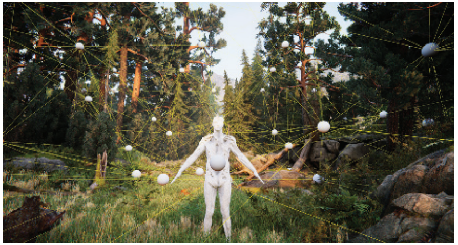

存储光照信息的体积结构不一定要是规则均匀的。一种流行的做法是将光照数据存储在不规则的点云中，然后再将这些点连接起来构成Delaunay四面体（如图11.30所示），Cupisz \[316]将这种方法进行了推广。为了检索光照信息，我们首先需要找到采样位置所在的四面体，这是一个迭代过程，其开销可能会有点高。我们对网格进行遍历，并在相邻的单元之间进行移动。会使用查找点（采样位置）相对于当前四面体顶点的重心坐标（barycentric coordinate），来选择下一步要进行访问的邻居四面体（如图11.31所示）。在一个常见的场景中，可能会包含数千个存储光照信息的点云位置，因此这个检索过程可能会很耗时。为了对它进行加速，我们可以在前一帧中记录一个用于查找的四面体（如果可能的话），或者使用一个简单的体积数据结构，来为场景中的任意采样点提供一个良好的“起始检索四面体”。

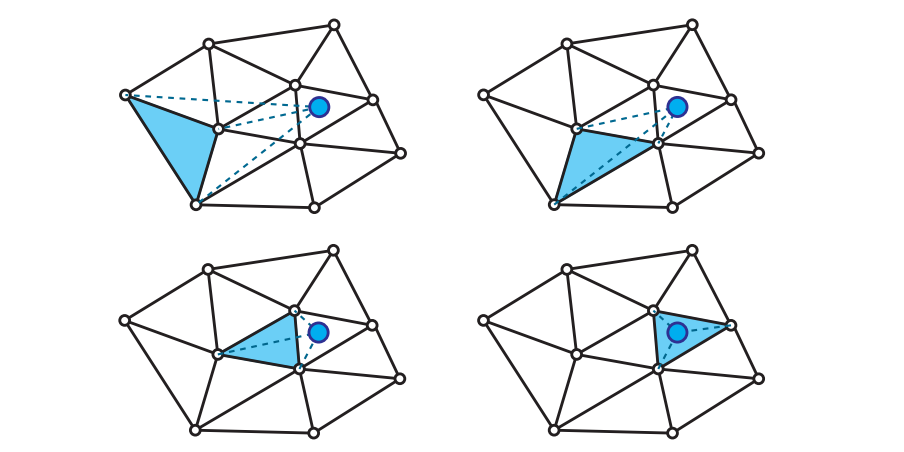

一旦检索到了合适的四面体，就会使用重心坐标来对存储在四面体顶点的光照信息进行插值。这个插值操作并不会被GPU加速，它只需要4个值进行插值，而不是网格上三线性插值所需要的8个值。

这些预计算和存储光照信息的位置可以手动放置\[134, 316]，也可以自动放置\[809, 1812]。它们通常被称为光照探针（lighting probe或者light probe），因为它们对光照信号进行了探测（采样）。这个术语需要和章节10.4.2中的“光照探针”区分开来，后者是记录在环境贴图中的远距离光照。

从四面体网格中采样获得的光照质量，高度依赖于网格的结构，而不仅仅是探针的总体密度。如果光照探针分布不均匀的话，那么生成的网格中可能会包含一些细长的四面体，从而产生视觉上的瑕疵。如果这些探针是手动放置的，那么这些问题可以很容易地进行纠正，但是这毕竟是一个手动过程，费时费力。这个四面体网格的结构与场景的几何结构无关，因此如果处理不当的话，光照效果在插值的时候会跨越墙壁的两侧，从而产生漏光瑕疵，就像是上文中的irradiance体积一样。在手动放置探针的情况下，开发者可以通过插入额外的探针来避免发生这种情况。在自动放置探针的情况下，可以向探针或者四面体中添加某种形式的可见性信息，从而将单个四面体的影响范围限制在相关区域内\[809, 1184, 1812]。

对于静态和动态的几何物体，通常会使用不同的光照存储方法。例如：静态物体可以使用光照贴图，而动态物体则可以从体积结构中获得光照信息。虽然这样做很流行，但是这种方案可能会导致不同类型的几何物体之间产生不一致的外观表现。其中一些差异可以通过正则化（regularization）来消除，即在这些表示方法中对光照信息进行平均。

当烘焙光照信息的时候，需要注意的是，只需要在它们真正有效且合法的地方来计算光照信息即可。生成的网格通常是不完美的，一些顶点可能会被放置在几何体内部，或者网格的部分区域可能会产生自相交现象。如果我们在这些有缺陷的位置上计算入射radiance，那么结果将是不正确的。它们可能会导致我们不希望出现的暗化，或者是无阴影光照的颜色溢出等现象。Kontkanen和Laine\[926]，Iwanicki和Sloan \[809]讨论了不同的启发式方法，这些方法可以用于丢弃无效样本。

环境光遮蔽和定向遮蔽信号与漫反射光照共享许多空间特性，如章节11.3.4所述，上述所有的方法都可用于存储它们。

### 11.5.5 动态漫反射全局光照

尽管预计算光照可以产生令人印象深刻的效果，但是它的主要优点同样也是它的主要缺点，即这种方法需要进行预计算。这个离线预计算的过程可能会很长，在常见的游戏关卡中，可能需要花费数个小时来进行光照烘焙，这种情况并不少见。由于光照计算需要花费很长时间，因此艺术家们被迫在多个层次上同时工作，从而避免在等待烘焙完成的时候无所事事。反过来，这通常又会导致渲染资源的过度负载，从而导致烘焙时间变得更长。这种烘焙-调整-再烘焙的循环，会严重影响工作效率并导致挫败感（frustration）。同时在某些情况下，可能无法使用预计算光照，因为场景中的几何物体在运行过程中会不断发生改变，或者在某种程度上，场景中的几何物体是由用户控制创建的。

为了模拟动态环境中的全局光照效果，已经有好几种方法被开发了出来。它们要么不需要任何预处理过程，要么算法的准备阶段足够得快，可以每帧执行。

在完全动态环境中模拟全局光照的最早方法之一是基于“即时辐射度（Instant Radiosity）” \[879]。尽管这个方法名为辐射度算法，但是它与辐射度算法几乎没有共同之处。在这种方法中，会从光源向外投射光线，对于这些光线照射到的每个位置，都会放置一个新的光源，用于代表来自该表面元素的间接照明，这些光源被称为虚拟点光源（virtual point light，VPL）。基于这个思路，Tabellion和Lamorlette \[1734]开发了一种在《怪物史莱克2》制作过程中所使用的方法，该方法会对场景表面执行一次直接光照pass，并将结果存储在纹理中。然后，在渲染过程中，该方法会对光线进行追踪，并使用缓存下来的光照数据来创建一次弹射的间接光照效果。Tabellion和Lamorlette的研究表明，在很多情况下，一次弹射就足以产生令人信服的结果。虽然这是一种离线方法，但是它启发了Dachsbacher和Stamminger \[321]，他们提出一种名为反射阴影贴图（reflective shadow maps，RSM）的方法。

与常规的阴影贴图（章节7.4）类似，反射阴影贴图是从光源的视角来进行渲染的。除了深度信息之外，它们还会存储有关可见表面的其他信息，例如反照率albedo、法线、直接光照（通量flux）。在进行最后着色的时候，RSM的纹素会被视为虚拟点光源，从而提供单次弹射的间接照明效果。由于一个典型的RSM中可能会包含数十万个像素，将这像素都作为点光源明显是不现实的，因此需要使用重要性驱动（importance-driven）的启发式方法，来选择其中的一个子集。Dachsbacher和Stamminger \[322]后来展示了如何通过逆转这个过程来对该方法进行优化。该方法会基于整个RSM来创建一些虚拟光源，并将其放置（splatted）在屏幕空间中（章节13.9），而不是为每个着色点都从RSM中选择相关的纹素。

该方法的主要缺点是，它无法为间接光照提供遮挡效果。虽然这样做是一个很显著的近似，但是该方法生成的结果看起来还是合理的，并且对于许多应用程序而言也是可以接受的。

为了获得高质量的结果，并在光线运动过程中保持时域稳定性，因此需要创建大量的间接光源。如果创建的间接光源数量太少，当重新生成RSM的时候，它们的位置往往会迅速发生改变，从而导致闪烁瑕疵的出现。另一方面，从性能的角度来看，场景中存在太多的间接光源是十分具有挑战性的。Xu \[1938]描述了游戏《神秘海域4》是如何应用这种方法的。为了保证性能要求，他在每个像素上只使用了少量的间接光源（16个），但是会在几帧之间循环使用不同的光源集合，并且会对结果进行时域过滤，如图11.32所示。

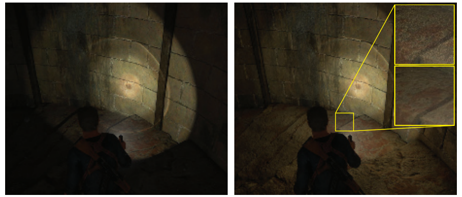

针对缺乏间接遮挡的问题，人们提出了不同的解决方法。Laine等人\[962]使用了双抛物面阴影贴图来作为间接光源，但是会逐步将它们添加到场景中，因此在一帧中只有少量阴影贴图会被渲染。Ritschel等人\[1498]使用简化的、基于点的场景表示，来绘制大量不完美的阴影贴图（imperfect shadow maps）。这样的贴图很小，并且在直接使用的时候还会包含许多缺陷，但是在经过简单的过滤之后，能够提供足够的保真度，从而为间接光照提供适当的遮挡效果。

有些游戏则使用了与这些解决方案相关的方法。其中《Dust 514》渲染了一个自上而下的世界视图，并且在需要的时候可以拥有多达4个独立的图层\[1110]。这些生成的纹理会用于间接光照的收集，这很像Tabellion和Lamorlette的方法。在风筝demo中，虚幻引擎使用了类似的方法来提供地形的间接光照效果\[60]。

### 11.5.6 光照传播体积

辐射传输理论（radiative transfer theory）是一种模拟电磁辐射如何在介质中传播的一般方法，它包括了散射（scattering）、发射（emission）和吸收（absorption）。尽管实时图形学力求显示所有的这些效果，但是除了最简单的情况之外，用于模拟这些效果的方法都具有很高的成本，无法直接应用于渲染中。然而，该领域中所使用的一些技术，在实时图形应用中被证明是很有用的。

由Kaplanyan \[854]提出了光照传播体积（light propagation volumes, LPV），其灵感来源于辐射传输中的离散坐标法（discrete ordinate methods）。在他的方法中，场景被离散成一个规则的三维网格，每个单元格内都会维护一个穿过它的定向radiance分布，他使用二阶球谐函数来处理这些信息。在第一步中，光照会被注入到包含直接光照表面的单元格中。可以使用反射阴影贴图来找到这些单元格，也可以使用任何的其他方法。注入这些单元格的光照信息，是该表面反射出的radiance，它在表面法线附近构成了一个分布，指向远离表面的方向，并且会从材质的颜色中获得自身的颜色。接下来会对光照进行传播，每个单元格都会对其邻居单元格的radiance场进行分析，并据此修改自身的radiance分布，从而考虑来自各个方向的radiance。在一个步骤中，radiance只在一个单元格的距离上进行传播，因此为了让radiance进行充分传播，需要进行多次迭代，如图11.33所示。

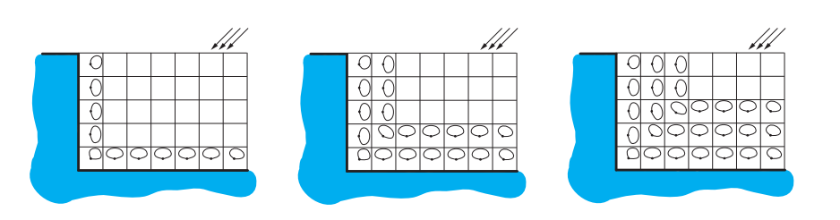

这种方法的重要优点在于，它会为每个单元格生成完整的radiance场，这意味着我们可以使用任意的BRDF来进行着色，尽管在使用二阶球谐函数的时候，光泽BRDF的反射质量会很低。Kaplanyan展示了漫反射表面和镜面的例子。

为了允许光照在更大的距离上进行传播，增加体积所覆盖的区域面积，同时保持合理的内存开销，Kaplanyan和Dachsbacher \[855]开发了该方法的一种级联变体。他们不再使用与单元格大小相同的体积，而是使用一组逐渐变大的单元格，这些单元格彼此之间能够嵌套。光照会被注入到所有的层级中并独立地进行传播。而在查找过程中，会为给定位置选择最详细且可用的层级单元格来计算光照。

在最初的实现中，他们没有考虑间接照明的任何遮挡。修改后的方法使用了来自反射阴影贴图的深度信息，以及来自相机位置的深度缓冲，从而向这些体积块中添加了有关光线遮挡物的信息。这些信息是不完整的，但是场景也可以在预处理期间进行体素化，从而使用更加精确的表示方法。

该方法与其他体积方法存在相同的问题，其中最大的问题是颜色溢出。不幸的是，在LPV方法中单纯地增加网格分辨率来解决这个问题，还会导致出现其他问题。当使用较小尺寸的单元格时，就需要更多的迭代步骤，来在相同的世界空间距离上进行光线传播，这会使得该方法的成本明显上升。在网格分辨率和性能之间找到一个平衡并非易事。同时该方法还存在锯齿问题，网格的有限分辨率，加上radiance的粗糙定向表示（二阶球谐函数），会导致光照信号在相邻单元格之间移动时发生退化。例如对角条纹等空间瑕疵，可能会在多次迭代后出现。其中一些问题可以通过在执行传播pass之后，再执行空域过滤来进行消除。

### 11.5.7 基于体素的方法

Crassin \[304]提出了体素锥形追踪全局光照（voxel cone tracing global illumination，VXGI），它也是基于一种体素化的场景表示。几何物体本身使用稀疏体素八叉树（sparse voxel octree）的形式进行存储，我们将在章节13.10中进行介绍。这种结构提供了一种类似于mipmap的场景表示，因此可以对体积空间进行快速的遮挡测试等操作。每个体素块还包含了它们所代表的几何物体所反射出的光线量等信息，它以一种定向形式进行存储，因为radiance会在六个主要方向上发生反射。首先会使用反射阴影贴图，将直接照明注入到八叉树的最低层节点中，然后再根据层次结构向上进行传播。

这个八叉树结构用于估计入射radiance。在理想情况下，我们将会追踪一条射线，从而计算来自特定方向上的radiance估计。然而，这样做需要追踪许多射线才能获得理想结果，因此我们会将整个光束近似于一个圆锥，这个圆锥位于它们的平均方向上，我们对这个圆锥进行追踪，最后只会返回一个值。想要精确测试圆锥与八叉树的交点并不是一件容易的事情，因此这个操作会被进一步近似，我们会沿着圆锥的中心轴，对八叉树结构进行一系列的查找。每次查找都会对八叉树的某个层次进行读取，该层次上的节点大小，应当与给定点处的锥形截面相对应。查找提供了在圆锥原点方向上反射的滤波radiance，以及几何物体占据查找空间的百分比，这个百分比信息会用于减弱来自后续点的光照强度，这有点类似于alpha混合。整个锥体的遮挡信息也会被追踪，在每个步骤中，它会被减少到几何物体占当前样本的百分比。在累积radiance的时候，首先会将其乘以合并后的遮挡因子（如图11.34所示）。虽然这种策略无法检测到由多个部分遮挡组合而成的完整遮挡，但是其结果仍然是可信的。

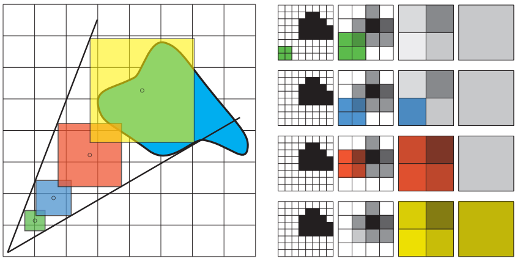

为了计算漫反射光照，我们需要跟踪若干个圆锥，具体生成和追踪的圆锥数量，取决于性能和精度之间的权衡。追踪更多的圆锥可以提供更高质量的结果，其代价是需要花费更多的时间。我们假设余弦项在整个圆锥上都是恒定的，因此这一项可以从反射方程的积分中提取出来。这样做可以使得漫反射光照的计算变得很简单，只需要计算锥形追踪的返回值，并计算其加权和即可。

正如Mittring \[1229]所描述的，这个方法的原型版本是在虚幻引擎中实现的。他给出了一些开发人员需要进行的优化，从而可以使其作为完整渲染管线的一部分进行使用。这些改进包括以较低的分辨率来执行追踪，并在空间散布圆锥。这样做的目的是为了让每个像素只跟踪一个圆锥。并在屏幕空间中对结果进行过滤，从而获得漫反射响应的完整radiance。

使用稀疏八叉树存储光照信息，一个主要问题就是查找成本较高。找到包含给定位置的叶子节点，需要进行一系列的内存查找，中间还穿插着一些简单的逻辑来确定要遍历哪一个子树。一次典型的内存读取可能需要耗费几百个时钟周期。GPU试图通过并行执行多组着色线程（warp或者wavefront）来隐藏这种延迟（第3章）。即在任何给定时间内，只有一组着色线程会执行ALU操作，当它需要等待内存读取的时候，另一组着色线程会取而代之。能够同时激活的warp数量由不同的因素所决定，但所有的这些因素，都与单个组所使用的资源数量有关（章节23.3）。在遍历分层数据结构的时候，大部分时间都花在内存读取上，会等待从内存中获取下一个节点的数据。然而，在等待期间执行的其他warp中，很可能也会进行内存读取。与内存访问的次数相比，ALU其实工作得很少，并且由于实际运行的warp总数是有限的，因此经常会出现所有分组都在等待内存返回数据，都没有实际工作执行的情况。

大量的warp停滞会导致性能表现不佳，人们已经开发了一些方法来缓解这些低效问题。McLaren \[1190]使用一组级联的三维纹理来代替八叉树结构，这种方法很像级联的光照传播体积\[855]（章节11.5.6）。它们具有相同的尺寸，但是所覆盖的区域面积越来越大。通过这种方式，只需进行一次常规的纹理查找即可完成数据的读取，而不需要进行额外的依赖读取。存储在纹理中的数据与存储在稀疏体素八叉树中的数据相同，它们都包含六个方向上的反照率、占用率和反弹光照信息。因为级联的位置会随着相机的移动而发生变化，因此物体可能会不断地进出高分辨率区域。由于内存的限制，我们不可能在内存中一直维护这些体素化内容，因此它们会在需要的时候才进行体素化。McLaren还介绍了一些优化方法，使得这种技术能够用于30 FPS的游戏，例如《明日之子（The Tomorrow Children）》，如图11.25所示。

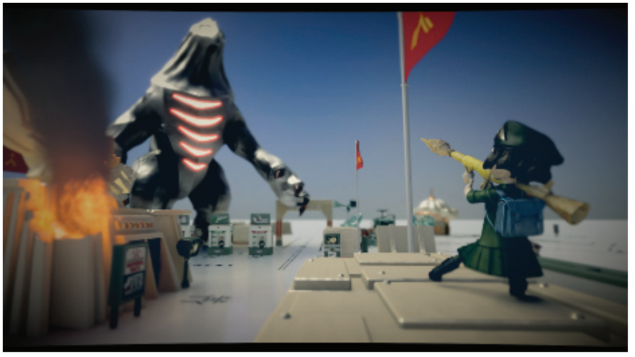

### 11.5.8 屏幕空间方法

与屏幕空间环境光遮蔽（章节11.3.6）一样，可以只使用存储在屏幕位置上的表面信息\[1499]，来模拟一些漫反射全局光照效果 。这些方法并不像SSAO那样流行，主要是因为屏幕空间中可用的数据量十分有限，因此会导致更加明显的瑕疵。诸如颜色溢出（color bleeding）这样的效果，通常是由于强烈的直射光线照亮具有相对恒定颜色的大面积区域而产生的。像这样的表面通常不可能完全适应视图，即可能只有部分会出现在画面中。这种情况使得反射光线的数量强烈依赖于当前帧，并且会随着相机的移动而发生波动。出于这个原因，屏幕空间中的方法仅适用于在精细尺度上对其他解决方案进行扩展补充，这种精细尺度超出了主要算法所能够达到的分辨率。这类系统在游戏《量子破碎》\[1643]中进行了使用，在这个游戏中，使用了irradiance体积来模拟大规模全局光照的效果，使用屏幕空间中的解决方案来提供有限距离的弹射光线。

### 11.5.9 其他方法

Bunnell用于计算环境光遮蔽的方法 \[210]（章节11.3.5），也可以用于动态计算全局光照效果。通过存储每个圆盘的反射radiance信息，来对基于点的场景表示方法（章节11.3.5）进行增强。在收集步骤中，可以在每个收集位置上构建一个完整的入射radiance函数，而不仅仅是收集遮挡信息。就像环境光遮蔽一样，必须要执行一些后续步骤，来消除那些来自于被遮挡圆盘的光照。

## 11.6 镜面全局光照

上一小节中所介绍的方法，主要是为了模拟漫反射全局光照效果，而在本小节中，我们将会介绍各种用于渲染视图依赖（view-dependent）效果的方法。对于光泽材质而言，其镜面波瓣要比漫反射光照中所使用的余弦波瓣紧密得多，其扩散范围小得多。如果我们想要渲染一种极有光泽的材质，这种材质具有很薄的镜面波瓣，我们需要一种能够传递这种高频细节的radiance表示方法。反过来，这些条件也意味着，反射方程只需要计算从有限立体角入射的光线即可，而不是像Lambertian BRDF那样，需要反射来自整个半球的入射光线，这与漫反射材质的要求完全不同。这些特性解释了想要实时渲染这样的效果，为什么需要进行完全不同的权衡考虑的原因。

存储入射radiance的方法可以用于提供粗略的视图依赖效果。当使用AHD编码或者HL2基底时，我们是可以计算镜面反射的，就好像光照来自于编码方向（在使用HL2基底时，是三个方向）的方向光一样。这种方法的确可以通过间接照明提供一些高光效果，但是它们相当不准确。在使用AHD编码时，这种方法尤其成问题，因为方向分量可能会在很小的距离内发生剧烈变化，这种方差会导致高光以不自然的方式发生变形。可以通过在空间方向上进行滤波来减少这种瑕疵\[806]。在使用HL2基底时，如果相邻三角形之间的切线空间变化很快，同样也会出现类似的问题。

可以通过使用更高的精度来表示入射光线，从而减少瑕疵的出现。Neubelt和Pettineo在游戏《教团：1886》\[1268]中使用球形高斯波瓣来表示入射radiance。为了渲染高光效果，他们使用了Xu等人\[1940]提出的一种方法，该方法包含了一种典型微表面BRDF高光响应（章节9.8）的有效近似。如果使用一组球面高斯函数表示光照，并且假设菲涅尔项和masking-shadowing函数在其范围内为常数，则反射方程可以被近似为：

$$
L_{o}(\mathbf{v}) \approx \sum_{k}\left(M\left(\mathbf{l}_{k}, \mathbf{v}\right)\left(\mathbf{n} \cdot \mathbf{l}_{k}\right)^{+} \int_{\mathbf{l} \in \Omega} D(\mathbf{l}, \mathbf{v}) L_{k}(\mathbf{l}) d \mathbf{l}\right)
\tag{11.37} 
$$

其中$L_k$为第$k$个球面高斯所表示的入射radiance，$M$是结合了菲涅尔项和masking-shadowing函数的组合因子，$D$为NDF项。Xu等人引入了一种各向异性的球面高斯（anisotropic spherical Gaussian，ASG），他们使用ASG来对NDF进行建模。他们还为计算SG和ASG乘积的积分提供了一种有效的近似，如方程11.37所示。

Neubelt和Pettineo使用了9-12个高斯波瓣来表示光照，这使得他们只能模拟中等光泽的材质。他们能够使用这种方法来表现大部分的游戏光照效果，因为游戏《教团：1886》发生在19世纪的伦敦，而那时具有高度抛光的材质，玻璃和反射表面是十分罕见的。

### 11.6.1 局部环境贴图

到目前为止我们所讨论的方法，还不足以渲染令人信服的抛光材质。对于这些技术而言，它们所能描述的radiance场太过粗糙，无法精确编码入射radiance的细节，这使得反射看起来很暗淡。如果在同一材质上进行使用的话，所产生的结果也与分析光源的镜面高光不一致。一种解决方案是使用更多的球面高斯函数或者更高阶的SH来获得我们所需要的细节。这样做是可行的，但是我们很快就会面临一个性能问题：SH和SG都有全局支持（global support）特点。即每个基函数在整个球面上都是非零的，这意味着我们需要将所有的基函数都计算一遍，才能获得给定方向上的光照信息。这样做的计算成本会变得很高，因为想要渲染尖锐的反射效果，我们可能需要数千个基函数。而且也不可能在漫反射光照的分辨率下，存储那么多的数据。

在实时环境中为全局光照提供高光分量，其中最流行的解决方案是局部环境贴图（localized environment map），它可以解决我们之前遇到的两个问题。首先，入射radiance会被表示为一个环境贴图，因此只需要几个值就可以获得所需的radiance。其次，这些局部环境贴图稀疏地分布在整个场景中，因此如果我们想要增加入射radiance的空间精度，只要增加这些局部环境贴图的角分辨率（angular resolution）即可。这种在场景中特定点进行渲染的环境贴图，通常会被称为反射探针（reflection probe）。图11.36展示了这样一个例子。

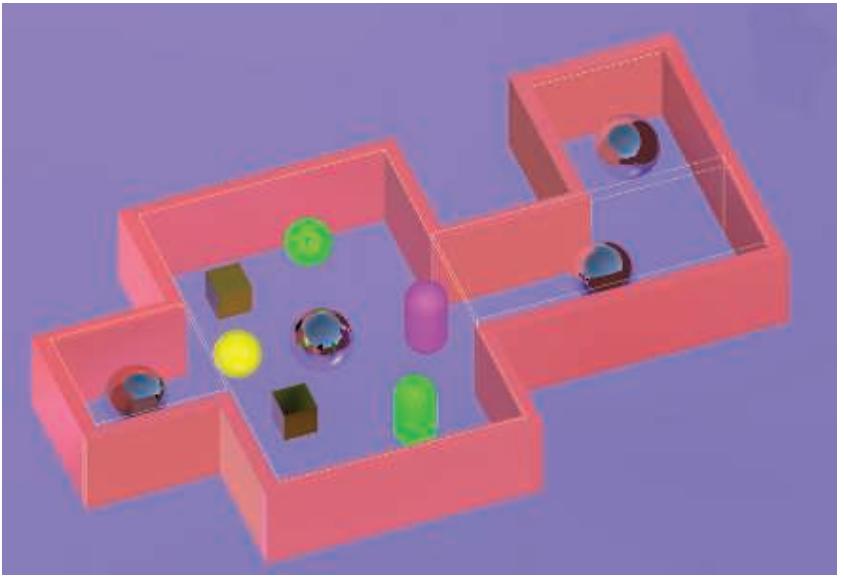

环境贴图非常适合用于渲染完美的反射效果，即镜面的间接照明。已经有很多方法可以利用纹理来实现各种各样的高光效果了（章节10.5）。所有这些方法都可以与局部环境贴图一起使用，以渲染间接光照的镜面响应效果。

最早将环境贴图与空间中特定点相绑定的游戏之一是《半条命2》\[1193, 1222]，在他们的系统中，会由艺术家首先在整个场景中放置采样位置。在预处理阶段中，会在每个位置上渲染一个立方体贴图。在进行高光计算的时候，物体会使用最近位置上的结果来作为入射radiance的表示。相邻的物体可能会使用不同的环境贴图，这将会导致视觉效果的不匹配，但是艺术家可以手动调整立方体贴图所覆盖的范围。

如果一个物体很小，并且环境贴图就是从其中心进行渲染的（在隐藏该物体之后，它就不会出现在纹理中），那么所生成的结果是相当精确的。不幸的是，这种情况十分少见；在大多数情况下，一个反射探针会同时用于多个物体，有时候还会具有明显的空间范围。高光表面的位置距离环境贴图的中心越远，其结果与现实的差异就越大。

Brennan \[194]和Bjorke \[155]提出了一种解决这个问题的方法。他们并没有将入射光照看作是来自一个无限远的包围球体，而是假设这些入射光照来自一个有限大小的球体，该球体的半径是用户进行定义的。在检索入射radiance的时候，输入的方向不会直接用于索引环境贴图，而是将其视为来自评估表面发射出的射线，并与该球体相交。然后会计算一个新的方向，即从环境贴图中心位置指向球面交点位置的方向，这个方向向量会用作查找方向，如图11.37所示。这个过程具有在空间中“固定”环境贴图的效果，这个做法通常被称为视差校正（parallax correction）。同样的方法也可以用于其他的基本形状类型，例如box \[958]。用于与光线相交的形状通常会被称为反射代理（reflection proxy）。所使用的代理物体应当能够表示渲染到环境贴图中的几何物体的一般形状和大小。虽然通常而言这是不可能的，但是如果反射代理能够与几何体完全匹配（例如用一个box代表一个矩形房间），那么这种方法可以提供完美的局部反射效果。

![图11.37：使用反射代理对环境贴图（EM）进行空间局部化的效果。在上图中所展示的两种情况下，我们都希望在黑色圆的表面上渲染环境的反射效果。左边是常规的环境映射，它使用蓝色圆圈进行表示（它也可以是任何表示形式，例如立方体贴图）。左图中的效果是通过使用反射观察方向 \mathbf{r} 访问环境贴图来确定的。仅仅使用这个方向作为参数，蓝色圆圈EM会被视为半径无限大且遥远的。对于黑色圆表面上的任何点，EM好像都以该点为中心。右图中，我们希望EM能够把周围的黑色房间表示为本地的，而不是无限远的。蓝色圆圈EM是在房间的中心处生成的。要像访问房间一样访问这个EM，会从位置 \mathbf{p} 处，沿着反射观察方向发射一根反射光线，这个光线会在着色器中与一个简单的代理物体（房间周围的红色框）相交。这个交点与EM的中心形成一个新的方向 \mathbf{r}^{\prime} ，然后会像常规的环境映射一样，使用这个方向 \mathbf{r}^{\prime} 来访问EM。通过求解 \mathbf{r}^{\prime} ，这个过程会将EM视为具有一个实际的物理形状，即图中的红框。这个红色代理框的假设会在房间的左下角和右下角失效，因为代理形状与实际房间的几何形状并不匹配。](images/Chapter-11/202307041728600.png "图11.37：使用反射代理对环境贴图（EM）进行空间局部化的效果。在上图中所展示的两种情况下，我们都希望在黑色圆的表面上渲染环境的反射效果。左边是常规的环境映射，它使用蓝色圆圈进行表示（它也可以是任何表示形式，例如立方体贴图）。左图中的效果是通过使用反射观察方向 \mathbf{r} 访问环境贴图来确定的。仅仅使用这个方向作为参数，蓝色圆圈EM会被视为半径无限大且遥远的。对于黑色圆表面上的任何点，EM好像都以该点为中心。右图中，我们希望EM能够把周围的黑色房间表示为本地的，而不是无限远的。蓝色圆圈EM是在房间的中心处生成的。要像访问房间一样访问这个EM，会从位置 \mathbf{p} 处，沿着反射观察方向发射一根反射光线，这个光线会在着色器中与一个简单的代理物体（房间周围的红色框）相交。这个交点与EM的中心形成一个新的方向 \mathbf{r}^{\prime} ，然后会像常规的环境映射一样，使用这个方向 \mathbf{r}^{\prime} 来访问EM。通过求解 \mathbf{r}^{\prime} ，这个过程会将EM视为具有一个实际的物理形状，即图中的红框。这个红色代理框的假设会在房间的左下角和右下角失效，因为代理形状与实际房间的几何形状并不匹配。")

这种技术在游戏中非常流行，它易于实现，运行速度快，可以应用于前向渲染和延迟渲染中。美术人员还可以直接控制其外观与内存开销。如果某些区域需要更加精确的照明效果，他们可以放置更多的反射探针，同时让代理物体更好地适应场景几何形状。如果用于存储环境贴图的内存过多，那么从场景中删除一些探针也是很容易的。当使用光泽材质的时候，着色点与反射代理交点之间的距离，可以用来决定使用哪个级别的预过滤环境贴图，如图11.38所示。这样做可以模拟在我们远离着色点时，BRDF波瓣不断增长的覆盖区域。

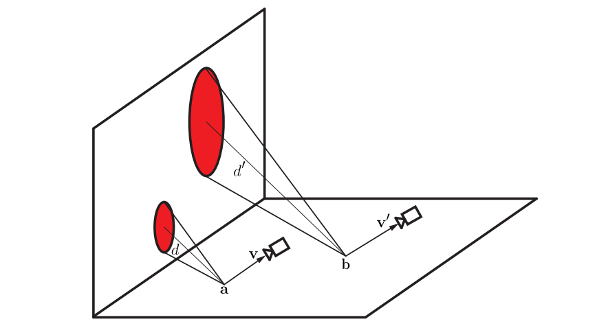

当多个探针覆盖同一区域时，可以建立如何组合它们的直观规则。例如：探针可以有一个用户设置的优先级参数，具有较高优先级参数的探针，其优先级会高于其他优先级较低的探针，或者可以在它们之间进行平滑地插值融合。

不幸的是，由于这种方法过于简单，因此会导致各种各样的瑕疵。反射代理的几何形状很少能够与底层几何结构完全匹配。这会使得某些区域上的反射效果被不自然地拉伸，这个问题主要会发生在高度反射、抛光的材质上。此外，渲染到环境贴图中的反射物体会根据贴图的位置来计算它们的BRDF。访问环境贴图的表面位置，不会与这些物体具有完全相同的视图，因此纹理中存储的结果不是完全正确的。

反射代理也会导致漏光问题（有时会很严重）。通常而言，查找过程会从环境贴图的明亮区域返回结果值，因为这个简化的光线投射会错过应当引起遮挡的局部几何形状。这个问题有时候可以通过使用定向遮蔽方法（章节11.4）来缓解。另一个缓解这个问题的流行策略，是使用预计算漫反射光照，它通常会以更高的分辨率进行存储。环境贴图中的反射值首先会除以渲染位置上的平均漫反射光照。这样做可以有效地从环境贴图中去除平滑、扩散的贡献值，从而只留下较高频率的成分。在进行着色时，反射值再乘以着色位置上的漫反射光照。这样做可以部分缓解反射探针空间精度不足的问题\[384, 999]。

有一些方法可以使用反射探针来捕获更加复杂的几何表示。Szirmay-Kalos等人\[1730]为每个反射探针都存储了一个深度贴图，并在查找时对使用它执行一次光线追踪，这样可以产生更加准确的结果，但是需要花费一些额外的开销。McGuire等人\[1184]提出了一种更加有效的方法，它根据探针的深度缓冲来追踪光线。他们的系统会存储多个探针，如果最初选择的探针没有包含足够的信息来可靠地确定命中位置，则会选择使用备用探针，并继续使用新的深度数据来进行光线追踪。

当使用光泽BRDF的时候，环境贴图通常是预过滤的，并且每个mipmap层级所存储的入射radiance都会与一个逐渐增大的滤波核进行卷积。预过滤步骤会假设这个滤波核是径向对称的（详见章节10.5）。然而，当使用视差校正的时候，BRDF波瓣在反射代理形状上所占据的空间，会根据着色点位置而发生变化，这样做会使得预过滤过程变得稍微不正确。Pesce和Iwanicki对这个问题的不同方面进行了分析，并讨论了潜在的解决方案\[807, 1395]。

所使用的反射代理形状，也不必是封闭的、凸的。也可以使用简单的平面矩形，也可以使用包含高质量细节的box或者球形代理\[1228, 1640]。

### 11.6.2 环境贴图的动态更新

使用局部反射探针需要对每个环境贴图进行渲染和过滤，这项工作通常是离线完成的，但是在某些情况下可能也需要在运行时完成。在开放世界游戏中，一天中的时间会不断发生变化，世界场景中几何物体是动态生成的，因此将这些贴图都进行离线处理会花费太长时间，影响开发效率。在某些极端情况下，如果需要许多变体环境贴图时，我们甚至无法将它们全部都存储在磁盘上。

实际上，有些游戏会在运行过程中实时渲染反射探针，这种类型的系统需要进行仔细调整，以免对性能产生重大影响。除了一些很简单的情况之外，我们不可能在每一帧中都重新渲染所有可见的探针，因为对于现代游戏而言，每帧通常会使用数十个甚至数百个探针。幸运的是，我们也不需要这样做的。我们很少会要求反射探针在任何时候都能够准确地描述它们周围的所有几何形状。大多数情况下，我们确实希望反射探针能够对一天中某个时刻的变化做出正确反应，但是我们可以通过其他的一些方法来对动态几何物体的反射进行近似，例如我们后面要介绍的屏幕空间方法（章节11.6.5）。这些假设允许我们在加载阶段提前渲染一些探针，而后续的探针则会在它们进入相机视野时逐个进行渲染。

即使我们希望在反射探针中渲染动态几何物体，我们也只能以一个较低的帧率来对其进行更新。我们可以定义渲染反射探针所需要的帧时间，并且在每帧中更新固定数量的反射探针。基于每个探针到相机的距离、距离上次更新的时间，以及其他类似因素的启发式方法可以帮助我们确定反射探针的更新顺序。在时间预算特别紧张的情况下，我们甚至可以将单个环境贴图的渲染拆分到多个帧中进行。例如：我们可以在一帧中只渲染立方体贴图的其中一个面，在6帧中渲染一个完整的立方体贴图。

在离线执行卷积操作的时候，通常会使用高质量的滤波，这种滤波涉及对输入纹理的多次采样，这在要求高帧率的游戏中是不可能实现的。Colbert和Krivanek \[279]开发了一种方法，该方法使用重要性采样，能够以相对较低的样本数量（约为64）来实现质量相当的过滤。为了消除大部分噪声，他们从具有完整mipmap链的立方体贴图中进行采样，并使用启发式方法来确定每个样本应该读取哪个mipmap层级。他们的方法是一种对环境贴图进行快速、运行时预过滤的流行选择\[960, 1154]。Manson和Sloan \[1120]在基函数中构造了所需的滤波核，构造一个特定滤波核的精确系数必须要在优化过程中获得，但是对于一个给定的形状，这个过程只会发生一次。卷积分为两个阶段进行：首先，使用一个简单的滤波核来对环境贴图同时进行下采样和过滤。接下来，将得到的mipmap链中的样本组合起来，构建最终的环境贴图。

为了限制光照pass的带宽开销以及内存开销，可以对最终生成的纹理进行压缩。Narkowicz \[1259]描述了一种将高动态范围反射探针压缩为BC6H格式（章节6.2.6）的有效方法，该格式能够存储半精度的浮点值。

想要渲染复杂的场景，即使一次只渲染立方体贴图一个面，这对于CPU而言开销仍然可能会过大。一种解决方案是在离线过程中为环境贴图生成G-buffer，在运行时只需要计算光照和卷积即可\[384, 1154]，这大大降低了CPU的负载。如果需要的话，我们甚至可以在预生成的G-buffer上渲染动态的几何物体。

### 11.6.3 基于体素的方法

在大多数性能受限的情况下，局部环境贴图是一个很好的解决方案，然而，其质量往往不能令人满意。在实践中，必须使用一些变通方法来掩盖由于探针空间密度不足，或者反射代理对实际几何形状过于粗糙的近似而导致的问题。如果每帧有更多的可用时间，则可以使用一些更加精细的方法。

体素锥形追踪，无论是使用稀疏八叉树进行存储\[307]，还是其级联版本（章节11.5.7）\[1190]，同样可以用于渲染高光效果。该方法会将场景表示存储在稀疏体素八叉树中，并在这个体素数据结构中进行锥形跟踪。一次锥形追踪只会返回一个值，这个值表示了来自该圆锥所对应立体角的平均radiance。对于漫反射光照而言，我们需要对多个方向上的圆锥进行追踪，因为只用一个圆锥是不准确的。

对于光泽材质而言，使用锥形追踪的效率要高得多。在镜面光照的情况下，BRDF的波瓣会很狭窄，只需要考虑一个来自较小立体角的radiance，因此我们不再需要同时追踪多个圆锥区域，在大多数情况下，一个着色点只需要追踪一个圆锥就足够了。只有较为粗糙材质上的高光效果，才可能需要追踪多个圆锥，但是又因为这样的反射效果十分模糊，在这种情况下，我们只需要使用局部反射探针即可，根本不需要执行锥形追踪。

与之相反的是高度抛光的材质，它们的反射效果几乎像镜子一样，这会使得所进行追踪的圆锥区域变的十分狭窄，就像一条射线一样。有了这样一个精确的追踪，底层场景表示的体素本质可能会在反射中被注意到，所产生的反射效果将会表现出体素化的立方体外观，而不是多边形几何。但是这个瑕疵在实践中很少会成为一个问题，因为反射效果很少会被人们直接观察到，这个反射效果会叠在某个纹理表面上，其最终的贡献值会被纹理进行修正，这个过程通常会掩盖任何缺陷和瑕疵。当需要完美的镜面反射效果时，还可以使用其他方法，从而以更低的成本来实现这个效果。

### 11.6.4 平面反射

另一种方法是重复使用常规的场景表示，对其进行重新渲染从而创建一个反射图像。如果反射表面的数量是有限的，并且它们都是平面的，我们就可以使用常规的GPU渲染管线，来创建从这些表面上所反射的场景图像。这些图像不仅可以提供精确的镜面反射效果，而且还可以通过对图像进行一些额外处理，从而渲染令人信服的光泽效果。

理想的反射面遵循反射定律（law of reflection），即入射角等于反射角。也就是说，入射光线与表面法线之间的夹角，等于反射光线与表面法线之间的夹角，如图11.39所示。图11.39还展示了一个反射物体的“图像”，根据反射定律，物体的反射图像实际上就是该物体经过平面的物理反射。也就是说，我们沿着入射光线继续前进（注意这里不是反射光线），穿过反射平面，最终可以到达反射物体上相同的位置。

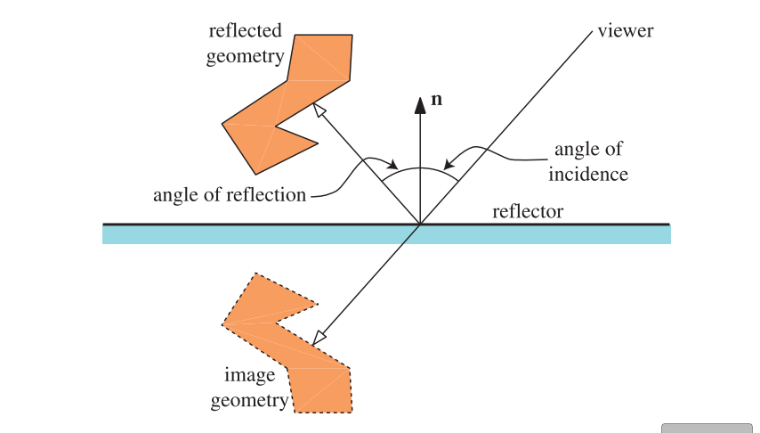

这就引出了一个原理：可以通过创建物体的一个副本，将其转换到反射位置上，然后再从那里渲染这个副本物体，从而实现反射效果。为了实现正确的光照效果，光源也必须要在平面上进行反射，包括光源的位置和光照的方向\[1314]。一种等效的方法是保持场景表示不变，通过镜子将观察者的位置和观察方向反射到反射平面的另一侧。这种反射操作可以通过对投影矩阵进行简单地修改来实现。

位于反射平面背面的物体不应该被反射。这个问题可以使用反射平面的平面方程来解决，最简单的方法就是在像素着色器中定义一个裁剪平面。让这个裁剪平面与反射平面相重合 \[654]，在渲染反射场景的时候，使用这个裁剪平面将与观察位置位于同一侧（即原本位于镜子背面的物体）的所有反射几何物体都裁剪掉。

### 11.6.5 屏幕空间方法

就像环境光遮蔽与漫反射全局光照一样，一些高光效果也可以在屏幕空间中进行计算。由于镜面波瓣比较尖锐，因此这样做要比漫反射情况稍微精确一些。我们只需要在绕反射观察向量的有限立体角范围内，即可获得有关radiance的信息，而不需要在整个半球范围内进行计算，因此屏幕空间中的数据会更有可能包含这个信息。这种类型的方法最早由Sousa等人\[1678]提出，同时也被其他开发人员所发现，整个系列的方法被称为屏幕空间反射（screen-space reflections，SSR）。

给定着色点的位置，观察向量和法线，我们可以沿着法线反射的观察向量来追踪一根光线，并测试其与深度缓冲的交点。这个测试是通过沿着光线进行迭代移动，每次步进一定的距离，并将光线此时的位置投影到屏幕空间中，再从z-buffer深度中检索该位置的深度信息来完成的。如果此时光线上的点到相机的距离，要比深度缓冲中对应位置的几何物体的深度更远，这意味着光源位于几何物体的内部，此时我们就可以认为光线与场景相交。然后我们可以从颜色缓冲中的对应位置处，读取到相应的颜色值，从而获得追踪方向入射到着色点的radiance。这种方法假设光线照射到的表面是Lambertian表面，但是这个条件只是许多方法的一种近似，在实践中当然可以使用其他BRDF。光线可以在世界空间中以均匀的步长进行追踪，但是这样做所获得的交点信息十分粗糙，因此当检测到光线与场景相交时，可以执行一个细化检索的pass，在有限的距离内可以使用二分查找来精确定位交点的位置。

McGuire和Mara指出\[1179]，由于透视投影的原因，在世界空间中以均匀间隔进行步进，所产生的采样点分布在屏幕空间中是不均匀的。在靠近相机的光线部分会采样不足，因此可能会错过一些光线与场景相交的位置；而距离相机较远的光线部分则会被过采样，因此相同的深度缓存像素会被多次读取，从而产生不必要的内存流量和冗余计算。他们建议使用一种数值微分法（digital differential analyzer，DDA）来在屏幕空间中执行射线步进，DDA是一种可以用于光栅化线条的方法。

首先，将待追踪光线的起点和终点都投影到屏幕空间中，沿着这条线段依次检查每个像素，以保证均匀的采样精度。使用这种方法的一个结果是，在执行相交测试的时候，不需要对每个像素的观察空间（view-space）深度进行重建。观察空间中深度值的倒数，即在常规透视投影下存储在z-buffer中的值，这个值在屏幕空间中呈线性变化。这意味着我们可以在实际追踪之前，计算该像素对屏幕空间$x$坐标和$y$坐标的导数（斜率），然后再使用简单的线性插值来获得屏幕空间线段上任何位置的值。使用这种方法计算出来的值，可以直接与深度缓冲中的数据进行比较。

基本形式的屏幕空间反射只对一条光线进行追踪，因此只能提供镜面反射效果。然而，完美的镜面是相当罕见的，在现代基于物理的渲染管线中，光泽反射是更加常见也是更加需要的，SSR同样也可以用于渲染这些效果。

在简单的临时方法中\[1589, 1812]，反射仍然沿着反射方向使用单一的光线追踪，并将结果存储在离屏缓冲区中，在后续步骤中进行处理。通过使用一系列的滤波核，通常还会与缓冲区的下采样操作相结合，从而创建一组具有不同模糊程度的反射缓冲区。在计算光照的时候，BRDF波瓣的宽度决定了哪个反射缓冲区会被采样。虽然通常会选择与BRDF波瓣形状相匹配的滤波核，但是这样做（模糊）只是一个粗略的近似，因为在进行屏幕空间过滤时，并不会考虑不连续性、表面朝向以及其他对结果精度至关重要的因素。最后会添加自定义的启发式方法，使得屏幕空间中的光泽反射，在视觉上与其他来源的镜面反射相匹配。尽管这只是一个近似值，但是最终生成的结果还是令人信服的。

Stachowiak \[1684]以一种更有原则的方式来处理这个问题。计算屏幕空间反射是光线追踪的一种形式，就像常规的光线追踪一样，它可以用于执行适当的蒙特卡洛积分。他不仅使用了反射观察方向，还使用了对BRDF的重要性采样以及光线的随机发射。由于性能的限制，光线追踪是在屏幕半分辨率下完成的，每个像素上只会追踪少量光线（1到4根）。由于所使用的光线太少，会产生有噪声的图像，因此相交结果会在相邻像素之间进行共享。对于一定范围内的像素，假设它们的局部可见性是相同的。如果从点$\mathbf{p}_0$向方向$\mathbf{d}_0$发出的光线与场景在点$\mathbf{i}_0$处相交，那么我们可以假设，如果从点$\mathbf{p}_1$向方向$\mathbf{d}_1$发出一条光线，它也会和场景相交于点$\mathbf{i}_0$，并且在点$\mathbf{i}_0$之前不会与其他任何表面相交。这样我们可以直接重复使用光线数据，不需要真的对其进行追踪，只需要适当地修改这次追踪对邻域积分的贡献值即可。从形式上讲，在计算当前像素BRDF的概率分布函数（pdf）时，从相邻像素发出光线的方向将具有不同的概率分布。

为了进一步增加光线的有效数量，还需要对结果进行时域过滤。通过离线计算与场景无关的部分积分项，并将其存储在由BRDF参数索引的查找表中，还可以进一步降低最终积分结果的方差。如果反射光线的所有信息都可以在屏幕空间中找到，那么以上的这些策略可以让我们获得精确的、无噪声的结果，这个结果接近于离线路径追踪所获得的ground-truth图像，如图11.40所示。

![图11.40：这幅图像中的所有高光效果，都是使用随机屏幕空间反射（stochastic screen-space reflflection）算法渲染的 \[1684\] 。请注意反射效果的垂直拉伸，这是微表面模型反射的特点。](images/Chapter-11/202307051524918.png "图11.40：这幅图像中的所有高光效果，都是使用随机屏幕空间反射（stochastic screen-space reflflection）算法渲染的 \[1684] 。请注意反射效果的垂直拉伸，这是微表面模型反射的特点。")

在屏幕空间中进行光线追踪操作的成本通常是很高的。因为它包含了对深度缓冲的重复采样（可能会有多次），并且还会对查找结果执行某些额外的操作。由于这个读取过程是相当不连贯的，因此缓存的利用率可能会很差，从而导致着色器在执行期间为了等待内存数据的返回，而发生长时间的停滞。因此在具体的实现过程中需要格外注意，尽可能得优化执行效率。屏幕空间反射通常会在一个降低的分辨率下进行计算\[1684, 1812]，并使用时域过滤来弥补因为追踪分辨率下降而带来的质量下降。

Uludag \[1798]描述了一种使用分层深度缓冲（Hi-Z，章节19.7.2）来加速光线追踪的优化方法。首先需要创建一个层次结构，深度缓冲会逐步进行下采样操作，每一步的下采样系数在每个方向上均为2。较高层级上的像素会存储较低层级上的四个对应像素中的最小深度值。接下来会使用这个层次结构来执行光线追踪。如果在给定的步骤中，光线穿过了单元格，但是没有击中单元格中存储的几何图形，那么则将光线推进到单元格的边界，并在下一次步进中使用更低分辨率的缓冲，更低分辨率的缓冲区意味着更大的步长。如果光线在当前单元格中发生了相交，则将光线推进到相交位置，并在下一次步进中使用更高分辨率的缓冲，更高分辨率的缓冲区意味着更小的步长。在命中最高分辨率的缓冲区时，追踪过程会被终止，此时认为光线与场景相交。这个动态步进过程如图11.41所示。

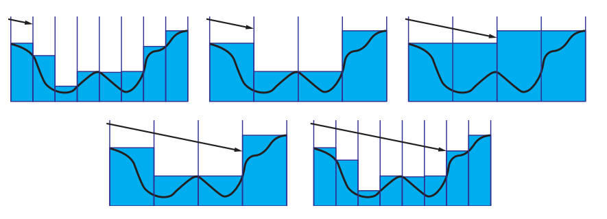

这个方案特别适用于较长距离的追踪，因为首先它确保了不会遗漏交点，同时还允许光线以较大的步长进行步进。它还可以很好地访问缓存，因为深度缓冲不是在随机的、遥远的位置上进行读取的，而是在本地邻近区域上读取的，这样大大提高了缓存效率。Grenier \[599]还给出了实现这个方法的许多实用技巧。

其他人则完全避免使用光线追踪。Drobot \[384]通过反射代理重用交点的位置，并从那里查找屏幕空间中的radiance。Cichocki \[266]假设了平面反射器，他没有使用光线追踪，相反他执行了一个全屏pass，其中每个像素会将自身的像素值写入对应的反射位置中。

与其他屏幕空间的方法一样，由于屏幕空间中的信息是有限的，据此生成的反射效果也会受到有限数据所造成的瑕疵影响。对于反射光线而言，在没有与场景几何相交的情况下就离开屏幕区域，或者是击中场景几何的背面，这些情况是很常见的，在这些情况下，我们无法获得可用的光照信息。这种情况需要进行优雅（gracefully）地处理，因为即使是相邻像素，光线追踪的有效性也会经常不同。可用使用一些空间滤波器来部分填充追踪缓冲区中的空白区域\[1812, 1913]。

SSR的另一个问题是缺乏关于深度缓冲中物体厚度的信息。因为深度缓冲中只存储了一个深度值，所以当光线到达由深度信息所描述的表面背后时，我们无法判断光线是否击中了场景中的其他物体。Cupisz \[315]讨论了各种低成本的方法，来减轻由于不知道深度缓冲中物体的厚度而产生的瑕疵。Mara等人\[1123]描述了深度G-buffer，它存储了多层数据，因此包含了更多有关表面和环境的信息。

屏幕空间反射是一个很好的工具，它可以提供一组特定的效果，例如在近乎平坦的平面上，渲染邻近物体的局部反射效果。它能够大大提高实时高光照明的质量，但是它们并没有提供一个完整的解决方案。本章节中所介绍的各种方法通常会叠加在一起使用，从而构建一个完整而健壮的系统。通常会将屏幕空间反射作为第一层方案，如果它无法提供准确的结果，则使用局部反射探针作为备用。如果给定区域中没有探针，则使用全局的默认探针\[1812]。这种类型的设置思路，可以提供一种一致且健壮的方式，来获得令人信服的间接镜面反射效果，这对于生成可信外观而言尤其重要。

## 11.7 统一方法

到目前为止我们所介绍的方法，它们可以组合成一个能够渲染漂亮图像的完整系统。然而，这些系统交错在一起，缺乏路径追踪的优雅性和概念简洁性。渲染方程的不同方面都会以不同的方式进行处理，在每个方面都做出了不同程度的妥协。尽管最终的生成图像看起来很逼真，但是在很多情况下，这些方法依然会失败，导致视错觉的中断。由于上述的这些原因，实时路径追踪一直是研究工作的重点。

通过路径追踪来渲染可接受质量的图像，其所需的计算量远远超过了CPU的能力，即使是最快的CPU也不行，因此通常会使用GPU来进行计算。GPU极快的计算速度和计算单元的灵活性，使得它们成为这项任务的良好候选者。实时路径追踪的应用包括建筑可视化以及电影渲染预览等。对于这些情况而言，较低且可变的帧率是可以接受的。可以使用渐进收敛（progressive refinement）（章节13.2）等技术来提高相机静止时的图像质量。高端系统则可以同时使用多个GPU。

相比之下，游戏需要以最终的质量要求来渲染每一帧，并且需要能够在预算时间内稳定运行。GPU可能还需要执行一些其他任务，而不仅仅是渲染。例如：诸如粒子模拟之类的系统，通常会放到GPU上进行执行，从而释放一些CPU的处理能力。所有这些因素结合在一起，使得路径追踪在如今的游戏渲染中变得不切实际。

在图形学界有一种说法:“光线追踪是未来的技术，并且将永远是！”这句讽刺暗示了这个问题的复杂程度，即使硬件速度和算法都有了巨大的进步，也总会有更加高效的方法来处理渲染管线中的特定部分。使用额外的开销，并且只使用光线投射和主要的可见性（深度缓冲）的做法，可能很难证明是合理的，目前有相当多的事实可以佐证它，因为GPU从未被设计用于执行高效的光线追踪，它们的主要目标一直是光栅化三角形，并且GPU已经在这项任务上已经变得非常擅长了。虽然光线跟踪的过程可以被映射到GPU中进行，但是目前的解决方案还没有任何固定功能的硬件对其进行直接支持。想要使用运行在GPU计算单元上的软件解决方案，来击败硬件光栅化是很困难的。

> 译者注：硬件方面出现了RT Core，专门用于构建加速结构和光线求交；软件方面出现了UE5的Lumen。

更加合理、但不那么纯粹的方法是，使用路径跟踪方法来处理光栅化渲染框架内难以实现的效果。我们对相机可见的三角形进行光栅化，但是在计算反射效果的时候，我们不再依赖近似的反射代理或者不完整的屏幕空间信息，而是通过路径追踪来计算。我们不再尝试模拟具有模糊效果的面光源阴影，而是直接通过向光源追踪光线并计算正确的遮挡信息。我们要发挥GPU的优势，对于硬件无法有效处理的元素，会使用更加通用的解决方案来进行处理。虽然这样的系统仍然是一个拼凑起来的系统，并且还是缺乏路径追踪的简洁性，但是实时渲染总是包含了各种妥协。如果要为了节省几毫秒而不得不放弃一些优雅简洁性，那它就是正确的选择，因为帧率是没有商量余地的。

虽然我们可能永远无法声称实时渲染是一个“已解决的问题”，但是更多地使用路径追踪将有助于将理论和实践更紧密地结合在一起。随着GPU的计算速度越来越快，在不久的将来，这种混合式解决方案应该可以适用于大多数应用程序，甚至可能会适用于最苛刻的应用程序。已经出现了一些基于这些原则构建的初始系统 \[1548]。

> 译者注：上述思路即混合渲染管线（Hybrid Rendering Pipeline）。

光线追踪系统依赖于加速方案的使用，例如层次包围结构（bounding volume hierarchy，BVH），这个加速结构用于对可见性测试进行加速。有关这个话题的更多信息，详见章节19.1.1。一个原生的、简单的BVH实现其实并不能很好地映射到GPU上。如第3章所述，GPU会原生执行若干个线程组，这些线程组称为warp或者wavefront。一个warp是通过锁步（lock-step）进行处理的，即一个warp中的每个线程都会执行相同的操作。如果warp中的某些线程不执行代码的特定部分（例如分支），那么它们会被暂时禁用。出于这个原因，GPU中的代码应该以一种特殊方式进行编写，使得一个wavefront中各个线程之间控制流的发散最小化。假设每个线程只处理一根光线，那么这种方案通常会导致线程之间产生较大的分歧和发散。不同的光线将执行遍历代码的不同发散分支，并在这个过程中与不同的边界体积相交，其中的有些光线会比其他光线更早完成树结构的遍历。这种行为偏离了GPU的理想使用状态，即所有线程都在使用GPU的计算能力。为了消除这些低效问题，人们开发了一些遍历方法，来最小化线程分歧并重新使用提前结束的线程\[15, 16, 1947]。

为了生成高质量的图像，可能需要对每个像素追踪成百上千条光线。即使是使用最优的BVH、最高效的树遍历算法和最快速的GPU，目前也只能在最简单的场景中实时做到这一点，而在稍微复杂一点的场景中则根本无法实现。在可用的性能限制下，我们所生成的图像会具有非常多的噪点，根本无法用于显示。然而幸运的是，这些充满噪声的图像可以使用降噪算法来进行处理，从而产生基本无噪声的图像，如图11.42和图24.2所示。最近在实时光追降噪领域取得了令人印象深刻的进展，并且开发出了一些算法，可以在每像素仅追踪一根光线的情况下（1spp），创建视觉上接近高质量的、路径追踪生成的图像 \[95, 200, 247, 1124, 1563]。

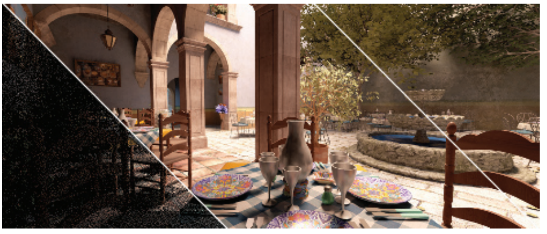

2014年，PowerVR发布了他们的Wizard GPU \[1158]。除了常规的功能之外，其硬件中还包含了构建和遍历加速结构的特殊单元（详见章节23.11）。该系统证明了使用固定功能的硬件单元来加速光线投射的能力和吸引力。见证未来可能会发生什么将是十分令人兴奋的！

## 补充阅读和资源

Pharr等人的《Physically Based Rendering》\[1413]一书，是非交互式全局光照算法的优秀指南，他们的工作特别具有价值，这在于他们深入地描述了他们所发现的有用方法。Glassner的书《Principles of Digital Image Synthesis》\[543, 544]（现在是免费的），在物理方面讨论了光线与物质的相互作用。Dutre等人\[400]的《Advanced Global Illumination》为辐射度量学和求解Kajiya渲染方程（主要是离线求解）提供了基础。McGuire \[1188]的《Graphics Codex》是一本电子参考书，其中包含了大量与计算机图形学相关的方程和算法。Dutre撰写的《Global Illumination Compendium》\[399]所参考的工作是相当古老的，但是它是免费的。Shirley的一系列短书《Ray Tracing in One Weekend》\[1628]是一个廉价且快速学习光线追踪的方法。
