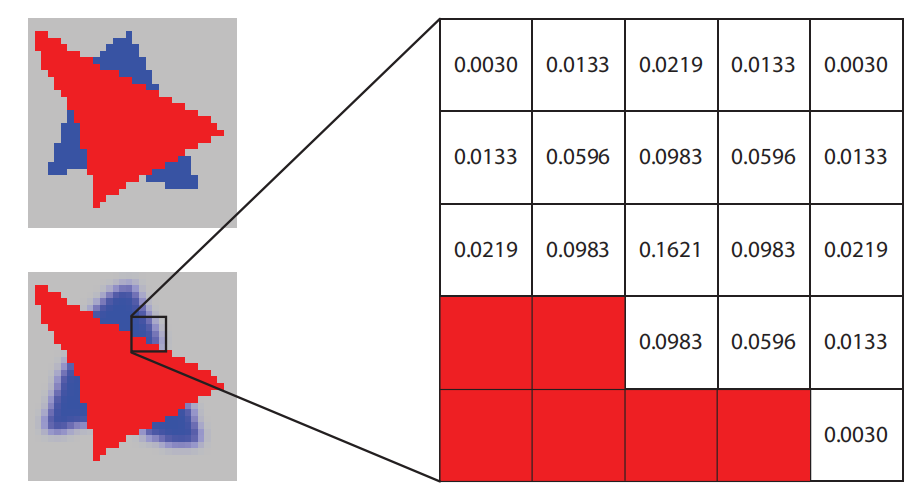
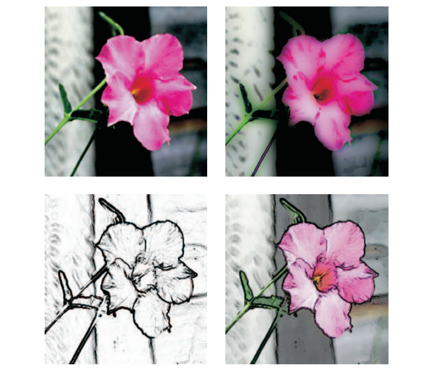
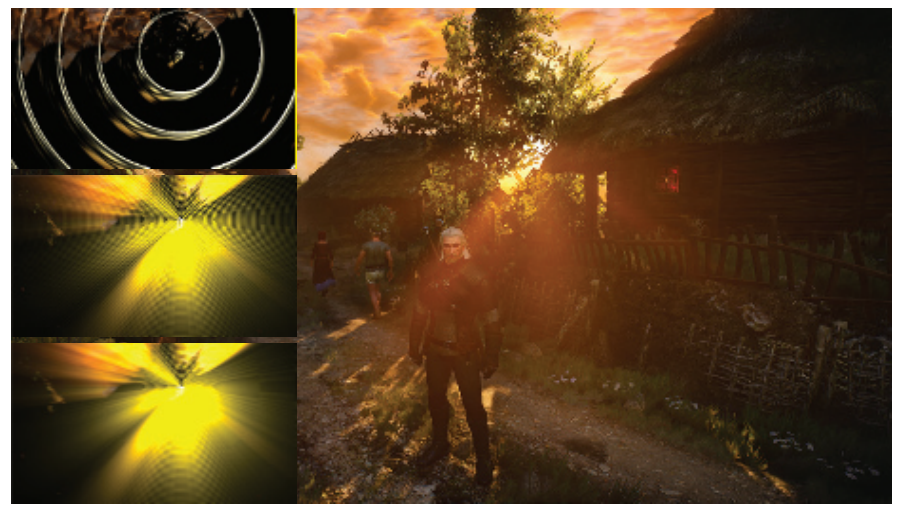
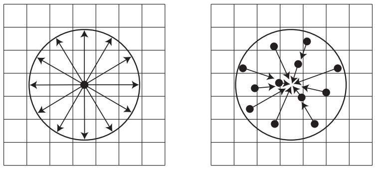
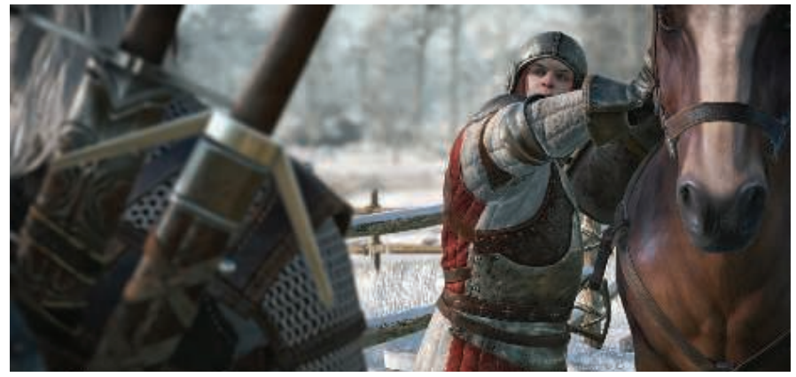
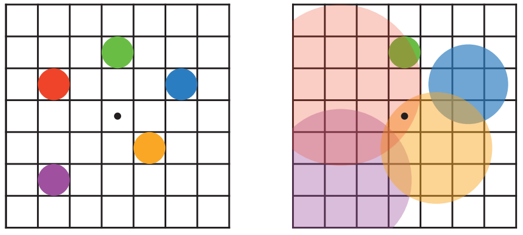
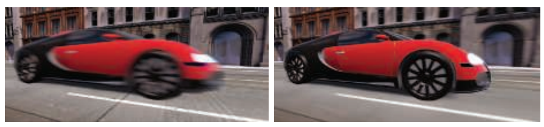
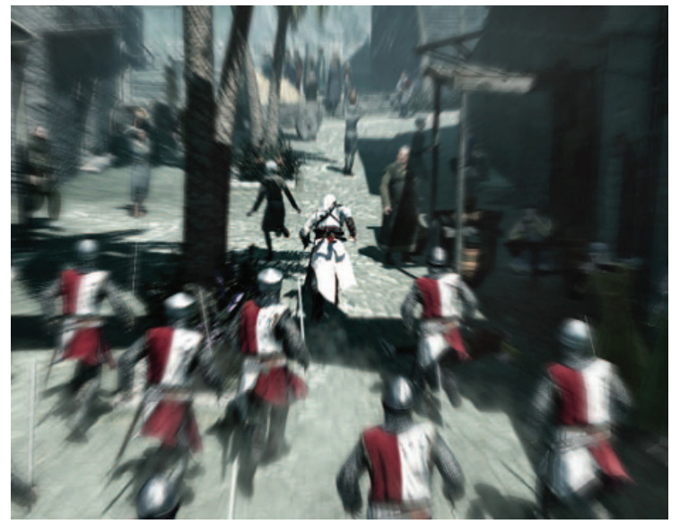

# Chapter 12 Image-Space Effects 图像空间特效

## 目录

-   [12.1 图像处理](#121-图像处理)
    -   [12.1.1 双边滤波](#1211-双边滤波)
-   [12.2 重投影技术](#122-重投影技术)
-   [12.3 镜头光晕和泛光](#123-镜头光晕和泛光)
-   [12.4 景深](#124-景深)
-   [12.5 运动模糊](#125-运动模糊)
-   [补充阅读和资源](#补充阅读和资源)

> Ernest Hemingway——“The world was not wheeling anymore. It was just very clear and bright and inclined to blur at the edges.”

> 欧内斯特·海明威——“世界不再转动，它变得清晰而明亮，边缘似乎变得有些模糊。”（美国著名作家；1899—1961）

制作一副图像要比简单地描绘（portray）物体复杂得多，想要让图像看起来具有真实感，其中一方面是让它看起来像一张照片。就像摄影师对他们的摄影作品进行后期调整一样，我们也希望能够对渲染出的图像进行修改调整，例如色彩平衡等。在渲染图像中添加胶片颗粒（film grain）、暗角（vignetting）以及其他细节变化，可以使其看起来更有说服力。此外，一些更加引人注目（dramatic）的效果，例如镜头光晕（lens flare）和泛光（bloom）可以增加艺术感。塑造景深（depth of field）和运动模糊（motion blur）等效果还可以增加真实感，也可以用于生成一些艺术效果。

利用GPU可以高效地对图像进行采样和处理。本章节将首先讨论如何使用图像处理技术（image processing technique）来修改渲染后的图像。还可以使用深度、法线等额外数据来对这些操作进行增强，例如：对噪声区域进行平滑的同时，仍然保留尖锐的边缘。重投影（reprojection）方法可用于节省着色的计算，或者快速创建缺失的帧。最后，我们会介绍各种基于样本的技术，来产生镜头光晕、泛光、景深、运动模糊以及其他效果。

## 12.1 图像处理

图形加速器通常用于从几何描述和着色描述中创建人工场景，而图像处理则不同，我们输入一副图像，并使用各种方式对其进行它修改。有了可编程的着色器，以及使用输出图像作为输入纹理的能力，我们将二者相结合，为使用GPU进行各种各样的图像处理操作开辟了道路。这种效果可以与图像合成（image synthesis）相结合。通常，我们会生成一个图像，然后对其执行一个或者多个图像处理操作。在渲染之后对图像进行修改的过程叫做后处理（post-processing）。在渲染一帧的时候，可以执行大量访问图像、深度以及其他缓冲区的pass \[46, 1918]，例如：游戏《战地4》拥有超过50种不同类型的渲染pass，尽管在一帧中不会同时执行所有的这些pass \[1313]。

使用GPU进行后处理操作有几个关键技术。场景以某种形式渲染到离屏缓冲区中，例如颜色图像和z-buffer等。这些渲染得到的图像会被视为纹理，这些纹理会被应用到填充屏幕的四边形上。后处理实际上就是通过渲染这个四边形来执行的，会为每个像素调用像素着色器程序。大多数图像处理效果，都依赖于在相应的屏幕像素处检索图像纹素的信息。根据系统限制和具体算法，可以通过从GPU检索像素位置，或者将$[0,1]$范围内的纹理坐标分配给这个屏幕四边形，并按照传入图像的大小进行缩放来实现这个过程。

实际上，使用一个填充屏幕的三角形，可能要比四边形更加高效。例如：当使用单个屏幕三角形而不是两个三角形组成的屏幕四边形时，由于更好的缓存一致性（cache coherency）\[381]，在AMD GCN架构上的图像处理速度提高了近10%。这个三角形被设计得足够大，可以填满整个屏幕\[146]，如图12.1所示。无论使用什么基本几何物体，其目的都是一样的：对屏幕上的每个像素都运行一遍像素着色器。这种类型的渲染称为全屏pass（full screen pass）。如果可以的话，我们还可以使用计算着色器来执行这些图像处理操作，这样做有几个优点，我们会在之后进行介绍。

 纹理坐标。右边则使用了一个三角形来填满整个屏幕，并对其纹理坐标进行了适当的调整，从而提供与左图相同的映射效果。")

使用传统的渲染管线，像素着色器阶段可以访问图像数据，检索所有相关的相邻样本并对其进行操作，相邻样本的贡献度会根据它与待评估像素的相对位置来进行加权。有些操作，例如边缘检测（edge detection），具有一个固定大小的邻域（例如$3 × 3$像素），邻域内每个像素都有不同的权重（有时也可能是负的）。每个纹素值乘上其相应的权重，并将邻域内的结果相加，从而获得最终结果。

如章节5.4.1所述，可以使用各种各样的滤波核来重建信号，使用类似的方式，还可以使用滤波核对图像进行模糊操作。一个旋转不变的滤波核（rotation-invariant filter kernel）是指，它在为纹素分配权重的时候不依赖于径向夹角。也就是说，这样的滤波核，其权重完全取决于纹素到滤波中心的距离。方程5.22所展示的$sinc$滤波器就是这样的一个例子。高斯滤波器是一种常用的滤波核，其形状是著名的钟形曲线：

$$
\operatorname{Gaussian}(x)=\left(\frac{1}{\sigma \sqrt{2 \pi}}\right) e^{-\frac{r^{2}}{2 \sigma^{2}}}
\tag{12.1} 
$$

其中$r$是到纹素中心的距离，$σ$为标准差（standard deviation），$σ^2$是方差（variance）。标准差$σ$越大，所形成的钟形曲线就越宽。一个粗略的经验法则是，使用大小为$3σ$或者更宽的滤波核（$3σ$原则）\[1795]。更大的滤波范围会使图像变得更加模糊，相应也会带来更多的内存访问和开销。

$e$前面的系数项使得连续曲线下的面积为1。然而，在构建离散滤波核的时候，这一项是不相关的。将滤波核内的每个纹素权重相加，然后再让权重除以这个和，就可以让最终的权重之和为1。由于这个归一化过程，因此方程前面的常数项是没有任何作用的，它通常也不会出现在滤波核的数学描述中。图12.2展示了二维高斯滤波器和一维高斯滤波器的形成过程。

$sinc$滤波器和高斯滤波器的一个问题是，这两个函数会无限延申。一种变通方法是将这样的滤波器clamp到一个特定的直径或者正方形区域内，超出范围的函数部分直接将其视为0。不同的滤波核针对不同的特性来进行设计，例如易于控制、平滑或者易于计算等。Bjorke \[156]和Mitchell等人\[1218]提供了一些常见的旋转不变滤波器，以及在GPU上进行图像处理的其他信息。

任何全屏滤波操作都会试图从图像边界以外的地方来采样像素，例如：如果我们正在为屏幕左上角像素收集$3 ×3$的滤波样本，那么实际上我们正在尝试检索一些不存在的纹素。一个基本的解决方案是将纹理采样器设置为clamp到屏幕边缘，当请求屏幕外不存在的纹素时，将会检索距离最近的边缘纹素。这会导致图像边缘的出现一些滤波错误，但是这些错误通常都是不明显的。另一种解决方案是以一个略高于显示区域的分辨率来生成要过滤的图像，从而使得这些屏幕外像素存在，在进行滤波的时候，只对屏幕内的纹素执行滤波操作。

使用GPU的一个优点在于，可以使用内置的插值硬件和mipmap硬件来帮助最小化要访问的纹素数量。例如：假设我们使用的是一个box滤波器，即对给定纹素周围$3 × 3$网格内的9个纹素求平均值，并显示这个模糊后结果。像素着色器会对这9个纹素样本进行加权求和，并将模糊后的结果输出到对应像素上。

然而，其实我们并不需要显式地访问这9个样本。通过对纹理进行双线性插值，一次纹理访问可以检索最多四个相邻纹素的加权和\[1638]。使用这个想法，$3 × 3$的滤波网格实际上只需要进行四次纹理访问就可以完成采样，如图12.3所示。对于一个权重相等的box滤波器，可以将单个样本可以放在四个纹素的中间，从而获得这四个纹素的平均值。对于像高斯滤波器这样权重不同的滤波器，使用四个样本之间的双线性插值是不准确的，可以将每个样本仍然放置在两个纹素之间，但是会更加偏向其中的某一个纹素。例如：假设其中一个纹素的权重为$0.01$，其相邻纹素的权重为$0.04$。那么样本可以这样放置，使其与第一个纹素的距离为$0.8$，与第二个纹素的距离为$0.2$，从而使得每个纹素都具有适当的比例。这样一来，这个样本的权重将是两个纹素权重之和，即$0.05$。或者，还可以对每四个纹素使用双线性插值样本，并找到最接近理想权重的偏移量，从而对高斯函数进行近似。

有些滤波核是可分离的（separable）。最典型的两个例子是高斯滤波器和box滤波器，这意味着它们可以使用两个独立的一维滤波操作来代替一次二维滤波操作。这样做可以使得总体上需要访问的纹素大大减少。时间复杂度从$d^2$降低到$2d$，其中$d$是滤波核直径或者支持范围\[815, 1218, 1289]。例如：假设box滤波器将应用在图像中每个像素周围的$5 × 5$区域中。首先，可以对图像进行水平过滤：每个像素左侧的两个相邻纹素与右侧的两个相邻纹素，以及滤波像素本身，都具有相等的权重$0.2$，然后再将这五个纹素的值进行加权求和。然后，再将得到的图像在垂直方向上进行模糊，使用上面两个相邻纹素和下面两个相邻纹素，再加上滤波像素本身，进行加权求和。最终，我们不是在一次pass中访问25个纹素，而是在两次pass中总共访问了10个纹素，如图12.2所示。宽度越宽的滤波核，所节省的开销就越多，因为节省了$d^2-2d$。

圆形的圆盘滤波器，对于背景虚化（bokeh）效果很有用（章节12.4），但是其计算成本通常会很高，因为该滤波器在实数域中是不可分离的。然而，可以通过使用复数来解决这个问题，复数的使用打开了一个广泛的函数家族。Wronski \[1923]对这类可分离滤波器的实现细节进行了讨论。

计算着色器很适合进行过滤操作，与像素着色器相比，滤波核的尺寸越大，在计算着色器中进行滤波操作的性能就越好\[1102, 1710]。例如：线程组的内存可以在不同像素的滤波计算之间共享图像访问，从而减少带宽压力\[1971]。通过使用计算着色器的分散写入（scattered write）操作，可以以常量开销实现任意半径的box滤波器。对于水平和垂直的滤波pass，可以提前计算好一行或者一列中第一个像素的滤波核值。后续的每个像素，通过在滤波核的前端添加下一个样本，并在减去在远端留下的样本，从而确定当前像素的滤波值。这种“移动平均（moving average）”技术可以用于在常数时间内近似任意大小的高斯模糊\[531, 588, 817]。

下采样是另一种在模糊处理时常用的GPU技术。下采样是指要为当前操作的图像生成一个较小分辨率的版本，例如：沿着两个轴将分辨率减半，创建四分之一屏幕的图像。根据输入数据和算法的需要，原始图像可以被滤波为一个较低的分辨率，或者也可以简单地以这个较低的分辨率来创建一个图像。当这个下采样的图像被混合到最终的完整分辨率图像中时，纹理的放大操作将会使用双线性插值来在样本之间进行混合，这会产生进一步的模糊效果。在原始图像的低分辨率版本上执行相关操作，会大大减少需要访问的纹素数量。此外，任何应用于这个低分辨率图像的滤波核，都会增加它的相对大小，例如：在低分辨率图像上应用宽度为5的滤波核（即中心像素的每侧分别还有两个纹素），其效果类似于在原始图像上应用宽度为9的滤波核。这样做的质量会稍微低一些，但是对于大面积相似颜色的模糊而言（这种情况经常出现在光晕效果和其他现象中），大多数瑕疵都很小，难以察觉\[815]。还可以通过减少每个像素所存储的bit数，来降低内存访问的开销。下采样操作还可以用于其他缓慢变化的现象，例如：许多粒子系统可以以屏幕半分辨率进行渲染\[1391]。这种下采样的思想可以扩展到创建图像mipmap，并从多个层进行采样，从而提高模糊过程的计算速度\[937, 1120]。

### 12.1.1 双边滤波

通过使用某种形式的双边滤波\[378, 1355]，可以改善上采样的结果以及其他图像处理操作。其核心思想是丢弃或者降低与中心样本表面无关的样本贡献值，它可以用于保持边缘。想象一下，我们将相机对准一个红色物体，其背后还有一个距离很远的蓝色物体，背景是灰色的。那么这个蓝色物体应当是模糊的，而红色物体应当是清晰的。一个简单的双边滤波器会对像素的颜色进行检查，如果是红色，则不会出现模糊，物体会保持清晰；否则，这个像素就会被模糊处理，所有非红色的样本都将用于模糊像素。如图12.4所示。

在这个例子中，我们可以通过检查像素颜色来决定忽略哪些像素。联合双边滤波（joint bilateral filter）或者交叉双边滤波（cross bilateral filter）会使用一些额外的信息，例如深度、法线、识别值、速度或者其他数据，来确定是否使用邻近的样本。例如：Ownby等人\[1343]展示了仅使用少量样本进行阴影映射时，对生成的结果进行模糊会使它看起来会变得更好。然而，一个物体上的阴影不应当对另一个不相关的物体产生影响，这种模糊处理会使得物体的阴影从边缘溢出。他们使用了一个双边滤波器，通过比较给定像素的深度与其邻域像素的深度，来丢弃属于不同表面上的样本。以这种方式来减少区域内的可变性被称为降噪（denoising），通常会被用于屏幕空间环境光遮蔽等算法中（章节11.3.6） \[1971]。

接近使用到相机的距离来寻找边缘通常来说是不够的，例如：一个软阴影跨越了两个立方体表面所形成的边缘，这个阴影可能只会落在一个表面上，另一个表面则背对光源。仅仅使用深度信息，可能会导致阴影在模糊时从一个表面溢出到另一个表面上，因为这个边缘并不会被检测到。我们可以在进行模糊处理的时候，只使用那些深度和表面法线与中心样本相似的邻居样本，从而解决这个问题，使得阴影不会溢出到其他表面上。这样做对跨越共享边缘的样本进行了限制，因此这种双边滤波器也称为边缘保持滤波器（edge-preserving filters）。是否削弱或者忽略邻近样本的影响，以及在多大程度上削弱或者忽略邻近样本的影响，这取决于开发人员的决定，还取决于模型、渲染算法和观察条件等因素。

除了花费在检查邻居样本和对权重求和上的额外时间，双边滤波还有一些其他的性能开销。一些常见的滤波优化操作，例如将滤波操作变成两pass的分离滤波，或者使用双线性插值进行加权采样，这些优化操作是难以在双边滤波中使用的。由于我们事先无法知道应该忽略哪些样本或者削弱哪些样本的影响，因此我们无法使用GPU在一次“tap”中收集多个图像纹素的技术。也就是说，由于可分离的两pass滤波器具有明显的速度优势，因此导致了人们致力于开发双边滤波的近似方法\[1396, 1971]。

Paris等人\[1355]讨论了双边滤波器的许多其他应用。在必须保留边缘信息但可以重复使用样本从而减少噪声的地方，可以应用双边滤波器。它还可以用于将着色频率与几何图形的渲染频率相解耦。例如：Yang等人\[1944]在较低的分辨率下进行着色处理，然后通过使用法线信息和深度信息，在上采样期间进行双边滤波从而形成最终帧。另一种方法是使用最近深度滤波（nearest-depth filtering），该方法会检索低分辨率图像中的四个样本，并使用深度最接近高分辨率图像的那个样本\[816]。Hennessy \[717]和Pesce \[1396]对这些方法和其他图像上采样方法进行了对比和比较。低分辨率渲染的一个问题是，可能会丢失部分精细尺度的细节。Herzog等人\[733]通过利用时间一致性和重投影技术进一步提高了图像质量。需要注意的是，双边滤波器是不可分离的，因为每个像素所采样的样本数量会发生变化。Green \[589]则指出，将双边滤波视为可分离滤波器所带来的瑕疵，能够被其他着色效果所隐藏。

实现后处理管线的一种常见方法是使用乒乓缓冲区（ping-pong buffer）\[1303]。这是在两个离屏缓冲区之间应用操作的想法，其中每个缓冲区都用于保存中间结果或者最终结果。对于第一个pass而言，第一个缓冲区是输入纹理，第二个缓冲区则是纹理输出的地方。在下一个pass中，这两个缓冲区的角色会被颠倒，第二个缓冲区现在会作为输入纹理，而第一个缓冲区则被用于输出。在第二个pass中，第一个缓冲区中的原始内容会被覆盖，这个过程是暂时的，它被作为一个处理pass的临时存储区域。对临时资源的管理和重用，是设计现代渲染系统的关键组成部分\[1313]。从架构的角度来看，让每个独立的pass执行特定的效果是很方便的；然而，为了提高效率和性能表现，最好在一个pass中结合尽可能多的后处理效果\[1918]。

在前面的章节中，访问其邻居的像素着色器会被用于形态学抗锯齿（morphological antialiasing）、软阴影、屏幕空间环境光遮蔽和其他技术。后处理效果一般会针对最终图像进行操作，它可以模拟热成像效果（thermal imaging）\[734]，重建胶片颗粒（film grain）\[1273]和色差（chromatic aberration）\[539]，进行边缘检测\[156, 506, 1218]，生成热浪（heat shimmer）\[1273]和波纹效果（ripple）\[58]，对图像进行色调分离（posterize）\[58]，帮助渲染云雾效果\[90]，以及执行大量的其他操作\[156, 539, 814, 1216, 1217, 1289]。章节15.2.3中介绍了一些用于非真实感渲染（non-photorealistic rendering）的图像处理技术，图12.5则给出了一些例子，它们都使用彩色图像作为唯一的输入。

在本章节结束的时候，我们会介绍一些使用广告牌和图像处理技术进行实现的效果，不再去赘述所有可能的算法。

## 12.2 重投影技术

重投影技术基于对前一帧计算样本进行重用的思想。顾名思义，这些样本可以从新的观察位置和观察方向尽可能地进行重复使用。重投影方法的一个目标是将渲染成本分摊到多个帧上，即利用时间一致性（temporal coherence）。因此，这也与章节5.4.2中所介绍的时域抗锯齿有关。重投影方法的另一个目标是，如果应用程序未能及时完成当前帧的渲染，则构建一个近似结果。这种方法在虚拟现实应用中尤其重要，可以避免模拟器眩晕症（simulator sickness）（章节21.4.1）。

重投影方法分为反向重投影（reverse reprojection）和正向重投影（forward reprojection）。反向重投影\[1264, 1556]的基本思想如图12.6所示。当在$t$时刻渲染一个三角形时，会计算当前帧（$t$）和前一帧（$t−1$）的顶点位置。使用顶点着色中的$z$和$w$分量，像素着色器可以为$t$和$t - 1$时刻计算插值$z/w$，如果两帧之间的距离足够近，那么可以在前一帧的颜色缓冲中来对位置$\mathbf{p}_{i}^{t-1}$的颜色进行双线性查找，并使用这个颜色值来代替当前帧的颜色值，而不是重新计算一个新的着色值。对于前一帧中被遮挡的区域（例如图12.6中的深绿色区域），这些区域没有相应的着色像素可以使用，这种现象被称为缓存未命中（cache miss）。发生这种事件的时候，我们需要计算新的像素着色值来填补这些空洞。由于着色值的重用假定它们与任何类型的运动（物体、相机、光源）都无关，因此明智的做法是不要在太多帧中重用这些着色值。Nehab等人\[1264]建议，在重复使用几帧之后，应当进行自动刷新。一种方法是将屏幕区域划分为$n$个组，其中每组是伪随机选择的$2 × 2$像素区域。每一帧都会更新一个组，避免重复使用某些像素值的时间过长。反向重投影的另一种变体是存储一个速度缓冲区（velocity buffer），并在屏幕空间中执行所有测试，这样做可以避免顶点的双重变换。

![图12.6：左图是 t−1 时刻的绿色 三角形 和蓝色三角形；右图是 t 时刻的绿色 三角形 和蓝色三角形。右图中的三维点 \mathbf{p}\_{i}^{t} 位于绿色三角形上两个像素的中心，它们连同像素面积一起，被反向重投影到了左图中的点 \mathbf{p}\_{i}^{t-1} 。从左图中我们可以看到，点 \mathbf{p}\_{0}^{t-1} 被遮挡，而 \mathbf{p}\_{0}^{t} 则是可见的，在这种情况下，没有着色结果可以被重复使用。然而，点 \mathbf{p}\_{1} 在 t−1 时刻和 t 时刻都是可见的，因此可以对该点重用着色结果。 \[1264\]](images/Chapter-12/202307131510213.png "图12.6：左图是 t−1 时刻的绿色 三角形 和蓝色三角形；右图是 t 时刻的绿色 三角形 和蓝色三角形。右图中的三维点 \mathbf{p}_{i}^{t} 位于绿色三角形上两个像素的中心，它们连同像素面积一起，被反向重投影到了左图中的点 \mathbf{p}_{i}^{t-1} 。从左图中我们可以看到，点 \mathbf{p}_{0}^{t-1} 被遮挡，而 \mathbf{p}_{0}^{t} 则是可见的，在这种情况下，没有着色结果可以被重复使用。然而，点 \mathbf{p}_{1} 在 t−1 时刻和 t 时刻都是可见的，因此可以对该点重用着色结果。 \[1264]")

为了获得更好的质量，还可以使用一个运行时平均滤波器（running-average filter）\[1264, 1556]，它会逐步淘汰旧的着色值。它特别适用于空间抗锯齿（spatial antialiasing）、软阴影和全局光照。这个滤波器的描述如下：

$$
\mathbf{c}_{f}\left(\mathbf{p}^{t}\right)=\alpha \mathbf{c}\left(\mathbf{p}^{t}\right)+(1-\alpha) \mathbf{c}\left(\mathbf{p}^{t-1}\right)
\tag{12.2} 
$$

其中$\mathbf{c}\left(\mathbf{p}^{t}\right)$是点$\mathbf{p}^{t}$上的新着色值，$\mathbf{c}\left(\mathbf{p}^{t-1}\right)$是前一帧中的重投影颜色，$ \mathbf{c}_{f}\left(\mathbf{p}^{t}\right)
  $是应用滤波器之后的最终颜色。Nehab等人在某些用例中使用$α = 3/5$，但是他建议根据具体的渲染内容来尝试使用不同的值。

正向重投影则是从第$t - 1$帧的像素开始，并将它们投影到第$t$帧中，因此不需要进行两次顶点着色。这意味着来自第$t−1$帧的像素会被分散到第$t$帧中，而反向重投影方法则会收集从第$t−1$帧到第$t$帧的像素值。反向重投影方法还需要处理那些变得可见的遮挡区域，通常会通过一些启发式的空洞填充方法来完成，即使用周围像素的信息来推断出缺失区域的值。Yu等人\[1952]使用正向重投影方法，以一种廉价的方式来计算景深效果。Didyk等人\[350]基于运动向量（motion vector），在第$t−1$帧中自适应地生成网格来避免空洞，而不是使用经典的空洞填充方法。这个网格是通过深度测试来进行渲染的，然后会将其投影到第$t$帧中，这意味着遮挡问题和折叠问题，是作为带深度测试的自适应三角形网格光栅化的一部分来进行处理的。Didyk等人将他们的方法从左眼重投影到右眼，从而为虚拟现实生成一对立体图像，这两个图像之间的相关性通常会很高。后来，Didyk等人\[351]提出了一种感知驱动的方法（perceptually motivated method）来执行时域采样，例如：将帧率从40 Hz增加到120 Hz。

Yang和Bowles \[185, 1945, 1946]提出了从$t$和$t+ 1$两帧中，投影到这两个帧之间$t+δt$帧的方法，即$δt∈[0,1]$。这些方法有更大的机会能够更好地处理遮挡情况，因为它们使用了两帧而不是一帧。在游戏中使用这种方法，能够将帧率从30 FPS提高到60 FPS，这种效果是可能的，因为该方法的运行时间不到1毫秒。我们推荐Yang和Bowles的课程笔记\[1946]，以及Scherzer等人\[1559]对时域相关方法的广泛调查。Valent \[1812]在《杀戮区域：暗影坠落》中也使用了重投影方法来加速渲染。有关使用重投影来实现时域抗锯齿的细节，请参阅章节5.4.2末尾的大量参考资料。

## 12.3 镜头光晕和泛光

镜头光晕（lens flare）是由光线通过间接反射，或者其他非预期途径穿过晶状体系统或者眼睛所引起的现象。耀斑（flare）可以分为几种现象，其中最明显的是光晕（halo）和绒毛状光环（ciliary corona）。光晕是由透镜晶体结构的径向纤维所引起的，它看起来像一个围绕着光源的圆环，其外缘是红色的，而内部则是紫色的。光晕的视觉尺寸是恒定的，与到光源的距离无关。绒毛状光环来自于透镜的密度波动，它表现为从某一点辐射出的射线，这些射线可以延伸到光晕以外的地方\[1683]。

当镜头的某些部分在内部反射光线或者折射光线时，镜头也可以产生一些其他的次要效果。例如：由于相机的光圈叶片，可能会产生多边形图案。由于玻璃上的细小凹槽，可能在挡风玻璃上看到条状光线\[1303]。泛光是由晶状体和眼睛其他部分的散射所引起的，它会在光源周围产生辉光效果，并降低场景其他地方的对比度。数码相机会通过电荷耦合器件（charge-coupled device，CCD）来将光子转换为电荷，从而实现图像的捕获。CCD中的一个电荷位置饱和并溢出到邻近的位置时，就会发生泛光现象。光晕、日冕和泛光，这类效果被称为炫光效果（glare effect）。

实际上，随着相机技术的不断进步，大多数这样的人工瑕疵也越来越少。更好的设计、镜头罩和抗反射涂层，可以减少或者消除这些错误的鬼影瑕疵\[598, 786]。然而，现在通常会使用一些数字方式，来将这些效果添加到真实照片上。因为计算机显示器所能够产生的光线强度是有限的，因此我们会通过在图像中添加这种效果，来给人眼一种场景或者物体变亮的印象\[1951]。在照片、电影和交互式计算机图形程序中，由于这些效果的普遍使用，使得泛光效果和镜头光晕几乎是陈词滥调（cliches）的。然而，如果使用得当，这些效果可以给观众提供强烈的视觉暗示。

为了提供令人信服的效果，镜头光晕应当随着光源位置的变化而变化。King \[899]创建了一组具有不同纹理的正方形方块来表示镜头光晕，它们的中心位于从屏幕上光源位置到屏幕中心的直线上。当光源远离屏幕中心时，这些正方形方块会变小且更加透明；随着光源向内移动，它们会变大且更加不透明。Maughan \[1140]通过使用GPU来计算屏幕面光源的遮挡，从而改变镜头光晕的亮度。他生成了一个单像素的强度纹理，然后使用它来对效果的亮度进行衰减。Sekulic \[1600]将光源渲染为单个多边形，使用遮挡查询硬件来给出可见区域的像素计数（详见章节19.7.1）。为了避免在等待查询值返回给CPU时的GPU停滞，查询到的结果会在下一帧中进行使用，然后来确定衰减量。由于这些炫光现象的强度可能会以相当连续和可预测的方式进行变化，因此单帧的延迟几乎不会引起感知上的混乱。Gjøl和Svendsen \[539]首先生成一个深度缓冲（这个深度缓冲也将其用于其他效果），并在镜头光晕将会出现的区域以螺旋模式来采样32次，并使用采样结果来对光晕纹理进行衰减。在渲染光晕几何图形时，可见性采样是在顶点着色器中完成的，这样可以避免硬件遮挡查询所造成的延迟。

场景中明亮物体或者光源的条纹，可以通过绘制半透明广告牌，或者对明亮像素本身进行后处理过滤来实现。《侠盗猎车手5》等游戏使用了一组应用在广告牌上的纹理，来实现这些效果\[293]。

Oat \[1303]讨论了使用steerable滤波器来产生条纹效果的方法。这种类型的滤波器并不是在一个区域上进行对称滤波，而是会在一个给定方向上进行滤波。沿着这个给定方向的纹素值会被相加，从而产生一个条纹效果。该方法使用了降采样到四分之一宽度和四分之一高度的图像，并使用乒乓缓冲区执行两次pass，给出了令人信服的条纹效果。图12.7展示了这种技术的一个例子。

![图12.7：镜头光晕、星状眩光和泛光效果，以及景深和动态模糊。请注意一些正在移动的球，其表面出现了频闪的现象，这是由于对独立的图像进行了累积。 \[1208\]](images/Chapter-12/202307131717408.png "图12.7：镜头光晕、星状眩光和泛光效果，以及景深和动态模糊。请注意一些正在移动的球，其表面出现了频闪的现象，这是由于对独立的图像进行了累积。 \[1208]")

除了广告牌之外，还有许多其他的变体和技术，这些技术的效果要更好。Mittring \[1229]使用一些图像处理技术来隔离图像中的明亮部分，对它们进行下采样，并在一些纹理中对它们进行模糊。然后再通过复制、缩放、镜像和着色等操作，将它们再次合成到最终图像上。使用这种方法，艺术家无法单独控制每个光晕的外观表现，因为所有的光晕都会使用这个相同的生成过程。然而，图像上任何明亮的部分都可能产生镜头光晕，例如镜面反射、表面的自发光部分、明亮的火花粒子等。Wronski \[1919]描述了变形镜头光晕，这是20世纪50年代使用的电影摄像设备所带来的副产品。Hullin等人\[598, 786]为各种鬼影瑕疵提供了一个物理模型，并通过追踪一组光线来计算其效果。它给出了基于镜头系统设计的合理结果，并在精度和性能之间进行了权衡。Lee和Eisemann \[1012]在这项工作的基础上，使用了一个线性模型，从而避免了昂贵的预处理操作，Hennessy \[716]则给出了实现细节。图12.8中展示了实际产品中所使用的典型镜头光晕系统。

泛光效果，即一个非常明亮的区域，其亮度溢出到相邻的像素上，它是通过结合前文中已经提出的几种技术来实现的。其主要的想法是，创建一个仅由“过曝”明亮物体所组成的泛光图像，对其进行模糊处理，然后再将其合成到正常的图像中。所使用的模糊通常是高斯模糊\[832]，但是最近与参考镜头的匹配表明，这个模糊分布应当更倾向于尖峰形状\[512]。制作这种图像的一种常见方法是bright-pass滤波器：保留任何明亮的像素，将所有暗淡的像素都变成黑色，通常会在过渡点进行一些混合或者缩放\[1616, 1674]。对于只有几个小物体的泛光效果，可以通过计算屏幕包围盒，来限制后期处理中模糊pass和合成pass的范围\[1859]。

中间过程的泛光图像可以使用低分辨率进行渲染，例如：将分辨率降低到原始宽度和原始高度的二分之一到八分之一。这样做一方面可以节省时间开销，另一方面有助于提高过滤效果。这幅低分辨率的图像被模糊之后，会与原始图像相结合。这种降低分辨率的方法会被用于许多后处理效果的实现中，就像是压缩颜色分辨率或者降低颜色分辨率的技术一样\[1877]。泛光图像可以被下采样若干次，并从生成的图像中进行重新采样，在最小化采样成本的同时，还可以提供更加广泛的模糊效果\[832, 1391, 1918]。例如：在屏幕上移动的单个明亮像素可能会导致闪烁，因为它可能在某些帧中并没有被采样。

由于泛光效果的目标是让图像在明亮的地方看起来过度曝光，因此图像的颜色还会按需要进行缩放，并添加到原始图像中。这种加法混合方式会使得颜色更加饱和，并最终变成白色，这通常正是我们想要的，图12.9给出了一个示例。Alpha混合可以用于更加艺术化的控制\[1859]。对于高动态范围（HDR）图像，可以通过过滤（而不是阈值化）来获得更好的结果\[512, 832]。LDR和HDR的泛光效果可以分开计算，然后再进行组合，从而以一种更加令人信服的方式来捕获不同的现象\[539]。当然还可以有其他的变体，例如：前一帧的结果也可以添加到当前帧中，为动画物体提供一个条纹发光的效果\[815]。

![图12.9：HDR的色调映射和泛光效果。下面的图像是通过在原始图像上使用色调映射，并在原始图像上添加后处理泛光效果而生成的。 \[1869\]](images/Chapter-12/202307131821903.png "图12.9：HDR的色调映射和泛光效果。下面的图像是通过在原始图像上使用色调映射，并在原始图像上添加后处理泛光效果而生成的。 \[1869]")

## 12.4 景深

对于一个给定设置的相机镜头，它有一个物体聚焦的范围，即它的景深（depth of field）。任何超出这个范围的物体都是模糊的，距离越远越模糊。在摄影中，这种模糊效果的强弱与光圈大小和焦距有关。减小光圈的尺寸可以增加景深，也就是说：减小光圈尺寸，可以增加聚焦的深度范围，但是形成图像的光亮也会相应减少（详见章节9.2）。在户外白天拍摄的照片通常具有较大的景深，因为光量充足，使用一个较小的光圈也能保证足够的进光量，在最理想情况下，光圈可以足够小，即一个针孔相机。而在一个光线昏暗的房间里，景深则会明显缩小。因此，控制景深效果的一种方法是将其与色调映射联系起来，使得失焦（out-of-focus）物体随着光照水平的降低而变得更加模糊。另一种方法则是允许手动进行艺术控制，根据需要改变焦点和增加景深，从而达到理想的艺术效果，如图12.10所示。

![图12.10：景深效果取决于相机的焦距。 \[209, 1178\]](images/Chapter-12/image_QQa1DAb17H.png "图12.10：景深效果取决于相机的焦距。 \[209, 1178]")

可以使用一个累积缓冲区（accumulation buffer）来模拟景深效果\[637]，详见图12.11。通过改变镜头上的观察位置并保持焦点固定，物体将会相对于它们与焦点的距离从而被渲染得更加模糊。然而，与其他累积效果一样，这种方法的成本很高，需要对每张图像进行多次渲染。也就是说，它确实可以收敛到正确的ground-truth图像，这个图像可以用于测试其他景深算法的质量。通过改变观察光线在光圈上的位置（初始发射位置），光线追踪也可以收敛到物理正确的结果。为了提高渲染效率，有许多方法会在失焦的物体上使用较低层次的LOD。

虽然这种方法对于交互式应用而言不切实际，但是这种在镜头上移动观察位置，再将结果累积平均的技术，提供了一种合理的方式来考虑每个像素中应当记录什么信息。场景中的表面按照距离可以分为三个区域：聚焦在焦点附近的区域（focus field，焦点场或者中场）；远处的区域（远场）；较近的区域（近场）。对于位于焦距处的表面，每个像素都是清晰聚焦的，因为所有累积的图像都具有大致相同的渲染结果。焦点场是一个深度范围，在这个深度范围内的物体只会发生轻微的失焦，例如少于半个像素\[209, 1178]。这个深度范围就是摄影师们所说的景深。而在交互式计算机图形学中，我们会默认使用一个具有完美焦距的针孔相机，因此景深指的是对远场内容和近场内容进行模糊的效果。最终平均图像中的每个像素，都是在不同观察位置下所看到的表面位置的混合结果，由于这些表面位置可能会有很大的差异，因此会使得失焦区域（out-of-focus）变得模糊。

这个问题有一个有限的解决方案，即创建不同的图层来渲染不同区域中的内容。即对焦点物体渲染一副图像，对距离大于焦距的物体（远场）渲染一副图像，对距离小于焦距的物体（近场）渲染一副图像。这个操作可以通过改变相机的远近裁剪平面来实现。将远场图像和近场图像进行模糊处理，然后再将这三幅图像按照前后顺序组合在一起\[1294]。这种方法被称为2.5维方法，之所以这么叫，是因为这些二维图像被赋予了深度并据此组合在一起，这种方法在某些情况下可以提供合理的结果。但是当物体跨越多个图像时，这种方法就会失效，因为物体会突然从模糊变为聚焦。此外，所有过滤后的物体都具有均匀一致的模糊程度，这个模糊程度不会随着距离而发生任何变化，这样是不合理的\[343]。

观察这个过程的另一种方法是：考虑景深如何对表面上的单个位置产生影响。现在让我们想象表面上的一个小点，当表面聚焦时，我们可以通过单个像素看到这个小点；如果表面失焦，小点则将出现在附近的像素中，这取决于不同的观察视图。在极限情况下，这个小点将在像素网格上定义一个实心圆。这个实心圆被称为弥散圆（circle of confusion）。

在摄影中，焦点场之外的审美质量被称为散景（bokeh），这是一个来自日语的单词，其意思是“模糊（blur）”。(bokeh读作“bow-ke”，其中“bow”是“bow and arrow”中的“bow”，“ke”是“kettle”中的“ke”）。通过光圈的光线通常是均匀分布的，而不是符合某种高斯分布\[1681]。模糊区域的形状与光圈叶片的数量、形状以及尺寸有关。一些廉价的相机会产生五边形的模糊，而不是完美的圆形；而目前大多数新相机都有7个叶片，高端机型有9个或者更多叶片。还有一些更好的相机会使用圆形叶片，从而使得散景效果呈圆形\[1915]。在夜间拍摄时会使用更大尺寸的光圈，从而可以产生一个更圆的图案。与镜头光晕（lens flare）和泛光（bloom）被放大的效果相类似，我们有时会刻意渲染一个六边形的弥散圆，从而暗示我们正在用一个物理相机进行拍摄。正如Barre-Brisebois所解释的那样\[107]，在可分离的两pass后处理模糊中，六边形是一种特别容易产生的形状，因此被广泛应用在许多游戏中。

计算景深效果的一种方法是，获取每个像素在表面上的位置，并将其着色值散射（scatter）到这个弥散圆或者弥散多边形内部的相邻像素中，如图12.12左侧所示。但是这个散射的概念不能很好地映射到像素着色器的功能上。像素着色器可以进行高效的并行操作，其中一个原因就是因为它们不会将结果传播给相邻像素。一种解决方案是为每个远近场像素都渲染一个sprite（详见章节13.5） \[1228, 1677, 1915]。每个sprite都会被渲染到一个单独的图层中，sprite的大小由弥散圆的半径所决定。每一个图层都存储了所有重叠sprite的平均混合和，然后这些图层会被一个接一个地组合起来。这种方法有时也会被称为前向映射（forward mapping）技术\[343]。这种方法有一些致命的缺点，首先是性能问题，即使使用图像降采样技术，这种方法也可能会很慢，更加糟糕的是，这种方法的时间开销是不稳定的，尤其是当焦点场很浅时（焦距很小）\[1517, 1681]。性能的可变性意味着我们很难去管理每帧用于渲染的预算，即分配给执行所有渲染操作的时间。这种不可预测性会导致帧丢失，以及用户体验上的不均衡，不平滑。

另一种思考弥散圆的方法是：假设像素周围的局部邻域都具有相同的深度。有了这个想法之后，就可以执行一个聚集（gather）操作了，如图12.12右侧所示。对于聚集前置渲染pass结果这个操作，像素着色器是经过专门优化的。因此，我们可以根据每个像素的深度，来对表面进行不同程度的模糊，从而实现景深效果。像素的深度信息定义了一个弥散圆（circle of confusion） \[1672]，即应当被采样聚集的区域有多宽。这种聚集方法被称为反向映射方法（backward mapping，reverse mapping）。

大多数实用的景深算法都是从一个视角的初始图像开始，这意味着从一开始我们就缺失了一些信息。这个单一视角所能看到的场景信息是不完整的，场景的其他视图可能还会看到一些额外的表面。正如Pesce所指出的那样，我们应当尽可能地利用我们拥有的可见样本\[1390]。

这类聚集技术在多年来不断发展，每一次都在之前工作的基础上有所改进。这里我们将主要介绍Bukowski等人\[209, 1178]所提出的方法及其遇到的问题，以及这些问题相应的解决方案。他们的方案基于深度信息，为每个像素生成一个代表弥散圆半径的带符号值。这个半径可以从相机设置和特性中获得，但是艺术家们通常更喜欢手动控制效果，因为近场、焦点场和远场的范围都可以手动调整。半径的符号指定了像素是位于近场还是远场，其中$-0.5<r<0.5$处于焦点场，即半个像素的模糊会被认为处于焦点场中。

这个包含弥散圆半径的缓冲区会用于将图像分成两个图像，即近场图像和其他图像，每个图像都会在两个pass中，使用可分离的滤波器进行下采样和模糊操作。这里的图像分离是为了解决一个关键问题，即近场中的物体应当具有模糊的边缘。如果我们根据弥散圆的半径对每个像素进行模糊，并输出到单个图像中，那么最终结果中的前景物体可能会是模糊的，但仍然会具有清晰的边缘。例如：从前景物体穿过轮廓边缘到达聚焦物体时，样本半径将会降为零，因为聚焦物体不需要进行模糊处理。这将会导致前景物体对其周围像素的影响突然下降，从而产生一个尖锐的边缘，如图12.13所示。

![图12.13：近场模糊。左边是没有景深效果的原始图像。在中间，近场像素会被模糊，但是在靠近焦点场的区域会有一个清晰的物体边缘。右图展示了使用单独的近场图像，并将其叠加在较远内容上的效果，近场像素不仅会被模糊，同时也不会出现清晰的物体边缘。 \[209, 1178\]](images/Chapter-12/202308181020686.png "图12.13：近场模糊。左边是没有景深效果的原始图像。在中间，近场像素会被模糊，但是在靠近焦点场的区域会有一个清晰的物体边缘。右图展示了使用单独的近场图像，并将其叠加在较远内容上的效果，近场像素不仅会被模糊，同时也不会出现清晰的物体边缘。 \[209, 1178]")

我们想要的效果是，让位于近场中的物体被平滑地模糊，并产生超出其边界的模糊效果。这是通过在单独的图像中写入并模糊近场像素来实现的。此外，这个近场图像中的每个像素都会被赋予一个alpha值，来代表它的混合因子，这个混合因子同样也会被模糊处理。在创建两个分离图像的时候，还可以使用联合双边滤波和其他的一些测试；详情请参阅论文\[209, 1178]，以及其中提供的详细代码。这些测试有这样的几个功能，例如：对于远场模糊，对于那些比采样像素远得多的邻近物体，会选择将其丢弃。

在根据弥散圆半径进行分离和模糊处理之后，我们会将这两个分离图像再次合成。我们会使用弥散圆的半径，来对原始聚焦图像和远场图像之间进行线性插值。弥散圆的半径越大，所使用的模糊远场结果就越多。然后再使用近场图像中的alpha覆盖率值，来将近场图像与刚才的插值结果相融合。通过这种方式，可以让近场的模糊内容适当地扩散到后面的场景上，如图12.10和图12.14所示。

这个算法有几个简化和调整，可以使其看起来更加合理。还可以使用一些其他的方法来更好地处理粒子，并且透明度也可能会导致一些问题，因为这些现象都涉及了每个像素多个$z$深度的问题。尽管如此，由于这种方法只需要输入颜色缓冲区和深度缓冲区，并且只使用了三个后处理pass，因此这个方法简单且相对健壮。基于弥散圆的采样，以及将远场、近场分离为单独的图像（或者图像集合）的思想，是许多景深模拟算法的共同主题。下面我们将讨论在电子游戏中所使用的一些新方法（就像前面提到的方法一样），这些方法需要高效、健壮，同时还具有可预测的开销 \[832, 1390]。

这里我们所介绍的第一种方法使用了运动模糊，有关运动模糊的概念和方法，我们将在下一小节中重新进行讨论。回到最初弥散圆的概念中，想象一下，将图像中的每个像素都转换为对应的弥散圆，其强度与圆的面积成反比。按顺序依次来渲染这组圆会给带来我们最好的结果，但是这样就把我们带回到了之前提到的散射（scatter）概念，因此这样做通常是不切实际的。但是这种思维模式在这里会很有价值，给定一个像素，我们想要确定所有重叠在该位置上的弥散圆，并将它们按照顺序混合在一起，如图12.15所示。使用场景定义的最大弥散圆半径，对于每个像素，我们可以检查位于该半径范围内的每个邻居像素，并查找其弥散圆是否包含当前给定像素的位置。然后将所有影响该像素的重叠相邻样本进行排序和混合。

上述这种方法是理想的，但是在GPU上，将找到的片元进行排序，这个操作的开销太大了。相反，我们使用了一种被称为“聚集时散射（scatter as you gather）”的方法，我们通过查找哪些邻居像素将会散射到当前像素位置来进行聚集操作。选择具有最小$z$深度（最近距离）的重叠邻居来表示较近的图像。任何其他在$z$深度上与该深度接近的重叠邻居，都会将其alpha混合的贡献添加进来，然后再取平均值，并将颜色和alpha值存储在“前景”层中。而这种类型的混合则不需要进行排序操作。而所有其他剩余的重叠邻居，同样会进行类似的求和平均，并将结果放在一个单独的“背景”层中。这里的前景层和背景层并不对应于之前我们所提到的近场和远场，它们只是在每个像素区域中碰巧所找到的任何东西。然后前景图像会被合成到背景图像上，产生近场模糊的效果。虽然这种方法听起来很复杂，但是通过应用各种采样和过滤技术，可以使其十分高效。你可以参考Jimenez \[832]、Sousa \[1681]、Sterna \[1698]和Courreges \[293, 294]的演示来了解一些不同形式的实现，并查看图12.16中所展示的例子。

![图12.16：近景深和远景深。在前景中，明亮的反射杆上存在五边形的散景。 \[1408\]](images/Chapter-12/202308181124031.png "图12.16：近景深和远景深。在前景中，明亮的反射杆上存在五边形的散景。 \[1408]")

在一些较早的电子游戏中使用的是另一种方法，该方法基于计算热扩散（heat diffusion）的想法。图像被视为向外扩散的热分布，而每个弥散圆则代表了该像素的热传导系数（thermal conductivity）；而焦点区域则是一个完美的绝缘体，不会发生热扩散。Kass等人\[864]描述了如何将一维的热扩散系统视为一个三对角矩阵（tridiagonal matrix），每个样本都可以在常数时间内进行求解。计算着色器可以很好地存储和求解这种类型的矩阵，因此相关从业者开发了几种实现，其中图像会沿着每个轴分解为这样的一维系统\[612, 615, 1102, 1476]。弥散圆的可见性问题仍然存在，通常会基于深度信息，生成并合成单独的图层来进行解决。这种技术无法很好地处理弥散圆中的不连续性，因此如今已经很少使用了。

一种特殊的景深效果是由明亮的光源或者画面中的反射所引起的。光源或者镜面反射的弥散圆，即使这种效果会在区域中变得暗淡，但是可能还是要比其画面中的相邻物体亮得多。虽然将每个模糊像素都渲染为一个sprite是十分昂贵的，但是这些明亮的光源往往具有更高的对比度，因此可以更加清楚地显示出光圈的形状。而其余像素之间的差异则比较小，因此形状不那么重要。有时，“散景（bokeh）”一词也被（这是错误的）用来指代这些明亮的区域。检测高对比度区域，并只将这些较亮像素渲染为sprite，同时对其余像素使用聚集技术，从而可以获得一个具有定义的散景，同时也更加高效\[1229, 1400, 1517]，如图12.16所示。计算着色器同样也可以发挥作用，它可以为聚集景深、高效散景溅射（splatting）创建高质量的SAT表\[764]。

我们只介绍了渲染景深和明亮散景效果的一小部分方法，并描述了一些用于提高过程效率的技术。研究人员还探索了随机光栅化（stochastic rasterization）、光场处理等方法。Vaidyanathan等人\[1806]的文章对之前的工作进行了总结，McGuire \[1178]给出了一些实现上的总结。

## 12.5 运动模糊

为了渲染出令人信服的图像序列，稳定且足够高的帧率是很重要的。平滑且连续的运动当然是更好的，但是过低的帧率会使得运动变得不稳定。电影会以每秒24帧的速度进行放映，但是电影院通常是黑暗的，在昏暗的光线下，眼睛的瞬时响应（temporal response）对昏暗光线的闪烁不太敏感。此外，电影放映机以24 FPS的速度改变图像，但是在显示下一幅图像之前，会将当前图像重新显示2-4次，来减少人眼感知到的闪烁。当然，也许最重要的是，电影的每一帧画面，通常都是运动模糊过的图像；而在默认情况下，交互式图形程序所生成的图像没有运动模糊的。运动模糊（motion blur），也可以叫做动态模糊。

在电影中，运动模糊来源于画面中物体在屏幕上的移动，或者来自于摄像机本身的运动。当相机快门打开1/40秒-1/60秒时，就会出现这种效果，而电影中拍摄一帧画面的时间是1/24秒。我们习惯于在电影中看到这种模糊效果，并且会认为这是很正常的，因此我们也希望在电子游戏中能看到它们。当快门的打开时间为1/500秒或者更短时，可以产生一种剧烈运动（hyperkinetic）的效果，这种效果最早出现在《角斗士》和《拯救大兵瑞恩》等电影中。

对于快速移动的物体，在没有运动模糊的情况下会显得很不稳定，这些物体在帧与帧之间“跳过”了许多像素。这也可以被认为是一种走样，类似于锯齿，但其本质上是时间上的锯齿而不是空间上的。运动模糊可以被认为是一种时域上的抗锯齿。正如提高显示分辨率可以减少锯齿但是无法消除它们一样，提高帧率也不能完全消除对运动模糊的需求。电子游戏的一大特点就是相机和物体的快速运动，因此应用运动模糊可以显著提高它们的视觉效果。事实上，30 FPS加上运动模糊的效果，通常要比60 FPS但没有运动模糊的效果好\[51, 437, 584]。

运动模糊依赖于相对运动。如果一个物体在屏幕上从左向右移动，那么它在屏幕的水平方向会被模糊。如果相机正在跟随一个移动的物体，那么物体不会被模糊，而发生相对运动的背景则会被模糊，如图12.17所示。这就是现实世界的相机的工作原理，一个优秀的导演知道如何拍摄一个镜头，并使得所感兴趣的区域是聚焦且不模糊的。

与景深效果类似，累积一系列图像提供了一种创建运动模糊的方法\[637]。当相机快门打开的时候，一帧画面存在一个持续时间。场景会在这段时间内的不同时间进行渲染，每次渲染前都会对相机和物体进行重新定位。生成的若干张图像会被混合在一起，最终得到一个图像，其中相对于相机视野发生运动的物体是模糊。但是对于实时渲染而言，这样的过程通常是适得其反的，因为它会大大降低帧率。此外，如果物体发生快速运动，并且单个独立图像变得可感知时，就会看到瑕疵，图12.7中也展示了这个问题。随机光栅化可以避免多幅图像混合时出现的鬼影现象，但是相对应的，它会产生噪声现象\[621, 832]。

如果我们想要的是运动模糊的画面效果，而不是完全真实的物理模拟，那么这个累积的概念可以被巧妙地运用。想象一些，我们现在已经生成了运动模型的8帧画面，并将其求和到一个高精度缓冲区中，然后对其求平均值并显示在屏幕上。在第9帧中，模型会被再次渲染并累加，但是同时，我们会再次执行第1帧的渲染，并从求和结果中减去第1帧渲染的结果。现在缓冲区中还是有8帧模糊的运动模型，即第2帧到第9帧。而在下一帧中，我们将会减去第2帧，然后加上第10帧，同样得到第3到第10帧，共计8帧的累积总和。这样就产生了高度模糊的艺术效果，但是代价是每一帧会渲染两遍场景\[1192]。

对于实时图形程序而言，需要一些比上述多次渲染方法更快的技术。景深和运动模糊都可以通过对一组视野进行平均来渲染，这表明了两种现象之间的相似性。为了高效渲染这些效果，这两种效果都需要将它们的样本分散到邻近的像素上，但是通常我们都会执行聚集操作。它们还需要处理不同模糊程度的多个层级，并在给定起始帧内容的情况下重建被遮挡的区域。

运动模糊有几种不同的来源，每种都有各自适用的方法。这些来源可以分为相机方向变化、相机位置变化、物体位置变化、物体方向变化，这里大致按照复杂性递增的顺序进行列举的。如果相机保持位置不变，那么整个世界可以被认为是一个围绕着观察者的天空盒（详见章节13.3）。此时改变相机方向会使得图像整体上出现方向性的模糊。给定此时相机旋转的方向和速度，我们沿着这个方向对每个像素进行采样，这个速度决定了滤波器的宽度。这种定向模糊被称为线积分卷积（line integral convolution，LIC）\[219, 703]，它也被用于流体流动的可视化。Mitchell \[1221]讨论了在给定运动方向下的运动模糊的立方体环境贴图（motion-blurring cubic environment map）。如果相机沿着其观察方向轴进行旋转，那么使用一个圆形模糊，每个像素的方向和速度会相对于旋转中心而发生变化\[1821]。

如果相机的位置发生变化，那么视差（parallax）就会起作用，例如：远处物体的移动速度相对较慢，模糊也相对较少。当相机沿着观察方向向前移动的时候，这里的视差可以被忽略。仅仅使用一个径向模糊就可能足够了，这种方法能够实现夸张的戏剧效果，图12.18展示了这样一个例子。

为了增加真实感，例如在一个竞速游戏中，我们需要适当计算每个物体运动的模糊效果。如果在向前看的同时进行侧向移动，这在计算机图形学中被称为平移（pan），深度缓冲区会告诉我们每个物体应该被模糊多少。

> 在电影摄影中，平移（pan）指的是在不改变位置的情况下左右旋转相机。其他的一些术语是，横向移动为“truck”，垂直移动是“pedestal”。

物体越近，模糊程度就越大。如果相机向前移动的话，运动量就更加复杂了。Rosado \[1509]描述了如何使用前一帧的相机观察矩阵，来实时计算画面的速度。这里的想法是将像素的屏幕位置和深度转换回世界空间中，然后再使用前一帧的相机观察矩阵，来将这个世界空间坐标转换为屏幕上的位置。前后屏幕空间位置之间的差异就是速度向量，它可以用于对该像素进行模糊。复合物体可以渲染为原始屏幕大小的四分之一，这样既节省了像素处理的开销，又过滤掉了采样的噪声\[1428]。

如果物体之间相互独立移动，那么情况会变得更加复杂。一种直接但有局限性的方法是对模糊本身进行建模和渲染。这就是使用线段来代表移动粒子的基本原理。这个概念可以扩展到其他物体上，想象一把剑划过天空，在刀片的前后，沿其边缘添加了两个多边形。这些可以在运行时动态建模或者动态生成。这些多边形的每个顶点都使用了alpha不透明度，即多边形与剑相交的地方是完全不透明的，而在多边形的外边缘则是完全透明的。这个想法的核心思路是，模型在运动方向上具有透明度，这模拟了剑只在快门打开的部分时间里（假想的）才会覆盖这些像素的效果。

这种方法可以用于一些简单的模型，例如摆动的剑刃，但是诸如纹理、高光以及其他特征也需要进行模糊。每个移动的表面可以被视为单个的样本，我们想要对这些样本进行散射操作（早期的运动模糊方法就是这样做的），可以通过在运动方向上对几何形状进行扩展从而实现这个目的\[584, 1681]。这种几何操作是十分昂贵的，因此开发了“边聚集边散射（scatter-as-you-gather）”的方法。对于景深效果，我们会将每个样本扩展到其弥散圆的半径范围内。对于运动样本，我们将会沿着一帧中移动的路径对每个样本进行拉伸，类似于LIC。快速移动的样本会覆盖更多的区域，因此它在单个位置的影响就比较小。理论上而言，我们可以获取场景中的所有样本，并按照顺序将其绘制为半透明的线段，图12.19展示了可视化的结果。随着采样次数的增加，模糊效果的前后边缘都会出现一个平滑透明的渐变，就像是我们在剑的例子中所做的那样。

![图12.19：在左边，单个样本水平移动给出了一个透明的结果。在右边，由于覆盖外部区域的样本数量比较少，7个样本产生了一个锥形的效果。最中间的区域是不透明的，因为在整个一帧画面中，它总是会被一些样本所覆盖。 \[832\]](images/Chapter-12/202308181634806.png "图12.19：在左边，单个样本水平移动给出了一个透明的结果。在右边，由于覆盖外部区域的样本数量比较少，7个样本产生了一个锥形的效果。最中间的区域是不透明的，因为在整个一帧画面中，它总是会被一些样本所覆盖。 \[832]")

为了应用这个想法，我们需要知道每个像素表面的速度。一个被广泛采用的工具是速度缓冲区（velocity buffer）\[584]。想要创建这个速度缓冲区，需要在模型的每个顶点上插值出屏幕空间速度。可以通过在模型上应用两个模型矩阵来计算出这个速度，其中一个矩阵用于前一帧，另一个矩阵用于当前帧。顶点着色器会计算前后位置的差异，并将这个差异向量转换为屏幕空间下的相对坐标，图12.20展示了速度缓冲区的可视化结果。Wronski \[1912]讨论了如何推导速度缓冲区，以及如何将运动模糊与时域抗锯齿相结合。Courreges \[294]简要说明了《毁灭战士（2016）》是如何实现这种组合的，并对结果进行了比较。

![图12.20：运动模糊源自于物体和相机的相对运动。右下角展示了深度缓冲区和速度缓冲区的可视化结果。 \[1173\]](images/Chapter-12/202308181712698.png "图12.20：运动模糊源自于物体和相机的相对运动。右下角展示了深度缓冲区和速度缓冲区的可视化结果。 \[1173]")

一旦获得了速度缓冲区，每个物体在各个像素处的速度也就已知了；此时，未被模糊的图像也被渲染完成了。请注意，我们在处理景深时遇到了一个类似的问题，即计算效果所需的全部信息并不是从一张单一图像中获得的，还有一些当前视图看不见的信息。对于景深而言，理想情况是将多个视图平均在一起，其中一些视图包括了在其他视图中看不到的物体表面。而对于交互式运动模糊而言，我们会从时间序列中取出一帧，并将其用作代表性图像。我们将尽可能地使用这些数据，同时需要意识到，单一视图无法提供运动模糊效果所需的全部数据，这个因素有时候可能会产生一些瑕疵。

给定这一帧和速度缓冲区，我们可以使用一个用于运动模糊的“边聚集边散射（scatter-as-you-gather）”系统，来重建影响每个像素的物体。我们从McGuire等人\[208, 1173]所描述的方法开始，这个方法被Sousa \[1681]和Jimenez \[832]进一步发展了，（Pettineo \[1408]提供了源代码）。在第一个pass中，计算屏幕上每个部分的最大速度，例如：将每$8 × 8$像素称为一个瓦片（tile，章节23.1），找到这个瓦片内的最大速度。该pass的结果是一个包含各个瓦片最大速度（一个包含大小和方向的矢量）的缓冲区。在第二个pass中，在瓦片结果缓冲区中，会为每个瓦片检索的$3 × 3$的区域，以找到区域内的最大速度。这个pass确保了一个瓦片中快速移动的物体，其运动模糊的影响将会被相邻瓦片计算在内。也就是说，初始静态的场景视图将会变成物体模糊的图像。这些模糊效果可以重叠到相邻瓦片中，因此这些瓦片必须对一个足够宽的区域进行检查，才能找到这些快速移动的物体。

最后，在第三个pass中计算运动模糊的图像。与景深类似，检查每个像素的邻域是否存在快速移动并且与该像素重叠的样本。二者不同之处在于，运动模糊中的每个样本都有不同的运动方向和运动速度。相关学者和从业人员已经开发了不同的方法，来对这些相关的样本进行过滤和混合。其中一种方法是使用瓦片内最大速度来确定滤波核的方向和宽度。如果这个速度小于半个像素，则不需要进行运动模糊\[1173]；否则，将会沿着最大速度的方向进行图像采样。需要注意的是，遮挡在这里十分重要，因为它与景深效果有关。在一个静态物体后面快速移动的模型，其模糊效果不应该溢出到这个静态物体上。如果发现邻近样本的距离与该像素$z$深度足够接近，则认为这个邻近样本是可见的。我们将这些样本混合在一起，从而形成前景的贡献。

在图12.19中，运动模糊物体有三个区域。其中不透明区域会被前景物体完全覆盖，因此不需要进行混合处理。在原始图像中（最上面的7个蓝色像素），外部模糊区域（outer）在对应的像素位置上有一个背景颜色，前景可以与之混合。然而，内部模糊区域（inner）则不包含背景颜色，因为原始图像只包含前景信息。对于这些像素，通过对采样后不在前景中的相邻像素进行过滤来估计背景颜色，这么做的理由是对背景的任何估计，都比什么都没有要好。图12.20给出了一个示例。

有几种采样和过滤方法可以用来对这种方法所生成的外观进行改进。为了避免鬼影，采样位置会随机抖动（jitter）半个像素\[1173]。在外部模糊区域中，我们拥有正确的背景，但是在内部模糊区域中，我们只有对背景的估计值，在这里进行一点模糊处理，可以避免由于背景估计所带来的不连续性\[832]。像素内物体的移动方向和移动速度，可能会与$ 3×3  $瓦片集合内的主导速度不相同，因此在这种情况下可以使用一个不同的滤波方法\[621]。Bukowski等人\[208]提供了其他的实现细节，并讨论了如何在不同平台上对该方法进行扩展。

这种方法非常适合动态模糊，但是其他的一些方法和系统当然也是可行的，这些方法在质量和性能之间进行了权衡。例如：Andreev \[51]使用速度缓冲区和运动模糊，在30 FPS渲染的帧之间进行插值，从而有效地提供了60 FPS的帧率。另一个概念则是将运动模糊和景深这两个效果结合到同一个系统中。其关键思想是将速度向量和弥散圆相结合，从而得到统一的模糊滤波核 \[1390, 1391, 1679, 1681]。

还有一些其他的方法被进行了研究，随着GPU功能和性能的不断提高，这些研究仍将继续。例如，Munkberg等人\[1247]使用随机和交错采样，从而在低采样率下来渲染景深和运动模糊效果。而在随后的pass中，他们使用一种快速重建技术\[682]，来减少采样瑕疵，并恢复运动模糊和景深的平滑属性。

在电子游戏中，玩家的体验通常并不像观看电影一样，电子游戏在他们的直接控制下，视角会以一种不可预测的方式进行变化。在这种情况下，如果纯粹基于一种相机的方式，运动模糊有时会表现得很差。例如：在第一人称射击游戏中，有些用户发现视角旋转所带来的模糊效果会分散注意力，甚至导致运动眩晕症（motion sickness，晕3D）。在《使命召唤：高级战争》中，有一个选项可以移除由于摄像机旋转所产生的运动模糊效果，从而使得运动模糊只会发生在运动的物体上。其美术团队在游戏过程中移除了旋转模糊，但是在一些过场动画中则打开了它。平移运动模糊仍然被开启，因为它有助于传达人物奔跑时的速度感。此外，一些艺术指导也可以用来修改运动模糊的物体，这是物理的电影摄像机无法做到的。假设一艘飞船进入了用户的视野，但是摄像机没有跟踪它，也就是说，玩家没有转头。通过使用标准的运动模糊，这个飞船将会变得模糊，即使此时玩家的眼睛正在追踪它。如果我们假设玩家将要追踪一个物体，我们可以相应地调整算法，使得玩家的眼睛在跟随这个物体的时候，背景是模糊的，而物体仍然保持清晰。

眼动追踪设备（eye tracking device）和更高的帧率可能有助于改善运动模糊的应用，或者完全消除它。然而，运动模糊效果可以使人产生一种电影般的感觉，因此它可能会继续以这种方式或者其他原因进行使用，例如暗示疾病或者头晕等。运动模糊可能会继续进行使用，如何应用它可以是一门艺术，也可以是一门科学。

## 补充阅读和资源

一些教科书致力于传统的图像处理，例如Gonzalez和Woods等人\[559]的书籍。我们特别要注意的是Szeliski所撰写的《Computer Vision: Algorithms and Applications》\[1729]一书，因为它讨论了图像处理和其他许多主题，以及它们是如何与合成渲染（synthetic rendering）相关的。这本书的电子版可以免费下载，详见我们网站realtimerendering.com上的链接。Paris等人\[1355]的课程讲义提供了有关双边滤波器的正式介绍，也给出了许多应用它们的例子。

McGuire等人\[208, 1173]和Guertin等人\[621]的文章清晰地阐述了他们各自在运动模糊方面的工作，他们也提供了具体的实现代码。Navarro等人\[1263]为交互式和批处理应用程序提供了一份有关运动模糊的全面报告。Jimenez \[832]详细阐述了滤波和采样的问题，以及散景、运动模糊、泛光和其他电影效果的解决方案。Wronski \[1918]讨论了如何重组复杂的后处理管线，从而提高效率。有关一系列模拟光学透镜效果的更多信息，请参阅由Gotanda \[575]组织的SIGGRAPH课程中的相关讲座。
