# Chapter 13 Beyond Polygons 超越多边形

## 目录

-   [13.1 渲染频谱](#131-渲染频谱)
-   [13.2 固定视图效果](#132-固定视图效果)
-   [13.3 天空盒](#133-天空盒)
-   [13.4 光场渲染](#134-光场渲染)
-   [13.5 Sprite和图层](#135-Sprite和图层)
-   [13.6 广告牌技术](#136-广告牌技术)
    -   [13.6.1 屏幕对齐（screen-aligned）的广告牌](#1361-屏幕对齐screen-aligned的广告牌)
    -   [13.6.2 面向世界（world oriented）的广告牌](#1362-面向世界world-oriented的广告牌)
    -   [13.6.3 轴向广告牌](#1363-轴向广告牌)
    -   [13.6.4 Impostor](#1364-Impostor)
    -   [13.6.5 广告牌表示](#1365-广告牌表示)
-   [13.7 位移技术](#137-位移技术)
-   [13.8 粒子系统](#138-粒子系统)
    -   [13.8.1 粒子着色](#1381-粒子着色)
    -   [13.8.2 粒子模拟](#1382-粒子模拟)
-   [13.9 点渲染](#139-点渲染)
-   [13.10 体素](#1310-体素)
    -   [13.10.1 应用](#13101-应用)
    -   [13.10.2 体素存储](#13102-体素存储)
    -   [13.10.3 体素的生成](#13103-体素的生成)
    -   [13.10.4 体素的渲染](#13104-体素的渲染)
    -   [13.10.5 其他主题](#13105-其他主题)
-   [补充阅读和资源](#补充阅读和资源)

> Lennart Anderson——“Landscape painting is really just a box of air with little marks in it telling you how far back in that air things are.”

> 莱纳特·安德森——“山水画实际上只是一盒空气，上面有一些小标记，来告诉你事物在空气中有多远。”（美国画家；1928-2015）

使用三角形对表面进行建模，这通常是解决场景中物体描述的问题的最直接方法。然而，三角形表示只在一定程度上是好的。用图像表示物体的一个很大优点是，其渲染成本与要渲染的像素数量成正比，而不是与几何模型中的顶点数量成正比。因此，基于图像的渲染，其中一个用途就是作为一种渲染模型的更高效方法。然而，图像采样技术的用途要广泛得多。许多物体，例如云和动物毛皮，很难使用三角形来进行表示。而分层半透明图像（layered semitransparent image）则可以用来显示这种复杂的表面。

在本章节中，我们首先将基于图像的渲染方法与传统的三角形渲染方法进行了比较，并对现有算法进行了综述。然后我们会介绍一些常用的技术，例如：精灵图（sprite），告示牌（billboard），impostor，粒子（particle），点云（point cloud）和体素（voxel），以及更多的实验性方法。

## 13.1 渲染频谱

渲染的目标是在屏幕上描绘一个物体，而如何实现这个目标则取决于我们的选择。渲染场景没有唯一正确的方法，每一种渲染方法都是一种对于现实的近似值，如果我们的目标是真实感渲染的话。

三角形具有从任何角度都能够合理地表示物体的优点。随着相机的移动，物体的表示方法不一定需要发生改变。然而，为了提高渲染质量，当观察者距离物体较近时，我们可能希望使用一个更加详细的模型；而当观察者距离物体较远时，我们可能希望使用模型的简化形式。这叫做细节层次技术（level of detail techniques，LOD），详见章节19.9，其主要目的是使得场景的渲染速度更快。

当场景物体逐渐远离观察者时，其他渲染和建模技术可以发挥作用。使用图像代替三角形来表示物体可以提高渲染速度，使用可以快速发送到屏幕上的单个图像来表示物体，通常会具有更低的成本。Lengyel \[1029]提出了一种表示渲染连续性的方法，如图13.1所示。我们首先将从频谱的左侧开始，然后逐渐回到我们更加熟悉的右侧区域。

![图13.1：渲染频谱。 \[1029\]](images/Chapter-13/202308181916610.png "图13.1：渲染频谱。 \[1029]")

## 13.2 固定视图效果

对于复杂的几何模型和着色模型，以交互速率来重新渲染整个场景可能是十分昂贵的。通过限制观察者的移动能力，可以实现各种形式的加速。最严格的限制情况就是相机根本不移动，在这种情况下，很多渲染可以只进行一次。

例如：想象现在有这样一个场景，其中的静态部分是一个带有栅栏的牧场，一匹动态的马正在穿过它。牧场和栅栏会被渲染一次，然后将颜色和z-buffer存储起来。每一帧渲染中，这些缓冲区会被用于初始化颜色缓冲和z-buffer。然后，剩余所需要渲染的全部内容就剩下了这个动态马本身。如果马位于栅栏后面，那么存储和复制的z-depth值将会遮挡马。需要注意的是，在这种情况下，马不会投下阴影，因为整个场景是不变的。我们还可以进一步优化这个过程，例如确定马匹影子的影响范围，然后只需要在存储缓冲区上重新计算静态场景的一小块区域即可。最关键的是，在图像中设置每个像素的颜色的时间或者方式没有任何限制，因此对于固定的视图，可以通过将复杂的几何模型转换为一组简单的缓冲区，这些缓冲区可以在许多帧中重复使用，从而节省了大量的重复渲染时间。

在计算机辅助设计（CAD）应用中，通常所有建模的物体都是静态的，并且在用户执行各种操作的时候，视图也不会发生变化（相机不移动）。一旦用户移动到想要的视图，颜色缓冲区和z-buffer就可以被存储起来，以便之后重复使用，然后每帧重新绘制用户界面和突出显示的元素即可。这允许用户进行快速标记、度量或者以其他方式与复杂的静态模型进行交互。通过在缓冲区中存储额外的附加信息，还可以执行一些其他操作。例如：可以通过存储给定视图的物体ID、法线和纹理坐标，并将用户的交互转换为对纹理本身的修改来实现一个三维绘制程序。

与静态场景相关的一个概念是golden thread，也被称为自适应细化（adaptive refinement）或者渐进细化（progressive refinement）。其想法是：当观察者（相机）和场景都是静态的时候，随着时间的推移，计算机可以产生质量越来越好的图像。场景中的物体看起来会越来越真实。这种高质量的渲染结果可以进行突然切换，也可以在一系列帧中进行混合。这种技术在CAD和可视化应用中特别有用。在这个过程中，可以进行许多不同类型的细化操作。随着时间的推移，可以在每个像素内的不同位置生成更多的采样样本，并在整个过程中显示平均后的结果，从而提供抗锯齿效果\[1234]。这个方法同样适用于景深效果，其中样本会在镜头和像素上随机分层\[637]。可以使用高质量的阴影技术来创建更好的图像。我们还可以使用一些更加复杂的技术，例如光线追踪或者路径追踪，然后在新图像中淡入（fade in）。

有一些应用程序将固定视角和静态几何物体的想法更进一步，以便在电影级质量的图像中实现光照的交互式编辑。这种技术被称为“重光照（relighting）”，其想法是用户在场景中选择一个视图，然后使用此时的数据进行离线处理，进而生成一组缓冲区或者其他更加复杂的数据结构，然后使用这些新生成的数据来作为场景表示。例如：Ragan-Kelley等人\[1454]将着色样本与最终像素相分离，这种方法允许他们执行运动模糊、透明效果和抗锯齿。他们还使用了自适应细化，随着时间的推移来不断提高图像质量。Pellacini等人\[1366]扩展了基本的重光照，使其包括了间接全局光照。这些技术与延迟渲染方法中所使用的技术非常相似（将在章节20.1中进行详细描述）。二者主要区别在于，这里所介绍的技术用于分摊多帧渲染的昂贵成本，而延迟渲染则使用类似技术来加速一帧内的渲染。

## 13.3 天空盒

环境贴图（environment map，章节10.4）代表了局部空间内的入射radiance。虽然这种贴图通常用于模拟反射效果，但是它们也可以直接用于表示周围的环境，图13.2给出了这样的一个例子。任何具体类型的环境贴图表示方法，例如全景图（panorama）或者立方体贴图（cube map），都可以用于实现这个目的。其网格足够大，足以包含场景中的其余物体，这个网格就被称为天空盒（skybox）。

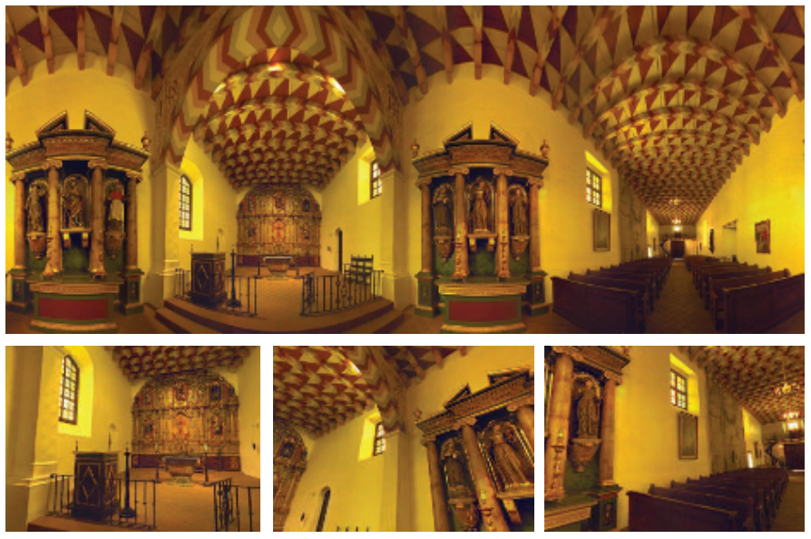

拿起一本纸质书，从书的左边缘或者右边缘往外看；先用右眼看，然后再用左眼看。书的边缘相对于背后物体边缘的偏移叫做视差（parallax）。这种效应对于附近的物体而言十分重要，它有助于我们在移动时感知相对深度。然而，如果一个物体或者一组物体距离观察者足够远，并且彼此又足够接近，那么当观察者改变观察位置时，就几乎感知不到视差效应。例如：如果我们移动1米，甚至是1000米，远处的山通常看起来并不会有什么明显的不同。当我们移动的时候，这座山可能会被附近的物体所遮挡，但如果移除这些遮挡物体，这座山及其周围环境看起来还是一样的。

天空盒的网格通常会以观察者为中心，并跟随观察者一起移动。天空盒网格不需要特别特别大，因为通过保持天空盒与观察者的相对位置，它看起来形状就不会发生改变。对于图13.2这样的场景，观众可能只移动了一小段距离，就会发现其实自己相对于周围的建筑物并没有真正的发生移动。对于更大规模的场景内容而言，例如星空或者远处的风景，用户通常并不会移动得非常远或者非常快，因此缺乏物体大小、形状或者视差的变化，并不会打破这种错觉。

天空盒通常会以立方体贴图的形式渲染在box网格上，因为每个面上的纹素密度大致相同。为了让天空盒看起来足够好看，因此立方体贴图的纹理分辨率必须足够大，即满足每个屏幕像素包含一个立方体贴图纹素\[1613]。立方体贴图所需分辨率的公式可以近似为：

$$
\text {texture resolution} =\frac{\text { screen resolution }}{\tan (\text { fov } / 2)}
\tag{13.1} 
$$

其中fov是相机的视场角。较小的视场角意味着立方体贴图必须具有较高的分辨率，因为此时立方体表面的较小部分会占据相同的屏幕尺寸。这个方程可以这样推导而来，当视场角为$90^{\circ}$（水平和垂直）时，立方体贴图其中一个表面的纹理必须覆盖整个屏幕。

除了box之外，还可以使用其他形状来表示周围世界。例如：Gehling \[520]描述了一种系统，该系统使用一个扁平的圆顶来代表天空。这种圆顶几何形状被认为最适合用于模拟在头顶移动的云层。这里的云层本身是通过组合和动画各种二维噪声纹理来实现的。

由于我们知道，天空盒位于所有其他物体的后面，因此我们可以进行一些微小但有价值的优化。天空盒不需要写入z-buffer，因为它永远不会遮挡任何东西。如果先绘制天空盒，我们也不需要从z-buffer读取数据；同时天空盒的网格可以是任何大小的，因为这里天空盒网格的深度信息是无关紧要的。然而，按照“不透明物体-天空盒-透明物体”的顺序进行绘制有一定的好处，这样做的好处在于，当我们绘制天空盒的时候，场景中的不透明物体已经覆盖了屏幕上的一些像素，从而减少了渲染天空盒时需要调用的像素着色器数量\[1433, 1882]。

## 13.4 光场渲染

radiance可以在不同的位置和方向、不同的时间和不同的光照条件下进行捕获。在现实世界中，计算摄影领域探索了从这些数据中提取各种结果的方法\[1462]。物体也可以使用纯粹基于图像的方法进行表示。例如“Lumigraph \[567]和光场渲染技术（light-field rendering）\[1034]，这些技术试图从一组观察点中捕获单个物体。对于给定的一个新视角，这些技术可以在存储下来的视图之间进行插值，从而创建新视角下的视图。这是一个复杂的问题，需要大量数据来存储所需的全部视图。这个概念有点类似于全息摄影（holography），它使用一个二维视图数组来表示物体。这种渲染形式的诱人之处在于，它能够捕获一个真实的物体，并且能够从任何角度来重新显示它。任何物体，无论其表面和光照如何复杂，都可以以一个几乎恒定的速率进行显示。有关这个主题的更多信息，请参阅Szeliski的书\[1729]。近年来，人们对光场渲染重新产生了研究兴趣，因为它可以让眼睛利用虚拟现实显示器来适当地调整焦点\[976, 1875]。这些技术目前在交互式渲染中的应用十分有限，但是它们在计算机图形学领域开辟了新的领域。

> 译者注：有关新视角合成的内容，请了解NeRF的原理及最新进展。

## 13.5 Sprite和图层

sprite（也叫做精灵图）是最简单的基于图像的渲染图元之一\[519]。sprite是指在屏幕上移动的图像，例如鼠标光标等。sprite不一定非要是矩形的，因为sprite中的一些像素可以是透明的。对于简单的sprite而言，其中存储的每个像素都将被复制到屏幕上的一个像素中。还可以通过显示一系列不同的sprite来生成动画。

一种更加通用的sprite类型是将图像纹理渲染到始终面向观众的多边形上，通过这种方式，允许sprite被调整大小和拉伸。纹理图像的alpha通道可以为sprite的各个像素提供完全或者部分的透明度，因此同样也在边缘处提供了抗锯齿效果（章节5.5）。这种类型的sprite也可以有深度信息，也就是sprite本身在场景中的位置。

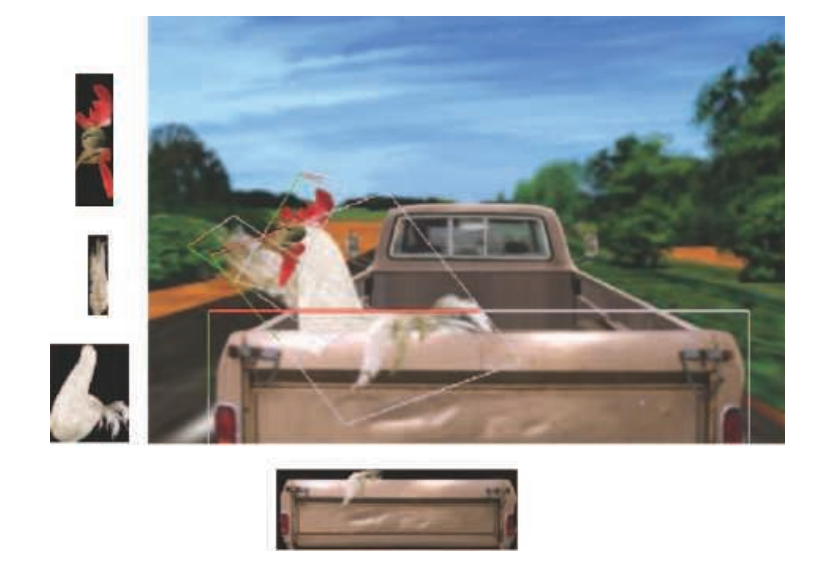

我们可以将场景看作是一系列的图层，这在二维的序列帧（cel）动画中十分常见。例如：在图13.3中，后挡板位于鸡的前面，鸡在卡车驾驶室的前面，而驾驶室又在道路和树木的前面。这种分层方法适用于大量的观察点集合。每个sprite层都有一个与之相关的深度。通过从后往前的顺序进行渲染，即画家算法（painter' s algorithm），我们可以在不需要z-buffer的情况下来构建场景。此时相机向前移动，只会让物体变大，这很容易使用相同的sprite或者相关的mipmap来进行处理。移动相机实际上还会改变前景和背景的相对覆盖范围，这可以通过修改每个sprite层的覆盖范围和位置来进行处理。当观察者水平或者垂直移动时，这些图层可以基于各自的深度进行相应的移动。

可以用一组sprite来表示一个物体，其中每个单独的sprite都代表不同的视图。如果物体在屏幕上足够小，存储大量视图集合（即使是动画物体）也是一个可行的策略\[361]。视角的微小变化也可以通过扭曲sprite的形状来进行处理，尽管这种近似最终会崩溃，还是需要生成一个新的sprite。具有不同表面的物体在一个很小的旋转之后也可能会发生很大的变化，因为会有新的多边形变得可见，而其他的一些多边形则会被遮挡。

这种图层和图像的扭曲过程，是微软在20世纪90年代后期支持的Talisman硬件架构的基础\[1672, 1776]。虽然这个特定的系统由于一些原因已经逐渐消失了，但是这种通过一个或者多个基于图像的表示来表现模型的想法，已经被发现是富有成效的。使用具有不同功能的图像，可以很好地映射到GPU的优势上，并且基于图像的技术可以与基于三角形的渲染相结合。在下面的几个小节中，我们将讨论imposter（顶替者）、深度sprite（depth sprite），以及其他使用图像来代替多边形内容的方法。

## 13.6 广告牌技术

基于观察方向来修改纹理矩形朝向的技术被称为广告牌技术（billboarding），这个矩形被称为广告牌（billboard）\[1192]。随着视图的改变，矩形的朝向也会随之改变。广告牌结合alpha纹理和动画，可以表现许多不光滑实体表面的视觉现象。草、烟、火、雾、爆炸、能量盾、蒸汽轨迹和云等，这些只是广告牌技术可以表示的物体中的一小部分\[1192, 1871]，如图13.4所示。

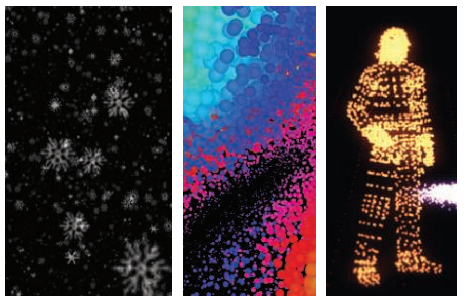

本小节将会介绍几种十分流行的广告牌形式。在这些形式中，会使用一个表面法线和一个指向上方的方向（up向量）来定位四边形。这两个向量可以创建广告牌表面的标准正交基。换句话说，这两个向量描述了将四边形旋转到最终方向所需要的旋转矩阵（章节4.2.4）。然后使用四边形上的锚点位置（anchor location）（例如四边形中心），来确定其在空间中的具体位置。

通常来说，表面法线$\mathbf{n}$和up向量$\mathbf{u}$并不是垂直的。在所有的广告牌技术中，这两个向量中的其中一个会被确定为固定向量，即必须保持在给定的方向上。而使得另一个向量垂直于这个固定向量的过程总是相同的。首先，创建一个right向量$\mathbf{r}$，它指向四边形的右侧边界，这是通过计算up向量$\mathbf{u}$和表面法线$\mathbf{n}$的叉乘获得的。将这个向量$\mathbf{r}$归一化，因为它将被用作旋转矩阵标准正交基的其中一个轴。如果向量$\mathbf{r}$的长度为0，那么说明$\mathbf{u}$和$\mathbf{n}$是平行的，可以使用章节4.2.4中所描述的相关技术来进行后续处理\[784]。如果$\mathbf{r}$的长度不为零，但几乎为零，那么说明$\mathbf{u}$和$\mathbf{n}$几乎平行，此时会出现精度误差。

从（非平行的）向量$\mathbf{n}$和向量$\mathbf{u}$中计算向量$\mathbf{r}$和第三个新向量的过程如图13.5所示。如果法线$\mathbf{n}$保持不变，就像大多数广告牌技术所做的那样一样，那么新的up向量$\mathbf{u}^{\prime}$是：

$$
\mathbf{u}^{\prime}=\mathbf{n} \times \mathbf{r}
\tag{13.2} 
$$

相反，如果up方向是固定的（适用于轴向对齐的广告牌，例如水平地面上树木），那么此时新的法线$\mathbf{n}^{\prime}$是：

$$
\mathbf{n}^{\prime}=\mathbf{r} \times \mathbf{u}
\tag{13.3} 
$$

然后将新向量进行归一化，并使用这三个向量构建一个旋转矩阵。例如：对于固定的表面法线$\mathbf{n}$和调整后的up向量$\mathbf{u}^{\prime}$，这个旋转矩阵是：

$$
\mathbf{M}=\left(\mathbf{r}, \mathbf{u}^{\prime}, \mathbf{n}\right)
\tag{13.4} 
$$

该矩阵会将$xy$平面中的一个四边形，以$+y$方向指向其上边缘，并以其锚点位置为中心，变换到正确的方向。然后再应用一个平移矩阵，来将四边形的锚点移动到目标位置上。

有了这些初步的准备，剩下的主要任务就是决定用什么表面法线和up向量来定义广告牌的方向。下面的几个小节中，我们将讨论几种构造这些向量的不同方法。

### **13.6.1 屏幕对齐（screen-aligned）的广告牌**

最简单的广告牌形式就是与屏幕对齐的广告牌（screen-aligned billboard）。这种广告牌形式与二维sprite相同，因为图像总是会与屏幕平行，并且具有固定的up向量。摄像机将场景渲染到与远近裁剪平面平行的视平面（view plane）上。我们经常会在近裁剪平面的位置上来想象这个假想平面。对于这种类型的广告牌而言，其所需的表面法线是视平面法线的负值，其中视平面的法线$\mathbf{v}_{n}$指向远离观察点的方向，也就是说，这里广告牌的表面法线指向观察点。up向量$\mathbf{u}$来自于相机本身，它是视平面上的一个向量，定义了相机的向上方向。这两个向量本身就是垂直的，因此我们只需要创建right向量$\mathbf{r}$，就可以构建出这个广告牌的旋转矩阵。因为广告牌表面法线$\mathbf{n}$和up向量$\mathbf{u}$都是相机的常数，因此这个旋转矩阵对于所有这种类型的广告牌都是相同的。

除了粒子效果外，屏幕对齐的广告牌对于注释文本和地图位置标记等信息也十分有用，因为文本总是与屏幕本身对齐的，即“广告牌”这个名字本身的含义。需要注意的是，在使用文本注释的时候，物体通常会在屏幕上保持一个固定的大小。这意味着如果用户前进或者离开广告牌的位置时，广告牌的世界空间大小将会增加。因此，这里广告牌的尺寸是视图相关的，这会使得视锥裁剪等方案变得更加复杂。

### **13.6.2 面向世界（world oriented）的广告牌**

我们希望屏幕对齐的广告牌能够展示玩家的身份或者地点的名称。但是当摄像机发生倾斜的时候，例如在飞行模拟中进入一段曲线轨迹，我们同样希望这些广告牌也能够发生相应地倾斜。如果一个sprite代表了一个物理物体，那么它通常基于的是世界空间中的up方向，而不是摄像机的up方向。圆形的sprite不会受到摄像机倾斜的影响，但是其他形状的广告牌则会受到影响。我们可能希望这些广告牌始终保持面向观众，但同时也要沿着它们的观察轴进行旋转，以保持世界空间中的朝向。

对于这样的sprite，渲染它们的一种方法是使用世界空间中的up向量来生成旋转矩阵。在这种情况下，广告牌的表面法线仍然是视平面法线的负值，这是一个恒定的向量，并且与该向量垂直的新up向量是从世界空间中的up向量衍生出来的，如前所述。与屏幕对齐的广告牌一样，这个矩阵可以用于所有的sprite，因为这些向量（视平面法线、世界空间up向量）在渲染场景时不会发生改变。

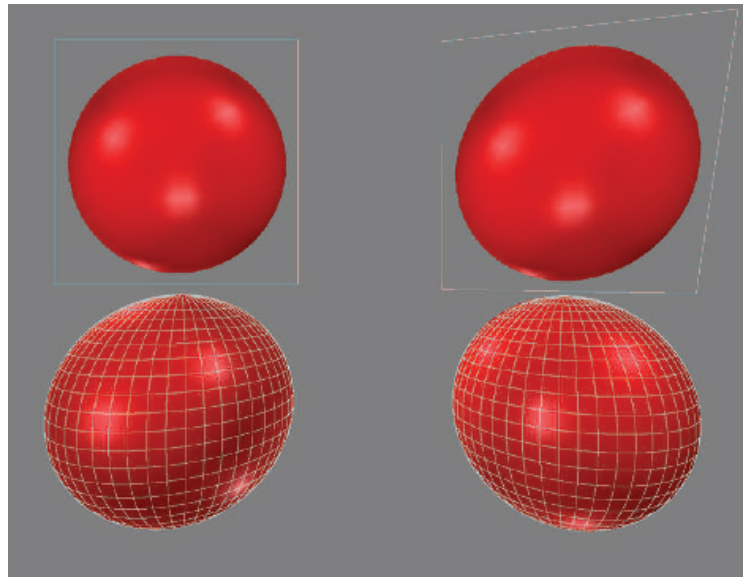

对所有的sprite都使用相同的旋转矩阵是有风险的。由于透视投影的特性，到观察轴有一定距离的物体会被扭曲拉伸。如图13.6中底部的两个球体，由于是在平面上进行投影，因此球体的投影变成了椭圆形。这种现象并不是错误的，如果观众的眼睛与屏幕之间的距离和位置比较合适的话，这种现象看起来并不会有什么问题。也就是说，如果虚拟相机的几何视场（geometric field of view）与人眼的显示视场（display field of view）相匹配，那么这些球体看起来就没有被扭曲拉伸。视场中10%-20%的轻微不匹配，并不会被观众注意到\[1695]。然而，通常的做法是为虚拟相机提供更大的视场角，以便向用户呈现更宽广的世界。此外，只有当观察者在显示器面前以给定的距离居中时，这种视场的匹配才有效。几个世纪以来，艺术家们已经意识到这个问题，并进行了必要的补偿。人们预期是圆形的物体（例如月亮），无论它们在画布上的位置如何，都会被画成圆形\[639]。

当视场角很小或者sprite很小的时候，这种扭曲效果可以被忽略，并且可以使用一个与视平面对齐的单一方向来作为广告牌的法线。否则，广告牌的法线需要为从广告牌中心指向观察者位置的向量。这就是我们所说的面向视点的广告牌（viewpoint-oriented），如图13.7所示。图13.6展示了使用不同对齐方式的广告牌效果。从图中可以看出，无论广告牌出现在屏幕上的什么位置，视平面对齐（屏幕对齐）都可以使广告牌不会出现扭曲。而面向视点的对齐方式会扭曲球体的图像，其扭曲形式与将场景投影到平面上时真实球体的扭曲形式相同。

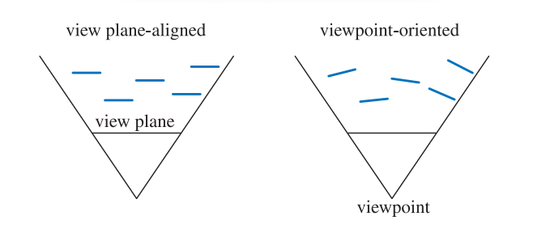

面向世界的广告牌对于渲染许多不同的现象都十分有用。Guymon \[624]和Nguyen \[1273]都讨论了如何生成令人信服的火焰、烟雾和爆炸等效果。一种技术是以随机和混乱的方式，将动画sprite聚集和重叠在一起。这样做有助于隐藏动画序列的循环模式，同时也避免了每个火焰或者爆炸效果看起来都一样。

镂空纹理（cutout texture）中的透明纹素对最终图像没有影响，但是它必须由GPU进行处理，并在光栅化管线的后期阶段中被丢弃，因为其alpha值为零。一组动画的镂空纹理，通常都会具有特别大的透明纹素边缘区域。我们通常会将这些纹理应用于矩形图元。Persson指出，一个更加紧凑的多边形与调整过的纹理坐标可以更快地渲染这些sprite，因为需要进行处理的纹素大大减少了\[439, 1379, 1382]，如图13.8所示。他发现，使用具有4个顶点的新多边形就可以带来显著的性能提升，但使用超过8个顶点的新多边形的所带来的性能提升会达到收益递减点。例如：虚幻4引擎中有一个“粒子切割（particle cutout）”工具，可以用来寻找这样的多边形\[512]。

![图13.8：这个云sprite中包含了一个很大的透明边缘。使用凸包（绿色），更紧密的四顶点和八顶点多边形（红色），可以包含更少的透明纹素。与最左侧的原始方形的粒子sprite相比，这样做的总面积分别减少了40%和48%。 \[1382\]](images/Chapter-13/202308191604021.png "图13.8：这个云sprite中包含了一个很大的透明边缘。使用凸包（绿色），更紧密的四顶点和八顶点多边形（红色），可以包含更少的透明纹素。与最左侧的原始方形的粒子sprite相比，这样做的总面积分别减少了40%和48%。 \[1382]")

广告牌的一个常见用途是渲染云层。Dobashi等人\[358]使用广告牌来模拟并渲染云，并通过渲染同心半透明外壳来创建光线束效果（shafts of light）。Harris和Lastra \[670]也使用impostor来模拟云，如图13.9所示。

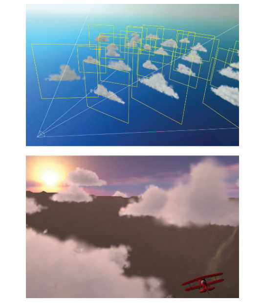

Wang \[1839, 1840]详细介绍了微软飞行模拟器产品中所使用的云建模和渲染技术。每片云都由5到400块广告牌组成，但是只需要16种不同的基本sprite纹理即可实现各种各样的云，因为这些基本的sprite纹理可以使用非均匀缩放和旋转来进行修改，从而组合形成各种各样类型的云。还会根据距离云中心的距离来修改该点的透明度，从而模拟云的形成和消散。为了节省处理时间，远处的云都被渲染为一组环绕场景的8个全景纹理，类似于天空盒。

平面广告牌并不是唯一可能的云层渲染技术。例如：Elinas和Stuerzlinger \[421]通过渲染一系列嵌套的椭球体来生成云，这些椭球体在轮廓边缘处会变得更加透明。Bahnassi和Bahnassi \[90]会渲染一个他们称之为“巨型粒子（mega-particle）”的椭球体，然后再使用模糊处理和屏幕空间中的扰动纹理，来给出一个令人信服的类云外观。Pallister \[1347]讨论了如何程序化生成云层图像，并在头顶的天空网格上对这些图像进行动画处理。Wenzel \[1871]在观察者上方，使用了一系列的平面来模拟远处的云层。在本小节中，我们将专注于广告牌及其他图元的渲染和混合方法。有关云层广告牌的着色方面将在章节14.4.2中进行讨论，有关真实体积云的方法也将在章节14.4.2中进行讨论。

正如章节5.5和章节6.6中所描述的，为了正确地进行合成，重叠的半透明广告牌应当按前后顺序来进行渲染。烟雾广告牌在与固体物体相交时会产生瑕疵，如图13.10所示。此时这种视错觉会被打破，因为原本是一个体积的物体此时被看作成了一组图层。一个解决方案是，让像素着色器在处理每个广告牌的时候，检查底层物体的z-depth。广告牌在渲染时会对这个深度进行测试，但是不会使用自己的深度来替换它，也就是说，这个过程不会写入z-depth。如果某个像素处的底层物体十分接近广告牌的深度，那么此时广告牌的片元将会变得更加透明。通过这种方式，使得广告牌更像是一个体积，这种层状瑕疵也就消失了。当达到最大衰减距离的时候，随着深度进行线性衰减会导致不连续性。S曲线淡出函数可以避免这个问题，Persson指出\[1379]，观察者与粒子之间的距离将会影响这个最好的淡出范围。Lorach \[1075, 1300]提供更多信息和实现细节。以这种方式修改其透明度的广告牌被称为软粒子（soft particle）。

![图13.10：在左边，由于尘埃云广告牌与物体相交，圆圈区域内会显示出清晰的边缘和条带。在右边，广告牌会在物体附近逐渐消失，从而避免了这个问题。在底部，下方圆圈区域的内容被放大以供对比参考。 \[1300\]](images/Chapter-13/202308191911564.png "图13.10：在左边，由于尘埃云广告牌与物体相交，圆圈区域内会显示出清晰的边缘和条带。在右边，广告牌会在物体附近逐渐消失，从而避免了这个问题。在底部，下方圆圈区域的内容被放大以供对比参考。 \[1300]")

使用软粒子的淡出解决了广告牌与固体物体相交的问题，如图13.10所示。当爆炸效果在场景中移动或者观察者穿过云层时，也可能会发生其他瑕疵。在前一种情况下，广告牌会在动画过程从物体的后面移动到物体的前面。如果广告牌从完全不可见变为完全可见，这会引起一个明显的“pop”效果。同样地，当观察者穿过广告牌的时候，广告牌会移动到近裁剪平面的前面，此时广告牌会完全消失，从而导致一个可以被观察到的突然变化。一个快速的解决方法是让广告牌在靠近观察者时变得更加透明，随着广告牌越来越近，它们会逐渐淡出，从而避免这种突兀的“pop”效果。

当然还有一些更加写实的解决方案。Umenhoffer等人\[1799, 1800]提出了球形广告牌的概念。这里的广告牌物体被认为定义了空间中的一个球形体积。广告牌本身在渲染时会忽略z-depth的读取；广告牌的目的纯粹是让像素着色器在球体可能出现的位置上执行。像素着色器会计算这个球体上的入口位置和出口位置，并根据需要使用固体物体来改变出口深度，并使用近裁剪平面来改变入口深度。通过这种方式，每个广告牌的球体可以通过增加透明度来适当地淡出，我们根据来自摄像机的光线在这个剪切球体内传播的距离，来对球体透明度进行修改。

在《孤岛危机》中使用了一种稍微不同的技术\[1227, 1870]，它使用box体积来代替球体，从而减少了像素着色器的计算成本。另一个优化是让广告牌代表体积的前面，而不是代表体积的后面。这允许使用z-buffer进行深度测试，从而跳过固体物体背后的部分空间。这种优化只有在已知体积完全位于观察者前面时才可行，因为此时广告牌不会被近裁剪平面裁剪。

### **13.6.3 轴向广告牌**

最后一种常见类型的广告牌被称为轴向广告牌（axial billboarding）。在这个方案中，被纹理化的物体通常并不会直接面对观察者。相反，它可以围绕一些固定的世界空间轴进行旋转，并在这个范围内尽可能多地面向观察者。这种广告牌技术可用于展示远处的树木。这里我们并不是使用一个实体的表面来表示树木，甚至不是章节6.6中所描述的，使用一对树木轮廓来表示树，我们仅仅使用的是单个树木广告牌。世界空间中的up向量会被设置为沿树干的轴。当观察者进行移动的时候，树木会面向观察者，如图13.11所示。这仅仅是一个面向摄像机的广告牌，与图6.28中的十字树（cross-tree）并不相同。对于这种形式的广告牌，世界空间的up向量是固定的，观察方向会作为第二个可调整的向量。一旦这个旋转矩阵构建完成，树木就会被平移到它所在的位置。

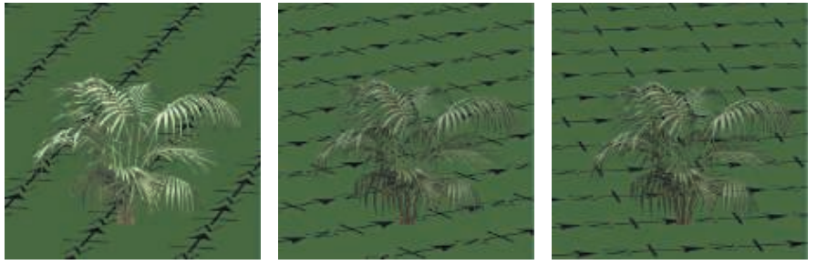

这种形式的广告牌与面向世界的广告牌的不同之处在于，具体什么向量是固定的，什么向量又是允许旋转的。对于面向世界的广告牌而言，广告牌会直接朝向观察者，并可以沿着这个观察轴进行旋转；此时广告牌会被旋转，使其up方向尽可能与世界空间中的up方向对齐。而对于轴向广告牌而言，世界空间中的up方向定义了固定的旋转轴，广告牌只能围绕这个轴进行旋转，使其尽可能地朝向观察者。例如：如果广告牌都位于水平地面上，而观察者位于广告牌的上方，那么面向世界的广告牌将会完全朝向观察者，而轴向广告牌则仍会保持直立，更加贴合场景。

由于这种行为模式，因此轴向广告牌存在的一个问题是，如果观察者从树木上方飞过并向下俯瞰，这种视错觉就会被破坏，因为树木看起来几乎只有一片，就像是被切割出来的一样。一种解决方法是添加一个树木的水平横截面纹理（不需要使用广告牌），这样可以帮助改善这个问题\[908]。

另一种方法是使用细节层次技术（LOD），将基于图像的模型转换为基于网格的模型\[908]。将树木模型从三角形网格转换为广告牌集合的自动化方法将在章节13.6.5中进行讨论。Kharlamov等人\[887]提出了相关的树木渲染技术，Klint \[908]解释了如何进行大量植被的数据管理和表示。图19.31展示了在商业SpeedTree包中，用于渲染远处树木的轴向广告牌技术。

与屏幕对齐的广告牌适合表示对称的球形物体一样，轴向广告牌也适合表示具有圆柱形对称性的物体。例如：激光束效果可以用轴向广告牌来进行渲染，因为它们的外观在对称轴周围的任何角度上看起来都是一样的。图13.12展示了这种广告牌和其他广告牌的一个例子。图20.15则给出了更多的示例。

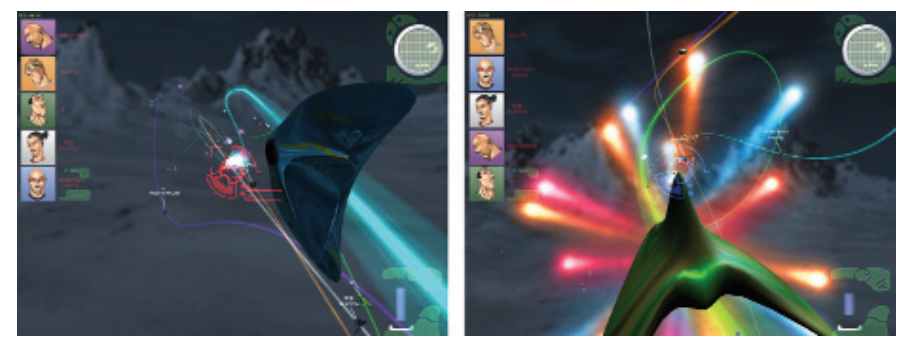

这些类型的技术说明了这些算法及其后续算法的一个重要思想，即像素着色器的目的是评估真正的几何形状，丢弃在物体边界之外发现的片元。对于广告牌而言，当图像纹理完全透明时，就会发现这样的片元。正如我们将看到的，可以通过计算更加复杂的像素着色器，来找到模型存在的位置。而几何形状在这些方法中的作用是使得像素着色器被调用，并给出一些粗略的z-depth估计，当然这个估计可能会被像素着色器改进。我们希望避免在模型外部的像素上浪费计算时间，但是我们也不希望几何结构过于复杂，以致于在每个三角形外部都要进行顶点处理和不必要的像素着色器调用（因为会沿其边缘生成$2 × 2$的四边形，详见章节18.2.3），这会增加额外的成本。

### 13.6.4 Impostor

impostor是一个广告牌，通过将当前观察点中的复杂物体渲染成图像纹理，并将该图像纹理映射到一个广告牌上，从而创建一个imposter。impostor可以用于同一个物体的若干实例，或者是在几帧中进行重复使用，从而分摊它的创建成本。本小节将介绍更新impostor的不同策略。Maciel和Shirley \[1097]早在1995年就发现了几种不同类型的impostor，包括本小节所介绍的这一种。从那时开始，impostor的定义范围已经缩小到我们在这里所使用的定义\[482]。

在物体存在的地方，impostor图像是不透明的；而在其他任何地方都是完全透明的。imposter可以通过几种方法来代替几何网格，例如：imposter图像可以表示由小型静态物体所组成的杂乱东西（clutter）\[482, 1109]。由于可以将复杂的模型简化为单个图像，因此imposter对于快速渲染远处的物体十分有用。另一种方法是使用最小LOD的模型（详见章节19.9）；然而，这种简化的模型往往会丢失物体的形状信息和颜色信息。而imposter则没有这个缺点，因为可以使生成的图像分辨率与显示器的分辨率近似匹配\[30, 1892]。另一种使用impostor的情况是，某些靠近观察者的物体在移动时，只会将同一面暴露给观察者，也就是说，观察者只能看到这个物体的同一个侧面\[1549]。

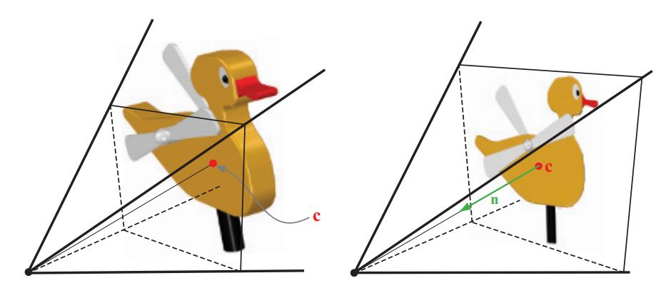

在渲染物体以创建impostor图像之前，我们要将观察者设置到物体包围盒的中心，并选择impostor矩形，使其直接指向观察点（如图13.13左侧）。impostor所对应的四边形，其大小为包含物体投影包围盒的最小矩形。impostor图像的alpha值一开始会被清除为0，而在物体渲染的地方，alpha值则被设置为1.0。然后将生成的图像用作面向视点的广告牌，如图13.13的右侧所示。当相机或者impostor物体发生移动时，纹理的分辨率可能会被放大，这有可能会打破错觉。Schaufler和Sturzlinger \[1549]提出了一些确定impostor图像何时需要更新的启发式方法。

Forsyth \[482]给出了许多在游戏中使用impostor的实用技巧。例如：对于那些靠近观察者或者鼠标光标的物体，更加频繁地进行更新可以提高感知质量。当动态物体使用impostor时，他描述了一种预处理技术，可以确定在整个动画中任意顶点移动的最大距离$d$。这个距离除以动画中的时间步数，即$\Delta=d / \text {frames}$。如果这个impostor已经被使用了$n$帧而没有进行更新，则$∆∗n$会被投影到图像平面上。如果这个距离大于用户设置的阈值，则会更新impostor。

将纹理映射到面向观察者的矩形上，并不总是能产生令人信服的效果。这个问题在于impostor本身并没有厚度，所以当imposter与真实的几何图形相结合时，可能会出现一些问题，如图13.16所示。Forsyth建议将纹理沿着观察方向投影到物体的包围框上\[482]，这样做至少给了impostor一点几何存在感，有了一点几何效果。

通常而言，最好是在物体移动时渲染几何图形，而在物体静止时则切换到impostor\[482]。Kavan等人\[874]引入了polypostor，其中一个人的模型由一组impostor进行表示，人的四肢和躯干各一个。这个系统试图在纯粹的impostor和纯粹的几何之间取得平衡。Beacco等人\[122]描述了polypostor和大量其他与impostor相关的人群渲染技术，并详细对比了每种技术的优势和局限性。图13.14给出了一个使用polypostor渲染人的例子。

![图13.14：一种impostor技术，其中每个单独的动画元素都由一组图像进行表示。这是在一系列遮挡和合成操作中进行渲染的，将这些操作结合起来，能够在给定视图下构建一个令人信服的模型。 \[122\]](images/Chapter-13/202308192120220.png "图13.14：一种impostor技术，其中每个单独的动画元素都由一组图像进行表示。这是在一系列遮挡和合成操作中进行渲染的，将这些操作结合起来，能够在给定视图下构建一个令人信服的模型。 \[122]")

### **13.6.5 广告牌表示**

impostor的一个问题是，渲染出来的图像必须持续面向观察者。如果远处的物体正在改变其朝向，那么就必须重新计算impostor。Decoret等人\[338]提出了广告牌云（billboard cloud）的概念，可以使得远处的物体更像它们所代表的三角网格。一个复杂的模型通常可以用一小组重叠的镂空广告牌来进行表示。可以将一些额外的信息应用到他们的表面上，例如法线贴图或者位移贴图，以及不同的材质等，这样可以使得模型更有说服力。

这种寻找一组平面的想法要比镂空纹理的类比更加普遍。广告牌之间可以相互交叉，镂空纹理也可以任意复杂。例如：一些研究人员将广告牌与树木模型进行匹配\[128, 503, 513, 950]。从具有数万个三角形的模型中，他们可以创建令人信服的广告牌云，而这个广告牌云则由少于100个具有纹理的四边形组成，如图13.15所示。

![图13.15：左边是一个由20610个三角形组成的树木模型。在中间，这个树木则是由78块广告牌组合而成。重叠的广告牌轮廓显示在右边。 \[950\]](images/Chapter-13/202308192129646.png "图13.15：左边是一个由20610个三角形组成的树木模型。在中间，这个树木则是由78块广告牌组合而成。重叠的广告牌轮廓显示在右边。 \[950]")

使用广告牌云可能会导致相当数量的过度绘制（overdraw），这可能是十分昂贵的。最终的质量也可能会受到影响，因为交叉的镂空纹理可能意味着无法实现严格从后到前的绘制顺序。Alpha覆盖（详见章节6.6）可以帮助渲染复杂的alpha纹理集合\[887]。为了避免过度绘制，SpeedTree等专业软件包表示并简化了由树叶和四肢所组成的大型网格模型。虽然几何处理需要更多的时间，但是要远远小于过度绘制的成本。图19.31给出了这样的一个示例。另一种方法是使用体积纹理来表示这样的物体，并将其渲染为一系列垂直于眼睛观察方向的图层\[337]，这部分内容将在章节14.3中进行介绍。

## 13.7 位移技术

如果一个impostor的纹理使用了深度信息进行增强的话，这样就定义了一个渲染图元，它称为深度sprite或者钉板（nailboard）\[1550]。纹理图像是一个RGB图像，为每个像素增加一个$∆$参数，便形成一个$\text {RGB} ∆$纹理。$∆$存储了从深度sprite矩形到深度sprite所代表的正确几何深度之间的偏差。这个$∆$通道是观察空间中的高度场。因为深度sprite包含了深度信息，因此它们与impostor相比，能够更好地与周围物体融合在一起。当深度sprite的矩形穿透附近几何物体的时候，这一点尤其明显，如图13.16所示。像素着色器可以通过改变每个像素的z-depth来执行这个算法。

![图13.16：左上角的图像展示了一个简单的场景，该场景使用几何图形进行渲染。右上角的图像创建了对应的impostor，并将其用于立方体、圆柱体和锥体的渲染，该图像展示了这样做会发生什么。下面两幅图像则展示了使用深度sprite时的效果。其中左下角中的深度sprite使用2 bit的深度偏差，而右下角中则使用了8 bit的深度偏差。 \[1550\]](images/Chapter-13/202308201355035.png "图13.16：左上角的图像展示了一个简单的场景，该场景使用几何图形进行渲染。右上角的图像创建了对应的impostor，并将其用于立方体、圆柱体和锥体的渲染，该图像展示了这样做会发生什么。下面两幅图像则展示了使用深度sprite时的效果。其中左下角中的深度sprite使用2 bit的深度偏差，而右下角中则使用了8 bit的深度偏差。 \[1550]")

Shade等人\[1611]也描述了一个深度sprite的图元，他们使用扭曲（warping）来找到（account for）新的视点。他们引入了一种被称为分层深度图像（layered depth image）的图元，其中的每个像素都包含若干个深度信息。设置多个深度的原因是为了避免在变形扭曲的过程中，由于去遮挡（deocclusion，即让隐藏区域变得可见）而产生的间隙。Schaufler \[1551]、Meyer和Neyret \[1203]也提出了相关的技术。为了控制采样率，Chang等人\[255]提出了一种称为LDI树的分层表示方法。

与深度sprite相关的是Oliveira等人\[1324]所引入的浮雕纹理映射（relief texture mapping）。这里的浮雕纹理是一个具有高度场的图像，它用于表示表面的真实位置。与深度sprite不同，这个图像并不是渲染在广告牌上的，而是渲染在世界空间中的四边形上。物体可以通过一组在接缝处相匹配的浮雕纹理来进行定义。利用GPU，高度场可以被映射到表面上，并可以使用光线步进来对其进行渲染，如章节6.8.1中所述。浮雕纹理映射与一种被称为光栅化层次包围体（rasterized bounding volume hierarchy，rasterized BVH）的技术相类似\[1288]。

Policarpo和Oliveira \[1425]在单个四边形上使用一组纹理来保存高度场信息，并将每个纹理依次进行渲染。打个简单的比方，在注塑机（injection molding machine）中形成的任何物体，都可以使用两个高度场来进行描述构建。其中每个高度场都代表了该模具的一半。更加精细复杂的模型可以通过使用额外的高度场来进行创建。给定模型的一个特定视图，所需要的高度场数量等于与任何像素发生重叠的表面的最大数量。就像球形广告牌一样，每个底层四边形的主要目的就是让像素着色器对高度场纹理进行评估计算。这个方法也可用于创建表面上复杂的几何细节，如图13.17所示。

![图13.17：图中的编织表面使用了4个高度场纹理进行建模，并使用了浮雕映射来进行 渲染 。 \[1425\]](images/Chapter-13/202308201422347.png "图13.17：图中的编织表面使用了4个高度场纹理进行建模，并使用了浮雕映射来进行 渲染 。 \[1425]")

Beacco等人\[122]在人群场景中使用了浮雕impostor（relief impostor）。在这种表示方法中，会生成模型的颜色、法线和高度场纹理，同时这些纹理与box的每个面相关联。当一个面被渲染时，会执行光线步进来找到每个像素上的可见的表面（如果有的话）。这个box与模型的刚性部分（“骨头”）相关联，因此它可以执行动画。这个模型并没有蒙皮（skinning），因为我们假定使用这种方法所渲染的角色距离相机很远。纹理化提供了一种简单的方法，来降低原始模型的细节水平，如图13.18所示。

![图13.18：浮雕impostor。角色的表面模型被分割成若干个box，然后再使用表面模型来为每个box的面创建高度场、颜色和法线纹理。最后再使用浮雕映射方法来进行渲染。 \[122\]](images/Chapter-13/202308201424293.png "图13.18：浮雕impostor。角色的表面模型被分割成若干个box，然后再使用表面模型来为每个box的面创建高度场、颜色和法线纹理。最后再使用浮雕映射方法来进行渲染。 \[122]")

Gu等人\[616]引入了几何图像（geometry image）。其思想是将不规则网格转换为包含位置值的正方形图像。这个图像本身就代表了一个规则的网格，即网格位置中隐式包含了所形成的三角形信息。也就是说，图像中四个相邻的纹素构成了两个三角形。形成这种图像的过程是困难且相当复杂的，这里我们感兴趣的是编码模型的最终图像。这个最终图像可以用于生成网格。其关键特征是，这个几何图像可以进行mipmap处理，mipmap金字塔的不同层级构建了模型的更简化版本。这种顶点数据和纹素数据之间，网格和图像之间的模糊界限，是一种令人着迷且诱人的建模思考方式。几何图像也被用于具有特征保持贴图的地形，以模拟悬垂结构（overhang）\[852]。

在这里，我们讲不再讨论如何使用图像来表示整个多边形物体，而是将讨论如何在粒子系统和点云中使用不相连的单个样本。

## 13.8 粒子系统

粒子系统 \[1474]是指一组由独立微小物体所构成的集合，并使用一些算法来控制这些物体的运动。粒子系统的应用十分广泛，包括模拟火、烟、爆炸、水流、旋转星系和其他现象等。因此，一个粒子系统在控制物体渲染的同时，还会控制物体的动画。在粒子的生命周期内创建、移动、修改和删除粒子的相关控制同样也是粒子系统的一部分。

与本小节内容相关的是这些粒子的建模方式和渲染方式。其中每个粒子既可以是单个的像素，也可以是从粒子先前位置到当前位置绘制的轨迹线段，它们通常会使用广告牌来进行表示。如章节13.6.2中所述，如果这些粒子是圆形的，那么up向量的选取将会与它们的显示不相关。换句话说，此时我们只需要知道粒子的位置就可以确定其方位。图13.19展示了一些粒子系统的例子。每个粒子的广告牌可以通过调用几何着色器（geometry shader）来进行生成，但在实践中，使用顶点着色器来生成sprite可能会更快\[146]。除了表示粒子的图像纹理之外，还可以包含其他的纹理，例如法线贴图等。轴向广告牌可以表现较粗的线条，图14.18展示了一个使用线段来绘制雨滴的例子。

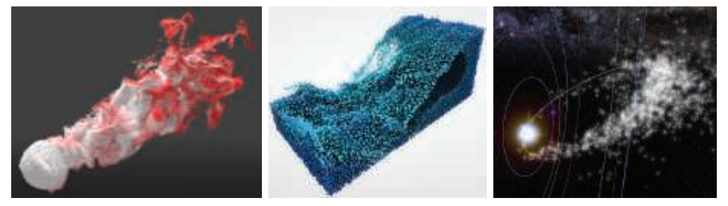

如果使用半透明广告牌粒子来表示烟雾等现象，那么就必须解决如何正确渲染透明物体的问题。我们可能需要对这些半透明广告牌进行从后到前的排序操作，但是这样做的代价可能会很高。Ericson \[439]提供了一系列高效渲染粒子的建议，我们在这里列出了其中的一些，以及相关的论文：

-   从浓密（thick）的镂空纹理中构建烟雾效果；避免半透明意味着不需要进行排序和混合操作。
-   如果需要使用半透明效果，则优先考虑叠加混合或者减法混合，因为这两种混合方式不需要进行排序\[987, 1971]。
-   使用少量的动画粒子，相比于使用大量的静态粒子，可以提供类似的质量和更好的性能表现。
-   为了保持帧率稳定，在渲染粒子的数量上使用一个动态上限值。
-   让不同的粒子系统使用相同的着色器，从而避免状态切换所带来的额外成本（章节18.4.2）\[987, 1747]。
-   使用一个包含所有粒子图像的纹理图集或者纹理数组，从而避免调用纹理变更所带来的开销\[986]。
-   在一个较低分辨率的缓冲区中平滑地绘制不同的粒子（例如烟雾）\[1503]，并在MSAA完成之后再进行合并或者绘制。

Tatarchuk等人\[1747]对最后一个观点进行了进一步的阐述。他们将烟雾渲染到一个相当小的缓冲区中，只有屏幕分辨率的十六分之一大小，并使用一个方差深度贴图来帮助计算粒子效果的累积分布函数。详情请参阅他们的展示和介绍。

如果存在大量需要渲染的粒子，那么一次完整的排序操作可能会十分昂贵。美术指导可以手动指示渲染顺序，对不同效果进行正确地分层处理，从而改善排序问题。而对于较小的粒子或者对比度较低的粒子，可能不需要进行排序处理。粒子有时候也可以以某种排序的顺序来进行发射\[987]。如果粒子是相当透明的，那么可以使用不需要排序的加权混合透明度技术\[394, 1180]。更加复杂的、顺序无关的透明系统也是可能的，例如：Kohler \[920]简要介绍了将粒子渲染到一个存储在纹理数组中的九层深度缓冲区中，然后再使用计算着色器来进行排序处理。

### **13.8.1 粒子着色**

具体的着色操作取决于粒子的类型。例如火花（spark）之类的发射器（emitter）并不需要进行着色，为了简单起见，通常会使用叠加混合（additive blending）。Green \[589]描述了如何将流体系统作为球形粒子渲染到深度图像中，然后再对深度图像进行模糊处理，并从中导出法线数据，最终将结果与场景进行合并。对于诸如灰尘或者烟雾的微小颗粒，可以使用逐图元（per-primitive）或者逐顶点（per-vertex）的着色方式\[44]。然而这样的光照方式会使得具有不同表面的粒子看起来很平。可以为粒子提供一个法线贴图，从而给予它们适当的表面法线来将其照亮，但是这样会带来纹理访问的额外开销。对于圆形粒子而言，在粒子的四个角上使用四条发散的法线向量可能就足够了\[987, 1650]。烟雾粒子系统可以有更加精细的光线散射模型。可以使用辐射度法线映射（章节11.5.2）或者球谐函数来照亮这些粒子\[1190, 1503]。在更大的粒子上也可以使用曲面细分操作，使用域着色器（domain shader）来在每个顶点位置上累积光照效果\[225, 816, 1388, 1590]。

可以在每个顶点位置上计算光照效果，并在粒子四边形上进行插值\[44]。这个操作的速度很快，但是对较大的粒子而言，这样生成的质量较低，因为远处的顶点很可能会错过小范围光源的光照贡献。一种解决方案是在每个像素的基底上对粒子进行着色处理，但是所使用的分辨率要比最终图像所使用的分辨率低。为此，每个可见粒子会在光照贴图纹理（light-map texture）中分配一个tile（瓦片）\[384, 1682]。每个tile的分辨率可以根据屏幕上的粒子大小进行调整，例如：根据屏幕上的投影面积，将tile的分辨率在$1 × 1$和$32 × 32$之间进行调整。一旦分配好了tile，那么每个tile所对应的粒子就会进行渲染，并将像素所对应的世界位置写入一个二级纹理中。然后使用一个计算着色器来计算这个二级纹理中到达每个位置上的radiance。radiance是通过对场景中的光源进行采样来收集的，并使用一个加速结构来针对潜在的贡献光源进行计算评估，这部分内容将在第20章中进行介绍。由此生成的radiance可以直接作为颜色信息或者球谐函数来写入到光照贴图纹理中。当每个粒子最终被渲染到屏幕上时，通过在粒子四边形上映射每个tile，并使用一次纹理读取来获得每个像素所对应的radiance，从而将光照应用到粒子上。

也可以采用相同的原则，为每个发射器都分配一个tile \[1538]。在这种情况下，使用一个深度光照贴图纹理（deep light-map texture），将会给拥有许多粒子的光照效果添加一种体积的感觉。值得注意的是，由于粒子的平坦特性并且粒子通常会朝向观察者，当观察点围绕任何粒子发射器进行旋转的时候，本小节中所介绍的各个粒子光照模型都会产生可见的闪烁瑕疵。

除了粒子的光照之外，还需要特别注意粒子的体积阴影和自阴影现象。为了接收来自其他遮挡物的阴影，较小的粒子通常可以在它们的顶点位置上对阴影贴图进行深度测试，而不是在每个像素位置上。由于这些粒子是分散的点，并且会被渲染为面向摄像机的简单四边形，因此我们无法在阴影贴图上使用光线步进来实现对其他物体的阴影投射。不过，可以使用飞溅（splatting）方法（章节13.9）来实现这一点。为了在其他场景元素上投射来自太阳的阴影，我们可以将粒子飞溅到一个纹理中，并在一个缓冲区（一开始会被清除为1）中乘以其逐像素的透光率$T_r = 1−α$。这个纹理可以由用于灰度的单个通道或者由用于彩色透射的三个通道组成。这些纹理与阴影级联层级一起，通过将透光率乘以规则不透明的阴影级联所产生的可见性（详见章节7.4），来将其应用到场景中。这种技术有效地提供了一层透明的阴影\[44]。这种技术唯一的缺点是，粒子会错误地将阴影投射到粒子与太阳之间的不透明元素上。可以通过谨慎的关卡设计来避免这种情况的发生。

![图13.20：粒子使用傅里叶不透明度映射的投射出的体积阴影。在左边展示了傅里叶不透明度贴图，它包含了来自一个聚光灯视图的函数系数。在中间，渲染后的粒子没有阴影效果。在右边，所产生的体积阴影会投射在粒子上，以及场景的其他不透明表面上。 \[816\]](images/Chapter-13/202308211418300.png "图13.20：粒子使用傅里叶不透明度映射的投射出的体积阴影。在左边展示了傅里叶不透明度贴图，它包含了来自一个聚光灯视图的函数系数。在中间，渲染后的粒子没有阴影效果。在右边，所产生的体积阴影会投射在粒子上，以及场景的其他不透明表面上。 \[816]")

为了实现粒子的自阴影效果，必须使用一些更加先进的技术，例如傅里叶不透明度映射（Fourier opacity mapping，FOM）\[816]，如图13.20所示。首先会从光源的视角来渲染粒子，并将将它们的贡献高效地添加到透光率函数（transmittance function）中，这个函数会被表示为存储在不透明度贴图中的傅里叶系数。当从这个角度渲染粒子的时候，可以通过对不透明度贴图进行采样，获得傅里叶系数来重建透光率信号。这种表示方法可以很好地表达平滑的透光率函数。然而，为了满足纹理存储的需求，该方法仅使用了有限个数的傅里叶基底，因此当透光率变化较大时，它会受到振铃效应（ringing）的影响。这可能会导致在粒子四边形上出现不正确的亮区或者暗区。FOM方法非常适合粒子渲染，但是也可以使用一些其他的方法，这些方法具有各自不同的优缺点。这些方法包括章节14.3.2中将会介绍的自适应体积阴影贴图（adaptive volumetric shadow map）\[1531]，该方法类似于深度阴影贴图（deep shadow map）\[1066]；GPU优化的粒子阴影映射\[120]，它类似于不透明度阴影贴图\[894]，但是这种方法只适用于面向相机的粒子，因此它不适用于带状或者运动拉伸的粒子；以及透光率函数映射\[341]，它和FOM相类似。

另一种方法是在包含消光系数（extinction coefficient）$σ_t$的体积中，对粒子进行体素化\[742]。这些体积可以像clipmap一样被放置在相机周围\[1739]。该方法可以同时对粒子和参与介质的体积阴影进行统一评估计算，因为它们都可以在这些共享体积中进行体素化。我们会生成一个单独的深度阴影贴图\[894]，存储来自这些“消光体积（extinction volumes）”中的逐体素透光率$T_r$，这将会自动产生从两个来源（粒子、参与介质）投射出的体积阴影。由此产生的相互作用还有很多：粒子和参与介质之间可以相互投射阴影，以及产生自阴影效果，如图14.21所示。最终结果的质量与体素的大小有关，为了能够实现实时运行，所设置的体素大小可能会很大。这将导致较为粗糙，但是视觉上较为柔和的体积阴影。更多细节详见章节14.3.2。

### **13.8.2 粒子模拟**

如何使用粒子来高效且令人信服地模拟一些物理过程，这是一个十分广泛的主题，超出了本书的讨论范围，因此我们将向你推荐一些参考资源。GPU可以为sprite生成动画路径，甚至是执行碰撞检测。流式输出可以控制粒子的创建和销毁，这是通过将结果存储在一个顶点缓冲区中，并在GPU上每帧更新这个缓冲区来实现的\[522, 700]。如果可以使用无序访问视图缓冲区（unordered access view buffer，UAV）的话，那么这个粒子系统可以完全基于GPU，并由顶点着色器进行控制\[146, 1503, 1911]。

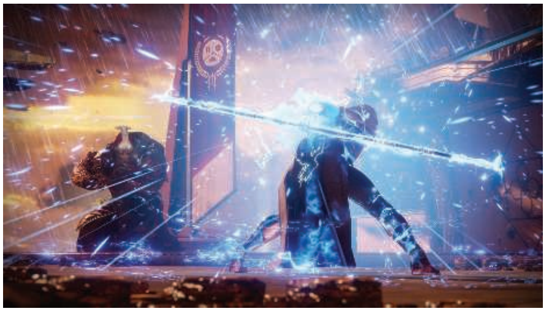

Van der Burg的论文\[211]和Latta的综述\[986, 987]，对粒子模拟的基础知识进行了快速介绍。Bridson关于计算机图形学流体模拟的书对理论进行了深入讨论\[197]，包括基于物理模拟各种形式的水、烟雾和火焰的技术。一些实践者对交互式渲染器中的粒子系统进行了讨论。Whitley \[1879]详细介绍了为《命运2》所开发的粒子系统，图13.21展示了一个示例图像。Evans和Kirczenow \[445]讨论了他们对于Bridson论文中的流体算法的实现。Mittring \[1229]给出了关于如何在虚幻4引擎中控制粒子的简要细节。Vainio \[1808]深入研究了游戏《声名狼藉：私生子》中粒子效果的设计和渲染。Wronski \[1911]提出了一种高效生成和渲染雨水的系统。Gjøl和Svendsen \[539]讨论了烟雾和火焰效果的实现，以及许多其他基于采样的技术。Thomas \[1767]实现了一个基于计算着色器的粒子模拟系统，该系统包括碰撞检测，透明排序和基于tile的高效渲染。Xiao等人\[1936]提出了一种交互式的物理流体模拟器，也可以计算需要显示的等值面。Skillman和Demoreuille \[1650]通过他们的粒子系统和其他基于图像的效果，将游戏《野兽传奇》的效果发挥到极限（turn the volume up to eleven）。

## 13.9 点渲染

1985年，Levoy和Whitted撰写了一份开创性的技术报告\[1033]，他们建议使用点来作为一种新的图元来渲染一切物体。其总体思路是使用大量的点来表示一个表面，并对这些点进行渲染。而在随后的pass中，执行高斯过滤从而填充渲染点之间的空白间隙。高斯滤波器的半径取决于表面上点的密度，以及投影在屏幕上的密度。Levoy和Whitted在VAX-11/780上实现了这个系统。

然而，直到大约15年后，基于点的渲染才再次引起人们的兴趣。这个渲染思路的再次兴起有两个主要原因：第一个原因是那时的计算能力达到了可以以一个交互速率来进行基于点的渲染；第二原因是使用激光测距扫描仪（laser range scanner）可以获得非常详细的模型\[1035]。从那时起，大量的RGB-D（深度）设备已经达到了实用水平，例如：用于地形测绘的航空LIDAR（光探测和测距，LIght Detection And Ranging，又叫做激光雷达）仪器\[779]；用于短程数据捕获的微软Kinect传感器；iPhone的TrueDepth相机；谷歌的Tango设备。自动驾驶汽车上的激光雷达系统，每秒可以记录数百万个点。通过摄影测量或者其他计算摄影技术处理过的二维图像也可以用于提供点云数据集。这些技术的原始输出是一组带有额外数据（通常是强度或者颜色）的三维点。还可以提供一些额外的分类数据，例如：某个点是否来自于建筑物或者路面\[37]。这些点云（point cloud）可以通过多种方式进行操作和渲染。

这样的模型最初会表示为不相连的三维点。读者可以阅读Berger等人\[137]的论文，深入了解点云过滤技术和将点云转化为网格的方法。Kotis和Cozzi \[930]提出了一种以交互速率处理、体素化和渲染这些体素的方法。而本小节中将会讨论直接对点云数据进行渲染的技术。

QSplat \[1519]是一个很有影响力的、基于点的渲染器，它首次发布于2000年。它使用了一个球体的层次结构树来描述模型。这个树中的节点会被压缩，从而允许渲染由数亿个点所组成的场景。一个点会被渲染为一个具有半径的形状，这个形状被称为splat。还可以使用具有不同形状的splat，例如正方形、不透明圆和模糊圆。换句话说，splat就是粒子，尽管我们最终的渲染目的是表示一个连续的表面，图13.22展示了这样的一个例子。渲染过程可以在树的任何层次上停止，该级别的节点会被渲染为与节点球体半径相同的splat。因此，这个包围球层次结构的构造能够使得在任何层次上都不会出现空洞。由于树的遍历（渲染）可以在任何级别停止，因此可以通过在可用渲染时间耗尽时终止遍历，从而获得交互式的帧率。当用户停止移动时，可以对渲染质量进行反复优化，直到达到层次结构的叶子节点。

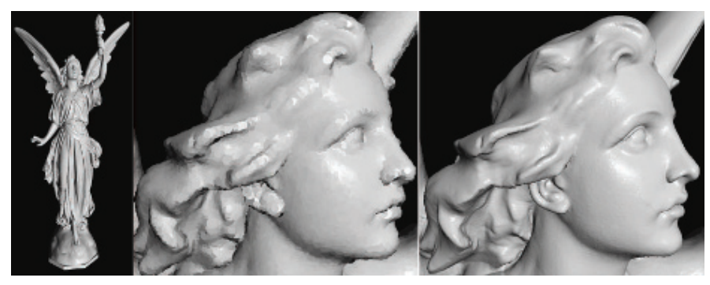

大约在同一时间，Pfister等人\[1409]提出了面元（surfel）的概念，即一个表面元素（surface element）。它也是一个基于点的图元，用于表示物体表面的一部分，因此面元中总是会包含一个法线。会使用一个八叉树（章节19.1.3）来存储采样的面元：位置，法线和过滤的纹理。在渲染过程中，面元会被投影到屏幕上，然后会使用一个可见性飞溅算法（visibility splatting algorithm）来填充产生的空洞。QSplat和面元的论文确定并解决了点云系统中的一些关键问题：管理数据集大小和从给定的点集中渲染出令人信服的表面。

QSplat使用一个层次结构，但是这个层级结构会被细分到单个点的级别，层次结构内部的父节点是包围球体，每个包围球体都包含一个点，这个点代表了子节点的平均值。Gobbetti和Marton \[546]引入了分层点云（layered point cloud），这是一种能够更好地映射到GPU上的分层结构，并且它不会产生人为的“平均”数据点。其中每个内部节点和子节点都包含了大致相同数量的点（记作$n$），这些点会在一次API调用中作为一个集合来进行渲染。我们从整个集合中取出$n$个点来形成根节点，将其作为模型的一个粗略表示。选择一个点与点之间距离大致相等的集合要比随机选择的结果更好\[1583]。法线或者颜色之间的差异也可以用于聚类选择\[570]。剩余的点在空间上会被划分为两个子节点，在每个节点上都重复上述的过程，即选择$n$个具有代表性的点，并将其余的点划分为两个子集。这种选择和细分过程会一直持续下去，直到每个子节点包含的点数量小于等于$n$，如图13.23所示。Botsch等人\[180]的工作是SOTA的一个很好例子，这是一种使用延迟渲染（章节20.1）和高质量滤波的GPU加速技术。在显示期间，可见的节点会被加载并进行渲染，直到满足某些限制条件。节点所占据的相对屏幕大小可以用来确定该点集的重要程度，并可以提供一个渲染广告牌的大小估计。由于这个方法不会为父节点引入新的点，因此内存使用量与存储的点数量成正比。这种方案的一个缺点是，当放大单个子节点的时候，所有的父节点都必须被发送到管线中，即使每个父节点中只有几个点是可见的。

![图13.23：分层点云。第一幅图展示的根节点，它包含了从子节点数据中提取的稀疏子集。第二幅图展示了一个子节点中所包含的点；第三幅图是根节点与该子节点一起显示的结果，请注意子节点区域是如何被填充的。第四幅图则是完整的点云，它包含了根节点和所有的子节点。 \[1583, 12\]](images/Chapter-13/202308211555187.png "图13.23：分层点云。第一幅图展示的根节点，它包含了从子节点数据中提取的稀疏子集。第二幅图展示了一个子节点中所包含的点；第三幅图是根节点与该子节点一起显示的结果，请注意子节点区域是如何被填充的。第四幅图则是完整的点云，它包含了根节点和所有的子节点。 \[1583, 12]")

在当前的点云渲染系统中，数据集可能会非常巨大，由数千亿个点组成。由于这些集合无法完全加载到内存中，更不用说以交互速率来进行渲染显示了，因此几乎每个点云渲染系统都会使用分层结构来进行加载和显示。实际使用的分层方案可能会受到具体数据的影响，例如：对于地形数据而言，四叉树通常要比八叉树更加适合。关于点云数据结构的高效创建和高效遍历已经有了相当多的研究。Scheiblauer \[1553]对这一领域中的研究，以及表面重建技术和其他算法进行了总结。Adorjan \[12]则对这几个系统进行了综述，他所讨论的重点是摄影测量生成的建筑点云。

理论上来说，splat可以提供单独的法线和半径来定义一个表面。但是在实践中，这样的数据所占用的内存太大，并且需要经过大量的预处理工作才能获得这样的数据，因此通常会使用固定半径的广告牌。由于排序和混合的成本，正确渲染半透明splat广告牌的开销可能会很大，同时还可能会充满瑕疵。因此通常会使用不透明的广告牌（正方形或者镂空的圆形）来兼顾交互性和渲染质量，如图13.24所示。

![图13.24：选择其中的500万个点来渲染一个包含1.45亿个点的小镇数据集。通过检测深度差异来增强边缘。当点云数据稀疏或者广告牌半径太小时，就会出现空洞。底部一行是图像预算分别为50万个点、100万个点、500万个点时所对应的渲染结果。 \[1583\]](images/Chapter-13/202308211738860.png "图13.24：选择其中的500万个点来渲染一个包含1.45亿个点的小镇数据集。通过检测深度差异来增强边缘。当点云数据稀疏或者广告牌半径太小时，就会出现空洞。底部一行是图像预算分别为50万个点、100万个点、500万个点时所对应的渲染结果。 \[1583]")

如果点云数据并不包含法线信息，那么则可以使用各种技术来提供着色效果。一种基于图像的方法是计算某种形式的屏幕空间环境光遮蔽（章节11.3.6）。通常的做法是，先将所有的点渲染到一个深度缓冲区中，并使用足够宽的半径来形成一个连续的表面。在随后的渲染pass中，每个点的着色效果都会按照靠近观察者的相邻像素数量，来成比例的变暗。眼穹光照（eye-dome lighting，EDL）可以进一步突出表面细节\[1583]。EDL的工作原理是检查相邻像素的屏幕深度，并找到比当前像素更加接近观察者的那些像素。对于每个这样的相邻像素，会计算它与当前像素之间的深度差并进行求和。然后将这些差值的平均值与强度因子相乘，来作为指数函数$\mathsf{exp}$的输入，最终对着色效果进行修正，如图13.25所示。

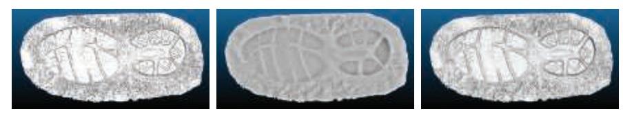

如果点云中的每个点都具有颜色信息或者强度信息，那么实际上光照效果本身已经被嵌入其中了，因此可以直接进行显示，尽管光泽物体或者反光物体并不会对相机视图的变化做出响应。而其他一些非图形的属性信息（例如物体类型或者高度等）也可以用来显示这些点。这里我们只涉及了管理点云和渲染点云的基础知识。Schuetz \[1583]对各种渲染技术进行了讨论，并提供了相应的实现细节，以及一个高质量的开源系统。

点云数据还可以与其他数据源相结合。例如：Cesium程序可以将点云与高分辨率地形、图像、矢量贴图数据和摄影测量生成的模型结合起来。另一种与扫描相关的技术是从天空盒的视角来捕捉环境信息，并将颜色信息和深度信息保存下来，从而使得捕捉的场景具有实际存在感。例如：用户可以将数字合成的模型添加到场景中，并使它们与这种类型的天空盒进行正确合并，因为周围图像中的每个点都具有深度信息，如图13.26所示。

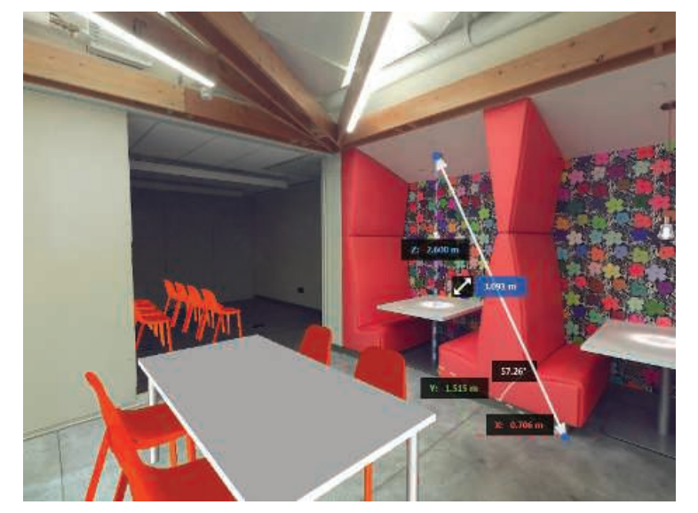

目前的SOTA已经取得了相当大的进展，并且这些技术在数据捕获和数据显示之外的领域也得到了应用。作为一个例子，我们简要总结了Evans \[446]为游戏《Dreams》所提出的基于点的实验性渲染系统。每个模型由若干聚类的层次包围盒结构（bounding volume hierarchy，BVH）进行表示，其中每个聚类包含256个点。这些点是由符号距离函数（signed distance function）生成的（章节17.3）。为了支持LOD，会为每个LOD层次生成单独的BVH、聚类和点。为了从高层次细节过渡到低层次细节，会将高密度子簇中的点数量随机减少到原来的25%，然后再将低层次细节中的父聚类交换进来。该渲染器基于一个计算着色器进行构建，它使用原子操作来将点划分到一个帧缓冲中，从而避免冲突。它实现了若干种技术，例如随机透明度，景深（使用基于弥散圆的抖动splat），环境光遮蔽和不完美的阴影贴图\[1498]等。为了对瑕疵进行平滑处理，还会进行时域抗锯齿（章节5.4.2）。

点云代表了空间中的任意位置，因此点云的渲染是具有挑战性的，因为我们往往不知道或者很难获得点与点之间的间隙信息。Kobbelt和Botsch \[916]对这个问题以及其他与点云相关的研究领域进行了综述。在本章节的最后，我们将转向一种非多边形的表示方法，在这种表示方法中，样本与其相邻样本之间的距离总是相同的，即体素数据。

## 13.10 体素

像素（pixel）指的是“图像元素（picture element）”，纹素（texel）指的是“纹理元素（texture element）”，相应的，体素（voxel）指的是“体积元素（volume element）”。每个体素都代表了均匀三维网格中的一个空间体积，通常是一个立方体。体素是存储体积数据的传统方法，可以表示从烟雾到3D打印模型，从扫描骨骼到地形表示的许多物体。体素中可以只存储一个bit的数据，用来表示体素中心是位于物体内部还是物体外部。对于医疗应用而言，可以存储密度或者不透明度，还可能会存储体积流量（volumetric flow）。还可以存储颜色、法线、符号距离或者其他数据，从而便于渲染。这里我们不需要知道每个体素的具体位置信息，因为网格中的索引便决定了它的位置。

### **13.10.1 应用**

模型的体素表示方法可以用于许多不同的目的。一个规则的数据网格适合进行与整个物体有关的各种操作，而不仅仅是对其表面进行操作。例如：用体素表示的一个物体，该物体的体积就是其内部体素的总和。网格的规则结构和体素明确定义的局部邻域，意味着可以通过元胞自动机（cellular automata）或者其他算法来模拟烟雾、侵蚀或者云层形成等现象。有限元分析（finite element analysis）方法也可以利用体素，来确定物体的抗拉强度。对模型进行雕塑或者雕刻，实际上就变成了一个减去体素的问题。相反，可以通过将多边形模型放置到体素网格中，确定该模型与哪些体素重叠来构建一个更加精细的模型。传统多边形工作流必须处理奇异点（singularity）和精度问题，而体素这种构造实体几何建模的操作是更加高效的、更加可预测的，并且保证有效。基于体素的系统，例如OpenVDB \[1249, 1336]和NVIDIA GVDB Voxels \[752, 753]，被用于电影制作、科学和医疗可视化、3D打印以及其他应用领域，如图13.27所示。

![图13.27：体素应用程序。左侧：流体模拟是直接在稀疏体素网格上进行计算的，并将其渲染为一个体积。右侧：一个多边形的兔子模型被体素化成一个符号距离场，然后再使用噪声函数对其进行扰动，并对一个等值面进行渲染。 \[1925\]](images/Chapter-13/202308211938072.png "图13.27：体素应用程序。左侧：流体模拟是直接在稀疏体素网格上进行计算的，并将其渲染为一个体积。右侧：一个多边形的兔子模型被体素化成一个符号距离场，然后再使用噪声函数对其进行扰动，并对一个等值面进行渲染。 \[1925]")

### **13.10.2 体素存储**

体素数据对于存储空间的需求很大，随着体素分辨率的不断提高，数据量的增长速度为$O(n^3)$。例如：假设每个维度上的分辨率为1000，那么一个三维的体素网格将会产生10亿个位置。基于体素的游戏例如《我的世界》等，可以拥有巨大的世界。在这款游戏中，地形数据以$16 × 16 × 256$体素块的形式进行流式加载，并以每个玩家为中心，对一定半径范围内的数据进行渲染。每个体素都会存储一个标识符、额外的方向或者样式数据。每种类型的方块都有自己对应的多边形表示，无论是使用立方体进行表现的实心石头，使用alpha纹理进行表现的半透明窗户，还是使用一对广告牌进行表现的草。详见图12.10和图19.19。

![图13.28：二维形式的稀疏体素八叉树（SVO）。给定最左边的一组体素，我们可以观察到树上的哪些父节点中是包含有体素的。最右边是最终八叉树的可视化，它展示了每个网格位置上所存储的最深节点。 \[963\]](images/Chapter-13/202308211956320.png "图13.28：二维形式的稀疏体素八叉树（SVO）。给定最左边的一组体素，我们可以观察到树上的哪些父节点中是包含有体素的。最右边是最终八叉树的可视化，它展示了每个网格位置上所存储的最深节点。 \[963]")

存储在体素网格中的数据通常具有很强的一致性（coherence），即相邻位置上很可能会具有相同或者相似的值。根据数据来源的不同，体素网格中的绝大部分可能都是空的，这被称为稀疏体积（sparse volume）。这里的一致性和稀疏性，都会驱动我们使用一种更加紧凑的表示方法来存储体素数据。例如：可以在网格上施加一个八叉树（章节19.1.3）。在最低的八叉树层次上，每个$2 × 2 × 2$的体素样本可能会包含相同的数据，我们可以在八叉树中进行记录，并丢弃冗余的体素。在树结构的上层也可能会检测到这样的相似性，同样地，我们可以丢弃这些相同的子八叉树节点，只有数据不同的地方才需要对它们进行存储。这种稀疏体素八叉树（sparse voxel octree，SVO）的表示方法\[87, 304, 308, 706]，产生了一种天然的LOD表示方法，相当于三维体积上的mipmap，如图13.28和图13.29所示。Laine和Karras \[963]为SVO数据结构提供了丰富的实现细节和各种扩展方法。

![图13.29：不同LOD下的体素光线追踪结果。沿着包含模型的体素网格边缘，从左到右的分辨率分别为256，512和1024。  \[753\]](images/Chapter-13/202308211958790.png "图13.29：不同LOD下的体素光线追踪结果。沿着包含模型的体素网格边缘，从左到右的分辨率分别为256，512和1024。  \[753]")

### **13.10.3 体素的生成**

体素模型的输入可以有各种来源。例如：许多扫描设备在任意位置上生成数据点。GPU可以加速体素化（voxelization）过程，这是一个将点云\[930]、多边形网格或者其他表示方法转换为一组体素的过程。对于多边形网格数据而言，Karabassi等人\[859]提出了一种快速而粗略的体素化方法，即从6个正交视图（顶部、底部和四个侧面）来渲染物体。每个视图上的渲染都会生成一个深度缓冲区，每个像素都保存了该方向上第一个可见体素的位置。如果一个体素的位置超出了存储在6个缓冲区中的对应深度，那么它就是不可见的，因此会被标记为位于物体内部。这种方法有一些瑕疵，它会错过一些在这六个视图中无法看到的特征，从而导致一些体素被错误地标记在物体内部。不过，对于简单的模型而言，这种方法就已经足够了。

受视觉外壳（visual hull）的启发\[1139]，Loop等人\[1071]使用了一个更简单的系统，来创建现实世界中人的体素化数据。该系统会捕获一组人的图像，并提取出图像中人的轮廓（silhouette）。每个轮廓都会在给定的相机位置上切割出一组体素，即只有在你能够看到人的像素位置上，才会生成与它们相关的体素。

体素网格也可以从一组图像集合中进行创建，例如使用医学影像设备来生成局部切片，然后再将这些切片堆叠起来。沿着同样的思路，网格模型可以进行切片渲染，在模型内部找到的体素会被适时地记录下来。通过调整相机的近裁剪平面和远裁剪平面，从而单独渲染模型的一个切片，并对生成的体素内容进行检查。Eisemann和Decoret \[409]引入了切片贴图（slicemap）的概念，其中32 bit的渲染目标被认为是32个独立的深度，每个深度都有一个位标记。渲染到这个体素网格中的三角形的深度会被转换为对应的位标记并进行存储。然后可以在一个渲染pass中渲染这32层数据，如果使用更宽通道的图像格式和多个渲染目标，则可以为该pass提供更多的体素层。Forest等人\[480]给出了这个算法的实现细节，他同时指出，在现代GPU上，一个pass可以渲染多达1024层体素。请注意，这个切片算法只能识别模型的表面数据，即模型的边界表示。而之前我们所提到的六正交视图算法还可以识别（尽管有时会识别错误）完全在模型内部的体素。图13.30给出了三种常见的体素化类型。Laine \[964]对相关术语、各种体素化类型，以及生成和使用它们所涉及的问题进行了全面彻底的处理。

![图13.30：一个球体以三种不同的方式进行了体素化，并展示了其截面。左边是一个实体的体素化，通过测试每个体素相对于球体中心的距离来进行确定。中间则是一个保守的体素化，其中任何接触到球体表面的体素都会被选择并存储下来。这个表面被称为26-分离体素化（26-separating voxelization），在其 3 × 3 × 3 的邻域内，没有内部体素与外部体素相邻。换句话说，内部体素和外部体素永远不会共享同一个面、边或者顶点。右边是6-分离体素化（6-separating voxelization），其中边缘和角可以在内部体素和外部体素之间进行共享。 \[1594\]](images/Chapter-13/202308212023643.png "图13.30：一个球体以三种不同的方式进行了体素化，并展示了其截面。左边是一个实体的体素化，通过测试每个体素相对于球体中心的距离来进行确定。中间则是一个保守的体素化，其中任何接触到球体表面的体素都会被选择并存储下来。这个表面被称为26-分离体素化（26-separating voxelization），在其 3 × 3 × 3 的邻域内，没有内部体素与外部体素相邻。换句话说，内部体素和外部体素永远不会共享同一个面、边或者顶点。右边是6-分离体素化（6-separating voxelization），其中边缘和角可以在内部体素和外部体素之间进行共享。 \[1594]")

随着现代GPU提供的新功能，使得更加有效的体素化方法成为可能。Schwarz、Seidel \[1594, 1595]以及Pantaleoni \[1350]介绍了使用计算着色器进行构建的体素化系统，该系统提供了直接构建SVO的能力。Crassin和Green \[306, 307]描述了他们用于规则网格体素化的开源系统，该系统利用了从OpenGL 4.2开始提供的图像加载/存储操作。这些操作允许对纹理内存进行随机读取和随机写入。通过使用保守光栅化（章节23.1.2）来确定与一个体素重叠的所有三角形，他们的算法可以高效地计算体素的占用率，以及平均颜色和法线等信息。他们也可以用这种方法来自上而下地构建一个SVO，并且在向下构建的过程中，只对非空节点进行体素化，然后再使用自下而上的过滤mipmap来对结构进行填充。Schwarz \[1595]给出了光栅化和计算内核体素化系统的实现细节，并解释了各个系统的特点。Rauwendaal和Bailey \[1466]构建了一个混合系统，并提供了源代码。他们提供了并行体素化方案的性能分析，并详细说明了如何正确使用保守光栅化从而避免误报。如果可以接受少量误差的话，Takeshige \[1737]讨论了MSAA如何能够成为保守光栅化的一种可行替代方案。Baert等人\[87]提出了一种创建SVO的算法，该算法可以高效地基于核外运行（out-of-core），即可以在不需要将整个模型驻留在内存的情况下，以一个较高的精度来对场景进行体素化。

由于场景体素化需要进行大量的处理，因此动态物体（移动或者动画）对于基于体素的系统而言是一个很大的挑战。Gaitatzes和Papaioannou \[510]通过对场景的体素表示进行渐进式（progressively）更新来解决这一任务。他们使用场景相机的渲染结果和生成的任何阴影贴图，来对体素数据进行清空和设置。体素会根据深度缓冲进行测试，从而清除那些比已记录的z-depth更加接近的体素。然后将缓冲区中的深度位置视为一组点，并将其转换到世界空间中。如果之前没有标记的话，则确定并设置这些点所对应的体素。这种清除和设置的过程依赖于相机的观察视角，这意味着当前相机没有看到的场景部分实际上是未知的，这可能会导致一些错误的发生。然而，这种快速的近似方法，使得计算基于体素的全局光照效果（详见章节11.5.6）能够在动态环境中以交互速率进行执行。

### **13.10.4 体素的**渲染

体素数据存储在一个三维数组中，它也可以被认为是存储在一个三维纹理中。这些体素数据可以使用多种方式进行渲染。在下一章中，我们将讨论半透明体素数据的可视化方法（例如雾），或者是用于检查数据集的切片平面（例如超声图像）。而在本小节中，我们将专注于渲染代表实体物体的体素数据。

想象一下最简单的体积表示方法，其中每个体素都包含了一个bit，用于记录该体素是位于物体内部还是位于物体外部。有一些常见的方法可以显示这些数据\[1094]。一种方法是直接对体素进行光线投射\[752, 753, 1908]，从而确定每个立方体最近的碰撞表面。另一种技术则是将体素立方体转换为一组多边形。虽然使用网格来进行渲染的速度会很快，但是这会在体素化期间会产生额外的成本，并且这种方法最适合于静态的体素。如果每个体素的立方体都是不透明的话，那么我们可以删除两个立方体之间相邻的正方形面，因为立方体之间的共享正方形面是不可见的。执行完这个过程之后，会给我们留下一个方形的外壳，但是外壳内部则是空心的。还可以使用一些简化技术（章节16.5）来进一步减少多边形的数量。这个过程如图13.31所示。

![图13.31：立方体剔除。左侧：这个包含17074个体素的实心球体，由102444个四边形面片组成，其中每个体素包含6个四边形面片。中间：相邻实体体素之间的共享的两个四边形面会被移除，使得四边形面片的数量减少到4770个。二者的外观是完全一样的，因为构成外壳的四边形面片没有受到影响。右边：使用一个快速贪心算法，来将较小的四边形面片合并成更大的四边形面片，最终使用了2100个四边形来表现这个球体。 \[1094\]](images/Chapter-13/202308221028163.png "图13.31：立方体剔除。左侧：这个包含17074个体素的实心球体，由102444个四边形面片组成，其中每个体素包含6个四边形面片。中间：相邻实体体素之间的共享的两个四边形面会被移除，使得四边形面片的数量减少到4770个。二者的外观是完全一样的，因为构成外壳的四边形面片没有受到影响。右边：使用一个快速贪心算法，来将较小的四边形面片合并成更大的四边形面片，最终使用了2100个四边形来表现这个球体。 \[1094]")

对于表示曲面的体素而言，这组立方体面的着色是不太令人信服的。对立方体进行着色的一个常见替代方案是，使用诸如移动立方体（marching cube）之类的算法来创建一个更加平滑的网格表面\[558, 1077]。这个过程被称为表面提取（surface extraction）或者多边形化（polygonalization，简写为polygonization）。在算法中，我们不再将每个体素都视为一个box，而是将其视为一个点样本。然后我们可以使用8个相邻的样本，以$2 × 2 × 2$的模式来构建角，从而形成一个立方体。这8个角的状态可以定义一个穿过立方体的表面。例如：如果立方体的顶部四个角位于物体外部，而底部四个角则位于物体内部，那么我们可以进行一个合理的猜测，这个表面很可能就是一个将立方体分成两半的水平正方形。又例如：一个角位于物体外部，而其余的角位于物体内部，这会形成一个三角形表面，这个三角形的顶点分别位于连接外部角的三条立方体边的中点处，如图13.32所示。这个将一组立方体角，转换为相应多边形网格的过程是十分高效的，因为8个角的bit可以被转换为一个0-255的索引，使用这个索引来访问一个表格，这个表格指定了每种可能配置模式的三角形数量和位置。

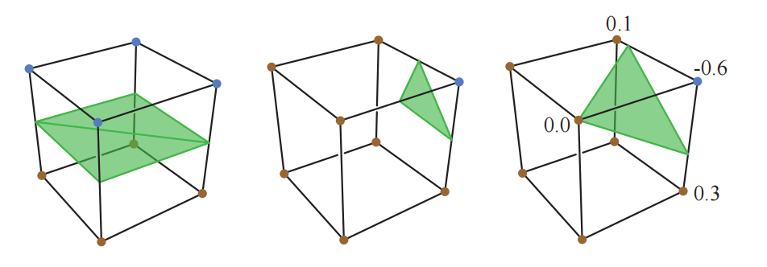

其他渲染体素的方法，例如水平集（level set）\[636]，则更加适合平滑的曲面。想象一下，每个体素中都存储了该空间位置到物体表面的距离，正值代表物体内部，负值表示物体外部。我们可以使用这些数据来调整网格顶点的位置，从而更加精确地表示曲面，如图13.32的右侧所示。或者我们可以直接对等值为0的水平集进行光线追踪，这种技术被称为水平集渲染（level-set rendering）\[1249]。这种算法尤其擅长表现曲面模型的表面和法线，而不需要任何额外的体素属性。

表示密度差异的体素数据，可以通过决定构成表面的方式来以不同的方式进行可视化。例如：某些给定的密度可以很好地代表肾脏组织，而另一些密度则可以代表肾结石。选择其中一个密度值就定义了一个等值面（isosurface），即一组具有相同值的位置。这个值应当能够进行修改，这对于科学可视化尤其有用。对任何等值面直接进行光线追踪，这实际上就是一种广义形式的水平集光线追踪，其中的目标值为零。或者还可以将等值面提取出来，并将其转换为多边形网格模型。

2008年，Olick \[1323]进行了一个具有影响力的演讲，这个演讲的主题是如何使用光线投射来直接渲染稀疏体素数据，这个演讲启发了进一步的研究工作。针对规则体素的射线检测非常适合GPU进行实现，并且可以在交互帧率下完成。有许多研究人员对这个渲染领域进行了探索。有关这个主题的介绍，你可以从Crassin的博士论文\[304]和SIGGRAPH演讲\[308]开始，其中涵盖了各种基于体素方法的优点。Crassin通过使用锥形追踪（cone tracing）来利用体素数据类似于mipmap的性质，其一般想法是利用体素数据的规则性和定义良好的局部性属性，来定义几何属性和着色属性的预过滤方案，从而允许使用线性的滤波器。在场景中追踪一根光线，这个光线可以从其起始点，在一个锥形区域内来收集一个近似的可见性。当光线在空间中移动的时候，其兴趣半径会逐渐增加，这意味着会在更高的层次上对体素结构进行采样，这个过程类似于当单个像素包含多个纹素时，mipmap会在更高层级上进行采样。这种类型的采样方法可以快速计算软阴影效果和景深效果，因为这些效果可以被分解为锥形追踪问题。这种区域采样的思想在其他处理过程中也很有价值，例如抗锯齿和正确过滤可变的表面法线。Heitz和Neyret \[706]对之前的工作进行了介绍，并提出了一种用于锥形追踪的新数据结构，它可以改善可见性计算的结果。Kasyan \[865]对面光源使用了体素锥形追踪，并对误差来源进行了讨论，图13.33中给出了一个对比，最终效果详见图7.33。使用锥形追踪来计算全局光照效果的方法，我们已经在章节11.5.7中进行了讨论。

![图13.33：锥形追踪所生成的阴影。上图：在Maya中对球形面光源进行20秒光线追踪的渲染结果。下图：同一场景的体素化和锥形追踪耗时约20毫秒，其中模型使用多边形进行渲染，而其体素化版本则用于阴影计算。 \[865\]](images/Chapter-13/202308221127185.png "图13.33：锥形追踪所生成的阴影。上图：在Maya中对球形面光源进行20秒光线追踪的渲染结果。下图：同一场景的体素化和锥形追踪耗时约20毫秒，其中模型使用多边形进行渲染，而其体素化版本则用于阴影计算。 \[865]")

最近的研究趋势是在GPU上探索八叉树以外的数据结构。八叉树的一个主要缺点在于，在其上进行光线追踪等操作，需要进行大量的树结构遍历操作，因此需要存储大量的中间节点。Hoetzlein \[752]指出，基于VDB树（一种网格层次结构）的GPU光线追踪，可以比八叉树获得更加显著的性能提升，并且更加适合体素数据的动态变化。Fogal等人\[477]证明，通过使用索引表而不是八叉树，可以使用一个两pass的方法来实时渲染一个较大的空间。其中第一个pass用于识别可见的子区域（块），以及以流式方式获取来自磁盘中对应区域中的数据。第二次pass对当前驻留在内存中的区域进行渲染。Beyer等人\[138]对大规模体积渲染技术进行了全面的综述。

### **13.10.5 其他主题**

表面提取技术通常用于隐式表面（章节17.3）的可视化。有不同形式的基本算法可以用来形成网格，并且在这些算法在形成网格的时候有一些微妙之处。例如：如果发现一个立方体的所有角都位于物体内部，那么这些角应当在多边形网格中被连接在一起，还是彼此保持独立？你可以阅读de Araujo等人\[67]的文章来了解有关隐式曲面的多边形化技术。Austin \[85]研究了各种通用多边形化方案的优缺点，并发现方形的移动正方形（cubical marching square）技术具有最理想的特性。

在使用光线投射进行渲染的时候，除了将体素进行完全多边形化之外，还有一些其他的解决方案。例如：Laine和Karras \[963]将一组平行平面附加到每个近似表面的体素上，然后使用后处理模糊来掩盖体素之间的不连续性。Heitz和Neyret \[706]以一种线性可滤波的表示方法来访问符号距离，这样允许重建出平面方程，并可以确定任意空间位置和分辨率在给定方向上的覆盖范围。

Eisemann和Decoret \[409]展示了如何使用体素表示方法来执行深度阴影映射（章节7.8），并将其用于半透明重叠表面的阴影投射。正如Kampe，Sintorn等人\[850, 1647]所表明的那样，与为每个光源都生成一个阴影贴图相比，体素化场景的另一个优点在于，所有光源的阴影光线都可以使用这同一个表示来进行测试。与直接可见的表面渲染效果相比，人眼对于阴影和间接光照等次要效果中的小错误更加包容，并且这些任务所需要的体素数据要少得多。当只追踪一个体素的占用情况时，许多稀疏体素节点之间可能存在极高的自相似性（self-similarity）\[849, 1817]。例如：一堵墙会包含一组体素，这些体素在若干个级别上都是相同的。这意味着树中的各种节点和整个子树都是相同的，因此我们可以使用单个实例来代表这些节点，并将它们存储在一个有向无环图（directed acyclic graph）中（章节19.1.5）。这样做可以大大减少每个体素结构所占据的存储空间。

## 补充阅读和资源

在Szeliski的《Computer Vision: Algorithms and Applications》一书\[1729]中讨论了基于图像的渲染、光场、计算摄影和许多其他主题。请访问我们的网站realtimerendering.com，来获取这本值得阅读的书，网站上有免费的电子版链接。Weier等人\[1864]在他们的SOTA报告中，讨论了利用视觉感知系统的局限性的各种加速技术。Dietrich等人\[352]在他们关于大规模模型渲染报告的侧边栏中，对基于图像的技术进行了综述。

在本章节中，我们只涉及了一些用于模拟自然现象的图像、粒子和其他非多边形方法。有关更多的示例和细节，请参阅相关参考文献。其中一些文章讨论了各种各样的技术，Beacco等人\[122]对人群渲染技术进行了调查，并讨论了基于impostor、LOD方法和其他许多技术的变种方法。Gjøl和Svendsen的演示\[539]展示了基于图像的采样和过滤技术，这些技术可以用于广泛的效果中，包括泛光、镜头光晕、水体效果、反射、雾、火和烟等。
