# Chapter 15 Non-Photorealistic Rendering 非真实感渲染

## 目录

-   [15.1 卡通着色](#151-卡通着色)
-   [15.2 轮廓渲染](#152-轮廓渲染)
    -   [15.2.1 基于法线的contour边缘着色](#1521-基于法线的contour边缘着色)
    -   [15.2.2 程序化的几何Silhouette](#1522-程序化的几何Silhouette)
    -   [15.2.3 基于图像处理的边缘检测](#1523-基于图像处理的边缘检测)
    -   [15.2.4 几何contour边缘检测](#1524-几何contour边缘检测)
    -   [15.2.5 隐藏线移除](#1525-隐藏线移除)
-   [15.3 笔触表面风格化](#153-笔触表面风格化)
-   [15.4 线条](#154-线条)
    -   [15.4.1渲染三角形边缘](#1541渲染三角形边缘)
    -   [15.4.2 渲染遮挡线条](#1542-渲染遮挡线条)
    -   [15.4.3 光晕](#1543-光晕)
-   [15.5 文本渲染](#155-文本渲染)
-   [补充阅读和资源](#补充阅读和资源)

> Stanislaw Ulam——“Using a term like ‘nonlinear science’ is like referring to the bulk of zoology as ‘the study of nonelephant animals.”

> 斯塔尼斯拉夫·乌拉姆——“使用‘非线性科学’这样的术语，就像是把大部分动物学称为“对非大象动物的研究”一样。”（美国籍数学家，曾参与曼哈顿计划；1909—1984）

真实感渲染（photorealistic rendering）的目标是让渲染图像与现实照片之间难以区分。而非真实感绘制（non-photorealistic rendering，NPR），又称风格化绘制（stylized rendering），则有着广泛的目标。某些形式的NPR，其目标是生成类似于技术插图的图像，即只有那些与特定应用程序目标相关的细节才应当被显示和渲染出来。例如：在向客户销售汽车的时候，一张闪亮的法拉利引擎照片可能会有用；但是在维修引擎的时候，一张突出显示相关部件的简化线条图可能会更有意义（并且打印成本更低）。

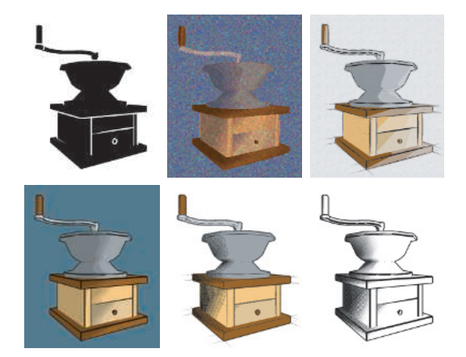

NPR的另一个领域是对绘画风格和自然媒介的模拟，例如钢笔、墨水、木炭和水彩等。这是一个十分广阔的领域，它为各种各样的算法提供了机会，这些算法都试图去捕捉各种绘画介质的感觉，图15.1展示了一些例子。有两本比较旧的书涵盖了绘画NPR的算法和技术\[563, 1719]。鉴于NPR领域的广度，因此在本书中，我们将专注于渲染笔画和线条的技术。我们的目标是介绍一些用于NPR的实时算法。本章节首先会详细讨论实现卡通渲染风格（cartoon rendering style）的方法，然后再讨论NPR领域内的其他主题。在本章节的最后，还会介绍各种用于线条渲染的技术。

## 15.1 卡通着色

正如不同类型的字体会给文本带来不同的感觉一样，不同风格的渲染也有自己独特的情绪、含义和表现形式。人们对NPR中的一种特殊形式给予了大量关注，即卡通渲染（toon rendering），或者叫做cel rendering（这里cel的全称是Celluloid，即赛璐璐风格）。由于这一渲染风格与动画片（cartoon）有关，因此它具有幻想和童年的表现含义。在最简单的卡通渲染中，我们使用纯色来填充物体，并使用实线来绘制物体的轮廓，从而将不同的实色区域分隔开来。关于这种风格流行的一个原因，McCloud在其经典著作《理解漫画（Understanding Comics）》中\[1157]提到，“通过简化来进行增强（amplification through simplification）”。通过对画面内容进行简化并剔除杂乱的信息，可以增强与演出相关信息的效果。对于卡通角色而言，会有更多的观众认同那些绘画风格简单的角色。

卡通渲染风格在计算机图形学中已经使用几十年了，主要是将三维的模型与二维卡通动画结合在一起。与其他NPR风格相比，这种风格在定义上较为简单，因此便于使用计算机来进行自动生成。这种风格在许多电子游戏中都得到了很好地应用\[250, 1224, 1761]，如图15.2所示。

在这种卡通渲染风格中，物体的轮廓通常会被渲染为黑色线条，从而增强卡通外观。有关如何寻找和渲染这些轮廓的内容将在下一小节中进行讨论。有几种不同的方法可以渲染这些卡通表面。其中有两种最为常见的方法，第一种是使用一个纯色（不接受光照）来填充网格区域；第二种则是使用一个双色（two-tone）方法，其中一种颜色代表明亮区域，另一种颜色代表阴影区域。这里所说的双色方法，有时候也会被称为硬着色（hard shading），这种着色方法在像素着色器中执行起来十分简单，当着色法线与光源方向之间的点积大于某个值的时候，就使用较浅的颜色；反之如果点积小于某个值的时候，就使用较暗的颜色。当光照环境比较复杂时，还可以使用另一种方法，即对最终图像本身进行量化。这个过程也被称为色调分离（posterization），它指的是一个将连续范围内的值转换为几个离散颜色的过程，每个颜色之间具有较大的差异，如图15.3所示。对RGB值进行量化可能会导致一些令人不快的色调偏移（hue shift），因为每个单独颜色通道中的变化方式，与其他颜色通道中的变化方式并没有密切的联系。一种更好的选择是使用HSV、HSL或者YCbCr等色调保持（hue-preserving）的色彩空间。或者还可以定义一个一维函数，或者使用一个一维纹理（ramp纹理），来将不同强度等级的颜色重新映射到特定的色调或者颜色上。还可以使用量化或者其他滤波器来对纹理进行预处理操作。图15.16还展示了一个具有更多颜色级别的例子。

![图15.3：最左边的是基本渲染，之后三幅图片依次使用了纯色填充、色调分离和铅笔着色。 \[1449\]](images/Chapter-15/202309011712561.png "图15.3：最左边的是基本渲染，之后三幅图片依次使用了纯色填充、色调分离和铅笔着色。 \[1449]")

Barla等人\[104]通过使用一个二维贴图来代替之前的一维着色纹理，从而添加与视角相关的效果。这个二维贴图的第二个维度，是通过表面的深度或者方向进行索引的。这会使得物体在较远距离处，或者是快速移动的时候，能够在对比度上实现平滑的软化效果。在游戏《军团要塞2》中，该算法与其他各种着色方程和绘制纹理相结合，从而实现了一种卡通风格和现实风格相融合的效果\[1224]。卡通着色器还有很多很多其他的变体，用于实现不同的目的，例如在对表面特征或者地形特征进行可视化的时候，可以用于增强对比效果\[1520]。

## 15.2 轮廓渲染

这些用于卡通边缘渲染的算法，是NPR中的一些主要课题和重要技术。本小节我们的目标是对一些轮廓渲染算法进行介绍，让大家对该领域有个大致的了解。我们所使用的方法可以大致分为基于表面着色（surface shading）、程序化几何（procedural geometry）、图像处理（image processing）、几何边缘检测（geometric edge detection），或者是这些方法的混合方法。

在卡通渲染中，可以使用以下几种不同类型的边缘：

-   不被两个三角形所共享的边界（boundary）或者边界边缘（border edge）。例如一张纸的边缘。实心物体通常没有边界边缘。
-   折痕边缘（crease edge）、硬边（hard edge）或者特征边缘（feature edge），是指被两个三角形所共享的边界，其中这两个三角形之间的夹角（叫做二面角，dihedral angle）大于某个预设的阈值。一个比较好的默认折痕夹角为60度\[972]。例如：立方体中便含有折痕边缘。折痕边缘可以进一步细分为脊边（ridge edge）和谷边（valley edge）。
-   当共享某个边界的两个三角形具有不同的材质、或者产生着色变化的时候，就会出现材质边缘（material edge）。它也可以是艺术家希望进行展示的一些边缘，例如：人脸额头上的线条，或者一个分隔相同颜色裤子和衬衫的线条。
-   contour 边缘（contour edge）指的是，与某些方向向量（通常是来自眼睛的观察向量）相比，两个相邻三角形的朝向有所不同。
-   silhouette 边缘（silhouette edge）指的是，沿着物体的轮廓边界，这个边界可以将物体从图像的背景中分离出来。

> 译者注：contour 可以译为轮廓，是物体广义的轮廓边缘。silhouette 可以译为剪影，通常包含一种颜色，旨在表现物体的整体形状而不是其他的视觉细节。例如人面向太阳拍照，所形成的黑色剪影，就可以叫做silhouette 。这里为了更加准确清晰，就不翻译contour 和silhouette 了。

上述边缘的分类如图15.4所示。这种分类方法和名称来源于相关文献和论文中的常用用法，但是也有一些不同的地方，例如：上面我们提到的折痕边缘（crease edge）和材质边缘（material edge），在其他地方有时也会被称为边界边缘（boundary edge）。

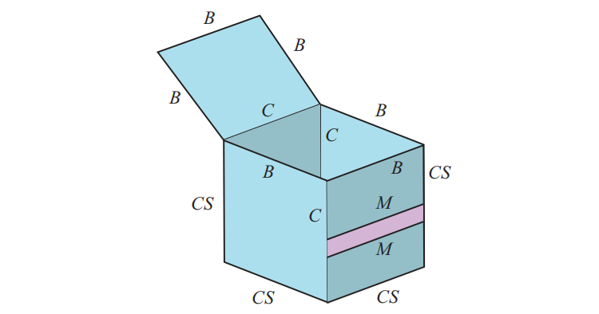

在这里我们要区分一下contour 边缘和silhouette 边缘。二者都有轮廓边缘的含义，其中表面的一部分会面向观察者，而另一部分则面向其他方向。silhouette 边缘是contour 边缘的一个子集，silhouette 边缘可以将物体与另一个物体或者背景分离开来。例如：在头部的侧视图中，耳朵会形成contour 边缘，即使它们会出现在头部silhouette 轮廓的内部。图15.3中还展示了一些其他这样的例子，包括鼻子、两根弯曲的手指、以头发部分。在一些早期的文献中，contour边缘也被称为silhouette边缘，但它通常指的就是完整的contour边缘。此外，contour一词还具有等高线的含义，这里我们所提及的contour，不能与地形图上所使用的等高线概念相混淆。

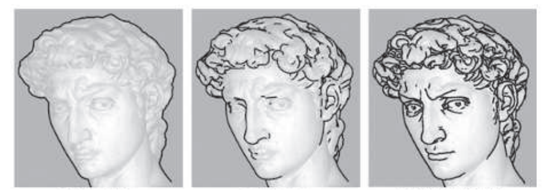

需要注意的是，边界边缘与contour边缘或者silhouette 边缘是不同的。contour边缘和silhouette 边缘都与观察方向有关，而边界边缘则与观察方向无关。暗示性contour边缘（suggestive contour边缘）\[335]是从原始观察位置，去观察那些几乎是contour的位置所形成的。它们可以提供额外的边缘信息，来帮助传达物体的形状，如图15.5所示。虽然本小节的重点主要是对contour边缘的检测和渲染，但是也会涉及一些其他类型的笔画工作\[281, 1014, 1521]。我们还会着重关注如何在多边形模型中寻找这样的边缘。Benard等人\[132]讨论了如何在细分曲面中、或者是在其他高阶定义所构成的模型中，寻找contour边缘的方法。

### 15.2.1 基于法线的contour边缘着色

与章节15.1中的表面着色器相类似，着色法线和观察方向之间的点积可以用来寻找contour边缘\[562]。如果这个点积接近于零，即着色法线几乎垂直于观察方向，那么说明这个表面几乎是侧对着眼睛的，因此这个位置很可能会接近contour边缘。可以将这些区域涂成黑色，并随着点积的增大而逐渐变为白色，如图15.6所示。在可编程着色器出现之前，这个算法是使用一个带有黑色圆环的球形环境贴图来进行实现的，或者是将mipmap金字塔纹理的最顶层涂成黑色，也可以实现这一效果\[448]。而在如今，这种类型的着色是直接在像素着色器中实现的，当屏幕法线垂直于观察方向时，则将该片元涂成黑色。

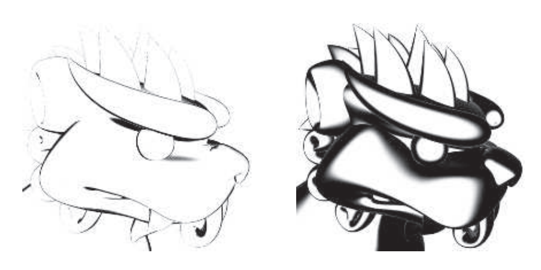

这种着色方法在某种意义上来说与边缘光照刚好相反，在边缘光照中，光线将会照亮物体的轮廓；而在这种边缘变黑的着色方法中，就好像相机位置处有一个光源一样，整个场景都是被这个相机光源所照亮的，并且这个光照效果具有很强的衰减，从而使得边缘变得很暗。它也可以被认为是一种图像处理中的阈值滤波器（thresholding filter），当某个表面低于一定强度的时候，会将图像上的对应位置变为黑色，否则变为白色。

这种方法具有一个特点，或者也可以算是一个缺点，即contour边缘的宽度是可变的，具体的宽度取决于表面的曲率。由于在尖锐折痕的地方，表面曲率会发生剧烈变化，几乎没有像素表面的法线会垂直于观察方向；因此这种方法适用于没有折痕边缘的曲面模型，因为这种模型在沿着silhouette的区域内，其表面法线通常都会几乎垂直于观察方向，因此存在一些可以被涂成黑色的像素。这个算法无法应用在立方体等模型上，因为折痕边缘附近的表面区域不具这样的属性。但是即使在曲面模型上，这个算法有时候也会失效，看起来会很糟糕；因为当物体距离相机较远时，在contour边缘附近采样的表面法线，可能并不会与观察方向几乎垂直。Goodwin等人\[448]指出了这个基本概念元素作为视觉暗示的有效性，并讨论了如何结合光照、表面曲率和相机距离来确定笔画的厚度。

### 15.2.2 程序化的几何Silhouette

Rossignac和van Emmerik \[1510]提出了一个实时渲染contour边缘的技术，这也是该类技术中最早的之一，该算法后来被Raskar和Cohen \[1460]进行了改进。这种技术的通用思路是，先正常渲染一遍模型正面，然后再渲染一遍模型背面，从而使得模型的contour边缘变得可见。渲染模型背面的方法有很多种，每种方法都有自己的优缺点。但是这些方法都会先渲染一遍模型正面；然后打开正面剔除，关闭背面剔除，从而只渲染模型的背面。

渲染contour边缘的一种方法是，只渲染模型背面的边缘，而不是渲染模型背面的三角面。使用偏移（biasing）或者其他技术（章节15.4），来保证其中的一些线段正好能够画在模型正面的正前方。这样的话，就只有模型正面与模型背面相交的边缘是可见的了\[969, 1510]。

![图15.7： silhouette的深度偏移方法，通过将背面向前平移来进行实现。如果正面位于一个不同的角度（如右侧所示），将会看到不同大小的背面区域。 \[1460\]](images/Chapter-15/202309011956122.png "图15.7： silhouette的深度偏移方法，通过将背面向前平移来进行实现。如果正面位于一个不同的角度（如右侧所示），将会看到不同大小的背面区域。 \[1460]")

想要让这些线条变宽，其中一种方法是将模型背面渲染为黑色，并向前进行偏移。Raskar和Cohen给出了几种偏移方法，例如按照固定的量进行平移，或者是对具有非线性性质的z-depth进行补偿，又或者是使用一个基于深度-斜率的偏移（depth-slope bias），例如OpenGL中的$\mathrm{glPolygonOffset}$。Lengyel \[1022]讨论了如何通过对透视矩阵进行修改，来提供更加精细的深度控制。所有这些方法都存在一个问题，即它们无法创建的均匀宽度的描边线条。为了对这一点进行改进，向前偏移的量不仅要取决于背面，还要取决于相邻的正面，如图15.7所示。可以使用背面三角形的斜率来调整多边形向前的偏移量，同时线条的粗细也将取决于正面三角形的斜率。

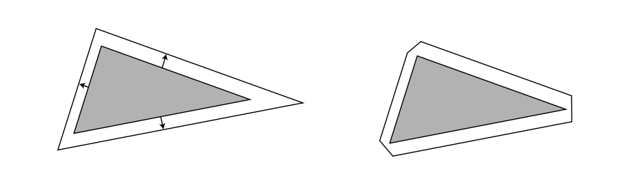

Raskar和Cohen \[1460, 1461]通过将每个背面三角形沿其边缘进行加粗，从而解决这个相邻依赖的问题，能够实现粗细一致的线条。也就是说，三角形的斜率与到观察者的距离共同决定了三角形向外扩展的程度。其中一种扩展方法是，将三角形的三个顶点沿其平面向外进行扩展。一种更加安全保守的渲染方法是，将三角形的三条边向外进行扩展，并将这些边重新连接起来。这样做可以避免调整后的顶点远离原始三角形，如图15.8所示。需要注意的是，使用这种方法的话，就不需要对模型背面进行偏移了，因为此时背面自动就会扩展到正面边缘的外部。图15.9中展示了这三种方法的执行结果。这种描边技术更加可控且更加均匀，它被许多电子游戏所采用，用于绘制游戏中的角色轮廓，例如《波斯王子（Prince of Persia）》\[1138]和《爆炸头武士（Afro Samurai）》\[250]。

![图15.9：使用边缘加粗线条、 z 偏移和扩展三角形算法进行渲染的背面contour边缘。由于细小特征的偏移问题，因此背面边缘技术往往会导致线条之间的连接性不佳，并且线条的粗细也不均匀。由于 z 偏移算法依赖于正面的倾斜角度，因此它所产生的边缘宽度并不均匀。 \[1460\]](images/Chapter-15/202309030936162.png "图15.9：使用边缘加粗线条、 z 偏移和扩展三角形算法进行渲染的背面contour边缘。由于细小特征的偏移问题，因此背面边缘技术往往会导致线条之间的连接性不佳，并且线条的粗细也不均匀。由于 z 偏移算法依赖于正面的倾斜角度，因此它所产生的边缘宽度并不均匀。 \[1460]")

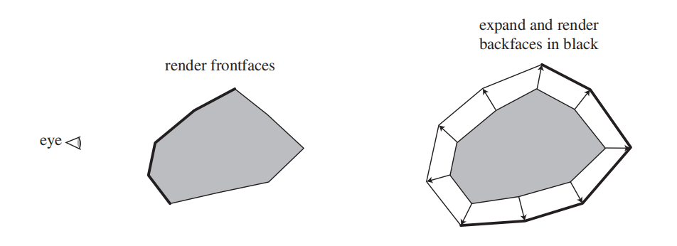

在上述给出的方法中，背面三角形沿着其原始平面进行展开。另一种方法则是沿着共享的顶点法线，来将三角形的顶点向外移动，具体移动的距离与顶点到眼睛的$z$距离成正比\[671]。这种方法被称为外壳方法（shell）或者光晕方法（halo），这是因为位移后的背面会在原始物体周围形成一个外壳。想象现在有一个球体，我们先正常渲染一遍球体，然后以相对于球体中心5像素宽的半径来对球体进行扩展。如果说球体中心移动一个像素，相当于它在世界空间移动3毫米的话，那么此时扩展球体的半径将增大15毫米。我们将这个扩展版本的背面渲染为黑色，此时contour边缘的宽度将会是5个像素，如图15.10所示。这种沿着顶点法线将顶点向外移动的任务，非常适合顶点着色器来进行执行。这种类型的扩展方法有时也会称为壳映射（shell mapping）。这种方法实现简单，效率较好，健壮性好，性能稳定，如图15.11所示。可以对背面进一步扩展，并根据角度来对背面进行着色，从而实现一种力场效果或者光晕效果。

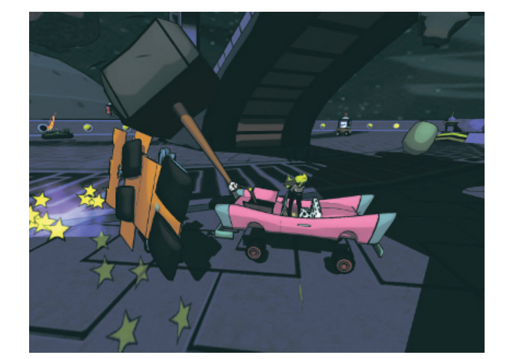

这种壳技术有几个潜在的缺陷。例如：想象一下我们直视一个立方体，此时只有正面是可见的。形成contour边缘的四个背面，每个都会向着其相应立方体表面的方向进行移动，这样会导致在立方体的角落处产生空隙。这种现象产生的原因是，虽然每个角上都有一个顶点，但是每个立方体表面都有着不同的顶点法线。扩展后的立方体并没有真正形成一个外壳，因为每个立方体的顶点都在向着不同的方向进行扩展。一种解决方案是，让处于同一位置的若干顶点共享使用一个新生成的平均顶点法线。另一种解决方案是，在折痕处创建退化（degenerate）的几何图形，然后再根据面积将其扩展成三角形。Lira等人\[1053]使用了一个额外的阈值纹理。来控制每个顶点的移动量。

壳技术和扩展技术会浪费其中一部分的填充图形，因为所有的背面三角形都会被送进管线中。所有这些技术都还有一些其他的局限性，例如无法精确控制边缘的外观，以及很难正确渲染透明表面等，当然这取决于具体使用的透明算法。

这类几何技术有一个值得称道的特点，即在渲染过程中不需要任何连通信息或者边缘列表。其中的每个三角形都是独立于其他三角形来进行处理的，因此这种技术非常适合GPU进行实现\[1461]。

这类算法只能渲染contour边缘。Raskar \[1461]给出了一个巧妙的解决方案，这个方法不需要创建和访问边缘的连通数据结构，就可以在变形模型上渲染脊状的折痕边缘（ridge crease edge），其核心思路是沿着要进行渲染的三角形边缘生成一个额外的多边形。会由开发人员定义一个临界二面角（critical dihedral angle），它决定了这个折痕是否应当可见，这些边缘多边形，会根据这个临界二面角来从三角形平面进行弯曲。如果两个相邻三角形的折痕角大于这个临界折痕角，那么边缘多边形将会变得可见，否则它们将会被三角形所遮挡隐藏，如图15.12所示。谷边（valley edge）也可以使用类似的技术来进行渲染，但是需要一个额外的模板缓冲和多个pass来进行处理。

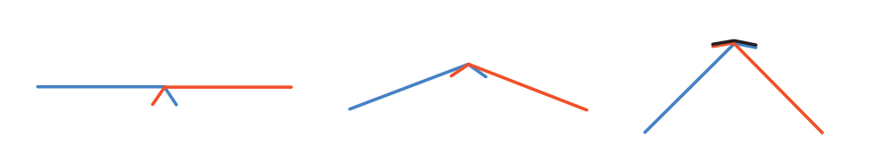

### **15.2.3 基于图像处理的边缘检测**

上一小节中的算法，有时也会被归类为基于图像的算法，因为它们会受到屏幕分辨率的影响。另一种类型的算法更加直接，它直接基于图像信息来进行处理，这类算法只会对存储在图像缓冲区中的数据进行操作，不会对场景中的几何形状进行修改，甚至不需要知道场景中的几何信息。

Saito和Takahashi \[1528]首先引入了G-buffer的概念，它也被用在了延迟渲染中（章节20.1）。Decaudin \[336]对G -buffer的使用进行了扩展，从而来实现卡通渲染，其基本思想很简单：可以通过在各种缓冲区上执行图像处理算法来实现NPR。通过查找相邻z-buffer中的不连续点，可以找到许多contour边缘的位置。相邻表面的不连续法线通常也会标识contour边缘和边界边缘的位置。使用环境颜色来渲染场景，或者是使用对象标记值，可以用于检测材质边缘、边界边缘和真正的silhouette边缘。

对这些边缘进行检测和渲染包括两部分。首先，渲染场景中的几何图形，使用像素着色器来保存深度、法线、对象ID或者其他任何渲染目标（render target）所需要的数据。然后以类似于章节12.1中所描述的方式来执行后处理。后处理pass会对每个像素周围的邻域进行采样，并基于这些采样输出一个结果。例如：假设我们对场景中的每个物体都有一个唯一的标识值。这样的话，我们可以在每个像素上对这个对象ID进行采样，并将其与周围四个相邻像素的ID值进行比较。如果其中的任何一个ID值都与测试像素的ID值不相同，则输出黑色；反之输出白色。对周围8个相邻像素进行采样会更加万无一失，但是相应的，采样代价也会更高。这种简单的测试可以用来绘制大多数物体的边界边缘和轮廓（即真正的silhouette边沿）。材质ID可以用来查找材质边缘。

contour边缘可以通过在法线缓冲和深度缓冲上使用各种滤波器来找到。例如：如果相邻像素之间的深度差超过某个阈值，则可能会存在contour边缘，因此这些像素会被设置为黑色。在实践中，我们需要一些更加精细的边缘检测算子，而不是简单地判断相邻像素是否和我们的样本相匹配。在这里我们不会讨论各种边缘检测滤波器的优缺点，例如Roberts cross、Sobel和Scharr等滤波器，因为有很多图像处理文献都对这些滤波器进行了广泛的介绍\[559, 1729]。由于这些算子的结果并不一定是布尔值，因此我们可以对它们的阈值进行调整，或者是在某些区域内进行黑白渐变。需要注意的是，法线缓冲也可以用于检测折痕边缘，因为相邻像素之间较大的法线差异，也暗示了contour边缘或者折痕边缘的存在。Thibault和Cavanaugh \[1761]讨论了他们是如何将这种技术应用在游戏《无主之地》的深度缓冲中的。在其他的一些技术中，他们对Sobel滤波器进行了修改，从而使其能够创建单像素宽度的轮廓，并使用深度计算来提高检测精度，如图15.13所示。或者也可以反过来，只在阴影周围添加轮廓，忽略那些具有较大深度差异的相邻边缘\[1138]。

![图15.13：对Sobel边缘检测进行了修改，并应用在了游戏《无主之地》中。最终发布的版本（并没有显示在这里）通过掩盖前景中草的边缘，来进一步改善外观表现。 \[1761\]](images/Chapter-15/202309031159032.png "图15.13：对Sobel边缘检测进行了修改，并应用在了游戏《无主之地》中。最终发布的版本（并没有显示在这里）通过掩盖前景中草的边缘，来进一步改善外观表现。 \[1761]")

膨胀算子（dilation operator）是一种形态学算子（morphological operator），用于对检测到的边缘进行加粗\[226, 1217]。在生成边缘图像之后，会应用一个单独的pass来进行处理。在每个像素位置上，会对该像素及其周围一定半径内像素进行检查。找到该范围内最暗的像素值，并将其作为输出值返回。这样操作下来，原本一条很细的黑线就会按照搜索区域的直径进行加粗。还可以使用多个pass来进一步加粗线条，这里存在一个trade-off，即执行额外的pass会带来额外的成本，但是这样做每个pass所需要的样本数量就会大大减少。不同的结果可能会具有不同的粗细程度，例如：silhouette边缘可能要比其他的contour边缘更粗。与此相关的一些腐蚀算子（erosion operator）可以用于对线条进行细化，或者是实现其他效果。图15.14展示了一些结果。

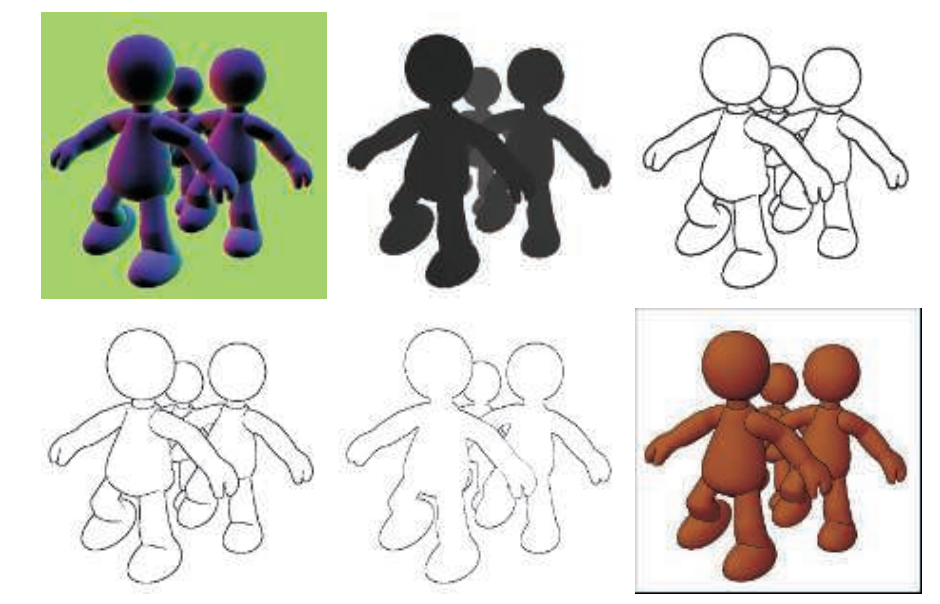

这种类型的算法有以下几个优点。第一，与其他大多数技术不同，这种类型的算法可以处理所有类型的表面，无论是平面还是曲面。第二，由于这个方法是基于图像的，因此不要求网格相互连通，也不要求网格的一致性。

这种技术的缺陷相对较少。对于靠近边缘的表面，比较z-depth的滤波器可能会错误地检测到表面上的contour边缘像素。比较z-depth的另一个问题在于，如果像素之间的深度差异很小的话，那么contour边缘可能会被遗漏。例如：桌子上的一张纸，使用这种方法可能会遗漏掉它的边缘，因为这个纸张和桌面的深度差异很小。类似地，基于法线贴图的滤波器也将会遗漏这张纸的边缘，因为纸张的法线和桌面的法线几乎是相同的。再比如，将一张纸折叠起来，可能会无法检测到重叠处的边缘\[725]。同时也会产生阶梯状的锯齿线条，章节5.4.2中所介绍的各种形态学抗锯齿技术，可以很好地处理这种高对比度的输出结果，同时还可以使用色调分离（posterization）等技术来提高边缘的视觉质量。

这种边缘检测也可能会以相反的方式失效，即在不应该存在边缘的地方产生了边缘。确定具体哪些位置属于边缘并不是一个简单的操作，例如：想象现在有一个玫瑰的茎秆，即一个细长的圆柱体。在靠近观察的时候，样本像素附近的茎秆法线变化不大，因此不会检测到边缘。当我们逐渐远离这个玫瑰的时候，像素之间的法线会发生快速变化，直到在某些点上，由于这些法线差异的存在，可能会在边缘附近出现错误的边缘检测。在深度图中检测边缘有时也会出现类似的问题，透视效应对于深度的影响是另一个需要进行补偿的因素。Decaudin \[336]给出了一种改进的方法，该方法通过处理法线贴图和深度贴图中的梯度来寻找变化，而不仅仅是数值本身。而各种像素之间的差异具体要如何转化为颜色上的变化，这是一个需要根据画面具体内容来进行调整的过程\[250, 1761]，如图15.15所示。

![图15.15：各种边缘方法。图中的褶皱等特征边缘属于纹理的一部分，它们是由艺术家事先添加的。人物角色的silhouette边缘则是通过背面扩展而产生的。contour边缘是利用图像处理中的边缘检测生成的，它可以设置不同的权重。左图中contour边缘的生成权重很小，因此这些边缘显得很模糊。中间则展示了一些轮廓，尤其是鼻子处和嘴唇处的contour边缘。右图中所使用的权重过大，因此产生了一些瑕疵 \[250\] 。](images/Chapter-15/202309031928784.png "图15.15：各种边缘方法。图中的褶皱等特征边缘属于纹理的一部分，它们是由艺术家事先添加的。人物角色的silhouette边缘则是通过背面扩展而产生的。contour边缘是利用图像处理中的边缘检测生成的，它可以设置不同的权重。左图中contour边缘的生成权重很小，因此这些边缘显得很模糊。中间则展示了一些轮廓，尤其是鼻子处和嘴唇处的contour边缘。右图中所使用的权重过大，因此产生了一些瑕疵 \[250] 。")

一旦我们生成了一些笔画（stroke），就可以根据需要对其进行进一步的图像处理。由于这些笔画可以在单独的缓冲区中进行创建，因此它们也可以进行独立地修改，然后再叠加到表面上。例如：噪声函数可以用于对线条和表面进行磨损和摆动，或者是在二者之间创建细小的间隙，从而提供一种手绘外观。纸张的高度场同样可以用来影响渲染效果，例如：木炭等固体材料会沉积在纸张凸起的顶部；而水彩画则会聚集在纸张的凹陷处，图15.16展示了这样的一个例子。

我们在这里专注于使用几何信息或者其他非图形信息（例如法线、深度和对象ID等）来检测边缘。当然，图像处理技术是针对图像进行开发的，这种边缘检测技术当然可以应用在颜色缓冲中。其中一种方法被称为高斯差分（difference of Gaussians，DoG），即使用两个不同的高斯滤波器来对图像进行两次处理，并从其中一个结果中减去另一个结果。这种边缘检测方法应用在NPR中可以产生特别令人愉悦的结果，它被用于生成各种艺术风格的图像，例如铅笔画和蜡笔画\[949, 1896, 1966]。

NPR技术中的一些图像后处理算子，着重于对艺术介质的模拟，例如水彩（watercolor）和丙烯颜料（acrylic paint）等。这一领域中已经有了相当多的研究，对于交互式应用程序而言，最大的挑战是如何使用最少的纹理样本来做最多的事情。可以在GPU上使用双边滤波器、均值偏移滤波器（mean-shift）和Kuwahara滤波器，从而在保留边缘信息的同时，对绘画区域进行平滑处理\[58, 948]。Kyprianidis等人\[949]对该领域中的图像处理效果进行了全面的回顾和分类。Montesdeoca等人\[1237]的作品是一个非常好的案例，他将许多简单直接的技术结合在一起，从而实现了交互式的水彩画效果。图15.17展示了一个使用水彩风格进行渲染的模型。

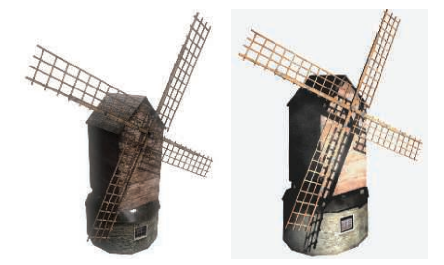

### 15.2.4 几何contour边缘检测

到目前为止，我们所介绍的方法都存在一个问题，即边缘的风格化特征是受限的，我们无法实现丰富的边缘外观。例如：想让线条看起来是虚线是很困难的，更不用说让线条看起来像手绘的或者笔触的了。对于这种类型的操作，我们需要找到contour边缘，并直接对它们进行渲染。如果我们拥有了独立的边缘实体，我们就可以实现各种额外的效果，例如：我们可以让网格保持冻结的同时，让contour轮廓发生跳动。

contour边缘是指，两个相邻三角形中的其中一个面向观察者，而另一个面则指向其他方向。可以使用如下数学公式进行判断：

$$
\left(\mathbf{n}_{0} \cdot \mathbf{v}\right)\left(\mathbf{n}_{1} \cdot \mathbf{v}\right)<0
\tag{15.1} 
$$

其中$\mathbf{n}_{0}$和$\mathbf{n}_{1}$是两个三角形的表面法线，$\mathbf{v}$是从眼睛到边缘（即到任意端点）的观察方向。为了使得这个测试能够正确生效，三角形的表面必须保持一致的朝向（章节16.3）。

在模型中查找contour边缘的暴力方法，可以直接遍历边缘的列表并依次执行这个测试\[1130]。Lander \[972]提出了一个有价值的优化方法，即识别出位于平面多边形内部的边缘，并将其忽略。也就是说，给定一个连通的三角形网格，如果某条边上的两个相邻三角形位于同一平面上，那么这条边不可能是contour边缘。在一个简单的时钟模型上实现这个优化过的测试方法，可以将检测的边数从444条减少到256条。此外，如果模型是一个实体物体，那么模型上的凹边永远不可能是contour边缘。Buchanan和Sousa \[207]通过对每个单独的面重复使用点积测试结果，从而避免了对每个边缘重新进行单独的点积测试。

如果每一帧都对contour边缘进行重复检测，这样做的计算开销是很高的。如果相机视图和场景物体在每帧之间的变化程度很小，那么可以合理地假设前一帧中的contour边缘在当前帧中可能仍然是有效的。Aila和Miettinen \[13]将每条边缘都与一个有效距离相关联。这个有效距离是观察者可以进行移动的距离，在这个距离内，仍然能够维持contour边缘的状态。在任何实体模型中，每个单独的contour边缘总是由单个封闭曲线构成的，这称为silhouette环（silhouette loop）；或者更恰当地说，是一个contour环（contour loop）。对于物体边界内的contour边缘而言，这个环的其中一部分可能会被遮挡。即使是真正的silhouette也可能是由几个环所构成的，其中一部分环位于轮廓内部，或者是被其他表面所遮挡。由此可知，每个顶点上必须有偶数条contour边缘\[23]，如图15.18所示。需要注意的是，在沿着网格边缘的时候，这个环在三维空间中通常是锯齿状的，因为这个环的z-depth会发生明显的变化。如果我们希望边缘能够形成更加光滑的曲线，例如随着距离的变化发生相应的粗细改变\[565]，那么我们还需要进行一些额外的处理，即在三角形的法线之间进行插值，从而对三角形内部的真实contour边缘进行近似\[725, 726]。

![图15.18：contour环。左边是模型的相机视图。在中间，使用蓝色来代表那些背对着相机的三角形。右图是一个面部区域的特写。请注意图中的复杂性，以及一些contour环是如何隐藏在鼻子后面的。 \[132\]](images/Chapter-15/202309041057709.png "图15.18：contour环。左边是模型的相机视图。在中间，使用蓝色来代表那些背对着相机的三角形。右图是一个面部区域的特写。请注意图中的复杂性，以及一些contour环是如何隐藏在鼻子后面的。 \[132]")

对这些环的位置进行逐帧追踪，要比从头开始创建循环快得多。Markosian等人\[1125]从一组环开始，并随着相机的移动，使用随机搜索算法来对这个环集合进行更新。当模型方向发生改变的时候，contour环也会被销毁并重新创建。Kalnins等人\[848]指出，当两个环发生合并的时候需要采取一些纠正措施，否则会在下一帧中出现明显的突变。他们使用了一个像素搜索和“投票”算法，来保持帧与帧之间的contour一致性。

这些技术可以显著提高性能表现，但是可能会不那么精确。一些线性方法是精确的，但是开销太大。使用相机来访问contour边缘的层次化方法同时兼顾了速度和精度。对于非动画模型的正交视图而言，Gooch等人\[562]使用一个层次化的高斯图来确定contour边缘。Sander等人\[1539]使用了$n$元法线锥（normal cone，章节19.3）的树结构。Hertzmann和Zorin \[726]使用了一种模型的双重空间（dual-space）表示，这允许他们在模型的边缘处添加层次结构。

所有这些显式的边缘检测方法都是CPU密集型的，并且具有较差的缓存一致性，因为构成contour的边缘会分散在整个边缘列表中。为了避免这些开销，可以使用顶点着色器来检测和渲染这些contour边缘\[226]。这个想法是将模型中的每条边作为两个三角形（构成一个退化四边形）来发送到管线中，通过相邻三角形的顶点来构建三角形的法线。当发现某条边是contour边缘的一部分时，就会移动四边形的顶点，使其不再退化（即使其可见）。然后再渲染出这个很薄的四边形鳍片（fin）。我们在章节7.3中介绍了如何为阴影体的创建来寻找contour边缘，二者的思想实际上是相同的。如果管线中可以使用几何着色器的话，那么这些额外的鳍片四边形就不需要进行存储了，它们可以在运行过程中动态生成\[282, 299]。一个比较简单的实现方法可能会在鳍片之间留下裂缝（chink）和缝隙（gap），这个瑕疵可以通过修改鳍片的形状来进行纠正\[723, 1169, 1492]。

### **15.2.5 隐藏线移除**

一旦我们找到了这些contour边缘，就可以对线条进行渲染。明确地找到这些边缘有一个好处，那就是我们可以将其作为钢笔笔触（stroke）、颜料笔触或者其他任何我们想要的媒介，来进行风格化处理。这些笔触可以是基本线条、纹理impostor（章节13.6.4）、基本图元、或者是任何我们想要尝试的东西。

使用几何边缘会带来另一个复杂的问题，即并不是所有的边缘都是可见的。通过在表面渲染的过程中生成z-buffer，我们可以隐藏那些被遮挡的几何边缘，这对于虚线等一些简单的样式来说可能已经足够了。Cole和Finkelstein \[282]对表示直线的四边形进行了扩展，他们沿着直线本身的中线（spine）来采样$z$深度。然而，即使是使用了这些方法，沿着线条的每个点都是独立进行渲染的，因此我们事前无法知道这个线条的开始位置和结束位置。对于contour环或者其他边缘而言，线段意味着笔触或者其他的连续物体，我们需要知道每个笔触首次出现的时间和消失的时间。这种确定每个线段的可见性，称为隐藏线渲染（hidden line rendering）。在隐藏线渲染中，我们首先会对一组线段进行处理，然后返回一组较短的线段（可能会被裁剪）。

Northrup和Markosian \[1287]通过渲染所有物体的三角形和contour边缘，并为每个三角形和contour边缘都分配不同的ID号码来解决这个问题。这个ID缓冲区会被重新读取，并从中确定可见的contour边缘。然后检查这些可见区域是否存在重叠部分，并将它们连接在一起，从而形成平滑的笔触路径。如果屏幕上的线段很短，那么这种方法是有效的，但是它并不会包含线段本身的裁剪部分。然后我们会沿着这些重建出来的路径来渲染风格化的笔触。这些笔触本身可以以许多不同的方式来进行风格化，包括逐渐变窄（taper）、光晕（flare）、波浪线（wiggle）、过冲（overshoot）和淡出（fading）等效果，以及一些深度暗示和距离暗示等。图15.19展示了这样一个例子。

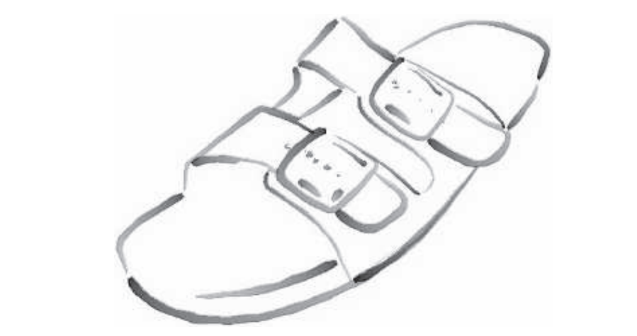

Cole和Finkelstein \[282]提出了一种计算边缘集合可见性的方法。他们将每个线段存储为两个世界空间中的坐标值。然后会使用一系列的pass，在整个片段集合上运行一个像素着色器，裁剪并确定每个片段的像素长度，为每个潜在的像素位置都创建一个图集并确定其可见性，最后再使用这个图集来创建可见的笔触。虽然这个算法比较复杂，但是在GPU上的处理速度相对较快，并且能够提供一系列可见的笔触，并且这些笔触的开始位置和结束位置都是已知的。

这种风格化处理，通常包括将一个或者多个预先制作的纹理应用于线条四边形上。Rougier \[1516]讨论了一种不同的方法，可以程序化地渲染虚线图案。每个线段在渲染的时候都会访问一个纹理，这个纹理存储了所需的所有虚线图案。每个图案都会被编码为一组命令，它指定了虚线的图案以及所使用的结束（endcap）类型和连接（join）类型。通过使用四边形的纹理坐标，每个图案都会在着色器中进行一系列测试，从而确定线条在四边形中的每个点具体覆盖了多少像素。

确定contour边缘，将它们连接成连续的链（chain），然后确定每个链的可见性并形成笔触，这个过程是很难完全并行化处理的。在生成高质量风格化线条的时候，还存在另一个问题，即下一帧的每个笔触都将被重新绘制，这些笔触可能会发生长度的改变，或者是首次出现。Benard等人\[130]对各种渲染方法进行了调研，这些方法为沿边缘的笔触以及表面上的图案提供了时域一致性。有关边缘和笔触的问题，目前还没有被完全解决，并且其中可能会涉及到一些计算，因此对其的研究仍在继续\[131]。

## 15.3 笔触表面风格化

虽然卡通渲染是一种十分流行的画面风格，但是还有很多很多种（理论上无限多种）其他的风格可以应用在表面上。这些效果的范围十分广泛，从对真实感纹理进行修改\[905, 969, 973]，再到让算法程序化地生成帧与帧之间的几何装饰（geometric ornamentation）\[853, 1126]。在本小节中，我们将简要介绍与实时渲染相关的技术。

Lake等人\[966]讨论了使用漫反射着色项来选择在表面上使用的纹理。当漫反射项变暗时，则使用具有深色效果的纹理。这个纹理可以使用屏幕空间坐标进行应用，从而提供一种手绘风格的效果。为了进一步增强这种素描（sketched）外观，还可以将一个纸张纹理应用于屏幕空间的所有表面上，如图15.20所示。这类算法存在一个主要问题，即淋浴门效应（shower door effect），这种效应指的是在动画过程中，场景中的物体看起来就好像是通过压花玻璃（patterned glass）进行观察的一样，会给人一种物体在纹理中游泳一样的感觉。Breslav等人\[196]通过确定哪些图像变换与底层模型的位置运动最为匹配，从而来维护一个纹理的二维查找。这样做可以保持与基于屏幕填充模式的联系，同时与场景中的物体建立更强的联系。

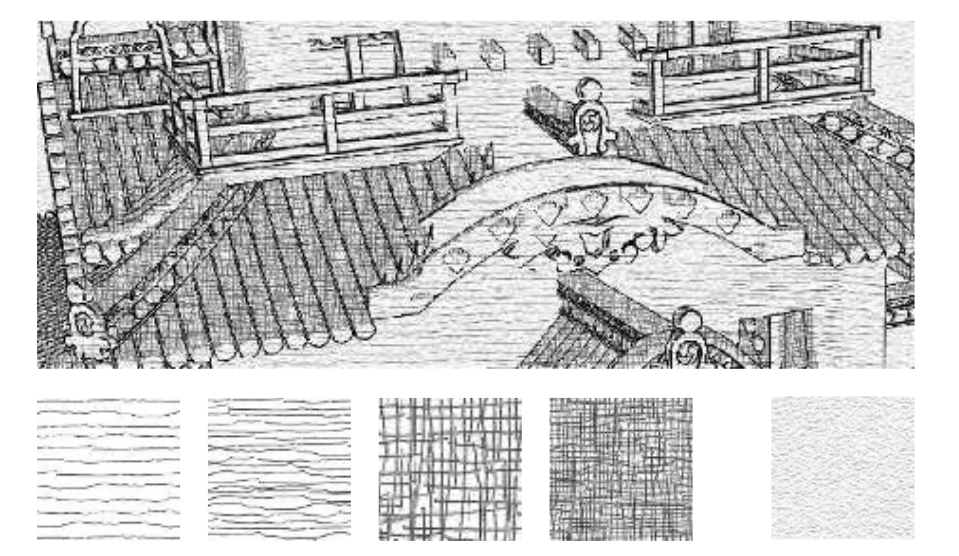

一个显而易见的解决方案是：直接在物体表面上应用这些纹理。这样做的挑战在于，这些基于笔触的纹理（stroke-based texture）需要保持相对均匀的笔触粗细和笔触密度，才能看起来令人信服。如果这个纹理被放大了，那么笔触就会显得太粗；如果这个纹理被缩小了，那么笔触要么会变得很模糊，要么会变得很细并且会出现噪声（这取决于是否使用了mipmap）。Praun等人\[1442]提出了一种实时生成笔触纹理mipmap的方法，并以一种平滑的方式将其应用在表面上。这样做可以在物体距离发生变化的时候，依然保持屏幕上的笔触密度。

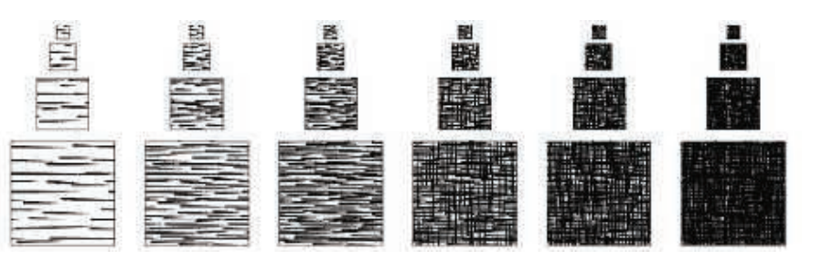

这个方法的第一步是构建这些需要使用的纹理，它们被称为色调艺术贴图（tonal art map，TAM）。这是通过在mipmap层次中绘制笔触来实现的，如图15.21所示。Klein等人\[905]在他们的“艺术贴图（art map）”中使用了一个类似的想法，来维持NPR纹理的笔触大小。有了这些纹理贴图，模型就可以通过在每个顶点上，对所需的色调贴图之间进行插值，从而完成笔触渲染。这种技术所生成的图像，更加具有手绘的感觉\[1441]，如图15.22所示。

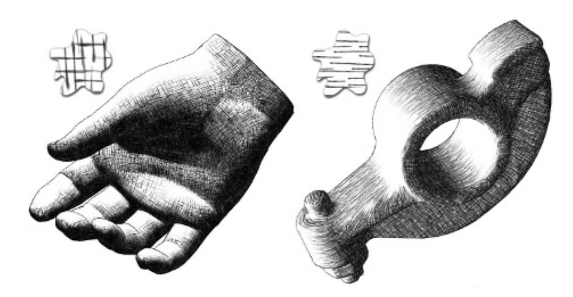

Webb等人\[1858]提出了两种对TAM进行扩展的方法，它们可以提供更好的结果。第一种使用了一个体积纹理，并且允许使用颜色；第二种使用了一个阈值方案，可以改善抗锯齿效果。Nuebel \[1291]给出了一种相关的木炭渲染方法，他所使用的噪声纹理也会沿着其中一个轴从暗变到亮。在渲染过程中，会使用强度值来沿着这个轴对纹理进行访问。Lee等人\[1009]使用TAM和其他技术，生成了令人印象深刻的图像，这些图像看起来就像是由铅笔绘制的一样。

关于笔触渲染，除了上面已经讨论过的技术之外，还有许多其他可能的技术。为了获得素描效果，可以让边缘发生抖动\[317, 972, 1009]，或者超过它们的原始位置，如图15.1中右上部分和中下部分所示。

Girshick等人\[538]讨论了沿曲面上的主曲线方向线（principal curve direction line）来绘制笔触。这里的主曲线方向线，指的是从表面上的任何一个点，都存在一个指向最大曲率的第一主方向（first principal direction）切向量。第二主方向（second principal direction）则是一个垂直于第一主方向的切向量，这个方向是指向了曲面曲率最小的方向。这些方向线对于曲面的感知而言十分很重要。它们还具有这样一个优点，即只需要为静态模型生成一次即可，因为这种类型的笔触与光照和着色无关。Hertzmann和Zorin \[726]讨论了如何对主方向进行整理（clean up）和平滑。已经有大量的研究和开发工作，对如何使用这些方向以及其他应用在任意表面上的纹理数据进行了探索，例如驾驶模拟动画和其他的一些应用。相关读者可以参考Vaxman等人\[1814]的报告。

嫁接（graftal）是指，可以将几何形状或者贴花纹理根据需要添加到表面上，从而产生特定的效果\[372, 853, 1126]。它们可以通过所需的细节水平、表面相对于眼睛的方向，或者其他的因素来进行控制。这些方法也可以用来模拟钢笔或者画笔的笔触。图15.23展示了这样的一个例子。几何嫁接是程序化建模的一种形式\[407]。

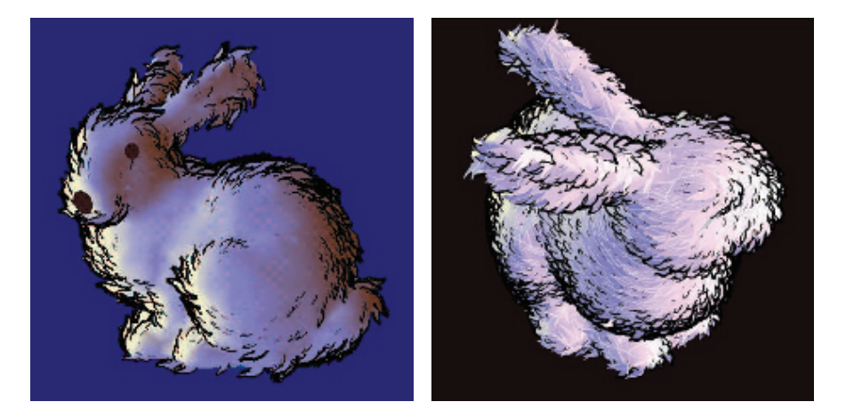

本章节中只涉及了NPR研究中的几个方向。有关更多更详细的信息，请参阅本章节最后的“补充阅读和参考资料”部分。NPR领域中通常并不存在潜在的物理正确答案，因此我们也没有一个ground-truth的结果来进行参照。这既是一个问题，同时也是一种解放。各种技术在执行速度、渲染质量以及实现成本之间进行权衡。在交互渲染速率的严格时间限制下，大多数解决方案都会在一定条件下发生扭曲（bend）和失效（break）。根据应用程序中的实际需求来确定具体使用哪种表现良好的方案，是使得该领域成为一个迷人挑战的原因之一。

我们将大部分的注意力都集中在了一个特定的主题上，即contour边缘的检测和渲染。最后，我们将把注意力转向线条和文本的渲染。这两种非真实感的图元会被经常使用，同时它们在实现上也有着一些自己的独特挑战，因此值得单独进行介绍。

## 15.4 线条

渲染简单的实体“硬”线条，通常被认为是相对无聊的。然而，它们在CAD等领域中十分重要，可以用于查看底层模型的面片、或者用于识别物体的形状。它们在高亮显示选中物体和技术说明等领域中也非常有用。此外，其中所涉及的一些技术也同样适用于解决其他问题。

### **15.4.1**渲染**三角形边缘**

在实心三角形的上面正确渲染三角形的边缘，要比直接渲染这些三角形本身困难得多。如果一条边缘线条的位置与三角形的位置完全相同，那么我们如何确保这条线总是会在三角形前面被渲染呢？一个简单的解决方案是在渲染线条的时候，使用一个固定的偏移量\[724]。也就是说，每条线在被渲染的时候，都要比实际距离更近一些，这样它就会位于表面前方。如果这个固定的偏移量过大，那么本来应当被隐藏的部分边缘可能会出现在表面前方，从而破坏了我们想要的效果。但是如果这个偏移量太小，那么靠近这条边缘的三角形曲面可能会遮挡部分甚至是全部的线条。如章节15.2.2中所述，调用诸如OpenGL的$\mathrm{glPolygonOffset}$API，可以根据线条的斜率，将表面向后进行移动。这种方法相当有效，但它并不是完美的。

Herrell等人\[724]的解决方案完全避免了使用偏移量。该方法使用了一系列步骤来对一个模板缓冲区进行标记和清除，以便能够在三角形上正确地渲染边缘。但是这种方法只适用于最小的三角形集合，因为每个三角形都必须单独进行绘制，并且对于每个三角形，都要清除模板缓冲区，这使得处理过程非常耗时。

Bærentzen等人\[86, 1295]提出了一种方法，它可以很好地映射到GPU上。该方法使用了一个像素着色器，使用三角形的重心坐标（barycentric coordinate）来确定到最近边缘的距离。如果该像素接近一个边缘，那么会使用边缘颜色来对其进行着色。以这种方式渲染的边缘，其粗细程度可以是任何想要的值，可以让其受到距离的影响，也可以让其保持恒定，如图15.24所示。这种方法最主要的缺点在于，contour边缘的粗细程度只有内部线条的一半，因为每个三角形都只会负责渲染一半宽度的线条，因此内部线条会更粗。但是在实践中，这种不匹配现象通常不会太明显。

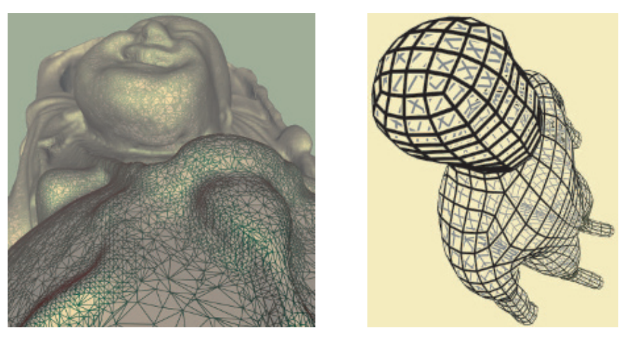

Celes和Abraham \[242]对这一想法进行了扩展和简化，并对之前的工作进行了全面的总结。他们的想法是为每个三角形边缘都使用一个一维的纹理坐标集合，其中$1.0$代表定义边缘的两个顶点，$0.0$代表三角形的另一个顶点。他们使用纹理映射和mipmap链来提供恒定宽度的边缘。这种方法易于编码，并且能够提供一些实用的控制手段。例如：可以设置线条的最大密度，这使得网格密集的区域不会完全被边缘填充，因此不会变成纯色。

### 15.4.2 渲染遮挡线条

在正常的线框图中，我们并不会渲染三角形表面，模型中所有的边缘都是可见的。为了避免渲染那些被表面遮挡的线条，会将所有实心三角形都渲染到z-buffer中，然后再正常地绘制边缘\[1192]。如果我们无法在渲染所有线条之前，首先渲染所有表面，那么也有一个成本稍高的解决方案，即使用与背景颜色相匹配的纯色来渲染这些表面。

在渲染这些线条的时候，也可以对其进行部分遮挡模糊（obscured），而不是完全将它们隐藏。例如：这些被遮挡的线条可以渲染为浅灰色，而不是根本不渲染。可以通过适当设置z-buffer的状态来实现这一点。首先像之前一样，将实心三角形渲染到z-buffer中，然后正常渲染一遍线条，最后再反转z-buffer的意义，即只绘制那些超出当前像素z-depth的线条，同时关闭对z-buffer的修改，这样渲染出来的线条就不会修改任何已有的深度值。然后再使用一种遮挡模糊的风格来重新绘制这些被遮挡的线条。对于风格化版本的线条而言，则可以使用一个完全移除遮挡线条的过程\[282]。

### **15.4.3 光晕**

当两条线相交的时候，通常的惯例是擦掉一部分较远的线条，从而使得线条之间的前后顺序更加明显。这个操作可以相对容易地完成，只想要把每条线绘制两次即可，并在其中一次绘制一个光晕（holo）\[1192]。这个方法可以通过绘制背景颜色来消除线条之间的重叠部分。首先，将所有的线条都渲染到z-buffer中，并将每条线表示为一个代表光晕的粗四边形。可以使用一个几何着色器来帮助创建这样的四边形。然后，使用正常的颜色来绘制出每个线条。被z-buffer遮挡的区域将会隐藏在其背后绘制的线条。同时必须使用一个偏移量或者其他方法，来确保每条细黑线都位于这个粗z-buffer四边形的上面。

相交于顶点的线条可能会被相互竞争的光晕部分隐藏。可以缩小这些代表光晕的四边形，但是可能会导致其他一些瑕疵。Bærentzen等人\[86, 1295]的线条渲染技术也可以用于实现光晕，如图15.24所示。光晕是逐三角形生成的，因此不会出现相互干扰的问题。另一种方法则是使用图像后处理（章节15.2.3）来检测和绘制光晕。

有关我们这里所讨论的几种不同的线条渲染方法，结果在图15.25中进行了展示。

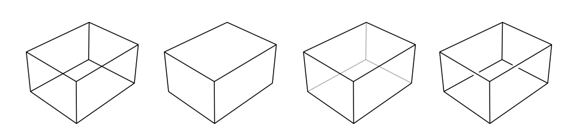

## 15.5 文本渲染

鉴于文本阅读对于文明而言具有重要的意义，因此人们花费了大量的精力来对其进行渲染。与许多其他对象不同的是，文本中单个像素的变化就可以产生显著的差异，例如将“l”变成“1”。本小节对用于文本渲染的主要算法进行了总结。

人眼对于亮度差异的感知，要比对颜色差异的感知更加敏感。这一事实至少从Apple II时代起\[527]，就被用于提高感知的空间分辨率。基于这个想法的一个应用程序是微软的ClearType技术，该技术建立在液晶显示器（liquid-crystal display，LCD）的一个特性之上。LCD显示器上的每个像素都由三个垂直的彩色矩形所组成，即红色、绿色和蓝色。在一个LCD显示器上使用放大镜进行观察，我们可以看到这些微小的彩色像素矩形。在不考虑这些亚像素矩形颜色的前提下，这种配置方式所能提供的水平分辨率是屏幕水平像素的三倍。使用不同的着色来填充不同的亚像素，这种技术因此被称为亚像素渲染（subpixel rendering）。人眼会将这些颜色混合在一起，使得红色条纹和蓝色条纹变得无法察觉，如图15.26所示。这项技术于1998年首次公布，该技术对大型的、低DPI的LCD显示器具有很大的帮助。微软在Word 2013中停止使用了ClearType技术，显然是因为混合不同背景颜色的文本存在一些问题。Excel、各种网络浏览器、Adobe的CoolType、苹果的Quartz 2D以及FreeType和SubLCD等库，都使用了这项技术。Shemanarev的一篇古老文章\[1618]对这种方法的各种微妙之处和存在的问题进行了全面介绍。

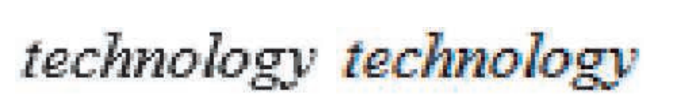

这项技术是一个很好的例子，说明了人们在清晰地渲染文本上花费了多少精力。字体（font）中的字符（character）被称为字形（glyph），它通常是由一系列线段以及二次或者三次Bezier曲线进行描述的，图17.9展示了这样的一个例子。所有字体渲染系统的工作原理，都是确定这些字形会对其重叠的像素产生怎样的影响。FreeType和Anti-Grain Geometry等库的工作原理，是通过为每个字形都生成一个很小的纹理，并在需要的时候重复使用它们。对于不同大小的字体，不同强调的字体（emphasis，即斜体或粗体）都会生成相应的纹理。

这些系统会假设每个纹理都是像素对齐的，即每个像素都只包含一个纹素，就像通常的文档一样。但是当文本应用于三维表面的时候，这个假设可能就不再成立了。使用一个包含一组字形的纹理是一种简单而流行的方法，但是这种方法也有一些潜在的缺点。虽然应用程序可能仍然会对齐文本，使其面对观察者，但是缩放和旋转将会使得每个像素占据一个纹素的假设不再成立。即使是进行了屏幕对齐，字体微调（font hinting）也可能不会被考虑在内。这里的微调是指对字形轮廓进行调整，使其与像素单元格相匹配的过程。例如，字符“I”的纵轴宽度为一个纹素，它最好被渲染为覆盖一列像素，而不是覆盖相邻两列像素的一半宽度，如图15.27所示。所有这些因素都意味着，使用一个光栅纹理可能会导致显示模糊或者锯齿问题。Rougier \[1515]全面介绍了纹理生成算法所涉及到的问题，并展示了如何在基于OpenGL的字形渲染系统中使用来自FreeType的微调。

![图15.27：Verdana字体的渲染结果，第一行没有使用微调，第二行使用了微调。 \[1515\]](images/Chapter-15/202309042120787.png "图15.27：Verdana字体的渲染结果，第一行没有使用微调，第二行使用了微调。 \[1515]")

Pathfinder库\[1834]是一个使用GPU来生成字形的最近成果。它具有较低的设置时间和最小的内存开销，其性能要优于竞争对手基于CPU的字体渲染引擎。它使用曲面细分和计算着色器来生成和汇总每个像素上的曲线效果，并在性能较差的GPU上退回到使用几何着色器和OpenCL。与FreeType一样，这些字形也会被缓存和重复使用。它具有高质量的抗锯齿效果，再加上如今高分辨率显示器的广泛使用，使得微调技术几乎要过时了。

将文本应用于不同大小和方向的任意表面，可以在不需要复杂GPU支持的情况下完成，同时仍然能够提供较为合理的抗锯齿效果。Green \[580]提出了这样的一个系统，即Valve首次在《军团要塞2》中所使用的系统。该算法使用了Frisken等人\[495]提出的采样距离场（sampled distance field）数据结构。即纹理中的每个纹素，都保存了到字形最近边缘的带符号距离。这个距离场试图在纹理描述中对每个字形的精确边界进行编码。然后，使用双线性插值来给出该字母在每个样本上对alpha覆盖率的一个良好近似。图15.28展示了这样的一个例子。字符中的尖角在被双线性插值的时候可能会被平滑，这个问题可以通过在四个独立通道中编码更多的距离值来进行解决\[263]。这种方法有一个局限性，即创建这些符号距离纹理是非常耗时的，因此需要进行预先计算并将结果存储下来。尽管如此，不少字体渲染库都是基于这种技术进行构建的\[1440]，并且它们能够很好地适应移动设备\[3]。Reshetov和Luebke \[1485]总结了这些方面的工作，并给出了他们自己的方案，即在放大过程中调整样本的纹理坐标。

![图15.28：矢量纹理。左侧：字母“g”使用符号距离场来进行表达 \[3\] 。右侧：这个“no trespassing”的标志根据距离场来进行渲染的。通过将特定的距离范围映射到轮廓颜色上，可以在文本周围添加轮廓效果 \[580\] 。](images/Chapter-15/202309042132075.png "图15.28：矢量纹理。左侧：字母“g”使用符号距离场来进行表达 \[3] 。右侧：这个“no trespassing”的标志根据距离场来进行渲染的。通过将特定的距离范围映射到轮廓颜色上，可以在文本周围添加轮廓效果 \[580] 。")

即使没有缩放问题和旋转问题，使用中文字符的字体也可能需要数千个甚至更多的字形。一个高质量的大号字符需要使用更大的纹理来进行表示。如果以一定的角度来观察字形，则可能需要对纹理进行各向异性过滤。直接从边缘描述和曲线描述中来渲染字形，可以避免使用一个巨大的纹理，同时还可以避免来自采样网格的瑕疵。Loop-Blinn方法\[1068, 1069]使用一个像素着色器来直接计算Bezier曲线，我们将在章节17.1.2中对此进行讨论。这种技术需要一个曲面细分步骤，这在加载的时候可能会有很大的开销。Dobbie \[360]通过为每个字符的包围盒都绘制一个矩形，并在一个pass中计算所有字形的轮廓来避免这个问题。Lengyel \[1028]提供了一个健壮的评估器，它可以判断一个点是否位于字形内部，这对于避免瑕疵而言至关重要。他还讨论了一些有关计算的优化，以及一些效果的实现，例如：发光（glow）、阴影和多种颜色（这可以用于表情符号emojy）。

## 补充阅读和资源

有关非真实感渲染和卡通渲染的灵感，请阅读斯Scott McCloud的《Understanding Comics》一书\[1157]。从研究人员的角度来看，阅读Hertzmann有关使用NPR技术的论文\[728]，有助于建立关于艺术和插图的科学理论。

《Advanced Graphics Programming Using OpenGL》这本书\[1192]，尽管是在固定功能硬件的时代撰写的，但是在广泛的技术插图和科学可视化技术上，具有值得一读的章节。虽然也有些过时，但是Gooches \[563]和Strothotte \[1719]的书，都是NPR算法的良好起点。Isenberg等人\[799]和Hertzmann \[727]提供了有关contour边缘和笔触渲染技术的调研。Rusinkiewicz等人\[1521]在SIGGRAPH 2008的课程讲座中，也详细研究了笔触渲染技术，其中包含了一些比较新的工作。Benard等人\[130]对帧与帧之间的一致性算法进行了调研。对于一些艺术化的图像处理效果，我们建议感兴趣的读者参考Kyprianidis等人\[949]的综述。国际非真实感动画与渲染学术会议（International Symposium on Non-Photorealistic Animation and Rendering，NPAR）的论文集，对该领域中的研究进行了综述。

Mitchell等人\[1223]提供了案例研究，其中关于工程师和艺术家如何进行合作，来为游戏《军团要塞2》赋予独特的画面风格。Shodhan和Willmott \[1632]讨论了游戏《孢子》中的后处理系统，包括油画效果、旧胶片效果以及其他一些效果的像素着色器实现。SIGGRAPH 2010课程“Stylized Rendering in Games”是另一个十分具有价值的实际例子。特别地，Thibault和Cavanaugh \[1761]展示了《无主之地》艺术风格的演变，并对这一过程中所面临的技术挑战进行了介绍和描述。Evans的演讲\[446]是一个迷人的探索，其中包含了用于实现特定介质风格的广泛渲染技术和建模技术。

Pranckevicius \[1440]提供了一个有关文本渲染加速技术的调研，并提供了额外的资源链接。
