# Chapter 16 Polygonal Techniques 多边形技术

## 目录

-   [16.1 三维数据的来源](#161-三维数据的来源)
-   [16.2 曲面细分和三角形划分](#162-曲面细分和三角形划分)
    -   [16.2.1 着色问题](#1621-着色问题)
    -   [16.2.2 边界开裂和T顶点](#1622-边界开裂和T顶点)
-   [16.3 整合](#163-整合)
    -   [16.3.1 合并](#1631-合并)
    -   [16.3.2 定向](#1632-定向)
    -   [16.3.3 实体性](#1633-实体性)
    -   [16.3.4 法线平滑和折痕边缘](#1634-法线平滑和折痕边缘)
-   [16.4 三角形扇，三角形带和三角形网格](#164-三角形扇三角形带和三角形网格)
    -   [16.4.1 三角形扇](#1641-三角形扇)
    -   [16.4.1 三角形带](#1641-三角形带)
    -   [16.4.3 三角形网格](#1643-三角形网格)
    -   [16.4.4 缓存无关的网格布局](#1644-缓存无关的网格布局)
    -   [16.4.5 顶点和索引缓冲区/数组](#1645-顶点和索引缓冲区数组)
-   [16.5 简化](#165-简化)
    -   [16.5.1 动态简化](#1651-动态简化)
-   [16.6 压缩和精度](#166-压缩和精度)
-   [补充阅读和资源](#补充阅读和资源)

> Leopold Crelle——“It is indeed wonderful that so simple a fifigure as the triangle is so inexhaustible.”

> 利奥波德·克雷尔——“像三角形这样简单的图形竟如此取之不尽，这的确令人惊奇。”（德国数学家；1780—1855）

到目前为止，我们在进行渲染之前，都会默认假设这些等待渲染的模型正好是我们所需要的格式，并且具有正确的细节。而在现实实践中我们很少会这么幸运，各种建模软件和数据捕获设备都有着自己独特的怪癖（quirk）和局限性，可能会导致数据集和渲染结果存在歧义和错误。不仅如此，通常我们还需要在存储大小、渲染效率和结果质量之间进行权衡。在本章节中，我们将讨论多边形数据集中可能会遇到的各种问题，以及对这些问题的修复和解决方法。然后我们会介绍一些高效渲染和存储多边形模型的技术。

在交互式计算机图形学中，这种多边形表示方法的首要目标就是视觉精度和渲染速度。其中的“精度（accuracy）”是一个取决于上下文的术语。例如：一名工程师希望能够以交互速率来检修机器部件，并要求在任何时候都能看到物体上的每个斜面和倒角。相比之下，如果游戏的帧率足够高，那么某一帧中出现一些小错误或者不准确的地方是完全允许的，因为这些小错误可能并不会发生在当前玩家注意力集中的地方，同时这些小错误可能在下一帧中就消失了。在交互式图形学的相关工作中，了解这些待解决问题的边界条件是十分重要的，因为这些边界决定了可以使用什么类型的技术。

本章节中所涉及的内容包括曲面细分（tessellation）、整合（consolidation）、优化（optimization）、简化（simplification）和压缩（compression）。多边形可以有许多不同的表现形式，它们通常都会分割成更加容易处理的图元，例如三角形或者四边形。这个过程被称为三角形划分（triangulation），或者更一般地说，被称为曲面细分（tessellation）。

> 单词“Tessellation”中包含两个“l”，它可能是计算机图形学中最常拼错的单词；紧接着的是“frustum”。

整合（consolidation）是计算机图形学中的术语，它包括将单独的多边形合并到一个网格结构中，以及派生出新的数据来用于表面着色，例如法线等。优化（optimization）是指对网格中的多边形数据进行排序，从而使渲染速度变得更快。简化（simplification）是指删除一个网格中的不重要特征。压缩（compression）则关心的是用于描述网格信息的各种元素所需要的存储空间，并致力于最小化这个存储空间。

三角形划分确保了给定的网格描述能够被正确显示。合并进一步改善了数据的显示，并且可以通过允许共享计算和减少内存开销来提高速度。优化技术可以进一步提高处理速度。简化可以通过删除不需要的三角形来提高速度。压缩可用于进一步降低整体的内存占用，进而通过减少内存开销和总线带宽来提高速度。

## 16.1 三维数据的来源

通常有以下几种方法可以创建或者生成多边形模型：

-   直接将信息写入几何描述文件。
-   编写一些程序来生成这样的数据，这称为程序化建模（procedural modeling）。
-   将其他形式的数据转换为表面数据或者体积数据。例如：将蛋白质数据转换为一组球体和圆柱体。
-   使用建模软件构建或者雕刻出一个物体模型。
-   对某个物体进行拍照，使用一张或者多张照片来重建表面信息，这被称为摄影测量（photogrammetry）。
-   使用三维扫描仪、数字化仪（digitizer）或者其他传感设备，在不同的点上对真实世界中的模型进行采样。
-   在某些空间体积中生成表示相同值的等值面，例如来自CAT或者MRI的医学扫描数据，或者是在大气中测得的压力数据和温度数据。
-   对上述这些技术进行组合使用，从而生成多边形模型数据。

在建模软件的领域中，有两种主要类型的建模软件：基于实体的和基于表面的。基于实体的建模软件通常出现在计算机辅助设计（CAD）领域中，并且通常会着重于构建与实际加工过程相对应的建模工具，例如切割、钻孔和刨削等。在这些建模软件内部有一个计算引擎，用于严格操作物体的底层拓扑边界。为了进行显示和分析，这些建模软件都具有faceter，faceter是一种软件，它可以将内部的模型表示转换为可以显示的三角形。例如：数据库中的球体可以通过一个中心点和一个半径进行表示，而faceter则可以将其转换为任意数量的三角形或者四边形表示。有时候，最好的渲染加速方法其实就是最简单的：在使用faceter的时候，适当降低所需的视觉精度，可以减少需要生成的三角形数量，从而提高渲染速度并节省存储空间。

在CAD工作中有一个重要的考虑因素，即所使用的faceter是否是为图形渲染而设计的。例如：用于有限元方法（fifinite element method，FEM）的faceter，其目的是将表面分割成几乎具有相同面积的三角形。这样的细分过程很适合进行三角形简化，因为它们包含了许多在图形中用不到的数据。类似地，有一些faceter所生成的三角形集合非常适合用于3D打印，从而生成一个现实世界中的物体，但是这种三角形数据缺少顶点法线，因此不适合用于快速的图形显示。

类似Blender或者Maya这样的建模软件，并不是基于实体构建的。相反，物体会使用各自的表面进行定义。与基于实体的建模软件一样，这些基于表面的系统可以使用一些内部表示和faceter来显示物体，例如样条线或者细分表面（subdivision surface，详见第17章）。这些建模软件允许用户直接对表面进行操作，例如添加或者删除三角形、顶点等；同时，用户还可以手动降低模型的三角形数量。

还有一些其他类型的建模软件，例如基于隐式曲面的建模系统（包括“blobby”metaball）\[67, 558]，它们还会使用一些诸如混合、权重和场（field）等概念。这些建模软件可以根据某个函数的解来生成表面数据，例如$f(x, y, z) = 0$。然后再使用诸如移动立方体（marching cube）之类的多边形化技术，来创建用于显示的三角形集合（章节17.3）。

点云数据是简化技术的有力候选者，即点云数据可以通过应用简化技术来进行优化。点云中的数据往往会以固定的间隔进行采样，因此其中的很多样本点对于形成表面的视觉感知作用很小，这些样本的影响可以忽略不计。相关的研究人员花了几十年的时间来研究对缺陷数据的过滤，以及从点云数据中重建出多边形网格的技术\[137]。章节13.9中包含了这个话题的更多内容。

对于从扫描数据中生成的网格，可以执行任意数量的清洗（cleanup）操作或者是其他高阶操作（higher-order operation）。例如：分割技术（segmentation technique）尝试对一个多边形模型进行分析，并试图识别出单独的、可分离的部分\[1612]。这样做有助于创建动画、应用纹理贴图、匹配形状以及其他操作等。

还有许多其他方法可以生成用于表面的多边形数据。这个过程中最关键的是要理解数据是如何进行创建的，以及是为了实现什么目的而创建的。通常，这些数据并不是专门为了高效的图形显示而生成的。此外，还存在许多不同的三维数据文件格式，任意两种格式之间的转换通常并不是无损的。理解这些输入数据可能遇到的限制和问题，是本章节中的重要主题。

## 16.2 曲面细分和三角形划分

曲面细分（tessellation）是将一个表面分割为一组多边形的过程。这里我们将专注于多边形表面的细分，有关曲面的细分将在章节17.6中进行讨论。进行多边形曲面细分的原因有很多，其中最常见的理由就是，所有的图形API和图形硬件都针对三角形进行了特殊优化，三角形的效率很高。三角形就像是现实世界中的原子一样，它们可以表示任何表面并进行渲染。将一个复杂的多边形转换为三角形的过程被称为三角形划分（triangulation）。

在对多边形进行细分的时候，有几个可能的细分目标，例如：我们想要使用的一种算法，它只能处理凸多边形，这种曲面细分被称为凸分割（convex partitioning）。还有一些其他的目标，比如我们想要使用一些全局光照算法，该算法要求在模型顶点上存储阴影效果或者相互反射效果，这个时候我们可能需要对表面进行细分（网格化）\[400]。图16.1中展示了不同类型的曲面细分。还有一些非图形的曲面细分原因，例如我们要求每个三角形的面积不能大于某个给定的值，或者是三角形的内角不能太小，要大于某个最小角度。一种被称为Delaunay的三角形划分方式，要求在每个三角形顶点上都放置一个具有一定半径的圆，这个圆内部不能包含任何其他的任何顶点，这样做可以使得三角形的最小内角最大化。虽然这些限制通常是针对于非图形应用的（例如有限元分析），但是它们也可以用于改进表面的外观。在渲染中，我们也需要尽量避免出现细长的三角形，因为在对远处顶点进行插值的时候，它们可能会造成瑕疵。同时，这种细长三角形的光栅化效率也很低\[530]。

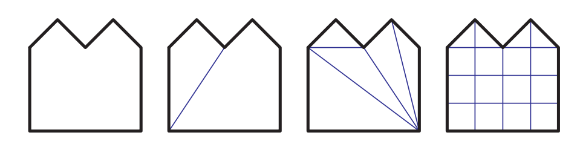

大多数曲面细分算法都在二维平面中进行工作，它们会假设多边形中的所有点都在位于同一个平面上。然而，一些模型生成系统可能会生成严重扭曲的非平面多边形，这个问题有一个十分常见的例子，即从侧面观察的弯曲四边形，这可能会形成所谓的沙漏四边形（hourglass）或者领结四边形（bowtie），如图16.2所示。虽然这种特定的多边形可以通过创建一条对角线来实现三角形化，但是一些更加复杂的弯曲多边形就不那么容易进行控制了。

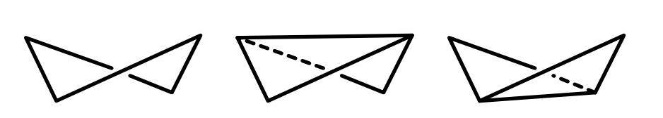

当可能出现扭曲多边形的时候，一个快速的纠正操作是将顶点投影到一个平面上，这个平面垂直于多边形的近似法线。这个平面的法线通常是通过计算三个正交平面（$xy$，$xz$，$yz$）上的投影面积得到的。也就是说，直接去掉$x$坐标，得到的多边形在$yz$平面上的面积，就是新的$x$分量；同理，在$xz$平面上的面积是$y$分量，在$xy$平面上的面积是$z$分量。这种计算平均法线的方法被称为Newell公式\[1505, 1738]。

投影到这个平面上的多边形可能仍然会出现自相交问题，即该多边形的两条边或者多条边会相互交叉。这时候就需要一些更加复杂、成本更高的计算方法了。Zou等人\[1978]对之前基于最小化表面积、或者最小化二面角的曲面细分工作进行了讨论，并提出了在一个集合中优化若干非平面多边形的算法。

Schneider和Eberly \[1574]、Held \[714]、O'Rourke \[1339]和de Berg等人\[135]，都对各种三角形划分方法进行了综述。其中最基本的三角形划分算法，是对多边形上任意两点之间的线段进行检查，看看它们是否会与多边形的任何边相交或者重叠。如果这条线段会发生相交或者重叠的话，那么它就不能用来对多边形进行分割，此时我们需要检查下一个可能的点对。如果这条线段满足要求的话，则使用它来将多边形一分为二；并重复使用相同的方法，对新生成的多边形继续进行三角形划分。这种方法的效率很低，其时间复杂度为$O(n^3)$。

一种更加高效的方法是耳切法（ear clipping），其时间复杂度为$O(n^2)$。首先，使用一个pass来对多边形进行遍历，从而找到耳结构，即查看所有顶点索引为$i$，$(i + 1)$，$(i + 2)$（模$n$）的三角形，并检查线段$i,(i + 2)$是否满足与任何多边形边都不相交。如果确实不相交的话，则三角形$(i + 1)$就构成了一个耳结构，如图16.3所示。每个符合要求的耳结构会依次从多边形中移除，并对顶点$i$和$(i + 2)$处的三角形进行重新检查，看看它们现在是否构成了耳结构。最终，多边形中的所有耳结构都会被移除，这个多边形也就被成功三角形化了。还有一些更加复杂的三角形划分方法，其时间复杂度为$O(n \log n)$，甚至某些方法在一些特殊情况下，时间复杂度可以达到$O(n)$。Schneider和Eberly给出了耳切法\[1574]以及其他快速三角形划分方法的伪代码。

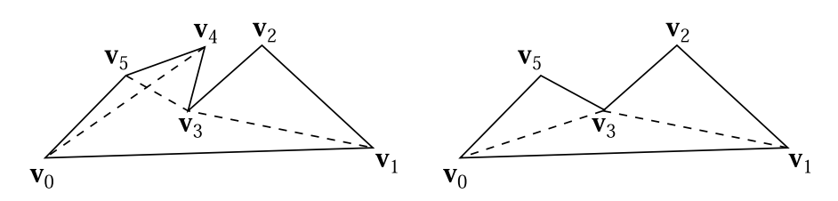

与三角形划分相比，将多边形划分为凸区域（convex region）在存储和进一步的计算成本方面都更加高效。Schorn和Fisher \[1576]给出了一个代码的健壮性测试。凸多边形（convex polygon）可以很容易地实用扇形三角形或者条状三角形进行表示，这个话题将在章节16.4中进行讨论。还有一些凹多边形（concave polygon）也可以被表示为扇形，这种多边形被称为星形（star-shaped），但是想要检测这种类型的多边形需要进行更多的工作\[1339, 1444]。Schneider和Eberly \[1574]给出了两种凸多边形划分方法，其中一种是快速但dirty的方法，另一种则是最优方法。

多边形并不总是由单一的轮廓所构成，图16.4展示了一个由三个轮廓（outline，也称为loop或者contour）所构成的多边形。这种形式的多边形总是可以通过在环之间生成连接边（也称为锁孔边keyholed或者桥接边bridge edge），来将其转换为一个单轮廓的多边形。Eberly \[403]讨论了如何找到定义这些边缘的可见顶点。这个转换过程也可以反过来，在多边形中检索单独的环结构。

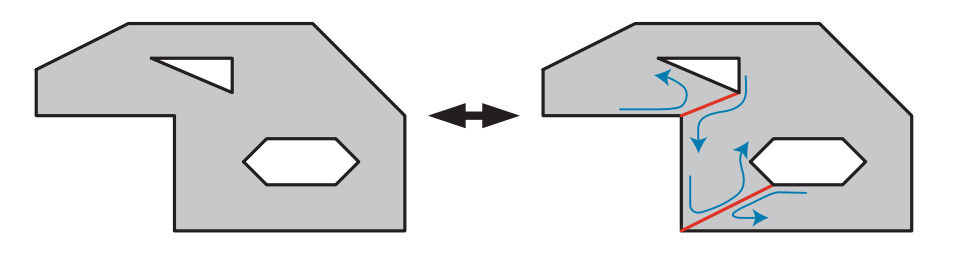

编写一个健壮且通用的三角形划分器（triangulator）是一项艰巨的任务。总是会出现各种各样微妙的bug、病态的特例、以及一些精度问题，这导致很难编写万无一失的代码。解决三角形划分问题的一种方法是，直接使用图形加速器本身来渲染这些复杂的多边形。这个多边形被作为一个三角形扇（triangle fan）渲染到模板缓冲区中。通过这样做，需要被填充的区域会被绘制奇数次，而凹区域和孔洞则会被绘制偶数次。通过对模板缓冲区使用反转模式，在第一个pass结束的时候仅会对填充区域进行标记，如图16.5所示。而在第二个pass中，这个三角形扇形会被再次渲染，并通过使用模板缓冲区，只允许对填充区域进行绘制。通过对每个环形成的三角形进行绘制，这个方法甚至可以用于渲染具有多个轮廓的多边形。这个巧妙方法主要缺点在于，每个多边形都必须使用两个pass来进行渲染，并且每一帧都要清空模板缓冲区，而且无法直接使用深度缓冲。这个技术可以用于显示某些用户的交互，例如用户选择了一块复杂的区域，可以使用这个方法来动态绘制这个复杂区域的内部。

![图16.5：通过光栅化来完成三角形划分，使用奇偶校验（odd/even parity）判断哪些区域是可见的。最左边的多边形，从顶点0开始，会被作为三个三角形扇绘制到模板缓冲区中。在第二幅图中，第一个三角形 \[0,1,2\] 填充其覆盖区域，这个区域内还包括了位于多边形外部的空间。在第三幅图中，三角形 \[0,2,3\] 填充其覆盖区域，此时将区域A和区域B的奇偶性更改为偶数次绘制，从而使其变为空，即擦除。在第四幅图中，三角形 \[0,3,4\] 填充了多边形的剩余部分。](images/Chapter-16/202309052040858.png "图16.5：通过光栅化来完成三角形划分，使用奇偶校验（odd/even parity）判断哪些区域是可见的。最左边的多边形，从顶点0开始，会被作为三个三角形扇绘制到模板缓冲区中。在第二幅图中，第一个三角形 \[0,1,2] 填充其覆盖区域，这个区域内还包括了位于多边形外部的空间。在第三幅图中，三角形 \[0,2,3] 填充其覆盖区域，此时将区域A和区域B的奇偶性更改为偶数次绘制，从而使其变为空，即擦除。在第四幅图中，三角形 \[0,3,4] 填充了多边形的剩余部分。")

### **16.2.1 着色问题**

有时网格数据会以四边形的形式给出，为了正确显示这些四边形网格，必须要先将其转换为三角形。偶尔会出现一些凹四边形，在这种情况下，只有一种方法可以对其进行三角形化。而在其他凸四边形的情况下，可以选择两条对角线中的任意一条来对四边形进行分割。稍微花一点时间来选择一个更好的对角线，有时候可以获得更好的视觉效果。

有几种不同的方法来决定如何对一个四边形进行分割，其中最关键的思想是最小化新边顶点之间的差异。对于那些顶点上没有额外数据的平面四边形，最好是选择较短的那条对角线。如果使用了一些简单的烘焙全局光照解决方案，会在顶点上存储一些颜色数据，那么此时应当选择颜色差异较小的那条对角线\[17]，如图16.6所示。这种将两个差异最小的对角连接起来的做法（会通过使用某种启发式方法进行确定），对于最小化画面瑕疵有一定的帮助。

有些时候，三角形可能无法很好地表达设计师的意图（intent）。此时如果将纹理应用到一个扭曲的四边形上，那么无论使用哪种对角线分割方法，都无法保留设计师原本的意图。也就是说，在非三角化的四边形上进行简单的水平插值，即从左侧边缘到右侧边缘进行插值，也会失败，图16.7展示了这个问题。之所以会出现这个问题，是因为应用在表面上的图像在显示的时候会被扭曲。一个三角形只有三个纹理坐标，因此它可以建立一个仿射变换（affine transformation），但是无法进行扭曲操作。在三角形上，一个基本的$(u, v)$纹理最多只能被剪切（shear），而无法被扭曲（warp）。Woo等人\[1901]对这个问题进行了更深入的讨论。针对这一问题，有以下几种可能的解决方案：

-   提前对纹理进行扭曲操作，并使用新的纹理坐标来将这个纹理重新应用到表面上。
-   将表面细分为更加精细的网格，但是这样只能缓解问题，无法解决问题。
-   使用投影纹理（projective texturing），在运行过程中对纹理进行动态扭曲\[691, 1470]。但是这样会使得表面上的纹理间距不均匀。
-   使用一个双线性映射方案\[691]。这可以通过在每个顶点上的增加额外的数据来进行实现。

虽然这种纹理扭曲现象听起来像是一种病态情况（pathological case），但是在某种程度上，每当要应用的纹理数据与底层四边形的比例不匹配时，就会发生这种情况；也就是说，几乎在任何弯曲表面上都会发生这种纹理扭曲现象。在圆锥体上会发生一个极端的情况，当一个圆锥体被纹理化和细分化（faceted）的时候，位于圆锥顶端的三角形顶点将会具有不同的法线。这些顶点法线并不会被相邻的三角形所共享，因此会出现着色不连续的情况\[647]。

### 16.2.2 边界开裂和T顶点

我们将在第17章中对曲面话题进行详细讨论，这些曲面通常会被细分成多边形网格进行渲染。这种曲面细分是通过沿着定义表面的样条曲线进行步进来完成的，会在步进的过程中计算顶点的位置信息和相应的法线信息。当我们使用一个简单的步进方法时，在样条曲面相交的地方可能会出现问题。在一条共享边界上，两侧曲面上的点需要相互重合，取决于不同模型的性质，有时候自然而然就会发生这种我们想要的情况；但是在通常情况下，如果没有进行足够的注意，在一条样条曲线上生成的顶点并不会与其相邻曲线上的点相匹配。这种效应被称为边缘开裂（Edge Cracking），当观察者通过这些表面裂缝进行观察的时候，会导致令人烦恼的视觉瑕疵。即使观察者无法直接通过裂缝进行观察，但是由于着色插值方式的不同，也会经常看见边界之间的接缝。

修复这些裂缝的过程称为边缘缝合（edge stitching），我们的目标是确保沿着共享边界的所有顶点都会被两侧的样条曲面所共享，这样就不会出现裂缝了，如图16.8所示。章节17.6.2讨论了如何使用自适应曲面细分来避免样条表面的开裂。

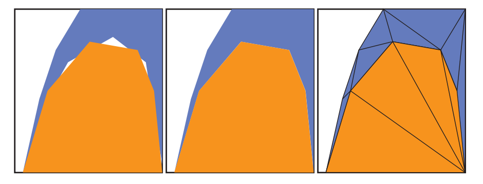

在连接平面的时候会遇到一个类似的问题，即T顶点（T-vertices）。当两个模型的边界相交，但是没有共享沿着边界的所有顶点时，就会出现这类问题。即使这些边界在理论上完美相交，但是如果渲染器没有足够的精度来表示屏幕上的顶点位置时，也有可能会出现裂缝。现代的图形硬件会使用亚像素寻址（subpixel addressing）来帮助避免这个问题\[985]。

更加明显的是，即使没有精度问题，也可能会出现着色瑕疵\[114]，图16.9展示了这个问题。可以通过找到这样的边界，并确保它们与相邻面共享相同的顶点来解决这个问题。另外一个可能出现的问题是，使用简单的扇形算法可能会产生退化的三角形（degenerate，即面积为0的三角形）。例如在图16.9中，假设右上角的四边形$\mathbf{abcd}$被三角化为两个三角形，即三角形$\mathbf{abc}$和三角形$\mathbf{acd}$。其中三角形$\mathbf{abc}$是一个退化的三角形，因此点$\mathbf{b}$是一个T顶点。Lengyel \[1023]讨论了如何找到这样的顶点，并提供了将凸多边形重新进行正确三角形划分的代码。Cignoni等人\[267]描述了一种方法，即当T顶点的位置已知时，可以避免产生退化的三角形。该算法的时间复杂度为$O(n)$，并且能够保证最多只生成一个条状三角形和扇状三角形。

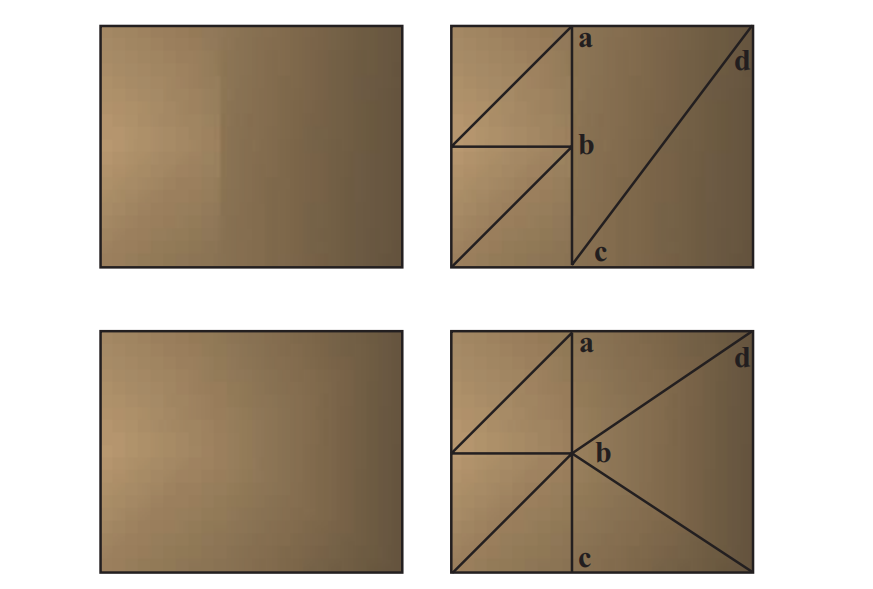

## 16.3 整合

一旦模型通过了所需要的任何曲面细分算法，我们就有了一组表示模型的多边形网格。这里有一些操作可能会对数据的显示有所帮助。其中最简单的操作就是检查这些多边形本身是否是正确构建的，是否至少包含3个不同的顶点位置，以及这些顶点是否不共线。例如：如果三角形中的任意两个顶点重合，那么这个三角形的面积就为0了，因此可以丢弃这个三角形。请注意，在本小节中，我们所针对的是多边形，而不仅仅是三角形。根据我们所实现的具体目标，存储多边形数据可能会更加高效，而不是立即将其转换为三角形来进行显示。三角形划分会创建更多的边缘，这反过来又为接下来的操作制造了更多的工作。

对多边形而言，一个常用的过程是合并（merging），它指的是在面片之间找到共享的顶点。另一个操作被称为定向（orientation），即构成同一个表面的所有多边形应当面向相同的方向。网格的定向对于之后的一些算法而言十分重要，例如背面剔除、折痕边缘检测、正确的碰撞检测和碰撞响应等。与定向相关的操作是顶点法线生成（vertex normal generation），它会使得表面看起来很光滑。我们将这类技术统称为整合算法（consolidation algorithm）。

### 16.3.1 合并

有些数据会以不相连多边形的形式出现，它通常被称为多边形soup或者三角形soup（译者注：这里的soup是汤的意思，代表了集合中元素混乱无序的状态）。存储单独的多边形会浪费内存，而渲染单独的多边形则会带来极低的效率；由于这些原因以及其他的一些原因，通常会将单个多边形合并为一整个多边形网格（polygon mesh）。从最简单的角度来说，一个网格由一组顶点和一组轮廓所组成。其中每个顶点上都包含一个位置数据，以及一些其他的可选数据，例如着色法线、纹理坐标、切向量和颜色等。而每个多边形轮廓都包含了一个整型的索引列表。每个索引都是一个从$0$到$n−1$的数字，其中$n$是顶点的数量，每个索引都指向顶点列表中的一个顶点。通过这样的存储方式，每个顶点就只需要存储一次即可，它可以被任意数量的多边形所共享。而我们所说的三角形网格，其实是一个只包含三角形的多边形网格。我们将在章节16.4.5中，对网格数据的存储方案进行深入讨论。

给定一组不相连的多边形，可以有几种方法对其进行合并。其中一种方法是使用哈希\[542, 1135]。我们首先将顶点计数器初始化为0。对于每个多边形，我们都尝试将该多边形中的每个顶点依次添加到一个哈希表（hash table）中，哈希表会根据顶点的数值进行散列。如果发现某个顶点并不在这个哈希表中，则将该顶点和相应的顶点计数器值一起存储在表中，然后将顶点计数器的值加1，同时将这个顶点数据存储在最终的顶点列表中。如果发现某个顶点已经在哈希表中存在了，则检索该顶点的存储索引，通过存储指向该顶点的索引来对多边形进行保存。在处理完所有的多边形之后，顶点列表（vertex buffer）和索引列表（index buffer）也就构建完成了。

模型数据有时会出现这样一种情况，即分属于不同多边形的两个顶点，位置十分接近但是又并不完全相同。合并这类顶点的过程被称为焊接（welding）。可以通过使用排序以及一个更加宽松的位置相等函数，来完成高效的顶点焊接操作\[1135]。

### 16.3.2 定向

对于模型数据，一个与质量相关的问题是面片的朝向。有一些模型数据的朝向本身就是正确的，其表面法线显式或者隐式地指向正确的方向。例如：在一些CAD任务中有这样一个标准，即正面观察一个多边形面片的时候，多边形轮廓上的顶点按照逆时针方向进行排序。这被称为缠绕方向（winding direction），在三角形中则使用右手定则（right-hand rule）。想象一下，我们右手的手指以逆时针的顺序对多边形的顶点进行环绕，此时大拇指所指向的方向就是多边形的法线方向。这个方向与观察坐标系或者世界坐标系中所使用的左手系或者右手系无关，这个方向完全依赖于正面观察三角形时，世界中的顶点顺序。也就是说，如果将一个反射矩阵应用于在这个定向网格上，那么多边形中每个三角形的法线将会与其缠绕方向相反。

给定一个合理的多边形网格模型，下面是一种对网格进行定向的方法：

1.  为所有的多边形构建边-面结构。
2.  对这些边进行排序或者哈希，从而找出那些匹配的边。
3.  找出相互接触的多边形组。
4.  对于每一组多边形，按需对其进行翻转，从而保证朝向的一致性。

第一步是创建一组半边（half-edge）对象，这里的半边指的是多边形的一条边，它具有一个指向其关联面（多边形）的指针。由于一条边通常会被两个多边形所共享，因此通常会将这种数据结构称为半边。在创建各个半边对象的时候需要使用一些排序算法，使得半边的第一个顶点存储在第二个顶点之前。如果一个顶点的$x$坐标值较小，那么将其排在另一个顶点之前。如果两个顶点的$x$坐标是相等的，那么则使用$y$坐标进行比较；如果仍然相等，则使用$z$坐标进行比较。例如：顶点$(−3,5,2)$会排在顶点$(−3,6,−8)$的前面，因为$x$坐标都为$-3$，因此比较$y$坐标，发现$5<6$。

这一步的目标是寻找哪些边是相同的。由于在存储每条边的时候，第一个顶点总是会小于第二个顶点，因此在比较边是否相同的时候，实际上就是将第一个顶点与第一个顶点相比较，第二个顶点与第二个顶点相比较，而不需要比较某一条边的第一个顶点与另一条边的第二个顶点这样的排列方式。这里可以使用一个哈希表来查找相互匹配的边\[19, 542]，如果多边形中的顶点之前已经被合并过了，那么这些半边也可以使用相同的顶点索引来进行表示；可以将每条半边放入一个临时的列表中，与第一个顶点索引相关联，并使用这种方式来进行匹配。一个顶点平均有6条附着的边，这使得分组后的边缘匹配效率很高\[1487]。

一旦这些半边完成了匹配，那么就可以知道相邻多边形之间的连接关系了，它们会构成一个邻接图（adjacency graph）。对于三角形网格而言，它可以表示为一个列表，其中每个三角形都有（最多）三个相邻的三角形面；而那些没有两个相邻多边形的边就是边界边缘。这些由边连接起来的多边形集合会形成一个连续的组，例如：一个茶壶模型包含两个组，分别是壶身和盖子。

下一步是赋予网格朝向的一致性，例如：我们通常希望所有多边形的轮廓都是逆时针方向的。对于一组内的连续多边形，可以选择任意一个多边形作为起始多边形。检查其每个相邻的每个多边形，并确定朝向是否一致。如果在遍历两个多边形的时候，发现边的遍历方向是相同的，那么就需要翻转这个相邻的多边形，如图16.10所示。递归检查这些相邻多边形的相邻多边形，直到这个连续多边形组中的所有多边形都检查过一次。

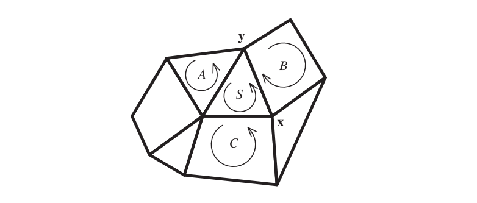

虽然此时所有的多边形面的朝向都是正确的，但是它们可能会同时朝向物体内部。在大多数情况下，我们都希望这些多边形面朝模型外部。想要判断是否应当翻转所有面，有一个快速的测试方法，即计算该多边形组的带符号体积，并对最终的符号正负性进行检查。如果它是负数，则翻转顶点顺序和顶点法线。可以通过计算每个三角形的带符号标量三重积（译者注：其绝对值等于平面六面体的体积），并进行求和，从而来计算这个带符号体积。你可以在网站realtimerendering.com的线性代数附录中，了解这个体积计算方法。

这种方法适用于实体物体，但它并非是万无一失的。例如：如果物体是一个构成房间的box，用户可能希望它的法线指向内部，从而朝向相机。如果物体并不是一个实体，而是一个表面描述的话，那么想要自动完成每个表面的定向是一件很棘手的事情。例如：如果两个立方体沿着一条边相连在一起，并且它们属于同一个网格，那么这条边将被四个多边形所共享，这会使得确定朝向变得更加困难。类似莫比乌斯环（Mobius）这样的单面物体，永远也不能完全定向，因为它没有内外的概念。即使对于那些表现良好的表面网格，也很难确定到底哪一面应当朝外。Takayama等人\[1736]对之前的工作进行了讨论，并提出了自己的解决方案，该方法会从每个面上随机投射光线，并确定哪个朝向从外部更加可见。

### **16.3.3 实体**性

不严谨地说，如果一个网格被确定了朝向，并且从外部可见的所有多边形都具有相同的朝向，那么我们可以说这个网格构成了一个实体（solid）。换句话说，只有网格的其中一侧是可见的，这种多边形网格被称为封闭的（closed）或者水密的（watertight）。

在知道了一个物体是实体之后，意味着我们可以使用一些背面剔除算法来提高渲染效率，详见章节19.2。同时，这里的实体概念也是投射阴影体（章节7.3）和其他一些算法的关键属性。例如：3D打印机要求它所打印的网格是实体的。

最简单的实体性（solidity）测试就是检查网格中的每个多边形边缘，是否恰好被两个多边形所共享。对于大多数数据集而言，这个测试已经足够了。这样的表面可以被粗略地称为流形（manifold），具体来说是二维流形（two-manifold）。从技术上讲，流形表面是一个没有任何拓扑不一致性（topological inconsistency）的表面，这里的拓扑不一致性，指的是有三个或者更多个多边形共享同一条边缘，或者有两个及以上的顶角相互接触。构成实体的连续表面应当是一个没有边界边缘的流形。

### 16.3.4 法线平滑和折痕边缘

有一些多边形网格会形成曲面，但是这些多边形的顶点上并没有法线数据，因此无法使用曲率错觉（illusion of curvature）来进行渲染，如图16.11。

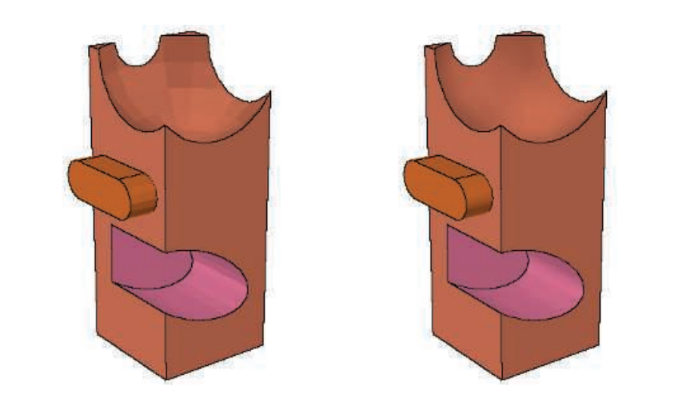

有许多模型格式不会提供有关表面边缘的信息，章节15.2中我们介绍了不同类型的边缘。这些边缘是十分重要的，有以下几个原因。它们可以突出显示模型中某个区域，这个区域内包含了一组多边形；或者有助于非真实感渲染。由于这些边缘提供了重要的视觉暗示，因此渐进式的网格算法（章节16.5）通常会避免对这些边缘进行简化。

在具有朝向的网格中，通常可以推导出合理的折痕边缘和顶点法线。一旦保证了朝向的一致性，并建立了邻接图，就可以使用一些平滑技术（smoothing technique）来生成顶点法线。有些模型格式可以通过指定多边形网格的平滑组（smoothing group）来提供帮助。这个平滑组值用于显式定义哪些多边形属于一组，这组多边形一起组成了一个弯曲表面。不同平滑组之间的边缘会被认为是尖锐的。

另一种对多边形网格进行平滑的方法是指定一个折痕角度。这个折痕角度值会与二面角（dihedral angle）进行比较，二面角是指两个多边形平面法线之间的夹角。这个折痕角度的数值通常设定在20-50度之间。如果我们发现两个相邻多边形之间的二面角小于指定的折痕角度，那么就认为这两个多边形属于同一个平滑组。这种技术有时也被称为边缘保持（edge preservation）。

这种使用折痕角度的方法有时候会得到不恰当的平滑效果，例如可能会对那些应当保持折痕的角度进行平滑，反之亦然。通常情况下，都需要进行一些实验，因为对于一个多边形网格而言，使用一个单一的角度肯定是不完美的。这种平滑组方法也有一定的局限性，一个经典的例子是：当你从中间捏着一张纸，这个薄薄的纸片可以被认为是一个单一的平滑组，但是实际上纸张的内部是存在折痕的，这些折痕会被平滑组平滑掉。建模人员需要使用多个相互重叠的平滑组，或者是直接在网格上定义折痕边缘。另一个例子是由三角形面片所构成的圆锥体，对这个圆锥体的整个表面进行平滑会得到一个奇特的结果，即圆锥顶端有一条指向外部的法线，这个法线与圆锥体的轴线相重合。这里的圆锥顶端是一个奇点，为了能够对插值法线进行完美地表示，其中的每个三角形都需要像四边形一样，在这个顶端位置上存在两个法线\[647]。

幸运的是，这种情况通常是很罕见的。我们在找到一个平滑组之后，就可以为平滑组内的共享顶点计算新的顶点法线。计算顶点法线的标准教科书做法，是对共享顶点上的多边形表面法线进行平均\[541, 542]。然而，这种方法可能会导致不一致且权重较差的结果。Theurmer和Wuthrich \[1770]提出了另一种方法，在该方法中，每个多边形法线的贡献大小会根据它在顶点处所形成的角度来进行加权。这种方法具有一个理想的特性，即无论共享这个顶点的多边形是否为三角形，都能得到相同的结果。假设此时一个细分多边形变成了两个共享顶点的三角形，如果仍然使用前面提到的平均法线方法，将会不正确地对这两个新三角形施加两倍于原始多边形的影响，如图16.12所示。

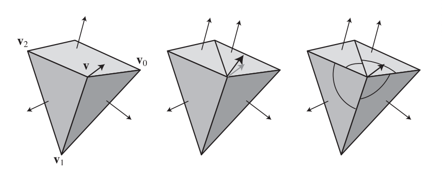

Max \[1146]给出了一种不同的加权方法，该方法基于了这样一个假设：长边所形成的多边形对于法线的影响较小。当使用一些简化技术的时候，这种平滑方法可能会更好，因为由简化技术所形成的较大的多边形，将不太可能会遵循表面的曲率。

Jin等人\[837]对以上这些方法和其他的方法进行了全面的调研，他得出的结论是：在各种条件下，角度加权方法要么的最好的，要么就是最好的之一。Cignoni \[268]在Meshlab中实现了一些方法，并对它们进行了注释。他还警告说，不要使用三角形的面积来对法线的贡献进行加权。

对于高度场数据，Shankel \[1614]展示了如何使用沿轴的相邻高度差，来对使用角度加权法的平滑结果进行快速近似。对于一个给定点$\mathbf{p}$和四个相邻点，其中$x$轴上的高度场相邻点为$\mathbf{p}^{x-1}$和$\mathbf{p}^{x+1}$，$y$轴上的高度场相邻点为$\mathbf{p}^{y-1}$和$\mathbf{p}^{y+1}$，那么点$\mathbf{p}$上的法线近似值（未归一化）为：

$$
\mathbf{n}=\left(p_{x}^{x+1}-p_{x}^{x-1}, p_{y}^{y+1}-p_{y}^{y-1}, 2\right)
\tag{16.1} 
$$

## 16.4 三角形扇，三角形带和三角形网格

使用一个三角形列表来存储和显示三角形集合，这是最简单的一种方式，但是通常它的效率也是最低的。在这种方法中，每个三角形的顶点数据会被一个接一个地放入这个列表中。每个三角形都有自己独立的3个顶点，并且三角形之间也不会共享顶点数据。一种提高图形性能的标准方法是将一组共享顶点的三角形发送到图形管线中，共享顶点意味着调用顶点着色器的次数会变少，因此需要进行变换操作的顶点和法线也就会更少。在本小节中，我们将对各种共享顶点信息的数据结构进行介绍，从三角形扇（triangle fan）和三角形带（triangle strip）开始，再逐步发展到更加精细、更加高效的表面渲染形式。

### 16.4.1 三角形扇

图16.13展示了一个三角形扇（triangle fan）。这个数据结构展示了一种构建三角形的方式，并且能够使得每个三角形的存储成本少于3个顶点。这个被所有三角形共享的顶点称为中心顶点（center vertex），在图中对应顶点$\mathbf{v}_0$。对于起始三角形$T_0$，会依次发送顶点$\mathbf{v}_0$、$\mathbf{v}_1$、$\mathbf{v}_2$（按此顺序）。对于后续的每个三角形，这个中心顶点总是会与之前发送的顶点，以及当前正在发送的顶点一起进行使用。三角形$T_1$是通过发送顶点$\mathbf{v}_3$来构建的，因此创建了一个由顶点$\mathbf{v}_0$（总是包含）、$\mathbf{v}_2$（之前发送的顶点）和$\mathbf{v}_3$（当前正在发送的顶点）所定义的三角形。三角形$T_2$通过发送顶点$\mathbf{v}_4$来构建的，以此类推。请注意，一个一般化的凸多边形，可以很容易的表示为一个三角形扇，因为这个凸多边形的任意一个顶点都可以作为起始的中心顶点。

 ，只需要发送顶点 \mathbf{v}_{i+2} 。右侧展示了一个凸多边形，它总是可以变成一个三角形扇。")

包含$n$个顶点的三角形扇，可以被定义为一个有序的顶点列表：

$$
\left\{\mathbf{v}_{0}, \mathbf{v}_{1}, \ldots, \mathbf{v}_{n-1}\right\}
\tag{16.2} 
$$

其中$\mathbf{v}_0$是中心顶点，同时会在这个列表上添加一个结构，来表明第$i$（$0 \leq i<n-2$）三角形是：

$$
\triangle \mathbf{v}_{0} \mathbf{v}_{i+1} \mathbf{v}_{i+2}
\tag{16.3} 
$$

如果一个三角形扇由$m$个三角形组成，那么第一个三角形将会发送三个顶点，然后剩下的$m - 1$个三角形各自会发送一个顶点。这意味着，长度为$m$的连续三角形扇，所发送的平均顶点数$v_a$可以表示为：

$$
v_{a}=\frac{3+(m-1)}{m}=1+\frac{2}{m}
\tag{16.4} 
$$

从方程16.4中我们可以很容易看出，当$m \rightarrow \infty$时，$v_a \rightarrow 1$。这似乎与现实世界中的情况没有太大的相关性，因为我们并不会发送一个无限大的三角形扇，我们可以考虑一个更加合理的数值。如果$m = 5$，那么$v_a = 1.4$，这意味着平均每个三角形只需要发送1.4个顶点。

### 16.4.1 三角形带

三角形带（triangle strip） 和三角扇比较类似，也会重复使用之前三角形中的顶点。在三角形扇中，我们会使用一个中心点与上一次发送的顶点来帮助构建当前的三角形；而在三角形带中，我们会使用前一个三角形中的两个顶点，来帮助构建当前的三角形，如图16.14所示。

![图16.14：图中的一系列三角形可以表示为一个三角形带。请注意，条带中的每个三角形方向都是不同的，条带中的第一个三角形决定了所有三角形的方向。在每个三角形内部，通过遍历顶点 \[0,1,2\] ， \[1,3,2\] ， \[2,3,4\] ， \[3,5,4\] 来保证一致的逆时针顺序，以此类推。](images/Chapter-16/202309071610070.png "图16.14：图中的一系列三角形可以表示为一个三角形带。请注意，条带中的每个三角形方向都是不同的，条带中的第一个三角形决定了所有三角形的方向。在每个三角形内部，通过遍历顶点 \[0,1,2] ， \[1,3,2] ， \[2,3,4] ， \[3,5,4] 来保证一致的逆时针顺序，以此类推。")

如果将这些三角形视为一个条带，那么可以使用一种更加紧凑的方式来将它们发送到渲染管线中。对于第一个三角形（记为$T_0$），它的三个顶点（记为$\mathbf{v}_0$、$\mathbf{v}_1$和$\mathbf{v}_2$）会按照顺序进行发送。而对于这个条带中的后续三角形，只需要发送一个顶点即可，因为之前的三角形已经发送了另外两个顶点。例如：在发送三角形$T_1$的时候，只需要发送顶点$\mathbf{v}_3$，并使用三角形$T_0$中的顶点$\mathbf{v}_1$和$\mathbf{v}_2$，来构建这个三角形$T_1$。对于三角形$T_2$，只需要发送顶点$\mathbf{v}_4$，以此类推。

一个包含$n$个顶点的连续三角形带，可以被定义为一个有序的顶点列表：

$$
\left\{\mathbf{v}_{0}, \mathbf{v}_{1}, \ldots, \mathbf{v}_{n-1}\right\}
\tag{16.5} 
$$

以及一个表示第$i$（$0 \leq i<n-2$）个三角形的结构：

$$
\triangle \mathbf{v}_{i} \mathbf{v}_{i+1} \mathbf{v}_{i+2}
\tag{16.6} 
$$

之所以这种条带被称为是连续的（sequential），因为其中的顶点是按照给定的顺序进行发送的。这个定义意味着包含$n$个顶点的连续三角形带中有$n−2$个三角形。

这里我们也对长度为$m$的三角形带（即由$m$个三角形组成）的平均顶点数进行一下分析，这个平均顶点数也记为$v_a$，这个$v_a$的方程与三角扇的完全相同（方程16.4），因为二者具有相同的启动阶段，后续每个新的三角形也只会发送一个顶点。类似地，当$m \rightarrow \infty$时，三角形带的$v_a$也会趋向于每个三角形只发送一个顶点。当$m = 20$时，$v_a = 1.1$，这要比3好得多，也比较接近1.0的极限。与三角形扇一样，第一个三角形的启动成本（总是会发送3个顶点）会分摊到后续的三角形上。

三角形带的吸引力源于这样一个事实。根据渲染管线中性能瓶颈的位置不同，相比于使用简单的三角形列表，使用三角形带可以节省多达三分之二的渲染时间。这种加速是由于避免了冗余操作，例如将每个顶点发送两次到图形硬件中，然后再对每个顶点执行矩阵变换、裁剪以及其他操作。三角形带对于诸如草叶、或者其他顶点无法被重复使用的物体而言十分有用。由于这种简单性，因此当几何着色器在输出多个三角形的时候，就会使用三角形带。

三角形带还有几种变体，例如对三角形的顺序不进行强制要求；通过使用双重顶点，或者重新设置索引值，从而在单个缓冲区中存储多个不连续的三角形带。曾经有相当多的研究，关注于如何将一个任意三角形网格分解成若干个三角形带\[1076]。这样的努力和研究已经失去意义了，因为带索引的三角形网格（indexed triangle mesh）的引入，实现了更好的顶点数据重用，从而导致了更快的显示速度和更少的整体内存开销（通常）。

### 16.4.3 三角形网格

三角形扇和三角形带仍然有其用途，但是在所有的现代GPU上，对于复杂模型而言，通常都是使用一个具有单一索引列表（章节16.3.1）的三角形网格\[1135]。三角形扇和三角形带允许一些数据共享，但是网格存储允许更多的数据共享。在网格中，会使用一个额外的索引数组来记录哪些顶点构成了三角形。通过这种方式，单个顶点就可以与多个三角形相关联。

连通平面图（connected planar graph）的Euler-Poincare（欧拉-庞加莱）公式\[135]可以帮助我们确定构成闭合网格的平均顶点数量：

$$
v-e+f+2 g=2
\tag{16.7} 
$$

其中$v$是顶点的数量，$e$是边的数量，$f$是面的数量，$g$是genus（字面意思是：类、种）。genus代表了物体上的孔洞数量。例如：一个球体的genus为0，一个圆环（torus）的genus为1，假设每个面都有一个环。如果一个面可以有多个环的话，那么方程16.7可以改写为：

$$
v-e+2 f-l+2 g=2
\tag{16.8} 
$$

其中$l$是环的数量。

对于一个封闭（实体）模型，每条边都有两个面，每个面都至少有三条边，因此$2e \ge 3f$。如果一个网格中都是三角形（就像GPU所要求的那样），那么$2e = 3f$。假设genus为0，将$1.5f$替换方程中的$e$，可以得到$f\le2v−4$。如果网格中的所有面都是三角形，那么则有$f = 2 v−4$。

对于大型封闭的三角形网格，一个经验法则是三角形的数量大约等于顶点数量的两倍。类似地，我们发现每个顶点平均连接了大约6个三角形（即一个顶点对应6条边）。与一个顶点相连的边的数量，叫做这个顶点的价（valence）。需要注意的是，网格的网状结构并不会影响结果，只有三角形的数量会对结果产生影响。由于三角形带中每个三角形的平均顶点数接近于1，而顶点数量大约是三角形数量的两倍，因此如果使用一个三角形带来表示一个大型网格，那么每个顶点平均需要发送两次。而在极限情况下，三角形网格可以做到每个三角形只发送0.5个顶点。

请注意，上述这种分析过程只适用于光滑的、封闭的网格。网格中只要出现了边界边缘（boundary edge，只属于一个多边形的边），顶点与三角形的比例就会增加。 Euler-Poincare公式仍然成立，但是网格的外边界（outer boundary）必须被视为与所有外部边缘（exterior edge）都相邻的独立（未使用）面片。类似地，模型中的每个平滑组实际上都算是独立的网格，因为GPU在两个平滑组相交的尖锐边缘处需要单独的顶点记录，这些顶点具有不同的法线。例如：一个立方体的角上有三条不同的法线，那么这个位置上会存储三个顶点记录。纹理或者其他顶点数据的变化，也会导致顶点记录的数量增加。

根据理论预测，每个三角形大约需要处理0.5个顶点。在实践中，顶点在被GPU变换之后，会放入一个先进先出（first-in, first-out，FIFO）缓存中，或者放入一个近似于最近最少使用（least recently used，LRU）的系统中\[858]。这个缓存（cache）保存了每个顶点经过顶点着色器变换后的结果。如果传入的某个顶点已经存在于这个缓存中了，那么就可以直接使用这个缓存中的变换结果，而不需要再次调用顶点着色器，这样做可以带来显著的性能提升。但是如果三角形网格中的三角形是按照随机顺序进行发送的，那么这种缓存机制可能就没什么用。三角形带算法的优化缓存大小为两个，即使用最后的两个顶点。Deering和Nelson \[340]首先探索了将顶点数据存储在更大的FIFO缓存中的想法，并通过使用一种算法来确定将顶点添加到缓存中的顺序。

FIFO缓存的大小是有限的。例如：PS3（PLAYSTATION 3）系统中的FIFO缓存拥有大约24个顶点，这也取决于每个顶点所占据的字节数。在较新的GPU上，这个FIFO缓存的大小也没有显著增加，32个顶点是一个经典的最大值。

Hoppe \[771]引入了一个用于衡量缓存重用的重要指标，即平均缓存未命中率（average cache miss ratio，ACMR）。这是每个三角形需要处理的平均顶点数量。ACMR的范围可以从3（三角形的每个顶点，每次都必须进行重新处理）到0.5（一个大型封闭网格被完美重用；没有任何顶点会被重新处理）。如果缓存大小与网格本身一样大时，那么ACMR就等于顶点与三角形的理论比值。对于给定的缓存大小和网格排序方式，可以精确计算ACMR的值，因此可以描述任何给定方法在该缓存大小下的效率。

### 16.4.4 缓存无关的网格布局

网格中三角形的理想顺序是能够最大化地利用顶点缓存。Hoppe \[771]提出了一种可以最小化网格ACMR的算法，但是必须事先知道缓存的大小。如果算法假设的缓存大小要大于实际的缓存大小，那么使用该算法生成的网格所带来的性能优势会明显减少。为不同大小的缓存进行求解，可能会产生不同的最佳排序方式。当目标缓存的大小未知时，使用缓存无关（cache-oblivious）的网格布局算法可以生成运行良好的排序方式，无论鸡腿的缓存大小是多少。这种排序方式有时候也被称为通用索引序列（universal index sequence）。

Forsyth \[485]、Lin和Yu \[1047]使用类似的原理，提供了一些快速贪婪算法。根据顶点在缓存中的位置，以及附着在它们上面的未处理三角形数量来给它们进行打分，接下来会处理顶点得分最高的那个三角形。该算法通过将最近使用过的三个顶点的得分稍微降低一点，从而避免创建三角形带，而是会创建一个类似于希尔伯特曲线（Hilbert curve）的图案。对于那些连接较少数量三角形的顶点，通过赋予它们更高的分数，该算法会倾向于避免留下孤立的三角形。这个算法所能够达到的平均缓存未命中率，与那些更加复杂且成本更高的算法相当。Lin和Yu的方法要稍微复杂一些，但是使用了类似的思想。当缓存大小为12时，30个未优化模型的平均ACMR为1.522；在经过算法优化之后，根据缓存大小的不同，ACMR平均会下降到0.664或者更低。

Sander等人\[1544]对之前的工作进行了概述，并提出了他们自己的方法，这种方法的速度更快（尽管该方法并不是缓存大小无关的），被称为Tipsify。此外，他们还尽量会将最外层的三角形放在列表的前面，从而最大限度地减少过度绘制（章节18.4.5）。例如；想象现在有一个咖啡杯，首先渲染那些构成杯子外部的三角形，那么后续的内部三角形很可能就会被遮挡，不会出现在视野中。

Storsjo \[1708]对Forsyth和Sander的方法进行了对比分析，并提供了二者方法的具体实现。他的结论是：这些方法所提供的布局已经接近了理论的极限。在Kapoulkine \[858]的一项最新研究中，在3家硬件供应商的GPU上，对4种缓存已知（cache-aware）的顶点排序算法进行了对比。他的结论是：Intel使用了一个包含128个entry的FIFO缓存，每个顶点使用三个或者更多个entry；而AMD和NVIDIA的系统则近似于16个entry的LRU缓存。这种架构上的差异会显著影响算法的性能表现。他发现Tipsify算法\[1544]和Forsyth的算法\[485]（稍微差一些）在这些平台上的表现相对较好。

综上所述，对三角形进行离线预处理能够显著提高三角形网格的顶点缓存性能；并且如果顶点处理阶段是整个管线中的性能瓶颈时，这种预处理可以提高整体的帧率。这种预处理方法的执行速度快，实际的算法复杂度为$O(n)$，还有一些可用的开源版本\[485]。考虑到这些算法能够自动应用于网格，并且这种优化并不会带来额外的存储成本，也不会对工具链中的其他工具产生影响，因此这些方法通常都是成熟开发系统中的一部分。例如：Forsyth的算法似乎是PLAYSTATION 网格处理工具链中的一部分。虽然现代GPU都采用了统一的着色器架构，顶点变换后的缓存问题已经得到了发展，但是避免缓存未命中仍然是一个十分重要的问题\[530]。

### 16.4.5 顶点和索引缓冲区/数组

一种方法为现代图形加速器提供模型数据的方法，是使用一些特殊的存储对象，在DirectX中被称为顶点缓冲区（vertex buffer），在OpenGL中被称为顶点缓冲区对象（vertex buffer objects，VBO）。本小节将会使用DirectX中的术语，这些概念在OpenGL中也有相对应的概念。

顶点缓冲区的思想是将模型数据存储在一个连续的内存块中。顶点缓冲区是一个特定格式的顶点数组，这个格式指定了存储在内部的顶点是否包含法线、纹理坐标、颜色或者其他的特殊信息。每个顶点都会将自身的数据存储在一个组中，一个顶点接着一个顶点地进行存储。顶点数据的大小（以字节为单位）被称为该顶点的步幅（stride）。这种类型的存储方式被称为交错缓冲区（interleaved buffer）。或者也可以使用一组顶点流（vertex stream）。例如：使用一个流来保存位置数组$\left\{\mathbf{p}_{0} \mathbf{p}_{1} \mathbf{p}_{2} \ldots\right\}$，使用另一个流来保存法线数组$\left\{\mathbf{v}_{0} \mathbf{v}_{1} \mathbf{v}_{2} \ldots\right\}$。在实践中，一个包含了顶点所有数据的单个缓冲区对于GPU而言会更加高效，但是这种高效也没有高到要避免使用多个流\[66, 1494]。多个流的主要开销在于额外的API调用，如果应用程序的CPU资源很紧张（译者注：即常说的吃CPU），但是在其他方面的开销并不是很大，那么可以避免这种使用多个流所带来的额外开销\[443]。

Wihlidal \[1884]讨论了使用多个流来帮助渲染系统提升性能的不同方式，包括API、缓存和CPU处理等。例如：在CPU上进行向量处理的SSE和AVX会更加容易地应用在单独的流上。使用多个流的另一个原因在于，可以对网格数据进行更加高效地更新。例如：如果一个网格中只有顶点的位置流会随着时间发生变化，那么单独更新这一个属性缓冲区的开销，要比构建并发送整个交错流的开销小得多\[1609]。

具体要如何访问顶点缓冲区，取决于设备的$\mathrm{DrawPrimitive}$方法。这些数据可以被处理为：

1.  一个包含独立顶点的列表。
2.  一个包含未连接线段的列表，即顶点对。
3.  一条简单的折线。
4.  一个三角形列表，其中每三个顶点构成一个三角形，例如：顶点$[0,1,2]$构成一个三角形，顶点$[3,4,5]$构成下一个三角形，以此类推。
5.  一个三角形扇，其中第一个顶点与每个连续的顶点对都会构成一个三角形，例如：$[0,1,2]$，$[0,2,3]$，$[0,3,4]$分别构成了一个三角形。
6.  一个三角形带，其中三个相邻的顶点构成一个三角形，例如：$[0,1,2]$，$[1,2,3]$，$[2,3,4]$分别构成了一个三角形。

在DirectX 10中，三角形列表和三角形带也可以包含相邻的三角形顶点，用于提供给几何着色器（章节3.7）进行使用。

顶点缓冲区可以直接进行使用，也可以被索引缓冲区引用。索引缓冲区中的索引保存了顶点缓冲区中顶点的位置。这个索引是一个16 bit的无符号整数（uint16）；如果模型网格很大，并且GPU和API（章节16.6）也支持的话，还可以使用32 bit的无符号整数（uint32）。索引缓冲区和顶点缓冲区组合起来，所显示的绘制图元与“原始”的顶点缓冲区完全相同。两种方式的不同之处在于，在索引/顶点缓冲区的组合中，每个顶点只需要在顶点缓冲区中存储一次即可；而对于没有索引的顶点缓冲区，所存储的顶点数据可以发生重复。

三角形网格的结构由索引缓冲区来进行表达。存储在索引缓冲区中的前3个索引指定了第一个三角形，接下来的3个索引指定了第二个三角形，以此类推。这种数据组织形式被称为带索引的三角形列表（indexed triangle list），实际上这里的索引本身就构成了一个三角形列表。OpenGL将索引缓冲区、顶点缓冲区与顶点格式信息绑定在一个顶点数组对象（VAO）中。这里的索引也可以按三角形带的顺序进行排列，这样可以节省索引缓冲区所占据的空间。这种带索引的三角形带格式在实践中很少会用到，因为想要为一个大型网格创建这样的三角形带集合，需要进行一些额外的努力，并且也要求处理几何图形的工具也需要支持这种格式。图16.15展示了顶点缓冲区和索引缓冲区的结构。

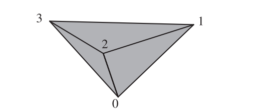

（由于图16.15太大，并且包含大量解说性文字，因此从这里开始进行描述）

图中展示了三个三角形，分别由顶点$\mathbf{p}_0$到$\mathbf{p}_1$、法线$\mathbf{n}_0$到$\mathbf{n}_1$所构成。可以通过一系列独立的调用来渲染出这些三角形，分别是：

-   $\mathbf{p}_0$，$\mathbf{n}_0$，$\mathbf{p}_1$，$\mathbf{n}_1$，$\mathbf{p}_2$，$\mathbf{n}_2$
-   $\mathbf{p}_1$，$\mathbf{n}_1$，$\mathbf{p}_3$，$\mathbf{n}_3$，$\mathbf{p}_2$，$\mathbf{n}_2$
-   $\mathbf{p}_2$，$\mathbf{n}_2$，$\mathbf{p}_3$，$\mathbf{n}_3$，$\mathbf{p}_0$，$\mathbf{n}_0$

可以将位置信息和法线信息分别放入两个独立的列表中，这两个列表包含了三角形的组织顺序，每三个一组（不重复使用）会被作为一个三角形：

$$
\begin{array}{|lllllllll|} \hline \mathbf{p}_{0} & \mathbf{p}_{1} & \mathbf{p}_{2} & \mathbf{p}_{1} & \mathbf{p}_{3} & \mathbf{p}_{2} & \mathbf{p}_{2} & \mathbf{p}_{3} & \mathbf{p}_{0} \\ \hline \end{array} \quad \text{ array of positions}
\\[3mm]
\begin{array}{|lllllllll|} \hline \mathbf{n}_{0} & \mathbf{n}_{1} & \mathbf{n}_{2} & \mathbf{n}_{1} & \mathbf{n}_{3} & \mathbf{n}_{2} & \mathbf{n}_{2} & \mathbf{n}_{3} & \mathbf{n}_{0} \\ \hline \end{array} \quad \text{  array of normals}
$$

将位置信息和法线信息分别放入两个独立的列表中，每三个一组（重复使用）会被作为一个三角形：

$$
\begin{array}{|lllll|} \hline \mathbf{p}_{0} & \mathbf{p}_{1} & \mathbf{p}_{2} & \mathbf{p}_{3} & \mathbf{p}_{0} \\ \hline \end{array} \quad \text{ array of positions}
\\[2mm]
\begin{array}{|lllll|} \hline \mathbf{n}_{0} & \mathbf{n}_{1} & \mathbf{n}_{2} & \mathbf{n}_{3} & \mathbf{n}_{0} \\ \hline \end{array} \quad  \text{ array of normals}
$$

将顶点信息放入一个交错数组（同一个顶点的属性会被放在一起）中，下面是一个表示三角形带的数组：

$$
\begin{array}{|lllllllllll|} \hline 
\mathbf{p}_{0}  \mathbf{n}_{0} & \mathbf{p}_{1}  \mathbf{n}_{1} & \mathbf{p}_{2} \mathbf{n}_{2} & \mathbf{p}_{3}  \mathbf{n}_{3} & \mathbf{p}_{0}  \mathbf{n}_{0} 
\\ \hline \end{array} 
\quad \text{ array of vertices}
$$

将顶点信息放入一个交错数组中，并使用一个额外的索引列表来给出三角形的组织关系：

$$
\begin{array}{|lllll|} \hline \mathbf{p}_{0}  \mathbf{n}_{0} & \mathbf{p}_{1}  \mathbf{n}_{1} & \mathbf{p}_{2} \mathbf{n}_{2} & \mathbf{p}_{3}  \mathbf{n}_{3} \\ \hline \end{array} \quad \text{ array of vertices}
\\[2mm]
\begin{array}{|lllll|} \hline 012 & 132 & 230  \\ \hline \end{array} \quad  \text{ index array}
$$

将顶点信息放入一个交错数组中，并使用一个额外的索引列表来表示一个三角形带：

$$
\begin{array}{|lllll|} \hline \mathbf{p}_{0}  \mathbf{n}_{0} & \mathbf{p}_{1}  \mathbf{n}_{1} & \mathbf{p}_{2} \mathbf{n}_{2} & \mathbf{p}_{3}  \mathbf{n}_{3} \\ \hline \end{array} \quad \text{ array of vertices}
\\[2mm]
\begin{array}{|lllll|} \hline 0&1&2&3&0 \\ \hline \end{array} \quad  \text{ index array}
$$

（图16.15到此结束）

具体提使用哪种结构由图元和程序所决定。想要显示一个矩形很容易，只需要一个顶点缓冲区，使用四个顶点来表示两个三角形所组成的三角形带或者三角形扇即可。如前所述，使用索引缓冲区的一个优点在于数据可以进行共享。它的另外一个优点就是简单，因为三角形可以有任意的顺序和配置方式，并且没有三角形带的锁步需求（lock-step，指相邻三角形顶点顺序翻转）。最后，在使用索引缓冲区的时候，需要在GPU上传输和存储的数据量要更小。通过共享顶点所节省的内存，远远超过了多存储一个索引数组所带来的额外开销。

索引缓冲区和一个或者多个顶点缓冲区提供了一种描述多边形网格的方法。然而，数据存储的目的通常是尽可能提高GPU的渲染效率，而不一定是最紧凑的存储方式。例如：想要存储一个立方体，一种方法是将它的8个角位置存储在一个数组中，再将6个不同的法线方向存储在另一个数组中，以及6个定义立方体面的环，每个环代表一个正方形，每个正方形由4个索引组成。每个顶点位置由两个索引进行描述，一个用于顶点列表，另一个用于法线列表。纹理坐标则由另一个数组和第三个索引进行表示。这种紧凑的表示方法被用于许多模型文件格式中，例如Wavefront OBJ。而在GPU上，由于只能使用一个索引缓冲区，因此我们要在一个顶点缓冲区中存储24个不同的顶点，因为每个角点位置都有三个不同的法线，其中每个法线各自对应着一个相邻的面。而对应的索引缓冲区中将存储构成表面的12个三角形索引。Masserann \[1135]讨论了如何高效地将这类文件描述，转换为紧凑而高效的索引/顶点缓冲区，而不是转换为没有共享顶点的无索引三角形列表。还有一些更加紧凑的方案，例如将网格存储在纹理贴图或者缓冲区纹理中，并使用顶点着色器的纹理拾取（texture fetch）或者拉取机制（pulling mechanism）来进行实现，但是这些方法无法使用变换后的顶点缓存，这会带来一些性能损失\[223, 1457]。

为了获得最大效率，顶点缓冲区中的顶点顺序应当与索引缓冲区中的顶点访问顺序相匹配。也就是说，索引缓冲区中第一个三角形所引用的3个顶点，应当刚好是顶点缓冲区中的前3个顶点。当索引缓冲区遇到一个新顶点的时候，它应当刚好是顶点缓冲区中的下一个顶点。使用这样的排列顺序，可以最小化变换前顶点缓存（pre-transform vertex cache）的缓存未命中（cache miss）；我们在章节16.4.4中讨论过，变换后的顶点缓存和变换前的顶点缓存是分开的。对顶点缓存中的数据进行重新排序是一个十分简单的操作，但是对于性能来说，它与在变换后的顶点缓存中找到一个有效的三角形顺序一样重要\[485]。

还有一些更高层次（higher-level）的方法可以对顶点缓冲区和索引缓冲区进行分配和使用，从而进一步提高效率。例如：可以在GPU上存储一个不变的缓冲区，以供每一帧中进行使用；并且可以从同一个缓冲区中生成相同物体的多个实例和变体。我们将在章节18.4.2中深入讨论此类技术。

使用管线的流式输出（stream output）功能（章节3.7.1），我们可以将处理过的顶点发送到一个新的缓冲区中，这允许在GPU上对顶点缓冲区进行处理，但是并不实际渲染它们。例如：一个描述三角形网格的顶点缓冲区可以被视为初始pass中的简单点集，顶点着色器可以按照需要执行逐顶点的计算，并使用流式输出来将结果发送到一个新的顶点缓冲区中。在后续的pass中，这个新的顶点缓冲区可以与描述网格连通性的原始索引缓冲区进行配对，从而对生成的网格进行进一步的处理和显示。

## 16.5 简化

网格简化（mesh simplification），也称为数据简化（data reduction）或者数据抽取（data decimation），是指将一个详细的多边形模型，降低它的三角形面数，同时尽量保持其原有外观的过程。对于实时渲染而言，这个过程是为了减少需要存储和发送到管线中的顶点数量。这对于提高应用程序的可伸缩性（scalable）十分重要，因为一些性能较弱的设备只能显示较少数量的三角形。另外，我们所接收的模型数据可能也会包含一些不合理、不必要的曲面细分。图16.16展示了如何通过数据简化技术，来降低存储的三角形数量。

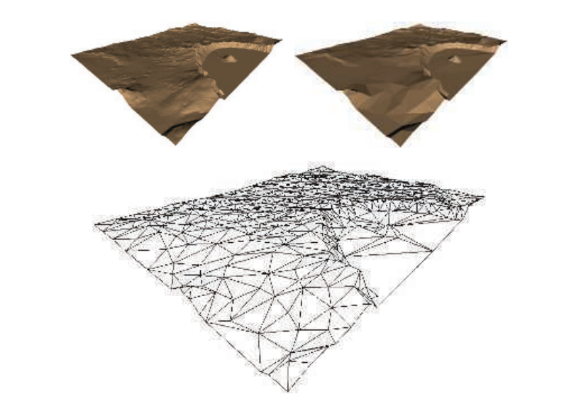

Luebke \[1091, 1092]定义了三种类型的网格简化：静态（static）、动态（dynamic）和视图相关（view-dependent）。静态简化的思想是：在渲染开始之前创建单独的细节层次（LOD）模型，并在渲染的过程中动态选择具体要进行使用的模型，我们将在章节19.9中进行详细介绍。离线的简化对于其他任务也很有用，例如为细分表面提供较为粗糙的网格来进行细化\[1006, 1007]。动态简化提供了LOD模型的连续版本，而不是几个离散的模型，因此这种方法也被称为连续细节层次（continuous level of detail，CLOD）算法。视图相关的技术适用于模型中细节层次不同的地方。具体来说，地形渲染是一种常见情况，在地形渲染中，附近的区域需要进行详细的表示，而远处的区域则处于较低的细节水平。本小节将讨论后面两种简化技术，即动态简化和视图相关的简化。

### 16.5.1 动态简化

减少三角形数量的一种方法是使用一个边坍缩（edge collapse）操作，它通过移动一条边上的两个顶点，使其重合来移除这条边。图16.17展示了这个操作的一个例子。对于实体模型而言，一次边坍缩总共会移除两个三角形、三个边和一个顶点。因此，一个具有3000个三角形的封闭模型，需要使用1500次边坍缩，才能将面数减少到0。之前我们提到了一个经验法则，即一个包含$v$个顶点的封闭三角形网格，大约会有$2v$个面和$3v$条边。这个法则可以使用Euler-Poincare公式（章节16.4.3）推导出来，即固体表面的$f−e + v = 2$。

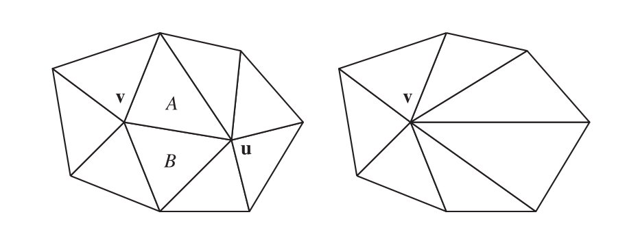

边坍缩的过程是可逆的。可以按照顺序来存储边坍缩的具体过程，这使得我们可以从一个简化模型出发，并从中重建出一个复杂模型。这个特性对于模型的网络传输而言十分有用，因为数据库中存储的是模型的边坍缩版本，它可以通过这种高效压缩的形式进行发送，并在接收模型的时候，逐步重建出复杂模型并进行显示\[768, 1751]。由于这个特点，这种简化过程通常也被称为视图无关的渐进式网格划分（view-independent progressive meshing，VIPM）。

在图16.17中，顶点$\mathbf{u}$被坍缩到了顶点$\mathbf{v}$的位置上，但是顶点$\mathbf{v}$同样也可以被坍缩到顶点$\mathbf{u}$的位置上。简化系统中会使用一个子集放置策略（subset placement strategy）来对这两种可能性进行限制。这种策略的一个优点在于，如果我们限制了可能性，那么我们可以对所做的选择进行隐式编码\[516, 768]。这种策略的效率更快，因为我们需要进行评估的可能性变少了，但是这种策略也可能会产生质量较低的近似结果，因为我们所检查的解空间也变得更小了。

当使用一个最优放置策略（optimal placement strategy）的时候，我们可以检查一个更大范围内的可能性。在这个最优放置策略中，我们不是将一个顶点坍缩成另一个顶点，而是将一条边上的两个顶点坍缩到一个新位置上。Hoppe \[768]研究了点$\mathbf{u}$和点$\mathbf{v}$都移动到边上某个新位置时的情况。他指出：为了对最终数据表示的压缩进行改进，可以将搜索局限于只对中点进行检查。Garland和Heckbert \[516]更进一步，通过求解一个二次方程来找到最优坍缩位置，这个最优坍缩位置可能会位于边缘以外的地方。最优放置策略的优点在于，它可以提供更高质量的网格。它的缺点是需要额外的处理、代码和内存来记录更大范围的可能位置。

为了确定最佳的坍缩点，我们可以对局部邻域进行分析。这种局部性是一个重要且有用的特性，原因有以下几个。如果边坍缩操作的代价只取决于几个局部变量（例如：边的长度、边附近的表面法线），那么这个代价函数是很容易进行计算的，并且每次坍缩操作只会对它的几个邻居顶点产生影响。例如：假设一个模型在开始计算的时候，有3000种可能的边塌陷选择。此时我们执行成本函数值最小的那个边坍缩操作，因为它只会对附近几个三角形及其边缘产生影响，因此只有那些成本函数会受到影响的边坍缩选择才需要重新进行计算（例如：需要对10个成本函数进行重新计算，而不是3000个），并且这个列表只需要进行少量的重新排序即可。由于一次边坍缩操作只会影响少数几个边坍缩的代价值，因此可以使用堆或者其他优先级队列来维护这个代价值列表\[1649]。

有些时候，无论一次边坍缩的成本有多低，都必须避免进行这样的边坍缩操作，如图16.18所示。这种现象可以通过对相邻三角形进行检查，看看它们是否会由于坍缩操作而发送法线翻转现象。

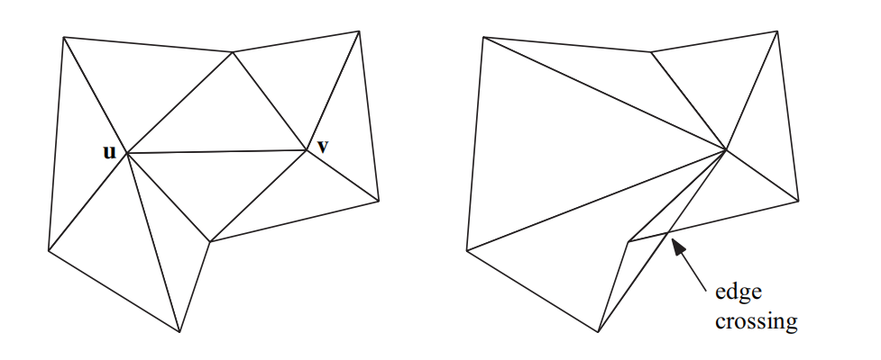

这个坍缩操作本身是一种对模型数据库的编辑，用于存储这些坍缩操作的数据结构可以有很好的文档记录\[481, 770, 1196, 1726]。在每次执行边坍缩操作之前，都需要使用代价函数来进行分析，然后执行代价值最小的那个边坍缩操作。这个最佳成本函数会随着模型类型和其他一些因素而发生变化。根据要解决的问题，这个成本函数可能会在速度、质量、健壮性和简单性之间做出权衡\[1092]。它也可以进行按需定制（tailor），以保持表面边界、材质位置、光照效果、沿轴对称、纹理放置、体积或者其他的一些约束条件。

为了让读者能够了解这些成本函数是如何运作的，这里我们将介绍Garland和Heckbert的二次误差度量（quadric error metric，QEM）成本函数\[515, 516]。这个成本函数在很多情况下都是通用的。相比之下，在一些早期的研究中，Garland和Heckbert \[514]发现，地形的简化最适合使用Hausdorff距离，其他人也证实了这一点\[1496]。这个函数实际上就是简化网格中的一个顶点到原始网格的最长距离。图16.16展示了使用这个指标的结果。

对于一个给定的顶点，有一组共享该顶点的三角形，每个三角形都有一个平面方程。移动这个顶点的QEM代价函数是这些平面与新位置之间距离的平方和。使用数学形式进行描述，即：

$$
c(\mathbf{v})=\sum_{i=1}^{m}\left(\mathbf{n}_{i} \cdot \mathbf{v}+d_{i}\right)^{2}
$$

这就是新位置$\mathbf{v}$和$m$个平面的代价函数，其中$\mathbf{n}_{i}$是第$i$个平面的法线，$d_i$是第$i$个平面到原始位置的距离。

图16.19展示了同一条边的两种可能坍缩方式。假设这个立方体宽两个单位。将点$\mathbf{e}$坍缩成点$\mathbf{c}$（$\mathbf{e} \rightarrow \mathbf{c}$）的代价函数将为0，因为点$\mathbf{e}$在移动到点$\mathbf{c}$时，并不会离开它所共享的平面。$\mathbf{c} \rightarrow \mathbf{e}$的代价函数将为1，因为点$\mathbf{c}$从立方体的右侧平面，移动了1个单位的平方距离。这里我们会执行代价较低的边坍缩操作，因此$\mathbf{e} \rightarrow \mathbf{c}$的坍缩要比$\mathbf{c} \rightarrow \mathbf{e}$更好。

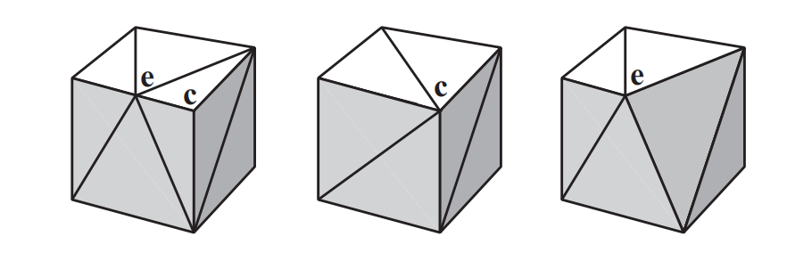

这个成本函数可以通过各种方式进行修改。想象有两个三角形共用同一条边，并且形成了一个锋利的边缘，他们可能是一个鱼鳍或者一个涡轮叶片。在这条边上坍缩顶点的代价函数很低，因为沿着一个三角形滑动的点并不会远离另一个三角形所在的平面。一个基本的成本函数，其数值与所删除特征的体积变化有关，但是这种体积变化并不能很好地反映它的视觉重要性。想要保留一条具有尖锐折痕的边缘，其中一种方法是添加一个额外的平面，该平面包含这条边并具有一个法线，这个法线相当于两个三角形法线的平均值。此时，远离这条边的顶点，将会具有更高的代价函数\[517]。另一种变体方法是，通过三角形面积的变化来对成本函数进行加权。

![图16.20：网格简化。左上角是包含13546个面的原始网格，右上角被简化为1000个面，左下角为500个面，右下角为150个面 \[770\] 。](images/Chapter-16/202309081128879.png "图16.20：网格简化。左上角是包含13546个面的原始网格，右上角被简化为1000个面，左下角为500个面，右下角为150个面 \[770] 。")

还有一些其他的扩展类型，使用了一些维护其他表面特征的代价函数。例如：模型的折痕边缘和边界边缘在描绘模型外观的时候十分重要，我们需要尽量保留这些边缘特征，使得这些边缘不太可能被修改，如图16.20所示。其他值得保留的表面特征，包含存在材质变化、纹理贴图边缘、以及逐顶点颜色变化的位置\[772]，如图16.21所示。

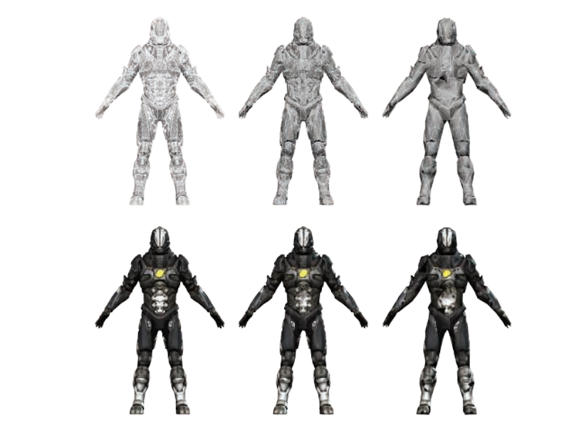

大多数简化算法都会出现的一个严重的问题，即纹理经常会明显偏离其原始外观\[1092]。当边缘发生坍缩的时候，纹理到表面的底层映射会发生扭曲。同理，纹理坐标的值可以在边界处进行匹配，但是会分属于应用纹理的不同区域，例如：沿着镜像模型的中心边缘。Caillaud等人\[220]对之前的各种方法进行了调研，并提出了他们自己用于处理纹理接缝的算法。

速度可能是另一个我们所关注的问题。在那些用户自己创建内容的系统中，例如在一个CAD系统中，可能会需要动态创建LOD模型。使用GPU来执行网格简化目前已经取得了一些成功进展\[1008]。另一种方法则是使用一些更加简单的简化算法，例如顶点聚类（vertex clustering）\[1088, 1511]。该方法的核心思想是：使用三维的体素网格或者类似结构来覆盖整个模型，体素中的任何顶点都会被移动到该单元格内的“最佳”顶点位置。这样做可能会移除一些三角形，当三角形的两个顶点或者三个顶点位于同一个体素内时，这个三角形会发生退化。这个算法健壮性很好，因为它不需要网格的连通性，并且可以很容易地将多个分离网格合并为一个网格。然而，这些基本的顶点聚类算法，很少能够达到完整QEM算法的效果。Willmott \[1890]讨论了他的团队是如何将这种聚类方法，以一种健壮且高效的方式应用在游戏《孢子》的用户内容创建模块中的。

还有一种与简化类似的思想，是将表面的原始几何形状转换为一个用于凹凸映射（bump mapping）的法线贴图。对于一些比较小的特征（例如按钮或者皱纹），当然可以使用纹理进行表示，而且几乎不会损失保真度。Sander等人\[1540]对之前这一领域的工作进行了讨论，并提供了一个解决方案。这种算法通常用于为交互式应用程序的生成模型，并将一个高质量的模型信息烘焙到一个纹理化的表示中\[59]。

使用简化技术能够从一个复杂模型中生成大量的细节层次（LOD）模型。在使用LOD模型时会遇到一个问题，如果一个模型在两帧之间进行突然切换，有时候玩家可以看到这个切换过程 \[508]，这个问题被称为“popping（突然跳出）”。一种解决方案是使用地貌（geomorphs）\[768]来增加或者减少LOD。由于我们事前知道这个复杂模型中的顶点是如何映射到简单模型中的，因此我们可以创建平滑的过渡过程。更多细节详见章节19.9.1。

使用视图无关的渐进式网格划分（view-independent progressive meshing）具有一个优点，即我们可以只创建一次顶点缓冲区，并在不同LOD的相同模型副本之间进行共享\[1726]。然而，在基本方案下，我们还需要为每个模型副本都创建一个单独的索引缓冲区。另一个问题是效率，由于顶点坍缩的顺序决定了三角形的显示顺序，因此顶点缓存的一致性比较差。Forsyth \[481]讨论了在构建和共享索引缓冲区时，几种可以提高效率的实用方法。

网格简化的技术是十分有用的，但是完全自动化的简化系统有时候也不是万能的（panacea）。图16.22展示了保持对称性的问题。一个出色的模型师可以创造出比自动化程序质量更好的、低三角形数量（low-triangle-count）的模型。例如：人的眼睛和嘴巴是脸部最重要的部分，而一个朴素（naive）的简化算法可能会将这些重要特征当作无关紧要的东西平滑掉。重拓扑（retopology）指的是在建模、平滑或者使用简化技术的时候，向模型中添加边缘以保持各种特征分离的过程。与网格简化相关的算法仍在继续研究和开发中，并尽可能地尝试自动化。

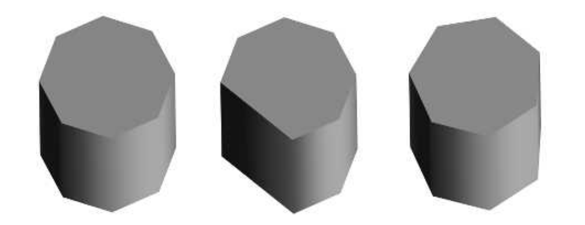

## 16.6 压缩和精度

三角形网格数据可以通过各种方式进行压缩，并且能够获得相似的好处。正如PNG和JPEG等图像文件格式会对纹理进行无损压缩和有损压缩一样，针对三角形网格数据的压缩目前已经开发出了各种压缩算法和文件格式。

压缩的代价是更多的编码时间和解码时间，压缩的目标是最大限度地降低数据存储空间。传输一种更小的数据表示形式，其所节省的时间必须要超过解压数据所花费的额外时间。在互联网上进行模型文件传输，较慢的下载速度意味着我们可以使用一些更加复杂的算法。MPEG-4中所采用的TFAN算法\[1116]可以对网格连通性（mesh connectivity）进行压缩和高效解码。与仅使用gzip压缩相比，Open3DGC、OpenCTM和Draco等编码器所创建的模型文件，其大小仅为gzip压缩的四分之一或者更小\[1335]。使用这些方案的解压都是一次性操作，其速度相对较慢（大约每秒几百万个三角形），但是可以大大节省传输数据所花费的时间。Maglo等人\[1099]对相关算法进行了全面的回顾。而这里我们所关注的是直接涉及GPU本身的压缩技术。

本小节主要讨论的是各种最小化三角形网格存储空间的方法，这样做的主要目的就是为了进一步提高渲染效率。对多个三角形中的顶点数据进行重用（而不是重复）（reuse vs repeate），可以减少缓存未命中的现象。同时，删除那些对视觉影响不大的三角形，可以节省顶点处理的开销和内存占用。较小的存储占用可以降低带宽成本，以及更好地利用缓存。GPU在显存中所存储的内容也有一些限制，因此使用一些数据简化技术可以让更多的三角形被显示出来。

顶点数据可以使用一些固定压缩比的压缩方法（fixed-rate compression），其原因与纹理压缩（章节6.2.6）相类似。所谓固定压缩比的压缩方法，指的是在压缩开始之前，我们就已经知道了最终压缩过后的数据大小。每个顶点都使用独立的（self-contained）压缩形式，意味着解码过程可以在GPU上进行。Calver \[221]提出了使用顶点着色器进行解压的各种方法。Zarge \[1961]指出，这种数据压缩还可以帮助将顶点格式与缓存行（cache line）进行对齐。Purnomo等人\[1448]将简化技术和顶点量化技术相结合，并使用图像空间指标（image-space metric）来对给定目标尺寸的网格进行优化。

在索引缓冲区的格式中，可以找到一种简单的压缩形式。索引缓冲区由一个无符号整数（unsigned integer）数组所组成，这些无符号整数给出了顶点缓冲区中顶点的数组位置。如果在顶点缓冲区中的顶点数量少于或者等于216个，那么索引缓冲区就可以使用无符号短整型（unsigned short）进行表示，而不是无符号长整型（unsigned long）。对于顶点数量少于$2^8$个的网格，有些API还支持使用无符号字节（unsigned byte），但是这样做可能会导致开销更大的对齐问题，因此通常都会避免使用。值得注意的是，OpenGL ES 2.0、无扩展的WebGL 1.0以及一些老旧的台式机GPU和笔记本电脑GPU都有一个限制，即它们不支持unsigned long类型的索引缓冲区，因此只能使用unsigned short类型。

另一个压缩机会是直接对三角形网格数据本身进行压缩。举一个基本的例子：一些三角形网格会在每个顶点上存储一个或者多个颜色来表示烘焙光照、模拟结果或者其他的一些信息。在一个常见的显示器上，红色、绿色、蓝色各自占据8个bit，因此这些存储在顶点上的数据可以使用三个unsigned byte来进行表示，而不是三个float。GPU的顶点着色器可以将该字段转换为单独的值，然后在三角形遍历期间对其进行插值。但是在许多架构上都需要进行额外的注意，例如：Apple建议在iOS上将3个字节的数据字段填充到4个字节，以避免额外的处理\[66]，详见图16.23中间的插图。

![图16.23：针对顶点数据，一些常见的固定压缩比的压缩方法。 \[269\]](images/Chapter-16/202309081501722.png "图16.23：针对顶点数据，一些常见的固定压缩比的压缩方法。 \[269]")

另一种压缩方法则是压根不存储任何颜色。例如：假设这个颜色数据代表的是一些温度结果，而温度值本身就可以存储为单个数字，我们可以将这温度数字转换为对一维颜色纹理的索引。更进一步，如果我们不需要使用这个温度值本身，而是只需要对应的颜色，那么可以使用单个unsigned byte来引用这个颜色纹理。

即使有时候我们需要实际存储这个温度值，也可能只需要小数点后几位即可。浮点数（float）的总精度是24 bit，它比7位小数要大一点。而16 bit的浮点数就几乎提供了5位小数的精度。实际中的温度值范围很小，可能并不需要浮点数格式中的指数部分。通过将最小值作为偏移因子（offset），将最大值减去最小值作为比例因子（scale），剩余值可以在有限范围内均匀分布。例如：如果数值的范围是从$28.51$到$197.12$，那么一个unsigned short想要转换为一个温度数值，首先需要除以$2^{16}−1$，然后再乘上比例因子（$197.12−28.51$），最后再加上偏移量$28.51$即可。通过存储数据集的比例因子（scale factor）和偏移因子（offset factor），并将它们传递给顶点着色器程序，那么这个数据集本身只需要占用一半存储空间即可。这种类型的变换被称为标量量化（scalar quantization）\[1099]。

顶点的位置数据非常适合这样的简化方法。通常单个网格只会横跨空间中的一小片区域，通过使用一个比例向量和偏移向量（或者一个$4×4$的矩阵）来表示所有的顶点位置，可以为整个场景节省相当大的存储空间，而且并不会带来严重的精度损失。对于某些场景而言，可以为每个模型都生成一个比例因子和偏移因子，从而提高这些模型的精度。然而，这样做也可能会导致在分离网格相接触的地方出现一些裂缝\[1381]。这些顶点原本可能位于世界空间中的相同位置，但是在不同的模型中进行了缩放和偏移，在经过变换之后可能会来到一个略有不同的位置。当场景中的所有模型与场景整体相比来说比较小时，一种解决方案是对所有模型都使用相同的比例因子，并将偏移因子对齐，这样可以提供更多的精度\[1010]。

有些时候，即使顶点数据都使用浮点数进行存储，也可能会遇到精度问题。一个经典的例子是：在地球外太空渲染航天飞机。这个航天飞机的模型本身可以精确到毫米尺度，但是地球表面却在10万多米之外，二者在尺度上的差距可以达到8个小数点之多。在计算航天飞机相对于地球的世界空间位置时，生成的顶点位置需要使用更高的精度。如果不采取一些纠正措施的话，当观察者靠近航天飞机进行观察时，航天飞机会因为精度不足而在屏幕内发生抖动现象。虽然这个航天飞机的例子是这个问题的极端情况，但是如果始终使用单个坐标系统，一些大型多人的开放世界可能会遭受相同的问题。即位于世界边缘处的物体将会失去足够的精度，使得精度问题变得很明显：动画物体将会四处抖动；个别顶点将会在不同的时间发生断裂；阴影贴图中的纹素将会随着轻微的摄像机移动而发生跳变。一种解决方案是重做（redo）变换管线，对于每个以世界原点为中心的物体，世界和相机的平移（translation）首先会被连接（concatenate）在一起，这样大部分精度问题就被抵消了\[1379, 1381]。另一种方法是对整个世界进行分割处理，并将原点重新定义在每个部分的中心处，这种方法的挑战性在于，如何处理从一个世界分块移动到另一个世界分块的过度。Ohlarik \[1316]、Cozzi和Ring \[299]对这些问题和解决方案进行了深入讨论。

对于其他的一些顶点数据，还可以有与之关联的特定压缩技术。我们知道纹理坐标通常会被限制在$[0.0,1.0]$的范围内，因此可以使用unsigned short类型来安全地表示纹理坐标，隐式的偏移因子为$0$，比例因子为$2^{16}−1$。纹理坐标通常都是成对出现，它们可以很好地放入两个unsigned short \[1381]中，甚至是放入3个字节\[88]中，这取决于具体的精度要求。

与其他坐标集合不同，法线通常是归一化的，即所有归一化的法线集合构成了一个球体。因此研究人员专门研究了从球面到平面的变换，从而对法线数据进行有效压缩。Cigolle等人\[269]对各种算法的优势和权衡进行了分析，并提供了相应的示例代码。他们得出结论的结论是：八象限投影（octant projection）和球面投影（spherical projection）是最实用的，在高效编解码的同时能够最小化误差。Pranckevi \[1432]和Pesce \[1394]讨论了在延迟渲染生成G-buffer的时候，如何对法线压缩进行压缩（章节20.1）。

还有一些其他数据，这些数据具有一些特殊属性，这些特殊属性可以用于减少存储空间。例如：法线、切线和副切线（bitangent）通常会用于法线映射。如果这三个向量相互垂直，并且左右手性一致的话，那么只需要存储两个向量即可，第三个向量可以使用向量叉乘计算得出。再比如：一个4 byte的四元数和1 bit的手性标识符，再加上一个7 bit的$w$分量（一共5个byte），可以表示一个由基底构成的旋转矩阵\[494, 1114, 1154, 1381, 1639]。为了进一步提高精度，可以省略4个四元数中最大的那个分量，并将另外3个分量各存储10 bit，并使用剩下的2个bit来标识具体是哪一个值没有被存储。这是由于四元数的平方和为1，因此我们可以从其他三个值中推导出第四个值\[498]。Doghramachi等人\[363]使用切线/副切线/法线的方案来存储轴和角度，这个方案同样也是4个byte，与四元数存储相比，这个解码过程只需要大约一半的着色器指令。

图16.23对一些固定压缩比的压缩方法进行了总结。

## 补充阅读和资源

Meshlab是一个开源的网格可视化和网格操作系统，它实现了大量的算法，包括网格清理（mesh cleanup）、法线推导、网格简化等。Assimp是一个开源库，它可以对各种三维文件格式进行读写。有关更多的软件推荐，详见本书的在线网站[realtimerendering.com](http://realtimerendering.com "realtimerendering.com")。

Schneider和Eberly \[1574]提出了各种关于多边形和三角形的算法，以及相应的伪代码。

虽然Luebke \[1091]的实际调研已经很古老了，但是它仍然是一个对网格简化算法的良好介绍。《Level of Detail for 3D Graphics》\[1092]一书涵盖了有关简化和相关主题的内容。
