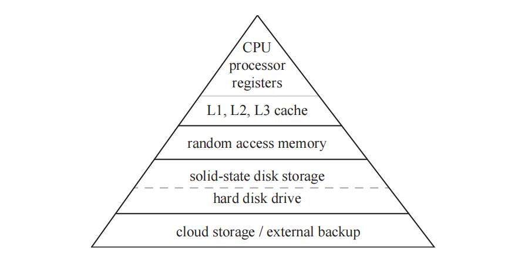
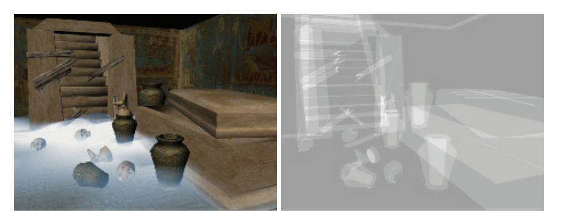
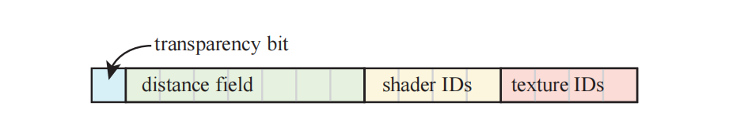
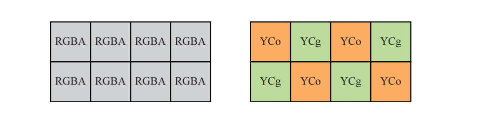
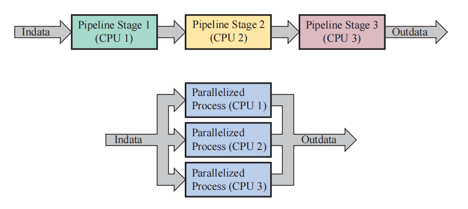
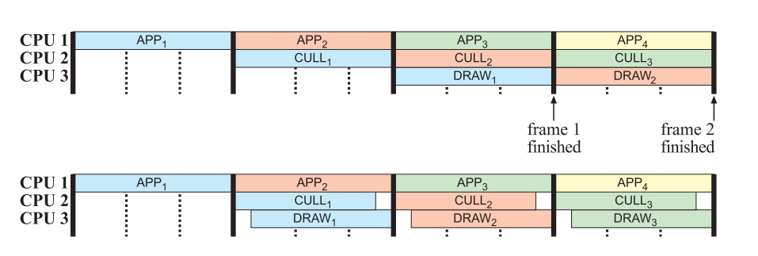

# Chapter 18 Pipeline Optimization 管线优化

## 目录

-   [18.1 分析和调试工具](#181-分析和调试工具)
-   [18.2 定位性能瓶颈](#182-定位性能瓶颈)
    -   [18.2.1 应用阶段测试](#1821-应用阶段测试)
    -   [18.2.2 几何处理阶段测试](#1822-几何处理阶段测试)
    -   [18.2.3光栅化阶段测试](#1823光栅化阶段测试)
    -   [18.2.4像素处理阶段测试](#1824像素处理阶段测试)
    -   [18.2.5 合并阶段测试](#1825-合并阶段测试)
-   [18.3 性能测量](#183-性能测量)
-   [18.4 优化](#184-优化)
    -   [18.4.1 应用阶段](#1841-应用阶段)
        -   [内存问题](#内存问题)
    -   [18.4.2 API调用](#1842-API调用)
        -   [状态改变](#状态改变)
        -   [合并和实例化](#合并和实例化)
    -   [18.4.3 几何处理阶段](#1843-几何处理阶段)
    -   [18.4.4 光栅化阶段](#1844-光栅化阶段)
    -   [18.4.5 像素处理阶段](#1845-像素处理阶段)
    -   [18.4.6 帧缓冲技术](#1846-帧缓冲技术)
    -   [18.4.7 合并阶段](#1847-合并阶段)
-   [18.5 多处理](#185-多处理)
    -   [18.5.1 多处理器流水线](#1851-多处理器流水线)
    -   [18.5.2 并行处理](#1852-并行处理)
    -   [18.5.3 基于任务的多处理](#1853-基于任务的多处理)
    -   [18.5.4 图形API的多处理支持](#1854-图形API的多处理支持)
-   [补充阅读和资源](#补充阅读和资源)

> Donald Knuth——“We should forget about small efficiencies, say about 97% of the time: Premature optimization is the root of all evil.”

> 唐纳德·克努特——“我们应当在97%的时间中忘记优化：过早优化是万恶之源。”（美国计算机科学家，1974年图灵奖获得者；1938—）

在本书中，算法都是在质量、内存、性能权衡的上下文中进行介绍的。而在本章节中，我们将讨论与特定算法无关的性能问题和优化机会。本章节的重点在于性能瓶颈的检测和优化，我们首先会介绍一些小的、局部的更改优化，直到将应用程序作为一个整体，来利用多处理功能。

我们在第2章中介绍了，渲染图像的过程是基于流水线架构的，主要有四个概念阶段：应用阶段、几何处理阶段、光栅化阶段和像素处理阶段。总有一个阶段会成为瓶颈，即流水线中最慢的那个步骤。换句话说，这个瓶颈阶段决定了整个管线的吞吐量极限（即总的渲染性能），因此性能瓶颈是优化（optimization）的主要候选项。

对渲染管线的性能进行优化，类似于流水线处理器（CPU）\[715]的优化过程，因为它主要包括两个步骤。第一，我们需要对管线的性能瓶颈进行定位。第二，当这个阶段得到某种程度上的优化之后，如果还是没有达到优化目标，那么会再次重复第一步。需要注意的是，在优化步骤之后，瓶颈可能会出现在另外一个地方。最好只在瓶颈阶段投入足够的优化精力，这样瓶颈可能就会转移到另一个阶段中。在这个阶段再次成为性能瓶颈之前，可能还需要对其他几个阶段进行优化。因此，我们不应当把精力浪费在对某个单一阶段进行过度优化（over-optimizing）上。

性能瓶颈的位置可能会在一帧中，甚至在一次draw call中发生变化。在某个时刻，几何阶段可能会成为性能瓶颈，因为此时需要渲染许多微小的三角形。之后的像素处理阶段也可能会成为性能瓶颈，因为在每个像素上都会计算很繁重的程序化着色器。在像素着色器中，执行过程可能会因为纹理队列已满而发生停滞，或者在到达特定循环或者分支时花费更多的处理时间。所以，如果我们说此时应用程序阶段是性能瓶颈，我们的意思是指，在这一帧中的大多数时间内，应用阶段都是性能瓶颈，但是性能瓶颈通常都会有很多个。

由于渲染管线是一种流水线结构，充分利用流水线结构的另一种方法是认识到，如果最慢的那个阶段已经无法再进一步优化时，可以适当调整其他阶段，让它们的速度与最慢的那个阶段相匹配。这样做并不会改变性能表现，因为流水线中的最慢阶段并没有改变效率，但是可以使用额外的计算处理，来在有限的性能下尽可能提高图像质量\[1824]。例如：假设现在的瓶颈位于应用阶段，生成一帧画面需要50 ms，而其他的每个阶段都只需要25 ms。这意味着在不改变渲染管线速度的情况下（50 ms的帧渲染时间，相当于每秒20帧），几何阶段和光栅化阶段在50 ms内完成它们的工作就可以了。例如：我们可以使用更加复杂的光照模型，或者是增加阴影和反射的真实感，当然这个前提是这些操作不会再增加应用阶段的工作量。

计算着色器的出现和使用，也改变了我们对于瓶颈和未使用资源的看法。例如：假设我们正在渲染一张阴影贴图，那么此时顶点着色器和像素着色器的任务十分简单，如果此时一些固定功能的管线阶段（例如光栅化或者像素合并）成为性能瓶颈，那么GPU的计算资源可能得不到最充分的利用。当出现这样的情况时，可以使用异步的计算着色器来重叠绘制（overlapping draw），从而使得着色器单元保持时刻忙碌\[1884]。本章的最后一小节中，我们还会讨论基于任务的多处理（task-based multiprocessing）。

流水线优化是一个过程，在这个过程中，我们首先要最大化渲染速度（优化瓶颈），然后再允许那些非瓶颈阶段与瓶颈阶段消耗一样多的时间。也就是说，这这并不总是一个简单的过程，因为不同的GPU和驱动程序可能都会有自己的特性和快速路径。在阅读这一章的时候，你要牢记一句格言（了解你的体系结构）：

$$
KNOW \enspace YOUR \enspace ARCHITECTURE
$$

因为在不同的体系结构中，相应的优化技术会有很大差别。也就是说，要警惕基于特定的GPU硬件来对功能实现进行优化，因为硬件并不是一成不变的，它可能会随着时间的推移而变化\[530]。另一个相关的格言是（测量，测量，再测量）：

$$
MEASURE, MEASURE, MEASURE.
$$

## 18.1 分析和调试工具

分析（profiling）工具和调试（debugging）工具对于发现代码中的性能问题十分有用，这些工具的能力各不相同，包括：

-   帧捕获与可视化。通常可以对某一帧画面进行分步回放，并显示相应的状态和资源使用显示情况。
-   分析CPU和GPU的运行时间，包括调用图形API所花费的时间。
-   着色器调试，以及可能的热编辑功能（hot editing），它允许在修改代码之后，立即查看对应的效果。
-   在应用程序中设置调试标记（debug marker），从而帮助开发人员识别代码区域。

这些分析和调试工具会因操作系统、图形API以及GPU硬件厂商而异。对于上述功能的大多数组合都有相应的工具，这也就是为什么上帝（God）创造了谷歌（Google）的原因（译者注：一个梗，类似于“内事不决问百度，外事不决问谷歌，房事不决问天涯”）。下面我们将介绍一些专门用于交互式图形程序的软件名称，以帮助您开始性能优化任务：

-   RenderDoc是一个高质量的Windows，Linux，Android调试器，它可以用于DirectX，OpenGL和Vulkan。它最初是由Crytek开发的，现在已经开源了。
-   GPU PerfStudio是AMD为其图形硬件提供的专属工具套件，可在Windows和Linux上运行。它提供了一个值得注意的工具，即一个静态着色器分析器，它可以在不运行程序的情况下对性能进行评估。AMD的Radeon GPU Profiler是一个独立的、类似的工具。
-   NVIDIA的Nsight是一个具有广泛功能的性能和调试系统。它集成在了Windows上的Visual Studio中，以及Mac OS和Linux上的Eclipse中。
-   Microsoft的PIX长期以来一直被Xbox开发人员所使用，并被带回到了Windows上的DirectX 12。Visual Studio中的Graphics Diagnostics功能可以用于早期版本的DirectX。
-   Microsoft的GPUView使用了ETW （Event Tracing for Windows），这是一个高效的事件日志系统。GPUView是几个使用ETW会话的程序之一，它重点关注CPU和GPU之间的交互，并可以表明具体哪个是瓶颈\[783]。
-   Graphics Performance Analyzer （GPA）是英特尔的一个套件，它专注于性能和帧分析，同时并不仅局限于他们的图形芯片。
-   OSX上的Xcode提供了Instruments，其中有一些用于计时、性能、网络、内存泄漏的工具。值得一提的是OpenGL ES Analysis，它可以检测性能和正确性问题，并可以提出一些解决方案。还有Metal System Trace，它可以提供来自应用程序、驱动程序和GPU中的追踪信息。

上述这些工具是一些主要使用的工具，并且已经存在好几年了。但是，有时候也可能会没有工具能够完成我们想实现的目的。大多数API都内置了计时器查询（timer query）工具，从而帮助分析GPU的性能。一些供应商也提供了相应的库，来访问GPU计数器和线程追踪等。

## 18.2 定位性能瓶颈

优化管线的第一步是找到最大性能瓶颈的所在处\[1679]。寻找瓶颈的一种方法是设置多个测试，其中每个测试都会减少特定阶段所执行的工作量。如果其中一个测试会导致帧率上升，那么我们就发现了一个瓶颈阶段。还有一个类似的方法可以对某一个阶段进行测试，即减少其他阶段的工作量，同时保持被测阶段的工作量不变。如果此时的性能表现没有发生改变，那就说明当前被测阶段是性能瓶颈。一些性能工具可以提供详细的API调用开销，并能够指出哪些API调用的开销最大，但是它不一定能够准确指出管线中的哪个阶段是性能瓶颈。即使这些性能工具能够实现这一点，去理解每个测试背后的思想也是十分有用的。

下面我们对用于测试各个阶段的一些想法进行简要讨论，来说明具体如何进行这种测试。统一着色器架构（unified shader architecture）的出现是理解底层硬件重要性的一个完美例子。从2006年底开始，它逐渐成为了许多GPU的硬件基础，其核心思想是，顶点着色器、像素着色器以及其他的一些着色器，都使用相同的硬件功能单元进行实现。GPU负责完成负载均衡（load balancing），并动态改变分配给顶点着色器和像素着色的计算单元比例。举个例子：如果我们现在渲染一个较大的四边形，那么只有少数几个着色器单元会分配给顶点变换，而大部分的着色器单元都会分配给片元处理任务。想要确定瓶颈位于顶点着色阶段还是在像素着色阶段就不那么容易了\[1961]。无论是整个着色器处理，还是管线中的其他功能阶段，都将可能会成为性能瓶颈的所在处，因此我们会依次对每种可能性进行讨论。

### 18.2.1 应用阶段测试

如果我们所使用的平台可以提供用于测量处理器工作负载的实用程序，那么我们可以使用这个程序来查看我们的图形程序是否使用了100%（或者接近100%）的CPU处理能力。如果CPU的占用率一直很高，那么这个程序可能会是CPU瓶颈的（CPU-limited）。这种方法也并不是万无一失的，因为有时应用程序可能会等待GPU渲染完一帧。我们说一个程序是CPU瓶颈或者GPU瓶颈，但是这个瓶颈可能会在一帧的生命周期中发生变化。

一种测试CPU瓶颈的巧妙方法是，只向GPU发送一些导致其很少工作或者根本不工作的数据。在某些系统中，这个操作可以直接通过使用一个空的驱动程序（一个接受调用，但是不执行任何操作的驱动程序）代替真正的驱动程序来进行实现。这实际上是为整个程序的运行速度设置了上限，因为我们既不使用图形硬件，也不调用驱动程序，也就是说，一个运行在CPU上的应用程序，始终是CPU瓶颈的。通过这种测试，我们可以了解到在应用程序阶段之外，剩余基于GPU的阶段还有多少改进优化的空间。同时需要注意，由于驱动程序还需要处理自身的一些任务，以及完成CPU和GPU之间的通信，因此使用一个空的驱动程序可能会隐藏这些由于驱动程序而造成的瓶颈。驱动程序通常是造成CPU端瓶颈的原因，我们将在后续内容中深入讨论这个话题。

如果可能的话，另一种更加直接的方法是降低CPU的时钟频率\[240]，CPU频率的降低意味着CPU性能的降低。如果此时应用程序的性能降低与CPU的频率降低成正比，那么这个应用程序至少在某种程度上是与CPU性能相绑定的。GPU同样也可以采用类似的降频（underclock）方法。如果GPU频率降低会导致应用程序的性能成比例的降低，那么至少在某些时候，这个应用程序是与GPU性能相绑定的。这些降频方法可以帮助识别性能瓶颈，但是有时候也会导致之前不是瓶颈的阶段变成瓶颈。另一个相对的选择是超频（overclock），但是这里没有提及。

### 18.2.2 几何处理阶段测试

几何阶段是最难进行测试的阶段。这是因为如果几何阶段的工作负载发生了变化，那么其他一些阶段的工作负载也经常会发生相应的变化。为了避免这个问题，Cebenoyan \[240]给出了一系列从光栅化阶段回归到管线的测试。

在几何阶段中，瓶颈主要出现会在这两个方面：顶点获取和顶点处理。如果想要知道瓶颈是否来自于模型的数据传输，我们可以增大顶点格式的大小。例如：我们可以在每个顶点上发送一些额外的纹理坐标来增大顶点数据，如果性能出现下降，则说明这个阶段就是性能瓶颈。

顶点处理由顶点着色器完成。对于顶点着色器的瓶颈测试，可以让着色器程序变得更长更复杂。但是要小心确保编译器不会优化掉这些额外的指令。

如果我们的管线中还使用了几何着色器，其性能会受到输出大小和程序长度的影响。如果我们使用了曲面细分着色器，其性能同样会受到程序长度的影响，以及还有曲面细分因子的影响。使用控制变量法，改变这些元素中的其中一个，同时尽量保证其他阶段的工作负载不变，可以我们帮助确定这些元素是否是导致性能瓶颈的原因。

### 18.2.3光栅化阶段测试

这个阶段包括了三角形设置和三角形遍历两个子阶段。在生成阴影贴图的时候，我们会使用极其简单的像素着色器程序，因此可能会在光栅化阶段或者合并阶段出现瓶颈。还有一种情况可能会使三角形设置和光栅化阶段成为性能瓶颈，即渲染那些来自曲面细分或者类似物体（例如草叶和树叶）的微小三角形，当然这种情况通常很少会发生\[1961]。并且，这些微小三角形也会增加顶点着色器和像素着色器的开销。在某个给定区域中添加更多数量的顶点，显然会增加顶点着色器的工作负载，同时也会增加像素着色器的工作负载，因为每个三角形都会以$2 × 2$的四边形为一组来进行光栅化，因此小三角形会增加每个三角形外部的辅助像素数量\[59]，有时这也会被称为四边形过度渲染（quad overshading，章节23.1）。为了确定光栅化是否真的为瓶颈，可以通过增大顶点着色器和像素着色器的程序大小，来延长它们的执行时间。如果每帧的渲染时间没有增加，那么就说明瓶颈位于光栅化阶段。

### 18.2.4像素处理阶段测试

像素着色程序的影响可以通过改变屏幕分辨率来进行测试。如果以一个较低的屏幕分辨率来进行渲染会导致帧率明显上升，那么说明像素着色器很可能会是性能瓶颈，至少在某些时候是这样的。如果有一个设计良好的系统，那么就需要当心，因为较小的屏幕分辨率也可能会导致使用简化模型来进行渲染，从而降低几何处理阶段的负载。

直接降低显示分辨率可能还会影响三角形遍历、深度测试和混合、以及纹理访问等方面的开销。为了避免这些因素的影响，并对瓶颈进行隔离，可以使用一种与顶点着色程序测试相同的方法，即添加更多的指令来观察对执行速度的影响。同样地，需要确保这些额外的指令，不会被编译器优化掉。如果此时的帧渲染时间增加了，那么说明像素着色器可能就是瓶颈（或者至少在执行成本增加的时候成为了瓶颈）。另外，可以将像素着色器中的指令简化到最少程度，这一点在顶点着色器中通常是很难做到的。如果此时的帧渲染时间减少了，那么说明像素着色器可能就是瓶颈。纹理缓存未命中的开销也可能会很高，我们可以尝试使用一个$1 × 1$分辨率的纹理来代替原来的纹理，如果这样做可以提供更快的性能表现，那么纹理内存的访问就是一个瓶颈。

着色器是一些独立的程序，有着自己独特的优化技术。Persson \[1383, 1385]介绍了几种低层级（low-level）着色器优化方法，以及关于图形硬件如何发生演变，最佳实践如何发生变化的相关细节。

### 18.2.5 合并阶段测试

在这个阶段中会进行深度测试和模板测试，还会进行混合操作，并将幸存下来的结果写入缓冲区中。改变这些缓冲区的输出bit深度是一种改变此阶段带宽成本的方法，这样可以帮助我们查看这个阶段是否会成为瓶颈。为不透明对象开启alpha混合，或者使用其他的混合模式，也会影响光栅化操作中执行内存访问和处理的数量。

这个阶段可能会成为后处理pass、阴影、粒子系统渲染的瓶颈。在较小的程度上，也可能会成为毛发渲染和草叶渲染的瓶颈，因为在这些渲染过程中，顶点着色器和像素着色器都很简单，它们所做的工作比较少。

## 18.3 性能测量

为了实现优化目的，我们需要对性能表现进行测量。这里我们会讨论一些有关GPU速度的不同指标。图形硬件制造商过去常常会提供峰值速率（peak rate），例如每秒处理的顶点数（vertices per second）和每秒处理的像素数（pixels per second）等，这些指标在开发过程中是很难达到的。此外，由于我们处理的是一个流水线系统，因此真正的性能表现并不像所列出的这些数字一样简单。这是因为在运行过程中，瓶颈的位置可能会随着时间的变化而变化，并且管线中的不同阶段在执行期间会以不同的方式进行交互。由于这种过程的复杂性，因此GPU在市场上的部分卖点是其物理特性，例如：内核的数量和时钟频率、内存的大小、速度和带宽等。

尽管如此，如果使用得当的话，GPU计数器和线程追踪仍然是重要的诊断工具。如果某个给定部分的峰值性能是已知的，但是它的计数较低，那么这个区域不太可能会成为瓶颈。有些硬件供应商会将计数器数据表示为每个阶段的利用率百分比。这些值是在一段时间内给出的，在这段时间内瓶颈可能会发生移动，因此这些参数并不完美，但是它们对于瓶颈定位仍有很大帮助。

这种衡量性能的指标越多越好，但是即使是一些看似简单的物理指标也很难进行精确比较。例如：同一款GPU芯片的时钟频率在不同IHV合作伙伴（译者注：例如华硕、微星等厂商）之间可能也会有所不同，因为每个IHV都有着自己的散热方案，因此会将各自出厂的GPU超频到它们所认为安全的范围内，因此不同厂家的同一款型号显卡，出厂频率都有所不同。即使是在单个系统上进行FPS基准比较（benchmark），也并不总是像听起来那么简单。NVIDIA的GPU Boost \[1666]和AMD的PowerTune \[31]技术就是一个很好的例子，也非常符合我们之前提到的格言“know your architecture”。NVIDIA的GPU Boost之所以会出现，部分原因就是一些复合的基准测试，这些基准测试会同时运行GPU管线中的许多部分，从而将GPU的功耗推到极限，这意味着NVIDIA不得不降低GPU的基本频率以防止芯片过热。大多数应用程序不会同时对管线的所有部分都进行这样的操作，因此在这些应用中，GPU可以安全地以更高频率来运行。GPU Boost技术会追踪GPU的功耗和温度特征，并相应地调整运行频率。AMD和Intel对他们的GPU也有类似的功耗/性能优化。这种多变性可能会导致相同的基准测试以不同的速度来运行，具体会取决于GPU的初始温度。为了避免这个问题，微软在DirectX 12中提供了一种方法来锁定GPU核心的频率，从而获得稳定的时序\[121]。其他的一些API也可以检查GPU的功率状态，但是要更加复杂\[354]。

在测量CPU性能的时候，整体的趋势是避免使用每秒指令数（instructions per second，IPS）、每秒浮点操作数（floating point operations per second，FLOPS）、GHz（gigahertz）以及简单的短基准测试。相反，首选的方法是对一系列不同的实际程序进行测试，然后再比较这些程序的运行时间\[715]。遵循这一趋势，大多数独立的图形基准测试都是针对几个给定场景、各种不同的屏幕分辨率、不同的抗锯齿设置和画面质量设置等，来测量这些程序的实际帧率。许多图形密集型（graphics-heavy）的游戏中都包含了基准测试模式，或者是由第三方创建的基准测试（例如《CS:GO》的创意工坊地图FPS Benchmark），这些基准测试通常用于比较GPU的性能。

FPS是一种比较GPU运行基准的粗略表达，在对一系列帧率进行分析的时候应当避免使用FPS。FPS的问题在于它是一个倒数度量，它并不是线性的，因此可能会导致错误分析。例如：假设我们发现应用程序在不同时间的帧率分别为50 FPS，50 FPS和20 FPS。我们将这些帧率进行平均之后，可以得到40 FPS的平均帧率。但是这个值是非常具有误导性的，并且是错误的。我们可以将这些帧率转换为帧渲染时间，即20 ms、20 ms和50 ms，因此平均的帧渲染时间为30 ms，对应在帧率上就是33.3 FPS。类似地，在测量各个算法性能的时候，也需要以毫秒为单位进行评价。对于一个给定基准测试与给定性能的机器，我们可以说某些阴影算法或者后处理效果“消耗”了7 FPS，并且基准测试的运行速度要慢得多。然而，我们无法将这句话进行推广，也没法用在其他性能的机器上，这是没有意义的，因为这个值还取决于处理其他内容所需的时间，而且我们也无法将不同技术的FPS指标相加，这是没有意义的，但是我们可以将各种算法花费的时间相加在一起\[1378]。

为了能够看到管线优化所带来的潜在影响，我们需要在禁用双缓冲的情况下，对每帧的总渲染时间进行测量，即在单缓冲模式下关闭垂直同步（vertical synchronization）。这是因为在开启双缓冲的情况下，帧缓冲区的交换只能与监视器的频率同步，我们在章节2.1中介绍过。De Smedt \[331]讨论了对帧生成时间的分析，可以通过这种分析，发现并修复由CPU工作负载峰值所引起的卡顿问题，以及一些可以优化性能的有用技巧。使用这种统计分析通常是有必要的，也可以使用GPU上的时间戳来了解一帧内发生的事情\[1167, 1422]。

设备的原生速度固然很重要，但是对于移动设备来说，另一个目标是对功耗进行优化。适当降低帧率同时保持应用程序的交互性，可以显著延长电池寿命，同时对用户的体验影响不大\[1200]。Akenine-Moller和Johnsson指出\[25, 840]，每瓦性能（performance per watt）和每秒帧数（frames per second），与FPS具有相同的缺点。他们认为更加有用的测量方法是每项任务的焦耳数（joules per task），例如每像素的焦耳。

## 18.4 优化

一旦我们找到性能瓶颈的所在位置，我们希望能够对这个阶段进行优化，从而提高性能表现。在本小节中，我们将介绍应用阶段、几何处理阶段、光栅化阶段和像素处理阶段中的优化技术。

### 18.4.1 应用阶段

可以通过使得程序代码的效率更高、程序的内存访问速度更快或者次数更少来对应用阶段进行优化。这里我们将讨论一些适用于CPU代码优化的通用元素。

对于代码优化而言，找到代码中花费时间最多的位置是至关重要的。一个好的代码分析器可以帮助快速找到这些代码热点，这里的代码热点是指花费的时间最多的代码片段，然后再针对这些地方进行优化。程序中的代码热点通常都是内部循环（inner loop），即每一帧会执行多次的代码片段。

优化的基本准则是尝试各种优化策略：重新检查算法、假设以及代码语法，并尽可能地尝试各种变体。CPU的架构和编译器的性能，通常会限制开发人员形成如何编写高效率代码的直觉能力，因此我们需要经常对假设进行质疑，并保持开放的心态。

第一步是对编译器的优化标志（optimization flag）进行试验。通常有许多不同的优化标志可以进行尝试，对于具体要使用什么样的优化选项，不要做过多的假设。例如：将编译器设置为使用更加激进的循环优化，可能会导致代码变得更慢。此外，如果可能的话，还可以尝试使用不同的编译器，因为不同的编译器会以不同的方式进行优化，其中一些要明显优于其他的编译器。可以使用分析器来了解这个更改所产生的影响。

#### 内存问题

在很多年前，算术指令的数量是衡量算法效率的关键指标，而如今则是内存访问模式（memory access pattern）。处理器的速度在过去的很多年间快速增长，而DRAM的数据传输速度则增长有限，因为DRAM会受到引脚数量的限制。从1980年到2005年，CPU的性能大约每两年翻一番，而DRAM的性能大约要每六年才能翻一番\[1060]。这个问题被称为冯·诺依曼瓶颈（Von Neumann bottleneck）或者内存墙（memory wall）。而面向数据设计（data-oriented design）则将缓存一致性作为一种优化手段。

> 面向数据设计（data-oriented design）不能与数据驱动设计（data-driven design）混淆，数据驱动设计可以指很多东西，从AWK编程语言到A/B测试等。

在现代的GPU硬件上，最重要的是数据传输的距离，传输速度和功耗与这个距离成比例。不同的缓存访问模式可以造成数量级上的性能差异\[1206]。这里的缓存（cache）是指一个较小的快速存储区域，它的存在原因是因为程序中通常会有很多一致性（coherence，也可以叫做相关性，连贯性），而缓存可以有效利用这些一致性。也就是说，内存中的相邻位置往往会被依次访问（空间局部性），并且代码通常也是按照顺序进行访问的。此外，同一个内存位置往往也会被重复访问（时间局部性），缓存也会利用这一点\[389]。处理器高速缓存的访问速度非常快，速度仅次于寄存器（register）。许多快速算法的工作原理就是尽可能在本地来访问数据，并且尽可能少地访问内存数据。



寄存器和本地高速缓存构成了存储层次结构中的顶端，并延伸到动态随机存取存储器（dynamic random access memory，DRAM），即内存；然后再到固态硬盘（SSD）和机械硬盘（HDD）中的存储。顶部是少量、高速但昂贵的内存，底部是大量、缓慢但廉价的存储。在每个层次之间都会出现明显的速度下降，如图18.1所示。例如：处理器中的寄存器通常可以在一个时钟周期内完成访问操作，而L1高速缓存则需要在几个周期内才能完成访问。存储级别的每一次变化都会以这种方式增加延迟。我们在章节3.10中讨论过，延迟有时可以被体系结构所隐藏，但是延迟是一个始终需要牢记的因素。

不良的内存访问模式很难在分析器中直接检测出来。需要在一开始的程序设计阶段，就内嵌一个良好的内存访问模式\[1060]。下面的列表是在编程过程中应当考虑的一些因素：

-   代码中按顺序访问的数据，也应当按顺序存储在内存中。例如：在渲染一个三角形网格的时候，其数据顺序为：纹理坐标#0，法线#0，颜色#0，顶点#0，纹理坐标#1和法线#1，如果按照这个顺序去依次访问它们，那么也要将它们依次存储在内存中。这在GPU上也很重要，就像变换后的顶点缓存一样（章节16.4.4）。另外，请参阅章节16.4.5，来了解为什么存储单独的数据流是有益的。
-   避免间接指针、跳转和函数调用（在代码的关键部分），因为这些操作可能会显著降低CPU的性能表现。当我们使用一个指针来指向另一个指针的时候，这样就得到了一个间接指针（pointer indirection），并且可以以此类推下去。现代CPU会尝试预测性地执行指令（分支预测）和获取内存（缓存预取），从而保持所有功能单元都时刻忙碌。当循环中的代码流程保持一致时，这些技术非常有效，但是在一些分支数据结构（例如二叉树、链表和图等）上就会失效；因此我们要尽可能使用数组。McVoy和Staelin \[1194]给出了一个通过指针来追踪链表的代码示例，这样做导致前后数据的缓存未命中，并且在他们的示例中，CPU停顿的时间要比追踪指针所需的时间长100倍以上（如果缓存可以提供指针地址的话）。Smits指出\[1668]，可以将基于指针的树结构扁平化为一个带有跳跃指针的列表，从而大大改进了层次结构的遍历效率。使用van Emde Boas布局是另一种避免缓存未命中的方法，详见章节19.1.4。高分支的树结构通常要比二叉树更加可取，因为分支越多，树的深度就越低，从而减少了间接指针的数量。
-   将经常使用的数据结构与缓存行大小的倍数进行对齐，这样做可以显著提高整体性能。例如：64字节的缓存行在Intel和AMD处理器\[1206]上十分常见。编译器选项可以提供一些帮助，但是更加明智的做法是，在设计数据结构的时候考虑对齐问题，即填充（padding）操作。Windows和Linux上的VTune和CodeAnalyst、Mac上的Instruments，以及Linux上的开源Valgrind等工具，可以帮助识别缓存瓶颈。数据对齐也会影响GPU着色器的性能表现\[331]。
-   尝试数据结构的不同组织方式。例如：Hecker \[698]展示了如何对一个简单的矩阵乘法器，测试各种不同的矩阵结构来节省大量时间。对于一个结构体数组：
    ```c++
    struct Vertex { float x,y,z ;};
    Vertex myvertices [1000];
    ```
    或者一个数组结构体：
    ```c++
    struct VertexChunk {float x[1000], y[1000], z[1000];};
    VertexChunk myvertices ;
    ```
    不同的数据组织方式在不同架构上的性能表现也不同。第二种结构更加适合使用SIMD命令，但是随着顶点数量的增加，缓存未命中的概率也会增加。随着数组大小的增加，使用一个混合方案可能会是最佳选择：
    ```c++
    struct Vertex4 { float x[4] ,y[4] ,z [4];};
    Vertex4 myvertices [250];
    ```
-   最好是在启动的时候，为相同大小的对象分配一个较大的内存池，然后使用我们自行编写的分配程序和释放程序来管理这个内存池中的内存\[113, 736]。Boost等库提供了池分配功能。与那些创建的记录相比，一组连续的记录会更有可能在缓存中保持一致性。也就是说，对于具有垃圾回收功能的语言（例如C#和Java），内存池实际上会降低性能表现。

虽然与内存访问模式没有直接关系，但是在渲染循环中分配或者释放内存的操作是非常值得避免的。可以使用一些内存池，同时只进行一次的临时空间分配，让栈、数组和其他存储结构只增不减（使用变量或者标志来标记哪些元素应当被删除）。

### 18.4.2 API调用

在本书中，我们会根据硬件的一般趋势，然后再给出相应的建议，例如：带索引的顶点缓冲区对象通常是为加速器提供几何数据的最快方法（章节16.4.5）。本小节将介绍如何以最佳方式来调用图形API。大多数图形API都有着类似的架构，并且有相当完善的方法来高效使用它们。

理解对象缓冲区（object buffer）的分配和存储是高效渲染的基础\[1679]。对于具有CPU和独立GPU（独立显卡）的台式机而言，CPU和GPU通常都会有各自的专属内存。图形驱动程序可以控制内存对象的驻留位置，但是也可以给它一些提示，告诉它最佳的存储位置在哪里。一个常见的分类是静态缓冲区和动态缓冲区。如果一个缓冲区中的数据每一帧都在发生变化，则可以使用动态缓冲区（不需要GPU上的长期存储空间）。游戏主机、集成低功耗GPU的笔记本电脑、移动设备通常都有统一内存（unified memory），其中GPU和CPU会共享相同的物理内存。即使是在这些设备当中，在正确的资源池中分配资源也十分重要。正确地将资源标记为CPU-only或者GPU-only可以带来一些好处。一般来说，如果一个内存区域会被两个芯片访问，那么当其中一个芯片向内存写入数据的时候，另一个芯片必须要使其缓存失效（这是一个昂贵的操作），以确保不会得到过时的错误数据。

如果一个物体不会发生变形，或者这个变形过程可以完全由着色器程序来执行（例如：蒙皮），那么可以将这个物体的数据存储在GPU的内存中，这会带来一些性能收益。可以将其存储在静态缓冲区中，来表明该对象的不变性。通过这种方式让数据驻留在GPU的显存中，每次渲染不需要重新通过总线来发送数据，从而完全避免了管线在这一阶段中的瓶颈。一般情况下，GPU的显存带宽要比CPU和GPU之间的总线带宽高得多。

#### **状态改变**

调用图形API有几个与之相关的开销。在应用程序端，无论这个调用实际做了些什么，更多的调用就会意味着需要花费更多的应用程序时间。这种开销可能是很小的，也可能是很明显的，可以使用一个空的驱动程序来帮助识别这种开销。依赖于GPU值的查询函数，可能会由于与CPU的同步而发生停滞，从而使得帧率降低一半\[1167]。在这里，我们将深入研究并优化一个常见的图形操作，即对管线进行准备来绘制一个网格。这个操作可能涉及一些状态改变（state change），例如：设置着色器及其统一变量、附加的纹理、更改混合状态、更改所使用的颜色缓冲等。

提高应用程序性能的一个主要方法是，将具有相似渲染状态的对象进行分组处理，从而最小化状态更改所带来的开销。由于GPU是一种极其复杂的状态机，同时很可能是计算机科学中最为复杂的状态机，因此状态改变的成本可能会很高。其中一小部分的成本可能会涉及到GPU，但是绝大部分的成本都来自在CPU上执行的驱动程序。如果GPU能够很好地映射到API，那么状态改变的成本往往是可预测的，尽管仍然会很大。如果GPU有着严格的功率限制、或者有限的芯片面积（例如在某些移动设备上）、或者是有硬件错误需要解决，那么驱动程序将不得不执行一额外些处理，从而导致额外的高开销。状态改变的成本主要在CPU端的驱动程序中。

一个具体的例子是PowerVR架构中是如何支持混合操作的。在旧API中，混合操作是使用的固定功能的接口类型进行指定的。而PowerVR中的混合操作则是可编程的，这意味着其驱动程序必须将当前的混合状态打包到像素着色器中\[699]。在这种情况下，一些更加高级的设计不能很好地映射到API中，因此在驱动程序中会产生很大的设置成本。在本章节中，我们会注意到不同硬件架构和运行软件对各种优化影响的重要性，尤其是对于状态改变的成本。甚至是特定的GPU类型和特定版本的驱动程序也可能会对性能表现产生影响。在阅读本章节的时候，请时刻牢记“your mileage may vary”。（译者注：这是一句俗语，简称YMMV，字面意思是“您的历程可能有所不同”，代表过程中的变量会改变最终的结果）。

Everitt和McDonald \[451]指出，不同类型的状态改变在成本上有着很大的差异，并给出了一些关于在NVIDIA OpenGL驱动程序上，每秒可以执行多少次状态改变的粗略估计。以下是他们在2014年的列表，开销从高到低依次递减：

-   渲染目标（render target）（framebuffer对象），大约60k/秒。
-   着色器程序，大约300k/秒。
-   混合模式（ROP），例如透明度。
-   纹理绑定，1.5M/秒。
-   顶点格式。
-   统一缓冲区对象（uniform buffer object，UBO）绑定。
-   顶点绑定。
-   统一变量更新，大约10M/秒。

这个大致的成本顺序也得到了其他人的证实\[488, 511, 741]。一个更加昂贵的状态改变操作，是在GPU的渲染模式和计算着色器模式之间进行切换\[1971]。想要避免发生状态改变，可以对要显示的对象按照着色器类型进行分组，然后按照使用的纹理进行分组，以此类推（按照成本顺序）进行排序分组。按照状态进行排序有时会被称为批处理（batching）。

另一种策略是重构对象的数据组织方式，从而实现更多的共享。减少纹理绑定改变的一种常见方法是，将多个纹理图像放入一个大纹理中，或者更好的是放入一个纹理数组（texture array）。如果API支持的话，使用无绑定纹理（bindless texture）是另一种避免状态改变的选择（章节6.2.5）。与更新统一变量相比，对着色器程序进行修改的成本通常要高得多，因此同一类材质之间的变化可以使用使用“if”语句来进行切换，这要比使用单个着色器更好。我们也可以通过共享一个着色器来实现更大的批次\[1609]。然而，让着色器变得更加复杂也会降低GPU的性能表现。可以通过实际实验测量，来看看那种方法更加高效，这是唯一万无一失的方法。

对图形API进行更少、更加高效的调用可以额外节省一些成本。例如：通常可以将多个统一变量打包成一组，绑定单个统一缓冲区对象的效率要高得多\[944]。在DirectX中，这样的缓冲区被称为常量缓冲区（constant buffer）。正确使用这些方法，既可以节省每个函数的执行时间，也可以节省在每次API调用中进行错误检查的时间\[331, 613]。

现代驱动程序通常会推迟状态设置，直到遇到第一个draw call为止。如果在此之前进行了几次冗余的API调用，那么驱动程序将会过滤掉这些调用，从而避免状态改变。通常会使用一个脏标记（dirty flag）来指出需要进行的状态改变，因此在每次draw call之后都返回一个基本状态可能会变得成本很高。例如：当我们要绘制一个对象时，我们可能会假设状态$X$默认是关闭的。实现这一目标的一种方法是“启用（$X$）；绘制（$M_1$）； 禁用（$X$）”，然后再 “启用（$X$）；绘制（$M_2$）； 禁用（$X$）”，即在每次绘制操作之后都会恢复初始状态。然而，在两次draw call之间对状态进行再次设置很可能会浪费大量时间，即使它们之间并没有发生实际的状态改变。

通常来说，应用程序对于何时需要进行状态改变有着更高层次的了解，例如：将不透明表面的混合方式从“替换（replace）”改为透明表面的“叠加（over）”，通常在一帧中只需要完成一次即可，可以避免在这类物体渲染完成之前对混合模式进行改变。Galeano \[511]展示了忽略掉这种过滤操作、以及发出不必要的状态调用，将会使得他们的WebGL应用程序花费近2毫秒/帧的时间。然而，如果驱动程序已经高效地进行了这种冗余过滤操作，那么在应用程序中仍然执行这种相同的测试可能会是另一种浪费。具体花费多少精力来过滤掉冗余的API调用，这主要取决于底层的驱动程序\[443, 488, 741]。

#### 合并和实例化

高效调用API可以避免CPU成为瓶颈。API调用的另一个问题是小批次问题，这是影响现代API性能的一个重要因素。简单地说，一个被三角形填充的网格，渲染起来要比大量小而简单的网格更加高效。这是因为无论这个图元的大小如何，每个draw call都有固定的成本开销（即处理图元的成本）。

早在2003年，Wloka \[1897]就指出，每个批次仅仅绘制两个（尺寸相对较小的）三角形，其效率距离GPU的最大吞吐量还差375倍。对于一个2.7 GHz的CPU而言，此时每秒只能处理40万个三角形，而不是峰值的每秒1.5亿个三角形。对于那些由许多小而简单的物体所组成的场景，这些物体只包含很少的几个三角形，其渲染性能完全受API的CPU限制，GPU的能力再强也没法增加渲染效率。也就是说，这些draw call在CPU上的处理时间，要大于GPU实际渲染网格所需的时间，即GPU没有被充分利用。

> Wloka使用批次“patch”来代表通过一次draw call渲染的单个网格。随着时间的推移，这个术语的含义也越来越广，现在有时指的是要渲染一组具有相同状态的独立对象，因为这样也可以减少API的开销。

Wloka的经验法则是“你每帧只能进行$X$个批次。”这是你每帧能够进行的draw call的最大数量，这纯粹是因为CPU的限制。在2003年，API成为瓶颈的断点（breakpoint）是每个物体大约130个三角形。图18.2展示了这个断点在2006年是如何上升到每个网格510个三角形的。但是随着时代的发展，我们做了很多工作来改善这个draw call问题，同时CPU变得更快了。在2003年的建议是每帧进行300次draw call；而在2012年，这个上限是每帧16000次draw call \[1381]。但是即使是这个相对庞大的数字，对于一些复杂的场景来说也是远远不够的。使用DirectX 12、Vulkan和Metal等现代图形API，可以将驱动程序本身的成本最小化——这也是它们的主要优势之一\[946]。然而，GPU在每个网格上还有一些固定的成本。


减少draw call次数的一种方法是将多个物体合并到一个网格中，这样就只需要一次draw call来渲染该集合即可。对于使用相同状态并且是静态的几何物体而言（至少相对于其他物体来说是静态的），可以进行一次性合并，并且可以每帧中都重用这个批次\[741, 1322]。之所以我们能够合并网格，是因为可以使用一个通用着色器以及纹理共享技术来避免状态改变。合并所节省的成本，不仅仅来自于避免API的过多draw call，同时应用程序本身所处理的物体也变少了，这也可以节省一些开销。然而，如果批次数量远远大于所需要的数量，那么可能会使其他算法（例如视锥体剔除）的效率降低\[1381]。一种做法是使用一个包围盒层次结构，来帮助查找和分组相邻的静态物体。与合并有关的另一个问题是物体选择，因为这些静态物体在同一个网格中是没有区别的。一个典型的解决方案是，在网格的每个顶点中都存储一个对象标识符来进行标记。

另一种最小化应用程序处理和API成本的方法，是使用某种形式的实例化（instancing）技术\[232, 741, 1382]。大多数API都支持在一次draw call中，对同一个物体进行多次绘制。

![图18.3：植被实例化。图中所有颜色相同的对象，都是在一次draw call中进行渲染的。 \[1869\]](images/Chapter-18/202309131121945.png "图18.3：植被实例化。图中所有颜色相同的对象，都是在一次draw call中进行渲染的。 \[1869]")

这通常是通过指定一个基础模型，并提供一个单独的数据结构来实现的，这个数据结构中包含了每个特定实例所需要的信息。除了位置和朝向之外，还可以为每个实例指定其他属性，例如树叶的颜色或者由风所引起的曲率变化，以及任何可以被着色器程序用来影响模型的东西。繁茂的丛林场景可以通过使用实例来进行创建，如图18.3所示。人群场景也是一个很好的例子，通过在一组选择中选择不同的身体部位，每个角色都可以显得与众不同。还可以添加随机着色和贴花效果来实现进一步的变化。实例化也可以与LOD技术相结合\[122, 1107, 1108]，图18.4中展示了这样的一个例子。

![图18.4：人群场景。使用实例化可以最小化所需的draw call数量。同时还使用了LOD技术，例如将远距离的模型渲染为impostor。 \[1107, 1108\]](images/Chapter-18/202309131121631.png "图18.4：人群场景。使用实例化可以最小化所需的draw call数量。同时还使用了LOD技术，例如将远距离的模型渲染为impostor。 \[1107, 1108]")

将合并和实例化相结合的概念，被称为合并实例化（merge-instancing），其中合并网格中所包含的物体，可以依次被实例化\[146, 1382]。

从理论上来说，几何着色器可以用于实现实例化操作，因为它可以根据输入网格创建出对应的重复数据。在实践中，如果需要大量实例的话，这种方法可能要比使用实例化API命令更慢。几何着色器的目的是执行局部的、小规模的数据放大\[1827]。此外，对于某些体系结构而言，例如Mali（一种GPU架构）的基于tile的渲染器（tile-based renderer），几何着色器是在软件上进行实现的，而不是基于硬件实现的。这里引用一句Mali的最佳实践指南\[69]：“为你的问题找到一个更好的解决方案，几何着色器并不是你的解决方案。”

### 18.4.3 几何处理阶段

几何阶段负责完成顶点变换、逐顶点的光照计算、裁剪、投影和屏幕映射等操作。我们在其他章节中，讨论了一些降低通过管线数据量的方法。我们在第16章中所提到的，高效的三角形网格存储方式、模型简化和顶点数据压缩，都可以用于节省处理时间和内存开销。在第19章中所提到的，诸如截锥体剔除和遮挡剔除这样的技术，可以避免将完整的图元本身发送到管线中。在CPU上使用这类大尺度的技术，可以完全改变应用程序的性能特征，因此非常值得在早期开发阶段进行尝试。而在GPU上，这种技术实际上不太常见。一个值得注意的例子是，可以使用计算着色器来执行各种类型的剔除\[1883, 1884]。

光照的效果可以逐顶点计算，也可以逐像素计算（在像素处理阶段），或者两者同时进行计算。光照计算可以通过几种方式来进行优化。首先，应当考虑所使用的光源类型，是所有的三角形都需要进行照明吗？有时模型只需要进行纹理化，在顶点上使用纹理进行着色，或者只是在顶点上添加颜色即可。

如果光源相对于几何物体是静态的，那么漫反射光照和环境光照可以进行预计算，并存储为顶点上的颜色。这种做法通常被称为光照“烘焙”。一种更加精细的预照明形式是预先计算场景中的漫反射全局光照（章节11.5.1）。这样的光照效果可以存储为顶点上的颜色或者强度，也可以存储为光照贴图。

对于前向渲染（forward rendering）系统，光源数量会影响几何处理阶段的性能表现。更多的光源意味着更多的计算量。减少工作量的一种常见方法是，禁用或者减少局部光照，并使用环境贴图（章节10.5）来进行代替。

### 18.4.4 光栅化阶段

光栅化可以通过少数几种方式进行优化。对于那些封闭物体（实体物体）和永远不会显示其背面的物体（例如：房间墙壁的背面），应当开启背面剔除（章节19.3）。这将会减少大约一半的三角形光栅化数量，从而降低了三角形遍历阶段的负载。此外，当像素着色的计算成本很高时，这样做可能会带来很大的益处，因为背景永远不会被着色。

### 18.4.5 像素处理阶段

对像素处理阶段进行优化通常是很有帮助的，因为需要进行着色的像素数量通常要比顶点多得多。但是也有明显的例外情况，因为顶点总是需要进行处理的，但是这次绘制最终可能并不会生成任何可见的像素。渲染引擎中的无效剔除可能导致顶点着色的成本超过像素着色的成本。尺寸太小的三角形不仅会导致更多的顶点着色计算，而且还会生成更多部分覆盖（partial-covered）的四边形，从而导致一些额外的工作。更重要的是，那些只覆盖几个像素的纹理网格通常会具有较低的线程占用率。正如章节3.10中所讨论的那样，对纹理进行采样需要花费大量的时间，GPU会通过切换到其他片元上执行着色器程序，从而隐藏这个纹理采样的延迟，当纹理数据被获取之后再返回到之前的片元上继续计算。较低的线程占用率会导致较差的延迟隐藏效果。对于一些使用大量寄存器的复杂着色器而言，同一时间内可用的线程数量会更少，这也会导致较低的线程占用率（章节23.3），这种情况被称为高寄存器压力（register pressure），也叫做寄存器不足。还有一些其他的微妙之处，例如：频繁切换到其他warp上可能会导致更多的缓存未命中。Wronski \[1911, 1914]对各种占用问题和解决方案进行了讨论。

首先，使用原生的纹理格式和像素格式，也就是说，最好使用图形加速器内部所使用的格式，从而避免从一种格式到另一种格式的转换，这个过程可能是十分昂贵的\[278]。另外两种与纹理相关的技术是，第一：只加载需要的mipmap层级（章节19.10.1）；第二：使用纹理压缩技术（章节6.2.6）。通常而言，尺寸更小、数量更少的纹理，意味着更少的内存使用，这反过来又意味着更少的传输时间和访问时间。纹理压缩还可以提高缓存性能，因为现在相同数量的缓存会被更多的像素所占用。

还有一个LOD技术是，根据物体到观察者的距离来使用不同的像素着色器程序。例如：在一个场景中有三个飞碟模型，距离最近的那个飞碟可能会有一个复杂的凹凸贴图来描绘表面细节，而距离较远的那两个飞碟则不需要。此外，远处的飞碟还可以对高光效果进行简化甚至是完全移除高光，这一方面简化了计算，另一方面还可以减少“萤火虫”现象，即欠采样导致的闪光瑕疵。在简化模型上使用逐顶点的颜色可以带来一些额外的好处，因为不需要因为纹理变化而发生状态改变。

只有在三角形光栅化之后可见的片元，才会调用相应的像素着色器。GPU的early-z测试（章节23.7）会根据已有的z-buffer，对片元的$z$深度进行检查。如果发现这个片元不可见，那么会丢弃这个片元，即不会调用任何像素着色器，从而节省大量时间。虽然可以通过像素着色器来对$z$深度进行修改，但是这样做意味着我们就无法执行 early-z测试了。

为了理解程序的详细行为，尤其是像素处理阶段的工作负载，将深度复杂度（depth complexity）进行可视化是十分有用的，这里的深度复杂度代表了覆盖一个像素的表面数量，也可以理解为一个像素上进行深度测试的次数，图18.5展示了这样的一个例子。生成深度复杂度图像的一个简单方法是，使用一个类似于OpenGL中的$\mathrm{glBlendFunc(GL\_One,GL\_One)}$的函数调用，同时禁用z-buffer。首先图像会被清除为黑色，然后将场景中的所有物体都渲染为颜色$(1/ 255,1 / 255,1 /255)$。这个混合函数设置之后的效果是，对于被渲染的每个图元，写入像素的值将会增加一个强度级别。一个深度复杂度为$0$的像素是黑色的，而一个深度复杂度为$255$的像素是纯白色的，即$(255,255,255)$。



像素过度绘制（pixel overdraw）的数量，与实际渲染的表面数量有关。像素着色器被调用的次数，可以通过再次渲染这个场景来找到，但是要启用z-buffer。过度绘制是指浪费在表面着色上的计算工作量，因为这个计算好的像素着色结果之后会其他像素所遮挡，因此这个片元对于最终的图像贡献为0。这也是延迟渲染（章节20.1）和光线追踪的其中一个优点，即在执行所有可见性计算之后，然后再执行着色计算，这样就不会导致过度绘制所带来的计算浪费。

假设现在有两个三角形覆盖了同一个像素，那么它的深度复杂度就是2。如果较远的那个三角形先被绘制，那么较近的这个三角形就会发生过度绘制，过度绘制量为1。但是如果较近的这个三角形先被绘制，那么较远的那个三角形就不会通过深度测试，因此并不会被绘制，也就不会出现过度绘制现象了。对于覆盖一个像素的一组随机不透明三角形，平均绘制次数是一个调和级数（harmonic series）\[296]：

$$
H(n)=1+\frac{1}{2}+\frac{1}{3}+\ldots+\frac{1}{n}
\tag{18.1} 
$$

这个公式背后的逻辑是：第一个被渲染的三角形肯定会发生一次绘制。而第二个三角形要么在第一个三角形的前面，要么在第一个三角形的后面，这个概率是$50/50$。而对于第三个三角形而言，它可以出现在三个位置中的任何一个，其中有三分之一的概率会位于最前面。当三角形数量$n$趋于无穷时，有：

$$
\lim _{n \rightarrow \infty} H(n)=\ln (n)+\gamma
\tag{18.2} 
$$

其中$\gamma = 0.57721…$，它是Euler-Mascheroni常数。当深度复杂度较低时，过度绘制的数量会迅速上升，但是这个上升速度也会快速下降。例如：深度复杂度为4意味着平均有2.08次过度绘制，深度复杂度为11意味着平均有3.02次过度绘制，但深度复杂度为12367却只意味着平均有10.00次过度绘制。

因此，过度绘制并不一定像看起来得那么糟糕，但是我们仍然希望在不花费太多CPU时间的情况下，将过度绘制所带来的额外成本最小化。我们可以对场景中不透明物体进行粗略排序，然后按照大致的前后顺序（从近到远）来绘制物体，这是减少过度绘制的一种常用方法\[240, 443, 488, 511]。后来进行绘制的被遮挡物体，将不会写入颜色缓冲或者z-buffer，即减少了过度绘制现象。此外，甚至在到达像素着色程序之前，这些像素片元还可以被遮挡剔除硬件所丢弃。有许多方法可以实现这种粗略排序，其中一种简单的方法是，根据所有不透明物体的质心沿着观察方向的距离来进行显式排序。如果使用了层次包围结构或者其他的一些空间结构来用于视锥体剔除，那么我们可以选择最近的子节点先进行遍历，然后再沿着层次结构向下进行遍历。

另一种优化技术可以用于具有复杂像素着色程序的表面。首先执行一个z-prepass，来将场景中的几何图形渲染到z-buffer中，然后再正常渲染整个场景\[643]。这样可以消除所有的过度绘制以及浪费的着色器计算工作，但代价是需要先对整个场景先单独渲染一遍。Pettineo \[1405]写道，他的团队在电子游戏中使用了一个z-prepass，其主要原因就是为了避免过度绘制。然而，先粗略地对物体进行排序，然后再按照从前到后的顺序进行绘制，可能会提供同样的好处，同时不需要进行额外prepass的工作。还有一种混合的方法是，首先识别并提取出几个大型、简单的遮挡物，在提取的时候，要求这些遮挡物能够带来较大的收益\[1768]。正如McGuire \[1177]指出的那样，一个完整的prepass对于他的特定系统并不会带来性能提升。当然还是要根据实际情况进行测试，实际测试才是知道到底哪种技术是最有效的唯一方法。

前面我们建议可以按照着色器和纹理进行分组，从而最小化状态改变，而在这里，我们讨论的是按照距离远近的排序来渲染物体。这两个目标通常会给出不同的物体绘制顺序，并且会彼此相互冲突。实际上对于给定的场景和观察点，总是存在一些十分理想的绘制顺序，但是这个顺序是很难提前找到的。可以使用一些混合方案，例如：根据深度对附近的物体进行排序，并根据材质来对其他物体进行排序\[1433]。一种通用、灵活的解决方案\[438, 488, 511, 1434, 1882]，是为每个对象都创建一个排序key，通过为每个对象分配一组bit来封装所有相关的条件，如图18.6所示。



我们可以选择按照距离进行排序，通过限制存储深度的bit数，我们还可以允许在一个给定的范围内，将物体按照着色器来进行分组。将绘制仅仅分成两三个深度分区的情况并不少见。如果某些物体具有相同的深度并且使用了相同的着色器，则可以使用纹理标识符来对物体进行排序，然后将这些具有相同纹理的物体分成一组。

这是一个简单的例子，并且是根据情况而定的，例如：渲染引擎本身可能会将不透明物体和透明物体分开处理，这样透明物体就不需要进行排序分组了。其他字段的bit数当然也会随着着色器和纹理的最大数量而发生变化。还可以添加或者替换其他字段，例如其中一个字段用于混合状态，另一个字段用于z-buffer的读写。当然最重要的还是具体架构，例如：移动设备上的一些基于tile的GPU渲染器，并不会从前后排序中获得任何性能收益，因此对于这样的渲染器而言，状态排序是唯一需要进行优化的重要元素\[1609]。这里的核心思想是，将所有属性都放入一个整数key中可以执行高效的排序，从而尽可能地减少过度绘制和状态改变所带来的额外开销。

### 18.4.6 帧缓冲技术

渲染一个场景通常会导致对帧缓冲（framebuffer）的大量访问，以及大量像素着色器的执行。为了减少缓存结构的压力，一个常见的建议是减少帧缓冲中每个像素的存储大小。虽然每个颜色通道使用16 bit的浮点值会带来更高的精度，但是8 bit浮点值的大小是16 bit的一半，如果在满足精度的前提下，使用8 bit浮点值会带来更快的访问速度。在许多图像和视频压缩方案中（例如JPEG和MPEG），经常会对色度进行二次采样（subsample），即下采样。这种做法对于视觉效果的影响通常可以忽略不计，因为人类的视觉系统对于亮度更加敏感，而对于色度则没有那么敏感。例如：寒霜引擎\[1877]中就使用了这种色度下采样（chroma subsampling）的想法，来降低后处理中每通道16 bit图像的带宽成本。



Mavridis和Papaioannou \[1144]指出，我们在章节6.2中所描述的有损YCoCg变换，应用在光栅化期间的颜色缓冲区上可以实现类似的效果，他们所使用的像素布局如图18.7所示。与RGBA格式相比，这可以降低一半的颜色存储需求（假设我们不需要A），并且通常还可以提高性能表现，当然这要取决于具体的架构。由于每个像素都只有一个色度分量，因此需要一个重建滤波器，来推断每个像素的完整YCoCg表示，然后在显示之前将其转换回RGB格式。例如：对于一个缺失$C_o$值的像素，可以使用4个最接近的$C_o$值的平均值来进行代替。然而，这种方式并不能很好地重建出边缘信息，因此，可以使用一个简单的边缘感知（edge-aware）滤波器，其数学实现为：

$$
C_{o}=\sum_{i=0}^{3} w_{i} C_{o, i}, \enspace 
\text{where} \enspace w_{i}=1.0-\operatorname{step}\left(t-\left|L_{i}-L\right|\right)
\tag{18.3} 
$$

对于缺少$C_o$值的像素，可以使用方程18.3来进行重建。其中$C_{o, i}$和$L_i$分别是当前像素的左、右、上、下像素中的值，$L$是当前像素的亮度，$t$是边缘检测的阈值。Mavridis和Papaioannou使用$t = 30/255$。如果$x < 0$，那么$\operatorname{step}(x)$函数值为0，否则为1。因此，这个滤波器权重$w_i$要么为0，要么为1，如果亮度梯度$\left|L_{i}-L\right|$大于边缘阈值$t$，则权重$w_i$为零。他们还提供了一个在线WebGL的Demo和相应的源代码\[1144]。

由于显示分辨率的不断提高，以及着色器执行成本的持续增加，在好几个系统中都使用了棋盘模式来进行渲染\[231, 415, 836, 1885]。对于虚拟现实应用，Vlachos \[1824]在视图周边的像素上使用了棋盘模式，Answer \[59]则将每个$2 × 2$的四边形减少1-3个样本。

### 18.4.7 合并阶段

确保只在有用的时候才启用混合模式。理论上，可以将每个三角形都设置为“over”合成模式，无论是不透明物体还是透明物体，因为使用“over”的不透明表面将完全覆盖像素中原有的值。然而，这要比简单的“replace”光栅化操作更加昂贵，因此追踪记录那些具有镂空纹理和透明度材质的物体是值得的。此外，还有一些光栅化操作不需要任何额外的开销。例如：当使用z-buffer的时候，在某些系统上访问模板缓冲区并不会花费额外的时间。这是因为8-bit的模板缓冲值，与24-bit的z深度值存储在同一个字段中\[890]。

仔细考虑各种缓冲区何时需要进行使用或者进行清除是非常有必要的。由于GPU具有快速清除机制（章节23.5），因此我们建议始终清除颜色缓冲和深度缓冲，因为这样可以增加缓冲区的内存传输效率。

如果可以做到的话，我们通常应当避免从GPU端回读渲染目标到CPU端。CPU对帧缓冲的任何访问操作，都会导致整个GPU管线在渲染返回之前被刷新，从而失去所有的并行性\[1167, 1609]。

如果我们发现合并阶段是整个应用的性能瓶颈，那么我们可能就需要重新审视一下我们的方法了。我们能不能使用较低精度的输出目标，例如通过一些压缩算法？有没有办法对我们的算法进行重新排序，来减轻这个阶段的压力？对于阴影而言，有没有办法将那些不会发生移动的部分进行缓存和重用？

在本小节中，我们讨论了通过查找瓶颈位置和性能调优，来更好地使用每个阶段的方法。同时，如果我们直接换一种完全不同的技术，可能会得到更好的效果，那么对现有算法进行重复优化是很危险的。

## 18.5 多处理

传统API的发展方向是使用更少数量的调用，每次调用完成更多的事情\[443, 451]。而新一代的图形API——DirectX 12、Vulkan和Metal——则采取了不同的策略。对于这些API而言，它们有着精简且最小化开销的驱动程序，并将验证状态的大部分复杂性和责任、以及内存分配和其他一些功能，都转移到了调用它们的应用程序中\[249, 1438, 1826]。这种重新设计在很大程度上是为了尽量降低draw call和状态改变的开销，这些开销很大一部分来自于必须将旧API映射到现代GPU上。这些新图形API鼓励的另一个操作是，使用多个CPU处理器来调用图形API。

在2003年前后，由于一些物理问题（例如散热和功耗），CPU频率不断上升的趋势在3.4 GHz左右趋于平缓\[1725]。这些限制因素导致了多处理CPU的出现，在这种情况下，单个芯片中放入了更多的CPU核心，而不是进一步提高CPU的单核频率。事实上，许多小内核可以提供单位面积上的最佳性能（译者注：Intel大小核中的小核心效率很高）\[75]，这也是GPU本身如此高效的主要原因。从那时起，程序如何高效可靠的利用并发能力（concurrency）一直是一个挑战。在本小节中，我们将介绍CPU核心上高效多处理的基本概念，最后讨论图形API是如何发生演变的，从而可以在驱动程序本身中实现更多并发能力。

多处理器计算机（multiprocessor computer）可以大致分为消息传递体系结构（message-passing architecture）和共享内存的多处理器（shared memory multiprocessor）。在消息传递设计中，每个处理器都有自己的内存区域，并且可以在处理器之间发送消息以传递结果，这种设计在实时渲染中并不常见。共享内存的多处理器顾名思义，所有的处理器彼此共享同一个内存的逻辑地址空间。大多数流行的多处理器系统都使用了共享内存的设计，其中大多数都具有对称多处理（symmetric multiprocessing，SMP）的设计。SMP意味着所有处理器核心都是相同的，一个多核PC系统就是对称多处理架构的一个例子。（译者注：Intel大小核设计就是非对称的）

在这里，我们将介绍两种使用多处理器进行实时图形处理的通用方法。第一种方法是多处理器流水线（multiprocessor pipelining），也被称为时间并行（temporal parallelism）；第二种方法叫做并行处理（parallel processing,），也被称为空间并行（spatial parallelism），其中我们将详细介绍第一种方法。图18.8具体展示了这两种方法。然后我们将这两种类型的并行方法与基于任务的多处理结合在一起，在基于任务的多处理中，应用程序可以创建作业，并由单个核心拾取和处理。



### 18.5.1 多处理器流水线

正如我们所看到的，流水线通过将作业划分为不同的流水线阶段，这些流水线阶段会并行执行，从而来加快执行速度。流水线中一个阶段的结果会被传递到下一个阶段中。对于$n$个流水线阶段，理想的加速效果是$n$倍，其中流水线中最慢的那个阶段（瓶颈）决定了实际的加速效果。到目前为止，我们已经看到单个CPU核心和GPU，使用流水线来并行执行应用程序阶段、几何处理阶段、光栅化阶段和像素处理阶段。当主机上存在多个处理器时，也可以使用流水线，在这种情况下，这被称为多进程流水线（multiprocess pipelining）或者软件流水线（software pipelining）。

这里我们将介绍一种软件流水线技术。这种技术可能会有无数的变体，它只适用于特定的应用中。在这个例子中，应用阶段被划分为了三个子阶段\[1508]：APP、CULL和DRAW。这是一个粗粒度的流水线，即意味着每个阶段都相对较长。APP阶段是流水线中的第一个阶段，它控制着其他的后续阶段。在这个阶段中，开发人员可以添加额外的代码，例如进行碰撞检测等。同时APP阶段还会对视点进行更新。CULL阶段可以执行以下操作：

-   在一个场景图（scene graph）上进行遍历，并进行分层视锥体剔除（章节19.4）。
-   LOD选择（章节19.9）。
-   状态排序（章节18.4.5）。
-   最后（总是会执行），生成一个简单的列表，其中包含了所有需要进行渲染的物体。

DRAW阶段从CULL阶段获取物体列表，并在这个列表中执行所有的图形调用。这意味着这个阶段只是对列表进行遍历，并向GPU发送数据。图18.9展示了如何使用这个流水线的一些示例。


如果只有一个处理器核心可以使用，那么所有的三个阶段都将在这个核心上运行。如果有两个可用的CPU核心，那么可以在一个核心上执行APP和CULL，在另一个核心上执行DRAW。另一种可选的配置方法是，在一个核心上执行APP，在另一个核心上进行CULL和DRAW。具体哪一种配置方法是最好的，取决于不同阶段的工作负载。最后，如果主机上有三个可用的CPU核心，那么每个阶段都可以在单独的核心上执行。图18.10展示了这种可能性。



这种技术的优点在于较大的吞吐量，即提高了渲染速度。其缺点在于延迟更大了（与并行处理相比）。延迟（latency）或者时间延迟（temporal delay），是指从轮询用户操作，到显示最终图像所花费的时间\[1849]。延迟不应当与帧率相混淆，帧率指的是每秒显示的帧数。例如：假设用户正在使用一个无线连接（untethered）的头戴式显示器。其中头部位置的确定可能需要10 ms才能到达CPU，然后还需要15 ms才能渲染一帧。此时从初始输入到最终显示的延迟为25 ms。即使此时的画面帧率是66.7 Hz（1/0.015秒），如果不进行位置预测或者其他补偿的话，用户也会因为需要将位置变化发送到CPU的延迟而感到缓慢迟钝（sluggish）。忽略由用户交互所引起的任何延迟（这在两个系统中都是恒定的），多处理仍然会比并行处理具有更大的延迟，因为它使用了一个流水线设计。有关并行处理的内容，我们将在下一小节中进行详细讨论，它将渲染一帧的工作分解为多个并发运行的部分。

与在主机上使用单个CPU相比，多处理器流水线提供了更高的帧率，并且由于同步所带来的成本，延迟会大致相同或者稍大一些。这个延迟会随着流水线中的阶段数量的增加而增加。而对于一个良好平衡的应用程序而言，对于$n$个CPU核心，会加速$n$倍。

一种减少延迟的技术是，在APP结束时再来更新视点和其他会导致延迟的关键参数\[1508]，这将会减少了大约一帧左右的延迟。另一种减少延迟的方法，是将CULL和DRAW重叠执行。这意味着，一旦有任何需要渲染的物体准备就绪，CULL的结果就会被立即发送到DRAW阶段中进行后续处理。为了实现这一点，在这些阶段之间必须要有一些缓冲，通常是一个FIFO缓冲。当这个FIFO缓冲区为空或者为满的情况下，这两个阶段都会停止运行；也就是说，当缓冲区已满时，CULL阶段必须停止；而当缓冲区为空时，DRAW阶段必须进行等待。这样做的缺点在于，诸如状态排序之类的技术无法以相同的程度进行使用，因为这些图元在经过CULL阶段处理之后，必须立即进行渲染。这种减少延迟的技术如图18.10所示。

图中的流水线最多使用了三个CPU，每个阶段都有特定的任务。然而，这种技术并不仅仅局限于这种配置；相反，我们可以使用任意数量的CPU核心，并以任何想要的方式来分配工作。这个配置方式的关键在于，要对整个工作进行明智的划分，这样流水线才能趋于平衡。多处理器流水线技术只在帧切换时需要进行同步，因此对同步的要求最低。还可以使用一些额外的处理器进行并行处理，但是并行处理需要更加频繁的同步操作。

### 18.5.2 并行处理

使用多处理器流水线技术的一个主要缺点在于会增加一些延迟加。对于一些应用程序，例如：飞行模拟器、第一人称射击游戏和虚拟现实等，这是不可接受的。当我们在移动视角的时候，我们通常希望能够立即（下一帧）响应；但是当延迟很长时，是很难做到立即响应的。但是这也取决于具体情况，如果多处理能够将帧率从1帧延迟的30 FPS，提高到2帧延迟的60 FPS，那么额外的帧延迟将不会带来明显的感知差异。

如果有多个处理器核心可以调用，还可以尝试并发地运行代码，这可能会缩短延迟。想要做到这一点，程序的任务首先必须具有并行性（parallelism）。有几种不同的方法可以将一个算法进行并行化处理。假设现在我们有$n$个处理器核心可以调用，使用静态分配方法\[313]，将整个工作包（例如加速结构的遍历）划分为$n$个子工作包（work package）。然后每个处理器都负责处理其中一个工作包，这样所有的处理器就可以并行执行各自的工作包。当所有的处理器都完成各自的工作包时，还需要将各个处理器的运算结果进行合并。想要做到这一点，那么工作负载必须是高度可预测的。

如果不是这种情况的话，那么可以使用一些适应不同工作负载的动态分配算法\[313]。它们会使用一个或者多个工作池（work pool），当生成作业（job）时，它们就会被放入工作池中。当CPU在完成当前作业之后，可以从队列中再次获取一个或者多个作业。需要注意的是，同一时刻只有一个CPU能够获取特定的作业，并且还要确保维护作业队列所带来的开销并不会对性能产生损害。较大工作量的作业意味着维护队列的开销会变得不那么大，但是从另一方面来说，如果作业的工作量过大，那么可能会由于系统中的不平衡性而导致性能降低，即会有一个或者多个CPU处于饥饿状态，没有被分配作业。

对于多处理器流水线而言，运行在$n$个处理器核心上的并行程序，其理想的加速效果是$n$倍，这被称为线性加速（linear speedup）。尽管这种线性加速效果很少能够达到，但是实际结果有时会很接近。

在图18.8中，展示了一个多处理器流水线和一个具有三个CPU的并行处理系统。我们暂时假设这两种配置方法每帧所要完成的工作量是相同的，并且两种配置方法都可以实现线性加速。这意味着与串行执行（serial execution，即在单个CPU上执行）相比，执行速度将会快三倍。此外，我们假设每帧的总工作量为30 ms，这意味着在单个CPU上的最大帧率将为$1/0.03≈33$帧。

多处理器流水线会将（在理想情况下）将工作负载划分为三个大小相等的工作包，并让每个CPU都负责完成其中的一个工作包，其中每个工作包大约需要10 ms才能完成。如果我们沿着流水线来追踪工作流，我们可以看到流水线中的第一个CPU确实工作了10 ms（即总工作量的三分之一），然后将结果发送给下一个CPU。此时第一个CPU会重新开始处理下一帧中的第一部分工作。当最终计算完一帧时，它实际上总共花费了30 ms来完成，但是由于这个工作是在流水线中并行完成的，因此每10 ms就可以生成一帧。因此，最终的延迟是30 ms，加速效果是3倍（$30/10$），即每秒100帧。

同一程序的并行化版本，同样也会将作业划分为三个工作包，但是这三个工作包将会在三个CPU上同时执行。这意味着最终的延迟将是10 ms，其中每一帧的工作也会花费10 ms。这里的结论是，使用并行处理时的延迟，要比使用多处理器流水线短得多。

### 18.5.3 基于任务的多处理

在了解了流水线和并行处理技术之后，可以很自然地就可以将二者结合在一个系统中。如果只有少数几个处理器可用，那么可以使用一个简单的系统，显式地将某个系统分配给某个特定的核心，这样做是可行的（译者注：可以参考[GT小新的CPU优化视频](https://www.bilibili.com/video/BV1c34y1Q7uT/?spm_id_from=333.999.0.0\&vd_source=85ab56975ed7a42e5e730ba33c053808 "GT小新的CPU优化视频")）。然而，考虑到许多CPU上都有很多核心，现在的技术趋势是使用基于任务的多处理方法。就像是可以为一个并行化进程创建多个任务（也称为作业）一样，这种思想也可以扩展到流水线上。由任何核心生成的任何任务，首先都会被放入工作池中，任何处于空闲状态的处理器都会获取一个任务来进行处理。

转换为多处理的一种方法是，获取应用程序的工作流程，并确定其中哪些系统需要依赖于其他系统，如图18.11所示。

![图18.11：寒霜引擎的CPU作业图。（书中的图是矢量图，可以放大查看） \[45\]](images/Chapter-18/202309140857671.png "图18.11：寒霜引擎的CPU作业图。（书中的图是矢量图，可以放大查看） \[45]")

如果处理器在等待同步的时候出现停滞现象，那么意味着这种基于任务的应用程序，甚至可能会因为这种停滞和任务管理所带来的额外开销，从而变得效率更低\[1854]。然而，许多程序和算法确实可以同时执行大量任务，因此可以从中获得效率提升。

下一步是确定每个系统中的哪些部分可以分解为任务。适合成为任务的一段代码的包括以下特征\[45, 1060, 1854]：

-   任务有着明确的输入和输出。
-   任务在运行时是独立的、无状态的，并且总能够完成。
-   它并不是一个工作量过大的任务，不会使其成为唯一运行的进程。

像C++ 11这样的语言中内置了多线程机制（multithreading）\[1445]。在与Intel兼容的系统上，Intel开源的线程构建模块（Threading Building Blocks，TBB）是一个高效的库，可以简化任务生成、任务池化和任务同步等\[92]。

当性能问题十分关键时，可以让应用程序自己创建多处理任务集合，例如：模拟、碰撞检测、遮挡测试和路径规划等\[45, 92, 1445, 1477, 1854]。我们在这里会再次注意到，有时GPU内核也会处于空闲状态，例如在生成阴影贴图或者进行深度prepass的时候，很多GPU核心并未被充分利用。在这样的空闲时间中，可以使用计算着色器来计算其他任务\[1313, 1884]。根据架构、API和内容的不同，有时渲染管线无法使得所有的着色器都保持忙碌，这意味着总有一些线程池可用来运行计算着色器。我们不会讨论优化这些着色器的话题，因为Lauritzen提出了一个令人信服的论点，即由于硬件差异和语言限制，想要编写快速且可移植的计算着色器是不可能的\[993]。如何对核心渲染管线本身进行优化，是下一小节的主题。

### 18.5.4 图形API的多处理支持

并行处理通常无法很好地映射到硬件约束上。例如：DirectX 10及更早版本的API中，一次只允许一个线程来访问图形驱动程序，因此实际绘制阶段的并行化处理要更加困难\[1477]。

在图形驱动程序中，有两个操作可以使用多个处理器：资源创建以及与渲染相关的调用（render-related call）。创建诸如纹理和缓冲区之类的资源是纯粹的CPU端的操作，因此可以很自然地进行并行化处理。但是有时候资源的创建和删除也可能会阻塞任务，因为它们可能会触发GPU上的操作，或者是需要特定的设备上下文。在任何情况下，那些老旧的图形API都是在消费者级多处理CPU出现之前进行开发的，因此需要对其进行重写才能支持这种并发性。

这里所使用的一个关键结构是命令缓冲区（command buffer）或者命令列表（command list），这可以追溯到一个更早的OpenGL概念，被称为显示列表（display list）。命令缓冲区（CB）是一个包含API状态改变和draw call的列表，它可以根据需要进行创建、存储和重放命令。它们也可以被组合起来，形成一个更长的命令缓冲区。由于最终只有一个CPU处理器可以通过驱动程序与GPU进行通信，因此可以向它发送一个命令缓冲区来进行以执行。但是，每个处理器（包括这个提交处理器）都可以并行地创建命令缓冲区，或者将已经存储下来的命令缓冲区连接起来。

例如：在DirectX 11中，负责与驱动程序通信的处理器，会将其渲染调用发送到所谓的即时上下文（immediate context）中。而其他处理器则使用一个延迟上下文（deferred context）来生成命令缓冲区。顾名思义，这些数据并不会直接发送给驱动程序，相反，它们要被发送到直接上下文中才能进行渲染，如图18.12所示。此外，可以将一个命令缓冲区发送到另一个延迟上下文中，然后使用这个延迟上下文来将命令缓冲区插入到自己的命令缓冲区中。除了将命令缓冲区发送到驱动程序进行执行之外，直接上下文还可以执行GPU的查询和回读，而延迟上下文则无法执行这个操作。除此之外，这两种管理命令缓冲区的上下文看起来是一样的。

![图18.12：命令缓冲区。每个处理器都会使用一个延迟上下文（图中橙色区域）来创建、填充一个或者多个命令缓冲区（图中蓝色区域）。每个命令缓冲区都会被发送到进程#1中，这个进程会使用一个即时上下文（图中绿色区域）来按需执行这些命令。进程#1可以在等待进程#3的命令缓冲区 N 的时候，执行一些其他操作。 \[1971\]](images/Chapter-18/202309140936586.png "图18.12：命令缓冲区。每个处理器都会使用一个延迟上下文（图中橙色区域）来创建、填充一个或者多个命令缓冲区（图中蓝色区域）。每个命令缓冲区都会被发送到进程#1中，这个进程会使用一个即时上下文（图中绿色区域）来按需执行这些命令。进程#1可以在等待进程#3的命令缓冲区 N 的时候，执行一些其他操作。 \[1971]")

命令缓冲区及其前身（显示列表）的一个优点在于，它们可以进行存储和重放。命令缓冲区在创建的时候没有进行完全绑定，这有助于它们的重复使用。例如：假设一个命令缓冲区中包含一个观察矩阵，此时摄像机发送了移动，因此这个观察矩阵发生了改变。然而，这个视图矩阵被存储在常量缓冲区中。而常量缓冲区中的内容实际上并没有存储在命令缓冲区中，只是存储了对它们的引用。因此可以在不重新创建命令缓冲区的情况下，对常量缓冲区的内容进行修改。关于如何最大化并行处理，涉及到选择一个合适的粒度（每个视图、每个物体、每个材质等）来对命令缓冲区进行创建、存储和组合\[1971]。

在命令缓冲区成为现代图形API的一部分之前，这种多线程绘制系统就已经存在多年了\[1152, 1349, 1552, 1554]。但是图形API的支持使得这个过程变得更加简单，并允许更多工具与创建的系统一起进行工作。但是，这些命令列表存在与之相关的创建开销和内存开销。此外，在DirectX 11和OpenGL中，想要将API的状态设置映射到底层GPU上，这仍然是一个开销很大的操作，我们在章节18.4.2中讨论过。在这些系统中，如果应用程序成为性能瓶颈的时候，这些命令缓冲区可以提供一些帮助；但是当驱动程序成为性能瓶颈的时候，使用命令缓冲区反而可能是有害的。

这些早期图形API中的某些语义，不允许驱动程序对各种操作进行并行化，这有助于推动Vulkan、DirectX 12和Metal的开发工作。一个能够很好地映射到现代GPU的精简绘制提交接口，可以最大限度地降低这些新API的驱动开销。命令缓冲区的管理、内存的分配和同步决策，变成了由应用程序端进行负责的责任，而不是驱动程序的责任。此外，这些新图形API的命令缓冲区只会在形成时验证一次，因此重复回放操作的开销要比DirectX 11等早期API更小。所有这些因素结合起来可以有效提高API的效率、允许多处理、并降低驱动程序成为性能瓶颈的可能性。

## 补充阅读和资源

移动设备在时间分配上有着不同的平衡策略，尤其是当它们使用一个基于tile的渲染架构时。Merry \[1200]对这些成本以及如何高效使用这类GPU进行了讨论。Pranckevicius和Zioma \[1433]对有关移动设备优化的许多方面进行了深入介绍。McCaffrey \[1156]比较了移动端和桌面端的架构以及性能特征。像素着色通常是移动GPU上最大的开销来源，Sathe \[1545]和Etuaho \[443]讨论了移动设备上着色器的精度问题和优化方法。

对于桌面平台，Wiesendanger \[1882]给出了一个现代游戏引擎架构的详细介绍。O'Donnell \[1313]介绍了基于图形的渲染系统的优点。Zink等人\[1971]对DirectX 11进行了深入讨论。De Smedt \[331]提供了一些关于视频游戏中常见热点的指导方法，其中包括对DirectX 11和DirectX 12、多GPU配置方法和虚拟现实的优化。Coombes \[291]给出了对DirectX 12最佳实践的概述，Kubisch \[946]提供了一个何时使用Vulkan的指南。关于如何从旧API移植到DirectX 12和Vulkan \[249, 536, 699, 1438]中，由很多相应的介绍和演讲。当你读到这些文章的时候，毫无疑问会获得更多资料。查看IHV开发者网站，例如NVIDIA、AMD和Intel；Khronos组织的在线网站；以及本书的在线网站。

Cebenoyan的文章\[240]虽然有些过时了，但是仍然具有一些意义，这篇文章对于如何发现性能瓶颈以及如何提高效率进行了概述。Fog \[476]和Isensee \[801]的指南中包含了一些流行的c++优化方法，这些指南可以在网上免费找到。Hughes等人\[783]对如何使用追踪工具，以及使用GPUView来分析性能瓶颈所在位置，进行了现代而深入的讨论，虽然这个讨论侧重于虚拟现实系统，但是其中所涉及到的技术均适用于任何基于Windows的计算机。

Sutter \[1725]讨论了CPU频率如何进行平衡，以及多处理器芯片组的出现。有关这种变化发生的原因，以及芯片如何进行设计的更多信息，请参阅Asanovic等人\[75]的深度报告。Foley \[478]对图形应用程序开发中各种形式的并行化处理进行了讨论。Game Engine Gems 2 \[1024]有几篇关于为游戏引擎编程使用多线程元素的文章。Preshing \[1445]展示了育碧是如何使用多线程的，并给出了使用C++ 11线程支持的细节。Tatarchuk \[1749, 1750]对游戏《命运（Destiny）》中所使用的多线程架构和着色管线给出了两个详细的介绍。
