# Chapter 19 Acceleration Algorithms 加速算法

## 目录

-   [19.1 空间数据结构](#191-空间数据结构)
    -   [19.1.1 层次包围体](#1911-层次包围体)
    -   [19.1.2  BSP树](#1912--BSP树)
        -   [轴对齐的BSP树（k-D树）](#轴对齐的BSP树k-D树)
        -   [多边形对齐的BSP树](#多边形对齐的BSP树)
    -   [19.1.3 八叉树](#1913-八叉树)
    -   [19.1.4 缓存无关和缓存感知的表示](#1914-缓存无关和缓存感知的表示)
    -   [19.1.5 场景图](#1915-场景图)
-   [19.2 剔除技术](#192-剔除技术)
-   [19.3 背面剔除](#193-背面剔除)
-   [19.4 视锥体剔除](#194-视锥体剔除)
-   [19.5 入口剔除](#195-入口剔除)
-   [19.6 细节剔除和小三角形剔除](#196-细节剔除和小三角形剔除)
-   [19.7 遮挡剔除](#197-遮挡剔除)
    -   [19.7.1 遮挡查询](#1971-遮挡查询)
    -   [19.7.2 层次Z缓冲](#1972-层次Z缓冲)
-   [19.8 剔除系统](#198-剔除系统)
-   [19.9 LOD](#199-LOD)
    -   [19.1.1 LOD切换](#1911-LOD切换)
        -   [离散几何LOD](#离散几何LOD)
        -   [混合LOD](#混合LOD)
        -   [Alpha LOD](#Alpha-LOD)
        -   [CLOD和地貌LOD](#CLOD和地貌LOD)
    -   [19.9.2 LOD选择](#1992-LOD选择)
        -   [基于范围](#基于范围)
        -   [基于投影面积](#基于投影面积)
        -   [其他选择方法](#其他选择方法)
    -   [19.9.3 限时的LOD渲染](#1993-限时的LOD渲染)
-   [19.10 渲染大型场景](#1910-渲染大型场景)
    -   [19.10.1 虚拟纹理和流式传输](#19101-虚拟纹理和流式传输)
    -   [19.10.2 纹理转码](#19102-纹理转码)
    -   [19.10.3 通用流式传输](#19103-通用流式传输)
    -   [19.10.4 地形渲染](#19104-地形渲染)
-   [补充阅读和资源](#补充阅读和资源)

> Lewis Carroll——“Now here, you see, it takes all the running you can do to keep in the same place. If you want to get somewhere else, you must run at least twice as fast as that!”

> 刘易斯·卡罗尔——“现在，你看，你需要用尽全力才能保持原地。如果你想去别的地方，你必须跑得至少比现在快一倍!”（英国著名作家，《爱丽丝梦游仙境》的作者；1832—1898）（这个典故出自于《爱丽丝镜中奇遇》（仙境的续作）中的红色皇后竞赛，也称为“红色皇后”效应，即拼命奔跑以保持在原地。）

关于计算机的一个伟大神话（great myths）是，终有一天我们将会拥有足够的处理能力。即使是在相对简单的应用程序中（例如文字处理），这些额外的处理能力也可以用于实现各种额外的功能，例如即时拼写、语法检查、抗锯齿文本显示和语音输入等。

而在实时渲染中，我们至少有四个性能目标：每秒更多的帧数、更高的分辨率和采样率、更加真实的材质和光照效果、以及更多的几何复杂性。通常认为每秒60-90帧的速度就已经足够快了。但即使使用了运动模糊，降低了图像质量所需的帧率，但是在与场景交互的时候，仍然需要较高的帧率来最小化延迟\[1849]。

如今，我们已经有了分辨率为$3840×2160$的4k显示器；以及分辨率为$7680×4320$的8k显示器，虽然8k显示器还不是很常见。一个4k显示器每英寸大约有140-150个点（dots per inch，DPI），这个指标有时也被称为每英寸像素（pixels per inch，PPI）。而手机显示屏的数值则高达400 DPI左右。如今许多打印机公司都提供了1200 DPI的打印分辨率，这是4k显示器像素数量的64倍。即使在屏幕分辨率有限的情况下，抗锯齿效果也会增加生成高质量图像所需的样本数量。我们在章节23.6中讨论过，每个颜色通道的bit数也可以进行增加，从而需要更高精度的计算（开销也更大）。

正如前面的章节所提到的，描述和评估一个物体的材质在计算上是十分复杂的。对光线和表面的相互作用进行建模，这个过程可以消耗任意高的计算能力。这当然是真的，因为一副图像最终是由光源所发出的光线，传播到眼睛中的无限条路径所形成的。

帧率、分辨率、着色效果总是可以做得更加复杂，但是增加其中的任何一项，都会带来边际收益递减的感觉。然而，对于场景复杂度而言，实际上并没有一个真正的上限。在这个波音777的渲染图中，包括了132500个独特的部件和超过300万个紧固件，这将产生一个超过5亿个多边形的模型\[310]，如图19.1所示。即使其中的大多数物体都会由于尺寸过小或者位置原因而无法被看到，但是也必须做一些工作来确定它们的情况确实如此。如果不使用一些技术来降低所需的计算量，那么z-buffer和光线追踪都无法处理这样的模型。因此我们的结论：总是需要一些加速算法。

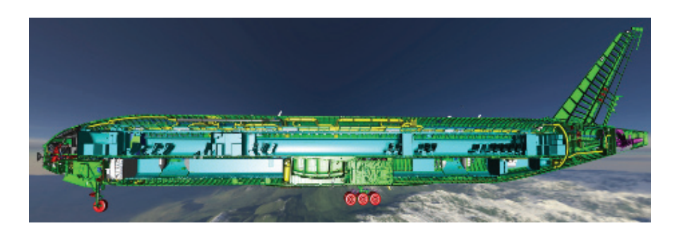

在本章节中，我们提供了一系列加速计算机图形渲染的算法，尤其是针对大量几何图形的渲染。其中许多算法的核心都基于某种空间数据结构（spatial data structure），我们将在下一小节中介绍这些结构。基于这些知识，我们还会进一步使用剔除技术（culling technique）。这些剔除算法试图快速确定哪些物体是可见的，然后再对这些可见物体进行后续处理。细节层次技术（level of detail，LOD）降低了渲染剩余物体的复杂性。在本章节的最后，我们将会讨论渲染巨大模型的系统，包括虚拟纹理、流、编码转换和地形渲染等话题。

## 19.1 空间数据结构

空间数据结构指的是一个在$n$维空间中组织几何物体的数据结构，本书只讨论了二维结构和三维结构，但是这些概念通常可以很容易地扩展到更高的维度。这些数据结构可以用于对一些查询进行加速，例如几何物体是否发生了重叠等。此类查询可以用于各种各样的操作，例如：剔除算法、测试光线与场景物体的求交算法、以及碰撞检测等。

空间数据结构的组织方式通常都是层次化的。粗略地说，这意味着顶层结构中包含一些子层级结构，每个子层级可以定义自己的空间体积，而这些空间中又包含了各自的子层级。因此，这类结构一般都是嵌套的，具有递归性质，场景中的几何物体被这个层次结构中的一些元素所引用。使用层次结构的主要原因在于，不同类型的查询速度能够显著提高，通常会从$O(n)$提高到$O(\log n)$。也就是说，在执行查找给定方向上最近物体等操作时，我们不需要搜索所有的$n$个物体，而是只会访问一个较小的子集。这些空间数据结构的构建时间可能会非常长，具体取决于结构中的几何物体数量，以及所需要的数据结构质量。然而，在这个领域中已经取得了很大的进展，大大减少了构建结构所需要的时间，并且在某些情况下可以实时完成。通过延迟计算（lazy evaluation）和增量更新（incremental update），这些结构的构造时间可以进一步降低。

一些常见的空间数据结构类型包括：层次包围体（bounding volume hierarchy）、二叉空间划分（binary space partitioning，BSP）树的各种变体、四叉树和八叉树等。其中BSP树和八叉树是基于空间细分的数据结构。这意味着场景的整个空间都会在数据结构中被细分和编码。例如：所有叶子节点空间的并集就等于整个场景空间。通常叶子节点的体积之间并不会发生重叠，除了不太常见的结构之外，例如松散八叉树（loose octree）。BSP树的大多数变体都是不规则的（irregular），这意味着空间可以被任意细分。八叉树是规则的（regular），这意味着空间会以均匀的方式进行划分。尽管有着更多的限制，但是这种一致性通常可以成为效率的来源。另一方面，层次包围体并不是空间细分结构，相反，它包围了几何物体周围的空间区域，因此BVH不需要严格包围每一层的所有空间。

下面我们将会介绍BVH、BSP树和八叉树，以及场景图（scene graph），场景图是一种更加关心模型关系而不是高效渲染的数据结构。

### 19.1.1 层次包围体

包围体（bounding volume，BV）是指包含一组物体的空间体积。BV的思想是，它应当是一个比所包含的物体更加简单的几何形状，因此我们使用BV来进行相交测试，要比使用内部物体本身快得多。BV的例子有很多，包括：球体、轴对齐包围盒（axis-aligned bounding box，AABB）、定向包围盒（oriented bounding box，OBB）和k-DOP等。相关定义详见章节22.2。BV在视觉上对所要渲染的图像没有任何贡献，相反，它会作为一个有界物体的代理形状，用来加速渲染、选择、查询以及其他的一些计算。

对于三维场景的实时渲染而言，层次包围体结构常用于分层视图的视锥体裁剪（章节19.4）。整个场景会以层次化的树状结构进行组织，并由一组相连接的节点构成。最顶部的节点是根节点，它没有父节点。一个内部节点（internal node）包含了指向其子节点（即其他节点）的指针。因此，这棵树的根节点实际上就是一个内部节点，除非它是这棵树中的唯一节点。在最底部的叶子节点中，包含了要进行渲染的实际几何图形，叶子节点没有任何子节点。树中的每个节点（包括叶子节点）都有一个包围体，这个包围体会将整个子树中的所有几何物体都包围起来。也可以决定从叶子节点中移除BV，将这个对应的BV包含在叶子节点上方的内部节点中，这种设置方式就是名称层次包围体的来源。每个节点的BV都包含了其子树中所有叶子节点的几何形状，这也意味着根节点中有一个包含整个场景的BV。图19.2展示了一个BVH的例子，请注意，一些较大的包围圆可以变得更加紧密一些，因为每个节点只需要包含其子树中的几何物体即可，并不需要包含后代节点的BV。对于包围圆（或者包围球）而言，形成这样的紧密节点可能是昂贵的，因为每个节点都必须对其子树中的所有几何物体进行检查。在实践中，一个节点的BV通常是通过树结构“自下而上”进行构建的，即创建一个包含其子节点BV的BV。

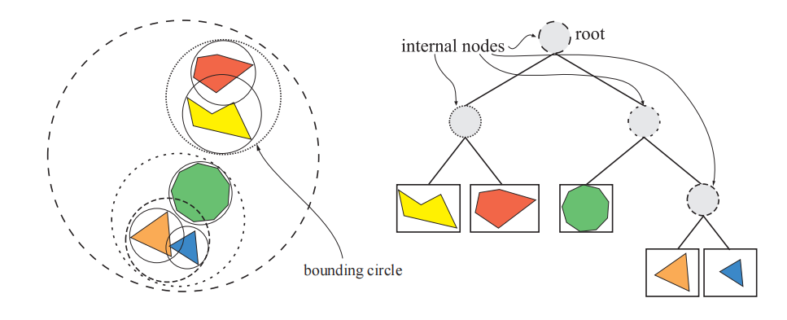

BVH的底层结构是一棵树，在计算机科学领域中，有关树数据结构的文献非常多。下面我们只会介绍几个重要的结论。想要了解更多信息，可以参考Cormen等人\[292]的《Introduction to Algorithms》一书。

考虑一个$k$叉树（k-ary tree），即每个内部节点有$k$个子节点的树。对于只有一个节点（根节点）的树，我们称这棵树的高度为0；根节点的叶子节点的高度为1，以此类推。平衡树（balanced tree）是指所有叶子节点的高度为$h$或者$h−1$的树。一般来说，一棵平衡树的高度$h$为$\left\lfloor\log _{k} n\right\rfloor$，其中$n$是树的节点总数（包括所有内部节点和叶子节点）。请注意，$k$越大，树的高度就越低，这也意味着遍历这棵树所需的步骤越少，但是每个节点上的工作量会变大。二叉树（binary tree）通常是一种最简单的选择，也能够提供合理的性能表现。然而，有一些证据表明，较高的$k$（例如：$k = 4$或者$k = 8$）对于某些应用程序有着更好的性能表现\[980, 1829]。使用$k = 2$、$k = 4$或者$k = 8$可以简化树的构造过程；只要沿着$k = 2$的最长轴进行细分，沿着$k = 4$的两个最长轴进行细分，沿着$k = 8$的所有轴进行细分即可。对于其他的$k$值而言，很难形成更好的树结构。从性能的角度来看，每个节点中包含子节点数目较高的树（例如$k = 8$）通常是首选的，因为它们可以降低树的平均深度，以及间接引用（从父节点指向子节点的指针）的数量。

BVH非常适合执行各种查询。例如：假设一根光线会与场景相交，我们需要找到并返回第一个相交点，就像阴影光线（shadow ray）一样。想要使用一个BVH来执行这个过程，首先会从根节点进行测试。如果这条光线没有命中它的BV，那么它就会错过这个BVH中包含的所有几何形状。否则，会递归进行测试，即对这个根节点中的所有子节点的BV进行测试。一旦这条光线没有命中其中的某个BV，那么会终止在该子树上的所有后续测试。如果这条光线击中了某个叶子节点的BV，则会根据该叶子节点的几何物体，对光线进行真正的相交测试。之所以使用BVH可以加速求交，是因为使用这些BV来对光线进行相交测试的速度非常快。这也是为什么会使用一些简单的物体，例如球体和box来作为BV。另一个性能提升的原因在于，BV结构是相互嵌套的，如果我们没有与一个大BV相交，那么说明其内部的小BV也不可能相交，这样可以允许我们提前终止测试，来跳过大面积的无效空间。

通常我们想要的是最近的交点，而不是第一个被发现的交点。因此我们需要一个额外的数据，来记录遍历树结构的时候，所找到最近物体的距离和标识。这个当前的最近距离也可以用于在遍历期间对树进行剔除。如果我们与一个BV相交，但是其相交距离超过了目前我们所找到的最近距离，那么就可以丢弃这个BV。在检查一个父包围盒的时候，我们会与所有的子包围盒进行相交测试，并找到其中最近的那个子包围盒。如果在这个BV的后代节点中发现了交点，则可以使用这个最新的最近距离，来判断是否需要对其他子节点进行遍历。正如我们将要看到的，BSP树比普通的BVH更有优势，因为BSP树可以保证前后有序，而BVH只能提供这种粗略的排序效果。

BVH也可以用于动态场景\[1465]。当BV中的物体发生移动的时候，只需检查这个物体是否仍然包含在其父物体的BV中。如果是的话，那么这个BVH就仍然有效。如果不是的话，那么就删除这个节点，并重新计算其父节点的BV。然后再将这个节点从根节点递归插入到BVH树中。另一种方法是按照需要对其父节点的BV进行递归扩展，从而将该子节点保留在树中。无论使用哪种方法，随着对BVH的编辑越来越多，这棵BVH都可能会变得不平衡和更加低效。另一种方法是在一段时间内，对物体的运动极限设置一个BV，这被称为时域包围体（temporal bounding  volume）\[13]。例如：可以对钟摆设置一个包围盒，这个包围盒会包围钟摆运动所扫出的整个体积。另一种方法是执行一个自下而上的调整（refit）\[136]，或者选择部分树结构来进行调整或者重建（rebuild）\[928, 981, 1950]。

想要创建一个BVH，首先必须能够计算一组物体的紧密BV，这个话题将在章节22.3中进行讨论。然后，我们要创建BV的实际层次结构。有关更多BV构建策略的信息，请参阅在线网站realtimerendering.com上的碰撞检测章节（第25章）。

### 19.1.2  BSP树

在计算机图形学中，二叉空间划分树（binary space partitioning tree），简称BSP树，有着两种明显不同的形式：轴对齐（axis-aligned）和多边形对齐（polygon-aligned）。通过使用一个平面来将空间划分成两部分，然后将场景中的几何物体分类到这两个空间中，从而递归完成BSP树的创建。一个值得注意的特性是，如果以某种方式来遍历一个BSP树，那么从任何角度来看，树的几何内容都可以从前到后进行排序。对于轴对齐的BSP树，这种排序是近似的；而对于多边形对齐的BSP树，这种排序则是精确的。请注意，轴对齐的BSP树也被称为k-D树。

#### 轴对齐的BSP树（k-D树）

一棵轴对齐的BSP树可以按照如下方式进行创建：首先，整个场景被包围在一个轴对齐包围盒（axis-aligned bounding box, AABB）中。然后将这个包围盒递归细分为更小的包围盒。现在，假设我们有一个任意递归级别的包围盒，选择这个包围盒的一个轴并生成一个垂直平面，使用这个平面来将包围盒空间划分为两个子包围盒。有些方案会使用一个固定的划分平面（partitioning plane），从而将这个包围盒精确地分割成两半，而其他的一些方案则允许划分平面改变自身的位置。通过这种平面位置的变化（被称为非均匀细分），最终生成的树可以变得更加平衡。而对于一个固定的划分平面位置（被称为均匀细分），节点在树中的位置会隐式给出它在内存中的位置。

在一个包围盒中，可能会有一些物体与划分平面相交，对于这些物体有多种处理方法，例如：这些物体可以被存储在树的这一层中，或者是作为两个子包围盒的成员，再或者是被这个平面分割成两个单独的物体。以树结构进行存储的好处在于，树中只有物体的一个副本，想要删除一个物体是很简单的。然而，与划分平面相交的小物体则会滞留在树的上层结构中，这样往往是低效的。将相交物体放置到两个子节点中，可以为较大物体提供更加紧密的包围盒，因为对于那些相交物体而言，它们会渗透到一个或者多个叶子节点中。每个子包围盒中都会包含一定数量的物体，并且会重复这个平面划分的过程，对每个AABB进行递归细分，直到满足某些标准才会停止。图19.3展示了一个轴对齐的BSP树。

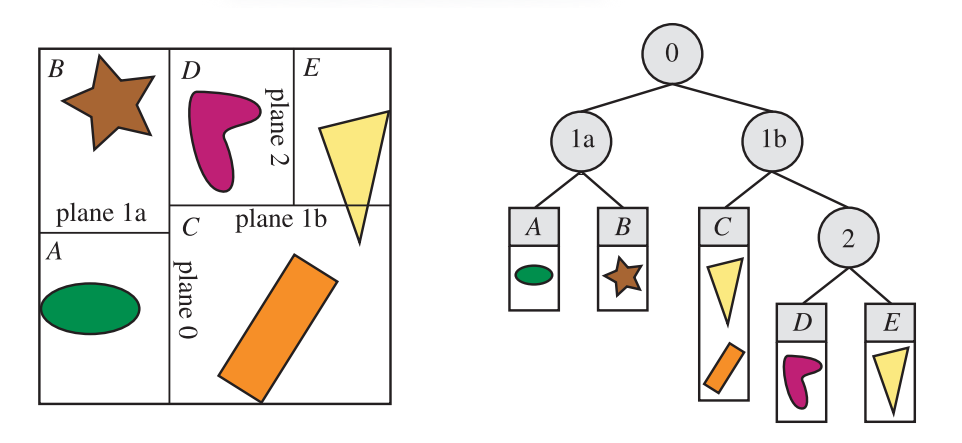

粗略的前后排序是如何使用轴对齐BSP树的一个例子，这对于遮挡剔除算法（章节19.7和章节23.7），以及通过最小化像素过度绘制来降低像素着色器的成本而言，都是十分有用的。假设我们现在正在遍历一个名为$N$的节点，此时$N$是遍历开始时的根结点。我们会检查节点$N$的划分平面，并在观察者所在平面的一侧来继续对树进行递归遍历。因此，只有当这一半的树结构被遍历完时，我们才会开始遍历树的另一半。但是由于叶子节点中的内容并没有进行排序，而且一个物体可能会位于树的许多节点中，因此这种遍历方式并不会给出精确的前后顺序。然而它能够给出一个粗略的从前到后（front-to-back）排序，这通常来说会很有用。与观察者的位置相比较，通过在节点平面的另一侧开始遍历，可以获得大致的从后向前（back-to-front）排序，这对于透明排序而言十分有用。BSP遍历也可以用来测试光线与场景几何的相交情况，将观察者的位置直接转换为光线的原点即可。

#### 多边形对齐的BSP树

另一种类型的BSP树是多边形对齐的（polygon-aligned）\[4, 500, 501]。这种数据结构对于以精确排序来渲染静态几何物体或者刚性几何物体而言特别有用，这种算法在《毁灭战士》等游戏中十分流行，那时候还没有出现硬件z-buffer。它在碰撞检测和相交测试中也有一些使用。

在多边形对齐的BSP树方案中，会选择一个多边形作来为分割器（divider），从而将空间划分成两部分。也就是说，会在根节点处选择一个多边形，使用该多边形所在的平面来作为划分平面，用于将场景中的其他多边形划分为两个集合。任何与划分平面相交的多边形，都会沿着交线被分成两部分。在一次划分之后，现在我们有了两个子空间，在每个子空间中，都会选择另一个多边形来作为分割器，它会对该子空间中的多边形进行进一步地划分。这个过程是递归进行的，直到所有的多边形都位于BSP树中。创建一个高效的多边形对齐的BSP树是一个耗时的过程，这种树通常只会构建一次，然后存储起来进行重复使用。图19.4展示了一个这种类型的BSP树。通常来说，最好是构建一棵平衡树，即每个叶子节点的深度相同，或者最多相差一个深度层级。

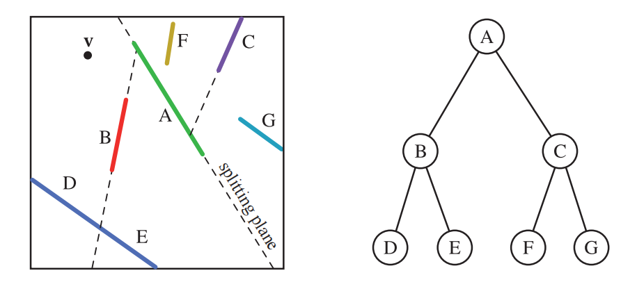

多边形对齐的BSP树具有一些有用的性质。首先，对于一个给定的视图，场景结构可以严格地按照从后到前（或者从前到后）的顺序进行遍历。与之相比，轴对齐的BSP树通常只能给出一个粗略的排序结果。首先确定相机此时位于根平面的哪一侧，分割平面远侧的多边形集合，肯定会位于近侧多边形集合的背后。对于远侧子空间而言，获取下一层级的划分平面并再次确定相机在位于平面的哪一侧。该空间的远侧子集就是距离相机最远的子集。通过继续这个递归过程，可以建立一个严格的从后到前的顺序，有了这个顺序，就可以使用一个画家算法（painter’s algorithm）来渲染场景。画家算法在渲染场景时并不需要构建z-buffer。如果所有物体都是按照从后到前的顺序进行绘制的，那么每个较近物体都会被绘制在较远物体的前面，因此也就不需要再比较z-depth了。

例如：考虑图19.4中观察者$\mathbf{v}$所看到的场景内容。无论观察方向和视锥体的情况如何，$\mathbf{v}$都会位于多边形A形成的分割平面左侧，所以多边形C、F、G会位于多边形B、D、E的后面。对比$\mathbf{v}$和多边形C的分割平面，我们会发现多边形G位于这个平面的另一侧，因此多边形G会被首先渲染。然后对多边形B的划分平面进行测试，我们发现多边形D应当在多边形E之前进行绘制。因此，从后到前的顺序依次是多边形G，C，F，A，E，B，D。注意，这个顺序并不能保证一个物体会比另一个物体更加靠近观察者。相反，它提供的是一个严格的遮挡顺序，这是一个微妙的区别。例如：多边形F要比多边形E更加接近观察者$\mathbf{v}$，尽管多边形F在遮挡顺序中要更加靠后。

### 19.1.3 八叉树

八叉树（octree）类似于轴对齐的BSP树。一个box会同时沿着三个轴进行分割，并且分割点必须位于box的中心。这将会创建8个新的box，因此被称为八叉树。这会使得结构更加规则化，从而让一些查询变得更加高效。

八叉树是通过将整个场景包围在一个最小的轴对齐包围盒中来进行构建的。剩下的过程本质上是递归的，会在满足终止条件时结束。与轴对齐的BSP树一样，这些终止条件可以包括达到最大递归深度、或者在一个box中获得一定数量的图元\[1535, 1536]。如果满足了某个条件，算法会将这些图元绑定到这个box上，并终止递归过程。否则，将会沿着这个box的主轴，使用三个平面来对这个box进行进一步地细分，从而形成8个相同大小的box。对于形成的每个新box，会再次进行测试，并可能会被再次细分为$2 × 2 × 2$个更小的box。图19.5中以二维的形式进行了说明，这个数据结构被称为四叉树（quadtree）。四叉树是八叉树的二维等效形式，即忽略了第三个轴。相比于沿着三个轴来对数据进行分割，如果几乎没有什么好处的情况下，四叉树可能会更加有用。

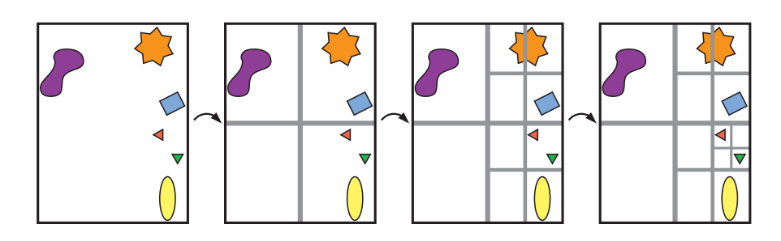

八叉树可以像轴对齐的BSP树一样使用，因此它也可以用于处理相同类型的查询。事实上，BSP树可以提供与八叉树相同的空间划分结果。如果一个单元格首先沿着$x$轴的中点进行划分，然后两个子单元格沿着$y$轴的中点进行划分，最后这些子单元格沿着$z$轴的中点进行划分，那么就会形成8个相同大小的单元格，这些单元格与使用八叉树进行一次划分所得到的单元格完全相同。八叉树效率的一个来源在于，它不需要存储BSP树结构所需的额外信息，例如：八叉树中划分平面的位置是已知的，因此不需要进行明确描述。这种更加紧凑的存储方案在遍历过程中，可以访问更少的内存位置，从而节省了时间。但是，轴对齐的BSP树仍然可能会是更加高效的，因为更好的划分平面位置可以节省内存开销和遍历时间，它可以抵消在检索划分平面位置时所带来的额外内存开销和遍历时间。没有一个整体最佳效率的方案，实际的效率会取决于底层几何物体的性质、访问结构的使用模式、以及运行代码的硬件体系结构等因素。通常而言，内存布局的局部性和缓存友好程度是最重要的因素，这是下一小节的重点内容。

在上面的描述中，物体总是会存储在叶子节点中。因此，某些物体必须被存储在多个叶子节点中。另一种选择是将每个物体都放置在包含整个物体的最小box中，例如：图19.5中的橙色星形物体，应当放置在左起第二张插图的右上角box中。这种方式会有一个明显的缺点，例如：位于八叉树中心的一个小物体，将会被放置在整棵树的最顶层节点（最大box）中。这是十分低效的，因为一个微小的物体会被包含在整个场景的包围盒中。一种解决方案是将物体进行拆分，但是这样会引入更多的图元。另一种解决方案是在每个叶子节点的box中放置一个指向物体的指针，但是这样做会降低效率，并使八叉树的编辑变得十分困难。

Ulrich提出了第三种解决方案，即松散八叉树（loose octree）\[1796]。松散八叉树的基本思想与普通的八叉树相同，但是对每个box的大小选择有所放宽。如果普通box的边长为$l$，那么松散八叉树中则使用了$kl$进行代替，其中$k>1$，图19.6展示了$k = 1.5$时的情况，并与普通的八叉树进行了比较。请注意，box的中心点位置是相同的。通过使用一个更大的box，会减少跨越分割平面的物体数量，从而使得物体可以放置在八叉树的更深处。由于一个物体总是只会被插入到一个八叉树节点中，因此从八叉树中删除某个物体的操作是很简单的。使用$k = 2$可以获得一些额外的好处。首先，插入物体和删除物体的时间复杂度是$O(1)$。知道一个物体的大小，意味着我们可以立即知道它能够成功插入的八叉树级别，即可以完全放入一个松散的box中。在实践中，有时可以将物体放置到八叉树中更深的box中。同样，如果$k>2$，当一个物体不适合当前级别的时候，那么可能要将其放入到树的上层级中。

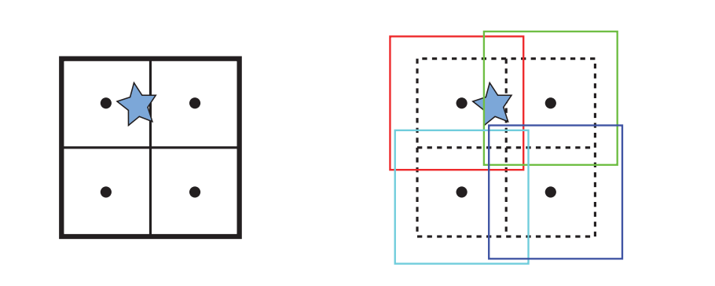

物体的质心决定了它会被放置在哪个松散八叉树的box中。由于这些特性，这个结构非常适合用于动态物体的绑定，但是代价是会牺牲一些BV的效率，并且在遍历该结构的时候，会失去排序顺序。此外，物体在两帧之间通常只会发生轻微移动，因此前一个帧中的box在下一帧中大概率会仍然有效。因此，在松散八叉树中，只有一小部分动画物体需要每帧进行更新。Cozzi指出\[302]，在将每个物体/图元分配给松散八叉树之后，可以计算每个节点中物体的最小AABB，此时这个点实际上就变成了一个BVH。这种方法避免了跨节点的物体拆分。

### 19.1.4 缓存无关和缓存感知的表示

由于内存系统的带宽与CPU的计算能力之间的差距每年都在增加，因此在设计算法和空间数据结构的时候，考虑缓存是至关重要的。在本小节中，我们将介绍缓存感知（cache-aware，或者叫做缓存敏感cache-conscious）和缓存无关（cache-oblivious）的空间数据结构。缓存感知代表会假设缓存块的大小是已知的，因此我们可以针对特定的体系结构进行优化。相比之下，缓存无关的算法可以很好在所有大小的缓存上进行工作，因此是平台无关的。

想要创建一个缓存感知的数据结构，我们必须首先确定体系结构中的缓存块大小，例如：缓存块的大小可能是64字节。然后尝试最小化数据结构的大小。例如：Ericson \[435]展示了如何使用32 bit来表示一个k-d树的节点，这在一定程度上是通过占用节点32 bit值中的最低两位来实现的。这两个bit组合起来可以表示四种类型：一个叶子节点、或者是在三个轴其中之一上进行划分的内部节点。对于叶子节点，较高的30个bit存储了一个指向物体列表的指针；对于内部节点，这30个bit代表了一个（精度稍低的）浮点分割值。因此，在一个64字节的缓存块中，可以存储包含15个节点的四层深度二叉树，最后的第16个节点会用于表示存在哪些子节点，以及这些子节点的位置，详情请参阅Ericson的书籍。其中的关键概念是，通过确保数据结构清晰地打包到缓存边界，从而使得数据访问的性能得到了显著改进。

一种流行且简单的缓存无关的树结构布局是van Emde Boas布局方法\[68, 422, 435]。假设我们有一棵高度为$h$的树$\mathcal{T}$，我们的目标对树中的节点计算一个缓存无关的布局或者排序。其中的关键思想是：将层次结构递归分解为越来越小的块，直到在某个级别上，可以将一组块将放入缓存中。这些块的位置在树中彼此靠近，因此相较于简单地自上而下列出所有节点，其缓存数据的有效时间要更长。使用自上而下的简单列表会导致内存位置之间的大范围跳转。

我们将$\mathcal{T}$的van Emde Boas布局表示为$v(\mathcal{T})$，这个结构是递归定义的，树中单个节点的布局就是节点本身。如果$\mathcal{T}$中有多个节点，那么这棵树会在高度一半处$\lfloor h / 2\rfloor$进行分割。最顶层的$\lfloor h / 2\rfloor$会被放置在一棵树中，记为$\mathcal{T}_0$，从$\mathcal{T}_0$叶子节点开始的子树记为$\mathcal{T}_{1}, \ldots, \mathcal{T}_{n}$，该树的递归性质描述如下：

$$
v(\mathcal{T})=\left\{\begin{array}{ll}\{\mathcal{T}\}, & \text { if there is single node in } \mathcal{T} \\ \left\{\mathcal{T}_{0}, \mathcal{T}_{1}, \ldots, \mathcal{T}_{n}\right\}, & \text { else. }\end{array}\right.
\tag{19.1} 
$$

请注意，所有的子树$\mathcal{T}_i$（$  0≤i≤n $），也都是由上面的递归过程进行定义的。这意味着，例如：$\mathcal{T}_1$必须在其高度一半的地方被分割，以此类推。图19.7展示了这样的一个例子。

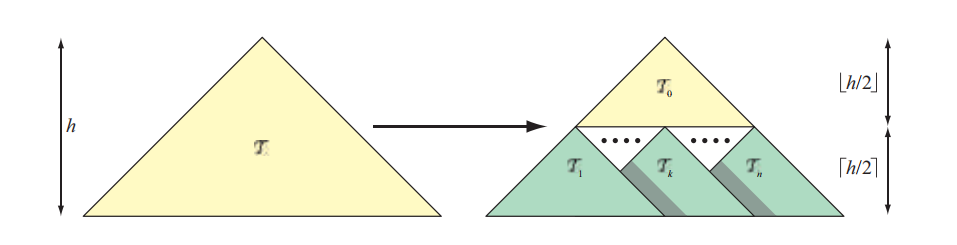

一般来说，创建缓存无关的布局包括两个步骤：聚类（clustering）和聚类的排序。对于van Emde Boas布局而言，聚类由子树给出，而排序则隐含在创建顺序中。Yoon等人\[1948, 1949]专门设计并开发了为高效层次包围体和BSP树所使用的技术。他们开发了一个概率模型，这个模型考虑了父节点和其子节点之间的局部性以及空间局部性。这个想法的思路是：通过确保子节点低廉的访问成本，从而在访问父节点时最大限度地减少缓存未命中。此外，那些彼此接近的节点会在排序中被分组得更加接近。研究人员提出了一种贪婪算法，对概率最高的节点进行聚类。在不改变底层算法的情况下，可以大幅度地提高性能表现，不同的只是BVH中节点的顺序会发生一些变化。

### 19.1.5 场景图

BVH、BSP树和八叉树，都使用某种树结构来作为它们的基本数据结构，它们之间的区别在于如何划分空间和存储几何物体。它们还都以分层的方式来存储几何物体，除此之外没有什么其他不同。然而，想要渲染一个三维场景，所涵盖的内容不仅仅是几何图形。还涉及对动画、可见性和其他元素的控制，通常会使用一个场景图（scene graph）来执行，在glTF中则被称为节点层次结构（node hierarchy）。这是一个面向用户的树形结构，它可以通过使用纹理、变换、LOD、渲染状态（例如材质属性）、光源和其他任何合适的东西来进行增强。它由一棵树来进行表示，并以某种顺序来遍历这个树，从而渲染整个场景。例如：一个光源可以放置在一个内部节点中，它只会对其子树中的内容产生影响。另一个例子是：当在树中遇到一个材质时，这个材质可以应用于该节点子树中的所有几何物体上，或者也可能会被子节点中的设置所覆盖，详见图19.34所示，从而了解如何在场景图中支持不同的LOD。从某种意义上来说，每个图形应用程序都会使用某种形式的场景图，即使这个场景图只是一个根节点，其中包含了要进行显示的子节点列表。

使物体动画化的一种方法是，改变树中内部节点的变换方式，然后场景图会对该节点子树的全部内容进行变换。由于可以在任何内部节点中进行变换，因此可以实现分层动画。例如：汽车的轮子可以进行旋转，同时汽车作为一个整体可以向前移动。

当多个节点可能指向同一个子节点的时候，这种树结构被称为一个有向无环图（directed acyclic graph，DAG）\[292]。这里无环（acyclic）的意思是它不能包含任何循环或者环结构。有向（directed）的意思是两个节点会通过一条边进行连接，它们也是按照一定的顺序进行连接的，例如从父节点指向子节点。场景图通常是DAG，因为它们允许进行实例化，例如：当我们想要在不复制其几何物体的情况下，就能够复制出该物体的多个副本（实例）。图19.8展示了这样的一个例子，其中两个内部节点分别对各自的子树应用了不同的变换操作。使用实例可以节省很多内存开销，并且GPU可以通过调用图形API来快速渲染实例的多个副本（章节18.4.2）。

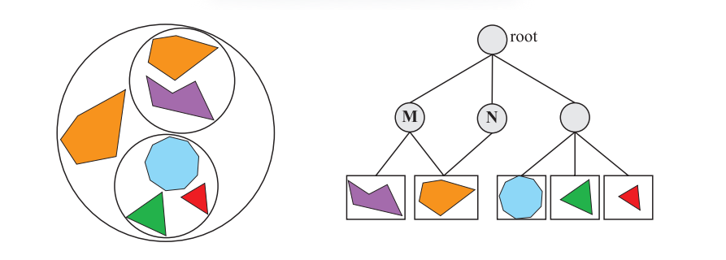

当物体在场景中发生移动的时候，需要对场景图进行更新，这可以通过对树结构的递归调用来实现。变形会从根节点到叶子节点的过程中进行更新，在这次遍历中，相关的变换矩阵会被相乘，并存储在相关的节点中。然而，当变换被更新的时候，任何附加的BV都是过时的，因此，在从叶子节点返回根节点的过程中，还需要对BV进行更新。由于过于松散的树结构会使得这些任务变得极为复杂，因此通常会避免使用DAG，或者是使用有限形式的DAG，即只共享叶子节点。有关这个主题的更多信息，请参阅Eberly所撰写的书籍\[404]。还要注意的是，当使用基于javascript的图形API时（例如WebGL），需要将尽可能多的工作负载转移到GPU上，同时尽可能少地反馈给CPU，这是非常重要的\[876]。

场景图本身可以提供一些计算效率的提升。场景图中的节点通常都会具有包围体，因此与BVH非常相似。场景图中的叶子节点会存储几何信息。需要认识到的一点是，可以将完全不相关的高效方案与场景图一起使用。这就是一种空间化（spatialization）的思想，其中用户的场景图会为不同的任务（例如更快的剔除或者选择）创建单独的数据结构（例如BSP树或者BVH）。大多数模型所在的叶子节点都是共享的，因此使用额外高效空间结构所带来的开销相对较低。

## 19.2 剔除技术

剔除（cull）的意思是“从一大群物体（flock）中移除某些物体”，而在计算机图形学的语境中，这正是剔除技术所做的事情。这个flock正是我们想要渲染的整个场景，而我们只需要移除那些对最终图像没有贡献的场景部分即可，而场景中的剩余部分则会被发送到渲染管线中。因此，可见性剔除（visibility culling）这个术语也经常被用于渲染的上下文中。不过，也可以对程序中的其他部分进行剔除，例如：碰撞检测（对屏幕外的物体，或者是隐藏的物体，计算精度不需要那么高）、物理计算和AI等。这里我们只会介绍与渲染相关的裁剪技术，它们包括背面剔除（backface culling），视锥体剔除（frustum culling）和遮挡剔除（occlusion culling），如图19.9所示。其中背面剔除移除了那些背对观察者的三角形。视锥体剔除移除了位于观察视锥体之外的三角形。遮挡剔除则会移除那些被其他物体所遮挡的物体，遮挡剔除是最为复杂的剔除技术，因为它需要计算物体之间是如何彼此影响的。

![图19.9：不同类型的剔除技术。图中使用虚线表示的物体会被剔除。 \[277\]](images/Chapter-19/202309171416961.png "图19.9：不同类型的剔除技术。图中使用虚线表示的物体会被剔除。 \[277]")

理论上，实际的剔除可以发生在渲染管线的任何阶段中，对于一些遮挡剔除算法而言，它甚至可以预先进行计算。对于那些在GPU上实现的剔除算法，我们有时只能选择启用剔除或者禁用剔除，或者是设置一些参数。渲染速度最快的三角形，是那些从未被发送到GPU中的三角形。其次，在管线中越早进行进行剔除，效果就越好。剔除通常是通过使用几何计算来实现的，但是并不局限于几何计算，例如：有一些算法也可以使用帧缓冲区的内容。

对于一个理想情况下的剔除算法，它只会向管线中发送那些精确可见集（exact visible set，EVS）。在本书中，EVS被定义为所有部分可见或者完全可见的图元。一种允许理想剔除的数据结构是方位图（aspect graph），即从任何视角中都可以提取出EVS \[532]。想要创建这样的数据结构在理论上是可行的，但是在实践中却是行不通的，因为其最坏的时间复杂度可能高达$O(n^9)$\[277]。相反，更加实用的算法是试图找到一个集合，它被称为潜在可见集（potentially visible set，PVS），PVS是对EVS的预测。如果PVS完全包含了EVS，那么只有不可见的几何图形会被丢弃，我们将这样的PVS称为是保守的（conservative）。PVS也可能是近似的（approximate），即EVS并不完全被包括在内，这种类型的PVS可能会生成不正确的图像，我们的目标是使这些误差尽可能地小。由于保守的PVS总是能够生成正确的图像，因此通常会认为它更加实用。通过高估或者近似EVS，可以更快地计算PVS，其中的难点在于如何进行这些评估从而获得整体上的性能表现。例如：一个算法能够在不同的粒度上来处理场景中的几何图形，可以是三角形、整个物体或者物体组。当找到一个PVS时，使用z-buffer进行渲染，它会对最终的逐像素可见性进行解析。

请注意，有一些算法可以对网格中的三角形进行重新排序，从而提供更好的遮挡剔除效果，即减少过度绘制，同时改进顶点缓存的局部性。这些技术与剔除技术有些关联，我们建议感兴趣的读者可以阅读相关的参考文献\[256, 659]。

从章节19.3到章节19.8，我们将讨论背面剔除（backface culling）、视锥体剔除（view frustum culling）、入口裁剪（portal culling）、细节剔除（detail culling）、遮挡剔除（occlusion culling）和剔除系统。

## 19.3 背面剔除

想象一下，我们正在观察场景中的一个不透明球体，大约有一半的球体我们是看不到的。从这个观察中得出的结论是：看不见的物体不需要进行渲染，因为它对最终的图像没有什么贡献。也就是说，球体的背面是不需要进行处理的，这就是背面剔除的核心思想。这种类型的剔除不仅可以针对一个物体进行，也可以一次针对整组进行，因此也称为集群背面剔除（clustered backface culling）。

假设相机位于物体外部，并且没有发生穿透（即物体与近裁剪平面相交），那么所有不透明物体的背面三角形都可以通过进一步地处理进行剔除。如果已知投影三角形的顶点在屏幕空间中是顺时针方向的，那么说明逆时针顶点顺序的三角形（章节16.3）就是朝后的。这个测试可以通过在二维屏幕空间中计算三角形的带符号面积来实现，面积为负意味着这个三角形应当被剔除。这个过程可以在屏幕映射完成之后立即执行。

另一种确定三角形是否背对相机的方法是：从三角形所在平面上的任意一点（最简单的就是直接选择其中一个顶点）到相机位置创建一个向量。对于正交投影而言没有一个实际的相机位置，此时到相机位置的向量会被替换为负观察方向，这对于场景来说是恒定的，我们会计算这个向量与三角形法线之间的点积。点积为负，意味着两个向量之间的夹角大于$90^{\circ}$，因此这个三角形肯定不是面向观察者的。这个测试过程相当于计算从相机位置到三角形平面的带符号距离，如果为正，则说明三角形是正面的。请注意，正确的距离只有在法线归一化的情况下才能得到，但是在这里并不重要，因为我们关心的只有符号。或者是在应用投影矩阵之后，在裁剪空间中构建顶点$\overline{\mathbf{v}}=\left(v_{x}, v_{y}, v_{w}\right)$，并计算行列式$d=\left|\overline{\mathbf{v}}_{0}, \overline{\mathbf{v}}_{1}, \overline{\mathbf{v}}_{2}\right|$的值\[1317]。当$d≤0$时，可以对这个三角形进行裁剪。图19.10展示了这些剔除技术。

Blinn指出，这两种测试在几何上实际上是相同的\[165]。从理论上来说，这些测试的区别主要在于计算测试的空间（坐标系），而不是其他因素。在实践中，屏幕空间中的测试通常会更加安全，因为在观察空间中看起来稍微向后的倾斜（edge-on）三角形，在屏幕空间中可能会变得稍微向前，这是因为观察空间中的坐标会被四舍五入为屏幕空间中的亚像素坐标。

使用OpenGL或者DirectX之类的图形API，通常可以使用一些函数来控制背面剔除，这些函数要么会启用背面剔除，要么会启用正面剔除，要么会禁用所有剔除。请注意，一次镜像变换（即负缩放操作）会将背面三角形转换为正面三角形，反之亦然\[165]（章节4.1.3）。最后，还可以在像素着色器中来确定三角形是否为正面。在OpenGL中，这是通过测试$\mathrm{gl\_FrontFacing}$来完成的，在DirectX中则被称为$\mathrm{SV\_IsFrontFace}$。在此之前，正确显示双面物体的主要方法是将它们渲染两次，第一次渲染会剔除背面；第二次渲染会剔除正面，同时反转法线。

对于标准的背面剔除有一个常见的误解，即它可以将渲染的三角形数量减少大约一半。虽然对许多物体而言，背面剔除将会移除大约一半的三角形，但是对于某些特殊类型的模型而言，它并不会带来什么好处。例如：室内场景中的墙壁、地板、天花板通常都是面向观察者的，因此在这种场景中背面三角形相对较少。类似地，在地形渲染中，通常而言大多数三角形都是可见的，只有丘陵或者峡谷等一些地面起伏较大的地形，才会出现较多的背面三角形，因此才可以从这种技术中获益。

然而，这种简单的背面剔除只能避免单个三角形被光栅化，如果我们可以通过一次测试，来决定是否可以剔除整个三角形集合，那么速度会更快。这类技术被称为集群背面剔除算法，这里我们将介绍其中的部分技术，这类算法所使用的基本概念是法线锥（normal cone）\[1630]。对于表面上的某些部分，会创建一个包含所有法线方向和所有表面点的截锥体（truncated cone）。请注意，沿法线方向上，需要使用两个距离来截断这个圆锥体，图19.11给出了这样的一个例子。我们可以看到，这个圆锥由法线$\mathbf{n}$、半角$\alpha$、锚点$\mathbf{c}$以及沿法线截短圆锥体的偏移距离所定义。在图19.11的右侧展示了这个法线锥的横截面。Shirman和Abi-Ezzi \[1630]证明，如果观察者位于正面锥体中，那么锥体中的所有面都是正面的；对于背面锥体也是如此。Engel \[433]使用了一个类似的概念，被称为GPU剔除的排除体积（exclusion volume）。

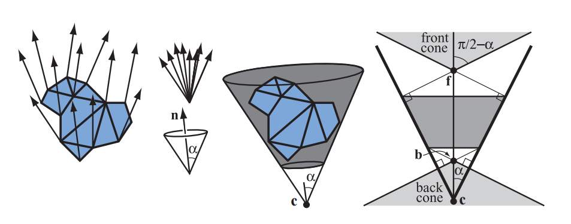

对于静态网格，Haar和Aaltonen \[433]建议围绕$n$个三角形来计算一个最小立方体，每个立方体面被分割为$r×r$个“像素”，每个“像素”上都有一个$n$位掩码，来代表对应三角形在该“像素”上是否可见，如图19.12所示。如果相机位于立方体之外，那么可以找到相机所在的对应截锥体，立即查找其位掩码，并知道哪些三角形是朝后的（保守地）。如果相机位于立方体内部，那么所有三角形都会被认为是可见的（除非想执行进一步的计算）。Haar和Aaltonen在每个立方体面只使用一个位掩码，并一次编码$n = 64$个三角形。通过计算位掩码中被设置的bit数，我们可以高效地为未被剔除的三角形分配内存。《刺客信条：大革命》中也使用了这种方法。

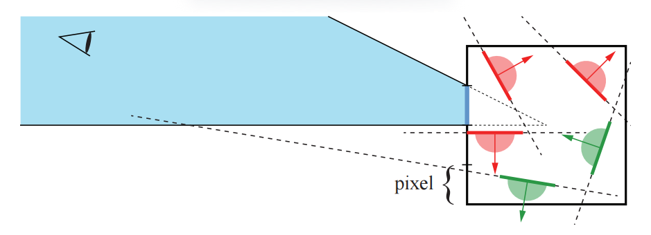

接下来，我们将使用一个非截断的法线锥，与图19.11中的圆锥相反，它仅由中心点$\mathbf{c}$、法线$\mathbf{n}$和半角$\alpha$进行定义。为了计算这样一个由许多三角形所组成的法线锥，我们会取三角形平面上的所有法线，并将它们放在相同的位置上，在单位球面上计算一个包含所有法线的最小圆\[101]。第一步，假设从点$\mathbf{e}$开始，我们要对锥体内所有共享原点$\mathbf{c}$的法线进行背面测试（backface-test）。如果下列条件成立的话，则说明法线锥背对点$\mathbf{e}$\[1883, 1884]：

$$
\mathbf{n} \cdot(\mathbf{e}-\mathbf{c})<\underbrace{\cos \left(\alpha+\frac{\pi}{2}\right)}_{-\sin \alpha} \Longleftrightarrow \mathbf{n} \cdot(\mathbf{c}-\mathbf{e})<\sin \alpha
\tag{19.2} 
$$

然而，这个测试只适用于所有几何图形都位于点$\mathbf{c}$的情况。接下来，我们假设所有几何图形都位于一个圆心为$\mathbf{c}$、半径为$r$的球体内，那么这个背面测试为：

$$
\mathbf{n} \cdot(\mathbf{e}-\mathbf{c})<\underbrace{\cos \left(\alpha+\beta+\frac{\pi}{2}\right)}_{-\sin (\alpha+\beta)} \Longleftrightarrow \mathbf{n} \cdot(\mathbf{c}-\mathbf{e})<\sin (\alpha+\beta)
\tag{19.3} 
$$

其中$\sin \beta=r /\|\mathbf{c}-\mathbf{e}\|$。图19.13展示了推导这个测试所涉及的几何图形。这些量化法线可以存储为$8 × 4$个bit，这对于某些应用而言可能已经足够了。

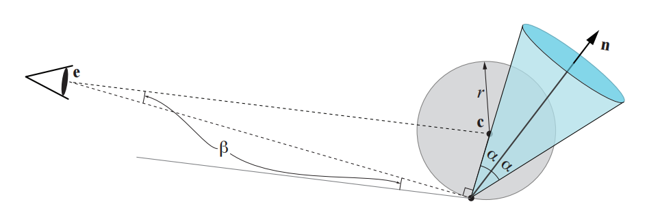

作为本小节的总结，这里我们提及一下运动模糊三角形的背面剔除，其中三角形的每个顶点在一帧内都有一个线性运动，这并不像人们想象的那么简单。一个三角形的顶点随着时间发生线性移动，这个三角形可能会在这一帧刚开始的时候向后，然后向前，然后再向后，所有这些都可能发生在同一帧内。因此，如果因为一个三角形在这帧开始和这帧结束的时候都向后，就将这个三角形剔除，那么可能会产生错误的结果。Munkberg和Akenine-Moller \[1246]提出了一种方法，将标准背面测试中的顶点替换为线性移动的三角形顶点。他们将这个测试改写为Bernstein形式，并利用Bezier曲线的凸性质来作为一个保守检验。对于景深效果而言，如果整个镜头都位于三角形的负半空间的话（换句话说，位于三角形的背后），那么这个三角形可以安全地被剔除。

## 19.4 视锥体剔除

如章节2.3.3所述，只有完全或者部分位于视锥体内部的图元才需要进行渲染。加速渲染的一种方法是，将每个物体的包围盒与视锥体进行相交测试。如果该BV位于视锥体外部，那么它所包含的几何形状就不需要进行渲染；如果该BV位于视锥体内部或者与视锥体相交，那么它所包含的几何形状就可能是可见的，因此必须要发送到渲染管线中。请参阅章节22.14，来了解各种包围体和视锥体之间的相交测试方法。

通过使用一种空间数据结构，这种剔除可以分层进行\[272]。对于层次包围体，从根节点开始的前序遍历（preorder traversal）就可以完成这项工作\[292]。每个具有包围体的节点都会针对视锥体进行测试，BV与视锥体的相交测试一共会出现三种情况，分别是：BV完全位于视锥体内部；BV部分位于视锥体内部；BV完全位于视锥体外部。如果该节点的BV位于视锥体之外，那么就不需要对该节点进行进一步处理，此时会对这棵树进行修剪，因为该BV中的内容以及子节点中的内容都位于视野之外。如果该BV完全位于视锥体内部，则说明该BV中的内容肯定全都在视锥体内部。此时会继续进行遍历，但是不再需要对该子树的其余部分进行进一步的视锥体测试了。如果该BV与视锥体相交，那么还需要继续进行遍历，并对其子节点的BV进行相交测试。当我们发现一个叶子节点与视锥体相交时，其内容（即它的几何物体）就会被送到管线中；但是这个叶子节点中的图元无法保证位于视锥体内部。图19.14展示了一个视锥体剔除的例子。还可以针对一个物体或者单元格使用多个BV进行测试。例如：假设我们发现某个单元格周围的球体BV与视锥体发生重叠，如果已知这个单元格box比球体小得多的话，那么可以进行一个更加精确（尽管更昂贵）的OBB-视锥体相交测试\[1600]。

对于“与视锥体相交”的情况，一个有用的优化方法是，追踪该BV完全位于哪个视锥体平面内\[148]。这个信息通常会被存储为位掩码，然后可以与相交器（intersector）一起进行传递，用于对该BV的子节点进行相交测试。这种技术有时候会被称为平面遮挡（plane masking），因为只有那些与BV相交的平面，才需要对子节点继续进行相交测试。根节点的BV最初需要针对视锥体的6个平面进行相交测试，但是随着测试的进行，在每个子节点上进行的平面测试和BV测试的次数将会逐渐减少。Assarsson和Moller \[83]注意到也可以使用时间一致性（temporal coherence）来加速这个过程。该视锥体平面可与BV一起进行存储，并在下一帧中作为第一个进行相交测试的平面。Wilidal指出\[1883, 1884]，如果视锥体剔除是在CPU上逐物体完成的，那么在GPU上进行细粒度剔除（finer-grained culling）时，它只要对左、右、底、顶四个平面执行视锥体剔除就足够了。此外，为了进一步提高性能，可以使用被称为顶点贴图（apex point map）的结构，来提供更加紧密的包围体表示，这将在章节22.13.4中进行更加详细地描述。有时候会在远处使用一些雾效，来避免物体在远裁剪平面处突然消失所带来的感官影响。

对于大型场景或者特定的相机视图，只有一小部分场景是可见的，因此也只有这一小部分场景内容需要被发送到渲染管线中。在这种情况下，剔除速度和渲染速度会被大幅提高。视锥体剔除技术利用了场景中的空间一致性，因为彼此靠近的物体可以被包围在同一个BV中，并且附近的BV可以进行分层聚类。

需要注意的是，有些游戏引擎中并不会使用分层BV，而是仅仅使用一个线性BV列表，即一个BV对应场景中的一个物体\[283]。这种做法的主要动机是，在使用SIMD和多线程来实现算法时会更加简单，从而提供更好的性能表现。然而，对于某些应用程序而言（例如CAD），场景中大部分或者全部几何形状都位于视锥体内部，在这种情况下应当避免使用这种类型的算法。分层视锥体剔除技术仍然可以使用，因为如果某个节点完全位于视锥体内部，那么其几何形状可以被立即绘制。

## 19.5 入口剔除

对于建筑模型，有一组被称为入口剔除（portal culling）的算法。其中第一个入口剔除是由Airey等人\[17, 18]提出的。后来，Teller和Sequin \[1755, 1756]以及Teller和Hanrahan \[1757]构建了更加高效、更加复杂的入口剔除算法。所有入口剔除算法的基本原理是：在室内场景中，墙壁通常都会充当大型的遮挡物。因此，入口剔除也是一种特殊的遮挡剔除，我们将在下一节中讨论遮挡剔除的话题。这个遮挡算法会在每个入口处（例如门或者窗）使用视锥体剔除机制。在穿过入口的时候，会将视锥体缩小，从而紧密地包围入口。因此，入口剔除算法也可以看作是视锥体剔除的一种扩展，位于视锥体之外的入口将会被丢弃。

入口剔除算法会以某种方式对场景进行预处理。场景会被划分为一个个单元格，这些单元通常对应于建筑物中的房间和走廊，连接相邻房间的门窗会被称为入口（portal）。单元格中的每个物体和对应单元格的墙壁，都会存储在与一个与单元格相关联的数据结构中。我们还会将信息存储相邻的单元格中，并在一个邻接图中存储这些连接单元格的入口信息。Teller给出了计算这个邻接图的算法\[1756]。虽然这种技术早在1992年被提出时就能够运行了，但是对于现代的复杂场景而言，想要让这个过程自动化进行是极其困难的。因此，单元格的定义、以及邻接图的创建工作，目前都是手动完成的。

Luebke和Georges \[1090]使用了一种简单的方法，只需要进行少量的预处理。这个方法唯一需要的信息，就是与每个单元格相关联的数据结构，如上所述。其关键思想是：每个入口都定义了进入这个房间和离开这个房间的视图。想象一下，你正透过一扇门，看到一间有三扇窗户的房间。这个门定义了一个视锥体，我们可以使用这个视锥体来剔除房间内的不可见物体，并只对那些可以看到的物体进行渲染。透过这个门，我们看不到其中的两个窗户，因此可以忽略通过这些窗户所能看到的单元格。其中的第三扇窗户我们是可以看到的，但是它被门框部分遮挡了。只有通过门和这个窗户都能看见的单元格，其中的物体才需要发送到管线中。单元格的渲染过程依赖于以这种递归方式来追踪可见性。

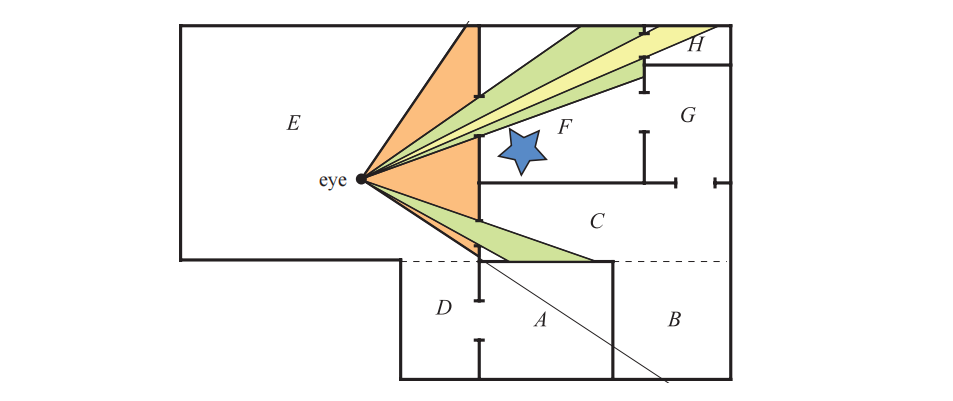

图19.15中展示了入口剔除算法的一个例子。观察者（或者眼睛）位于单元格$E$中，因此$E$中的内容会被渲染。相邻的单元格是$C$、$D$和$F$。原始视锥体看不到通往单元格$D$的入口，因此单元格$D$会在进一步的处理中被忽略。单元格$F$是可见的，因此视锥体会被相应缩小，使其与到单元格$F$的入口相连接，单元格$F$中的内容会根据这个缩小的视锥体来进行渲染。然后，会对单元格$F$的邻近单元格进行检查，从这个缩小的视锥体中看不到单元格$G$，因此它会被忽略，而单元格$H$是可见的。同样地，视锥体会随着单元格$H$的入口而发生相应的缩小，并根据对应的视锥体来渲染单元格$H$中的内容。而单元格$H$的邻居此时都以及被访问过了，因此遍历到这里就结束了。此时，这个递归过程会回到单元格$C$的入口，视锥体相应地会被缩小，从而适应单元格$C$的入口，然后对单元格$C$中的物体进行视锥体剔除，然后再进行渲染。此时我们已经遍历了所有的可见入口，因此渲染过程也就完成了。

每个物体在被渲染的时候都可以进行标记，从而避免多次渲染同一个物体。例如：如果有两个窗户都可以通向同一个房间，那么这个房间中的内容将会分别针对每个视锥体进行剔除。如果没有使用标记的话，会导致某些物体被渲染两次。这不仅效率低下，而且可能会导致渲染错误，例如当物体是透明的时候。为了避免在每一帧中都必须清除这个标签列表，可以让每个物体在被访问的时候都标记为当前的帧号，只有存储了当前帧号的物体才是被访问过的。

一个很值得实现的优化是，可以使用模板缓冲区（stencil buffer）来进行更加精确的剔除。在实践中，这些入口会被AABB高估；而真正的入口很可能会更小，可以使用模板缓冲区来屏蔽真实入口之外的渲染。类似地，可以为GPU设置一个门户周围的裁剪矩形（scissor rectangle）来提高性能\[13]。使用stencil和scissor功能还可以避免执行上述的标记过程，因为透明对象可能会被渲染两次，但是它们只会对每个入口中的可见像素产生一次影响。

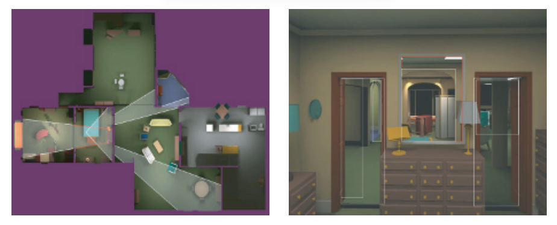

图19.16展示了使用入口剔除的另一个视图。这种形式的门户剔除也可以用于为平面反射裁剪内容（章节11.6.2）。左侧图像展示了建筑物的俯视图，其中白色线条代表了视锥体的范围。而图中的红色线条则是通过镜子反射所形成的视锥体范围。右侧图像展示了实际的视野内容，其中白色矩形代表了入口，红色矩形代表了镜子。只有位于视锥体内部中的物体才需要进行渲染。还可以使用一些其他的变换来创建其他的效果，例如简单的折射。

## 19.6 细节剔除和小三角形剔除

细节剔除（detail culling）是一种为了渲染速度而牺牲质量的技术。细节剔除的基本原理是：当观察者处于运动状态时，场景中的微小细节对于图像渲染的贡献很小或者根本没有贡献。当观察者停止移动的时候，通常会禁用细节剔除。考虑一个具有包围体的物体，并将该物体的BV投影到投影平面上。然后以像素为单位来评估投影的面积，如果其像素数低于用户定义的阈值，则在进一步的处理中会忽略这个物体。因此，细节剔除有时也会被称为屏幕尺寸剔除（screen-size culling）。细节剔除也可以在场景图上分层进行。这种类型的技术经常用于游戏引擎中\[283]。

由于每个像素的中心都有一个样本，而那些微小的三角形很有可能会落在两个相邻样本之间。除此之外，小三角形的光栅化效率很低。一些图形硬件实际上会剔除那些落在样本之间的三角形，但是当使用GPU上的代码来进行剔除的时候（章节19.8），添加一些代码来剔除小三角形可能会有所帮助。Wihlidal提出了一种简单的方法\[1883, 1884]，该方法首先会计算三角形的AABB。如果下面的条件成立，则可以在着色器中对三角形进行裁剔除：

$$
\operatorname{any}(\operatorname{round}(\min )==\operatorname{round}(\max ))
\tag{19.4} 
$$

其中的$\operatorname{min}$和$\operatorname{max}$代表了三角形周围的二维AABB。如果任意一个向量分量满足上述这个条件，那么函数$\operatorname{any}$就会返回真。回顾一下，像素中心位于$(x+ 0.5, y+ 0.5)$，这意味着如果该AABB的$x$坐标或者$y$坐标取整到相同的坐标时（或者同时满足这两个条件），则方程19.4为真。图19.17展示了一些示例。

==\operatorname{round}(\max )) 来剔除小三角形。图中的红色三角形会被剔除，而绿色三角形则会被保留。左：绿色三角形与样本重叠，因此不能被剔除。红色三角形的AABB坐标在取整之后，会得到相同的亚像素角点（pixel corner）。右：红色三角形可以被剔除，因为AABB坐标的其中一个分量会被舍入为相同的整数。虽然绿色三角形并没有与任何样本相重叠，但是无法被这个检验剔除。")

## 19.7 遮挡剔除

正如我们所看到的，可以通过z-buffer来解决可见性问题。但是即使它能够正确地解决可见性问题，但是z-buffer也是相对简单和粗暴的，因此它并不总是最高效的解决方案。例如：假设观察者正沿着一条直线进行观察，这条直线上放置了10个球体，如图19.18所示。

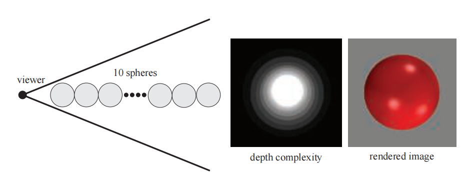

从这个视角进行渲染的图像，只会显示出一个球体，但是所有的10个球体都将被光栅化，并与z-buffer进行比较，然后有一定概率会写入颜色缓冲区和z-buffer中。图19.18的中间部分展示了这个场景在给定视角下的深度复杂度，深度复杂度指的是一个像素所覆盖的表面数量。假设我们启用了背面剔除，在图中10个球体的情况下，由于所有的10个球体都位于最中间的像素上，因此其深度复杂度为10。如果这个场景按照从后往前的顺序进行渲染，那么最中间的像素将会被着色10次，也就是说，其中有9次像素着色器执行是不必要的。即使场景是从前往后进行渲染的，那么这10个球体的三角形仍然会被光栅化，计算各自的深度，并与z-buffer中的深度进行比较，但是最终只生成了一个球体的画面。这个无聊的场景在现实中不太可能出现，但是它（从给定的视角）描述了一个物体密集的案例模型。这种类型的模型可以在真实场景中找到，例如：雨林、汽车引擎、城市和摩天大楼内部等。图19.19展示了这样的一个例子。

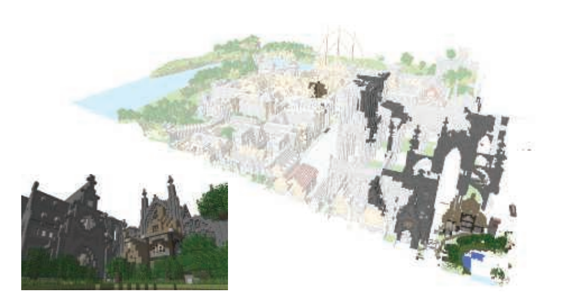

根据这个例子，避免这种低效率的算法可能会提高性能表现。这种类型的方法被称为遮挡剔除算法（occlusion culling algorithm），因为它们试图剔除那些被遮挡的物体，即被场景中被其他物体所隐藏的物体。最优的遮挡剔除算法将只会选择那些可见的物体。从某种意义上说，z-buffer只会选择并渲染那些可见的物体，而其他大部分位于视锥体内部的物体同样也会被发送到管线中进行计算，但是由于物体之间的相互遮挡，它们并不会出现在最终的图像中。高效遮挡剔除算法背后的思想是：在早期执行一些简单的测试，来剔除那些被隐藏的物体集合。从某种意义上说，背面剔除是遮挡剔除的一种简单形式。如果我们事先知道一个物体是封闭的，并且是不透明的，那么该物体的背面就会被正面所遮挡，因此并不需要进行渲染。

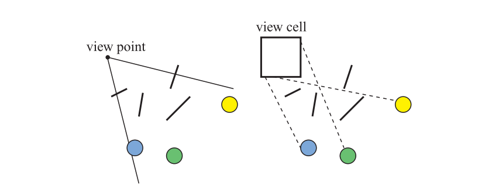

遮挡剔除算法主要有两种形式，即基于点的（point-based）和基于单元格的（cell-based），如图19.20所示。基于点的可见性就是通常在渲染中所使用的，也就是说，从单一的观察位置所能够看到的东西。另一种是基于单元格的方法，其可见性是针对单元格进行定义的，这个单元格是包含一组观察位置的空间区域，通常是一个box或者球体。在基于单元格的可见性中，一个物体必须要对单元格内的所有点都不可见，我们才能说这个物体是不可见的。基于单元格可见性的优点在于，一旦计算了某个单元格的可见性，那么只要观察者位于这个单元格内部，那么通常可以在几帧中重复使用这个可见性信息。然而，这种基于单元格的可见性计算起来通常要比基于点的可见性更加耗时，因此，它通常都是在预处理阶段完成的。基于点的可见性和基于单元格的可见性，在本质上类似于点光源和面光源，可以认为是在光源位置上来观察这个场景。而对于那些不可见的物体来说，这相当于这个物体处于光源的本影区域，即完全处于阴影中。

我们还可以将遮挡剔除算法按照不同的空间进行分类，分别是：图像空间（image space）、物体空间（object space）或者光线空间（ray space）中进行的算法。图像空间算法在经过一些投影操作后，会进行二维的可见性测试。物体空间算法则会使用原始场景中的三维物体。光线空间算法\[150, 151, 923]则会在对偶空间（dual space）中进行测试。每个感兴趣的点（通常是二维的），都会被转换为这个对偶空间中的一条射线。对于实时图形而言，这三种算法中应用最广泛的是图像空间中的遮挡剔除算法。

![图19.21：通用遮挡剔除算法的伪代码。其中 G 包含了场景中的所有物体， O\_R 是遮挡表示。 P 是一组潜在的遮挡物，当 P 中包含足够多的物体时，它会被合并 O\_R 中。 \[1965\]](images/Chapter-19/202309181045687.png "图19.21：通用遮挡剔除算法的伪代码。其中 G 包含了场景中的所有物体， O_R 是遮挡表示。 P 是一组潜在的遮挡物，当 P 中包含足够多的物体时，它会被合并 O_R 中。 \[1965]")

图19.21展示了一种遮挡剔除算法的伪代码，其中的函数$\mathrm{isOccluded}$通常会被称为可见性测试（visibility test），它用于检查物体是否被遮挡。其中$G$是要进行渲染的物体集合，$O_R$是遮挡表示，$P$是一个潜在的遮挡物集合，它可以与$O_R$进行合并。取决于所使用的特定算法，$O_R$代表的是某种遮挡信息。$O_R$在算法开始的时候会被设置为空。之后，会对所有的物体（这些物体已经通过了视锥体剔除测试）进行处理。

考虑一个特定的物体。首先，我们根据遮挡表示$O_R$，来测试这个物体是否会被遮挡。如果它被遮挡，那么就不需要进行进一步的处理了，因为我们此时已经知道了这个物体不会对最终的图像有任何贡献。如果我们无法确定这个物体是否会被遮挡，那么就必须要渲染这个物体，因为它可能会对最终的图像有贡献（在对其进行渲染的那一刻）。然后将该物体添加到集合$P$中，如果$P$中的物体数量足够多，那么我们可以将这些物体的遮挡能力（occluding power）合并为$O_R$，即$P$中的每个物体都可以作为遮挡物（occluder）。

请注意，对于大多数遮挡剔除算法而言，其性能取决于渲染物体的前后顺序，举个例子：假设现在有一辆汽车，汽车内部有一台发动机。如果汽车的引擎盖先进行绘制，那么内部的发动机（很可能）会被剔除。另一方面，如果我们先绘制发动机，那么没有任何物体会被剔除。使用一个粗略地、从前往后排序的渲染，可以获得相当大的性能提升。此外，值得注意的是，一些较小的物体也可能会是遮挡效果很强的遮挡物，因为与遮挡物之间的距离决定了它能够遮挡多少内容（译者注：一叶障目）。例如：如果一个火柴盒到观察者的距离足够近，那么这个火柴盒也可以遮挡金门大桥。

### 19.7.1 遮挡查询

GPU可以通过使用特殊的渲染模式来支持遮挡剔除，用户可以对GPU进行查询，从而确定一组三角形与z-buffer中的当前内容相比，是否是可见的。三角形通常会形成一个更加复杂物体的包围体（例如：一个box或者k-DOP），如果这些三角形都不可见，那么就可以剔除这个物体。GPU会将查询的三角形光栅化，并将其深度与z-buffer进行比较，也就是说，它是在图像空间中进行操作的。这些生成的三角形并不会修改像素颜色信息和深度信息，将其可见的像素数量记为$n$，如果$n$为0，则代表所有的三角形都会被遮挡或者裁剪。

但是，$n=0$也并不足以确定这个包围体是否为不可见的。更准确地说，还需要考虑相机视锥体的近裁剪平面，这个包围体不能包含近裁剪平面以内的物体。如果这个条件也满足，那么说明整个包围体被完全遮挡了，它所包含的物体可以被安全地丢弃。如果$n>0$，则有一小部分像素没有通过测试。如果这个$n$小于用户设定的阈值像素数量，那么这个物体可能会因为对最终图像的贡献不太大，从而被丢弃\[1894]。通过这种方式，可以使用一些可能的质量损失，来换取速度的提升。另一个用法是使用这个可见像素计数$n$，来帮助确定物体所使用的LOD层级（章节19.9）。如果这个$n$很小，则说明只有物体的一小部分是（可能）可见的，因此可以使用一个不太详细的LOD。

当发现某个包围体被遮挡时，我们通过避免向渲染管线发送这个潜在的复杂的物体，从而提高性能表现。但是如果测试失败的话（即这个包围体没有被遮挡），我们实际上会损失一些性能，因为我们花费了额外的时间来对这个包围体进行测试，但是却没有获得任何好处。

遮挡测试还有一些变体方法。出于剔除的目的，我们实际上并不需要可见片元的确切数量，使用一个布尔值来表示是否至少存在一个片元通过深度测试就足够了。OpenGL 3.3和DirectX 11以及后续版本，都支持这种类型的遮挡查询，在OpenGL中为枚举变量$\mathrm{ANY\_SAMPLES\_PASSED}$ \[1598]。这些测试的速度还可以更快，因为它们可以在发现一个片元可见时就立即终止遮挡查询。OpenGL 4.3及更高版本，还可以使用这种查询的更快变体，它被称为$\mathrm{\_ANY\_SAMPLES\_PASSED\_CONSERVATIVE}$。这个实现可以选择提供不那么精确的测试，并且它是保守的（不会剔除那些未被遮挡的物体），例如：硬件供应商可以通过仅对粗深度缓冲区（章节23.7）来执行深度测试，而不是进行逐像素的深度测试来实现这一点。

这个查询通常会有一段相对较长时间的延迟。一般来说，这段延迟时间内可以渲染成百上千个三角形，有关延迟的更多信息详见章节23.3。因此，当包围盒中包含大量的物体，并且发生了相对大量遮挡现象的时候，那么这种基于GPU的遮挡剔除方法是值得的。GPU使用了这样的一个遮挡查询模型，其中CPU可以向GPU发送任意数量的查询请求，然后CPU会定期检查是否有任何结果可以使用，也就是说，这个查询模型是异步的。GPU会执行每个遮挡查询，并将查询结果放入一个队列中。CPU端的队列检查非常快，同时CPU还可以继续发送查询请求或者渲染物体，而不会发生停滞。DirectX和OpenGL都支持断言/条件（predicated/conditional）的遮挡查询，其中遮挡查询与对应draw call的ID会被同时提交。只有当遮挡查询的几何物体可见时，GPU才会自动处理相应的draw call，这使得查询模型更加实用。

一般来说，应当对最有可能被遮挡的物体来执行遮挡查询。Kovaleik和Sochor \[932]在应用程序的运行过程中，会对每个物体在若干帧内的查询结果的运行信息进行收集。一个物体被遮挡的帧数量，会对它在未来被检测遮挡的频率产生影响。也就是说，可见的物体很可能会一直保持可见，因此可以较少地进行遮挡测试。如果可能的话，会在每一帧中都对隐藏物体进行遮挡测试，因为这些物体是最有可能从遮挡查询中受益的。Mattausch等人\[1136]针对没有断言/条件渲染的遮挡查询（OC）提出了几种优化方法。他们使用了批量处理的OC，将几个OC组合成一整个OC；使用若干个包围盒而不是单个较大的包围盒；并使用时域抖动采样，来调度之前可见的物体。

这里所讨论的方案展示了遮挡剔除方法的潜力以及一些存在的问题。究竟什么时候使用遮挡查询，或者使用什么样的遮挡方案，这些答案通常都是并不清楚的。如果场景内的物体都是可见的，那么使用遮挡算法只会花费额外的时间，并且永远都不会提升性能表现。这里存在的一个挑战是，如何快速确定遮挡算法并没有起到作用，减少那些徒劳的遮挡测试，从而节省时间。另一个问题是，究竟决定使用哪组物体集合来作为遮挡物。视锥体内的第一个物体肯定是可见的，因此在这些物体上进行遮挡查询完全是浪费。在实现大多数遮挡剔除算法的时候，决定以什么顺序进行渲染，以及什么时候进行遮挡测试是一个难题。

### 19.7.2 层次Z缓冲

层次$z$缓冲（hierarchical z-buffering，HZB）\[591, 593]对于遮挡剔除的研究有重要影响。虽然原始形式的、CPU端的HZB很少会被使用，但是该算法是GPU硬件z-culling方法（章节23.7）的基础，也是使用GPU或者CPU运行的、软件自定义的遮挡剔除的基础。我们首先会介绍该技术的基本算法，然后再介绍该技术是如何在各种渲染引擎中应用的。

该算法会将场景模型维护在一棵八叉树中，并将一帧画面的z-buffer来作为图像金字塔，我们称之为z金字塔（z-pyramid）。因此，该算法也是在图像空间中运行的。八叉树实现了对场景遮挡区域的分层剔除，而z-金字塔则实现了图元的层次z缓冲。因此，z金字塔是该算法的遮挡表示方法，图19.22展示了这种数据结构的例子。

![图19.22：使用HZB算法进行遮挡剔除的例子 \[591, 593\] ，右下角展示了一个具有较高深度复杂度的场景，左侧展示了相应的z-金字塔，右上角展示了八叉树的细分结构。通过从前向后遍历八叉树，并在遇到被遮挡的八叉树节点时将它们剔除，这个算法能够实现只访问那些可见的八叉树节点及其子节点（右上角所示的节点），并且只渲染那些位于可见框中的三角形。在这个例子中，通过剔除那些被遮挡的八叉树节点，可以将深度复杂度从84降低到2.5。](images/Chapter-19/202309181423085.png "图19.22：使用HZB算法进行遮挡剔除的例子 \[591, 593] ，右下角展示了一个具有较高深度复杂度的场景，左侧展示了相应的z-金字塔，右上角展示了八叉树的细分结构。通过从前向后遍历八叉树，并在遇到被遮挡的八叉树节点时将它们剔除，这个算法能够实现只访问那些可见的八叉树节点及其子节点（右上角所示的节点），并且只渲染那些位于可见框中的三角形。在这个例子中，通过剔除那些被遮挡的八叉树节点，可以将深度复杂度从84降低到2.5。")

z金字塔的最精细级别（最高分辨率），实际上就是一个标准的z-buffer。而在其他的所有级别上，每个z值都是相邻更精细级别中，对应$2 × 2$窗口中的最远z值。也就是说，每个z值都代表了屏幕正方形区域内的最远z值。每当z-buffer中的一个z值被覆盖时，它就会通过z金字塔的较粗糙层级向上进行传播。这个过程是递归完成的，直到到达图像金字塔的最顶端，最顶端只剩下一个单独的一个z值。金字塔的结构如图19.23所示。

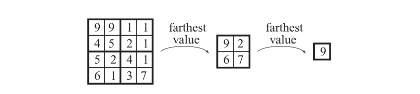

八叉树节点的分层剔除可以按照下列步骤进行。首先以粗略的从前到后的顺序来遍历八叉树中的节点，使用一个扩展的遮挡查询（章节19.7.1）来对八叉树的包围盒和z金字塔进行深度测试。我们将包围盒投影到屏幕上，并从能够包围这个屏幕投影的、最粗糙的z金字塔单元格开始进行测试。然后将包围盒在单元格内的最近深度（$z_{near}$）与z金字塔中的值进行比较，如果发现$z_{near}$要更远，那么我们就知道这个包围盒被遮挡了。这个测试会一直沿着z金字塔的层级不断递归地进行下去，直到发现这个包围盒被遮挡了，或者是到达z金字塔的最底层（最精细级别，即z-buffer），那么此时包围盒便是可见的。对于可见的八叉树包围盒，会在八叉树中继续向下递归测试，最后可能的可见几何图形，会被渲染到这个层次z缓冲区中。这样做是为了在后续的测试中，能够利用先前已渲染物体的遮挡能力。

完整的HZB算法如今没有被使用，但是对其进行了简化，并且能够在GPU上使用自定义的剔除、或者使用CPU上的软件光栅化，来很好地与计算着色器pass一起运行。一般来说，大多数基于HZB的遮挡剔除算法的流程如下：

1.  使用一些遮挡物表示，来生成一个完整的层次z-金字塔。
2.  想要测试某个物体是否被遮挡，需要将其包围体投影到屏幕空间中，并估计z金字塔中对应的mip层级。
3.  针对选定的mip层级进行遮挡测试。如果遮挡结果并不明确，可以选择使用更加精细的mip层级来继续进行测试。

大多数实现都不会使用八叉树或者任何BVH，也不会在渲染物体后取更新z金字塔，因为这些操作可能会过于昂贵而无法执行。

步骤1可以使用一些“最佳”遮挡物来完成\[1637]，这些“最佳”遮挡物可以是最近的$n$个物体集合\[625]，可以使用艺术家生成的简化遮挡物图元，或者使用上一帧中可见物体集合的统计数据。再或者，还可以使用上一帧的z-buffer \[856]，但是这样做可能会过于激进，因为部分物体有时可能会因为不正确的剔除而突然出现，尤其是在相机或者物体快速移动的情况下。Haar和Aaltonen \[625]都将最佳遮挡物进行了渲染，并将结果与前一帧深度$1/16$分辨率的重投影结果结合起来，然后再使用GPU来构建z金字塔，如图19.23所示。有些人则使用AMD GCN架构中的HTILE（章节23.10.3）来加速z金字塔的构建\[625]。

在步骤2中，我们需要将物体的包围体投影到屏幕空间中。常见的BV选择包括球体、轴对齐包围盒（AABB）和定向包围盒（OBB）。BV投影后的最长边$l$（以像素为单位）会用于计算z金字塔中的mip层级$\lambda$，计算公式如下\[738, 1637, 1883, 1884]：

$$
\lambda=\min \left(\left\lceil\log _{2}(\max (l, 1))\right\rceil, n-1\right)
\tag{19.5} 
$$

其中方程19.5中的$n$是z金字塔中mip层级的最大数量。max操作符是为了避免得到负的mip层级，min操作符是为了避免访问不存在的mip层级。方程19.5会选择最小的整数mip层级，并能够使得投影后的BV最多覆盖$2 × 2$个深度值。这样做的原因是使得成本可以预测，因为它最多只需要对4个深度值进行读取和测试。此外，Hill和Collin认为\[738]，这个测试可以被视为“概率性”的，因为较大的物体要比较小的物体更加容易被看到，所以在这些情况下，不需要读取更多的深度值。

当到达步骤3时，我们此时已经知道投影后的BV位于哪一个mip层级中，并被一组（最多）$2 × 2$的深度值所包围。对于一个给定大小的BV，它可能会完全落在某个mip层级的单个深度纹素中。然而，取决于BV投影在单元格上的方式，它也可能会覆盖所有的四个纹素。然后我们需要计算BV的最小深度，这个深度可以是精确的，也可以是保守的。对于观察空间中的AABB而言，这个深度就是包围盒的最小深度；而对于OBB而言，可以将所有顶点都投影到观察向量上，并选择其中的最小距离。对于球体BV，Shopf等人\[1637]使用公式$\mathbf{c}-r \mathbf{c} /\|\mathbf{c}\|$来计算球面上的最近点，其中$\mathbf{c}$是观察空间中的球体中心，$r$是球体半径。请注意，如果相机位于BV内部，那么这个BV将会覆盖整个屏幕，因此这个物体需要进行渲染。将BV的最小深度$z_{min}$与层次z缓冲区中的（最多）$2 × 2$深度进行比较，如果$z_{min}$是其中最大的深度，那么说明这个BV会被遮挡。如果该BV没有被遮挡，那么可以在这里停止测试，并渲染这个BV所对应的物体。

我们还可以在金字塔的下一个更深层级（更高分辨率）上来继续进行测试。我们可以通过使用另一个存储最小深度的z金字塔，来看看这种测试是否有必要进行。我们可以根据这个新缓冲区中的相应深度，来对BV的最大距离$z_{max}$进行测试。如果$z_{max}$是其中最小的，那么说明这个BV肯定是可见的，并且可以立即进行渲染。否则，这个BV的$z_{min}$和$z_{max}$会与这两个层级z缓冲的对应深度相重叠，在这种情况下，Kaplanyan \[856]建议可以在更高分辨率的mip层级上继续进行测试。请注意，针对单个深度值在层次z缓冲中测试$2 × 2$大小的纹素，与百分比接近过滤PCF的做法非常相似（章节7.5）。事实上，这个测试可以使用双线性过滤和百分比接近过滤来完成，如果这个测试返回一个正值，那么说明至少有一个纹素是可见的。

Haar和Altonen \[625]也提出了一种双pass方法，它总是可以至少渲染所有的可见物体。首先，在第一个pass中，使用前一帧中的z金字塔，来对所有物体进行进行遮挡剔除，并渲染所有的“可见”物体。或者，可以直接使用最后一帧中的可见性列表来渲染当前帧的z金字塔。虽然这是一个近似方法，但是上一帧中所有被渲染的物体，确实可以作为当前帧“最佳”遮挡物的良好估计，尤其是在具有较高帧间一致性的情况下。在第二个pass中，会获取这些渲染物体的深度缓冲，并创建一个新的z金字塔。然后，针对第一个pass中被剔除的物体，再次进行遮挡测试，如果某些物体这一次没有被剔除，那么就渲染这些物体。即使相机或者物体快速移动时，这种方法也能够生成完全正确的图像。Kubisch和Tavenrath \[944]也使用了类似的方法。

Doghramachi和Bucci \[363]将前一帧中的深度缓冲区进行下采样和重投影，并使用它们来对被遮挡物体的定向包围盒进行光栅化。他们强制着色器使用early-z（章节23.7），并且对于每个包围盒，可见片元都会将物体标记为在某个缓冲区位置上可见，这是由物体ID唯一确定的\[944]。由于使用了定向包围盒，并且进行了逐像素的测试（而不是使用方程19.5针对mip层级所使用自定义测试）因此可以提供更高的剔除率。

Collin \[283]使用了$256 × 144$大小的浮点z-buffer（并不是分层的），并以较低的复杂度来光栅化艺术家生成的遮挡物。这是在使用CPU或者SPU（在PLAYSTATION 3上）、以及高度优化的SIMD代码的软件中完成的。为了进行遮挡测试，该方法会计算物体的屏幕空间AABB，并将其$z_{min}$与这个小尺寸z-buffer中的所有相关的深度进行比较，只有在剔除中幸存下来的物体才会被发送到GPU中。这种方法是可行的，但是从保守角度来说它并不正确，因为它所使用的分辨率要低于最终帧缓冲的分辨率。Wihlidal建议\[1883]，低分辨率的z-buffer也可用于将$z_{max}$加载到GPU的HiZ中（章节23.7），例如：在AMD GCN上触发HTILE结构。或者，如果HZB用于计算着色器pass的剔除，那么可以使用软件z-buffer来生成z金字塔，这样一来，算法可以利用软件中产生的所有信息。

Hasselgren等人\[683]提出了一种不同的方法，其中每个$8 × 4$的tile中，每个像素有一个bit以及两个$z_{max}$值\[50]，即每个像素的总成本为3 bit。通过使用这个$z_{max}$值，可以更好地处理深度不连续的情况，因为背景物体可以使用其中的一个$z_{max}$值，而前景物体则可以使用另一个$z_{max}$值。这种表示方法被称为掩码层次深度缓冲区（masked hierarchical depth buffer，MHDB），这是一种保守的表示方法，也可以用于$z_{max}$剔除。在软件三角形光栅化的过程中，每个tile只会生成覆盖蒙版和单个的最大深度值，这使得光栅化到MHDB中的效率很高。在将三角形光栅化到MDHB的过程中，也可以使用MDHB来对三角形进行遮挡测试，从而对光栅化器进行优化。每个三角形都会更新MDHB，这是其他方法很少具备的优点。可以使用两种模式来进行评估。第一种是使用特殊的遮挡网格，并使用软件光栅化器来将这些网格渲染到MDHB中。然后遍历被遮挡物上的AABB树，并针对MDHB进行分层遮挡测试。这样做是十分有效的，尤其是当场景中存在许多小物体的时候。对于第二种方法，整个场景会被存储在一个AABB树中，通过使用一个堆结构，来使得场景的遍历大致是按从前向后的顺序完成的。在每一步中，对MDHB使用视锥体剔除和遮挡查询，每当渲染物体的时候，MDHB也会相应地进行更新。图19.19中的场景就是使用这个方法进行渲染的，其开源代码针对AVX2指令集进行了大量优化\[683]。

还有一些专门用于剔除和遮挡剔除的中间件（middleware）。Umbra就是这样的一个框架，它被广泛地整合到各种游戏引擎中\[13, 1789]。

## 19.8 剔除系统

剔除系统多年来已经发生了相当大的演变，并且将持续发生演变。在本小节中，我们将描述一些总体思想，并提及有关细节的一些文献。一些系统在GPU的计算着色器中来高效执行所有剔除操作，而其他的一些系统则将CPU上的粗粒度剔除与GPU上的细粒度剔除结合起来。

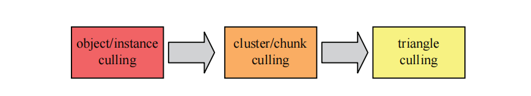

如图19.24所示，一个典型的剔除系统可以在许多粒度上进行运行。其中一个物体的簇或者块（cluster/chunk），指的是该物体三角形的一个子集。例如：可以使用包含64个顶点的三角形带\[625]，或者是包含256个三角形的组\[1884]。在每个步骤中，可以使用多种剔除技术的组合。El Mansouri \[415]在物体上使用了小三角形剔除、细节剔除、视锥体剔除和遮挡剔除。由于cluster在几何上要比物体更小，因此对cluster使用相同的剔除技术是有意义的，因为它们更有可能会被剔除。例如：可以在cluster上使用细节剔除、视锥体剔除、集群背面剔除和遮挡剔除等。

在cluster级别上进行剔除之后，还可以执行一个额外的步骤，即在三角形级别上进行剔除。为了让这一步完全在GPU上完成，可以使用图19.25所展示的方法。三角形剔除技术包括透视除法（除$w$）后的视锥体剔除，即将三角形的范围与$±1$进行比较（译者注：裁剪）；背面剔除、退化三角形剔除、小三角形剔除、以及可能的遮挡剔除等。然后将历经所有剔除测试后剩下的三角形压缩到一个最小列表中，这样做的目的是为了在下一步中只对那些幸存下来的三角形进行处理\[1884]。这里的一个想法是，让用于剔除的计算着色器在这个步骤中向GPU发送一个绘制命令，这是使用间接绘制命令（indirect draw command）完成的。这种调用在OpenGL中被称为“多重间接绘制（multi-draw indirect）”，在DirectX中则被称为“间接执行（execute indirect）”\[433]。三角形的数量会被写入到GPU缓冲区中的一个位置，它与压缩列表一起，可以被GPU用来渲染三角形列表。

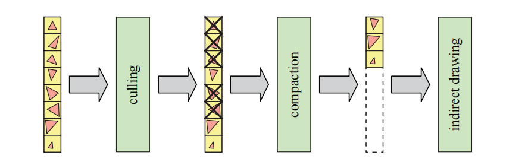

有许多方法可以将剔除算法与它们的执行地点（在CPU或者GPU上）结合在一起，每种剔除算法也有着许多不同的风格。现在还没有一种最好的组合方式，但可以肯定的是，这种最好的方法具体取决于目标架构以及要进行渲染的内容。接下来，我们会介绍一些CPU/GPU剔除系统领域中的重要工作，这些工作对于该领域产生了重大的影响。Shopf等人\[1637]在GPU上对角色进行了AI模拟，因此，每个角色的位置只能在GPU的显存中使用。这让他们探索了使用计算着色器来管理剔除和LOD，随后的大多数剔除系统都受到了他们工作的巨大影响。Haar和Aaltonen \[625]描述了他们为《刺客信条：大革命》所开发的系统。Wihlidal \[1883, 1884]解释了寒霜引擎中所使用的剔除系统。Engel \[433]提出了一个剔除系统，该系统使用一个可见性缓冲来帮助改进管线（章节20.5）。Kubisch和Tavenrath \[944]描述了如何渲染大量模型的方法，这些模型都具有大量的部件，并使用了不同的剔除方法和API调用来进行优化。一个值得注意的方法是，他们使用了遮挡剔除框（occlusion-cull box），并使用几何着色器来创建包围盒的可见边，然后使用early-z来快速剔除被遮挡的几何体。

## 19.9 LOD

细节层次（level of detail, LOD）的基本思想是：如果一个物体对最终渲染图像的贡献越来越小，那就使用一个更加简化版本的物体。例如：假设现在有一辆可能包含100万个三角形的精细汽车模型，当观察者靠近汽车进行观察的时候，可以使用这种精细表示；而当物体距离较远的时候，比如只覆盖了200个像素，我们并不需要这全部的100万个三角形。相反，我们可以使用一个简化模型，比如只包含1000个三角形的汽车模型。由于距离的关系，这个简化版本看起来与详细版本大致相同，如图19.26所示。通过这种方式，可以获得显著的性能提升。为了减少应用LOD技术所涉及的总工作量，最好是在应用剔除技术之后再应用LOD。例如：可以只对视锥体内的物体计算对应的LOD。

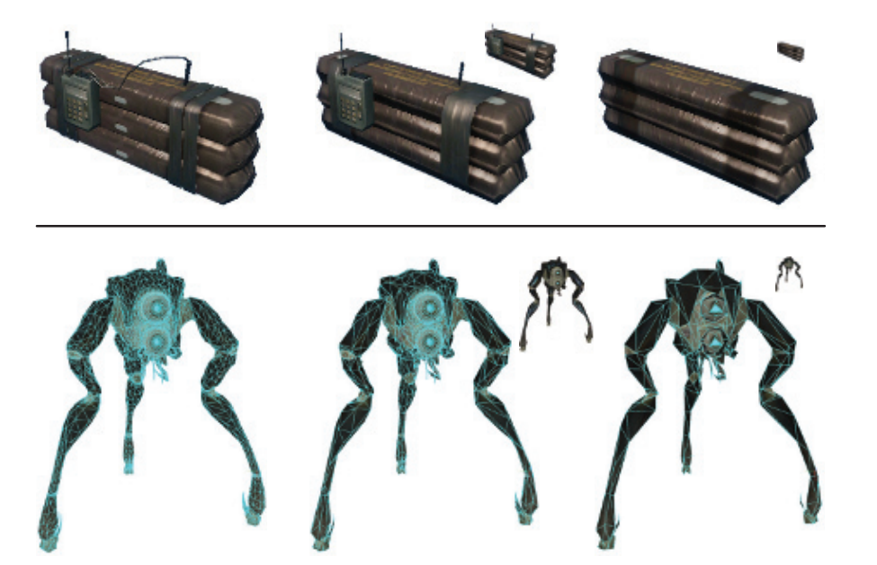

LOD技术还可以使得应用程序具有更好的可伸缩性，能够在一系列具有不同性能的设备上，以所需的帧率进行运行。在性能较低的系统上，可以使用较少细节的LOD来提高性能表现。需要注意的是，虽然LOD技术首先可以帮助减少顶点处理的开销，但是它们也同样减少了像素着色的成本。出现这种情况的原因在于，这个模型所有三角形的边长之和会变小，这意味着四边形过度渲染（quad overshading）的现象减少了（章节18.2和章节23.1）。

雾和第14章中所描述的其他参与介质，可以与LOD一起进行使用。这允许我们可以完全跳过渲染一个物体，因为它可能会进入到完全不透明的雾中。此外，这种雾化机制（fogging mechanism）还可以用于实现限时渲染（time-critical，章节19.9.3）。通过移动远裁剪平面，使其更加接近观察者，可以在早期剔除更多物体，从而提高帧率。此外，通常可以在雾中使用较低的LOD。

还有一些物体（例如球体、Bezier表面和细分表面），这些物体的几何描述本身就具备了一部分的LOD效果。其底层的几何图形表示是弯曲的，可以使用一个单独的LOD控制选项，来决定如何将其细分成可以显示的三角形。详见章节17.6.2，其中包含了一些算法，它们可以控制参数化曲面和细分曲面的曲面细分质量。

一般来说，LOD算法由三个主要部分组成，分别是生成（generation）、选择（selection）和切换（switching）。其中LOD的生成是指，使用不同数量的细节来生成模型的不同表示版本。章节16.5中所讨论的网格简化方法可以用于生成所需数量的LOD。另一种方法则是人工制作具有不同数量三角形的模型。LOD的选择是指，根据一些标准（例如屏幕上所占据的估计面积）来选择一个LOD模型。最后，我们需要将一个LOD切换到另一个LOD，这个过程被称为LOD的切换。本小节中将会介绍不同的LOD切换和选择机制。

虽然本小节的重点在于在不同的几何表示中进行选择，但是LOD背后的思想也可以应用到模型的其他方面，甚至是所使用的渲染方法中。例如：较低LOD的模型也可以使用较低分辨率的纹理贴图，从而进一步节省内存开销，并且还可能提高缓存访问性能\[240]。着色器本身也可以根据距离、重要性或者其他因素进行来进行适当简化\[688, 1318, 1365, 1842]。Kajiya \[845]提出了一个分层的尺度，展示了表面光照模型是如何与纹理映射方法相重叠的，以及纹理映射方法反过来是如何与几何细节相重叠的。另一种技术是，对于远处的物体，可以使用更少的骨骼来进行蒙皮操作。

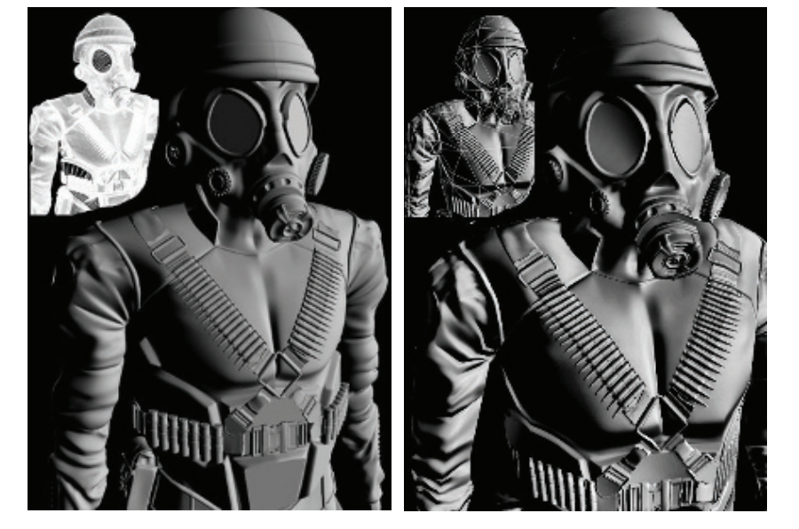

当静态物体相对较远时，广告牌和impostor（章节13.6.4）是一种很自然的低成本表现方式\[1097]。其他的一些表面渲染方法（例如凹凸映射或者浮雕映射），也可以用来简化模型的表示，如图19.27所示。Teixeira \[1754]讨论了如何使用GPU来将法线映射到表面上。这种简化技术最明显的缺陷是，silhouette边缘会失去各自的曲率。Loviscach \[1085]提出了一种方法，该方法会沿着silhouette边缘挤压出鳍片，从而创建出弯曲的轮廓。

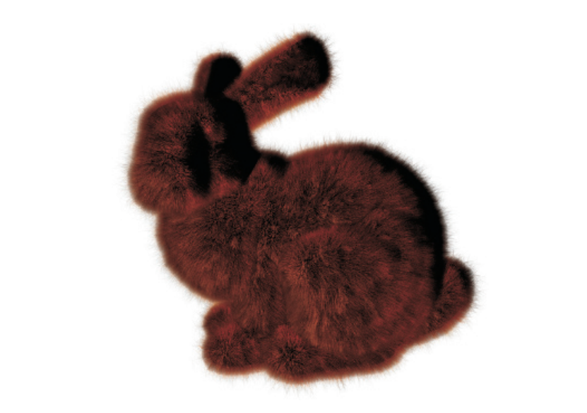

Lengyel等人\[1030, 1031]给出了一个例子，它展示了这些技术所能用来表现物体的尺度范围。在这项研究中，对于皮毛渲染，在非常近的地方会使用真实的几何形状来进行表示；在稍远的地方会用alpha混合的折线来进行表示，然后会使用体积纹理的“壳”来进行混合；最后在很远的地方使用纹理贴图来进行表示，如图19.28所示。知道何时以及如何最好地来从一组建模和渲染技术切换到另一组建模和渲染技术，从而最大化帧率和画面质量，仍然是一门艺术，也是一个有待探索的开放领域。

### 19.1.1 LOD切换

当从一个LOD切换到另一个LOD时，突然出现的模型替换通常会很明显，并且会严重分散观众的注意力，这个突然出现的差异被称为popping。这里将介绍几种不同的切换方式，每一种都具有不同的popping特性。

#### 离散几何LOD

在最简单类型的LOD算法中，不同版本的LOD表示实际上是同一个物体模型，但是包含了不同数量的图元（三角形）。该算法非常适合现代图形硬件\[1092]，因为这些独立的静态网格可以存储在GPU的显存中，并在后续可以进行重复使用（章节16.4.5）。一个更加详细的LOD会有更多的图元。图19.26和图19.29中分别展示了三个物体的LOD。图19.26还展示了距离观察者不同距离处的LOD。

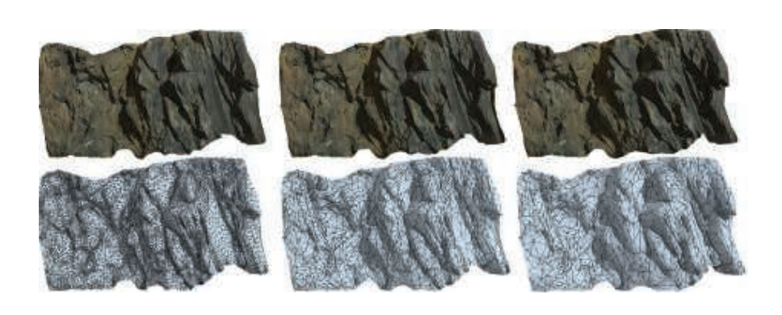

在这种方法中，从一个LOD切换到另一个LOD是突然发生的。也就是说，在当前帧中会使用某个LOD，然后在下一帧中，LOD选择机制则会选择另一个LOD，并且会立即使用该LOD进行渲染。对于这种类型的LOD方法而言，其popping特性通常是最为糟糕的，但是如果这种切换发生在较远的距离处，并且两个相邻LOD的渲染差异几乎不可见时，这种方法也可以很好地运行。下面将介绍一些更好的替代方案。

#### 混合LOD

从概念上讲，一种简单的切换方法是，在短时间内对两个LOD之间进行一个线性混合，这样做肯定会使切换过程变得更加平滑。但是为一个物体渲染两个LOD模型，自然要比只渲染一个LOD模型开销更大，因此这在某种程度上违背了LOD的初衷。然而好在LOD切换通常只会在很短的时间内发生，并且场景内同时进行切换的物体也不可能会太多，因此相对于额外增加的成本，这种混合方法所提高的质量可能是值得的。

假设我们现在需要在两个LOD（例如LOD1和LOD2）之间进行过渡，而LOD1是当前正在渲染的那个LOD。现在的问题在于，如何以一种合理的方式来混合和渲染这两个LOD。如果将这两个LOD设置为半透明，那么此时屏幕上正在渲染的物体也将会变成半透明的（尽管会因为两个LOD重叠而不会那么透明），这看起来会很奇怪。

Giegl和Wimmer \[528]提出了一种混合方法，这种方法在实践中的效果很好，并且实现起来十分简单。首先将LOD1以不透明的方式，渲染到帧缓冲中（即颜色缓冲和z-buffer）。然后将LOD2的alpha值从0逐渐增加到1，并使用“over”混合模式来淡入LOD2。当LOD2的alpha值为1时，此时LOD2是完全不透明的，使其变成当前使用的LOD，然后再让LOD1淡出。正在淡出那个的LOD应当在启用深度测试（z-test）和禁用深度写入（z-write）的情况下进行渲染。为了避免在渐变LOD的渲染结果上叠加绘制远处的物体，只需要在所有不透明内容绘制完成之后，再按照前后顺序来绘制所有的渐变LOD即可，就像在渲染透明物体时所做的那样。请注意，在过渡过程的最中间，此时两个LOD都是不透明的，其中一个LOD在另一个LOD的上面。如果过渡间隔很短，那么这种技术的效果最好，这也有助于保持较小的渲染开销。Mittring \[1227]讨论了一个类似的方法，不同之处在于他使用了点阵剔除半透明（可能是在亚像素级别上进行）来消除不同版本之间的差异。

Scherzer和Wimmer \[1557]通过每帧只更新一个LOD，并重复使用前一帧的另一个LOD，来避免同时渲染两个LOD。前一帧的反向投影可以与一个使用可见性纹理的组合pass一起执行。可以得到更快的渲染速度，以及更好的过渡表现。

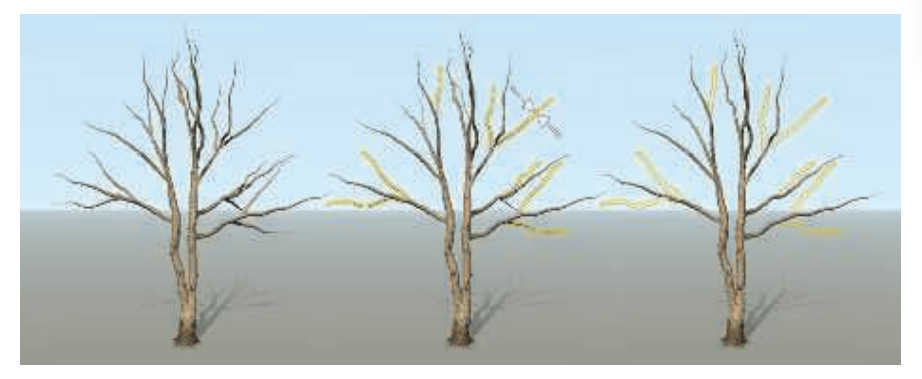

有些物体可以使用其他的切换技术。例如，SpeedTree \[887]会对树木LOD模型的一部分进行平滑地移动或者缩放，从而避免popping现象，图19.30展示了这样的一个例子。图19.31中展示了一组LOD，以及用于表现远处树木的广告牌LOD技术。

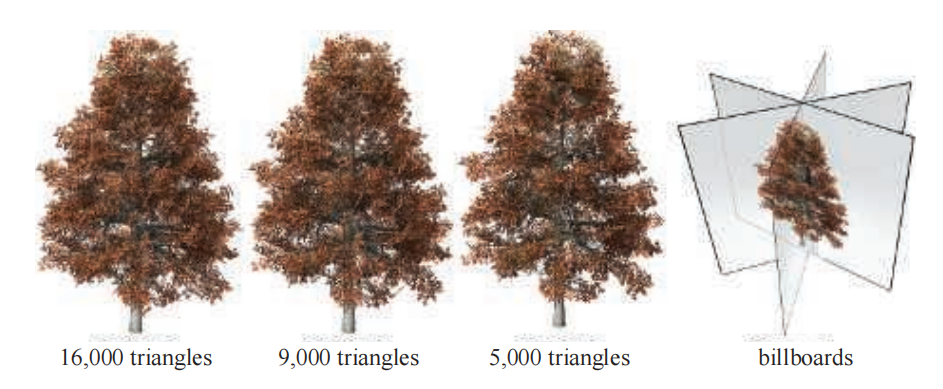

#### Alpha LOD

一个避免popping的简单方法是使用alpha LOD。这个技术可以单独使用，也可以与其他LOD切换技术结合使用。它应用在最简单的可见LOD上，如果只有一个LOD可用的话，也可以直接应用在原始模型上。当用于LOD选择的度量（例如：到该物体的距离）逐渐增加时，该物体的整体透明度也会逐渐增加（即$\alpha$减小），当物体达到完全透明（$\alpha = 0.0$）时，它最终会消失。当这个LOD度量值大于用户定义的不可见阈值时，就会发生这种情况；在达到不可见阈值的时候，只要这个LOD度量值保持在阈值之上，就不需要将物体发送到渲染管线中。如果一个物体此时是不可见的，并且其LOD度量值低于不可见阈值时，它就会降低其透明度（即$\alpha$增大）并重新开始变得可见。另一种选择是使用章节19.9.2中描述的延迟方法。

单独使用这种技术的优点在于，它要比离散的几何LOD方法效果更加连续，因此可以避免popping现象。此外，由于物体最终会完全消失，不需要进行渲染，因此可以获得显著的加速效果。这个技术的缺点在于，只有当物体完全消失之后，才能获得性能提升。图19.32展示了alpha LOD的一个例子。

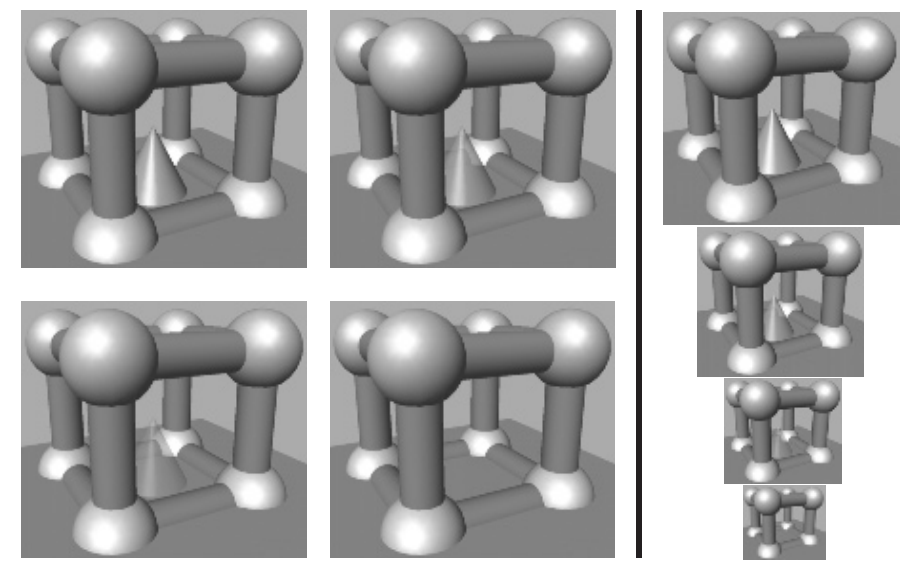

使用alpha透明度的一个问题在于，需要对透明物体按照深度进行排序，从而确保这些透明物体能够正确混合。为了使得远处的植被逐渐淡出，Whatley \[1876]讨论了如何将噪声纹理用于点阵剔除半透明方法（screen-door transparency）。这样做可以获得一种逐渐溶解的效果，随着距离的不断增加，物体上会有更多的纹理消失。虽然这种方法的质量并不像真正的alpha渐变那样好，但是使用点阵剔除半透明，意味着我们不需要进行排序和混合。

#### CLOD和地貌LOD

使用网格简化技术，可以从单个复杂物体中创建出各种不同版本的LOD模型，执行这种简化的算法我们在章节16.5.1中进行了讨论。其中一种方法是创建一组离散的LOD，并按照上文中所描述的方法来使用它们。然而，边缘坍缩（edge collapse）方法有一个特性，它允许在不同LOD之间，使用其他方法来进行转换。这里我们会介绍两种利用此类信息的方法，这些方法是一些有用的背景，但是目前很少会在实践中进行使用。

每次执行边坍缩操作之后，模型的三角形都会减少两个。在边坍缩操作中，有一条边会被缩短，直到这条边的两个端点重合，然后这条边就消失了。如果将这个过程动画化，那么就可以在原始模型和略微简化的模型之间进行平滑过渡。对于一次边坍缩过程而言，一个顶点会与另一个顶点相重合；而在一系列的边坍缩过程中，一组顶点会发生移动，并与另一组顶点相重合。通过存储这一系列的边坍缩操作，可以逆转这个过程，这样做的话，一个简化的模型就可以随着时间的推移，逐渐变得更加复杂。边坍缩的翻转过程被称为顶点分裂（vertex split）。因此，这种改变物体LOD的精确方法是，可以根据LOD选择值来确定可见三角形的数量。在100米外，模型可能会由1000个三角形组成；而当移动到101米时，它可能会下降到998个三角形。这种方案被称为连续LOD技术（continuous level of detail，CLOD）。因此，这并不是一组离散的模型，而是一组可供显示的庞大模型集合，每个模型的三角形都要比相邻模型（更复杂的那个邻居）少两个。

虽然这样做很有吸引力，但是在实践中使用这种方案仍然会存在一些缺点。并不是CLOD流中的所有模型看起来都很好。一组三角形网格的渲染速度要比单个三角形网格快得多，而CLOD技术所使用的是动态模型，这要比使用静态模型更加困难。如果场景中有几个相同物体的实例，那么每个CLOD物体需要指定自己特定的三角形集合，因为它不会与任何其他的三角形集合相匹配，也就是说，每个CLOD所使用的模型都是独立的。Forsyth \[481]对这些问题以及其他一些问题的解决方案进行了讨论。大多数CLOD技术本质上是串行的，它们并不一定适合在GPU上进行实现。因此，Hu等人\[481]提出了一种更加适合GPU并行特性的CLOD修改版本。他们的技术也是视图依赖的，如果一个物体与视锥体的左侧边界相交，那么位于视锥体外部的模型可以使用更少的三角形，而位于视锥体内部的模型则可以使用更高密度的三角形。

在一次顶点分裂中，一个顶点会变成两个顶点。这意味着复杂模型上的每个顶点都来自于简单模型上的某个顶点。地貌LOD（Geomorph LOD）\[768]是一组通过网格简化所创建的离散模型，这些模型保持了顶点之间的连通性。当从一个复杂模型切换到一个简单模型的时候，复杂模型的顶点会在其原始位置和简单模型的顶点位置之间进行插值。在转换完成之后，就会使用更简单的LOD模型来表示这个物体，图19.33展示了一个过渡的例子。地貌LOD有几个优点，首先是可以提前选择所使用的静态模型，从而获得较高的质量，并且这些模型也可以很容易地转换为三角形网格。像CLOD一样，这种平滑过渡也可以避免出现popping。这种方法的主要缺点在于，每个顶点都需要进行插值；而CLOD技术则通常不会使用插值，因此顶点位置的集合本身也不会发生改变。这种方法的另一个缺点在于，物体看起来总是在发生变化，这可能会分散观察者的注意力，尤其是对于具有纹理的物体。Sander和Mitchell \[1543]描述了一个系统，其中地貌模型与静态模型、GPU驻留的顶点缓冲和索引缓冲会一起进行使用。也可以与Mittring \[1227]的点阵剔除半透明方法相结合，从而实现更加平滑的过渡效果。

![图19.33：最左边和最右边分别展示了一个低细节模型和一个高细节模型。中间则展示了一个在左右模型之间进行插值的地貌模型。请注意，中间的奶牛模型与右边的模型具有相同数量的顶点和三角形。 \[1196\]](images/Chapter-19/202309191137183.png "图19.33：最左边和最右边分别展示了一个低细节模型和一个高细节模型。中间则展示了一个在左右模型之间进行插值的地貌模型。请注意，中间的奶牛模型与右边的模型具有相同数量的顶点和三角形。 \[1196]")

GPU支持一种被称为分数曲面细分的相关思想。在这种方案中，表面的曲面细分因子可以被设置为任意的浮点数，因此可以避免popping。例如：分数曲面细分可以用于Bezier面片和位移映射图元。有关这些技术的更多信息，详见章节17.6.1。

### 19.9.2 LOD选择

考虑到一个物体可能会存在不同的LOD模型，我们必须选择其中一个进行渲染，或者是对其中的一些进行混合。这是LOD选择（LOD selection）所负责的任务，这里我们将介绍几种不同的技术，这些技术也可以用于为遮挡剔除算法选择一组良好的遮挡物。

通常来说，LOD选择的度量，也称为效益函数（benefit function），是针对当前观察视角和物体位置进行评估计算的，并且会根据该度量值来选择一个适当的LOD。这个度量可以基于，例如：物体包围体的投影面积，或者是从观察点到物体的距离。在这里我们将效益函数的值记为$r$。有关如何快速估计一条线段在屏幕上的投影长度，详见章节17.6.2。

#### 基于范围

选择LOD的一种常用方法是，将物体的不同LOD与不同的距离范围关联起来。其中最详细的LOD，其范围是从$0$到某个用户定义的值$r_1$，这意味着当到物体到相机的距离小于$r_1$时，才能看到这个最详细的LOD。下一个LOD的范围从$r_1$到$r_2$，其中$r_2 >r_1$。也就是说，如果物体到相机的距离大于等于$r_1$且小于$r_2$，则使用这个LOD，并依此类推。图19.34展示了这样的一个例子，其中包括场景图中的四种不同LOD范围，以及它们对应的LOD节点。

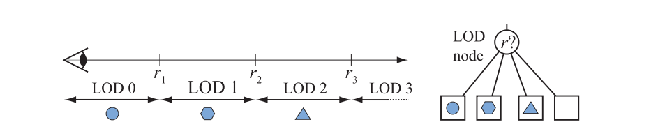

如果这个用于确定使用哪个LOD的度量，会在不同帧之间围绕某些$r_i$发生变化，那么可能会出现我们不想看到的popping现象。此时会发生不同层级之间的快速循环切换，这个问题可以通过在$r_i$附近引入一些延迟切换来进行解决\[898, 1508]。图19.35展示这种基于范围的LOD切换方法。在图中我们可以看到，当距离$r$增加时，会使用LOD范围的上面一行；当$r$减小时，则会使用LOD范围的下面一行。

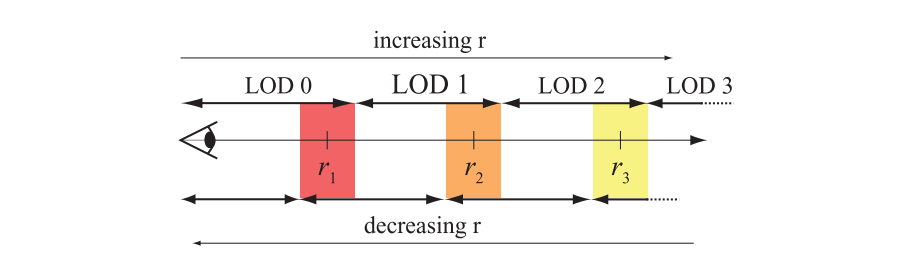

图19.36展示了在过渡范围内对两个LOD进行混合。然而，这种方法并不理想，因为物体到相机的距离$r$可能会长时间停留在这个过渡范围内，由于需要混合两个LOD，因此这样会增加渲染负担。相反，Mittring \[1227]选择在有限的时间内，当物体达到一定的过渡范围时就执行LOD切换。为了获得最佳效果，这种方法应当与上述的延迟方法结合使用。

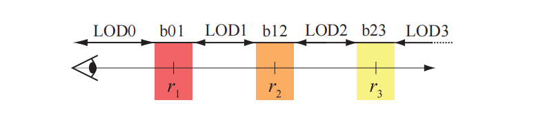

#### 基于投影面积

LOD选择的另一个常用度量是包围体的投影面积，或者是对包围体投影面积的估计。下面，我们将展示如何以透视方式，来估计球体和box区域的像素数量，这个像素数量也被称为屏幕空间覆盖率（screen-space coverage）。

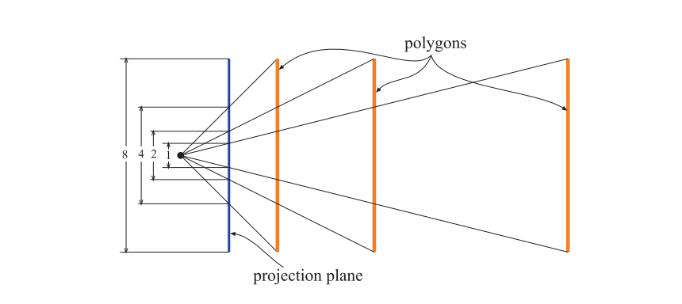

我们首先从球体开始，这里的估计基于了这样的一个事实：即物体的投影大小会随着与相机沿观察方向的距离增大而减小，即物体距离相机越远，投影面积就越小。如图19.37所示，它说明了如果与相机的距离增加一倍，那么投影的大小将会减半，这个规律适用于面向观察者的平面物体。我们使用中心点$\mathbf{c}$和半径$r$来定义一个球体。观察者位于点$\mathbf{v}$处，沿着归一化的观察向量$\mathbf{d}$进行观察。沿着观察方向$\mathbf{d}$，从点$\mathbf{c}$到点$\mathbf{v}$的距离，其实就是球体中心在观察向量上的投影：$\mathbf{d} \cdot(\mathbf{v}-\mathbf{c})$。同时我们假设，从相机到视锥体近裁剪平面的距离为$n$。我们会在对投影面积的估计中使用近裁剪平面，从而使得那些位于近裁剪平面上的物体能够获得其原始尺寸。有了上述的推理过程，对投影球面的估计半径为：

$$
p=\frac{n r}{\mathbf{d} \cdot(\mathbf{v}-\mathbf{c})}
\tag{19.6} 
$$

以像素为单位的投影面积为$\pi p^{2} w h$，其中的$w\times h$实际上是屏幕分辨率。较高的投影面积值可以选择更加详细的LOD。这是一个近似的估计值，实际上三维球体的二维投影是一个椭圆，正如Mara和McGuire \[1122]所指出的那样。他们还推导了一种计算保守包围多边形（conservative bounding polygon）的方法，即使是在球体与近裁剪平面相交的情况下。

通常的做法是直接在物体的包围盒周围使用一个近似的包围球。另一种估计方法是使用物体包围盒的屏幕包围框。然而，对于一些薄的、或者扁平的物体，它们实际覆盖的投影面积可能会有很大的变化。例如：想象一根意大利面，这根面条的一端在屏幕的左上角，另一端在屏幕的右下角，那么它的包围球将覆盖整个屏幕，并且它的包围盒的最小二维屏幕边界和最大二维屏幕边界也是一样的。

![图19.38：立方体的三种投影情况，从左到右分别会显示一个正面、两个正面和三个正面。这些立方体投影的轮廓分别由4个、6个和6个顶点组成，每个投影轮廓的面积是根据每个形成的多边形来进行计算的。 \[1569\]](images/Chapter-19/202309191503372.png "图19.38：立方体的三种投影情况，从左到右分别会显示一个正面、两个正面和三个正面。这些立方体投影的轮廓分别由4个、6个和6个顶点组成，每个投影轮廓的面积是根据每个形成的多边形来进行计算的。 \[1569]")

Schmalstieg和Tobler \[1569]提出了一种快速计算box投影面积的方法。这个想法是：根据box来将相机的视点（即观察位置）进行分类，并使用这个分类信息，来确定哪些投影顶点被包含在投影box的轮廓内部。这个过程是通过一个查找表（LUT）来完成的。使用这些投影顶点，我们可以计算出这个box在视野中的面积。相机视点与投影box的分类主要有3种情况，如图19.38所示。实际上，这种分类是通过确定相机视点位于包围盒平面的哪一侧来完成的。为了提高效率，我们会将视点转换到box的坐标系中，这样在分类的时候就只需要进行一些比较操作就可以了。这些比较的结果会放入一个位掩码中，这个位掩码会作为查找表的索引。这个LUT决定了从视点所看到的轮廓内部具体有多少个box顶点。然后会使用另一个查找表来实际查找轮廓顶点，在将轮廓顶点投影到屏幕上之后，我们再计算投影轮廓的面积。为了避免估计误差（有时会很严重），需要使用视锥体的两侧平面，来对形成的投影多边形进行裁剪。网上可以找到相应的源代码。Lengyel \[1026]对该方案进行了一些优化，可以使用更加紧凑的LUT。

仅仅根据距离或者投影面积来选择LOD并不总是一个好主意。例如：如果一个物体具有特定的AABB，其中包含一些很大的三角形和一些较小的三角形，那么这些较小的三角形可能会由于四边形过度渲染（quad overshading），从而出现严重的锯齿并降低性能表现。如果另一个物体具有完全相同的AABB，但是其中包含了中等大小的三角形和一些较大的三角形，那么基于距离和基于投影面积的选择方法，将会选择和之前完全相同的LOD。为了避免这种情况，Schulz和Mader \[1590]使用了几何平均值$g$来帮助选择LOD：

$$
g=\sqrt[n]{t_{0} t_{1} \cdots t_{n-1}}
\tag{19.7} 
$$

其中$t_i$是物体三角形的大小。使用几何平均值而不是算术平均值的原因在于，即使包含一些较大的三角形，许多小三角形也会使得$g$变小。对于最高分辨率的模型，这个值是离线计算的，同时会用于预先计算第一次切换应当发生的距离。后续的切换距离是一个第一次切换距离的简单函数。这使得他们的系统可以更加频繁地使用较低的LOD，从而提高性能表现。

另一种方法是计算每个离散LOD的几何误差，即计算简化模型与原始模型的最大偏差有多少米。可以将这个偏差距离投影到屏幕空间中，从而确定使用该LOD在屏幕空间中的效果。然后选择那个能够满足屏幕空间误差（由用户定义）的最低LOD。

#### 其他选择方法

基于距离和基于投影面积的LOD选择通常是最常用的方法。然而，还可以使用一些其他的指标，我们将在这里介绍一些。除了投影面积之外，Funkhouser和Sequin \[508]还建议使用物体的重要性（例如：墙壁模型比墙上的时钟更加重要）、运动、滞后（在切换LOD时，会降低效益函数）以及焦点。最后一个因素，即观察者的注意力焦点，可能是一个十分重要的选择因素。例如：在一些球类体育游戏中，控制球的那个角色会是用户最为关注的地方，因此其他角色可以具有相对较低的LOD \[898]。同理，当在虚拟现实应用程序中使用眼动追踪（eye tracking）时，应当在用户正在观察的地方使用更高的LOD。

根据应用程序类型的不同，使用一些其他策略可能也会有奇效。可以使用整体可见性（overall visibility）这个指标，例如：穿过茂密的树叶来观察附近的物体，这些物体可以使用较低的LOD来进行渲染。还有更多的全局性指标可以利用，例如：对能够使用的高精度LOD总数进行限制，从而使得整个场景始终都能保持在给定的三角形预算内\[898]。有关这个主题的更多信息，详见下一小节。其他的一些因素还有可见度、颜色和纹理等。一些感知指标也可以用于LOD选择\[1468]。

McAuley \[1154]提出了一个植被系统，其中树干和树叶cluster在使用impostor表示之前，还有三个LOD。他从不同角度和不同距离，对每个物体cluster之间的可见性进行了预处理。由于树木背后的cluster可能会被更近的cluster所遮挡隐藏，因此即使这些树木距离很近，也可以为这些位于背后的cluster选择较低的LOD。对于草地渲染而言，通常会在靠近观察者的地方使用真正的几何体，在稍微远一点的地方使用广告牌，并在很远的地方上直接使用地面纹理\[1352]。

### 19.9.3 限时的LOD渲染

一个恒定的、稳定的帧率，通常是渲染系统的理想特性。事实上，通常这被称为“硬实时（hard real-time）”或者限时渲染（time-critical rendering）。这样的系统会被赋予特定的执行时间（例如16毫秒），并且必须在这段时间内完成它的任务（例如：渲染图像）。当限制时间到了，系统必须停止处理。如果场景中的物体都由LOD进行表示，那么一个硬实时的渲染系统，将必须能够在每一帧中向用户显示更多或者全部场景，而不是在所分配的时间内只渲染少数几个非常详细的模型。

Funkhouser和Sequin \[508]提出了一种启发式算法，该算法可以对场景中的所有可见物体调整它们的LOD选择，以满足恒定帧率的要求。这个算法是预测性的（predictive），因为它会根据所需的目标帧率、以及哪些物体是可见的，来调整选择可见物体的LOD。与响应式的（reactive）算法相比，一个响应式的算法会根据渲染前一帧所花费的时间，来进行调整物体的LOD选择。

假设现在有一个叫做$O$的物体，并在细节水平$L$上进行渲染，我们将在给定细节水平来渲染指定物体记作$(O, L)$。然后我们定义两种启发式算法。其中一个启发式算法，会对在一定细节水平上渲染物体的成本进行估计，即$\text{Cost} (O, L)$；另外一个启发式算法，会对在一定细节水平上渲染物体的效益进行估计，即$\text{Benefit} (O, L)$。这个效益函数会估计在一定LOD下，物体对图像画面的贡献。

假设位于视锥体内部或者与之相交的物体集合被称为$S$，那么这个算法背后的主要思想是：使用启发式的选择函数，来优化物体$S$的LOD选择。具体来说，我们要最大化总效益：

$$
\sum_{S} \operatorname{Benefit}(O, L)
\tag{19.8} 
$$

同时最小化总成本，使其满足所要求的目标帧率：

$$
\sum_{S} \operatorname{Cost}(O, L) \leq T
\tag{19.9} 
$$

其中$T$为目标帧时间。

换句话说，我们希望能够在理想的帧率内，选择物体适当的LOD，从而获得“最佳图像”。接下来，我们会介绍是如何对成本函数和效益函数进行估计的，并给出了上述方程的优化算法。

成本函数和效益函数很难进行定义，因此它们要在所有情况下都能适用。其中的成本函数可以通过使用不同的观察参数，对LOD进行多次渲染计时来进行估计。而有关不同的效益函数，详见章节19.9.2。在实践中，物体的BV投影面积可以作为一个效益函数。

最后，我们将会讨论如何选择场景中物体的LOD。首先，我们注意到以下几点：对于某些视点而言，场景可能会过于复杂，以致于无法达到所需的帧率。为了解决这个问题，我们可以为每个物体都定义一个最低的LOD，即一个没有图元的物体，也就是说，使用这个最低LOD的时候，我们不会渲染这个物体\[508]。使用这个技巧，我们可以只渲染最重要的那些物体，跳过不重要的那些物体。

为了对一个场景选择“最佳”的LOD，需要在方程19.9的约束下，对方程19.8进行优化。这是一个NP完全（NP-complete）问题，这意味着想要正确地解决这个问题，唯一要做的就是对所有不同的组合进行测试，并选择其中表现最好的那一组。对于任何算法而言，这显然都是不可行的。一种更简单、更可行的方法是使用贪婪算法，这个算法会试图最大化每个物体的$\operatorname{Value} =\operatorname{Benefit}(O, L) / \operatorname{Cost}(O, L)$。这个算法会对视锥体内的所有物体进行处理，并按照Value降序的顺序，依次选择物体进行渲染，即首先会渲染Value最大的那个物体。如果一个物体在多个LOD的情况下都具有相同的Value值，那么就选择效益最高的那个LOD来进行呈现。这种方法具有最大的“性价比（bang for the buck）”。对于视锥体内的$n$个物体，这个算法的时间复杂度为$O(n \log n)$，并且这个算法所能产生的解至少也会有最佳解的一半好\[507, 508]。还可以利用帧与帧之间的一致性，来加快Value值的排序。

我们可以在Funkhouser的博士论文中\[507]，找到更多有关LOD管理、以及将LOD管理与入口剔除相结合的信息。Maciel和Shirley \[1097]将LOD与impostor结合起来，提出了一种近似恒定时间的室外场景渲染算法。其大致想法是：使用一个物体不同表示方法的层次结构（例如：一组LOD和分层impostor），然后以某种方式来遍历这棵树，从而在给定的时间内给出最佳图像。Mason和Blake \[1134]提出了一种增量的层次LOD选择算法。同样地，可以使用任意的物体的表示方法。Eriksson等人\[441]提出了分层LOD（hierarchical levels of detail ，HLOD）。使用这种方法，可以以一个恒定的帧率来渲染一个场景，或者只会出现有限的渲染错误。与此相关的是渲染的功耗预算，Wang等人\[1843]提出了一个优化框架，它可以选择良好的参数来降低功耗，这对于手机和平板电脑等设备而言十分重要。

与限时渲染相关的另一组技术是使用静态模型。当相机不发生移动的时候，整个模型会被渲染，累积缓冲可以用于实现抗锯齿、景深、软阴影等效果，并进行渐进式的更新。当相机进行移动的时候，为了满足一定的帧率，所有物体使用的LOD都可以适当降低，还可以使用细节剔除来完全移除场景中的微小物体。

## 19.10 渲染大型场景

到目前为止我们所提及的内容其实已经有所暗示了，即我们想要渲染的场景一定要能装载进计算机的内存中。但是情况可能并非总是如此。例如：有些主机只有8 GB的内存，而有些游戏世界可能会包含数百GB的数据。因此，本小节将会介绍纹理的流式传输和转换编码方法，以及一些通用的流式技术，最后会介绍一些地形渲染算法。请注意，这些方法几乎总是会与本章节前面所描述的剔除技术和LOD方法结合使用。

### 19.10.1 虚拟纹理和流式传输

想象一下，为了能够渲染一个巨大的地形数据集，我们可能需要使用一个超大分辨率的纹理，这个分辨率会大到令人难以置信，并且这个纹理大到装不进GPU的显存。例如：在游戏《狂怒（RAGE）》中，一些虚拟纹理的分辨率为$128k×128k$，这将消耗大约64 GB的GPU显存\[1309]。当CPU上的内存空间有限时，操作系统会使用虚拟内存来进行内存管理，根据需要来将数据从驱动程序交换到CPU内存中\[715]。这就是稀疏纹理（sparse texture）所提供的功能，它使得分配一个巨大的虚拟纹理成为可能\[109, 248]，这里的虚拟纹理也被称为megatexture，这些技术有时会被称为虚拟纹理（virtual texture）或者部分驻留纹理（partially resident texturing）。应用程序会决定每个mipmap层级中的哪些区域（瓦片tile）应当驻留在GPU显存中。一个tile通常为64 kB，其纹理分辨率取决于具体的纹理格式。这里，我们将会介绍虚拟纹理和流式传输技术。

一个使用mipmap的高效纹理系统，有着这样一个关键准则：在理想情况下，所需要的纹素数量应当与正在渲染的最终图像的分辨率成比例，并且与纹理本身的分辨率无关。因此，我们只要求那些可见的纹素位于物理GPU的显存中即可，与整个游戏世界中的纹素相比，这部分纹素是相当有限的。其主要概念如图19.39所示，其中整个mipmap链会在虚拟内存和物理内存中被划分为若干个块。这些结构有时会被称为虚拟mipmap或者clipmap \[1739]，后者指的是将一个较大mipmap中的一小部分裁剪出来以供使用。由于物理内存的大小比虚拟内存小得多，因此只有一小部分虚拟纹理块可以被装入物理内存中。几何图形在虚拟纹理中使用全局的$uv$参数化，并且在像素着色器中使用这样的$uv$坐标之前，它们需要被转换为指向物理纹理内存的纹理坐标。这个过程可以使用GPU支持的页表（如图19.39所示）或者间接纹理（在GPU上的软件中）来完成。任天堂GameCube的GPU支持虚拟纹理，近年来，PLAYSTATION 4、Xbox One和许多其他GPU也都支持了硬件虚拟纹理。当贴图映射和解除映射（unmap）到物理内存中时，间接纹理需要使用正确的偏移量来进行更新。使用一个巨大的虚拟纹理和一个较小的物理纹理具有很好的效果，因为对于远处的几何体，只需要加载一些较高层级的mipmap贴图到物理内存中即可；而对于那些靠近相机的几何体，只需要加载一些较低层级的mipmap贴图即可。需要注意的是，虚拟纹理也可以用于从磁盘流式传输巨大尺寸的纹理，也可以用于稀疏阴影映射（sparse shadow mapping）等\[241]。

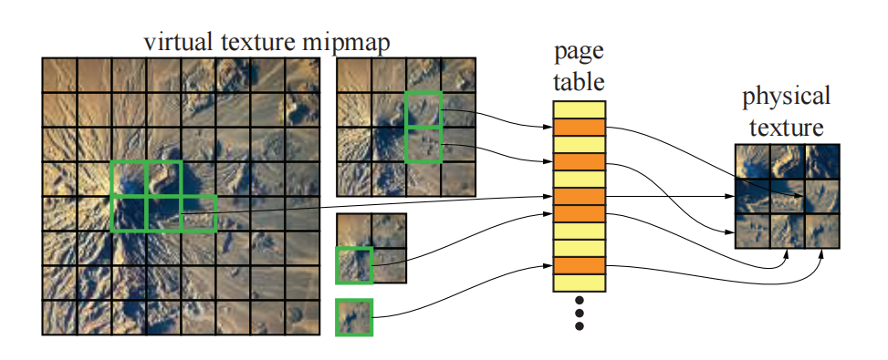

由于物理内存是有限的，所有使用虚拟纹理的引擎都需要一种方法来确定哪些贴图应当驻留在物理内存中，而哪些贴图不应当驻留在物理内存中，有几种这样的方法。Sugden和Iwanicki \[1721]使用一个反馈渲染方法（feedback rendering approach），其中第一个渲染pass会写出所有需要知道的信息，即哪个片元将会访问哪个纹理tile。当这个pass执行完成之后，这个信息纹理将会被读取回到CPU中并进行分析，从而找到需要使用的贴图。没有驻留在物理内存中的tile将会被读取，并映射到物理内存中，而物理内存中那些不需要进行使用的tile将会被解除映射。但是他们的方法不适用于阴影、反射和透明效果。不过，可以使用点阵剔除半透明技术（章节5.5）来生成透明效果，效果相当不错。van Waveren和Hart \[1855]也使用了反馈渲染。请注意，这个pass既可以是单独的渲染pass，也可以与一个z-prepass结合使用。当使用单独的pass时，只能使用$80 × 60$像素的分辨率来作为近似值，从而减少处理时间。Hollemeersch等人\[761]使用一个计算pass来执行这个过程，而不是将反馈缓冲区读回CPU中。这样做的结果是在GPU上创建了一个紧凑的tile标识符列表，并将其发送回CPU进行纹理映射操作。

使用GPU支持的虚拟纹理，驱动程序将会负责资源的创建和销毁，以及对tile建立映射和解除映射，并确保物理分配会得到虚拟分配的支持\[1605]。使用GPU的硬件虚拟纹理，一次$\mathrm{sparseTexture}$查找除了会返回过滤值之外（对于常驻贴图），还会返回一个代码，这个代码会指示相应的贴图是否为常驻贴图\[1605]。但是如果使用软件支持的虚拟纹理的话，所有这些任务就都落在了开发人员身上。我们可以参考van Waveren的报告，来了解更多关于这个主题的信息\[1856]。

为了确保所有内容都能够装入物理内存，van Waveren对全局纹理的LOD偏移进行了调整，直到所使用的工作集合符合要求\[1854]。此外，如果只有一个更高层级的mipmap tile可以使用时，如果此时需要使用较低层级的mipmap tile，则需要一直先使用更高级别的mipmap tile，直到较低级别的mipmap tile可以使用为止。在这种情况下，可以先对更高级别的mipmap贴图进行放大操作，并进行使用，然后随着时间的推移，新的低级别mipmap贴图可以逐渐混合在一起，从而在它可以使用时实现平滑过渡。

Barb \[99]总是会加载小于或者等于64 kB的所有纹理，这样一来可以保证在还没有加载更高分辨率mipmap层级的时候，这些纹理化操作总是可以完成的，尽管质量会低一些。他使用离线的反馈渲染来在各种位置上，预先计算每个mipmap层级在标称（nominal）纹理和屏幕分辨率下，每种材质会覆盖玩家周围多大范围的立体角。在运行过程中，这些信息会被流式输入，并根据每个材质纹理的分辨率和最终的屏幕分辨率进行动态调整。这将为每个纹理的每个mipmap层级都生成一个重要性值，将每个重要性值除以对应的mipmap层级中的纹素数量，从而生成一个合理的最终度量，这样做的话，即使将纹理细分为更小的、具有相同映射的纹理，这个度量值也是不变的。有关这个话题的更多信息，详见Barb的演讲\[99]。图19.40展示了一个渲染示例。

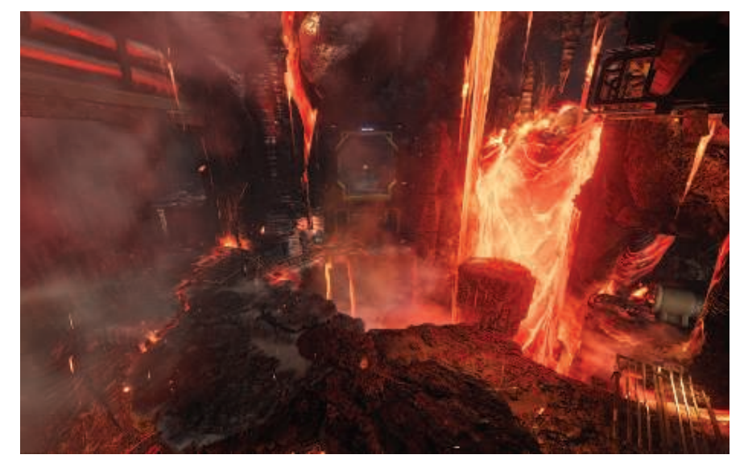

Widmark \[1881]描述了如何将流式传输与程序化纹理的生成相结合，从而获得更加多样化和更加详细的纹理。Chen对Widmark的方案进行了扩展，使其能够处理大一个数量级的纹理 \[259]。

### 19.10.2 纹理转码

为了使得虚拟纹理系统能够更好地工作，可以将其与转码（transcoding）技术相结合。这是一个从磁盘上读取图像的过程，通常可以使用一些可变压缩比的压缩方案（例如JPEG）；然后对图像进行解码，再使用GPU支持的一种纹理压缩方案（章节6.2.6）对其进行编码。图19.41展示了这样的一个系统。其中反馈渲染pass的目的是确定当前帧需要哪些贴图，章节19.10.1中介绍的两种方法都可以在这里使用。其中的fetch步骤是指在存储层次结构中获取所需要的数据，即从光学存储或者硬盘驱动器（HDD）中进行获取数据，或者是从可选的磁盘缓存中获取数据，然后到达由软件管理的内存缓存中。unmap指的是释放一个常驻的tile。当读取新数据之后，会对其进行转码处理，并最终映射到新的常驻tile中。

![图19.41：一个使用虚拟纹理和转码的流式纹理系统。 \[1855\]](images/Chapter-19/202309192133731.png "图19.41：一个使用虚拟纹理和转码的流式纹理系统。 \[1855]")

使用转码处理的优点在于，当纹理数据存储在磁盘上时可以使用更高压缩比的压缩算法，当通过纹理采样器访问纹理数据时可以使用GPU支持的纹理压缩格式。这需要对可变压缩比的压缩格式进行快速解压缩，以及快速压缩到GPU支持的格式\[1851]。还可以对已经压缩过的纹理再次进行压缩，从而进一步降低文件大小\[1717]。这种方法的优点在于，当从磁盘中读取纹理并进行解压缩时，它就已经是能够被GPU使用的纹理压缩格式了。crunch库具有免费的开源代码\[523]，它使用了类似的方法，能够达到每个纹素 1-2 bit的结果，图19.42展示了一个例子。它的后继者称为basis，它是一种对块进行可变bit压缩的专有格式，可以快速转换为各种纹理压缩格式\[792]。对于BC1/BC4 \[1376]， BC6H/BC7 \[933, 935, 1259]以及PVRTC \[934]，可以使用GPU上的快速压缩方法。Sugden和Iwanicki \[1721]使用Malvar压缩方案\[1113]的一种变体，来实现在磁盘上的可变压缩比的压缩方案。法线贴图的压缩比为$40:1$，使用YCoCg变换（方程6.6）的反照率纹理的压缩比为$60:1$。Khronos组织正在开发一种标准的通用纹理压缩文件格式。

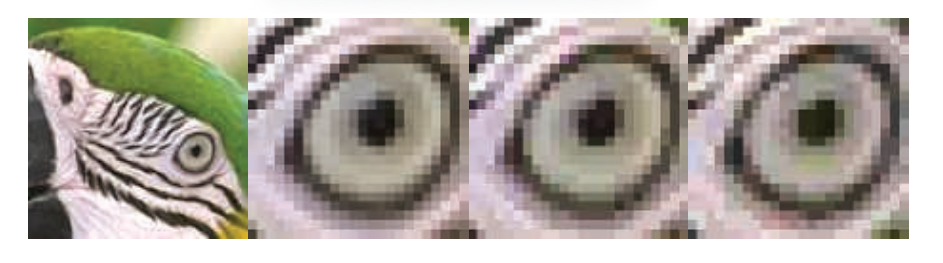

当需要高质量的纹理，并且同时要保证较短的纹理加载时间时，Olano等人\[1321]使用可变压缩比的压缩算法，来将压缩后的纹理存储在磁盘上。纹理也可以在GPU显存中以压缩形式进行存储，直到它们被需要的时候，此时GPU会使用自身的算法对它们进行解压缩操作，之后它们会以未压缩的形式进行使用。

### 19.10.3 通用流式传输

在游戏或者其他实时渲染应用程序中，如果模型所占据的存储空间要比物理内存大，那么还需要使用一个流式系统来处理实际的几何图形、脚本、粒子和AI等内容。一个平面可以使用三角形、正方形或者六边形等正凸多边形来进行平铺。因此，这些形状也是流式系统中常见的构建块，其中每个多边形都与该多边形中的资产相关联，如图19.43所示。需要注意的是，在这些形状中，最常用的是正方形和正六边形\[134, 1522]，可能是因为它们的邻居要比三角形少。在图19.43中，观察者位于深蓝色多边形处，流式系统可以确保深蓝色多边形的直接邻居（浅蓝色和绿色）会被加载到内存中。这是为了确保周围的几何图形可以用于渲染，并保证当观察者移动到相邻多边形上的时候，该多边形上已经存有数据了。请注意，三角形和正方形有两种类型的邻居：其中一种邻居共享一条边，另一种邻居只共享一个顶点。

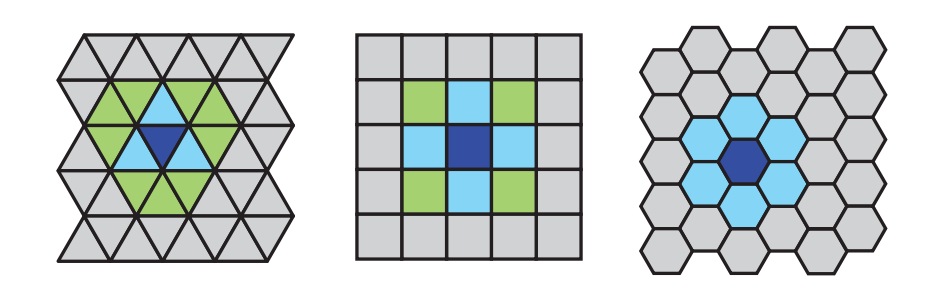

Ruskin \[1522]使用了正六边形进行平铺，每个六边形都具有一个低分辨率的几何LOD和一个高分辨率的几何LOD。由于低分辨率LOD的内存占用较小，因此会始终加载整个世界的低分辨率LOD。因此，只有高分辨率的LOD和纹理会在内存中和内存外进行流式处理。Bentley \[134]则使用了正方形，每个正方形的面积为$100 × 100 m^2$。高分辨率的mipmap与其他资源会分开进行流式传输。该系统在进行中距离观察的时候，会使用1-3个LOD；在远距离观察的时候，会使用烘焙的impostor。在赛车游戏中，Tector \[1753]的策略是在赛车前进时，沿着赛道来加载数据。他将使用zip格式将压缩的数据存储在磁盘上，并将数据块加载到压缩软件的缓存中。然后根据需要再对这些数据块进行解压缩，并由CPU和GPU的内存层次结构进行使用。

在某些应用中，可能还需要对三维空间进行平铺覆盖，而不是像上面所描述的那样只使用二维平铺。请注意，立方体（cube）是唯一可以平铺三维空间的正多面体，因此它自然是此类应用的唯一选择。

### 19.10.4 地形渲染

地形渲染（terrain rendering）是许多游戏和应用程序的重要组成部分，例如谷歌地球和Cesium用于大世界渲染的开源引擎\[299, 300]，如图19.44所示。我们会介绍几种在当前GPU上表现良好的流行方法。值得注意的是，为了在地形放大的时候提供较高的LOD，这些方法都可以添加分形噪声（fractal noise）。此外，许多系统会在加载游戏或者关卡场景的时候，程序化生成地形。

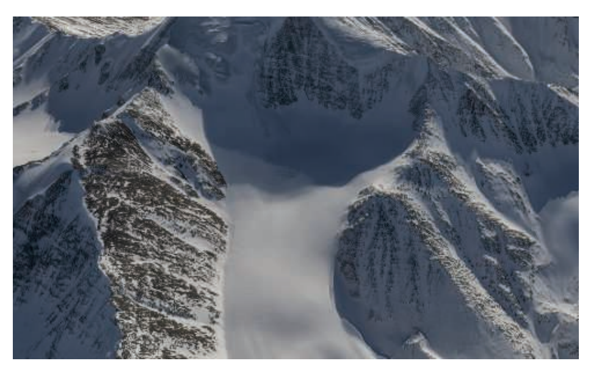

其中一种方法是几何clipmap \[1078]。它类似于纹理clipmap \[1739]，因为它使用了与mipmap相似的分层结构，即原始几何图形会被过滤成一个金字塔，位于靠近顶部的层级会更加粗糙，如图19.45所示。

![图19.45：左：几何clipmap的结构，在每个分辨率级层级中，都会缓存一个相同大小的正方形窗口。右：几何图形的俯视图，其中观察者位于最中间的紫色区域。请注意，只有最精细的那个层级才会渲染它的完整正方形区域，而其他层级所渲染的正方形都是中空的。 \[82\]](images/Chapter-19/202309200909199.png "图19.45：左：几何clipmap的结构，在每个分辨率级层级中，都会缓存一个相同大小的正方形窗口。右：几何图形的俯视图，其中观察者位于最中间的紫色区域。请注意，只有最精细的那个层级才会渲染它的完整正方形区域，而其他层级所渲染的正方形都是中空的。 \[82]")

当渲染巨大的地形数据集时，只有观察者周围的$n × n$个样本（即高度）才会被缓存在内存中。当观察者进行移动的时候，图19.45中的层次窗口也会随之发生移动，并加载新的地形数据，而旧数据可能会被释放。为了避免不同层级之间出现裂缝，应当在两个连续层级之间使用一个过渡区域。在这个的过渡层级中，几何数据和纹理数据都会平滑地插值到下一个较为粗糙的层级中，这是在顶点着色器和像素着色器中实现的。Asirvatham和Hoppe \[82]提出了一种高效的GPU实现，其中地形数据会被存储为顶点纹理，使用顶点着色器来访问这些数据就可以获得地形的高度信息。可以使用法线贴图来增强地形上的视觉细节，当视角拉近时，Losasso和Hoppe \[1078]还添加了分形噪声的位移，从而获得更多视觉细节，如图19.46所示。Gollent在《巫师3》\[555]中使用了几何clipmap的一种变体。Pangerl \[1348]和Torchelsen等人\[1777]给出了几何clipmap的相似方法，这些方法与GPU的功能也很契合。

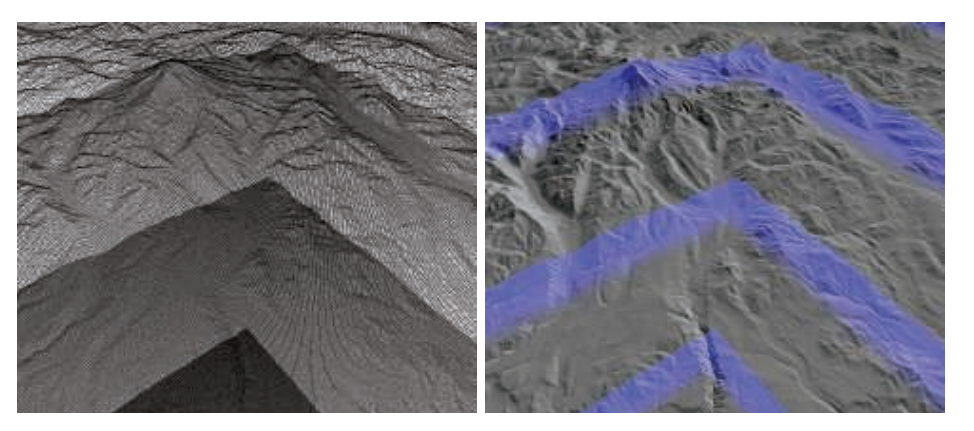

有一些方案专注于创建tile并对它们进行渲染。一种方法是将高度场数组分解成一定大小的tile，例如每个tile$17 × 17$个顶点。对于一个高度详细的视图，也可以渲染一个单独的tile，而不是将单个三角形或者小三角形扇发送到GPU中。一个tile可以有多个LOD，例如：通过只使用每个方向上的其他顶点，可以形成一个$9×9$大小的tile。使用每四个顶点可以得到一个$5 × 5$大小的tile，使用每八个顶点可以得到一个$2 × 2$大小的tile，使用四个角点可以得到一个$1 × 1$大小的tile，这个tile只包含两个三角形。请注意，原始$17 × 17$的顶点缓冲区可以存储在GPU上并重复使用，只需要提供不同的索引缓冲区来改变需要渲染的三角形数量即可。下面我们将介绍一种使用这种数据布局的方法。

另一种在GPU上快速渲染大型地形的方法被称为分块LOD（chunked LOD）\[1797]。其核心想法是使用$n$个离散的LOD来表示地形，其中每个更加精细的LOD会被分割为父LOD的4倍，如图19.47所示。然后将这个结构编码在一棵四叉树中，并从根节点开始遍历来进行渲染。当访问到一个节点的时候，如果它的屏幕空间误差（马上将会介绍）低于某个像素误差阈值$\tau$，那么这个节点中的LOD将会进行渲染。否则，将会递归访问四个子节点。这样可以在一些需要的地方获得更好的分辨率，例如在靠近观察者的地方。在一个更高级的变体方法中，地形四边形会按需从磁盘中进行加载\[1605, 1797]。遍历过程与刚才所描述的方法类似，不同之处在于，只有当子节点已经（从磁盘）被加载到内存中时，才会对其进行递归访问。如果这个子节点还没有被加载，那么它将会排队等待加载，并直接渲染当前节点。

Ulrich \[1797]将屏幕空间误差计算为：

$$
s=\frac{\epsilon w}{2 d \tan \frac{\theta}{2}}
\tag{19.10} 
$$

其中$w$是屏幕的宽度，$d$是相机到这个地形tile的距离，$\theta$是以弧度为单位的水平视场角，$\epsilon$是一个几何误差，单位为距离$d$相同。对于其中的几何误差项$\epsilon$，通常会使用两个网格之间的Hausdorff距离\[906, 1605]。对于原始网格上的每个顶点，会找到其在简化网格上距离最近的顶点，并将这些距离中的最小值称为$d_1$。现在反过来对简化网格上的每个顶点执行相同的过程，在原始网格上找到距离最近的顶点，并将其中的最小的距离称为$d_2$。这个Hausdorff距离为$\epsilon=\max \left(d_{1}, d_{2}\right)$，如图19.48所示。注意，原始网格上的顶点$\mathbf{o}$，到简化网格的最近顶点是$\mathbf{s}$，而从这个顶点$\mathbf{s}$到原始网格的最近顶点是$\mathbf{a}$，这就是为什么测量必须在这两种组合中进行的原因，即首先会从原始网格到简化网格，然后再从简化网格到原始网格。从直观上来说，Hausdorff距离是使用简化网格来代替原始网格时的误差。如果应用程序无法计算这个Hausdorff距离，则可以为每次简化都手动调整一个误差常数，或者是在网格简化过程中查找误差\[1605]。

![图19.48：原始网格和简化网格之间的Hausdorff距离。 \[1605\]](images/Chapter-19/202309200950805.png "图19.48：原始网格和简化网格之间的Hausdorff距离。 \[1605]")

为了避免从一个LOD切换到另一个LOD时出现的popping现象，Ulrich \[1797]提出了一种简单的变形技术，其中一个高分辨率tile中的顶点$(x, y, z)$会与一个顶点$(x, y^{\prime}, z)$进行线性插值，这个顶点$(x, y^{\prime}, z)$是父tile的近似顶点（例如：使用双线性插值获得）。线性插值因子被计算为$2s\tau −1$，它会被限制在$[0,1]$范围内。注意，在变形过程中只需要高分辨率的tile即可，因为下一个低分辨率tile的顶点已经包含在高分辨率tile中了。

可以使用一些启发式的方法，例如方程19.10中的启发式方法，来确定每个tile所使用的LOD。这种tile平铺的方案，其主要挑战在于对裂缝的修复。例如：假设一个tile的分辨率是$33 × 33$，而它相邻tile的分辨率只有$9 × 9$，那么在它们交界的边缘处就会出现裂缝。一种纠正措施是，移除那些沿边缘高度详细的三角形，然后构建一组新的三角形，来适当连接两个tile之间的缝隙\[324, 1670]。当两个相邻区域具有不同的LOD时就会出现裂缝，Ulrich描述了一种使用额外带状几何的方法，如果设定的像素误差阈值$\tau$低于5个像素的话，那么这是一个合理的解决方案。Cozzi和Bagnell \[300]使用了一个屏幕空间后处理pass来填充裂缝，对裂缝周围的片元（而不是裂缝中的片元）使用高斯滤波核进行加权。Strugar \[1720]提出了一种优雅的方法来避免出现裂缝，它而无需使用屏幕空间中的方法或是额外的几何图形。其效果如图19.49所示，该方法可以使用一个简单的顶点着色器来进行实现。

![图19.49：Strugar  \[1702\] 使用分块LOD系统来避免裂缝。左上角展示了一个高分辨率的地形tile，它在右上角变成了一个低分辨率的地形tile。在它们之间，我们展示了两个插值和变形的变体。实际上，随着LOD层级的改变，这是以一种平滑的方式发生的，如下面的屏幕截图所示。 \[1702\]](images/Chapter-19/202309201040401.png "图19.49：Strugar  \[1702] 使用分块LOD系统来避免裂缝。左上角展示了一个高分辨率的地形tile，它在右上角变成了一个低分辨率的地形tile。在它们之间，我们展示了两个插值和变形的变体。实际上，随着LOD层级的改变，这是以一种平滑的方式发生的，如下面的屏幕截图所示。 \[1702]")

为了提高性能表现，Sellers等人\[1605]将分块LOD与视锥体剔除、地平线剔除（horizon culling）结合起来。Kang等人\[852]提出了一种类似于分块LOD的方案，其最大的区别在于，他们使用了基于GPU的曲面细分来对节点进行细分，并确保边缘处的曲面细分因子可以很好的相互匹配，从而避免出现裂缝。他们还展示了几何图像如何与特征保持的贴图（feature-preserving map）一起，用来渲染地形悬垂结构（overhang），这是基于高度场的地形无法处理的。Strugar \[1720]提出了一种分块LOD方案的扩展方法，它具有更好和更灵活的三角形分布。与Ulrich使用逐节点的LOD方法相反，Strugar使用了逐顶点的变形以及单独的LOD。虽然他只使用了距离因素作为确定LOD选择的度量，但是实际上也可以使用其他一些因素，例如：附近有多少深度变化等，这样可以生成更好的轮廓。

原始的地形数据通常会使用均匀的高度场网格进行表示，我们可以对这些数据使用与一些视图无关的简化方法，如图16.16所示。即将网格模型进行简化，直到满足某个极线准则为止\[514]。一些较小的表面细节也可以通过颜色贴图或者凹凸贴图进行捕获。以这种方式所生成的静态网格，通常会被称为不规则三角网（triangulated irregular network，TIN），当地形面积较小，且在各个区域相对平坦时，它是一种十分有用的表示方法\[1818]。

![图19.50：一种地形tile的受限四叉树，其中每个相邻tile在LOD上，最多只能高一级，或者低一级。每个tile都有 5 × 5 个顶点，除了左上角具有 2 × 2 个更高分辨率的tile之外。其余的地形均由三个低分辨率的tile进行填充。左侧：左上角tile的边缘上有一些顶点，这些顶点与相邻低分辨率tile的顶点不匹配，这会导致裂缝的出现。右侧：会对高分辨率tile的边缘进行修改，从而避免这个问题。每个tile都会在单个draw call中进行渲染。 \[40\]](images/Chapter-19/202309201110170.png "图19.50：一种地形tile的受限四叉树，其中每个相邻tile在LOD上，最多只能高一级，或者低一级。每个tile都有 5 × 5 个顶点，除了左上角具有 2 × 2 个更高分辨率的tile之外。其余的地形均由三个低分辨率的tile进行填充。左侧：左上角tile的边缘上有一些顶点，这些顶点与相邻低分辨率tile的顶点不匹配，这会导致裂缝的出现。右侧：会对高分辨率tile的边缘进行修改，从而避免这个问题。每个tile都会在单个draw call中进行渲染。 \[40]")

Andersson \[40]使用了一种受限四叉树来弥补裂缝，并降低了渲染大型地形所需的draw call总数。他并没有使用不同分辨率的均匀地形网格，而是使用了一棵tile的四叉树。每个tile都具有相同的$33 × 33$分辨率，但是每个tile可以覆盖不同的面积。受限四叉树的理念是，每个tile相邻元素之间的LOD差异不能超过一个级别，如图19.50所示。这一限制意味着相邻tile出现分辨率不同的情况是有限的。与其在出现裂缝之后使用额外的索引缓冲区来填充这些裂缝，这里的想法是存储所有可能的索引缓冲区排列方式，这些排列方式可以创建出一个包含裂缝过渡三角形的tile。每个索引缓冲区都由全分辨率的边缘（每条边缘上有33个顶点）和低LOD的边缘（由于四叉树的限制，每条边缘上有17个顶点）组成。图19.51展示了这种现代地形渲染的一个例子。Widmark \[1881]描述了一个完整的地形渲染系统，该系统用在了寒霜2引擎中，它具有一些十分有用的功能，例如：贴花，水，地形装饰等，同时也可以使用艺术家生成的或者程序生成的蒙版\[40]，来将不同的材质着色器组合在一起，还可以使用程序化地形位移（procedural terrain displacement）。

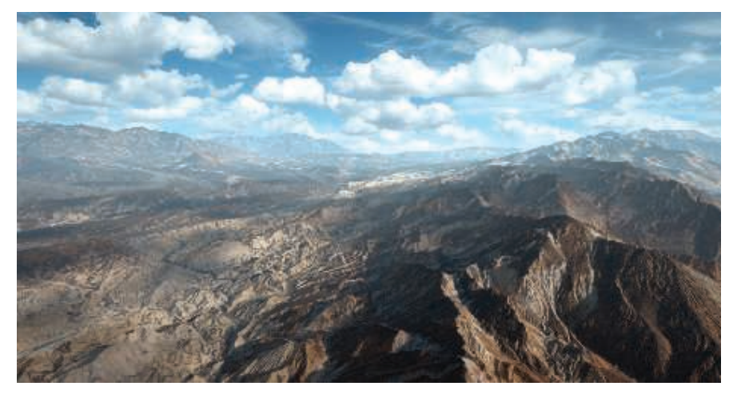

有一种简单的技术可以用于海洋渲染，这个技术采用了均匀的网格，每帧都将其转换到相机空间中\[749]，转换结果如图19.52所示。Bowles \[186]针对克服某些质量问题，提供了许多技巧。

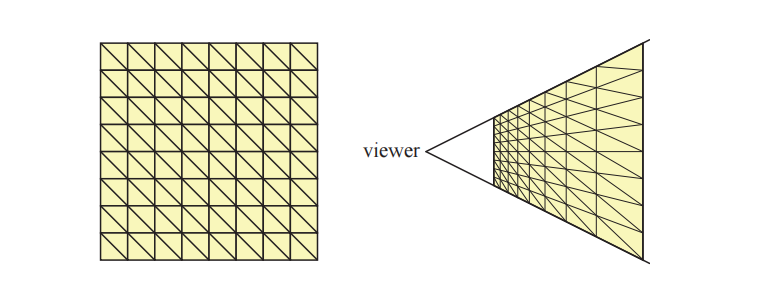

除了上述的地形技术之外，还可以使用一些压缩技术，来减少存储在内存中的数据集大小。Yusov \[1956]使用四叉树数据结构来对顶点进行压缩，他使用了一种简单的预测方案，只需要对差异进行编码即可（使用很少的bit）。Schneider和Westermann \[1956]使用了一种由顶点着色器进行解码的压缩格式，并在细节层次之间探索集合过渡（geomorphing），同时最大化缓存一致性。Lindstrom和Cohen \[1051]使用了一种具有线性预测和残差编码（residual encoding）的流式编解码器来进行无损压缩。此外，他们使用量化方案来进一步提高压缩比，尽管这个压缩结果是有损的。这个解压操作可以使用GPU完成，可以将压缩比从$3:1$提到$12:1$。

还有许多其他的地形渲染方法。Kloetzli \[909]在《文明5》中使用了一个自定义计算着色器，来为地形创建自适应的曲面细分，然后将其送入GPU进行渲染。另一种技术是使用GPU的曲面细分器\[466]，来逐面片的处理曲面细分。请注意，许多用于地形渲染的技术同样也可以用于水面渲染。例如：GonzalezOchoa和Holder \[560]在《神秘海域3》中，使用了一种几何clipmap的变体方法，它可以很好地渲染水面效果。他们通过在不同层级之间动态添加三角形来避免T型连接。随着GPU的不断发展，有关这个主题的研究仍将继续。

## 补充阅读和资源

虽然Ericson这本书\[435]的重点是碰撞检测，但是其中包含了构建和使用各种空间细分方案的相关材料。

有着大量有关遮挡剔除的文献。其中Cohen-Or等人\[277]和Durand \[398]的可见性调查，可以帮助你很好地了解这些算法的早期工作。Aila和Miettinen \[13]描述了一个用于动态场景的商业剔除系统架构。Nießner等人\[1283]对现有的背面剔除、视锥体剔除、以及位移细分表面的遮挡剔除方法进行了综述。Luebke等人\[1092]的《Level of Detail for 3D Graphics》一书，是一个有关LOD使用的信息资源，具有一定的价值。

Dietrich等人\[352]对渲染大规模模型领域的研究进行了综述。Gobbetti等人\[547]提供了另一个有关大规模模型渲染的良好综述。Sellers等人\[1605]的SIGGRAPH课程是一个比较新的资源，其中包含了一些优秀的材料。Cozzi和Ring所撰写的书\[299]介绍了地形渲染和大规模数据集管理的技术，以及如何处理精度问题的方法。Cesium的博客\[244]提供了许多实现细节和进一步的加速技术，可以用于大世界渲染和地形渲染。
