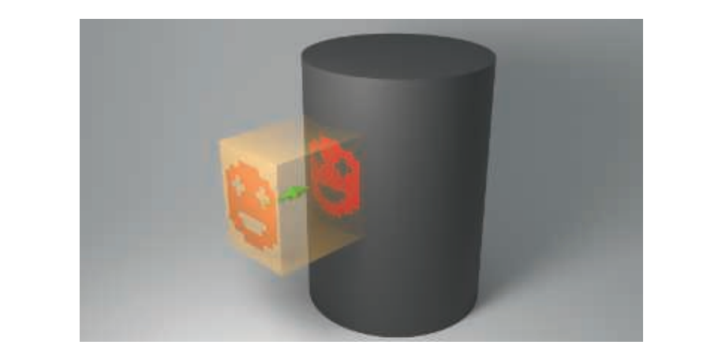
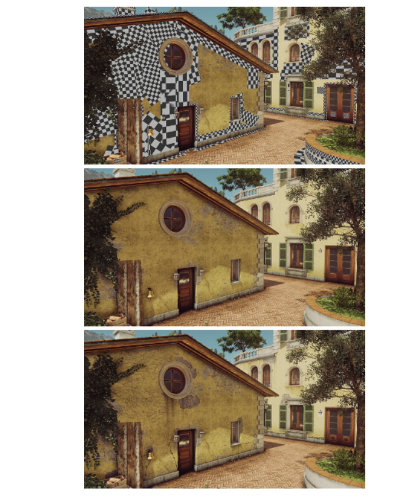
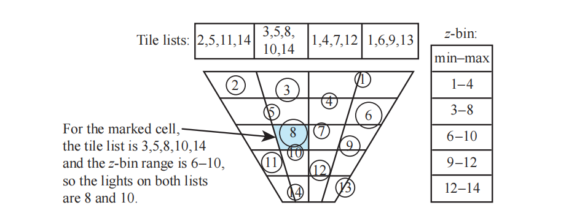
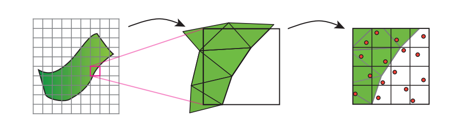
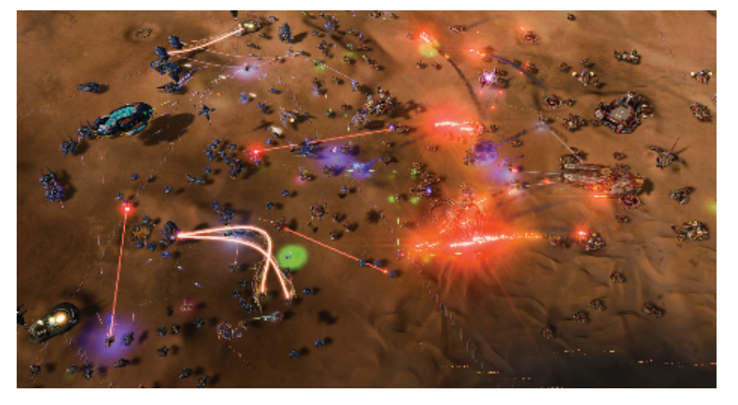

# Chapter 20 Efficient Shading 高效着色

## 目录

-   [20.1 延迟着色](#201-延迟着色)
-   [20.2 贴花渲染](#202-贴花渲染)
-   [20.3 分块着色（Tiled Shading）](#203-分块着色Tiled-Shading)
-   [20.4 聚类着色（Clustered Shading）](#204-聚类着色Clustered-Shading)
-   [20.5 延迟纹理](#205-延迟纹理)
-   [20.6 对象空间和纹理空间着色](#206-对象空间和纹理空间着色)
-   [补充阅读和资源](#补充阅读和资源)

> Mark Twain——“Never put off till tomorrow what you can do the day after tomorrow just as well.”

> 马克·吐温——“后天能做的事也不要拖到明天。”（今日事今日毕）（美国作家；1835——1910）

对于比较简单的场景（即相对较少的几何图形、比较基础的材质、少量的光源），我们可以使用标准的GPU管线来渲染图像，而且并不用担心帧率的问题。只有当其中的一个或者多个元素变得成本很高时，我们才需要使用一些更加复杂的技术来控制成本。在上一章节中，我们所关注的是在后续处理中如何剔除那些不需要的三角形和网格。而在本章节中，我们将专注于介绍在计算材质和光照时能够降低成本的技术。对于其中的许多方法，都有着额外的处理成本，我们希望这些额外成本能够由节省下来的时间所弥补。另一些方法会在带宽和计算之间进行权衡，通常会转移性能瓶颈。与所有的方案一样，具体使用哪种方案最好，这取决于硬件、场景结构和许多其他因素。

计算材质效果的像素着色器可能会有很高的成本。我们在章节19.9中提到过，可以通过各种各样的着色器LOD简化技术来减少这种开销。当场景中存在多个光源同时对一个表面产生影响的时候，可以使用两种不同的策略。第一种方法是构建一个支持多光源的着色器，这样只需要一个pass即可。另一种方法是使用多个pass来进行着色，我们为光源创建一个单一光源的像素着色器并对其进行评估计算，将每个计算结果都添加到帧缓冲中。这样一来，对于场景中的3个光源，我们将会绘制3次图元，在每次计算的时候都会变更当前使用的光源。第二种方法总体上要比单pass系统更加高效，因为每个pass所使用的着色器都更加简单、执行速度更快。但是如果一个渲染器中存在着许多不同类型的光源，那么这个单pass的像素着色器就必须要能够包括并处理这些光源，并依次测试该类型的光源是否被使用，这会产生一个十分复杂的着色器。

在章节18.4.5中，我们讨论了通过最小化或者完全消除过度绘制，从而避免不必要的像素着色器计算。如果我们能有效确定一个表面对最终图像没有任何贡献，那么我们就可以节省花费在其上进行着色计算的时间。一种方法是执行一个z-prepass，即预先渲染不透明的几何物体，这个pass中只会写入z-depth。然后会再次渲染场景中的几何物体，这次会进行完整的着色计算，会使用第一个pass生成的z-buffer来剔除所有不可见的片元。这种类型的pass试图将寻找可见几何物体的过程，与随后对几何物体的着色操作分离开来。将这两个过程分开进行的想法也是贯穿本章的一个重要概念，它被几种不同的渲染方案所采用。

使用一个z-prepass的一个问题是，我们必须要对场景中的几何图形渲染两次。与正常的渲染相比，这是一项额外的开销，并且这个开销可能要比节省下来的时间更长。如果网格是通过曲面细分、蒙皮或者其他相关过程形成的，那么添加这个pass所带来的成本可能会相当大\[992, 1177]。对于具有镂空alpha值的物体而言，需要在每个pass中检索纹理中对应的alpha值，这会带来额外的开销，因为在第一个pass中进行渲染的时候，我们其实并不知道这个片元的alpha值，或者我们也可以在第一个pass中完全忽略这类物体，仅在第二个pass来渲染它们，这可能会导致浪费一些像素着色器的计算。由于这些原因，有时我们会在初始pass中，只渲染那些体积较大（屏幕空间或者世界空间中）的遮挡物。其他一些屏幕空间中的效果（例如环境光遮蔽或者屏幕空间反射）\[1393]，也可能会需要执行一个完整的prepass。本章节中介绍的一些加速技术，也需要精确的z-prepass来帮助剔除光源列表。

即使没有过度绘制问题，想要为一个可见表面计算大量的动态光源也会产生十分可观的成本。假设一个场景中包含50个光源，一个多pass的渲染系统虽然可以成功地渲染这个场景，但是每个物体都需要50个pass来进行着色。一种降低成本的技术是，将每个局部光源的效果都限制在一定半径的球体内部、某个高度的圆锥体内、或者是其他的一些有限形状内\[668, 669, 1762, 1809]，我们假设每个光源的贡献在一定距离之后都会衰减得微不足道。在本章节的剩余部分中，我们会将光源的体积称为球体，这样做是为了便于理解，在理解背后的原理之后，当然也可以使用其他的一些几何形状。通常光源的强度会被用作决定其影响半径的唯一因素。Karis \[860]讨论了光泽镜面材质的存在将会如何增加这个半径，因为这样的表面会更容易受到光线的影响。对于非常光滑的表面而言，这个距离可能会无穷大，因此可能需要使用环境贴图或者其他的一些技术。

可以进行一个简单的预处理操作，即为每个网格模型都创建一个能够影响它的光源列表。我们可以把这个过程看作是在网格和光源之间执行碰撞检测，从而找到那些可能发生重叠的部分\[992]。在对网格进行着色计算的时候，我们将会使用这个光源列表，从而减少应用在其表面上的光源数量。这种方法存在一些问题，如果物体或者光源发生了移动，那么这些变化可能会影响列表中的具体内容。我们在前几章中提到，为了提高性能，通常我们会将共享相同材质的几何物体，合并到一个更大的网格中（章节18.4.2），这可能会导致单个网格在其列表中，包含了场景中的部分甚至全部光源\[1327, 1330]。也就是说，网格可以被合并，然后在空间上进行划分，从而提供更短的光源列表\[1393]。

另一种方法则是将静态光源烘焙到世界空间的数据结构中。例如：在《正当防卫2》的光照系统中，存在一个世界空间中自上而下的网格，这个网格存储了场景中的光照信息。一个网格单元代表了一个$4m× 4m$的区域。每个单元格都会存储在$\text{RGB}\alpha$纹理的一个纹素中，因此这个列表最多可以包含4个光源。在渲染一个像素的时候，会获取其所在区域的光源列表，并在着色计算中应用这些光源\[1379]。这种方法的缺点在于，影响一个给定区域的光源数量会有一个固定的存储上限。这种方法对于精心设计的户外场景可能会有用，但是多层建筑就不适合使用这种存储方案了。

我们的目标是以一种高效的方式来处理动态网格和动态光源，同样重要的还有可预测的性能，即观察视角或者场景中的一些小变化，不会导致渲染成本发生剧烈波动。《毁灭战士（2016）》中的某些关卡拥有300多个可见光源\[1682]；而《奇点灰烬》中的一些场景中则会包含多达1万个可见光源，如图20.1和图20.15所示。在一些渲染器中，大量的粒子也可以被视为微小光源。其他的一些技术使用光照探针（章节11.5.4）来照亮附近的表面，这些光照探针可以被认为是一种近程（short-range）光源。

![图20.1：复杂的光照情况。注意肩膀上的微小光源、以及建筑结构上的每个亮点，这些亮点实际上都是光源。右上角远处的点光同样也是光源，在那个距离它们会被渲染为点状的sprite。 \[1387\]](images/Chapter-20/202309201505564.png "图20.1：复杂的光照情况。注意肩膀上的微小光源、以及建筑结构上的每个亮点，这些亮点实际上都是光源。右上角远处的点光同样也是光源，在那个距离它们会被渲染为点状的sprite。 \[1387]")

## 20.1 延迟着色

到目前为止，在本书中我们已经介绍了前向着色（forward shading），在这种着色方法中，每个三角形都会被发送到管线中，最后屏幕上的图像被更新为这个三角形的着色值。延迟着色（deferred shading）背后的想法是：在执行任何的材质光照计算之前，需要首先执行所有的可见性测试以及表面属性的评估计算。这个概念于1988年首次在硬件架构中引入\[339]，后来作为实验性PixelFlow系统\[1235]中的一部分，并作为一种离线的软件解决方案，并通过图像处理来帮助生成非真实感风格的图像\[1528]。Calver在2003年中的大量文章中\[222]，详细阐述了在GPU上使用延迟着色的基本思想。Hargreaves、Harris \[668, 669]和Thibieroz \[1762]则在第二年推广了延迟着色的使用，在当时，同时写入多个渲染目标（multiple render target，MRT）的能力变得越来越普及。

在前向着色中，我们使用一个着色器和一个代表物体的网格，执行单个pass来计算最终图像。这个pass首先会获取材质属性：常量、插值参数或者纹理值，然后对这些值来应用一组光源。前向渲染的z-prepass方法，可以看作是几何渲染和着色计算的轻度解耦（mild decoupling），因为第一个几何pass的目的只是为了确定可见性，而所有的着色工作（包括材质参数的检索），都会被推迟到第二个几何pass中进行，第二个pass才会对所有的可见像素进行着色。对于交互式渲染而言，延迟着色意味着与可见物体相关的所有材质参数，都由这个初始的几何pass进行生成和存储；然后再使用一个后处理，来将光源应用于这些存储下来的表面值。存储在第一个pass中的参数值包括：位置（存储为z-depth）、法线、纹理坐标和各种材质参数等。这个pass为像素建立了所有的几何信息和材质信息，因此在之后的pass中，我们就不再需要几何物体了，也就是说，模型几何的贡献已经完全与光照计算解耦了。请注意，在这个初始pass中也可能会发生过度绘制，但是不同之处在于，这个pass中着色器所执行的计算（将值转移到缓冲区中）要比评估一组光源对材质的影响少得多。在前向着色中，有时$2×2$四边形中的所有像素可能都不在三角形边界的内部，但是所有像素都必须完全进行着色\[1393]（章节23.8）。这听起来像是一个很小的影响，但是想象现在有这样的一个网格，其中的每个三角形都只覆盖了一个像素，这将会生成四个完整着色的样本，如果使用前向着色的话，其中有三个会被丢弃。而使用延迟着色，每次着色器调用的成本更低，因此那些被丢弃的样本只会产生很小的影响。

用于存储表面属性的缓冲区通常被称为G-buffer \[1528]，这是“几何缓冲区（geometric buffer）”的缩写。这种缓冲区有时也称为deep缓冲区，尽管这个术语也可以指每个像素存储了多个表面（片元）的缓冲区，但是我们在这里还是避免使用它。图20.2展示了一些G-buffer的典型内容。G-buffer可以存储程序员想要存储的任何东西，即完成后续光照计算所需要的任何东西。每个G-buffer都是一个单独的渲染目标（render target），通常一个G-buffer会包含3到5个渲染目标，但是在一些系统中，G-buffer的渲染目标已经达到8个之多\[134]。使用更多的渲染目标会带来更大的带宽压力，这就增加了G-buffer成为性能瓶颈的可能性。

![图20.2：用于延迟着色的G-buffer，在一些情况下可以将其转换为颜色输出，用于可视化、调试等目的。左边一列从上到下分别是：深度缓冲，法线缓冲，粗糙度缓冲和阳光遮挡（sunlight occlusion）。右边一列从上到下分别是：纹理颜色（又称反照率albedo纹理），光照强度，高光强度，和接近最终的图像（没有运动模糊）。 \[1809\]](images/Chapter-20/202309201644723.png "图20.2：用于延迟着色的G-buffer，在一些情况下可以将其转换为颜色输出，用于可视化、调试等目的。左边一列从上到下分别是：深度缓冲，法线缓冲，粗糙度缓冲和阳光遮挡（sunlight occlusion）。右边一列从上到下分别是：纹理颜色（又称反照率albedo纹理），光照强度，高光强度，和接近最终的图像（没有运动模糊）。 \[1809]")

在第一个pass创建G-buffer之后，会使用一个单独的过程来计算光照效果。其中一种方法是依次应用每个光源，并使用G-buffer来计算其效果。对于每个光源，我们会绘制一个屏幕填充的四边形（章节12.1），并将G-buffer作为纹理来进行访问\[222, 1762]。在每个屏幕像素上，我们首先可以确定最近的表面位置，以及这个位置是否位于光源的范围内。如果该位置位于光源范围内，那么我们就计算其光照效果，并将结果放置在输出缓冲区中。我们会依次为每个光源都执行这个相同的过程，并通过混合来添加这个光源的贡献。最后，我们就获得了所有光源的贡献。

上述这个过程是使用G-buffer最为低效的方式，因为每个存储下来的像素参数，都是逐光源进行访问和计算的，这个过程其实类似于基本的前向渲染，即将所有的光源应用于所有的表面片元上。由于写入和读取G-buffer所带来的额外成本，这种方法最终可能要比前向着色更慢\[471]。作为提高性能的第一步，我们可以确定一个光源体积（例如一个球体）的屏幕包围框，并使用这个包围框来对一个覆盖图像较小部分的屏幕空间四边形区域进行光照计算\[222, 1420, 1766]，这样一来，像素处理的次数就大大减少了。绘制一个代表球体的平面椭圆形状，可以进一步对光源体积外的像素处理进行裁剪\[1122]。同时，我们也可以使用第三个屏幕维度，即z-depth。通过绘制一个包含体积的粗糙球体网格，我们可以对这个光源球体的效果区域进行进一步的裁剪\[222]。例如：如果这个球体被深度缓冲所遮挡，那就说明这个光源体积位于最近表面的后面，因此不会对画面产生影响。一般来说，如果一个球体在某个像素上的最小深度和最大深度，不会与G-buffer中的最近表面相互重叠，那么这个光源就不会对该像素产生影响。Hargreaves \[668]和Valient \[1809]针对如何高效且正确地确定这种重叠，讨论了各种选项和注意事项，以及其他的一些优化方法。我们将在前面的几个算法中，也看到了对表面和光源之间的深度重叠进行测试的想法。具体哪种方法的效率最高，则要取决于具体情况。

对于传统的前向渲染，顶点着色器和像素着色器会检索每个光源的参数和每个材质的参数，并计算光源对于材质的影响。前向着色需要一个复杂的顶点着色器和一个复杂的像素着色器，它们需要能够覆盖所有可能的材质和光源组合，或者使用一些专门的着色器来处理特定的组合。具有动态分支的较长着色器，通常会运行得十分非常缓慢\[414]，因此大量较短的着色器可能会更加高效，但是这也意味着需要更多的工作来生成和管理这些着色器。在前向渲染中，由于所有的着色功能都是在一个pass中完成的，因此在渲染下一个物体的时候，很有可能需要改变所使用的着色器，这种着色器切换也会导致一定的效率下降（章节18.4.2）。

延迟渲染方法允许光照和材质定义之间的高度分离，每个着色器都专注于参数提取或者光照计算，而不是同时专注于这两者。长度较短的着色器可以运行得更快，这既是因为着色器的长度，也是由于可以对这些较短的着色器进行更好地优化。着色器中所使用的寄存器数量决定了占用率（章节23.3），这个占用率是一个关键因素，它代表了有多少的着色器实例可以并行运行。这种光照和材质的分离也简化了着色器系统的管理，例如：这种分离使得材质测试和光照测试变得更加容易，因为我们只需要为一个新的光源或者新的材质，添加一个新的着色器到系统中即可，而不是每个光源与材质的组合都添加一个新的着色器\[222, 927]。这当然是可能的，因为材质评估是在第一个pass中完成的，然后在第二个pass中，会将光照应用于存储下来的表面参数集合。

对于单pass的前向渲染，所有阴影贴图通常必须同时可用，因为所有光源的光照评估都是在一次计算中完成的。由于可以在单个pass中完整处理每个光源，因此延迟着色允许在同一时间内，在内存中只有一个阴影贴图\[1809]。然而，我们稍后会介绍一些更加复杂的光源分配方案，在这种方案中，就没有这个单一阴影贴图的优势了，因为光源是按组进行评估的\[1332, 1387]。

最基本的延迟着色只能支持一个具有固定参数集合的单一材质，这实际上限制了所能表现的材质模型。想要支持不同的材质描述，一种方法是在某个给定字段中，存储每个像素的材质ID或者掩码\[414, 667, 992, 1064]，然后着色器可以根据G-buffer中的内容来执行不同的计算。这种方法还可以根据ID或者掩码值，来修改存储在G-buffer中的内容。例如：一种材质可能会使用32 bit来存储G-buffer中的第二层颜色和混合因子，而另一种材质可能会使用这些相同的32 bit，来存储它所需要的两个切向量。但是这些方案需要使用更加复杂的着色器，这可能会对性能产生影响。

最基本的延迟着色还有一些其他的缺点。G-buffer对于显存的要求可能会非常大，重复访问这些缓冲区也会带来较大的带宽成本\[856, 927, 1766]。我们可以通过降低存储精度或者压缩数据来降低这些成本（显存成本和带宽成本）\[1680, 1809]，图20.3展示了一个压缩例子。在章节16.6中，我们讨论了对网格世界空间数据的压缩。G-buffer可以包含世界空间中或者屏幕空间中的坐标值，具体取决于渲染引擎的需要。Pesce \[1394]讨论了对于G-buffer，压缩屏幕空间坐标与压缩世界空间法线之间的权衡，并提供了指向相关资源的链接。法线的世界空间八面体映射是一种常见的压缩方案，该方案具有精度高、编解码时间短等优点。

![图20.3：一个可能的G-buffer布局，在《彩虹六号：围攻》中使用了这种布局方法。除了深度缓冲和模板缓冲之外，还额外使用了四个渲染目标（render target，RT）。从图中可以看到，任何数据都可以放入这些缓冲区中。其中RT0中的“GI”字段为“GI法线偏置（A2）”。 \[415\]](images/Chapter-20/202309202246467.png "图20.3：一个可能的G-buffer布局，在《彩虹六号：围攻》中使用了这种布局方法。除了深度缓冲和模板缓冲之外，还额外使用了四个渲染目标（render target，RT）。从图中可以看到，任何数据都可以放入这些缓冲区中。其中RT0中的“GI”字段为“GI法线偏置（A2）”。 \[415]")

延迟着色对两个重要的技术有一些限制，即透明度渲染和抗锯齿技术。在基本的延迟着色系统中并不支持透明度效果，因为在每个像素位置上只能存储一个表面坐标。一种解决方案是在使用延迟着色渲染不透明表面之后，再使用前向着色来渲染透明物体。对于早期的延迟渲染系统而言，这意味着对于场景中的每个透明物体，都需要应用全部的光源，这是一个开销很大的过程，因此必须进行一些简化。正如我们将要在接下来章节中探索的那样，不断改进GPU功能，使得延迟着色和前向着色的光源剔除方法也在不断的发展。虽然现在可以在像素位置处存储对应的透明表面列表\[1575]，并使用一个纯延迟的方法，但是正常的做法是根据透明度和其他所需的效果，来混合使用延迟着色和前向着色\[1680]。

前向着色的一个优点是，它容易支持MSAA等抗锯齿方案。对于$N×$ MSAA算法，前向着色只需要在每个像素位置上存储$N$个深度样本和颜色样本即可。虽然延迟着色也可以将每个像素位置上的$N$个样本都存储在G-buffer中，从而实现MSAA抗锯齿，但是由于内存成本、填充率和以及额外的计算开销，使得这种方法过于昂贵，难以实现\[1420]。为了克服这个限制，Shishkovtsov \[1631]使用了一种边缘检测的方法，来对边缘覆盖率计算进行近似。其他的形态学后处理方法，也可以用于抗锯齿（章节5.4.2），时域抗锯齿同样可以使用\[1387]。一些用于延迟着色的MSAA方法，会通过检测哪些像素或者tile处存在边缘，从而避免对每个样本都进行着色计算\[43, 990, 1064, 1299, 1764]。只有那些存在边缘信息的像素位置，才需要对多个样本进行评估。Sousa \[1681]在这种类型方法的基础上，使用一个模板来识别那些需要更复杂处理的多样本像素。Pettineo \[1407]描述了一种追踪这些像素的新方法，他使用一个计算着色器，来将边缘像素移动到线程组内存的一个列表中，从而实现高效的流式处理。

Crassin等人\[309]的抗锯齿研究侧重于高质量结果，并对该领域的其他研究进行了总结。在他们的方法中，首先会执行一个深度prepass和法线几何prepass，并将相似的子样本分组在一起。然后再生成G-buffer，并对每组子样本的最佳值进行统计分析。然后会使用这些深度界限值，来对每组样本进行着色，最终将着色结果混合在一起。虽然在本文写作的时候，这种处理方式想要达到交互式的速率对于大多数应用而言都是不切实际的，但这种方法能够让我们了解到，用于改善图像质量的到底需要多大的计算能力才能够实现。

即使存在这些限制，延迟着色在商业程序中也是一种十分实用的渲染方法。它能够将几何形状与着色分开，将光照与材质分开，这意味着每个元素都可以进行专项优化。其中有一个特别有趣的领域是贴花渲染（decal rendering），它可以对任何渲染管线产生影响。

## 20.2 贴花渲染

贴花（decal）是指将一些设计元素（例如图片或者其他纹理）应用在表面上。在电子游戏中，贴花经常会以轮胎印、弹孔或者喷在表面上的玩家标签等形式出现。贴花在其他应用程序中则用于logo、注释或者其他一些内容，例如：对于地形系统或者城市场景而言，贴花可以让艺术家通过对细节纹理进行分层处理、或者以不同的方式来重新组合各种图案，从而避免明显的重复现象。

贴花可以以多种方式来与底层材质进行混合，它可能只会对底层材质的颜色进行修改，同时并不会影响材质本身的凹凸贴图，就像纹身一样。或者，它也可以部分代替材质原本的凹凸贴图，例如浮雕logo。它也可以定义一种完全不同的材质，例如：在车窗上贴一张贴纸。多个贴花可能会应用于同一个几何图形，例如路径上的脚印等。同时一个贴纸可能会跨越多个模型，例如地铁车厢表面上的涂鸦。这些不同的贴花方法，对于前向着色系统和延迟着色系统如何存储和处理贴花存在一些影响。

首先，贴花必须像其他纹理一样映射到表面上。由于每个顶点上可以存储多个纹理坐标，因此可以将多个贴花绑定到单个表面上。但是这种方法是有限制的，因为每个顶点可以存储的纹理坐标数量相对较少，每个贴花都需要使用一组独立的纹理坐标。在同一个表面上应用大量的小贴花，这意味着即使每个贴花只会对网格中少数几个三角形产生影响，我们也需要在每个顶点上都存储各个贴花所对应的纹理坐标。

为了将贴花渲染在网格上，一种方法是让像素着色器对每个贴花进行采样，并将一个贴花混合在另一个贴花之上。这会使得着色器变得十分复杂，如果贴花的数量会随着时间变化，那么还可能需要对着色器进行频繁地重新编译，或者采取一些其他措施。另一种可以使得着色器独立于贴花系统的方法是，为每个贴花再次渲染一遍网格，并对每个pass进行分层，将后续pass的结果混合在前一个pass上。如果某个贴花很小，只会跨越少数几个三角形，那么可以创建一个单独的、更短的索引缓冲区，来渲染这个贴花的子网格。另一种贴花方法是对材质的纹理进行修改。如果只在一个大型网格上应用贴花（例如一个地形系统），那么修改这个纹理其实就是提供了一个简单的“set it and forget it”的解决方案\[447]，即标记哪些地方存在贴花。如果这个材质纹理会在多个物体上进行使用，那么我们需要创建一个新的纹理，这个新纹理会将材质和贴花组合在一起。这种烘焙解决方案避免了着色器的过度复杂和以及过度绘制，但是其代价是需要对纹理进行管理，以及一些额外的内存开销\[893, 1393]。这种单独渲染贴花是一种规范做法，因为可以将不同分辨率的贴花应用在相同的表面上，并且这个基础纹理可以被重复使用，无需在内存中添加额外的修改副本。

这些解决方案对于计算机辅助设计来说是比较合理的，用户可以在其中添加单个logo和少量其他内容。这些方法也可以应用于动画模型的贴花效果，其中这些贴花需要在变形之前进行投影，从而使得它们能够像底层物体一样被拉伸。然而，对于存在多个贴花的应用场景而言，这些技术就会变得十分低效和繁琐。

对于静态物体或者刚性物体，一种流行的解决方案是，将贴花视为一个通过有限体积进行正投影的纹理\[447, 893, 936, 1391, 1920]。会将一个定向box放置在场景中，贴花从box的其中一个面投影到另一个对面，就像一个电影放映机一样，如图20.4所示。这个box的表面会被光栅化，从而驱动像素着色器的执行。在这个体积内发现的任何几何形状，都会将贴花应用在其材质上。这是通过将几何表面的深度和屏幕位置，转换为体积中的位置来实现的，然后会为贴花提供一个$(u, v)$纹理坐标。或者，贴花也可以是一个真正的体积纹理\[888, 1380]。通过指定ID \[900]、指定模板bit \[1778]或者依赖于渲染顺序，可以使得贴花只会对体积中的部分物体产生影响。它们也经常会根据表面法线和投影方向之间的角度，来进行渐隐和clamp，从而避免在表面接近边缘的地方出现贴花拉伸或者扭曲现象\[893]。

延迟着色十分擅长渲染这样的贴花效果。与标准的前向着色相比，延迟着色不需要对每个贴花都单独进行光照和着色，这些贴花的效果可以应用到 G-buffer中。例如：如果一个代表轮胎痕迹的贴花取代了地面上的着色法线，那么这些修改将会直接在G-buffer中的对应位置处进行更改。之后我们仅仅使用G-buffer中的数据进行光照着色即可，从而避免了前向着色中会发生的过度绘制现象\[1680]。由于贴花效果可以完全由G-buffer进行捕获存储，因此在着色期间也就不需要贴花了。这种整合还避免了多pass前向着色中的一个问题，即一个pass的表面参数，可能会对另一个pass的光照或者着色产生影响\[1380]。这种简洁特性，也是决定寒霜2引擎从前向着色切换到延迟着色的主要因素之一\[43]。贴花可以被认为与光源是一样的，因为二者都是通过渲染一个空间体积，来确定其在内部表面上的效果。正如我们将在章节20.4中所看到的，通过使用这一事实，一种改进形式的前向着色方法也可以获得类似的效率提升，以及其他的一些优势。

Lagarde和de Rousiers \[960]对延迟着色中贴花的几个问题进行了描述。贴花的混合方式，仅限于管线中合并阶段可以使用的混合操作\[1680]。如果材质和贴花都具有法线贴图，那么想要实现适当的混合结果可能会很困难，如果使用一些凹凸纹理过滤技术的话，那就更加困难了\[106, 888]。正如章节6.5所述，这样做可能会出现黑白条纹状的瑕疵。诸如符号距离场之类的技术，可以用来精准分割这些材质\[263, 580]，尽管这样做可能会导致一些锯齿问题。另一个值得关注的问题是贴花的轮廓边缘，这是由于屏幕空间中的信息投影回世界空间中所产生的梯度误差造成的。一种解决方案是限制或者忽略此类贴花的mipmap，Wronski \[1920]针对这一问题，讨论了更加详细的解决方案。

贴花可以用于动态元素，例如刹车痕或者弹孔，但也可以用来给不同的位置赋予一些变化。图20.5展示了一个将贴花应用于建筑墙壁和其他地方的场景。其中的墙壁纹理可以重复使用，而贴花则负责提供定制化的细节，从而使得每个建筑都具有独特的特征。

## 20.3 分块着色（Tiled Shading）

在最基础的延迟渲染中，每个光源的效果都会被单独计算，并将结果被添加到输出缓冲区中。这是早期GPU的一个功能特性，即由于着色器复杂性的限制，想要同时计算多个光源是不可能的。延迟着色可以处理任意数量的光源，但是每次都需要访问G-buffer。当场景中存在成百上千个光源的时候，这个基础的延迟渲染也会变得十分昂贵，因为场景中的所有光源都需要对每个重叠的像素进行处理，并且每个像素上的每个光源，都会涉及到一次单独的着色器调用。在单个着色器调用中计算多个光源的效率更高。在接下来的几个小节中，我们将讨论在延迟着色和前向着色中，如何以交互式速率来快速处理大量光源的几种算法。

多年来，各种混合G-buffer的系统被不断开发出来，它们尝试在材质和光源存储之间取得平衡。例如：想象一个具有漫反射项和高光项的简单着色模型，其中材质的纹理仅会对漫反射项产生影响。我们可以先分别计算每个光源的漫反射项和高光项，然后将这些结果存储下来，而不是针对每个光源都从G-buffer中检索对应的纹理颜色。这些累计下来的项会在基于光源的G-buffer中被叠加在一起，它有时候也会被称为L-buffer。最后，我们只需要检索一次纹理颜色即可，将其乘以漫反射项，然后再添加镜面项。

在这个过程中，纹理的效果会被排除在方程之外，因为它只会对所有光源使用一次。通过这种方式，每个光源所访问的G-buffer数据点会更少，从而节省了带宽。一个典型的存储方案是累积漫反射颜色和镜面强度值，这意味着这四个值可以通过叠加混合（additive blending）来输出到一个缓冲区中。Engel \[431, 432]讨论了几种早期的延迟光照技术，也被称为预照明（pre-lighting）或者光照prepass方法。Kaplanyan \[856]对不同方法进行了比较，旨在最小化G-buffer的存储和访问。Thibieroz \[1766]还强调了位深较浅的G-buffer，并对几种算法的优缺点进行了对比分析。Kircher \[900]描述了如何使用较低分辨率的G-buffer和L-buffer来进行光照计算，并在最终的前向着色pass中，进行上采样和双边滤波。这种方法对于某些材质比较适用，但是如果光照效果会在像素之间发生迅速变化，则可能会导致瑕疵，例如：将一个粗糙度贴图或者法线贴图应用在一个反射表面上。Sousa等人\[1681]将二次采样和YCbCr颜色编码的反照率纹理一起使用，从而帮助降低存储成本。反照率会对漫反射项产生影响，而漫反射项则不太容易受到高频变化的影响。

还有更多类似这样的解决方案\[892, 1011, 1351, 1747]，但是每种方案都有着不同的组成元素，例如：哪些分量会被存储和分解；执行哪些pass；以及如何渲染阴影、透明度、抗锯齿和其他效果。所有这些技术的主要目标都是相同的，即光照的高效渲染，这些技术至今仍在进行使用\[539]。其中一些方案存在这样的一个限制，它们可能需要更加严格的材质模型和光照模型\[1332]。例如：Shulz指出\[1589]，使用一个基于物理的材质模型，意味着需要存储镜面反射率（$F_0$值），以便在光照中计算菲涅尔项。光照prepass的需求不断增加，推动了他的团队从光照prepass转向完全的延迟着色系统。

即使每个光源只会访问的少量G-buffer，这样也会占用大量的带宽成本。更快的方法是在一个pass中，只对影响该像素的光源进行评估计算。Zioma \[1973]是第一个探索为前向着色创建光源列表的人。在他的方案中，光源体积会被渲染，会在每个与其重叠的像素位置上存储光源的相对位置、颜色和衰减因子。会使用深度剥离来存储那些重叠相同像素的光源信息。然后使用存储下来的光源列表，来对场景中的几何物体进行渲染。虽然这种方案是可行的，但是它会受到一个限制，即一个像素位置上具体可以重叠多少数量的光源。Trebilco \[1785]进一步提出了一个想法，即为每个像素都创建一个光源列表。他执行了一个z-prepass，来避免过度绘制并剔除被隐藏的光源。然后对光源体积进行渲染，并将其存储为逐像素的ID值，然后在前向渲染的pass期间进行访问。他给出了几种在单个缓冲区中存储多个光源的方法，包括bit位移和混合技术等，该技术允许在不进行多个深度剥离pass的情况下存储四个光源。

分块着色（tiled shading）最早是由Balestra和Engstad \[97]在2008年，为游戏《神秘海域：德雷克的宝藏》提出的，随后在寒霜引擎\[42]和PhyreEngine \[1727]等引擎中都进行了应用。分块着色的核心思想是：将光源分配到每个像素的tile上，从而对每个表面上需要进行计算的光源数量进行了限制，同时还限制了所需的工作量和存储空间。然后在单次着色器调用中访问这些逐tile的光源列表，而不是使用延迟着色中的方法，即为每个光源都调用一次着色器\[990]。

这些用于光源分类的tile是屏幕上的一组方形像素，例如：tile大小可以为$32 × 32$像素。请注意，还有一些其他的方法可以将屏幕进行分块处理，从而进行交互式渲染，例如：移动端处理器通过处理这些tile来渲染图像\[145]，一些GPU架构使用屏幕tile来完成各种任务（详见第23章）。而这里的tile则是由开发人员所选择的结构，通常与底层硬件的关系不大。光源体积的分块渲染类似于场景的低分辨率渲染，它可以在CPU上执行，也可以在GPU中的计算着色器中执行\[42, 43, 139, 140, 1589]。

可能会影响这个tile的光源会被记录在一个列表中。在执行渲染的时候，给定tile中的像素着色器会使用该tile对应的光源列表，来对表面进行着色，图20.6左侧展示了这一点。从图中我们可以看到，并不是所有的光源都会与每个tile重叠。这些tile的屏幕空间边界构成了一个不对称的视锥体，用于确定哪些光源与当前tile发生重叠。每个光源效果的球形体积，可以在CPU或者计算着色器上进行快速测试，从而判断该光源与哪些tile的视锥体相重叠。只有当发生重叠的时候，我们才需要进一步处理该tile中的像素。通过按tile而不是按像素来存储光源列表，我们会倾向于保守处理，因为光源的体积可能并不会与整个tile重叠，这样可以大大降低处理、存储成本和带宽成本\[1332]。

为了确定光源是否与tile发生重叠，我们可以使用针对球体的视锥体测试，这在章节22.14中进行了描述。但是章节22.14中的视锥体测试，假设了一个大而宽的视锥体与一个相对较小的球体。然而，由于这里的视锥体源自于屏幕空间中的tile，因此它通常会又长又细，而且是不对称的。这降低了剔除的效率，因为所得到的重叠数量可能会有所增加（假阳性，误报），如图20.7左侧所示。相反，我们可以在对视锥体的平面进行测试之后，再添加一个球体/box测试（章节22.13.2）\[1701, 1768]，如图20.7右侧所示。Mara和McGuire \[1122]对投影球体进行了替代测试，包括他们自己的GPU高效版本。Zhdan \[1968]指出，这种方法并不适用于聚光灯，并讨论了使用分层剔除、光栅化和代理几何体的优化技术。

这种光源分类的过程，可以与延迟着色或者前向着色一起使用，Olsson和Assarsson \[1327]对此进行了详细的描述。在分块延迟着色（tiled deferred shading）中，会像往常一样建立G-buffer，并将每个光源体积记录在与其重叠的tile中，然后将这些逐tile的光源列表应用于G-buffer，从而计算最终的着色结果。在基本的延迟着色中，每个光源都是通过渲染代理几何体（例如一个四边形）来应用的，从而强制像素着色器对这个光源进行评估。使用分块着色，可以使用一个计算着色器来执行这个评估；或者使用一个逐tile渲染的四边形，来驱动像素着色器进行评估。当一个片元被计算的时候，该tile列表中的所有光源都会被应用在该片元上。应用光源列表有若干个优点，包括：

-   对于一个像素，G-buffer最多会被读取一次，而不是每个重叠光源都读取一次。
-   对于一个像素，只会对输出图像缓冲区写入一次，而不是累积每个光源的计算结果。
-   可以将渲染方程中的常量项分解出来，并只需要计算一次即可，而不是针对每个光源都计算一次\[990]。
-   一个tile中的每个片元都会评估相同的光源列表，从而确保GPU warp的执行一致性。
-   在所有的不透明物体被渲染之后，透明物体可以使用前向着色进行处理，并使用相同的光源列表。
-   由于所有光源的效果都是在一个pass中计算完成的，如果需要的话，可以适当降低帧缓冲的精度。

其中的最后一条，即帧缓冲的精度，在传统的延迟着色引擎中是十分重要的\[1680]。在基础的延迟渲染中，由于每个光源的计算都发生一个单独的pass中，因此如果将着色结果都累积在一个每个颜色通道只有8 bit的帧缓冲区中，很可能会受到带状瑕疵和其他瑕疵的影响。但是尽管能够使用较低的精度，这也与许多现代的渲染系统无关，因为这些系统需要较高的精度输出，来执行色调映射和其他操作。

分块的光照分类也可以与前向渲染一起使用，这种类型的系统被称为分块前向着色（tiled forward shading）\[144, 1327]或者forward+ \[665, 667]。首先会执行一个几何物体的z-prepass，这样一方面可以避免在最终pass中的过度绘制，另一方面又允许进一步的光源剔除。使用一个计算着色器来逐tile对光源进行分类；第二个几何pass会执行前向着色，每个着色器会根据片元所在的屏幕空间位置来访问该tile的光源列表。

forward+已经在《教团：1886》\[1267, 1405]等游戏中进行了使用。Pettineo \[1401]提供了一个开源的测试套件，来对比分块延迟着色\[990]和分块前向着色的实现。为了实现抗锯齿，在使用延迟着色的时候会存储每个样本。对比结果是好坏参半的（mixed），每种方案都会在特定的测试条件下优于其他方案。在没有抗锯齿的情况下，当场景中的光源增加到1024个，延迟着色往往会在许多GPU上胜出；而随着抗锯齿水平的不断增加，前向渲染会表现得更好。Stewart和Thomas \[1700]使用一个更加广泛的测试，该测试针对一个GPU模型进行了分析，同样发现了类似的结果。

这个z-prepass还可以用于另一个目的，即根据深度来对光源进行剔除，其思想如图20.6所示。第一步是在这个tile中找到几何物体的最小深度$z_{min}$和最大深度$z_{max}$。这些都是通过执行一个reduce操作来确定的，它会对该tile的数据应用一个着色器，通过在一个或者多个pass中的采样\[43, 1701, 1768]，来计算的$z_{min}$和$z_{max}$。例如：Harada等人\[667]使用一个计算着色器和无序访问视图（UAV），来高效地执行视锥体剔除和确定tile的深度。这些值可以用来快速剔除该tile中与这个范围不重叠的光源。一些空白的tile（例如只有天空可见的tile）也可以被忽略\[1877]。场景和应用程序的类型，会对是否值得计算与使用最小最大值，或者两者兼用产生影响\[144]。这种方式的剔除也可以应用于分块延迟着色，因为深度信息已经包含在了G-buffer中。

![图20.8：图中红色的tile中存在较大的深度不连续性，主要集中在近景物体的边缘。 \[1387\]](images/Chapter-20/202309221922195.png "图20.8：图中红色的tile中存在较大的深度不连续性，主要集中在近景物体的边缘。 \[1387]")

由于这个深度边界是从不透明表面中找到的，因此需要单独处理透明物体。为了处理透明表面，Neubelt和Pettineo \[1267]渲染了一组额外pass，来创建每个tile中的光源，这些光源仅会用于对透明表面的光照和着色。首先，将透明表面渲染在不透明几何物体的z-prepass缓冲区上。其中透明表面的$z_{min}$会被保留，而不透明表面的$z_{max}$则被用来代替视锥体的远裁剪平面，因为位于不透明物体背后的物体是看不见的。第二个pass会执行一个单独的光源分类pass，它会生成新的、逐tile的光源列表。第三个pass只会将透明表面发送到渲染器中，以类似的方式来进行分块前向着色。所有这样的表面都会被新的光源列表照亮并着色。

对于具有大量光源的场景，找到有效且正确的$z$值范围，对于在进一步处理中剔除大多数光源而言至关重要。然而，常见情况中的深度都是不连续的，这种优化几乎不会获得什么好处。例如：假设现在有一个tile包含了一个附近的角色，而这个tile的背景是一座遥远的山。二者之间的$z$值范围是巨大的，因此它对于光源剔除几乎没什么用。这个深度范围的问题会对场景中的很大一部分产生影响，如图20.8所示。而且刚才的这个例子并不是极端情况。诸如森林、或者包含高草和其他植被的场景，会有很高比例的tile都会出现深度不连续性\[1387]。

一种解决方案是在$z_{min}$和$z_{max}$之间再次进行分割。这种测试称为双峰聚类（bimodal cluster）\[992]或者HalfZ \[1701, 1768]，这个测试会将相交光源分成3类，分别是与$z_{min}$和$z_{max}$的中点相比，更近、更远或者全范围的重叠。这样做会对一个tile中的物体进行分类，一种物体比中点近，一种物体比中点远。这种方法并不能解决所有的问题，例如：一个光源可能并不会与tile中的物体重叠，或者会与两个以上物体在不同的深度范围内重叠。尽管如此，这种方法可以在总体上能够减少光源的计算量。

Harada等人\[666, 667]提出了一种更加复杂的算法，它称为2.5D剔除，其中每个tile的深度范围$z_{min}$和$z_{max}$，会沿着深度方向分割为$n$个单元格，这个过程如图20.9所示。创建一个包含$n$个bit的几何位掩码，在存在几何体的地方，对应的bit会被设置为1。为了提高效率，他们使用$n = 32$。对所有的光源进行迭代，并为每个与tile视锥体重叠的光源都创建一个光源位掩码，这个光位掩码代表了光源具体位于哪个单元格中。这个几何位掩码和光源位掩码使用按位与（AND）操作，如果结果为零，那么说明这个光源不会影响tile中的任何几何物体，如图20.9右侧所示。否则，这个光源就会被添加到该tile的光源列表中。对于一种特定GPU架构，Stewart和Thomas \[1700]发现，当光源数量增加到512个以上时，HalfZ方法就会开始优于基本的分块延迟着色；当光源数量进一步增加到2300个以上时，2.5D剔除将开始占据主导地位，尽管不是特别明显。

Mikkelsen \[1210]通过使用不透明物体的像素位置，来对光源列表进行进一步地修剪。为每个$16 × 16$像素的tile生成一个列表，其中包含了每个光源的屏幕空间包围框，以及用于剔除的$z_{min}$和$z_{max}$几何边界。然后使用64个计算着色器线程，其中每个线程都会负责将tile中的4个像素与每个光源进行比较，从而对光源进行进一步地裁剪。如果在一个tile中，发现没有像素的世界空间位置位于光源体积内部，则从这个列表中删除该光源。最终得到的光源集合相当准确，因为那些保证影响至少一个像素的光源都会被保留下来。Mikkelsen发现，在他的场景中，使用$z$轴的进一步剔除，会降低整体的性能表现。

由于光源被放置到一个列表中，并将其作为一个集合来进行评估，可能会使得延迟系统的着色器变得相当复杂，因为一个着色器必须能够处理所有的材质和所有的光源类型。使用tile可以帮助降低这种复杂性，这个想法是在每个像素上存储一个位掩码，其中每个bit与材质在该像素中所使用的着色器特征相关联。对于每个tile，这些位掩码会使用按位或（OR）组合在一起，从而确定该tile所使用的最小特征数量。这些位掩码也可以同时使用按位与，来查找所有像素都使用的共同特征，这意味着色器不需要使用一个if测试来检查是否需要执行这段代码（所有像素都使用的特征）。然后对贴图中的所有像素，都使用满足这些要求的着色器\[273, 414, 1877]。这种着色器的特化十分重要，不仅因为每个着色器需要执行的指令变得更少了，还因为生成的着色器可以实现更高的占用率（章节23.3），否则这个着色器就必须为最坏情况下的代码路径来分配寄存器。除了材质和光源之外的属性，也可以被追踪并用于对着色器产生影响。例如：在游戏《争分夺秒（Split/Second）》中，Knight等人\[911]会根据$4 × 4$ tile是否完全或者部分位于阴影中、是否包含需要进行抗锯齿的多边形边缘，以及其他一些测试，来对其进行分类。

## 20.4 聚类着色（Clustered Shading）

分块的光源分类使用一个基于tile的二维空间范围，以及几何物体的深度边界（可选的）。而聚类着色（clustered shading）会将视锥体划分为一组三维单元格，称为聚类（cluster）。与分块着色的z-depth方法不同，这种聚类着色的细分是在整个视锥体上进行的，独立于场景中的几何形状。由此产生的算法对于不同相机位置的性能波动较小\[1328]，并且可以在tile中包含深度不连续性时表现更好\[1387]。聚类着色也可以应用于前向着色和延迟着色中。

由于透视效应，一个tile的横截面积会随着与相机距离的增加而增加。这种均匀的细分方案会将tile的视锥体变成长而薄的体素，这并不是最佳方案。为了弥补这一点，Olsson等人\[1328, 1329]在观察空间中，以指数形式来对场景中的几何形状进行聚类，而不依赖几何形状的$z_{min}$和$z_{max}$，这会使得聚类空间变得更加立方化，即更接近一个立方体。例如：《正当防卫3》的开发者，使用了具有16个深度切片的$64 × 64$像素tile，并且他们在每个轴上尝试了更大的分辨率，以及使用固定数量的屏幕图像tile（无论屏幕分辨率如何）\[1387]。虚幻引擎中使用了相同大小的tile以及典型的32深度切片\[38]，如图20.10所示。

![图20.10：分块着色和聚类着色，以二维俯视角进行展示。视锥体会被细分，场景中的光源体积会根据它们所重叠的区域来进行分类。其中分块着色会在屏幕空间中进行细分，而聚类着色还会按z-depth进行切片划分。每个细分空间中都包含一个光源列表，图中包含两个或者更多光源的空间，会标注对应的光源数量。对于分块着色而言，如果不计算该tile中 z\_{min} 和 z\_{max} 的话，这个光源列表中可能会包含大量不需要的光源。而聚类着色则不需要对场景几何进行预渲染来帮助剔除光源列表，尽管这样的pass也可以起到一定帮助。 \[1387\]](images/Chapter-20/202309230920118.png "图20.10：分块着色和聚类着色，以二维俯视角进行展示。视锥体会被细分，场景中的光源体积会根据它们所重叠的区域来进行分类。其中分块着色会在屏幕空间中进行细分，而聚类着色还会按z-depth进行切片划分。每个细分空间中都包含一个光源列表，图中包含两个或者更多光源的空间，会标注对应的光源数量。对于分块着色而言，如果不计算该tile中 z_{min} 和 z_{max} 的话，这个光源列表中可能会包含大量不需要的光源。而聚类着色则不需要对场景几何进行预渲染来帮助剔除光源列表，尽管这样的pass也可以起到一定帮助。 \[1387]")

光源会按照与它们重叠的cluster来进行分类，并形成对应的光源列表。由于cluster并不依赖场景几何的z-depth，因此可以仅针对视图和光源集合来计算这些cluster \[1387]。对于每个表面，无论是透明的还是不透明的，都会使用该物体的位置来检索相关的光源列表。这种聚类方法提供了一种高效且统一的照明解决方案，适用于场景中的所有物体，包括透明物体和体素物体等。

与分块着色方法一样，这种使用聚类的算法也可以与前向着色或者延迟着色相结合。例如：《极限竞速：地平线2》在GPU上计算对应的cluster，并使用了前向着色方案，因为前向着色可以提供MSAA的支持，而无需任何额外的工作\[344, 1002, 1387]。虽然在单个pass中，前向着色可能会发生过度绘制，但是使用一些其他方法（例如粗略的前后排序\[892, 1766]，或者是仅对一个物体子集来执行prepass \[145, 1768]），可以在不执行第二个完整几何pass的情况下，避免大量的过度绘制。但是Pettineo \[1407]发现，即使使用了这些优化方法，使用一个单独的z-prepass速度也会更快。又或者，可以对不透明表面使用延迟着色，并使用相同的光源列表结构，然后将其用于对透明表面的前向着色。这种方法在《正当防卫3》中进行了使用，它在CPU上创建光源列表\[1387]。Dufresne \[390]在CPU上并行生成聚类光源列表，因为这个过程并不依赖于场景中的几何物体。

聚类光源给每个列表分配的光源数量更少，并且要比分块方法具有更低的视图依赖性\[1328, 1332]。由tile所定义的长而薄的视锥体，相机的一次微小移动可能会产生相当大的内容变化。例如：位于同一条直线上的路灯可以对齐填充一个tile \[1387]，但是当相机发生移动的时候，这些路灯可能就不再对齐了。即便使用了z-depth的细分方法，每个tile中表面的远近距离，也可能会因为单个像素的深度变化而发生剧烈变化。而聚类则不太容易受到此类问题的影响。

如前所述，Olsson等人\[1328, 1329]以及其他人，对聚类着色进行了一些优化。其中一种技术是为光源构建一个BVH，然后使用这个BVH来快速确定哪些光源体积与给定的cluster相重叠。但是只要有一个光源发生了移动，就需要对这个BVH进行重建。一个可以用于延迟着色的优化选项是，使用量化的法线方向来对一个cluster中的表面进行剔除。Olsson等人根据方向，来将表面法线分类为一个结构，这个结构会在立方体上的每个面上，都会维护一个$3×3$的方向集合，从而构建一个法线锥（章节19.3），六个面总计共有54方向。然后在创建cluster列表的时候，这个结构可以用于进一步对光源进行剔除，即剔除cluster中那些位于所有表面背后的光源。对于大量的光源而言，排序操作可能会非常昂贵，van Oosten \[1334]对各种策略和优化进行了探索。

当我们拥有场景中的可见几何位置信息时（例如延迟着色或者z-prepass），还可以进行一些其他优化。那些不包含几何形状的cluster可以从处理中移除，从而得到一个稀疏的cluster网格，只需要更少的处理和存储即可。这样做意味着，我们必须首先对场景进行预处理，从而找到哪些cluster被几何物体所占用。由于这个过程需要访问深度缓冲区中的数据，因此它必须在GPU上来执行。与一个cluster的体积相比，其中的几何物体可能只会与较小的区域相互重叠。通过将这些样本形成一个更加紧密的AABB来对光源进行测试\[1332]，可以剔除更多的光源。一个经过优化的系统可以处理超过100万个光源，并且随着这个数字的增加，这样的系统也具有很好的可伸缩性，同时它对于少量光源也十分高效。

实际上我们并不需要使用一个指数函数来对屏幕的$z$轴进行细分，对于那些具有许多远处光源的场景而言，这种细分方法反而可能产生负面影响。当使用一个指数分布的时候，cluster的体积会随着屏幕深度的增加而增加，这可能会导致远处cluster的光源列表过长。一种解决方案是对cluster集合的最大距离进行限制，即构建一个光源聚类的“远裁剪平面”，这样远处的光源会逐渐消失，并使用粒子或者光晕来表示它们，或者也可以使用一些烘焙方法\[293, 432, 1768]，也可以使用一些更加简单的着色器、lightcut方法\[1832]或者其他LOD技术。相反，最接近观察者的空间可能相对来说是光源较少的，但是这些空间反而会被大量细分。一种方法是将这个分类视锥体的“近裁剪平面”强制设定到一定的合理距离，并将比“近裁剪平面”更近的光源分类到第一个深度切片中\[1387]。

在《DOOM（2016）》中，开发人员\[294, 1682]使用了Olsson等人\[1328]和Persson \[1387]的聚类方法，组合实现了他们的前向着色系统。他们首先会执行一个z-prepass，耗时约0.5 ms。他们的光源列表构建方案，可以被认为是裁剪空间（clip-space）的体素化。光源、环境光照探针和贴花，会通过与每个单元格的AABB进行测试，从而将它们插入到这些单元格中。其中贴花的添加是一个显著的改进，因为这使得聚类前向渲染系统可以像延迟渲染一样，获得对于这些实体的渲染优势。在前向着色过程中，引擎会对一个单元格中发现的所有贴花进行循环遍历。如果发现一个贴花与表面位置相重叠，则对该贴花的纹理值进行检索和混合。这些贴花可以以任何想要的方式来与底层表面混合，而不是仅限于混合阶段中可用的操作（而在延迟着色中则是这样的）。使用聚类前向着色，贴花还可以渲染到透明表面上，然后会应用该单元格中所有相关的光源来进行着色。

可以使用CPU来构建光源列表，因为这个过程并不需要场景中的几何物体，同时对光源球体和cluster包围盒的重叠测试的开销也很低。然而，如果涉及到聚光灯或者其他体积形状的光源，在其周围使用一个球形包围体，可能会导致将这样的光源添加到许多并不会产生效果的cluster中，并且想要精确的求解相交测试的成本也可能会很高。沿着这些思路，Persson \[1387]提供了一种将球体体素化为一组cluster的快速方法。

GPU的光栅化管线可以用来对光源体积进行分类，从而避免这些问题。Ortegren和Persson \[1340]描述了一个构建光源列表的两pass过程。在第一个壳pass中，每个光源都会由包含它的低分辨率网格进行表示，并使用保守光栅化（章节23.1.2）来将每个光源的壳渲染到cluster网格中，记录与每个光源重叠的最小cluster和最大cluster。在第二个填充pass中，使用一个计算着色器来将光源添加到位于这些包围体之间的每个集群链表中。使用网格来代替包围球体，可以为聚光灯提供更加紧密的边界表示，并且场景中的几何形状可以对光线可见性进行直接遮挡，从而进一步对光源列表进行剔除。当保守光栅化不可用时，Pettineo \[1407]描述了一种方法，该方法利用表面梯度来保守估计三角形在每个像素处的$z$界限。例如：如果需要某个像素位置上的最远距离，则使用x-depth和y-depth的梯度，来选择像素中的最远角落，并计算该点位置上的深度。由于这样找到的点可能会位于三角形之外，因此他也将光源的z-depth范围作为一个整体来进行限制，从而避免那些接近边缘的三角形使得估计的z-depth偏离太远。Wronski \[1922]对各种解决方案进行了探索，并提出了在网格单元格周围放置一个包围球，对圆锥进行相交测试的想法。这种测试的评估速度很快，当这个单元格接近立方体的时候工作良好，但是当这个单元格被拉长时效果会较差。

Drobot \[385]描述了在《使命召唤：无限战争》中，是如何使用网格来插入光源的。想象一个静态的聚光灯，它在空间中形成一个圆锥形的体积。如果没有进一步处理的话，这个圆锥可以延伸到相当长的距离，这个距离要么到达场景的最大范围，要么到达为光源定义的最大距离。现在想象一下这个聚光灯的阴影贴图，这个阴影贴图是使用场景中的静态几何物体生成的。这个贴图定义了光源在每个方向上的最大照射距离。在烘焙过程中，这个阴影贴图被转换成了一个低分辨率的网格，然后将其作为光源的有效体积。这个网格是保守的，它使用每个阴影贴图区域中的最大深度来进行构建，因此它完全包含了被光源照射到的空间体积。聚光灯的这种表示方法相较于原始的圆锥体积而言，可能会重叠数量更少的cluster。

与上述过程无关，光源列表的存储和访问方法被称为z-bin，这要比聚类着色所占用的内存少得多。在这种方法中，光源会按照屏幕的z-depth进行排序，并根据这些深度给出相应的ID。然后使用一组$z$切片来对这些光源进行分类，每个切片都具有相同的深度厚度，而不是指数分布的厚度。每个$z$切片只会存储与之重叠光源的最小ID和最大ID，详见图20.11所示。同时还会生成分块着色的光源列表，还可以选择使用几何深度来进行裁剪。然后，每个表面位置都会访问这个二维tile结构，以及每个切片中的一维z-bin ID范围。tile列表给出了该tile中可能会影响这个像素的所有光源，而像素的深度信息则用来检索可能与z切片重叠的ID范围。这两者的重叠是实时计算的，最终会给出这个cluster中的有效光源列表。

该算法不需要为三维网格中的每个cluster都创建和存储一个光源列表，而是只需要每个二维tile的光源列表，以及一个用于存储$z$切片集合的小数组即可，这个小数组具有固定的大小。使用这种方法，可以实现更少的存储和带宽使用，以及更少的预计算过程，其代价是在确定每个像素的相关光源时，需要进行更多的工作。使用z-bin可能会导致一些光源被错误分类，但是Drobot发现，对于人造环境而言，光源通常很少会在$xy$屏幕坐标和z-depth之间同时发生重叠。使用像素着色器和计算着色器，该方案能够在深度不连续的tile中给出近乎完美的剔除效果。

用于访问物体的三维数据结构通常可以分类为以下几类：与体积相关的，即将一个网格或者八叉树强加在空间上；物体相关的，即构建一个BVH；或者是二者混合的，例如在网格单元格的内容周围使用一个包围体。Bezrati \[139, 140]在一个计算着色器中来执行分块着色，从而构建一个增强的光源列表，其中每个光源都会包括其影响范围，即最小z深度和最大z深度。通过这种方式，一个片元可以快速拒绝任何不与之发生重叠的光源。ODonnell和Chajdas \[1312]提出了分块光源树（tiled light tree），这个结构会在CPU端进行构建。他们使用带有深度界限的分块光源列表，并构建了一个界限区间的层次结构。也就是说，与Olsson等人\[1328]的做法不同，他们并没有构建一个单独的三维层次结构，而是通过一个tile中每个光源的$z$范围，创建了一个更加简单的一维层次结构。这种结构能够很好地映射到GPU的架构上，并且能够更好地处理大量光源落在单个tile中的情况。他们还提供了一种混合算法，可以选择将tile划分为单元格（上面提到的法线聚类着色方法）、或者是使用光源树。当单元格与光源的平均重叠度较低的情况下，光源树工作得最好。

局部光源列表的想法也可以在移动设备上进行使用，但是有着一些不同的限制和选择。例如：在移动设备上，以传统的延迟着色方式，一次渲染一个光源可能是最高效的方法，因为移动设备具有将G-buffer存储在本地内存中的独特属性。分块前向着色可以在支持OpenGL ES 2.0的设备上进行实现，移动GPU几乎是都支持了OpenGL ES 2.0。使用OpenGL ES 3.0和被称为像素本地存储（pixel local storage）的扩展，ARM GPU中的基于tile的渲染系统，可用于高效地生成和应用光源列表。更多信息请详见Billeter的演讲\[145]。Nummelin \[1292]对寒霜引擎从桌面端移植到移动端的相关问题进行了讨论，其中包括了一些光源分类方案的权衡，因为计算着色器在移动硬件上的支持较少。由于移动设备使用了基于tile的渲染，因此延迟着色生成的G-buffer数据可以存储在本地内存中。Smith和Einig \[1664]描述了使用帧缓存fetch和像素本地存储来实现这一目的，并发现这些机制能够将总带宽成本降低一半以上。

总之，分块、聚类或者其他光源列表的剔除技术，可以与延迟着色和前向着色一起进行使用，并且这些技术也可以应用于贴花效果。光源体积剔除算法的重点在于最小化每个片元需要计算的光源数量；而将几何过程和着色过程进行解耦的思想，可以用来平衡计算成本和带宽成本，从而最大限度地提高效率。正如视锥体剔除一样，它需要花费额外的处理时间，但是如果所有的物体总是会出现在视野中，那么视锥体剔除方法并不会带来任何好处，反而会带来额外的开销，在一些特定条件下，本章节中的一些技术也几乎不会获得什么好处，例如：如果太阳是唯一的光源，那么不需要进行任何光源剔除的预处理。如果只有很少的表面过度绘制和很少的光源，那么延迟渲染可能会花费更多的时间。如果场景中包含了许多有限效果（只会影响一定范围）的光源，那么无论是使用前向着色还是延迟着色，花费一些时间来创建局部光源列表都是十分值得的。当场景中的几何图形处理起来十分复杂、或者表面渲染十分昂贵时，延迟着色提供了一种避免过度绘制的方法，它还可以最小化程序和状态切换所带来的驱动程序成本，并且能够使用更少的调用来渲染更大的合并网格。请记住，在渲染单帧的时候，可以使用上述方法的其中一种。具体什么样的技术组合才是最佳的，这不仅仅取决于场景，也取决于每个物体或者每个光源上的变化因素\[1589]。

![表20.1：对于一个典型的桌面端GPU，对比了不同的渲染方法，分别是：传统的单pass前向渲染；单pass延迟渲染；使用分块/聚类光源分类方法的延迟渲染；使用分块/聚类光源分类方法的前向渲染。 \[1332\]](images/Chapter-20/202309231149998.png "表20.1：对于一个典型的桌面端GPU，对比了不同的渲染方法，分别是：传统的单pass前向渲染；单pass延迟渲染；使用分块/聚类光源分类方法的延迟渲染；使用分块/聚类光源分类方法的前向渲染。 \[1332]")

作为本节的总结，我们在表20.1中总结了各种方法的主要差异。其中“透明度（Transparency）”一行中的右箭头，代表了不透明表面使用延迟着色，透明表面使用前向着色。其中的“小三角形（Small triangle）”是延迟着色的其中一个优势，四边形着色（章节23.1）在前向着色时可能会效率低下，因为所有的四个样本都会被充分计算。“寄存器压力（Register pressure）”指的是相应着色器的整体复杂程度，在着色器中使用更多的寄存器，意味只能形成较少数量的线程，从而导致GPU的warp无法被充分利用\[134]。如果采用一些着色器精简（shader streamlining）方法的话\[273, 414, 1877]，那么分块延迟着色和聚类延迟着色技术的成本会降低。当GPU显存变得更加有限时，阴影贴图的重用并通常不像以前那样重要\[1589]。

当存在大量光源的时候，阴影的渲染是一个挑战。一种应对方法是，除了最近光源、最亮光源以及太阳之外，忽略所有其他光源的阴影计算，这样可能会导致一些较弱的光源发生漏光问题。Harada等人\[667]讨论了他们如何在一个分块前向着色系统中使用光线投射，从而为每个可见表面的像素都生成一条指向每个附近光源的光线。Olsson等人\[1330, 1331]讨论了使用占用网格单元（occupied grid cell）来作为场景几何图形的代理，从而生成阴影贴图，并根据需要来创建样本。他们还提出了一个混合系统，将这些有限的阴影贴图与光线投射相结合。

使用世界空间而不是屏幕空间来生成光源列表，是另一种构建聚类着色的方法。这种方法在某些情况下是合理的，但是由于内存的限制\[385]，因此在大型场景中可能需要避免使用这种方法，并且远处的cluster将会只有若干个像素级别的大小，这会对性能表现产生影响。Persson \[1386]提供了一个基本的聚类前向着色系统的代码，其中静态光源被存储在一个三维世界的空间网格中。

## 20.5 延迟纹理

延迟着色避免了过度绘制问题，即避免了先计算片元的着色，然后再将这些片元丢弃。然而在形成G-buffer的时候，仍然会发生过度绘制现象。当一个物体被光栅化的时候，它的所有参数都会被检索，在这个过程中会执行若干次纹理访问。如果稍后绘制的另一个物体会遮挡这些已经存储下来的样本，那么在渲染第一个物体时花费的所有带宽就都被浪费了。有一些延迟着色系统会执行部分或者完整的z-prepass，从而避免对被遮挡的表面进行纹理访问\[38, 892, 1401]。然而，额外的几何pass是许多系统尽可能需要避免的，其成本太高。带宽不仅仅需要用来获取纹理数据，同时也会用于访问顶点数据和其他的一些数据。对于非常精细的几何图形而言，相较于能够节省下来的纹理访问成本，这个额外的pass可能会带来更高的带宽开销。

形成的G-buffer数量越多，以及访问G-buffer的次数越多，内存和带宽的成本就越高。而在某些系统中，带宽可能并不是主要问题，因为性能瓶颈可能主要集中在GPU的处理器中。我们在第18章中曾经详细地讨论过，性能瓶颈总是存在的，而且随时都有可能发生变化。之所以会有如此多的效率方案被不断提出，其中一个主要原因就是每个方案都是针对特定的平台和场景类型进行开发的。其他的一些因素，例如系统实现和系统优化的难易程度、内容创作的难易程度、以及其他各种人为因素，也可以用于决定要构建一个什么样的方案。

虽然GPU的计算能力和带宽能力都会随着时间的推移而不断提高，但是这两种能力的增长速度有所不同。GPU计算能力的增长速度更快，这种趋势与GPU上的新功能相结合，意味着一种面向未来的、不会过时（future-proof）系统，应当将性能瓶颈瞄准GPU计算而不是缓冲区访问上。也就是说，使用额外的GPU计算来降低带宽压力\[217, 1332]。

已经有一些不同的方案被开发出来，它们使用了单个的几何pass，并且可以在需要之前避免对纹理进行检索。Haar和Aaltonen \[625]描述了如何在《刺客信条：大革命》中使用虚拟延迟纹理化（virtual deferred texturing）的。他们的系统管理了一个本地$8192 × 8192$可见纹理图集，每个纹理的分辨率为$128 × 128$，这些纹理是从一个更大的集合中选择的。这个纹理图集允许存储$(u, v)$纹理坐标，可以用来访问图集中的任何纹素。有16 bit会用于存储纹理坐标，其中区分8192个位置需要13个bit（$2^{13}=8192$），剩下的3个bit用于亚纹素精度，即8个级别。还会存储一个32 bit的切线基底，它被编码为一个四元数\[498]（章节16.6）。这样做意味着只需要一个64 bit的G-buffer。由于在几何pass中并不会执行任何的纹理访问，因此过度绘制所带来的额外成本也很低。在这个G-buffer建立之后，在着色期间可以访问这个虚拟纹理。前面我们提到，想要使用纹理的mipmap，需要梯度信息，在上述这个过程中并不会存储梯度信息。相反，会检查每个像素的邻居，并使用那些最接近$(u, v)$值的像素来动态计算梯度。材质ID也是通过确定访问的是哪个纹理图集tile而得到的，通过将纹理坐标值除以128（即纹理分辨率）来得到材质ID。

在《刺客信条：大革命》中使用了另一种降低着色成本的技术，该技术以四分之一的分辨率来进行渲染，并使用一种特殊形式的MSAA。在使用AMD GCN的游戏主机上，或者使用OpenGL 4.5、OpenGL ES 3.2以及其他扩展的系统上\[2, 1406]，可以按需来设置MSAA的采样模式。Haar和Aaltonen为4× MSAA设置了一个网格图案（采样模式），使得每个网格样本直接对应于全屏像素的中心。通过以四分之一的分辨率来进行渲染，他们可以利用MSAA的多重采样特性。纹理坐标$(u, v)$和切线基底也可以在没有精度损失的情况下进行跨表面插值，并且使用8× MSAA也是可能的（相当于每像素2× MSAA）。在渲染具有明显过度绘制的场景时（例如树叶和树木），他们的技术显着减少了着色器调用的次数，以及G-buffer的带宽成本。

只存储纹理坐标和切线基底的情况是非常少的，还可以使用一些其他的方案。Burns和Hunt \[217]对可见性缓冲区（visibility buffer）进行了描述，他们在其中存储了两部分数据，分别是一个三角形ID和一个实例ID，如图20.12所示。因为不会进行纹理访问，而且只需要存储这两个ID值，所以这个执行几何pass的着色器速度非常快。所有的三角形和顶点数据（位置、法线、颜色、材质等）都存储在全局缓冲区中。在延迟着色pass期间，每个像素位置上存储的三角形ID和实例ID会用于检索这些数据。从屏幕像素处发射的观察射线与三角形相交，从而找到重心坐标，用于在三角形的顶点数据之间进行插值。其他通常不太频繁的计算也必须逐像素地进行，例如顶点着色器中的计算。纹理梯度信息也是根据屏幕上的每个像素计算得到的，而不是插值得到的。然后使用这些数据来对像素进行着色，可以使用任何所需的分类方案来应用光源。

![图20.12：在生成可见性缓冲 \[217\] 的第一个pass中，只有三角形ID和实例ID会被渲染并存储在单个G-buffer中，图中的每个三角形会以不同的颜色进行显示。 \[1885\]](images/Chapter-20/202309231541522.png "图20.12：在生成可见性缓冲 \[217] 的第一个pass中，只有三角形ID和实例ID会被渲染并存储在单个G-buffer中，图中的每个三角形会以不同的颜色进行显示。 \[1885]")

虽然上述这些过程听起来成本很高，但是请记住，计算能力的增长速度远比带宽能力更快。这个结论倾向于一个计算量更大的管线，它可以最大限度地减少由于过度绘制所造成的带宽损失。如果场景中的网格数量低于64k，并且每个网格中的三角形也低于64k，那么每个ID长度可以为16 bit，G-buffer可以降低到每个像素32 bit。而更大一些的场景则需要48 bit或者64 bit。

Stachowiak \[1685]描述了可见性缓冲的一个变体，它使用了GCN架构上的一些可用功能。在初始pass期间，三角形上的重心坐标也可以进行计算并按像素进行存储，这样GCN的片元（即像素）着色器可以以非常低的成本来地计算重心坐标，而不是稍后对每个像素都执行观察光线与三角形相交。虽然这样会增加额外的存储开销，但是这种方法有一个重要的优点。对于动画网格而言，原始的可见性缓冲方案需要将任何有过修改的网格数据流式传输到一个缓冲区中，以便在延迟着色期间可以检索这些修改过的顶点位置。保存这些动画后的网格坐标会带来额外的带宽消耗。通过在第一个pass中存储重心坐标，我们就已经获得了顶点位置，不需要再次进行获取，这是原始可见性缓冲区的一个缺点。然而，如果还需要像素到相机的距离的话，那么这个值也必须在第一次pass中进行存储，因为这个信息之后无法重建出来，而在原始版本中，观察光线与三角形的相交测试，可以获得这个距离信息。

这种管线可以使得几何形状和着色频率相解耦，类似于之前提到的方案。Aaltonen \[2]指出，MSAA网格采样方案可以应用于每一种方法，从而进一步减少所需的平均存储量。他还讨论了这三种方案在存储布局、以及计算成本和性能上的差异。Schied和Dachsbacher \[1561, 1562]则选择了另一个改进方向，在可见性缓冲区的基础上，使用MSAA功能来减少内存消耗和着色计算量，从而实现高质量的抗锯齿效果。

Pettineo \[1407]指出，无绑定纹理（bindless texture）功能（章节6.2.5）可以使得延迟纹理的实现更加简单。他的延迟纹理系统创建了一个更大的G-buffer，用于存储深度、单独的材质ID和深度梯度。他针对Sponza模型的渲染进行了测试，并将该系统的性能表现与使用z-prepass的聚类前向着色方法、以及不使用z-prepass的聚类前向着色方法进行了比较。当关闭MSAA的时候，延迟纹理总是要比前向着色快；当开启MSAA的时候，延迟纹理则要比前向着色慢一些。正如章节5.4.2中所述，随着屏幕分辨率的不断提高，大多数电子游戏已经不再使用MSAA，而是依赖于时域抗锯齿，因此实际上这种MSAA支持并没有那么重要。

Engel \[433]指出，由于DirectX 12和Vulkan中暴露出来的API特性，这个可见性缓冲区的概念变得更具吸引力。使用计算着色器来对三角形集合进行剔除（章节19.8），以及使用计算着色器的其他一些移除技术，可以帮助减少需要光栅化的三角形数量。DirectX 12的$\mathrm{ExecuteIndirect}$命令可以用来创建一个优化的索引缓冲区，只显示那些没有被剔除的三角形。当与一些先进的剔除系统一起使用时\[1883, 1884]，Engel的分析确定了，在San Miguel场景的所有分辨率和抗锯齿设置下，可见性缓冲都要优于延迟着色方案。并且随着屏幕分辨率的不断提高，性能差距也会逐渐增大。GPU上API与功能的未来变化，可能会进一步提高其性能表现。Lauritzen \[993]对可见性缓冲区进行了讨论，以及需要如何对GPU进行改进，从而改善在延迟设置中访问和处理材质着色器的方式。

Doghramachi和Bucci \[363]详细讨论了他们的延迟纹理系统，他们称之为deferred+。他们的系统在早期就集成了激进的剔除技术。例如：将前一帧的深度缓冲以一种保守的方式进行下采样和重投影，来为当前场景中的每个像素提供一个深度剔除。通过对视锥体中可见的所有网格包围体进行渲染，这些深度信息可以帮助测试遮挡，正如章节19.7.2中简要讨论的那样。

他们还考虑到了alpha镂空纹理，如果存在这种纹理的话，则必须在任何初始pass（或者任何z-prepass）中进行访问，从而保证镂空纹理背后的物体不会被隐藏。在他们的系统中，剔除和光栅化过程的结果是一组G-buffer，其中包括深度、纹理坐标、切线空间、梯度和材质ID等，这些信息会用于对像素进行着色。虽然该系统中的G-buffer数量要比其他延迟纹理方案更多，但是它也确实避免了不必要的纹理访问。对于《杀出重围：人类分裂》中的两个简化场景模型而言，他们发现deferred+要比聚类前向着色的速度更快，并且他们认为使用一些更加复杂的材质和光照模型，会进一步拉大差距。他们还注意到，GPU warp的使用要明显更好，这意味着微小三角形所造成的问题要更少，即GPU曲面细分的表现更好。与延迟着色相比，他们的延迟纹理实现还具有其他的几个优点，例如能够高效地处理更加广泛的材质。该系统的主要的缺点也是大多数延迟方案中常见的，即透明度和抗锯齿。

## 20.6 对象空间和纹理空间着色

将计算着色值的速率与几何采样的速率相解耦，这个想法是本章节中反复出现的主题。在本小节中，我们将介绍几种不同思路的方法，它们不太容易归类到迄今为止所介绍的各种类别中。特别地，我们将对Reyes渲染器\[289]中首次出现的概念混合模型进行讨论，皮克斯和其他公司多年来一直使用Reyes来制作电影。虽然现在他们主要使用某种形式的光线追踪或者路径追踪来进行渲染，但是在当时，Reyes以一种创新和高效的方式解决了几个渲染问题。

> “Reyes”这个名字的灵感来自于Reyes半岛，有时会缩写为“Reyes”，具体意思是“渲染你所看到的一切（Renders Everything You Ever Saw）”。

Reyes的核心概念是微多边形（micropolygon）。每个表面都会被切割成一个非常精细的四边形网格。在原始系统中，这个切割（dice）是针对眼睛进行的，其目的是让每个微多边形的尺寸大约是单个像素的一半宽高，以保持Nyquist极限（章节5.4.1）。位于视锥体外部或者背对眼睛的四边形将会被剔除。在这个系统中，每个微多边形都会被着色并赋予单一的颜色。这种技术后续发展到对微多边形网格中的顶点进行着色\[63]。我们在这里将集中对原始系统进行讨论，因为该系统探索了一些十分有价值的想法。

每个微多边形都会被插入到一个像素中的抖动$4 × 4$采样网格中，即一个超采样的z-buffer。这个抖动的目的是通过产生噪声来避免瑕疵。因为在光栅化之前，着色是相对于微多边形的覆盖率而发生的，所以这种类型的技术被称为基于对象的着色（object-based shading）。可以将其与前向着色和延迟着色进行比较，其中前向着色是在光栅化期间，在屏幕空间中进行的；而延迟着色则是在光栅化阶段之后进行的，如图20.13所示。

在对象空间中进行着色的其中一个优点在于，材质纹理通常会与其微多边形直接相关。也就是说，可以对几何物体进行细分，使得每个微多边形中包含2次幂个的纹素。在着色过程中，可以为这个微多边形检索精确过滤的mipmap样本，因为它直接与着色的表面面积相关。原始的Reyes系统还意味着在访问纹理的时候具有缓存一致性，因为这些微多边形是按照顺序进行访问的。但是这种优势并不适用于所有的纹理，例如：用作反射贴图的环境纹理，必须要使用传统的方法进行采样和过滤。

运动模糊和景深效果也可以很好地与这种布局安排一起工作。对于运动模糊而言，在一帧间隔的抖动时间内，每个微多边形都会沿着其路径来分配一个位置。因此，每个微多边形在移动方向上将会具有不同的位置，从而产生模糊效果。景深效果的实现方式也是类似的，微多边形的分布会基于弥散圆。

Reyes算法当然存在一些缺点。首先，所有的物体都必须能够被细分，并且必须能够被切割到一个十分精细的程度。着色过程发生在z-buffer的遮挡测试之前，这可能会导致一些过度绘制。Nyquist采样极限并不意味着能够捕获尖锐的镜面高光等高频现象，而是说这种采样足以重建那些较低频率的现象。

一般来说，每个物体都必须是“可绘制的（chartable）”，换句话说，就是顶点必须具有$(u, v)$纹理坐标，从而为模型上的不同区域提供唯一对应的纹素。如图2.9和图6.6所示。基于对象的着色可以被认为是着色中的第一个烘焙方法，它使用相机来确定视图依赖的效果，并对每个表面区域所花费的工作量进行限制。在GPU上执行基于对象的着色，一种简单方法是将物体细分到精细的亚像素级别，然后对网格上的每个顶点进行着色。这样做的代价可能会很高，因为每个三角形的设置成本并不会分摊到多个像素上。并且由于四边形渲染（章节23.1），单像素的三角形将会产生四个像素着色器调用，因此开销会变得更大。GPU针对渲染覆盖一定数量像素的三角形进行了专门优化，例如：16个像素或者更多（章节23.10.3）。

Burns等人\[216]对于对象空间中的着色进行了探索，他们在确定哪些物体位置是可见的之后，再来执行对象空间中的着色。他们使用一个“多边形网格”来确定一个被切割的物体是否可见，并尽可能地进行剔除，然后再进行光栅化。然后使用一个独立的对象空间“着色网格”来对可见区域进行着色，每个纹素都对应于表面上的一个区域。着色网格的分辨率可以与多边形网格不同。他们发现对几何表面进行精细细分几乎没有什么好处，因此将二者分离可以更加高效地利用资源。虽然他们只在模拟器中实现了相关工作，但是他们的技术对新的研究和开发工作产生了影响。

有相当多的研究从Reyes中获得了灵感，它们对GPU上针对各种现象的、更快的着色方法进行了研究。Ragan-Kelley等人\[1455]提出了一种基于解耦采样的硬件扩展，并将其思想应用于运动模糊和景深效果。样本有5个维度：2个表示亚像素位置，2个表示镜头位置，1个表示时间。可见性和着色会分别进行采样。对于一个给定可见性的样本，“解耦映射（decoupling mapping）”决定了其所需的着色样本。Liktor和Dachsbacher \[1042, 1043]以类似的方式提出了一个延迟着色系统，其中着色样本会在计算和随机光栅化期间被缓存下来。运动模糊和景深等效果并不需要很高的采样率，因此其着色计算的结果可以被重复使用。Clarberg等人\[271]提出了在纹理空间中计算着色的硬件扩展。这些方法消除了四边形过度绘制的问题，因此允许出现尺寸很小的三角形。由于着色是在纹理空间中进行计算的，因此在从纹理中查找着色值的时候，像素着色器可以使用双线性滤波或者其他更加复杂的滤波器。这允许通过降低纹理分辨率来减少着色成本。对于一些低频信息，这种技术的效果通常会很好，因为可以使用一些过滤技术。Andersson等人\[48]采用了一种不同的方法，它被称为纹理空间着色（texture-space shading）。对每个三角形进行视锥体剔除测试和背面剔除测试，然后将可绘制的表面应用到输出目标的相应区域中，再根据其$(u, v)$参数化表示来对该三角形进行着色。同时使用一个几何着色器，来计算相机视野中每个可见三角形的尺寸。这个尺寸值将会用于确定该三角形需要插入到哪个层级中，这个层级结构类似于mipmap。通过这种方式，对于物体执行的着色计算量与其屏幕覆盖率有关，如图20.14。他们使用随机光栅化来渲染最终的图像。生成的每个片元将会从纹理中查找其对应的着色颜色。同样，这些计算出来的着色值也可以重复用于运动模糊和景深效果。

![图20.14：对象空间纹理着色。左边是最终的渲染结果，包括了动态模糊。中间则展示了图表中的可见三角形。在右边，每个三角形会根据其屏幕覆盖率，插入到适当的mipmap层级中，以便在最终的基于相机的光栅化pass中进行使用。 \[48\]](images/Chapter-20/202309240957996.png "图20.14：对象空间纹理着色。左边是最终的渲染结果，包括了动态模糊。中间则展示了图表中的可见三角形。在右边，每个三角形会根据其屏幕覆盖率，插入到适当的mipmap层级中，以便在最终的基于相机的光栅化pass中进行使用。 \[48]")

Hillesland和Yang \[747, 748]基于纹理空间着色的概念，以及类似于Liktor和Dachsbacher的缓存概念。他们将几何形状绘制到最终视图，并使用一个计算着色器来填充基于一个类似mipmap的结构，这个结构中存储了对象的着色结果，再次渲染几何形状并访问这个纹理，从而显示出最终的着色结果。在第一个pass中还会保存一个包含三角形ID的可见性缓冲区，这样他们的计算着色器可以在稍后访问顶点属性，并进行插值。他们的系统还考虑了随时间的一致性，由于着色是在对象空间中进行的，所以相同的区域会与每帧相同的输出纹理位置相关联。对于给定mipmap层级的表面区域，如果其着色结果之前就已经计算过了，并且不是太旧，那么会将其重复使用而不是重新进行计算。最终的结果会因为材质、光照和其他因素而有所不同，但是他们发现，以60 FPS的帧率，每帧重复使用一个着色样本所带来的误差可以忽略不计。他们还确定，这个mipmap层级不仅可以通过屏幕覆盖区域的大小来进行选择，还可以通过其他一些因素的变化来进行选择，例如在某个区域上的法线变化。更高层级的mipmap意味着每个屏幕片元的着色计算量会更少，他们发现这可能会带来相当大的开销节省。

Baker \[94]描述了Oxide Games为游戏《奇点灰烬》所开发的渲染器。它受到了Reyes的启发，尽管在具体实现细节上存在很大的不同，并且每个模型都会作为一个整体，来使用纹理空间中的着色。物体表面可以覆盖任意数量的材质，这些材质可以通过使用蒙版来进行区分。他们的过程如下：

-   若干个巨大的“主”纹理，尺寸为$4k × 4k$，每通道16 bit。该纹理会用于着色。
-   所有物体都会被评估。如果在可视范围内，则计算物体在屏幕上的估计面积。
-   这个面积值用于为每个物体分配主纹理的比例。如果总的请求面积要大于纹理空间的面积，则会按比例进行缩小，从而使得请求能够匹配。
-   基于纹理的着色在一个计算着色器中执行，每个材质会依次附加到模型表面上。每个材质的结果都会累积在指定的主纹理中。
-   根据需要计算主纹理的mipmap层级。
-   对场景物体进行光栅化，并使用主纹理来对它们进行着色。

允许每个物体使用多种材质，可以实现这样的效果：有一个单独的地形模型，上面覆盖了泥土、道路、地面、水、雪、冰等，每一种效果都有自己的材质BRDF。如果需要的话，可以在像素级别和着色器级别上运行抗锯齿技术，因为在着色期间，可以访问有关物体表面面积及其与主纹理关系的完整信息。这种能力允许该系统能够稳定地处理具有极高镜面反射率的模型。由于着色结果是作为一个整体被附加到物体上的，并不会考虑可见性，因此这个着色过程和光栅化过程也可以以一个不同的帧率来进行计算。在以60 FPS进行光栅化的游戏中，或者90 FPS的虚拟现实系统中，他们发现30 FPS的着色帧率就已经足够了。拥有这种异步着色的能力意味着，即使着色器的负载变得太高，几何图形的帧率也可以保持不变。

在实现这样一个系统的时候，有以下几个挑战。与常见的游戏引擎相比，大约会有两倍的批次需要被发送到管线中，因为每个物体的“材质四边形”在对象着色步骤中，是使用一个计算着色器进行处理的，然后在光栅化期间来绘制物体。然而，大多数批次都很简单，使用DirectX 12和Vulkan等现代图形API有助于消除这种开销。如何根据物体的大小来分配主纹理，将会对图像质量产生显著影响，对于屏幕上一些较大的物体，或者纹素密度不同的物体（例如地形）可能会出现一些问题。需要执行一个额外的拼接过程，用于在主纹理中保持不同分辨率地形块之间的平滑过渡。一些屏幕空间中的技术实现起来比较困难，例如屏幕空间环境光遮蔽等。与原始的可见性缓冲一样，影响物体形状的动画效果必须进行两次处理，分别用于着色计算和光栅化。物体进行着色计算，然后发现被遮挡，这是性能浪费的来源之一。对于深度复杂度较低的应用程序而言（例如实时策略游戏RTS），这种成本可能相对较低。与复杂的延迟着色器不同，每个材质计算起来很简单，并且着色是在整个物体的图表上完成的。而那些具有简单着色器的物体（例如粒子和树木），从这种技术中能够获得的好处将会很少。为了进一步提高性能，这些效果可以使用前向着色来进行渲染。如图20.15所示，能够处理大量光源，可以使得渲染场景变得更加丰富。

我们将在这里结束对于高效着色话题的讨论。本章节中，我们只涉及了在不同应用中，提高渲染速度和结果质量的一整套专门技术。我们的目标是介绍用于加速着色的流行算法，并解释它们是如何工作的，以及产生的原因。随着图形硬件功能和图形API的发展、屏幕分辨率的不断提高、以及艺术工作流程和其他随着时间的推移而变化的因素，这些高效的着色技术将会继续以新的、可能的、意想不到的方式进行研究和开发。

如果你通读本书到这里，那么你就已经掌握了现代交互式渲染引擎中主要算法的工作原理。我们的目标之一是让您快速了解，以便您能够理解该领域中的论文和演讲。如果您希望了解这些技术是如何在一起工作的，我们强烈建议您阅读Courreges \[293, 294]和Anagnostiou \[38]各有关不同商业渲染器的优秀论文。在此之后，接下来的几个章节将会对几个领域进行深入研究，例如虚拟现实和增强现实的渲染、相交测试和碰撞检测的一些算法、以及图形硬件的架构特性等。

## 补充阅读和资源

那么，在延迟着色、前向着色、分块着色、聚类着色、可见性缓冲区的各种混合方法中，究竟哪一种是最好的呢？每一种方案都有自己的独特优势，因此这个问题的答案是：视情况而定（it depends）。硬件平台、场景特征、光照模型和设计目标等因素，都可以对方案的选择产生影响。作为一个起点，我们推荐Pesce的论文\[1393, 1397]，他对各种方案的有效性和权衡进行了广泛讨论。

SIGGRAPH课程“实时多光源管理与聚类着色的阴影（Real-Time Many-Light Management and Shadows with Clustered Shading）”\[145, 1331, 1332, 1387]，介绍了分块着色和聚类着色技术，以及它们在延迟着色和前向着色中的使用，还涉及了一些相关主题，例如阴影映射以及在移动设备上实现光源分类。Stewart和Thomas \[1700]的早期报告阐释了分块着色，并展示了大量的计时结果，揭示了各种因素是如何影响性能表现的。Pettineo的开源框架\[1401]对分块前向系统和分块延迟系统进行了对比，并包括了各种GPU上的结果。

关于具体的实现细节，在Zink等人\[1971]有关DirectX 11的书中，有大约50页内容关于延迟渲染，并包括了许多代码示例。NVIDIA GameWorks代码示例\[1299]包括了延迟渲染中的MSAA实现。Mikkelsen的论文\[1210]，以及Ortegren和Persson \[1340]在《GPU Pro 7》一书中，描述了基于GPU的、用于分块着色和聚类着色的现代系统。Billeter等人\[144]给出了实现分块前向着色的编码细节，Stewart \[1701]介绍了在计算着色器中执行分块裁剪的代码。Lauritzen \[990]提供了一个分块延迟渲染的完整实现，Pettineo \[1401]构建了一个框架，将其与分块前向着色方案进行了比较。Dufresne \[390]提供了一个包含聚类前向着色的演示代码。Persson \[1386]提供了一个基本的世界空间、聚类前向渲染解决方案的代码。最后，van Oosten \[1334]讨论了各种优化方法，并给出了一个演示系统，其中实现了不同形式的聚类、分块以及vanilla前向渲染，并展示了它们之间的性能差异。
