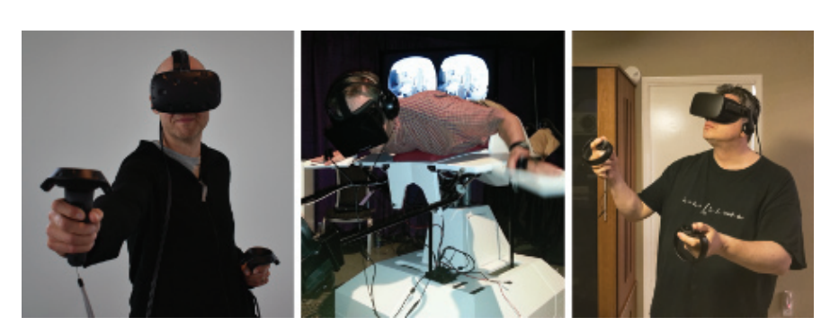
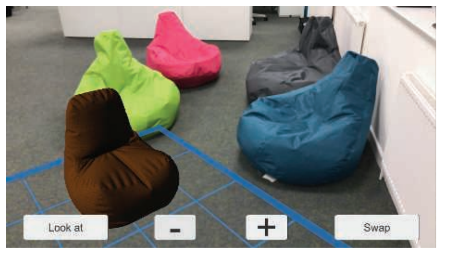
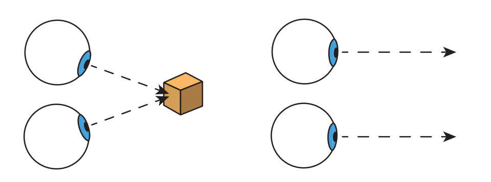
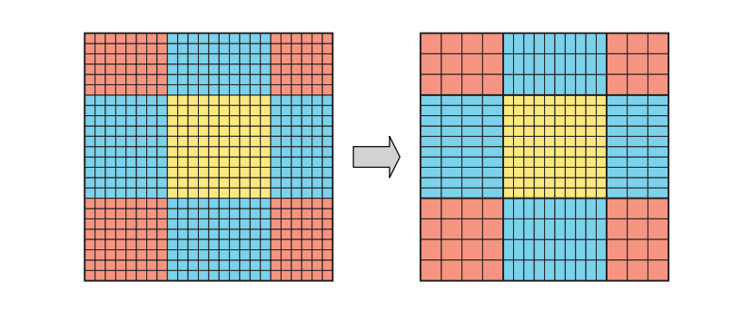
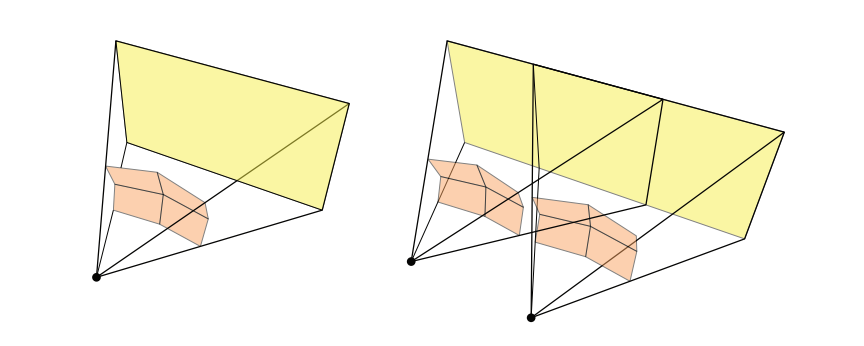
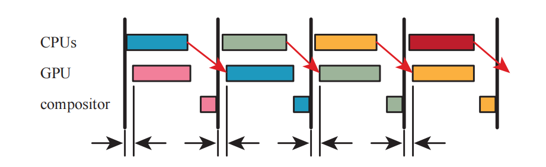

# Chapter 21 Virtual and Augmented Reality 虚拟现实和增强现实

## 目录

-   [21.1 设备和系统概述](#211-设备和系统概述)
-   [21.2 物理元素](#212-物理元素)
    -   [21.2.1 延迟](#2121-延迟)
    -   [21.2.2 光学](#2122-光学)
    -   [21.2.3 立体视觉](#2123-立体视觉)
-   [21.3 API和硬件](#213-API和硬件)
    -   [21.3.1 立体渲染](#2131-立体渲染)
    -   [21.3.2 注视点渲染](#2132-注视点渲染)
-   [21.4 渲染技术](#214-渲染技术)
    -   [21.4.1 抖动](#2141-抖动)
    -   [21.4.2 计时](#2142-计时)
-   [补充阅读和资源](#补充阅读和资源)

> Philip K. Dick——“Reality is that which, when you stop believing in it, doesn’t go away.”

> 菲利普·K·迪克——“现实就是，即使你不再相信它，它也不会消失。”（美国的科幻小说作家，有很多小说被改编成电影，例如《银翼杀手》；1928——1982）

虚拟现实（virtual reality，VR）和增强现实（augmented reality，AR）是一种试图以现实世界的方式来刺激人类感官的技术。在计算机图形学领域，增强现实会将数字合成的物体与我们周围的真实世界结合在一起；而虚拟现实则是试图完全取代现实世界，如图21.1所示。本章节将会重点介绍这两种技术中的渲染技术，这两种技术有时候会使用总称“XR”来将它们组合在一起，其中的X可以代表任何字母。本章节的重点将放在虚拟现实技术上，因为直到本文撰写的时候，这种技术已经得到了更加广泛的应用。

渲染只是这些领域中的一小部分。从硬件的角度来看，它们也会使用某种类型的GPU，这是系统中一个较为容易理解的部分。这个系统还面临许多其他的挑战，例如：准确且舒适的头部追逐传感器\[994, 995]，高效的输入设备（可能还会带有触觉反馈系统或者眼球追踪控制），舒适的头戴设备和光学设备，以及令人信服的音频等等。由于需要对性能、舒适度、移动自由度、价格和其他的一些因素进行平衡，使得它成为了一个要求很高的设计空间。

本章节将会专注于交互式渲染，以及这些技术影响图像生成的方式，首先我们会简要调查当前可用的各种虚拟现实系统和增强现实系统。然后对一些系统的SDK和API的功能与目标进行讨论。我们会以介绍特定的计算机图形技术来结束本章节，为了提供最佳的用户体验，应该避免使用这些技术，或者避免对这些技术进行修改。

## 21.1 设备和系统概述

除了CPU和GPU之外，用于图形功能的虚拟现实和增强现实设备，还可以归类为传感器或者显示器。其中传感器包括检测用户旋转信息和位置信息的追踪器，以及各种输入设备。在显示器方面，一些系统直接使用手机屏幕，这种方法在逻辑上被划分成了两部分。一些专用系统通常会有两个独立的显示器，这里的显示器是指用户在虚拟现实系统中用于看到画面的屏幕。而对于增强现实来说，会通过使用一些特殊设计的光学装置，来将虚拟世界与现实世界的视野相结合。

虚拟现实和增强现实是一个古老的领域，在几十年前就已经出现了，但是近年来由于系统成本的大幅降低，它们得到了爆炸式地发展，这在很大程度上直接或者间接地归功于各种手机和主机技术的出现\[995]。手机当然也可以用于沉浸式体验，有时候效果还会出奇地好。手机可以直接放置在头戴式显示器（head-mounted display，HMD）内部，这类设备有很多，从简单的查看器（例如Google Cardboard），再到那些手部自由并且提供额外输入的设备（例如GearVR）。手机的重力、磁北（magnetic north）和其他机制的方向传感器，可以用于确定显示屏的方向。方向（orientation），有时候也被称为姿态（attitude），它有三个自由度，即偏航（yaw）、俯仰（pitch）和滚转（roll），如章节4.2.1中所述。相关API可以将方向返回为一组欧拉角、旋转矩阵或者四元数。从现实世界中生成的内容，例如固定视角的全景图和全景视频，可以很好地与这些设备一起工作，因为根据用户方向来展示正确的二维视图，这个操作的实现成本相当低。

> 许多手机的惯性测量单元包含六个自由度（3个用于方向+3个用于位置），但是位置信息的追踪误差会迅速累积。

移动设备的计算能力相对有限，同时还会有对GPU和CPU硬件的功耗需求，这些因素限制了它们的使用范围和表现能力。一些捆绑式的虚拟现实设备，用户的头戴式设备会通过一组电线连接到一台位置固定的计算机上，虽然这样做限制了移动自由，但是可以使用更加强大的处理器。

这里我们将简要介绍两种系统的传感器，即Oculus Rift和HTC Vive，二者都能够提供六个自由度（6-DOF）的追踪：方向和位置。其中Rift通过三个独立的红外摄像机，来追踪HMD和控制器的位置。当头戴设备的位置信息由固定的外部传感器进行确定时，这种方式被称为由外向内的追踪（outside-in tracking），头戴设备外部的有一组红外LED阵列，可以对其进行跟踪。Vive则使用一对“灯塔（lighthouse）”，它会以快速的间隔来向房间内发射一些不可见的光线，头戴设备中的传感器和控制器会检测到这些不可见光，从而对自身的位置进行三角测量。这种方式被称为由内向外的追踪（inside-out tracking），其中传感器是HMD中的一部分。

与PC上的鼠标和键盘不同，VR中的标准输入设备是一个手持控制器，它是可跟踪的，并且能够跟随用户进行移动。基于一系列广泛的技术，已经为VR开发了许多其他类型的输入设备。这些设备包括：手套或者其他肢体和身体的追踪设备；眼动追踪设备；以及模拟原地（in-place）运动的设备，例如压力垫，单向跑步机或者全向跑步机，固定的自行车和人体大小的仓鼠球（hamster ball，译者注：仓鼠球是一种透明塑料球，让仓鼠在里面滚动娱乐）等。除了光学追踪系统之外，还探索了基于磁场、惯性、机械、深度探测和声学现象的追踪方法。

增强现实被定义为：将计算机生成的数字内容与用户现实世界的视图相结合。任何可以将文本数据叠加在图像上的平视显示（heads-up display，HUD）应用程序，都是增强现实的基本形式。2009年推出的Yelp单片眼镜（Monocle），可以将商业用户的评分和距离叠加在摄像头的画面之上。移动端的谷歌翻译还可以使用翻译后的结果来替换原有的语言符号。《Pokemon GO》等一些游戏将虚构的生物放置于真实环境中。Snapchat可以检测面部特征，并添加一些服装元素或者动画效果。

对于合成渲染而言，混合现实（mixed reality，MR）是增强现实的一个子集，其中真实世界可以和三维虚拟内容进行实时融合和交互\[995]。混合现实的一个经典用例是手术，在手术过程中，患者器官的扫描数据与外部身体的摄像头画面合并在一起。这个场景假设了一个具有相当计算能力和精度的系留系统（tethered system，译者注：即使用实体线材进行连接，以供数据传输）。另一个例子是与虚拟袋鼠玩“捉人”游戏，现实世界的墙壁可以隐藏你的对手。在这种情况下，移动性将会变得更加重要，而登记（registration）或者其他影响质量的因素则不那么重要。

这个领域中常用的一项技术，是在HMD前端安装一个摄像机。例如：每个HTC Vive都有一个前置摄像头，开发者可以对其进行访问。这个这个摄像头所拍摄的画面可以显示在VR的显示屏上，并且数字合成的图像可以与之融合。这种形式有时会被称为穿透式AR或者穿透式VR，或者叫做介导现实（Mediated Reality）\[489]，即用户不会直接观察到现实环境。这种使用视频流方法的一个优点在于，它可以更好地控制虚拟物体与真实物体的融合；其缺点在于现实世界的画面可能会有一定的滞后，因为摄像机拍摄的画面在经过处理之后，再显示到屏幕上存在一定的延迟。Vrvana的Totem和Occipital的Bridge，都是使用这种类型头戴式显示器的例子，它们都属于AR系统。（译者注：Quest2 和Pico Neo3也都支持）

在撰写本书的时候，微软的HoloLens是最著名的混合现实系统。这是一个不受束缚的系统，其中CPU、GPU和微软所说的全息处理单元（holographic processing unit，HPU）都被内置在头戴式设备中。其中的HPU是一款定制芯片，它由24个数字信号处理核心组成，其功耗低于10瓦。这些核心用于处理来自一个类似于kinect摄像头的世界数据，这个摄像头可以对真实世界中的环境进行观察。这个视图画面与其他传感器（例如加速度计）一起，执行由内而外的追踪，它还有一个额外的优势，即不需要使用灯塔、QR码（又名二维码基准）或者其他的外部元素。HPU可以对一组有限的手势进行识别，这意味着不需要使用额外的输入设备就可以实现基本的交互。在扫描环境的同时，HPU还可以提取深度信息并生成几何数据，例如代表世界表面的平面和多边形。然后，这些几何图形还可以用于碰撞检测，例如：让虚拟物体立在现实世界的桌面上。

通过在真实世界中创建的路径点（被称为空间锚点spatial anchor），并使用HPU进行追踪，可以实现更大范围内的活动。虚拟物体的位置会相对于特定的空间锚点来进行设置\[1207]。随着时间的推移，设备对于这些锚点位置的估计也会得到一定的改善。这些数据还可以进行共享，这意味着少数用户可以在相同的位置上看到相同的内容。还可以对锚点进行自定义，从而使得不同位置上的用户可以在同一个模型上进行协作。

Hololens具有一对透明的屏幕，它允许用户看到现实世界中的物体，以及投射到这些屏幕上的任何数字画面。请注意，这与手机使用的增强现实有所不同，后者的世界画面是使用摄像头进行捕获的。使用透明屏幕的一个好处是，现实世界本身不会带来任何的延迟或者显示问题，并且不会消耗处理能力。然而，这种显示系统的一个缺点在于，显示在屏幕上的虚拟内容只能在用户所看到的世界画面上增加亮度。例如：一个黑暗的虚拟物体并不会遮挡住背后更亮的现实世界物体，因为显示在透明屏幕上的亮度只能增加不会减少，这会使得虚拟物体具有一种半透明的感觉。HoloLens还有一个LCD调光器，可以帮助避免这种影响。通过适当的调整，这个系统可以有效地显示出与现实世界融合的三维虚拟物体。

苹果的ARKit和谷歌的ARCore，可以帮助开发者开发手机和平板电脑上的增强现实应用。通常的做法是显示单一的视图画面（而非立体的），显示设备与眼睛保持一定距离。这些虚拟物体可以是完全不透明的，因为它们会覆盖在摄像机的世界画面之上，如图21.2所示。对于ARKit而言，通过使用设备的动作感应硬件，以及一组在相机中可见的显著特征，来实现由内而外的追踪。对这些特征点进行逐帧追踪有助于精确确定设备当前的位置和方向。与HoloLens一样，它可以检测到现实世界中的水平表面和垂直表面，并确定其范围，然后再将这些信息提供给开发人员\[65]。

英特尔的Alloy项目是一款无绳式（untethered）的头戴式显示器，与HoloLens一样，它具有一个传感器阵列，可以探测到房间中的大型物体和墙壁。然而与HoloLens不同的是，这款HMD无法让用户直接看到现实世界。然而，其感知周围环境的能力可以提供英特尔所谓的“融合现实”功能，即现实世界中的物体可以在虚拟世界中以一种令人信服形式的存在。例如：用户可以伸手到虚拟世界中的控制台上，而真实世界中的手则会触摸到现实世界中的桌子。

虚拟现实和增强现实的传感器和控制器正在快速发展，许多迷人的技术正在以极快的速度出现。这些产品有望带来干扰更少的头戴式设备、更强的移动性和更好的体验。例如：谷歌的Daydream VR和高通的Snapdragon VR头戴设备都是无绳式的，并且使用了由内而外的位置追踪，不需要外部传感器或者其他定位设备。惠普、Zotac和MSI的一些系统，可以将计算机背在背上，从而提供更加强大的计算能力。英特尔的WiGig无线网络技术使用了一个短程的90 GHz无线电，来将图像从PC发送到头戴设备中。另一种方法是在云端进行昂贵的光照计算，然后将这些压缩信息发送给头戴设备，使用其内置的、更轻量的、功能更弱的GPU来进行渲染\[1187]。一些软件方法为虚拟画面和真实世界的融合开辟了新的途径，例如：获取点云数据，然后再对这些点云数据进行体素化，并以交互速率来渲染这些体素化表示\[930]。

本章节的主要内容集中在显示器及其在VR和AR中的应用。我们首先会介绍一些图像在屏幕上显示的物理机制，以及这些物理机制将会涉及到的一些问题。之后，本章节将会继续介绍一些SDK和硬件系统，它们提供了一些功能，可以简化编程并增强用户对场景的感知。然后我们会介绍这些不同的因素是如何影响图像生成的，并讨论了一些图形技术需要进行怎样的修改，或者可能要完全避免使用其中的一些图形技术。最后，我们讨论了一些渲染方法和硬件增强，以提高效率和改善参与者的体验。

## 21.2 物理元素

本小节将会介绍现代VR系统和AR系统的各个组成部分，以及它们各自的特点，尤其是那些与图像显示有关的系统。本小节中的信息提供了一个框架，用于理解设备供应商所提供的工具及其背后的逻辑。

### 21.2.1 延迟

减轻延迟的所带来的影响在VR系统和AR系统中尤其重要，它通常是最为关键的问题\[5, 228]。我们在第3章中讨论了GPU是如何隐藏内存延迟的，但是这种类型的延迟是由纹理获取等操作所引起的，并且只针对了整个系统中的一小部分。而这里我们指的是整个系统的“动显（motion-to-photon，MTP）”延迟。也就是说，假设你开始将头转向左侧，从你的头朝向一个特定的方向开始，直到显示出从这个方向所产生的视图，这之间具体要经过多长时间？这个过程中的每个硬件都有处理成本和通信成本，从检测用户输入开始（例如：头部朝向的改变）再到响应（将新图像显示在屏幕上），这些加起来有几十毫秒的延迟。

在一个普通显示器系统中（即没有连接到头部的显示器），延迟最坏的情况是十分令人讨厌的，它破坏了交互性和连接感（沉浸感）。对于增强现实和混合现实应用而言，较低的延迟将会有助于提高“像素粘性”，即场景中的虚拟物体与现实世界的贴合程度。系统中的延迟时间越长，虚拟物体相对于现实世界中的物体看起来就会越像是在游动或者漂浮。在沉浸式虚拟现实中，显示器是唯一的视觉输入，延迟可能会带来更加严重的后果。延迟会引起人体的不适，虽然它并不是真正的疾病，但是这种不适也会被称为模拟病（simulation sickness），它会引起出汗、头晕、恶心、甚至更糟的不适感。如果你开始感到这种不适感，你需要立即摘下HMD，因为我们是无法“强制克服”这种不适感的，一直强忍只会让我们变得更加不适\[1183]。引用Carmack（译者注：约翰·卡马克）的话\[1183]：“别太勉强。我们不需要在演示室里清理病人。”实际上，使用VR设备很少会引发真正的呕吐，但是尽管如此，它的影响仍然是十分严重的，它会使人感觉很虚弱，并且可能会持续上一整天。

当显示出的图像与用户的期望、或者其他感官的感知不匹配时（例如负责平衡和运动的内耳前庭系统），就会出现VR中的模拟病。头部运动与正确匹配的显示图像之间的延迟越低越好。一些研究指出，低于15 ms的延迟通常是人们无法察觉的。超过20 ms的延迟可以被明确感知，并且会产生一些有害的影响\[5, 994, 1311]。相比之下，从鼠标开始移动到显示出图像，电子游戏通常会有50 ms或者更大的延迟时间，关闭垂直同步通常则会有30 ms（章节23.6.2）。虚拟现实系统的帧率一般为90 FPS，对应的帧时间为11.1 ms。在常见的桌面系统中，通过电缆将画面传输到显示器中大约需要11 ms。因此，即使我们可以在1 ms内完成渲染，但是仍然会有12 ms的延迟。

有许多基于应用程序的技术，可以防止或者减轻这种不适感\[1089, 1183, 1311, 1802]。这些方法有些会通过最小化视觉流动（例如在向前移动的时候，不诱使用户向四周进行观察，避免上楼梯等操作），还有一些会使用心理方法（例如播放一些环境音乐，或者渲染一个代表用户鼻子的虚拟物体）\[1880]。更加柔和的颜色和更加混合的灯光也有助于避免模拟病。使得系统的响应与用户的行动和期望相匹配，是提供舒适虚拟现实体验的关键所在。可以让所有物体都对头部运动做出响应；不要对相机进行拉近拉远操作，或者以其他方式来改变视野；适当缩放虚拟世界；不要将相机的控制权从用户手中夺走等。在用户周围设置一个固定的视觉参考物，例如汽车驾驶舱或者飞机驾驶舱，也可以帮助减少模拟病。对用户应用视觉加速可能会引起一些不适，因此最好是使用恒定的速度。一些硬件解决方案也被证明可能是有用的，例如：三星的Entrim 4D耳机会发出影响前庭系统的微小电脉冲，这使得能够将用户的视觉系统与平衡感相匹配。时间将会证明这项技术是否有效，但是这也正表明了，人们正在进行很多的研究和开发工作，来减轻模拟病所带来的影响。

位姿追踪（tracking pose），是指对观察者在现实世界中的头部方向和头部位置（如果可以的话）进行追踪和定位。这个位姿信息会用于构建渲染所需的相机变换矩阵。可以在一帧开始的时候使用粗略的位姿估计，用于执行一些模拟（译者注：一般引擎的生命周期都是按照物理、输入、逻辑更新、渲染的顺序，例如Unity引擎），例如对角色和环境中的元素进行碰撞检测。在渲染即将开始的时候，此时可以检索一个新的位姿预测，并用于更新相机的视图。这种预测将会更加准确，因为它进行检索的时间较晚，持续的时间也更短。当图像即将进行显示的时候，仍然可以检索另一个更加准确的位姿预测，并使用这个信息对生成的图像进行扭曲，从而更好地匹配用户所在的位置。虽然之后的每次预测，都无法对基于早期不准确预测的计算进行完全补偿，但是尽可能地使用这些位姿预测，可以显著改善整体的体验。各种平台的硬件增强（hardware enhancement）提供了在需要时快速查询和获取头部位姿（更新后的）的能力。

除了视觉效果之外，还有一些其他元素可以让玩家与虚拟环境之间的交互变得更加令人信服，但是如果生成的图像出现错误，那么最多就只能给用户带来不愉快的体验了。最小化延迟和提高应用程序的真实感，可以帮助实现沉浸感（immersion）或者存在感（presence），这种情况下可以隐藏UI界面，使得参与者感觉自己是虚拟世界中的一部分一样。

### 21.2.2 光学

通过精确设计的物理光学元件来将头戴式显示器的内容映射到人眼视网膜上的相应位置，这是一项成本很高的主张和方法。现如今的虚拟现实显示系统之所以经济实惠，是因为GPU产生的图像可以在单独的后期处理中被一定程度的扭曲，这样它们就能够正确地到达人类的眼睛，而不是使用昂贵的光学镜片组合。

虚拟现实系统的镜头会向用户呈现具有一个枕形畸变（pincushion distortion）的宽FOV图像，图像的边缘会向内弯曲；这种效果可以通过使用桶形畸变（barrel distortion）对生成的图像进行反向变形来进行抵消，如图21.3右侧所示。光学系统通常也会受到色差（chromatic aberration）的影响，在这种情况下，透镜会导致颜色分离，就像棱镜一样。这个问题可以通过供应商的软件来进行补偿，即通过生成具有反向色差的图像，这是在“另一个方向”上的人工色差。当通过VR的光学系统进行显示的时候，这些分离的颜色可以正确地被结合在一起。这种校正手段可以在扭曲图像的橙色边缘处观察到。

![图21.3：在HTC Vive上显示的原始渲染目标（左）和它们的扭曲版本（右）。 \[1823\]](images/Chapter-21/202309241652150.png "图21.3：在HTC Vive上显示的原始渲染目标（左）和它们的扭曲版本（右）。 \[1823]")

有两种显示类型，分别是滚动显示和全局显示\[6]。对于这两种显示方式，图像都是在串行流（serial stream）中发送的。在滚动显示（rolling display）中，接收到的比特流会立即进行逐行显示。而在全局显示（global display）中，一旦接收到了一个完整的图像，它就会在一个很短的时间内（burst）中显示出来。在虚拟现实系统中，每一种显示方式都有自己的优缺点。其中全局显示必须等待整个图像被渲染结束之后才能进行显示；相比之下，滚动显示则可以最小化延迟，因为渲染出来的结果会在可以使用时立即进行显示，例如：如果图像是按条生成的，那么每条图像都可以在渲染之后立即进行发送，即“与光束赛跑（racing the beam）”\[1104]。其缺点在于，不同的像素会在不同的时间被照亮，因此根据视网膜和显示器之间的相对运动，图像看起来可能会不稳定。这种不匹配对于增强现实系统而言尤其令人不安。好消息是，合成器（compositor）通常可以通过在扫描线块上，对预测的头部位姿进行插值，从而进行一些补偿。这主要解决了在快速头部旋转时可能发生的抖动或者剪切，尽管它无法对场景中移动的物体进行修正。

全局显示则不存在这种时间问题，因为图像在显示之前必须被完整渲染。相反，全局显示的挑战是技术性的，因为在一个短时间内的突发显示，会将多种显示选项排除在外（译者注：对显示面板的刷新速度有要求）。有机发光二极管（organic light-emitting diode，OLED）显示器是目前全局显示的最佳选择，因为它们的显示速度够快，可以跟上VR中流行的90 FPS。

### **21.2.3 立体视觉**

如图21.3所示，两幅图像会被偏移，意味每只眼睛的视角都不同。这样做会引起立体视觉（stereopsis），即使用两只眼睛来感知深度。虽然立体视觉十分重要，但是它会随着距离的增加而减弱，而且它并不是我们感知深度的唯一方式，例如：当我们在一个标准显示器上观察图像的时候，我们根本不使用到立体视觉。物体的大小、纹理模式的变化、阴影、相对运动（视差）以及其他视觉上的深度暗示，这些因素导致我们只需要一只眼睛就可以正常工作。

眼睛必须要进行一定的形状调整才能使得物体聚焦，这被称为调节需求（accommodative demand）。例如：Oculus Rift的光学系统相当于在距离用户约1.3米的地方设置了一个屏幕。眼睛还需要向内进行一定的转动，才能聚焦在一个物体上，这被称为会聚需求（vergence demand），如图21.4所示。在现实世界中，眼睛会改变晶状体的形状，同时会向内进行转动，这种现象被称为调节-辐辏反射（accommodation-convergence reflex）。对于一个显示器而言，调节需求是恒定的，但是随着眼睛聚焦于不同感知深度的物体上，会聚需求会发生变化。这种不匹配会导致眼睛变得疲劳，因此Oculus建议将用户长时间看到的物体，放置在0.75到3.5米的距离上\[1311, 1802]。这种不匹配也会在某些AR系统中产生感知效应，例如：用户此时可能会想关注现实世界中的一个远处物体，但是随后又必须重新关注位于眼睛附近固定深度的相关虚拟广告牌。一些团队正在研究和开发能够根据用户眼球运动，来调整感知焦距的硬件，这种硬件有时被称为自适应聚焦（adaptive focus）或者变焦（varifocal）显示器\[976, 1186, 1875]。

为VR和AR生成立体视觉的规则，与单显示器的系统完全不同，在单显示器的系统中，会使用一些技术（偏振光透镜、快门眼镜、多视图显示光学）来从同一个屏幕向每个眼睛展现不同的图像。而在VR中，每个眼睛都有一个单独的显示器，这意味着每只眼睛的位置都必须保证投射到视网膜上的图像与现实紧密吻合。两个眼睛之间的距离被称为瞳孔间距（interpupillary distance，IPD），在一项针对4000名美国陆军士兵的研究中，不同人的IPD范围集中在52毫米到78毫米之间，平均为63.5毫米\[1311]。VR系统和AR系统有一些校准方法，可以来帮助确定和调整适应用户的IPD，从而提高图像质量和舒适度。系统的API一般都可以控制包含这个IPD的相机模型，但是最好避免对用户感知到的IPD进行修改来实现某些效果，例如：增大瞳孔间距可以增强对深度的感知，但是也可能会导致眼睛疲劳。

让开发人员从头开始实现头戴式显示器的立体渲染，这是一个不小的挑战。好消息是，为每个眼睛设置并使用合适的相机变换，其中的大部分过程都是由系统API进行处理的，这是下一小节的主题。

## 21.3 API和硬件

让我们从这句话开始：始终使用系统供应商提供的VR软件开发工具包（software development kit，SDK）和应用程序接口（application programming interface，API），除非你有充足的理由不这样做。例如：你可能会认为自己编写的扭曲着色器的速度更快，看起来也差不多。但是在实践中，它很可能会导致用户感到严重的不适——我们无法知道这是否是正确的，除非进行广泛的测试。出于这样或者那样的原因，所有主流的API都删除了让应用程序来控制扭曲的接口，正确使用VR显示器是一个系统级的任务。为了对性能进行优化，同时保持质量，SDK和API中做了许多细致的工程设计。本小节将会对不同厂商的SDK和API提供的功能支持进行讨论。

将三维场景的渲染图像发送到头戴式显示器的过程十分简单。在本小节中，我们将使用大多数虚拟现实和增强现实API中的常见元素来对其进行讨论，并在这个过程中注意不同供应商提供的特定功能。首先，我们将会确定下一个渲染帧的显示时间，通常都会有一些支持来帮助我们对这个时间延迟进行估计。这个值是必需的，这样SDK就可以计算出眼睛在看到这帧时的位置和方向。给定这个估计出来的延迟时间，API会对位姿进行查询，其中包含了有关每个眼睛的相机设置信息。如果传感器也会追踪这些信息的话，那么这些信息至少会包括头部的方向和位置。OpenVR的API还需要知道用户是站着的还是坐着的，这会影响使用哪个位置来作为原点，例如：原点位于追踪区域的中心还是用户的头部位置。如果这个预测是完美的，那么在头部达到预测位置和预测方向的那一刻，将会显示出这个渲染图像。通过这种预测方式，可以将延迟的影响最小化。

给定两个眼睛的预测位姿，我们通常需要将场景渲染到两个单独的目标中，这些渲染目标会被作为纹理发送到SDK的合成器（compositor）。

> 有些API会将一个渲染目标分为两个视图。

合成器负责将这些图像转换为头戴设备上观看效果最好的形式，同时合成器还可以将各种图层组合在一起，例如：如果需要单目平视显示器（monoscopic heads-up display）的话，即双眼的视图是完全相同的，那么可以提供一个包含该元素的单一纹理，来将其作为一个单独的图层，并在每个眼睛的视图上进行合成。这些纹理可以是不同的分辨率和不同的格式，合成器负责将它们转换到最终的眼睛缓冲区中。这样做可以进行一些优化，例如：可以动态降低三维场景图层的分辨率，从而节省渲染时间\[619, 1357, 1805]，同时保持其他图层的高分辨率和高质量\[1311]。一旦每个眼睛的图像都组合完成，则会由SDK来执行扭曲、色差和任何其他需要进行的处理，然后再显示结果。

如果我们选择依赖于API来实现这些功能，那么其实并不需要完全理解其中这些步骤背后的算法原理，因为供应商实际上已经为我们做了很多工作。然而，了解一些这方面的知识仍然是十分值得的，我们需要认识到最明显的解决方案并不总是最好的。首先我们考虑一下合成的方法，最高效的方法是直接将所有图层组合在一起，然后在单幅图像上应用各种修正措施。相反，Oculus首先会对每个图层单独进行这些修正措施，然后再将这些扭曲的图层合成在一起，从而形成最终的显示图像。这种方法的一个优点在于，每个图层都会在自己的分辨率上被扭曲，这可以提高文本渲染的质量，因为单独对文本进行处理，意味着在扭曲过程中的重采样和过滤操作只需要关注文本的内容即可\[1311]。

用户感知到的视野近似为圆形，这意味着我们并不需要渲染每个图像的边缘，即那些靠近角落处的一些像素。虽然这些像素仍然会出现在显示器上，但是它们几乎无法被观察者察觉。为了避免浪费时间来生成这些像素，我们可以首先渲染一个网格，来隐藏原始图像中的这些像素。这个网格会被渲染到模板缓冲区中作为蒙版，或者是直接渲染到最前面的z-buffer中，后续位于这些区域中的渲染片元将会在计算之前被丢弃。Vlachos \[1823]报告称，这会使得HTC Vive的填充率降低约17%，如参见图21.5。Valve的OpenVR API将这种预渲染蒙版（pre-render mask）称为“隐藏区域网格（hidden area mesh）”。

![图21.5：左侧：显示图像中的红色区域展示了渲染后被扭曲的像素，实际上HMD用户是看不到这些像素的。请注意，黑色区域位于转换后渲染图像的边界之外，因此不需要对黑色区域进行渲染。右侧：这些红色区域在渲染开始的时候，会提前使用一个红边网格来进行遮挡，这可以使得渲染（预扭曲）图像需要更少的像素着色计算 \[1311\] 。请仔细比较右侧图像和原始图像（ 图21.3 的左侧图像）。](images/Chapter-21/202309250943696.png "图21.5：左侧：显示图像中的红色区域展示了渲染后被扭曲的像素，实际上HMD用户是看不到这些像素的。请注意，黑色区域位于转换后渲染图像的边界之外，因此不需要对黑色区域进行渲染。右侧：这些红色区域在渲染开始的时候，会提前使用一个红边网格来进行遮挡，这可以使得渲染（预扭曲）图像需要更少的像素着色计算 \[1311] 。请仔细比较右侧图像和原始图像（ 图21.3 的左侧图像）。")

一旦我们生成了渲染图像，就需要对其进行扭曲，从而补偿光学系统所带来的畸变。这个概念实际上是定义了一个从原始图像到所需显示形状的重映射，如图21.3所示。换句话说就是，给定一个渲染图像上的像素样本，这个样本在显示图像中需要被移动到哪个位置？光线投射方法可以给出精确的答案，并可以根据波长进行调整\[1423]，但是对于大多数硬件而言，这种方法是不切实际的，其成本开销太高。一种方法是将渲染图像视为纹理，并通过绘制一个填充屏幕的四边形来运行一个后处理。像素着色器会针对这个输入像素，计算它在输出纹理上的对应精确位置\[1430]。然而，这种方法的成本可能也会很高，因为这个像素着色器必须在每个像素上来计算扭曲方程。

将这个纹理应用到一个三角形网格上的效率更高，这个三角形网格的形状可以通过扭曲方程来进行修改，然后再进行绘制。只对网格扭曲一次无法纠正色差，因此还会使用三组独立的$(u, v)$坐标来用于扭曲图像，每个颜色通道都对应一个坐标\[1423, 1823]。也就是说，网格中的每个三角形都会被渲染一次，但是对于屏幕上的每个像素而言，渲染图像都会在略有不同的位置上进行三次采样。这些红、绿、蓝通道值，就构成了输出像素的实际颜色。

我们可以先将渲染图像应用到一个均匀间隔的三角形网格上，然后再对三角形网格进扭曲，使其变成显示图像的形状，反过来也可以。将网格应用于显示图像，并将其扭曲回渲染图像的优点在于，这样可能会生成更少的$2 × 2$四边形，因为会包含较少数量的纤细三角形。在这种情况下，这个网格的顶点位置并不会被扭曲，而是会将其作为一个单元格来进行渲染，并且只有顶点的纹理坐标会被调整，从而对应用到网格上的图像进行扭曲。一个常用的网格尺寸是每个眼睛$48 × 48$个四边形，如图21.6所示。这个网格的纹理坐标会通过使用逐通道的（per-channel）、显示到渲染（display-to-render）的图像变换来计算一次。通过将这些值存储在网格中，因此在着色器执行过程中就不需要进行复杂的变换了。GPU支持纹理的各向异性采样和各向异性滤波，可以用于生成清晰的显示图像。

图21.5右侧的立体渲染，被显示网格进行了扭曲。图片中央被移除的部分切片与扭曲变换生成显示图像的方式相对应，请注意，在图21.5左侧的显示图像中，两侧图像交汇的地方并没有出现切片空白。通过将显示的扭曲网格裁剪到用户可见的区域（如图21.6右侧所示），我们可以将最终扭曲pass的成本降低约15%。

![图21.6：左边展示了最终显示图像的网格。在实践中，可以对这个网格进行裁剪，使其变为右侧的裁剪版本，因为绘制那些黑色区域上的三角形，并不会给最终图像增加任何东西。 \[1823\]](images/Chapter-21/202309251012634.png "图21.6：左边展示了最终显示图像的网格。在实践中，可以对这个网格进行裁剪，使其变为右侧的裁剪版本，因为绘制那些黑色区域上的三角形，并不会给最终图像增加任何东西。 \[1823]")

这里对上述所描述的优化进行一下总结。我们首先会绘制一个隐藏区域网格，从而避免对那些不可见或者未使用的区域（例如中间的切片）中的片元进行计算。我们为两个眼睛都渲染一遍场景。然后，我们将这个渲染图像应用到一个均匀网格上，这个网格会被修剪，从而只包含那些相关的渲染区域。将这个网格渲染为一个新的目标，我们就可以获得最终的显示图像。在常见的虚拟现实系统和增强现实系统的API中，都内置了上述的全部优化或者部分优化。

### 21.3.1 立体渲染

想要渲染两个独立的视图，这个过程的工作量似乎是渲染一个视图的两倍。然而，正如Wilson \[1891]所指出的，即使对于一个十分简单的实现，这也是不正确的。阴影贴图的生成、模拟、动画以及其他元素都是与视图无关的。调用的像素着色器数量也并不会翻倍，因为显示器示本身会在两个视图之间被分为两半。类似地，后处理效果的实现也依赖于分辨率，因此这些成本也并不会改变。然而，依赖于视图的顶点处理会增加一倍，因此已经有许多人对减少这种开销的方法进行了探索。

视锥体剔除通常会在任何网格被发送到GPU管线之前进行执行。可以使用一个较大的视锥体，来包含两个较小的眼睛视锥体\[453, 684, 1453]。由于这个剔除过程发生在渲染之前，因此在剔除之后，可以再次检索要进行使用的精确渲染视图。然而，这意味着在剔除过程中需要有一个安全余量，因为这两个检索视图可能会查看一些已经被视锥体所剔除的模型。Vlachos \[1823]建议将FOV增加5度来进行预测性剔除。Johansson \[838]讨论了如何将视锥体剔除和其他策略（例如实例化和遮挡剔除查询）结合起来，用于大型建筑模型的VR显示。

渲染两个立体视图的一种方法是连续进行渲染，先完整渲染一个视图，然后再去渲染另一个视图。虽然这个实现看起来很简单，但是它有一个明显的缺点，即状态改变的数量也会加倍，这是需要避免的（章节18.4.2）。对于基于tile的渲染器而言，频繁更改视图和渲染目标（或者裁剪矩形）将会导致很差的性能表现。

一个更好的选择是将每个物体渲染两次，并在相机变换之间进行切换使用。然而，这种方法的draw call数量是原来的两倍，这会导致额外的开销。一种方法是使用几何着色器来复制几何图形，为每个视图都创建对应的三角形，例如：DirectX 11支持几何着色器将其生成的三角形发送到单独的目标中。不幸的是，人们发现这种技术会将几何吞吐量降低三倍或者更多，因此在实践中没有进行使用。一个更好的解决方案是使用实例化，其中每个物体的几何图形，会通过单个draw call来绘制两次\[838, 1453]。使用由用户进行定义的裁剪平面设置，来保持每个眼睛的视图分离开来。使用实例化要比使用几何着色器快得多，并且它是一个很好的解决方案，因为它不需要任何额外的GPU特性支持\[1823, 1891]。另一种方法是在渲染一个眼睛的图像时，生成一个命令列表（章节18.5.4），并将引用的常量缓冲区转移到另一个眼睛的变换中，然后重播（replay）这个命令列表，来渲染第二个眼睛的图像\[453, 1473]。

有几个扩展可以避免向管线发送多次几何图形。在一些手机上，一个叫做multi-view的OpenGL ES 3.0扩展，增加了对只发送一次几何图形并将其渲染到多个视图中的支持，还可以对屏幕顶点的位置以及任何与视图相关的变量进行调整\[453, 1311]。这个扩展在实现立体渲染器的时候提供了更多的自由度。例如：最简单的扩展可能是在驱动程序中使用实例化，向管线发送两次几何图形，而一些需要GPU支持的实现，可能会将每个三角形都发送到各个视图中。不同的实现有着不同的优点，但由于API的成本总是在降低的，因此这些方法中的任何一个都可以帮助到那些CPU瓶颈的应用程序。例如：一些更加复杂的实现可以提高纹理缓存的效率\[678]，并且只需要执行一次对视图无关属性的顶点着色。在理想情况下，可以为每个视图都设置完整的矩阵，并且任何逐顶点的属性都可以针对每个视图来进行着色。为了使得硬件实现使用更少数量的晶体管，GPU可以选择实现这些特性的一个子集。

AMD和NVIDIA提供了针对VR立体渲染的多GPU解决方案。对于两个GPU而言，每个都会负责渲染一个单独的眼睛视图。通过使用一个关联掩码（affinity mask），CPU需要为所有接收特定API调用的GPU设置一个bit。通过这种方式，可以将调用发送到一个或者多个GPU中\[1104, 1453, 1473, 1495]。如果左右两个眼睛视图之间的调用不同，那么即便使用关联掩码，也仍然需要调用两次API。

厂商所提供的另一种渲染方式是被NVIDIA称作的广播（broadcasting），其中两个眼睛的渲染也仅仅使用单个draw call，也就是说，它会被广播到所有GPU上。常量缓冲区会用于发送不同的数据（例如：眼睛位置）到不同的GPU中。广播可以创建两个眼睛的图像，它比单一视图方法不会有更多的CPU开销，其唯一的成本是需要设置第二个常量缓冲区。

多个GPU意味着多个渲染目标，但是合成器通常只需要单个渲染图像。有一个特殊的子矩形传输命令，可以在一毫秒或者更短的时间内\[1471]，将渲染目标的数据从一个GPU转移到另一个GPU中。这个过程是异步的，这意味着可以在GPU执行其他工作的时候进行传输。在两个GPU并行运行的情况下，它们也可以分别创建渲染所需的阴影缓冲区。这虽然是重复的工作，但是要比对并行化进程进行优化、以及在GPU之间进行传输数据更加简单，通常也会更快。以这种方式来设置两个GPU，可以使渲染速度提高30%到35% \[1824]。对于已经针对单个GPU进行了优化的应用程序，多个GPU可以将额外的计算能力应用于额外的样本，从而获得更好的抗锯齿效果。

立体视差（parallax from stereo viewing）对于近处的模型而言十分重要，但是对于远处的物体则可以忽略不计。Palandri和Green \[1346]利用了这样的一个事实，他们在移动GearVR平台上，使用了一个垂直于观察方向的分离平面，他们发现10米左右的距离是一个不错的默认值。比这个距离更近的不透明物体会被渲染为立体的，而那些比这个距离更远的物体，则使用放置在两个立体相机之间的单目相机进行渲染。为了最小化过度绘制，首先会绘制立体视图，然后使用它们的深度缓冲区交集，来对这个单目渲染的z-buffer进行初始化。然后再将这些远处物体的图像与每个立体视图合成在一起。透明物体会在每个视图的最后进行渲染。虽然这种方法更加复杂，并且那些跨越分离平面的物体还需要额外的pass进行处理，但是这种方法大约可以节省约25%的总体开销，并且并不会损失质量或者深度感知。

在图21.7中可以看到，由于光学元件会发生畸变，因此会在每个眼睛图像的外围产生更高密度的像素。并且，图像四周的内容通常没有那么重要，因为用户在相当多的时间里都会看着屏幕的中央。出于这些原因，人们开发了各种技术，从而减少对每个眼睛视野外围像素的工作量。

![图21.7：左侧是一个眼睛的渲染图像，右边是用于显示的扭曲图像。我们可以注意到，中间的绿色椭圆保持了大致相同的面积。而在图像外围，渲染图像中的较大区域（红色轮廓）被扭曲称了显示图像中的较小区域 \[1473\] 。](images/Chapter-21/202309251137053.png "图21.7：左侧是一个眼睛的渲染图像，右边是用于显示的扭曲图像。我们可以注意到，中间的绿色椭圆保持了大致相同的面积。而在图像外围，渲染图像中的较大区域（红色轮廓）被扭曲称了显示图像中的较小区域 \[1473] 。")

降低外围分辨率的一种方法是使用NVIDIA的多分辨率着色（multi-resolution shading）和AMD的可变速率着色（variable rate shading）。其核心思想是将屏幕划分为$3 × 3$的部分，并以较低的分辨率来渲染图像四周的区域\[1473]，如图21.8所示。NVIDIA从其Maxwell架构开始就支持这种分区渲染方案，但是Pascal及其之后的架构支持更加通用的投影类型，这被称为同步多重投影（simultaneous multi-projection，SMP）技术。可以通过最多16个单独的投影乘以2个单独的眼睛位置来处理几何形状，这样允许一个网格被复制多达32次，而在应用程序方面却没有带来额外的成本。其中第二个眼睛的位置，其沿$x$轴的偏移量必须与第一个眼睛的位置相等。每个投影都可以独立地围绕一个轴进行倾斜或者旋转\[1297]。

通过使用SMP，可以实现镜头匹配的着色（lens matched shading），其目标是让渲染分辨率与显示内容能够更好地匹配，如图21.7所示。会渲染出四个带有倾斜平面的视锥体，如图21.9左侧所示。这些修改之后的投影可以在图像中心的提供更大的像素密度，而在外围提供更少的像素密度。这使得截面之间的过渡要比多分辨率着色更加平滑。这种方法存在一些缺点，例如：泛光（bloom）等效果需要重新进行设计才能够正确显示。Unity和UE 4已经将这个技术集成到了他们的系统中\[1055]。Toth等人\[1782]对这些算法以及其他的多视图投影算法进行了形式上的对比和比较，并为每个眼睛使用最多$3 × 3$个视图来进一步减少像素着色。请注意，SMP可以同时应用于双眼，如图21.9右侧所示。

为了节省片元处理的时间，有一种应用程序级别的方法，该方法被称为径向密度遮罩（radial density masking），它会以一个四边形的棋盘格图案来对边缘像素进行渲染。换句话说，每个另外的$ 2×2  $四边形片元都不会被渲染。然后使用一个后处理pass，来从它们的邻居重建出缺失的像素\[1824]。这种技术对于只有单个低端GPU的系统而言尤其有价值。使用这种方法进行渲染可以减少像素着色器的调用，但是如果后续执行重建过滤器的成本太高，则可能会起到反效果。索尼的伦敦工作室在这一过程中更进一步，直接从$2 × 2$的集合中去掉1个、2个或者3个四边形，越靠近图像边缘，丢弃的四边形数量就越多。缺失的四边形会以类似的方式进行填充，并且每帧会改变丢弃的方式，即使用抖动模式来丢弃四边形。使用一个时域抗锯齿也有助于隐藏阶梯状的瑕疵。索尼的系统节省了大约25%的GPU时间\[59]。

另一种方法是每个眼睛都渲染两个独立的图像，其中一个图像位于中心的圆形区域，另一个图像是构成外围的环形区域。然后，对这两张图像进行合成和扭曲，从而构成该眼睛的显示图像。外围图像可以以一个较低的分辨率进行生成，从而节省对于像素着色器的调用，其代价是发送的几何图形会形成四个不同的图像。这种技术刚好与GPU支持将几何图形发送到多个视图中相吻合，并且为具有两个或者四个GPU的系统提供了一种十分自然的工作划分。虽然是为了减少由于HMD所涉及的光学现象而导致外围像素的过多着色，但是Vlachos则将这种技术称为固定注视点渲染（fixed foveated rendering）\[1824]。这个术语来自一个更加高级的概念，即注视点渲染（foveated rendering）。

### 21.3.2 注视点渲染

为了理解这种渲染技术，我们必须对我们的眼睛有更多的了解。中央凹（fovea）是我们眼睛视网膜上的一个小凹陷，里面充满了高密度的视锥细胞，而视锥细胞则是与颜色视觉相关的感光细胞。人眼在这个区域内的视觉灵敏度最高，我们会通过旋转眼睛来利用这种能力，例如：追踪飞行中的鸟，或者阅读书本上的文本。在离开中央凹的地方，人眼的视力会快速下降，在开始的30度角内，每距离中央凹的中心2.5度，视力会下降约50%，在更远的地方下降的幅度会更大。我们的双眼FOV（两个眼睛都能看到同一个物体）约为114水平角度。第一代消费级头戴式设备的FOV较小，双眼的水平角度约为80度-100度，这个角度之后可能会有所上升。从2016年起，中心20度视角的区域约占整个HMD显示屏的约3.6%，预计到2020年左右将降至2% \[1357]。在此期间，HMD显示器的分辨率可能会提高一个数量级\[8]。

由于眼睛会在视觉灵敏度较低的区域看到显示器的绝大多数像素，这为使用注视点渲染来进行更少的着色工作提供了机会\[619, 1358]。这个想法是以高分辨率和高质量来渲染眼睛所指向的区域，而在其他地方则花费的较少的精力。这个想法的问题在于，人的眼睛会可以旋转，因此注视的区域也会发生改变，例如：在研究一个物体的时候，眼睛会进行一系列被称为扫视（saccades）的快速移动，这个移动速度可以达到每秒900度，即在一个90 FPS系统中，可以达到每帧旋转10度。精确的眼动追踪硬件，可以通过在注视点区域以外执行更少的渲染工作，来大幅提高性能表现，但是这种类型传感器也是一个不小的技术挑战\[8]。此外，在边缘处渲染面积“较大”的像素，往往会增加锯齿问题。低分辨率外围区域的渲染效果，可以通过尝试保持对比度，同时避免随着时间发生的较大变化来进行改善，使得这些区域在感知上更加容易被接受\[1357]。Stengel等人\[1697]对之前减少着色器调用数量的注视点渲染方法进行了讨论，并提出了他们自己的方法。

## 21.4 渲染技术

适用于单视图渲染的技术，并不一定适用于两个视图。即使是在立体渲染中，在单个固定屏幕上所使用的技术，与在随着观察者移动的屏幕上所使用的技术之间也存在相当大的差异。在这里，我们将介绍一些特定的算法，这些算法可能会在单个屏幕上运行良好，但是在VR和AR系统中则会出现问题。我们借鉴了Oculus、Valve、Epic Games、Microsoft等公司的专业知识。这些公司的后续研究会被纳入用户手册，并在博客中进行讨论，因此我们建议访问他们的网站，从而获取当前的最佳实践\[1207, 1311, 1802]。

正如上一节中所强调的，供应商希望我们能够理解他们的SDK和API，并正确地使用它们。视图是至关重要的，因此我们需要遵循供应商提供的头部模型，并且需要完全正确地获得相机的投影矩阵。同时应当避免使用闪光灯（strobe light）等效果，因为闪烁会导致头痛和眼睛疲劳；在视野边缘附近的闪烁也可能会导致模拟病；闪烁效果和高频纹理（例如细条纹），也会引发某些人的癫痫发作。

基于显示器的视频游戏通常会使用一个HUD，其中包含了有关生命值、弹药或者剩余燃料的数据信息。然而，对于VR和AR来说，双目视觉意味着靠近观察者的物体会在两个眼睛之间具有更大的偏移，即会聚效应（章节21.2.3）。如果这个HUD在双眼屏幕上处于相同的位置，那么在感知上，会暗示这个HUD一定离得很远，如图21.4所示。然而，HUD被绘制在所有场景内容的前面，这种感知上的不匹配使得用户很难将两幅图像融合在一起，并理解他们所看到的内容，这可能会导致一些不适感\[684, 1089, 1311]。将HUD内容以接近眼睛附近的深度来进行渲染，可以解决这个问题，但是仍然需要以牺牲屏幕空间为代价，如图21.10。如果附近的墙壁比准星更近，那么还存在深度冲突的风险，因为这个准星图标仍然会在给定深度来进行渲染。发射一条光线，并在给定方向上找到最近的表面深度，从而可以使用各种方法来调整HUD的深度，可以直接使用射线检测到的深度，也可以在需要时将它平滑地移动到更靠近的位置\[1089, 1679]。

![图21.10：一个内容繁多的HUD占据了大部分视野。请注意，这些HUD元素必须针对每个眼睛进行移动，从而避免混乱的深度暗示。一个更好的解决方案是考虑将这些信息直接放入虚拟世界中（作为一个实体）；或者放入是玩家角色的设备和头显中，因为用户可以倾斜或者转动头部，游戏内的头显和设备可以跟着玩家一起运动 \[1311\] 。想要从这幅图中看到立体效果，你可以靠近图片，在图片之间垂直放置一张小而硬的纸，并让每只眼睛都看着各自的图片。](images/Chapter-21/202309251515234.png "图21.10：一个内容繁多的HUD占据了大部分视野。请注意，这些HUD元素必须针对每个眼睛进行移动，从而避免混乱的深度暗示。一个更好的解决方案是考虑将这些信息直接放入虚拟世界中（作为一个实体）；或者放入是玩家角色的设备和头显中，因为用户可以倾斜或者转动头部，游戏内的头显和设备可以跟着玩家一起运动 \[1311] 。想要从这幅图中看到立体效果，你可以靠近图片，在图片之间垂直放置一张小而硬的纸，并让每只眼睛都看着各自的图片。")

在某些情况下，凹凸贴图在任何立体视觉系统中表现得都很差，因为它是在一个平坦的表面上来进行着色的。它可以用于精细的表面细节或者远处的物体，但是对于表示较大几何形状的法线贴图，这种错觉会快速消失，并且用户可以感知到这种变化，如图21.11所示。基础视差映射存在的游动问题，会在立体视觉中变得更加明显，但是这个问题可以通过一个简单的校正因子来进行改善\[1171]。在某些情况下，可能需要一些成本更高的技术，例如陡峭视差映射（steep parallax mapping）、视差遮挡映射（章节6.8.1）或者位移映射\[1731]等，从而产生令人信服的效果。

![图21.11：代表较小表面特征的法线贴图（例如左边和中间的两个纹理），可以在VR中很好地工作。当凹凸纹理代表了比较大的几何特征时（例如右侧的纹理），在立体渲染中近距离观察，将无法令人信服。 \[1823\]](images/Chapter-21/202309251520971.png "图21.11：代表较小表面特征的法线贴图（例如左边和中间的两个纹理），可以在VR中很好地工作。当凹凸纹理代表了比较大的几何特征时（例如右侧的纹理），在立体渲染中近距离观察，将无法令人信服。 \[1823]")

广告牌技术和impostor在立体视觉中有时无法令人信服，因为它们缺乏表面$z$深度。使用一些体积技术或者网格可能会更加合适\[1191, 1802]。天空盒的大小也需要进行调整，使它们在“无限远”处或者附近处被渲染，即眼睛位置的差异不应该影响到天空盒的渲染。如果使用了色调映射，那么这两个渲染图像都需要使用相同的色调映射，从而避免眼睛疲劳\[684]。屏幕空间环境光遮蔽和屏幕空间反射技术，也会产生不正确的立体差异\[344]。类似地，一些后期处理效果（例如泛光或者镜头光晕），也需要根据每个眼睛视角的$z$深度来生成，以便保证图像能够正确融合。一些水下效果或者热浪扭曲效果也需要重新进行设计。屏幕空间反射技术所产生的反射可能会存在匹配问题，因此使用反射探针可能会更加有效\[1802]。即使是高光效果也可能需要进行修改，因为立体视觉会影响人们对于光泽材质的感知，两幅眼睛图像之间的高光位置可能会存在很大的差异。研究人员发现，修正这种差异可以使得图像融合更加容易，同时更有说服力。换句话说，在计算光泽分量的时候，眼睛的位置可能会彼此靠近一些。相反，远处物体的高光差异在两幅图像之间可能难以察觉，因此可以共享着色结果\[1781]。如果将计算结果存储在纹理空间中，那么可以在眼睛图像之间共享这些着色结果\[1248]。

VR对于显示器的技术要求非常高，例如：使用一个具有50度水平FOV的显示器，每度可能会跨越50个像素；而VR显示器通常具有更大的FOV，例如110度，在HTC Vive中，每个眼睛的像素分辨率为1080 × 1200像素，其结果是每度只会跨越15个像素\[1823]。从渲染图像到显示图像的转换，也会使得正确的重采样和滤波过程变得更加复杂。用户的头部会一直移动，即使只是移动一点点，也会导致时域锯齿的增加。出于这些原因，高质量的抗锯齿技术实际上是提高图像质量和融合效果的必要条件。由于潜在的模糊问题，因此通常不建议使用时域抗锯齿技术\[344]，尽管至少有一个索尼团队成功地使用了时域抗锯齿技术\[59]。他们发现这样做是有利有弊的，但是去除闪烁的像素要比提供清晰的图像更加重要。然而，对于大多数VR应用程序而言，MSAA可以提供更加清晰的视觉效果，因此MSAA是首选的抗锯齿方案\[344]。请注意，4× MSAA就已经很好了，8× MSAA效果会更好，使用抖动超采样也会更好，如果设备可以负担得起的话。这种对于MSAA的偏好与使用各种延迟渲染方法相抵触，因为在延迟渲染中想要对每个像素采集多个样本是成本很高的。

在着色表面上颜色缓慢变化的条带（章节23.6），在VR显示器上会特别明显。这个瑕疵可以通过添加一点抖动噪声来进行掩盖\[1823]。

在VR中不应当使用运动模糊效果，因为它们会使图像变得更加模糊，其影响超出了由于眼球运动所引起的任何瑕疵。由于VR显示器通常会以90 FPS的帧率运行，它具有低余晖（low-persistence）的特点，运动模糊的效果与这种特点是不一致的。由于我们的眼睛会进行快速移动（扫视）从而获得广阔的视野，所以应当避免使用景深技术。这种方法会让场景周边的内容毫无理由地变模糊，并可能会导致模拟病\[1802, 1878]。

混合现实系统带来了额外的挑战，例如：在虚拟物体上应用与现实环境中相似的光照。在某些情况下，现实世界中的光照可以进行预先控制，并转换为虚拟照明。如果我们无法做到这一点，那么我们可以使用各种光线估计技术来对环境中的照明条件进行捕获和近似。Kronander等人\[942]对各种光照捕获和表示方法进行了深入调查。

### 21.4.1 抖动

即使虚拟世界和现实世界之间有着完美的追踪和适当的通信，延迟仍然会成为一个问题。生成图像需要一定的时间，大多数VR设备的更新率为45 FPS到120 FPS \[125]。

当图像没有及时生成并发送到合成器中进行处理，以及没有及时显示在屏幕上时，就会发生掉帧（dropped frame）。对早期发布的Oculus Rift游戏的调查显示，它们的帧数下降了约5% \[125]。掉帧会增加抖动（judder）的感觉，这是VR头显中的一种模糊和频闪瑕疵，当眼睛相对于显示器发生移动的时候最为明显，如图21.12所示。如果屏幕上的一些像素在掉帧持续的时间内被照亮，那么眼睛的视网膜上就会接收到一些光影余晖（smears）。降低每一帧的持久性（即像素在一帧中被显示器照亮的时间）可以减轻这种余晖效应。然而，这样做可能会导致频闪现象，即如果两帧之间有很大的变化，则会使人感知到多个分离的图像。Abrash \[7]对抖动以及抖动与显示技术之间的关系进行了深入讨论。

![图21.12：抖动。图中展示了四帧画面的生成过程，CPU和GPU会试图为每一帧都计算一个图像。其中第一帧的图像（粉色）被及时计算出来，可以将其发送给这一帧的合成器。下一帧的蓝色图像没有及时渲染完成，因此需要再次显示第一帧中的图像。第三帧中的绿色图像也没有及时准备好，因此第二帧的图像（此时已经渲染完成）会被发送给第三帧的合成器。第四帧的橙色图像及时渲染完成，因此可以正常显示。请注意，这里第三帧的渲染结果永远都不会显示。 \[1311\]](images/Chapter-21/202309252005608.png "图21.12：抖动。图中展示了四帧画面的生成过程，CPU和GPU会试图为每一帧都计算一个图像。其中第一帧的图像（粉色）被及时计算出来，可以将其发送给这一帧的合成器。下一帧的蓝色图像没有及时渲染完成，因此需要再次显示第一帧中的图像。第三帧中的绿色图像也没有及时准备好，因此第二帧的图像（此时已经渲染完成）会被发送给第三帧的合成器。第四帧的橙色图像及时渲染完成，因此可以正常显示。请注意，这里第三帧的渲染结果永远都不会显示。 \[1311]")

供应商提供了可以帮助最小化延迟和抖动效果的方法。Oculus将这套技术称之为时间扭曲（timewarp）和空间扭曲（spacewarp），它们可以对生成的图像进行扭曲或者修改，从而更好地匹配用户的方向和位置。首先，假设我们没有发生掉帧，并且我们检测到用户正在匀速旋转头部。我们可以利用检测到的旋转信息，来预测每个眼睛的位置和视角方向。通过完美的预测，我们所生成的图像将会完全符合需求 。

假设用户正在旋转头部，并且旋转速度变慢了。对于这种情况，我们的预测将稍微超前一点，因此生成的图像要比显示时的位置稍早。除了速度之外，对旋转加速度也进行估计，可以帮助改善预测效果\[994, 995]。

当某一帧被丢弃的时候，会发生更加严重的情况。此时，我们必须使用前一帧生成的图像，因为我们总是需要在屏幕上显示一些东西。如果我们有了对用户视图的最佳预测，我们可以对现有图像进行修改，从而对缺失帧的图像进行近似。这里我们可以执行的一个操作是二维的图像扭曲，Oculus称之为时间扭曲，它只会对头部姿态的旋转进行补偿。这种扭曲操作是一种快速的修正措施，它总比什么都不做要好得多。Van Waveren \[1857]讨论了各种时间扭曲实现中的权衡，包括那些在CPU和数字信号处理器（DSP）上运行的实现，他得出的结论是：GPU是迄今为止完成这个任务速度最快的。大多数GPU都可以在不到半毫秒的时间内，完成这个图像的扭曲过程\[1471]。对之前显示的图像进行旋转操作，会使显示图像的黑色边框在用户的余光中变得可见。渲染一个比当前帧更大的图像，是一种避免这个问题的方法。然而，在实践中，这个边缘区域实际上并不会引起用户的注意\[228, 1824, 1857]。

除了速度之外，这种纯旋转扭曲的一个优点在于，场景中的其他元素都是一致的。用户实际上处于环境天空盒的中心位置（章节13.3），只有观察方向和朝向发生了改变。这个技术的执行速度很快，效果也很好。掉帧已经足够糟糕了，更严重的是，由于间歇性掉帧造成的可变且不可预测的延迟，可能会加速模拟病的发生\[59, 1311]。为了能够提供更加平滑的帧率，Valve在检测到帧率下降的时候，会启用交错重投影系统（interleaved reprojection），它会将渲染速率降至45 FPS，并每隔一帧进行一次扭曲操作。类似地，PLAYSTATION上的一个VR版本具有120 Hz的刷新率，其中渲染会以60 Hz的速率执行，并使用重投影来填充交替帧\[59]。

仅仅是对旋转进行校正是不够的。即使用户没有移动或者改变他们的位置，当玩家头部旋转或者倾斜的时候，眼睛的位置也会发生改变。例如：在只使用图像扭曲的时候，双眼之间的距离将会变窄，因为这个新图像是使用分离眼睛生成的，每个眼睛都指向看不同的方向\[1824]。这是一个很小的影响，但是如果观察者附近存在物体、或者观察者正在观察一个具有纹理的地面时，如果不进行适当的位置变化补偿，可能会导致用户迷失方向并产生眩晕感。为了对位置的变化进行修正，可以执行一个完整的三维重投影（章节12.2）。图像中的所有像素都有一个与之相关的深度，所以这个过程可以被认为是将这些像素投影回它们在世界中的位置，然后移动眼睛所在的位置，再将这些点重新投影回屏幕。Oculus将这个过程称为位置时间扭曲（positional timewarp）\[62]。除了成本开销之外，这种方法还有一些缺点，其中一个缺点是：当眼睛发生移动的时候，一些表面会进入视野或者离开视野。这种现象可以以很多种形式发生，例如：立方体的表面可以变得可见；或者由于视差效应，导致前景中的物体相对于背景发生移动，从而遮挡一些细节，露出另外一些细节。重投影算法试图识别不同深度的物体，并使用局部图像的扭曲来填充任何被发现的空白\[1679]。这种技术可能会造成一些错位拖尾（disocclusion trail），当物体从远处经过时，这种扭曲会使得远处的细节看起来好像发生了移动和动画一样。由于我们只有一个表面深度是已知的，所以这种基础的重投影方法无法处理透明度效果，例如：这个限制可能会影响粒子系统的外观表现\[652, 1824]。

图像扭曲和重投影技术的一个问题在于，新片元的颜色是根据旧位置进行计算的。虽然我们可以改变这些片元的位置和可见性，但是我们无法改变任何高光或者反射效果。即使这个表面本身被完美地移动了，掉帧也可能会导致在这些表面高光处产生抖动现象。即使没有发生任何头部运动，这些方法的基础版本也无法对场景中的物体运动或者物体动画进行补偿\[62]。由于我们只知道表面的位置信息，并不清楚它们的速度信息。因此，对于推测出的图像而言，场景中的物体并不会自行地在帧与帧之间进行移动。我们在章节12.5中提到，我们可以通过一个速度缓冲区（velocity buffer）来捕获物体的运动。有了这个速度缓冲区，使得重投影技术也可以根据这种变化来进行动态调整。

上述的旋转补偿和位置补偿技术，通常都是在独立的异步过程中运行的，从而作为防止掉帧的一种手段。Valve将其称为异步重投影（asynchronous reprojection），而Oculus将其称为异步时间扭曲（asynchronous timewarp）和异步空间扭曲（asynchronous spacewarp）。Spacewarp通过对之前的帧进行分析，从而推断出缺失的帧，并考虑到了相机和头部的平移，以及动画和控制器的运动所带来的影响。在执行空间扭曲的时候并不会使用深度缓冲区。在正常渲染的同时，推测图像的计算是完全独立的。由于这个推测过程是基于图像的，因此它具有一个可以精确预测的时间，这意味着如果正常的渲染不能及时完成，通常都可以使用这个重投影图像。所以，我们不用去决定是继续尝试完成这帧的渲染，还是使用时间扭曲或者空间扭曲重投影，这两个过程的独立的，会同时进行。如果某一帧没有及时渲染完成，那么就可以使用空间扭曲的结果。这些扭曲技术对硬件的要求不高，它们主要是为了帮助那些性能较差的系统。Reed和Beeler \[1471]讨论了GPU共享可以实现的不同方式，以及如何高效地使用异步扭曲技术，Hughes等人也进行了类似的工作\[783]。

旋转技术和位置技术是互补的，每个技术都可以贡献自己的改进。其中旋转扭曲可以完美地适应头部在旋转时，观察远处的静态场景或者图像。而位置重投影则适用于附近的动画物体\[126]。相比于位置的改变，方向的改变通常会引起更加严重的匹配问题，所以即便是仅仅使用旋转校正，也能提供相当大的改进\[1857]。

我们在这里的讨论，涉及到了这些补偿过程背后的基本思想。当然，有很多文章都探讨了这些方法的技术挑战和局限性，有兴趣的读者可以阅读相关的参考资料\[62, 125, 126, 228, 1311, 1824]。

### 21.4.2 计时

虽然异步时间扭曲和异步空间扭曲技术可以帮助避免抖动，但是保持画面质量的最佳建议，还是让应用程序本身尽可能避免掉帧\[59, 1824]。即使没有抖动现象，我们也可以注意到，用户在显示时的实际姿态可能会与预测姿态不同。因此，一种被称为后期定向扭曲（late orientation warping）的技术可能有助于更好地匹配用户应当看到的内容。其核心想法是像往常一样获取姿态并生成帧，然后在帧中检索更新后的姿态预测。如果这个新姿态与用于渲染场景的原始姿态不同，则在此帧上执行旋转扭曲（即时间扭曲）。由于这个扭曲操作通常只需要不到0.5毫秒就可以完成，因此这种投入通常是值得的。在实践中，这种技术通常是合成器本身负责的。

通过使用一种被称为延迟锁存（late latching）的技术，可以使得该进程运行在一个单独的CPU线程上，能够最大限度地减少获取这些后期方向数据所花费的时间\[147, 1471]。这个CPU线程会定期地将预测姿态发送到GPU的一个私有缓冲区中，GPU可能会在扭曲图像之前时刻获取到这个最新的设置。延迟锁存可以用于直接向GPU提供所有头部姿态数据，这样做的限制在于，此时应用程序无法获得每个眼睛的观察矩阵，因为现在只有GPU才能提供这个信息。AMD有一个改进版本的技术，它被称为最新数据锁存器（latest data latch），它允许GPU在需要这些数据的时刻，来获取最新姿态信息\[1104]。

在图21.12中，你可能已经注意到了，CPU和GPU有着相当长的停滞时间，因为CPU直到合成器完成工作之后才会开始处理下一帧的内容。这是针对单个CPU系统的简化图示，其中所有的工作都发生在一帧中。正如章节18.5中所讨论的，大多数系统都有多个CPU，它们可以以各种方式来保持工作。在实践中，CPU经常还会处理碰撞检测、路径规划以及其他的一些任务，并且还要为GPU在下一帧中的渲染准备相关数据。当构建好一个流水线时，CPU在前一帧中设置的任何内容上，GPU都可以进行工作\[783]。为了提高效率，每帧中CPU和GPU的工作，都应当少于一帧时间，如图21.13所示。合成器通常会使用一种方法来知道GPU何时会完成工作。这个方法被称为fence，它由应用程序作为命令发出，并在所有GPU调用完全执行之前发出信号。fence对于知道GPU何时使用完各种资源十分有用（译者注：类似于DX12和Vulkan中的Fence，一种信号同步机制）。

图中显示的GPU持续时间代表了渲染图像所要花费的时间。一旦合成器完成了最终图像的创建和显示，GPU就可以开始渲染下一帧画面了。而CPU则需要等到合成完成之后，才能向GPU发出下一帧的渲染命令。但是，如果我们等到图像显示出来，那么应用程序在CPU上生成新命令时就会额外花费一些时间，这些命令由驱动程序进行解释，并最终向GPU发出渲染命令。在这段时间内（可能高达2 ms），GPU会处于空闲状态。Valve和Oculus通过分别提供了名为运行启动（running start）和自适应提前队列（adaptive queue ahead）的支持，来避免这种空闲状态，这种类型的技术可以在任何系统上进行实现。通过计时前一帧的预计完成时间，并在此之前向GPU发出命令，其目的是让GPU在完成前一帧的任务之后，立即开始下一帧的工作。大多数VR API都提供了一些隐式或者显式的机制，以便能够以固定的节奏（regular cadence）来以处理下一帧，并拥有足够的时间来最大化吞吐量。在这一小节中，我们提供了一个简化的管线例子，以便让读者了解这种优化所带来的好处。详见Vlachos \[1823]和Mah的\[1104]演讲，他们深入讨论了管线和计时策略。

有关虚拟现实系统和增强现实系统的讨论到此结束。鉴于写作和出版之间的时间差，我们预计会有许多新的技术出现，并取代这里所介绍的技术。我们的主要目标是为这个快速发展的领域展现其中的渲染问题，并提供一种解决方案的大致思路。最近的研究探索了一个有趣的方向，即使用光线投射来进行渲染。例如：Hunt \[790]讨论了这个方案的可能性，并提供了一个开源的CPU/GPU混合光线投射渲染器，每秒计算超过100亿条光线。光线投射直接解决了光栅化系统所面临的许多问题，例如宽FOV和镜头畸变，同时也能够很好地处理注视点渲染。McGuire \[1186]注意到，可以在一个滚动显示方案显示画面之前，将这些光线投射到像素上，从而将该系统的延迟降低到几乎为零。这与其他许多研究一起，使他得出结论：我们将在未来广泛使用虚拟现实，但是并不会称之为虚拟现实，因为它只是每个人的计算界面。

## 补充阅读和资源

Abrash的博客\[5]中包含了有关虚拟现实显示器、延迟、抖动和其他相关主题的基础性文章。对于高效的应用程序设计和渲染技术，Oculus最佳实践网站\[1311]和博客\[994]中有很多有用的信息，Epic Games的虚幻VR页面\[1802]也包含了很多有用的信息。你可以研究一下OpenXR，它是一个跨平台虚拟现实开发的代表性API和架构。Ludwig将《军团要塞2》转换为了VR版本\[1089]，这个案例涵盖了一系列有关用户体验的问题，以及相关的解决方案。

McGuire \[1186, 1187]概述了NVIDIA在VR和AR等多个领域中的研究工作。Weier等人\[1864]提供了一份全面的最新报告，这个报告对人类的视觉感知进行了讨论，并讨论了如何在计算机图形学中利用人眼视觉的局限性。在Patney \[1358]组织的SIGGRAPH 2017课程中，包含了与视觉感知相关的虚拟现实和增强现实研究。Vlachos的GDC演讲\[1823, 1824]讨论了高效渲染的具体策略，并且给出了一些技术的更多细节，这些技术我们只进行了简要介绍。在NVIDIA的GameWorks博客\[1055]中，包含了有关VR GPU的改进，以及如何最好地利用它们的文章，这些文章很有价值。Hughes等人\[783]提供了一个深入教程，其中包含了使用XPerf、ETW和GPUView工具来调整你的VR渲染系统，从而使其表现良好。Schmalstieg和Hollerer的新书《Augmented Reality》\[1570]，其中涵盖了与该领域相关的大量概念、方法和技术。
