# Chapter 22 Intersection Test Methods 相交测试方法

## 目录

-   [22.1 GPU加速的拾取](#221-GPU加速的拾取)
-   [22.2 定义和工具](#222-定义和工具)
-   [22.3 创建包围体](#223-创建包围体)
    -   [22.3.1创建AABB和k-DOP](#2231创建AABB和k-DOP)
    -   [22.3.2 创建球体](#2232-创建球体)
    -   [22.3.3 创建凸多面体](#2233-创建凸多面体)
    -   [22.3.4 创建OBB](#2234-创建OBB)
-   [22.4 几何概率](#224-几何概率)
-   [22.5 经验法则](#225-经验法则)
-   [22.6 射线/球体相交](#226-射线球体相交)
    -   [22.6.1 数学解法](#2261-数学解法)
    -   [22.6.2 优化解法](#2262-优化解法)
-   [22.7 射线/Box相交](#227-射线Box相交)
    -   [22.7.1 平板法](#2271-平板法)
    -   [22.7.2 射线斜率法](#2272-射线斜率法)
-   [22.8 射线/三角形相交](#228-射线三角形相交)
    -   [22.8.1 相交算法](#2281-相交算法)
    -   [22.8.2 实现](#2282-实现)
-   [22.9 射线/多边形相交](#229-射线多边形相交)
    -   [22.9.1 交叉点测试](#2291-交叉点测试)
-   [22.10 平面/Box相交](#2210-平面Box相交)
    -   [22.10.1 AABB](#22101-AABB)
    -   [22.10.2 OBB](#22102-OBB)
-   [22.11 三角形/三角形相交](#2211-三角形三角形相交)
-   [22.12 三角形/Box相交](#2212-三角形Box相交)
-   [22.13 BV/BV相交](#2213-BVBV相交)
    -   [22.13.1球体/球体相交](#22131球体球体相交)
    -   [22.13.2 球体/Box相交](#22132-球体Box相交)
    -   [22.13.3 AABB-AABB相交](#22133-AABB-AABB相交)
    -   [22.13.4 k-DOP/k-DOP相交](#22134-k-DOPk-DOP相交)
    -   [22.13.5 OBB/OBB交集](#22135-OBBOBB交集)
-   [22.14 视锥体相交测试](#2214-视锥体相交测试)
    -   [22.14.1 提取视锥体平面](#22141-提取视锥体平面)
    -   [22.14.2 视锥体/球体相交](#22142-视锥体球体相交)
    -   [22.14.3 视锥体/box相交](#22143-视锥体box相交)
-   [22.15 线/线相交](#2215-线线相交)
    -   [22.15.1 二维](#22151-二维)
        -   [方法1](#方法1)
        -   [方法2](#方法2)
    -   [22.15.2 三维](#22152-三维)
-   [22.16 三平面相交](#2216-三平面相交)
-   [补充阅读和资源](#补充阅读和资源)

> Robert Frost——“I’ll sit and see if that small sailing cloud Will hit or miss the moon.”

> 罗伯特·弗罗斯特——“我要坐下来看看那朵小小的帆船云，会不会撞到月亮。”（20世纪最受欢迎的美国诗人之一；1874—1963）

计算机图形学中经常会使用到相交测试（intersection test）。我们可能希望确定两个物体是否发生了碰撞；或者找到某个点到地面的距离，从而使得相机保持在恒定的高度。相交测试的另一个重要的用途是，判断某个物体是否应该被发送到管线中。所有这些操作都可以通过相交测试来执行。在本章节中，我们将介绍最常见的射线与物体的相交测试，以及物体与物体之间的相交测试。

在同样基于层次结构的碰撞检测算法中，该系统必须能够判断两个基本物体是否发生了碰撞。这些物体包括三角形、球体、轴对齐包围盒（axis-aligned bounding box，AABB）、定向包围盒（oriented bounding box，OBB）和离散定向多面体（discrete oriented polytopes，k-DOP）。

正如我们在章节19.4中所看到的，视锥体剔除是一种能够有效地丢弃视锥体外几何物体的方法。在使用这个方法的时候也需要进行测试，从而判断包围体（BV）是完全位于视锥体外部、完全位于视锥体内部还是部分在内部。

在所有的这些情况下，我们都遇到了一类需要进行相交测试的问题。相交测试会确定两个物体$A$和$B$是否相交，这可能意味着$A$可能会完全位于$B$的内部（反之亦然），也可能意味着$A$和$B$的包围盒相交，或者它们完全不相交。然而，有时候我们可能会需要更多的信息，例如距离某个位置最近的相交点，或者穿透的距离和方向等。

在本章节中，我们主要讨论快速的相交测试方法。我们不仅会给出基本的算法原理，还会对如何构建新的、高效的相交测试方法提出了建议。当然，本章节中所介绍的方法也可以用于离线的计算机图形应用程序，例如：章节22.6到章节22.9中所介绍的光线相交算法，就可以用于光线追踪程序。

我们首先会简要介绍基于硬件加速的拾取方法，之后本章节将继续介绍一些有用的定义，然后介绍围绕图元来构建包围体的算法。接下来我们会介绍构建高效相交测试方法的经验法则。最后，本章中的大部分内容都是关于相交测试方法的指南。

## 22.1 GPU加速的拾取

通常我们需要让用户通过用鼠标或者其他输入设备，来选择（点击）场景中的某个物体。当然，这种操作对于性能的需求很高。

如果我们需要将所有物体都放在屏幕上的一个点上或者更大的区域内，而不需要考虑可见性，那么我们可以考虑使用CPU端的拾取解决方案。这种类型的拾取有时可以在建模软件或者CAD软件中看到，它可以通过使用层次包围体（章节19.1.1），来在CPU上高效地解决。在像素的位置处生成一条射线，并从视锥体的近裁剪平面发射到远裁剪平面。然后根据需要，来测试该射线与层次包围体的相交情况，这个过程类似于在全局光照算法中对追踪光线进行加速。对于由用户在屏幕上框选矩形而形成的一个矩形区域，我们将会创建一个视锥体而不是射线，并根据场景的层次结构来对其进行相交测试。

在CPU上进行相交测试有几个缺点，这取决于具体的需求。对于一个包含数千个三角形的网格而言，逐三角形的相交测试是非常昂贵的，除非在网格本身上再施加一些加速结构，例如层次结构或者均匀单元格。如果对精度的要求很高，那么由位移映射或者GPU曲面细分所生成的几何图形，还需要与CPU进行匹配。对于alpha映射的物体（例如树叶），用户不应当能够选择到那些完全透明的纹素。因此在CPU上还需要大量的工作来模拟纹理访问，以及任何其他出于任何原因被着色器丢弃的纹素。

通常，我们只需要在屏幕上某个像素或者某个区域内可见的内容即可。对于这种类型的选择，可以使用GPU管线本身来执行。Hanrahan和Haeberli \[661]首先提出了一种方法。为了支持拾取功能，在渲染场景的时候，每个三角形、多边形或者网格物体都会有一个唯一的标识符，它可以被认为是一种颜色。这个想法在意图上与可见性缓冲相类似，可见性缓冲的效果如图20.12所示。形成的图像进行离屏存储，然后将其用于极其快速的拾取操作。当用户单击一个像素的时候，将在这个图像中查找颜色标识符，并能够立即识别该物体。当使用一些简单的着色器来执行标准渲染的时候，这些标识符可以渲染到单独的渲染目标中，因此这个操作的成本相对较低。其最主要的开销可能是将像素信息从GPU读取回到CPU中。

像素着色器接收到的、或者计算出的任何其他类型的信息，也可以存储在屏幕外的渲染目标中。例如：法线或者纹理坐标明显可以这样做。也可以利用插值，来找到三角形内某一点的相对位置\[971]。在单独的渲染目标中，每个三角形的顶点颜色分别为红色$(255,0,0)$、绿色$(0,255,0)$和蓝色$(0,0,255)$。假设此时用户选定像素的插值颜色为$(23,192,40)$，这意味着红色顶点的系数为$23/255$，绿色顶点的系数为$192/255$，蓝色顶点的系数为$40/255$。这些值实际上就是重心坐标，我们将在章节22.8.1中进一步讨论。

使用GPU进行拾取操作，最初是作为三维绘画系统中的一部分。这种拾取操作特别适合于这样的系统，即场景中的相机和物体不发生移动，因此整个拾取缓冲区可以只生成一次，并进行重复使用。为了在相机移动的时候进行选择，另一种方法是将场景再次渲染到一个微小的渲染目标，例如$3 × 3$尺寸，并使用一个离轴相机（off-axis camera）聚焦到屏幕上的一小部分。CPU端的视锥体剔除应当消除几乎所有的几何物体，只有少数像素会进行着色计算，从而使得这个pass计算起来相对较快。为了能够拾取所有物体（而不仅仅是可见物体），这个小窗口方法可以执行多次，并使用深度剥离或者直接不渲染之前选择过的物体\[298]。

## 22.2 定义和工具

本小节将会介绍一些符号和定义，这些内容对本章节的后续内容十分有用。

一条射线$\mathbf{r}(t)$由原点$\mathbf{o}$和方向向量$\mathbf{d}$进行定义，为了方便起见，通常会将这个方向向量进行归一化，即$|| \mathbf{d} ||=1$。其数学表达如方程22.1所示，其示意图如图22.1所示：

$$
\mathbf{r}(t)=\mathbf{o}+t \mathbf{d}
\tag{22.1} 
$$

方程中的标量$t$是一个变量，它用于在射线上生成不同的点，其中$t<0$所对应的点位于射线原点的后面（因此这些点并不是射线上的一部分），而$t>0$所对应的点则位于射线原点的前面。此外，由于方程中的射线方向已经被归一化了，因此参数$t$在射线上生成一个点，该点会距离射线原点$t$个单位距离。

=\mathbf{o}+t \mathbf{d} 。")

在实践中，我们通常还会存储一个当前距离$l$，它是我们希望沿着射线进行搜索的最大距离。例如：在拾取的时候，我们通常想要获得射线方向上的最近交点，而超出这个交点的物体则可以直接忽略。这个距离$l$会被初始化为$\infty$，当物体发生相交的时候，$l$会被更新为此时的相交距离。一旦设置了$l$，射线就变成了一个线段来进行测试。在我们将要讨论的射线与物体的相交测试中，我们通常并不会将这个$l$包含在讨论中。如果我们希望使用这个距离$l$，我们所要做的就是执行普通射线-物体相交测试，然后将计算得到的相交距离与$l$进行比较，并采取适当的操作。

在讨论表面话题的时候，我们会将隐式表面与显式表面区分开来。隐式表面由方程22.2进行定义：

$$
f(\mathbf{p})=f\left(p_{x}, p_{y}, p_{z}\right)=0
\tag{22.2} 
$$

这里的$\mathbf{p}$是表面上的任意一点。这意味着如果我们将表面上的一点代入到函数$f$中，那么其结果将会为$0$。如果说这个点并不位于表面上，那么$f$的结果将是非零的。隐式表面的其中一个例子是$p_{x}^{2}+p_{y}^{2}+p_{z}^{2}=r^{2}$，它描述了一个半径为$r$，球心位于原点的球体。我们可以很容易看出，它可以被重写为$f(\mathbf{p})=p_{x}^{2}+p_{y}^{2}+p_{z}^{2}-r^{2}=0$，这意味着它确实是隐式的。我们在章节17.3中简要介绍了有关隐式表面的话题，而Gomes等人\[558]和de Araujo等人\[67]，则很好地介绍了各种隐式表面类型的建模技术和渲染技术。

另一方面，显式表面是由向量函数$f$和一些参数$(\rho, \phi)$所定义的，而不是表面上的一个点。这些参数将会在表面上产生点$\mathbf{p}$。方程22.3给出了显式表面的思想：

$$
\mathbf{p}=\left(\begin{array}{c}p_{x} \\ p_{y} \\ p_{z}\end{array}\right)=\mathbf{f}(\rho, \phi)=\left(\begin{array}{c}f_{x}(\rho, \phi) \\ f_{y}(\rho, \phi) \\ f_{z}(\rho, \phi)\end{array}\right)
\tag{22.3} 
$$

一个显式表面的例子还是球面，这次我们使用球坐标来进行表示，其中$\rho$是纬度和$\phi$是经度，如方程22.4所示：

$$
\mathbf{f}(\rho, \phi)=\left(\begin{array}{c}r \sin \rho \cos \phi \\ r \sin \rho \sin \phi \\ r \cos \rho\end{array}\right)
\tag{22.4}  
$$

另一个显式表面的例子是三角形，例如三角形$\triangle \mathbf{v}_{0} \mathbf{v}_{1} \mathbf{v}_{2}$可以被显式描述为：

$$
\mathbf{t}(u, v)=(1-u-v) \mathbf{v}_{0}+u \mathbf{v}_{1}+v \mathbf{v}_{2}
\\[1mm]
u \ge 0 
\\[1mm]
v \ge 0 
\\[1mm]
u+v \le 1 
$$

下面，我们将给出除了球面之外，一些常见包围体的定义。

**定义：** 轴对齐包围盒（axis-aligned bounding box，也被称为矩形包围盒rectangular box），简称AABB，它是一个面法线与标准坐标轴重合的box。例如：一个AABB$A$，由一条对角线上两个相对的点$\mathbf{a}^{\min }$和$\mathbf{a}^{\max}$进行描述，其中$\mathbf{a}_{i}^{\min } \leq \mathbf{a}_{i}^{\max }, \forall i \in\{x, y, z\}$。图22. 2中包含了一个三维AABB的示意图和符号表示。

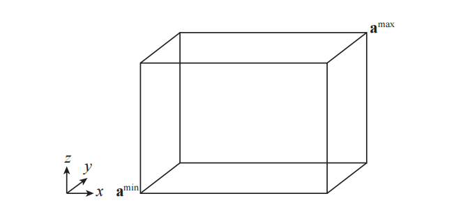

**定义：** 定向包围盒（oriented bounding box，简称OBB）是一种面法线成对正交的box，它是一个任意旋转的AABB。对于一个OBB$B$，可以使用box的中心点$\mathbf{b}^{c}$和三个归一化向量$\mathbf{b}^{u}$、$\mathbf{b}^{v}$、$\mathbf{b}^{w}$来进行描述，这三个向量分别描述了box的侧面方向。它们各自的正半长度分别表示为$h_{u}^{B}$，$h_{v}^{B}$，$h_{w}^{B}$，它们分别代表了中心点$\mathbf{b}^{c}$到各自面中心的距离。图22.3展示了一个三维OBB及其符号表示。

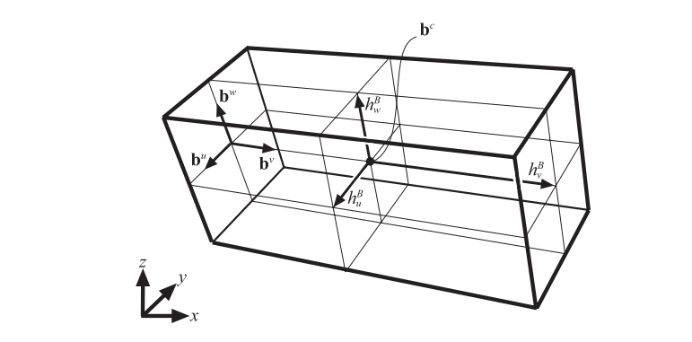

**定义：** 一个k-DOP（discrete oriented polytope，DOP）由$k/2$（其中$k$为偶数）个归一化法线（方向）$\mathbf{n}_i$进行定义，其中$1≤i≤k/2$。每个法线$\mathbf{n}_i$都有两个相关的标量值$d^{min}_i$和$d^{max}_i$，其中$d^{min}_i<d^{max}_i$。每个三元组$(\mathbf{n}_i, d^{min}_i,d^{max}_i)$都描述了一个平板（slab）$S_i$，它是两个平面之间的空间，这个两个平面分别是$\pi_{i}^{\min }: \mathbf{n}_{i} \cdot \mathbf{x}+d_{i}^{\min }=0$和$\pi_{i}^{\max }: \mathbf{n}_{i} \cdot \mathbf{x}+d_{i}^{\max }=0$；各个slab的交集为$\bigcap_{1 \leq l \leq k / 2}  S_{l}$，这是真正的k-DOP体积。k-DOP被定义为贴合物体的最紧密的一组slab \[435]。AABB和OBB可以表示为6-DOP，因为它们都有6个平面，每个平面由3个平板定义。图22.4描述了一个二维的8-DOP。

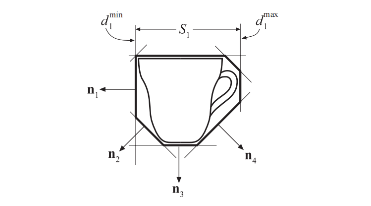

对于凸多面体的定义，使用平面半空间（half-space）的概念是十分有用的。正半空间包括所有$\mathbf{n} \cdot \mathbf{x} +d \geq 0$的点$x$，而负半空间包括$\mathbf{n} \cdot \mathbf{x} +d \le 0$的点$x$。

**定义：** 一个凸多面体（convex polyhedron），是由$p$个平面的负半空间交点所定义的有限体积，其中每个平面的法线都指向远离多面体的方向。

AABB、OBB、k-DOP、以及任何的视锥体，都是凸多面体的特殊形式。其中更加复杂的k-DOP和凸多面体，主要会用于碰撞检测算法，在这些表示方法中，计算底层网格的精确相交情况可能会十分昂贵。用于形成这些包围体的额外平面，可以从物体中裁剪掉额外的体积（不属于该物体），因此所带来额外成本是合理的。

另外两个有趣的包围体是线扫球体（swept sphere）和矩形扫球体（rectangle swept sphere）。它们也分别被称为胶囊体（capsule）和含片体（lozenge），如图22.5所示。

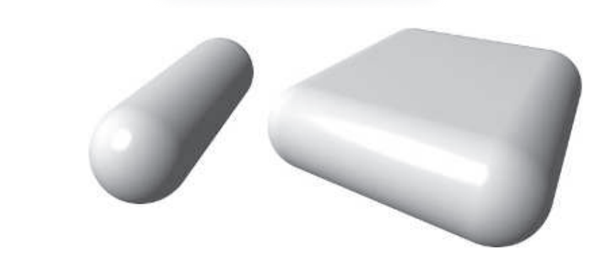

分隔轴（separating axis）指定了一条直线，其中两个不重叠（不相交）的物体，在这条直接上的投影也不重叠。同样地，当一个平面可以插入到两个三维物体之间时，这个平面的法线便定义了一个分离轴。一个重要的相交测试工具也随之而来\[576, 592]，它适用于凸多面体，例如AABB、OBB、k-DOP。它是分离超平面定理（separating hyperplane theorem）的其中一个方面\[189]。

> 这个测试在计算机图形学中有时也被称为“分离轴定理（separating axis theorem）”，它实际上是本书之前版本中的一个用词不当。它本身并不是一个定理，而是分离超平面定理中的一个特例。

**分离轴测试（Separating Axis Test，SAT）**。对于任意两个不相交的凸多面体$A$和$B$，至少存在一个分离轴，它们在这个分离轴上形成区间的投影也是不相交的。如果其中一个物体是凹的，那么这个结论就不成立了。例如：一口井的内壁和井里的水桶也可能并不发生接触，但是没有一个平面可以将它们分离开来。此外，如果$A$和$B$是不相交的，那么它们可以被这样的一个平面分开，这个平面会与下列轴（法线）中的一个正交（即平行于其中一个平面）\[577]：

1.  物体$A$的一个面。
2.  物体$B$的一个面。
3.  每个多面体的一条边（即一个叉积）。

前两个测试表明，如果一个物体完全位于另一个物体中任何一个面的背面（far side），它们就不会发生重叠。前两个测试对针对面进行的，最后一个测试针对物体边缘进行的。为了能够在第三个测试中分离这两个物体，我们想要在一个尽可能靠近这两个物体的平面（该平面的法线是分离轴）上塞进一个平面，并且这个平面与物体之间的距离，不能比其任何一个边缘更近。因此，用于测试的分离轴都是由两个物体边缘的叉积形成的。图22.6展示了对两个box的测试。

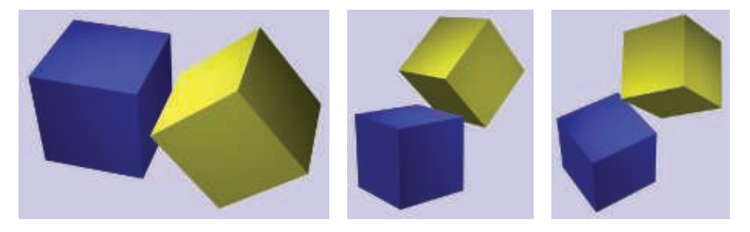

注意，这里凸多面体的定义是自由的。线段和凸多边形（例如三角形）也是凸多面体，虽然它们都是退化的凸多面体，因为它们没有体积。线段没有面，因此不存在第一个测试。这个测试可以用于推导章节22.12中的三角形-box相交测试，以及章节22.13.5中的OBB-OBB相交测试。Gregorius \[597]注意到对任何使用分离轴的相交测试，存在一个重要的优化：时间一致性。如果在某一帧中找到了这个分离轴，那么可以将这个轴存储为下一帧中第一组对测试物体的分离轴。

我们回到所使用方法的讨论中，对相交测试进行优化的一种常用技术是：在早期进行一些简单的计算，从而确定光线或者物体是否与另一个物体不相交。这样的测试被称为拒绝测试（rejection test），如果测试成功了，则我们称这次相交被拒绝了。

本章节中经常使用的另一种方法是，将三维物体投影到“最佳”的正交平面上（$xy$、$xz$或者$yz$），然后在二维平面上来求解问题。

最后，由于数值精度问题，我们通常会在相交测试中使用一个很小的数字，这个数字被表示为$\epsilon$(epsilon)，它的值将因具体的测试情况而异。然而，通常会选择一个适用于问题案例的$\epsilon$（Press等人\[1446]称之为“便利的虚构（convenient fiction）”），而不是进行仔细的舍入误差分析和$\epsilon$调整。在另一种环境中使用的这种代码很可能会由于条件不同而中断。Ericson的书\[435]在几何计算的背景下，对数值健壮性领域进行了深入讨论。这个警告实际上非常到位，因为我们有时确实会为“普通的”、小规模且靠近原点的数据（例如小于100，大于0.1），提供至少是合理的初始$\epsilon$。

## 22.3 创建包围体

给定一个物体集合，为其找到一个紧密贴合的包围体，对于最小化相交测试的开销而言十分重要。对于一条任意的射线，它与凸物体相交的几率与该物体的表面积成正比（章节22.4）。将这个面积最小化可以提高任何相交算法的效率，因为一次拒绝运算永远都要比相交运算快得多。相比之下，对于碰撞检测算法而言，通常最好的方法是对每个BV的体积进行最小化。本小节将会简要介绍对于一个给定的多边形集合，如何寻找最佳或者近似最佳的包围体。

### 22.3.1创建AABB和k-DOP

AABB是创建起来最简单的包围体。沿着每个标准坐标轴，获取多边形顶点集合的最小范围和最大范围，就构成了一个AABB。k-DOP是对AABB的扩展：将顶点投影到k-DOP的每个法线$\mathbf{n}_i$上，并将这些投影极值$(\min,\max)$存储在$d^i_{min}$和$d^i_{max}$中。这两个值定义了该方向上贴合最紧密的slab。所有这些值一起，共同定义了一个最小的k-DOP。

### 22.3.2 创建球体

包围球的构建并不像确定slab的范围那么简单。有许多算法都可以完成这个任务，并且它们在速度和质量之间进行了权衡。一种快速的、恒定时间的单pass算法，是对多边形集合构建一个AABB，然后使用这个包围盒的中心和对角线来构建包围球。这种方法有时会产生不太合适的结果，这可以通过另一个pass来进行改善：从将AABB的中心作为球体BV的中心开始，再次遍历多边形集合中的所有顶点，并找到距离该中心最远的顶点（使用距离的平方进行比较，从而避免开方运算）。然后将这个距离作为新的半径，如图22.7所示。

如果我们要在父球体中嵌套若干个子球体，那么上面这两种技术只需要进行稍微修改即可。如果所有子球体都具有相同的半径，那么可以将子球体的中心视为顶点，并在任意一个子过程结束的时候，将这个子半径添加到父球体的半径中。如果子球体的半径会发生变化，那么可以通过将这些半径纳入边界计算中来找到合理的中心点，从而找到这个AABB的边界。如果执行了第二个pass，则将每个半径都添加到顶点到父节点中心的距离上。

Ritter \[1500]提出了一个简单的算法，该方法可以创建一个接近最优的包围球。其思想是在$x$轴、$y$轴、$z$轴上，分别找到最小值顶点和最大值顶点。对于这三对顶点，找出其中间距最大的那一对，并使用这一对顶点来构建这个包围球，即球体中心位于这对顶点连线的中点处，球体半径等于这对顶点之间距离的一半。对所有其他的顶点进行遍历，检查它们到球心的距离$d$。如果顶点位于球体半径$r$之外（即$d>r$），那么将球体中心向该顶点移动$(d−r)/2$，并将半径设置为$(d + r)/2$，然后继续遍历。这步操作的效果是：将这个新顶点和现有的球体都包围在一个新的球体中。在第二次遍历这个顶点列表之后，包围球内就保证包含了所有的顶点。

Welzl \[1867]提出了一种更加复杂的算法，Eberly \[404, 1574]、Ericson \[435]以及其他人在web上实现了这个算法，并提供了相应的代码。其思想是找到定义一个球面点的支撑集（supporting set）。一个球体可以由表面上的两个、三个或者四个点来进行定义。当发现一个顶点位于当前球体之外时，则将该顶点的位置添加到支撑集中（可能会有一些旧的支撑点从集合中被移除），然后计算新的球体，并再次遍历整个列表。重复执行这个过程，直到生成的球体包含所有顶点为止。虽然这个算法要比之前的算法更加复杂，但是它能够保证找到一个最优的包围球。

Ohlarik \[1315]对Ritter算法和Welzl算法的速度进行了比较。其中 Ritter 这种简化的算法只比基础AABB版本多了20%的开销，但是有时可能会得到更差的结果，因此这两种方法都是值得使用的。而Welzl算法的Eberly实现，虽然复杂度与随机点列表的长度是线性相关的，但是其运行速度要慢一个数量级左右。

### 22.3.3 创建凸多面体

凸多面体是一种一般形式的包围体，凸物体可以用于分离轴测试。AABB、k-DOP、OBB都是凸多面体，但是它们与物体之间的贴合不够紧密，存在一些贴合更加紧密的凸多面体。k-DOP可以被认为是通过添加额外的平面来减少物体的体积；同理，凸多面体可以由任意一组平面来进行定义。通过减少额外的空白体积，可以避免对整个网格执行更加昂贵的相交测试。我们想要对多边形物体进行“收缩包裹（shrink-wrap）”，并找到一组平面，这组平面会形成一个凸包（convex hull），如图22.8所示。凸包可以使用Quickhull算法来找到 \[100, 596]。尽管这个算法名称中包含了Quick，但是实际上这个过程要比线性时间慢，因此通常会作为复杂模型的离线预处理来进行执行。

![图22.8：用Quickhull计算出的茶壶凸包。 \[596\]](images/Chapter-22/202309281711850.png "图22.8：用Quickhull计算出的茶壶凸包。 \[596]")

我们可以看到，这个过程可能会产生大量的平面，每个平面都由凸包上的一个多边形所定义。而在实践中，我们可能并不需要这种级别的精度。我们首先会创建一个原始网格的简化版本，这个版本可能会稍微向外扩展，从而将原始网格完全包含在内，这将会产生一个精度不高但是更加简单的凸包。还要注意的是，对于k-DOP而言，随着$k$的不断增大，所形成的BV会越来越像凸包。

### 22.3.4 创建OBB

一个物体可能会具有一个天然的OBB，因为它可以从一个AABB开始，然后经过一个旋转操作，从而使得AABB变成一个OBB。然而，我们所使用的OBB可能并不是最优的。想象一下，现在有一个旗杆模型，它从建筑物中以一定的角度延伸出来，在其周围的AABB不如沿旗杆延伸的OBB那么紧密。对于没有明显最佳轴的模型而言，想要创建一个具有任意基底方向的OBB，甚至要比寻找合理大小和位置的包围球更加复杂。

为这个问题建立解决算法已经做了大量的相关工作。O'Rourke \[1338]在1985年给出了一个精确解决方案，其时间复杂度为$O(n^3)$。Gottschalk \[577]提出了一种更快、更简单的方法，该方法能够给出最佳OBB的近似值，该方法首先会计算多边形网格的凸包，从而避免凸包内的模型顶点对结果产生影响和偏移。然后再使用线性时间运行的主成分分析（principle component analysis，PCA）来寻找合理的OBB轴。这种方法的缺点在于，最终形成的包围盒有时候是比较松散的，贴合没有那么紧密\[984]。Eberly描述了一种方法，该方法使用最小化技术来计算一个最小体积的OBB。他对包围盒的一组可能方向进行采样，并使用OBB的最小坐标轴来作为数值最小化器（numeric minimizer）的起点。然后使用Powell的方向集方法\[1446]，来寻找最小体积的包围盒。在网上有Eberly执行这个操作的相关代码\[404]。还有一些其他的算法，Chang等人\[254]对之前的工作进行了合理的综述，并介绍了他们自己的最小化技术，该技术使用遗传算法来帮助对解空间进行搜索。

这里我们介绍一下Larsson和Kallberg \[984]提出的算法，这是一种不需要计算凸包，并且能够在线性时间内执行完成的近似最优方法。相较于Gottschalk基于PCA的方法，该方法可以提供更好的质量，并且执行速度要快得多，适合SIMD并行执行，并且作者还提供了实现的代码。该方法首先会为物体构建一个k-DOP，并保存一对（任意一对）接触每个k-DOP slab的对边顶点。所有这些顶点对在一起，被称为物体的极值点（extremal point）。例如：一个26-DOP会生成13对点，其中一些点可能会是相同的顶点，因此可能会给出一个较小的总体集合。这个“最佳OBB”首先会被初始化为物体周围的AABB。然后，该算法会向着能够提供更好拟合OBB的方向来进行处理。会构造一个较大的基础三角形，并从其表面延伸出两个四面体。这会创建一组包含7个三角形的集合，这些三角形可能会产生接近最优的OBB。

相距最远的一对点会构成基础三角形的其中一条边。而在剩余的极值点中，距离这条直线最远的那个顶点会构成三角形的第三个顶点。每个三角形的边和三角形平面上的边法线，都被用来构成潜在新OBB的两个轴。将剩余的极值点投影到这些轴上，从而找到每个OBB（一共3个）在平面上的二维边界，如图22.9所示。使用最小的包围二维矩形，来从3个OBB中选择最优的那个OBB。由于这三个OBB的高度是相同的，即沿三角形法线的距离是相同的，因此仅仅使用每个OBB周围的二维包围盒，就足以决定哪个OBB是最好的了。

然后使用剩余的极值点，在三角形的法线上通过投影操作，来在三维空间中找到这个OBB的具体范围。将这个最终形成的OBB与初始AABB进行对比检查，以确定具体哪个更好。在此过程中找到的两个极值点 (一个在最大高度处，一个在最小高度处) 随后被用于形成两个四面体，然后使用原来的大三角形作为每个四面体的底，构成两个四面体。每个四面体会依次形成三个额外的三角形，并对每个三角形的三个候选OBB再次执行一遍评估过程，就像对原始三角形所做的那样。与之前一样，每个三角形的最佳二维OBB也会沿着其高度进行扩展，但是这次只是为了获得候选OBB的最终大小，而不是形成更多的三角形。总共会形成7个三角形，从每个三角形中生成二维OBB并进行比较，最终获得一个完整的OBB。

一旦我们找到了最佳的OBB，可以将原始物体中的所有点都投影到这个OBB的轴上，并根据需要来增加OBB的大小。最后再对原始的AABB进行检查，看看这个OBB是否更加合适，即是否能够更好地与模型相匹配。得益于在大多数步骤中都会使用一小组极值点，因此整个过程要比之前的技术更快。值得注意的是，作者更喜欢基于表面积而不是体积来对包围盒进行优化，原因我们将在下一小节中进行讨论。

## 22.4 几何概率

常见的几何运算包括一个平面或者一条射线是否与物体相交，以及某个点是否位于物体内部。一个与之相关的问题是：点、射线或者平面与物体相交的相对概率是多少呢？空间中随机一点在物体内部的相对概率是十分明显的：这个概率与物体的体积成正比。因此，对于空间中的一个随机点而言，一个$1×2×3$的box，它包含这个随机点的概率是$1× 1× 1$box的6倍。

对于空间中的任意一条射线而言，这条射线与一个物体相交的相对概率是多少呢？这个问题与另一个问题是类似的：当使用正交投影的时候，一个具有任意朝向的物体，其所覆盖的平均像素数是多少？正交投影可以被认为是观察空间中的一组平行射线，每个像素中都会穿过一条射线。给定一个随机朝向的物体，它所覆盖的像素数量等于与物体相交的数量。

背后的答案出奇地简单：任何凸实体（convex solid）物体的平均投影面积，是其表面积的四分之一。对于屏幕上的一个球体而言，这显然是正确的。这个球体的正投影区域总是一个面积为$πr^2$的圆，而这个球体的表面积为$4πr^2$。这个比例也适用于其他任意朝向的凸物体（例如包围盒或者k-DOP）的平均投影。请参阅Nienhuys的论文\[1278]来了解一种非正式的证明。

球体、box或者其他凸物体，在每个像素上总会有一个正面和一个反面，因此它们的深度复杂度为2。这个概率指标也可以推广到任何多边形上，因为一个（双面）多边形的深度复杂度通常为1。因此，任何多边形的平均投影面积，都是其表面面积的一半。

这个指标在光线追踪文献中被称为表面积启发式方法（surface area heuristic，SAH）\[71, 1096, 1828]，它对于构建一个数据集的高效可见性结构而言非常重要。SAH的其中一个用途就是对比包围体的效率，例如：与一个内接立方体（即一个角点接触到球面的立方体）相比，这个球体被射线击中的相对概率为$1.57 (π/2)$。类似地，与一个球体相比，这个球体的外接立方体被击中的相对概率为$1.91(6/π)$。

这种类型的概率指标在计算LOD等领域非常有用，例如：想象现在有一个又长又薄的物体，它所覆盖的像素数量要比一个圆形物体少得多，虽然二者具有相同大小的包围球。通过包围盒的面积，我们可以提前知道命中率，因此这个长而薄的物体，在视觉影响中的重要性相对较低。

我们现在知道了：一个点被包围的概率与这个空间的体积有关；一条射线与物体相交的概率与这个物体的表面积有关。一个平面与一个box相交的概率，与这个box在三维空间中的范围（extent）总和成正比\[1580]，这个总和被称为物体的平均宽度（mean width），例如：一个边长为1的立方体，其平均宽度为$1 + 1 + 1 = 3$。一个box的平均宽度，与它和平面的相交概率成正比。因此，一个$1 × 1 × 1$的box，其平均宽度为3；一个$1 × 2 × 3$的box，其平均宽度为6，这意味着第二个box与任意平面相交的概率，是第一个box的两倍。

然而，这个总和要大于真正的几何平均宽度（geometric mean width），这里的几何平均宽度是指一个物体在所有可能的方向上，沿固定轴的平均投影长度。对于这个平均宽度的计算而言，不同凸物体类型之间并没有简单的关系（例如表面积）可以直接进行利用。一个直径为$d$的球体，其几何平均宽度为$d$，因为球体在任何方向上的跨度都是相同的。这里我们简单地介绍一下，将一个box的尺寸之和（即它的平均宽度）乘以0.5，就可以得到它的几何平均宽度，这个几何平均宽度可以直接与球体的直径进行比较。因此，一个尺寸为3的$1 × 1 × 1$box，它的几何平均宽度为$3 × 0.5 = 1.5$。而这个box的外接球，是一个直径为$\sqrt{3} = 1.732$的球体。因此，对于一个立方体而言，其外界球与任意平面相交的可能性是这个立方体的$1.732/1.5 = 1.155$倍。

这些概率关系有助于确定各种算法的优势。其中视锥体裁剪就是这样的一个算法，因为它涉及到与包围体相交的平面。这些关系的另一个用途是，确定是否以及在何处分割包含物体的BSP节点才是最好的，从而使得视锥体剔除的性能变得更好（章节19.1.2）。

## 22.5 经验法则

在我们开始研究具体的求交方法之前，这里有一些经验法则，可以让我们获得速度更快、更加健壮、更加精确的相交测试。在设计、发明和实现相交程序的时候，应当牢记以下几点：

-   在早期执行一些计算和比较，使用计算和比较来拒绝或者接受各种类型的相交事件，从而尽早避免后续的计算。
-   如果可能的话，可以利用之前测试的结果。
-   如果使用了多个拒绝测试或者接受测试，那么可以尝试改变它们的内部执行顺序（如果可能的话），因为这样做可能会产生更加高效的测试。不要认为这些看起来很小的改变不会带来任何影响。
-   推迟那些开销很大的计算（尤其是三角函数、平方根和除法），直到真正需要进行计算的时再执行（章节22.8中给出了一种延迟执行昂贵除法的例子）。
-   通过降低问题的维度（例如：从三维降低为二维甚至是一维），通常可以大大简化相交问题。章节22.9中介绍了此类方法的例子。
-   如果一条射线或者一个物体同时与许多其他物体进行测试，可以在测试开始之前，查找那些只需要进行一次的预计算。
-   当相交测试的成本很高时，通常最好是从球体或者是其他简单的BV开始，从而提供第一级的快速拒绝。
-   养成在计算机上进行时间比较的习惯，并使用真实的数据和测试环境来进行时间比较。
-   利用前一帧的结果，例如：如果在前一帧中发现某个轴可以将两个物体分开，那么在下一帧中，优先尝试这个轴可能会是一个好主意。
-   最后，尽量让我们的代码变得健壮。这意味着它应当适用于所有的特殊情况，并且对尽可能多的浮点精度错误不敏感。我们要意识到代码可能具有的任何限制。有关数值健壮性和几何健壮性的更多信息，请参阅Ericson的书\[435]。

最后，我们要强调这样的一个事实：对于一个特定的测试，很难确定是否存在一个“最佳”算法。我们在进行算法评估的时候，通常会使用一组具有不同预定命中率的随机数据，但是实际上这些随机数据只覆盖了部分的真实情况。我们需要将算法在真实场景中进行应用（例如在游戏中），并在该环境中进行最佳评估。使用的测试场景越多，我们对性能问题的理解就越好。对于某些架构而言（例如GPU和wide-SIMD实现），可能会因为需要执行多个拒绝分支而降低部分性能。我们最好要避免做假设，而是创建一个可靠的测试计划。

## 22.6 射线/球体相交

让我们从一个数学上比较简单的相交测试开始，即射线与球体之间的相交测试。正如我们稍后将看到的，如果我们开始考虑所涉及的几何问题，那么这种直接的数学解决方案可以变得更快\[640]。

### 22.6.1 数学解法

球体可以由一个中心点$\mathbf{c}$和一个半径$r$来进行定义。一个更紧凑的（与之前介绍的方程相比）球体隐式方程是：

$$
f(\mathbf{p})=\|\mathbf{p}-\mathbf{c}\|-r=0
\tag{22.5} 
$$

其中点$\mathbf{p}$是球面表面上的任意一点。想要求解射线与球体之间的交点，只需要使用射线$\mathbf{r}(t)$替换方程22.5中的$\mathbf{p}$即可，即：

$$
f(\mathbf{r}(t))=\|\mathbf{r}(t)-\mathbf{c}\|-r=0
\tag{22.6} 
$$

由方程22.1可知，$\mathbf{r}(t)=\mathbf{o}+t \mathbf{d}$，因此方程22.6可以化简为：

$$
\|\mathbf{r}(t)-\mathbf{c}\|-r=0 
\\\Longleftrightarrow
\\
\|\mathbf{o}+t \mathbf{d}-\mathbf{c}\|=r 
\\\Longleftrightarrow
\\
(\mathbf{o}+t \mathbf{d}-\mathbf{c}) \cdot(\mathbf{o}+t \mathbf{d}-\mathbf{c})=r^{2} 
\\\Longleftrightarrow
\\
t^{2}(\mathbf{d} \cdot \mathbf{d})+2 t(\mathbf{d} \cdot(\mathbf{o}-\mathbf{c}))+(\mathbf{o}-\mathbf{c}) \cdot(\mathbf{o}-\mathbf{c})-r^{2}=0 
\\\Longleftrightarrow
\\
t^{2}+2 t(\mathbf{d} \cdot(\mathbf{o}-\mathbf{c}))+(\mathbf{o}-\mathbf{c}) \cdot(\mathbf{o}-\mathbf{c})-r^{2}=0 
\tag{22.7} 
$$

在最后一步推导中，我们假设射线的方向$\mathbf{d}$是归一化的，即$\mathbf{d} \cdot \mathbf{d} = \| \mathbf{d} \|^2 = 1$。毫不意外，我们最终得到的方程是一个二次多项式，这意味着如果射线与球体相交，最多会有两点相交，如图22.10所示。如果方程的解是虚数的（即没有实数解），那么射线就会偏离球体。如果不是，那么我们可以将两个解$t_1$和$t_2$带入到射线方程中，从而计算球面上的交点。

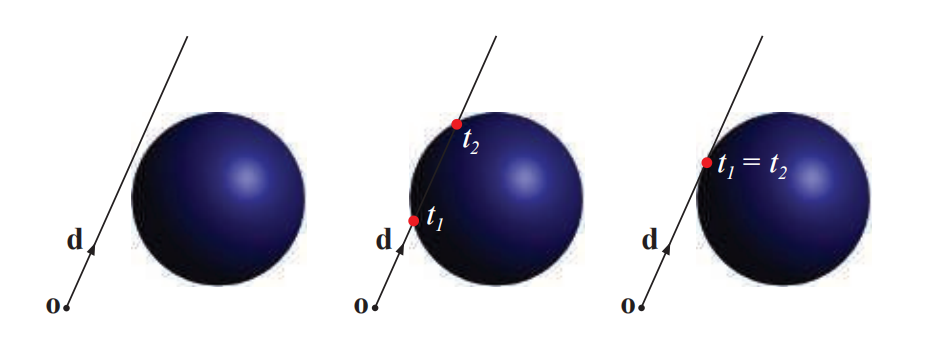

得到的方程22.7也可以写成一个标准的二次方程形式：

$$
t^{2}+2 b t+c=0
\\[1mm]
b=\mathbf{d} \cdot(\mathbf{o}-\mathbf{c})
\\[1mm]
c=(\mathbf{o}-\mathbf{c}) \cdot(\mathbf{o}-\mathbf{c})-r^{2}
\tag{22.8} 
$$

这个二次方程的解如下：

$$
t=-b \pm \sqrt{b^{2}-c}
\tag{22.9} 
$$

请注意，如果$b^{2}-c<0$，那么射线就不会与球体相交，因此可以避免一些计算（例如：平方根和一些加法）。如果这个测试通过，那么可以计算两个解$t_{0}=-b-\sqrt{b^{2}-c}$和$t_{0}=-b+\sqrt{b^{2}-c}$。还需要进行一次额外的比较，来找到$t_0$和$t_1$中的最小正值。请参阅在线网站[realtimerendering.com](realtimerendering.com "realtimerendering.com")上的碰撞检测章节（第25章），来了解另一种数值更加稳定的求解方法\[1446]。

如果从几何角度来看待这些计算，那么我们可以发现一些更好的拒绝测试方法。我们将在下一小节中描述这样程序。

### 22.6.2 优化解法

对于射线/球体相交问题，我们首先观察到的是：位于射线原点后面的点不需要进行相交测试。例如：这通常会发生在拾取的时候。为了尽早检查出这种情况，我们会首先计算一个向量$\mathbf{l}=\mathbf{c}-\mathbf{o}$，它是从射线原点指向球体中心的向量。图22.11中展示了所使用的符号表示。同样，会计算这个向量长度的平方，即$l^{2}=\mathbf{l} \cdot \mathbf{l}$。如果$l^{2}<r^{2}$，那么意味着射线原点位于球体内部，这意味着这条射线肯定会击中球体。如果我们只想检测射线是否击中球体的话，此时我们就可以结束测试了；如果我们想获得精确的交点，那么可以继续进行计算。接下来，计算向量$\mathbf{l}$在光线方向$\mathbf{d}$上的投影：$s=\mathbf{l} \cdot \mathbf{d}$。

现在我们来进行第一个拒绝测试：如果$s<0$，并且射线原点位于球体外部，那么则说明球体位于射线原点背后，因此我们可以拒绝相交。否则，我们需要使用勾股定理来计算从球心到投影点距离的平方：$m^{2}=l^{2}-s^{2}$。这里我们进行第二个拒绝测试，这个测试要比第一个更加简单：如果$m^2 > r^2$，那么射线一定会偏离球体，剩下的计算可以直接省略。如果球体与射线通过了最后的测试，那么这个射线就一定会击中球体，如果这就是我们想要知道的，那么此时也可以退出计算了。

想要找到真正的交点坐标，还需要进行一些工作。首先，计算距离的平方$q^2 = r^2−m^2$。

> 这个标量$r^2$可以只计算一次，然后存储在球体的数据结构中，从而进一步提高效率。在实践中，这种“优化”反而会变慢，因为需要访问更多的内存，这是影响算法性能的一个主要因素。

如图22.11所示，由于$m^2 \le r^2$，因此$q^2\ge 0$，这意味着我们可以计算出$q=\sqrt{q^{2}}$。最后，到交点的距离为$t = s±q$，这个解与章节22.6.1中通过数学求解得到的二次方程的解十分相似。如果我们只对第一个正交点感兴趣，那么我们可以使用$t_1 = s−q$来表示射线原点在球外时的情况，使用$t_2 = s + q$来表示射线原点在球内时的情况。通过将这个$t$值代入到射线方程（方程22.1）中，便可以找到真正的交点（$s$）。

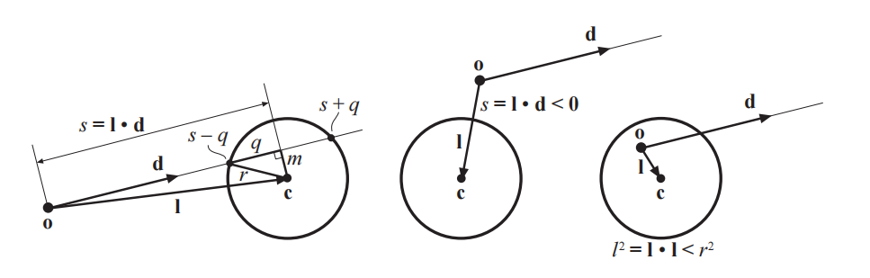

优化版本的伪代码如下所示。这个函数会返回三个参数，分别是：一个布尔值，一个代表相交距离的标量，以及交点坐标。如果射线与球面相交，则会返回一个代表$\mathrm{REJECT}$的布尔值，并将后面两个参数置为默认值0和$(0,0,0)$。如果射线与球面相交，则会返回一个代表$\mathrm{INTERSECT}$的布尔值，并返回射线原点到交点的距离$t$，以及交点坐标$\mathbf{p}$。

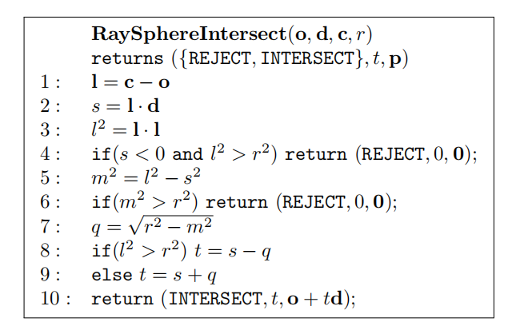

请注意，在伪代码的第3行之后，我们可以判断点$\mathbf{p}$是否位于球体内部，如果我们只想知道射线是否会与球面相交，那么这个函数可以在判断是否相交之后直接结束。并且在第6行之后，这个射线肯定会击中球体。如果我们执行这些操作之后（加、乘、比较等操作），我们会发现，所得到的几何解与之前的代数解十分类似。二者之间的重要区别在于，几何解法中的拒绝测试会在过程中更早地进行，这使得该算法的平均总成本更低。

对于计算射线与其他二次曲面的交点、以及混合物体的交点，存在一些优化的几何算法。例如：圆柱体\[318, 713, 1621]、圆锥体\[713, 1622]、椭球体、胶囊体和含片体\[404]等，都有一些优化方法。

## 22.7 射线/Box相交

下面给出了三种判断射线是否与实心box相交的方法。第一种方法是处理AABB和OBB。第二种是一个变体方法，通常这种方法的速度要更快，但是它只能处理一些更加简单的AABB。第三种方法基于分离轴测试，它只能处理线段与AABB。这里，我们使用章节22.2中BV的定义和符号表示。

### 22.7.1 平板法

射线-AABB相交的一种方案是基于Kay和Kajiya的平板（slab）法\[640, 877]，该方法的灵感来自Cyrus-Beck的直线裁剪算法\[319]。

我们对该方案进行了扩展，使其能够处理更加一般的OBB，它可以返回距离最近的正$t$值（即从射线原点$\mathbf{o}$到交点的距离，如果存在的话）。有关针对AABB的优化，我们将在介绍一般情况之后再进行处理。这个问题是通过计算射线与属于OBB的所有平面的相交$t$值来解决的。这个box会被认为是一个包含三个slab的集合，如图22.12左侧二维示意图。对于每个slab，都有一个最小值$t^{min}_i$和一个最大值$t^{max}_i$，其中$i \in \{u, v, w\}$。下一步是计算方程22.10中的变量：

$$
\begin{aligned} t^{\min } & =\max \left(t_{u}^{\min }, t_{v}^{\min }, t_{w}^{\min }\right), 
\\[1mm]
t^{\max } & =\min \left(t_{u}^{\max }, t_{v}^{\max }, t_{w}^{\max }\right) .\end{aligned}
\tag{22.10} 
$$

现在有一个巧妙的测试：如果$t^{min} \le t^{max}$，那么由这个由射线所定义的直线与box相交；反之就不相交。换句话说，我们找到每个slab的远相交距离和近相交距离。如果找到的最远的“近”距离小于或者等于最近的“远”距离，那么这条射线所定义的直线就击中了box。仔细观察图22.12右侧的插图，我们就可以明白这一点。这两个距离实际上定义了射线与直线的交点，因此，如果这个最近的“远”距离是非负的，则说明射线本身与box相交，即box位于射线的前方。

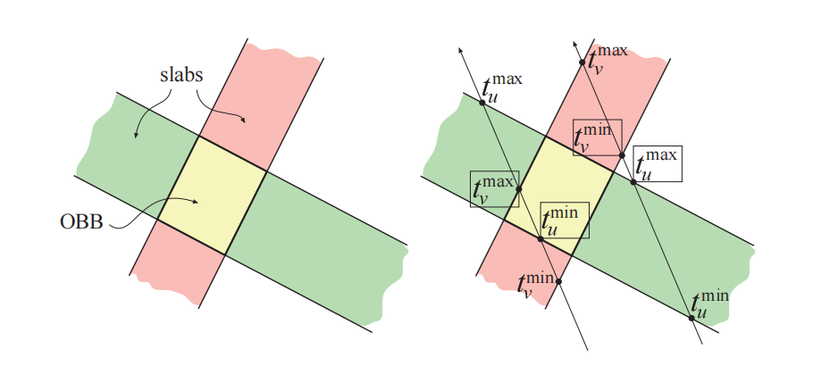

下面给出了射线与OBB相交测试的伪代码，即OBB （$A$）和射线（由方程22.1描述）之间的相交测试。这段代码会返回两个值：第一个值是一个布尔值，代表光线是否与OBB相交（相交或者拒绝），第二个值是射线原点到交点的距离（如果存在的话）。回顾一下，对于OBB $A$而言，其中心点表示为$\mathbf{c}$；$u$、$v$和$w$是这个box归一化的侧边方向；$h_u$、$h_v$和$h_w$是正的半长距离（从中心到各个box面的距离）。

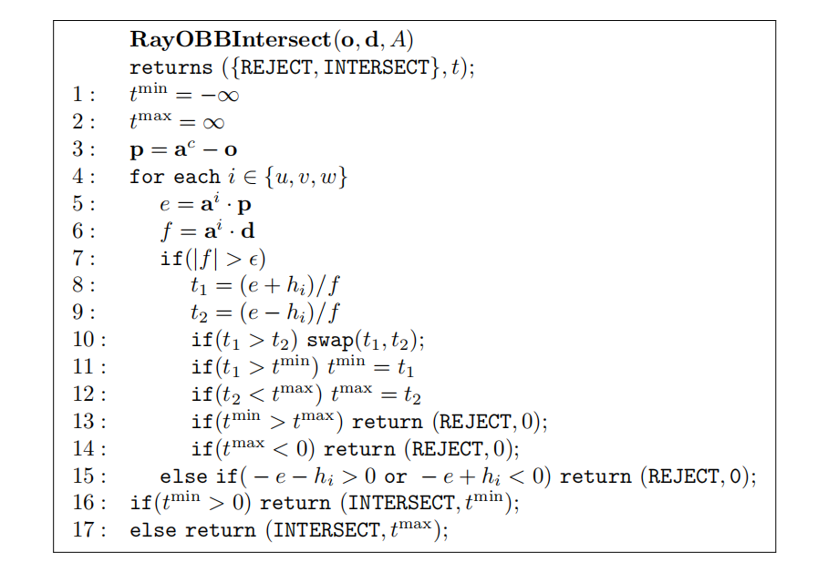

第7行检查了射线方向是否垂直于当前被测试slab的法线。换句话说，它对射线是否平行于slab平面进行了测试，如果二者平行，则不可能相交；如果射线与slab平面不平行，那么二者才可能会相交。请注意，$\epsilon$在这里代表一个很小的数字，约为$10^{-20}$，这是为了避免在除法时发生数值溢出。第8行和第9行中包含了对$f$的除法，实际上，可以先计算一次$1/f$，然后再使用这个值来进行相乘，这样做通常会更快，因为除法运算的开销通常会很大。第10行确保了$t_1$和$t_2$中的最小值会存储在$t_1$中；同样，它们中的最大值会存储在$t_2$中。实际上，并不一定要真的进行这个交换操作；相反，可以对这个分支重复执行第11行和第12行，$t_1$和$t_2$可以在那里改变它们的位置。如果函数在第13行返回，则说明射线没有击中box；类似地，如果在第14行返回，则说明box位于射线原点的后面。如果这条射线平行于待测slab（因此无法与这个slab相交），则执行第15行，它会测试这条射线是否位于slab外面。如果射线位于slab外面，则代表射线不会击中box，此时终止测试。对于执行速度更快的代码\[640]，Haines讨论了一种展开循环的方法，从而可以避免执行一些代码。

这段伪代码中没有展示另外的一个测试，这个测试在实际代码中值得被添加。正如我们在定义射线时所提到的，我们通常想要找到距离射线原点最近的物体。因此，在第15行之后，我们还可以测试$t^{min} \ge  l$，其中$l$是当前射线的长度。这样可以将射线视为一段线段，如果新的交点要大于目前已知的最近交点，则拒绝这个交点。这个测试可以推迟到整个射线与OBB测试完成之后再进行，但是在循环内部尝试早期拒绝，通常会更加高效。

对于OBB的特殊情况（即AABB），还有一些其他优化。例如：第5行和第6行可以更改为$e = p_i$和$f = d_i$，这样可以使得测试速度更快。通常在第8行和第9行中可以使用AABB的最小角$\mathbf{a}^{min}$和最大角$\mathbf{a}^{max}$，这样可以避免一些加法和减法。Kay和Kajiya \[877]以及Smits \[1668]注意到，可以通过允许除0并正确解释处理的结果，从而避免第7行中的判断。Kensler \[1629]给出了这个测试的最短版本代码。Williams等人\[1887]提供了正确处理除0的实现细节，以及其他的一些优化。Aila等人\[16]展示了如何在某些NVIDIA架构上的单个GPU操作中，执行这个最大的最小值测试，反之亦然。也可以使用SAT来对射线与box进行测试，但是无法获得相交距离，有时候这是有用的。

可以将平板法推广开来，用于计算射线与k-DOP、视锥体或者任何凸多面体的交点，相关代码可以在网上找到\[641]。

### 22.7.2 射线斜率法

2007年，Eisemann等人\[410]提出了一种box求交的方法，这种方法似乎要比之前的方法更快。与之前三维测试不同的是，在这个方法中，射线会在二维空间中对box的三个投影来进行测试。该方法的核心想法是：对于每个二维测试，会有两个box角点来定义射线能够“看到”的极限范围，类似于模型的轮廓边缘（silhouette）。为了使得射线与这个box的投影相交，对射线的斜率有一定的要求，它必须要在射线原点和这两个角点所定义的斜率之间。如果三次投影测试都通过了，那么这个射线就一定会击中box。这个方法的速度非常快，因为其中一些的比较项完全依赖于射线的值。通过对这些项进行一次计算，可以高效地将射线与大量box进行比较测试。这个方法可以只返回box是否被击中的布尔值，也可以返回交点的距离，但是需要一些额外的开销。

## 22.8 射线/三角形相交

在实时图形库和API中，三角形通常会被存储为一组具有相应着色法线的顶点，每个三角形都是由三个这样的顶点定义的。三角形所在平面的法线通常不会进行存储，在这种情况下，如果我们需要使用这个法线数据的话，就必须手动计算它。目前有许多针对射线与三角形相交测试的不同方法，其中许多方法首先会计算射线与三角形平面的交点。然后，再将交点和三角形顶点投影到某个坐标轴对齐的平面上（$xy$、$yz$、$xz$），要求这个平面上能够使得三角形的面积最大化。通过这样做，我们可以将问题简化为二维问题，只需要判断（二维）点是否位于（二维）三角形内部即可。有几种这样思路的方法，Haines \[642]对这些方法进行了审查和比较，并在网上提供了相应的代码。在章节22.9中介绍了使用这种技术的一个流行算法。在不同的CPU架构、编译器和命中率\[1065]下，对大量算法进行了评估，我们无法得到一个在所有情况下都是最佳的方法。

这里我们将重点关注这样的一种算法，该算法不会假设我们已知三角形的法线，对于三角形网格而言，这样可以显著节省内存占用。对于动态几何而言，我们并不需要每帧都重新计算三角形的平面方程。我们并不是先针对三角形的平面来与射线进行测试，然后再去检查射线与平面的交点是否位于这个二维三角形的内部，而是会直接针对三角形的顶点执行这个测试。Moller和Trumbore \[1231]讨论了该算法的实现以及优化，这里将使用他们的相关展示内容。Kensler和Shirley \[882]指出，大多数直接在三维空间中进行的射线/三角形测试，在计算上实际是等效的。他们开发了一种新的测试方法，使用SSE来测试三角形上的四条射线，并在这个等价的测试中，使用遗传算法来找到最佳的操作顺序。他们的论文中展示了表现最好的测试代码。请注意，有许多不同的方法都可以做到这一点。例如：Baldwin和Weber \[96]提供了一种具有不同空间速度权衡的方法。这类测试的一个潜在问题是：恰好与三角形边或者顶点相交的射线，可能会被判定为没有击中这个三角形。这意味着一条射线可能会击中两个三角形之间的共享边界，从而穿过网格。Woop等人\[1906]提出了一种射线/三角形相交测试，这个测试在边和顶点上都是无懈可击的。根据所使用的遍历类型，这个方法的性能表现会有所降低。

使用方程22.1中的射线表示方法，来与由三个顶点$\mathbf{p}_1$、$\mathbf{p}_2$、$\mathbf{p}_3$所定义的三角形（即$\triangle \mathbf{p}_{1} \mathbf{p}_{2} \mathbf{p}_{3}$）进行相交测试。

### 22.8.1 相交算法

三角形上的一个点$\mathbf{f}(u, v)$由下面这个显式方程给出：

$$
\mathbf{f}(u, v)=(1-u-v) \mathbf{p}_{0}+u \mathbf{p}_{1}+v \mathbf{p}_{2}
\tag{22.11} 
$$

其中$(u, v)$是重心坐标，它必须满足$u≥0$，$v≥0$，$u + v≤1$。请注意，这里的重心坐标$(u, v)$可以用于纹理映射，以及法线插值或者颜色插值等操作。也就是说，$u$和$v$代表了每个顶点对特定位置的贡献权重，$w =(1−u−v)$是第三个权重。这些坐标在其他的一些资料中通常被表示为$\alpha$、$\beta$和$\gamma$。这里为了可读性和符号的一致性，我们仍然使用$u$、$v$、$w$来进行表示，如图22.13所示。

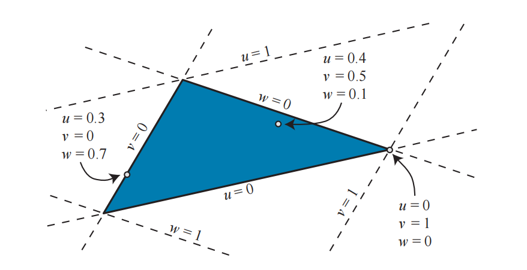

计算射线$\mathbf{r}(t)$和三角形$\mathbf{f}(u, v)$的交集，即$\mathbf{r}(t) = \mathbf{f}(u, v)$，结果为：

$$
\mathbf{o}+t \mathbf{d}=(1-u-v) \mathbf{p}_{0}+u \mathbf{p}_{1}+v \mathbf{p}_{2}
\tag{22.12} 
$$

整理可得：

$$
\left(\begin{array}{ccc}-\mathbf{d} & \mathbf{p}_{1}-\mathbf{p}_{0} & \mathbf{p}_{2}-\mathbf{p}_{0}\end{array}\right)\left(\begin{array}{c}t \\ u \\ v\end{array}\right)=\mathbf{o}-\mathbf{p}_{0}
\tag{22.13} 
$$

这意味着重心坐标$(u, v)$，以及从射线原点到交点的距离$t$，可以通过求解这个线性方程组得到。

方程22.13中的操作，在几何上可以理解为：将这个三角形平移到原点上，并将其转换为$y$和$z$方向上的单位三角形，并使得射线方向与$x$轴对齐，如图22.14所示。如果记方程22.13中的矩阵为$\mathbf{M}=\left(\begin{array}{lll}-\mathbf{d} & \mathbf{p}_{1}-\mathbf{p}_{0} & \mathbf{p}_{2}-\mathbf{p}_{0}\end{array}\right)$，那么方程22.13与$\mathbf{M}^{-1}$相乘即可获得解，即$(t,u,v)^T$。

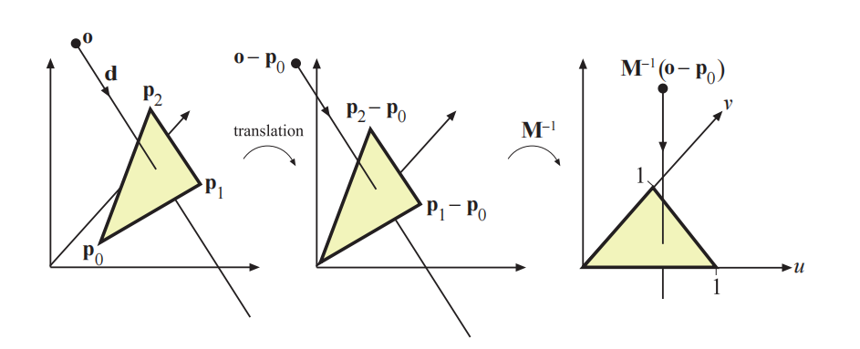

设$\mathbf{e}_{1}=\mathbf{p}_{1}-\mathbf{p}_{0}$，$\mathbf{e}_{2}=\mathbf{p}_{2}-\mathbf{p}_{0}$，$\mathbf{s}=\mathbf{o}-\mathbf{p}_{0}$，利用Cramer法则，可以获得方程22.13的解：

$$
\left(\begin{array}{c}t \\ u \\ v\end{array}\right)=\frac{1}{\operatorname{det}\left(-\mathbf{d}, \mathbf{e}_{1}, \mathbf{e}_{2}\right)}\left(\begin{array}{c}\operatorname{det}\left(\mathbf{s}, \mathbf{e}_{1}, \mathbf{e}_{2}\right) \\ \operatorname{det}\left(-\mathbf{d}, \mathbf{s}, \mathbf{e}_{2}\right) \\ \operatorname{det}\left(-\mathbf{d}, \mathbf{e}_{1}, \mathbf{s}\right)\end{array}\right)
\tag{22.14} 
$$

根据线性代数的一些知识，我们可以知道：

$$
\operatorname{det}(\mathbf{a}, \mathbf{b}, \mathbf{c})=|\mathbf{a} \mathbf{b} \mathbf{c}|=-(\mathbf{a} \times \mathbf{c}) \cdot \mathbf{b}=-(\mathbf{c} \times \mathbf{b}) \cdot \mathbf{a}
$$

因此，方程22.14可以重写为：

$$
\left(\begin{array}{c}t \\ u \\ v\end{array}\right)=\frac{1}{\left(\mathbf{d} \times \mathbf{e}_{2}\right) \cdot \mathbf{e}_{1}}\left(\begin{array}{c}\left(\mathbf{s} \times \mathbf{e}_{1}\right) \cdot \mathbf{e}_{2} \\ \left(\mathbf{d} \times \mathbf{e}_{2}\right) \cdot \mathbf{s} \\ \left(\mathbf{s} \times \mathbf{e}_{1}\right) \cdot \mathbf{d}\end{array}\right)
\\[2mm]
=\frac{1}{\mathbf{q} \cdot \mathbf{e}_{1}}\left(\begin{array}{c}\mathbf{r} \cdot \mathbf{e}_{2} \\ \mathbf{q} \cdot \mathbf{s} \\ \mathbf{r} \cdot \mathbf{d}\end{array}\right)
\tag{22.15} 
$$

其中$\mathbf{q}=\mathbf{d} \times \mathbf{e}_{2}$，$\mathbf{r}=\mathbf{s} \times \mathbf{e}_{1}$。这些项只需要提前计算一次，用来加快计算速度。

如果我们能够负担得起额外的存储空间，可以对这个测试进行重新排序，从而减少计算次数。方程22.15可以改写为：

$$
\begin{aligned}\left(\begin{array}{l}t \\ u \\ v\end{array}\right) & =\frac{1}{\left(\mathbf{d} \times \mathbf{e}_{2}\right) \cdot \mathbf{e}_{1}}\left(\begin{array}{c}\left(\mathbf{s} \times \mathbf{e}_{1}\right) \cdot \mathbf{e}_{2} \\ \left(\mathbf{d} \times \mathbf{e}_{2}\right) \cdot \mathbf{s} \\ \left(\mathbf{s} \times \mathbf{e}_{1}\right) \cdot \mathbf{d}\end{array}\right) 
\\[1mm]
 & =\frac{1}{-\left(\mathbf{e}_{1} \times \mathbf{e}_{2}\right) \cdot \mathbf{d}}\left(\begin{array}{c}\left(\mathbf{e}_{1} \times \mathbf{e}_{2}\right) \cdot \mathbf{s} \\ (\mathbf{s} \times \mathbf{d}) \cdot \mathbf{e}_{2} \\ -(\mathbf{s} \times \mathbf{d}) \cdot \mathbf{e}_{1}\end{array}\right)
\\[1mm]
&=\frac{1}{-\mathbf{n} \cdot \mathbf{d}}\left(\begin{array}{c}\mathbf{n} \cdot \mathbf{s} \\ \mathbf{m} \cdot \mathbf{e}_{2} \\ -\mathbf{m} \cdot \mathbf{e}_{1}\end{array}\right),\end{aligned}
\tag{22.16} 
$$

其中$\mathbf{n}=\mathbf{e}_{1} \times \mathbf{e}_{2}$是三角形的非归一化法线，对于静态几何物体而言，它是一个常量；以及$\mathbf{m}=\mathbf{s} \times \mathbf{d}$。如果我们为每个三角形存储$\mathbf{p}_0$，$\mathbf{e}_1$，$\mathbf{e}_2$和$\mathbf{n}$，我们可以避免许多射线与三角形相交测试中的计算量，大部分降低计算量的收益都来自于避免了叉乘计算。但是需要注意的是，这样的存储方法违背了该算法的原始思想，即在每个三角形上存储最少的信息。然而，如果对于这个测试而言，速度指标是最重要的，那么这可能也是一个合理的选择。这里还有另一个权衡，即我们在降低计算开销的同时，还增加了更多的内存访问，内存访问也会降低一些性能表现。只有经过仔细全面的测试，才能最终证明具体哪种方法才是最快的。

### 22.8.2 实现

下面的伪代码对该算法进行了总结。除了返回射线是否与三角形相交之外，该算法还会返回前面所描述的三元组$(u, v, t)$。下面的代码并不会剔除背面三角形，它将会返回$t$值为负的交点；如果需要的话，这些交点也可以被剔除。

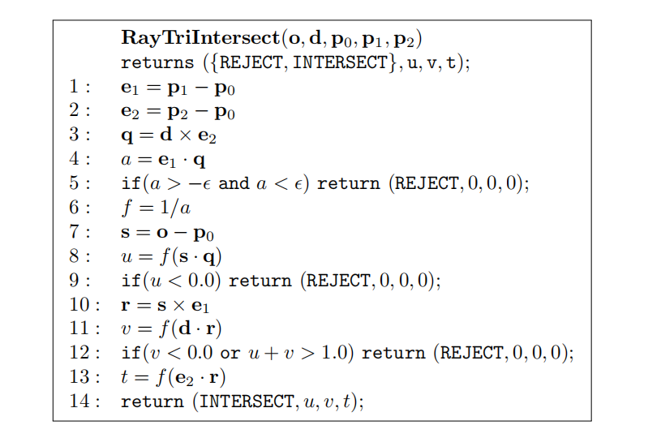

其中有几行可能需要解释一下。第4行计算了$a$，即矩阵$\mathbf{M}$的行列式。接下来的第五行，是一个避免行列式接近于零的检验。使用一个适当的$\epsilon$，能够使得这个算法变得更加健壮；对于浮点数精度和一些“正常”的条件而言，$\epsilon=10^{-5}$是一个比较好的选择。在第9行中，将$u$的值与三角形的一条边进行比较，如果刚好位于三角形的一条边上，那么$u = 0$。

可以在网上找到该算法的C语言代码（包括剔除和非剔除的版本）\[1231]，这个C语言代码有两个分支：其中一个用于高效地剔除所有背面三角形，另一个用于对双面三角形执行相交测试。所有的计算都会被延迟到需要的时候再进行，例如：直到我们确认$u$的值在允许的范围内，才会去计算$v$的值（这一点在伪代码中也可以看到）。

单面三角形的相交测试，会消除了所有行列式值为负的三角形。这个过程允许将程序中唯一的除法操作延迟进行，直到一个交叉点被确认之后，我们才真正执行这个除法操作。

## 22.9 射线/多边形相交

尽管三角形是最常见的渲染图元，但是拥有一个计算射线和多边形相交的算法还是非常有用的。一个包含$n$个顶点的多边形，由一个有序的顶点列表$\{\mathbf{v}_0，\mathbf{v}_1， \cdots ， \mathbf{v}_{n−1}\}$进行定义，其中当$0 \le i < n-1$的时候，顶点$\mathbf{v}_i$与$\mathbf{v}_{i+1}$形成一条边；这个多边形最终被从$\mathbf{v}_{n−1}$到$\mathbf{v}_0$的边所封闭。这个多边形所在的平面可以表示为$\pi_{p}: \mathbf{n}_{p} \cdot \mathbf{x}+d_{p}=0$。

我们首先计算射线（方程22.1）和$\pi_{p}$之间的交点，这可以很容易地通过用使用射线方程替换$\mathbf{x}$来完成。这个方程的解如下：

$$
\mathbf{n}_{p} \cdot(\mathbf{o}+t \mathbf{d})+d_{p}=0 \quad \Longleftrightarrow \quad t=\frac{-d_{p}-\mathbf{n}_{p} \cdot \mathbf{o}}{\mathbf{n}_{p} \cdot \mathbf{d}}
\tag{22.17} 
$$

如果判别式$\left|\mathbf{n}_{p} \cdot \mathbf{d}\right|<\epsilon$，其中$\epsilon$是一个极小的数，那么我们可以认为射线与多边形平行，不存在交点。在这个计算中，$\epsilon$可以取$10^{−20}$或者更小的值，其目的是避免在进行除法运算时发生数值溢出。这里我们忽略射线位于多边形平面内的情况。

如果通过了判别式，那么我们就可以计算射线与多边形平面的交点$\mathbf{p}$： $\mathbf{p}=\mathbf{o}+t \mathbf{d}$，其中t值就是方程22.17中的值。然后，判断交点$\mathbf{p}$是否位于多边形内部的问题，会由三维问题简化为一个二维问题。这是通过将多边形的所有顶点以及交点$\mathbf{p}$，投影到$xy-$、$xz-$或者$yz-$的其中一个平面上来实现的，具体要投影在哪个平面上，需要使得投影后的多边形面积最大。也就是说，可以跳过绝对值最大的坐标分量$\max \left(\left|n_{p, x}\right|,\left|n_{p, y}\right|,\left|n_{p, z}\right|\right)$，并将其他分量保留为二维坐标。例如：给定一个法线$(0.6，- 0.692,0.4)$，其中$y$分量的绝对值最大，因此所有的$y$坐标都会被忽略。这里选择最大的那个绝对值，是为了避免投影到一个可能产生退化三角形（零面积）的平面上。请注意，这个分量信息可以进行预先计算，并存储在多边形中以提高效率。在这个投影过程中，多边形和交点的拓扑结构是不变的（即假设这个多边形是平坦的；有关这个主题的更多信息，详见章节16.2）。投影过程如图22.15所示。

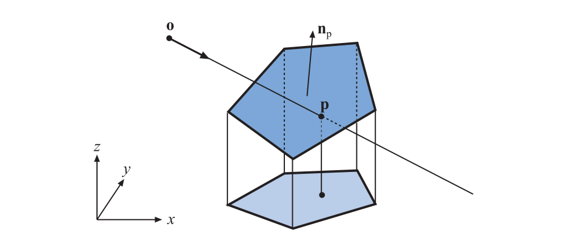

剩下的问题是，这个射线与平面的二维交点$\mathbf{p}$，是否位于这个二维多边形中。在这里，我们将回顾其中一个十分有用的算法——“交叉点（crossings）”测试。Haines \[642]、Schneider和Eberly \[1574]对判断二维点是否位于多边形内部的策略进行了广泛的调研。在计算几何的相关文献中可以找到更正式的处理方法\[135, 1339, 1444]。Lagae和Dutre \[955]基于Moller和Trumbre的射线/三角形检验方法，提供了一种快速判断射线/四边形相交的方法。Walker \[1830]提供了一种能够快速测试10个以上顶点多边形的方法。Nishita等人\[1284]讨论了具有弯曲边缘形状的点包含测试。

### **22.9.1 交叉**点**测试**

交叉点测试基于Jordan曲线定理，这是拓扑学中的结果。如果从某个点出发，沿平面任意方向的射线会穿过奇数条的多边形边界，那么这个点位于多边形内部。Jordan曲线定理实际上只适用于非自相交的环。而对于自相交的环来说，这种射线测试会导致多边形内部的一些区域被认为是外部的，如图22.16所示。这种检验也称为奇偶校验（parity， even-odd test）。

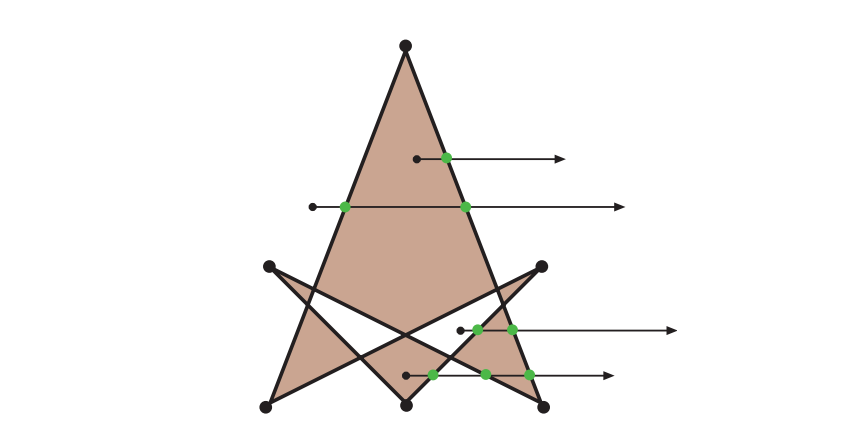

交叉点测试算法的工作原理是：从点$\mathbf{p}$的投影向$x$轴正方向（或者任意方向，使用$x$正方向的编码很高效）发射一条射线，然后计算多边形边界与这条射线之间的交叉次数。正如Jordan曲线定理所证明的那样，相交次数为奇数，代表该点位于多边形内部。

也可以将测试点$\mathbf{p}$放置在原点处，针对$x$轴正方向上的（平移后的）边进行测试，如图22.17所示。如果多边形边界的$y$坐标具有相同的符号，则说明这条边界不会与$x$轴相交；否则说明可以与$x$轴相交。然后再检查$x$坐标，如果二者都为正，则增加交叉点的数量，因为测试射线必须到达这条边。如果二者的正负号不同，则必须计算边界线与$x$轴交点的坐标，如果交点的$x$正分量为正，则增加交叉的数量。

在图22.17中，所有的封闭区域都可以被归类为内部区域。这个变体测试方法找到了缠绕数（winding number），即多边形环路围绕某个测试点的次数，详见Haines的论文\[642]。

当测试射线与多边形顶点相交时可能会出现一些问题，因为此时可能会检测到两个交叉点。这些问题是这样进行解决的：可以认为多边形顶点位于射线上方的无穷小处；实际上，这是通过将$y≥0$的顶点解释为位于$x$轴（射线）上方来实现的。这样代码将会变得更加简洁和高效，因为不会有顶点与射线相交\[640]。

下面是一种高效交叉点测试的伪代码。它的灵感来自Joseph Samosky \[1537]和Mark Haigh-Hutchinson的工作，其代码可以在网上找到\[642]。它将一个二维测试点$\mathbf{t}$，与顶点从$\mathbf{v}_0$到$\mathbf{v}_{n-1}$的多边形$P$进行比较。

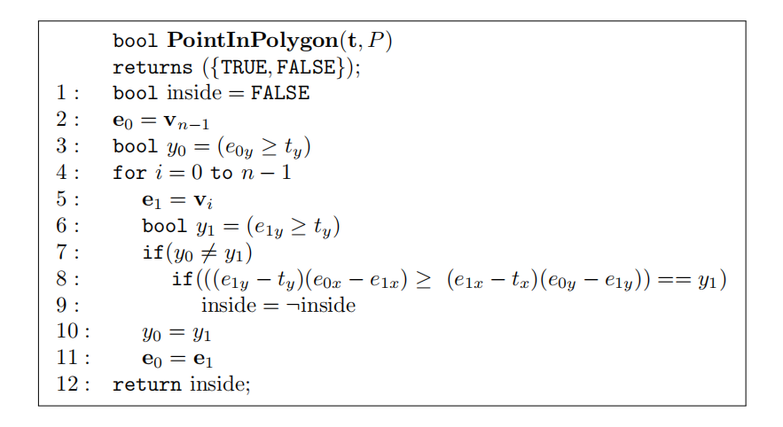

其中第3行检查了多边形最后一个顶点的$y$值，是否大于等于待测点$\mathbf{t}$的$y$值，并将结果存储在布尔值$y_0$中。换句话说，它实际上是测试了第一条边的第一个端点，是位于$x$轴之上还是$x$轴之下。第7行测试了端点$e_0$和端点$e_1$是否位于$x$轴的不同侧。如果是，那么第8行则测试$x$轴上的截距是否为正。实际上，上面的伪代码要更快一些：为了避免在计算截距时通常需要进行的除法，我们在这里将执行一个消号（sign-canceling）操作。通过将inside取反，第9行记录了一个交叉点。第10 行到第12行则转移到了对下一个顶点进行迭代。

在上述伪代码中，我们没有在第7行之后执行测试，以查看与测试点相比，两个端点的$x$坐标是更大还是更小。虽然我们在算法中使用了快速接受或者快速拒绝这些类型边界的测试，但是基于上述伪代码的实际代码，在没有这个测试的情况下通常会运行得更快。一个主要因素是待测多边形的顶点数量——顶点数量越多，先检查$x$坐标的差异就会越高效。

交叉点测试的优点在于相对快速和健壮，并且不需要额外的信息或者是对多边形进行预处理。这个方法的一个缺点在于，除了能够判断一个点是位于多边形内部还是外部之外，它不会产生任何的其他结果。其他的一些方法（例如章节22.8.1中的射线/三角形测试），还可以计算重心坐标，用于对测试点的额外信息进行插值\[642]。请注意，重心坐标可以进行一些扩展，从而处理包含3个以上顶点的凸多边形和凹多边形\[474, 773]。Jimenez等人\[826]提供了一种基于重心坐标的优化算法，该算法的目标是包含多边形边缘上的所有点，并与交叉点测试相竞争。

判断一个点是否位于由线段和Bezier曲线所组成的封闭轮廓内部，是一个更加一般的问题。Bezier曲线可以使用类似的方式进行算法执行，通过对射线的交叉点进行计数，来判断点是否位于曲线内部。Lengyel \[1028]为这个过程提供了一种健壮的算法，在像素着色器中可以使用这种算法来渲染文本。

## 22.10 平面/Box相交

我们能够知道一点到平面的距离，只要把这个点代入到平面方程$\pi: \mathbf{n} \cdot \mathbf{x}+d=0$中即可。计算结果的绝对值就是这个点到平面的距离。平面/球体的相交测试也很简单：将球心带入到平面方程中即可，来看看计算结果的绝对值是否小于或者等于球体的半径。

判断一个box是否与平面相交的一种方法是：将这个box的所有顶点都代入到平面方程中。如果结果的符号不一致（或者为0），那么说明这些顶点位于平面的两侧（或者位于平面上），因此可以检测到相交。还有一些更加巧妙、更加快速的方法来完成这个测试，我们将在接下来的两小节中进行介绍，其中一节针对AABB，另一节针对OBB。

这两种方法背后的思想都是：只需要将八个顶点中的两个代入到平面方程中即可。对于任意朝向的box而言，无论它是否与平面相交，box上存在两个沿着对角线相对的顶点，当沿着任意平面的法线进行测量时，这两个顶点之间的距离都是最大距离。每个box有8个顶点，一共有四条对角线。让每条对角线方向与平面法线进行点乘，其中值最大的那个对角线代表了这两个相距最远的顶点。通过对这两个顶点进行测试，可以将这个box作为一个整体，来与平面进行相交测试。

### 22.10.1 AABB

假设我们现在有一个AABB $B$。它由一个中心点$\mathbf{c}$和一个正半对角向量$\mathbf{h}$定义。注意，这个中心点$\mathbf{c}$和正半对角向量$\mathbf{h}$可以很容易地从$B$的最小顶点$\mathbf{b}^{min}$和最大顶点$\mathbf{b}^{max}$中推导出来，即：

$$
\mathbf{c}=\left(\mathbf{b}^{\max }+\mathbf{b}^{\min }\right) / 2
\\[1mm]
\mathbf{h}=\left(\mathbf{b}^{\max }-\mathbf{b}^{\min }\right) / 2 
$$

现在，我们要用平面$\mathbf{n} \cdot \mathbf{x}+d=0$来对这个AABB进行相交测试。有一种非常快的方法可以执行这个测试，其想法是计算这个box投影到平面法线平面$\mathbf{n}$上的“范围（extent）”，这里记为$e$。理论上，这可以通过将box所有8条不同的半对角线都投影到法线上，并选择其中最长的一条来完成。但是在实践中，这个过程可以快速实现为：

$$
e=h_{x}\left|n_{x}\right|+h_{y}\left|n_{y}\right|+h_{z}\left|n_{z}\right|
\tag{22.18} 
$$

为什么方程22.18等价于找到八个不同对角线投影中的最大值呢？这8条对角线是这样的若干组合：$\mathbf{g}^{i}=\left( \pm h_{x}, \pm h_{y}, \pm h_{z}\right)$，而我们想要计算所有8个$i$对应的$\mathbf{g}^{i} \cdot \mathbf{n}$。当点积中的每一项都为正时，点积$\mathbf{g}^{i} \cdot \mathbf{n}$将达到最大值。对于其中的$x$项，当$n_x$和$h^i_x$具有相同符号的时候，才会出现这种最大情况，由于我们已经知道$h_x$是正的了，因此我们可以通过$h_{x}\left|n_{x}\right|$来计算这个最大项。对于$y$项和$z$项重复这样的操作，便可以得到方程22.18。

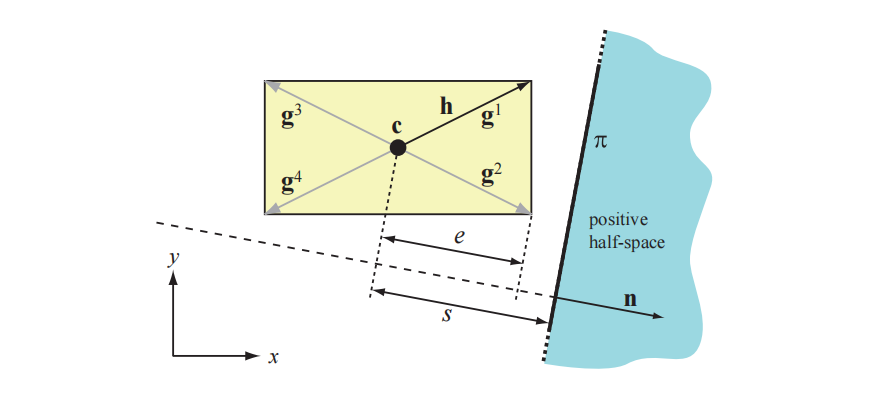

接下来，我们计算从中心点$\mathbf{c}$到这个平面的带符号距离$s$。这是通过$s=\mathbf{c} \cdot \mathbf{n}+d$来完成的。图22.18给出了$s$和$e$的示意图。假设平面的“外部”是正半空间，我们可以进行简单地测试，如果$s−e >0$，则代表box完全位于平面外部；类似地，如果$s+e <0$，则代表box完全位于平面内部。否则，这个box会与平面相交。这项技术基于了Ville Miettinen的想法，以及他的巧妙实现。其伪代码如下：

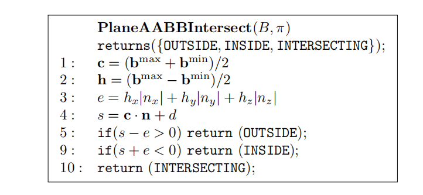

### 22.10.2 OBB

在运行过程中对OBB和平面进行相交测试，与上一小节中的AABB与平面的相交测试略有不同。只有box的“范围”$e$需要进行一些修改，具体的修改如下：

$$
e=h_{u}^{B}\left|\mathbf{n} \cdot \mathbf{b}^{u}\right|+h_{v}^{B}\left|\mathbf{n} \cdot \mathbf{b}^{v}\right|+h_{w}^{B}\left|\mathbf{n} \cdot \mathbf{b}^{w}\right|
\tag{22.19} 
$$

回顾一下，$\left(\mathbf{b}^{u}, \mathbf{b}^{v}, \mathbf{b}^{w}\right)$是OBB的坐标系轴，$\left(h_{u}^{B}, h_{v}^{B}, h_{w}^{B}\right)$是box沿着这些轴的长度，详见章节22.2中的OBB定义。

## 22.11 三角形/三角形相交

由于三角形是图形硬件所使用的最重要（和针对性优化）的图元，因此对这类数据进行碰撞检测也是很自然的。因此，在碰撞检测算法的最底层，通常会有一个判断两个三角形是否相交的例程。给定两个三角形$T_{1}=\triangle \mathbf{p}_{1} \mathbf{p}_{2} \mathbf{p}_{3}$和$T_{2}=\Delta \mathbf{q}_{1} \mathbf{q}_{2} \mathbf{q}_{3}$（二者分别位于平面$\pi_1$和$\pi_2$上），我们想确定它们是否相交。

从较高的层次来看，我们通常会首先检查三角形$T_1$是否与平面$\pi_2$相交，以及三角形$T_2$是否与平面$\pi_1$相交\[1232]。如果其中的任何一个测试失败的话，就说明这两个三角形不可能有交集。假设这两个三角形不是共面的，我们能够知道这两个平面（$\pi_1$和$\pi_2$）的交集是一条直线$L$，如图22.19所示。由图可知，如果这两个三角形相交，那么它们在$L$上的交点也会重叠。否则，这两个三角形就没有交集。有许多不同的方法可以实现这一点，接下来我们将介绍Guigue和Devillers的方法\[622]。

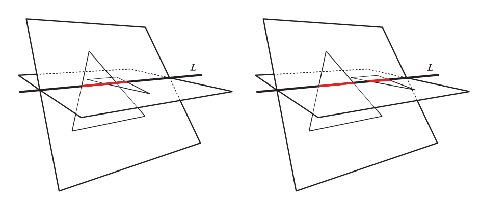

在这个实现中，对$\mathbf{a}$、$\mathbf{b}$、$\mathbf{c}$、$\mathbf{d}$四个三维向量大量使用了下面这个$4 × 4$行列式：&#x20;

$$
[\mathbf{a}, \mathbf{b}, \mathbf{c}, \mathbf{d}]=-\left|\begin{array}{cccc}a_{x} & b_{x} & c_{x} & d_{x} \\ a_{y} & b_{y} & c_{y} & d_{y} \\ a_{z} & b_{z} & c_{z} & d_{z} \\ 1 & 1 & 1 & 1\end{array}\right|=(\mathbf{d}-\mathbf{a}) \cdot((\mathbf{b}-\mathbf{a}) \times(\mathbf{c}-\mathbf{a}))
\tag{22.20} 
$$

在几何上，方程22.20有一个直观的解释。其中的叉乘$(\mathbf{b}-\mathbf{a}) \times(\mathbf{c}-\mathbf{a})$可以看作是计算三角形$\triangle \mathbf{abc}$的法线。通过取这个法线与向量$\mathbf{ad}$（$\mathbf{d}-\mathbf{a}$）之间的点积，如果点$\mathbf{d}$位于三角形$\triangle \mathbf{abc}$平面的正半空间中，那么我们将会得到一个正值。另一种解释是，行列式的符号将会告诉我们，沿着$\mathbf{b}-\mathbf{a}$方向的螺旋方向（screw）是否与$\mathbf{d}-\mathbf{c}$的相同，如图22.20所示。

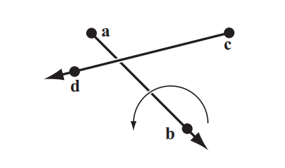

我们首先测试三角形$T_1$是否与平面$\pi_2$相交，然后判断三角形$T_2$是否与平面$\pi_1$相交。这可以使用方程22.20中的特殊行列式来完成，通过计算$\left[\mathbf{q}_{1}, \mathbf{q}_{2}, \mathbf{q}_{3}, \mathbf{p}_{1}\right]$，$\left[\mathbf{q}_{1}, \mathbf{q}_{2}, \mathbf{q}_{3}, \mathbf{p}_{2}\right]$，$\left[\mathbf{q}_{1}, \mathbf{q}_{2}, \mathbf{q}_{3}, \mathbf{p}_{3}\right]$。其中第一个测试相当于计算三角形$T_2$的法线，然后测试点$\mathbf{p}_1$位于哪一半空间中。如果这些行列式的正负号都相同且不为零，那么则说明$T_1$与平面$\pi_2$不可能有交集，测试到此结束。如果行列式的值全部为零，那么则说明这两个三角形共面，后续需要进行单独的相交测试。否则，我们需要继续测试三角形$T_2$是否与平面$\pi_1$相交，这里使用的是相同的测试方法。

此时，我们将计算直线$L$上的两个区间$I_1 = [i, j]$和$I_2 = [k, l]$，其中区间$I_1$是根据三角形$T_1$计算的，区间$I_2$是根据三角形$T_2$计算的。为了实现这一点，我们需要将每个三角形的顶点重新进行排序，使得第一个顶点单独位于另一个三角形平面的一侧。如果区间$I_1$与区间$I_2$重叠，当且仅当$k≤j$且$i≤l$时，这两个三角形才会相交。为了实现$k≤j$，我们可以使用行列式的符号检验（方程22.20），请注意$j$是由$\mathbf{p}_{1} \mathbf{p}_{2}$推导而来，$k$是由$\mathbf{q}_{1} \mathbf{q}_{2}$推导而来的。利用行列式计算的“螺旋检验”解释，我们可以得出，当$\left[\mathbf{p}_{1}, \mathbf{p}_{2}, \mathbf{q}_{1}, \mathbf{q}_{2}\right] \leq 0$时，$k≤j$。因此，最后的检验（$k≤j$且$i≤l$）为：

$$
\left[\mathbf{p}_{1}, \mathbf{p}_{2}, \mathbf{q}_{1}, \mathbf{q}_{2}\right] \leq 0 \quad and \quad\left[\mathbf{p}_{1}, \mathbf{p}_{3}, \mathbf{q}_{3}, \mathbf{q}_{1}\right] \leq 0
\tag{22.21} 
$$

整个测试从6个行列式测试（两次三角形-平面测试）开始，其中前3个测试共用第一个参数，因此可以重用很多中间计算。原则上来说，行列式可以使用许多更小的$2 × 2$子行列式来进行计算，当这些子行列式重复出现在$4 × 4$行列式中时，计算结果可以进行共享。网上可以找到这个测试的相应代码\[622]，也可以对代码进行扩充，来计算实际的交点线段。

如果两个三角形共面，则可以将它们投影到与一个轴对齐的平面上，在该平面上使得投影三角形的面积最大化（章节22.9）。然后，进行一个简单的二维三角形重叠测试。首先，测试三角形$T_1$的所有闭合边（包括端点）是否与三角形$T_2$的闭合边相交。如果我们能够找到任何交点，则说明这两个三角形相交。否则，我们就必须测试三角形$T_1$是否被完全包含在三角形$T_2$中，反之亦然。这可以通过对三角形$T_1$的每个顶点，针对三角形$T_2$进行三角形内点测试来实现（章节22.8），反之亦然。

请注意，分离轴测试可以用于推导出一个三角形与三角形的相交测试。但是这里我们只介绍了Guigue和Devillers \[622]所提出的一个测试，它要比使用SAT算法更快。还有一些其他的算法可以实现三角形与三角形之间的相交测试\[713, 1619, 1787]。由于架构和编译器之间的差异、以及预期命中率的差异，这意味着我们无法推荐一种性能总是最好的算法。请注意，与任何几何测试一样，这个测试也可能会出现精度问题。Robbins和Whitesides \[1501]使用了Shewchuk \[1624]所提出的精确算法，来避免出现这种情况。

## 22.12 三角形/Box相交

本小节将会介绍一种判断三角形是否与AABB相交的算法。这样的测试对于体素化和碰撞检测十分有用。

Green和Hatch \[581]提出了一种算法，可以判断任意多边形是否与box相重叠。Akenine-Moller \[581]开发了一种基于分离轴测试的方法，这种方法的速度更快，我们将在这里介绍这种方法。三角形与球体的相交测试也可以使用这个方法来实现，详见Ericson的文章\[440]。

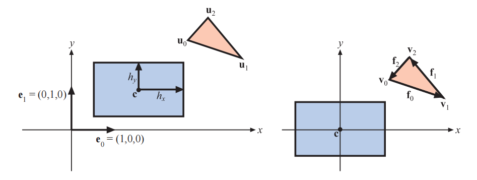

这里我们将针对一个轴对齐包围盒（AABB）来进行测试，其中这个AABB由中心点$\mathbf{c}$，以及一个半长向量$\mathbf{h}$进行定义，待测三角形为$\Delta \mathbf{u}_{0} \mathbf{u}_{1} \mathbf{u}_{2}$。为了简化测试过程，我们首先对box和三角形进行移动，使得这个box以原点为中心，即$\mathbf{v}_{i}=\mathbf{u}_{i}-\mathbf{c}, i \in\{0,1,2\}$。这个平移过程以及所使用的符号表示方法如图22.21所示。如果想要对一个OBB进行测试，我们首先要需要对OBB和三角形顶点进行反向的旋转变换，然后再应用这里的测试方法。根据分离轴测试（SAT），我们会对以下13个轴进行测试：

1.  \[3次测试] $\mathbf{e}_0 = (1,0,0)$，$\mathbf{e}_1 = (0,1,0)$，$  \mathbf{e}_2 = (0,0,1) $ （AABB的法线）。换句话说，将这个AABB与三角形周围的最小AABB进行测试。
2.  \[1次测试] $\mathbf{n}$，$\Delta \mathbf{u}_{0} \mathbf{u}_{1} \mathbf{u}_{2}$的法线。这里我们使用快速的平面与AABB的重叠测试（章节22.10.1），它只会对box对角线上的两个顶点进行测试，其中这个对角线的方向与三角形的法线最为接近。
3.  &#x20;\[9次测试] $\mathbf{a}_{i j}=\mathbf{e}_{i} \times \mathbf{f}_{j}, i, j \in\{0,1,2\}$，其中$\mathbf{f}_{0}=\mathbf{v}_{1}-\mathbf{v}_{0}$，$\mathbf{f}_{1}=\mathbf{v}_{2}-\mathbf{v}_{1}$，$\mathbf{f}_{2}=\mathbf{v}_{0}-\mathbf{v}_{2}$，即边向量。这些测试在形式上是相似的，下面我们将只展示$i = 0$和$j = 0$时的推导（详见下文）。

一旦我们找到了一个分离轴，那么算法就会终止并返回“没有重叠”。如果上述所有的测试都通过了，也就是说没有找到分离轴，那么说明这个三角形与box会发生重叠。

在这里，我们将推导步骤3中9个测试中的一个，其中$i = 0$，$j = 0$。这意味着$\mathbf{a}_{00}=\mathbf{e}_{0} \times \mathbf{f}_{0}=\left(0,-f_{0 z}, f_{0 y}\right)$。因此，现在我们需要将三角形顶点投影到$\mathbf{a}_{00}$上（以下称为$\mathbf{a}$）：

$$
\begin{array}{l}p_{0}=\mathbf{a} \cdot \mathbf{v}_{0}=\left(0,-f_{0 z}, f_{0 y}\right) \cdot \mathbf{v}_{0}=v_{0 z} v_{1 y}-v_{0 y} v_{1 z} \\ p_{1}=\mathbf{a} \cdot \mathbf{v}_{1}=\left(0,-f_{0 z}, f_{0 y}\right) \cdot \mathbf{v}_{1}=v_{0 z} v_{1 y}-v_{0 y} v_{1 z}=p_{0} \\ p_{2}=\mathbf{a} \cdot \mathbf{v}_{2}=\left(0,-f_{0 z}, f_{0 y}\right) \cdot \mathbf{v}_{2}=\left(v_{1 y}-v_{0 y}\right) v_{2 z}-\left(v_{1 z}-v_{0 z}\right) v_{2 y} .\end{array}
\tag{22.22} 
$$

通常，我们需要找到$\min(p_0, p_1, p_2)$和$\max(p_0, p_1, p_2)$，但幸运的是这里$p_0 = p_1$，这简化了计算。现在我们只需要找到$\min(p_0, p_2)$和$\max(p_0, p_2)$即可，这要快得多，因为条件语句在现代CPU上的开销很大。

在将三角形投影到$\mathbf{a}$上之后，我们还需要将box投影到$\mathbf{a}$上。我们需要对投影到$\mathbf{a}$上的box计算一个“半径”$r$：

$$
r=h_{x}\left|a_{x}\right|+h_{y}\left|a_{y}\right|+h_{z}\left|a_{z}\right|=h_{y}\left|a_{y}\right|+h_{z}\left|a_{z}\right|
\tag{22.23} 
$$

其中最后一步来自于这个特定轴上的$a_x = 0$。那么，这个轴测试就变成了：

$$
\mathrm{if} \left(\min \left(p_{0}, p_{2}\right)>r\right. \mathrm{or} \left.\max \left(p_{0}, p_{2}\right)<-r\right) \  \mathrm{ return \enspace false};
\tag{22.24} 
$$

相关代码可以在网上找到\[21]。

## 22.13 BV/BV相交

包围体（bounding volume，BV）的目的是提供更加简单的相交测试，以及进行更加有效的拒绝测试，例如：假设我们想要测试两辆车是否发生碰撞，那么首先找到它们的BV，并测试BV之间是否发生重叠。如果它们没有发生重叠，那么这两辆汽车就保证不会发生碰撞（这是最常见的情况）。这样我们就避免了对一辆车的每个图元都进行相交测试，从而节省了很多的计算量。

一个基本的操作是判断两个包围体是否重叠。下面我们将介绍AABB、k-DOP、OBB之间的重叠测试方法。有关在图元周围构建BV的算法，详见章节22.3。

除了球体和AABB之外，我们还会使用一些更加复杂的BV，其原因在于更加复杂的BV通常有着更加紧密的贴合程度，如图22.22所示。当然，使用一些其他的包围体也是可能的，例如：圆柱体和椭球体有时也会被用作物体的包围体。此外，还可以放置若干个球体来包围一个物体\[782, 1582]。

对于胶囊体和含片体这样的BV，计算最小距离是一个相对较快的操作。因此，它们经常用于公差验证（tolerance verification）的应用中，在这些应用中，人们希望验证两个（或者多个）物体之间至少存在一定的距离。Eberly \[404]和Larsen等人\[979]推导了这些类型边界体的方程和高效算法。

### 22.13.1球体/球体相交

对于两个球体而言，其相交测试是简单而快速的：计算两个球心之间的距离，如果这个距离大于两个球体的半径之和，则拒绝相交；否则，它们会发生相交。在实现这个算法的时候，最好使用这两个距离的平方，因为我们只需要比较之后的布尔结果即可。这样我们可以避免了计算平方根（一个昂贵的操作）。Ericson \[435]给出了同时测试四对球体的SSE代码。

### 22.13.2 球体/Box相交

Arvo \[70]首先提出了一种检测球体与AABB是否相交的算法，该算法非常简单。其想法是找到AABB上最接近球体中心$\mathbf{c}$的点。使用三组一维测试（AABB的三个轴各一个），根据AABB的边界来对一个轴上的球心坐标进行测试。如果球体位于这个边界之外，则计算球心与沿着这个轴到box的距离（一个减法），并将其平方。在我们沿着三个轴都进行了这个计算之后，将这些距离的平方和与球体半径的平方$r^2$进行比较。如果这个和小于半径的平方，则说明距离最近的点位于球体内部，即球体与box是相互重叠的。Arvo指出，这个算法可以进行一些修改，来处理空心box与球体以及轴对齐椭球体的相交测试。

Larsson等人\[982]提出了该算法的一些变体，包括一个速度更快的SSE向量化版本。他们的见解是在早期使用简单的拒绝测试，要么是逐轴进行、要么是在开始的时候全部进行。这个拒绝测试是：检查球心到box的距离是否大于半径。如果是的话，那么这个测试可以提前结束，因为此时球体不可能与box发生重叠。当二者重叠的概率较低时，这种早期拒绝方法的速度明显要更快。下面是他们测试的快速拒绝（quick rejections intertwined，QRI）版本。提前退出的测试出现在第4行和第7行，如果需要的话，可以将它们删除。

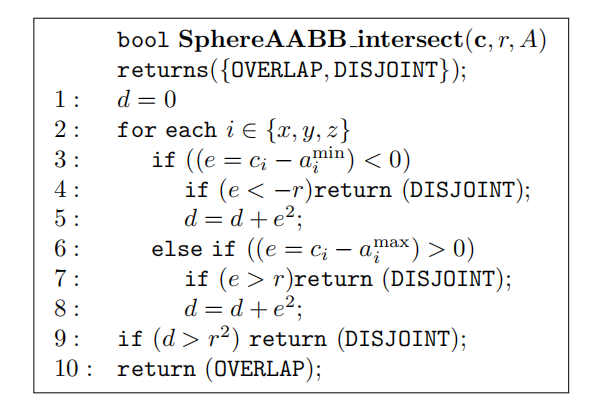

对于快速向量化（使用SSE）的实现，Larsson等人建议消除大部分的分支语句。其想法是使用下面的表达式，来同时计算第3行和第6行：

$$
e=\max \left(a_{i}^{\min }-c_{i}, 0\right)+\max \left(c_{i}-a_{i}^{\max }, 0\right)
\tag{22.25} 
$$

待摘要内容过短待摘要内容过短本文介绍了碰撞检测（collision detection，CD）在计算机图形学中的应用和实现方法。碰撞检测分为碰撞检测、碰撞确定和碰撞响应三个部分，通过计算物体之间的相交来判断是否发生碰撞。文章提到了在大型场景中进行碰撞检测的三个阶段：宽阶段CD、中阶段CD和窄阶

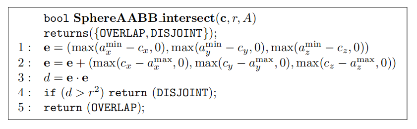

请注意，第1行和第2行可以使用一个并行SSE max函数来实现。尽管在这个测试中没有早期退出，但是它仍然要比其他技术更快。这是因为在这个测试中消除了分支，并且使用了并行计算。SSE的另一种方法是对物体对进行向量化。Ericson \[435]提出的SIMD代码，能够同时比较四个球体和四个AABB。

对于球体与OBB的相交测试，首先将球体中心变换到OBB的空间中。也就是说，使用OBB的归一化轴来作为变换球体中心的基底。现在这个中心点是相对于OBB的轴来进行表示的，因此这个OBB此时可以被视为一个AABB。然后再使用球体与AABB的算法来进行相交测试即可。

Larsson \[983]给出了一种高效的椭球体与OBB的相交测试方法。首先，将两个物体进行缩放，使得这个椭球体变成一个球体，OBB变成一个平行六面体。使用球体与slab的相交测试可以进行快速接受和拒绝。最后，将球体与那些面向它的平行四边形进行相交测试。

### 22.13.3 AABB-AABB相交

顾名思义，AABB是一个与主轴方向对齐的box。因此，使用两个顶点就足以描述这样的体积。这里我们使用章节22.2中所介绍的AABB定义。

由于AABB十分简单，因此它通常被用于碰撞检测算法和场景图节点的包围体。两个AABB（$A$和$B$）之间的相交测试很简单，其伪代码如下所示：

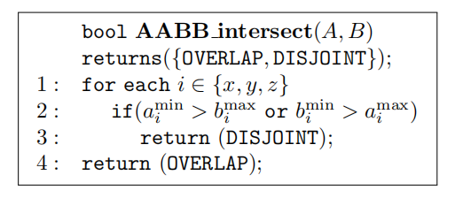

### 22.13.4 k-DOP/k-DOP相交

一个k-DOP与另一个k-DOP的相交测试，只包含$k/2$个区间的重叠测试。Klosowski等人\[910]表明，对于中等大小的$k$值，两个$k$-DOP的重叠测试要比两个OBB的重叠测试快一个数量级。在图22.4中，我们给出了一个简单的二维k-DOP。请注意，AABB是一个6-DOP的特殊情况，其法线刚好是正负主轴的方向。OBB也是6-DOP的一种形式，但是这种快速测试只能在两个待测OBB共享相同轴的时候使用。

下面的相交测试简单且快速、不精确但很保守。如果要测试两个k-DOP $A$和$B$（上标分别为$A$和$B$）是否相交，那么就需要测试所有平行的slab对$(S_i^A, S_i^B)$是否发生重叠；$s_{i}=S_{i}^{A} \cap S_{i}^{B}$是一个一维的区间重叠测试，它很容易求解。这是一个降维的例子，正如章节22.5中的经验法则所推荐的那样。这里我们将一个三维的slab测试简化为一个一维的区间重叠测试。

如果在任何时候都有$s_{i}=\emptyset$（即空集），那么这两个BV不相交，终止测试；否则将会继续进行slab的重叠测试。当且仅当所有的$s_{i}\ne \emptyset，1≤i≤k/2$，我们才认为两个BV重叠。根据分离轴测试（章节22.2），我们还需要对一组轴进行测试，这组轴与每个k-DOP和一条边的叉乘平行。然而，这些测试通常会被忽略，因为它们的开销要大于在性能上的回报。因此，如果下面的测试伪代码返回的是k-DOP相互重叠，那么它们实际上可能是不相交的。下面是k-DOP与k-DOP重叠测试的伪代码：

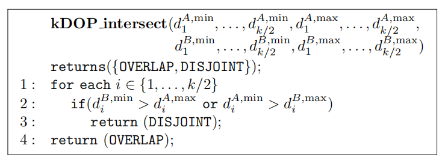

请注意，每个k-DOP实例只需要存储$k$个标量值（法线$\mathbf{n}_i$对于所有k-DOP实例都只会存储一次，因为它们是静态的）。如果k-DOP分别被$\mathbf{t}^A$和$\mathbf{t}^B$进行了平移变换，那么这个测试就会变得稍微复杂一些。我们需要将$\mathbf{t}^A$投影到法线$\mathbf{n}_i$上，例如：$p_{i}^{A}=\mathbf{t}^{A} \cdot \mathbf{n}_{i}$（请注意，这与任何的k-DOP都无关，因此对于每个$\mathbf{t}^A$和$\mathbf{t}^B$只需要进行计算一次即可），并在$\mathrm{if}$语句中将$p_{i}^{A}$加到$d_{i}^{A, \min }$和$d_{i}^{A, \max }$中。对于$\mathbf{t}^B$也是如此，换句话说，平移改变了k-DOP沿每个法线方向的距离。

Laine和Karras \[965]提出了一种k-DOP的扩展，它被称为顶点贴图（apex point map）。其想法是将一组平面法线映射到k-DOP的各个点上，这样每个存储点就代表了该方向上的最远位置。这个点和方向构成了一个平面，该平面在一个半空间中完全包含了该模型，即该点位于模型k-DOP的顶点（apex）。在测试过程中，在给定方向上检索到的顶点可以用于k-DOP之间更加精确的相交测试，用于对视锥体剔除进行改进、以及在旋转后寻找更加紧密的AABB等。

### 22.13.5 OBB/OBB交集

在本小节中，我们简要介绍了一种快速方法来测试两个OBB（$A$和$B$）之间的交集\[436, 576, 577]。该算法使用分离轴测试，这要比之前使用最近特征或者线性规划的方法快一个数量级。有关OBB的定义详见章节22.2。

这个测试是在由OBB $A$的中心和轴所组成的坐标系中进行的。这意味着原点位于$\mathbf{a}^c =(0, 0, 0)$，这个坐标系中的主轴分别是$\mathbf{a}^u = (1,0,0)$，$\mathbf{a}^v =(0,1,0)$，$\mathbf{a}^w =(0,0,1)$。此外，我们假设$B$的位置相对于$A$，具有一个平移变换$\mathbf{t}$和一个旋转（矩阵）$R$。

根据分离轴测试，找到一个分离轴就足以确保$A$和$B$不相交（不重叠）。这里有15个轴需要进行测试：3个来自$A$的面，3个来自$B$的面，以及$3\times 3 = 9$个来自$A$和$B$边界的组合。图22.23以二维展示了这种情况。

![图22.23：为了确定两个OBB是否重叠，可以使用分离轴试验。这里我们以二维形式进行展示。图中的四个分离轴与两个OBB的面正交，每个box都有两个这样的轴。然后，OBB被投影到这些轴上。如果两个投影在所有轴上都发生重叠，那么则代表这两个OBB重叠；否则，则代表这两个OBB不重叠。因此，找到一个 能够 分离投影的轴，就足以知道这两个OBB不重叠了。而在这个例子中，左下方的轴是唯一能够分离投影的轴。 \[436\]](images/Chapter-22/202310081949419.png "图22.23：为了确定两个OBB是否重叠，可以使用分离轴试验。这里我们以二维形式进行展示。图中的四个分离轴与两个OBB的面正交，每个box都有两个这样的轴。然后，OBB被投影到这些轴上。如果两个投影在所有轴上都发生重叠，那么则代表这两个OBB重叠；否则，则代表这两个OBB不重叠。因此，找到一个 能够 分离投影的轴，就足以知道这两个OBB不重叠了。而在这个例子中，左下方的轴是唯一能够分离投影的轴。 \[436]")

由于矩阵$\mathbf{A}=\left(\begin{array}{lll}\mathbf{a}^{u} & \mathbf{a}^{v} & \mathbf{a}^{w}\end{array}\right)$的正交性，可能与$A$面正交的潜在分离实际上就是轴$\mathbf{a}^{u}$，$\mathbf{a}^{v}$，$\mathbf{a}^{w}$；B面也是同样的。剩下9个潜在的轴，分别由$A$的一个边和$B$的一个边构成，即$\mathbf{c}^{i j}=\mathbf{a}^{i} \times \mathbf{b}^{j}$，其中$\forall i \in\{u, v, w\}$，$\forall j \in\{u, v, w\}$。幸运的是，网上有针对这一点的优化代码\[1574]。

## 22.14 视锥体相交测试

正如我们在章节19.4中所看到的，分层视锥体剔除对于快速渲染复杂场景而言至关重要。在层次包围体剔除遍历期间，调用的少数几个操作之一就是视锥体和包围体之间的相交测试。因此，这些操作的效率对于快速执行剔除来说至关重要。在理想情况下，他们应当能够确定BV是完全位于视锥体内部（包含），还是完全位于视锥体外部（排除），或者BV与视锥体相交。

回顾一下，视锥体是一个金字塔，它被一个近裁剪平面和一个远裁剪平面（二者相互平行）所截断，从而使得体积变得有限。事实上，视锥体是一个多面体，在图22.24中给出了这6个平面的名称，分别是近（near）、远（far）、左（left）、右（right）、上（top）、下（bottom）。视锥体空间定义了场景中可见的部分，位于视锥体内部的物体才会被渲染（在一个透视视锥体中）。

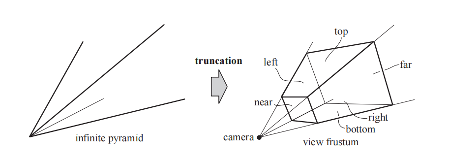

用于层次结构（例如场景图）中的内部节点和封闭几何物体上最常见的包围体就是球体、AABB、OBB。因此，我们将在这里讨论和推导视锥体与球体，以及视锥体与AABB和OBB的相交测试。

为了了解为什么我们需要外部、内部、相交这三种返回结果，我们将回顾遍历层次包围体时会发生什么。如果我们发现一个BV完全位于视锥体之外，那么这个BV的子树将不会被进一步遍历，并且其中的任何几何形状都不会进行渲染。另一方面，如果BV完全位于视锥体内部，则不需要为该子树计算更多的视锥体/BV测试，并且后续将将对每个可渲染的叶子节点进行绘制。而对于部分可见的BV（即那些与视锥体相交的BV），则会根据视锥体，对该BV的子树进行递归测试。如果该BV是一个叶子节点，那么就必须渲染这个叶子节点，从而保证画面的准确性。

完整的测试被称为排除/包含/相交测试（exclusion/inclusion/intersection test）。有时，第三种状态（相交）的计算成本会被认为过高，在这种情况下，BV会被分类为“可能位于内部”。我们将这种简化的算法称为排除/包含测试（exclusion/inclusion test）。如果一个BV无法被成功排除，那么后续有两种选择：一种是将“可能在内部”的状态视为包含，这意味着这个BV内部的所有内容都会被渲染。这样做通常是比较低效的，因为我们没有再次进行剔除。另一种选择是依次对该子树中的每个节点进行测试，从而进行精确剔除。但是这样的测试通常并没有什么好处，因为该子树的大部分内容可能确实位于视锥体内部。由于这两种选择都不是特别好，因此尝试快速区分相交情况和包含情况通常是值得的，即使这个测试并不那么完美。

这里有一个重要的认识，即快速分类测试不必是精确的场景图剔除，只需保守即可。为了从包含情况中区分出排除情况，所需要做的就是在包含一侧来对错误进行检测。也就是说，应当被排除在外的物体可能会被错误地包含在内，而这样的错误会浪费额外的时间。另一方面，应当包含在内的物体永远不应该被快速分类为排除在外，否则将会发生渲染错误。而对于包含和相交这两种情况，任何一种错误分类通常都是合法的。如果一个完全包含的BV被分类为相交，那么对其子树进行测试就会浪费一些时间。如果将一个相交的BV完全认为位于内部，那么渲染所有的物体也会造成一些时间浪费，因为其中一些物体可能已经被剔除了。

在我们介绍视锥体与球体、AABB或者OBB之间的相交测试之前，我们将首先描述视锥体与一般物体之间的相交测试方法，这个测试如图22.25所示。这个想法是将一个BV与视锥体的测试，转变为一个点与体积的测试。首先，选择一个相对于BV的点。然后，将BV沿着视锥体的外部进行移动，并且尽可能靠近视锥体但不与其重叠。在这个移动过程中，相对于BV的点会被追踪，它的轨迹会形成一个新的体积（图22.25中带有粗边的多边形）。BV尽可能靠近视锥体的事实意味着，如果这个相对于BV的点（在其原始位置）位于所描出的体积内部，则说明BV与视锥体相交，或者位于视锥体内部。因此，我们并不是对这个BV与视锥体进行相交测试，而是针对一个相对于BV的点与另一个新体积进行相交测试，这个新体积是根据该点追踪得来的。以同样的方式，BV可以沿着视锥体的内部进行移动，并且尽可能地靠近视锥体。这将绘制出一个新的、更小的视锥体，并且其平面与原始视锥体的平面相平行\[83]。如果相对于物体的点位于这个新体积内部，那么就说明这个BV完全位于视锥体内部。在接下来的若干小节中，我们将使用这种技术来进行测试。请注意，新体积的创建与实际BV的位置无关，它只依赖于点相对于BV的位置和BV的形状。这意味着任意位置的BV可以针对相同的体积进行测试。

只保存父BV与每个子BV的相交状态是一个有用的优化。如果已知父节点完全位于视锥体内部，那么子孙节点就不需要进一步的视锥体测试了。章节19.4中所讨论的平面遮挡（plane masking）和时间一致性（temporal coherence）技术也可以显著改善针对一个层次包围体的相交测试，尽管它们在SIMD实现中不太有用\[529]。

首先，我们会推导出视锥体的平面方程，因为这类测试中需要使用到这些方程。然后接着介绍了视锥体与球体的相交测试，之后再介绍视锥体与box的相交测试。

### 22.14.1 提取视锥体平面

为了进行视锥体剔除，我们需要得到视锥体六个不同侧面的平面方程。我们在这里给出一种巧妙且快速的方法来推导这些。假设观察矩阵为$\mathbf{V}$、投影矩阵为$\mathbf{P}$，组合后的复合变换为$\mathbf{M}=\mathbf{P V}$。当$\mathbf{t}=\mathbf{Ms}$时，点$\mathbf{s}$（其中$s_w = 1$）被变换为$\mathbf{t}$。此时，由于透视投影的原因，$\mathbf{t}$可能会出现$t_w \ne 1$的情况。因此，将$\mathbf{t}$中的所有分量除以$t_w$，得到点$\mathbf{u}$，其中$u_w = 1$。对于视锥体内部的点，当$i \in x, y, z$时，满足$- 1≤u_i≤1$，即点$\mathbf{u}$位于一个标准立方体内部。这里针对的是OpenGL类型的投影矩阵（章节4.7）。对于DirectX而言，其中的$0≤u_z≤1$，其他都相同。视锥体的各个平面可以直接由这个复合变换矩阵的行向量推导得出。

我们将注意力集中在标准立方体左平面右侧的体积上，其中$−1≤u_x$。我们可以对其进行如下扩展：

$$
\begin{array}{c}-1 \leq u_{x} \Longleftrightarrow-1 \leq \frac{t_{x}}{t_{w}} \Longleftrightarrow t_{x}+t_{w} \geq 0 \Longleftrightarrow 
\\[2mm]
\Longleftrightarrow\left(\mathbf{m}_{0}, \mathbf{s}\right)+\left(\mathbf{m}_{3}, \mathbf{s}\right) \geq 0 \Longleftrightarrow\left(\mathbf{m}_{0},+\mathbf{m}_{3}\right) \cdot \mathbf{s} \geq 0 \end{array}
\tag{22.26} 
$$

在上面的这个推导过程中，$\mathbf{m}_i$表示复合变换矩阵$\mathbf{M}$中的第$i$行。最后一步$\left(\mathbf{m}_{0},+\mathbf{m}_{3}\right) \cdot \mathbf{s} \geq 0$实际上代表了视锥体左平面的（一半）平面方程。这是因为标准立方体中的左平面已经被转换回了世界坐标。还要注意确保$s_w = 1$，从而使得方程变成一个平面。为了使得这个平面的法线从视锥体内部指向视锥体外部，这个方程还必须被取反（原始方程描述的是标准立方体内部）。因此对于视锥体的左平面而言，其平面方程为$-\left(\mathbf{m}_{3,}+\mathbf{m}_{0,}\right) \cdot(x, y, z, 1)=0$，这里我们使用$(x, y, z, 1)$来代替使用平面方程的形式：$ax + by + cz + d = 0$。总的来说，视锥体的各个平面方程如下：

$$
\begin{array}{ll}-\left(\mathbf{m}_{3,}+\mathbf{m}_{0,}\right) \cdot(x, y, z, 1)=0 & {[\text { left }],} \\ -\left(\mathbf{m}_{3,}-\mathbf{m}_{0,}\right) \cdot(x, y, z, 1)=0 & {[\text { right }],} \\ -\left(\mathbf{m}_{3,}+\mathbf{m}_{1,}\right) \cdot(x, y, z, 1)=0 & {[\text { bottom }],} \\ -\left(\mathbf{m}_{3,}-\mathbf{m}_{1,}\right) \cdot(x, y, z, 1)=0 & {[\text { top }],} \\ -\left(\mathbf{m}_{3,}+\mathbf{m}_{2,}\right) \cdot(x, y, z, 1)=0 & {[\text { near }],} \\ -\left(\mathbf{m}_{3,}-\mathbf{m}_{2,}\right) \cdot(x, y, z, 1)=0 & {[\text { far }] .}\end{array}
\tag{22.27}

$$

在网上可以找到使用OpenGL和DirectX实现这个操作的代码\[600]。

### 22.14.2 视锥体/球体相交

正交投影的视锥体是一个box，因此在这种情况下，视锥体与球体的相交测试变成了一个OBB与球体的相交测试，可以使用章节22.13.2中给出的算法来进行解决。为了进一步测试球体是否完全位于box内部，我们会首先检查球体中心沿着每个轴与box边界之间的距离是否大于它的半径。如果它在所有三个维度上都满足这个条件，那么这个球体就是被完全包含在box内部的。有关这个修改算法的高效实现以及相关代码，请参阅Arvo的文章\[70]。

按照视锥体与BV相交测试的推导方法，对于任意的一个视锥体，我们选择使用球心来作为追踪点$\mathbf{p}$，结果如图22.26所示。如果半径为$r$的球体沿着视锥体的内部和外部进行移动，并尽可能地靠近视锥体，那么点$\mathbf{p}$的轨迹便给出了我们重新制定视锥体与球体相交测试所需要的体积。实际的体积如图22.26的中间部分所示。与之前一样，如果点$\mathbf{p}$在橙色区域之外，那么说明球体位于视锥体外部。如果点$\mathbf{p}$在紫色区域内，那么说明球体完全位于视锥体内部。如果点$\mathbf{p}$在橙色区域内，则说明球体与视锥体平面相交。通过这种方法，我们可以进行精确的相交测试。不过为了提高效率，我们会使用图22.26右侧的近似值。其中橙色区域的体积被扩展了，从而避免圆角所带来的复杂计算。请注意，这个外部体积由沿着视锥体平面的法线方向，向外移动$r$个单位距离的视锥体平面所组成；而内部体积可以通过沿着视锥体的平面法线方向，向内移动$r$个单位距离的视锥体平面所组成。

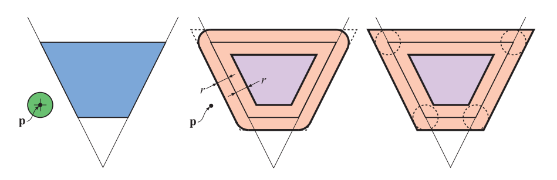

我们假设视锥体的平面方程是这样的，其中平面的正半空间位于视锥体外部。然后，实际的代码实现将会在视锥体的六个平面上进行循环，对于每个视锥体平面，都会计算从球心到该平面的带符号距离，这是通过将球心坐标带入到平面方程中来实现的。如果这个距离大于半径$r$，则说明球体位于视锥体外部；如果到所有六个平面的距离都小于$- r$，则说明球体位于视锥体内部；否则球体与视锥体相交。更准确地说，我们称这个球体与视锥体相交，但是球体的中心也可能会位于圆角之外的尖角区域中（如图22.26所示）。这实际上意味着球体位于视锥体之外，但是我们保守地认为这个球体是相交的。

为了使得测试更加准确，可以添加额外的平面来测试这个球体是否位于视锥体外部。然而，为了快速剔除场景图中的节点，偶尔发生的错误命中只会导致我们进行一些不必要的测试，而不是算法的失败，但是这些额外测试将会花费更多的时间。另一种更加精确的方法将在章节20.3中进行介绍，该方法适用于这些尖角区域非常显著的情况。

对于一些高效的着色方法，视锥体通常是高度不对称的，图20.7中就描述了一种特殊的方法。Assarsson和Moller \[83]提供了一种方法，该方法通过将视锥体划分为八个象限（octant），并找到物体的中心位于哪个分区中，从而在每次测试中消除三个平面。

### 22.14.3 视锥体/box相交

对于正交投影（即视锥体是一个box），可以使用OBB与OBB的相交测试来进行精确测试（章节22.13.5）。而对于一般的视锥体与box的相交测试，常用的方法有两种。一种简单的方法是使用视锥体的观察矩阵和投影矩阵，将所有八个box的顶点都转换到视锥体的坐标系中。对沿着每个轴扩展$[- 1,1]$范围的标准观察体进行裁剪测试（章节4.7.1）。如果所有顶点都位于这个边界之外，则拒绝这个box；如果所有顶点都位于边界内部，则这个box被完全包含在视锥体内部\[529]。由于这个方法对裁剪过程进行了模拟，因此可以将其用于由任意一组点（例如线段、三角形或者k-DOP）所分隔的任何物体。该方法的优点在于不需要提取视锥体的平面方程。其独立的（self-contained）简单性，使其可以在计算着色器中进行高效使用\[1883, 1884]。

一种在CPU上相当高效的方法，是使用章节22.10中所描述的平面与box的相交测试。与视锥体和球体的相交测试一样，OBB或者AABB是针对六个视锥体平面进行逐个检查的。而在平面与box的相交测试中，我们最多只会检查两个对角顶点（具体使用哪两个对角顶点由平面的法线决定），而不是计算所有八个顶点到平面的带符号距离。如果最近的顶点位于平面外侧，那么说明这个box完全位于视锥体外部，相交测试可以提前结束。如果每个平面的最远顶点位于平面内侧，那么说明这个box被包含在视锥体内部。请注意，远近平面点积距离的计算结果是可以共用的，因为这两个平面是平行的。第二种方法的唯一额外开销，就是必须首先推导出视锥体的平面方程，如果要对几个box进行测试，那这实际上是微不足道的开销。

与视锥体/球体的相交测试算法一样，这个测试会错误的将实际上完全位于视锥体外部的box分类为相交，这些类型的错误如图22.27所示。Quilez指出\[1452]，对于固定大小的地形网格或者其他大型物体，这种情况会更加频繁地发生。当报告了一个相交时，他的解决方案是在形成包围框的各个平面上，再次对视锥体的各个角进行测试。如果所有角都在box的平面之外，那么视锥体与这个box不相交。这个附加测试相当于分离轴测试的第二部分，其中被测试的轴与第二个物体的表面正交。尽管如此，这种额外检测的成本可能会高于所带来的好处。对于他的GIS渲染器而言，Eng \[425]发现这种优化每帧将会花费2毫秒的CPU时间，但是只能节省几个draw call。

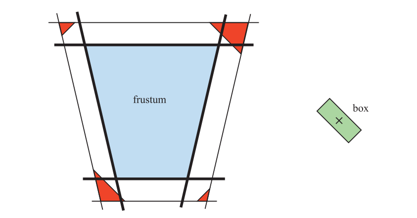

Wihlidal \[1884]采用了另一个方向上的视锥体剔除，该方法只使用四个视锥体侧面进行剔除测试，而不进行近裁剪平面和远裁剪平面的剔除测试。他指出，这两个平面在电子游戏中的帮助不大。其中近裁剪平面大多数情况都是冗余的，因为侧边平面裁剪了几乎所有的空间；而远裁剪平面则通常用于查看场景中的所有物体。

另一种方法是使用分离轴测试（章节22.13）来派生出一个相交例程。一些作者使用分离轴测试来求解两个凸多面体之间的通解\[595, 1574]。然后，一个单独的优化测试可以用于线段、三角形、AABB、OBB、k-DOP、视锥体和凸多面体的任何组合。

## 22.15 线/线相交

在这一小节中，我们推导并了二维和三维的线/线相交测试。直线、射线和线段彼此之间都可以发生相交，这里我们介绍了一些既快速又优雅的方法。

### 22.15.1 二维

#### 方法1

从理论的角度来看，这种计算一对二维直线交点的方法确实很漂亮。假设现在有两条直线，分别是$\mathbf{r}_{1}(s)=\mathbf{o}_{1}+s \mathbf{d}_{1}$和$\mathbf{r}_{2}(t)=\mathbf{o}_{2}+t \mathbf{d}_{2}$。由于$\mathbf{a} \cdot \mathbf{a}^{\perp}=0$（章节1.2.1中的垂直点积\[735]），使得$\mathbf{r}_{1}(s)$和$\mathbf{r}_{1}(t)$之间的交点计算变得简洁而优雅。请注意，在这一节中所有向量都是二维的：

$$
1: \quad \quad \mathbf{r}_{1}(s)=\mathbf{r}_{2}(t)
\\
\Longleftrightarrow
\\
2: \quad \mathbf{o}_{1}+s \mathbf{d}_{1}=\mathbf{o}_{2}+t \mathbf{d}_{2}
\\
\Longleftrightarrow
\\
3:\left\{\begin{array}{l}s \mathbf{d}_{1} \cdot \mathbf{d}_{2}^{\perp}=\left(\mathbf{o}_{2}-\mathbf{o}_{1}\right) \cdot \mathbf{d}_{2}^{\perp} \\t \mathbf{d}_{2} \cdot \mathbf{d}_{1}^{\perp}=\left(\mathbf{o}_{1}-\mathbf{o}_{2}\right) \cdot \mathbf{d}_{1}^{\perp}\end{array}\right.
\\
\Longleftrightarrow
\\
 4: \quad\left\{\begin{aligned} s & =\frac{\left(\mathbf{o}_{2}-\mathbf{o}_{1}\right) \cdot \mathbf{d}_{2}^{\perp}}{\mathbf{d}_{1} \cdot \mathbf{d}_{2}^{\perp}} \\ t & =\frac{\left(\mathbf{o}_{1}-\mathbf{o}_{2}\right) \cdot \mathbf{d}_{1}^{\perp}}{\mathbf{d}_{2} \cdot \mathbf{d}_{1}^{\perp}}\end{aligned}\right.

\tag{22.28} 
$$

如果$\mathbf{d}_{1} \cdot \mathbf{d}_{2}^{\perp}=0$，那么这两条直线是平行的，即没有交点。这对于无限长的直线而言，所有$s$值和$t$值都是有效的；但是对于长度为$l_1$和$l_2$的线段而言（从$s = 0$和$t = 0$开始，到$s = l_1$和$t = l_2$结束），当且仅当$0≤s≤l_1$和$0≤t≤l_2$时，才会有一个有效的交点。或者，如果我们设$\mathbf{o}_{1}=\mathbf{p}_{1}$与$\mathbf{d}_{1}=\mathbf{p}_{2}-\mathbf{p}_{1}$（这意味着线段从点$\mathbf{p}_{1}$开始，到点$\mathbf{p}_{2}$结束），对$\mathbf{r}_{2}$也这样做，起点和终点分别是$\mathbf{q}_{1}$和$\mathbf{q}_{2}$，那么当且仅当$0≤s≤1$，$0≤t≤1$时才会存在有效的交点。对于从原点出发的射线而言，这个有效范围是$s≥0$和$t≥0$。这些有效交点可以通过将$s$代入$\mathbf{r}_{1}$中，或者将$t$代入$\mathbf{r}_{2}$中得到。

#### 方法2

Antonio \[61]描述了另一种判断两条线段（即长度有限的直线）是否相交的方法，该方法通过进行更多的比较和提前拒绝，并且避免了方法一中的昂贵计算（除法）。因此，这种方法的效率要更高。我们再次使用前面的符号表示，即第一个线段从点$\mathbf{p}_{1}$到点$\mathbf{p}_{2}$，第二个线段从点$\mathbf{q}_{1}$到点$\mathbf{q}_{2}$。这意味着$\mathbf{r}_{1}(s)=\mathbf{p}_{1}+s\left(\mathbf{p}_{2}-\mathbf{p}_{1}\right)$， $\mathbf{r}_{2}(t)=\mathbf{q}_{1}+t\left(\mathbf{q}_{2}-\mathbf{q}_{1}\right)$。利用方程22.28的结果，我们可以得到$\mathbf{r}_{1}(s)=\mathbf{r}_{2}(t)$的解：

$$
\left\{\begin{array}{l}s=\dfrac{-\mathbf{c} \cdot \mathbf{a}^{\perp}}{\mathbf{b} \cdot \mathbf{a}^{\perp}}=\dfrac{\mathbf{c} \cdot \mathbf{a}^{\perp}}{\mathbf{a} \cdot \mathbf{b}^{\perp}}=\dfrac{d}{f}, 
\\[2mm]
 t=\dfrac{\mathbf{c} \cdot \mathbf{b}^{\perp}}{\mathbf{a} \cdot \mathbf{b}^{\perp}}=\dfrac{e}{f} .\end{array}\right.
\tag{22.29} 
$$

其中：

$$
\mathbf{a}=\mathbf{q}_{2}-\mathbf{q}_{1}
\\
\mathbf{b}=\mathbf{p}_{2}-\mathbf{p}_{1} 
\\
\mathbf{c}=\mathbf{p}_{1}-\mathbf{q}_{1} 
\\
d=\mathbf{c} \cdot \mathbf{a}^{\perp}
\\
e=\mathbf{c} \cdot \mathbf{b}^{\perp}
\\
f=\mathbf{a} \cdot \mathbf{b}^{\perp}
$$

方程22.29中的简化步骤，实际上来自于：

$$
\mathbf{a}^{\perp} \cdot \mathbf{b}=-\mathbf{b}^{\perp} \cdot \mathbf{a}
\\
\mathbf{a} \cdot \mathbf{b}^{\perp}=\mathbf{b}^{\perp} \cdot \mathbf{a} 
$$

如果$\mathbf{a} \cdot \mathbf{b}^{\perp}=0$，那么这两条线是共线了。Antonio \[61]注意到，$s$和$t$的分母实际上是相同的，并且由于$s$和$t$不是明确需要的，因此我们可以省略这个除法运算。定义$s = d/f$和$t = e/f$。为了测试是否满足$0$$≤s≤1$，可以使用以下代码：

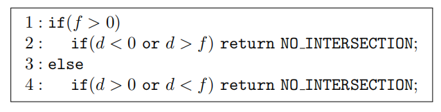

经过测试，可以确保$0≤s≤1$。然后再对$t = e/f$执行相同的操作（在测试代码中使用$e$来替换$d$）。如果这个例程在测试之后没有返回值，则说明这两个线段确实相交，因为此时$s$值和$t$值都是是有效的。

这个例程的整数版本的源代码可以在网上找到\[61]，并且可以很容易地转换为浮点数版本。

### 22.15.2 三维

假设我们想在三维空间中计算两条直线的交点（仍然由射线方程进行定义，即方程22.1）。我们将这两条直线继续称为$\mathbf{r}_{1}(s)=\mathbf{o}_{1}+s \mathbf{d}_{1}$和$\mathbf{r}_{2}(t)=\mathbf{o}_{2}+t \mathbf{d}_{2}$，其中$t$的值没有限制。垂直点积的三维对应形式是叉乘，即$\mathbf{a} \times \mathbf{a}=0$，因此三维版本的推导过程与二维版本十分相似。两条直线的交点可以按照如下形式进行计算：

$$
1 :\mathbf{r}_{1}(s)=\mathbf{r}_{2}(t)
\\
\Longleftrightarrow
\\
2 :\mathbf{o}_{1}+s \mathbf{d}_{1}=\mathbf{o}_{2}+t \mathbf{d}_{2}
\\
\Longleftrightarrow
\\
3: \left\{\begin{array}{l}s \mathbf{d}_{1} \times \mathbf{d}_{2}=\left(\mathbf{o}_{2}-\mathbf{o}_{1}\right) \times \mathbf{d}_{2} \\[3mm] t \mathbf{d}_{2} \times \mathbf{d}_{1}=\left(\mathbf{o}_{1}-\mathbf{o}_{2}\right) \times \mathbf{d}_{1}\end{array}\right.
\\
\Longleftrightarrow
\\
4:\left\{\begin{array}{c}s\left(\mathbf{d}_{1} \times \mathbf{d}_{2}\right) \cdot\left(\mathbf{d}_{1} \times \mathbf{d}_{2}\right)=\left(\left(\mathbf{o}_{2}-\mathbf{o}_{1}\right) \times \mathbf{d}_{2}\right) \cdot\left(\mathbf{d}_{1} \times \mathbf{d}_{2}\right) \\t\left(\mathbf{d}_{2} \times \mathbf{d}_{1}\right) \cdot\left(\mathbf{d}_{2} \times \mathbf{d}_{1}\right)=\left(\left(\mathbf{o}_{1}-\mathbf{o}_{2}\right) \times \mathbf{d}_{1}\right) \cdot\left(\mathbf{d}_{2} \times \mathbf{d}_{1}\right)\\\end{array}\right.
\\
\Longleftrightarrow
\\
5 :\left\{\begin{array}{l}s=\dfrac{\operatorname{det}\left(\mathbf{o}_{2}-\mathbf{o}_{1}, \mathbf{d}_{2}, \mathbf{d}_{1} \times \mathbf{d}_{2}\right)}{\left\|\mathbf{d}_{1} \times \mathbf{d}_{2}\right\|^{2}} \\[2mm]t=\dfrac{\operatorname{det}\left(\mathbf{o}_{2}-\mathbf{o}_{1}, \mathbf{d}_{1}, \mathbf{d}_{1} \times \mathbf{d}_{2}\right)}{\left\|\mathbf{d}_{1} \times \mathbf{d}_{2}\right\|^{2}}\end{array}\right.
\tag{22.30}
$$

其中步骤3是在两侧减去$\mathbf{o}_{1}$ （或者$\mathbf{o}_{2}$）并与$\mathbf{d}_{2}$ （或者$\mathbf{d}_{1}$）进行叉乘。步骤4是与$\mathbf{d}_{1} \times \mathbf{d}_{2}\left(\mathbf{d}_{2} \times \mathbf{d}_{1}\right)$进行点乘。最后，步骤5是最后的解，它是通过将右边重写为行列式（并改变底部方程中的一些符号），然后除以位于$ s  $（或者t）右侧的项来得到的。

Goldman \[548]指出，如果分母中的$\left\|\mathbf{d}_{1} \times \mathbf{d}_{2}\right\|^{2}$等于0，那么这两条直线实际上是平行的。他还观察到，如果这些直线是倾斜的（即它们位于两个平面上），那么参数$s$和$t$代表的是距离该直线最近的点。

如果将直线视为线段，长度分别为$l_1$和$l_2$（假设方向向量$\mathbf{d}_{1}$和$\mathbf{d}_{2}$是归一化的），则需要检查$0≤s≤l_1$和$0≤t≤l_2$是否成立。如果不成立的话，则拒绝相交。

Rhodes \[1490]对两条直线或者两个线段相交的问题，给出了一个深入的解决方案。他给出了能够处理特殊情况的健壮方法，对相关优化进行了讨论，并提供了相应的源代码。

## 22.16 三平面相交

给定三个平面，每个平面都由一个归一化的法线$\mathbf{n}_i$和平面上的任意一点$\mathbf{p}_i, i = 1, 2, 3$进行描述，这些平面相交的唯一点$\mathbf{p}$由方程22.31给出。请注意，如果其中两个或者多个平面平行，那么分母（即三个平面法线的行列式）为零：

$$
\mathbf{p}=\frac{\left(\mathbf{p}_{1} \cdot \mathbf{n}_{1}\right)\left(\mathbf{n}_{2} \times \mathbf{n}_{3}\right)+\left(\mathbf{p}_{2} \cdot \mathbf{n}_{2}\right)\left(\mathbf{n}_{3} \times \mathbf{n}_{1}\right)+\left(\mathbf{p}_{3} \cdot \mathbf{n}_{3}\right)\left(\mathbf{n}_{1} \times \mathbf{n}_{2}\right)}{\left|\begin{array}{lll}\mathbf{n}_{1} & \mathbf{n}_{2} & \mathbf{n}_{3}\end{array}\right|}
\tag{22.31} 
$$

这个方程可以用于计算由一组平面所组成的BV角点。k-DOP就是其中一个例子，它由$k$个平面方程所组成。如果提供适当的平面方程，方程22.31还可以计算凸多面体的角点。

通常，如果一个平面以隐式形式给出，即$\pi_{i}: \mathbf{n}_{i} \cdot \mathbf{x}+d_{i}=0$，那么我们需要找到点$\mathbf{p}_i$，以便能够使用方程22.31。我们可以选择平面上的任意一点。这里我们计算距离原点最近的点，因为这些计算的开销通常会很低。给定一条从原点指向平面法线的射线，将其与平面相交，从而得到最靠近原点的平面上一点：

$$
\begin{array}{c}\left.\begin{array}{l}\mathbf{r}_{i}(t)=t \mathbf{n}_{i} 
\\[2mm]
 \mathbf{n}_{i} \cdot \mathbf{x}+d_{i}=0\end{array}\right\} \Rightarrow 
\\[5mm]
\mathbf{n}_{i} \cdot \mathbf{r}_{i}(t)+d_{i}=0 \Longleftrightarrow t \mathbf{n}_{i} \cdot \mathbf{n}_{i}+d_{i}=0 \Longleftrightarrow t=-d_{i} \\ \Rightarrow 
\\[2mm]
\mathbf{p}_{i}=\mathbf{r}_{i}\left(-\overline{d_{i}}\right)=-d_{i} \mathbf{n}_{i} .\end{array}
\tag{22.32} 
$$

这个结果并不令人感到惊讶，因为平面方程中的$d_i$代表了垂直方向上，从原点到平面的负距离（如果这是正确的话，那么要求法线必须是归一化的）。

## 补充阅读和资源

Ericson的《Real-Time Collision Detection》\[435]和Eberly的《3D Game Engine Design》\[404]涵盖了各种各样的物体与物体的相交测试，以及层次遍历方法和其他许多的方法，并提供了源代码。Schneider和Eberly的《Geometric Tools for Computer Graphics》\[1574]为二维和三维几何相交测试提供了许多实用的算法。开放获取《Journal of Computer Graphics Techniques》发表了有关相交测试的改进算法和代码。早期的《Practical Linear Algebra》\[461]是一个良好的来源，其中包含了二维求交例程和计算机图形学中许多其他的几何操作。《Graphics Gems》系列书籍\[72, 540, 695, 902, 1344]中包含了许多不同类型的相交测试例程，相关代码可以在网上获得。免费的Maxima软件\[1148]可以很好地处理方程和推导方程。本书的网站包括一个页面（[realtimerendering.com/intersections.html](http://realtimerendering.com/intersections.html "realtimerendering.com/intersections.html")），其中对许多物体与物体之间相交测试可用的资源进行了总结。
