# Chapter 23 Graphics Hardware 图形硬件

## 目录

-   [23.1 光栅化](#231-光栅化)
    -   [23.1.1 插值](#2311-插值)
    -   [23.1.2 保守光栅化](#2312-保守光栅化)
-   [23.2 大规模计算和调度](#232-大规模计算和调度)
-   [23.3 延迟和占用率](#233-延迟和占用率)
-   [23.4 内存架构和总线](#234-内存架构和总线)
-   [23.5 缓存和压缩](#235-缓存和压缩)
-   [23.6 颜色缓冲](#236-颜色缓冲)
    -   [23.6.1 视频显示控制器](#2361-视频显示控制器)
    -   [23.6.2 单、双、三重缓冲](#2362-单双三重缓冲)
-   [23.7 深度剔除、测试和缓冲](#237-深度剔除测试和缓冲)
-   [23.8 纹理化](#238-纹理化)
-   [23.9 架构](#239-架构)
-   [23.10 案例分析](#2310-案例分析)
    -   [23.10.1 案例研究：ARM Mali G71 Bifrost](#23101-案例研究ARM-Mali-G71-Bifrost)
    -   [23.10.2 案例研究：NVIDIA Pascal](#23102-案例研究NVIDIA-Pascal)
    -   [23.10.3 案例研究：AMD GCN Vega](#23103-案例研究AMD-GCN-Vega)
-   [23.11 光线追踪架构](#2311-光线追踪架构)
-   [补充阅读和资源](#补充阅读和资源)

> J. Allard——“When we get the final hardware, the performance  is just going to skyrocket.”

> J· 阿拉德——“当我们得到最终的硬件时，性能将会直线上升。”（Xbox之父，前 Xbox 首席执行官；1969—）

尽管图形硬件正在快速发展，但是在其设计中仍然有一些常用的通用概念和体系结构（architecture，架构）。本章节的目标是让读者理解图形系统中的各种硬件元素，以及它们之间的相互关系。而本书中的其他部分将讨论它们在特定算法中的应用。在这里，我们将介绍硬件本身。我们首先会介绍如何光栅化线条和三角形，随后介绍了GPU的大量计算能力是如何工作的，以及是如何安排任务的，包括处理延迟和占用等问题。然后我们将讨论内存系统、缓存、压缩、颜色缓冲以及GPU中与深度系统相关的所有内容。然后会介绍纹理系统中的细节，再然后是介绍GPU的架构类型。章节23.10中介绍了三种不同架构的案例研究，最后我们对光线追踪架构进行了简要讨论。

## 23.1 光栅化

绘制三角形和线条的速度是任何GPU的一个重要特征。如章节2.4中所述，光栅化阶段包括三角形设置和三角形遍历。此外，我们还将介绍如何在三角形上进行属性插值，这与三角形遍历密切相关。最后我们会介绍保守光栅化，这是标准光栅化的一种扩展。

回想一下，像素的中心由$(x+0.5, y+0.5)$给出，其中$x\in [0,W−1]$，$y\in[0,H−1]$。$x$、$y$是整数，$W \times H$是屏幕分辨率（例如$3840 × 2160$）。我们设未变换的顶点为$\mathbf{v}_i, i\in {0,1,2}$，变换后的顶点为$\mathbf{q}_{i}=\mathbf{M} \mathbf{v}_{i}$（包含投影操作，但是并不包含除以$w$）。二维屏幕空间中对应的坐标是$\mathbf{p}_{i}=\left(\left(q_{i x} / q_{i w}+1\right) W / 2,\left(q_{i y} / q_{i w}+1\right) H / 2\right)$，即首先执行透视除法（除以$w$分量），然后进行缩放和平移操作，从而与屏幕分辨率相匹配，如图23.1所示。我们可以看到，像素网格被划分为了$2 × 2$像素组，它被称为一个quad（四边形）。

 的中心为 (x + 0.5, y + 0.5) 。底部边缘的法线（按长度缩放0.25）使用红色进行表示。只有绿色像素位于三角形内部。辅助像素使用黄色进行表示，它属于各个quad（ 2 × 2 像素），每个quad中至少有一个像素被认为位于三角形内部，而辅助像素的样本点（中心）则位于三角形外部。使用有限差分（finite difference）计算导数时需要使用到这些辅助像素。")

我们在确定纹理细节层级（章节23.8）的时候，需要使用像素之间的梯度信息，为了能够计算这个梯度信息，只要这些quad中有一个像素位于三角形内部，就会对整个quad执行像素着色（在章节3.8中也讨论过）。这是大多数GPU的核心设计，这个设计影响了接下来的许多阶段。三角形的面积越小，辅助像素与三角形内部像素的比例就越大。这种关系意味着我们在执行像素着色的时候，小三角形所带来的开销会更大（与三角形面积成比例）。最糟糕的情况是这个三角形只覆盖了单个像素，这意味着它需要三个辅助像素。辅助像素的数量有时会被称为四边形过度渲染（quad overshading）。

为了确定像素中心或者任何其他的样本位置是否位于三角形内部，硬件会对每个三角形边缘使用边缘函数\[1417]。这些边缘函数基于直线方程，即：

$$
\mathbf{n} \cdot((x, y)-\mathbf{p})=0
\tag{23.1} 
$$

其中$\mathbf{n}$是一个向量，有时会称为边缘法线，它与一个三角形边缘正交（垂直），$\mathbf{p}$是直线上的一个点。这样的方程可以重写为$ax+by +c = 0$。接下来，我们将通过点$\mathbf{p}_0$和点$\mathbf{p}_1$推导出边缘函数$e_2(x, y)$。边向量为$\mathbf{p}_1-\mathbf{p}_0$，因此其对应的法线就是沿逆时针旋转90度的边缘，即$\mathbf{n}_{2}=\left(-\left(p_{1 y}-p_{0 y}\right), p_{1 x}-p_{0 x}\right)$，这个边缘法线指向三角形内部，如图23.1所示。将法线$\mathbf{n}_{2}$和点$\mathbf{p}_0$代入方程23.1中，可以得到边缘函数$e_2(x, y)$为：

$$
\begin{aligned} e_{2}(x, y) & =-\left(p_{1 y}-p_{0 y}\right)\left(x-p_{0 x}\right)+\left(p_{1 x}-p_{0 x}\right)\left(y-p_{0 y}\right) \\ & =-\left(p_{1 y}-p_{0 y}\right) x+\left(p_{1 x}-p_{0 x}\right) y+\left(p_{1 y}-p_{0 y}\right) p_{0 x}-\left(p_{1 x}-p_{0 x}\right) p_{0 y} \\ & =a_{2} x+b_{2} y+c_{2} \end{aligned}
\tag{23.2} 
$$

对于正好位于一条边上的点$(x, y)$，我们有$e(x, y) = 0$。由于法线指向三角形内部，这意味着与法线方向在同一边的点，都有$e(x, y) >0$。这个边缘将空间划分为了两个部分，其中$e(x, y) >0$有时会被称为正半空间，$e(x, y) < 0$被称为负半空间。利用这些属性，我们可以确定一个点是否位于三角形内部。我们将三角形的边缘称为$e_i, i \in {0,1,2}$。如果样本点$(x, y)$位于三角形内部或者恰好在边缘上，那么对于所有$i$，它都必须保持$e_i(x, y)≥0$。

图形API规范经常会要求将屏幕空间中的浮点顶点坐标转换为定点坐标（整数顶点）。这样做是为了以一致的方式来定义决胜局规则（tie-breaker rule，稍后会进行描述）。它还可以提高样本内部测试的效率，例如：$p_{ix}$和$p_{iy}$都可以存储在1.14.8 bit中，即1个符号bit、14个整数坐标bit和8个像素内的小数位置bit。在这个例子中，这意味着一个像素内的坐标$x$和$y$可以有$2^8$个可能的位置，即整数坐标必须在$[-(2^{14}−1)，2^{14}−1]$的范围内。实际上，这种捕获（snapping）是在计算边缘方程之前完成的。

边缘函数的另一个重要特征是它们的增量特性。假设我们在某个像素中心$(x, y) = (x_i+0.5, y_i+0.5)$处对边缘函数进行求值，其中$(x_i, y_i)$为整数的像素坐标，即我们要对$e(x, y) = ax+by+c$进行求值，例如：要计算右边的像素，我们可以计算$e(x + 1, y)$，可以将其重写为：

$$
\begin{aligned}
e(x+1, y)
&=a(x+1)+b y+c
\\
&=a+a x+b y+c
\\
&=a+e(x, y)
\end{aligned} 
\tag{23.3} 
$$

也就是说，这实际上就是在当前像素值$e(x, y)$上，再加上$a$。类似的推理还可以应用于$y$方向上，并且这些特性会经常被用来快速计算一小块像素（例如$8 × 8$像素）中的三个边缘方程，从而“stamp（译者注：字面意思是盖章）”出一个覆盖掩码，每个像素使用一个bit，来表示像素是否在内部。本小节稍后部分将会介绍这种层次遍历。

在这个过程中，考虑当边缘或者顶点恰好经过像素中心时会发生什么是十分重要的，例如：假设现在两个三角形共享一条边，并且这条边会经过一个像素中心。那么这个像素应当属于第一个三角形，还是第二个三角形，还是两者都属于呢？从效率的角度来看，这些都是错误答案，因为这个像素会首先被其中一个三角形写入，然后再被另一个三角形所覆盖。处于这个目的，我们通常会使用决胜局规则（tie-breaker rule），这里我们将展示DirectX中使用的左上规则（top-left rule）。其中$e_i(x, y) >0$，对于所有$i\in {0,1,2}$，$e_i(x, y)>0$总是被认为位于三角形内部。当一条边穿过一个像素的中心时，左上规则开始发挥作用。如果这个像素中心位于上边缘或者左边缘，那么则认为该像素位于这个三角形内部。如果一条边是水平的，而其他边都在这条边的下方，那么这条边就是上边缘。如果一条边不是水平的，并且位于三角形的左侧，那么它就是左边缘，这意味着三角形最多可以有两条左边缘。检测一条边是左边缘还是上边缘是很简单的。对于上边缘而言，边缘方程中的$a = 0$（水平方向），$b<0$；而对于左边缘而言，$a>0$。 判断样本点$(x, y)$是否位于三角形内部的整个测试，有时候会称为内部测试（inside test）。

到目前为止，我们还没有解释如何遍历一条直线。一般来说，一条线段可以被渲染为一个长方形，即宽度为一个像素的矩形，它可以由两个三角形组成，也可以对矩形使用额外的边缘方程。这种设计的优点在于，这些用于处理边缘方程的相同硬件，也可以用于处理直线。而一个单独的点则可以直接被绘制为一个quad。

 < 0 总是会被认为位于三角形之外。在这里， 4 × 4 像素tile的角会被投影到边缘法线上。只有图中黑色圆圈标注的角需与这条边缘进行测试，因为这个角在法线 \mathbf{n} 上的投影最大。然后我们可以得出结论，这个tile位于三角形外部。")

为了提高效率，通常会采用分层方式来进行三角形遍历\[1162]。通常，硬件会计算屏幕空间顶点的包围盒，然后确定哪些tile位于包围盒内部，并且与三角形重叠。这里可以使用AABB与平面相交测试的二维版本，来确定tile是否位于边缘之外，这个过程的一般原理如图23.2所示。为了适应这个分块的三角形遍历，我们可以在遍历开始之前，首先确定边缘应当针对哪个tile角点来进行测试\[24]。对于特定边缘的上所有tile，所使用的tile角点都是相同的，因为最近的tile角点仅仅取决于边缘法线。针对这些预定的角点计算边缘方程，如果选定的角点位于这个边缘之外，则代表整个tile都位于三角形外部，这意味着硬件不需要在该tile内部执行任何逐像素的测试。想要移动到相邻的tile上，可以在每个tile上使用上面所描述的增量特性，例如：要向右水平移动8个像素，就需要加上$8a$即可。

有了tile与边缘的相交测试，我们就可以对三角形进行分层遍历，结果如图23.3所示。这些tile也需要以某种顺序来进行遍历，这里可以使用之字形顺序（zigzag），或者使用一些空间填充曲线来完成\[1159]，这两种方法都倾向于增加一致性。如果需要的话，还可以在层次遍历中添加其他级别，例如：可以先访问$16 × 16$的tile，然后对重叠在三角形上的每个tile测试$4 × 4$的子tile \[1599]。

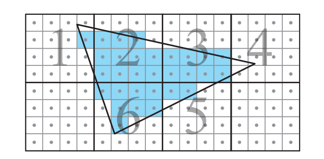

相对于以扫描线顺序来对三角形进行遍历，这种tile遍历的主要优势在于，它可以使得像素处理变得更加连贯（一致性），因此访问纹素的方式也更加连贯。在访问颜色缓冲和深度缓冲的时候，它还可以更好地利用这种局部性，例如：假设我们使用扫描线顺序遍历一个大三角形。我们会对纹素进行缓存处理，以便最近访问的纹素保留在缓存中以供重用。假设我们使用mipmap用于纹理化操作，这增加了缓存中纹素的重用级别。如果我们按照扫描线顺序来访问像素，在到达当前扫描线末尾的时候，扫描线开头所使用的纹素很可能已经从缓存中移除了。由于在缓存中重复使用纹素，要比从内存中重复获取纹素更加高效，因此三角形通常会以tile的形式进行遍历\[651, 1162]。这对纹理化\[651]、深度缓冲\[679]和颜色缓冲\[1463]有很大的好处。事实上，纹理、深度缓冲和颜色缓冲也会被存储在tile中，原因与此相同。这将在章节23.4中进行进一步地讨论。

在三角形遍历开始之前，GPU通常会有一个三角形设置阶段。这一阶段的目的是计算三角形上的常数，以便更加高效地进行遍历，例如：三角形的边缘方程（方程23.2）中的常数$a_i, b_i, c_i, i\in {0,1,2}$会在这里进行一次计算，然后在当前三角形的整个遍历步骤中进行使用。三角形设置还负责计算与属性插值相关的常数（章节23.1.1）。随着讨论的继续，我们还将会发现其他的一些常数，这些常数也可以在三角形设置中只计算一次。

由于裁剪操作可能会产生更多的三角形，因此必须在三角形设置之前进行裁剪。在裁剪空间中根据观察体积对三角形进行裁剪是一个昂贵的过程，所以如果不是绝对必要的话，GPU会避免这样做。但是对近裁剪平面的裁剪总是需要的，这会使得原来的一个三角形，生成一个或者两个新的三角形。对于屏幕边缘而言，大多数GPU都会使用保护带裁剪（guard-band clipping），这是一种更加简单的方案，可以避免更加复杂的完整裁剪过程。该算法的可视化结果如图23.4所示。

### 23.1.1 插值

在章节22.8.1中，重心坐标是计算射线和三角形交点时的副产物。任何顶点属性$a_i, i\in {0,1,2}$，都可以用重心坐标$(u, v)$来进行插值：

$$
a(u, v)=(1-u-v) a_{0}+u a_{1}+v a_{2}
\tag{23.4} 
$$

其中$a(u, v)$是三角形$(u, v)$处的插值属性。重心坐标的数学定义是：

$$
u=\frac{A_{1}}{A_{0}+A_{1}+A_{2}}, \quad v=\frac{A_{2}}{A_{0}+A_{1}+A_{2}}
\tag{23.5}  
$$

其中$A_i$是图23.5左侧所示的子三角形面积。第三个坐标$w=A_{0} /\left(A_{0}+A_{1}+A_{2}\right)$实际上也是定义中的一部分，它表明$u + v + w = 1$，即$w = 1 - u - v$。在这里我们使用$1 - u - v$来代替$w$。

 的三角形。点 \mathbf{p} 的重心坐标与带符号面积 (A_1, A_2, A_0) 成正比。中间：展示了重心坐标 (u, v) 如何在三角形上进行变化。右 侧 ：法线 \mathbf{n}_{2} 实际上就是 \mathbf{p}^0\mathbf{p}^1 逆时针旋转90度后形成的。因此面积 A_2 为 bh/2 。")

方程23.2中的边缘方程，可以使用边缘法线$\mathbf{n}_{2}=\left(a_{2}, b_{2}\right)$来进行表示：

$$
e_{2}(x, y)=e_{2}(\mathbf{p})=\mathbf{n}_{2} \cdot\left((x, y)-\mathbf{p}_{0}\right)=\mathbf{n}_{2} \cdot\left(\mathbf{p}-\mathbf{p}_{0}\right)
\tag{23.6} 
$$

其中$\mathbf{p}=(x, y)$。根据点积的定义，上述方程可以改写为：

$$
e_{2}(\mathbf{p})=\left\|\mathbf{n}_{2}\right\|\left\|\mathbf{p}-\mathbf{p}_{0}\right\| \cos \alpha
\tag{23.7} 
$$

其中$\alpha$是$\mathbf{n}_{2}$和$\mathbf{p}-\mathbf{p}_{0}$之间的夹角。请注意，$b=\left\|\mathbf{n}_{2}\right\|$实际上等于边缘$\mathbf{p}^0\mathbf{p}^1$的长度，因为$\mathbf{n}_{2}$就是这条边缘旋转90度所产生的。第二项$\left\|\mathbf{p}-\mathbf{p}_{0}\right\| \cos \alpha$的几何解释是：将$\mathbf{p}-\mathbf{p}_{0}$投影到$\mathbf{n}_{2}$所得到向量的长度，这个长度正好是子三角形（面积为$A_2$）的高度$h$，如图23.5所示。值得注意的是，我们有$e_{2}(\mathbf{p})=\left\|\mathbf{n}_{2}\right\|\left\|\mathbf{p}-\mathbf{p}_{0}\right\| \cos \alpha=b h=2 A_{2}$，这是一个非常好的特性，因为我们需要子三角形的面积来计算重心坐标。这意味着：

$$
\begin{aligned}
(u(x, y), v(x, y))&=\frac{\left(A_{1}, A_{2}\right)}{A_{0}+A_{1}+A_{2}}
\\[3mm]
&=\frac{\left(e_{1}(x, y), e_{2}(x, y)\right)}{e_{0}(x, y)+e_{1}(x, y)+e_{2}(x, y)}
\tag{23.8} 
\end{aligned} 
$$

在三角形设置阶段中，通常会提前计算$1/A_{0}+A_{1}+A_{2}$，因为三角形的面积是不会发生变化的，这也避免了逐像素的除法操作。因此，当我们使用边缘方程来遍历一个三角形的时候，我们将会得到方程23.8中的所有项，这是内部测试的副产物。重心坐标在为正交投影插值深度的时候表现良好（之后我们将看到这一点）；但是对于透视投影而言，使用重心坐标对深度信息进行插值，并不会生成预期的结果，如图23.6所示。

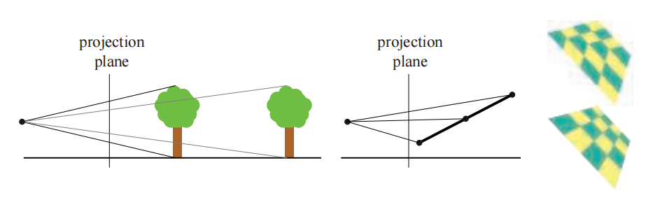

透视正确的重心坐标要求每个像素都进行除法操作\[163, 694]。这里我们省略了推导过程\[26, 1317]，直接总结最重要的结果。由于线性插值成本并不高，并且我们已经知道了如何来计算$(u, v)$，所以我们希望尽可能地在屏幕空间中使用线性插值，即使是用于透视校正。令人惊讶的是，我们可以在三角形上对$a/w$和$1/w$进行线性插值，其中$w$是顶点在经过所有变换后的第四个分量。想要恢复被插值的属性$a$，只需使用这两个插值后的值即可：

$$
\frac{\overbrace{a/w}^{\text{linearly interpolated}}}{\underbrace{1/w}_{\text{linearly interpolated}}} = \frac{aw}{w}=a
\tag{23.9} 
$$

这就是前面提到的逐像素除法。

下面通过一个具体的例子来说明它的效果。假设我们沿着一条水平的三角形边缘进行插值，最左边的属性是$a_0 = 4$，最右边的属性是$a_1 = 6$。那这两个端点中间的值是多少呢？对于正交投影而言（或者当端点的$w$值相匹配时），答案就是$a = 5$，即$a_0$和$a_1$中间的值。

假设两侧端点的$w$值分别为$w_0 = 1$和$w_1 = 3$。在这种情况下，我们需要进行两次插值，从而获得$a/w$和$1/w$。首先对于$a/w$，左侧端点为$4/1 = 4$，右侧端点为$6/3 = 2$，因此中点的值为3。而对于$1/w$左侧端点和右侧端点的值分别是$1/1$和$1/3$，所以中点的值为$2/3$。最后，将二者相除，即将3除以2/3，得到透视投影下的中点值$a = 4.5$。

在实践中，我们经常需要通过对三角形进行透视校正来插值出多个属性。因此，通常都要计算透视正确的重心坐标，我们将其记为$(\tilde{u}, \tilde{v})$，然后将其用于所有的属性插值。为此，我们引入以下若干辅助函数\[26]：

$$
f_{0}(x, y)=\frac{e_{0}(x, y)}{w_{0}}, \quad f_{1}(x, y)=\frac{e_{1}(x, y)}{w_{1}}, \quad f_{2}(x, y)=\frac{e_{2}(x, y)}{w_{2}}
\tag{23.10} 
$$

请注意，由于$e_{0}(x, y)=a_{0} x+b_{0} y+c_{0}$，因此三角形设置可以计算和存储$a_0/w_0$和其他类似的项，从而使得逐像素的计算速度更快。或者，所有$f_i$函数都可以乘以$w_0w_1w_2$，即我们存储$w_{1} w_{2} f_{0}(x, y)$，$w_{0} w_{2} f_{1}(x, y)$和$w_{0} w_{1} f_{2}(x, y)$ \[1159]。因此，透视正确的重心坐标是：

$$
(\tilde{u}(x, y), \tilde{v}(x, y))=\frac{\left(f_{1}(x, y), f_{2}(x, y)\right)}{f_{0}(x, y)+f_{1}(x, y)+f_{2}(x, y)}
\tag{23.11} 
$$

每个像素都需要计算一次，然后使用透视正确的重心坐标来对任何顶点属性进行插值。请注意，这些坐标并不像$(u, v)$那样，与子三角形的面积成正比。此外，其中的分母也不像重心坐标那样是恒定的，这就是必须逐像素进行除法的原因。

最后，请注意，由于像素的深度值是$z/w$，我们可以在方程23.10中看到，我们不应当使用这些方程，因为它们已经除以$w$了。因此，应当计算每个顶点上的$z_i/w_i$，然后再使用$(u, v)$进行线性插值。这有几个优点，例如：可以对深度缓冲进行压缩（章节23.7）。

### 23.1.2 保守光栅化

从DirectX 11开始，或者通过使用OpenGL的扩展，可以使用一种被称为保守光栅化（conservative rasterization，CR）的新型三角形遍历方法。保守光栅化有两种类型，分别是高估CR （overestimate CR，OCR）和低估CR （underestimate CR，UCR）。有时也会被称为外保守光栅化（outer-conservative rasterization）和内保守光栅化（inner-conservative rasterization），如图23.7所示。

粗略地说，OCR会访问所有与三角形重叠或者位于三角形内部的像素，而UCR只会访问完全位于三角形内部的像素。OCR和UCR都可以通过tile遍历的方法进行实现，即将tile大小缩小为一个像素\[24]。当硬件不支持的时候，也可以使用几何着色器或者三角形扩展\[676]来实现OCR。有关CR的更多信息，请参阅相应API的规范。CR可以用于图像空间中的碰撞检测、遮挡剔除、阴影计算\[1930]和抗锯齿等算法。

最后，我们注意到所有类型的光栅化，都是几何处理和像素处理之间的桥梁。为了计算三角形顶点的最终位置和计算像素的最终颜色，GPU需要大量灵活的计算能力。我们将在下一小节中对此进行解释和介绍。

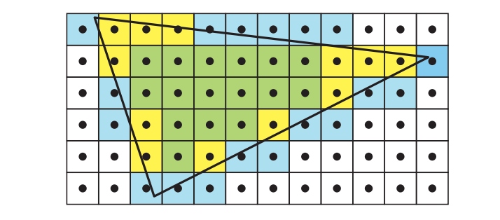

## 23.2 大规模计算和调度

为了提供可用于任意计算的大规模计算能力，大多数GPU架构都采用了统一的着色器架构，使用多线程的SIMD处理，有时被称为SIMD处理或者超线程（hyperthreading）。有关线程、SIMD处理、warp和线程组的术语，详见章节3.10。请注意，这里我们使用了术语warp，这是NVIDIA的术语；而在AMD硬件中，它们被称为wave或者wavefront。在本小节中，我们将首先介绍GPU中使用的一种典型统一算术逻辑单元（arithmetic logic unit，ALU）。

ALU是一个硬件单元，它针对单个实体（例如顶点或者片元）的执行程序进行优化。有时候我们会使用术语SIMD通道（lane）而不是ALU。一个典型的GPU ALU如图23.8所示。其中主要的计算单元是一个浮点（FP）单元和一个整数单元。FP单元通常遵循IEEE 754 FP标准，并支持FMA（fused-multiply and add）指令，这是其最复杂的指令之一。除了超越操作（例如余弦、正弦和指数）之外，ALU通常还会包含移动/比较、加载/存储等功能，以及一个分支单元。应当注意的是，在某些架构中，其中一些功能可能会位于独立的硬件单元中，例如：使用一小组专门执行超越操作的硬件单元，可以为大量的ALU服务。对于不是经常执行的操作而言，可能就会进行这样的处理。它们在特殊单元（special unit，SU）中被组合在一起，如图23.8中右侧所示。ALU架构通常会使用几个硬件流水线阶段进行构建，也就是说，存在若干个在硅芯片中构建的、可以并行执行的实际硬件块，例如：在当前指令执行乘法的时候，下一条指令可以读取寄存器。在理想情况下，如果有$n$个流水线阶段，那么ALU的吞吐量可以增加$n$倍。这通常被称为流水线并行（pipeline parallelism）。使用流水线的另一个重要原因是，流水线处理器中最慢的那个硬件块，决定了这个块可以执行的最大时钟频率。增加流水线阶段的数量，可以降低每个流水线阶段的所使用的硬件块数量，通常这会使得增加时钟频率成为可能。然而，为了简化设计，ALU通常只会有很少的流水线阶段，例如4-10个。

统一ALU与CPU核心的不同之处在于，它没有很多花哨的东西，例如分支预测（branch prediction）、寄存器重命名（register renaming）和深度指令流水线（deep instruction pipelining）等。相反，芯片的大部分面积都花在了复制ALU上，从而提供巨量的计算能力；以及增加寄存器堆的大小，以便可以切换warp。例如：NVIDIA GTX 1080 Ti有3584个ALU。为了能够高效调度分发给GPU的工作，大多数GPU会将ALU分为一组32个。同一组内的ALU是锁步执行的，这意味着整个32个ALU的集合是一个SIMD引擎。不同的厂商对这类硬件单元以及其他的一些硬件单元使用不同的名称，这里我们使用通用术语多处理器（multiprocessor，MP）。例如：NVIDIA使用术语流多处理器（streaming multiprocessor，SM），英特尔使用执行单元（execution unit），而AMD则使用计算单元（compute unit，CU）。图23.8中展示了MP的一个例子。一个MP通常会有一个调度程序，来将工作分派给SIMD引擎，还有一个L1缓存、本地数据存储（local data storage，LDS）、纹理单元（TX），以及一个特殊单元，它负责处理ALU中无法执行的指令。MP将指令分派到各个ALU，在ALU中指令会以锁步的方式进行执行，即SIMD处理（章节3.10）。请注意，一个MP中的实际内容，会因为供应商和不同代的架构而异。

SIMD 处理对于图形工作负载是有意义的，因为会有许多执行相同程序的顶点和片元。这里，该架构利用了线程级并行（thread-level parallelism），也就是说，顶点和片元可以独立于其他的顶点和片元，独立执行它们的着色器程序。此外，对于任何类型的SIMD/SIMT处理，都可以利用数据级并行（data-level parallelism），因为一条指令会在SIMD机器中的所有lane上执行。还有指令级并行（instruction-level parallelism），这意味着如果处理器能够找到相互独立的指令，那么它们也可以同时执行，当然前提是有可以并行执行的资源。

与MP相近的是一个（warp）调度器，它会接收将要在MP上执行的大块工作。warp调度器的任务是将warp中的工作分配给MP，并将寄存器堆（RF）中的寄存器分配给warp中的线程，然后以最佳方式来确定工作的优先级。通常来说，下游工作要比上游工作具有更高的优先级，例如：像素着色位于可编程阶段的末尾，它具有比顶点着色（位于管线的早期阶段）更高的优先级。这样设计是避免了停滞，因为接近末尾的阶段不太可能阻塞较早的阶段。关于图形管线的回顾与复习，详见图3.2。一个MP可以处理数百甚至数千个线程，从而隐藏内存访问等带来的延迟。调度器可以将MP上正在执行（或者等待）的warp切换到另一个准备执行的warp。由于这个调度器是在专用硬件中进行实现的，因此这个切换操作通常是零开销的\[1050]。例如：如果当前warp执行了一条纹理加载的指令，而这条指令预计会有很长的延迟，那么调度器可以立即切换出当前warp，替换为另一个warp，并继续执行这个已经准备好的warp。通过这种方式，可以更好地利用计算单元，避免发生等待和停滞。

请注意，对于像素着色工作，warp调度器会分配几个完整的四边形（quad），这是因为像素是在四边形粒度上进行着色的，从而允许计算导数。这一点我们在章节23.1节提到过，后续将在章节23.8中进一步讨论。因此，如果一个warp的大小为32，那么$32/4 = 8$，即有8个四边形可以被安排执行。这里有一个架构设计上的选择，我们可以选择将整个warp都锁定在一个三角形上；或者让warp中的每个四边形属于不同的三角形。前者实现起来比较简单，但是对于较小的三角形而言，效率会受到影响，因为这些较小的三角形可能凑不满8个四边形。后者要更为复杂，但是对于较小的三角形而言会更加高效。

一般来说，为了在芯片上获得更高的计算密度，MP也会被复制，因此，GPU通常也会具有更高级别的调度器。这个高级别调度器的任务是根据提交给GPU的工作，将这些工作分配给不同的warp调度器。在一个warp中包含多个线程，通常也意味着一个线程的工作需要与其他线程相独立。当然，这在图形处理中是经常出现的，例如：一个顶点的着色处理通常不会依赖于其他顶点，一个片元的颜色通常也不会依赖于其他片元。

请注意，不同架构之间存在许多差异。其中一些将在章节23.10中进行重点说明，我们将介绍几个不同的实际案例研究。到目前为止，我们知道了光栅化是如何完成的，以及如何使用许多重复的统一ALU来计算着色。剩下一大块内容是内存系统、所有相关的缓冲区和纹理。从章节23.4开始，我们将讨论这些主题，但是首先我们要介绍一些有关延迟和占用率的更多信息。

## 23.3 延迟和占用率

一般来说，延迟是指从发起查询到接收结果之间的时间。举个例子：我们可能会请求内存中某个地址中的值，从发起查询到得到结果之间所花费的时间就是延迟。另一个例子是从纹理单元中请求过滤后的颜色，从发起请求到这个值可以使用，中间可能会需要数百甚至数千个时钟周期。为了高效利用GPU中的计算资源，我们需要隐藏这个延迟。如果不隐藏这些延迟的话，那么内存访问很容易会占据大部分执行时间。

其中一种隐藏延迟的机制，是SIMD处理的多线程部分，如图3.1所示。一般来说，一个MP可以处理的warp数量是有上限的。能够处于活跃状态的warp数量取决于寄存器的使用量，也可能会取决于纹理采样器、L1缓存、插值和其他因素的使用量。这里，我们将占用率（occupancy）$o$定义为：

$$
o=\frac{w_{\text {active }}}{w_{\max }}
\tag{23.12} 
$$

其中$w_{max}$是一个MP上允许的最大warp数，$w_{active}$是当前活跃的warp数。也就是说，占用率$o$是计算资源使用情况的指标，举个例子：假设$w_{max}= 32$，一个着色处理器有256 kB大小的寄存器；而现在有一个单线程着色程序会使用27个32 bit浮点寄存器，另一个则会使用150个32 bit浮点寄存器。此外，我们假设此时寄存器的使用量决定了活跃warp的数量。假设这里的SIMD宽度为32，我们可以分别计算这两种情况下的活跃warp数量：

$$
w_{\text {active }}=\frac{256 \cdot 1024}{27 \cdot 4 \cdot 32} \approx 75.85, \quad w_{\text {active }}=\frac{256 \cdot 1024}{150 \cdot 4 \cdot 32} \approx 13.65
\tag{23.13} 
$$

在第一种情况下，即对于使用27个寄存器的较短程序而言，$w_{active}>32$，因此其占用率为$o = 1$，这是理想状态下的情况，它是隐藏延迟的好兆头。而在第二种情况下，$w_{\text {active }} \approx 13.65$，因此$o \approx 13.65 / 32 \approx 0.43$，由于此时活跃的warp数量较少，因此相应的占用率也较低，这可能会阻碍延迟的隐藏。因此，设计一个较为均衡的最大warp数、最大寄存器和其他共享资源的架构十分重要。

有时候过高的占用率反而会适得其反，因为如果我们的着色器使用了过多的内存访问，它反而可能会破坏缓存\[1914]。另一种延迟隐藏机制是在内存请求之后，继续执行这个相同的warp，如果存在独立于内存访问结果的指令的话，那么这就是可能的。虽然这样会使用更多的寄存器，但是有时候低占用率反而会更高效\[1914]。一个例子就是循环展开（loop unrolling），它为实现指令级并行提供了更多的可能性，因为这样做通常会生成更长的独立指令链，这使得在切换warp之前，可以执行更长的时间。但是这也会使用更多的临时寄存器。通用的准则是争取更高的占有率，低占用率意味着当着色器在请求纹理访问时，不太可能切换到另一个warp，因为根本没有更多的warp了。

另一种类型的延迟是从GPU回读数据到CPU中所带来的延迟。一个好的思维模型是，将GPU和CPU视为异步工作的独立计算机，二者之间的数据通信需要很大的开销。改变信息流向所带来的延迟会严重影响性能表现。当从GPU回读数据时，可能必须在读取之前刷新管线。在此期间，CPU必须等待GPU完成其工作。对于诸如英特尔的GEN架构\[844]，GPU和CPU位于同一芯片上，并且使用共享内存模型，对于这类架构而言，这种类型的延迟会大大降低。低级缓存会在CPU和GPU之间进行共享，而高级缓存则不会进行共享。共享缓存所带来的延迟降低，允许使用不同类型的优化和其他类型的算法。例如：这个特性已经被用于对光线追踪进行加速，其中光线会在GPU和CPU核心之间来回进行传输，并且不会带来额外的开销\[110]。

有一个不会导致CPU停滞的回读机制，就是遮挡查询（occlusion query），详见章节19.7.1。对于遮挡测试而言，其机制是首先执行遮挡查询，然后偶尔对GPU进行检查，来看看查询的结果是否可用。在等待结果的同时，其他的一些工作可以继续在CPU和GPU上完成。

## 23.4 内存架构和总线

在本小节中，我们将介绍一些相关术语，讨论几种不同类型的内存架构，然后再介绍一下压缩和缓存。

端口（port）是指两个设备之间发送数据的通道，总线（bus）是指两个以上设备之间发送数据的共享通道。带宽（bandwidth）是一个用来描述端口或者总线上数据吞吐量的术语，单位是每秒字节数（B/s）。端口和总线在计算机图形体系结构中十分重要，因为简单来说，它们将不同的构建块粘合在了一起。同样重要的是，带宽是一种稀缺资源，因此在构建图形系统之前，必须进行仔细的设计和分析。由于端口和总线都提供数据传输功能，因此端口通常也被称为总线，这里我们将遵循这个约定，将二者统称为总线。

对于许多GPU而言，在图形加速器上拥有专属的GPU内存是很常见的，这种内存通常被称为显存（video memory）。相对于让GPU通过总线访问系统内存而言，访问这种内存的速度通常要快得多，例如：PC中使用的PCI Express （PCIe），16通道PCIe v3的双向速率为15.75 GB/s，PCIe v4的双向速率为31.51 GB/s。然而，Pascal架构的显存（GTX 1080）可以提供320 GB/s的传输速度。

传统上，纹理和渲染目标都会存储在显存中，但是显存也可以用于存储其他数据。例如：场景中的许多物体在帧与帧之间并没有明显的形状变化。即使是人类角色，通常也会使用一组不变的网格来进行渲染，这些网格在关节处使用GPU侧的顶点混合。对于这种纯粹通过模型矩阵和顶点着色器程序来生成动画的数据，通常会使用静态的顶点缓冲区（vertex buffer）和索引缓冲区（index buffer），它们被存储在显存中，这样做可以让GPU进行快速访问。对于每帧由CPU进行更新的顶点数据，可以使用动态的顶点缓冲区和索引缓冲区，这些缓冲区放置在系统内存中，可以通过总线（例如PCI Express）进行访问。PCIe的一个优点是查询可以被流水线化，因此可以在结果返回之前请求多个查询。

![图23.9：英特尔SoC（system-on-a-chip，单芯片系统）上Gen9图形架构中的内存架构简化示意图，该架构与CPU核心和一个共享内存模型相连。请注意，最后一级缓存（LLC）在图形处理器和CPU内核之间进行共享。 \[844\]](images/Chapter-23/202310161925307.png "图23.9：英特尔SoC（system-on-a-chip，单芯片系统）上Gen9图形架构中的内存架构简化示意图，该架构与CPU核心和一个共享内存模型相连。请注意，最后一级缓存（LLC）在图形处理器和CPU内核之间进行共享。 \[844]")

大多数游戏主机（例如所有的Xbox系列主机和PLAYSTATION 4），都使用了统一内存架构（unified memory architecture，UMA），这意味着图形加速器可以使用主机系统内存中的任何部分，来处理纹理和不同类型的缓冲区\[889]。CPU和图形加速器都使用了相同的内存，因此也都使用相同的总线。这种内存架构与使用专用显存具有明显区别。Intel也使用UMA架构，使得内存在CPU内核和GEN9图形架构之间进行共享\[844]，如图23.9所示。但并非所有缓存都是共享的，图形处理器有着属于自己的一组L1高速缓存、L2高速缓存和L3高速缓存。最后一级缓存（last-level cache，LLC）是存储层次结构中的第一个共享资源。对于任何计算机或者图形架构而言，拥有一个缓存层次结构都是很重要的。如果访问中存在某种局部性，那么这样做可以减少对内存的平均访问时间。在下一小节中，我们将讨论GPU中的缓存和压缩。

## 23.5 缓存和压缩

缓存位于GPU的几个不同部分，而且会因架构而异，我们将在章节23.10中看到。通常来说，在架构中添加一个缓存层次结构的目的，是通过利用内存访问模式的局部性，来减少内存延迟和带宽使用。这里的内存访问局部性，是指如果GPU访问一个了内存中的一项数据，那它很有可能马上就会再次访问这个相同的项或者访问其附近的项\[715]。大多数缓冲区和纹理格式都会以分块（tile）格式进行存储，这也有助于增加局部性\[651]。假设一个缓存行（cache line）由512 bit组成，即64 byte，而当前使用的颜色格式为每像素4 B。一种设计选择是将所有像素都存储在一个$4 × 4$的区域中，即一个tile 64 B，也就是说，整个颜色缓冲区将被分割为$4 × 4$的tile。一个tile也可以跨越多个缓存行。

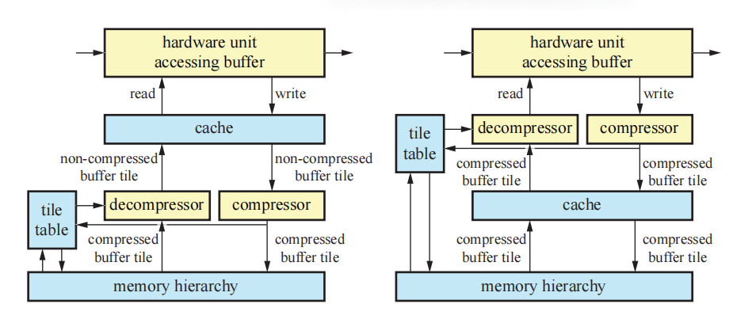

为了获得高效率的GPU架构，需要在各个方面努力减少带宽使用。大多数GPU中都包含相应的硬件单元，可以进行对渲染目标进行动态压缩和解压缩，例如在渲染图像的时候。很重要的一点是，需要认识到这些类型的压缩算法都是无损的，也就是说，总是可以精确地恢复原始数据。这些算法的核心就是我们所说的分块表（tile table），它为每个tile存储了额外的信息。它们可以存储在芯片上，或者在内存层次中通过缓存进行访问，这两类系统的结构如图23.10所示。一般来说，同样的设置可以用于深度缓冲、颜色缓冲和模板缓冲的压缩，有时候还需要进行一些修改。分块表中的每个元素会存储tile像素在framebuffer中的状态，每个tile的状态可以是已压缩（compressed）、未压缩（uncompressed）或者被清除（cleared）（接下来会进行讨论）。一般来说，也可以有不同类型的压缩块，例如：一种压缩模式可能会压缩到25%，而另一种则可能会压缩到50%。最重要的是要认识到，这个压缩级别取决于GPU可以处理的内存传输大小。假设在一种特定的架构中，最小的内存传输是32 B。此时如果选择64 B的分块大小，那么就只能压缩到50%。然而，对于128 B大小的贴图而言，则可以选择压缩到75% （96 B）， 50% （64 B）和25% （32 B）。

这个分块表也经常会用于实现渲染目标的快速清除。当系统发出清除渲染目标的指令时，表中每个tile的状态会被设置为已清除，而不会触及framebuffer本身。当访问渲染目标的硬件单元需要读取已清除的渲染目标时，解压器（decompressor）会首先检查分块表中的状态，来查看tile是否已经被清除。如果是，则将渲染目标对应的tile放置在缓存中，并将所有值都设置为clear值，而不需要对实际的渲染目标数据进行读取和解压缩。通过这种方式，在清除期间对渲染目标本身的访问可以被最小化，从而节省带宽。如果状态未被清除，则必须读取该tile所对应的渲染目标。存储在tile上的数据会被读取，如果其中的数据处于压缩状态的话，则会在发送出去之前通过解压缩器进行解压。

当访问渲染目标的硬件单元完成了新值的写入，并且最终从缓存中移除这个tile的时候，它会被发送到压缩器（compressor）中，并在那里尝试对其进行压缩。如果有两种压缩模式，那么两种模式都可以进行尝试，并且使用能够以最少bit对其该tile进行压缩的模式。由于API需要无损的渲染目标压缩结果，因此如果所有压缩技术都失败了，则需要退回到使用未压缩的数据。这也意味着渲染目标的无损压缩，永远无法减少实际渲染目标中的内存使用，这种技术只会减少内存带宽的开销。如果压缩成功了，那么该tile的状态会被设置为已压缩，并以压缩形式发送信息。否则会以未压缩形式进行发送，状态也会相应地设置为未压缩。

注意，压缩器单元和解压器单元可以位于缓存之后（称为post-cache），也可以位于缓存之前（称为预缓存，pre-cache），如图23.10所示。预缓存压缩可以大幅增加有效缓存的大小，但是通常也会增加系统的复杂性\[681]。有些特定的算法可以用于压缩深度\[679, 1238, 1427]和颜色\[1427, 1463, 1464, 1716]。后者还包括了对有损压缩的研究，然而，据我们所知，在任何硬件中都没有使用这种方法\[1463]。大多数算法都编码了一个锚点值（anchor value），它代表了一个tile中的所有像素，然后根据这个锚点值，以不同的方式对差异进行编码。对于深度数据而言，通常会存储一组平面方程\[679]或者使用一种双重差分方法（difference-of-differences）\[1238]，这两种方法都可以得到很好的结果，因为深度在屏幕空间中是线性的。

## 23.6 颜色缓冲

使用GPU进行渲染，涉及到对几个不同缓冲区的访问，例如颜色缓冲、深度缓冲、模板缓冲。请注意，虽然它被称为“颜色”缓冲区，但是实际上任何类型的数据都可以在其中进行渲染和存储。

根据表示颜色的字节数量，颜色缓冲区通常会有几种不同的颜色模式。这些模式包括：

-   高彩色（High color）：每像素2 byte，其中有15 bit或者16 bit用于颜色，分别可以表示32,768和65,536种颜色。
-   真彩色（True color，RGB color）：每像素3 byte或者4 byte，其中24 bit用于表示颜色，可以获得$16777216\approx 1680$万种不同的颜色。
-   深彩色（Deep color）：每像素30 bit，36 bit或者48 bit，至少可以产生10亿种不同的颜色。

其中high color模式有16 bit的颜色分辨率可以使用。通常，这个数值会被划分为至少5个bit，分别代表红色、绿色和蓝色，每个颜色通道种包含32个等级。这样还剩下1 bit，通常会给绿色通道，这样就产生了一种5-6-5的划分方法。选择绿色通道是因为绿色对眼睛的亮度影响最大，即人眼对绿色最为敏感，因此需要更高的精度。high color要比true color和deep color具有速度上的优势，这是因为访问每个像素2 byte的内存，通常要比访问每个像素3 byte或者更多的内存要快。但是，high color模式的使用在这里实际上是非常罕见的，甚至根本不会使用high color模式。这是因为每个通道中只有32个或者64个级别的颜色，相邻颜色级别之间的差异可以很容易地分辨出来。这个问题有时被称为色带（banding）或者色调分离（posterization）。由于一种称为马赫带（Mach banding）\[543, 653]的感知现象，人类的视觉系统会进一步放大了这种差异，如图23.11所示。抖动（dither）方法\[102, 539, 1081]，即相邻的颜色水平被混合在一起，可以通过牺牲空间分辨率，来增加有效的颜色分辨率，从而减少这样效应的影响。但是，即使是在24 bit显示器上，这种渐变的带状效果也会很明显。向帧缓冲图像种添加噪声可以掩盖这个问题\[1823]。

true color使用了24 bit RGB颜色（共3 byte），每个颜色通道1 byte。在PC系统上，存储顺序有时会被颠倒为BGR。在内部，这些颜色通常会使用每像素32 bit（共4 byte）来进行存储，因为大多数内存系统都是针对访问4 byte元素进行优化的。在某些系统上，额外的8 bit也可以用来存储alpha通道，即赋予像素一个RGBA值。24 bit颜色（无alpha）表示也被称为打包像素格式（packed pixel format），与32 bit的未打包格式相比，它可以节省framebuffer的内存占用。对于实时渲染而言，使用24 bit颜色几乎总是可以接受的。虽然仍然有可能看到颜色条带，但是要比只有16 bit的情况少得多。

对于RGB颜色，deep color可以使用30 bit、36 bit或者48 bit来进行表示，即每个通道使用10 bit、12 bit或者16 bit。如果加上alpha通道，那么这些数字将增加到40/48/64。HDMI 1.3支持所有30/36/48模式，DisplayPort标准也支持每通道最多16 bit。

颜色缓冲通常都会被压缩和缓存，如章节23.5所述。此外，在章节23.10的每个案例研究中，都进一步描述了如何将传入的片元数据与颜色缓冲混合。这个混合由光栅操作（raster operation，ROP）单元进行处理，每个ROP通常会连接到一个内存分区，例如使用通用的棋盘格模式\[1160]。接下来我们将对视频显示控制器进行讨论，它接收一个颜色缓冲区，并将其显示在显示器上。然后我们再介绍单缓冲、双缓冲和三缓冲。

### 23.6.1 视频显示控制器

在每个GPU中，都有一个视频显示控制器（video display controller，VDC），也被称为显示引擎（display engine）或者显示接口（display interface），它负责将一个彩色缓冲区输出到显示器上。它是GPU中的一个硬件单元，可以支持多种接口，例如HDMI（高清多媒体接口，high-definition multimedia interface）、DisplayPort（DP）、DVI（数字视频接口，digital visual interface）和VGA（视频图形阵列，video graphics array）等。要显示的颜色缓冲区可能会位于不同的存储器中，例如：CPU用于执行该任务的相同内存中、专用的帧缓冲存储器中、视频存储器中，后者可以包含任何GPU数据，但是CPU无法直接进行访问。每个接口都使用各自的标准协议，来传输颜色缓冲中的部分内容、时间信息，有时甚至可以是音频信息。VDC还可以执行图像缩放、降噪、合成多个图像源等功能。

显示器（例如液晶显示器LCD）更新图像的速度通常在每秒60到144次（赫兹Hz）之间，这也被称为垂直刷新率（vertical refresh rate）。大多数观众会在低于72 Hz的刷新率下注意到闪烁现象。有关此主题的更多信息，详见章节12.5。

显示器技术在很多方面都取得了进步，包括刷新率、每分量的比特数、色域和同步技术等。过去的刷新率通常是60 Hz，但是现在120 Hz也变得越来越普遍，甚至可以达到600 Hz。对于高刷新率的显示器而言，图像通常会被显示多次，有时还会插入黑色帧，从而尽量减少由于帧显示期间，由于眼睛移动而造成的模糊伪影\[7, 646]。显示器中的每个通道也可以超过8 bit，同时HDR显示器可能会成为下一个重大的显示技术革新，其中每个通道可以使用10 bit甚至更多。杜比的HDR显示技术使用了低分辨率的LED背光阵列来增强他们的LCD显示器，这样做可以使得显示器的亮度是普通显示器的10倍，对比度是普通显示器的100倍\[1596]。更宽色域的显示器也正在变得越来越普遍，由于能够表示纯光谱色调（pure spectral hue），例如更加鲜艳的绿色，这些显示器可以显示更加广泛的颜色范围。有关色域的更多信息，详见章节8.1.3。

为了减少画面撕裂效应，一些公司开发了自适应的同步技术，例如AMD的FreeSync和NVIDIA的G-sync。这里的想法是对显示器的刷新率进行动态调整，而不是使用固定的显示器刷新率，从而适应GPU能够产生的显示帧率。例如：如果某一帧需要10毫秒来进行渲染，而下一帧需要30毫秒来进行渲染，那么可以在每个图像完成渲染之后，立即开始对需要显示的图像进行更新。使用这些技术，可以使得渲染看起来更加流畅。此外，如果图像不进行更新的话，那么就不需要将颜色缓冲发送到显示器中，这样还可以省电。

### 23.6.2 单、双、三重缓冲

在章节2.4中，我们提到过双缓冲机制是为了确保在渲染完成之前，图像不会显示在屏幕上。在这里，我们将介绍单缓冲、双缓冲甚至三缓冲机制。

假设我们现在只有一个缓冲区，那么这个缓冲区必须是当前显示在显示器上的那个。当绘制一个帧画面中的三角形时，随着显示器的刷新，屏幕上会出现越来越多的三角形，这是一个难以令人信服的效果。即使我们的帧率等于显示器的刷新率，这种单缓冲也会存在问题。如果我们决定清除缓冲区或者绘制一个较大的三角形，那么当视频显示控制器传输正在绘制的部分颜色缓冲区时，我们将短暂地看到颜色缓冲区中的实际部分变化。这种现象有时会称为撕裂（tearing），因为显示的图像看起来就像是被短暂地撕成了两半一样，这不是实时图形所希望的功能和效果。在一些古老的系统上（例如Amiga），我们可以测试光束的位置，从而避免在那里进行绘制，从而使得单缓冲也能够正常运行。如今，单缓冲已经很少使用了，虚拟现实系统可能是为数不多的例外，“与光束赛跑（racing the beam）”是一种可以减少延迟的方法\[6]。

为了避免撕裂问题，我们通常会使用双缓冲机制。完成的图像显示在前置缓冲区（front buffer）中，而屏幕外的后置缓冲区（back buffer）中则包含了当前正在绘制的图像。后置缓冲和前置缓冲会由图形驱动进行交换，这个交换通常会发生在整个图像转移到显示器之后，从而避免撕裂现象。这种交换操作通常通过交换两个颜色缓冲区的指针来完成的。对于CRT显示器而言，这个事件被称为垂直回扫（vertical retrace），在这段时间内的视频信号被称为垂直同步脉冲（vertical synchronization pulse），简称垂直同步（vsync）。对于LCD显示器而言，并不会发生光束的物理回扫，但是我们会使用相同的术语，来表示整个图像刚刚被转移到显示器上。在图像渲染完成之后立即交换前后缓冲区，这对于测试渲染系统而言非常有用，并且也用于许多应用程序中，因为这样可以最大化帧率。不在垂直同步上进行更新也会导致撕裂现象，但是由于我们此时有了两个完整形成的图像，因此这里的瑕疵并不像单一缓冲时的那么糟糕。在交换完成之后，（新的）后置缓冲区会立即成为图形命令的接收方，而新的前置缓冲区则会显示给用户。这个过程如图23.12所示。

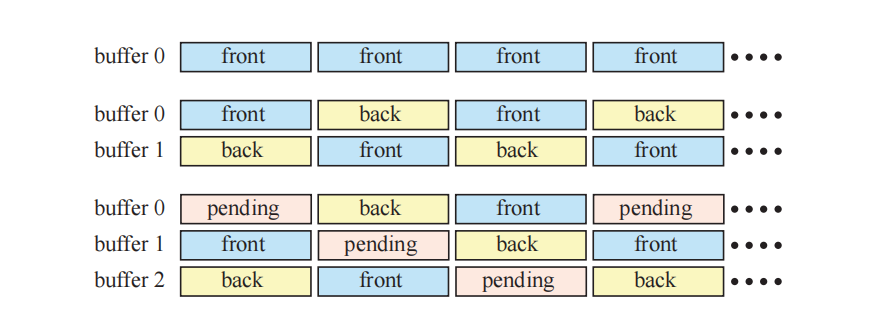

双缓冲机制还可以通过第二个后置缓冲来进行增强\[1155]，我们称之为等待缓冲区（pending buffer），这种机制被称为三缓冲。这个等待缓冲区与后置缓冲区相类似，因为它也是一个离屏缓冲区，并且可以在显示前置缓冲区时对其进行修改。等待缓冲区是三缓冲循环中的一部分，在一帧期间，我们可以访问这个等待缓冲区。而在下一次交换时，它将成为新的后置缓冲区，并在此完成渲染。然后，它会成为新的前置缓冲区，并显示给观察者。而在下一次交换的时候，这个缓冲区会再次变为等待缓冲区。这个过程可以在图23.12底部直观地看到。

与双缓冲机制相比，三缓冲有一个主要优势，即系统可以在等待垂直回扫的时候访问这个等待缓冲区。使用双缓冲机制，当我们在等待垂直回扫完成以便可以进行交换的时候，相关的构造函数必须一直进行等待。这是因为前置缓冲区此时必须显示给观察者，而后置缓冲区则必须保持不变，因为其中存储了一个已经完成的图像，这个图像正在等待显示。三缓冲机制的缺点在于会增加一帧的延迟，它会延迟对用户输入（例如按键、鼠标或者操纵杆移动）的反应。控制可能会感觉变得缓慢，因为这些用户事件会在等待缓冲区开始渲染之后才会被更新，因此会被延迟。

理论上，我们可以使用3个以上的缓冲区。如果每帧计算的时间差异很大，那么更多的缓冲区会带来更多的平衡，以及更高的整体显示速率，但代价是更多的潜在延迟。概括地说，多缓冲机制可以被认为是一种循环结构，它有一个渲染指针和一个显示指针，分别指向不同的缓冲区。其中的渲染指针会对显示指针进行引导，并在当前渲染缓冲区计算完成的时候，移动到下一个缓冲区上。唯一的规则就是显示指针永远不会与渲染指针相同，即不会指向相同的缓冲区。

为PC图形加速器实现额外加速的一种相关方法是使用SLI模式。早在1998年，3dfx公司就使用SLI来作为扫描线交错（scanline interleave）的缩写，其中两个图形芯片组会并行运行，其中一个处理奇数扫描线，另一个处理偶数扫描线。NVIDIA（收购3dfx资产的公司）使用这个缩写来表示可扩展的链接接口（scalable link interface），用于表示连接两个（或者更多）显卡的技术，它与前面的扫描线交错完全不同。AMD将其称为CrossFire X（译者注：一般叫做显卡交火）。这种形式的并行化，是通过将屏幕划分成两个（或者更多）水平部分来实现的，其中每张显卡负责渲染其中的一部分，或者是让每张显卡负责渲染自己的帧，然后进行交替输出。还有一种模式允许显卡对相同帧的抗锯齿进行加速。最常见的做法是让每个GPU渲染一个单独的帧，被称为交替帧渲染（alternate frame rendering，AFR）。虽然这种方案听起来似乎会增加延迟，但是它通常几乎没有影响。假设单个GPU的系统以10 FPS的速度进行渲染。如果此时GPU是性能瓶颈的话，那么两个使用AFR机制的GPU，可以以20 FPS的速度进行渲染，甚至四个GPU可以以40 FPS的速度进行渲染。每个GPU都会花费相同的时间来渲染自己负责的一帧，因此不一定会改变延迟。

由于屏幕分辨率的不断提高，这为基于像素采样的渲染器带来了严峻的挑战。保持帧率的一种方法是，自适应改变屏幕上\[687, 1805]和表面上\[271]的像素着色率。

## 23.7 深度剔除、测试和缓冲

在本小节中，我们将介绍与深度相关的所有内容，包括深度缓冲的分辨率、深度测试、基于深度的剔除、深度压缩、深度缓存、深度缓冲和early-z。

深度的分辨率十分重要，因为它有助于避免渲染错误。例如：假设我们想要模拟一张放置在桌子上的纸，这张纸略高于桌子的表面。如果桌面和纸张的$z$深度具有精度限制，那么桌面可能会在不同的位置上穿透纸张，这个问题有时被称为z-fighting。请注意，如果这个纸张与桌面具有完全相同的高度，即纸张和桌面共面，那么在没有额外信息的情况下，我们是无法正确判断二者的位置关系的。这个问题的原因是由于糟糕的建模，它无法通过更好的$z$精度来解决。

正如我们在章节2.5.2中所看到的，z-buffer（也叫深度缓冲）可以用来解决可见性问题。这种缓冲区通常会在每个像素上（或者样本）具有24 bit或者32 bit，并且可以使用浮点数表示或者定点数表示\[1472]。对于正交投影而言，这个距离值与$z$值成正比，即深度是均匀分布的（线性）。然而，对于透视投影而言，深度是不均匀分布的（非线性）。在应用透视变换之后（方程4.74或者方程4.76），还需要除以$w$分量（方程4.72）。此时深度分量会变为$p_z = q_z/q_w$，其中点$\mathbf{q}$是与投影矩阵相乘后的点。对于定点数表示法，值$p_z = q_z/q_w$会从其有效范围（例如：DirectX的$[0,1]$）映射到整数范围$[0,2^{b−1}]$内，并存储在z-buffer中，其中$b$是bit数。有关深度精度的更多信息，详见章节4.7。

![图23.13：一种深度管线的可能实现方式，其中的 z 插值模块（z-interpolate）会使用插值来直接计算深度值。 \[46\]](images/Chapter-23/202310171022560.png "图23.13：一种深度管线的可能实现方式，其中的 z 插值模块（z-interpolate）会使用插值来直接计算深度值。 \[46]")

硬件的深度管线如图23.13所示，这个管线的主要目标是，在对一个图元进行光栅化的时候，对每个传入深度进行测试，当某个片元通过了深度测试，可能会将传入的深度写入到深度缓冲区中的对应位置。同时，这个管线必须十分高效。图的左侧部分从粗光栅化（coarse rasterization）开始，即在tile级别上进行光栅化（章节23.1）。此时，只有与图元重叠的tile才会被传递到下一阶段中，即所谓的HiZ单元，即执行z-culling技术的阶段。

HiZ单元从一个被称为粗深度测试（coarse depth test）的块开始，这里通常会执行两种类型的测试。我们首先介绍$z_{max}$剔除，它是Greene层次$z$缓冲算法的简化\[591]，我们在章节19.7.2中进行了介绍。这个想法是在每个tile中存储所有深度的最大值，称为$z_{max}$。具体的tile大小与架构相关，通常会使用$8 × 8$像素\[1238]。这些$z_{max}$值可以存储在固定的片上存储器中（on-chip memory），或者是通过缓存进行访问。在图23.13中，我们将其称为HiZ缓存。简单来说，我们想测试三角形是否完全被这个tile遮挡。为此，我们需要计算这个tile中三角形的最小$z$值$z^{tri}_{min}$。如果$z_{\min }^{\operatorname{tri}}>z_{\max }$，那么可以保证这个三角形被该tile中先前渲染的几何物体所遮挡。因此可以终止对该tile中三角形的后续处理，这样就节省了逐像素的深度测试。请注意，它不会产生任何像素着色器的调用和执行，因为逐样本的深度测试将会移除在管线中被遮挡的片元。在实际应用中，我们无法计算出$z^{tri}_{min}$的确切值，因此只能计算一个保守的估计值。计算$z^{tri}_{min}$有几种不同的方法，每种方法都有自己的优缺点：

1.  可以使用三角形三个顶点中的最小$z$值。这种方法并不总是准确的，但是开销很小。
2.  使用三角形的平面方程，计算处该tile四个角点的$z$值，并使用其中的最小值。

将这两种策略结合使用，可以获得最佳的剔除性能，这是通过取两个$z_{min}$值中较大的那个来实现的。

另一种类型的粗深度测试是$z_{min}$剔除，其思想是将所有像素的$z_{min}$存储在一个tile中\[22]。它有两种用途，首先，它可以用来避免z-buffer的读取。对于正在渲染的三角形，如果我们能够绝对确保它位于所有之前渲染的几何图形前面，那么就没有必要进行逐像素的深度测试了。在某些情况下，这种z-buffer的读取是可以完全避免的，这进一步提高了性能。其次，它可以用于支持不同类型的深度测试。对于$z_{max}$剔除方法，我们假设使用标准的“小于（less than）”深度测试。但是，如果可以将剔除与其他深度测试一起使用，并且如果$z_{min}$和$z_{max}$都是可用的时候，那么使用这个剔除过程可以支持所有类型的深度测试，这将是十分有益的。有关深度管线更加详细的硬件描述，详见Andersson的博士论文\[49]。

图23.13中的绿色方框代表了更新tile中$z_{min}$和$z_{max}$的不同方式。如果三角形覆盖了整个tile，那么可以直接在HiZ单元中进行更新。否则，就需要读取整个tile中的逐样本深度，并将其修改为对应的最小值和最大值，然后再发送回HiZ单元中，这将会引入一些延迟。Andersson等人\[50]提出了一种新的方法来执行这个操作，该方法不需要来自深度缓存的昂贵反馈，并且仍然能够保留大部分的剔除效率。

对于在粗深度测试中幸存下来的tile，将会确定像素或者样本的覆盖率（使用章节23.1中所描述的边缘方程），并计算每个样本的深度（在图23.13中称为z-interpolate）。这些值会被转发到深度单元中，如图中右侧所示。根据API的描述，像素着色器的计算应当遵循以下步骤。然而，在某些情况下（下文中将进行讨论），可以在不改变预期行为的情况下，进行一些额外的测试，这被称为early-z \[1220, 1542]或者早期深度测试。Early-z实际上只是在像素着色器之前执行逐样本的深度测试，被遮挡的片元将会被丢弃。通过这个操作，可以避免不必要的像素着色器的执行。early-z测试经常会与$z$剔除相混淆，实际上二者是由完全独立的硬件进行执行的。其中的任何一项技术都可以独立使用。

在许多情况下，所有的$z_{max}$剔除、$z_{min}$剔除、early-z都会由GPU自动使用并执行。但是，如果像素着色器中存在写入自定义深度、使用丢弃（discard）操作、或者是将值写入无序访问视图（UAV）时，则必须禁用这些功能\[50]。如果无法使用early-z的话，那么深度测试将会在像素着色器之后再进行，这被称为后期深度测试（late depth test）。

在一些较新的硬件中，可以对着色器中的图像执行原子性的读-改-写操作，以及加载和存储。在这些情况下，如果我们知道这样做是安全的话，那么我们可以显式启用early-z并覆盖这些约束。另一个可以在像素着色器输出自定义深度时使用的特性是保守深度（conservative depth）。在这种情况下，如果程序员能够保证自定义深度一定大于三角形深度的话，则可以启用early-z。而在本例中，我们可以启用$z_{max}$剔除，但是不能启用early-z和$z_{min}$剔除。

与之前一样，遮挡剔除可以在从前向后的渲染顺序中获得好处。另一种具有类似名称和类似意图的技术是z-prepass。这个想法是，我们首先渲染一遍场景，但是只会写入深度信息，同时禁用像素着色和写入颜色缓冲的操作。在渲染后续pass的时候，使用“相等（equal）”深度测试，这意味着只有位于最前面的表面才会被着色，因为此时z-buffer已经被初始化了，详见章节18.4.5。

作为本小节的总结，我们将简要介绍深度管线中的缓存和压缩，如图23.13右下角所示。这里的一般压缩系统类似于章节23.5中所描述的系统，其中每个tile都可以被压缩到几个选定的大小，并且总会有一个未压缩数据的备用方案（fallback），当压缩无法达到任何选定大小的时候，就会直接使用未压缩数据。快速清除（fast clear）用于在清除深度缓冲区时节省带宽占用。由于深度在屏幕空间中是线性的，因此常见的压缩算法要么会以高精度来存储平面方程、要么会使用增量编码（delta encoding）的差分技术、要么会使用一些锚点方法\[679, 1238, 1427]。分块表和HiZ缓存可以完全存储在片上缓冲区中，或者也可以通过内存层次的其他部分来进行通信，就像深度缓冲一样。在芯片上进行存储是十分昂贵的，因为这些缓冲区需要足够大，才能处理所支持的最大分辨率。

## 23.8 纹理化

虽然一些纹理操作（包括获取、过滤和解压等），可以在GPU多处理器上的纯软件中实现，但是有相关研究表明，使用固定功能的纹理硬件可以使得这些操作快40倍\[1599]。纹理单元会进行寻址、过滤、clamping和解压纹理格式等操作（第6章）。它与纹理缓存一起使用，可以减少带宽开销。我们首先讨论过滤相关的话题，以及它对纹理单元的影响。

为了能够使用纹理缩小滤波器（例如mipmap和各向异性过滤），我们需要获取纹理坐标在屏幕空间中的导数。也就是说，想要计算纹理的细节层级，我们需要$\partial u / \partial x$，$\partial x / \partial x$，$\partial u / \partial y$，$\partial v / \partial y$。这些梯度信息能够告诉我们这个片元所代表纹理的区域或者函数的范围（extent）。如果直接使用顶点着色器传入的纹理坐标来访问纹理，那么这个导数可以通过解析计算得到。如果纹理坐标会使用一些函数进行变换，例如$\left(u^{\prime}, v^{\prime}\right)=(\cos v, \sin u)$，那么使用解析方法来计算导数就会变得更加复杂。然而，使用链式法则（chain rule）或者符号微分法（symbolic differentiation）仍然是可能的\[618]。尽管如此，图形硬件都不会选择使用这些方法，因为实际情况可能会非常复杂。想象一下我们现在要使用环境贴图来计算表面上的反射信息，其中表面的法线信息使用了凹凸贴图。我们是很难用解析的方法来计算导数信息的，例如：计算根据法线贴图进行反弹的反射向量导数，然后再使用这个导数用来访问环境贴图，这是十分困难的。因此，导数通常会在一个四边形基底上（即$2×2$像素），使用$x$和$y$的有限差分来进行数值计算。这也是为什么GPU架构专注于调度四边形的原因。

一般来说，导数的计算都是在幕后进行的，也就是说，它们对用户是隐藏的。实际的实现通常是在四边形上，使用cross-lane指令（shuffle/swizzle）来完成的，这样的指令可以由编译器进行插入。一些GPU会使用固定功能的硬件单元来计算这些导数，具体如何计算导数并没有确切的规范和标准。一些常用的方法如图23.14所示。OpenGL 4.5和DirectX 11同时支持粗略导数（coarse derivative）和精细导数（fine derivative）\[1368]。

![图23.14：如何计算导数的示意图。图中的箭头代表了，从箭头结束处像素与箭头开始处像素之间的差值。例如：左上角（top left）的水平差值为右上角像素减去左上角像素。对于粗略导数（左），四边形内的所有四个像素都会使用同一个水平差值和同一个垂直差值。对于精细导数（右），则会使用最接近该像素的差值。 \[1368\]](images/Chapter-23/202310171453496.png "图23.14：如何计算导数的示意图。图中的箭头代表了，从箭头结束处像素与箭头开始处像素之间的差值。例如：左上角（top left）的水平差值为右上角像素减去左上角像素。对于粗略导数（左），四边形内的所有四个像素都会使用同一个水平差值和同一个垂直差值。对于精细导数（右），则会使用最接近该像素的差值。 \[1368]")

所有GPU都使用了纹理缓存\[362, 651, 794, 795]，用来减少纹理的带宽使用。一些架构会使用一个专用的缓存来处理纹理，甚至是使用两个专用级别的纹理缓存，而另一些架构则会在所有类型的访问之间共享一个缓存，包括纹理信息。通常会使用一个小的片上存储器（通常是SRAM）来实现纹理缓存。这个缓存存储了最近纹理读取的结果，其访问速度非常快。具体的替换策略和缓存大小取决于架构的实现。如果相邻像素需要访问相同纹素或者位置相近的纹素，它们很可能会在缓存中找到这些纹素信息。正如章节23.4所述，内存访问通常会以tile的方式进行，因此缓存中并不是按照扫描线顺序来存储纹素的，而是会将其存储在较小的tile中，例如$4 × 4$纹素。将同一个tile的纹素放在一起，因此这样可以提高效率\[651]。tile的大小（以byte为单位）通常与缓存行的大小相同，例如64 byte。另一种存储纹理的方法是使用混合模式（swizzled pattern）。假设纹理坐标已经被转换为了定点数字$(u, v)$，其中每个$u$和$v$都有$n$ bit。$u$中第$i$个bit表示为$u_i$。然后将$(u, v)$重新映射到一个混合的纹理地址$A$上，即：

$$
A(u, v)=B+\left(v_{n-1} u_{n-1} v_{n-2} u_{n-2} \ldots v_{1} u_{1} v_{0} u_{0}\right) \cdot T
\tag{23.14} 
$$

其中$B$是纹理的基址（base address），$T$是一个纹素所占用的byte数。这种重新映射的优点在于，它可以产生如图23.15所示的纹素顺序。我们从图中可以看到，这是一个空间填充曲线（space-filling curve），被称为Morton序列\[1243]，它可以提高一致性\[1825]。在这种情况下，曲线是二维的，因为纹理通常也是二维的。

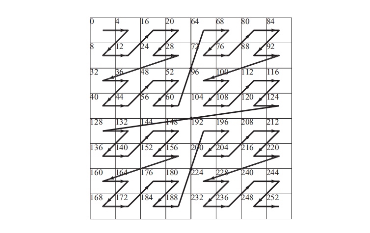

纹理单元中还包含了一些定制结构，来对几种不同的纹理格式进行解压（章节6.2.6）。与软件实现相比，在固定功能的硬件单元中实现这些功能，其效率通常会高很多倍。请注意，在使用纹理作为渲染目标和纹理映射的时候，还会出现一些其他的压缩机会。如果启用了对颜色缓冲区的压缩（章节23.5），那么当访问这样一个渲染目标来作为纹理时，有两个设计选项。当渲染目标完成渲染时，第一种选择是从颜色缓冲压缩格式中，对整个渲染目标进行解压，并将其进行未压缩存储，以供后续纹理访问。第二种选择是在纹理单元中添加相应的硬件支持，来对颜色缓冲压缩格式进行解压\[1716]。后者通常是更加高效的选择，因为其中的渲染目标即使在作为纹理访问期间，也可以保持压缩格式。有关缓存和压缩的更多信息，详见章节23.4。

mipmap对于纹理缓存的局部性也非常重要，因为它限制了纹素-像素的最大比例。在遍历一个三角形的时候，每个新像素大约代表了纹理空间中的一格纹素。mipmap是渲染中少数几种，能够同时提高视觉效果和性能的情况之一。

## 23.9 架构

实现更快图形计算的最佳方法是利用并行性，这几乎可以在GPU的所有阶段中进行。其思想是同时计算多个结果，然后在稍后阶段再对这些结果进行合并。一般来说，并行图形架构的组织方式如图23.16所示。应用程序将任务发送到GPU中，在经过一些调度之后，会在若干个几何单元（geometry unit）中并行进行几何处理。几何处理的结果会被转发到一组光栅化单元（rasterizer unit）中，由这些光栅化单元进行光栅化。然后通过一组像素处理单元（pixel processing unit）来并行执行像素着色和混合操作。最后，将得到的图像发送到显示器以供查看。

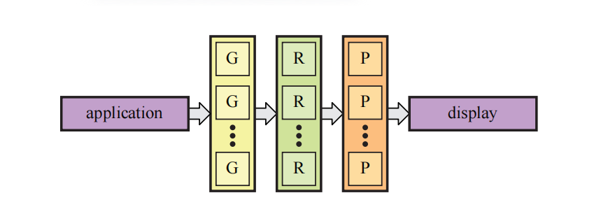

对于软件和硬件而言，最重要的是要意识到，如果我们的代码或者硬件中存在串行部分，那么它可能会限制整体的性能提升。这可以使用Amdahl定律进行表示，即：

$$
a(s, p)=\frac{1}{s+\dfrac{1-s}{p}}
\tag{23.15} 
$$

其中$s$是程序/硬件中串行部分所占据的百分比，相应的$1 - s$就是可以并行化的百分比。此外，$p$是程序或者硬件在进行并行化之后，所能达到的最大性能提升因子。例如：如果我们最初只有一个多处理器，后来增加了三个，那么这里$p = 4$。方程23.15中的$a(s, p)$是指我们从改进中所得到的加速因子。如果我们有这样的一个架构，例如：其中的$10\%$是串行的，即$s = 0.1$；现在我们对架构进行改进，使得剩余部分（非串行）的性能提高20倍，即$p = 20$，那么我们可以得到$a = 1/(0.1 + 0.9/20)\approx 6.9$。此时可以看到，我们并没有得到20倍的加速，原因在于代码/硬件中的串行部分严重限制了性能的提升。实际上，当$p\rightarrow \infty$时，我们也只能得到$a = 10$。究竟是把精力花在改进并行部分上更好，还是花在改进串行部分上更好，这一点并不总是十分明确，但是在并行部分得到实质性改进之后，串行部分将会对性能产生更多的限制。

对于图形架构而言，多个结果是并行计算的，但是draw call中的图元将会按照CPU上的提交顺序来进行处理。因此，必须进行某种形式的排序，从而使得并行单元能够一起渲染用户想要的图像。具体来说，我们所需要的排序是从模型空间到屏幕空间的（章节2.3.1和章节2.4）。需要注意的是，几何单元和像素处理单元可以映射为相同的硬件单元，即统一的ALU。在我们的案例研究部分中，所有的架构都使用了统一的着色器架构（章节23.10）。即使是这样，理解排序所发生的位置也十分重要，我们在这里提出一种并行架构的分类方法\[417, 1236]。排序可以发生在图形管线中的任何地方，这在并行架构中产生了四种不同类型的工作分布，如图23.17所示。它们分别被称为sort-first、sort-middle、sort-last fragment和sort-last image。请注意，这些架构给出了不同的方式来分配GPU中并行单元之间的工作。

![图23.17：并行图形架构的分类。其中 A 是应用程序， G 是几何单元， R 是光栅化单元， P 是像素处理单元。从左到右，架构分别是：sort-first、sort-middle、sort-last fragment和sort-last image。 \[417\]](images/Chapter-23/202310171533393.png "图23.17：并行图形架构的分类。其中 A 是应用程序， G 是几何单元， R 是光栅化单元， P 是像素处理单元。从左到右，架构分别是：sort-first、sort-middle、sort-last fragment和sort-last image。 \[417]")

基于sort-first的架构会在几何阶段之前对图元进行排序。其策略是将屏幕划分为一组区域，并将该区域内的图元发送到“拥有”该区域的完整管线中，如图23.18所示。图元在被初始化之后，就知道它需要被发送给哪个区域管线了，这就是排序步骤。sort-first是在单台机器上探索最少的架构\[418, 1236]，即它适用于多设备的渲染。在驱动具有多个屏幕或者投影仪的系统时，这种方案确实有用，因为每个屏幕可以专门使用一台计算机进行渲染\[1513]。一种叫做Chromium \[787]的系统已经被开发出来了，它可以使用一个工作站集群，来实现任何类型的并行渲染算法。例如：sort-first和sort-last可以实现较高的渲染性能。

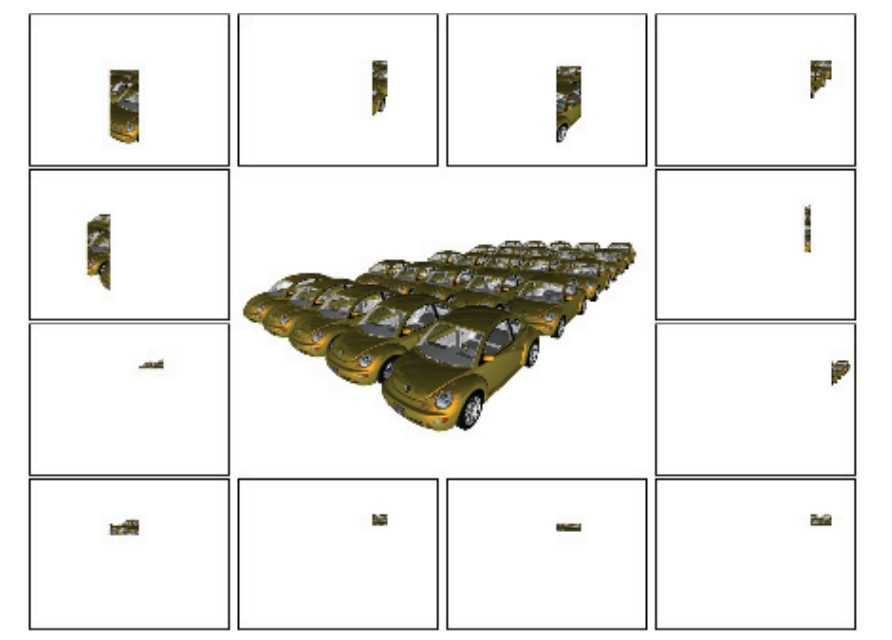

Mali架构（章节23.10.1）属于sort-middle类型。几何处理单元会被赋予大约相同数量的几何处理工作量。然后，变换后的几何图形会被排序为相互不重叠的矩形，这些也称为tile，所有的tile一起会覆盖整个屏幕。请注意，变换后的三角形可能会与多个tile重叠，因此可能会被多个光栅化单元和像素处理单元进行处理。这里效率的关键是，每一对光栅化单元和像素处理单元，在芯片上都有一个tile大小的帧缓冲，这意味着所有的帧缓冲访问都是十分快速的。当所有的几何图形都被分类到各个tile之后，每个tile的光栅化和像素处理就可以彼此独立地进行。有些sort-middle类型的架构会对不透明几何图形执行逐tile的z-prepass，这意味着每个像素只会进行一次着色。然而，并不是所有的sort-middle架构都会这样做。

sort-last fragment架构会在光栅化之后（有时称为片元生成）和像素处理之前，对生成的片元进行排序。一个例子是章节23.10.3中所描述的GCN架构。就像sort-middle架构一样，图元会在几何单元中尽可能均匀地分布。sort-last fragment的一个优点在于不会发生任何重叠，这意味着生成的片元只会被发送到一个像素处理单元中，这是最优情况。但是如果一个光栅化单元处理的是大三角形，而另一个光栅化单元处理的是小三角形，那么就可能会发生负载不平衡的问题。

最后，sort-last image架构会在像素处理之后进行排序。这种架构的可视化结果如图23.19所示。这个架构可以被看作是一组独立的管线。图元分布在不同的管线上，每个管线都会渲染一个具有深度的图像。然后在最后的合成阶段，所有图像会根据它们的z-buffer来进行合并。需要注意的是，sort-last image系统无法完全实现OpenGL和DirectX之类的API，因为这些API要求图元按照发送的顺序进行渲染。PixelFlow \[455, 1235]是sort-last image架构的一个例子。PixelFlow架构也值得注意，因为它使用了延迟渲染，这意味着它只会对可见的片元进行着色计算。然而，应当注意的是，目前没有任何一个架构（译者注：应该指的是商用架构）使用sort-last image，因为这种架构会在管线末尾会占用大量带宽。

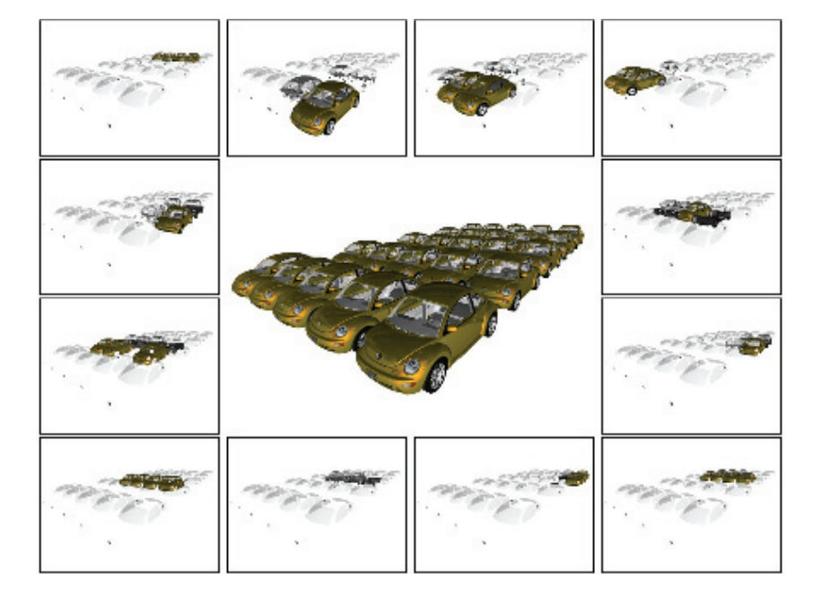

对于大型的tile显示系统，纯sort-last image方案的一个问题在于，需要在渲染节点之间传输大量的图像数据和深度数据。Roth和Reiners \[1513]通过使用每个处理器结果的屏幕界限和深度界限，来对数据传输和合成的成本进行优化。

Eldridge等人\[417, 418]提出了Pomegranate架构，这是一种sort-everywhere架构。简而言之，它会在几何单元（G）和光栅单元（R）之间、光栅单元和（G）像素处理单元（P）之间、以及像素处理单元和显示器之间，都插入排序阶段。因此，随着系统规模的扩大（即增加了更多的管线），工作负载会变得更加平衡。其中的排序阶段被实现为一个具有点对点链接的高速网络。模拟实验表明，随着管线规模的增加，性能几乎会呈线性增长。

图形系统中的所有组件（主机、几何处理、光栅化和像素处理）连接在一起，构成了一个多处理系统。对于这样的系统，有两个众所周知的问题，并且它们几乎总是会与多处理相关：负载平衡和通信\[297]。FIFO（先进先出first-in，first-out）队列通常会存在于管线中的许多不同位置，以便作业可以按照顺序进行排队，从而避免管线的某些部分发生停滞。例如：可以在几何单元和光栅化单元之间放置一个FIFO，这样一来，如果光栅化单元由于正在处理一个巨大尺寸的三角形，而无法跟上几何单元的速度，那么几何处理完成的三角形可以进行缓冲。

本文所描述的不同排序架构具有不同的负载平衡优点和缺点。详见Eldridge的博士论文\[418]或者Molnar等人\[1236]的论文，来获取更多相关信息。程序员也可以对负载平衡产生影响，相关技术在第18章中进行了讨论。如果总线的带宽过低或者带宽使用不当，那么通信可能会成为问题。因此，在设计一个应用程序的渲染系统时，应当使得任何总线（例如从主机到图形硬件的总线）都不会发生瓶颈，这是极其重要的。章节18.2中介绍了检测性能瓶颈的不同方法。

## 23.10 案例分析

在本小节中，我们将介绍三种不同的图形硬件架构。我们首先会介绍面向移动设备和电视的ARM Mali G71 Bifrost架构；然后介绍NVIDIA的Pascal架构；最后我们会介绍一种被称为Vega的AMD GCN架构。

请注意，对于尚未构建完成的GPU，图形硬件公司通常会基于大量的软件模拟，来做出相应的设计决策。也就是说，多个应用程序（例如游戏）会在具有不同配置的参数化模拟器中进行运行，可能的参数包括：MP的数量、时钟频率、缓存数量、光栅化引擎数量、曲面细分引擎数量和ROP数量等。这些模拟用于收集有关性能、功耗使用和内存带宽使用等因素的信息。最终，会选择在大多数用例中都最为高效的最佳配置，并根据该配置来构建GPU芯片。此外，软件模拟还可以帮助发现架构中的典型性能瓶颈，并解决这些瓶颈，例如增加缓存的大小等。对于一个特定的GPU而言，使用不同的速度和单元数量的原因其实非常简单，因为“这样设计效果最好”。

### 23.10.1 案例研究：ARM Mali G71 Bifrost

Mali产品线覆盖了ARM的所有GPU架构，Bifrost是他们于2016年发布的架构（译者注：Bifrost是北欧神话中，连接天宫和大地的彩虹桥）。这种架构的目标平台是移动设备和嵌入式系统，例如：手机、平板电脑和电视等。2015年，基于Mali的GPU出货量为7.5亿块。由于其中许多设备都是由电池进行供电的，因此设计一个节能的、功耗较低的架构十分重要，而不仅仅是关注性能问题。因此，使用一个sort-middle架构是有意义的，在这种架构中，对帧缓冲的所有访问都发生在芯片上，这样做降低了功耗。所有的Mali架构都属于sort-middle类型，有时也被称为分块架构（tiling architecture）。图23.20展示了一个GPU的架构示意图。我们可以看到，G71最多可以支持多达32个统一的着色器引擎。实际上ARM会使用“着色器核心（shader core）”这个术语，而不是“着色器引擎（shader engine）”，这里使用“着色器引擎”的目的是为了避免与本小节的其余部分相混淆。一个着色器引擎能够一次执行12个线程的指令，也就是说，一个着色器引擎中包含了12个ALU。该架构选择使用32个着色器引擎，这是专门为G71配置的，该架构实际上可以扩展超过32个着色器引擎。

![图23.20：Bifrost G71 GPU架构，该架构可扩展至32个着色器引擎，其中每个着色器引擎的架构如图23.21所示。 \[326\]](images/Chapter-23/202310171633052.png "图23.20：Bifrost G71 GPU架构，该架构可扩展至32个着色器引擎，其中每个着色器引擎的架构如图23.21所示。 \[326]")

会由驱动软件来为GPU分配工作。作业管理器（job manager），也就是调度器（scheduler），会将任务分配给着色器引擎。这些引擎通过一个GPU结构相连接，这个结构是一个总线，着色器引擎可以在该总线上与GPU中的其他单元进行通信。所有的内存访问都会提交给内存管理单元（memory management unit，MMU），它将一个虚拟内存地址转换到一个物理内存地址。

![图23.21：Bifrost着色器引擎架构，其中tile内存位于芯片上，这有助于快速访问本地帧缓冲，并降低功耗。 \[326\]](images/Chapter-23/202310171633428.png "图23.21：Bifrost着色器引擎架构，其中tile内存位于芯片上，这有助于快速访问本地帧缓冲，并降低功耗。 \[326]")

着色器引擎的架构图如图23.21所示。我们可以看到，它包含三个执行引擎，以着色quad为中心围绕分布。因此，它们被设计成SIMD宽度为4的小型通用处理器。每个执行引擎都包含了四个用于32 bit浮点运算的FMA（fused-multiply-and-add）单元，以及四个用于32 bit加法运算的FMA单元。这意味着每个着色器引擎都有$3 × 4$个ALU，即12个SIMD lane。用本文之前的术语来说，这里的quad实际上就相当于一个warp，例如：为了隐藏纹理访问所带来的延迟，架构可以在每个着色器引擎中保持至少256个线程。

请注意，着色器引擎是统一的，它们可以执行相关计算、顶点处理和像素着色等任务。其中的执行引擎（execution engine）还包含对许多超越函数的支持，例如正弦函数和余弦函数等。在使用16 bit浮点精度的时候，性能可以达到原来的2倍。当寄存器结果仅用作后续指令的输入时，这些单元还支持绕过寄存器中的内容，这样可以节省功耗，因为不需要访问寄存器堆。此外，在执行纹理访问或者其他内存访问的时候，quad管理器还可以切换单个quad，这与其他架构隐藏此类操作延迟的方式相类似。请注意，这是在小粒度级别上发生的，即只交换4个线程而不是全部的12个线程。加载/存储（load/store）单元负责通用的内存访问、存储地址转换和一致性缓存\[264]。属性单元（attribute unit）负责处理属性索引和寻址，它会将访问请求发送到加载/存储单元中。可变单元（varying unit）负责对不同的属性进行插值。

分块架构（也被称为sort-middle）的核心思想是，首先执行所有的几何处理，以便找到每个待渲染图元的屏幕空间位置。同时，为帧缓冲中的每个tile都构建一个多边形列表（polygon list），其中包含了指向与该tile重叠的所有图元的指针。在这一步之后，我们就能够确定与一个tile重叠的所有图元集合。因此，tile中的图元可以进行光栅化和着色计算，并将结果存储在片上的tile内存中。当该tile完成对其所有图元的渲染时，来自tile内存的数据会通过L2缓存写回到外部存储空间中。通过这种方式，能够减少了内存带宽的使用。然后下一个tile会被光栅化，以此类推，直到完整的一帧被渲染完成。第一个分块架构是Pixel-Planes 5 \[502]，该系统与Mali架构在高层次设计上存在一些相似性。

![图23.22：几何图形流经Bifrost架构的示意图。顶点着色器中包含了位置着色（position shading）和可变着色（varying shading），其中位置着色的结果会被分块（tiling）操作所使用，而可变着色则位于分块操作之后，只在需要的时候才 会 执行。 \[264\]](images/Chapter-23/202310171947568.png "图23.22：几何图形流经Bifrost架构的示意图。顶点着色器中包含了位置着色（position shading）和可变着色（varying shading），其中位置着色的结果会被分块（tiling）操作所使用，而可变着色则位于分块操作之后，只在需要的时候才 会 执行。 \[264]")

图23.22展示了几何处理和像素处理。我们可以看到，顶点着色器被划分成了两个部分，其中一个部分只执行位置着色（position shading），另一个部分则被称为可变着色（varying shading），这是在分块之后完成的。与ARM之前的架构相比，这节省了内存带宽的开销。执行分组（binning）操作，即确定一个图元与哪些分块重叠，这个操作所需的唯一信息就是顶点的位置。执行分组操作的分块单元（tiler unit），会以分层方式进行工作，如图23.23所示。这有助于使得分块操作的内存占用更小，同时更加可预测，因为它不再与图元的大小成比例。

![图23.23：Bifrost架构的分层分块操作。在这个例子中，图元分组是在三个不同层次上进行的，其中每个三角形都会被分配到与单个正方形重叠的层次上。 \[191\]](images/Chapter-23/202310172039416.png "图23.23：Bifrost架构的分层分块操作。在这个例子中，图元分组是在三个不同层次上进行的，其中每个三角形都会被分配到与单个正方形重叠的层次上。 \[191]")

当分块单元完成对场景中所有图元的分组之后，我们就可以确切地知道某个tile上重叠了哪些图元。因此，只要有空闲的着色器引擎可以并行工作，那么剩余的光栅化、像素处理和混合操作，可以对任何数量的tile进行并行执行。一般来说，一个tile会被提交给一个着色器引擎，由它来处理这个tile中的所有图元。当对所有的tile都完成上述这些操作的时候，也可以开始为下一帧进行几何处理和图元分组。这个处理模型意味着，在分块架构中可能会有更多的延迟。

在完成几何处理之后，光栅化过程、像素着色器执行、混合和其他逐像素的操作会紧随其后。分块架构的一个最重要的特性是，单个tile所对应的帧缓冲（例如：颜色、深度和模板等）可以存储在速度很快的片上内存中，这里将其称为tile内存（tile memory）。这个内存是负担得起的，因为每个tile都很小（$16 × 16$像素）。当tile中的所有渲染操作都完成时，这个tile的预期输出（通常是颜色，可能还会有深度）将会被复制到与屏幕大小相同的片外帧缓冲中（位于外部内存中）。这意味着在逐像素处理期间，对帧缓冲的所有访问实际上都是近乎免费的。避免使用外部总线是非常可取的操作，因为这种对带宽的使用会带来较高的功耗成本\[22]。将片上tile内存中的内容移出到片外帧缓冲的时候，仍然可以使用一些帧缓冲的压缩方法。

Bifrost支持像素本地存储（pixel local storage，PLS），这是一组在sort-middle架构上通常会支持的扩展。使用PLS，可以让像素着色器访问帧缓冲的颜色，从而实现自定义的混合技术。相比之下，混合阶段通常会使用API来进行配置，而不像像素着色器那样是可编程的。我们还可以使用tile内存，在每个像素上存储任意固定大小的数据结构。这允许程序员能够高效地实现一些技术，例如：延迟渲染技术。G-buffer（例如：法线、位置和漫反射纹理）会在第一个pass中存储在PLS中；而第二pass则会执行光照计算，并在PLS中累积计算结果，第三pass则使用了PLS中的信息，来计算最终的像素颜色。请注意，对于单个tile而言，所有这些计算都是在整个片上tile内存中进行的，这使得数据访问速度非常快。

所有的Mali架构在设计的时候，都会考虑到多重采样抗锯齿（MSAA），并实现了章节5.4中所描述的旋转网格超采样（rotated grid supersampling，RGSS）方案，其中每个像素使用4个子样本。sort-middle架构非常适合抗锯齿技术，这是因为过滤操作是在tile数据离开GPU，并发送到外部内存之前完成的。因此，外部内存中的帧缓冲只需要为每个像素存储一种颜色即可，而一个标准架构中的帧缓冲，需要是原来的四倍大。对于分块架构而言，我们只需要将片上的tile缓冲区增加4倍，或者使用较小的tile即可（宽度和高度为原来的一半）。

Mali Bifrost架构还可以有选择地，只对一批渲染图元使用多重采样或者超采样。这意味着在需要的时候，可以使用一些更加昂贵的超采样方法，即为每个样本都执行一次像素着色器。其中一个例子就是使用alpha映射来渲染一棵纹理化的树，我们需要高质量的采样从而避免视觉瑕疵。对于这些图元而言，可以启用超采样技术。当这种复杂的情况结束，需要渲染一些更简单的物体时，可以切换回使用不太昂贵的多重采样方法。该架构还支持8× MSAA和16× MSAA。

Bifrost（以及之前的架构Midgard），还支持一种被称为事务消除（transaction elimination）的技术。这个想法是针对那些场景中不随帧变化的部分，避免将这些部分的tile内存转移到片外内存的操作。对于当前帧而言，当tile中的帧缓冲被移动到芯片外的帧缓冲时，会为每个tile都计算一个唯一的签名，这个签名是一种校验和（checksum）。对于下一帧而言，将会为即将被移除的tile计算签名，如果前一帧中的签名与当前帧中的签名相同，则架构会避免将对应的颜色缓冲区写入到片外内存中，因为此时对应部分的帧缓冲中已经存在了正确的内容。这对于休闲手机游戏而言（例如《愤怒的小鸟》）尤其有用，因为在这些游戏中，每一帧中所更新的场景比例比较小。还要注意的是，这种技术很难在sort-last架构上实现，因为这些架构并不是基于逐tile进行操作的。G71还支持智能合成（smart composition），即将事务消除应用于用户界面的合成。如果所有源都与前一帧中的相同，并且操作也相同，那么则可以避免读取、合成和写入tile等操作。

低层级的低功耗技术（Low-level power-saving technique），例如时钟门控（clock gating）和功耗门控（power gating）技术，也被大量应用于该架构中。这意味着未使用的或者不活动的管线部分，将会被关闭或者保持闲置，从而降低能耗，减少电量使用。

为了减少纹理的带宽开销，有一个具有专门用于ASTC和ETC解压单元的纹理缓存。此外，压缩纹理会以压缩形式存储在缓存中，而不是解压之后再将纹理存储在缓存中。这意味着当我们对一个纹素发出访问请求的时候，硬件将会从缓存中读取对应的数据块，然后对该数据块中的纹素进行动态解压。这种配置方式增加了缓存的有效大小，从而提高了效率。

一般来说，分块架构的一个优点在于，它天生可以很好地对各个tile进行并行处理，例如：我们可以添加数量更多的着色器引擎，使得每个着色器引擎都负责一个tile的独立渲染。分块架构的一个缺点在于，整个场景数据需要发送到GPU中进行分块，处理后的几何图形需要流式输出到内存中。一般来说，这种sort-middle架构并不适合处理几何图形的增强，例如使用几何着色器和曲面细分着色器，因为更多数量的几何图形，会增加变换几何图形时的内存传输量。对于Mali架构而言，几何着色（章节18.4.2）和曲面细分着色器都是在GPU上的软件中实现的，Mali的最佳实践指南建议\[69]，永远不要使用几何着色器。对于大多数内容而言，sort-middle架构非常适用于移动端和嵌入式系统。

### 23.10.2 案例研究：NVIDIA Pascal

Pascal是NVIDIA开发的GPU架构（译者注：GTX 10系显卡等）。它既可以作为一个图形部分存在\[1297]，也可以作为一个计算部分存在\[1298]，其中计算部分的目标是高性能计算和深度学习应用。在本小节的介绍中，我们将主要关注图形部分，特别是一种名为GeForce GTX 1080的显卡配置。我们将以自下而上的方式来介绍该架构，从最小的统一ALU开始，然后再构建整个GPU。我们将在本小节的末尾，简要介绍一些其他的芯片配置。

Pascal图形架构中所使用的统一ALU（用NVIDIA术语来说就是CUDA核心）与图23.8左侧的ALU具有相同的高级示意结构。ALU的重点是浮点运算和整数运算，但是它们也支持其他的一些操作。为了提高计算能力，几个这样的ALU被组合成一个流式多处理器（streaming multiprocessor，SM），简称流多处理器，或者叫做SM单元。在Pascal的图形部分中，SM由四个处理块所组成，每个块包含32个ALU。这意味着一个SM可以同时执行4个warp，每个warp包含32个线程，如图23.24所示。

![图23.24：Pascal 的流多处理器（SM）具有 32 × 2 × 2 的统一ALU，并被一个多边形变形引擎（polymorph engine）所封装，它们共同构成一个纹理处理集群（texture processing cluster，TPC）。请注意，顶部深灰色框中的内容在下面会被复制，但是重复的部分被省略了。 \[1297\]](images/Chapter-23/202310172047529.png "图23.24：Pascal 的流多处理器（SM）具有 32 × 2 × 2 的统一ALU，并被一个多边形变形引擎（polymorph engine）所封装，它们共同构成一个纹理处理集群（texture processing cluster，TPC）。请注意，顶部深灰色框中的内容在下面会被复制，但是重复的部分被省略了。 \[1297]")

每个处理块是一个宽度为32的SIMT引擎，还具有8个加载/存储（LD/ST）单元，以及8个特殊函数单元（special function unit，SFU）。加载/存储单元会对寄存器堆（register file）中的寄存器读写进行处理，这个寄存器堆的大小为$16,384 × 4$ byte，即每个处理块64 kB，四个处理块加在一起，整个SM就是256 kB。SFU单元负责处理超越函数指令，例如：正弦、余弦、指数（以2为底数）、对数（以2为底数）、倒数和倒数平方根等。它们还支持属性插值\[1050]。

SM中的所有ALU都共享同一个指令缓存（instruction cache），而每个SIMT引擎都有属于自己的指令缓存，其中包含了最近加载的一组本地指令集合，从而进一步提高指令缓存的命中率。warp调度器能够在每个时钟周期内调度两条warp指令\[1298]，例如：可以在同一个时钟周期内，将工作同时调度到ALU和LD/ST单元中。请注意，每个SM还有两个L1缓存，每个L1缓存中包含24 kB的存储空间，即每个SM 48 kB。使用两个L1高速缓存的原因，可能是因为较大的L1高速缓存需要更多的读写端口，这增加了高速缓存的复杂性，并且使得其在芯片上的实现面积更大。此外，每个SM还有8个纹理单元。

由于着色计算必须在$2 × 2$大小的像素四边形中完成，因此warp调度器会找到8个不同的像素四边形，并将它们分为一组，以便在32个SIMT lane中进行执行\[1050]。由于统一的ALU架构，因此warp调度器可以一个在warp中指定并分配顶点、像素、图元或者计算着色器的工作。请注意，一个SM可以同时处理不同类型的warp（例如顶点、像素和图元）。在将当前执行的warp切换为待执行的warp时，这个架构也没有任何开销。至于下一次在Pascal上选择执行什么样warp，相关细节并没有公开，但是之前的NVIDIA架构会给我们一些提示。在2008年NVIDIA 的Tesla架构中\[1050]，使用了一个计分板（scoreboard）来限定每个warp中的每个时钟周期。记分版是一种通用机制，它允许乱序执行而不会发生冲突。warp调度器会在等待执行的warp中进行选择，例如那些不需要等待纹理加载返回的warp，并选择其中优先级最高的那个。warp的类型、着色指令的类型以及“公平性（fairness）”，这些参数会用来选择优先级最高的那个warp。

SM会与多边形变形引擎（polymorph engine，PM）一起工作，这个单元首次出现在Fermi芯片中\[1296]。PM会执行几个与几何相关的任务，包括顶点获取、曲面细分、同步多重投影（simultaneous multiprojection）、属性设置和流式输出等。第一阶段会从全局顶点缓冲区中获取顶点数据，并将顶点着色和壳着色的warp分配给SM。第二阶段是可选的曲面细分阶段（章节17.6），其中新生成的$(u, v)$面片坐标，会被分配到SM中，用于后续域着色和可选的几何着色。第三阶段会处理视口变换和透视校正。此外，这里执行了一个可选的同步多重投影步骤，它可以用于高效的VR渲染（章节21.3.1）。接下来是可选的第四阶段，顶点会被流式输出到内存中。最后，会将结果转发给相关的光栅化引擎。

一个光栅化引擎包含三个任务，即三角形设置、三角形遍历、$z$剔除。其中三角形设置会获取顶点，计算边缘方程，并执行背面剔除。三角形遍历会使用分层的分块遍历技术，来访问与三角形相重叠的tile，它会使用边缘方程来执行tile测试和内部测试。在Fermi芯片上，一个光栅化器每个时钟周期最多可以处理8个像素\[1296]，而Pascal在这方面则没有相应的公开信息。$z$剔除单元会使用章节23.7中所描述的技术，在每个tile上来处理剔除。如果一个tile被剔除了，那么对该tile的处理将会立即终止。对于幸存下来的三角形而言，每个顶点的属性会被转换为平面方程，以便在像素着色器中进行高效计算。

一个流多处理器（SM）与多边形变形引擎PM结合在一起，被称为一个纹理处理集群（texture processing cluster，TPC）。在更高的层次上，5个TPC会被分组到一个图形处理集群（graphics processing cluster，GPC）中，该集群有一个独立的光栅化引擎服务于这5个TPC。GPC可以被认为是一个小型的GPU，其目标是为图形功能提供一组平衡的硬件单元，例如顶点、几何、光栅化、纹理、像素和ROP单元等。正如我们将在本小节结束时会看到的，创建独立的功能单元，可以使得设计人员能够更轻松地创建具有一系列功能的GPU芯片（即不同型号的GPU芯片）。

到目前为止，我们已经介绍了GeForce GTX 1080中的大部分构建块。它由4个GPC组成，一般的配置如图23.25所示。请注意，这里还有另一个级别的调度，它由GigaThread引擎提供支持，以及一个PCIe v3的接口。GigaThread引擎是一个全局的工作分发引擎，它负责将线程块调度给所有GPC。

![图23.25：Pascal GPU在GTX 1080显卡下的配置，它包含20个SM单元，20个多边形变形引擎，4个光栅化引擎， 8×20 = 160 个纹理单元（峰值速率为277.3 Gtexels/s），  256×20 = 5120  kB的寄存器堆，总共 20 × 128 = 2560 个统一ALU。 \[1297\]](images/Chapter-23/202310172141096.png "图23.25：Pascal GPU在GTX 1080显卡下的配置，它包含20个SM单元，20个多边形变形引擎，4个光栅化引擎， 8×20 = 160 个纹理单元（峰值速率为277.3 Gtexels/s），  256×20 = 5120  kB的寄存器堆，总共 20 × 128 = 2560 个统一ALU。 \[1297]")

光栅操作单元（raster operation unit）也展示在了图23.25中，尽管有些隐藏。它们位于图中L2缓存的正上方和正下方。其中的每个蓝色区块都是一个ROP单元，一共有8组，每组包含了8个ROP单元，共计64个ROP单元。ROP单元的主要任务是将输出内容写入到像素和其他缓冲区中，并执行各种操作（例如混合）。从图23.25的左右两侧可以看出，一共有8个32 bit的内存控制器，加起来总共是256 bit。8个ROP单元各自被绑定在一个内存控制器和256 kB的L2缓存上。这为整个芯片提供了2 MB的L2缓存。每个ROP都被绑定到一个特定的内存分区中，这意味着一个ROP会对缓冲区中的某个像素子集进行处理。ROP单元还可以处理无损压缩。除了支持未压缩和快速清除之外，还有三种不同的压缩模式\[1296]。对于$2:1$压缩模式而言（例如：从256 B压缩到128 B），每个tile中都存储一个参考颜色值，并对像素之间的差值进行编码，其中每个差值信息，相比于未压缩状态，编码所使用的bit数会更少。$4: 1$压缩模式是$2:1$压缩模式的扩展，但是这种模式所能使用的差异编码bit要更少，并且它只适用于内容平滑变化的tile。还有一种$8:1$压缩模式，它是$2 × 2$像素块的$4:1$恒定颜色压缩与上述$2:1$压缩模式的组合。$8:1$模式的优先级要高于$4:1$模式，$4:1$模式的优先级要高于$2:1$，即总是会优先使用压缩比最高、并且能成功压缩tile的模式。如果所有这些压缩模式的尝试都失败了，那么则必须将tile以未压缩的形式存储在内存中。Pascal压缩系统的效率如图23.26所示。

![图23.26：左侧展示了渲染后的图像，中间展示了Maxwell架构（Pascal之前的架构）的压缩结果，右边展示了Pascal架构的压缩结果。图像越紫，说明缓冲区压缩的成功率越高。 \[1297\]](images/Chapter-23/20231018091219.png "图23.26：左侧展示了渲染后的图像，中间展示了Maxwell架构（Pascal之前的架构）的压缩结果，右边展示了Pascal架构的压缩结果。图像越紫，说明缓冲区压缩的成功率越高。 \[1297]")

Pascal架构所使用的显存是GDDRX5，其时钟频率为10 GHz。在上面我们看到，8个内存控制器总共可以提供256 bit，即总共32 B。这就提供了总计320 GB/s的峰值内存带宽，但是将多级缓存和压缩技术相结合，给人的印象总是能实现更高的有效速率。

该GPU芯片的基本时钟频率为1607 MHz，当功耗预算十分充足时，还可以工作在boost模式（1733 MHz）。其峰值计算能力为：

$$
\underbrace{2}_{\text {FMA }} \cdot \underbrace{2560}_{\text {num. SPs }} \cdot \underbrace{1733}_{\text {clock freq. }}=8,872,960 \enspace \text {MFLOPS} \approx 8.9 \enspace \text{ TFLOPS}
\tag{23.16} 
$$

方程23.16中的2来自于这样一个事实：一个FMA（fused-multiply-and-add）运算，通常会被计数为两次浮点运算，我们将结果除以$10^6$，可以将结果从MFLOPS转换为TFLOPS。GTX 1080 Ti拥有3584个ALU，相当于12.3 TFLOPS。

NVIDIA开发sort-last fragment架构已经有很长时间了。然而，自Maxwell架构以来，它们还支持一种新的渲染类型，被称为分块缓存（tiled caching），它介于sort-middle和sort-last fragment之间，这种架构如图23.27所示。其核心思想是利用局部性和L2缓存。几何图形会以足够小的tile进行处理，以便每个tile的输出可以保存在这个缓存中。此外，只要与该tile重叠的几何图形还没有完成像素着色，则对应的帧缓冲也会保持在L2状态。

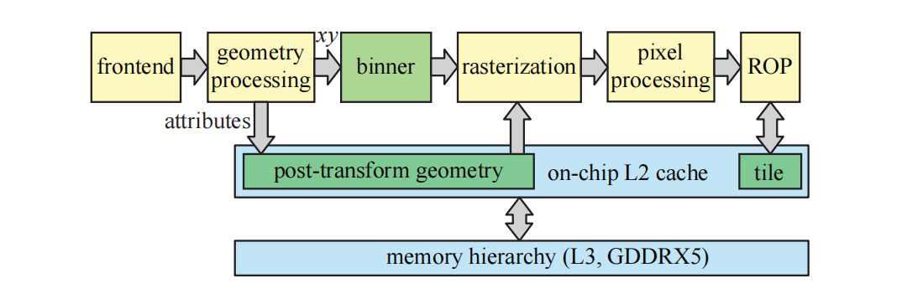

图23.25中包含了四个光栅化引擎，但是我们知道，图形API必须（在大多数情况下）遵循原始数据的提交顺序\[1598]。帧缓冲通常会使用通用的棋盘格模式\[1160]，来将其划分为不同的tile，每个光栅化引擎都“拥有”一组tile。如果当前三角形与光栅化引擎中的任意一个tile相重叠，那么这个这个三角形就会被发送到这个光栅化引擎中；如果这个三角形覆盖了多个tile，并且这些tile分属于不同的光栅化引擎，那么会将这个三角形发送给每个光栅化引擎进行处理。通过这种方式，从而独立解决每个tile中的排序问题，这也有助于更好的负载均衡。在GPU架构中通常也有几个FIFO队列，它们的存在是为了减少硬件单元的停滞（饥饿）。这些队列并没有展示在我们的图表中。

显示控制器中的每个颜色分量有12 bit，并且具有BT.2020的宽色域支持；同时它还支持HDMI 2.0b和HDCP 2.2。在视频处理方面，这个视频控制器支持SMPTE 2084，这是一个高动态范围（HDR）视频的传输函数。Venkataraman \[1816]描述了Fermi及其之后的NVIDIA架构，是如何拥有一个或者多个复制引擎（copy engine）的。这里的复制引擎是指可以执行直接内存访问（direct memory access，DMA）传输的内存控制器。DMA传输发生在CPU和GPU之间，并且这样的传输过程通常是在这二者中的任何一个上开始的。在传输过程中，启动处理单元（starting processing unit）可以继续进行其他计算。复制引擎可以在CPU内存和GPU显存之间发起数据的DMA传输，并且它们可以独立于GPU的其余部分进行执行。因此，当存储数据从CPU传输到GPU时（反之亦然），GPU可以继续渲染三角形并执行其他功能。

Pascal架构还可以为非图形应用程序进行配置，例如训练神经网络或者大规模数据分析。Tesla P100就是这样的一种配置\[1298]，它与GTX 1080之间的一些区别包括，Tesla P100使用了高带宽存储器2 （high-bandwidth memory 2，HBM2），它具有4096 bit的内存总线，可以提供高达720 GB/s的总内存带宽。此外，它们还原生支持16 bit浮点数，其运算性能是32 bit浮点的2倍，并且具有更快的双精度处理速度。Tesla P100的SM配置和寄存器堆设置也有所不同\[1298]。

GTX 1080 Ti（Titanium）是一种高端配置。它拥有3584个ALU，352 bit的内存总线，484 GB/s的总内存带宽，88 ROP和224个纹理单元；相比之下，GTX 1080的各项对应参数为2560、256 bit、320 GB/s、64和160。GTX 1080 Ti使用了6个GPC配置，即它拥有6个光栅化引擎，而GTX 1080只有4个。其中4个GPC与GTX 1080完全相同，而剩下的2个GPC则要稍微小一些，其中每个GPC只包含4个TPC，而不是5个。GTX 1080 Ti芯片由120亿个晶体管组成，而1080则使用了72亿个晶体管。Pascal架构是十分灵活的，因为它还可以按比例进行缩小。例如：GTX 1070就是GTX 1080减去1个GPC，而GTX 1050则由2个GPC组成，其中每个GPC中包含3个SM单元。

### 23.10.3 案例研究：AMD GCN Vega

AMD的Graphics Core Next （GCN）架构用于AMD的一些显卡产品，以及Xbox One和PLAYSTATION 4中。在这里，我们将介绍GCN Vega架构\[35]中的通用元素，它们是游戏主机所使用架构的演变版本。

![图23.28：Vega架构的GCN计算单元（CU）。每个向量寄存器堆（vector register file）具有64 kB的容量，而标量寄存器堆则具有12.5 kB的容量，本地数据共享（local data share）具有64 kB。请注意，每个CU中包含有4组SIMD单元，每个SIMD单元包含16个SIMD lane（淡绿色），支持32 bit浮点，它们用于CU中的实际计算。 \[1103, 35\]](images/Chapter-23/20231018095327.png "图23.28：Vega架构的GCN计算单元（CU）。每个向量寄存器堆（vector register file）具有64 kB的容量，而标量寄存器堆则具有12.5 kB的容量，本地数据共享（local data share）具有64 kB。请注意，每个CU中包含有4组SIMD单元，每个SIMD单元包含16个SIMD lane（淡绿色），支持32 bit浮点，它们用于CU中的实际计算。 \[1103, 35]")

GCN架构中的核心构建块是计算单元（compute unit，CU），如图23.28所示。一个CU中包含四个SIMD单元，每个单元包含16个SIMD lane，即16个统一ALU（使用章节23.2中的术语）。每个SIMD单元可以执行64个线程的指令，这被称为一个wavefront。每个SIMD单元可以在一个时钟周期内发出一条单精度的浮点指令。因为架构需要处理每个SIMD单元中包含64个线程的wavefront，因此它需要4个时钟周期才能完全发布一个wavefront \[1103]。需要注意的是，CU可以同时运行来自不同内核的代码。由于每个SIMD单元拥有16个lane，并且每个时钟周期可以发出一条指令，因此整个CU的最大吞吐量为：每个CU有4个SIMD单元× 每个SIMD单元有16个SIMD lane = 每个时钟周期64个单精度FP操作。与单精度FP相比，CU还可以执行两倍数量的半精度（16 bit浮点）指令，这对于只需要较少精度的情况时很有用，例如：机器学习和着色器计算。请注意，两个16位FP值会被打包到一个32 bit的FP寄存器中。每个SIMD单元都有一个大小为64 kB的寄存器堆，由于单精度FP只使用了4个byte，并且每个wavefront包含64个线程，因此相当于每个线程拥有$65 536/(4\times 64)= 256$个寄存器。ALU包含四个硬件流水线阶段\[35]。

每个CU都有一个指令缓存（图23.28中没有展示出来），它最多可以被4个SIMD单元共享。相关指令会被转发到SIMD单元的指令缓冲区（instruction buffer，IB）中。每个IB都拥有能够处理10个wavefront的存储空间，并且可以根据需要在SIMD单元内外进行切换，从而隐藏延迟。这意味着一个CU可以处理40个wavefront，这相当于$40 \times 64 = 2560$个线程。因此，图23.28中的CU调度器一次可以处理2560个线程，其任务就是将工作分配到CU的不同单元。在每个时钟周期中，当前CU上的所有wavefront都需要被考虑到指令问题，因为最多只能向每个执行端口发出一条指令。CU的执行端口包括分支（branch）、标量/向量ALU、标量/向量内存、局部数据共享、全局数据共享或者导出、特殊指令\[32]，即每个执行端口大致映射到CU中的一个单元。

其中的标量单元（scalar unit）是一个64 bit的ALU，它也在SIMD单元之间进行共享。标量单元拥有自己的标量寄存器堆和标量数据缓存（未显示在图中）。每个SIMD单元中的标量RF拥有800个32 bit寄存器，即$ 800\times 4\times 4 = 12.5  $kB。标量单元的执行与wavefront紧密耦合，由于向SIMD单元发出完整一条指令需要4个时钟周期，因此标量单元只能在每4个时钟周期内，为一个特定的SIMD单元服务。标量单元会负责处理控制流、指针运算和其他可以在线程之间进行共享的计算。条件分支和无条件分支的指令会从标量单元发出，并在分支单元（branch unit）和消息单元（message unit）中进行执行。每个SIMD单元都有一个48 bit的程序计数器（program counter，PC），并在lane之间进行共享。实际上这就已经足够了，因为它们执行的都是相同的指令。对于已经获取的分支，会对程序计数器进行更新。消息单元中可以发送的消息包括：调试消息、特殊的图形同步消息和CPU中断等\[1121]。

![图23.29：使用64个CU构建的Vega 10 GPU。请注意，其中的每个CU都包含了如图23.28中所展示的硬件单元。 \[35\]](images/Chapter-23/20231018105115.png "图23.29：使用64个CU构建的Vega 10 GPU。请注意，其中的每个CU都包含了如图23.28中所展示的硬件单元。 \[35]")

Vega 10的架构\[35]如图23.29所示。架构顶部包括一个图形命令处理器（graphics command processor，GCP）、两个硬件调度程序（hardware scheduler，HWS）和8个异步计算引擎（asynchronous compute engine，ACE）\[32]。GCP的任务是将图形任务分配到GPU的图形管线和计算引擎上。HWS的缓冲区会在队列中进行工作，使得它们能够尽快分配给ACE。ACE的任务是将计算任务调度到计算引擎上。还有两个DMA引擎可以处理复制任务（图中没有展示）。GCP、ACE和DMA引擎可以并行地将工作提交给GPU，这提高了利用率，因为任务可以从不同的队列中交叉进行。可以从任何队列中进行工作分发，而无需等待其他工作完成，这意味着在计算引擎上可以同时执行独立的任务。ACE可以通过缓存或者内存进行同步。它们可以一起支持任务图（task graph），使得一个ACE的任务可以依赖于另一个ACE的任务，或者依赖于图形流水线中的任务。建议将较小的计算任务和复制任务，与较重的图形任务交错执行\[33]。

> 译者注（来自官方勘误）：需要特别说明的是，AMD官方文献中并不使用GCP这一缩写形式，此处的缩写是为了行文简洁而采用的特定术语规范。

如图23.29所示，Vega 10架构中总共包含4个图形管线和4个计算引擎。其中每个计算引擎包含16个CU，加起来总共是64个CU。其中图形管线包含两个模块，即几何引擎（geometry engine）和流式传输光栅化器（draw-stream binning rasterizer，DSBR）。几何引擎包括几何装配器（geometry assembler）、镶嵌单元（tessellation unit）和顶点装配器（vertex assembler）。此外，还支持一个新的图元着色器（primitive shader），这个图元着色器的目的是实现更加灵活的几何处理和速度更快的图元剔除\[35]。DSBR结合了sort-middle和sort-last架构的优点，这也是分块缓存的目标（章节23.10.2）。图像在屏幕空间中被划分为很多tile，在经过几何处理之后，会将每个图元分配给与之重叠的tile。在tile光栅化的过程中，所有需要的数据（例如tile缓冲区）都会保存在L2缓存中，这可以提高性能。像素着色可以被自动延迟，即直到处理完tile中的所有几何图形之后，再进行像素着色计算。因此，z-prepass是在底层完成的，并且只会进行一次像素着色。延迟着色可以按需打开或者关闭，例如：对于透明的几何物体，需要关闭延迟着色。

为了处理深度缓冲、模板缓冲和颜色缓冲，GCN架构还有一个被称为颜色和深度块（color and depth block，CDB）的构建块。除了颜色混合之外，它们还可以处理颜色、深度和模板读写等操作。这里的CDB可以使用章节23.5中所描述的通用方法，来对颜色缓冲区进行压缩。通过使用增量压缩（delta compression）技术，每个tile只会存储一个像素的颜色，其余的颜色值会通过相对于这个像素颜色的差异来进行编码\[34, 1238]。为了提高效率，可以根据访问模式来动态选择tile的大小。对于一个最初使用256 byte进行存储的tile而言，最大压缩比为$8:1$，即压缩到32 byte。经过压缩的颜色缓冲区可以在后续pass中作为纹理进行使用，在这种情况下，纹理单元会对压缩后的tile进行解压，从而进一步节省带宽开销\[1716]。

光栅化器在每个时钟周期内，可以对最多四个图元进行光栅化。连接到图形管线和计算引擎的CDB，在每个时钟周期内可以写入16个像素。也就是说，那些小于16像素的三角形会降低效率。光栅化器还会处理粗深度测试（HiZ）和分层模板测试。用于HiZ的缓冲区被称为HTILE，它可以由开发人员进行编程，例如：用于向GPU提供遮挡信息。

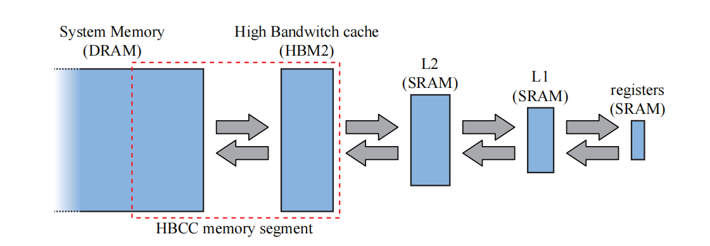

Vega的缓存层次结构如图23.30所示。在层次结构的顶部（图中最右侧），我们有寄存器，其次是L1缓存和L2缓存；然后是高带宽存储器2 （HBM2），它也位于显卡上，最后是位于CPU侧的系统内存。Vega架构的一个新特性是高带宽的缓存控制器（High-Bandwidth Cache Controller，HBCC），如图23.29底部所示，它允许显存表现得像最后一级缓存一样。这意味着，如果进行内存访问，而相应的内容不在显存中（即HBM2）的话，那么HBCC将会自动通过PCIe总线，获取相应的系统内存页面，并将其放入显存中。因此，显存中最近使用较少的页面可能会被换出。HBM2和系统内存之间共享的内存池，被称为HBCC内存段（HBCC memory segment，HMS）。所有的图形模块都会通过L2 缓存来访问内存，这与之前的架构有所不同。该架构还支持虚拟内存（章节19.10.1）。

请注意，所有的片上模块，例如HBCC、XDMA （CrossFire DMA）、PCI express、显示引擎和多媒体引擎，都会通过一个名为Infinity Fabric （IF）的互连（interconnect）进行通信。AMD的CPU也可以连接到这个IF，IF还可以连接不同芯片上的模块。这个IF也是一致的，这意味着所有块所能看到的内存内容都是相同的。

Vega架构芯片的基础时钟频率为1677 MHz，其峰值计算能力为：

$$
\underbrace{2}_{\text {FMA }} \cdot \underbrace{4096}_{\text {num SPs }} \cdot \underbrace{1677}_{\text {clock freq }}=13,737,984 \text { MFLOPS} \approx 13.7 \text { TFLOPS}
\tag{23.17} 
$$

其中FMA和TFLOPS的计算，与方程23.16中的计算相匹配。Vega架构也是灵活且可扩展的，因此可以有很多种的配置方式。

## 23.11 光线追踪架构

本小节我们将会简要介绍光线追踪硬件。我们不会并列出最近关于这个主题的所有参考资料，而是提供一组建议读者遵循的指南和链接。有关该领域的研究是由Schmittler等人\[1571]在2002年开始的，他们的重点是遍历和求交，并使用固定功能的单元来计算着色。这项工作后来被Woop等人\[1905]跟进，他们提出了一种具有可编程着色器的架构。

在过去几年中，对这一主题的商业兴趣大大增加。这一点可以从Imagination Technologies \[1158]、LG Electronics \[1256]和Samsung \[1013]等公司提出的用于实时光线追踪的硬件架构中看出。然而，截止到本文撰写时，只有Imagination Technologies发布了一款商业产品。

在这些架构中有几个共同的特点。首先，他们通常会使用基于AABB的BVH结构。其次，它们倾向于通过降低射线与box相交测试的精度，来降低硬件复杂度（章节22.7）。最后，他们使用可编程内核来支持可编程着色，这在今天或多或少算是一种需求。例如：Imagination公司对他们传统的芯片设计进行了扩展，增加了一个光线追踪单元，可以利用着色器核心来进行着色处理。这个光线追踪单元由一个光线求交处理器（ray intersection processor）与一个一致性引擎（coherency engine）组成，其中的一致性引擎\[1158]，会将具有相似属性的光线聚集在一起，并将它们一起进行处理，从而利用局部性来实现更快的光线追踪。在Imagination Technologies公司的架构中，还包含一个用于构建BVH的专用单元。

对该领域的研究还将继续探索几个子领域，其中包括通过降低精度来实现高效遍历\[1807]，BVH的压缩表示\[1045]，以及能源效率（energy efficiency）\[929]等。毫无疑问，还有更多的研究要进行。

# 补充阅读和资源

Akeley和Hanrahan \[20]，以及Hwu和Kirk \[793]有关计算机图形架构的课程讲义中提供了大量的参考资源。Kirk和Hwu \[903]的书，也是一个关于在GPU上使用CUDA编程的良好信息资源。每年的高性能图形（High-Performance Graphics）和SIGGRAPH会议论文集，是介绍新架构特征的良好来源。Giesen图形管线之旅（trip down the graphics pipeline），对于任何想要了解更多关于GPU细节的人而言，都是一个很棒的在线资源\[530]。我们还建议感兴趣的读者参考Hennessy和Patterson的书\[715]，从而了解有关内存系统的详细信息。有关移动渲染的信息分散在许多来源中，其中值得注意的是，在《GPU Pro 5》中，有7篇关于移动渲染技术的文章。
