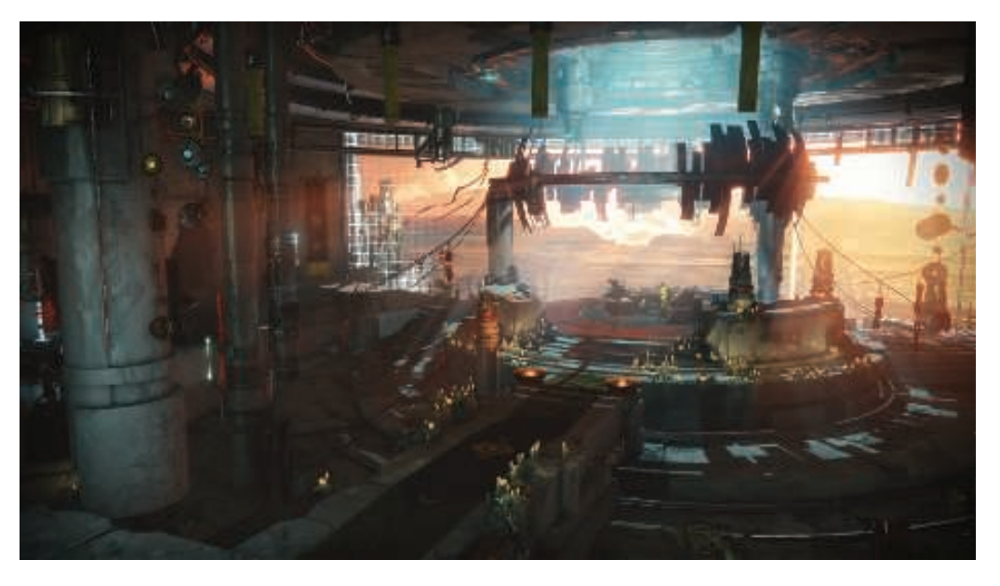
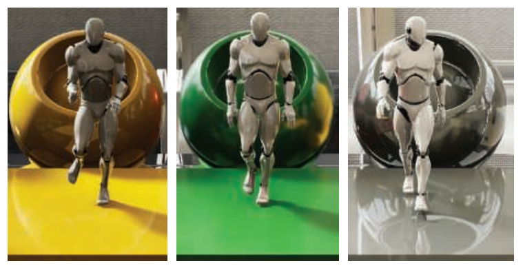
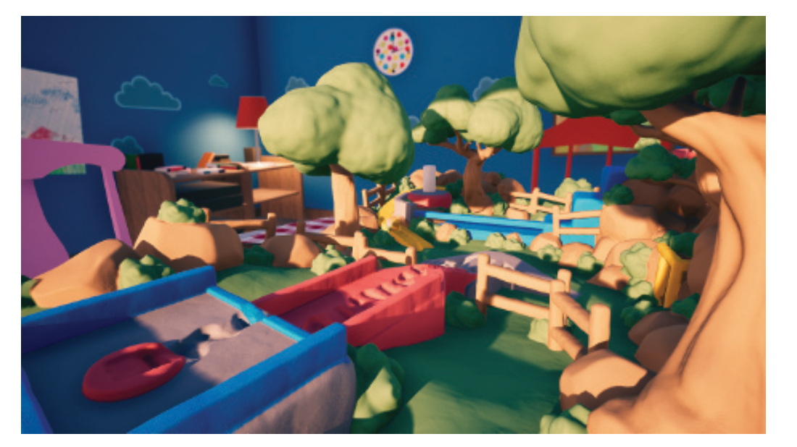
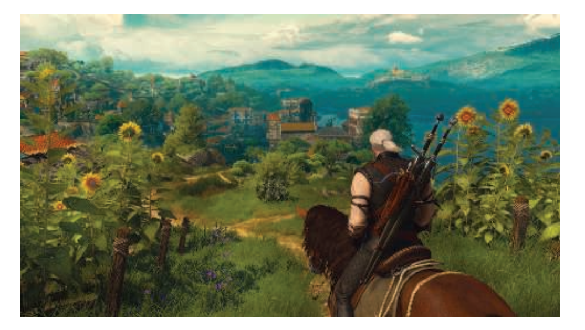

# Chapter 24 The Future 未来

## 目录

-   [24.1 其他事项](#241-其他事项)
-   [24.2 你](#242-你)

> Billy Zelsnack——“Pretty soon, computers will be fast.”

> 比利·泽尔纳克——“很快，计算机就会变得很快。”（引擎程序员，曾参与开发《雷神之锤》、《毁灭公爵》，其创建的游戏公司Rebel Boat Rocker与后来的Gearbox Software有关）

> Niels Bohr or Yogi Berra——“Prediction is difficult, especially of the future.”

> 尼尔斯·玻尔 or 尤吉·贝拉——“预测是困难的，尤其是预测未来。”（丹麦理论物理学家，哥本哈根学派创始人；1885—1962）（前MLB捕手、教练；Yogi 是少年友人起的外号，由于盘腿坐姿类似印度瑜伽士，1925—2015）

> Alan Kay——“The best way to predict the future is to create it.”

> 艾伦·凯——“预测未来的最好方法就是创造未来。”（美国计算机科技家，2003年图灵奖得主；1940—）

在这个展望未来的章节中，由两部分组成：其他事项和你。这一章就是关于这两方面的内容。首先，我们将会做出一些预测，其中的一些预测甚至可能会成为现实。更重要的是第二部分，关于下一步你可以前往哪里。你可以将本章节视为一个扩展的“补充阅读和资源”，就像是之前每章末尾的那样；但是我们也对从这里开始的方法进行了讨论，包括一般的信息来源、会议、代码等。首先我们先来看一个图片，如图24.1所示。

## 24.1 其他事项

图形学有助于游戏销售，而游戏则有助于芯片销售。从芯片制造商的营销角度来看，实时渲染的最佳特性之一，就是图形渲染将会消耗大量的处理能力和其他资源。与硬件相关的特性，例如帧率、分辨率和颜色深度等也会在一定程度上不断增长，从而进一步增加处理负载。最低90 FPS固定帧率是虚拟现实应用程序的标准，4k显示器目前已经对图形系统保持速度的能力提出了考验\[1885]。

在场景中模拟光线效果的复杂任务，本身就需要大量的计算能力。在场景中添加更多的物体或者更多的光源，显然会使得渲染计算变得更加昂贵。物体的类型（包括固体和体积，例如雾）、这些物体表面的描绘方式、以及所使用的光源类型，也是一些可以增加复杂性的因素。如果我们能够获取更多的样本、计算更加精确的方程、或者仅仅是能够使用更多的内存，许多算法的质量都会得到很大的提升。这种不断增加的复杂性，使得图形处理能力几乎成了一个无底洞。

为了解决长期的性能问题，乐观主义者喜欢求助于摩尔定律（Moore’s Law）。摩尔定律的观测结果表明：每1.5年性能增加2倍；或者更加实用的是，每5年性能增加10倍\[1663]。但是处理器的速度通常并不是性能瓶颈，而且随着时间的推移，性能瓶颈发生在处理器上的概率会越来越小。带宽才是真正可能成为性能瓶颈的地方，因为其性能每10年才会增加10倍，而不是像处理器那样，每5年增加10倍\[1332]。

来自电影行业中的图形算法，经常可以应用到实时渲染中，因为这些领域的共同目标都是生成逼真的图像。让我们看看电影行业中的做法，我们能够看到一些统计数据，例如2016年的电影《奇幻森林（the Jungle Book）》，某一帧的场景中可能包含数百万根头发，每帧的渲染时间为30到40个小时\[1960]。由于GPU是专为实时渲染而构建的，因此相比CPU具有明显的处理优势，但从$ 1/(40 \times 60  $$\times$$  60) = 0.00000694  $FPS到60 FPS，也大约有7个数量级。

本章节一开始的时候，我们承诺会进行一些预测，其中“更快更灵活（faster and more flexible）”就是最简单的一个。就GPU架构而言，一种可能性是z-buffer三角形光栅化管线将继续统治实时渲染。除了最简单的游戏之外，所有的游戏都会使用GPU来进行渲染。即使明天一醒来，就出现了某种令人难以置信的技术可以取代当前的管线，即使这种技术的速度要快一百倍；并且这种技术只需要下载一个系统补丁就可以运行，业界仍可能需要数年时间，才能迁移到这种新技术上。其中一个问题是在于，这种新方法是否可以使用与现有方法完全相同的API，如果不行的话，那么想要采纳这种方法就仍然需要一段时间。一款复杂的游戏需要花费数千万美元甚至更多的开发成本，并且经常需要数年时间才能完成。游戏的目标平台一般都是在开发过程的早期选定的，这就决定了所使用算法和着色器的复杂程度，以及美术资产的大小和复杂程度。除了这些因素之外，还需要考虑到编写或者生产这些元素所需要的开发工具，并且用户还需要对这些工具的使用十分精通。即使真的有奇迹发生，当前光栅化流水线背后的惯性，也仍然会给它带来若干年的生命。

变化仍在发生（change still happens）。实际上，简单的“一个光栅化器统治一切（one rasterizer to rule them all）”的想法已经开始消退。在本书中，我们讨论了计算着色器所能承担的各种任务，证明了光栅化并不是GPU所能提供的唯一服务。如果某个新技术真的很有吸引力，那么从游戏公司到商业引擎，再到相关的内容创造工具，都会发生工作流的重新调整。

那么，从长远来看情况如何呢？用于渲染三角形、访问纹理和混合结果样本的GPU专用固定功能硬件，仍然可以显著提升性能。但是移动设备的需求改变了这个情况，因为功耗成为了与原始性能一样重要的因素。然而，基础管线的“即发即弃（fire-and-forget）”概念，即我们将一个三角形只发送到管线中一次，并使用这些信息来完成该帧的渲染处理，这种概念并不是现代渲染引擎中所使用的模型。变换、扫描、着色和混合的基本流水线模型，已经发展得几乎面目全非了。GPU已经成为了一个基于流处理器的大型集群，我们可以随心所欲地使用它。

图形API和GPU发生了共同进化以适应这一现实，这里的咒语（mantra）是“灵活性（flexibility）”。图形渲染方法由研究人员进行探索，然后由开发人员在现有硬件上进行实现，从而确定他们所希望的功能是可以实现的。独立硬件供应商可以利用这些发现，以及他们自己的研究来开发通用功能，从而形成一个良性循环。对于任何单一算法进行优化都是徒劳的（ fool’s errand），而创建新的、更加灵活的方式来访问和处理GPU上的数据则不是。

考虑到这一点，我们将射线与物体相交的功能，视为一种具有多种用途的通用工具。我们知道，使用路径追踪的完全无偏采样，最终将会产生正确的、真实的图像，并达到场景描述的极限。这里的“最终”才是问题所在，正如我们在章节11.7中所讨论的，路径追踪作为一种可行的算法，目前正面临着严峻的挑战。其主要问题在于，想要得到无噪声的结果，并且保证在动画过程中不会发生闪烁，所需的样本数量实在太大。但是，路径追踪的纯粹性和简单性使其极具吸引力。在当前的交互式渲染状态下，其中所使用的许多技术，都是专门为特定情况量身定制的，也就是说，我们想要实现某种效果，可能会为这个效果专门设计一种算法来进行处理，而现在只需要一种算法就可以完成所有的工作。电影工作室当然已经意识到了这一点，因为在过去的十年中，他们已经完全转向了光线追踪和路径追踪方法。这样做可以使得他们只对一组光线传输的几何操作进行优化即可。

实时渲染（包括所有的渲染方式），最终都是关于采样和过滤的问题。除了提高光线发射和求交的效率之外，路径追踪还可以从更加智能的采样和过滤策略中受益。事实上，无论营销文学（marketing literature）如何，几乎所有的离线路径追踪渲染器都是有偏的（biased）\[1276]。对发射采样射线的位置做出合理的假设，能够大幅提高性能表现。路径追踪可以从中受益的另一个领域是智能过滤（字面意思的智能）。深度学习目前是一个白热化的研究领域和开发领域，由于在2012年取得了令人印象深刻的进展，当它的表现远远超过了手动调整的图像识别算法时\[349]，人们重新燃起了对其的兴趣。使用神经网络进行降噪\[95, 200, 247]和抗锯齿\[1534]是令人着迷的发展，如图24.2所示。我们已经看到，使用神经网络进行渲染相关任务的研究论文的数量大幅增加，更不用说建模和动画了。

![图24.2：基于神经网络的图像重建。左边是通过路径追踪生成的噪声图像。在右边的图像中，使用GPU加速的降噪算法，可以以交互式的速度来对图像进行处理。 \[200\]](images/Chapter-24/20231018153409.png "图24.2：基于神经网络的图像重建。左边是通过路径追踪生成的噪声图像。在右边的图像中，使用GPU加速的降噪算法，可以以交互式的速度来对图像进行处理。 \[200]")

最早可以追溯到1987年AT\&T的Pixel Machine，它可以使用交互式的光线追踪，来在小场景、低分辨率、较少光源的情况下，实现尖锐的反射、折射和阴影。微软在DirectX API中添加了光线追踪功能，被称为DXR，它简化了光线的发射过程，并激励硬件供应商增加对光线求交的硬件支持。光线发射（ray shooting），通过降噪技术或者其他滤波技术进行增强，将首先成为提高各种元素（例如阴影或者反射）渲染质量的一种技术。它将与许多其他算法进行竞争，每个渲染引擎会根据速度、质量和易用性等因素做出选择，如图24.3所示。

截至到本文撰写时，作为基本操作的分层光线发射（hierarchical ray shooting）还不是任何主流商业GPU的明确部分。我们把PowerVR的Wizard GPU \[1158]作为一个好兆头，因为已经有一家移动设备公司，正在考虑对分层场景描述提供光线求交的硬件支持。直接支持光线发射的新GPU，将会改变效率方程（equations of efficiency），并且可能构建一个良性循环，使得各种渲染效果的定制化和专业化程度都大幅降低。一种方法是对眼睛光线（eye ray）进行光栅化，并使用光线追踪或者计算着色器来实现其他的一切效果，并且这种方法已经在各种DXR demo \[1, 47, 745]中进行了使用。通过改进的降噪算法，更快的光线追踪GPU，以及先前研究的重新应用，或者使用一些新的研究，我们预计很快就会看到相当于10倍的性能提升。

我们希望DXR能够在其他方面为开发人员和研究人员带来好处。对于游戏而言，通过投射光线的烘焙系统现在可以在GPU上进行运行，并使用与交互式渲染器相似或者相同的着色器，从而提高性能。可以更加容易地生成ground truth图像，使其能够更加容易地用于测试，甚至是对算法进行自动调整。架构改变的相关想法，允许更加灵活地生成GPU任务（例如：创建着色器工作），这似乎是一个强大的想法，可能会有其他方面的应用。

GPU的发展当然还有着其他令人着迷的可能性。另一种理想化的世界观，是世界中的所有物质都是体素化的。如章节13.10中所述，这种表示对于光线传输和光照模拟来说有许多优点。但是由于需要进行大量的数据存储，以及较难处理场景中的动态物体，这些因素使得完全切换到体素表示的可能性极小。尽管如此，我们相信体素可能会得到更多的关注，因为体素技术会在很广泛的领域中进行使用，包括高质量的体积效果、3D打印和无约束的物体修改等（例如：Minecraft）。当然，考虑到自动驾驶汽车系统、激光雷达（LIDAR）和其他传感器会产生的大量的此类数据，因此相关的表示形式（点云）将会在未来几年中成为更多研究中的一部分。符号距离场（SDF）是另一种有趣的场景描述方法，与体素类似，SDF可以对场景进行无限制的修改，也可以对光线跟踪进行加速。

有时，某些特定应用程序的独特约束，允许其开发人员“打破常规（break the mold）”，并且使用一些以前被认为是外来的或者是不可行的技术。诸如Media Molecule（译者注：索尼的一个第一方工作室）的《Dreams》和Second Order的《粘土之书（Claybook）》（如图24.4所示）这样的游戏，这些游戏都使用了非传统的渲染算法，能够让我们对这样一个可能的渲染未来有一个有趣的了解。

虚拟现实和混合现实值得一提。当VR运作良好时，它的效果是惊人的。而混合现实则展示了合成内容与现实世界相融合的迷人场景。每个人都想要一款能兼顾两者的轻型眼镜，但是短期内这种设备也可能会进入“个人喷气背包、水下城市”等无法实现的类别，但是谁又能知道呢？考虑到这些努力背后的大量研究和开发工作\[1187]，可能会有一些改变世界的技术突破。

## 24.2 你

那么，当你的孩子和你孩子的孩子在等待奇点（The Singularity）到来的同时，你在做什么呢？当然是写程序：发现新的算法，创建应用程序，或者做其他你喜欢的事情。几十年前，一台机器图形硬件的价格要比一辆豪华汽车还贵；但是现在，它被内置到几乎所有具有CPU的设备中，而且这些设备还可以放在你的手中。图形入侵（graphics hacking）是廉价且主流的。在本小节中，我们将介绍在更多有用的资源，这些资源可以帮助你学习更多有关实时渲染领域中的知识和技术。

我们这本书并不是凭空存在的，它利用了大量已有的信息来源。如果你对其中的某个算法感兴趣，可以找到相关的原始出版物。我们的网站上有一个页面，其中包含了我们引用的所有文章，你可以在那里找到相应的资源链接（如果可以的话）。

大多数研究文章都可以使用谷歌学术（Google Scholar）或者作者的个人网站中找到，如果其他方法都失败了，那么还可以向作者索要一份文章副本，几乎每个人都喜欢让他们的工作被阅读和欣赏。

如果有些论文不是免费的话，那么诸如ACM数字图书馆（ACM Digital Library）等服务，包含了大量可用的文章。如果您是SIGGRAPH的成员，那么您可以自动免费访问他们的许多图形论文和演讲。还有一些期刊会发表相关的技术文章，例如ACM Transactions on Graphics（现在包括了SIGGRAPH 的论文集）， The Journal of Computer Graphics Techniques（这是开放获取的），IEEE Transactions on Visualization and Computer Graphics，Computer Graphics Forum，IEEE Computer Graphics and Applications等。最后，还有一些专业博客中存在有很好的信息，Twitter上的图形开发人员和研究人员，经常会指出很棒的新资源。

学习他人和结识他人的最快方法之一就是参加会议，很有可能另一个人正在做你感兴趣或者可能感兴趣的事情。如果你资金紧张的话，那么请联系相关的会议组织者，询问志愿者机会或者奖学金。SIGGRAPH和SIGGRAPH Asia年会是新思想的主要场所，但并非是唯一场所。还有一些其他的技术集会，例如Eurographics会议和Eurographics图形学渲染研讨会（Eurographics Symposium on Rendering，EGSR），交互式3D图形和游戏研讨会（Symposium on Interactive 3D Graphics and Games，I3D），以及高性能图形系统（High Performance Graphics，HPG）论坛展示并发布了大量与实时渲染相关的资料。还有一些专门针对开发者的会议，例如GDC （Game Developers Conference，游戏开发者大会）。当你在排队或者参加活动的时候，记得向陌生人打招呼。特别是在SIGGRAPH上，请留意您感兴趣领域的同类聚会（birds of a feather，BOF）。与人们面对面地交流思想是既有益又充满活力的。

还有一些与交互式渲染相关的电子资源。特别值得注意的是，《Graphics Codex》是一个高质量的纯电子参考资料，并且具有不断更新的优点。沉浸式线性代数（immersive linear algebra）网站中的部分内容，由本书的合著者所创建，其中包括了交互式的演示内容，对这个主题的学习有所帮助。Shirley有一本关于光线追踪的优秀的Kindle短篇书籍（《Ray Tracing in One Weekend》）。我们期待着这类资源变得廉价和更容易获取。

印刷书籍仍有一席之地。除了通用论文和特定领域的书籍，还有一些经过编辑的文章集合，其中包括了大量的研究信息和发展信息，其中的许多内容在本书中进行了引用。最近的例子是《GPU Pro》和《GPU Zen》书籍。一些较旧的书籍，例如《Game Programming Gems》、《GPU Gems》（免费在线）和《ShaderX》系列中仍然包含一些相关的文章，因为其中一些算法的原理并不会过时。所有的这些书籍，都允许游戏开发者在不撰写正式会议论文的前提下，就可以展示他们的方法。这样的文章合集还允许学者对他们工作的技术细节进行讨论，这些细节可能并不适合出现在研究论文中。对于专业的开发人员而言，从一篇文章中阅读一些实现细节所节省的一个小时，可能要比阅读整本书的成本更有价值。如果你等不及实体书被送到你的手里，可以使用亚马逊上的“Look Inside”功能，或者是在谷歌图书上搜索文本，可能会得到一个能够让我们开始（get you started）的摘录。

说完了，做完了，就需要开始写代码了。随着GitHub、Bitbucket和类似仓库的兴起，我们拥有一个丰富的代码仓库可以进行利用。困难的部分是知道哪些部分不属于Sturgeon定律（Sturgeon’s Law：任何事物中，其中90%都是垃圾）。像虚幻引擎这样的产品已经开放了它们的源代码，它是一个不可思议的资源。ACM现在鼓励任何已发表的技术文章公布各自的源代码。你所尊敬的作者有时候也会提供他们的源代码代码，尝试进行搜索。

Shadertoy是一个特别值得注意的网站，它经常在像素着色器中使用光线步进来展示各种技术。虽然其中的许多程序首先是赏心悦目的，但是该网站中包含了许多具有教育意义的demo，并且所有的代码都是可见的，并且可以在浏览器中进行运行。另一个基于浏览器的demo来源是three.js仓库和相关网站。“Three.js”是对WebGL的封装，它很容易进行实验，因为只需要几行代码就可以生成渲染结果。并且只需要点击一个超链接，就可以在网上发布demo，任何人都可以进行运行和分析，这对于教育用途和分享想法而言是非常棒的。本书的作者之一基于three.js，为Udacity（一个在线教育平台）创建了一门图形入门课程。

我们再次向您推荐我们的在线网站[realtimerendering.com](http://xn--realtimerendering-2880aa375khk1f3qgda088gow2ct4zdspyagy1arhyv99cc8xd.com "realtimerendering.com")。在那里你会发现许多其他有用的资源，例如推荐书目和新书列表（其中还包含一些免费的高质量内容），以及一些链接，它们指向具有价值的博客、研究网站、课程演示和许多其他的信息来源。去寻找快乐吧！

我们最后的忠告是去学习，去实践。实时计算机图形领域在不断地发展，新的想法和新的特性不断被发明和集成。你可以参与其中。虽然所使用的技术种类繁多，看起来也令人生畏，但是你不需要实现一长串的buzzwords-dujour（字面意思是今日流行语）就能得到好的结果。根据应用程序的约束条件以及所需要的视觉风格，巧妙地组合少量技术就可以得到与众不同的视觉效果。在GitHub上分享你的结果，GitHub还可用来托管博客。去参与吧！

这个领域最好的地方之一，就是它每隔几年就会自我改造一次（reinvents itself）。计算机架构也在不断变化和改进。几年前行不通的方案，现在可能就可以实现了。每一款新的GPU都会带来不同的功能、速度和内存组合。具体什么是高效的，哪部分会成为性能瓶颈，都在不断变化和发展。即使是那些看起来古老而成熟的部分，也值得重新审视。有有一种说法是，创造是一种扭曲、打破和融合其他想法的过程，而不是从无到有的过程。

44年前（2018-1974年），Sutherland、Sproull和Schumacker发表了计算机图形学领域中的一个里程碑论文：“A Characterization of Ten Hidden-Surface Algorithms”。在他们长达55页的论文中，进行了令人难以置信的全面对比分析。其中有一个被描述为“极其昂贵”的算法，这种暴力技术甚至连研究人员的名字都没有，只在附录中被提到过，它现在被称为z-buffer。公平地说，z-buffer的发明者是Ed Catmull，Sutherland是他的导师，Ed Catmull 对z-buffer概念进行讨论的论文，在几个月之后才发表。

在1974年的这篇论文中，讨论并对比了10种隐藏表面的算法，但是实际上最终胜出的是第11种，因为它在硬件上易于实现，并且随着硬件技术的进步，存储密度在不断上升，成本也随之下降。但是Sutherland等人所做的“十大算法”调查，在当时是完全有效的。随着条件的不读变化，所使用的算法也会发生改变。未来几年到底会发生什么变化，是一件令人兴奋的事情。在将来的某一天，当我们对目前渲染技术时代进行回顾的时候，会有什么感觉呢？没有人知道，每个人都可能会对未来产生重大影响。没有唯一的未来，没有必然会发生的过程。是你创造了它。

