# Chapter 25 Collision Detection 碰撞检测

## 目录

-   [25.1 宽阶段碰撞检测](#251-宽阶段碰撞检测)
    -   [25.1.1 扫描剪枝算法](#2511-扫描剪枝算法)
    -   [25.1.2 网格](#2512-网格)
    -   [25.1.3 层次包围体](#2513-层次包围体)
-   [25.2 中阶段碰撞检测](#252-中阶段碰撞检测)
    -   [25.2.1 BVH构建](#2521-BVH构建)
    -   [25.2.2 BVH间的碰撞测试](#2522-BVH间的碰撞测试)
    -   [25.2.3 BVH成本函数](#2523-BVH成本函数)
    -   [25.2.4 OBB树](#2524-OBB树)
        -   [选择包围体](#选择包围体)
        -   [建立层次结构](#建立层次结构)
        -   [处理刚体运动](#处理刚体运动)
        -   [其他](#其他)
-   [25.3 窄阶段碰撞检测](#253-窄阶段碰撞检测)
    -   [25.3.1 图元vs图元](#2531-图元vs图元)
    -   [25.3.2 距离查询](#2532-距离查询)
-   [25.4 射线碰撞检测](#254-射线碰撞检测)
-   [25.5 使用BSP树的动态CD](#255-使用BSP树的动态CD)
-   [25.6 限时碰撞检测](#256-限时碰撞检测)
-   [25.7 可变形模型](#257-可变形模型)
-   [25.8 连续碰撞检测](#258-连续碰撞检测)
-   [25.9 碰撞响应](#259-碰撞响应)
-   [25.10 粒子](#2510-粒子)
    -   [25.10.1 粒子系统](#25101-粒子系统)
    -   [25.10.2 粒子的物理模拟](#25102-粒子的物理模拟)
-   [25.11 动态相交测试](#2511-动态相交测试)
    -   [25.11.1球体/平面](#25111球体平面)
    -   [25.11.2球体/球体](#25112球体球体)
    -   [25.11.3 球体/多边形](#25113-球体多边形)
    -   [25.11.4 动态分离轴方法](#25114-动态分离轴方法)
-   [补充阅读和资源](#补充阅读和资源)

> George Santayana——“To knock a thing down, especially if it is cocked at an arrogant angle, is a deep delight to the blood.”

> 乔治·桑塔亚纳——“把一件东西撞倒，尤其是以傲慢的角度把它撞倒，是一种血液深处的喜悦。”（西班牙著名自然主义哲学家、美学家；1863—1952）

> 译者注：本章节中引用的参考文献编号是单独列出的，注意不要与第1章-第24章的参考文献相混淆。

碰撞检测（collision detection，CD）是计算机图形学中一个基本而重要的组成部分。CD在虚拟制造、CAD/CAM、计算机动画、基于物理的建模、游戏、飞行模拟器、车辆模拟器、机器人、路径和运动规划（公差验证）、装配以及几乎所有的虚拟现实模拟领域中，都发挥着重要作用。由于其广泛的用途，因此CD一直是、并且仍然是一个被广泛研究的主题。

碰撞检测是通常被称为碰撞处理（collision handling）中的一部分，它可以被分为三个主要部分：碰撞检测（collision detection）、碰撞确定（collision determination）和碰撞响应（collision response）。碰撞检测的结果是一个布尔值，它代表了两个或者多个物体是否发生碰撞；而碰撞确定则会找到物体之间的实际交点；最后，碰撞响应决定了两个物体在发生碰撞的时候，应当采取什么样的行动。

考虑一个由弹簧和齿轮组成的老式时钟。假设这个时钟在计算机中被表示为一个详细的三维模型，我们现在要使用碰撞检测来模拟时钟的运动，当检测到碰撞并产生响应的时候，将弹簧上紧并模拟时钟的运动。这样的一个系统，可能需要在数千对物体之间进行碰撞检测。另一个挑战是对蚁丘中所有的蚂蚁和松针进行模拟，直接对所有可能的碰撞对进行暴力搜索将是非常低效的，在这种情况下根本不切实际。图25.1展示了一个复杂碰撞检测的例子。

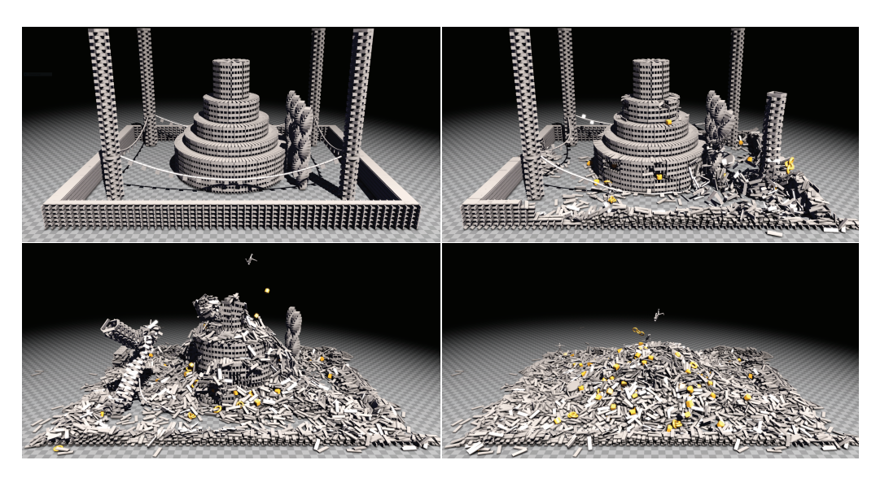

为了应对大型场景中的碰撞检测，我们通常会将一个碰撞检测系统划分为3个阶段。宽阶段CD（broad phase CD）将会在每个物体级别上进行工作，并找到与BV重叠的物体对（章节25.1）。中阶段CD（mid phase CD）将继续工作，并检测两个物体之间可能重叠的部分（章节25.2）。最后，窄阶段CD（narrow phase CD）会在图元叶子或者物体的凸面部分上进行工作（章节25.3）。这三个阶段可以在大型CD系统中一起使用。

在章节25.4中，我们将讨论一些在某些场景下非常有用且简单快速的碰撞检测技术。其主要思想是使用一组线段来近似一个复杂的物体，然后测试这些线段是否会与环境中的图元相交，这种技术有时也会被用于游戏中。在章节25.5中，我们将介绍另外一种近似方法，它使用BSP树来表示环境，从而可以使用圆柱体来代表人物角色。然而，并非所有物体都可以被近似为线段或者圆柱体，有些应用可能还需要更加精确的测试。

限时碰撞检测（time-critical collision detection）是指一种能够在常数时间内进行近似碰撞检测的技术，我们将在章节25.6中进行讨论。然后依次讨论可变形模型、连续CD、碰撞响应等内容，最后在章节25.10中讨论如何处理粒子之间的碰撞。

必须指出的是，对于CD性能的评估是很困难的，因为碰撞检测算法对于碰撞场景十分敏感，并且没有任何一种算法能够在所有情况下都表现最好\[33]。另外请注意，CD通常会在CPU端执行，但是由于GPU的通用性，所有这些算法也都可以在GPU上进行执行。一般来说，为了使得性能最大化，算法需要与特定架构的内存系统和特性集合相适应。

最后，我们介绍了一些动态相交测试，例如确定两个移动的物体，在给定的时间内是否会发生碰撞，这实际上是对问题又增加了另一个维度：时间。在最后一个小节中，我们提供了各种基本组合的常用测试，以及用于派生更加复杂交互的工具。

## 25.1 宽阶段碰撞检测

在本小节中，我们将介绍几种宽阶段CD算法。不过，首先我们在图25.2中展示了CD的宽阶段（broad phase）、中阶段（mid phase）和窄阶段（narrow phase）过程，这是一个两级CD系统\[16]，其中最后一个阶段被划分为中阶段和窄阶段。这个CD系统的目标是具有多个运动物体的大型环境，该系统的宽阶段将会报告环境中所有物体之间的潜在碰撞。接下来，中阶段会处理成对的物体，并试图找到任何可能重叠的图元叶子或者凸面部分。窄阶段会计算图元与图元之间的交点，或者使用距离查询（distance query）来确保物体之间不会相互穿透。最后，计算碰撞响应（章节25.9），碰撞响应的计算结果会被馈送到仿真子系统中，这个子系统可以计算每个物体的最终变换。

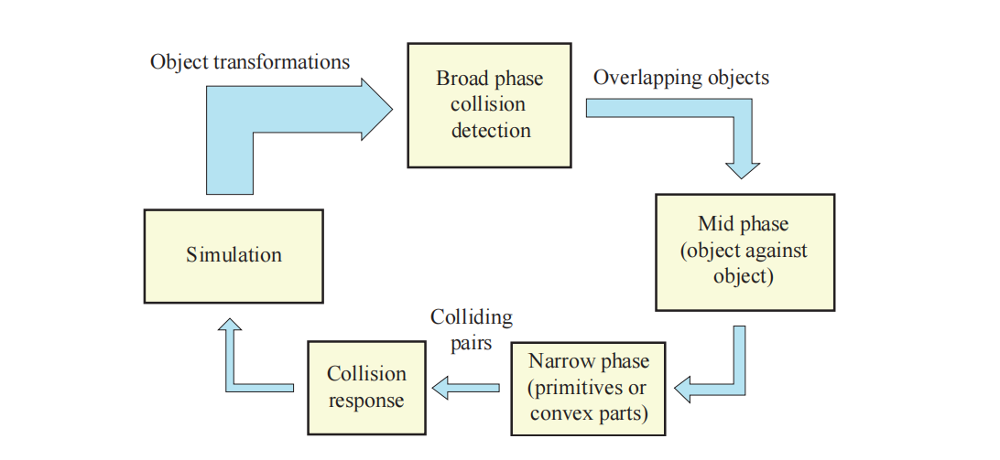

由于一个场景中可能会包含数千个移动物体，因此一个好的CD系统必须能够很好地处理这种情况。如果场景包含$n$个移动物体和$m$个静态物体，那么可以一种比较简单的碰撞方法，每帧将会执行的次数如下：

$$
n m+\left(\begin{array}{c}n \\ 2\end{array}\right)=n m+n(n-1) / 2
\tag{25.1} 
$$

其中的第一项$mn$，对应了动态物体与静态物体之间的测试数量；第二项$\left(\begin{array}{c}n \\ 2\end{array}\right)$对应了动态物体与动态物体之间的测试数量。随着$m$和$n$的数量增加，这种简单的方法将会很快变得十分昂贵。这种情况需要一种更加智能的方法，这就是本小节的主题。

每个阶段的目标都是将传递给后续阶段的工作量进行最小化，也就是说，我们希望能够最小化提供给下一阶段的物体对、图元对、凸面对等。在第一个阶段中，测试是在物体级别上完成的，因此它通常也被称为宽阶段CD。

这一阶段的大多数算法，首先会将每个物体包围在一个BV中，然后使用一些技术来找到所有重叠的BV-BV对。一种简单的方法是为每个物体都使用轴对齐包围盒（AABB）。对于进行刚体运动的物体，为了避免重新计算该物体的AABB，因此会将AABB调整为一个足够大的固定立方体（fixed cube），从而容纳在任何方向上的物体，并使用这个固定立方体来快速确定哪些物体的BV对是不相交的。有时候使用动态调整大小的AABB可能会更好，这些AABB可以进行快速的重新计算，例如：OBB、球体和胶囊体等。

可以使用球体来代替固定立方体，这是合理的，因为球体是一个可以在任何方向上包围物体的完美BV。也可以使用顶点贴图（apex map，章节22.13.4）\[53]。接下来，我们将介绍三种宽阶段CD算法，即扫描剪枝算法（sweep-and-prune）、网格算法和BVH算法。另一种完全不同的方法，是使用章节19.1.3中所介绍的松散八叉树结构（loose octree structure）。

### 25.1.1 扫描剪枝算法

我们假设每个物体都有一个封闭的AABB。在扫描剪枝（sweep-and-prune，SAP）技术\[3, 62, 93]中，我们利用了在典型应用中存在的时间一致性（temporal coherence）。这里的时间一致性意味着物体的位置和方向，在帧与帧之间只会发生相对较小的（如果有的话）变化，因此也被称为帧与帧的一致性（frame-to-frame coherence）。

Lin \[62]指出，找到三维重叠包围盒的问题可以在$O(n \log^2 n+k)$时间内求解（其中$k$是成对重叠的数量），但是还可以通过利用一致性来进行改进，从而可以减少到$O(n +k)$。然而，这需要假设动画具有相当数量的时间一致性。

如果两个AABB重叠，那么每个主轴方向上的三个一维区间（由AABB的起点和终点组成）也必须重叠。在这里，我们将介绍当时间一致性很高的时候，如何高效检测多个一维区间中的所有重叠。在给定该解的情况下，对三个主轴分别采用一维算法，即可求解三维AABB的重叠问题。

假设$n$个区间（沿特定轴）使用$s_i$和$e_i$进行表示，其中$s_{i}<e_{i}$，$0 \leq i<n$。这些值将会存储在一个列表中，并按照递增顺序进行排序，然后这个列表会被从头扫到尾。在遇到起始点$s_i$时，会将相应的区间放入活动区间列表中（active interval list）。在遇到端点$e_i$的时候，会从活动区间链表中删除相应的区间记录。此时，如果活动列表中存在区间记录，同时遇到了某个区间的起始点，那么这个起始点所对应的区间，将会与活动链表中的所有区间相重叠，结果如图25.3所示。

![图25.3：第一行中，当活动列表（ I\_3 ）中只有一个区间时，它会在标记为（a）的地方遇到区间 I\_4 ，因此我们可以得出结论，区间 I\_4 和区间 I\_3 是重叠的。而在后续遇到 I\_2 的时候， I\_4 仍然位于活动列表中（因为还没有遇到端点 e\_4 ），因此区间 I\_4 和区间 I\_2 也是重叠的。在遇到端点 e\_4 的时候（标记为（b）的地方），会将 I\_4 从活动列表中移除。第二行中，区间 I\_2 移动到了右边，当插入排序发现 s\_2 和 e\_4 需要改变位置的时候，也可以得出新的结论，即区间 I\_2 和区间 I\_4 不再重叠。 \[93\]](images/Chapter-25/20231018204922.png "图25.3：第一行中，当活动列表（ I_3 ）中只有一个区间时，它会在标记为（a）的地方遇到区间 I_4 ，因此我们可以得出结论，区间 I_4 和区间 I_3 是重叠的。而在后续遇到 I_2 的时候， I_4 仍然位于活动列表中（因为还没有遇到端点 e_4 ），因此区间 I_4 和区间 I_2 也是重叠的。在遇到端点 e_4 的时候（标记为（b）的地方），会将 I_4 从活动列表中移除。第二行中，区间 I_2 移动到了右边，当插入排序发现 s_2 和 e_4 需要改变位置的时候，也可以得出新的结论，即区间 I_2 和区间 I_4 不再重叠。 \[93]")

这个过程需要对所有的区间进行排序，排序算法的时间复杂度为$O(n \log n)$，遍历列表的时间复杂度为$O(n)$，报告$k$个重叠区间的时间复杂度为$O(k)$，因此算法的整体时间复杂度为$O(n \log n + k)$。但是由于时间上的一致性，因此这个列表中的区间信息在帧与帧之间并不会有太大的变化，因此可以使用冒泡排序（bubble sort）或者插入排序（insertion sort）\[62]，这两个排序算法可以在对列表进行一次遍历之后，就能够报告排序是否已经完成。对于近乎有序的列表而言，这些排序算法可以实现$O(n)$的时间复杂度。

插入排序的工作原理是逐步构建有序序列。我们可以从列表中的第一个数字开始，如果我们只考虑这一项，那么这个列表就是有序的。接下来，我们添加第二项，如果第二项比第一项小，那么我们就改变第一项和第二项的位置；否则这个数组就是有序的，我们不需要进行处理。我们继续添加其他项，并根据大小关系来改变这些项的位置，直到整个列表被排序完成。我们要对所有需要进行排序的物体重复这个过程，这个过程的结果就是一个有序列表。

为了充分利用时间一致性，我们会为每个可能的区间对保留一个布尔值。对于大型模型而言，这样做可能并不实用，因为它意味着$O(n^2)$的存储成本。相反，可以使用一个哈希映射（hash map）来解决这个问题。这个特定的布尔值在两个物体重叠时为TRUE，否则为FALSE。当列表排序完成的时候，这个布尔值会在算法的第一步中进行初始化。当区间对的状态发生改变时，布尔值会被反转，图25.3也说明了这一点。

我们可以为三个主轴都创建一个排序的区间列表，并使用前面所介绍的算法为每个主轴都找到相互重叠的区间。如果某对物体的三个区间都发生了重叠，那么说明它们的AABB（区间所代表的）也相互重叠；否则，它们的AABB不会发生重叠。这个算法的期望时间是线性的，因此扫描剪枝算法的期望时间复杂度为$O(n + k)$，其中$k$是成对重叠的数量。如果所有物体对都会在三个轴上发生重叠（即三个布尔值都为true），那么这对物体可以添加到碰撞对列表中，以便后续进行快速访问。这样做有助于AABB的快速重叠测试。请注意，由于所使用的排序算法，因此扫描剪枝算法可能会恶化到最坏的时间复杂度，可能是$O(n^2)$。当区间发生聚集的时候，就会发生这种情况。一个常见的例子就是大量物体平放在地板上，如果$z$轴指向地板的法线方向，那么就会在$z$轴方向上发生聚集现象。其中一种解决方案是完全跳过$z$轴，只在$x$轴和$y$轴上执行测试\[25]，在很多情况下，这种方法都十分有效。Liu等人\[63]提出了SAP的并行版本，该版本对扫描方向也进行了优化。他们的算法针对GPU进行，并且提供了在线代码。

### 25.1.2 网格

虽然网格和分层网格是最著名的光线追踪加速结构，但是它们也可以用于宽阶段碰撞检测\[88]。在其最简单的形式中，网格只是一个$n$维的非重叠网格单元数组，它覆盖了整个场景空间。因此，每个单元格都是一个box，并且场景中的所有box尺寸都相同。从高层次来看，带有网格的宽阶段CD，首先会将我们场景中所有物体的BV都插入到网格中。然后，如果两个物体与同一个网格单元相关联，那么我们就能够立即知道这两个物体的BV可能会发生重叠。因此，我们执行一个简单的BV与BV之间的重叠测试，如果它们确实发生了碰撞，那么我们可以继续进行CD系统的第二级。在图25.4的右侧，展示了一个包含四个物体的二维网格。

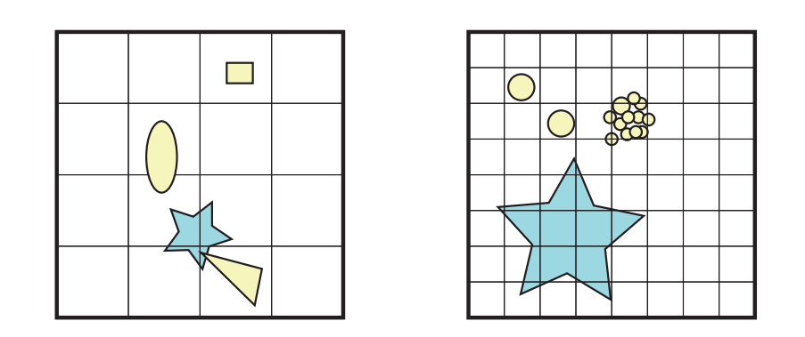

为了获得良好的性能表现，选择一个合理的单元格大小是十分重要的，这个问题在图25.4中进行了展示说明。一个想法是找到场景中最大的那个物体，并使得单元格的尺寸足够大，从而适应所有可能朝向的物体\[88]。这样一来，在三维网格的情况下，每个物体最多只会与8个单元格相重叠。

存储一个大型网格可能是相当浪费的，尤其是当网格中的很大一部分空间没有被使用时。因此，有人建议使用空间哈希（spatial hashing）来代替网格存储\[25, 86, 88]。通常，每个单元格都会映射到哈希表中的一个索引，所有与单元格重叠的物体，都会被插入到哈希表中，然后测试可以像往常一样继续进行。在没有空间哈希的情况下，我们需要确定包围整个场景的AABB尺寸，然后才能为网格分配相应的内存。同时我们还必须限制物体的移动范围，使得它们不会离开这些预先划定的界限。而空间哈希则可以完全避免这些问题，因为无论物体位于何处，都可以立即插入到哈希表中。

如图25.4所示，在整个网格中使用相同大小的单元格并不总是最佳的方式。另一个选择是使用分层网格，在这个方案中，会使用几个不同单元格大小的嵌套网格，物体只会被插入到比其BV刚好小一点的单元格中。如果在这个分层网格中，相邻层次之间的单元格大小刚好相差两倍，那么这种结构实际上与八叉树非常相似。在为CD实现网格和分层网格的时候，有许多细节值得了解，我们参考了Ericson \[25]和Pouchol等人\[76]的文章，他们对该主题进行了出色的处理。

### 25.1.3 层次包围体

我们在章节19.1.1中介绍了层次包围体（bounding volume hierarchy，BVH），当时是作为使用视锥体剔除加速渲染的一种手段。至于如何构建BVH、以及如何使用BVH来执行碰撞测试，将会在章节25.2中进行详细描述。宽阶段CD也可以使用BVH来进行实现。假设物体每帧都会发生移动，并且场景中的每个物体都存在AABB，即每个叶子节点都包含一个AABB以及对应的底层物体，那么使用这些AABB就可以快速构建BVH。BVH中子节点的最大数量，通常会根据潜在的目标架构进行调整，例如：如果目标SIMD宽度为8，则会使用8个子节点。

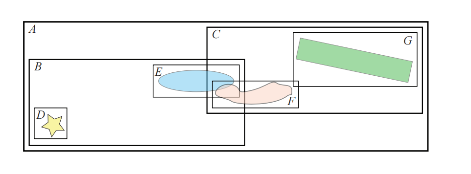

在BVH构建完成之后，可以实用这个BVH来检测哪些物体是发生重叠的，即哪些叶子节点的AABB会发生重叠。一种方法是根据BVH，来对每个物体的AABB进行分层测试。如果某个物体的AABB在遍历BVH期间没有与任何节点的BV相重叠，则可以终止对该节点子树的后续处理；如果发生了重叠，则继续向下递归测试。在图25.5中，为了找出与节点$D$的重叠部分，我们从根节点开始测试，因为物体总是会与根节点重叠。节点$D$并不与节点$C$不重叠，因此不需要对该子树进行进一步地测试。

测试会在节点$B$中继续，而节点$D$总是会与节点$B$重叠，因为它就是节点$B$子树中的一个子树。最后，会将节点$D$与节点$E$进行重叠测试，最终的结果表明，节点$D$不与任何其他物体相重叠。接下来，我们再确定节点$E$是否会与任何其他物体重叠，它首先会与节点$A$和节点$B$重叠，因为节点$E$就位于它们的子树中，但同时节点$E$也与节点$C$重叠。我们对节点$B$进行遍历，最终发现节点$B$中没有任何物体与节点E重叠。然而，在节点$C$的子树中，我们会发现节点$E$与节点$F$重叠，与节点$G$不重叠。通过使用这种方法，我们对一个叶子节点$X$进行测试，如果递归到达某一个叶子节点时，并且该叶子节点的AABB（记作$Y$）与$X$重叠，则将这对$(X, Y)$添加到重叠的物体列表中。需要注意的是，我们不能同时将$(E, F)$和$(F, E)$都添加到列表中，这两个代表的含义实际上是一样的。

又或者，可以进行BVH和BVH之间的测试，其中BVH会针对自身进行测试，当两个AABB不重叠时，则终止递归。如果发现一对叶子节点的AABB（对应两个不同的物体）发生重叠，则将这对叶子节点添加到一个列表中，并将其馈送到下一阶段。请注意，在对自身进行检测的时候必须要小心，不要报告AABB与其自身之间的重叠。我们继续使用图25.5中的例子，测试会从根节点开始，由于根节点总是会有与之重叠的部分，因此我们会深入到节点$A$中，对节点$B$和节点$C$进行检测。我们发现节点$B$有重叠部分，但是当我们继续深入到子树$B$之后，却发现节点$D$和节点$E$并不重叠。我们还对另一侧的子树$C$进行了研究，发现节点$F$和节点$G$重叠，因此$(F, G)$被添加到重叠列表中。接下来，由于节点$B$和节点$C$重叠，因此我们还必须对子树$B$中的所有子节点，与子树$C$中的所有子节点进行挨个测试。在这里，我们会发现节点$E$和节点$F$重叠，并将$(E,F)$也添加到列表中。

使用BVH方法的一个重要优点在于，我们只需要在物体的AABB上构建一个单一的数据结构即可，然后这个构建完成的BVH，可以用于宽阶段CD、视锥体剔除、遮挡剔除和光线追踪等不同的任务。

## 25.2 中阶段碰撞检测

在宽阶段处理之后，我们假设对物体对进行了处理，并且我们希望找到这些物体之间的重叠部分。为此，本小节将会介绍通用的层次包围体碰撞检测算法。模型可以进行刚体运动，即旋转变换加上平移变换，或者是更一般的变形类型（章节25.7）。由于这些方法试图为一组几何图形创建更加紧密贴合的包围体，因此这些方法可以提供高效的包围体（BV）表示，较小的BV可以提高算法的性能表现。还要注意的是，通常会对用于渲染的原始网格进行简化，并使用这些简化网格来用于碰撞检测，从而降低CD的复杂性和成本\[73]。对于简单的碰撞体而言（例如box、球体和胶囊体），这部分的处理可以跳过，直接进入到窄阶段碰撞检测。

本节将会介绍一些通用思想和方法，它们使用层次包围体（BVH）来检测两个给定模型之间的碰撞。这些算法具有两个共同的特征元素，即它们会使用BV来创建每个模型的层次表示；并且无论使用哪种BV，碰撞查询的高级代码（high-level code）都是相似的。

### 25.2.1 BVH构建

一开始，一个模型会由几个图元进行表示，在本小节中我们假设这些图元是三角形，但是一般来说，它们可以是任何类型的图元。由于每个模型都应当被表示为某种BV的层次结构，因此必须开发一些方法，使用所需的属性来构建这种层次结构。在碰撞检测算法中，我们通常使用的层次结构是一种称为$k$叉树（k-ary tree）的数据结构，其中每个节点最多可以有$k$个子节点（章节19.1）。有许多算法会使用$k$叉树的最简单实例，即二叉树，其中$k = 2$。但是在当前的架构中，这个$k$可能会更高一些（例如：为了匹配特定的SIMD宽度，或者最小化间接指针的数量等）。在每个内部节点中都会有一个BV，并将所有子节点包含在其体积内部，在每个叶子节点会存储一个或者多个图元。对于任意节点（内部节点或者叶子节点）$A$，我们将其包围体记为$A_{BV}$，属于节点$A$的子节点集合记为$A_c$。

构建一个层次结构有四种主要方法，分别是：自下而上（bottom-up）方法、增量树插（incremental tree-insertion）方法、自上而下（top-down）方法或者线性BVH方法。为了创建一个高效的、紧凑的结构，通常需要尽可能地减少BV的表面积或者体积\[31, 47]，例如：在使用地板物体的时候，就可以看到这个体积问题，由于地板并没有体积，因此在使用这个指标的时候，其本身并没有大小或者影响。所有单轴对齐的多边形都将具有相同的影响，即无论这些物体的大小如何，它们都没有任何影响。有证据表明，在大多数情况下，表面积是更好的启发式方法；而当具有较大表面的物体彼此面对时，体积则可以提供更好的性能（详见下方注释）\[95]。因此，我们将在本章节的剩余部分中都使用表面积这个指标，但是请记住，有时候使用体积可能会更好。

> 在撰写本章的时候，我们思考了这个问题，我们认为两个物体相交的几率与Minkowski差的表面积有关，因此会取决于两个物体。

第一个方法是自下而上的（bottom-up），它首先会将几个图元组合一起，并为它们找到一个BV。这些图元之间应当靠得很近，这可以通过使用图元之间的距离来进行确定。再然后，要么使用同样的方法来创建新的BV；要么使用相似的方法将已有BV与一个或者多个BV组合在一起，从而产生一个新的、更大的父BV。这个过程会一直重复下去，直到整个场景中只剩下一个BV，此时这个BV就是层次结构的根节点。通过这种方式，空间中距离很近的图元在层次包围体结构中的位置也会靠得很近\[31]。

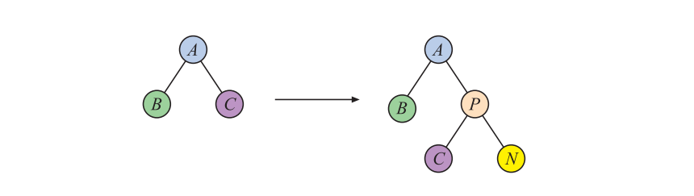

增量树插（incremental tree-insertion）方法会从一棵空树开始，然后将所有其他的图元及其BV，逐个添加到这棵树中，如图25.6所示。想要构建一棵高效的树，我们必须在树中找到一个合理的插入点。至于选择这个插入点的指标，应当能够使得树的整体体积的增加量最小。一个简单的方法是将新节点下降到使得树体积增加较小的子节点中。这种算法的运行时间通常为$O(n \log n)$。将图元的插入顺序进行随机化，可以改善树的构建。

自上而下（top-down）是一种十分流行的方法，它首先会为模型的所有图元都找到一个BV，并将这个最大的BV作为树的根节点。然后采用一些分治策略（divide-and conquer strategy），即将BV分成$k$个部分或者更少的部分。对于每个这样的部分，找到所有包含的图元，然后使用与根节点相同的方式再次创建一个BV，即递归创建层次结构。最常见的方法就是找到一个图元应当被划分开来的轴，然后在这个轴上寻找一个合适的分割点。章节22.4中对几何概率（geometric probability）进行了讨论，这个指标可以用于寻找一个较好的分割点，从而得到一个更好的BVH。在光线追踪中，会使用表面积启发式（surface area heuristic，SAH）方法，其方程为：

$$
C(n)=\left\{\begin{array}{ll}C_{i} A(n)+C\left(n_{l}\right)+C\left(n_{r}\right), & n \in I \\ C_{t} A(n) N(n), & n \in L\end{array}\right.
\tag{25.2} 
$$

其中$C(n)$为节点$n$的SAH代价，$n_l$和$n_r$分别为节点$n$的左右子节点。包围体$n$的表面积记为$A (n)$， $C_i$为遍历内部节点的代价，$C_t$为射线与三角形求交的代价。同样，所有内部节点的集合记为$I$，所有叶子节点的集合记为$L$。$N(n)$是叶子节点中三角形的个数。请注意，方程25.2中的第一行代表了使得节点$n$成为内部节点的代价，第二行代表了使得节点$n$成为叶子节点的代价。在理想情况下，方程中的第一行应当被最小化，这是通过沿着$x$轴、$y$轴和$z$轴搜索最佳分割点来实现的。Embree \[90]为此实现了许多最先进（state-of-the-art）的方法。可以根据具体哪个成本最低，来选择构建一个内部节点还是叶子节点。由于其中的表面积指标是用于SAH度量的，它可能并不适合用于碰撞检测。但是原理是一样的，其中的表面积函数$A(n)$可以替换为体积函数$V (n)$，这个体积函数$V (n)$计算的是BV的体积。

请注意，自上而下方法的一个潜在优点在于，可以惰性地创建层次结构，即按需创建层次结构。这意味着我们可以只为场景中真正需要的部分来构建层次结构。但是由于这个构建过程是在运行过程中执行的，因此每当需要创建部分层次结构的时候，性能可能会显著下降。这对于具有实时要求的应用程序（例如游戏）而言是不可接受的，但是对于CAD应用程序或者一些离线计算（例如路径规划、动画等）而言，可以大大降低时间开销和内存开销。

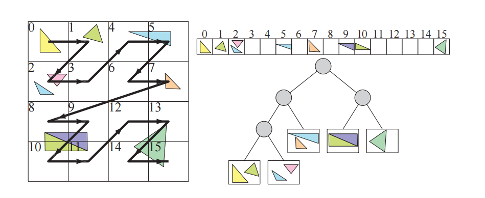

线性BVH方法\[59]最初的目标是在GPU上构建BVH，但是它在CPU上的表现也十分出色，其核心思想如图25.7所示。首先，在所有三角形周围都找到一个box；其次，将三角形按照某种顺序存储在一个数组中。然后，根据每个三角形的质心，为其分配一个整数Morton码（章节23.8）。再然后，根据它们的Morton码对三角形进行排序。最后，对这个三角形列表进行层次分割，每一步都会创建一个包围其三角形的内部节点。当子列表中没有剩余三角形的时候，或者当子列表中的三角形数量很少的时候（可以打包放入一个叶子节点中），这个过程就会停止。Karras和Aila \[45, 46]对这个主题的许多研究论文进行了综述，并提出了适用于BVH、八叉树和k-d树的高度优化版本，其中的k-d树基于将排序后的Morton码解释为一个基数树（radix tree），从而快速构建BVH。Apetrei \[1]对Karras的技术进行了改进，在可以同样生成一棵树的前提下，将两个pass合并为了一个pass。

CD算法的一个挑战在于，我们需要找到与物体紧密贴合的包围体和层次结构构建方法，从而创建平衡且高效的树结构。请注意，平衡树在最差情况下的执行效果会更好，因为每个叶子节点的深度都是相同的（或者是几乎相同的）。这意味着沿着层次结构，向下遍历到任何叶子节点（即图元）所需要的时间都是相等的，并且碰撞查询的时间不会因为访问不同的叶子节点而发生改变。从这个意义上说，平衡树是最优选择。然而，这并不意味着它对于所有输入都是最好的，例如：如果模型中的某一部分很少或者永远都不会发生碰撞，那么这些部分可以位于一个非平衡树的深处，这样可以使得被查询最多的部分更加接近根节点，从而降低遍历时间\[34]。章节25.2.4中对OBB树的这个过程细进行了描述。

还要注意，章节19.1中描述了几个与加速算法相关的空间数据结构，而章节22.3中则讨论BV的创建方法。

### 25.2.2 BVH间的碰撞测试

在中阶段CD，我们将会找出哪些叶子节点的BV与其他叶子节点的BV相互重叠，即这个阶段将会创建一个列表，其中包含了BV相互重叠的叶子节点对。这些信息将被进一步发送到窄阶段CD（章节25.3）。或者对于重叠的BV对，可以立即使用窄阶段测试，来检查其内容是否发生碰撞。

这里我们回顾一下相应的符号标记，其中$A$和$B$是模型层次结构中的两个节点，在第一次调用的时候，它们就是模型的根节点。$A_{BV}$和$B_{BV}$用于访问相应节点所对应的BV；$A_c$是节点$A$子节点的集合。其基本思想是在检测到重叠的时候，打开一个较大的box，并对其中的内容（子节点）进行递归测试。

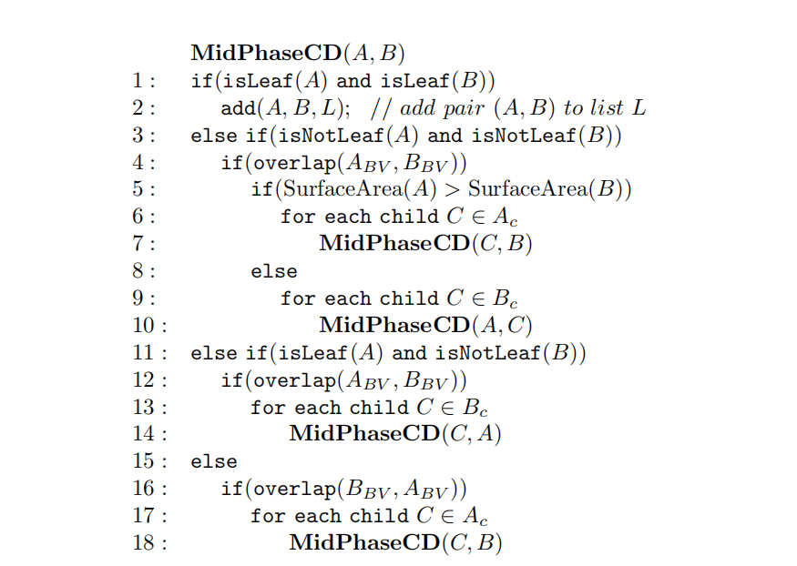

从这段伪代码中我们可以看出，有些代码是可以共享的，这里将其展开是为了展示算法是如何进行工作的。其中有几行值得注意，第$1-2$行将一对叶子节点$(A, B)$添加到列表$L$中，这个列表$L$存储了所有的重叠叶子节点对。第$3-10$行对两个节点都是内部节点的情况进行了处理。通过比较二者的表面积，即$\text{ SurfaceArea}(A)>\text{ SurfaceArea}(B)$，使得表面积最大的节点下降。这个测试表面积背后的思想是，使得调用$\mathbf{MidPhaseCD}(A, B)$和$\mathbf{MidPhaseCD}(B, A)$能够得到相同的树遍历，这样遍历过程就变得确定了。这个测试十分很重要，由于在每个步骤中，我们都会首先遍历最大的那个box，因此它往往可以提供更好的性能表现。

另一个想法是交替下降$A$和$B$，这样可以避免计算表面积，因此执行速度也会更快。或者，可以预先计算刚体的表面积并存储在节点中，但是这种计算需要在每个节点上存储额外的信息。此外，对于许多BV而言，我们并不需要计算实际的表面积，只需要一个保持“表面积顺序”的计算即可，举个例子：只需要比较球体的半径就够了。请注意，最终的列表$L$通常会被发送到窄阶段CD中。

### 25.2.3 BVH成本函数

方程25.3中的函数$t$首先被光线追踪所引入（以一种稍微不同的形式，没有其中的最后一项），并将其作为在光线追踪加速算法中，对分层BV结构性能的评估准则\[92]。自那以后，它也一直被用于评估CD算法的性能\[33]，并对其中的最后一项进行了扩展，使其包含一些碰撞系统特有的新成本\[47, 50]，这些新成本可能会对性能产生重大影响。这个成本来自于这样的一个事实，即如果一个模型正在进行刚体运动，那么它的BV和层次结构（部分或者所有）可能必须要进行重新计算，这取决于具体的运动情况和BV的选择：

$$
t=n_{v} c_{v}+n_{p} c_{p}+n_{u} c_{u}
\tag{25.3} 
$$

其中：$n_v$是BV-BV重叠测试的数量，$c_v$是一个BV-BV重叠测试的成本，$n_p$是测试重叠的图元对的数量，$c_p$是测试两个图元是否重叠的成本，$n_u$是由于模型运动而需要进行更新的BV数量，$c_u$是一个BV的更新成本。

创建一个更好的模型层次分解方式，将会导致$n_v$、$n_p$和$n_u$的值更低。创建一些更好的方法来确定两个BV或者两个三角形之间是否重叠，将会降低$c_v$和$c_p$。然而，这些目标通常是相互冲突的，这是因为，为了使用更快的重叠测试而去改变BV的类型，通常意味着我们会获得更加宽松的拟合体积，使得BV紧密贴合的程度降低。

在过去，使用不同BV的例子有球体\[42]、轴对齐包围盒（AABB）\[5, 40]、定向包围盒（OBB）\[33]、k-DOP（离散有向多面体）\[47,  49,  96]和胶囊体\[55]。其中球体的变换速度是最快的，重叠测试也很快，但是它们的拟合效果非常差。AABB通常可以提供更好的拟合效果以及相对快速的重叠测试，如果模型中包含大量轴对齐的几何形状（例如大多数的建筑模型），那么它们是一个很好的选择。OBB的拟合效果更好，但是重叠测试要更慢。k-DOP的拟合效果取决于参数$k$，$k$值越大，拟合越好，但是相对应的重叠测试也就越慢，变换速度也越慢。

### 25.2.4 OBB树

OBB树\[33]是一种特殊的BVH结构，它也可以用于中阶段碰撞检测，我们将在这里对其进行详细介绍，因为它是典型碰撞检测系统的代表。在碰撞检测的过程中，如果发现两个表面非常接近并且几乎平行的时候（parallel close proximity），那么这个方案的性能会特别好。这种情况经常发生在公差分析（tolerance  analysis）和虚拟样机（virtual prototyping）中。其中一个例子是安装发动机的机器部件，人们希望能够在不需要制造零件的前提下，确保这些零件可以很容易地组装起来。

#### 选择包围体

该方法使用定向包围盒（oriented bounding box，OBB）来作为包围体。然而，本小节中的许多概念也同样适用于其他BV，例如AABB。使用OBB的一个原因是，相比于使用AABB和球体，这样的树能够更好地聚集底层几何物体。然而，使用AABB来构建树结构，要比使用OBB更快，因此真正的性能表现还取决于实际情况。章节22.13.5中讨论了OBB与OBB之间的重叠测试。使用章节25.2.3中的性能评估框架和之前的推理方式，意味着OBB的$n_v$和$n_p$要低于AABB和球体。

Van den Bergen提出了一种简单的技术，用来加速两个OBB之间的重叠测试\[5, 7]，该方法跳过了最后9个轴的测试，这些测试对应于垂直于第一个OBB边缘和第二个OBB边缘的方向。这种测试通常被称为简化SAT（SAT lite）。从几何上来说，这可以被认为是进行两个AABB与AABB的相交测试，其中第一个测试会在第一个OBB的坐标系中进行，第二个测试会在第二个OBB的坐标系中进行，如图25.8所示。这种简化的OBB与OBB测试（省略了最后9个轴的测试），有时会将两个不相交的OBB报告为重叠。在这种情况下，OBB树中的递归将会超出必要的深度。在实际测试中，跳过这些测试（最后9个轴的测试）的最终结果是，算法的平均性能得到了提高。Van den Bergen的技术已经在名为SOLID的碰撞检测包\[5, 6, 7, 9]中进行了实现，它还可以处理变形物体。

#### 建立层次结构

OBB树的基本数据结构是一棵$k$叉树，也就是说，一个内部节点可以有多达$k$个子节点；其中每个内部节点都会保存一个OBB（章节22.2），每个外部节点（叶子节点）会保存一个或者多个三角形。通常会根据目标架构来选择合适的$k$值，例如：如果使用AVX实现，则可以选择$k = 8$，AVX对于32位浮点数的SIMD宽度为8。Gottschalk等人开发了一种自上而下创建层次结构的方法，该方法可以分为以下步骤：首先为一个三角形soup（triangle soup，及乱序集合）找到一个紧密贴合的OBB，然后会沿着OBB的一个轴对其进行分割，这可以将三角形划分为两组。对于每一个组三角形，都会计算一个新的OBB。章节22.3中讨论了OBB的创建。

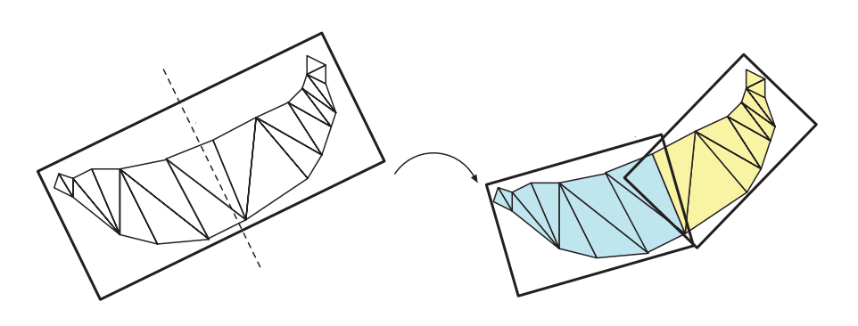

在我们计算了一组三角形的OBB之后，应当将体积和三角形进行分割，并形成两个新的OBB。Gottschalk等人使用了这样一种策略，他们将box的最长轴划分成两个长度相同的部分，图25.9给出了这个过程的示意图。一个能够将box等分成两个部分的平面，会被用来将三角形分割成两个子集合，而对于那些穿过该平面的三角形，将会根据质心所在的位置，被分配到对应的一侧中。在极少数情况下，可能所有三角形的质心都位于这个分割平面上，或者所有三角形的质心都位于分割平面的同一侧，对于这种情况，我们可以按照递减顺序，尝试对其他坐标轴进行分割。请注意，使用表面积启发式（方程25.2）可能产生更好的BVH \[95]。

对于每个子集合，可以使用章节22.3中简要介绍的矩阵方法，来计算其对应的OBB。如果父OBB在中位中心点（median center）进行分割，那么每个子节点将会具有相同数量的三角形，这样可以得到一棵平衡树。在光线追踪的相关领域中，对其他的分割策略进行了广泛的研究\[89]。

#### 处理刚体运动

在OBB树层次结构中，每个OBB $A$会与刚体变换矩阵$\mathbf{M}_A$一起存储（包含一个旋转矩阵$\mathbf{R}$和一个平移向量$\mathbf{t}$）。这个矩阵保存了该OBB相对于其父物体的相对方向和相对位置。

现在，假设我们开始对两个OBB（$A$和$B$）进行重叠测试。我们会在其中一个OBB的坐标系中，来进行$A$和$B$之间的重叠测试，假设我们决定在$A$的坐标系中来执行这个测试。这样一来，OBB$A$就是一个以原点为中心的AABB（在它自己的坐标系中）。接下来的思路是将$B$转换到$A$的坐标系中，这是通过一个矩阵变换（方程25.4）来完成的，它首先将$B$变换到其自身的位置和方向上（使用矩阵$\mathbf{M}_B$），然后再将其转换到$A$的坐标系中（使用$A$变换的逆矩阵$\mathbf{M}^{-1}_A$）。让我们回顾一下，对于刚体变换而言，其转置矩阵就是逆矩阵，因此只需要很少的额外计算：

$$
\mathbf{T}_{A B}=\mathbf{M}_{A}^{-1} \mathbf{M}_{B}
\tag{25.4} 
$$

OBB与OBB之间的重叠测试，以一个$3 × 3$旋转矩阵$\mathbf{R}$和一个平移向量$\mathbf{t}$所组成的矩阵作为输入，其中平移向量$\mathbf{t}$保存了$B$相对于$A$的方向和位置（章节22.13.5），因此这个$\mathbf{T}_{A B}$可以进行如下分解：

$$
\mathbf{T}_{A B}=\left(\begin{array}{cc}\mathbf{R} & \mathbf{t} \\ \mathbf{0}^{T} & 0\end{array}\right)
\tag{25.5} 
$$

现在我们假设$A$和$B$发生了重叠，此时我们想要深入到$A$的子节点$C$中。我们可以这样做：我们选择在$C$的坐标系中进行测试。然后，这里的想法是将$B$转换为$A$的坐标系中（使用$\mathbf{T}_{A B}$），然后再将其转换到$C$的坐标系中（使用$\mathbf{M}^{-1}_C$）。这是通过下面的矩阵来完成的，然后再次将其作为OBB与OBB重叠测试的输入：

$$
\mathbf{T}_{C B}=\mathbf{M}_{C}^{-1} \mathbf{T}_{A B}
\tag{25.6} 
$$

然后使用这个过程，对所有OBB进行递归测试。

#### 其他

在章节25.2.2中，我们介绍了用于两棵层次树之间碰撞检测的$\mathbf{MidPhaseCD}$伪代码，它同样也可以用于本小节所创建的两棵树。需要进行修改的是$\text{overlap}()$函数，它应当指向一个测试两个OBB是否发生重叠的函数。

OBB树中涉及的所有算法，都已经在一个名为RAPID （健壮和精确的多边形干扰检测，Robust and Accurate Polygon Interference Detection）的免费软件包\[33]中进行了实现。

## 25.3 窄阶段碰撞检测

此时，宽阶段CD和中阶段CD已经将数据缩小到了一个列表$L$，其中包含了BV相互重叠的成对叶子节点。这里的目标是对所有相交的图元对进行计算，从而避免物体发生相互穿透，或者使用距离查询来确定物体之间的距离是否足够远。下面我们将介绍这两个主题。

### 25.3.1 图元vs图元

一般来说，此时我们有了一个列表$L$，其中包含了在进入这个阶段时，相互重叠的成对叶子节点。在最简单的实现中，可以对第一个叶子节点中的每个图元都执行一个循环，并与另一个分支中的所有图元进行测试。我们在第22章中介绍了图元与图元之间的相交测试。

应当注意的是，从代码的角度来看，可以将中阶段和窄阶段合并为一个阶段，这样做可能是有利的，也可能是不利的。将这两个阶段合并起来，可能会简化代码实现；但是对于一个包含所有图元对的列表，我们可以对其进行排序，从而使得所有相同类型的图元对位置相近。这种排序可以实现更快的并行SIMD实现。

当列表$L$中包含凸多面体的时候，可以使用距离查询来确定两个物体之间是否会发生相互穿透；如果发生了穿透，则需要将它们分开，直到它们不会发生穿透为止。这是下一小节中的主题。

### 25.3.2 距离查询

在某些应用程序中，我们可能会想要测试某个物体与环境之间是否至少有一定的距离，例如：在设计一辆新车的时候，必须为不同体型的乘客都提供足够的空间，使得他们能够舒适地坐下。因此，可以在汽车座椅上尝试放置不同尺寸的虚拟人，来看看他们是否能够在不碰到到汽车其他部分的情况下就座。最好的情况是，乘客自己能够坐下，并且与汽车内部的一些部件保持至少10厘米的距离，这种测试被称为公差验证（tolerance verification）。它也可以用于路径规划，即如何通过算法，来确定某个物体从一点到另一点的无碰撞路径。给定一个物体的加速度和速度，这个最小距离可以用来估计撞击时间的下限，通过这种方式，在这个下限时间之前就可以避免碰撞检测\[62]。另一个相关的查询是穿透深度（penetration depth），即找出两个物体相互移动了多远。这个距离可以用来将物体向后移动，使得它们不再穿透，并且可以在那个点上计算出一个适当的碰撞响应。

最早计算凸多面体之间最小距离的实用方法之一被称为GJK，该方法以其发明者Gilbert、Johnson和Keerthi \[30]的名字进行命名。本小节将对这个算法进行概述。GJK会计算两个凸物体$A$和$B$之间的最小距离。为此，会使用$A$和$B$之间的差物体（difference object，有时被称为和物体sum object）\[6]：

$$
A-B=\{\mathbf{x}-\mathbf{y}: \mathbf{x} \in A, \mathbf{y} \in B\}
\tag{25.7} 
$$

这也被称为物体$A$和（反射的）物体$B$的Minkowski和（章节25.11.3）。所有的差值$\mathbf{x}-\mathbf{y}$可以被视为一个点集，它构成了一个凸物体，图25.10展示了这种差值的一个例子。

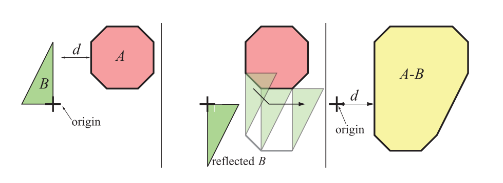

GJK的思想是，我们会去计算$A - B$与原点之间的最小距离，而不是计算物体$A$和物体$B$之间的最小距离，这两个距离可以证明是等价的。该算法的可视化结果如图25.11所示。请注意，如果原点位于$A - B$内部，则说明$A$和$B$重叠。

![图25.11：GJK算法示意图。左上角：计算原点到多边形的最小距离。右上角：GJK算法会选择一个任意的三角形作为起点，然后计算原点到该三角形的最小距离，其中顶点7是最近的。左下角：在下一步中（未显示），会将所有顶点都投影到从原点到顶点7的直线上，投影之后最近的顶点会取代投影中距离三角形最远的顶点。因此顶点4取代了顶点8。然后找到这个新三角形上距离原点最近的点，它位于顶点4到顶点7的边上。右下角：顶点会继续被投影到从原点到上一步中最近点的直线上，因此顶点5取代了投影上最远的顶点1。顶点5是这个三角形上距离原点最近的点，当顶点5投影到原点与顶点5之间的直线上时，我们发现顶点5是整体上最近的点，这样迭代过程就完成了。此时我们找到三角形上距离原点最近的点，正好也是顶点5，最后返回这个点即可。 \[44\]](images/Chapter-25/202310192013949.png "图25.11：GJK算法示意图。左上角：计算原点到多边形的最小距离。右上角：GJK算法会选择一个任意的三角形作为起点，然后计算原点到该三角形的最小距离，其中顶点7是最近的。左下角：在下一步中（未显示），会将所有顶点都投影到从原点到顶点7的直线上，投影之后最近的顶点会取代投影中距离三角形最远的顶点。因此顶点4取代了顶点8。然后找到这个新三角形上距离原点最近的点，它位于顶点4到顶点7的边上。右下角：顶点会继续被投影到从原点到上一步中最近点的直线上，因此顶点5取代了投影上最远的顶点1。顶点5是这个三角形上距离原点最近的点，当顶点5投影到原点与顶点5之间的直线上时，我们发现顶点5是整体上最近的点，这样迭代过程就完成了。此时我们找到三角形上距离原点最近的点，正好也是顶点5，最后返回这个点即可。 \[44]")

这个算法会从多面体中的任意一个单纯形（simplex）开始。单纯形是指各个维度中最简单的图元，因此在二维中它是三角形，在三维中它是四面体（tetrahedron）。这个起始元素可以是任何有效的单纯形，例如：完全位于多面体内部的任意四面体。然后计算这个单纯形上距离原点最近的点。Van den Bergen展示了如何通过求解一组线性方程来实现这一点\[6, 7]。有了这个最近点之后，就可以形成一个向量，即从原点指向最近点。将多面体上的所有顶点都投影到这个向量上，并在这些投影顶点中选择距离原点最近的顶点，将其来作为单纯形更新后的一个新顶点。由于单纯形中添加了一个新顶点，因此我们还必须删除一个单纯形中的现有顶点（否则它将不再是单纯形了），这里我们会删除距离原点最远的那个投影点。一旦完成了这个过程，我们就会计算到这个新单纯形的最小距离，然后使用同样的算法对所有顶点进行再次迭代，直到不再更新单纯形为止。对于两个多面体而言，算法会在有限步骤内结束\[30]。通过使用增量计算（incremental computation）和缓存等技术，可以提高算法的性能表现\[6]。

Van den Bergen描述了一个快速且健壮的GJK实现\[6, 7]。GJK还可以扩展到计算穿透深度\[8, 12, 37]。特别地，van den Bergen \[8, 9]还描述了一种基于GJK的扩展多边形算法（expanding polytope algorithm，EPA）。当发生穿透的时候，如图25.11所示的原点（使用加号进行表示）会位于多边形内部。然后，EPA会执行与GJK类似的步骤，从而找到多边形上最接近原点的顶点。还有一些其他计算最小距离的算法，例如Lin-Canny算法\[61]、V-Clip \[70]、PQP \[55]、SWIFT \[23]、SWIFT++ \[24]等，它们还可以计算出凹刚体之间的距离。

在为当前帧计算GJK时，使用前一帧中的分离轴来作为起始向量，通常是很有益的\[8]。当时间一致性较高时（画面变化较少），算法往往会在第一步就终止了，Gregorius \[37]指出这样会有一个数量级的加速。请注意，还可以使用基于射线追踪的方法来计算穿透距离，参见下一小节的图25.13。

当在凸多面体上使用分离轴定理来寻找穿透深度的时候，另外一种优化方法是将一个更简单的物体（例如球体）完全存储在凸多面体内，并使用这个简单物体来进行剔除轴测试\[85]。两个球体在分离轴上的重叠量，总是会小于或者等于两个凸多面体之间的重叠量。我们的目标是找到最小的穿透深度，从而得知我们具体需要移动这两个物体多少距离，才能使得它们分离。假设在经过一些轴测试之后，当前的最小穿透深度为$d$，那么如果此时球体的重叠量大于$d$，那么我们就不需要进一步关心当前轴了，因为这样的凸多面体之后会有更大的重叠量。这样可以大大提高性能表现。

请注意，在使用距离查询的时候，我们不需要计算三角形与三角形之间的交点，因为我们不需要这个交点信息，就可以直接获得最小距离或者最小穿透深度。

## 25.4 射线碰撞检测

在本小节中，我们将会介绍一种在特定情况下运行良好的快速技术。想象现在有一辆汽车正在倾斜的道路上向上行驶，我们希望使用一些有关道路的信息（即构建道路的图元）来引导汽车向上行驶。当然，这个目的可以通过使用章节25.1到章节25.3中的技术来进行实现，即对汽车车轮的所有图元，与道路上的所有图元进行碰撞测试。然而，对于游戏或者其他的一些应用程序而言，这种详细的碰撞检测并不总是需要的。相反，我们可以使用一组射线来对正在移动的物体进行近似。以刚才的汽车为例，我们可以在汽车的四个轮子上各自放置一条射线（如图25.12所示）。只要我们能够假设这辆汽车只有四个轮子与环境（道路）相接触，那么这种近似在实践中就是有效的。假设一开始汽车位于一个平面上，我们将每条射线放置在一个车轮上，射线的每个原点都位于车轮与环境接触的位置处。然后，车轮上的射线会根据环境进行相交测试，如果射线原点到环境的距离为零，则代表这个轮子刚好在地面上；如果这个距离大于零，则代表这个车轮与环境没有任何接触；如果这个距离小于零，则代表车轮已经穿透到了环境中。应用程序可以使用这些距离信息来计算碰撞响应：负的距离应当使得汽车（在方向盘处）向上移动，而正的距离应当使得汽车向下移动（除非汽车在空中飞行了一段时间）。请注意，这种类型的技术可能很难适应非常复杂的场景。例如：如果汽车与环境发生了碰撞并处于旋转状态，那么则需要更多不同方向的射线来帮助判断汽车此时所处的状态。

为了加快相交测试的速度，我们还可以使用在计算机图形学中最为常用的效率提高技术——分层表示方法。环境可以使用一个轴对齐的BSP树（章节19.1.2）、BVH、网格、（松散）八叉树或者其他数据结构来进行表示。例如：对于动态几何物体，Frye \[28]使用一个松散八叉树（章节19.1.3）来进行表示；对于静态几何物体，则使用一个轴对齐的BSP树来进行表示。根据环境中所使用的图元，所需要的射线与物体相交测试的方法也有所不同，详见第22章。

与标准的光线追踪不同，标准的光线追踪所需要的是射线前方的最近物体；而在这里吗，我们实际上也需要射线最后面的交点，它可以有一个负的距离，即这个交点可以位于射线原点的后面。为了避免让射线在两个方向上（前方和后方）进行搜索，因此测试射线的原点会被向后移动，直到原点位置位于物体包围盒的外面，然后再针对环境进行相交测试。实际上这只是意味着，射线并不是从距离0开始的，而是从一个负距离开始的，这使得射线会从物体包围盒外面开始发射。为了处理更加一般的场景，例如驾驶汽车通过隧道并检测隧道与车顶的碰撞，我们就必须在两个方向上进行搜索。

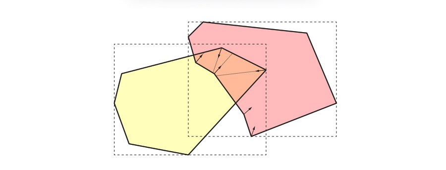

Hermann等人\[41]提出了一种在碰撞检测中使用射线的不同方法，如图25.13所示。当我们找到两个重叠区域的时候，只对重叠区域内的顶点进行处理。对于每个这样的顶点，我们会在顶点的负法线方向上发射一条射线，并且只针对另一个物体进行相交测试。如果与另一个物体存在正相交距离的交点，那么这个顶点会与交叉点维护为一个碰撞对。Hermann等人进一步描述了如何对其中的无效碰撞对进行过滤。然后会使用法线和碰撞对来计算碰撞响应。例如：可以在碰撞对中两个点之间的向量方向上，施加一个惩罚力（penalty force），这个惩罚力的大小与该向量的长度成比例。Lehericey等人\[60]利用时间一致性，提出了一种更快的变体方法。

## 25.5 使用BSP树的动态CD

本小节将会介绍Melax \[65, 66]的碰撞检测算法。该方法使用BSP树（章节19.1.2）来描述的场景中的几何物体，并检测几何物体之间的碰撞，所使用的碰撞器可以是球体、圆柱体或者物体的凸包。它还允许动态的碰撞检测，例如：假设一个球体从第$n$帧的$\mathbf{p}_0$位置，移动到了第$n + 1$帧的$\mathbf{p}_1$位置，该算法能够检测出从$\mathbf{p}_0$到$\mathbf{p}_1$的直线路径上是否发生了碰撞。该算法已经被用在了商业游戏中，它会将角色的几何形状近似为一个圆柱体。

标准的BSP树可以非常高效地对直线段进行测试。线段可以表示一个从$\mathbf{p}_0$移动到$\mathbf{p}_1$的点（粒子），它可能会有几个交点，但是其中的第一个（如果有的话）交点代表了该点和BSP树中所表示几何物体之间的碰撞。请注意，在这种情况下，BSP树是表面对齐（surface aligned）的，而不是轴对齐（axis-aligned）的。也就是说，BSP树中的每个平面，都与场景中的墙壁、地板或者天花板对齐。这种方法可以很容易扩展到半径为$r$的球体（而不是一个点），它从$\mathbf{p}_0$移动到$\mathbf{p}_1$。它并不是针对BSP树节点中的平面来对线段进行测试，而是会沿着平面的法线方向移动距离$r$。在章节25.11中，有一种与这种相交测试的相类似的方法。这种平面调整如图25.14所示。

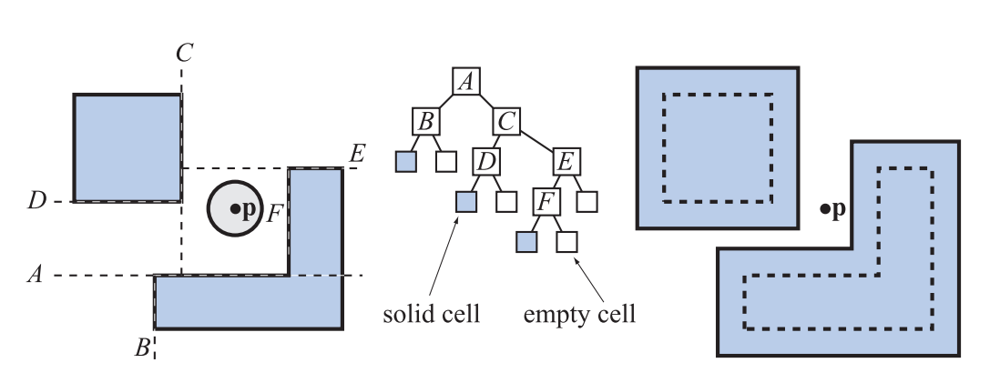

每个碰撞查询都是动态执行的，因此可以将一棵BSP树用于任意大小的球体。假设一个平面是$\pi: \mathbf{n} \cdot \mathbf{x}+d=0$，而调整后的平面是$\pi^{\prime}: \mathbf{n} \cdot \mathbf{x}+d \pm r=0$，其中$r$的符号取决于你将在继续平面的哪一侧来进行测试和遍历，从而寻找碰撞。假设此时角色应当位于平面的正半空间中，即$\mathbf{n} \cdot \mathbf{x}+d>0$，那么我们必须从$d$中减去半径$r$。请注意，这里的负半空间被认为是“固体”的内部，即角色无法穿过的地方。

使用一个球体并不能对游戏中的角色进行很好地近似，但是将几个球体组合起来，可能会表现得不错\[42]。使用角色顶点的凸包，或者是一个围绕角色的圆柱体效果会更好。为了能够使用这些的BV，平面方程中的$d$必须进行不同的调整。为了在BSP树上针对一组顶点的移动凸包$S$进行测试，需要将方程25.8中的标量值，添加到平面方程的$d$值中\[65]：

$$
-\max _{\mathbf{v}_{i} \in S}\left(\mathbf{n} \cdot\left(\mathbf{v}_{i}-\mathbf{p}_{0}\right)\right)
\tag{25.8} 
$$

同样，这里的负号代表了我们假设角色位于平面的正半空间中。其中点$\mathbf{p}_0$可以是任何适合作为参考点的顶点。对于球体而言，球体的中心的当然是不二选择；对于角色而言，可以选择一个靠近脚的点，或者位于肚脐的点。有时这种选择可以对方程进行简化（就像球心那样）。正是这个点$\mathbf{p}_0$针对调整后的BSP树进行了测试。对于动态查询而言，即在角色在一帧中，从一个点移动到了另一个点时，可以将这个点$\mathbf{p}_0$作为线段的起点。假设角色在一帧中的移动向量为$\mathbf{w}$，那么这条线段的端点是$\mathbf{p}_{1}=\mathbf{p}_{0}+\mathbf{w}$。

圆柱体可能是更加实用的，因为它在可以进行更快测试的同时，仍然能够对游戏中的角色进行良好近似。然而，对于圆柱体而言，推导调整平面方程的值较为复杂。对于这个算法，我们通常会将针对BSP树包围体（在本例中是球体、凸包和圆柱体）的测试，转换为使用调整后的BSP树，对点$\mathbf{p}_0$进行测试。这与Minkowski和（章节25.11.3和章节25.3.2）是一样的。然后，为了将其扩展到一个移动的物体，针对点$\mathbf{p}_0$的测试会被替换为从点$\mathbf{p}_0$到目的地点$\mathbf{p}_1$的线段测试.

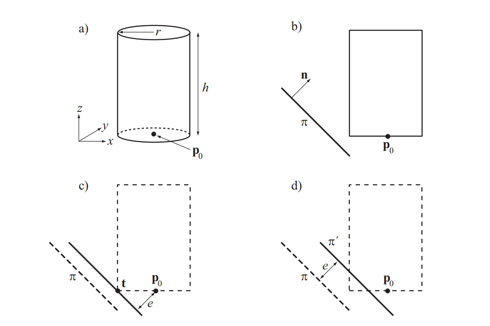

我们为一个圆柱体推导了这样的测试，其性质如图25.15左上角所示，其中参考点$\mathbf{p}_0$位于圆柱体的底部中心。图25.15（b）展示了我们需要解决的问题：在平面$\pi$上对圆柱体进行测试。在图25.15（c）中，我们对平面$\pi$进行移动，使其几乎不接触圆柱体，并计算此时点$\mathbf{p}_0$到移动后平面的距离$e$。图25.15（d）使用这个距离$e$将平面$\pi$移动到新位置$\pi^{\prime}$。因此，这个测试被简化为平面$\pi^{\prime}$与点$\mathbf{p}_0$之间的测试。这个$e$值是每帧动态计算的，在实践中，我们首先计算一个从点$\mathbf{p}_0$到点$\mathbf{t}$（移动后平面与圆柱体相接触的位置）的向量。结果如图25.15（c）所示。接下来，实用下列方程来计算$e$：

$$
e=\left|\mathbf{n} \cdot\left(\mathbf{t}-\mathbf{p}_{0}\right)\right|
\tag{e} 
$$

现在剩下的任务就是计算这个点$\mathbf{t}$了。首先，$\mathbf{t}$的$z$分量（即圆柱体的轴向方向）很简单，如果若$n_z > 0$，则$t_z = p_{0z}$，即点$\mathbf{p}_0$的$z$分量；否则，$t_z = p_{0z} + h$。实际上这些$t_z$值对应了圆柱体的底部平面和顶部平面，如果$n_x$和$n_y$都为零（例如：地板或者天花板），那么我们可以使用圆柱体盖子上的任意点。一个自然的选择是$(t_x, t_y) = (p_x, p_y)$，即圆柱体盖子的中心点。否则，对于非垂直的$\mathbf{n}$而言，下面的方程给出了圆柱体边缘上的一个点：

$$
t_{x}=\frac{-r n_{x}}{\sqrt{n_{x}^{2}+n_{y}^{2}}}+p_{x}, \quad t_{y}=\frac{-r n_{y}}{\sqrt{n_{x}^{2}+n_{y}^{2}}}+p_{y}
\tag{25.10} 
$$

也就是说，我们将平面法线$\mathbf{n}$投影到$xy$平面上，并对其进行归一化，然后对$r$进行缩放，使其落在圆柱体的边缘上。

![图25.16：左侧：右边的球体进行了正确的碰撞，而左边的球体则过早地检测到了碰撞。右 侧 ：这个问题可以通过引入一个额外的斜面来进行解决，而这个斜面实际上并不对应任何实际的几何图形。使用一个这样的平面，可以使得碰撞变得更加准确。 \[65\]](images/Chapter-25/20231020101104.png "图25.16：左侧：右边的球体进行了正确的碰撞，而左边的球体则过早地检测到了碰撞。右 侧 ：这个问题可以通过引入一个额外的斜面来进行解决，而这个斜面实际上并不对应任何实际的几何图形。使用一个这样的平面，可以使得碰撞变得更加准确。 \[65]")

使用这种方法可能会出现不准确的情况，图25.16展示了其中一个例子。可以看出，这个问题可以通过引入额外的斜面（bevel plane）来进行解决。在实践中，我们会计算两个相邻平面之间的“外”角，如果这个角度大于$90^{\circ}$，则插入一个额外的平面。这样做的目的是为了改进圆角的近似值。在图25.17中，我们可以看到普通的BSP树与添加了斜面的BSP树之间的区别。这些斜面当然可以提高精度，但是并不能消除所有的误差。

![图25.17：左侧是一个正常的单元格和它的BSP树。右侧在单元格中添加了一个斜面，并展示了BSP树中的相应更改。 \[65\]](images/Chapter-25/20231020101300.png "图25.17：左侧是一个正常的单元格和它的BSP树。右侧在单元格中添加了一个斜面，并展示了BSP树中的相应更改。 \[65]")

下面是这个碰撞检测算法的伪代码。它是在BSP树的根节点$N$上进行调用的，BSP树的子节点分别是N.negativechild和N.positiveechild，以及由点$\mathbf{p}_0$和点$\mathbf{p}_1$所定义的线段。请注意，最终的碰撞点（如果有的话）是在一个名为$\mathbf{p}_{\text{impact}}$的全局变量中返回的：

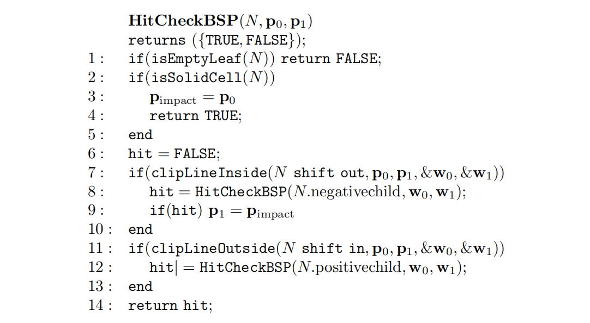

如果我们到达了一个叶子节点，并且该节点位于实体一侧的话（而不是空的一侧），函数$\mathrm{isSolidCell}$会返回$\mathrm{TRUE}$，图25.14中展示了空单元格和实单元格。如果线段的一部分（由移动路径$\mathbf{v}_0$和$\mathbf{v}_1$进行定义）位于节点的移动平面中（即位于移动平面的负半空间中），那么函数$\mathrm{clipLineInside}$返回$\mathrm{TRUE}$。它还会将直线裁剪到节点的移动平面上，并返回结果线段$\mathbf{w}_0$和$\mathbf{w}_1$。$\mathrm{clipLineOutside}$函数与此类似。还要注意的是，函数$\mathrm{clipLineInside}$与函数$\mathrm{clipLineOutside}$所返回的线段会相互重叠，这样做的原因如图25.18所示，图25.18还展示了这条线段是如何被裁剪的。第9行中我们设置$\mathbf{v}_1=\mathbf{p}_{\text{impact}}$，这只是一个优化。如果我们找到了一个碰撞点（即一个潜在的撞击点$\mathbf{p}_{\text{impact}}$），那么超过这个点之外的任何东西我们都不需要进行测试了，因为我们想要的是第一个碰撞点。在第7行和第11行中，节点$N$被“移出（shift out）”而不是“移入（shift in）”。这里的移位指的是先前为球体、凸壳和圆柱体所推导的、调整后的平面方程。

该方案的优点在于，只需要使用一棵BSP树即可完成对所有角色和物体的碰撞测试。另一种方法是为每个不同的半径和不同物体类型，存储不同的BSP树。章节25.11中介绍了其他的动态相交测试方法。

## 25.6 限时碰撞检测

假设当观众抬头看向天空，此时由于渲染压力较小，某个游戏引擎会在14毫秒内渲染整个场景；但是当观众看向地平线的时候，由于渲染压力较大，此时的渲染需要30毫秒来完成。显然，不同的帧渲染时间将会得到相当不同的帧率，波动的帧率通常会对用户产生干扰。章节19.9.3中介绍了一种试图实现恒定帧率的渲染算法。这里我们将使用另外一种方法，被称为限时碰撞检测（time-critical collision detection），如果某些应用程序中也使用了CD，那么它们也可以使用这种方法。之所以称其为“限时（time-critical）”，是因为CD算法需要在一个特定的时间范围内（例如9毫秒）完成任务，并且它必须要在这个时间内完成。在CD中使用这种算法的另一个原因是，它对因果关系的感知至关重要\[74, 75]，例如：快速检测一个物体是否会导致另一个物体发生移动。

以下算法由Hubbard \[42]所提出，其思想是按照广度优先（breadth-first）的顺序，对BVH进行遍历。广度优先意味着，在下降到BVH的下一层之前，我们需要访问树中某一层的所有节点。这与深度优先（depth-first）的遍历方式有所不同，深度优先遍历会以最短的方式到达叶子结点（如章节25.2.2中的伪代码所示）。图25.19展示了这两种遍历方式的区别。使用广度优先遍历的原因在于，我们可以同时访问节点的左子树和右子树，也就是说先去访问包含整个物体的大型BV。而在使用深度优先遍历时，我们可能只能够访问左子树，因为算法可能已经耗尽时间了。当我们无法得知是否有足够的时间来遍历整棵树的时候，那么至少对两棵子树都进行一些遍历会更好一些。

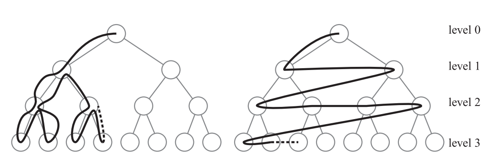

该算法首先会找到所有BV相互重叠的物体对，例如使用章节25.1中的算法。这些BV对被放入一个叫做$Q$的队列中。在下一阶段中，我们会从队列中取出第一个BV对，并对它们的子BV进行测试，如果它们发生重叠，则将子BV对放在队列的末尾。然后继续对队列中的下一个BV对进行测试，直到整个队列为空（在这种情况下我们就完成了整个树结构的遍历）或者时间耗尽\[42]。

另一种相关的方法是给每个BV对都指定一个优先级，并根据这个优先级来对队列进行排序。这种优先级可以基于可见性、偏心率、距离等因素。Dingliana和Osullivan描述了计算近似碰撞响应和近似碰撞接触判定的算法\[19]，对于限时CD而言，这是非常需要的，因为时间可能会在树结构遍历结束之前就耗尽了。Mendoza和Osullivan还提出了一种针对变形物体的限时CD算法\[67]。Kulpa等人\[51]对LOD技术的使用进行了用户研究，并提供一种可以以最不易察觉的方式来避免碰撞的系统。

## 25.7 可变形模型

到目前为止，本文的主要重点都是静态模型或者刚体动画模型。但是实际上还有其他类型的运动，例如水面上的波浪或者一块在风中摇曳的布，这种类型的运动通常无法使用刚体运动来进行描述；相反，我们可以将每个顶点都视为一个随着时间变化的独立向量函数。这种模型的碰撞检测的成本通常要更高。

假设在变形过程中，物体的网格连通性保持不变，那么就有可能利用这一特性来设计出一种巧妙的算法，实际上一块布在风中摇曳时所发生的就是这种类型的变形（除非这块布会以某种方式被撕裂）。作为一个预处理阶段，首先需要建立一个初始的BV树，当物体发生变形的时候，我们并不会对这棵树进行重建，而是直接对该物体的包围体进行重新调整，使其能够与变形后的几何形状相适应\[5, 56]。通过使用AABB，物体的BV可以进行快速重新计算，这个操作十分高效（与OBB相比）。此外，将$k$个子AABB合并到父AABB的速度也很快，并且能够得到一个最优的父级AABB。但是一般来说，任何类型的BV其实都是可以使用的。Van den Bergen对他的树进行了一定的组织，这样所有的BV都会被分配并放置在一个数组中，其中一个节点的索引总是会低于其子节点的索引\[5, 7]。通过这种方式，可以通过从数组的末尾向前进行遍历，并在每个节点上重新计算各自的BV，来完成一个自下而上的更新。这意味着，叶子结点的BV首先会被重新计算，然后利用这些新计算的BV，对其父节点的BV进行重新计算，并以此类推，直到树的根结点被更新完成。根据相关论文的报告，这种重整（refit）操作的速度大约是从零开始构建树的10倍\[5]。

然而，需要注意的是，在通常情况下，树中只有很少的BV需要进行更新。因为它们中的大多数都不会在碰撞查询期间进行使用。因此，提出了一种自下而上（bottom up）和自上而下（top-down）混合式的树结构更新算法\[56]。其核心思想是对较高层次的节点（包括根节点）使用自下而上的更新，这意味着在每一帧中，只有较高层次的BV会被更新。这样做的理由在于，上层节点通常会修剪掉大部分的几何形状。对于这些更新后的上层节点，将会与其他树结构（也可能变形和更新）来进行重叠测试。对于没有发生重叠的节点而言，我们可以跳过对其子树的更新，从而节省大量工作。另一方面，对于发生重叠的节点，我们会使用一个自上而下的更新策略，在对树进行遍历的时候，来对其子树中的节点进行更新。这里当然也可以使用自下而上的方法，但是自上而下方法被发现是更加高效的\[56]。使用自下而上的方法对前$n/2$个上层节点进行更新，使用自上而下的方法对后$n/2$个下层节点进行更新，我们可以获得较为良好的结果，最终结果如图25.20所示。为了对一个节点进行自下而上的更新，每个节点都会记录各自完整子树中的顶点信息，我们对这个列表进行遍历，从而计算其最小BV。当使用自上而下更新的时候，在BV更新之后，会立即进行重叠测试，这样如果没有发现重叠，那么就可以结束遍历，这进一步提高了效率。初步测试表明，这种方法要比van den Bergen的方法快4到5倍\[56]。

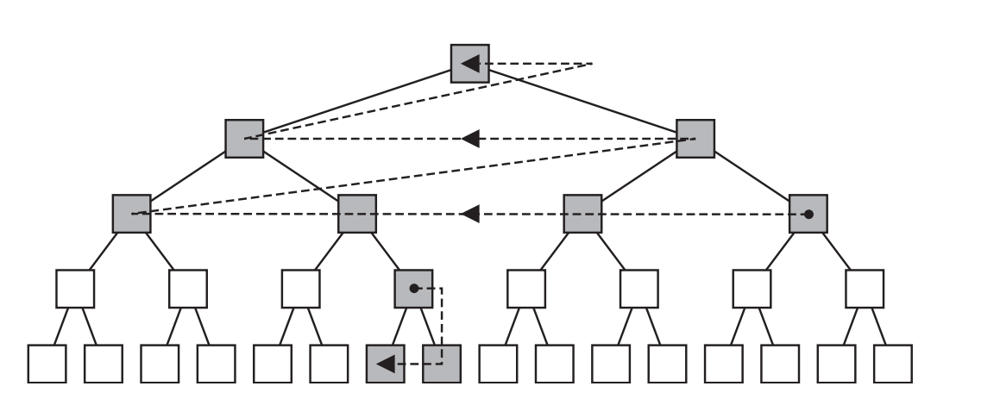

有些时候，我们可能已经拥有一些关于变形类型的已知信息，根据这些信息，我们可以设计出更加高效的算法。例如：如果一个模型使用变形（morphing）技术（章节4.5）来进行变形，那么我们可以在BVH中对BV进行变形（即混合），就像是对实际几何物体进行变形一样\[57]。这样做并不能在变形过程中创建最佳的BV，但是可以保证这些BV始终包含变形后的几何图形。这种更新也可以自上而下地进行，即只在需要进行更新的地方进行更新即可。这种技术可以用于AABB、k-DOP、球体。根据$k$个不同的BV计算一个变形后的BV，其开销为$O(k)$，但是这里的$k$通常会很小，可以看作是一个常数。James和Pai \[43]提出了一种简化变形模型的框架，这个模型由位移场（displacement field）的组合进行描述，这可以大大提高性能表现。Ladislav和Zara为蒙皮模型也提供了类似的CD技术\[52]。

然而，如果物体的运动是完全非结构化的，并且包含破碎物体的时候，这些方法就不起作用了。最近的一些技术试图对BVH中的子树与底层几何物体的匹配程度进行追踪，并且仅在需要的时候，使用一些启发式的方法来对它们进行重建\[58, 94]。

另一种用于可变形物体的通用方法是，首先为两个需要测试碰撞的物体，各自计算一个周围的最小AABB \[83]。如果它们发生了重叠，那么此时再去计算重叠的AABB区域，即AABB的相交体积。只有在重叠区域内才会发生碰撞，并为该区域内的所有三角形都创建一个列表。然后使用一个包围整个场景的八叉树（章节19.1.3）。接下来的想法是在八叉树的节点中插入这些三角形，如果某个叶子节点中同时包含了来自两个物体的三角形，则对这些三角形进行相交测试。在这个过程中可以应用一些优化方法。首先，这棵八叉树并不需要进行显式构建。当某个节点获得一个三角形列表的时候，会根据其8个子节点来对这些三角形进行测试，并创建8个新的三角形列表。这个递归会在叶子节点处结束，在叶子节点中可以进行三角形与三角形之间的相交测试。其次，如果这个三角形列表中的三角形都来自同一个物体时，这个递归就可以直接结束。为了避免对一对三角形进行多次测试，我们需要一个检查表，来对测试过的三角形对进行追踪。当重叠区域较大、或者重叠区域内存在较多数量的三角形时，这个方法的效率可能会受到一定影响。

另一种方法是使用GPU的曲面细分功能来检测碰撞\[72]。首先找到两个物体之间的重叠区域，然后对该区域内的所有面片，都采用每个体素1 bit的细分法进行体素化，然后使用这个体素网格来检测碰撞。这个方法还可以被扩展到处理位移映射，例如：由于汽车在沙地中行驶所留下的痕迹\[79]。

## 25.8 连续碰撞检测

通常，碰撞检测只会在每帧中进行一次，并且都是在离散的时间内进行的。章节25.11中介绍了动态的相交测试，它会对简单物体之间的碰撞时间进行计算，进行此类测试的原因是为了避免奇怪的瑕疵，例如：如果有一个球被高速地扔向一堵墙壁，在某一个时刻，球可能会出现在墙壁的前面，而在下一帧中，由于球的速度过快，它会直接移动到墙壁的后面，并躲过了与墙壁的碰撞检测。连续碰撞检测（continuous collision detection，CCD），与动态相交测试类似，旨在消除这类瑕疵。

![图25.21： 方程25.11 中所使用的连续碰撞检测的符号表示。 \[14\]](images/Chapter-25/20231020133721.png "图25.21： 方程25.11 中所使用的连续碰撞检测的符号表示。 \[14]")

在这里，我们将介绍一种在游戏行业中所使用的方法。我们希望确定两个凸物体$A$和$B$何时发生碰撞，每个物体都有一个线性速度$\mathbf{v}$和角速度$\omega$，半径$r$是物体质心到最远顶点的距离，图25.21中展示了这种符号表示方法。首先，使用GJK算法（章节25.3.2）来计算$A$和$B$之间的最短距离向量$\mathbf{d}$。然后，我们的想法是计算一个时间$\Delta t$，可以保证两个物体在这个时间间隔内不会发生碰撞。这是可以证明的\[14, 97]：

$$
\underbrace{\left(\left(\mathbf{v}_{B}-\mathbf{v}_{A}\right) \cdot \frac{\mathbf{d}}{\|\mathbf{d}\|}+\left\|\omega_{A}\right\| r_{A}+\left\|\omega_{B}\right\| r_{b}\right)}_{c} \Delta t \leq\|\mathbf{d}\|
\tag{25.11} 
$$

其中$c$是沿方向$d$的速度边界。如果物体$A$和物体$B$都不发生旋转，那么$c=\left(\mathbf{v}_{B}-\mathbf{v}_{A}\right) \cdot \mathbf{d} /\|\mathbf{d}\|$，即投影在方向$d$上的相对速度，这意味着使用经典公式，即速度乘以时间就可以获得这个距离。其中的旋转项（使用$\omega$）对由于旋转所引起的最大变化进行了保守估计。因此，不会发生碰撞的最大时间量为$\Delta t=\|\mathbf{d}\| / c$。如果这个时间$\Delta t$大于两帧之间的时间，那么$A$和$B$就不会发生碰撞。如果这个时间$\Delta t$小于等于两帧之间的时间，那么则可以在这个$\Delta t$期间将两个物体移动到它们所能到达的、尽可能远的地方，然后再次使用算法，直到收敛到某个容忍范围。由于这个时间估计$\Delta t$是保守的，因此该算法也被称为保守推进（conservative advancement）。Catto使用一些寻根技术来提高性能表现，并在《暗黑破坏神3（Diablo 3）》\[14]中使用了这种技术。Zhang等人\[97]描述了一种处理非凸多面体的方法。

## 25.9 碰撞响应

碰撞响应（collision response）是为了避免物体（异常） 相互穿透而应当采取的行动，例如：假设一个球体正在向着一个立方体移动，当这个球体第一次碰到立方体的时候（这是由碰撞检测算法进行确定的），我们希望球体的运动轨迹（例如：速度方向）能够发生相应的改变，这样它们看起来就像是发生了碰撞一样。这是碰撞响应技术所负责实现的任务，它已经是并且仍然是一个需要深入研究的主题\[2, 18, 38, 69, 71, 93]。碰撞响应是一个复杂的话题，本小节中只会介绍一些最简单的技术。

在章节25.11.1中，我们介绍了一种计算球体与平面碰撞时间的精确方法。在这里，我们将会解释在发生碰撞的时候，球体的运动发生了什么样的变化。

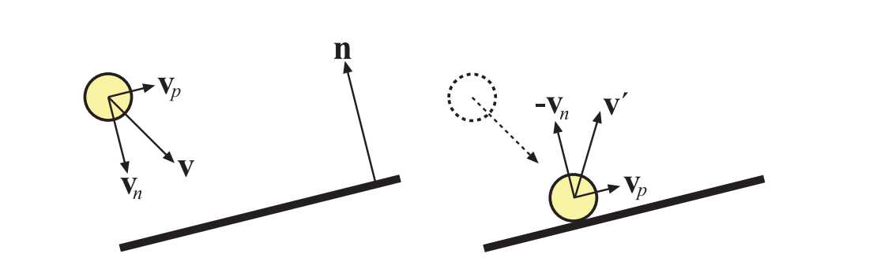

假设一个球体正朝着一个平面进行移动，球体的速度向量是$\mathbf{v}$，平面是$\pi: \mathbf{n} \cdot \mathbf{x}+d=0$，其中平面法线$\mathbf{n}$是归一化的，如图25.22所示。为了能够计算出这个最简单的响应，我们将速度向量表示为：

$$
\mathbf{v}=\mathbf{v}_{n}+\mathbf{v}_{p},\enspace \text{where} \enspace \mathbf{v}_{n}=(\mathbf{v} \cdot \mathbf{n}) \mathbf{n}, \enspace \text{and} \enspace \mathbf{v}_{p}=\mathbf{v}-\mathbf{v}_{n}
\tag{25.12} 
$$

根据这个表示，那么碰撞后的速度向量$\mathbf{v}^{\prime}$是\[54]：

$$
\mathbf{v}^{\prime}=\mathbf{v}_{p}-\mathbf{v}_{n}
\tag{25.13}  
$$

在这里，我们假设碰撞响应是完全弹性的。这意味着不会发生动能损失，即响应是“完美弹性的（perfectly bouncy）”。而在通常情况下，球体会在发生碰撞时轻微变形，使得一些能量转化为热量，因此会损失一些能量。这可以使用恢复（restitution）系数$k$（有时候也记作$\epsilon$）来进行描述。当$k\in[0,1]$时，平行于平面的速度$\mathbf{v}_{n}$保持不变，而$\mathbf{v}_{n}$则会受到抑制：

$$
\mathbf{v}^{\prime}=\mathbf{v}_{p}-k \mathbf{v}_{n}
\tag{25.14} 
$$

方程25.14就是碰撞的经验“定律”。随着$k$值的不断减小，能量的损失也就会越来越大，即碰撞的弹性越来越小。当$k = 0$时，碰撞后的运动会平行于平面，所以球看起来就是在平面上滚动。

更加复杂的碰撞响应是基于物理模拟的，这个过程涉及到创建一个方程组，并使用常微分方程（ordinary differential equation，ODE）求解器进行求解。在这种算法中，需要一个碰撞点坐标与该点的法线数据。有兴趣的读者可以参考Witkin等人\[93]的SIGGRAPH课程讲义，以及Dingliana等人\[18]的论文。Catto \[15]描述了如何将连续冲量（sequential impulses）应用于迭代求解器中。此外，Osullivan和Dingliana所提出的实验表明，人类是很难判断碰撞响应是否正确的\[74, 75]。当涉及更多维度的时候尤其如此（在一维上判断碰撞响应是否正确，要比在三维上更加容易）。为了构建一个实时算法，他们发现，当没有足够的时间来计算精确响应的时候，可以使用一个随机的碰撞响应。相关研究发现，这些随机响应和更加准确的响应一样可信。

## 25.10 粒子

在本小节中，我们将介绍两种用于粒子碰撞检测的方法。其中第一种方法用于粒子系统中（章节13.8），通常用作特殊效果；另一种方法则更多地用于物理模拟中，例如模拟流体和烟雾，在这种方法中，物质会使用大量的微小粒子进行近似。这两种方法密切相关，这些技术有时候可以同时用于两种类型。

### 25.10.1 粒子系统

我们首先会介绍一种基于深度缓冲的、廉价的、近似的粒子碰撞系统\[84]。它与屏幕空间环境光遮蔽方法（章节11.3）的思路相同。其基本思想是提供一种方法，能够在极短的时间内处理数万个粒子，这个系统可以用于雨滴、火花、岩屑和飞溅等效果。每个粒子都要与场景进行碰撞测试，这里所使用的近似值是从相机处渲染的深度缓冲。这意味着粒子只能与屏幕上的可见表面发生碰撞。为了避免粒子直接穿过一个可见表面，我们会在发生碰撞的时候，假设每个表面都具有一定的厚度。当碰撞发生时，我们会从法线缓冲中获取法线信息；对于到达表面上的入射粒子，首先会根据粒子的速度向量，将其在深度缓冲中进行反向移动。然后计算粒子的反射方向，并向该方向进行移动。从背后移动过来的粒子会被直接销毁，这样做可以避免它们“穿过”场景的可见表面。

使用深度缓冲当然存在一些缺点，例如：只能在肉眼可见的表面上发生碰撞，但是使用这种方法可以很好地实现近似效果。如果需要更高的精度，还可以使用符号距离场（signed distance field，SDF）来进行碰撞检测，我们在章节17.3中进行了相应的介绍。使用SDF的主要优点在于，可以为场景的不可见部分也创建相应的SDF，因此这种表示通常会存储在一个三维纹理中。Fisher和Lin \[27]使用SDF来计算变形模型之间的穿透距离。Furhmann等人\[29]仅使用SDF来表示刚体物体，然后使用SDF来对变形物体的粒子进行测试。进入SDF内部的粒子会被移动回表面本身。还可以使用一些更加复杂的碰撞检测方法和碰撞响应方法。Di Donato \[17]在移动设备上，使用ASTC压缩的体积纹理，来代表用于粒子碰撞检测的场景体素化表示，并与变换反馈一起，存储下一步的模拟结果。

### 25.10.2 粒子的物理模拟

在这里，我们将简要介绍如何使用粒子来进行物理模拟，例如模拟一个空间内的水体，如图25.23所示。通常会将这种物质表示为一个大的粒子集合，其中的每个粒子可以具有任何位置，只要它尊重（respect）其他粒子即可，例如：两个粒子之间不能彼此过于接近。粒子需要考虑的其他物理量包括：重力、速度以及用户提供的力等。这被称为Lagrangian方法或者基于粒子的方法\[35]。由于粒子受到的力会随着距离的增加而减小，因此只让粒子与一定半径内的粒子发生相互作用就足够了。因此，我们可以使用任何类型的空间数据结构，来加速发现粒子间碰撞的过程。例如：可以快速构建AABB树（章节25.1.3），构建一个均匀或者分层的网格（章节25.1.3）。

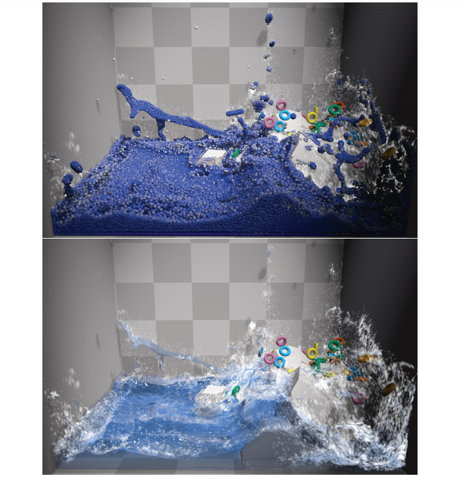

Macklin等人\[64]提出了一种在一个统一框架内处理液体、气体、刚体、布料和变形固体的方法，以便系统中所有类型的物质都可以对所有其他类型的物质产生影响。他们使用符号距离场来快速解决碰撞问题。他们提出了一个具有实时性能的GPU实现，图25.23展示了一个例子。

## 25.11 动态相交测试

在第22章中，我们只考虑了静态物体之间的相交测试，这意味着所有涉及的物体，在测试的时候都没有发生移动。然而，这并不总是一个真实世界中的场景，尤其是我们会在离散的时间来对每帧进行渲染。例如：离散测试意味着，一个球在时间$t$时位于封闭门的这一侧，而在时间$t+\Delta t$（即下一帧）时，它会移动到门的另一侧，静态相交测试并不会注意这期间的任何碰撞。一种解决方案是在$t$和$t+\Delta t$之间，以均匀间隔来进行多次测试。这种方案将会增加计算负荷，但是仍然可能会错过相交情况。为了达到测试目的，我们可以增加门的远端厚度，但是如果球体移动得足够快，那么这种技术也可能会失败\[14]。针对这一问题，相关研究人员设计了一种动态相交测试（dynamic intersection test）方法。章节25.5中对BSP与圆柱体的动态相交测试进行了深入的检查。本小节中将会提供其他常见的动态相交测试。更多信息可以在Ericson的书籍\[25]和Eberly的书籍\[22]中找到，Catto \[14]和Gregorius \[37]的展示中也包含了相关内容。

可以使用诸如轴剔除（shaft culling）之类的方法\[39]，来辅助运动AABB的相交测试。在空间中运动的物体由两个不同时间的AABB进行表示，这两个AABB由一组小平面相连接。相交物体可以针对这个简单的凸包来进行测试。然而，包围球相交算法的计算速度要快得多，而且如果球体可以将各自的物体包裹得相当紧密，那么总体上可以更加高效。事实上，使用一小组球体来紧密包围并代表一个移动中的物体通常是十分值得的\[81]。胶囊体（一个管子将两个球体连接起来）可以作为动画角色的包围体，锥形胶囊体（tapered capsule）可以用于四肢和布料的模拟。

对于一个只有平移（没有旋转）的动态相交测试而言，可以应用这样一条原则：运动是相对的。假设物体$A$以速度$\mathbf{v}_A$进行移动，物体$B$以速度$\mathbf{v}_B$进行移动，这两个速度都是物体在一帧内移动的量。为了对计算进行简化，我们可以假设物体$A$正在发生移动，而物体$B$则是静止的。为了对物体$B$的速度进行补偿，则物体$A$的速度被修正为：$\mathbf{v}=\mathbf{v}_{A}-\mathbf{v}_{B}$。因此，在接下来的算法中，只有一个物体是具有速度的。

### 25.11.1球体/平面

在平面上对球体进行动态测试是很简单的。假设球体的圆心为$\mathbf{c}$，半径为$r$。与静态测试相反，球体在整个帧时间$\Delta t$内的速度为$\mathbf{v}$。因此，在下一帧中，球体将会位于$\mathbf{e}=\mathbf{c}+\Delta t \mathbf{v}$处。为了简单起见，我们假设该帧从时间0开始，$\Delta t$为1。那么这个问题就变成了：在这段时间内，球体是否与平面$\pi: \mathbf{n} \cdot \mathbf{x}+d=0$发生了碰撞？

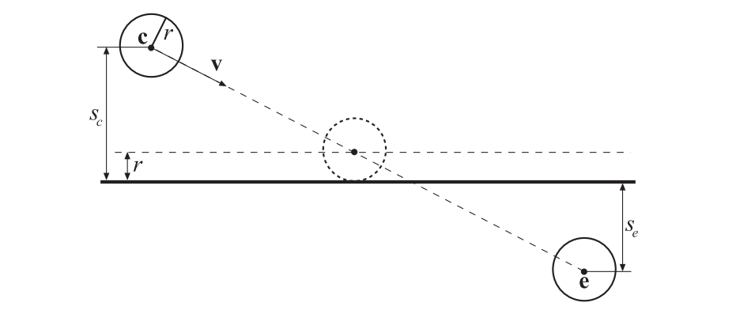

我们将球心代入平面方程，可以得到从球心到平面的符号距离$s_c$。从这个距离中减去球体半径，就得到了球体在到达平面之前可以移动的最大距离（沿着平面法线）。如图25.24所示。对于终点$\mathbf{e}$，计算一个类似的符号距离$s_e$。此时，如果两个球体中心都位于平面的同一侧（即$s_cs_e>0$，且$\left|s_{c}\right|>r , \left|s_{e}\right|>r$，那么就不会发生相交，球体可以安全地移动到终点$\mathbf{e}$。否则，球体会与这个平面相交，需要计算交点以及相交的确切时间\[32]。假设球体与平面第一次接触的时间为$t$，$t$的计算方程如下：

$$
t=\frac{s_{c}-r}{s_{c}-s_{e}}
\tag{25.15} 
$$

此时球心位于$\mathbf{c}+t \mathbf{v}$。在这个碰撞点上，一个简单的碰撞响应是，围绕平面法线，对速度矢量$\mathbf{v}$进行反射，并使用这个矢量$(1 - t)\mathbf{r}$来对球体进行移动，其中$1 - t$是从碰撞时间到下一帧之间的剩余时间，$\mathbf{r}$是反射向量。

### 25.11.2球体/球体

对两个移动的球体$A$和球体$B$进行相交测试，等价于一条射线针对一个静止球体进行测试——这是一个令人惊讶的结果。我们通过两个步骤来说明这种等价性。首先，利用相对运动原理使得球体$B$静止。然后，我们借用一个视锥体/球体相交测试（章节22.14.2）中的技术。在这个测试中，球体会沿着视锥体的表面进行移动，从而形成一个更大的视锥体。通过将视锥体以球体半径长度向外延伸，使得这个球体本身可以缩小为一个点。而在这里，我们将一个球体移动到另一个球体的表面上，使用同样的方法得到一个新的球体，这个新球体的半径是两个原始球体半径的和。

因此，将球体$A$的半径加到球体$B$的半径上，我们得到了一个新的球体半径。此时的情况是，球体$B$是静止的，并且半径更大，而球体$A$则是一个沿着直线进行移动的点，即一条射线，如图25.25所示。

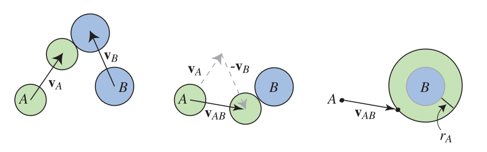

这个基本的相交测试已经在章节22.6中介绍过了，在这里我们直接给出最终结果：

$$
\left(\mathbf{v}_{A B} \cdot \mathbf{v}_{A B}\right) t^{2}+2\left(\mathbf{l} \cdot \mathbf{v}_{A B}\right) t+\mathbf{l} \cdot \mathbf{l}-\left(r_{A}+r_{B}\right)^{2}=0
\tag{25.16} 
$$

在方程25.16中，$\mathbf{v}_{A B}=\mathbf{v}_{A}-\mathbf{v}_{B}$，$\mathbf{l}=\mathbf{c}_{A}-\mathbf{c}_{B}$。其中$\mathbf{c}_{A}$和$\mathbf{c}_{B}$是球体的中心。对方程25.16进行整理，并写出一元二次方程的形式，相应的系数$a$、$b$和$c$为：

$$
\begin{array}{l}a=\left(\mathbf{v}_{A B} \cdot \mathbf{v}_{A B}\right), \\ b=2\left(\mathbf{l} \cdot \mathbf{v}_{A B}\right), \\ c=\mathbf{l} \cdot \mathbf{l}-\left(r_{A}+r_{B}\right)^{2},\end{array}
\tag{25.17} 
$$

这里回顾一下一元二次方程的基本形式，并将各个系数代入其中：

$$
a t^{2}+b t+c=0
\tag{25.18} 
$$

方程25.18中的两个根，可以通过一次计算直接得到：

$$
q=-\frac{1}{2}\left(b+\operatorname{sign}(b) \sqrt{b^{2}-4 a c}\right)
\tag{25.19} 
$$

当$b\ge 0$时，$\operatorname{sign}(b)$为+1，否则为-1。那么这两个根就是：

$$
\begin{aligned} t_{0} & =\frac{q}{a}, \\ t_{1} & =\frac{c}{q} .\end{aligned}
\tag{25.20} 
$$

这种求解二次方程的形式并不是教科书中通常所介绍的，但是Press等人指出，它在数值上会更加稳定\[77]。

我们假设球体在开始时不重叠（这可以通过一个静态的球体与球体相交测试确定）。在$[0,1]$范围内，$[t_0, t_1]$中的最小值就是第一次相交的时间。将$t$值代入，可得：

$$
\begin{array}{l}\mathbf{p}_{A}(t)=\mathbf{c}_{A}+t \mathbf{v}_{A}, \\ \mathbf{p}_{B}(t)=\mathbf{c}_{B}+t \mathbf{v}_{B}\end{array}
\tag{25.21} 
$$

对方程25.21进行计算，我们可以获得每个球体在第一次接触时的位置。这个测试与前面所提到的射线与球体测试的主要区别在于，这里并没有对光线的方向$\mathbf{v}_{B}$进行归一化。

### 25.11.3 球体/多边形

球体和平面的动态相交十分简单，可以直接进行可视化。球体与平面的动态相交测试，也可以像球体与球体的相交测试一样，被转换为另一种形式。也就是说，运动中的球体可以收缩为一个运动的点，从而构成一条射线；而平面则被扩展为一个厚度为球体直径的平板。这两个测试中所使用的关键思想，都是计算两个物体的Minkowski和。球体与球体的Minkowski和是一个更大的球体，其半径相当于二者的半径之和。

球体与平面的和是一个平面，并在每个方向上都以球体的半径进行加厚。实际上，任何两个体积都可以通过这种方式加在一起，尽管有时候结果难以进行描述。对于球体与多边形的动态测试而言，我们的想法是根据球体与多边形的Minkowski和，来对一条射线进行测试。

我们不会在这里深入介绍他的方法，但是请注意，这个球体与多边形的相交测试，等价于一条射线（由沿着直线移动的球体中心进行表示）对球体和多边形的Minkowski和进行测试。在这个和表面中，顶点会变成半径为$r$的球体；边缘会变成半径为$r$的圆柱体；多边形本身会被复制，然后向上移动$r$，同时向下移动$r$，从而将自身封闭，图25.26展示了这一点。这与视锥体与球体相交测试时，对视锥体的扩展是一样的（章节22.14.2）。因此，所提出的算法可以被认为是，针对这个体积的各个部分，对一条射线进行测试：首先，对面向射线的多边形进行测试，然后对代表边缘的圆柱体进行测试，最后对代表顶点的球体进行测试。

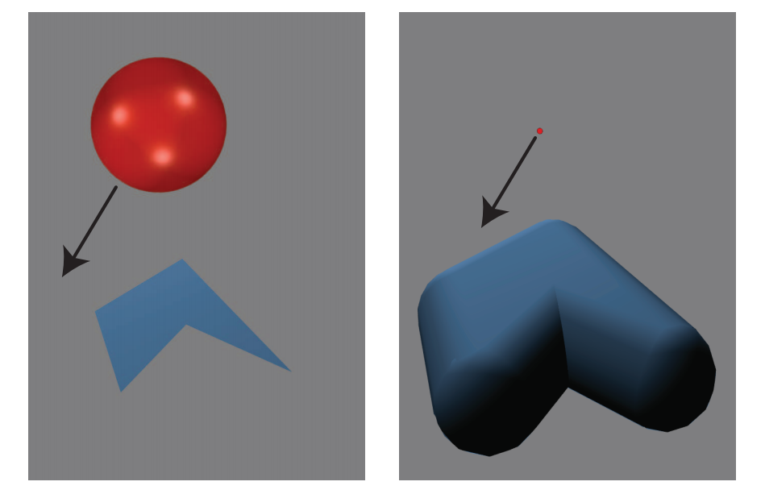

想想这个蓬松（puffy）的物体，你就会明白为什么对一个多边形最有效的测试顺序是：面（多边形）、边、顶点。在这个蓬松的物体中，面对球体的多边形并不会被物体膨胀后的圆柱体和球体所覆盖，因此对其首先进行测试，将会给出最近的可能交点，同时无需进一步测试。类似地，虽然由边缘形成的圆柱体会部分覆盖球体，但是反过来，球体只覆盖了圆柱体内的一部分，因此这里先对边缘进行测试，最后对顶点进行测试。

射线击中圆柱体的内部，等价于找到这个运动球体最后击中的相应边缘上的点，这个点实际上我们并不关心。圆柱体外部的最近交点（如果存在的话），总是要比最近的球面交点更近。因此，找到与圆柱体的最近交点就足以结束整个测试，而无需再去检查顶点膨胀后的球体。在处理射线与这个蓬松物体的时候，相比于处理原始的球体和多边形，思考要进行的测试顺序则要容易得多（至少对我们来说）。

从这个膨胀的物体模型中我们可以看出，对于具有凹面的多边形，任何凹面位置上的顶点，都不需要针对运动球体来进行测试，因为对于这样的一个凹面顶点，它所形成的球体从外部是不可见的。利用相对运动原理和Minkowski和，将运动球体转换为一条射线，可以推导出动态球体与物体相交的高效测试。

静态的相交测试也可以通过对Minkowski和进行测试得到，例如：如果发现球体的中心就位于这个膨胀模型的内部，那么球体与三角形就会在它们的初始位置处发生相交。与之相关的Minkowski差，是一种更加通用的、描述任意物体包含性测试的方法（章节25.3.2）。取差值相当于从一个物体中减去另一个物体，对于被减去的物体，其坐标值会被消去（即为0，位于原点处）。如果两个物体相交，那么则说明它们的Minkowski差中包含了原点，这个点代表了一个存在于两个物体中的位置。Gregorius \[36]讨论了如何利用Minkowski差和物体的高斯贴图，来对分离轴测试的使用进行优化，并提供了一些见解。

还有一些更加复杂的动态测试，例如三角形与三角形之间的动态相交测试。Van Waveren \[91]基于顶点/多边形和边/边的碰撞测试，对多面体之间的动态碰撞检测进行了讨论。Catto \[14]对保守推进（conservative advancement）的概念进行讨论，所谓保守推进，就是找到两个物体之间的安全距离，并将物体移动得更近，然后再次进行测试。但是，使用这个安全间隔将会使得收敛时间变长。她提出了一种三角形与三角形相交的双边推进算法，这是一种改进的高效求根方法。Shellshear和Ytterlid \[82]为三角形、线段和顶点之间的距离查询提供了SSE优化的代码。PQP（Proximity Query Package）库提供了网格物体重叠，以及两个模型之间最小距离的相应代码。

### 25.11.4 动态分离轴方法

章节22.2中的介绍了分离轴测试（separating axis test，SAT），这种方法有助于检验凸多面体（例如box和三角形）之间的相互关系。这种类型的测试也可以扩展到动态查询中\[11, 20, 25, 37, 80]。

请记住，SAT方法会对一组坐标轴进行测试，从而查看这两个物体在这些坐标轴上的投影是否会发生重叠。如果所有轴上的投影都发生了重叠，那么这两个物体也会发生重叠。动态求解问题的关键是：需要将运动物体的投影间隔以$(\mathbf{v} \cdot \mathbf{a}) /(\mathbf{a} \cdot \mathbf{a})$的速度（详见方程4.62），在轴$\mathbf{a}$上进行移动\[11]。同样地，如果在所有被测试的轴上都发生了重叠，则这两个动态物体也会发生重叠，否则就没有发生重叠。图25.27展示了动态SAT和静态SAT之间的差异。

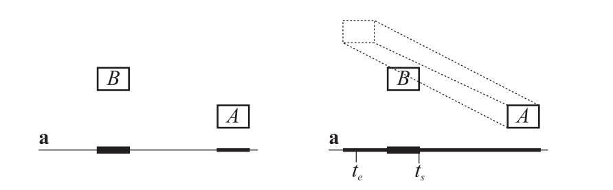

Eberly \[20]使用了Ron Levine所提出的一个想法，同样也计算了物体$A$和物体$B$之间相交的实际时间。这是通过计算它们刚刚开始发生重叠的时间$t_s$，以及它们停止重叠（因为这个间隔已经“穿过”了彼此）的时间$t_e$来完成的。$A$和$B$之间碰撞开始的时间，发生在所有轴上的最大$t_s$处；同样，重叠结束的时间，发生在所有$t_e$值中最小的位置处。可以对$t = 0$时刻进行检测，如果发现间隔没有发生重叠，并且向着相反的方向运动，那么可以不进行后续的测试，即早期的拒绝优化。此外，如果在任何时候，最大的$t_s$会大于最小的$t_e$，那么说明这两个物体不会发生重叠，因此测试也可以终止。这与章节22.7.1中的射线与box相交测试类似。Eberly为凸多面体之间的广泛测试提供了相应的代码，包括box与box、三角形与box、三角形与三角形。Gregorius \[37]提出了球体、胶囊体、凸包和网格之间的动态相交测试算法。

## 补充阅读和资源

请参阅本书的网站[realtimerendering.com](http://xn--realtimerendering-5960a185e9x2g3l5cd6ta0pxhm3evsuc.com "realtimerendering.com")，以了解该领域中的最新信息和免费软件。CD的最佳资源之一是Ericson的《Real-Time Collision Detection》一书\[25]，其中包含了很多代码。在van den Bergen的碰撞检测书籍\[9]中，对GJK和该书附带的SOLID CD软件系统进行了特别关注。Van den Bergen为游戏程序员提供了一个关于物理的有价值演讲\[10]，Catto则提供了一个对GJK的愉快介绍\[13]。Teschner等人\[87]对用于变形物体的CD算法进行了调研和综述。Schneider和Eberly在他们关于几何工具的书\[80]中，提出了计算不同图元之间距离的算法。

有关空间数据结构的更多信息，详见章节19.1。除了Ericson的书\[25]之外，Samet所撰写的书籍\[78]是一本关于空间数据结构且非常全面的参考著作。

Millington \[68]、Erleben等人\[26]的书籍，以及Eberly的书籍\[21]是碰撞响应领域中的综合指南。
