# Chapter 26 Real-Time Ray Tracing 实时光线追踪

## 目录

-   [26.1 光线追踪基础](#261-光线追踪基础)
-   [26.2 光线追踪着色器](#262-光线追踪着色器)
-   [26.3 顶层和底层加速结构](#263-顶层和底层加速结构)
-   [26.4 一致性](#264-一致性)
    -   [26.4.1 场景一致性](#2641-场景一致性)
        -   [空间数据结构的属性](#空间数据结构的属性)
        -   [构造方案](#构造方案)
        -   [遍历方案](#遍历方案)
    -   [26.4.2 光线和着色的一致性](#2642-光线和着色的一致性)
-   [26.5 降噪](#265-降噪)
-   [26.6 纹理过滤](#266-纹理过滤)
-   [26.7 推测](#267-推测)
-   [补充阅读和资源](#补充阅读和资源)

> Sylvia Plath——“I wanted change and excitement and to shoot off in all directions myself, like the colored arrows from a Fourth of July rocket.”

> 西尔维娅·普拉斯——“<我最腻味的就是永恒的安全感，或者当个射箭的出发点>。我想要改变，想要兴奋，想要自己向四面八方发射，就像独立日火箭上的彩色箭头一样。”（美国自白派诗人；31岁时自杀；1932—1963）

> 译者注：本章节中引用的参考文献编号是单独列出的，注意不要与第1章-第24章的参考文献相混淆。

与基于光栅化的技术相比（这是本书中大部分内容的主题），光线追踪（ray tracing）是一种更直接受到光物理学启发的方法，因此，它可以生成更加真实的图像。在1999年的第一版《Real-Time Rendering》中，我们的梦想在2007年到2024年之间，以每秒12帧的平均帧率来渲染《虫虫危机（A Bug's Life，ABL）》，从某种意义上来说，我们的预测是正确的。ABL只会在几个真正需要的镜头中使用光线追踪，例如：水滴中的反射和折射。然而，由于近年来GPU的不断进步，已经使得通过光线追踪来实时渲染游戏场景成为可能。例如：这本书的封面（译者注：Nvidia的星球大战demo）就展示了一个以每秒20帧的速度，使用全局光照进行渲染的场景，它开始与电影故事片（feature-film）的图像质量相当。光线追踪将会彻底改变实时渲染。

在其最简单的形式中，光栅化和光线追踪的可见性确定，可以使用一个双for循环来进行描述。光栅化为：

```c++
for (T in triangles )
    for (P in pixels )
        determine if P is inside T
```

另一方面，光线追踪可以使用以下方式进行描述：

```c++
for (P in pixels )
    for (T in triangles )
        determine if ray through P hits T
```

某种意义上来说，这两个算法其实都很简单。然而，想要让其中任何一种算法运行得更快，我们所需要的代码和硬件，要比一张名片（译者注：章节11.2中也提到了这个典故）所能容纳的多得多。

> Paul Heckbert在上世纪90年代的名片背面，写下了一个简单的递归光线追踪器代码。\[34]

一些光线追踪器使用了空间数据结构（例如BVH），它们具有一个重要特征，即追踪一根光线的运行时间为$O(\log n)$，其中$n$是场景中的三角形数量。虽然这是光线追踪一个十分具有吸引力的特性，但是很明显，光栅化的复杂度也可以比$O (n)$更好，因为GPU中有相应的遮挡剔除硬件，渲染引擎中也会使用视锥体剔除、延迟渲染和许多其他的优化技术，避免对每个图元都进行完整处理。因此，在大$O$表示法中，对光栅化算法的运行时间进行估计是一件十分复杂的事情。此外，GPU中的纹理单元和三角形遍历单元非常快，并且在这几十年的时间里，已经针对光栅化进行了很多优化。

重要的区别在于，光线追踪可以向任何方向发射光线，而不仅仅是从眼睛或者光源等单一点上发射光线。正如我们将在章节26.1中所看到的，这种灵活性使得递归渲染反射现象和折射现象成为可能\[89]，并且能够对渲染方程（方程11.2）进行充分计算，这样做可以使得图像看起来更好更真实。光线追踪的这一特性也简化了内容制作流程，因为它需要的艺术家手动干预更少\[20]。当在使用光栅化的时候，艺术家经常需要对他们的创作进行调整，以便能够与所使用的渲染技术一起工作。然而，在使用光线追踪的时候，图像中的噪声可能会变得十分明显，例如：对面光源进行采样时，当着色表面具有光泽时，当环境贴图被积分时，以及当使用路径追踪时，都会发生这种情况。

也就是说，想要使得实时光线追踪成为实时应用中唯一的渲染算法，很可能还需要几种其他的技术（例如降噪），才能使得图像看起来足够好。降噪技术尝试基于智能图像平均（ intelligent image averaging）来去除噪声（章节26.5）。在短期内，光栅化和光线追踪的巧妙组合是有望实现的，也就是说，光栅化技术并不会很快消失。从长远来看，随着处理器变得更加强大，光线追踪的规模问题也会变得更好，也就是说，所能提供的计算能够和带宽越大，我们可以通过增加每像素的样本数量（samples per pixel，spp）和光线的最大递归深度，从而可以通过光线追踪生成更好的图像。例如：由于涉及计算困难的间接光照，图26.1中所展示的图像，在每个像素上使用了256个样本。另一幅使用高质量路径追踪的图像如图26.6所示，其中每个像素的样本数量范围为1到65536。


在深入研究光线追踪所使用的算法之前，我们建议您参考几个相关的章节。第11章的主题是全局光照，其中提供了围绕渲染方程（方程11.2）的相关理论，并在章节11.2.2中，对光线追踪和路径追踪进行了基本解释。第22章的主题的相交测试，对于光线追踪而言，光线与物体的相交测试是必不可少的。空间数据结构可以用于对光线追踪中的可见性查询进行加速，我们在章节19.1.1中，以及第25章关于碰撞检测的相关话题中进行了描述。

## 26.1 光线追踪基础

回顾一下方程22.1，一条光线被定义为：

$$
\mathbf{q}(t)=\mathbf{o}+t \mathbf{d}
\tag{26.1} 
$$

其中$\mathbf{o}$是光线原点，$\mathbf{d}$是归一化的光线方向，$t$是沿着光线的距离。请注意，在这里我们使用$\mathbf{q}$（而不是$\mathbf{r}$）来代表光线方程，其目的是与下面所使用的右向量$\mathbf{r}$区分开来。光线跟踪可以使用两个函数来进行描述，即$\mathrm{trace} ()$和$\mathrm{shade} ()$。核心的几何算法是$\mathrm{trace} ()$，它负责找到光线和场景图元之间的最近交点，并通过调用$\mathrm{shade} ()$来返回光线的颜色。在大多数情况下，我们希望找到$t>0$的交点；对于构造实体几何（constructive solid geometry，CSG）而言，我们通常也需要找到负距离的交点（位于光线背后的相交点）。

 处的方向向量 \mathbf{d}(x, y) 。")

为了获得像素的颜色，我们会发射一条穿过像素的光线，计算像素的颜色并作为它们结果的加权平均值，这些光线被称为眼睛光线（eye ray）或者相机光线（camera ray）。相机的设置如图26.2所示。给定一个整数像素坐标$(x, y)$，其中$x$轴在图像中指向右，$y$轴指向下，相机位置为$\mathbf{c}$，相机的坐标系为$\{\mathbf{r}, \mathbf{u}, \mathbf{v}\}$（right，up，view），屏幕的分辨率为$w \times h$，则眼睛光线$\mathbf{q}(t)=\mathbf{o}+t \mathbf{d}$可以按照如下方法进行计算：

$$
\begin{aligned} \mathbf{o} & =\mathbf{c}, \\ \mathbf{s}(x, y) & =a f\left(\frac{2(x+0.5)}{w}-1\right) \mathbf{r}-f\left(\frac{2(y+0.5)}{h}-1\right) \mathbf{u}+\mathbf{v}, \\ \mathbf{d}(x, y) & =\frac{\mathbf{s}(s, y)}{\|\mathbf{s}(s, y)\|}\end{aligned}

\tag{26.2} 
$$

其中归一化光线方向$\mathbf{d}$受$f=\tan (\phi / 2)$影响，$\phi$是相机的垂直视场角，$a = w/h$是相机的长宽比。请注意，这里的相机坐标系是一个左手系，即$\mathbf{r}$指向右侧，$\mathbf{u}$是指向上方，$\mathbf{v}$指向远离相机的图像平面方向，即与图4.5中所展示的设置类似。注意，$\mathbf{s}$是一个用于归一化$\mathbf{d}$的临时向量。由于$(0.5,0.5)$才是浮点中心\[33]，因此将整数位置$(x, y)$加上0.5，才是每个像素的中心。如果我们想要在一个像素内的任何位置发射光线，我们将会使用浮点值来表示像素的具体位置，并且不会添加这个0.5的偏移。

在最简单的实现中，$\mathrm{trace} ()$将会循环遍历场景中的$n$个图元，并将光线与其中的每个图元进行相交测试，并维护满足$t>0$的最近交点。这样做的复杂度为$O(n)$，除了使用很少量的图元之外，这个速度慢得令人无法接受。为了达到每条光线$O(\log n)$的复杂度，我们会使用一些空间加速结构，例如BVH或者k-d树。章节19.1中描述了如何使用BVH来对射线进行相交测试。

 进行第一次调用，并在该像素中内开始光线追踪的过程。这条光线击中了一个地面，地面的法线为 \mathbf{n} 。然后在第一个交点处调用 \mathrm{shade} () ，因为 \mathrm{trace} () 的目标就是找到光线的颜色。光线追踪的强大之处在于，当我们计算该点的BRDF时， \mathrm{shade} () 可以通过调用 \mathrm{trace} () 来进行辅助。在这个例子中，这是通过向光源发射阴影光线（shadow ray）来完成的，在图中的情况下，这条阴影光线被一个三角形挡住了。另外，我们假设此时的表面是一个镜面，因此我们会发射一条反射光线，这条反射光线击中了一个圆。在第二个交点处，我们再次调用 \mathrm{shade} () 来计算着色。同样地，在这个新的交点处，我们还可以再次发射阴影光线和反射光线。")

使用$\mathrm{trace} ()$和$\mathrm{shade} ()$来描述光线追踪器是很简单的。使用方程26.2来构建一条从相机位置指向像素内位置的光线。这条光线被送入$\mathrm{trace} ()$，它的任务是找到沿着这条光线返回的颜色或者radiance（第8章）。它首先会找到沿着光线最近的交点，然后再使用$\mathrm{shade} ()$来计算该点的着色，我们在图26.3中说明了这个过程。这个概念的强大之处在于，我们可以通过重新调用$\mathrm{trace} ()$，来对需要评估radiance的$\mathrm{shade} ()$进行计算，例如：在$\mathrm{shade} ()$中重新构建并发射光线，并重复调用$\mathrm{trace} ()$，这些新光线可以用于计算阴影、递归反射和折射、漫反射光线计算等。我们使用术语光线深度（ray depth），来表示沿着光线路径递归发射的光线数量。眼睛光线的光线深度为1，而在图26.3中，对于光线击中红色圆圈的第二个$\mathrm{trace} ()$，所对应的光线深度为2。

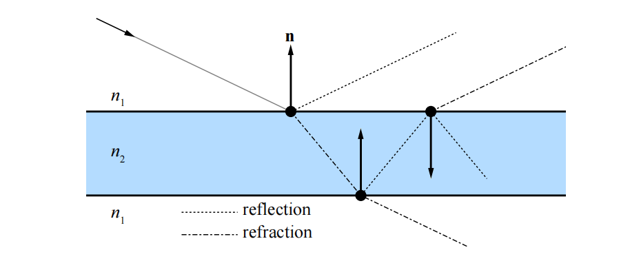

这些新光线的一个用途是，确定当前着色点是否处于光源的阴影中，这样做可以产生阴影效果。我们还可以用眼睛光线和法线$\mathbf{n}$，在交点处计算反射向量，并在这个方向上发射一条新的光线，这样可以在表面上产生反射效果，并且可以递归完成。同样的过程可以用来生成折射光线。完美的镜面反射、完美的折射以及尖锐的阴影，通常会被称为Whitted光线追踪\[89]。有关如何计算反射光线和折射光线的信息，详见章节9.5和章节14.5.2。请注意，当一个物体的折射率与光线此时所处介质的折射率不同时，光线有可能会被同时反射和折射，如图26.4所示。这种递归是基于光栅化的方法难以解决的问题，我们只能通过使用各种方法来近似实现这些效果，从而获得光线追踪效果的一个子集。光线投射（Ray casting）是指测试两点之间或者某个方向上可见性的思想，可以用于其他的图形（或者非图形）算法，例如：我们可以从一个交点发射一些环境光遮蔽光线，从而获得该效果的准确估计。

下面的伪代码使用了函数$\mathrm{trace} ()$、$\mathrm{shade} ()$和$\mathrm{rayTraceImage}()$，其中$\mathrm{rayTraceImage}()$是通过每个像素来创建眼睛光线的函数。这些简短的代码片段展示了Whitted光线追踪器的整体结构，它可以作为许多渲染变体的基础，例如：路径追踪。

```glsl
rayTraceImage ()
{
    for (p in pixels )
    color of p = trace (eye ray through p) ;
}

trace (ray )
{
    pt = find closest intersection ;
    return shade (pt);
}

shade ( point )
{
    color = 0;
    for (L in light sources )
    {
        trace ( shadow ray to L);
        color += evaluate BRDF ;
    }
    color += trace ( reflection ray );
    color += trace ( refraction ray );
    return color ;
}

```

Whitted光线追踪无法提供全局光照的完整解决方案。除了镜面反射之外，在任何方向反射的光线都会被忽略，直接光直接使用点来进行表示。为了充分计算渲染方程（如方程11.2所示），Kajiya \[41]提出了一种被称为路径追踪（path tracing）的方法，这是一种正确的解决方案，能够生成具有全局光照的图像。一种可能的方法是，计算眼睛光线的第一个交点，然后向不同方向上发射许多光线，从而计算该点的着色，例如：如果击中了一个漫反射表面，那么我们可以在交点的整个半球方向上发射光线。然而，如果在每条光线的交点上都重复这个过程，那么需要进行计算的光线数量会爆炸。Kajiya意识到，可以使用基于蒙特卡罗的方法来追踪一条射线，生成穿过场景的路径，并在一个像素上对几条这样的路径光线进行平均。这就是路径追踪方法的工作原理，详见图26.5。

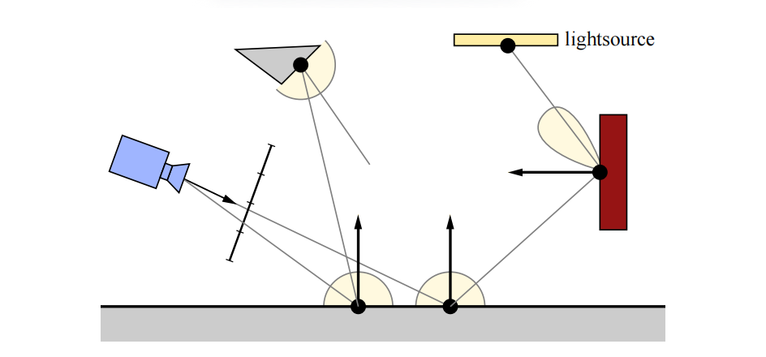

路径追踪的一个缺点是，需要使用许多光线才能使得图像收敛。为了让方差减半，我们需要发射四倍的光线，如图26.6所示。

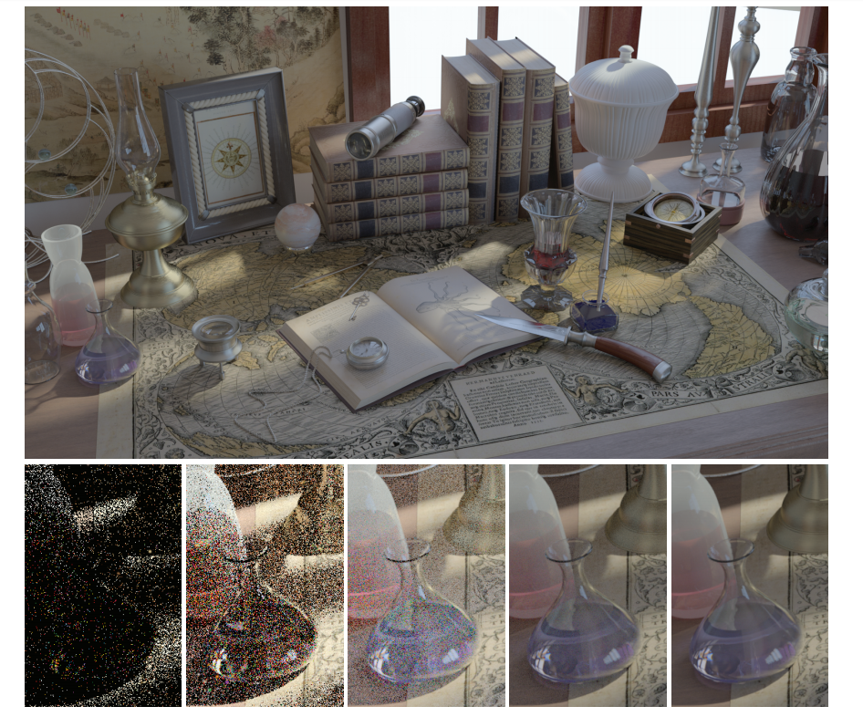

其中的$\mathrm{shade} ()$函数总是会由用户进行实现，因此可以使用任何类型的着色，就像是光栅化渲染管线中的顶点着色器和像素着色器一样。$\mathrm{trace} ()$中进行的遍历和相交测试，可以在CPU上进行实现，也可以使用GPU上的计算着色器进行实现，或者使用DirectX和OpenGL来进行实现。又或者，我们可以使用一些光线追踪API，例如DXR。这是下一小节中的主题。

## 26.2 光线追踪着色器

光线追踪现在已经紧密集成到了实时渲染API中，例如DirectX \[59, 91, 92]和Vulkan。在本小节中，我们将介绍不同类型的光线追踪着色器，它们已经被添加到了这些API中，因此可以与光栅化管线一起使用。这种组合的一个例子是，我们可以首先使用光栅化来生成G-buffer（第20章)，然后从这些场景命中点处发射光线，来产生反射效果和阴影效果\[9, 76]。我们称之为延迟光线追踪（deferred ray tracing）。

光线追踪着色器会被分配给GPU，类似于计算着色器（章节3.10），即在网格（像素）上进行划分。在本小节中，我们将遵循DXR中的命名习惯\[59]，DXR是DirectX 12中添加的光线追踪，其中共有五种类型的光线追踪着色器\[59, 78]：

1.  光线生成着色器（ray generation shader）
2.  最近命中着色器（closest hit shader）
3.  未命中着色器（miss shader）
4.  任意击中着色器（any hit shader）
5.  相交着色器（intersection shader）

光线的定义使用方程26.1加上区间$[t_{min}, t_{max}]$，这个区间定义了接受交点的光线部分，如图26.7所示。程序员可以向光线添加一个负载（payload），这是一个数据结构，用于在不同的光线追踪着色器之间发送数据，例如：一个光线的负载可以包含一个$\mathrm{float4}$来表示radiance，一个$\mathrm{float}$来表示到命中点的距离，用户还可以添加任何需要的内容。然而，保持光线的负载较小，可以获得更好的性能表现，因为较大的负载可能会使用更多的寄存器。

![图26.7：由原点 \mathbf{o} 、方向 \mathbf{d} 和区间 \[t\_{min}, t\_{max}\] 定义的光线。只有位于这个区间内的交点才会被找到。](images/Chapter-26/202310230939824.png "图26.7：由原点 \mathbf{o} 、方向 \mathbf{d} 和区间 \[t_{min}, t_{max}] 定义的光线。只有位于这个区间内的交点才会被找到。")

光线生成着色器（ray generation shader）是光线追踪的起点，它可以像计算着色器一样进行编程，并且能够调用一个新的函数$\mathrm{TraceRay}()$，它与章节26.1中所描述的$\mathrm{trace}()$函数相类似。通常来说，光线生成着色器会针对屏幕上的所有像素都执行一次。$\mathrm{TraceRay}()$中空间加速结构的快速遍历，是由驱动程序通过API进行提供的。可以定义一个与不同着色器相连接的光线类型，例如：对于标准光线（standard ray），通常会使用一组特定的着色器；而对于阴影光线（shadow ray），则可以使用更加简单的着色器。对于阴影效果而言，光线可以更加高效地进行追踪，因为我们通常可以在光线间隔（从命中点到光源的范围）中找到任何交点时就立即停止。

对于标准光线而言，第一个正交点是必需的，这样的光线是由光线生成着色器进行发射的。当找到最近交点的时候，会执行一个最近交点着色器（closest hit shader）。在这个着色器中，用户可以实现章节26.1中的$\mathrm{shade}()$，例如：阴影光线测试，反射，折射和路径追踪等。如果光线没有击中任何物体，则会执行一个未命中着色器（miss shader）。这对于生成radiance值，并通过射线负载发送回来是十分有用的。它可以是静态的背景颜色、天空颜色，也可以是在环境贴图中查找生成的颜色值。

任意命中着色器（any hit shader）是一个可选的着色器，当场景中包含透明物体或者alpha测试纹理的时候可以进行使用。每当在光线间隔中发生命中时，都会执行这个着色器，例如：着色器代码可以在纹理中执行查找，如果这个样本是完全透明的，那么遍历就应当继续进行，否则便可以停止。无法保证这些测试的执行顺序，因此着色器代码可能需要执行一些局部排序，才能得到正确的混合结果。这个任意命中着色器可以同时用于标准光线和阴影光线。与光栅化一样，在镂空纹理的边界周围使用更加紧密的多边形（章节13.6.2），可以帮助减少这个着色器被调用的次数。

当光线在空间加速结构中击中某个包围盒时，会执行相交着色器（intersection shader）。因此，它可以用于实现自定义的相交测试，例如：针对分形景观（fractal landscape）、细分曲面和解析曲面（例如球体和圆锥）等。

除了光线生成着色器之外，未命中着色器和最近交点着色器都可以调用$\mathrm{TraceRay}()$来生成新的光线。除了相交着色器之外的所有着色器，都可以对光线的负载进行修改。所有光线追踪着色器都可以输出到UAV中，例如：光线生成着色器可以将发送到相应像素中的光线颜色输出到UAV中。

在结合光栅化和光线追踪的领域中，还有许多创新和研究要做，而且在如何利用实时图形API新添加的东西（new addition）方面，也有很多创新和研究要做。Andersson和Barre-Brisebois \[9]提出了一种混合渲染管线（hybrid rendering pipeline），它将这两种渲染范式结合在一起。首先，使用光栅化渲染一个G-buffer，使用计算着色器来完成直接光照和后处理。直接阴影和环境光遮蔽可以使用计算着色器或者使用光线追踪来完成。而全局照明，反射，透明和半透明（transparency & translucency）等效果，是使用纯光线追踪来完成的。随着GPU的不断发展，性能瓶颈也将会发生移动，因此一个普遍建议是：

$$
\text{Use raster when faster, else rays to amaze.}
\\ \text{当需要速度时使用光栅化，当需要质量时使用光线追踪。}
$$

与往常一样，记得实际测量性能瓶颈所在的位置（详见第18章）。另外，$\mathrm{TraceRay}()$还可以作为一个作业生成机制，也就是说，一个着色器可以使用$\mathrm{TraceRay}()$来生成多个作业，从而计算一个组合结果，例如：这个特性可以用于自适应光线追踪（adaptive ray tracing），在这个技术中，会向具有高方差的像素区域发送更多的光线，其目标是以相对较低的成本来提高图像质量。除此之外，$\mathrm{TraceRay}()$可能还有许多在API设计期间没有考虑到的用途。

## 26.3 顶层和底层加速结构

DXR的加速结构对于用户来说基本上是不透明的，但是有两个层次结构是可见的，它们被称为顶层加速结构（top level acceleration structure，TLAS）和底层加速结构（bottom level acceleration structure，BLAS）\[59]。BLAS中包含一组几何图形，它可以被认为是场景的组成部分。TLAS中包含一组实例，每个实例都指向一个BLAS，如图26.8所示。

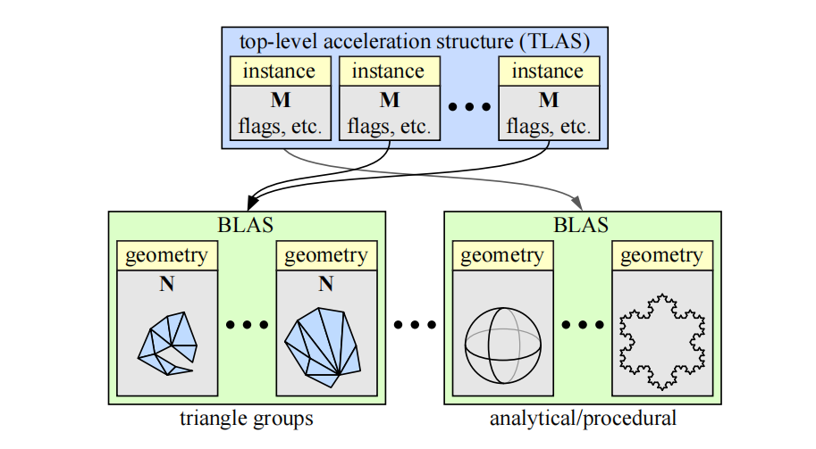

BLAS中既可以包含三角形类型的几何图形，也可以包含程序化生成的几何图形。前者直接包含一组三角形，后者则与一个相交着色器关联，使用这个着色器可以实现自定义的相交测试，例如：这可以是对球体或者圆环的解析光线测试，或者是一些程序生成的几何图形。

在图26.8中，所有矩阵$\mathbf{M}$和$\mathbf{N}$的大小都是$3 \times 4$，即任意的$3 \times 3$矩阵再加上一个平移向量（第4章）。其中矩阵$\mathbf{N}$用于在构建过程开始的时候，对相应几何图形的底层加速数据结构（例如BVH或者k-d树）进行一次转换。另一方面，矩阵$\mathbf{M}$可以每帧进行更新，因此可以用于一些比较轻量的动画。

对于任意动画的几何物体，其中的三角形可能会被添加或者删除，因此必须每帧重建BLAS。在这种情况下，即使是矩阵$\mathbf{N}$也可以被更新。如果我们只需要更新顶点的位置，那么可以在DXR API中请求一个更快的数据结构更新。这样的更新通常会降低一些性能，但是在几何物体只移动了一点点的情况下可以很好地工作。一个合理的方法是在可能的情况下，使用这些成本较低的更新，并每$n$帧进行一次重建，以便将这个成本分摊到多个帧中。

请注意，与光栅化相比，在使用光线追踪的时候，几何物体的分组通常应该不同。在第18章中我们提到，对于光栅化中的几何物体，我们通常会按材质参数进行分组，以便在像素着色期间利用着色器的一致性来提高性能表现。当使用空间局部性来进行分组的时候，用于光线追踪的加速数据结构会有更好的性能，如图26.9所示。如果光线追踪的几何物体是按照材质而不是空间局部性进行分组的，会使得性能受到很大的影响。

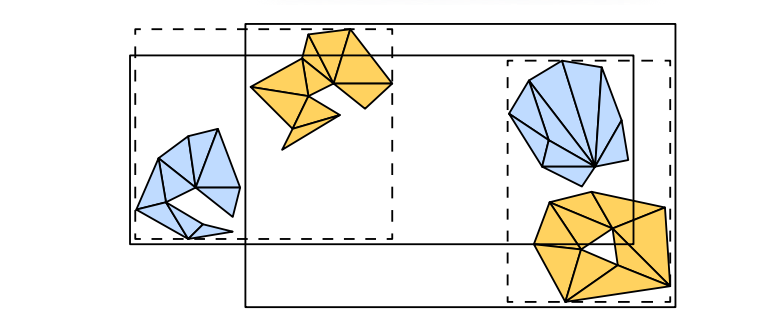

## 26.4 一致性

在软件和硬件的性能优化中，一个最重要的思想就是在执行过程中利用一致性（coherency，或者叫做连贯性和相干性）。我们可以通过在给定计算的不同部分之间，对结果进行重用来节省工作量。在当今的硬件中，无论是时间消耗还是能量消耗，最昂贵的操作都是内存访问，它要比简单的数学运算慢上几个数量级。评估硬件操作成本的一个好方法是，考虑比特在电路中完成操作所需要的物理距离，这个距离越大，成本就越高。在大多数情况下，性能优化的重点是利用内存一致性（即缓存），以及围绕内存延迟来对计算进行调度。GPU本身可以被看作是一个处理器，它显式约束着其所运行程序的执行模型（数据并行，独立的计算线程），以便能够更好地利用内存一致性（章节23.1）。

在本章节的介绍中，我们讨论了如何将光线追踪和光栅化用于屏幕像素（相机光线）“首次命中”的可见性，并将屏幕像素视为场景几何结构的不同遍历顺序。虽然排序在算法复杂度方面的影响不大，但是每种排序都有实际的影响。在使用光栅化和光线追踪的时候，我们有一个双重的for循环，其中最内层的循环是大多数计算发生的地方（除非它非常小）。由于在内部循环中的迭代是相邻进行的，因此它们是通过在迭代之间重用数据，以及利用内存访问局部性（缓存优化）来减少计算量的最佳候选。

光栅化的内部循环位于给定物体表面的像素上，这些表面上的点很可能会表现出高度的计算一致性（coherent computation）：它们可能会使用相同的材质进行着色，使用相同的纹理，甚至会对附近位置上的纹理（内存）进行访问。如果我们必须计算大量相机像素的可见性，我们可以轻松地以一种空间一致的顺序来遍历这些位置，例如：在屏幕上的小tile中进行遍历。这样做可以确保内部循环的的工作量高度一致（章节23.1）。请注意，一致性不仅只存在于可见性问题上。通常我们会在知道哪些表面是可见的之后，再开始进行渲染，这是工作量最集中的地方，会使用大量的计算能力来计算材质属性，以及它们与场景光照之间的相互作用。光栅化之所以特别快，不仅仅是因为它可以高效地计算哪些物体覆盖了哪些像素，而且还因为随后的着色计算可以自然地以一种利用一致性的方式进行排序。

相比之下，对于外部循环中的给定光线，一个简单的光线追踪器会对内部循环中的所有场景图元都进行迭代。$m$个像素和$n$个物体会导致$O(mn)$的复杂度，无论我们如何避免这个双重循环的整体开销，当在沿着单条光线对一个渲染图元列表进行遍历的时候，我们几乎没有利用一致性来进行加速。

因此，现代光线追踪器中的大多数性能优化，都涉及如何在光线可见性查询中，以及在随后的着色计算中“找到”这种一致性。我们当然可以说光栅化在默认情况下就是一致的，但是也会受限于特定的可见性查询，即相机的视锥体。在使用光栅化技术的时候，大部分工作都涉及如何对这个查询函数进行扩展，从而来模拟各种效果。相比之下，光线追踪在默认情况下是十分灵活的，我们可以在任意点的任意方向上来查询可见性。然而，这样做会导致计算的不一致（连贯性），使得它在现代硬件架构上的效率很低，因此大部分的工程努力，都花在了如何以一种一致（连贯）的方式来组织可见性查询上。

随着光线查询的灵活性不断增加，我们可以渲染光栅化无法实现的效果；同时，通过利用一致性我们仍然能够保持较高的性能表现。阴影效果就是一个很好的例子，对阴影追踪光线，可以让我们更加精确地模拟面光源的效果\[35]。阴影光线只需要与几何物体相交，在大多数情况下都不需要对材质进行评估。这些特性降低了访问不同物体时的开销。与着色光线相比，我们需要计算的是：光线是否击中了交点与光源之间的任何物体。因此，我们可以避免在交点处计算表面法线，避免检索实体物体的纹理，并且可以在发现第一个（实体）命中后就立即停止追踪。此外，阴影光线通常也是高度一致的。

对于屏幕上附近区域的像素而言，它们具有相似的起点，并且可能会指向相同的光源。最后，阴影贴图（章节7.4）无法按照屏幕像素的精确频率来对光源的可见性进行采样，这会导致欠采样或者过采样。在后一种情况下，增加阴影光线的灵活性甚至可以带来更好的性能表现。光线通常来说是更加昂贵的，但是通过避免过采样，我们可以执行更少的可见性查询。这也就是为什么阴影贴图是光线追踪在游戏中的第一个图形应用\[90]。

### 26.4.1 场景一致性

当我们考虑到三维场景中图元之间的距离时，它们就会陷入自然的空间关系中。当我们考虑渲染所需要的着色工作时，这些关系并不一定保证计算的一致性，例如：一个物体在空间位置上可能会靠近另一个物体，但是二者使用了完全不同的材质、纹理以及最终的着色算法。在光线追踪器中，用于加速物体遍历的大多数算法和数据结构，同样也可以适用于光栅化器，如章节19.1中所述。然而，这些数据结构在光线追踪器中，要比在光栅化器中更加重要。当我们在追踪光线的时候，对场景物体的遍历属于内部循环中的一部分。

大多数光线追踪器和光线追踪API，都会使用某种形式的空间加速数据结构。来对光线的可见性查询进行加速。在许多情况下，包括当前版本的DXR，这些技术会在幕后实现并作为黑盒功能进行提供，对于用户都是不透明的。出于这个原因，如果您只是专注于了解基本的DXR功能和相关技术，那么可以跳过本小节关于一致性话题的其余部分。然而，如果您想了解关于光线追踪的性能问题，尤其针对大型场景的光线追踪，那么这一小节就十分重要。如果您知道您的系统依赖于某种特定的空间结构，那么了解与该方案相关的优势和成本，可以帮助您提高渲染引擎的效率。

在可见性计算中，创建利用场景一致性（scene coherency）的数据结构，对于实时渲染而言特别具有挑战性，因为在大多数情况下，场景在动画下都是逐帧变化的。事实上，尽管我们之前提到过，光线追踪器的外部循环在可见性查询方面具有更大的灵活性，但是光栅化器的外部循环实际上可以更加自然地处理动画场景，以及程序化生成的几何图形和核外（out-of-core）几何图形（存储量过大，无法一次性放入内存中）。在光栅化渲染方案中，空间数据结构通常会以相对简单的形式进行呈现，其中一个原因就是因为光栅化的循环结构。

空间数据结构背后的思想是，我们可以在各个空间分区内来组织几何图形，从而将场景中彼此接近的物体组织在同一个空间内。一种实现这种划分的简单方法是，将整个场景细分到一个均匀网格中，并在每个立方体（体素）中存储一个与之相交的图元列表。然后，根据光线的方向，从光线的原点位置开始，对光线上的每个单元格进行遍历，即可完成光线对整个场景的遍历。这种遍历方式与保守的直线光栅化算法实际上是相同的，其中的区别在于，这里发生在三维空间中。该方法的基本思想是在$x$、$y$、$z$方向上，找到与下一个体素之间的距离，并取其中最小距离所对应的方向，并沿着射线移动到该体素上。图26.10中最左侧的插图，展示了光线是如何访问均匀网格中的单元格的。然后对这三个值进行更新，并使用新的最小距离，来移动到下一个体素上。在遍历过程中，每当我们发现一个非空单元格的时候，我们都需要根据单元格中包含的所有图元，来对光线进行相交测试。一旦我们在单元格内找到了一个交点，那么网格中的遍历就不需要继续进行了。对于阴影光线（任意命中）而言，我们可以直接停止，因为我们只想知道是否存在遮挡即可；但是对于标准光线而言，我们则需要对单元格内的所有图元都进行测试，并选择其中最接近的那个图元，因为我们不仅需要遮挡信息，还需要找到那个最近的交点。Havran \[31]的论文提供了一个很好的综述。

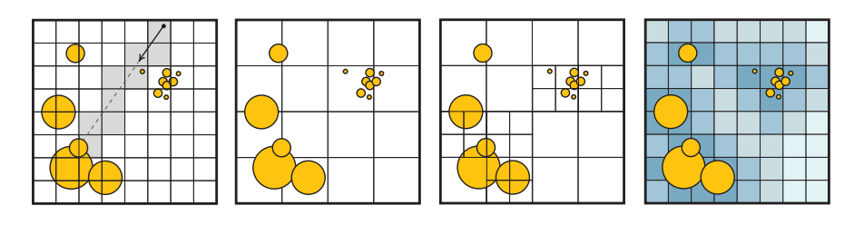

由于场景中可能会包含小而详细的物体，在一些区域中可能会包含许多微小的图元，而在另一些区域中则包含较大且粗糙的图元，因此固定的网格尺寸可能并不适用于所有地方。这种情况被称为“体育场中的茶壶（teapot in a stadium）”问题\[27]，它是指一个复杂的茶壶（注意力的焦点）落入了单个单元格中，因此无法从加速结构中获益。尽管朴素的均匀网格可以进行快速构建，并且遍历方式也十分简单，但是目前在大部分光线追踪中都很少进行使用。有一些改进网格效率的变体结构，这些变体会更加实用。网格可以以一种分层的方式进行嵌套，根据需要使用更加高级的大单元格，来包含更加精细的单元格。两层的嵌套网格在GPU上并行构建的速度特别快\[42]，并且已经在早期的动画GPU实时光线追踪demo中进行了成功应用\[80]。

哈希表可以用来创建一个无限的虚拟网格，其中只有被实际占用的单元格才会将数据存储在内存中（章节25.1.2）。另一种策略是在空单元格中，存储该单元格到最近非空单元格之间的距离，这个系统被称为邻近云（proximity cloud）\[14]。在遍历过程中，这些存储在单元格中的距离，可以让我们在直线步进（line marching）的过程中，跳过那些保证为空的单元格。最近，不规则网格（irregular grid）方法\[64]详细阐述了高效跳过空白空间的想法。在光线追踪的动画场景中，这些方法已经被证明了，它们能够与最先进的空间加速方法相竞争。图26.10展示了这些网格的一些变体。

如果我们将分层网格的想法发挥到极致，我们可以想象拥有尽可能低分辨率的网格；在每个轴上有两个单元格来作为顶层数据结构，并将每个非空单元格递归分割为另一个$2 × 2 × 2$的单元格，这个结构实际上就是一棵八叉树，我们在章节19.1.3中进行了讨论。更进一步，我们可以想象，在分层数据结构的每个层次上，我们都使用一个平面来将单个单元格分割为两个单元格。如果这个平面的选择是任意的，那么就构成了一棵二叉BSP树；如果这个平面被约束为是轴对齐的，那么就构成了一棵k-d树（章节19.1.2）。如果我们在数据结构中的每个层次上，都使用一对轴对齐的平面，而不是使用单个轴对齐的平面，那么我们将会得到一个有界区间层次（bounded interval hierarchy，BIH）树\[84]，它具有与之相关的快速构建算法。

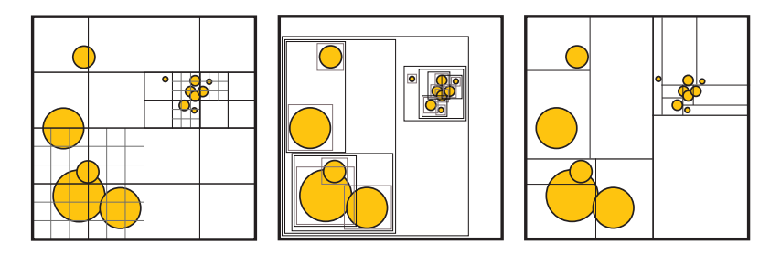

今天最流行的光线追踪加速结构是层次包围体结构（bounding volume hierarchy，BVH），我们在章节19.1.1中进行了介绍，如图26.11所示。例如：在英特尔的Embree内核\[88]、AMD的Radeon-Rays库\[8]、NVIDIA的RT Cores硬件\[58]和OptiX系统\[62]中，都使用了BVH。

#### 空间数据结构的属性

空间数据结构的设计范围很大。我们可以有更深的层次结构，更深的层次结构意味着需要更多的间接遍历，但是可以更好地适应场景中的几何物体；较浅的层次结构虽然不太灵活，但是在内存中的存储会更加紧凑。我们可以有严格的细分方案，这种方案易于构建，每个节点中只需要存储很少的数据；我们还可以使用更具表现力的方案，这种方案在如何划分空间方面具有许多自由度。例如：BVH方案可能在创建之前，就已经知道了具体的内存开销，因此可以进行更少的细分，并且能够更好地跳过空白空间。然而，它们构建起来会更加复杂，可能需要更多的存储空间来对每个节点进行编码。

一般来说，空间数据结构的权衡（trade-off）如下：

-   结构质量（construction quality）。
-   构造速度。
-   更新速度，用于动画场景。
-   运行时遍历效率。

其中结构质量可以大致转换为，我们必须要遍历多少图元和多少单元格，才能找到一个光线交点。构造速度和遍历速度通常取决于给定的硬件。更加复杂的是，所有这些数据结构都允许使用多种遍历算法和构造算法，以及能够对节点进行不同方式的编码（使用不同的压缩方案和内存布局）。此外，空间细分方式中的任何自由度，也意味着存在不同的启发式方法来指导如何对空间进行细分。

如果不事先指定这些参数，那么只对数据结构的性能进行讨论是存在一定误导性的。在实践中，对于静态场景和动态场景而言，最先进的数据结构是不同的；对于动态场景而言，其数据结构的构建算法必须要在严格的时间限制下运行，以免构建过程的开销要比渲染时光线追踪所节省的时间更多。在硬件方面，基于CPU和GPU（高度并行）的算法之间存在着显著差异。基于GPU的最佳实践仍在不断发展，因为相关的GPU架构是最近才出现的，并且随着时间的推移，已经发生了许多的变化\[46]。

最后，我们需要进行追踪的光线细节也十分重要，某些结构在相干光线（coherent ray，例如：相机光线，阴影或者镜面反射）下的表现最好；而其他结构对于非相干、随机散射光线（通常用于漫反射全局光照或者环境光遮蔽方法）的容忍度则要更高。

考虑到上述这些因素，值得注意的是，历史上最先进的光线追踪性能，是通过k-d树，或者BVH（使用AABB）的某种变体来实现的\[83]。从理论上来说，二者之间的主要区别在于，k-d树将空间划分为不相交的单元格，而BVH中的节点通常会发生重叠。这意味着BVH遍历必须在找到一个交点，并且树中没有其他未检查的包围体时才能停止。然而，k-d树在发现一个图元交点时便可以立即停止遍历，因为k-d树可以强制执行严格的、从前往后的遍历顺序。然而k-d树的这种理论优势，并非总是能够实现。例如：BVH可以更加高效地跳过空白区域，并且能够更加紧密地拟合图元，从而能够更快地找到交点，来对无法提前停止遍历的问题进行弥补\[83]。

在实践中，我们对一些用于电影制作\[21, 67]和用于交互式渲染\[8, 58, 62, 88]的渲染器进行了调查，我们没有找到任何目前使用k-d树的渲染器。目前我们调查的所有系统，都以某种形式依赖于BVH来进行通用的光线追踪。

> 在默认情况下，2012年左右的Brazil渲染器在场景中使用了三维和四维的（运动模糊）k-d树。\[28]

对于特定类型的图元或者算法而言，使用其他结构可能会更加高效。例如：点云和光子映射会使用三维k-d树来存储样本；八叉树和网格结构可以用于体素数据。

BVH通常能够很好地拟合场景，并且具有快速且高质量的构造算法，它还可以很容易地处理动画场景，尤其是当动画场景表现出良好的时间一致性时。此外，正如我们将在下一小节中所看到的那样，构造一棵拟合紧凑且深度较浅的BVH树是可能的，它可以使用更少的内存和更少的带宽，来实现良好的场景划分，这是高性能遍历数据结构的关键属性。

#### 构造方案

详细介绍用于光线追踪空间数据结构中的所有算法变体和排列组合，超出了本章节的讨论范围，但是我们可以介绍其中的一些关键思想。有关这些主题的更多信息，详见章节19.1和第25章。

这些空间数据结构的构造算法可以分为物体划分（object partitioning）方案和空间划分（space partitioning）方案。其中物体划分考虑在空间上彼此接近的物体或者图元（例如单个三角形），并将它们聚集在数据结构的同一个节点中。这是一个“自上而下”的过程，我们会在每个步骤中，决定如何将场景物体划分成子集合；或者使用一个“自下而上”的过程（第25章），通过迭代来对场景物体进行聚类。相比之下，空间划分会决定如何将空间划分为不同的区域，并将物体和图元分布到数据结构的最终节点中，这些结构通常是“自上而下”进行构建的。空间划分的构建过程通常要慢得多，很难用于实时渲染，但是它们可以更加高效地投射光线。

空间划分是构造k-d树的最明显方法，但是同样的原理也适用于BVH的构造，例如：Stich等人\[62, 77]的split BVH方案同时考虑了物体划分和空间划分，并允许一个给定物体被多个BVH的叶子节点所引用。与常规的BVH方案相比，这样做可以显著降低光线的发射成本，同时仍然要比构建一个纯空间划分的结构更快，如图26.12所示。

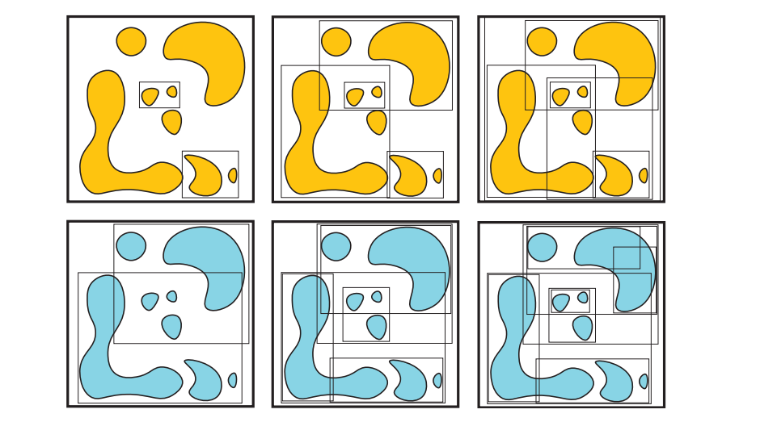

无论使用哪种方案，都必须在构建过程中的每一步做出选择。对于自下而上方案，我们必须决定要将哪些图元进行聚合；而对于自上而下方案，我们必须决定要将用于细分场景的空间分割位置放置在哪里，如图26.13所示。能够最小化总光线追踪时间的方案就是最佳的选择，这反过来又取决于所使用的遍历算法的细节，以及要确定可见性的光线集合。在实践中，想要准确地评估这些选择会对光线追踪产生怎样的影响是不可能的，因此必须采用一些启发式的方法。

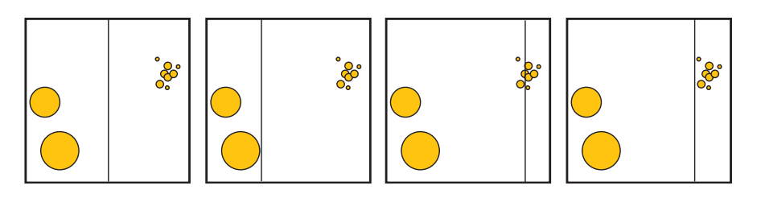

对构造质量进行近似的最常用方法就是表面积启发式（surface area heuristic，SAH）方法\[53]（章节22.4）。它定义了如下的成本函数：

$$
\frac{1}{A_{\text {root }}}\left(C_{\text {node }} \sum_{x \in I} A_{x}+C_{\text {prim }} \sum_{x \in L} P_{x} A_{x}\right),
$$

其中$A_x$是节点$x$的表面积；$P_x$是给定节点中的图元数量；$I$和$L$是树中内部节点和叶子节点（非空）的集合；$C_{node}$，$C_{prim}$是对节点和图元平均相交成本（即平均时间）的估计（详见章节25.2.1）\[5, 26]。SAH可以是包围体、单元格或者其他体积的表面积，这个表面积与一条随机射线击中它的概率成正比。这个方程对图元层次结构的加权概率成本进行了求和，所计算出的成本是一个对该结构效率的合理估计。

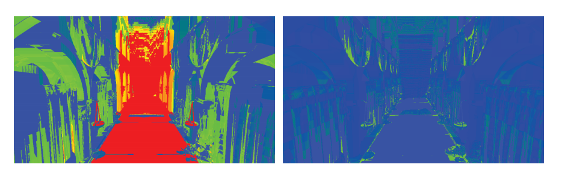

当调整其中的常数时，SAH与追踪随机长射线的实际成本能够很好地相关，并在实践中表现良好，如图26.14所示。但是这些假设并不总是成立的，有时候可能会有更好的启发式方法，特别是如果我们事先知道追踪光线的分布，或者可以对场景中追踪光线的特定分布进行采样时。对于完整构建的空间数据结构，SAH给出了对光线追踪成本的估计，并可以用于在构建过程中对选择进行修正。SAH优化的结构会在一组可能的选择中，奖励那些能够产生包含许多图元的小节点的选择，如图26.13所示。

在实践中，构建SAH最优结构的算法可能会很慢，因此需要使用进一步的近似方法。对于k-d树而言，一种近似的SAH策略是，对固定（少量）划分平面数量的启发式成本进行评估，并在每层的选择中给出最具有最高效结果的平面。这种称为binning的策略也可用于自上向下的快速构建BVH结构\[86]。

对于动画场景而言，构造算法的时间约束是非常严格的，因此可以牺牲一定的树结构质量，来换取更快的构建速度。对于空间划分方案而言，可以使用中间切割\[84]，沿着场景中的最长轴，将空间在中点进行分割；或者是在旋转循环的$x$，$y$，$z$轴序列中，将空间在中点进行分割。

物体划分方案可以更快。Lauterbach等人\[47]引入了线性层次包围体（linear bounding volume hierarchy，LBVH）构造方法，在该方法中，会使用空间填充曲线来对场景中的图元进行排序，这些方法在章节25.2.1中进行了解释，如图25.7所示。这样的曲线具有在空间中定义位置排序的性质，在曲线排序顺序中，相邻点在三维场景中的位置也可能会彼此靠近。即使在GPU等高度并行的处理器上，这种物体排序也可以高效地计算，并用于对相邻的包围体进行聚类，从而自下而上地构建层次结构。2010年，Pantaleoni和Luebke \[23, 63]提出了一种被称为分层线性层次包围体（hierarchical linear bounding volume hierarchy，HLBVH）的改进方法，提高了构造速度和构造质量。在他们的方案中，BVH的顶层节点是使用SAH优化的方式进行构建的，而底层节点的构建方式则类似于原始的LBVH方法。

使用BVH的一个优点在于，该结构所需的最大内存是事前知道的，因为所需要的聚类节点数量有限制的\[86]。然而，从零开始构建空间结构，其时间复杂度在最好的情况下，与图元数量也是线性相关的。每帧都对BVH进行重建，可能最终会成为渲染性能的一个重大瓶颈，尤其是在给定帧中并没有对许多光线进行追踪的情况下。另一种方法是避免对BVH进行重新构建，并针对场景中的运动物体，对空间数据结构进行一定地“调整（refit）”。在BVH的情况下，这种调整操作特别容易实现。首先，使用物体当前的几何图形，针对包含动画图元的叶子节点，重新计算这些叶子节点的包围体。然后再对这个叶子节点的父节点进行检查，如果它不再能够包含这个叶子节点，则将这个父节点进行展开，并在链上对爷爷父节点进行测试。这个过程会一直持续到祖先节点不需要再进行修改位置，或者是到达BVH的根节点为止。检查父节点和叶子节点时的另一个选择是，始终根据其子节点的包围体，来将自身的包围体最小化。这将会提供一个性能更好的树结构，但是相应地也将花费更多的时间。

这种调整方法是十分快速的，但是如果在动画期间有一些物体发生了较大的位移，将会导致空间数据结构的质量下降，这是因为虽然物体在层次结构中仍然聚集在同一个节点内，但是彼此不再靠近，因此相应的包围体会随着时间的推移，逐渐发生膨胀。为了解决这个缺点，可以使用一些迭代算法，来对树结构进行旋转，并逐步提高BVH的质量\[40, 44, 94]。

目前，最先进的并行GPU BVH构建器是treelets方法\[40]，该方法会从一个快速但低质量的BVH开始，并对其拓扑结构进行优化。它可以构建出一棵高质量的树，其质量与split BVH方法相当，但是在现代硬件上的处理速度为每秒数千万个图元，这只比HLBVH慢一点点。

在DXR中所使用的两级层次结构，在动画场景中也经常使用。正如我们章节26.3中所看到的，如果场景中的物体是刚性移动的，那么这些层次结构允许通过动画的矩阵变换，来快速进行重建。在这种情况下，只需要重建顶层结构即可，而不需要对开销巨大的底层结构进行逐物体的更新。此外，如果物体的动画是非刚性的，但是并不会发生显著的位移（例如：树叶在风中摇曳），那么仍然可以在BLAS中使用重整策略，从而避免完全的重建（章节25.7）。然而，两级层次结构的一个问题在于，它们的质量通常不如一次性为整个场景构建的空间数据结构。例如：想象一下，现在有许多物体彼此靠近，每个物体都有自己的BLAS，但是这些BLAS的包围体会在TLAS中发生重叠。当一条光线穿过多个BLAS重叠的空间区域时，必须要对每个BLAS都进行遍历；而为整个场景构建的单一的、统一的空间数据结构，则不会遇到这个问题。为了改善这一问题，Benthin等人\[10]提出了“重新编织（re-braiding）”的两层结构思想，允许不同物体的树结构进行合并，从而提高光线遍历的性能。

#### 遍历方案

与空间数据结构的构造方案类似，人们对光线的遍历算法也进行了大量研究。

将一条光线与一个层次数据结构进行求交，也是树结构遍历的一种形式。从根节点开始，会根据将场景划分为子空间的结构，来对光线进行相交测试。一条光线可能会与多个子空间相交，因此需要访问树结构的多个分支，例如：对于一个二叉BVH，对于给定的树节点，一条光线可能会与0、1或者2个子节点所对应的包围体相交。在k-d树中，每个节点都会与一个平面相关联，这个平面会将空间划分为两部分。如果一条光线与这个平面相交，并且交点位于该节点的边界内部，那么这条光线就需要对两个子空间进行访问。因此，一般来说，每当需要考虑与光线相交的多个子空间时，我们必须决定首先遍历哪个子空间。当没有找到任何一个交点，或者我们需要多个交点的时候，还需要一种方法来进行回溯，并访问其他尚未进行相交测试的子空间。

通常，我们会相对于光线方向，来对节点的子空间进行从前到后的排序，即首先会遍历最近的子空间，然后按照前后顺序，将其他子节点依次压入栈中。如果需要进行回溯操作，则从栈中弹出一个子节点，并从这个节点继续进行遍历。如果我们一次只会追踪一条光线，那么维护这个栈的成本是微不足道的。然而在GPU上，通常我们会同时并行遍历数千条光线，每条光线都需要维护一个属于自己的栈结构，这样做会产生很大的内存流量（memory traffic）开销。

对于k-d树以及其他总是在不相交子空间中划分场景的空间数据结构而言，如果我们愿意支付在到达叶子节点之后，从根结构重新开始遍历的代价，那么想要实现一个无栈（stackless）的光线追踪十分简单\[22, 37]。如果我们总是会首先遍历最近的子空间，并且当我们到达叶子节点但是却无法找到一个光线交点时，我们可以简单地将光线原点移动到与叶子边界最远的交点处，然后对光线进行再次追踪，就好像它是一个全新的光线一样，如图26.15所示。

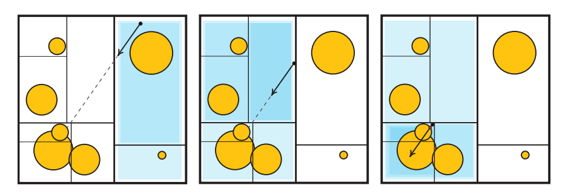

这种策略也称为光线缩短（ray shortening），它并不适用于BVH，因为BVH中的节点可能会发生重叠。将光线原点推进到子树中的节点，可能会完全错过层次结构中应当进行遍历的包围体。Laine \[45]建议在每棵树层级中只保留一个bit，而不是维护一个完整的栈结构，这个bit会编码一个路径，从而将二叉树分成已经处理过的节点与仍然待求交的候选节点。这个方法允许在BVH中重新开始求交测试，前提是每当我们沿着树结构向下遍历的时候，都能为一条光线计算出一致的节点遍历顺序。

如果我们允许在树结构中存储额外的信息，即如果光线错过了给定的节点，则它会指向下一步需要进行遍历的节点，就有可能避免重新进行遍历。这些指针被称为绳索（ropes），同时适用于BVH和k-d树，但是它的存储成本很高，并对所有光线都强制执行固定的光线遍历顺序，也就是说，它不允许按照从前向后的顺序来遍历子节点。Hapala等人\[30]，以及随后的Afra和Szirmay-Kalos \[2]开发了一种算法，同时使用了存储在树中的指针以及一个较小的逐光线数据结构，从而允许二叉BVH的无栈遍历，它能够与基于栈的解决方案保持相同的遍历顺序，并使用回溯来替代完全重启。

在实践中，这些无栈方案可能并不总是要比基于栈的方法更快，即使在GPU上也是如此\[4]，因为它们需要额外的工作来进行重新启动或者回溯操作，同时增加了空间数据结构的内存大小，并且会在某些情况下具有更差的遍历顺序。Binder和Keller \[11]设计了一种具有恒定执行时间的无栈回溯算法，这个算法的性能表现首次在现代GPU上优于基于栈的遍历方法。最近，Ylitie等人\[93]提出了利用压缩方案来执行基于GPU的栈遍历，在很大程度上避免了由于GPU逐光线堆栈记录（bookkeeping）所带来的内存流量开销。这种遍历方法是在一个较宽的BVH上进行的，每个节点可以有两个以上的子节点。作者实现了一种高效的近似排序方案，从而确定从前往后的遍历顺序。此外，节点包围体自身会以压缩形式进行存储，这是另一种利用场景一致性的方法。

### 26.4.2 光线和着色的一致性

即使光线追踪可以计算任意光线的可见性，但是在实践中，大多数渲染算法都会生成光线集合，这些光线集合展示出了不同程度的一致性。最简单的例子就是，使用光线来确定场景中的哪些部分，是针孔相机可以通过屏幕像素看见的。这些光线都具有相同的原点、相机位置，并且只会在所有的可能方向上，跨越一个有限范围的立体角。类似地，用于计算来自无穷小光源的阴影光线也是一致的。即使我们考虑那些从表面反射回来的光线（例如反射光线），它们也会保留部分一致性。例如：想象一下，现在相机发射了两条光线，这两条光线分别对应了屏幕上两个相邻的像素，它们命中了场景中的一个表面，并在完美镜面反射的方向上进行反弹。在通常情况下，这两条光线会击中场景中的同一个物体，这意味着两个命中点在空间中彼此靠近，并且还可能具有相似的表面法线。因此，这两条反射光线将会具有相似的起点和方向，如图26.16所示。

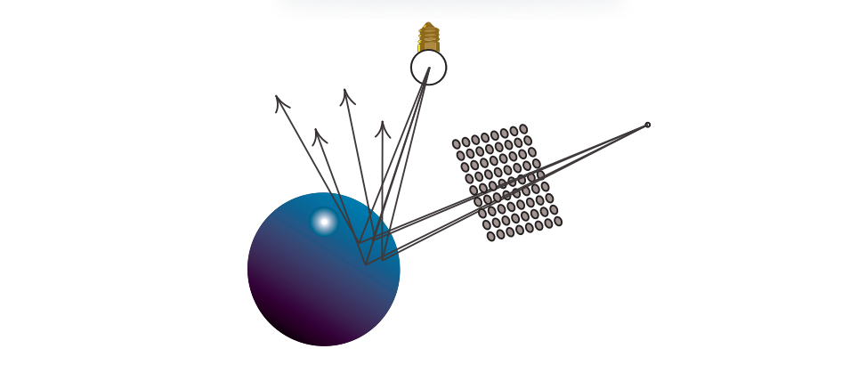

当我们需要从给定的表面点对半球的出射方向进行随机采样时，就会产生非相干（没有一致性）的光线。例如：如果我们想要计算环境光遮蔽和漫反射全局光照效果，就会发生这种情况。对于具有光泽（glossy）的反射光线而言，这些光线会更加一致（聚集在一个较小的立体角内）。一般来说，对于我们需要进行追踪的光线集合，以及我们需要计算着色的命中点上，我们可以假设光线追踪确实会表现出一定程度的一致性，我们可以尝试利用这种光线一致性，来对渲染算法进行加速。

利用光线一致性的最早想法之一，就是将光线聚类在一起，例如：我们可以使用一组平行光线（称为光线束ray bundle）来与场景图元进行相交测试，而不是仅仅使用单条光线。可以利用GPU的光栅化器来执行光线束与场景图元的相交测试，使用正交投影来将每个物体的位置和法线存储到离屏缓冲区中。这些缓冲区中的每个像素，都捕获了单条光线的相交数据\[81]。另一个早期的想法是将光线分组为不同的锥形\[7]，或者是较小的截锥体（frusta，beam）\[32]，用于代表具有相同原点的、无限数量的光线，这些光线只会跨越一组有限的方向。Shinya等人\[71]在他们称为pencil跟踪的系统中，对光束追踪（beam tracing）的思想进行了进一步的探索和推广。在这个方案中，一个“pencil”被定义为包含了可变的光线原点和方向，例如：如果一条光线的方向允许以一定的角度进行变化，那么这样定义的一组光线就构成了一个实心锥体（solid cone）\[7]。

这种方案假定了大面积的连续性。当发现物体的边缘或者大曲率区域时，pencil就会变成一组更紧密的pencil，或者使用单独的光线来捕捉这些特征。在立体角上来计算材质和光照的积分，通常也是十分困难的，由于这些限制因素，因此与pencil相关的方法没有被广泛使用。一个值得注意的例外是体素化几何的锥形追踪，这是一种最近提出的、在GPU上用于近似间接全局照明的技术（章节11.5.7）。

一种更加灵活的、利用光线一致性的方法是，将光线组织成较小的阵列（被称为数据包packet），然后对这些光线进行一起追踪。与刚才的pencil相类似，这些光线集合有时需要进行拆分，例如：如果它们需要进入BVH不同分支的话，如图26.17。然而，由于这些packet只是一种数据结构，而不是几何图元，因此拆分起来要容易得多；我们只需要创建更多的packet，其中每个packet都使用原始光线的一个子集即可。packet追踪\[85]允许我们对空间数据结构进行遍历，并且能够以并行的方式来计算一小组光线与物体的交点，因此它非常适合SIMD计算。在实际的实现中\[88]，会使用固定大小的packet，并根据处理器SIMD指令的宽度进行调整。如果分组中不存在某些光线（例如在拆分之后），那么则会使用一些标志来屏蔽相应的计算。

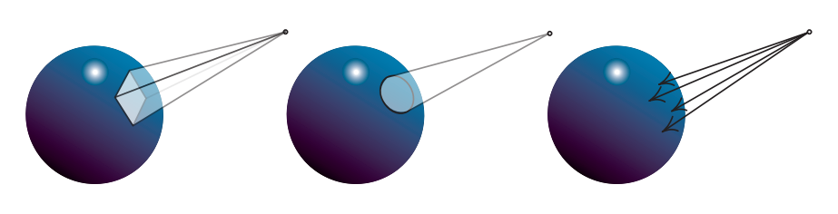

虽然packet追踪可以是非常高效的，甚至最近已经被应用在了要求苛刻的VR应用中\[38]，但是它仍然对光线的生成方式施加了限制。此外，如果光线十分发散的话，那么就需拆分出很多的packet，这会对它的性能产生影响。在理想情况下，即使是非相干的光线追踪，我们也想要利用现代的数据并行架构。

packet追踪的思想是利用SIMD指令，并行地将多条光线与单个图元进行求交。然而，我们当然可以使用相同的指令，并行地将单条光线与多个图元进行求交，这样就不需要维护packet了。如果我们的空间层次结构是使用具有高分支因子的浅层树来构建的（而不是较深的二叉树），那么我们可以通过将单条光线与多个子节点同时进行测试，来进行并行遍历。这些数据结构可以通过将二叉结构部分扁平化来进行构建，例如：如果我们将一个二叉BVH的每个其他层级都进行折叠，那么就可以构建一个编码相同节点的4叉BVH。由此产生的数据结构被称为多层次包围体（multi-bounding volume hierarchy，MBVH），有时也被称为浅BVH（shallow BVH）或者宽BVH（wide BVH）\[15, 19, 87]。

光线追踪的一些应用，例如路径追踪及其变体，这些算法在单条光线上进行工作，无法很容易地生成具有一致性的packet。但是，如果我们观察生成图像所追踪的所有光线，这些限制也并不意味着我们将无法找到任何程度的光线一致性，即光线一致性总是存在的。场景中的许多光线可能会从相似的原点，沿着相似的方向进行运动，即使我们不能对它们进行明确地追踪。在这些情况下，我们可以对要计算可见性的光线进行动态排序，从而创建出可以进行一致处理的光线组。这些想法是由Pharr等人\[65]首创的，他们称之为“记忆相干光线追踪（memory-coherent ray tracing）”，这是一种使用空间细分结构中的节点，来存储批次光线的系统。我们并不会对每条光线都在空间结构中进行遍历，并直到找到一个交点；而是会根据节点中所包含的图元，对每个节点中的光线（如果有的话）进行测试，并且会将那些没有命中的光线传播到对应的邻居节点中。因此，会以广度优先的顺序，来对空间细分层次结构进行遍历访问。

通过使用量化的光线方向和光线原点来计算哈希值，可以避免将光线显式存储在场景的空间数据结构中。然后，我们可以维护一个仍然需要进行处理的光线队列，并根据散列键值来对它们进行排序。这个队列相当于在位置和方向的五维空间上创建一个虚拟网格，然后将这些光线分组到这个网格的单元格中。维护光线队列并对其进行动态排序的想法，被称为光线流式追踪（ray stream tracing）或者光线重排序（ray reordering），并已成功地在CPU和GPU上进行了应用\[46, 82]。

最后，还需要注意的是，许多渲染应用程序是由着色操作所主导的，而不是由可见性操作主导的，这就是如今基于光栅化实时渲染的情况。虽然对相干光线进行追踪，也有助于着色计算的一致性，但是并不能保证着色计算一定是一致的。两条光线可能会在场景中命中彼此接近的表面点，但是这两个着色点可能会分别属于不同的物体，它们需要使用完全不同着色器和纹理。这对于依赖宽SIMD单元，并在wavefront（章节23.2）上同步执行相同指令的GPU而言，尤其具有挑战性。对于给定GPU wavefront中的光线，如果它们需要使用不同的着色逻辑，那么就必须采用动态分支，这样会导致wavefront发散；以及需要使用更大的着色器，更大的着色器通常意味着需要使用更多的寄存器，并导致较低的占用率。

可以对排序进行扩展，从而来解决着色一致性的问题。我们不仅可以在求交的时候使用队列和光线重排序；还可以让光线在命中物体之后，也存储在队列中。然后这些队列可以根据与命中点相关的材质，再次进行排序，然后着色器就可以在具有一致性的批次中进行着色计算。将材质计算与可见性分离的想法被称为延迟着色（deferred shading），这里在光线追踪系统和光栅化系统（章节20.1）中使用了相同的术语，在光栅化系统中，我们通过屏幕空间的G-buffer实现这种解耦。

延迟着色已经成功应用在了离线、产品级的电影路径追踪渲染器中\[18, 48]，它会对数百万条光线进行排序（甚至是核外光线）；以及使用较小的队列，来用于CPU和GPU的光线追踪\[3, 46]。然而，对于实时渲染而言，我们必须记住，即使是在能够通过重新排序来利用一致性的系统中，这些排序操作也会增加显著的开销。此外，如果同一时刻运行的光线数量太少，那么它们之间很可能没有值得利用的一致性。此外，当光线击中场景图元的时候，对材质着色器的计算可能会生成新的光线，这可能反过来又会触发其他着色器的递归执行。因此，在计算新生成光线的结果之前，当前着色器的计算可能还需要暂停。这种行为对着色器的执行顺序进行了限制，减少了动态恢复一致性的机会。

在实践中，我们必须注意，尽量使用那些能够利用光线一致性和着色一致性的渲染算法。即使我们需要使用非一致性的光线，仍然存在一些方法能够最小化应用程序的发散，例如：在环境光遮蔽和其他全局光照效果中，需要对屏幕上每个像素的出射半球方向进行采样。由于这个过程的成本可能会很高，因此一种常见的技术是，我们只在每个像素上采样少量几个样本，然后使用双边滤波（bilateral filtering）来对最终结果进行重建。这通常会导致相邻像素之间的采样方向出现明显不同，即是不一致的。一种优化的实现是，确保采样方向在少量像素上以规则间隔进行重复，并对追踪进行排序，从而使得所有具有相似方向的像素能够被同时处理\[43, 50, 68]。

着色计算可能是发散现象的主要来源，甚至影响要比光线追踪更大，因为我们可能需要根据所击中的物体，执行完全不同的着色器程序。在理想情况下，我们希望避免交错执行复杂的着色计算和光线追踪过程，例如：我们可以预先计算着色，并检索光线命中的缓存结果。其中一些策略已经用在了离线、产品级的路径追踪\[21]以及交互式的光线追踪\[61]中，但是仍然需要更多的研究来推进实时光线追踪技术的发展。一般来说，任何光线追踪应用程序都需要考虑权衡。如果所有光线都相同，那么通常我们可以发射少量的稀疏光线，并利用降噪技术来生成最终图像。然而，对于稀疏且不相干的光线，它们的处理速度较慢，因此有时候发射更多具有较高相干性的光线，总体上的速度会更快。

## 26.5 降噪

使用蒙特卡罗路径追踪进行渲染，会产生带有噪声的图像，如图26.6所示，这些噪声是我们不希望出现的。降噪（denoise）算法的目标是输入一个含有噪声的图像以及其他可选的辅助图像数据，并从中生成一个尽可能与真实图像类似的新图像。在本小节中，我们会以一种非正式的方式来使用“类似（resemble）”一词，因为相较于充满噪声的图像区域，稍微模糊的图像区域在视觉的效果上会更好。降噪对于实时光线追踪而言尤其重要，因为我们通常只能负担得起每个像素发射少量几条光线，这意味着渲染出来的图像可能会充满噪声。例如：图26.22中的PICA PICA图像使用了每像素大约2.25条光线进行渲染\[76]。降噪的概念如图26.18所示。由于我们可以在降噪器上添加一个反馈回路（feedback loop），如图26.18所示，因此时域抗锯齿（章节5.4.2）可以被认为是一种基本的降噪算法。

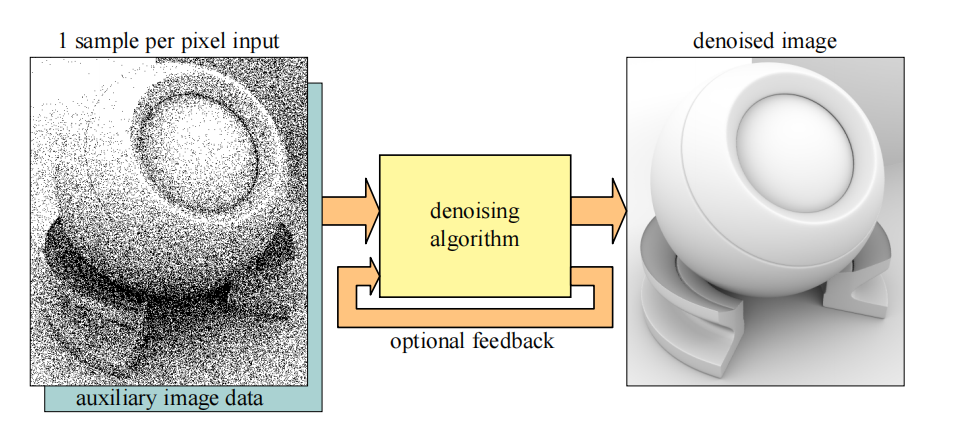

大多数降噪技术可以使用一种简单的方式进行表示，即当前像素周围颜色的加权平均值，我们将当前像素的标量值记为$p$。那么这个加权平均值可以表示为\[12]：

$$
\mathbf{d}_{p}=\frac{1}{n} \sum_{q \in N} \mathbf{c}_{q} w(p, q)
\tag{26.3} 
$$

其中$\mathbf{d}_{p}$是像素$p$降噪后的颜色值，$\mathbf{c}_{q}$是当前像素周围（包括$p$）的噪声颜色值，$w(p, q)$是权重函数。该方程使用了$p$附近的$n$个像素，这个像素集合称为$N$，这个区域通常是正方形的。我们还可以对权重函数进行扩展，让它能够使用来自前一帧的信息，例如$w\left(p, p_{-1}, q, q_{-1}\right)$，其中下标$−1$代表了来自前一帧的信息，例如：如果需要的话，权重函数可以访问法线$\mathbf{n}_{p}$和前一帧中的对应颜色值$\mathbf{c}_{p-1}$。图24.2、图24.3、图26.19、图26.20和图26.21展示了降噪的例子。

在使用基于光线跟踪算法来进行真实感的实时渲染中，降噪已经成为了一个重要课题。在本小节中，我们将会简要介绍一些重要的工作，并介绍一些可能有用的关键概念。我们推荐将Zwicker等人\[97]的调研来作为了解更多信息的良好出发点。接下来，我们将重点介绍适用于低样本数量的降噪算法和相关技巧，所谓低样本数量，即每个像素只有一个或者少量几个样本。

为了创建一组没有噪声的渲染目标，我们可以渲染一个G-buffer（第20章），来作为降噪的辅助图像数据，这是十分很常见的\[13, 69, 76]。光线追踪可以用来生成噪声阴影、光泽反射和间接光照等效果。一些方法中所使用的另一个技巧是，将直接光照和间接光照分开进行降噪处理，因为它们具有不同的属性，例如：间接光照通常是相当平滑的。为了增加降噪过程中所使用的样本数量，通常还会使用某种时间积累或者时域抗锯齿（章节5.4.2）。另一个很好的近似是，对有时被称为无纹理光照（untextured illumination），或者光照和纹理分离的东西进行过滤\[96]。为了解释这是如何进行工作的，让我们回顾一下渲染方程（方程11.2）：

$$
L_{o}(\mathbf{p}, \mathbf{v})=\int_{\mathbf{l} \in \Omega} f(\mathbf{l}, \mathbf{v}) L_{o}(r(\mathbf{p}, \mathbf{l}),-\mathbf{l})(\mathbf{n} \cdot \mathbf{l})^{+} d \mathbf{l}
\tag{26.4} 
$$

为了简单起见，这里省略了自发光项$L_e$。同时这里我们只处理漫反射项，尽管类似的过程也可以应用于其他项。接下来，我们计算一个反射率项$R$，它本质上就是一个漫反射着色项再乘以纹理（在表面被纹理化的情况下）：

$$
R \approx \frac{1}{\pi} \int_{\mathbf{l} \in \Omega} f(\mathbf{l}, \mathbf{v})(\mathbf{n} \cdot \mathbf{l})^{+} d \mathbf{l}
\tag{26.5} 
$$

然后无纹理光照$U$可以表示为：

$$
U=\frac{L_{o}}{R}
\tag{26.6} 
$$

也就是说，这里的纹理项已经被分离了，因此$U$应当只包含光照信息。因此，渲染器可以使用渲染方程来计算$L_o$，并执行一次纹理查找和漫反射着色来获得$R$，这样我们就获得了无纹理光照$U$。然后我们可以将这一项降噪为$D$，然后最终的着色约等于$D R$。这样就避免了在降噪算法中对纹理进行处理，这是十分有利的，因为纹理中通常会包含高频内容，例如边缘等。Heitz等人\[35]所做的工作也类似于这个无纹理照光照的技巧，他们将最终图像拆分成一个噪声的阴影项，以及面光源的解析着色项；并对阴影项进行降噪处理，最后再将图像进行重新组合。这种类型的拆分通常被称为比率估计器（ratio estimator）。

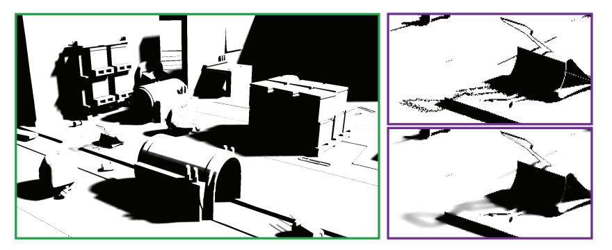

可以使用时空方差引导滤波（spatial-temporal variance-guided filtering，SVGF）\[69]来实现对软阴影的降噪，例如SEED \[76]就使用了这个方法，如图26.19所示。SVGF最初的目的是：针对每个像素一个样本（one-sample-per-pixel，1spp）的路径追踪图像进行降噪。即使用G-buffer来获得第一次的可见性，然后在第一次和第二次命中场景的时候，发射一条次级光线和阴影光线。其总体思路是使用时间积累（章节5.4.2）来增加有效的样本数量，并使用空间中的多pass模糊处理\[16, 29]，其中模糊核的具体尺寸由噪声数据的方差估计所决定。

随着所使用样本数量的增加，方差可以进行增量计算，从而包含更多的样本。首先，计算差值的平方和：

$$
s_{n}=\sum_{i=1}^{n}\left(x_{i}-\bar{x}_{n}\right)^{2}
\tag{26.7} 
$$

其中$\bar{x}_{n}$是前$n$个数字的平均值。方差为：

$$
\sigma_{n}^{2}=\frac{s_{n}}{n}
\tag{26.8} 
$$

现在，假设我们已经使用了$x_{1}, \ldots, x_{n}$计算了$s_n$，现在我们又获得了一个心样本$x_{n+1}$我们想要将其包含在方差计算中。可以使用下列方程来更新求和：

$$
s_{n+1}=s_{n}+\left(x_{n+1}-\bar{x}_{n}\right)\left(x_{n+1}-\bar{x}_{n+1}\right)
\tag{26.9} 
$$

然后再使用方程26.8来计算$\sigma_{n+1}^{2}$。在SVGF中，会使用这样的方法来估计随着时间变化的方差，但是如果检测到了一个解除遮挡（disocclusion）（译者注：即上一帧被遮挡的表面，这一帧出现在了画面中），这会使得时间方差变得不再可靠，此时会切换到使用空间估计。对于软阴影的降噪，Llamas和Liu \[51, 52]使用了一个可分离的交叉双边滤波器（章节12.1.1），该滤波器的权重和半径都是可变的。

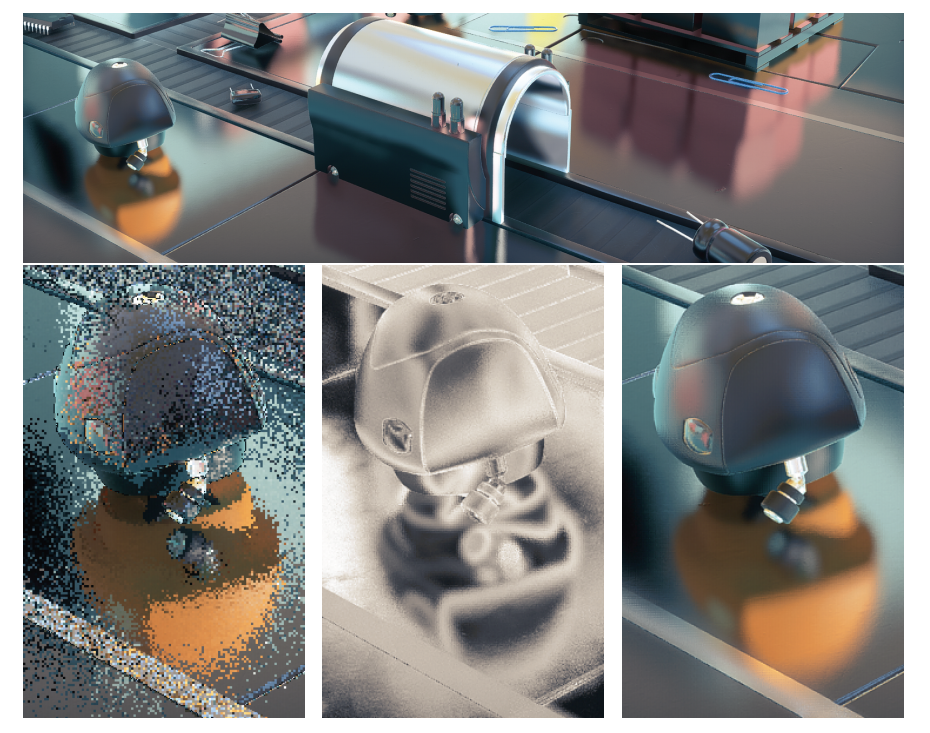

Stachowiak提出了一个完整的反射降噪管线\[76]，图26.20展示了一些示例。首先渲染一个G-buffer，并从中发射光线。为了减少追踪光线的数量，只会在每$2 × 2$像素的反射点处，发射1条反射光线和1条阴影光线；然而，会在全分辨率下进行图像重建。这里的反射光线是随机的，并进行了重要性采样。这里的“随机（stochastic）”意味着，随着更多随机生成光线的加入，最终会收敛到正确的结果。“重要性采样（importance sampled）”意味着会对最终结果预期更加有用的方向发射光线，例如：向着BRDF的峰值方向发射光线。然后使用类似于屏幕空间反射\[75]（章节11.6.5）的方法，来对图像进行过滤，同时上采样到完整的图像分辨率，这个滤波器也是一个比率估计器\[35]。这个技术会与时间累积、一个双边清理pass以及最后的TAA相结合。Llamas和Liu提出了一种基于各向异性滤波核的不同反射解决方案。

为了开发滤波方法和自适应采样技术，Metha等人\[54,  55, 56]采用了一种基于傅里叶分析（Fourier analysis）的光线传输理论方法\[17]。他们开发了轴对齐的滤波器，相较于更加准确的剪切滤波器（sheared filter），它的计算速度要更快，这样做可以带来更高的性能表现。有关更多信息，请参阅Metha的博士论文\[57]。

对于环境光遮蔽（AO）效果，为了提高效率，Llamas和Liu \[51, 52]使用了一种使用可分离的交叉双边滤波器（章节12.1.1）来实现轴对称滤波核\[54]。这个滤波核的尺寸是由在追踪AO射线时，发现到物体的最小距离来决定的。当遮挡物较近时，滤波器的尺寸就较小；当遮挡物较远时，滤波器的尺寸就较大。这种关系可以为较近的遮挡物提供更加明显的阴影，而当遮挡物距离较远时，可以提供更加平滑、更加模糊的阴影效果，如图26.21所示。

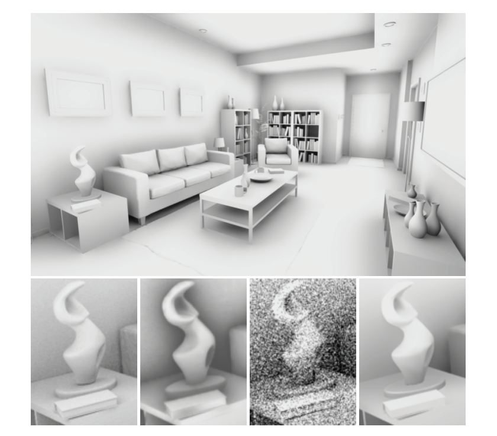

有几种方法可以对全局光照效果进行降噪\[13, 51, 55, 69, 70, 76]。对于不同类型的效果，也可以使用专门的过滤器，这就是寒霜引擎和SEED \[9, 36, 76]的研究人员所采用的方法，如图26.22所示。

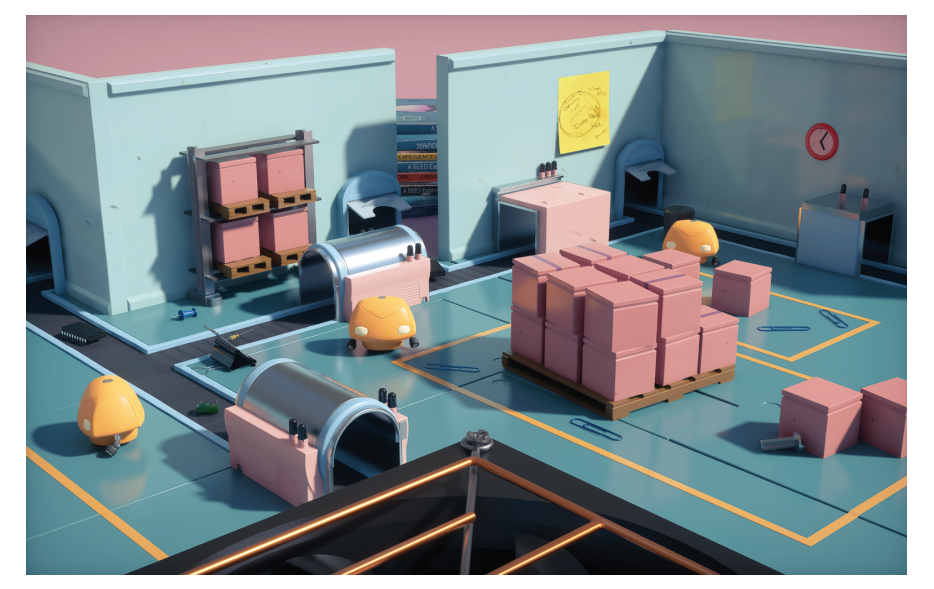

寒霜引擎的实时光照贴图预览系统\[36]，依赖于基于方差的降噪算法。光照贴图中的纹素会存储累积下来的样本贡献，并对它们的方差进行追踪。当新的路径追踪结果出现，并在呈现给用户之前，会根据每个纹素的方差，来对光照贴图进行局部模糊处理。这种基于方差的模糊类似于SVGF \[69]，但它并不是分层的，从而避免了属于不同网格的光照贴图元素相互泄漏。在进行模糊处理的时候，只有来自相同光照贴图元素的样本，才会使用逐纹素的索引被模糊在一起。为了获得无偏的收敛结果，原始的光照贴图将会保持不变。

另一种选择是在纹理空间中来执行降噪\[61]。它要求所有表面位置都具有唯一的$uv$空间值，然后在表面命中点的纹素处进行着色。纹理空间中的降噪可以简单地对具有相似法线的纹素，对其着色结果进行平均，例如在一个$13 × 13$的区域中。Munkberg等人是这样设计的，如果$\cos \theta > 0.9$，就将该纹素纳入平均处理，其中$\theta$是待降噪纹素上的法线与待包含纹素上法线之间的夹角。在纹理空间执行降噪的其他一些优点是，在纹理空间中的时域平均是十分直接的，可以通过在一个较粗的层级上计算着色，从而降低着色成本，并且着色计算可以平摊在若干个帧上。

到目前为止，我们一直假设场景中的物体是静止的，并且摄像机也没有发生移动。但是，如果包含了运动情况，并且图像在渲染的时候使用了景深效果，那么深度和法线中也可能会存在噪声。对于这些情况，Moon等人\[60]开发了一种各向异性滤波器，可以逐像素地计算世界位置样本的协方差矩阵（covariance matrix），并使用这个协方差矩阵来估计每个像素上的最佳滤波参数。

通过使用深度学习算法\[24, 25]，可以利用游戏引擎或者其他渲染引擎生成的大量数据，并使用这些数据来训练神经网络，从而生成降噪图像。这个想法是首先建立一个卷积神经网络（convolutional neural network，CNN），然后使用噪声图像和无噪声图像来对网络进行训练。如果做得好的话，这个网络将会学习到大量的权重，它可以在随后的推理步骤中，在不需要知道任何额外的无噪声图像数据的前提下，使用这些权重来对噪声图像进行降噪。Chaitanya等人\[13]在编码管线（encoding pipeline）的所有步骤中，都使用一个带有反馈回路的卷积神经网络。添加这些是为了增加时域稳定性，从而减少动画期间的闪烁。即使没有干净的参考数据，也可以使用（不相关的）噪声图像来对降噪器进行训练\[49]。这样做可以使得训练过程更加简单，因为不需要生成ground truth图像。

很明显，降噪是真实感实时渲染中的一个重要主题，并且它将继续是，在这一领域中将会继续进行更多的研究。

## 26.6 纹理过滤

我们在章节3.8和章节23.8中介绍过，光栅化会对$2×2$一组（称为quad）的像素进行着色处理。这样做是为了估计纹理足迹（texture footprint），计算梯度信息，并在mipmap纹理硬件单元中进行计算和使用。对于光线追踪而言，情况就有所不同了，光线通常是相互独立发射的。我们可以想象这样的一个系统，当每条眼睛光线与三角形平面相交的时候，还会有另外两条光线与这个三角形平面相交，其中第一条光线会在水平方向上偏移一个像素，第二条光线会在垂直方向上偏移一个像素。在许多情况下，使用这种技术可以生成准确的纹理滤波器足迹，但是它仅仅适用于眼睛射线。然而，如果现在相机正在观察一个反射表面，并且反射光线击中了一个具有纹理的表面，此时会发生什么呢？在这种情况下，理想的做法是执行一个过滤的纹理查找，这里所说的过滤，需要同时考虑反射的性质和光线传播的距离。这个做法同样适用于折射表面。

Igehy \[39]为这个问题提供了一个复杂的解决方案，他使用了一种叫做光线微分（ray differential）的技术。每条光线都需要存储：

$$
\left\{\frac{\partial \mathbf{o}}{\partial x}, \frac{\partial \mathbf{o}}{\partial y}, \frac{\partial \mathbf{d}}{\partial x}, \frac{\partial \mathbf{d}}{\partial y}\right\}
\tag{26.10} 
$$

这些附加数据会与光线一起进行存储。回顾一下，$\mathbf{o}$是光线原点，$\mathbf{d}$是光线方向（方程26.1）。由于原点$\mathbf{o}$和方向$\mathbf{d}$都包含三个分量，因此上面的光线微分需要$4 × 3 = 12$个额外的数字来进行存储。当发射眼睛光线时，$\partial \mathbf{o} / \partial x=\partial \mathbf{o} / \partial y=(0,0,0)$，因为此时光线是从单个点发射的。然而，$\partial \mathbf{d} / \partial x$和$\partial \mathbf{d} / \partial y$将会模拟每条光线通过像素时的扩散程度。当光线从一个点转移到另一个点时，需要对光线微分进行更新。此外，当光线微分被反射和折射时，Igehy推导了光线微分会如何发生变化的方程；并且对于具有插值法线的三角形，Igehy还推导了微分法线的方程。

另一种更加简单的方法是基于锥形追踪，它由Amanatides在1984年首次提出\[7]。这项工作的重点在于对几何图形进行抗锯齿，但他简要地提到，光线锥（ray cone）也可以用于光线追踪中的纹理过滤。Akenine Moller等人\[6]提出了一种与G-buffer一起实现光线锥的方法，该方法还考虑了第一次命中时的曲率。滤波器的足迹取决于到命中点的距离、光线的扩散角度、命中点的法线和曲率等。然而，由于这个曲率信息只能在第一次命中时提供，因此较深的反射可能会出现锯齿。他们还提出了几种与G-buffer渲染相结合的光线微分方法，并对这些方法进行了比较。

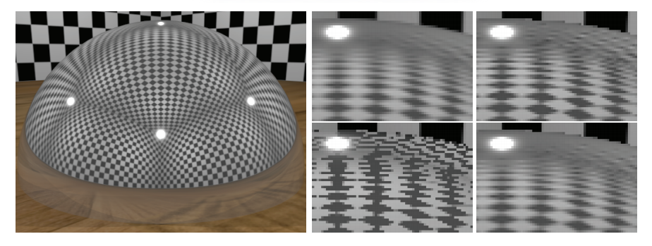

图26.23展示了四种不同的纹理过滤方法。使用第0层级的mipmap（即没有mipmap）会导致严重的锯齿。光线锥为这个场景提供了稍微尖锐的结果，而光线微分则提供了更加接近的ground truth结果。光线微分通常能够更好地估计纹理足迹，但有时也可能会过度模糊。根据他们的经验，光线锥可能会发生过度模糊，也可能会发生模糊不足。Akenine-Moller等人提供了用于光线追踪纹理过滤的光线微分实现和光线锥实现。

## 26.7 推测

由扩展API（章节26.2）提出的新类型着色器，允许复杂的形状求交和材质表示。对追踪进行光线的相关能力，导致了它在网格渲染中的明显应用，例如：表面光照，阴影，反射，折射和路径跟踪全局光照等。

跳出常规思维（thinking outside the box），这些功能可以实现在API设计阶段没有考虑到的新情况。在不久的将来，我们将会看到开发者们究竟能够想出什么令人兴奋的东西。光线生成着色器会成为新的计算着色器吗？本小节将对此进行讨论，并一些可能性进行探索。

在降噪算法的帮助下（章节26.5），新的光线追踪功能应该可以实时渲染更加高级的表面，以及更加复杂的光照。其中一个改进就是使用光线追踪来计算场景中的所有反射，而不是使用屏幕空间反射，例如在游戏《战地5》中。这样做可以产生更好的接地物体（grounded object），并可以对任何形状网格上的镜面反射和遮挡情况进行改善。诸如屏幕空间反射这样的技术之所以会有效，部分原因是因为对假设进行了简化，例如：表面上的反射效果是围绕主反射方向轴向对称的。当反射样本在BRDF半球上的分布更加复杂时，光线追踪能够给出更加精确的结果。

次表面散射是另一种可以使用光线追踪来更好模拟的相关现象。第一个版本的次表面散射已经通过使用新的API特性实现了，通过对网格内部的散射光线进行追踪，在纹理空间中对来自多个方向的样本进行时域累积，并使用一些降噪算法\[9]。总体而言，阴影、间接光照和环境光遮蔽也将受益于光线追踪，从而使得任何网格在场景中看起来更加接近真实结果\[35, 51]。

参与介质的应用（第14章）在实时应用程序（例如游戏）中变得越来越重要。体渲染未来将会如何发展，也许会与通常基于体素和光线步进的方法有所不同，这值得密切关注。可能会出现使用光线追踪，并依赖Woodcock跟踪（tracking）\[95]进行重要性采样，并结合一些降噪过程的新方法。

类广告牌的渲染方式（第13章）在实时应用中应用广泛。为一个视图渲染粒子物体，这本身就是一个挑战。为了获得正确的透明度效果，我们需要对透明物体进行排序；对于较大的粒子而言，过度绘制也是一个问题，并且还需要考虑光照性能和光照质量之间的权衡。由于粒子通常都会面向相机，因此在反射中进行渲染也是一个挑战。当一个粒子可以被来自任意方向的光线命中时，它应当如何在路径追踪框架中进行对齐呢？它是否应当具有一个新的表示方法，并利用相交着色器，始终将每个广告牌与入射光线对齐？最重要的是，由于粒子固有的动态特性，因此这些动画粒子将不得不在每一帧的加速结构中，来对它们的表示结构进行更新（章节26.3）。这种更新可能会发生在几个大粒子上，或者是许多小粒子上，例如：烟雾或者火花，对于这些粒子效果而言，如何对空间加速结构进行优化，从而对世界进行快速追踪是一项挑战。

与阴影采样类似，投射光线的能力也为更加精确的求交和可见性查询打开了大门，例如：可以更加精确地处理粒子碰撞问题。通常的屏幕空间近似存在分辨率依赖性的问题，并且在某些情况下，对前景深度层厚度的计算可以防止粒子落在这一层的背后。整个刚体物理系统可以在GPU上，使用光线投射进行实现吗？此外，光线追踪还可以用于查询两个位置之间的可见性。这种能力对于音频混响模拟（audio reverb simulation）、游戏玩法（gameplay）和AI系统中元素与元素之间的可见性可能会非常有价值。

光线追踪API添加了一种新的着色器类型，我们在前面没有提到，它就是可调用着色器（callable shader）。它能够以可编程的方式，从一个着色器中生成其他的着色器工作，这个功能以前只有在CUDA中才能实现\[1]。这种类型的着色器目前还不可用，只能在光线追踪着色器设置中进行使用。根据这个着色器的实现方式以及它的性能，这个功能很可能会成为一个非常有价值的通用新工具，特别是如果它可以用于着色器的其他阶段的话，例如计算。举个例子：一个可调用着色器可以移除许多在引擎中生成的着色器排列组合（shader permutation，译者注：感觉类似于着色器变体），从而提高性能，例如：这里的每个排列都代表了一组针对场景设置进行优化的后处理着色器（post-process shader）。在可调用着色器中包含可选的设置依赖代码（setting-dependent code），可以减少由着色器排列所带来的内存占用，这个内存占用是不可忽略的，如果我们必须要处理5个性能关键的设置选项，那么比起使用$2^5 = 32$个着色器，我们现在只需要分配一个着色器即可，并根据需要来调用5个子着色器。它也可以使用由艺术家创建的shader graph，这不仅仅适用于今天通常所做的材质定义，而且可以以一种更加模块化的方式，应用于渲染链中的每个部分：应用于透明网格的贴花体积、光照功能、参与介质材质、天空、以及后处理等。

让我们以透明网格上的贴花体积为例，它们通常是由艺术家创作的shader graph来进行定义的。通过对与贴花体积相交的G-buffer像素内容进行修改，可以直接将它们应用于延迟上下文中的不透明网格上（章节20.2）。在前向渲染或者光线追踪过程中，它需要一个复杂的着色器，这个着色器需要能够对项目中由艺术家创作的、所有不同类型的贴花shader graph进行计算。这种巨大的着色器是不切实际的。通过使用可调用着色器，可以为每个与世界空间位置相交的贴花体积调用对应的着色器，并让它对着色所考虑的材质进行修改。使用这个功能将取决于具体实现和用法：一个着色器能够被调用，并返回任意数据结构吗？可以同时调用多个着色器吗？着色器参数是如何进行传递的？它们必须通过全局内存进行传递吗？派生着色器是否可以被限制在一个计算单元上，以便能够通过共享内存进行通信吗？这会是一种“即发即弃（即没有返回值）”的调用吗？

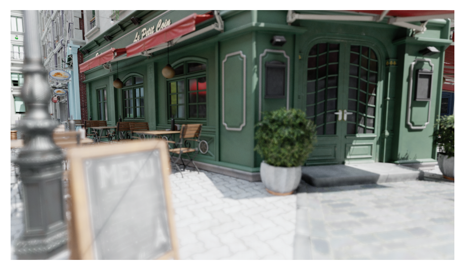

毫无疑问，这些问题的答案将会推动进一步的创新，并在不久的将来实现。最后，图26.24展示了一个使用DXR进行渲染的结果，另一个结果就是本书封面。前途一片光明（The future looks bright）！

## 补充阅读和资源

请参阅本书的在线网站[realtimerendering.com](http://xn--realtimerendering-5960a1655ay9c4t0i1ocf66apqyyi6e.com "realtimerendering.com")，从而了解该领域中的最新信息和免费软件。Shirley关于光线追踪的迷你书籍（光追周末系列）\[72, 73, 74]，是对不同阶段光线追踪的优秀介绍，现在提供了免费的pdf。产品级光线追踪的最佳资源之一，就是是Pharr等人\[66]的《Physically Based Rendering》，现在也是免费的。Suffern的书籍《Ray Tracing from the Ground Up》\[79]相对较早，但是内容广泛，并对实现方面的问题进行了讨论。对于DXR的介绍，我们推荐Wyman等人\[91]的SIGGRAPH 2018课程以及Wyman的DXR教程\[92]。想要了解更多有关产品级渲染中的路径追踪，请参阅Fascione等人\[20, 21]最近的SIGGRAPH课程。在ACM TOG的特刊\[67]中，有着更多关于路径跟踪和其他产品级渲染技术的文章。Zwicker等人\[97]在一份调研中详细讨论了降噪技术，尽管这份资料来自于2015年，它并不会涵盖最新的研究进展。
