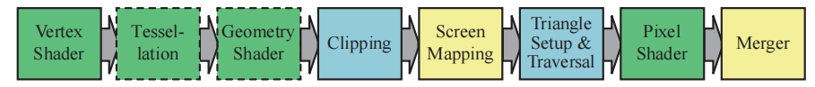
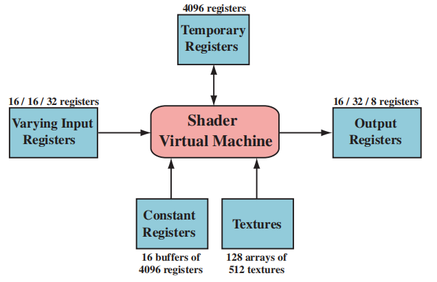
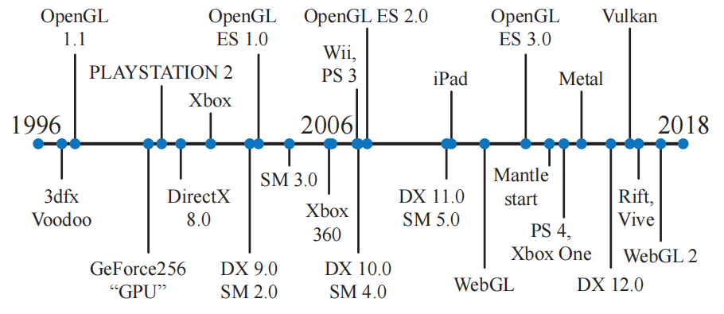
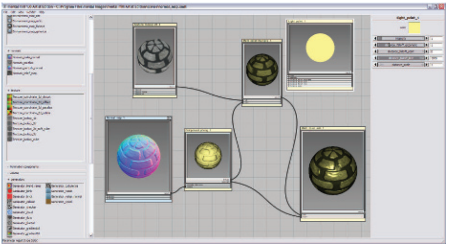
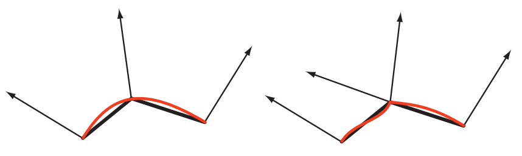
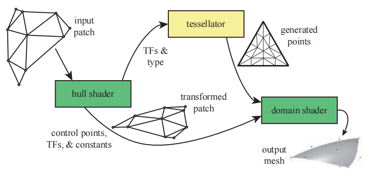
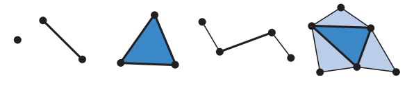
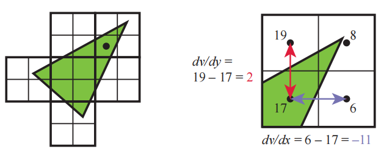

# Chapter 3 The Graphics Processing Unit 图形处理单元

## 目录

-   [3.1 数据并行结构](#31-数据并行结构)
-   [3.2 GPU 管线概述](#32-GPU-管线概述)
-   [3.3 可编程着色器阶段](#33-可编程着色器阶段)
-   [3.4 可编程着色及其API的演变](#34-可编程着色及其API的演变)
-   [3.5 顶点着色器](#35-顶点着色器)
-   [3.6 曲面细分阶段](#36-曲面细分阶段)
-   [3.7 几何着色器](#37-几何着色器)
    -   [3.7.1 流式输出](#371-流式输出)
-   [3.8 像素着色器](#38-像素着色器)
-   [3.9 合并阶段](#39-合并阶段)
-   [3.10 计算着色器](#310-计算着色器)
-   [补充阅读和资源](#补充阅读和资源)

> Jen-Hsun Huang——“The display is the computer.”

> 黄仁勋——“显示器就是电脑”。（Nvidia创始人兼CEO；1963—）

在历史上，图形加速首先开始于三角形上的像素扫描线颜色插值，并在屏幕上显示这些颜色值。它包括访问图像数据的能力，这允许将纹理运用在表面上；添加用于插值和深度测试的硬件，这提供了内置的可见性检查。由于这些过程在渲染管线中被大量使用，因此它们都需要专门的硬件单元来进行执行，从而提高性能表现。在多次迭代的过程中，渲染管线增加了很多部分，并且其中的每个部分也增加了更多的功能。这些专用的图形硬件与CPU相比，唯一的优势就是速度，在实时渲染中，速度是至关重要的。

在过去的二十年中，图形硬件发生了不可思议的变化。第一个包含硬件顶点处理的消费级芯片（NVIDIA GeForce256）于1999年发布。NVIDIA创造了图形处理单元（graphics processing unit，GPU）这个术语，用来区别GeForce256和过去所使用的光栅化芯片，并将这个术语沿用了下来。在接下来的几年时间里，GPU从一个可配置的复杂固定功能管线，发展为一个高度可编程的“白板”，开发者可以在这个白板上实现自己的图形算法。各种可编程的着色器（shader）是控制GPU的主要手段。为了获得更高的效率，渲染管线中的有些部分仍然只是可配置的，而并非是可编程的，但是GPU的整体发展趋势是可编程性和灵活性\[175]。

GPU专注于一组高度并行化的任务，从而获得了很高的处理速度，它使用专门的硬件来实现z-buffer，来能够快速访问纹理图像和其他缓冲区，还可以快速寻找哪些像素被一个三角形所覆盖。我们将在第23章，讨论这些硬件单元是如何实现各自的功能的。目前更重要的是，需要尽早了解GPU是如何实现可编程着色器的并行化处理的。

在章节3.3中，我们解释了着色器是如何进行工作的，而现在我们需要知道的是，着色器核心是一个用于执行某些相对独立任务的小型处理器，例如将一个世界空间中的顶点位置，变换到屏幕空间中；或者是计算一个像素（被三角形覆盖）的颜色。由于每帧都会有成千上万的三角形被发送到屏幕上，因此每秒可能会有数十亿次的着色器调用（shader invocation），即运行着色器程序的单独实例。

首先我们需要知道一点，由于在存储中访问数据需要花费一定时间，因此延迟是所有处理器都会面临的一个问题。考虑延迟的一个基本方法是，数据距离处理器越远（物理意义上的距离），访问所需要等待的时间就越长，章节23.3详细讨论了这个延迟问题。相对于本地寄存器而言，访问内存碎片中的信息则需要花费更多的时间，章节18.4.1对内存访问进行了深入讨论。这个问题的关键在于，等待数据检索意味着此时处理器处于停滞状态，这会降低性能表现。

## 3.1 数据并行结构

不同的处理器架构使用了不同的策略来避免停滞。CPU经过优化，可以处理大量的数据结构和大型代码段，CPU一般都具有多个处理器，每个处理器都以串行的方式来执行代码，但是有限的SIMD向量处理是一个小例外。为了最小化延迟所带来的影响，CPU芯片中的大部分面积都是高速的本地缓存，这些缓存中存满了接下来可能会用到的数据。CPU还会使用一些智能技术来避免停滞，例如分支预测（branch predication）、指令重排序（instruction reordering）、寄存器重命名（register renaming）和缓存预取（prefetching）等\[715]。

而GPU则采用了不同的策略，GPU芯片中的很大一片面积都是大量的处理器，也叫做着色器核心（shader core），GPU芯片中通常会有数千个着色器核心。GPU是一个流处理器，它会依次处理有序的相似数据。由于数据的相似性（例如一组顶点或者像素），因此GPU可以通过大规模并行的方式来处理这些数据。另一个重要因素是，这些着色器调用都是尽可能独立的，即它们不需要来自邻近调用的信息，也不需要共享可写入的内存位置。有时候为了使用一些新功能，这个规定会被打破，但是这种例外会带来潜在的额外延迟，因为一个处理器可能会需要等待另一个处理器执行结束之后，才能开始工作。

GPU专门对吞吐量（throughput）进行了优化，吞吐量指的是数据能够被处理的最大速度。但是这种快速处理是有代价的，由于用于缓存和控制逻辑的芯片面积较少，因此每个着色器核心的延迟，通常都会比CPU处理器所遇到的延迟要大\[462]。

假设一个模型网格需要被光栅化，它生成了两千个需要进行处理的片元，那么像素着色器将会被调用两千次。想象现在我们有一个世界上性能最弱的GPU，它只包含了一个着色处理器（shader processor）。它首先会为两千个片元中的第一个执行着色器程序，这个着色处理器会对存储在寄存器中的值进行一些算术操作。这里的寄存器是本地的，它的访问速度很快，因此处理器不会发生停滞。然后处理器遇到了一个访问纹理的指令，例如：对于一个给定的表面位置，程序需要知道纹理上对应位置的像素颜色，而这个纹理是一个独立的资源，并不是像素着色程序本地内存中的一部分，因此可能会涉及到访问纹理的操作。读取内存数据需要花费成百上千个时钟周期，而在此期间GPU处理器将不会进行任何操作。此时处理器将会停滞，并等待这个纹理颜色值的返回。

为了让这个弱鸡的GPU变得更好一点，我们为每个片元的本地寄存器都提供了一小片存储空间。现在这个着色处理器不会在访问纹理的时候发生停滞了，而是会进行切换并执行另一个片元的着色器程序，即两千个片元中的第二个。这个片元切换的过程是很快的，除了需要注意第一个片元当前执行的是哪个指令之外，不会有其他任何影响。现在处理器会执行第二个片元的着色器程序，与第一个片元一样，这里进行了一些相同的算术函数，然后会再次遇到这个纹理访问的问题，然后着色器核心会再次切换到第三个片元的着色器程序。最终，所有2000个片元都会以这种形式依次进行处理，然后着色处理器会返回到第一个片元，这时已经获取到了纹理的颜色，因此着色器程序可以继续进行执行。处理器会以这种方式继续执行，直到遇到另一个会导致停滞的指令，或者是程序执行完成。在这种执行方式下，处理单个片元会花费更长的时间，但是整体的片元执行时间将会大大减少。

在这种架构中，当遇到会令着色处理器停滞的指令时，我们通过切换并执行其他片元程序的方式，来让GPU时刻保持忙碌，从而避免延迟。更进一步，GPU可以将指令执行的逻辑与数据分离开来，这种设计叫做单指令、多数据（single instruction，multiple data，SIMD），这种设计会在固定数量的着色器程序上，以一个固定的步长来执行完全相同的指令。与使用一个独立的逻辑单元和调度单元来执行每个程序相比，SIMD的优势在于，可以使用更少硅芯片（也意味着更小的功耗）来用于处理数据和进行切换。使用现代GPU的术语来说，每个片元的像素着色器调用都可以被称为一个线程（thread），但是这里所说的线程不同于CPU上的线程，它还包括用于存储着色器输入数据的存储空间，以及用于着色器执行的任何寄存器空间。这些使用相同着色器程序的线程会被打包成组，NVIDIA将其称作为一个warp，AMD将其称作为一个wavefront。一个warp/wavefronts负责调度一定数量的GPU处理核心，可能是8到64个，并且都会使用SIMD处理。每个线程都会被映射到一个SIMD通道（SIMD lane）。

假设我们现在有2000个线程要执行，NVIDIA GPU中的一个warp包含32个线程，$2000/32 = 62.5$，这就意味着我需要分配63个warp来执行这些线程，其中有一个warp只被占用了一半。一个warp的执行和单个GPU处理器类似，同一个warp内的32个处理器，都会以一个固定的步长来执行着色器程序，所有线程都会执行完全相同的指令，即当一个线程遇到存储读取的时候，所有线程都会同时遇到这个存储读取。这个读取信号表明了这个warp中的所有线程都会发生停滞，并等待各自的返回结果。此时这个warp会切换到另一个包含32个线程的warp，然后由32个处理器进行执行。这个交换过程与我们之前单个处理器的切换过程一样快，在交换warp的过程中，每个线程中的数据不会被修改，每个线程都有着各自的寄存器，并且每个warp都会记录下当前正在执行的指令。交换一个warp，只是将一组处理器核心指向另一组需要被执行的线程而已，没有其他的额外开销。每个warp只会在所有任务都完成之后，才会进行交换，详情如图3.1所示。

在我们的这个简单例子中，在存储中读取纹理所带来的延迟，可能会导致warp进行交换。由于这个切换的成本非常低，所以实际上的warp可以通过交换来获得更低的延迟。还有一些其他的技术可以用来优化执行效率\[945]，但是warp交换是GPU上最重要的延迟隐藏技术。这个过程的工作效率还涉及到好几个其他因素，例如：如果线程的数量很少，那么就只能创建很少的warp，这可能就没法有效隐藏延迟。

影响执行效率的另一个重要特征是着色器程序的结构，其中最重要的一个因素就是每个线程所使用的寄存器数量。我们现在假设GPU上可以同时存在两千个线程，每个线程中运行的着色器程序所需要使用的寄存器数量越多，那么GPU上能够同时存在的线程数量和warp数量也就越少。数量较少的warp意味着，可能无法通过warp交换来缓解处理器核心的停滞，正在执行的warp被称作“in flight”，其数量被称为占用率（occupancy）。更高的占用率意味着存在更多用于处理的warp，也意味着会有更少的空闲处理器，较低的占用率往往意味着性能表现不佳。存储读取的频率同样也会对延迟产生影响，Lauriten \[993]指出了着色器所使用的寄存器数量，以及共享存储是如何影响GPU占用率的。Wronski \[1911, 1914]讨论了理想中的GPU占用率，是如何跟着着色器操作类型而发生改变。

另一个影响整体运行效率的因素是由“if”语句和循环语句导致的动态分支（dynamic branching）。假设现在我们的着色器程序中遇到了一个“if”语句，如果所有线程都进入了相同的分支，那么这个warp可以不用管其他的分支，继续执行进入的那个分支即可。但是，如果其中有几个线程，甚至是只有一个线程进入了其他的分支，那么这个warp就必须把两个分支都执行一遍，然后再根据每个线程的具体情况，丢弃不需要的结果\[530, 945]。这个问题叫做线程发散（thread divergence），它意味着有一些线程需要去执行一个循环操作，或者是进入了所在warp中其他线程都没有进入的“if”分支，这会导致其他的线程空转。

所有的GPU实现都应用了这些架构思想，虽然这样会导致系统具有严重的限制，但是这也提供了大量的每瓦计算能力。理解这个系统是如何进行操作的，可以帮助开发人员更加高效的利用GPU性能。在接下来的小节中，我们会讨论GPU是如何实现渲染管线的，可编程着色器是如何进行操作的，以及每个GPU阶段的演变与功能。

## 3.2 GPU 管线概述

我们在第2章中描述了概念上的几何处理阶段、光栅化阶段和像素处理阶段，GPU则在硬件上实现了这些阶段，它们被划分为了几个不同的硬件阶段 ，每个阶段都有着不同程度的可配置性和可编程性。图3.2中展示了这些硬件阶段，并使用不同的颜色来标注它们的可配置性和可编程性。这里需要注意的是，这些物理阶段的划分与第2章中展示功能阶段有所不同。

我们这里所描述的是GPU的逻辑模型（logical model），它通过图形API的形式暴露给程序员。如第18章和第23章中所讨论的，这个逻辑模型的具体实现，即物理模型（physical model），取决于硬件供厂商。逻辑模型中某个固定功能阶段，可能是通过为相邻的可编程阶段添加一些指令实现的。管线中的某个简单程序，也可能会被划分成子程序，然后由相互独立的子单元进行执行，或者是完全由一个独立的pass执行。这个GPU逻辑模型可以帮助你理解影响性能的因素，但是不应当将其误认为是GPU的实际实现方式。

顶点着色器（vertex shader）是一个完全可编程的阶段，它用于实现渲染管线中的几何处理阶段。几何着色器（geometry shader）也是一个完全可编程的阶段，它可以对图元（点、线或者三角形）的顶点进行操作，它也可以用于进行一些逐图元的着色操作、销毁图元或者是创建新图元等。曲面细分（tessllation）阶段和几何着色器都是可选的阶段，但并不是所有的GPU都支持这两个阶段，尤其是移动设备上的GPU。

裁剪、三角形设置和三角形遍历阶段，都由固定功能的硬件进行实现。屏幕映射受到窗口（window）和视口（viewport）设置的影响，其内部包含了一个简单的缩放和重定位功能。像素着色器阶段是一个完全可编程的阶段。合并阶段尽管不是可编程的，但是它是高度可配置的，我们可以为其设定各种各样的操作。合并阶段实现了渲染管线中的合并功能，负责修改维护颜色缓冲、z-buffer、混合、模板缓冲以及其他任何与输出相关的缓冲区。像素着色器和合并阶段一起，组成了第2章中概念化的像素处理阶段。

随着时代的进步，GPU流水线已经从之前的硬编码操作，向着更加灵活、更加可控的方向演变。而可编程着色器阶段的引入是这个演变过程中最重要的一步，下一小节我们将对各种可编程阶段的共同特性进行描述。

## 3.3 可编程着色器阶段

现代的着色器程序都使用了统一的着色器设计，这意味着顶点着色器、像素着色器、几何着色器以及与曲面细分相关的着色器，都共享一个通用的编程模型，它们内部的指令集架构（instruction set architecture，ISA）都是相同的。在DirectX中，实现这个模型的处理器叫做公共着色器核心（common-shader core），具有这个核心的GPU被称作拥有一个统一的着色器架构。这种架构背后的思想是，这些着色处理器可以用于执行很多的任务，而GPU可以视情况来对这些处理器进行分配。例如：相对于由两个三角形组成的一个大正方形，一组由大量微小三角形所组成的网格将会需要更多的顶点着色处理。一个具有独立顶点着色器核心池和像素着色器核心池的GPU意味着，为了保持所有的核心都处于忙碌状态，那么需要预先规定顶点着色器和像素着色器的任务比例。而通过统一的着色器核心，GPU可以视情况来平衡这个负载。

想要对整个着色器编程模型进行描述有点过于复杂了，这远远超出了这本书的范围，而且已经有很多文档、书籍和网站做到了这件事情。着色器使用了类C的着色器语言（shading language）进行编写，例如DirectX中的High-Level Shading Language（HLSL）和OpenGL中的OpenGL Shading Language（GLSL）。为了提供硬件独立性，HLSL可以被编译成虚拟机器码，它也被叫做中间语言（intermediate language，简称为IL或者DXIL），这种中间表示还可以允许着色程序进行离线编译和存储，它会被GPU驱动程序转换为特定的ISA。游戏主机上通常会避免这个中间语言步骤，因为主机系统只有一个ISA。

32位精度的浮点标量和浮点向量是最基础的数据类型，尽管向量只是着色器代码的一部分，而且并不被上面所提到的硬件原生支持。在现代GPU上，同样原生支持32位整数和64位浮点数。浮点向量通常用来表示位置（$xyzw$）、向量、矩阵中的某一行、颜色（$rgba$）或者纹理坐标（$uvwq$）等。整数通常用来表示计数器、索引或者位掩码等。诸如结构体、数组和矩阵等聚合类型，也同样被GPU支持。

一次draw call会调用图形API来绘制一组图元，渲染管线也会相应执行它所对应的着色器。每个可编程的着色器阶段都包含两种类型的输入：统一输入（uniform input），它是指在一次draw call中不会发生改变的常量；可变输入（varying input），来自三角形的顶点或者光栅化的数据。例如：像素着色器中的光源颜色可能是一个统一的值，在一次draw call中并不会发生变化；而三角形的表面位置则会根据屏幕上的每个像素发生变化，因此这个位置数据是可变的。纹理是一种特殊的统一输入，在过去，纹理总是会被视为一个应用于网格表面的颜色图像，而如今纹理可以是任意的阵列数据。

底层虚拟机为不同类型的输入提供了不同的寄存器，常量寄存器（constant register）用于存储统一输入，其数量远大于可变寄存器（用于存储可变输入输出）。这是因为可变输入输出只需要为每个顶点或者每个像素存储独立的数据即可，因此其所需要的数量是天然有限的。而统一输入在一次draw call中只会存储一次，然后会在所有的顶点或者像素中进行重用。虚拟机还有用于临时存储的通用临时寄存器（temporary register），所有类型的寄存器，都可以使用存储在临时寄存器上的整数数值，来进行数组索引。着色器虚拟机的输入输出如图3.3所示。

图形计算中的常见操作和运算都可以在现代GPU上高效执行，着色语言通过操作符来暴露最常用的操作，例如加法和乘法的操作符是$+$和$*$；其余的操作可以通过使用内置函数（intrinsic function）来提供，这些内置函数针对GPU进行了专门优化，例如：$\mathsf{atan()}$，$\mathsf{sqrt()}$，$\mathsf{log()}$。还有一些函数可以提供更加复杂的操作，例如向量的标准化、求反射向量、向量的叉乘、求矩阵的转置以及行列式等。

流程控制（flow control）这个术语，是指使用分支指令来改变代码执行的流程。与流程控制相关的指令是用来实现一些高级语言结构的，例如“if”、“case”以及各种类型的循环。着色器支持两种类型的流程控制，包含静态流程控制（static flow control）以及动态流程控制（dynamic flow control）。其中静态流程控制的分支情况会基于统一输入的值，这意味着在一次draw call中，该代码的流程是恒定不变的。静态流程控制最主要的好处在于，它可以在各种不同的情况下（例如不同数量的光源）使用相同的着色器，并且在这个过程中没有任何的线程发散，因为所有调用都会进入相同的代码路径。动态流程控制则基于可变输入的值，它意味着每个片元都可以执行不同的代码，其功能比静态流程控制更加强大，但是也更消耗性能，尤其是当着色器调用之间，代码流程不规则变化时。

## 3.4 可编程着色及其API的演变

可编程着色框架的想法可以追溯到1984年Cook所提出的着色树（shade tree）\[287]，图3.4展示了一个简单的着色器及其着色树结构。在1980s，基于着色树的想法，开发了RenderMan Shading Language \[63, 1804]，如今它与其他不断发展的规范一起，例如Open Shading Language（OSL）项目等，仍用于电影制作的渲染\[608]。

![图3.3：左侧是一个铜材质的着色树，右侧则是该着色树所对应的着色语言代码 \[287\] 。](images/Chapter-3/20221111102419.png "图3.3：左侧是一个铜材质的着色树，右侧则是该着色树所对应的着色语言代码 \[287] 。")

3dfx交互公司于1996.10.1，首次引入了消费级的图形硬件，图3.5展示了从这年开始的时间线。3dfx的Voodoo显卡可以高质量的渲染游戏《雷神之锤（Quake）》，其强大的性能使得它被广泛采用。该显卡实现了一个固定功能的管线，在GPU原生支持可编程着色器之前，还可以通过多个pass来实现实时可编程着色的操作。1999年发行的《雷神之锤3：竞技场》，其脚本语言（游戏引擎）也在这一领域获得了广泛的商业成功。在本章节开始的时候，我们提到NVIDIA的Geforce256是第一个被称作GPU的图形硬件，但是它仅仅只是可配置的，而不是可编程的。

2001年初，NVIDIA推出了Geforce3显卡，这是第一个支持可编程顶点着色器的GPU \[1049]，它通过DirectX 8.0来暴露相关接口，并可以扩展到OpenGL。这些着色器通过一种类似于汇编的语言来进行编程，并通过驱动程序，来将其动态地转换为微代码。DirectX 8.0同样也包含了像素着色器，但是它并没有实现真正的可编程性，它仅支持“有限”程序被驱动程序转换为纹理混合状态，进而将其链接到“寄存器组合器（register combiner）”。这些程序不仅受限于长度（最大只支持12条指令），同时也缺少很多重要的功能。Peercy等人\[1363]对RenderMan的研究表明，依赖纹理读取（dependent texture reads，是指需要使用第一个纹理读取的返回值，来确定第二个纹理读取的位置）和浮点数据对于实现真正的可编程性至关重要。

这时的着色器不允许包含流程控制（分支），如果着色器中包含分支，那么就需要将两个分支都执行一次，然后在结果中进行选择或者插值来模拟分支。DirectX定义了着色器模型（Shader Model）的概念来区分具有不同功能的着色器。2002年微软推出了包含Shader Model 2.0的DirectX 9.0，它支持真正可编程的顶点着色器和像素着色器。同样的功能也可以在OpenGL下使用各种扩展来实现。Shader Model 2.0支持了任意的依赖纹理读取，并支持16位的浮点数值，这最终满足了Peercy等人所确定的需求。Shader Model 2.0还扩展了着色器资源的范围（例如指令、纹理以及寄存器），着色器因此可以生成更加复杂的特效，同时增加了对流程控制的支持。随着着色器程序长度和复杂度的不断增加，这使得使用汇编模型来开发着色器变得越来越繁琐。幸运的是，DirectX同样支持了HLSL，这种着色语言由Microsoft和NVIDA合作开发。大约在同一时间，OpenGL ARB（Architecture Review Board，架构审查委员会）也推出了GLSL，这是一种用于OpenGL的类似着色语言\[885]。这些语言的设计深受C语言语法和设计哲学的影响，同时也包含了来自RenderMan着色语言中的一些元素。

Shader Model 3.0于2004年推出，并增加了动态流程控制，这使得着色器更加强大。它还将可选的功能特性纳入了需求列表，进一步扩大了可使用资源的范围，在顶点着色器中添加了对纹理读取的有限支持。新世代的游戏主机分别于2005年底（Microsoft Xbox 360）和2006年底（Sony计算机娱乐 PS3）推出，他们都配备了支持Shader Model 3.0的GPU。Nintendo于2006年底推出了Wii主机，它是最后一个仅支持固定功能GPU的著名主机。如今纯固定功能的管线已经彻底消失了，着色器语言已经发展到了可以使用各种工具创建和管理它们的地步。图3.6展示了一种这样的工具，它使用了Cook的着色树概念。

着色器可编程性的下一次跨域也出现在2006年底，DirectX 10.0推出了Shader Model 4.0 \[175]，它引入了几个重要特性，例如几何着色器和流式输出。Shader Model 4.0包含了一个针对所有着色器（顶点着色器、像素着色器和几何着色器）的统一编程模型，即我们在前文中描述过的标准着色器设计。并且它进一步扩大了资源范围，同时支持了整数类型的数据（包括位运算等操作）。在OpenGL 3.3中所引入的GLSL 3.0，也推出了一个类似的着色器模型。

在2009年发布的DirectX 11和Shader Model 5.0中，增加了曲面细分着色器和计算着色器，计算着色器也被叫做DirectCompute。这次发布还关注了如何提高CPU多线程处理的效率，这将在章节18.5中进行讨论。OpenGL在4.0版本中添加了曲面细分，在4.3版本中添加了计算着色器。DirectX和OpenGL的发展方式不太一样，但是二者都针对特定的发布版本，设定了一定的硬件支持级别。Microsoft控制着DirectX API，因此他可以直接跟独立硬件厂商（IHV，例如AMD、NVIDIA和Intel）、游戏开发者以及计算机辅助设计软件公司进行合作，从而确定需要暴露哪些功能。OpenGL则是由一个硬件和软件开发商联盟进行开发的，并由非盈利性的Khronos组织进行管理。由于所涉及的公司数量很多，因此OpenGL中一些功能特性的发布时间，往往比DirectX晚。但是OpenGL允许使用供应商专用的，或者是通用的扩展，从而能够在官方支持发布之前，提前使用最新的GPU功能。

图形API的下一个重大变化是由AMD于2013年提出的Mantle API，它是AMD和电子游戏开发商DICE一起合作开发的，其核心想法是去除用于图形驱动程序的大量开销，将控制权直接交给开发者。除此之外，该技术还进一步支持了CPU多线程的高效处理，这一类API专注于如何减少CPU花费在驱动上的时间，以及如何更加高效的利用CPU的多个核心（第18章）。这个由Mantle首创的想法被Microsoft所采纳，并于2015年推出了全新的DirectX 12.0。这里请注意，DirectX 12并没有增加更多的GPU功能——DirectX 11.3和DirectX12具有完全相同的硬件特性。这两个API都可以用于向虚拟现实系统发送并显示图形，例如Oculus Rift和HTC Vive。DirectX 12是对API的彻底重构，它可以更好的映射到现代GPU架构。低开销的驱动程序对于CPU驱动所导致性能瓶颈的应用程序非常有用，或者是可以利用更多的CPU处理核心来获得更好的图形性能\[946]。这些特性想要从早期图形API进行移植是非常困难的，并且过于简单的实现反而可能会导致降低性能表现\[249, 699, 1438]。

Apple于2014年推出了自家叫做Metal的低开销API，Metal首先用于移动设备，例如iPhone 5s和iPad Air。一年后，新的Mac电脑也可以通过OS X El Capitan来使用Metal。除了提高效率之外，减少CPU的占用还可以降低功耗，这对于移动设备而言是非常重要的。Metal有着属于自己的着色器编程语言，同时适用于图形程序和GPU计算程序。

AMD将自身Mantle的工作贡献给了Khronos组织，后者于2016年推出了新一代的API，叫做Vulkan。与OpenGL一样，Vulkan可以用于多个操作系统。Vulkan使用了一种被称为SPIR-V的全新高级中间语言，它可以同时用于着色器表示和通用GPU计算。这些预编译的着色器代码是可移植的，因此可以在任何支持该功能特性的GPU上进行使用\[885]。Vulkan也可以被用于非图形的GPU计算，这些计算通常并没有一个用于显示画面的窗口\[946]。与其他低开销驱动的API相比，Vulkan的一个显著区别在于，它具有十分强大的跨平台特性，可以在从工作站到移动设备的很多系统上进行使用。

在移动设备上一般会使用OpenGL ES，其中“ES”代表的是嵌入式系统（embedded system），因为这个API是针对移动设备进行开发的；这是由于标准OpenGL中的一些调用结构十分臃肿和缓慢，并且还需要对其中很少使用到的功能进行支持。OpenGL ES 1.0于2003年发布，它是OpenGL 1.3的一个简化版本，描述了一个固定功能的管线。虽然DirectX是和支持它的硬件同步发布的，但是移动设备上的图形支持没有以同样的方式进行。例如：2010年发布的初代iPad，它实现了OpenGL ES 1.1。OpenGL ES 2.0于2007年发布，它基于OpenGL 2.0，提供了可编程着色功能，但是并不包含固定功能的组件，因此无法向后兼容OpenGL ES 1.1。OpenGL ES 3.0于2012年发布，它提供了许多功能，例如多重渲染目标（Mutiple Render Target，MRT）、纹理压缩、变换反馈（transform feedback）、实例化、更广泛的纹理格式和纹理模式，以及对着色器语言的改进等。OpenGL ES 3.1中添加了计算着色器，3.2中添加了几何着色器和曲面细分着色器以及其他一些特性。第23章详细讨论了移动设备的架构。

OpenGL ES的一个分支是基于浏览器的WebGL，它通过JavaScripts进行调用。它的第一个版本于2011年发布，并且在大多数移动设备上都可以使用，其功能大概相当于OpenGL ES 2.0。与OpenGL一样，我们可以通过使用扩展来添加更多的高级GPU特性。WebGL 2 假设了OpenGL ES 3.0是支持的。

WebGL特别适合用于在课堂上进行教学和试验：

-   它是一个跨平台的API，可以在所有PC上和几乎所有的移动设备上运行。
-   它由浏览器提供驱动程序。即使某个浏览器并不支持某个GPU或者是某个扩展，通常也会有另一个浏览器是支持的。
-   其代码是解释执行的，而不是编译后执行的。这意味着其开发环境十分轻量，只需要一个文本编辑器就可以进行开发。
-   大部分浏览器都内嵌了一个调试器（debugger），可以对运行在任何网站上的代码进行审查和调试。
-   你可以将程序上传到一个网站来进行部署，例如Github。

还有一些更加高级的场景图或者是特效库，例如three.js \[218]，我们可以通过它来很方便的实现更加复杂的效果，例如阴影算法、后处理、基于物理的渲染以及延迟渲染等。

## 3.5 顶点着色器

顶点着色器是图3.2中所描述的功能流水线中的第一个阶段。虽然这是程序员可以直接进行控制的第一个阶段，但是值得注意的是，在进入这个阶段之前，就已经存在一些数据计算了。这在DirectX中叫做输入汇编器（input assembler）\[175, 530, 1208]，几个数据流被编织在一起，形成了顶点集合和图元集合，并向下发送给管线。例如：一个物体可以用一组位置和一组颜色来进行表示，输入汇编器会通过创建带有位置信息和颜色信息的顶点，从而创建这个物体的三角形（点或者线段）。第二个物体可以使用与第一个物体相同的位置数组（但是其模型变换矩阵不同），以及一个不同的颜色数组，与数据表示相关的内容详见章节16.4.5。在输入汇编器中还支持实例化（instancing），这允许一个物体可以在每个实例中，使用不同的数据的来进行绘制，所有这些绘制都只对应一次draw call，有关实例化使用的内容详见章节18.4.2。

一个三角形网格由一组顶点构成，每个顶点都对应物体表面上的一个特定位置。除了位置之外，每个顶点上还具有一些其他可选的属性，例如颜色和纹理坐标。表面法线同样也会在网格顶点的位置上进行定义，虽然这看起来有点奇怪。在数学上，每个三角面都有一个明确定义的表面法线，而且可以直接使用这个三角形法线来进行着色计算，这看起来是更加合理的。但是在渲染过程中，三角形网格通常会被用来表示一个潜在的曲面，而顶点法线则被用来表示这个曲面的朝向，而不是这个三角形网格本身的朝向。我们会在章节16.3.4中讨论计算顶点法线的方法。图3.7展示了两个三角形网格的侧视图，分别代表了两个不同的曲面，其中一个曲面是光滑的，而另外一个曲面则带有尖锐的折痕。

顶点着色器是处理这些三角形的第一个阶段。但是用于描述三角形是如何组成的数据（点和点之间的关系）对于顶点着色器而言是不可用的，正如顶点着色器的字面意思，它只会对传入的顶点进行处理。顶点着色器提供了一种用于修改、创建或者忽略三角形顶点数据的方法，这些数据可以是颜色、法线、纹理坐标和位置等。通常顶点着色器程序会将顶点从模型空间变换到齐次裁剪空间中（章节4.7），在最极端的情况下，顶点着色器也必须要输出顶点的位置。

顶点着色器与之前所描述的统一着色器模型非常相似，每个传入的顶点都会经过顶点着色器的处理，然后该程序会输出一些数据，这些数据将会用于三角形或者线段的插值。顶点着色器无法创建或者销毁顶点，并且一个顶点上的计算结果也无法传递给另一个顶点，因为每个顶点都是单独处理的，GPU上任意数量的着色处理器都可以并行的应用于输入的顶点流上。

输入装配（input assembly）通常是一个在顶点着色器之前发生的阶段，这也是物理模型通常不同于逻辑模型的一个例子。在物理模型中，获取数据来创建一个顶点可能会发生在顶点着色器中，这是因为驱动程序会悄悄的在每个着色器前添加一些适当的指令，这些过程对于程序员而言是不可见的。

后续的章节中展示了一些顶点着色器能够实现的效果，例如用于动画关节的顶点混合以及轮廓渲染（描边）等。顶点着色器的其他用于包括：

-   物体生成：仅创建一次模型，并通过顶点着色器对其进行变形。
-   使用蒙皮技术和变形技术来设置角色的身体动画和面部动画。
-   程序化变形：例如旗帜、布料和水面的运动。
-   粒子创建：通过向流水线发送简并（无面积）网格，并根据需要来设定它们的位置，从而来模拟粒子效果。
-   透镜畸变、热雾、水波纹、书页卷曲以及其他特效，可以通过将整个帧缓冲的内容作为一个纹理，然后将其应用在一个正在经历变形，并且屏幕对齐的网格上进行实现。
-   通过使用顶点纹理来获取并应用地形的高度场\[40, 1227]。

图3.8展示了使用顶点着色器完成的一些变形操作。

## 3.6 曲面细分阶段

曲面细分阶段允许我们绘制曲面，GPU的任务就是将每个曲面描述都转换成一组三角形。曲面细分阶段是一个可选的GPU特性，它首次出现在DirectX 11中。OpenGL 4.0和Open GL ES 3.2也同样支持曲面细分着色器。

使用曲面细分阶段有几个好处。描述一个曲面往往要比提供三角形网格本身更加紧凑，除了节省内存之外，当场景中存在一些不断变化的角色或者物体时，这个功能还可以防止CPU与GPU之间的总线带宽成为程序的性能瓶颈。对于一个给定的相机视角，曲面细分可以生成适当的三角形数量，这样的曲面可以被高效渲染。例如：现在有一个距离相机很远的小球，它仅仅需要使用很少的三角形即可；当这个小球距离相机很近的时候，它也可以用几千个三角形来进行表示。从而获得更好的效果。这个控制层次细节（level of detail）的能力允许应用程序控制自己的性能开销，例如：为了在一个性能较弱的GPU上仍然保持合适的帧率，可以使用较低质量的网格。使用平坦表面进行表示的模型也可以转换为更加细密的三角形网格\[1493]，并根据需要来进行弯曲变形；或者也可以进行细分，从而减少着色计算的压力\[225]。

曲面细分阶段同样包含三个字阶段。在DirectX中，它们分别叫做壳着色器（hull shader）、曲面细分器（tessellator）和域着色器（domain shader）。在OpenGL中，壳着色器叫做细分控制着色器（tessellation control shader），域着色器叫做细分评估着色器（tessellation evaluation shader），这个名称对于功能的描述更加清晰，但是稍微有点冗长。固定功能的曲面细分器在OpenGL中叫做图元生成器（primitive generator），正如它的名字那样，它确实可以生成图元。

我们将在第17章深入讨论如何指定曲线和曲面，并对其进行细分操作，这里我们只简要总结一下每个细分阶段的目的。首先，壳着色器的输入是一个特殊的面片（patch）图元，它包含了若干个定义细分表面、Bezier面片、以及其他类型曲线元素的控制点。壳着色器包含两个功能：第一，它会告诉细分器需要生成多少个三角形，以及如何对它们进行配置；第二，它会对每个控制点进行处理。壳着色器也可以选择对输入的面片进行修改，根据要求添加或者移除一些控制点。壳着色器会将处理好的控制点和曲面细分相关的控制数据一起发送给域着色器，如图3.9所示。

曲面细分器是流水线中一个固定功能的阶段，并且只用于曲面细分着色器。它的任务是添加新的顶点，并发送给域着色器进行处理。壳着色器还会给曲面细分器发送一些额外信息，来告诉它我们需要的是哪一种细分曲面：三角形、四边形（quadrilateral）还是等值线（isoline）。其中等值线是一组线条，有时候也会用于头发渲染\[1954]。壳着色器发送给曲面细分器的另一个重要参数是曲面细分因子（tessellation factor，在OpenGL中叫做曲面细分等级，tessellation level），它有两种类型，分别是内边缘和外边缘。内边缘因子有两个，它决定了在三角形或者四边形内部进行细分的次数；外边缘因子决定了每个外部边缘被分割的次数（章节17.6）。图3.10展示了增大曲面细分因子的不同效果。通过对参数的分开控制，无论曲面内部是如何细分的，我们都可以让相邻的曲面边界与曲面细分相匹配，这种边缘匹配避免了在面片相接触的地方产生裂缝，或者是产生其他的着色瑕疵。这些顶点也会被指定重心坐标（章节22.8），它代表了顶点在曲面上的相对位置。

![图3.10：改变曲面细分因子所带来的影响。这个Utah茶壶由32个面片组成，从左到右的内部曲面细分因子和外部曲面细分因子分别是1，2，4，8。 \[1493\]](images/Chapter-3/20221112182913.png "图3.10：改变曲面细分因子所带来的影响。这个Utah茶壶由32个面片组成，从左到右的内部曲面细分因子和外部曲面细分因子分别是1，2，4，8。 \[1493]")

壳着色器总会输出一个面片和一个控制点集。但是，壳着色器也可以通过向曲面细分器发送一个为0或者更低（或者一个非数字，NaN）的外部细分水平，来表示要丢弃一个面片。否则曲面细分器就会生成一个网格，并将其发送给域着色器。当域着色器每次进行调用的时候，都会使用来自壳着色器的曲面控制点，来计算每个顶点的输出值。域着色器具有一个和顶点着色器类似的数据流模式，来自曲面细分器的每个顶点都会被处理，并生成一个相应的输出顶点。然后生成的三角形会被输入到管线中的下一个阶段。

虽然这个系统听起来十分复杂，但是其中的每个着色器都可以相当简单，它采取这样一个结构的目的是为了提高效率。进入壳着色器的面片通常会很少或者基本没有被修改，壳着色器还可以使用面片的估计距离或者屏幕尺寸，来动态计算曲面细分因子，例如用于地形渲染\[466]。又或者，这些面片可以全部由应用程序进行计算，然后壳着色器可以简单的为所有面片都提供一组固定的值。曲面细分器的功能要更加复杂一点，但是它的功能是完全固定的：生成顶点并计算它们的位置，指定它们所构成的三角形和线段。为了提高计算效率，这个数据放大的过程会在着色器之外执行\[530]。域着色器会为每个顶点生成重心坐标，并在面片的计算方程中使用重心坐标来生成顶点的位置、法线、纹理坐标以及其他需要的顶点信息。图3.11展示了这个过程的一个例子。

![图3.11：左图是由大概6000个三角形所组成的原始网格。右图中的每个三角形都使用了PN三角形（一种特殊的Bezier面皮）细分进行了细分和替换。 \[1301\]](images/Chapter-3/20221112184759.png "图3.11：左图是由大概6000个三角形所组成的原始网格。右图中的每个三角形都使用了PN三角形（一种特殊的Bezier面皮）细分进行了细分和替换。 \[1301]")

## 3.7 几何着色器

几何着色器可以将一种图元转换为另一种图元，这是曲面细分着色器所无法实现的。例如：我们可以为每个三角形都创建边界线段，从而将一个三角形网格转换成一个线框模型。或者我们可以使用面向观察者的狭长四边形来替换边界线段，从而生成一个具有较粗边界的线框渲染\[1492]。随着2006年底发布的DirectX 10，几何着色器被添加到了硬件加速的图形管线中。它位于管线中的曲面细分着色器之后，同样也是可选的。虽然它是Shader Model 4.0中的一部分，但是它并没有在早期的着色模型中进行使用。Open GL 3.2和OpenGL ES 3.2同样支持几何着色器。

几何着色器的输入是一个独立物体和与其相关联的顶点。这些物体通常由一个条状三角形、一个线段或者仅仅是一个点组成，其他扩展的图元也可以在几何着色器中进行定义和处理。特别地，可以传入一个三角形之外的三个附加顶点；并且可以使用一条折线上的两个相邻顶点，如图3.12。在DirectX 11和Shader Model 5.0中，我们还可以传入一些更加复杂的面片，这个面片最多可以拥有32个控制点。这也表明，在曲面细分阶段生成面片的效率要很高\[175]。

几何着色器会对这些输入的图元进行处理，会输出0个或者更多数量的顶点，这些顶点可以是点、折线或者条状三角形。请注意，在几何着色器中生成的图元不可以直接输出，但是可以通过编辑顶点、添加新图元和移除其他图元的方式，来对网格进行选择性的修改。

几何着色器的设计目的是对输入的顶点数据进行修改，或者是创建有限数量的副本。例如：其中一个用途是生成六个变换后的数据副本，从而同时渲染一个立方体的六个面，详见章节10.4.3。它也可以用于高效的创建级联阴影贴图（cascaded shadow map，CSM），从而生成高质量的阴影。其他利用几何着色器的算法包括：从点数据中创建大小可变的粒子；沿着模型轮廓挤压出鳍片从而模拟毛发渲染；找到物体的边缘从而用于阴影算法等。在图3.13中展示了更多的例子，我们将在本书的剩余部分讨论几何着色器的这些实际应用。

![图3.13：一些几何着色器（GS）的应用。左边：使用几何着色器来对元球（metaball）进行动态等值面曲面细分。中间：通过使用几何着色器来完成线段的分形细分，并使用几何着色器来创建用于显示闪电的告示牌。右边：使用流式输出的顶点和几何着色器进行布料模拟。 \[1300\]](images/Chapter-3/202211122210167.png "图3.13：一些几何着色器（GS）的应用。左边：使用几何着色器来对元球（metaball）进行动态等值面曲面细分。中间：通过使用几何着色器来完成线段的分形细分，并使用几何着色器来创建用于显示闪电的告示牌。右边：使用流式输出的顶点和几何着色器进行布料模拟。 \[1300]")

DirectX 11为几何着色器添加了使用实例化的功能\[530, 1971]，它允许几何着色器在任意给定的图元上执行一定次数，在OpenGL中这是通过使用一个调用计数器来指定的。几何着色器最多可以输出四个数据流（stream），每个数据流都可以被发送到渲染管线的下一阶段进行处理，所有这些数据流都可以选择性地发送到流式输出的渲染目标中。

几何着色器会保证按照图元的输入顺序来输出图元。这个排序会对执行性能产生影响，因为如果有很多个着色器核心并行执行的话，那么为了保证图元的输出顺序与输入顺序相同，则必须要将所有执行后的结果保存下来并进行排序。这个因素和其他的一些因素一起，不利于几何着色器在一次调用中大量复制或者创建图形\[175, 530]。

当一次draw call命令被提交之后，渲染管线中只有三个地方可以在GPU上创建工作：光栅化、曲面细分着色器和几何着色器。其中考虑到所需要的资源和内存，几何着色器的行为是最不可预测的，因为它是完全可编程的。在实践中，几何着色器很少会被使用，因为它和GPU并行计算的优势并不相符；在一些移动设备上，几何着色器是使用软件进行实现的，因此在这些设备上也不鼓励使用几何着色器\[69]。

### 3.7.1 流式输出

使用GPU管线的标准方式是通过顶点着色器向GPU发送数据，然后将生成的结果三角形进行光栅化，最后在像素着色器中对这些数据进行处理。在过去，数据总是会直接穿过整个管线，直接输出到屏幕上，中间生成的数据都无法进行访问。流式输出（stream output）的想法是在Shader Model 4.0中引入的，在顶点被顶点着色器处理完成之后（这里还可以选择曲面细分和几何着色器），这些数据除了被发送到光栅化阶段之外，还可以通过一个流（即一个有序数组）来进行输出。事实上，我们还可以完全关闭光栅化阶段，然后将管线作为一个纯粹的、非图形的流处理器。这些处理过的数据可以通过流式输出从管线中返回，从而允许对其进行迭代处理。这类操作在模拟流动的水体，或者其他粒子特效的时候十分有用，我们将在章节13.8对这个问题进行讨论。它还可以用于对模型进行蒙皮操作，然后让这些顶点数据可以重复使用（章节4.4）。

流式输出只能以浮点数的形式返回数据，因此它可能会占用很多存储空间。流式输出是作用于图元的，而不是直接作用于顶点的，这就意味着如果我们将一个网格输入到管线中，这个网格中的每个三角形都会生成自己的集合，每个集合都会包含三个输出的顶点，而原始网格中任何共享的顶点都会丢失。因此，在实际使用中，通常会直接将顶点作为一个点集图元直接输入到管线中。在OpenGL中流式输出被叫做变换反馈（transform feedback），因为流式输出的大部分用途都是对顶点进行变换，然后再将它们返回进行其他处理。在流式输出中，图元保证会按照它们的输入顺序进行输出，这意味着流式输出需要对输入到管线中的顶点顺序进行维护\[530]。

## 3.8 像素着色器

如上一章所述，在顶点着色器、曲面细分和几何着色器完成操作之后，输出的片元将会进行裁剪和设置，从而进行下一步的光栅化。光栅化是管线中相对固定的处理步骤，它不具备任何可编程性，仅仅是某些地方可以进行自定义配置。在这一步中，会对每个三角形进行遍历，从而确定它所覆盖的像素，光栅化器也会粗略计算一个三角形所覆盖的像素单元格面积（章节5.4.2）。三角形中部分与像素重叠、或者完全与像素重叠的部分被叫做一个片元（fragment）。

三角形顶点上的数值，包括z-buffer中的$z$值在内，每个被三角形所覆盖的像素都会使用这些数据进行插值。这些插值生成的数据会被发送到像素着色器（pixel shader）中，在像素着色器中会对片元进行处理。在OpenGL中像素着色器被称为片元着色器（fragment shader），这可能是一个更好的名称，但是为了保证前后文的一致性，我们会在本书中将其叫做像素着色器。点图元和线段图元也会为其所覆盖的像素创建相应的片元，并发送到像素着色器中。

跨三角形执行的插值操作是由像素着色器程序所指定的。通常我们会使用透视正确的插值（perspective-correct interpolation），这样像素表面位置之间的世界空间距离，就会随着物体之间距离的增加而增加，即物体的深度值呈线性分布。一个典型的例子就是渲染一条延伸到地平线尽头的铁轨，在距离相机很远的地方，铁轨的两个轨道看起来会更加靠近，因为在靠近地平线的地方，每个像素所代表的实际距离会更远。我们还可以使用其他类型的插值操作，例如屏幕空间插值，它不会考虑透视投影所带来的影响。在DirectX 11可以进一步对插值的时机和插值的方式进行控制\[530]。

在编程中，顶点着色器程序的输出，在经过三角形（或者线段）插值之后，会成为像素着色器程序的输入。随着GPU的不断发展，其他的一些输入数据也逐渐暴露给了像素着色器，例如：从Shader Model 3.0开始，我们可以在像素着色器中使用片元的屏幕空间位置；以及会有一个flag来标识三角形的哪一侧是可见的，这一点有时候是很重要的。例如在一个pass中，我们想要在一个三角形的正面和背面渲染不同材质的时候，这个flag会很有用。

有了这些输入数据，通常像素着色器就可以计算并输出一个片元的颜色值。它也可以生成一个不透明度或者选择性修改片元的深度值，在后续的合并阶段中，这些数值可以用于修改存储在像素上的值。光栅化阶段生成的深度值也可以在像素着色器中进行修改。模板缓冲（stencil buffer）通常是不可修改的，而是会直接将其发送给合并阶段；在DirectX 11.3中，也允许着色器对模板缓冲进行修改。在Shader Model 4.0中，诸如雾效计算和透明度测试（alpha test）等操作，都从合并阶段转移到了像素着色器中进行执行\[175]。

像素着色器还有一个独有能力，那就是将一个输入片元丢弃，也就是说不生成任何输出。图3.14展示了像素着色器丢弃片元的几个例子。在过去的固定渲染管线中，裁剪平面（clip plane）是一个只能进行配置的选项，后来则可以在顶点着色器中进行指定。随着我们拥有了可以在像素着色器中丢弃片元的能力，这个功能还可以以任何我们想要的方式进行实现，例如决定裁剪空间是“与”操作还是“或”操作。

![图3.14：用户自定义的裁剪平面。左侧：使用单个水平裁剪平面对物体进行了切割。中间：嵌套的球体被三个平面所裁剪。右侧：只有位于全部三个裁剪平面之外的球体表面才会被裁剪掉。 \[218\]](images/Chapter-3/20221113105303.png "图3.14：用户自定义的裁剪平面。左侧：使用单个水平裁剪平面对物体进行了切割。中间：嵌套的球体被三个平面所裁剪。右侧：只有位于全部三个裁剪平面之外的球体表面才会被裁剪掉。 \[218]")

在早期GPU管线中，像素着色器只能将结果输出到合并阶段，然后直接显示在屏幕上。随着时间的推移，像素着色器可以执行的指令数量大大增加，这种增长催生了多重渲染目标（multiple render target，MRT）的想法。像素着色器并不会直接将生成的结果输出到颜色缓冲和z-buffer中，而是会为每个片元生成多组数值，并存储到不同的缓冲区中，每个缓冲区被称为一个渲染目标（render target，RT）。渲染目标通常具有相同的$x,y$维度，有些API也允许其拥有不同的尺寸，但是渲染区域只会以其中最小的那个维度为准。某些架构会要求所有的渲染目标都具有相同的位深度，甚至要求必须是完全一样的数据格式。根据GPU的不同，能够使用的渲染目标的数量一般是4个或者8个。

即使有着种种限制，但是MRT仍然是一种强大的工具，可以用于高效执行各种算法。我们可以在一个pass中进行如下操作：在第一个渲染目标中生成颜色图像，在第二个渲染目标中生成对象标识符，并在第三个渲染目标中生成世界空间距离。MRT的这种能力催生了一种不同类型的渲染管线，它被称作延迟着色（deferred shading），在延迟着色中，可见性计算和着色计算是在两个单独的pass中完成的。第一个pass计算并存储了每个像素上的物体位置和材质信息，并在之后的pass中来高效计算光照以及其他效果。我们将在章节20.1中详细讨论这类渲染方法。

像素着色器也有一些限制，通常它只能在输入片元的对应位置上来写入渲染目标，它无法读取相邻像素上的计算结果。也就是说，当执行一个像素着色器程序的时候，它既不能将自己的结果输出到相邻像素上，也无法访问相邻像素当前的变化；相反，它的计算结果只会对其自身的像素产生影响。但是，像素着色器的这种限制并不像它听起来这么严重。我们在一个pass中输出图像之后，可以在之后pass的像素着色器中，来访问图像中的任何数据；相邻像素也可以使用一些图像处理技术来进行处理，详见章节12.1。

刚才我们提到，像素着色器无法得知或者影响相邻像素的计算结果，但是这个规则也有一些例外的情况。其中一个情况是，像素着色器可以在计算梯度或者导数的时候，获取相邻片元的信息。像素着色器提供了任何插值数据在$ x,y
  $方向上每个像素的变化量，这些数据对于各种计算和纹理寻址而言都十分有用，其中的梯度信息对于纹理过滤（texture filtering）来说尤其重要（章节6.2.2）。在纹理过滤中，我们需要知道一个像素到底覆盖了纹理图像上的多大面积。所有的现代GPU都通过处理$2 \times 2$的片元组（被称作一个quad，四边形）来实现这个特性。当像素着色器需要获取一个梯度数据的时候，便会返回相邻片元之间的差异信息，如图3.15所示。统一的处理器核心具备访问相邻数据的能力，这些数据被保存在同一个warp上的不同线程中，因此可以计算出梯度信息并在像素着色器中进行使用。这种实现的一个后果是，在受到动态流程控制影响的着色器部分，将无法访问梯度信息，即“if”语句或者是包含一定迭代次数的循环语句。同一组中的所有片元，都必须使用同一组指令来进行处理，以便所有四个像素的结果对于计算梯度都具有意义。这是一个基础性的限制，它甚至存在于离线渲染系统中\[64]。

DirectX 11引入了一种缓冲类型，它叫做无序访问视图（unordered access view，UAV），这个缓冲允许在其任何位置上进行写入。最开始的时候，这个缓冲只允许像素着色器和计算着色器进行写入，在DirectX 11.1的时候，这个缓冲的写入权限被扩展到了所有的着色器\[146]。在OpenGL 4.3中这个缓冲叫做着色器存储缓冲区对象（shader storage buffer object，SSBO），这两个名字的描述都有一定的道理。像素着色器可以以任意的顺序并行化运行，这个存储缓冲区会被所有的像素着色器共享。

通常来说，当两个着色器程序在“相互竞争”的影响同一个值时，可能会导致这个值产生一个无法预期的结果，这时候就需要某种机制来避免数据竞争问题（data race condition，简称数据冲突，data hazard）。例如：如果一个像素着色器的两次调用试图在同一时间读取并修改同一个检索值，那么可能就会引发错误，两次调用都会检索到完全相同的原始数据，并在本地对其进行修改，然后再将其写回原地址，但是后一次的写入会覆盖掉前一次的写入，也就是说只有一次着色器的调用能够对这个数值进行修改。GPU通过着色器专用的原子操作，来避免这个问题\[530]。但是原子操作意味着，当某个内存位置正在被另一个着色器读写时，另一个等待访问的着色器此时将会停滞下来。

虽然原子操作避免了数据冲突问题，但是很多算法实际上都需要一个特定的执行顺序。例如：在绘制一个红色的透明三角形之前，我们可能还会想要在一个更远的地方，绘制一个蓝色的透明三角形，然后再将蓝色与红色混合。我们需要在一个像素上调用两个不同的像素着色器（每个三角形一个），正确的执行顺序是：蓝色三角形的着色器先执行，然后再执行红色三角形的着色器。在一个标准的渲染管线中，片元处理的结果会在合并阶段之前进行排序。在DirectX 11.3中引入了光栅器有序视图（rasterizer order view，ROV），它强制保证了执行的顺序。ROV和UAV相类似，它们都以相同的方式进行读写，它们之间最主要的区别在于，ROV保证会以特定的顺序来访问数据，这大大增加了这些缓冲区（着色器可以进行访问）的实用性。例如：ROV可以使得像素着色器来编写自己的混合方法，而不需要通过合并阶段来完成\[176]，因为它可以直接访问并写入ROV中的任何位置。它的代价就是，如果检测到了一个无序访问，那么像素着色器的调用就会停滞下来，直到在它之前绘制的三角形被处理完成为止。

## 3.9 合并阶段

正如章节2.5.2中我们所讨论的，在合并阶段中，我们会将每个独立片元的颜色和深度进行组合，并最终形成帧缓冲。DirectX 将这个阶段叫做输出合并（output merger）；OpenGL将其称为逐样本操作（per-sample operation）。在大多数传统渲染管线的示意图中（包括本书中的），模板缓冲和深度缓冲的相关操作都将在这个阶段执行。如果一个片元是可见的，那么这个阶段将会发生的另一个操作是颜色混合（color blending）。当然，对于一个不透明表面而言，并没有发生真正意义上的颜色混合，仅仅是将之前存储的颜色替换成了当前片元的颜色而已，真正的片元混合和颜色存储，通常会发生在透明度和合成操作（章节5.5）。

想象现在我们有一个片元，它在光栅化阶段生成，并通过了像素着色器。然后在应用z-buffer的时候我们发现，它被之前已经渲染过的某些片元所遮挡，这个片元最终并不会显示在屏幕上。也就是说，我们在像素着色器中对这个片元所进行的处理和计算都是无意义的。为了避免这种性能浪费，许多GPU都会在执行像素着色器之前，进行一些合并测试\[530]。片元的深度值（以及其他任何可以使用的内容，例如模板缓冲或者裁剪测试，即scissor）可以用于对可见性进行测试，不可见的片元将会被直接剔除，这个功能被称作为early-z \[1220, 1542]。像素着色器可以修改片元的深度值，或者是直接将整个片元丢弃；但是如果在像素着色器中存在这种类型操作的话，那么通常将无法使用early-z，这会降低整个管线的效率。DirectX 11和OpenGL 4.2可以允许像素着色器强制开启early-z，尽管会存在一些限制\[530]，在章节23.7中，我们可以看到更多有关early-z和其他z-buffer的优化技术。使用early-z可以大大提升渲染管线的性能表现，详见章节18.4.5。

合并阶段位于固定功能阶段（例如三角形设置）和完全可编程着色器阶段的中间地带。尽管合并阶段并不是完全可编程的，但是它是高度可配置的。特别是颜色混合，可以为其设置大量不同的操作，最常见的颜色混合方式涉及颜色和透明度的乘法、以及加减操作等，也有一些其他的操作，例如最小值、最大值和位逻辑操作等。DirectX 10中添加了双色源混合（dual source-color blending），它允许将像素着色器中的两种颜色与帧缓冲颜色相混合，但是它无法和多重渲染目标一起使用。MRT是支持混合操作的，DirectX 10.1中引入了在每个单独缓冲区上执行不同混合操作的功能。

在上一小节的末尾我们提到，DirectX 11.3提供了一种方法，可以通过ROV来实现可编程的混合操作，其代价是牺牲一部分性能。ROV与合并阶段都可以保证绘制的顺序，即输出不变性（output invariance）。无论像素着色器生成的结果顺序如何，API都要求其结果需要按照输入的顺序（逐对象、逐三角形）进行排序，然后再输入到合并阶段。

## 3.10 计算着色器

GPU不仅可以用来实现传统的图形渲染管线，还可以用于很多非图形的领域，例如用于计算股票期权的估计价值，以及用于训练深度学习的神经网络等，这种使用硬件的方式叫做GPU计算（GPU computing）。诸如CUDA和OpenCL等平台，会将GPU视为一个巨大的并行处理器来进行控制，而不需要使用GPU专门用于图形渲染的功能，这类框架通常使用带有扩展的C或者C++来实现的，以及专门为GPU创建的库等。&#x20;

DirectX 11引入了计算着色器（compute shader），它是利用GPU进行计算的一种方式。计算着色器是一种特殊的着色器，但是它并没有锁定在图形管线中的固定位置。它与渲染的过程密切相关，因为它是通过图形API来进行调用的。计算着色器与顶点着色器、像素着色器以及其他着色器可以一起进行使用，它利用了管线中相同的统一着色器处理器池。与其他着色器一样，它也有一组输入数据，并且也可以访问输入缓冲区和输出缓冲区（例如纹理）。warp和线程的概念在计算着色器中会更加明显，例如：每个计算着色器的调用，都会获得一个可以访问的线程ID。DirectX 11中还有一个线程组（thread group）的概念，每个线程组包含1-1024个线程。这些线程组可以通过使用$x,y,z$坐标进行指定，这样设计的主要目的是便于在着色器代码中进行调用。在每个线程组中，线程之间会共享一小部分内存，在DirectX 11中是32KB。计算着色器是由线程组进行执行的，也就是说一个线程组中的所有线程，都是同步执行的\[1971]。

计算着色器的其中一个优势在于，它可以访问在GPU上生成的数据。由于在GPU和CPU之间进行通讯是一件效率很低的事情，因此如果我们能够将数据驻留在GPU上，并在GPU上进行计算，那么就可以大幅提高性能表现\[1403]。计算着色器的一个普遍用途就是后处理计算，即以某种方式来对图像进行修改。线程之间共享内存，这意味着某些图像采样的中间结果可以与相邻线程进行共享。例如：使用计算着色器来确定图像的分布或者平均亮度，我们可以发现其运行效率大约是在像素着色器上进行处理的两倍\[530]。

计算着色器对于实现许多功能都非常有用，例如：粒子系统、网格处理（例如面部动画\[134]）、剔除\[1883, 1884]、图像过滤\[1102, 1710]、改进深度精度\[991]、阴影\[865]、景深效果\[764]、以及其他可以使用GPU处理器来完成的任务等。Wihlidal \[1884]讨论了计算着色器是如何比曲面细分中的壳着色器更加高效的，图3.16展示了计算着色器的其他一些用途。

![图3.16：使用计算着色器的例子。左图使用计算着色器来模拟被风吹动的头发，而头发本身的渲染则是使用曲面细分来完成的。中间的图片使用计算着色器来快速完成模糊效果。右图使用计算着色器来模拟海面上的波浪。 \[1301\]](images/Chapter-3/20221113195825.png "图3.16：使用计算着色器的例子。左图使用计算着色器来模拟被风吹动的头发，而头发本身的渲染则是使用曲面细分来完成的。中间的图片使用计算着色器来快速完成模糊效果。右图使用计算着色器来模拟海面上的波浪。 \[1301]")

到此为止，我们回顾了渲染管线的GPU实现。还有很多其他的方式可以使用和组合GPU功能，从而执行各种与渲染相关的过程，为了利用这些功能而修改调整的相关理论和算法，是本书的中心主题。下一章我们将重点关注变换和着色。

## 补充阅读和资源

Giesen的图形管线之旅\[530]详细讨论了GPU的许多方面，解释了GPU组成部分的工作原理。Fatahalian和Bryant的课程\[462]通过一系列的详细讲座，讨论了GPU的并行特性。在关注使用CUDA进行GPU计算的同时，Kirk和Hwa书籍的导论部分\[903]讨论了GPU的演变和设计哲学。

在正式学习着色器编程之前，还有一些其他的工作要做。例如OpenGL Superbible \[1606]和OpenGL Programming Guide \[885]这样的书中包含了大量有关着色器编程的资料。OpenGL Shading Language是一本有点老旧的书\[1512]，它专注于与着色器相关的算法，但是并没有涵盖最新的几何着色器和曲面细分着色器。在本书的网站上[realtimerendering.com](http://realtimerendering.com "realtimerendering.com")，你可以找到最新的推荐书籍。
