# Chapter 4 Transform 变换

## 目录

-   [4.1基本变换](#41基本变换)
    -   [4.1.1 平移](#411-平移)
    -   [4.1.2 旋转](#412-旋转)
        -   [示例：绕某个点旋转](#示例绕某个点旋转)
    -   [4.1.3 缩放](#413-缩放)
        -   [示例：按任意方向进行缩放](#示例按任意方向进行缩放)
    -   [4.14 剪切](#414-剪切)
    -   [4.1.5 变换的连接](#415-变换的连接)
    -   [4.1.6 刚体变换](#416-刚体变换)
        -   [示例：调整相机的朝向](#示例调整相机的朝向)
    -   [4.1.7 法线变换](#417-法线变换)
    -   [4.1.8 计算逆矩阵](#418-计算逆矩阵)
-   [4.2 特殊的矩阵变换和操作](#42-特殊的矩阵变换和操作)
    -   [4.2.1 欧拉变换](#421-欧拉变换)
    -   [4.2.2 从欧拉变换中提取参数](#422-从欧拉变换中提取参数)
        -   [示例：约束变换](#示例约束变换)
    -   [4.2.3 矩阵分解](#423-矩阵分解)
    -   [4.2.4 绕任意轴旋转](#424-绕任意轴旋转)
-   [4.3 四元数](#43-四元数)
    -   [4.3.1 数学背景](#431-数学背景)
    -   [4.3.2 四元数变换](#432-四元数变换)
        -   [矩阵转换](#矩阵转换)
        -   [球面线性插值](#球面线性插值)
        -   [将一个向量旋转到另一个向量](#将一个向量旋转到另一个向量)
-   [4.4 顶点混合](#44-顶点混合)
-   [4.5 变形](#45-变形)
-   [4.6 几何缓存回放](#46-几何缓存回放)
-   [4.7 投影](#47-投影)
    -   [4.7.1 正交投影](#471-正交投影)
    -   [4.7.2 透视投影](#472-透视投影)
-   [补充阅读和资源](#补充阅读和资源)

> Robert Penn Warren——
> “What if angry vectors veer
> Round your sleeping head, and form.&#x20;
> There's never need to fear&#x20;
> Violence of the poor world's abstract storm.”&#x20;

> 罗伯特·佩恩·沃伦——
> “要是愤怒的航船改变了方向&#x20;
> 围绕着你沉睡的脑袋，和身体
> 那就永远不必去害怕
> 穷苦世界抽象风暴之暴行”
> （美国第一任桂冠诗人；1905—1989）

变换（transform）是指以点、向量、颜色等实体作为输入，并以某种方式对其进行转换的一种操作。对于计算机图形学从业者而言，熟练掌握变换相关的知识是非常重要的。通过各种变换操作，我们可以对物体、光源和相机进行移动、变形以及设定动画；我们还可以确保所有的计算都在同一个坐标系下进行，以及使用不同的方式来将物体投影到一个平面上。这里我们只列举了变换所能完成的部分操作，但是足以证明变换在实时图形学中的重要性，或者可以说，在任何领域图形学中的重要性。

线性变换（linear transform）是指一种仅保留向量加法和标量乘法的变换，具体来说就是：

$$
\mathbf{f(x)} + \mathbf{f(y)} = \mathbf{f(x + y)} \tag{4.1}
 
$$

$$
k \mathbf{f(x)} = \mathbf{f(} k \mathbf{x)}  \tag{4.2}
$$

例如：现在有一个变换$ \mathbf{f(x)} = 5\mathbf{x}  $，它代表将输入向量$\mathbf{x}$的每个分量都乘以5。为了证明这个变换是线性的，它必须满足上述两个条件（即方程4.1和方程4.2）：第一个条件是成立的，因为任意两个向量先乘以5再相加，等同于两个向量相加再乘以5；第二个标量乘法的条件也是显然成立的（方程4.2）。这个函数叫做一个缩放变换（scaling transform），因为它改变了一个物体的大小（尺寸）。旋转变换（rotation transform）是另一种线性变换，它将一个向量以原点为中心进行旋转。缩放变换以及旋转变换，以及事实上所有应用于三维向量的线性变换，都可以使用一个$3 \times 3$矩阵来进行表示；但是，$3 \times 3$的矩阵尺寸通常是不够的。

函数$\mathbf{f(x)} = \mathbf{x} + (7,3,2)$是一个非线性变换，其中的向量$\mathbf{x}$是一个三维向量。对两个不同的向量分别执行这个函数，其结果为每个向量各自加上$(7,3,2)$。让一个向量加上另一个固定的向量，意味着完成了一次平移变换（translation），即它以相同的程度对所有输入向量进行了移动，这是一种非常有用的变换类型。我们还可以将各种各样的变换组合在一起，例如：我们可以先将一个物体缩放为原来的一半，然后再将其移动到一个不同的位置上。到目前为止，我们使用这些变换的方式还很简单，而且我们很难以这种方式（$3 \times 3$矩阵）来将各种变换组合在一起。

我们可以使用仿射变换（affine transform）的形式来将线性变换和平移变换组合在一起，仿射变换通常存储在一个$4 \times 4$的矩阵中。仿射变换是指先进行一次线性变换，然后再进行一次平移操作的变换。我们使用齐次符号（homogeneous notation）来表示这样的四维向量，点和方向也会使用同样的方式来进行表示（小写的粗体字母），二者之间的区别是：代表方向的向量，其$w$分量为0；代表点的向量，其$w$分量为1。例如：方向向量可以表示为$ \mathbf{v} = \begin{array}{}
(v_x & v_y & v_z & 0)^T
\end{array}  $，点可以表示为$ \mathbf{v} = \begin{array}{}
(v_x & v_y & v_z & 1)^T
\end{array}  $。在本章节中，我们将大量使用线性代数中的术语和操作，你可以在[realtimerendering.com](http://realtimerendering.com "realtimerendering.com")中找到有关线性代数的附录。

实时渲染中所使用的平移、旋转、缩放、对称和剪切矩阵都是仿射类型的。仿射变换最主要的特征就是它保证了直线的平行性（即两个平行的直线在变换之后仍然是平行的），但是其长度和角度可能会发生一些变化。一个仿射变换也可以表示为一系列独立仿射变换的组合。

本章将从最基本的仿射变换开始说起，章节4.1可以看成是这些简单变换的“参考手册”，我们会在接下来的章节中描述更加复杂的矩阵；然后会对四元数（quaternion）进行讨论和介绍，四元数是一个非常强大的变换工具；再接下来，我们会讨论有关顶点混合和变形的内容，这是两种用于描述网格动画的方式，它们简单且有效；最后我们会介绍投影变换矩阵。表4.1总结了本章节中所涉及大部分变换的符号、函数和属性；这里还需要说明一点的是，正交矩阵的逆矩阵（inverse）就是它的转置矩阵（tanspose）。

| 符号                                             | 名称     | 特征描述                                              |
| ---------------------------------------------- | ------ | ------------------------------------------------- |
| $\mathbf{T(t)}$                                | 平移矩阵   | 移动一个点；仿射变换                                        |
| $\mathbf{R}_x(\rho)$                           | 旋转矩阵   | 绕$x$轴旋转$\rho$弧度；绕$ y,z  $轴旋转的标记也是类似的；正交矩阵 & 仿射变换  |
| $\mathbf{R}$                                   | 旋转矩阵   | 任意的旋转矩阵；正交矩阵 & 仿射变换                               |
| $\mathbf{S(s)}$                                | 缩放矩阵   | 根据传入的向量$\mathbf{s}$，沿$x,y,z$方向进行缩放；仿射变换           |
| $\mathbf{H}_{ij}(s)$                           | 剪切变换   | 将分量$i$相对于分量$j$进行剪切，其中$i,j \in \{ x,y,z \}$；仿射变换   |
| $\mathbf{E}(h,p,r)$                            | 欧拉变换   | 根据给定的欧拉角（yaw，pitch，roll）调整矩阵的朝向；正交矩阵 & 仿射变换       |
| $\mathbf{P}_o(s)$                              | 正交投影矩阵 | 平行投影到一个平面或者是体积上；仿射变换                              |
| $\mathbf{P}_p(s)$                              | 透视投影矩阵 | 透视投影到一个平面或者体积上                                    |
| $\mathsf{slerp}(\mathbf{\hat{p}, \hat{r}}, t)$ | 球面插值   | 根据参数$t$，在四元数$\mathbf{\hat{p}, \hat{r}}$中创建一个插值四元数 |

这些变换是操控几何物体的基本工具，大部分图形应用程序的接口都允许开发者对这些矩阵进行自定义。有时候还有一些库会对本章节中所讨论的矩阵操作进行封装，以便开发者进行调用；但是，深入理解这些函数调用背后的矩阵操作和变换细节是非常有价值的。了解矩阵在各种函数调用之后做了些什么仅仅是一个开始，深入理解这些矩阵本身的属性，可以帮助我们在图形学上走得更远。例如：当我们在处理一个正交矩阵的时候，这些对矩阵的知识让我们知道，正交矩阵的逆矩阵实际上就是它的转置矩阵，我们可以通过获取其转置矩阵的方式，来快速求解正交矩阵的逆矩阵。类似这样的知识可以帮助我们写出速度更快的代码。

## 4.1基本变换

本小节会介绍最基本的变换操作，例如平移、旋转、缩放、剪切、变换组合、刚体变换、法线变换以及计算逆矩阵等。对于有经验的读者而言，本小节可以看作是这些简单变换的参考手册；而对于初学者而言，本小节可以作为对矩阵变换的介绍与入门。对于本章剩余部分以及本书其他章节而言，本小节的内容是必要的背景和前置知识。这里我们将从最简单的平移变换开始讲起。

### 4.1.1 平移

我们可以使用一个平移（translation）矩阵$\mathbf{T}$来描述从一个位置到另一个位置的变化，这个矩阵需要输入一个向量$\mathbf{t} = (t_x, t_y, t_z)$来作为参数，从而对物体进行变换。矩阵$\mathbf{T}$的形式如下：

$$
\mathbf{T(t)} = \mathbf{T}(t_x, t_y, t_z)=
\left (
\begin{array}{}
1 & 0 & 0 & t_x \\
0 & 1 & 0 & t_y \\
0 & 0 & 1 & t_z \\
0 & 0 & 0 & 1 \\
\end{array} 
\right) 
\tag{4.3} 
$$

图4.1展示了平移变换的一个具体效果。我们可以很容易的看出，点$\mathbf{p} = (p_x, p_y, p_z, 1)$在经过$\mathbf{T(t)}$变换之后，生成了一个新的顶点$\mathbf{p^\prime} = (p_x + t_x, p_y + t_y, p_z + t_z, 1)$，很显然这是一个平移变换。请注意，一个向量$\mathbf{v} = (v_x, v_y, v_z, 0)$和矩阵$\mathbf{T}$相乘之后，是不会受到影响的，因为一个方向向量是无法被平移的；相比之下，点和向量都会受到其他仿射变换的影响。平移矩阵的逆矩阵$\mathbf{T^{-1}(t)} = \mathbf{T(-t)}$，即向量$\mathbf{t}$取反即可；通俗的来理解就是，平移矩阵的逆矩阵就是反向平移相同距离的矩阵。

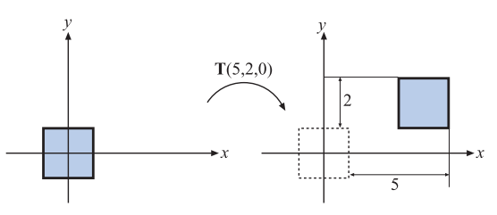

这里我们需要提及一下有关矩阵表示的问题。有时候我们会在计算机图形学中看到另一种有效的矩阵表示方法，这种方法会将平移向量放在变换矩阵的最下面一行（即第四行），DirectX中就使用了这种表示方式。在这种表示方式中，矩阵元素的顺序会被颠倒，即应用程序会以从左往右的方式来读取平移变量；这种向量和矩阵的表示方法被称作行优先（row-major）表示法（也叫做行主序）。而本书中将会采用列优先（column-major）表示法（也叫做列主序），使用哪一种表示方法仅仅是符号上的区别。当我们采用行主序表示法，那么变换矩阵在内存中进行存储时，代表位移的四个分量会位于所有16个分量的最后四位，其中前三位代表了具体的位移分量，最后一位是1。

### 4.1.2 旋转

旋转（rotation）变换可以将一个向量（位置或者方向），绕着一个过原点的旋转轴旋转一定的角度。与平移变换一样，旋转变换也是一个刚体变换（rigid-body transform），也就是说，被变换点之间的距离并不会发生改变，并且保持了手性（handedness），即它不会导致物体左右两边相互交换；这两个特性对于计算机图形学中调整物体位置和朝向而言非常有用。方向矩阵（orientation matrix）是一个与相机视角和物体朝向相关的旋转矩阵，它定义了物体在空间中的朝向，即物体向上和向前的方向。

我们可以很容易地推导出二维空间中的旋转矩阵。假设我们现在有一个向量$\mathbf{v} = (v_x, v_y)$，我们可以将其参数化表示为$\mathbf{v} = (v_x, v_y) = (r \cos \theta, r \sin \theta)$。如果我们将向量$\mathbf{v}$顺时针旋转$\phi$度，那么可以获得一个新向量$\mathbf{v} =  (r \cos (\theta + \phi), r \sin (\theta + \phi))$，这个变换过程可以写成如下形式：

$$
\begin{aligned} \mathbf{u} & =\left(\begin{array}{c}r \cos (\theta+\phi) \\ r \sin (\theta+\phi)\end{array}\right)=\left(\begin{array}{l}r(\cos \theta \cos \phi-\sin \theta \sin \phi) \\ r(\sin \theta \cos \phi+\cos \theta \sin \phi)\end{array}\right) \\ & =\underbrace{\left(\begin{array}{rr}\cos \phi & -\sin \phi \\ \sin \phi & \cos \phi\end{array}\right)}_{\mathbf{R}(\phi)} \underbrace{\left(\begin{array}{l}r \cos \theta \\ r \sin \theta\end{array}\right)}_{\mathbf{v}}=\mathbf{R}(\phi) \mathbf{v},\end{aligned}\tag{4.4}
$$

在方程4.4的推导过程中，我们使用了三角函数的二角和差公式来将$\cos (\theta + \phi) ,\sin (\theta + \phi)$进行展开。在三维空间中，我们经常使用的旋转矩阵是$\mathbf{R}_x(\phi)$，$\mathbf{R}_y(\phi)$，$\mathbf{R}_z(\phi)$，它们分别代表了绕$x,y,z$轴旋转$\phi$度，它们的具体形式如下：

$$
\mathbf{R}_x(\phi) =
\left (
\begin{array}{}
1 & 0         & 0          & 0 \\
0 & \cos \phi & -\sin \phi & 0 \\
0 & \sin \phi & \cos \phi  & 0 \\
0 & 0         & 0          & 1 \\
\end{array} 
\right) 
\tag{4.5} 
$$

$$
\mathbf{R}_y(\phi) =
\left (
\begin{array}{}
\cos \phi & 0 & \sin \phi  & 0 \\
0 & 1 &  & 0 \\
-\sin \phi & 0 & \cos \phi  & 0 \\
0 & 0  & 0  & 1 \\
\end{array} 
\right) 
\tag{4.6} 
$$

$$
\mathbf{R}_z(\phi) =
\left (
\begin{array}{}
\cos \phi & -\sin \phi & 0 & 0 \\
\sin \phi & \cos \phi  & 0 & 0 \\
0 &  0&  1 & 0 \\
0 & 0  & 0   & 1 \\
\end{array} 
\right) 
\tag{4.7} 
$$

如果我们将这个$4 \times 4$矩阵的第四行和第四列删除，那么就可以获得一个$3 \times 3$矩阵。对于一个绕坐标轴旋转$\phi$度的$3 \times 3$旋转矩阵而言，矩阵的迹（trace：矩阵主对角线上的元素之和，等于矩阵的特征值之和）是一个与坐标轴无关的常量，其计算公式为\[997]：

$$
\mathsf{tr}\mathbf{(R)} = 1 + 2 \cos \phi \tag{4.8}
$$

图4.4展示了旋转矩阵的具体作用效果。除了使得物体绕$ i  $轴旋转$\phi$度之外，旋转矩阵$\mathbf{R}_i(\phi)$的另外一个特征是，它会使得所有位于$i$轴上的点保持不变。请注意，矩阵$\mathbf{R}$也可以用来表示绕任意轴进行旋转的旋转矩阵，我们可以通过对上面提到的三个绕坐标轴旋转的旋转矩阵$\mathbf{R}_x(\phi)$，$\mathbf{R}_y(\phi)$，$\mathbf{R}_z(\phi)$进行组合，来获得一个绕任意轴旋转的旋转矩阵。我们将在章节4.2.1来讨论这个组合过程，章节4.2.4也会提到有关直接绕任意轴进行旋转的方法。

所有旋转矩阵的行列式值都为1，并且它们都是正交矩阵。这个特征对于任意数量旋转矩阵相乘的结果也同样成立。我们还可以通过$ \mathbf{R}_i^{-1}(\phi) = \mathbf{R}_i(-\phi)  $的方式，来获得旋转矩阵的逆矩阵，也就是说旋转矩阵的逆矩阵，相当于以相反方向旋转同样的角度。

#### 示例：绕某个点旋转

假设我们想让一个物体以点$\mathbf{p}$为中心，绕$z$轴旋转$\phi$度，那么其变换过程是什么样的呢？图4.2展示了这个旋转过程。绕某个点进行旋转的意思就是，这个点本身并不会被旋转影响，我们可以先将物体进行平移，使得点$\mathbf{p}$和原点重合，这个过程可以通过平移矩阵$\mathbf{T(-p)}$来完成；然后我们可以对物体进行想要的旋转操作，即$\mathbf{R}_z(\phi)$；最后我们再使用反向平移矩阵$\mathbf{T(p)}$来将这个物体平移回原来的位置。我们将这个三个变换组合在一起，即可获得总的变换矩阵$\mathbf{X}$：

$$
\mathbf{X} = \mathbf{T(p)} \mathbf{R}_z(\phi) \mathbf{T(-p)} \tag{4.9}
$$

这里请注意这三个变换的顺序，最先应用的变换矩阵位于方程的最右边，然后接下来的若干个变换依次左乘。

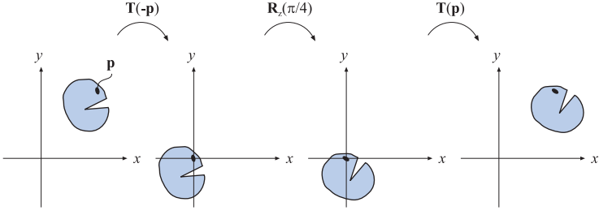

### 4.1.3 缩放

缩放（scaling）矩阵$\mathbf{S(s)} = \mathbf{S} (s_x, s_y, s_z)$可以分别在$x,y,z$方向上，使用缩放因子$s_x, s_y, s_z$来对物体进行缩放，也就是说缩放矩阵可以放大或者缩小物体，缩放因子$s_i, i \in\{ x, y, z \}$的值越大，物体在该方向上的尺寸也就会变得越大；如果我们将缩放矩阵的其中一个分量设置为1，那么物体在该方向上的尺寸将会保持不变。方程4.10展示了缩放矩阵$\mathbf{S}$的具体形式：

$$
\mathbf{S(s)} = 
\left (
\begin{array}{}
s_x & 0 & 0 & 0 \\
0 & s_y & 0 & 0 \\
0 & 0 & s_z & 0 \\
0 & 0 & 0 & 1 \\
\end{array} 
\right) 
\tag{4.10} 
$$

图4.4展示了缩放矩阵的具体效果。当$s_x= s_y= s_z$的时候，这个缩放操作被称作均匀缩放（uniform），否则会被称作非均匀缩放（nonuniform）；有时候我们也会使用术语各向同性（isotropic）和各向异性（anisotropic）来代指均匀和不均匀。缩放矩阵的逆矩阵可以表示为$\mathbf{S^{-1}(s)} = \mathbf{S} (1/s_x, 1/s_y, 1/s_z)$，即按照缩放比例进行反向缩放。

在使用齐次坐标来表示变换矩阵的时候，我们还可以通过直接操作位于矩阵$(3,3)$位置（矩阵最右下角的元素）上的元素，来创建一个均匀缩放变换，这个操作会改变齐次坐标的$w$分量，因此每个被缩放矩阵变换的点（这里只能是点，而不是方向向量，因为方向向量的$w$分量为0），其坐标中的各个分量，都会按照$w$分量的倒数进行缩放。例如：为了创建一个比例为5的均匀缩放，我们可以将缩放矩阵中$(0,0),(1,1),(2,2)$这三个位置上的元素设置为5；或者是直接将矩阵$(3,3)$位置上的元素设置为$1/5$。这两个均匀缩放矩阵的形式不同，但效果确是相同的，具体矩阵形式如下所示：

$$
\mathbf{S} = 
\left (
\begin{array}{}
5 & 0 & 0 & 0 \\
0 & 5 & 0 & 0 \\
0 & 0 & 5 & 0 \\
0 & 0 & 0 & 1 \\
\end{array} 
\right) ，

\mathbf{S^{\prime}} = 
\left (
\begin{array}{}
1 & 0 & 0 & 0 \\
0 & 1 & 0 & 0 \\
0 & 0 & 1 & 0 \\
0 & 0 & 0 & 1/5 \\
\end{array} 
\right) .
\tag{4.11} 
$$

相对于使用矩阵$\mathbf{S}$来进行均匀缩放，我们在使用$\mathbf{S^{\prime}}$的时候必须遵守齐次坐标的规则。这个缩放矩阵的效率并不高，因为它在齐次坐标过程中引入了除法；即如果矩阵最右下角（位置$(3,3)$）上的元素值为1，则不需要进行除法操作。当然了，如果我们所编写的系统根本没有针对1进行测试和优化（即当点坐标的$w$分量为1，则跳过齐次坐标除法），那么其实也就没有额外的开销。

如果向量$\mathbf{s}$中包含1个或者3个为负的分量，那么我们就获得了一个反射矩阵（reflection matrix），或者叫做镜像矩阵（mirror matrix）；如果有两个为负的分量，那么这个矩阵会将物体旋转180度（中心对称）。这里需要注意是，如果一个旋转矩阵和一个反射矩阵相乘，那么生成的结果仍将是一个反射矩阵。例如下列两个矩阵相乘的结果仍然是一个反射矩阵：

$$
\underbrace{
\left( \begin{array}{}
\cos (\pi/2) & \sin (\pi/2) \\
-\sin (\pi/2) &  \cos (\pi/2)
\end{array} \right)
}_{\mathsf{rotation}}

\underbrace{
\left( \begin{array}{}
1 & 0  \\
0 & -1 \\
\end{array} \right)
}_{\mathsf{reflection}}
=
\left( \begin{array}{}
0 & 1  \\
-1 & 0 \\
\end{array} \right)

\tag{4.12} 
$$

通常在检测到一个镜像变换的时候，都会进行一些特殊处理。例如：一个顶点为逆时针顺序定义的三角形，在经过反射矩阵变换之后，其顶点顺序将会变成顺时针；顶点顺序的改变会导致错误的光照效果和背面剔除。我们可以通过计算左上角$3 \times  3$行列式的值，来判断一个给定的缩放矩阵是否为一个反射矩阵。如果缩放矩阵的行列式为负数，则说明该矩阵是一个反射矩阵。例如：方程4.12中的行列式值为$0 \cdot 0 - (-1) \cdot (-1) = -1$。

#### 示例：按任意方向进行缩放

缩放矩阵$\mathbf{S}$只能沿坐标轴方向进行缩放，我们需要使用复合变换来实现在其他方向上的缩放操作。假设我们现在有一个给定的方向$\mathbf{f}$，我们需要首先将这个方向分解为三个标准正交向量$\mathbf{f^x, f^y, f^z}$。然后构建旋转变换矩阵$\mathbf{F}$，这个矩阵可以用于修改坐标系的基底：

$$
\mathbf{F} = 
\left (
\begin{array}{}
\mathbf{f^x} & \mathbf{f^y} & \mathbf{f^z} & \mathbf{0} \\
0 & 0 & 0 & 1 \\
\end{array} 
\right) 
\tag{4.13} 
$$

这个变换的核心思想就是，将由$\mathbf{f^x, f^y, f^z}$给出的坐标系与标准坐标轴重合，然后再使用标准的缩放矩阵对其进行缩放，最后再将坐标系反向变换回去即可。这个过程的第一步是乘以矩阵$\mathbf{F}$的转置矩阵（也就是它的逆矩阵），然后再乘以缩放矩阵（左乘），最后再乘以矩阵$\mathbf{F}$来将坐标系变换回去，这个过程的总变换如下所示：

$$
\mathbf{X} = \mathbf{F} \mathbf{S(s)} \mathbf{F^T} \tag{4.14}
$$

### 4.14 剪切

剪切（shear）变换是另一种基本变换，它可以用来对整个场景进行扭曲，从而创造出一种迷幻的效果，或者是对单个模型的外观进行扭曲。剪切变换一共包含6个基本矩阵，它们分别是$\mathbf{H}_{xy}(s)$，$\mathbf{H}_{xz}(s)$，$\mathbf{H}_{yx}(s)$， $\mathbf{H}_{yz}(s)$，$\mathbf{H}_{zx}(s)$，$\mathbf{H}_{zy}(s)$。其中第一个下标用于表示哪个坐标会被剪切矩阵改变，第二个下标表示将会使用哪个坐标来进行剪切。方程4.15展示了剪切矩阵的一个例子$\mathbf{H}_{xz}(s)$，从中我们可以发现，剪切矩阵的两个下标可以用来找到参数$s$在矩阵中的位置：下标中的$x$（其索引为0）代表了第0行，下标中的$z$（其索引为2）代表了第2列，因此我们可以知道参数$s$位于剪切矩阵的第0行，第2列，即位置$(0,2)$上：

$$
\mathbf{H_{xz}} (s)= 
\left (
\begin{array}{}
1 & 0 & s & 0 \\
0 & 1 & 0 & 0 \\
0 & 0 & 1 & 0 \\
0 & 0 & 0 & 1 \\
\end{array} 
\right) 
\tag{4.15} 
$$

将这个矩阵和一个顶点相乘，会生成一个新的顶点：$ \begin{array}{}
(p_x + sp_z & p_y & p_z)^T
\end{array}  $，图4.3生动的展示了一个单位正方形被剪切的过程。通过向相反的方向进行剪切，我们可以获得$\mathbf{H}_{ij}(s)$的逆矩阵，即$\mathbf{H}_{ij}^{-1}(s) = \mathbf{H}_{ij}(-s)$。

 对单位正方形进行剪切的过程。坐标中的 y 值和 z 值都不受这个变换的影响，而新的 x 值，由原来的 x 值加上 s 与 z 值的乘积组成，这个变换让原来的单位正方形变得向右倾斜。这个变换的过程是面积保持（area-preserving）的，即变换前后的区域面积不会发生改变，我们可以看到左右两个虚线区域的面积是一样。")

你还可以使用一种稍微不同的剪切矩阵：

$$
\mathbf{H^{\prime}_{xy}} (s,t)= 
\left (
\begin{array}{}
1 & 0 & s & 0 \\
0 & 1 & t & 0 \\
0 & 0 & 1 & 0 \\
0 & 0 & 0 & 1 \\
\end{array} 
\right) 
\tag{4.16} 
$$

这里的剪切变换包含两个输入参数，它们代表了这两个坐标（$x,y$）都会被第三个坐标（$z$）剪切。这个特殊的剪切矩阵可以通过上面一般的剪切矩阵组合而成，即$\mathbf{H^{\prime}_{xy}} (s,t) = \mathbf{H}_{ik}(s) \mathbf{H}_{jk}(t)$，其中的$k$代表了 第三个坐标分量的索引。具体使用哪一种形式的剪切矩阵仅仅是一个偏好上的问题。最后我们需要注意的是，任何剪切矩阵的行列式值都为$\vert \mathbf{H} \vert =1$，这意味着剪切变换是一种体积保持（volume-preserving）的变换，即变换前后，物体的体积并不会发生改变（在三维空间中是体积，在二维空间中则是面积），图4.3中也展示了这个特性。

### 4.1.5 变换的连接

由于矩阵之间的乘法不具备交换律（noncommutativity），因此矩阵在乘法式子中的顺序十分重要。变换的连接是与顺序相关的。

我们举一个矩阵顺序相关的例子：假如我们现在有两个矩阵$\mathbf{S,R}$，其中矩阵$\mathbf{S}(2,0.5,1)$是一个缩放变换，它将坐标的$x$分量缩放为原来的2倍，将$ y  $分量缩放为原来的0.5倍。$\mathbf{R}_z(\pi / 6)$是一个旋转矩阵，它绕$ z  $轴（在右手坐标系中，这里的$z$轴指向书页的外面）顺时针旋转了$\pi/6$的角度。这两个矩阵可以用两种不同的方式相乘，它们变换的结果是完全不同的，如图4.4所示：

 ，然后再进行了缩放变换 \mathbf{S(s)} ，其中 \mathbf{s} = (2,0.5,1) ，总变换为 \mathbf{S(s)} \mathbf{R}_z(\pi / 6) ；在第二行中，两个向量交换了相乘的顺序，总变换为 \mathbf{R}_z(\pi / 6) \mathbf{S(s)} ，这两个组合变换的结果完全不同。对于任意的矩阵 \mathbf{M,N} 而言， \mathbf{MN} \ne \mathbf{NM} ，即矩阵的乘法不具备交换律。")

将一系列矩阵组合成一个独立矩阵有一个好处，那就是可以获得更高的执行效率。例如：想象我们现在有一个包含几百万顶点的游戏场景，场景中的所有物体都需要进行缩放、旋转和平移变换。这里我们并不会将所有的顶点都与这三个变换矩阵挨个相乘，因为这样做的效率实在是太低了；我们会将这三个矩阵连接成一个独立的矩阵，然后对所有顶点都应用这个相同的组合变换矩阵。这个组合矩阵可以写作$\mathbf{C = TRS}$，请注意这里的矩阵顺序，缩放矩阵$\mathbf{S}$应当首先作用于顶点，因此它出现在组合矩阵的最右侧。这个组合矩阵的顺序意味着$\mathbf{TRSp} = \mathbf{(T(R(Sp)))}$，其中$\mathbf{p}$是待变换的顶点。顺便说一句，$\mathbf{TRS}$顺序是场景图系统中，最为常用的变换组合顺序。

值得注意的是，虽然矩阵连接的结果是与顺序相关的，但是矩阵和矩阵之间可以进行分组计算，也就是说，矩阵乘法是具有结合律的。例如：假设我们按照$\mathbf{TRSp}$的顺序进行计算，并且在计算的过程中，我们还想顺便计算一下刚体变换$\mathbf{TR}$的值；那么我们可以将这两个矩阵组合在一起进行计算，即$\mathbf{(TR)(Sp)}$，这样我们就可以先获得$\mathbf{TR}$的值，然后再利用这个值去计算$\mathbf{TRSp}$。

### 4.1.6 刚体变换

现在我们想象这样的一个过程，当一个人抓起一个固体物体（比如说从桌子上拿起一支笔），然后将其移动到另一个位置上（可能是衬衫口袋里），在这个过程中，仅仅是物体的位置和朝向发生了变化，其形状和大小并没有受到任何影响。我们将这样只包含平移和旋转的变换叫做刚体变换（rigid-body transform），它具有保持长度、角度和手性的特点。

任何刚体变换矩阵$\mathbf{X}$，都可以写成一个平移矩阵$\mathbf{T(t)}$和一个旋转矩阵$\mathbf{R}$的连接，方程4.17展示了刚体变换矩阵$\mathbf{X}$的一般形式：

$$
\mathbf{X} = \mathbf{T(t)R}=
\left (
\begin{array}{}
r_{00} & r_{01} & r_{02} & t_x \\
r_{10} & r_{11} & r_{12} & t_y \\
r_{20} & r_{21} & r_{22} & t_z \\
0 & 0 & 0 & 1 \\
\end{array} 
\right) 
\tag{4.17} 
$$

刚体变换矩阵$\mathbf{X}$的逆矩阵可以这样来计算：

$$
\mathbf{X^{-1} = (T(t)R)^{-1} = R^{-1}T(t)^{-1} = R^TT(-t)}
$$

为了计算这个逆矩阵，旋转矩阵$\mathbf{R}$左上角$3 \times 3$的子矩阵会被转置（旋转矩阵的逆矩阵），平移矩阵$\mathbf{T}$的参数符号会被取反；然后再将这两个新矩阵调换顺序相乘，便可以获得所需的逆矩阵。计算刚体变换矩阵$\mathbf{X}$的逆矩阵，另一种方法是将矩阵$\mathbf{R,T}$按下列方式进行考虑（符号表示详见方程1.2）：

$$
\begin{array}{}
\mathbf{\bar{R}} = 
\left ( \begin{array}{}
\mathbf{r}_{,0} & \mathbf{r}_{,1} & \mathbf{r}_{,2}
\end{array}  \right) 
=
\left ( \begin{array}{}
\mathbf{r}_0 ^T, \\[1mm]
\mathbf{r}_1 ^T, \\[1mm]
\mathbf{r}_2 ^T,
\end{array}  \right) ,
\\
\mathbf{X} 
= 
\left ( \begin{array}{}
\mathbf{\bar{R}} & \mathbf{t} \\
\mathbf{0} ^T    & 1
\end{array}  \right) ,
\end{array}  
\tag{4.18} 
$$

其中$\mathbf{r}_{,0}$代表了旋转矩阵中的第一列（即第一个逗号取值可以是0-2，而第二个下标的值始终为0），$\mathbf{r}_0 ^T$代表了旋转矩阵中的第一行。还需要注意的是，方程中的$\mathbf{0}$代表一个$3 \times 1$的零向量。在这种表示方式下，方程4.19给出了矩阵$\mathbf{X}$的逆矩阵的计算过程：

$$
\mathbf{X^{-1}} = 
\left ( \begin{array}{}
\mathbf{r}_{0} & \mathbf{r}_{1} & \mathbf{r}_{2} & \mathbf{-\bar{R}^T{}t}\\
0&0&0&1
\end{array}  \right) 
\tag{4.19} 
$$

#### 示例：调整相机的朝向

在图形程序中有一个十分常见的操作，即调整相机的朝向，使其观察某一个指定的点。有一个叫做$\mathsf{gluLookAt}()$的函数可以完成这个操作（来自OpenGL工具库，简称为GLU）。这里我们将会具体展示其执行的流程，虽然这个函数现在已经很少用到了，但是这个函数所对应的操作仍然十分常见。假设我们现在有一个位于点$\mathbf{c}$的相机，我们想让这个相机看向位于点$\mathbf{l}$的物体，并且此时相机指向上方的方向为$\mathbf{u^{\prime}}$，如图4.5所示。

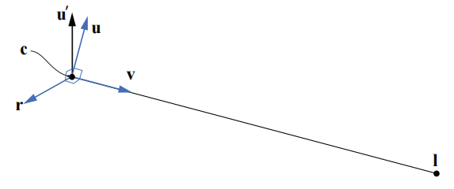

这里我们需要计算一个包含三个向量$\{ \mathbf{r,u,v} \}$的基底。我们首先计算观察向量$\mathbf{v = (l-c) / \Vert l-c \Vert}$，即从相机位置指向目标位置的单位向量；然后计算指向右方的向量$\mathbf{r = (v \times u^{\prime}) / \Vert v \times u^{\prime} \Vert}$；在相机调整朝向之后，向量$\mathbf{u^{\prime}}$通常并不会精确地指向相机向上的方向，因此最终指向相机上方的向量，是之前两个向量叉乘的结果，即$\mathbf{u = r \times v}$，这个向量同时垂直于向量$\mathbf{v,r}$，并且由于这两个向量都是单位向量，因此计算出的向量$\mathbf{u}$也是一个单位向量。接下来我们将构建相机的变换矩阵$\mathbf{M}$，这里的核心思想是，先将相机平移到坐标原点$(0,0,0)$的位置上；然后再对基底进行变换，使得向量$\mathbf{r}$指向$(1,0,0)$，向量$\mathbf{u}$指向$(0,1,0)$，向量$\mathbf{v}$指向$(0,0,-1)$，这个过程可以通过如下变换完成：

$$
\begin{array}{}
\mathbf{M} &= 
\underbrace{
\left ( \begin{array}{}
r_x & r_y & r_z & 0 \\
u_x & u_y & u_z & 0 \\
-v_x & -v_y & -v_z & 0 \\
0 & 0 & 0 & 1 \\
\end{array}  \right)
}_{\mathsf{change\ of \ basis}}

\underbrace{
\left ( \begin{array}{}
1 & 0 & 0 & -t_x \\
0 & 1 & 0 & -t_y \\
0 & 0 & 1 & -t_z \\
0 & 0 & 0 & 1 \\
\end{array}  \right)
}_{\mathsf{translation}}
\\[4mm]
&=\left ( \begin{array}{}
r_x & r_y & r_z & -\mathbf{t \cdot r} \\
u_x & u_y & u_z & -\mathbf{t \cdot u} \\
-v_x & -v_y & -v_z & -\mathbf{t \cdot v} \\
0 & 0 & 0 & 1 \\
\end{array}  \right) 
\end{array}
\tag{4.20} 
$$

请注意，这里我们将平移矩阵和基底变换矩阵组合在了一起，第一步进行的应当是平移变换，因此平移矩阵$\mathbf{-t}$会位于总变换矩阵的右侧。有一种方法可以用来帮助记忆向量$\mathbf{r,u,v}$在矩阵中的具体位置：我们想要让向量$\mathbf{r}$和向量$(1,0,0)$重合，所以当$(1,0,0)$与基底变换矩阵相乘的时候，其结果矩阵中的第一行，一定是向量$\mathbf{r}$中的元素；此外，矩阵中第二行和第三行的向量一定会垂直于$\mathbf{r}$，即$\mathbf{r \cdot x} = 0$。同理，当我们使用同样的想法来思考向量$\mathbf{u,v}$的时候，便可以获得上述的基底变换矩阵。

### 4.1.7 法线变换

矩阵可以用于对点、线、三角形和其他几何物体进行变换，这些矩阵同样也可以对这些线或者三角形表面的切向量（tangent vector）进行变换，然而有一个重要的几何属性并不能总是使用这些矩阵直接进行变换，即表面法线（以及顶点的光照法线）。图4.6展示了如果使用同样的矩阵同时对几何物体及其法线进行变换的结果。

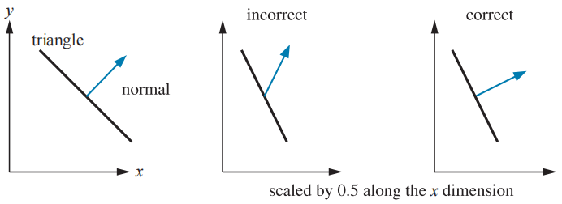

对法线正确的变换方法是：使用原始变换矩阵的伴随矩阵（adjoint）的转置矩阵来对其进行变换，而不是使用原始变换矩阵本身\[227]。你可以在我们网站上的线性代数附录中，找到有关计算伴随矩阵的相关内容，这里你需要知道的是：矩阵的伴随矩阵是始终存在的。法线在经过变换之后，其长度可能会发生变化，因此在变换后通常还需要对法线进行归一化处理。

法线变换的传统方法是，计算原始变换矩阵的逆矩阵的转置\[1794]，即$\mathbf{(M^{-1})^T}$，这个方法现在也是可以使用的。但是我们并不需要完整求出这个逆矩阵，这样会做很浪费性能；并且有时候这个逆矩阵可能并不存在，因为逆矩阵是通过伴随矩阵除以矩阵的行列式获得的，但是矩阵的行列式可能会为0。行列式为0的矩阵被称为奇异矩阵（singular matrix），其逆矩阵是不存在的。

进一步说，即使我们只计算一个$4 \times 4$矩阵的伴随矩阵，也是十分耗时的，而且我们通常也不需要这样做。由于法线仅仅只是一个向量，因此平移变换对其是没有影响的；此外，大多数模型变换都是仿射变换，这些变换并不会修改齐次坐标的$w$分量，即它们没有执行投影操作。在这些条件下，我们只需要计算左上角$3 \times 3$子矩阵的伴随矩阵，即可完成对法线的变换。

实际上，我们甚至都不需要计算这个伴随矩阵。假设我们已经知道了这个变换矩阵是完全由平移、旋转和均匀缩放（没有被拉伸或者压缩）操作组合而成的，那么首先平移变换并不会对法线产生影响，其次均匀缩放仅仅会对法线的长度产生影响，剩下的就是一系列旋转变换了，这些旋转变换最终会组合在一起，形成一个总的旋转变换矩阵。上文中我们说到，我们可以使用原始变换矩阵的逆转置矩阵，来对法线进行变换；而旋转矩阵本身是一个正交矩阵，其逆矩阵和转置矩阵是一样的，也就是说，我们对一个旋转矩阵进行两次转置（或者两次求逆）操作之后，得到的矩阵就是最初的旋转矩阵本身。总而言之，在这样的条件下（进行了平移、旋转和均匀缩放操作），我们可以直接使用模型的变换矩阵来对法线进行变换；但是如果模型变换涉及了非均匀缩放或者投影操作，那么就无法使用这种方法对法线进行变换了。

最后我们需要考虑是否要对法线进行归一化处理，如果模型变换只涉及平移或者旋转的话，那么法线的长度是不会发生改变的，因此也就不需要进行归一化处理。但是如果变换中涉及了非均匀缩放的话，那么这个均匀缩放系数（如果是已知的，或者是已经被提取出来的话，有关提取这个均匀缩放系数的话题会在章节4.2.3中进行讨论）也可以直接用来对法线进行归一化处理（直接按照均匀缩放系数进行反向缩放即可）。例如：如果我们知道了一系列的均匀变换最终会导致物体比之前放大5.2倍，并且法线应用了这个变换矩阵的话，我们可以直接将法线的长度除以5.2即可（即缩小为原来的5.2倍）。除此之外，我们还可以将这一步放在对法线变换之前，让左上角$3 \times 3$子矩阵除以这个缩放系数，从而构建一个会生成归一化结果的法线变换矩阵。

还有一点需要注意一下，如果表面法线是从变换之后的三角形中计算出来的话（例如使用三角形的边向量进行叉乘，从而获得垂直于三角形表面的法线），那么法线变换的问题就不需要进行考虑了。切向量的本质和法线并不相同，它可以直接使用原始变换矩阵进行变换。

### 4.1.8 计算逆矩阵

有很多计算都需要使用逆矩阵，例如在不同的坐标系间来回切换的时候。根据一个变换的可用信息不同，我们可以使用以下三种方法来计算一个逆矩阵：

-   如果某个矩阵是一次很简单的变换，或者是一系列带参简单变换的组合的话，那么我们可以通过反转“参数”和矩阵次序的方式，来获得这个矩阵的逆矩阵，即进行一系列的反向变换。例如：现在有一个变换矩阵$\mathbf{M}=\mathbf{T(t)}\mathbf{R}(\phi)$，则其逆矩阵为$\mathbf{M^{-1}} = \mathbf{R}(-\phi)\mathbf{T(-t)}$。这种求取逆矩阵的方式十分简单且准确，这对于渲染一个大世界而言是十分重要的\[1381]。
-   如果一个矩阵是正交矩阵的话，那么其逆矩阵和转置矩阵是相等的，即$\mathbf{M^{-1}} = \mathbf{M^{T}}$。旋转矩阵是一个正交矩阵，并且任意数量的旋转矩阵组合在一起仍然是一个旋转矩阵，因此其结果也是正交的。
-   如果这些信息都不知道的话，那么我们还可以使用伴随矩阵法、Cramer法则、LU分解法、高斯消元法等方法来计算一个矩阵的逆矩阵。伴随矩阵法和Cramer法则通常要更好一些，因为它们所涉及的分支操作较少；在现代的GPU架构中，最好还是避免使用分支结构。在章节4.1.7中我们提到了如何使用伴随矩阵法来对法线进行正确的变换。

在进行性能优化的时候，我们还可以对逆矩阵的计算目的进行考虑。例如：如果这个逆矩阵仅仅是用来对向量进行变换的话，那么通常我们只需要获得左上角$3 \times 3$子矩阵的逆矩阵即可（例如章节4.1.7中对法线的变换）。

## 4.2 特殊的矩阵变换和操作

在本小节中，我们会介绍并推导若干个对于实时渲染非常重要的矩阵变换和操作。首先我们会介绍欧拉变换（以及如何提取欧拉变换的参数），这是一种描述方向和旋转的直观方法。然后我们会介绍如何在单个变换矩阵中，提取出一组基本变换（分解变换矩阵）。最后我们会推导一种绕任意轴旋转物体的方法。

### 4.2.1 欧拉变换

欧拉变换可以构建一个旋转矩阵，将我们自身（相机）或者其他物体指向一个特定的方向，这是一种十分直观的方式，其名字来源于伟大的瑞士数学家 Leonhard Euler (1707–1783)。

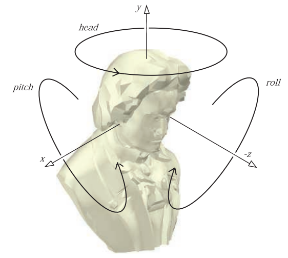

首先，我们需要有一个默认的观察方向，通常来说都会让这个方向指向$z$轴负半轴，并且头部指向$y$轴正半轴，如图4.7所示（其实就是在应用观察变换矩阵之后，相机的位置和朝向）。欧拉变换是三个旋转矩阵相乘的结果，如图4.7中所示的旋转。欧拉变换通常会使用$\mathbf{E}$来进行表示，其具体形式如下：

$$
\mathbf{E}(h,p,r) = \mathbf{R}_z(r) \mathbf{R}_x(p)\mathbf{R}_y(h) \tag{4.21}
$$

在欧拉变换中，矩阵的组合方式一共有24种\[1636]（6个两轴旋转，6个三轴旋转；以及内旋外旋两种方式。$12\times 2=24$），方程4.21所展示的组合方式，是图形学中最为常用的一种组合方式。由于矩阵$\mathbf{E}$是由一系列旋转矩阵连接组成的，那么矩阵$\mathbf{E}$本身自然也是一个正交矩阵，因此该矩阵的逆矩阵可以表示为$\mathbf{E^{-1}} = \mathbf{E^{T}}$$= (\mathbf{R}_z^T \mathbf{R}_x^T \mathbf{R}_y^T) = \mathbf{R}_y^T \mathbf{R}_x^T\mathbf{R}_z^T$，当然，一般直接使用$\mathbf{E}^T$会更加方便。

其中的欧拉角参数$h,p,r$代表了每个方向（head头部，pitch俯仰角，roll滚转角）上绕轴旋转的角度。有时候我们会将这三个旋转角度都叫做roll，例如头部角度叫做y-roll，俯仰角叫做x-roll等。这几个角度的名称，在不同学科领域中的称呼不太一样，例如在飞行模拟中，头部角度head通常被叫做偏航角（yaw）。

这种变换的方式是非常直观的，因此不使用专业术语也可以很形象对其进行描述。例如：改变head角度会让观察者摇头；改变俯仰角会让观察者点头；改变滚转角会让观察者倾斜头部。这里我们使用了head，pitch，roll来描述旋转的方向，而不是使用绕$x,y,z$轴。这里需要注意的是，欧拉变换不仅仅可以用来调整相机的方向，还可以用来调整任意物体的朝向；同时，欧拉变换不仅可以用于世界空间中，同样也可以用于局部参考坐标系中。

值得注意的是，在一些欧拉角的表示中，会让$z$轴指向上方；这虽然会让人感到一些困惑，但是它确实只是一种符号表示上的差异，本质上都是等价的。计算机图形学中，在如何看待和表示世界这个问题上，确实存在着一些分歧，即：$y$轴向上（y-up）还是$z$轴向上（z-up）。在包括3D打印在内的大部分工业制造领域，都将$z$轴正方向作为世界空间中向上的方向；而在航空和航海领域中，则将$z$轴负方向作为世界空间中向上的方向。建筑和GIS领域通常都会使用z-up，因为建筑设计和地图一般都是在二维上进行的（$x,y$）；与多媒体相关的建模系统一般会使用y-up，这与我们在计算机图形学中的描述是相符的，即相机屏幕也是$y$轴正方向指向上方。这两种表示方法之间的差异仅仅是旋转$90^{\circ}$而已（或者是一个对称），但是如果我们不清楚此时使用的是哪一种表示方法的话，可能会导致出现一些问题。在这里，如果没有额外说明的话，我们将会默认使用y-up。

这里我们还想指出一点，相机的up方向和世界空间中up方向没有什么特殊关系，我们可以左右倾斜自己的头部，这时我们眼睛的视野也会相应的倾斜，此时头部的up方向和世界空间中的up方向并不是重合的。再举一个例子：如果现在世界空间使用了y-up，那么我们的相机将会以一个鸟瞰视角俯瞰整个世界；这是因为我们的相机视角向前旋转了$90^{\circ}$，其在世界空间中的up方向变成了$(0,0,-1)$。在这种观察角度下，相机的up方向将不再指向世界空间中的正$ y
  $轴，而是变成了世界空间中的负$z$轴；但是对于相机而言，自身的y-up仍然是成立的。

欧拉角在小角度变换和调整观察者方向方面十分有用，但是它也有一些严重的限制，即我们很难将两组欧拉角组合在一起。例如：在两组欧拉角之间进行插值，并不是简单地对每个分量分别进行插值就可以完成的。事实上，两组表示形式完全不同的欧拉角，可能会给出完全相同的方向，因此对这两组欧拉角进行插值的话，中间生成的任何一组欧拉角，在理想情况下都不应当导致物体发生旋转。这也是使用其他方向表示方法（例如四元数）的原因之一，我们将在之后的小节中对四元数进行详细讨论，这是十分有价值的。使用欧拉角也会导致一个叫做万向节死锁（gimbal lock）的问题，我们将在章节4.2.2中对其进行介绍。

### 4.2.2 从欧拉变换中提取参数

在某些情况下，我们需要从一个代表欧拉变换的矩阵中，提取出各个方向上所改变的角度，即欧拉变换的参数$h,p,r$。这个过程如下所示：

$$
\mathbf{E}(h,p,r) = 

 \left ( \begin{array}{}
e_{00} & e_{01} & e_{02} \\
e_{10} & e_{11} & e_{12} \\
e_{20} & e_{21} & e_{22} \\
\end{array}  \right)

= \mathbf{R}_z(r) \mathbf{R}_x(p)\mathbf{R}_y(h) \tag{4.22}
$$

齐次变换矩阵是$4 \times 4$的，这里我们只使用了左上角$3 \times 3$子矩阵，因为这已经能够提供旋转矩阵的所有必要信息了；也就是说，在完整的$4 \times 4$欧拉变换矩阵中，除了最右下角的元素是1之外，其他剩余的元素均为0。

我们将三个旋转矩阵相乘，可以获得以下结果：

$$
\mathbf{E}= 

 \left ( \begin{array}{}
\cos r \cos h - \sin r \sin p \sin h & - \sin r \cos p & \cos r \sin h + \sin r \sin p \cos h \\

\sin r \cos h + \cos r \sin p \sin h & \cos r \cos p & \sin r \sin h - \cos r \sin p \cos h \\

-\cos p \sin h & \sin p & \cos p \cos h \\
\end{array}  \right)

\tag{4.23}
$$

在方程4.23中，我们可以很明显的看出$\sin p = e_{21}$；此外，我们可以令$e_{01}$除以$e_{11}$来计算$r$，令$e_{20}$除以$e_{22}$来计算$h$。具体的参数提取方程如下：

$$
\frac{e_{01}}{e_{11}} = 
\frac{-\sin r}{\cos r} = -\tan r ,\qquad
\frac{e_{20}}{e_{22}} = 
\frac{-\sin h}{\cos h} = -\tan h 
\tag{4.24} 
$$

也就是说，我们可以使用$\mathsf{atan2(y,x)}$（包含两个参数的反正切函数，详见第1章）来从矩阵$\mathbf{E}$中提取欧拉角的参数$h$（head），$p$（pitch），$r$（roll），即：

$$
\begin{align}{}
h &= \mathsf{atan2}(-e_{20},e_{22}) \\
p &= \arcsin (e_{21}) \\
r &= \mathsf{atan2}(-e_{01},e_{11}) \\
\end{align} 
\tag{4.25} 
$$

但是，这里我们还需要处理一种特殊情况，即当$\cos p = 0$的时候，我们会遇到被称为万向节死锁的问题（在章节4.2.1的末尾提到过），此时旋转角度$ r,h  $将会围绕着同一个旋转轴进行旋转（尽管它俩的旋转方向可能不同，这取决于旋转角度$p$是$-\pi/2$还是$\pi/2$），在这种情况下，我们只需要计算其中任意一个角度即可。如果我们假设$h=0$\[1769]，那么此时矩阵$\mathbf{E}$为：

$$
\begin{align}{}
\mathbf{E_1}& =
\left ( \begin{array}{}
\cos r \cos h - \sin r \sin h & 0 & \cos r \sin h + \sin r \cos h \\
\sin r \cos h + \cos r \sin h & 0 & \sin r \sin h - \cos r \cos h \\
0 & 1 & 0 \\
\end{array}  \right)
\\[5mm]&=
\left ( \begin{array}{}
\cos (r+h) & 0 & \sin (r+h) \\
\sin (r+h) & 0 & \cos (r+h) \\
0 & 1 & 0 \\
\end{array}  \right) ,p = \pi/2
\\[10mm]
\mathbf{E_2}&= 
\left ( \begin{array}{}
\cos r \cos h + \sin r \sin h & 0 & \cos r \sin h - \sin r \cos h \\
\sin r \cos h - \cos r \sin h & 0 & \sin r \sin h + \cos r \cos h \\
0 & -1 & 0 \\
\end{array}  \right)
\\[5mm]&=
\left ( \begin{array}{}
\cos (r-h) & 0 & \sin (r-h) \\
\sin (r-h) & 0 & \cos (r-h) \\
0 & -1 & 0 \\
\end{array}  \right) ,p = -\pi/2
\end{align} 
\tag{4.25.1}
$$

当$\cos p = 0$的时候，由于方程4.23中的$e_{01},e_{11},e_{20},e_{21}$都包含$\cos p$项，因此都为0（如方程4.25.1所示），所以我们就无法使用方程4.25中来解析出$h,r$ 的值。而且我们可以在方程$4.25.1$中看到，此时方程仅和$r+h$或者$r-h$有关；这里我们只需要假设其中任意一个旋转角度为0，然后求出另一个参数即可；例如$h = 0$，即$\cos h = 1,\sin h =0$，那么此时的欧拉变换矩阵可以写成：

$$
\mathbf{E}= 

 \left ( \begin{array}{}
\cos r &  -\sin r \cos p & \sin r \sin p \\

\sin r & \cos r \cos p & - \cos r \sin p  \\

0 & \sin p & \cos p \\
\end{array}  \right)

\tag{4.26}
$$

我们可以看出，由于旋转角度$p$并不会对矩阵第一列的值产生任何影响，因此当$\cos p = 0$的时候，我们可以使用$\sin r / \cos r = \tan r = e_{10} / e_{00}$，即$r = \mathsf{atan2}(-e_{10},e_{00})$来计算出$r$。

另外请注意，函数arcsin的定义域是$-\pi/2 \le p \le \pi/2$，这意味着如果我们使用了一个在这个范围之外的$p$值，来创建一个欧拉变换矩阵$\mathbf{E}$的话，那么我们将无法获取最初的$p$值。参数$h,p,r$的组合并不是唯一的，也就是说有很多组欧拉角的组合，都可以生成效果一样的变换。更多有关欧拉角转换的内容，可以阅读Shoemake于1994年发布的论文\[1636]。我们上述所提到的方法只是一个很简单的版本，它可能会导致数值不稳定（numerical instability）的问题，我们可以牺牲一些性能来避免这个问题\[1362]。

当我们使用欧拉变换的时候，有时会发生一种叫做万向节死锁（gimbal lock）的现象，即在旋转的过程中失去了一个自由度。例如：假设我们现在按照$x,y,z$的顺序进行变换，然后绕$y$轴旋转了$\pi/2$的角度，即执行了第二个旋转；这个旋转操作会使得局部坐标系中的$z$轴与原始的$x$轴重合，最终导致绕$z$轴旋转的操作是多余的。

在数学上，我们已经在方程4.25.1和方程4.26中看到了万向节死锁的现象，在方程中我们假设了$ \cos p = 0  $，即$p =  \pm  \pi/2 + 2\pi k$，其中$k$是一个正整数。此时整个矩阵只跟一个角度有关系，如方程4.25.1所示，根据$p$值的不同，这个角度可能是$r+h$或者$r-h$。也就是说，原来的参数$r,h$代表了两个不同的自由度，而现在只有一个自由度了。

在建模系统中，通常会使用$x,y,z$顺序的欧拉角，每个旋转都对应着一个局部坐标轴。在不同的系统中，通常都会使用不同的欧拉角顺序，例如：在动画中使用$z,x,y$顺序，在动画和物理中也会使用$z,x,z$顺序。所有这些分别指定三个旋转轴的方法都是有效的，刚才提到的最后一个有效顺序$z,x,z$，在某些应用程序中会更加优越，因为只有当绕$x$轴旋转$\pi$（旋转半周，$180^{\circ}$）的时候才会出现万向节死锁。没有任何一个序列能够完美的避免万向节死锁问题，但是欧拉角仍然是最为常用的角度表示方法和旋转表示方法，因为动画师们在进行动画制作的时候，更加喜欢使用曲线编辑器来指定某个角度随着时间的变化，这种方法十分直观和便于理解\[499]。

#### 示例：约束变换

想象我们现在拿着一个虚拟的扳手，这个扳手正抓着一个螺栓；为了让这个螺栓安装到位，我们需要绕着$x$轴来旋转扳手。现在假设我们通过操作输入设备（例如鼠标、VR手套、太空球等）给出了一个旋转矩阵，这个旋转矩阵用于控制扳手的运动。但是如果直接将这个旋转矩阵应用到扳手上的话可能会导致一定的问题，因为扳手只应当绕着$x$轴进行旋转。我们将这个输入的变换矩阵称为$\mathbf{P}$，为了限制这个变换矩阵只围绕着$x$轴进行旋转，需要使用本小节中描述的方法，将变换矩阵中的欧拉角度提取出来，然后创建一个新的变换矩阵$\mathbf{R}_x(p)$即可。这个新的变换矩阵$\mathbf{R}_x(p)$，就是我们希望应用于扳手的变换矩阵，它将会使得扳手只绕着$x$轴进行旋转（如果此时输入的$\mathbf{P}$包含绕$x$轴旋转的变换的话）。

### 4.2.3 矩阵分解

到目前为止，我们所做的工作都建立在这样的一个假设上，即已经知道了原始变换矩阵及其变换过程；但是更多的时候，我们实际上并不清楚这些信息。例如：我们只知道有一个变换矩阵和被变换的物体，现在的任务是从在这个总变换矩阵中，分解出各种各样的子变换矩阵，这个过程叫做矩阵分解（matrix decomposition）。

矩阵分解有很多用途，例如：

-   提取物体的缩放因子。
-   找到一个指定坐标系中所需要的变换（例如：某些系统和变换不允许使用任意的$4 \times 4$矩阵）。
-   确定一个物体是否只经历了刚体变换。
-   在只有物体的变换矩阵可用的情况下，在动画的关键帧之间进行插值。
-   移除一个旋转变换矩阵中的剪切变换。

在前文中我们其实已经展示了两个矩阵分解的例子，例如从一个刚体变换中提取出平移矩阵和旋转矩阵（章节4.1.6）；从一个正交矩阵中提取出欧拉角（章节4.2.2）。

在上文中的两个例子中我们可以看到，从一个变换矩阵中提取出平移矩阵是很简单的，我们只需要找到$4 \times 4$矩阵中的最后一列元素即可。我们还可以对变换矩阵的行列式进行检查，如果行列式的值是一个负数，那么就说明这个矩阵包含一个反射变换。而想要分离出旋转、缩放和剪切变换则需要更多的的努力。

幸运的是，有几篇关于这个话题的文章，它们都提供了可用的在线代码。Thomas \[1769]和Goldman \[552, 553]各自都为不同类型的转换提供了对应方法。Shoemake \[1635]对他们处理仿射矩阵的方法进行了改进，该算法是独立于参考系的，并且试图对原始的变换矩阵进行分解，从而提取出刚体变换矩阵。

### 4.2.4 绕任意轴旋转

有时候，能够让一个物体绕着任意轴旋转是一件很方便的事情，假设我们现在有一个归一化的旋转轴$\mathbf{r}$，我们希望创建一个矩阵，能够让物体绕着这个旋转轴$\mathbf{r}$旋转$\alpha$度。

为了完成这个绕任意轴旋转的操作，我们首先需要进行一次空间变换，将旋转轴$\mathbf{r}$与$x$轴重合。我们可以通过一个旋转矩阵$\mathbf{M}$来完成，然后当我们真正需要的旋转变换完成之后，再使用旋转矩阵$\mathbf{M}^{-1}$将其旋转回最初的位置\[314]，整个变换过程如图4.8所示：

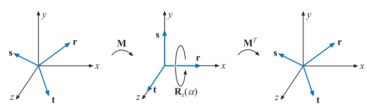

为了计算这个旋转矩阵$\mathbf{M}$，我们需要找到两个与旋转轴$\mathbf{r}$正交，且彼此相互正交的轴，从而构建一组标准正交基。其实我们只要能找到第二个轴$\mathbf{s}$即可，因为第三个轴$\mathbf{t}$可以通过前两个轴叉乘的结果获得，即$\mathbf{t = r \times s}$。有一种数值稳定的方法是：找到原始旋转轴$\mathbf{r}$中的最小分量，然后将其设置为0，再交换剩下两个分量的值，最后再将刚才两个不为0的分量中的任意一个取反即可（这里先设置为0，交换再取反的操作，实际上就是找到与旋转轴$\mathbf{r}$同一平面的垂直向量）。其数学表达式为\[784]：

$$
\begin{array}{l}\overline{\mathbf{s}}=\left\{\begin{array}{ll}\left(0,-r_{z}, r_{y}\right), & \text { if }\left|r_{x}\right| \leq\left|r_{y}\right| \text { and }\left|r_{x}\right| \leq\left|r_{z}\right|, \\ \left(-r_{z}, 0, r_{x}\right), & \text { if }\left|r_{y}\right| \leq\left|r_{x}\right| \text { and }\left|r_{y}\right| \leq\left|r_{z}\right|, \\ \left(-r_{y}, r_{x}, 0\right), & \text { if }\left|r_{z}\right| \leq\left|r_{x}\right| \text { and }\left|r_{z}\right| \leq\left|r_{y}\right|,\end{array}\right. \\[6mm] \mathbf{s}=\overline{\mathbf{s}} /|| \overline{\mathbf{s}}||, \\[1mm] \mathbf{t}=\mathbf{r} \times \mathbf{s} .\end{array}
\tag{4.27} 
$$

上述方程保证了$\mathbf{\bar{s}}$和$\mathbf{r}$是正交的（垂直），并且$\mathbf{t}$也与$\mathbf{r,s}$正交，即$\mathbf{(r,s,t)}$是一组标准正交基。Frisvad \[496]提供了一种没有任何分支操作的代码实现，它的速度很快，但是相对精度较低。Max \[1147]和Duff等人\[388]改进了Frisvad方法的精度。无论你使用了哪种方法进行求解，最终都会获得一组标准正交基，从而构建旋转矩阵$\mathbf{M}$：

$$
\mathbf{M}= 

 \left ( \begin{array}{}
\mathbf{r}^T \\
\mathbf{s}^T \\
\mathbf{t}^T \\
\end{array}  \right)

\tag{4.28}
$$

在经过旋转矩阵$\mathbf{M}$的变换之后，向量$\mathbf{r}$与$x$轴重合，向量$\mathbf{s}$与$y$轴重合，向量$\mathbf{t}$与$z$轴重合。最终我们获得了绕归一化旋转轴$\mathbf{r}$旋转$\alpha$度的变换矩阵，如下所示：

$$
\mathbf{X} = \mathbf{M}^T \mathbf{R}_x(\alpha) \mathbf{M}

\tag{4.29}
$$

换句话说，我们通过变换，先将旋转轴$\mathbf{r}$与$x$轴重合（使用旋转矩阵$\mathbf{M}$），然后绕$x$轴旋转$\alpha$度，最后再使用旋转矩阵$\mathbf{M}$的逆矩阵进行反向变换即可。其中，由于旋转矩阵$\mathbf{M}$是一个正交矩阵，因此其逆矩阵就是其转置矩阵$\mathbf{M}^{T}$。

Goldman \[550]还提出了另外一种绕任意归一化轴$\mathbf{r}$旋转$\phi$度的方法，这里我们直接将最终的变换矩阵展示出来：

$$
\mathbf{R} = \left(\begin{array}{ccc}
\cos \phi+(1-\cos \phi) r_{x}^{2} & (1-\cos \phi) r_{x} r_{y}-r_{z} \sin \phi & (1-\cos \phi) r_{x} r_{z}+r_{y} \sin \phi \\ 
(1-\cos \phi) r_{x} r_{y}+r_{z} \sin \phi & \cos \phi+(1-\cos \phi) r_{y}^{2} & (1-\cos \phi) r_{y} r_{z}-r_{x} \sin \phi \\ 
(1-\cos \phi) r_{x} r_{z}-r_{y} \sin \phi & (1-\cos \phi) r_{y} r_{z}+r_{x} \sin \phi & \cos \phi+(1-\cos \phi) r_{z}^{2}
\end{array}\right)
\tag{4.30} 
$$

在章节4.3.2中，我们还提出了另一种使用了四元数来解决这个问题的方法；同时，我们还提出了用于解决相关问题的高效算法，例如将一个向量转换为另一个向量等。

## 4.3 四元数

四元数是William Rowan Hamilton爵士于1843年发明的，当时是作为复数（complex number）的扩展，但是直到1985，才被Shoemake引入计算机图形学的领域中\[1633]。

> 公平来说，Robinson \[1502]在1958年就使用了四元数来进行刚体模拟。

四元数可以用于表示旋转和方向，它在很多地方都比欧拉角和矩阵表示更加优秀。任何三维方向都可以表示为一个绕特定轴的简单旋转，给定一个旋转轴和旋转角度，我们可以直接将其转换为一个四元数，或者是从一个四元数中提取出旋转轴和旋转角度；但是对任意方向上的欧拉角进行转换是很困难的。四元数可以用于稳定且恒定速度的方向插值，这是欧拉角很难实现的。

复数由一个实部和一个虚部组成，每个复数都可以使用两个实数进行表示，其中第二个实数要乘以$\sqrt{-1}$。类似地，四元数由四个部分组成，前三个值与旋转的轴有关，而旋转角度会对四个值都产生影响（章节4.3.2）。由于四元数和向量都有四个分量，因此这里我们给四元数的符号加上一个小帽子来以示区别，即$\mathbf{\hat{q}}$。在本小节中，我们将从一些四元数的数学背景开始讲起，然后用它来构建各种有用的变换。

### 4.3.1 数学背景

我们首先从四元数的定义开始。

**定义：** 四元数$\mathbf{\hat{q}}$可以使用下面的方法来进行定义，这些定义方法都是等价的。

$$
\begin{aligned} 
\hat{\mathbf{q}} &=\left(\mathbf{q}_{v}, q_{w}\right)=i q_{x}+j q_{y}+k q_{z}+q_{w}=\mathbf{q}_{v}+q_{w},
\\ \mathbf{q}_{v} &=i q_{x}+j q_{y}+k q_{z}=\left(q_{x}, q_{y}, q_{z}\right),
\\ i^{2} &=j^{2}=k^{2}=-1, j k=-k j=i, k i=-i k=j, i j=-j i=k.
\end{aligned} 
\tag{4.31} 
$$

其中变量$q_w$是四元数$\mathbf{\hat{q}}$中的实数部分（实部），变量$\mathbf{q_v}$是四元数$\mathbf{\hat{q}}$中的虚数部分（虚部），$i,j,k$叫做虚数单位。四元数的结构和复数类似，但是复数只有一个虚部，而四元数则包含三个虚部。

对于虚部$\mathbf{q_v}$，我们可以将其看作为一个三维向量，可以对其应用诸如加法、缩放、点乘、叉乘以及其他的向量操作。利用四元数的定义，我们可以得到两个四元数$\mathbf{\hat{q},\hat{r}}$之间的乘法运算，如方程4.32所示。这里需要注意的是，虚数单位之间的乘法是不具备交换律的。

$$
\begin{aligned}  \mathbf{ 乘法: } \quad \hat{\mathbf{q}} \hat{\mathbf{r}}=&\left(i q_{x}+j q_{y}+k q_{z}+q_{w}\right)\left(i r_{x}+j r_{y}+k r_{z}+r_{w}\right) \\=& i\left(q_{y} r_{z}-q_{z} r_{y}+r_{w} q_{x}+q_{w} r_{x}\right) \\ &+j\left(q_{z} r_{x}-q_{x} r_{z}+r_{w} q_{y}+q_{w} r_{y}\right) \\ &+k\left(q_{x} r_{y}-q_{y} r_{x}+r_{w} q_{z}+q_{w} r_{z}\right) \\ &+q_{w} r_{w}-q_{x} r_{x}-q_{y} r_{y}-q_{z} r_{z} \\=&\left(\mathbf{q}_{v} \times \mathbf{r}_{v}+r_{w} \mathbf{q}_{v}+q_{w} \mathbf{r}_{v}, q_{w} r_{w}-\mathbf{q}_{v} \cdot \mathbf{r}_{v}\right) . \end{aligned}
\tag{4.32} 
$$

从上述计算公式中我们可以看出，我们在计算两个四元数的乘法时，同时使用了点乘和叉乘。

除了四元数的定义和乘法计算公式之外，下面是四元数的加法、共轭、范数以及其他定义：

$$
\begin{align}{}
&\mathbf{加法} :&\hat{\mathbf{q}}+\hat{\mathbf{r}}=(\mathbf{q}_{v}, q_{w})+(\mathbf{r}_{v}, r_{w})=(\mathbf{q}_{v}+\mathbf{r}_{v}, q_{w}+r_{w}) \\[5mm]

&\mathbf{共轭} :& \hat{\mathbf{q}}^{*}=\left(\mathbf{q}_{v}, q_{w}\right)^{*}=\left(-\mathbf{q}_{v}, q_{w}\right)\\[5mm]

&\mathbf{模长}:&
\begin{aligned}{}
n(\hat{\mathbf{q}}) &=\sqrt{\hat{\mathbf{q}} \hat{\mathbf{q}}^{*}}=\sqrt{\hat{\mathbf{q}}^{*} \hat{\mathbf{q}}}=\sqrt{\mathbf{q}_{v} \cdot \mathbf{q}_{v}+q_{w}^{2}} \\&=\sqrt{q_{x}^{2}+q_{y}^{2}+q_{z}^{2}+q_{w}^{2}} .
\end{aligned}\\[5mm]
&\mathbf{虚数单位}: &\quad \hat{\mathbf{i}}=(\mathbf{0}, 1)
\end{align} 
\tag{4.33}

$$

当$n(\hat{\mathbf{q}}) =\sqrt{\hat{\mathbf{q}} \hat{\mathbf{q}}^{*}}$化简之后，我们可以看到最终结果的虚部消失了，只剩下实部（即一个实数），这个实数叫做虚数$\mathbf{\hat{q}}$的模长，有时候我们也会使用$\Vert \hat{\mathbf{q}} \Vert = n(\hat{\mathbf{q}})$来表示一个虚数的模长\[1105]。我们使用符号来$\hat{\mathbf{q}}^{-1}$表示一个四元数的逆，四元数的逆有这样一个性质，即$\hat{\mathbf{q}}^{-1} \hat{\mathbf{q}} = \hat{\mathbf{q}} \hat{\mathbf{q}}^{-1} =1$。根据虚数模长的定义，我们可以推导出:

$$
n(\hat{\mathbf{q}})^{2}=\hat{\mathbf{q}} \hat{\mathbf{q}}^{*} \Longleftrightarrow \frac{\hat{\mathbf{q}} \hat{\mathbf{q}}^{*}}{n(\hat{\mathbf{q}})^{2}}=1
\tag{4.34} 
$$

从方程4.34我们可以推导出四元数逆的计算公式：

$$
\mathbf{四元数的逆:}\qquad \hat{\mathbf{q}}^{-1}=\frac{1}{n(\hat{\mathbf{q}})^{2}} \hat{\mathbf{q}}^{*}
\tag{4.35}
$$

方程4.35使用了四元数的标量乘法，其计算方法可以从方程4.32中推导出来，即

$$
s \hat{\mathbf{q}}=(\mathbf{0}, s)\left(\mathbf{q}_{v}, q_{w}\right)=\left(s \mathbf{q}_{v}, s q_{w}\right) \\
\hat{\mathbf{q}} s =\left(\mathbf{q}_{v}, q_{w}\right)(\mathbf{0}, s) = \left(s \mathbf{q}_{v}, s q_{w}\right)
$$

这也意味着复数的标量乘法具备交换律，即：$ s \hat{\mathbf{q}} = \hat{\mathbf{q}} s =
\left(s \mathbf{q}_{v}, s q_{w}\right)  $。

利用上面我们提到的基本定义，可以推导出以下的四元数运算规则：

$$
\begin{align}

\left(\hat{\mathbf{q}}^{*}\right)^{*} &=\hat{\mathbf{q}}, \\
\mathbf{共轭法则:} \qquad(\hat{\mathbf{q}}+\hat{\mathbf{r}})^{*} &=\hat{\mathbf{q}}^{*}+\hat{\mathbf{r}}^{*}, \\
(\hat{\mathbf{q}} \hat{\mathbf{r}})^{*} &=\hat{\mathbf{r}}^{*} \hat{\mathbf{q}}^{*} . 
\end{align} \tag{4.36} 

$$

$$

\begin{align}
\mathbf{模长法则:} \qquad n\left(\hat{\mathbf{q}}^{*}\right)&=n(\hat{\mathbf{q}})\\
n(\hat{\mathbf{q}} \hat{\mathbf{r}})&=n(\hat{\mathbf{q}}) n(\hat{\mathbf{r}})  
\end{align}\tag{4.37}
$$

$$
\begin{align}{}
\mathbf{乘法分配律：}&\qquad 
\begin{array}{l}\hat{\mathbf{p}}(s \hat{\mathbf{q}}+t \hat{\mathbf{r}})=s \hat{\mathbf{p}} \hat{\mathbf{q}}+t \hat{\mathbf{p}} \hat{\mathbf{r}} \\
(s \hat{\mathbf{p}}+t \hat{\mathbf{q}}) \hat{\mathbf{r}}=s \hat{\mathbf{p}} \hat{\mathbf{r}}+t \hat{\mathbf{q}} \hat{\mathbf{r}}
\end{array} \\[5mm]
\mathbf{乘法结合律：}& \qquad \hat{\mathbf{p}}(\hat{\mathbf{q}} \hat{\mathbf{r}})=(\hat{\mathbf{p}} \hat{\mathbf{q}}) \hat{\mathbf{r}} 
\end{align}\tag{4.38}
$$

单位四元数$\hat{\mathbf{q}}=\left(\mathbf{q}_{v}, q_{w}\right)$的长度（模长）为$n\left(\hat{\mathbf{q}}\right)=1$。因此对于某些长度为1的三维向量$\mathbf{u}_{q}$，我们可以将这个四元数改写成如下形式：

$$
\hat{\mathbf{q}}=\left(\sin \phi \mathbf{u}_{q}, \cos \phi\right)=\sin \phi \mathbf{u}_{q}+\cos \phi = 
\cos \phi + \sin \phi(\mathbf{u}_{qx} + \mathbf{u}_{qy} + \mathbf{u}_{qz})
\tag{4.39} 
$$

当且仅当$\mathbf{u}_{q} \cdot \mathbf{u}_{q}=1=\left\|\mathbf{u}_{q}\right\|^{2}$的时候，我们才能够这样改写，这是因为：

$$
\begin{aligned} n(\hat{\mathbf{q}}) &=n\left(\sin \phi \mathbf{u}_{q}, \cos \phi\right)=\sqrt{\sin ^{2} \phi\left(\mathbf{u}_{q} \cdot \mathbf{u}_{q}\right)+\cos ^{2} \phi} \\ &=\sqrt{\sin ^{2} \phi+\cos ^{2} \phi}=1 \end{aligned} \tag{4.40}
$$

在下一小节中我们将会看到，单位四元数可以通过一种十分高效的方式来创建旋转和方向；但是在那之前，我们还需要介绍一些针对单位四元数的操作。

对于复数而言，一个二维单位向量可以被写成$\cos \phi + i\sin \phi = e^{i \phi}$的形式（复变函数中的欧拉公式）；而对于一个四元数来说，其等价形式如下：

$$
\hat{\mathbf{q}}=\sin \phi \mathbf{u}_{q}+\cos \phi=e^{\phi \mathbf{u}_{q}}
\tag{4.41} 
$$

&#x20;对于一个单位四元数而言，其对数运算和幂运算遵循以下规则，这些规则可以从方程4.41中推导出来：

$$
\begin{align}{}
&\mathbf{ Logarithm:}  \qquad  \log (\hat{\mathbf{q}})=\log \left(e^{\phi \mathbf{u}_{q}}\right)=\phi \mathbf{u}_{q}\\[3mm]
&\mathbf{Power: } \qquad  \qquad  \hat{\mathbf{q}}^{t}=\left(\sin \phi \mathbf{u}_{q}+\cos \phi\right)^{t}=e^{\phi t \mathbf{u}_{q}}=\sin (\phi t) \mathbf{u}_{q}+\cos (\phi t). 
\end{align} \tag{4.42}
$$

### 4.3.2 四元数变换

我们现在将研究四元数中的一个子集，即单位四元数（unit quaternion），它们的模长为1。单位四元数可以用于表示任何的三维旋转，而且这种表示方式非常紧凑和简单。

> 译者：这里推荐一个3b1b等人制作的互动视频网站[https://eater.net/quaternions](https://eater.net/quaternions "https://eater.net/quaternions")（以及相应的四元数科普视频），上面展示了四元数是如何作用于三维空间的旋转。其中最重要的一个理解（译者自己的理解）就是：一个复数的虚部代表了空间在单位圆上进行旋转，实部代表了这个空间的拉伸。

这里我们将介绍为什么单元四元数对于旋转和方向如此有用。假设现在有一个点（或者向量）$\mathbf{p}=\left(\begin{array}{llll}p_{x} & p_{y} & p_{z} & p_{w}\end{array}\right)^{T}$，首先我们将这个点坐标的四个分量对应放入一个四元数$\mathbf{\hat{p}}$的各个分量中；假设我们现在还有一个单位四元数$\mathbf{\hat{q}} = (\sin \phi \mathbf{u}_{q}+\cos \phi)$，我们对这两个四元数进行如下操作：

$$
\hat{\mathbf{q}} \hat{\mathbf{p}} \hat{\mathbf{q}}^{-1}\tag{4.43}
$$

这个操作意味着将四元数$\mathbf{\hat{p}}$（即点$\mathbf{p}$）以$\mathbf{u}_{q}$为旋转轴，旋转了$ 2\phi  $角度。请注意，由于$\mathbf{\hat{q}}$是一个单位四元数，因此根据方程4.35，有$\mathbf{\hat{q}}^{-1} = \mathbf{\hat{q}}^{*}$。这个绕任意轴旋转的过程如图4.9所示。

 完成的旋转操作，绕轴 \mathbf{u}_{q} 旋转了 2\phi  。")

任意非零倍数的$\mathbf{\hat{q}}$都能表示这个相同的旋转变换，也就是说，$\mathbf{\hat{q}}$和$-\mathbf{\hat{q}}$所表示的旋转变换也都是一样的（不考虑缩放），因此我们可以这样理解，将旋转轴$\mathbf{u}_{q}$和实部$q_w$取反，可以创建一个与原始四元数完全相同的旋转变换。由于单位四元数$\mathbf{\hat{q}}$首先将目标绕轴旋转$\phi$，然后$-\mathbf{\hat{q}}$再将目标绕轴旋转$\phi$，并且两次旋转的方向是相同的，因此最终旋转了$ 2\phi  $。同时这也意味着我们从变换矩阵中提取出的四元数，可能是$\mathbf{\hat{q}}$或者$-\mathbf{\hat{q}}$中的任意一个。

给定两个单位四元数$\mathbf{\hat{q}}$和$\mathbf{\hat{r}}$，我们首先对$\mathbf{\hat{p}}$（可以被认为一个点或者是一个向量）应用四元数$\mathbf{\hat{q}}$所代表的旋转变换，然后再应用四元数$\mathbf{\hat{r}}$所代表的变换，整个过程可以用方程4.44进行描述：

$$
\hat{\mathbf{r}}\left(\hat{\mathbf{q}} \hat{\mathbf{p}} \hat{\mathbf{q}}^{*}\right) \hat{\mathbf{r}}^{*}=
(\hat{\mathbf{r}} \hat{\mathbf{q}}) \hat{\mathbf{p}}(\hat{\mathbf{r}} \hat{\mathbf{q}})^{*}
=
\hat{\mathbf{c}} \hat{\mathbf{p}} \hat{\mathbf{c}}^{*}
\tag{4.44} 
$$

上述公式中的$\hat{\mathbf{c}}=\hat{\mathbf{r}} \hat{\mathbf{q}}$也是一个单位四元数，它代表两个单位四元数$\mathbf{\hat{q}}$和$\mathbf{\hat{r}}$的组合变换。

#### 矩阵转换

很多时候我们需要将好几种不同的变换组合在一起，这些变换大多数都以矩阵的形式给出，因此我们需要一种方法来将方程4.43中的四元数旋转，转换为矩阵形式。一个四元数$\mathbf{\hat{q}}$，可以转换为一个变换矩阵$\mathbf{M^q}$，其形式如下\[1633, 1634]：

$$
\mathbf{M}^{q}=\left(\begin{array}{cccc}1-s\left(q_{y}^{2}+q_{z}^{2}\right) & s\left(q_{x} q_{y}-q_{w} q_{z}\right) & s\left(q_{x} q_{z}+q_{w} q_{y}\right) & 0 \\ s\left(q_{x} q_{y}+q_{w} q_{z}\right) & 1-s\left(q_{x}^{2}+q_{z}^{2}\right) & s\left(q_{y} q_{z}-q_{w} q_{x}\right) & 0 \\ s\left(q_{x} q_{z}-q_{w} q_{y}\right) & s\left(q_{y} q_{z}+q_{w} q_{x}\right) & 1-s\left(q_{x}^{2}+q_{y}^{2}\right) & 0 \\ 0 & 0 & 0 & 1\end{array}\right)
\tag{4.45} 
$$

上述方程中的$s=2 /(n(\hat{\mathbf{q}}))^{2}$，对于一个单位四元数而言，可以将其化简为：

$$
\mathbf{M}^{q}=\left(\begin{array}{cccc}1-2\left(q_{y}^{2}+q_{z}^{2}\right) & 2\left(q_{x} q_{y}-q_{w} q_{z}\right) & 2\left(q_{x} q_{z}+q_{w} q_{y}\right) & 0 \\ 2\left(q_{x} q_{y}+q_{w} q_{z}\right) & 1-2\left(q_{x}^{2}+q_{z}^{2}\right) & 2\left(q_{y} q_{z}-q_{w} q_{x}\right) & 0 \\ 2\left(q_{x} q_{z}-q_{w} q_{y}\right) & 2\left(q_{y} q_{z}+q_{w} q_{x}\right) & 1-2\left(q_{x}^{2}+q_{y}^{2}\right) & 0 \\ 0 & 0 & 0 & 1\end{array}\right)
\tag{4.46} 
$$

&#x20;当我们完成这个四元数的构建，在将其转换为矩阵形式的时候，上述转换方程中不包含任何三角函数运算，因此这个转换在实际应用中是很高效的。

将一个正交矩阵$\mathbf{M^q}$反向转换为一个单位四元数$\mathbf{\hat{q}}$要更加复杂一点，这个过程的关键在于，我们可以通过消元法，将方程4.46中正交矩阵$\mathbf{M^q}$的某几项进行做差，即：

$$
\begin{array}{l}m_{21}^{q}-m_{12}^{q}=4 q_{w} q_{x} \\ m_{02}^{q}-m_{20}^{q}=4 q_{w} q_{y} \\ m_{10}^{q}-m_{01}^{q}=4 q_{w} q_{z} .\end{array}
\tag{4.47} 
$$

方程4.47中的每一项都含有$q_w$，也就是说，如果我们知道了$q_w$的值是多少的话，我们就可以计算出向量$\mathbf{v}_q$的各个分量，那么这个单位四元数$\mathbf{\hat{q}}$也就计算出来了。$q_w$可以通过计算矩阵$\mathbf{M^q}$的迹（trace：矩阵主对角线上的元素之和，等于矩阵的特征值之和）获得，计算方程如下：&#x20;

$$
\begin{aligned} \operatorname{tr}\left(\mathbf{M}^{q}\right) & =4-2 s\left(q_{x}^{2}+q_{y}^{2}+q_{z}^{2}\right)=4\left(1-\frac{q_{x}^{2}+q_{y}^{2}+q_{z}^{2}}{q_{x}^{2}+q_{y}^{2}+q_{z}^{2}+q_{w}^{2}}\right) \\ & =\frac{4 q_{w}^{2}}{q_{x}^{2}+q_{y}^{2}+q_{z}^{2}+q_{w}^{2}}=\frac{4 q_{w}^{2}}{(n(\hat{\mathbf{q}}))^{2}} .\end{aligned}
\tag{4.48} 
$$

我们通过方程4.48求出矩阵$\mathbf{M^q}$的迹，然后就可以计算出单位四元数的实部$q_w$，最后计算出四元数虚部的其他几项即可，具体方程如下：

$$
\begin{array}{ll}q_{w}=\frac{1}{2} \sqrt{\operatorname{tr}\left(\mathbf{M}^{q}\right)}, & q_{x}=\dfrac{m_{21}^{q}-m_{12}^{q}}{4 q_{w}}, \\[3mm] q_{y}=\dfrac{m_{02}^{q}-m_{20}^{q}}{4 q_{w}}, & q_{z}=\dfrac{m_{10}^{q}-m_{01}^{q}}{4 q_{w}} .\end{array}
\tag{4.49} 
$$

为了在计算过程中保持数值稳定\[1634]，我们应当尽可能地避免除以一个过小的数值。为了实现这个目的，我们首先设$t=q_{w}^{2}-q_{x}^{2}-q_{y}^{2}-q_{z}^{2}$，然后又因为$q_{x}^{2}+q_{y}^{2}+q_{z}^{2}+q_{w}^{2} = 1$（单位四元数的模长为1），可得：

$$
\begin{aligned} 
m_{00} &=t+2 q_{x}^{2}, \\ m_{11} &=t+2 q_{y}^{2}, \\ m_{22} &=t+2 q_{z}^{2}, \\ u &=m_{00}+m_{11}+m_{22}=t+2 q_{w}^{2}, 
\end{aligned}
\tag{4.50} 
$$

上述方程反过来意味着，$m_{00}, m_{11}, m_{22},u$中最大的那一项，对应决定了$q_{w},q_{x},q_{y},q_{z}$中哪一项是最大的。如果我们计算出来实部$q_w$是最大的那一项，我们便可以使用方程4.49计算出这个四元数的其他分量，这样就不会因为除以一个过小的数值而带来精度上的误差。如果计算出来实部$q_w$并不是最大的那一项，那么我们可以使用下列方程进行计算，从而避免精度误差：

$$
\begin{aligned} 
4 q_{x}^{2}&=+m_{00}-m_{11}-m_{22}+m_{33},\\
4 q_{y}^{2}&=-m_{00}+m_{11}-m_{22}+m_{33},\\
4 q_{z}^{2}&=-m_{00}-m_{11}+m_{22}+m_{33},\\
4 q_{w}^{2}&=\operatorname{tr}\left(\mathbf{M}^{q}\right).
\end{aligned}
\tag{4.51} 
$$

总而言之，方程4.50可以用来计算四元数虚部分量$q_{x},q_{y},q_{z},q_w$中的最大值，根据最大值的不同适当选取方程4.51或者方程4.47来计算$\mathbf{\hat{q}}$的其余分量。 Schuler \[1588]提出了一种无分支的变体方法，但是该方法计算了四次平方根。

#### 球面线性插值

球面线性插值（spherical linear interpolation）是指，给定两个单位四元数$\mathbf{\hat{q}}$，$\mathbf{\hat{r}}$以及一个参数$t \in [0,1]$，然后计算出一个插值的四元数。球面线性插值对于物体动画非常有用，但是对于相机的方向插值来说，却并不常用，因为相机的up向量在插值的过程中可能会发生倾斜，这通常是一个干扰的效果。

球面线性插值的数学表达式如下：

$$
\hat{\mathbf{s}}(\hat{\mathbf{q}}, \hat{\mathbf{r}}, t)=\left(\hat{\mathbf{r}} \hat{\mathbf{q}}^{-1}\right)^{t} \hat{\mathbf{q}}
\tag{4.52} 
$$

但是，对于软件实现而言，通常会使用更为合适的slerp函数来代表球面线性插值，其形式如下：

$$
\hat{\mathbf{s}}(\hat{\mathbf{q}}, \hat{\mathbf{r}}, t)
=\operatorname{slerp}(\hat{\mathbf{q}}, \hat{\mathbf{r}}, t)
=\frac{\sin (\phi(1-t))}{\sin \phi} \hat{\mathbf{q}}
+\frac{\sin (\phi t)}{\sin \phi} \hat{\mathbf{r}}
\tag{4.53} 
$$

其中$\cos \phi=q_{x} r_{x}+q_{y} r_{y}+q_{z} r_{z}+q_{w} r_{w}$\[325]。对于给定的$t \in [0,1]$，slerp函数所计算出的四元数是唯一的（当且仅当$\mathbf{\hat{q}}$不与$\mathbf{\hat{r}}$反向。）。这些插值生成的四元数组合在一起，构成了一个四维单位球面上，从$\mathbf{\hat{q}}(t=0)$到$\mathbf{\hat{r}}(t=1)$的最短弧。如图4.10所示，四元数$\mathbf{\hat{q}}$，$\mathbf{\hat{r}}$与原点一起构成了一个平面，这个平面与四维单位超球相交，投影到三维空间中便形成了一个圆，而这些插值出来的四元数所形成的圆弧便位于这个圆上。随着参数$t$的均匀变化，这个插值出来的四元数会绕着一个固定的轴，以一个恒定的角速度进行旋转；像这样一个具有恒定变化速度（即加速度为0）的曲线被叫做测地线（geodesic curve）\[229]。球面上的大圆（great circle）是由经过原点的平面与球体相交形成的，这个圆上的一部分被叫做大弧（great arc）。

slerp函数非常适合用于在两个方向之间进行插值，这个插值过程会围绕一个固定的旋转轴，且旋转速度是恒定的；而在使用欧拉角进行方向插值的时候则并不是这样的（旋转轴不固定，旋转速度也不恒定）。在实际实现中，由于slerp函数中涉及到了很多三角函数的计算，因此效率是很低的。Malyshau \[1114]讨论了如何将四元数集成到渲染管线中，他指出：当直接在像素着色器中对四元数进行归一化，而不是使用slerp函数来调整三角形的朝向时，在90度角内的最大误差为4度，这个误差在光栅化三角形的时候是可以接受的。Li \[1039, 1040]提供了一种效率更高的增量方法来计算slerp，并且不会对精度产生任何影响。Eberly \[406]提出了一种仅使用加法和乘法来快速计算slerp的方法。

当现在有两个以上的方向时，例如$\hat{\mathbf{q}}_{0}, \hat{\mathbf{q}}_{1}, \ldots, \hat{\mathbf{q}}_{n-1}$，我们希望可以从从$\mathbf{\hat{q}}_1$插值到$\mathbf{\hat{q}}_2$，再插值到$\mathbf{\hat{q}}_3$，直到最终插值到$\hat{\mathbf{q}}_{n-1}$，使用slerp函数是最直接的方式。例如现在我们到达了$\hat{\mathbf{q}}_{i-1}$，正要向$\hat{\mathbf{q}}_{i}$方向前进，我们将使用$\hat{\mathbf{q}}_{i}$，$\hat{\mathbf{q}}_{i-1}$来作为slerp的参数进行插值；当到达了$\hat{\mathbf{q}}_{i}$，要向$\hat{\mathbf{q}}_{i+1}$方向前进时，我们使用$\hat{\mathbf{q}}_{i}$，$\hat{\mathbf{q}}_{i+1}$作为slerp的参数进行插值。但是这样的操作会导致在插值过程中的方向发生突变，如图4.10所示；这和点的线性插值情况相类似，如图17.3的右上角部分所示。当你阅读完第17章有关样条线的内容之后，你可以重新浏览一下下面的内容，可能会有额外的收获。

一个更好的方法是使用某种样条线来进行插值。我们在四元数$\hat{\mathbf{q}}_{i}$与$\hat{\mathbf{q}}_{i+1}$之间引入了2个新的中间四元数$\hat{\mathbf{a}}_{i}$，$\hat{\mathbf{a}}_{i+1}$。我们可以使用$\hat{\mathbf{q}}_{i},\hat{\mathbf{a}}_{i},\hat{\mathbf{a}}_{i+1},\hat{\mathbf{q}}_{i+1}$这四个四元数，来定义一个球面立方插值（Spherical cubic interpolation）。这两个中间四元数可以通过下面的方程进行计算（Shoemake \[1633]给出了另一种推导方式）：

$$
\hat{\mathbf{a}}_{i}=
\hat{\mathbf{q}}_{i} \exp \left[-\frac{\log \left(\hat{\mathbf{q}}_{i}^{-1} \hat{\mathbf{q}}_{i-1}\right)+\log \left(\hat{\mathbf{q}}_{i}^{-1} 
\hat{\mathbf{q}}_{i+1}\right)}{4}\right].
\tag{4.54} 
$$

我们将使用$\hat{\mathbf{q}}_{i},\hat{\mathbf{a}}_{i}$来构建一个光滑的三次样条线，从而对四元数进行光滑的球面插值：

$$
\mathbf{squad}\left(\hat{\mathbf{q}}_{i}, \hat{\mathbf{q}}_{i+1}, \hat{\mathbf{a}}_{i}, \hat{\mathbf{a}}_{i+1}, t\right)=\\
\mathbf{slerp}\left(
\mathbf{slerp}\left(\hat{\mathbf{q}}_{i}, 
\hat{\mathbf{q}}_{i+1}, t\right), 
\mathbf{slerp}\left(\hat{\mathbf{a}}_{i}, 
\hat{\mathbf{a}}_{i+1}, t\right), 2 t(1-t)
\right)
\tag{4.55} 
$$

从上述方程中我们可以看到，$\mathbf{squad}$函数是通过重复使用slerp进行球面线性插值构建而成的（章节17.1.1中包含了有关于对点重复线性插值的内容）。这个插值形成的路径，会通过每一个$\hat{\mathbf{q}}_{i}$，但是并不会通过这些用于构建样条线的$\hat{\mathbf{a}}_{i}$——它们用于指示位于初始位置时的切线方向。

#### 将一个向量旋转到另一个向量

一个常见的操作是将方向$\mathbf{s}$以最短路径变换到另一个方向$\mathbf{t}$，使用四元数可以大大简化这个变换过程，这也显示了四元数与其表示方法的密切关系。首先我们要将$\mathbf{s}$和$\mathbf{t}$进行归一化；其次通过$\mathbf{u}=(\mathbf{s} \times \mathbf{t}) /\|\mathbf{s} \times \mathbf{t}\|$来计算归一化的旋转轴（同时垂直于向量$\mathbf{s}$和$\mathbf{t}$）；然后根据$e=\mathbf{s} \cdot \mathbf{t}=\cos (2 \phi) ， \|\mathbf{s} \times \mathbf{t}\|=\sin (2 \phi)$，其中$2 \phi$是向量$\mathbf{s}$和$\mathbf{t}$之间的夹角。这时候我们就可以表示从$\mathbf{s}$变换到$\mathbf{t}$的四元数了，即$\hat{\mathbf{q}}=(\sin \phi \mathbf{u}, \cos \phi)$；我们将其展开可得$\hat{\mathbf{q}}=\left(\frac{\sin \phi}{\sin 2 \phi}(\mathbf{s} \times \mathbf{t}), \cos \phi\right)$，又因为$\cos \phi=\sqrt{\frac{e+1}{2}}$，进一步化简可得\[1197]：

$$
\hat{\mathbf{q}}=
\left(\mathbf{q}_{v}, q_{w}\right)
=\left(
\frac{1}{\sqrt{2(1+e)}}(\mathbf{s} \times \mathbf{t}), 
\frac{\sqrt{2(1+e)}}{2}
\right)
\tag{4.56} 
$$

使用这种方式构建四元数（相比于对叉积$\mathbf{s} \times \mathbf{t}$的结果进行标准化），避免了当$\mathbf{s}$和$\mathbf{t}$几乎指向相同方向时造成的数值不稳定\[1197]。但是当$\mathbf{s}$和$\mathbf{t}$指向相反方向的时候，此时$e=-1$，两种方法都会出现数值不稳定的情况，因为分母为0；当检测到这种特殊情况出现的时候，可以使用任何一个垂直于$\mathbf{s}$的向量作为旋转轴，然后再将$\mathbf{s}$旋转到$\mathbf{t}$。

有时我们可能会需要一个表示$\mathbf{s}$旋转到$\mathbf{t}$的矩阵，上文中的方程4.46给出了单位四元数所表示的旋转矩阵，我们可以从这个矩阵出发，将方程4.56带入其中并进行化简，可得\[1233]：

$$
\mathbf{R}(\mathbf{s}, \mathbf{t})=\left(\begin{array}{cccc}e+h v_{x}^{2} & h v_{x} v_{y}-v_{z} & h v_{x} v_{z}+v_{y} & 0 \\ h v_{x} v_{y}+v_{z} & e+h v_{y}^{2} & h v_{y} v_{z}-v_{x} & 0 \\ h v_{x} v_{z}-v_{y} & h v_{y} v_{z}+v_{x} & e+h v_{z}^{2} & 0 \\ 0 & 0 & 0 & 1\end{array}\right)
\tag{4.57} 
$$

在这个计算过程中，会使用到以下的中间计算过程：

$$
\begin{aligned} 
\mathbf{v} &=\mathbf{s} \times \mathbf{t} \\ 
e &=\cos (2 \phi)=\mathbf{s} \cdot \mathbf{t}, \\ 
h &
=\frac{1-\cos (2 \phi)}{\sin ^{2}(2 \phi)}
=\frac{1-e}{\mathbf{v} \cdot \mathbf{v}}
=\frac{1}{1+e} . 
\end{aligned}
\tag{4.58} 
$$

我们可以看到，通过对方程进行简化，我们避免了平方根运算和三角函数运算，因此这是一种效率很高的计算方式。请注意方程4.57（使用四元数将一个向量旋转到另一个向量）和方程4.30（使用欧拉变换将一个向量旋转到另一个向量），二者的结构是类似的，但是使用四元数变换的方程4.57中，并没有涉及对三角函数的计算，因此其效率更高。

当向量$\mathbf{s}$和$\mathbf{t}$平行或者接近平行的时候，此时$\|\mathbf{s} \times \mathbf{t}\| \approx 0$，我们需要格外小心。当$\phi \approx 0$的时候，我们可以返回单位矩阵；当时当$2 \phi \approx \pi$的时候，我们可以绕任意轴旋转$ \pi  $弧度，这个轴可以是向量$\mathbf{s}$与任何其他不平行于$\mathbf{s}$的向量之间的叉乘（章节4.2.4）。Moller和Hughes使用了Householder矩阵（初等反射矩阵，根据一个向量和平面，生成一个反射的向量），来以一种不同的方法来处理这个特殊情况\[1233]。

## 4.4 顶点混合

想象现在有一个数字人的手臂，他由两部分组成，分别是前臂和上臂，这个模型可以使用刚体变换（章节4.1.6）来进行动画处理，如图4.11左半边所示。但是这两部分之间的关节并不像一个真正的手臂肘关节，这是因为我们使用了两个独立的子模型，即这个肘关节由两个独立模型的重叠部分所组成。这个由静态模型组合而成的物体，并没有解决如何使得关节灵活柔韧（flexible）的问题，很明显，使用一个单独的物体进行动画处理，可以获得更好的效果。

顶点混合（vertex blending）是一种解决这个问题的常见方法\[1037, 1903]，它还有几个其他的名称，例如：线性蒙皮混合（linear-blend skinning）、包络（enveloping）或者骨架子空间变形（skeleton-subspace deformation）。虽然该算法的确切来源尚不清楚，但是定义骨骼，并让模型皮肤随着骨骼的变化产生相应的反应则是计算机动画中的基本概念\[1100]。在最简单的形式中，数字人的前臂和上臂可以像以前一样分别进行动画处理，但是在关节处，这两个独立的部分会通过一个具有弹性的“皮肤（skin）”连接起来。这部分皮肤由两组不同的顶点组成，其中一部分顶点由前臂的变换矩阵所驱动，另一部分顶点则被上臂的变换矩阵所驱动。这意味着位于关节处的“皮肤”，其三角形顶点不再使用统一的矩阵进行变换，而是每个三角形都使用不同的矩阵来进行变换，如图4.11所示。

 意味着应用在该顶点上的变换有 2/3 来自上臂，有 1/3 来自前臂。在最右侧的图中，还展示了使用顶点混合的一个缺点，即可以看见肘关节内部的折叠。我们还可以使用更多的骨骼节点，以及更加合理的权重选择来获得更好的动画效果。")

更进一步说，我们可以允许单个顶点被若干个不同的矩阵所变换，并将这些变换所得到的结果加权混合在一起。这是通过为动画物体设置一个骨架来完成的，通过用户自定义的权重，每个骨骼的变换都可能会对其他的顶点产生影响。由于整个手臂都可能是“有弹性的”，也就是说，所有的顶点都可能会受到多个矩阵变换的影响，因此也可以将整个网格模型称作为包裹骨骼的蒙皮（skin），如图4.12所示。许多商业化的建模软件都具有这样的骨架-骨骼建模功能，尽管名字中含有骨骼，但是这个骨骼也不一定是刚性的。例如：Mohr和Gleicher \[1230]提出了一种想法，可以通过增加额外关节的方法，来实现诸如肌肉膨胀的效果。James和Twigg \[813]讨论了如何使用可拉伸与可挤压骨骼来进行动画蒙皮。

![图4.12：顶点混合的一个真实案例。左上角的图展示了这个手臂的两个骨骼，此时手臂处于伸展状态。右上角的图展示了手臂的顶点和网格模型，其中使用颜色标注了该顶点属于哪个骨骼。在底部的图中，被着色处理的手臂处于一个稍微不同的位置，呈弯曲状态。 \[968\]](images/Chapter-4/20221120200150.png "图4.12：顶点混合的一个真实案例。左上角的图展示了这个手臂的两个骨骼，此时手臂处于伸展状态。右上角的图展示了手臂的顶点和网格模型，其中使用颜色标注了该顶点属于哪个骨骼。在底部的图中，被着色处理的手臂处于一个稍微不同的位置，呈弯曲状态。 \[968]")

顶点混合的数学表达式如方程4.59所示，其中$\mathbf{p}$是原始的顶点坐标，$\mathbf{u}(t)$是变化后的顶点位置，$t$代表了动画时间。方程的具体形式如下：

$$
\mathbf{u}(t)=
\sum_{i=0}^{n-1} w_{i} \mathbf{B}_{i}(t) \mathbf{M}_{i}^{-1} \mathbf{p},\  \text{ where} \quad \sum_{i=0}^{n-1} w_{i}=1, \quad w_{i} \geq 0 
\tag{4.59} 
$$

上述方程的含义是：有$n$个骨骼会对点$\mathbf{p}$的世界空间坐标产生影响；$w_i$的值代表了骨骼$i$对于顶点$\mathbf{p}$坐标的影响权重；矩阵$\mathbf{M}_{i}^{-1}$代表骨骼$i$的模型变换矩阵，它负责将骨骼变换到世界空间中。通常来说，骨骼的控制关节位于自身坐标系的原点位置，例如对于前臂骨骼而言，其控制关节为肘关节，则肘关节应当位于这个前臂骨骼模型空间的原点处；这样可以直接对模型的旋转矩阵进行动画处理，从而可以对整个前臂进行移动，并且移动结束之后，肘关节仍然位于模型空间的原点处。$\mathbf{B}_{i}(t)$是一个世界变换矩阵，代表了第$i$个骨骼的世界变换，它会随着时间进行变化，从而让物体动起来；它通常是由若干个矩阵连接而成的，例如上一层级（父级）的变换以及局部的动画矩阵等。

Woodland对一种维护和更新动画矩阵$\mathbf{B}_{i}(t)$的方法进行了深入讨论\[1903]。首先找到所有会对顶点产生影响的骨骼，然后每个骨骼都会将这个顶点坐标转换到自身的坐标系中，从而生成一个变换后的新顶点，而该顶点的最终位置，是通过在这些新顶点之间进行插值获得的。在一些关于蒙皮的讨论中，模型变换矩阵$\mathbf{M}_{i}$被认为是世界变换矩阵$\mathbf{B}_{i}(t)$的一部分，因此并不会将$\mathbf{M}_{i}$显式展示出来。在这里我们将其展示了出来，因为这是一个十分有用的矩阵，它总会成为矩阵连接过程的一部分。

实际上，矩阵$\mathbf{B}_{i}(t)$和矩阵$\mathbf{M}_{i}^{-1}$在每一帧种都会进行连接组合，最终生成的变换矩阵会被用于对顶点进行变换。点$\mathbf{p}$会被不同骨骼的变换矩阵进行变换，并通过使用权重$w_i$，来将这些变换进行加权混合——这也是顶点混合的名称由来。这些权重的值通常都是非负的，且它们的和为1，即点$\mathbf{p}$会被变换到若干个位置上，并在这些位置之间进行插值。换句话说，对于一个固定的时刻$t$，最终插值出来的点$\mathbf{u}$位于点集$\mathbf{B}_{i}(t) \mathbf{M}_{i}^{-1} \mathbf{p},\quad i = 0 \cdots n-1$的凸包（convex hull）内部。通常我们也可以使用方程4.59来对顶点的法线进行变换，当然这也取决于所使用的变换类型：如果骨骼被大量拉伸或者挤压（非均匀缩放）的话，就需要使用矩阵$\mathbf{B}_{i}(t) \mathbf{M}_{i}^{-1}$的逆来对法线进行变换，这在章节4.1.7中讨论过。

顶点混合非常适合在GPU上运行，我们可以将网格中的顶点集合放入GPU的静态缓存中（只需要发送一次），之后重复使用这个缓存即可。在每一帧中，只有骨骼节点发生了变化（顶点数量和连接关系不会发生变化，即GPU上的静态缓存也不会发生变化），我们使用一个顶点着色器，来计算骨骼节点对缓存中存储网格的影响。通过这种方式，可以最大程度的减少在CPU上进行的处理，以及与GPU之间的数据传输（会带来大量延迟），这使得GPU可以高效地渲染这个网格。最简单的情况是可以同时使用模型的整套骨骼矩阵，否则的话就需要拆分模型，并复制一些骨骼。还可以将骨骼的变换存储在顶点可以访问的纹理中，从而避免触及寄存器的限制。通过使用四元数来表示旋转变换，那么每个变换都可以被存储在两张纹理中\[1639]（一张存储顶点的位置，一张存储用于旋转的单位四元数）。如果可以使用无序访问视图（UAV）的话，还可以对蒙皮的动画结果进行重复使用\[146]。

我们还可以指定超出$[0,1]$范围之外的权重值，或者是让权重之和不为1。当然这只在使用一些其他的混合算法时才有意义，例如章节4.5中的变形目标（morph target）等。

![图4.13：左图展示了在使用线性蒙皮混合算法时关节会出现的问题；右图则使用了双四元数混合算法，它明显改善了关节处的表现。 \[1693\]](images/Chapter-4/20221120212805.png "图4.13：左图展示了在使用线性蒙皮混合算法时关节会出现的问题；右图则使用了双四元数混合算法，它明显改善了关节处的表现。 \[1693]")

我们刚才介绍的是最基础的顶点混合算法，它当然会存在一些缺点，例如我们不希望出现的折叠、扭曲或者是自相交等现象\[1037]，如图4.13所示。一个更好的方案是使用双四元数混合（dual quaternion）\[872, 873]，这个技术可以让蒙皮保持原始形状的刚性，从而避免四肢出现像“糖纸”一样的扭曲；这个技术的效果良好，并且计算成本小于线性蒙皮混合的1.5倍，因此被广泛采用。但是双四元数混合技术会导致蒙皮发生膨胀，Le和Hodings \[1001]提出了中心旋转蒙皮（center-of-rotation）作为双四元数的替代，他们认为：局部变换应当是一种刚体变换，并且具有相似权重$w_i$的顶点，应当也具有相似的变换。这种技术预先计算了每个顶点的旋转中心，并对其施加了正交（刚体）约束，从而防止肘部折叠以及糖纸弯曲现象。在运行时，该技术类似于线性蒙皮混合，它运行在GPU上，在顶点的旋转中心进行线性蒙皮混合，紧接着再进行四元数混合的操作。

## 4.5 变形

在动画中，从一个三维模型变形到另一个三维模型是非常有用的\[28, 883, 1000, 1005]。假设在$t_0$时刻有一个正在展示的模型，我们希望它能够在$ t_1  $时刻变形为另一个模型。在$t_0$和$ t_1  $时刻之间，我们会使用某种插值方法，得到一个不断变化的“混合”模型。图4.14展示了变形的一个例子。

变形主要会涉及到两个问题：顶点对应（vertex correspondence）问题和插值（interpolation）问题。给定两个任意的模型，它们具有不同的拓扑结构，不同数量的顶点以及不同的网格连通性。我们通常要从设置两个模型顶点之间的对应关系开始，这是一个十分困难的问题，但是在这个领域中，也已经有很多相关的研究了。我们建议感兴趣的读者可以参考Alexa的相关调研\[28]。

如果两个模型之间已经有了一一对应的顶点了，即对于第一个模型中的每个顶点，我们都可以在第二个模型中找到唯一相对应的顶点。这种情况下的变形操作是很简单的，我们只需要在对应的顶点属性之间进行插值就可以获得中间数据了，例如直接使用线性插值（章节17.1中介绍了更多的插值方法）。对于$t \in [t_0,t_1]$，为了计算这个变形的顶点，首先我们需要计算$s=\left(t-t_{0}\right) /\left(t_{1}-t_{0}\right)$（即当前时刻$t$占总时间的比例），然后将两个对应顶点进行线性混合：

$$
\mathbf{m}=(1-s) \mathbf{p}_{0}+s \mathbf{p}_{1},
\tag{4.60} 
$$

其中$\mathbf{p}_{0}$与$\mathbf{p}_{1}$对应了同一个顶点不同时刻（$t_0,t_1$）的状态。

变形目标（morph target）或者形状混合（blend shape）\[907]是变形技术的其中一种，用户可以对其进行更加直观的控制，图4.15展示了其基本思想。

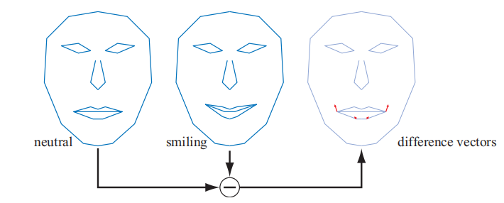

我们从一个标准的中性模型（neutral model）开始，在这个例子中，这个中性模型是一个没有表情的脸，我们将其标记为$\mathcal{N}$。此外还需要有一组不同的面部姿态，而在这个例子中我们只有一个笑脸作为额外的面部姿态。一般来说，我们可以允许$k \ge 1$个不同的姿态，我们使用$\mathcal{P}_{i}, i \in[1, \ldots, k]$来标记它们。在预处理阶段，我们通过使用每个不同的姿态来减去中性姿态，从而计算出姿态之间的差分向量，即$\mathcal{D}_{i}=\mathcal{P}_{i}-\mathcal{N}$。

此时我们有了一个中性模型以及一组不同姿态$\mathcal{D}_{i}$，我们可以使用下列方程计算得到一个变形的模型$\mathcal{M}$：

$$
\mathcal{M}=\mathcal{N}+\sum_{i=1}^{k} w_{i} \mathcal{D}_{i}
\tag{4.61} 
$$

我们在中性模型的基础上，通过使用不同的权重$w_{i}$，根据需要来将不同姿态的特征进行加权混合。在图4.15中，如果设定此时的权重为$w_{1}=1$，那么我们就会获得一个笑脸，如中间的面部表情；如果设定此时的权重为$w_{1}=0.5$，那么就可以获得一个半微笑的脸，以此类推。同时我们还可以使用一个负数权重，或者是使用和不为1的权重。

对于这个简单的面部模型而言，我们还可以再添加一个带有“悲伤”眉毛的面部姿态，通过使用一个负数权重，从而获得一个“开心”的眉毛。由于这些顶点的位移都是可叠加且相互独立的，因此这个眉毛姿态可以和和嘴巴姿态同时使用。

变形目标是一个强大的技术，它为动画师提供了很多控制能力，因为模型中的不同特征，可以进行独立操控。Lewis等人\[1037]介绍了姿态空间变形技术（pose-space deformation），该技术将顶点混合和变形目标结合在一起。Senior \[1608]使用了预计算的顶点纹理来存储和检索目标姿态之间的位移。对于支持流式输出和顶点ID的硬件，允许在单个模型上使用多个变形目标，并在GPU上专门计算这个效果。此外，还可以使用一个低分辨率的网格，然后通过曲面细分和位移映射（displacement mapping）来生成一个高分辨率的网格，这样避免了在一个高分辨率模型上，对每个顶点进行蒙皮和处理的开销\[1971]。

图4.16展示了一个同时使用蒙皮和变形的例子。Weronko和Andreason \[1872]在《教团：1886》中使用了蒙皮和变形。

## 4.6 几何缓存回放

在一些过场动画中，我们可能会希望使用一些极高质量的动画，这些高质量动画使用上述我们所提到的任何方法和技术都无法实时实现。一种简单的方法是，将所有帧的顶点数据预先计算并存储起来， 然后在游戏运行的时候，从磁盘上读取这些数据并对顶点进行更新。但是对于一个包含30000个顶点的模型而言，一段简单的动画可能就会占据50 MB/s的带宽。Gneiting \[545]提供了若干种方法，可以将内存消耗降低到原来的10%，其具体做法如下：

首先会对数据进行量化处理，例如：使用16 位整数来存储每个顶点的位置和纹理坐标，这一步操作会损失一些精度和信息，因为这个压缩过程是不可逆的，在压缩之后无法恢复原始的数据。为了进一步对数据进行压缩，还使用了基于空域（spatial）和时域（temporal）的预测，并对这些差异信息（同一顶点的不同帧，同一帧中的相邻顶点）进行了编码。对于空域压缩而言，可以使用平行四边形预测（parallelogram prediction）技术\[800]。对于三角形条带上的一个顶点，我们可以使用该顶点所在的三角形，以当前边为基准，将其反射到当前边的另一侧；这两个三角形构成了一个平行四边形，然后使用这个平行四边形来预测下一个顶点的位置，然后对原顶点和新顶点之间的差异进行编码。在良好预测的情况下，大多数差异数值都会接近于0，这对于许多压缩方案来说都是很理想的。与MPEG压缩类似，还可以在时域上进行预测，即每隔$n$帧进行一次空域压缩。还可以在时域上对两帧之间进行预测，例如：如果一个顶点被一个增量向量从第$n-1$帧移动到了第$n$帧，那么它很有可能会以类似的增量，再次移动到第$n+1$帧。这些技术大大减少了所需要的存储空间，从而使得动画系统可以实时使用流式数据。

## 4.7 投影

在真正渲染一个场景之前，场景中所有的相关物体都需要被投影到某个平面上，或者是某个简单空间中。在投影变换完成之后，才会进行裁剪操作和渲染操作（章节2.3）。

到目前为止，本章节中所涉及的诸多变换，并不会对齐次坐标的$w$分量（第四个分量）产生影响；也就是说，点和向量在经过变换之后，仍然会保持它们的类型：点的$w$分量为1，向量的$w$分量为0。同时，这些变换矩阵的第四行（最底行）都是$(0,0,0,1)$。而现在我们所要讨论的投影变换，将会涉及到对齐次坐标$w$分量的修改。对于透视投影矩阵（perspective projection matrice）而言，其第四行包含了对向量和点类型的操作；而且在变换之后通常还需要进行均匀化（homogenization）过程，也就是说，$w$分量在透视投影变换之后可能并不为0或者1，因此需要将齐次坐标的每个分量都除以$w$分量，这样才能获得非齐次的点坐标。而对于正交投影（orthographic projection），本小节我们首先会进行讨论这种投影方式，这种投影方式比较简单而且会经常使用，但它并不会对齐次坐标的$w$分量产生影响。

在本小节中，我们假设在经过观察变换之后，相机会看向负$z$轴，同时$y$轴指向上，$x$轴指向右，即一个标准的右手坐标系。有些书籍和一些图形API（例如DirectX）中，在这里会使用一个左手坐标系，即相机看向正$z$轴。使用哪一种手性的坐标系都是可以的，最终也会生成相同的效果。

### 4.7.1 正交投影

正交投影的一个特征是，投影之前的平行线，在投影之后仍然会保持平行。这也就意味着，当使用正交投影来观察一个场景的时候，无论场景中的物体距离相机多远，它们的大小都不会发生改变。矩阵$\mathbf{P}_o$是一个简单的正交投影矩阵，它将点坐标的$x,y$分量保持不变，然后将$z$分量直接归零，即投影到平面$z=0$上。其具体形式如下：

$$
\mathbf{P}_{o}=
\left(\begin{array}{cccc}
1 & 0 & 0 & 0 \\ 0 & 1 & 0 & 0 \\ 0 & 0 & 0 & 0 \\ 0 & 0 & 0 & 1
\end{array}\right)
\tag{4.62} 
$$

图4.17展示了正交投影的效果。由于矩阵$\mathbf{P}_o$的行列式为0，因此它是不可逆的，换句话说，我们将一个物体从三维空间变换到二维平面上，是没有办法将丢失的维度信息恢复的。使用这样的正交投影观察场景会遇到一个问题，那就是它会将在视口内的所有点（无论$z$坐标是正数还是负数）都投影到投影平面上；通常我们会将点坐标的$z$分量（$ x,y  $分量也有相应的限制，即视口的长宽）限制到一个区间内，一般使用$n$（近裁剪平面，也叫做前平面或者hither）和$f$（远裁剪平面，也叫做后平面或者yon）来进行表示。这里我们对可视空间进行了限制，这也是下一步变换的目的之一。

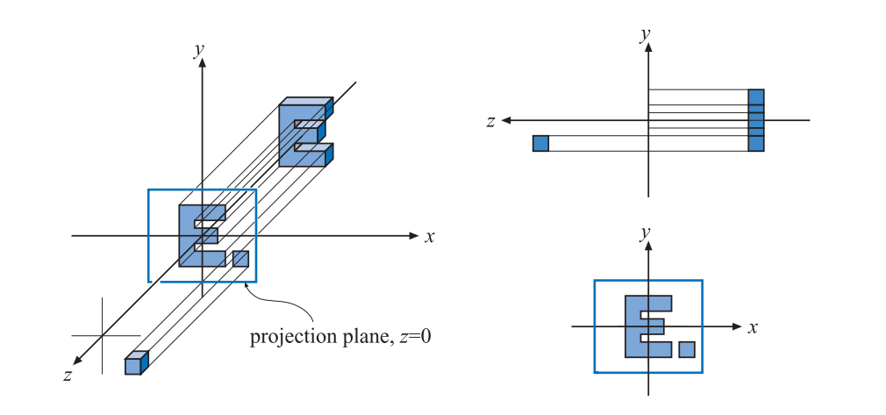

通常我们会使用一个六元组（$l, r, b, t, n, f$）来描述一个正交投影矩阵，它们分别代表了左侧、右侧、底部、顶部、近裁剪平面以及远裁剪平面。这个矩阵会将代表可视空间的轴对齐包围盒（axis-aligned bounding box，简称AABB，详见章节22.2）转换为一个位于原点的轴对齐立方体。这个AABB的最小角是$(l, b, n)$，最大角是$(r, t, f)$。这里我们需要额外注意的是，由于相机此时看向的是负$ z  $轴，因此$n > f$。而通常人们的直觉是：表示近距离的数值应当要比一个表示远距离的数值小，因此这里一般会让用户按照直观感受来设置远近裁剪平面的数值，然后在程序中再对它们进行相应的调整。

在OpenGL中，这个轴对齐立方体的范围是从$(-1,-1,-1)$到$(1, 1, 1)$；而在DirectX中这个范围则是$(-1,-1,0)$到$(1, 1, 1)$。这个立方体被称为规则观察体（canonical view volume，CVV），此时所在的空间被称为规范化设备坐标系（normalized device coordinates，NDC；也叫做齐次裁剪空间）。整个变换过程如图4.18所示。将观察空间（view space）转换为NDC空间的原因是，这样可以使得裁剪操作更加高效，也使得裁剪操作有了统一的前置标准。

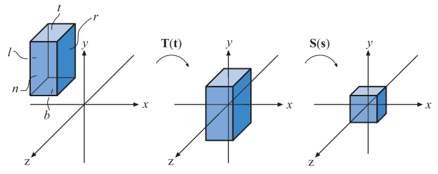

在转换为规则观察体之后，需要渲染的几何体顶点会被这个立方体所裁剪。位于立方体内的几何体最终会被保留，然后通过屏幕映射的方式，将剩余的正方形区域渲染到屏幕上。详细的正交投影矩阵如下所示：

$$
\begin{aligned} 
\mathbf{P}_{o}=\mathbf{S}(\mathbf{s}) \mathbf{T}(\mathbf{t}) &=
\left(\begin{array}{cccc}
\dfrac{2}{r-l} & 0 & 0 & 0 \\ 
0 & \dfrac{2}{t-b} & 0 & 0 \\
0 & 0 & \dfrac{2}{f-n} & 0 \\ 
0 & 0 & 0 & 1
\end{array}\right)
\left(\begin{array}{cccc}
1 & 0 & 0 & -\dfrac{l+r}{2} \\ 
0 & 1 & 0 & -\dfrac{t+b}{2} \\ 
0 & 0 & 1 & -\dfrac{f+n}{2} \\ 
0 & 0 & 0 & 1
\end{array}\right) \\
&=\left(\begin{array}{cccc}
\dfrac{2}{r-l} & 0 & 0 & -\dfrac{r+l}{r-l} \\[2mm]
0 & \dfrac{2}{t-b} & 0 & -\dfrac{t+b}{t-b} \\[2mm]
0 & 0 & \dfrac{2}{f-n} & -\dfrac{f+n}{f-n} \\[2mm] 
0 & 0 & 0 & 1\end{array}\right) . 
\end{aligned}\tag{4.63}
$$

如方程4.63所示，整条投影矩阵$\mathbf{P}_{o}$可以写成一个平移矩阵$\mathbf{T(t)}$和一个缩放矩阵$\mathbf{S(s)}$的组合，其中：

$$
\mathbf{s}=(2 /(r-l), 2 /(t-b), 2 /(f-n)),\\[2mm]
\mathbf{t}=(-(r+l) / 2,-(t+b) / 2,-(f+n) / 2) 
$$

这个矩阵是可逆的，其逆矩阵为：

$$
\mathbf{P}_{o}^{-1}=\mathbf{T}(-\mathbf{t}) \mathbf{S}((r-l) / 2,(t-b) / 2,(f-n) / 2)
$$

> 当且仅当$n \ne f$，$l \ne r$，$t \ne b$；否则，不存在逆矩阵。

在计算机图形学中，在投影变换之后通常会使用一个左手系，即视口的$x$轴指向右方，$y$轴指向上方，$z$轴指向视口内侧。由于AABB的远裁剪平面$z$值要比近裁剪平面小，因此正交投影通常还包会含一个镜像的变换操作。为了看到这个镜像变换操作，这里我们假设原始AABB和最终变换的规则观察体的尺寸是一样的，此时AABB的范围会从对应$(l, b, n)$的$(-1,-1,1)$到对应$(r, t, f)$的$(1, 1, -1)$。我们将参数带入方程4.63，可得：

$$
\mathbf{P}_{o}=
\left(\begin{array}{cccc}
1 & 0 & 0 & 0 \\ 
0 & 1 & 0 & 0 \\ 
0 & 0 & -1 & 0 \\ 
0 & 0 & 0 & 1
\end{array}\right)
\tag{4.64} 
$$

此时的正交投影矩阵是一个镜像变换矩阵，正是这个镜像操作会将右手系的观察空间（相机看向负$ z  $轴）变换为左手系的齐次裁剪空间。

OpenGL会将点坐标的深度值（$z$分量）映射到$[-1,1]$中（不用进行额外处理），而DirectX则是将其映射到$[0,1]$中。为了获得在DirectX中使用的正交投影矩阵，我们可以在正交投影变换之后，通过应用一个简单的缩放和平移矩阵来完成这个映射操作，即先将范围$[-1,1]$缩放为原来的一半即$[-0.5,0.5]$，再将其沿着$z$轴正方形平移0.5个单位到$[0,1]$。这个缩放平移矩阵具体形式如下：

$$
\mathbf{M}_{s t}=\left(\begin{array}{cccc}1 & 0 & 0 & 0 \\ 0 & 1 & 0 & 0 \\ 0 & 0 & 0.5 & 0.5 \\ 0 & 0 & 0 & 1\end{array}\right)
\tag{4.65} 
$$

现在我们将正交投影的变换矩阵，与这个对深度值进行缩放和平移的矩阵结合在一起，可以得到最终的正交投影变换矩阵，根据深度值映射的不同可能会有细微的区别，在DirectX中，这个矩阵的具体形式如下：

$$
\mathbf{P}_{o[0,1]}=
\left(\begin{array}{cccc}
\frac{2}{r-l} & 0 & 0 & -\frac{r+l}{r-l} \\[2mm] 
0 & \frac{2}{t-b} & 0 & -\frac{t+b}{t-b} \\[2mm]  
0 & 0 & \frac{1}{f-n} & -\frac{n}{f-n} \\[2mm] 
0 & 0 & 0 & 1
\end{array}\right)
\tag{4.66} 
$$

在DirectX中一般会使用这个矩阵的转置矩阵，因为DirectX使用了行优先（row-major）的规则来写入矩阵。

### 4.7.2 透视投影

透视投影要比正交投影更加复杂，在计算机图形程序中也更加常用。在透视投影中，投影变换前的平行线在投影之后通常就不再平行了，相反，这些平行线可能会在它们的尽头汇聚成一个点。透视投影更加符合我们人眼观察这个世界的模式，因为它具有近大远小的特点。

首先我们先从最简单的情况开始，推导投影到$z=-d,d>0$平面上的透视投影矩阵。由于在投影变换之前还需要进行一次观察变换，这里我们为了简化这个转换过程的理解难度，所以直接在世界空间中进行推导。在这个最基本的推导完成之后，我们会将其扩展为更加常规的矩阵形式，例如OpenGL中所使用的透视投影矩阵\[855]。

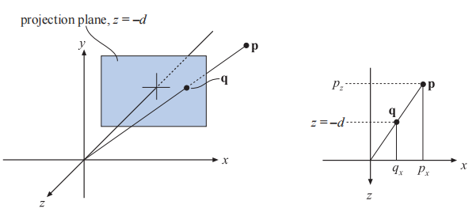

假设现在的相机位于坐标原点处，我们希望将点$\mathbf{p}$投影到平面$z=-d,d>0$上，最终生成一个新的顶点$\mathbf{q}=\left(q_{x}, q_{y},-d\right)$，这个过程如图4.19所示。通过图中的相似三角形，我们可以推导出点$\mathbf{q}$的$x$分量，如下所示：

$$
\frac{q_{x}}{p_{x}}=\frac{-d}{p_{z}} \quad 
\Longleftrightarrow 
\quad q_{x}=-d \frac{p_{x}}{p_{z}}.
\tag{4.67} 
$$

同理我们可以推导出点$\mathbf{q}$的其他分量，如$q_{y}=-d p_{y} / p_{z}$和$q_{z}=-d$。将上述公式整合在一起，就可以获得这个透视投影矩阵$\mathbf{P}_p$，即：

$$
\mathbf{P}_{p}=
\left(\begin{array}{cccc}
1 & 0 & 0 & 0 \\ 
0 & 1 & 0 & 0 \\ 
0 & 0 & 1 & 0 \\ 
0 & 0 & -1 / d & 0
\end{array}\right)
\tag{4.68} 
$$

方程4.68中的透视变换矩阵可以产生正确的透视投影，具体方程如下：

$$
\begin{array}{}
\mathbf{q}=\mathbf{P}_{p} \mathbf{p}&=
\left(\begin{array}{}
1 & 0 & 0 & 0 \\
0 & 1 & 0 & 0 \\ 
0 & 0 & 1 & 0 \\ 
0 & 0 & -1 / d & 0
\end{array}\right)
\left(\begin{array}{c}
p_{x} \\ p_{y} \\ p_{z} \\ 1
\end{array}\right)\\[2mm]
&=\left(\begin{array}{c}p_{x} 
\\ p_{y} \\ p_{z} \\ -p_{z} / d
\end{array}\right) 
\Rightarrow
\left(\begin{array}{c}
-d p_{x} / p_{z} \\ -d p_{y} / p_{z} \\ -d \\ 1
\end{array}\right)
\tag{4.69} 
\end{array}{} 
$$

方程4.69中的最后一步，将新顶点的所有分量都除以$ w
  $分量（在这个例子中是$-p_z /d$），从而将$w$分量设置为1。由于我们将顶点投影到了$z=-d,d>0$上，因此新顶点的$z$分量始终都为$-d$。

在直觉上，是很容易理解为什么齐次坐标可以用于表示投影操作的。这个齐次化过程（将$w$分量设置为1）的一种几何解释是：这个过程会将点$\left(p_{x}, p_{y}, p_{z}\right)$投影到$w=1$所在的平面上。

与正交投影类似，透视投影并没有真正地将所有物体都投影到了一个平面上（这个过程是不可逆的），而是将视锥体变换成了一个规则观察体。在透视投影的时候，我们会假设视锥体从$ z=n
  $开始，并在$z=f$结束，其中$0>n>f$。在$z=n$这个平面上，视锥体的截面是一个长方形，其最小角（左下角）是$(l, b, n)$，最大角（右上角）是$(r, t, f)$，如图4.20所示。透视投影的整个过程，可以这样理解：首先将视锥体的远裁剪平面按一定规则，缩放到与近裁剪平面一样的尺寸，即将视锥体变成一个长方体；然后再按照正交投影的方式，将其变换成一个规则观察体。

参数（$l, r, b, t, n, f$）决定了相机视锥体的范围，视野的水平视场角由视锥体的左右平面（即$l, r$）所决定；同理视野的垂直视场角由视锥体的上下平面（即$b, t$）所决定。视场角越大，相机能够看到的内容也就越多。我们也可以通过设定$r \ne -l, t \ne -b$来构建一个不对称的视锥体，这种视锥体通常会用于3D立体观察（3D电影）和虚拟现实（VR）中（章节21.2.3）。

视场角（field of view，FOV）是提供场景感的重要因素，与电脑屏幕相比，眼睛本身就有一个物理上的视场角（人类单眼的水平视场角最大可达156度，双眼的水平视场角最大可达188度；人类两眼的重合视场角为124度，单眼的舒适视场角为60度；当集中注意力时，视场角约为25度。），其中水平视场角的计算方法为：

$$
\phi=2 \arctan (w /(2 d))  \tag{4.70} 
$$

其中$\phi$是视场角，$w$是物体垂直于视线的宽度，$d$是物体到相机的距离。例如：一个25英寸（对角线距离）的显示器大约宽22英寸，如果这个显示器在距离12英寸远的地方，那么水平视场角应为$85^{\circ}$；20英寸远时水平视场角为$58^{\circ}$；30英寸远时水平视场角为$40^{\circ}$。这个视场角的计算公式也可以用于将相机镜头尺寸转换为视场角，例如：相机的感光元件宽$ 35mm  $，镜头长$50mm$，则其视场角为$\phi=2 \arctan (36 /(2 \cdot 50))=39.6^{\circ}$。

如果使用比人眼物理视场角更小的视场角，会减弱透视的感觉，因为观察者在场景中的视野会被放大；如果使用一个更大的视场角的话，会使得场景中的物体看起来很扭曲（例如使用相机的广角镜头），尤其是在靠近屏幕边缘的地方，会夸大近距离物体的比例。然而，视场角越大，意味着视野越广阔，可以让观察者感觉看到的物体更大，更加令人印象深刻；其优势在于可以为用户提供更多的环境信息。

我们使用透视投影矩阵来将视锥体转换为规则观察体，这个矩阵的具体形式如下：

$$
\mathbf{P}_{p}=
\left(\begin{array}{cccc}
\dfrac{2 n}{r-l} & 0 & -\dfrac{r+l}{r-l} & 0 \\[2mm]
0 & \dfrac{2 n}{t-b} & -\dfrac{t+b}{t-b} & 0 \\[2mm]
0 & 0 & \dfrac{f+n}{f-n} & -\dfrac{2 f n}{f-n} \\[2mm]
0 & 0 & 1 & 0
\end{array}\right)
\tag{4.71} 
$$

在使用这个矩阵对一个点进行透视投影之后，我们会获得一个新的顶点$\mathbf{q}=\left(q_{x}, q_{y}, q_{z}, q_{w}\right)^{T}$，这个新顶点的$w$分量在变换之后通常并会在0-1之间，为了获得这个三维的投影点$\mathbf{q}$，我们需要将该点的四个分量都除以$w$分量，即：

$$
\mathbf{p}=\left(
\frac{q_{x}}{q_{w}}, 
\frac{q_{y}}{q_{w}},
\frac{q_{z}}{q_{w}},
1\right)
\tag{4.72} 
$$

矩阵$\mathbf{P}_{p}$总会确保在平面$ z=f  $上的点被映射到平面$z=+1$上；在平面$z=n$上的点被映射到平面$z=-1$上。

超出近裁剪平面和远裁剪平面的物体会被裁剪，因此并不会出现在场景中。我们也可以将透视投影的远裁剪平面设置在无穷远处（$f \rightarrow \infty$），那么方程4.71中的矩阵将变成如下形式：

$$
\mathbf{P}_{p}=\left(\begin{array}{cccc}\dfrac{2 n}{r-l} & 0 & -\dfrac{r+l}{r-l} & 0 \\ 0 & \dfrac{2 n}{t-b} & -\dfrac{t+b}{t-b} & 0 \\ 0 & 0 & 1 & -2 n \\ 0 & 0 & 1 & 0\end{array}\right)
\tag{4.73} 
$$

综上所述，在投影变换（包括正交投影和透视投影）之后，还会进行裁剪操作和齐次化操作（homogenization，坐标除以$w$分量），最终将其转换到NDC空间中（规范化设备坐标系，normalized device coordinate）。

为了获得可以在OpenGL中使用的透视变换矩阵，我们首先需要将方程4.71中的矩阵乘以$\mathbf{S}(1,1,-1,1)$，这与正交投影中的操作类似，仅仅是将矩阵的第三列取反。在这个镜像操作之后，远近裁剪平面的值都会变为正数，即$0<n^{\prime}<f^{\prime}$，这也比较符合用户的直觉经验（距离越远，数字越大）。此时的$n^{\prime},f^{\prime}$代表了远近裁剪平面沿观察方向（负$z$轴）上的距离，下面是以供参考的OpenGL透视变换矩阵：

$$
\mathbf{P}_{\text {OpenGL }}=
\left(\begin{array}{cccc}
\dfrac{2 n^{\prime}}{r-l} & 0 & \dfrac{r+l}{r-l} & 0 \\[2mm]
0 & \dfrac{2 n^{\prime}}{t-b} & \dfrac{t+b}{t-b} & 0 \\[2mm] 
0 & 0 & -\dfrac{f^{\prime}+n^{\prime}}{f^{\prime}-n^{\prime}} & -\dfrac{2 f^{\prime} n^{\prime}}{f^{\prime}-n^{\prime}}\\[2mm]
0 & 0 & -1 & 0
\end{array}\right).
\tag{4.74} 
$$

还有一个更简单的矩阵设置方法，即只提供垂直视场角$\phi$和宽高比$a=w / h$（其中$w:width$，$ h:height  $，它们代表了屏幕的分辨率），以及取反之后的远近裁剪平面$n^{\prime},f^{\prime}$，这样我们可以将上述方程简化改写为：

$$
\mathbf{P}_{\text {OpenGL }}=
\left(\begin{array}{cccc}
c / a & 0 & 0 & 0 \\[2mm]
0 & c & 0 & 0 \\[2mm]
0 & 0 & -\dfrac{f^{\prime}+n^{\prime}}{f^{\prime}-n^{\prime}} & -\dfrac{2 f^{\prime} n^{\prime}}{f^{\prime}-n^{\prime}} \\[2mm]
0 & 0 & -1 & 0
\end{array}\right),
\tag{4.75} 
$$

其中$c=1.0 / \tan (\phi / 2)$，这个矩阵过去是使用$\mathsf{gluPerspective()}$函数生成的，它是OpenGL实用工具库的一部分（OpenGL Utility Library，简称GLU），但是现在已经过时了。

有些图形API（例如DirectX）会将近裁剪平面映射到平面$z=0$上（而不是平面$z=-1$上），同时将远裁剪平面映射到平面$z=1$上。另外，DirectX使用了左手坐标系来定义其投影矩阵（即观察空间是一个左手系），这意味着在DirectX中，相机在经过观察变换之后，会看向正$z$轴，其远近裁剪平面的值都是正数。下面是DirectX中的透视投影矩阵：

$$
\mathbf{P}_{p[0,1]}=
\left(\begin{array}{cccc}\dfrac{2 n^{\prime}}{r-l} & 0 & -\dfrac{r+l}{r-l} & 0 \\[2mm] 
0 & \dfrac{2 n^{\prime}}{t-b} & -\dfrac{t+b}{t-b} & 0 \\[2mm] 
0 & 0 & \dfrac{f^{\prime}}{f^{\prime}-n^{\prime}} & -\dfrac{f^{\prime} n^{\prime}}{f^{\prime}-n^{\prime}} \\[2mm] 
0 & 0 & 1 & 0
\end{array}\right)
\tag{4.76} 
$$

由于DirectX在其文档中使用行优先来表示变换矩阵，因此通常会使用这个矩阵的转置矩阵。

透视投影带来的一个影响是，计算出的深度值并不会随着输入的$p_z$值线性变化，使用方程4.74-4.76中的任意一个透视变换矩阵对点$\mathbf{p}$进行变换，我们可以获得一个新的顶点$\mathbf{v}$：

$$
\mathbf{v}=\mathbf{P} \mathbf{p}=\left(\begin{array}{c}\cdots \\ \cdots \\ d p_{z}+e \\ \pm p_{z}\end{array}\right)
\tag{4.77} 
$$

这里我们直接忽略了$v_x，v_y$，其中的常数$ d,e
  $取决于所使用的矩阵，如果我们使用方程4.74中的矩阵，则其中的常数为：

$$
d=-\left(f^{\prime}+n^{\prime}\right) /\left(f^{\prime}-n^{\prime}\right),\\[2mm]
e=-2 f^{\prime} n^{\prime} /\left(f^{\prime}-n^{\prime}\right),\\[2mm]
v_{w}=-p_{z}. 
$$

为了将这个点转换到NDC空间中，我们需要让点$\mathbf{v}$的各个分量除以$w$分量，即：

$$
z_{\mathrm{NDC}}=\frac{d p_{z}+e}{-p_{z}}=d-\frac{e}{p_{z}}
\tag{4.78}
 
$$

在OpenGL中，$z_{\mathrm{NDC}}$的范围是$[-1,+1]$；我们从方程4.78中可以看出，输出的深度值$z_{\mathrm{NDC}}$和输入的$p_z$成反比。

例如：如果此时用户设定的$n^{\prime}=10,f^{\prime}=110$，并且$p_z$位于沿负$z$轴60个单位时（即$n^{\prime},f^{\prime}$的中点），那么此时该点的NDC坐标深度为0.833，而不是$[-1,+1]$的中点0。图4.21展示了随着近裁剪平面位置（$n^{\prime}$）发生变化时，所对应NDC坐标的深度变化，我们将在章节23.7中进行进一步讨论。

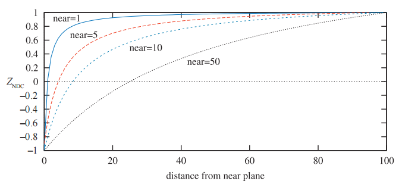

有一些方法可以用来提高深度值的精度，其中反向z-buffer（reversed z）是一种比较常用的方法，当使用浮点数据来表示z-buffer的时候，反向z-buffer会存储$1-z_{\mathrm{NDC}}$的值\[978]；当使用整数来表示z-buffer的时候，反向z-buffer会反向存储$z_{\mathrm{NDC}}$的值，图4.22展示了不同情况下的对比结果。Reed \[1472]（网站为[Depth Precision Visualized | NVIDIA Developer](https://developer.nvidia.com/content/depth-precision-visualized "Depth Precision Visualized | NVIDIA Developer")）通过模拟发现：使用浮点数的反向z-buffer可以提供最好的准确率；而反向z-buffer也是整数深度缓冲区（通常是24位整数）的首选方法。对于标准映射而言（即不使用反向z-buffer），正如Upchurch和Desbrun所建议的那样\[1803]，在变换中使用分离的投影矩阵可以降低误差率。例如：相对于使用组合矩阵$\mathbf{T} \mathbf{p},\mathbf{T}=\mathbf{P M}$进行变换，最好是使用分离的矩阵$\mathbf{P}(\mathbf{M p})$。同时，在$[0.5,1]$的范围内，由于fp32的尾数（定点数）为23位，这使得fp32（32位浮点数）和int24（24位整型）具有相近的准确性。之所以让$z_{\mathrm{NDC}}$和$1 / p_{z}$成正比，是因为这样设计可以让硬件实现变得更加简单，同时还可以使得深度压缩变的效率更高，我们将在章节23.7中进一步讨论这个话题。

![图4.22：使用不同方法设置DirectX变换之后的深度缓冲，即 z\_{\mathrm{NDC}} \in \[0,+1\] 。左上角：使用标准的整数类型深度缓冲，这里使用了4位整数进行演示（因此 y 轴上有16个标记）。右上角：将远裁剪平面设置为 \infty ， x,y 轴只发生了微小的移动，这意味着这样做并不会损失太多精度。左下角：使用了包含3个指数位和3个尾数位的浮点类型深度缓冲。可以看到浮点数在 y 轴上的分布并不是均匀的，而在 x 轴上这个拥挤现象会更加严重。右下角：使用了反向的浮点类型深度缓冲，即存储了 1-z\_{\mathrm{NDC}} ，其分布表现良好（均匀）。](images/Chapter-4/202211242234072.png "图4.22：使用不同方法设置DirectX变换之后的深度缓冲，即 z_{\mathrm{NDC}} \in \[0,+1] 。左上角：使用标准的整数类型深度缓冲，这里使用了4位整数进行演示（因此 y 轴上有16个标记）。右上角：将远裁剪平面设置为 \infty ， x,y 轴只发生了微小的移动，这意味着这样做并不会损失太多精度。左下角：使用了包含3个指数位和3个尾数位的浮点类型深度缓冲。可以看到浮点数在 y 轴上的分布并不是均匀的，而在 x 轴上这个拥挤现象会更加严重。右下角：使用了反向的浮点类型深度缓冲，即存储了 1-z_{\mathrm{NDC}} ，其分布表现良好（均匀）。")

Lloyd \[1063]提出，可以使用深度值的对数来提高阴影贴图（shadow map）的精度。Lauritzen等人\[991]提出可以使用前一帧的z-buffer来确定当前帧的最大近裁剪平面和最小远裁剪平面。Kemen提出\[881]，对于屏幕空间中的深度，可以对每个顶点使用下列的重映射：

$$
\begin{array}{ll}z=w\left(\log _{2}\left(\max \left(10^{-6}, 1+w\right)\right) f_{c}-1\right), & {[\text { OpenGL] }} \\ z=w \log _{2}\left(\max \left(10^{-6}, 1+w\right)\right) f_{c} / 2, & {[\text { DirectX }]}\end{array}
\tag{4.79} 
$$

其中$w$是顶点经过投影矩阵变换之后，点坐标的$ w  $分量，$z$是顶点着色器输出的$z$值；方程中的常数$f_{c}=2 / \log _{2}(f+1)$，其中$f$是远裁剪平面的值。当这个变换（方程4.79）仅应用于顶点着色器中的，在GPU的光栅化阶段中，片元的深度值仍然会使用在三角形顶点的非线性深度之间进行线性插值获得。由于对数函数是一个单调函数，因此只要分段线性插值（piecewise linear interpolation）与精确的非线性插值之间，所获得的深度值差异很小，那么遮挡剔除硬件与深度压缩技术就仍然可以使用；在具有足够的曲面细分时，上述结论在大多数情况都是成立的。但是，上述方程也可以用于对每个片元进行变换，我们在顶点着色器中输出顶点$e=1+w$的值，然后在光栅化阶段，让GPU在三角形上进行插值，从而获得其他片元的$e$值。然后在像素着色器中使用公式$\log _{2}\left(e_{i}\right) f_{c} / 2$来对片元的深度进行修改，其中$e_i$是对三角形顶点上$e$值进行插值获得的。当GPU不支持浮点类型的z-buffer，并且所渲染场景的深度很大时，这是一个很好的替代方法。

Cozzi \[1605]提出可以使用多个视锥体，从而将精度提高到任何我们所期望的准确率。这个方法的核心思路是，将大的视锥体在深度方向上划分成若干个不重叠的小视锥体，这些小视锥体结合在一起就是原来的大视锥体。这些小视锥体会按照从后往前的顺序进行渲染，首先会清除颜色缓冲和深度缓冲，然后将所有需要渲染的物体，分类到与之重叠的每个小视锥体中；而对于每个小视锥体，则会生成各自的投影矩阵并清除自身的深度缓冲，然后渲染每个与小视锥体重叠的物体。

## 补充阅读和资源

网站[http://immersivemath.com/ila/index.html](http://immersivemath.com/ila/index.html "http://immersivemath.com/ila/index.html") \[1718]提供了一个与本章有关的交互式书籍，它鼓励你通过交互操作与调整数值的方式，来建立对于线性代数的直觉。其他的交互式学习工具和有关变换的代码库，都可以在[realtimerendering.com](http://realtimerendering.com "realtimerendering.com")上找到链接。

Farin与Hansford编写了书籍《The Geometry Toolbox》\[461]，它是无痛建立矩阵直觉的最好书籍之一。另一本非常有用的3D数学书籍是Lengyel所编写的《Mathematics for 3D Game Programming and Computer Graphics》\[689]（这本书有中文版）。换一种角度看，Hearn和Baker \[689]（《计算机图形学》），Marschner和Shirley \[1129]（虎书），以及Hughes（《计算机图形学原理及实践 3rd》）等人\[785]所编写计算机图形学书籍中，也都包含了有关矩阵基础的内容。Ochiai等人的课程介绍了矩阵的基础知识，以及矩阵指数和矩阵对数的相关内容，这些内容在计算机图形学中十分常用。《Graphics Gems》系列书籍\[72, 540, 695, 902, 1344]提供了各种与变换相关的算法，其中很多算法都有在线的代码实现。Golub和Van Loan所编写的《Matrix Computations》\[556]是一本学习通用矩阵技术的入门书籍。更多有关骨架子空间变形、顶点混合以及形状插值的内容，可以阅读Lewis等人的SIGGRAPH论文\[1037]。

Hart等人\[674]和Hanson \[663]提供了对于四元数的可视化理解（还有3b1b的视频以及互动视频网站）。Pletinckx \[1421]和Schlag \[1566]提出了一种在四元数之间进行平滑插值的方法。Vlachos和Isidoro \[1820]推导了对于四元数的$C^2$连续插值。沿着曲线计算一致性坐标系的问题与四元数插值相关，Dougan \[374]提出了解决该问题的方案。

Alexa \[28]、Lazarus与Verroust \[1000]调查了一系列不同的变形技术。Parent的书籍\[1354]是一本学习计算机动画的良好地方。（详细的论文及书籍链接可以在[realtimerendering.com](http://realtimerendering.com "realtimerendering.com")网站上找到）.
