# Chapter 5 Shading Basics 着色基础

## 目录

-   [5.1 着色模型](#51-着色模型)
-   [5.2 光源](#52-光源)
    -   [5.2.1 方向光](#521-方向光)
    -   [5.2.2 精确光源](#522-精确光源)
        -   [点光源/泛光灯](#点光源泛光灯)
        -   [聚光灯](#聚光灯)
        -   [其他精确光源（Other Punctual Lights）](#其他精确光源Other-Punctual-Lights)
    -   [5.2.3 其他光源类型](#523-其他光源类型)
-   [5.3 实现着色模型](#53-实现着色模型)
    -   [5.3.1 计算频率](#531-计算频率)
    -   [5.3.2 实现示例](#532-实现示例)
    -   [5.3.3 材质系统](#533-材质系统)
-   [5.4 锯齿和抗锯齿](#54-锯齿和抗锯齿)
    -   [5.4.1  采样和滤波理论](#541--采样和滤波理论)
        -   [重建](#重建)
        -   [重采样](#重采样)
    -   [5.4.2 基于屏幕的抗锯齿](#542-基于屏幕的抗锯齿)
        -   [采样模式](#采样模式)
        -   [形态学方法（Morphological Methods）](#形态学方法Morphological-Methods)
-   [5.5 透明度，Alpha，合成](#55-透明度Alpha合成)
    -   [5.5.1 混合顺序](#551-混合顺序)
    -   [5.5.2 顺序无关的透明度算法](#552-顺序无关的透明度算法)
    -   [5.3.3 Alpha预乘与合成](#533-Alpha预乘与合成)
-   [5.6 显示编码](#56-显示编码)
-   [补充阅读和资源](#补充阅读和资源)

> Vincent Van Gogh——“A good picture is equivalent to a good deed.”

> 文森特·梵高——“一副好画等于一件好事。”（荷兰后印象派画家，1853—1890）

当我们在渲染三维物体的图像时，场景中的模型不仅仅需要有正确的几何形状，还应当具备我们想要的材质外观。根据应用程序的不同，这些外观具有非常广泛的范围，从真实感渲染（即物体外观几乎和真实世界中的一模一样），到各种各样的由于创造性而选择的风格化外观等。图5.1同时展示了这两种不同的风格。

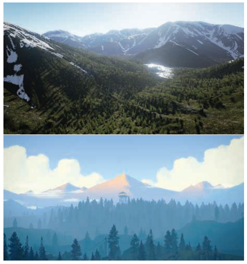

本章节将会讨论一些有关着色的内容，这些内容同时适用于真实感渲染与风格化渲染。在第15章中我们将专门讨论风格化渲染，这是本书中的重要部分之一。而第9-14章，我们会着重讨论基于物理的通用渲染方法，这些方法常用于真实感渲染中。

## 5.1 着色模型

想要确定渲染对象的材质外观，第一步是选择一个着色模型（shading model），这个模型用于描述物体的颜色是如何随着表面朝向、观察方向和光照等因素的变化而变化的。

例如：我们现在将使用Gooch着色模型\[561]的一个变体来渲染物体，Gooch着色模型是一种非真实感渲染（non-photorealistic rendering，NPR）的着色模型，非真实感渲染是第15章的主要内容。Gooch 着色模型被设计用于增加技术插图（工程制图）中细节的易读性。

Gooch着色模型的基本思想是比较表面法线和光源的位置：如果法线直接指向了光源，那么就会使用一种暖色调来给表面着色；如果法线没有指向光源，则会使用一种冷色调来给表面着色；如果法线位于这两个状态之间，则会在冷暖色调之间进行插值，当然用户也可以自定义设置表面的颜色。在这个例子中，我们还会给表面添加一个风格化的高光效果，从而使得物体表面上的某些地方变得更加闪亮。图5.2展示了Gooch着色模型的渲染结果。

着色模型中通常会包含一些用于控制外观表现的属性，确定物体材质外观的下一步，就是设定这些属性的具体数值。我们刚才提到的Gooch着色模型只有一个属性，即表面颜色，如图5.2底部所示。

![图5.2：一种风格化的着色模型，由Gooch着色模型和高光效果组成。顶部的图像展示了一个使用这个着色模型渲染的复杂对象（中国龙），它具有一个中性色调的表面颜色。下部的图像中展示了一系列具有不同表面颜色的材质球。 \[1172\]](images/Chapter-5/20221124084828.png "图5.2：一种风格化的着色模型，由Gooch着色模型和高光效果组成。顶部的图像展示了一个使用这个着色模型渲染的复杂对象（中国龙），它具有一个中性色调的表面颜色。下部的图像中展示了一系列具有不同表面颜色的材质球。 \[1172]")

和大多数着色模型一样，相对于观察方向和光照方向的表面朝向，也会对Gooch着色模型产生影响。为了便于着色计算，这些方向通常都会使用归一化向量（单位向量）来进行描述，如图5.3所示。

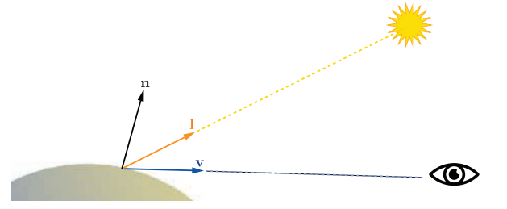

我们有了定义着色模型的全部输入参数，现在我们可以看看Gooch着色本身的数学定义：

$$
\mathbf{c}_{\text {shaded }}=s \mathbf{c}_{\text {highlight }}+(1-s)\left(t \mathbf{c}_{\text {warm }}+(1-t) \mathbf{c}_{\text {cool }}\right).
\tag{5.1} 
$$

在这个方程中，我们使用了以下的中间计算过程：

$$
\begin{aligned} \mathbf{c}_{\mathrm{cool}} &=(0,0,0.55)+0.25 \mathbf{c}_{\mathrm{surface}}, \\ \mathbf{c}_{\mathrm{warm}} &=(0.3,0.3,0)+0.25 \mathbf{c}_{\mathrm{surface}}, \\ \mathbf{c}_{\mathrm{highlight}} &=(1,1,1), \\ t &=\frac{(\mathbf{n} \cdot \mathbf{l})+1}{2}, \\ \mathbf{r} &=2(\mathbf{n} \cdot \mathbf{l}) \mathbf{n}-\mathbf{l}, \\ s &=(100(\mathbf{r} \cdot \mathbf{v})-97)^{\mp} . \end{aligned}
\tag{5.2} 
$$

上述的一些数学表达式，在其他着色模型的计算中也会经常用到。例如clamp（限制）操作，尤其是将数值clamp到0、或0到1，它在着色计算中十分常用。这里我们使用了$x^{\mp}$来代表clamp操作，我们曾在章节1.2的符号约定中提到过，这里是将高光混合系数的计算结果限制到0-1范围内。上述计算过程中出现了三次单位向量点乘的操作，这在着色计算中也十分常见；两个向量的点乘结果，就是各自长度与它们之间夹角余弦值的乘积，而单位向量的模长为1，因此两个单位向量点积的结果，就是这两个向量夹角的余弦值，这个余弦值可以用于衡量两个向量之间的对齐程度。由余弦组成的简单函数是一种令人愉快的数学表达式，它可以精确描述两个方向之间的夹角关系，例如着色模型中光线方向和表面法线之间的关系。

另一个常见的着色操作是在两个颜色之间，使用一个0-1之间的标量来进行线性插值。这个操作的基本形式为$t \mathbf{c}_{\mathrm{a}}+(1-t) \mathbf{c}_{\mathrm{b}}$，其中$t \in [0,1]$，当t在0-1之间变化的时候，最终的结果会在$\mathbf{c}_{\mathrm{a}}$和$\mathbf{c}_{\mathrm{b}}$之间进行插值。在这里的着色模型中，包含了两次线性插值的操作，第一次是在$\mathbf{c}_{\mathrm{warm}}$和$\mathbf{c}_{\mathrm{cool}}$之间进行插值，从而获得表面颜色；第二次是在插值出来的表面颜色和高光颜色$\mathbf{c}_{\mathrm{highlight}}$之间进行插值，从而获得最终输出的颜色。线性插值是一个十分常用的操作，通常着色器都会提供内置（built-in）的函数来进行线性插值，一般叫做$\mathsf{lerp}$或者$\mathsf{mix}$。

表达式$\mathbf{r} =2(\mathbf{n} \cdot \mathbf{l}) \mathbf{n}-\mathbf{l}$计算了光线方向$\mathbf{l}$相对于表面法线$\mathbf{n}$的反射向量（简单画图就可以推导出来）。尽管反射操作并不像之前的clamp操作和线性插值那样用的那么频繁，但是也较为常见，因此大多数着色器语言也都内置了一个$\mathsf{reflect}$函数来计算反射向量。

通过将这些操作，与各种各样的数学公式以及着色参数以不同的方式组合在一起，我们就可以获得各种各样的着色模型，这些着色模型可以是风格化的，也可以是写实的。

## 5.2 光源

在上一小节中的示例着色模型中，光源对着色结果的影响是很简单的，它只提供了一个用于着色的主要方向。但是现实世界中的光照是非常复杂的，可能会有很多个光源，每个光源的大小、形状、颜色以及强度都可能会不相同；而间接光照的情况就更加复杂了，我们将会在第9章讨论这些话题，基于物理的真实感渲染，需要将所有这些参数都纳入考虑。

相反，风格化的着色模型可能会以许多不同的方式来计算光照，这取决于应用程序和视觉风格的需要。而对于一些高度风格化的着色模型而言，可能完全没有光照的概念，或者只是用它来提供一些简单的方向性（例如上一小节中提到的Gooch着色模型）。

对于着色模型而言，光照的复杂性还体现在于，如何使得表面以二元方式（表面材质只有有光和无光两种情况），来对无光或者有光环境做出相应的反应；使用这种着色模型进行渲染的物体表面，在有光照的时候会表现出一种外观，而在没有光照的时候则会表现出另一种外观。这也意味着有一些标准可以用来区分这两种情况：距离光源的距离，阴影（我们将在第7章讨论有关阴影的话题），表面是否背对光源（即表面法线$\mathbf{n}$和光照方向$\mathbf{l}$之间的夹角大于$90^{\circ}$），或者以上这些因素的组合。

这里我们首先使用一个连续变化的光照强度，来替代有光还是无光的二元条件。这可以通过对完全有光和完全无光之间进行插值获得，但是这也意味着，我们能够设定的光照强度是有限的，即从0到1；或者使用一个没有范围限制的光照强度，并使用其他一些方式来对着色过程产生影响。后者的一个常见做法是将着色模型分为lit（受到光照）和unlit（没有受到光照）两部分，并使用光强系数$k_{\mathrm{light}}$来对有光部分进行缩放，具体形式如下：

$$
\mathbf{c}_{\text {shaded }}=f_{\text {unlit }}(\mathbf{n}, \mathbf{v})+k_{\text {light }} f_{\text {lit }}(\mathbf{l}, \mathbf{n}, \mathbf{v})
\tag{5.3} 
$$

方程5.3中的$k_{\mathrm{light}}$只是代表了光照的强度系数，如果还想要表示光源的RGB颜色$\mathbf{c}_{\text {light }}$的话，我们可以将其扩展成如下形式：

$$
\mathbf{c}_{\text {shaded }}=f_{\text {unlit }}(\mathbf{n}, \mathbf{v})+\mathbf{c}_{\text {light }} f_{\text {lit }}(\mathbf{l}, \mathbf{n}, \mathbf{v}),
\tag{5.4} 
$$

如果模型会接收场景中的多个光照的话，则：

$$
\mathbf{c}_{\text {shaded }}=f_{\text {unlit }}(\mathbf{n}, \mathbf{v})+ \sum_{i=1}^{n}\mathbf{c}_{\text {light }_i} f_{\text {lit }}(\mathbf{l}_i, \mathbf{n}, \mathbf{v}).
\tag{5.5} 
$$

其中unlit部分$f_{\text {unlit }}(\mathbf{n}, \mathbf{v})$对应“完全不受光照影响时的外观”，此时着色模型会将光照信息二元化，即分为完全有光条件和完全无光条件。根据我们所希望获得的视觉风格，以及应用程序的需要，这个unlit部分的着色可以有着各种不同的形式。例如当$f_{\text {unlit }}()=(0,0,0)$的时候，会使得物体表面在不接受光照时表现为纯黑色；或者，unlit的部分也可以表现出某种风格化的外观，例如上文中提到的Gooch着色模型，它对于没有接收到光照的表面，会显示一个冷色调的颜色。通常来说，着色模型中的这部分会表现出间接光照或者叫做环境光照的效果（即不是直接由光源直接照射到物体表面上所产生的光照效果），例如来自天空盒的光照，或者是光线在周围物体之间进行弹射而形成的光照。我们将在第10章和第11章讨论其他形式的光照。

我们在前文中提到，如果表面上一点的法线$\mathbf{n}$，与光照方向$\mathbf{l}$之间的夹角大于$90^{\circ}$的话，则说明光源发出的光线来自表面的背后，那么这个光源就不会对这个点产生任何光照效果。一般来说，光线方向与表面法线方向之间的关系，会对着色过程产生影响，而这个例子则可以认为是一般情况中的一个特例。虽然光线方向和表面法线之间的关系是基于物理的，但是这个关系也可以通过简单的几何原理推导出来；而且这个关系对于很多非基于物理的、风格化着色模型也很有用。

为了对表面进行着色，我们可以将光照对表面的影响可视化为一组平行的射线（ray），照射到表面上的射线密度代表了光照的强度。图5.4中展示了受光表面的横截面，光线（射线）之间的间距$d$，与表面法线$\mathbf{n}$和光照方向$\mathbf{l}$之间夹角的余弦值成反比。也就是说，照射到表面上的光线总强度（总能量），与表面法线$\mathbf{n}$和光照方向$\mathbf{l}$之间夹角的余弦值成反比，我们之前已经提到了，两个单位向量之间夹角的余弦值，就等于这两个向量点乘的结果。在这里可以看到为什么我们要将光线的方向向量$\mathbf{l}$定义为从表面碰撞点指向光源，而不是沿着真实的光线方向；如果我们让光线方向指向表面碰撞点的话，那么我们就要在每次点乘运算之前，将光线方向取反。

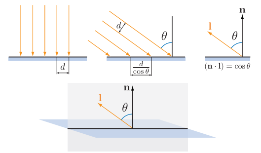

更准确的说，当点乘结果为正的时候，光线强度才与点乘结果成正比；当点乘结果为负的时候，对应了光线来自于表面背后的情况，此时光线对于表面的着色并没有影响。所以在将光线的着色结果与点乘结果相乘之前，我们需要将点乘结果限制到0，我们使用章节1.2中所提到的符号$x^+$来表示限制到0的操作，它代表了如果输入的数值为负数，则直接返回0。考虑光线方向和表面法线之间的关系对着色结果的影响，我们将获得以下方程：

$$
\mathbf{c}_{\text {shaded }}=f_{\text {unlit }}(\mathbf{n}, \mathbf{v})+\sum_{i=1}^{n}\left(\mathbf{l}_{i} \cdot \mathbf{n}\right)^{+} \mathbf{c}_{\mathrm{light}_{i}} f_{\mathrm{lit}}\left(\mathbf{l}_{i}, \mathbf{n}, \mathbf{v}\right)
\tag{5.6} 
$$

支持多光源的着色模型，通常具有类似于方程5.5或者是方程5.6的结构，前者形式更加普遍一些，后者则是基于物理的着色模型所需要的。方程5.6也可以用于构建风格化的着色模型，因为它有助于确保光照效果的一致性，尤其是对于那些背对光源，或者是处于阴影中的表面。但是有些着色模型确实不太适合这种结构，对于这样的模型，可以使用方程5.5中的结构。

对于接受光照的lit部分，最简单的选择就是直接为其设定一个恒定的颜色，即：

$$
f_{\text {lit }}()=\mathbf{c}_{\text {surface }}
\tag{5.7} 
$$

我们将其带入方程5.6中的，可以获得如下的着色模型：

$$
\mathbf{c}_{\text {shaded }}=f_{\text {unlit }}(\mathbf{n}, \mathbf{v})+\sum_{i=1}^{n}\left(\mathbf{l}_{i} \cdot \mathbf{n}\right)^{+} \mathbf{c}_{\text {light }_{i}} \mathbf{c}_{\text {surface }}
\tag{5.8} 
$$

上述方程中的lit部分，其实就是Lambertian（兰伯特）着色模型，该模型由Johann Heinrich Lambert \[967]于1760年提出！（原文中特地使用了感叹号）。Lambertian模型可以用于对理想漫反射表面的着色，例如完美的哑光表面等。这里我们只是简单描述了Lambertian模型，我们将在第9章对其进行更加严格的讨论。Lambertian模型本身可以用于生成简单的着色，同时它也是许多着色模型中所用到的关键构件。

从方程5.3-5.6我们可以看到，一个光源可以通过两个关键参数来与着色模型进行相互作用：指向光源的光线方向$\mathbf{l}$，以及光线的颜色$\mathbf{c}_{\text {light }}$。有各种不同类型的光源，其主要区别在于这两个参数在场景中的变化方式。

接下来我们将讨论几种常见类型的光源，它们都有一个共同点：对于一个给定的表面位置，每个光源都只会从单一方向$\mathbf{l}$照射到表面上。换句话说，从着色点的位置看向光源，光源是一个无穷小的点。现实世界中的光源严格上来说并不是这样的，但是大多数光源自身的尺寸，相对于它们与着色表面之间距离来说都非常小，因此我们将光源抽象成一个点是一个合理的近似。在章节7.1.2和章节10.1中，我们将讨论有关“面光源”的话题，面光源会从一系列方向照亮一个表面。

### 5.2.1 方向光

方向光（Directional light）是光源模型中最简单的一个。对于场景中的方向光，其光线方向$\mathbf{l}$和颜色$\mathbf{c}_{\text {light }}$都是恒定的，除了光线的颜色$\mathbf{c}_{\text {light }}$可能会被场景中的阴影所减弱。真实世界中的光源都是具有确切位置的，但是在渲染中，方向光是没有位置这个概念的。方向光是一个抽象的概念，当场景到光源的距离相对于场景尺寸而言很大的时候，方向光的效果会很好。例如：一个20英尺外的泛光灯对桌面上的一个立体模型进行照明，我们便可以把这个泛光灯看作是一个方向光。方向光的另一个例子就是地球上被太阳所照亮的场景，但是如果我们讨论的是太阳系内的行星是如何被太阳照亮的话，那么就不太能将太阳看成一个方向光了。

方向光的概念可以在某种程度上加以扩展，即在保持光线方向$\mathbf{l}$不变的同时，改变光线的颜色$\mathbf{c}_{\text {light }}$。这通常是出于场景演出或者其他的一些创造性目的，从而将光线的效果绑定到场景中的特定部分。例如：一个区域可能会有两个嵌套（一个在另一个的内部）的方形空间，其中会将外部空间的$\mathbf{c}_{\text {light }}$设定为$(0,0,0)$，即纯黑；将内部空间的$\mathbf{c}_{\text {light }}$设定为另一个恒定的颜色，然后当角色在场景中移动的时候，会通过对这两个空间的颜色进行平滑插值，从而获得方向光的颜色。

### 5.2.2 精确光源

精确光源是英文是punctual light，其中punctual本身有守时、精确的意思，但是这里并不是指光源会准时赴约，而是指灯光有一个确定的位置，并不是像方向光那样没有位置概念，也可以叫做定点光源。精确光源和现实世界中的光源不同，它没有面积、形状和尺寸的概念。 “punctual”来自于拉丁语“punctus”，其意思是“点（point）”；这里我们使用精确光源来描述那些从单一局部位置上发出光线的光源。使用点光源来描述那些向各个方向均匀发射光线的光源。也就是说，点光源和聚光灯是两种不同形式的精确光源。对于表面上的着色点$\mathbf{p}_0$，以及位于点$\mathbf{p}_{\text {light }}$的精确光源，其光线方向$\mathbf{l}$为从点$\mathbf{p}_0$指向点$\mathbf{p}_{\text {light }}$的向量，具体计算方程如下：

$$
\mathbf{l}=\frac{\mathbf{p}_{\text {light }}-\mathbf{p}_{0}}{\left\|\mathbf{p}_{\text {light }}-\mathbf{p}_{0}\right\|}.
\tag{5.9} 
$$

上述方程是向量归一化的一个例子：一个向量除以其模长，可以生成一个相同方向的单位向量。与我们前文所提到的着色操作类似，向量归一化在着色计算中也经常使用，大多数着色语言都会提供内置的函数来完成这个操作。但是有时候我们可能会需要这个计算中的一些中间结果，那么就要将这个归一化过程使用更加基础的操作来分步执行。对于精确光源，其光线方向的分步计算过程如下所示：

$$
\begin{aligned} \mathbf{d} &=\mathbf{p}_{\text {light }}-\mathbf{p}_{0}, \\ r &=\sqrt{\mathbf{d} \cdot \mathbf{d}}, \\ \mathbf{l} &=\frac{\mathbf{d}}{r} . \end{aligned}
\tag{5.10} 
$$

由于两个向量点乘的结果等于两个向量的长度再乘以其夹角的余弦值，而$ 0^{\circ}  $的余弦值是1.0，那么一个向量点乘自身的结果就等于其长度的平方。因此，我们可以让一个向量点乘自身再开平方，从而计算其长度。

通常我们所需要的中间数据是$ r  $，即精确光源和当前着色点之间的距离。除了使用$r$来对光线方向进行归一化之外，还可以用于计算光线颜色随着距离的衰减，我们将在之后的几个章节中进一步讨论。

#### 点光源/泛光灯

向所有方向都均匀发射光线的精确光源被叫做点光源（point light）或者泛光灯（omni light）。对于点光源而言，光线的强度$\mathbf{c}_{\text {light }}$会随着距离$r$的变化而变化，其中唯一的变化源就是上文提到的距离衰减。图5.5展示了这个颜色变暗的原因，这与图5.4中的几何推导过程相类似，都使用了余弦因子。对于一个给定的表面，从一个点光源发出的光线，其间距与光源到表面的距离成正比。

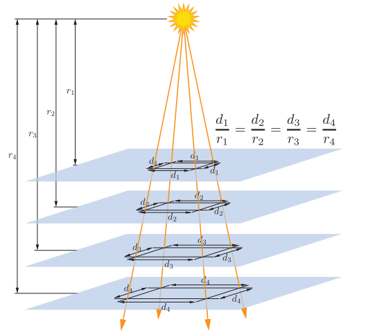

与图5.4中的余弦因子略有不同的是，这个间距会沿着表面上的两个方向维度同时增加，因此光线的强度（即光线的颜色$\mathbf{c}_{\text {light }}$）与平方距离的倒数成正比，即与$1/r^2$成正比。这个特性使得我们可以使用一个单一的光线参数，来指定$\mathbf{c}_{\text {light }}$在空间中发生的变化，这个参数记为$\mathbf{c}_{\text {light}_0}$，即$\mathbf{c}_{\text {light }}$在固定参考距离$r_0$处的值：

$$
\mathbf{c}_{\text {light }}(r)=\mathbf{c}_{\text {light }_{0}}\left(\frac{r_{0}}{r}\right)^{2}
\tag{5.11} 
$$

方程5.11通常被称作光线的平方反比衰减（inverse-square light attenuation），虽然这个方程在从技术上来说，的确正确描述了一个点光源的距离衰减，但是它仍然存在一些问题，会使得它在实际着色计算的使用中并不理想。

第一个问题发生在相对较小的距离上。当距离$r$的值趋近于0的时候，光线颜色$\mathbf{c}_{\text {light }}$的值会迅速无界增长；当距离$r$为0的时候，此时方程就出现了除以0的情况。为了解决这个问题，一个常用的优化方式是给分母加上一个较小的数值$\epsilon$\[861]，即：

$$
\mathbf{c}_{\text {light }}(r)=\mathbf{c}_{\text {light }_{0}} \frac{r_{0}^{2}}{r^{2}+\epsilon}.
\tag{5.12} 
$$

数值$\epsilon$的取值取决于应用程序本身的设定，例如，虚幻引擎中的设定为$\epsilon = 1 \text cm^2$\[861]。

CryEngine \[1591]和寒霜引擎\[960]则使用了另一种优化方式，即将距离$ r  $限制到一个最小的值$r_{min}$，即：

$$
\mathbf{c}_{\text {light }}(r)=\mathbf{c}_{\text {light }_{0}}\left(\frac{r_{0}}{\max \left(r, r_{\min }\right)}\right)^{2}.
\tag{5.13} 
$$

与前一种方法中使用一个有点随意的数值$\epsilon$不同，方程5.13中的$r_{min}$有一个具体的物理解释，即发光物体的物理半径。比$r_{min}$还要小的距离$r$，对应了位于光源内部的着色表面，这在现实中是不可能发生的。

和第一个问题相反的是，平方反比衰减的第二个问题会发生在相对较大的距离上。这个问题与视觉效果无关，而是与性能有关。尽管光线强度会随着距离的增大而不断减小，但是它永远也不会变成0；为了提高渲染效率，我们希望光线强度会在某个有限的距离处衰减到0（第20章）。有很多不同的方法可以对平方反比方程进行修改，从而达到这一目的，在理想情况下，这个修改方法应当尽可能少地引入变化。同时，为了避免在光线影响范围的边界处出现尖锐的截断，最好是在修正过后，函数的值及其导数会在同一位置处达到0。一种解决方案是将平方反比方程乘以具有所需属性的窗函数（window function）。虚幻引擎\[861]和寒霜引擎\[960]所采用的窗函数方程\[860]如下：

$$
f_{\text {win }}(r)=\left(1-\left(\frac{r}{r_{\max }}\right)^{4}\right)^{+2}
\tag{5.14} 
$$

方程中的$+2$意味着，在进行平方操作之前，需要对值进行限制，如果值为负数的话，则将其设置为0。图5.6展示了三条曲线，分别是平方反比曲线，方程5.14中的窗函数曲线，以及二者相乘后的结果。

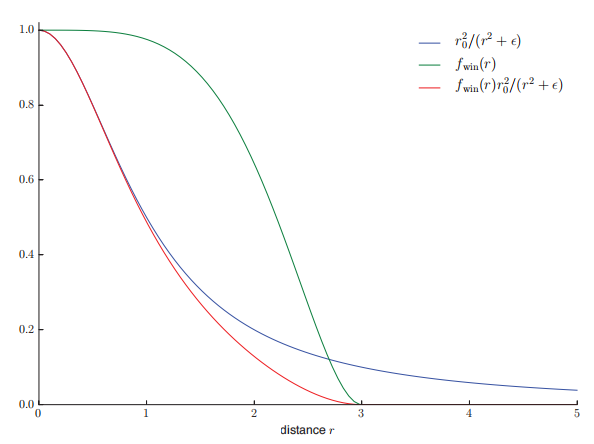

具体使用哪种方法取决于应用程序的需要。例如：当距离衰减函数在一个较低的空间频率上进行采样时（例如光照贴图和逐顶点着色），使得$r_{max}$处的导数为0尤为重要。CryEngine并没有使用光照贴图或者逐顶点着色，因此它采用了一个更加简单的修正方式，即在距离为$0.8r_{max}$和$r_{max}$之间，直接使用线性衰减来替换原来的平方反比衰减\[1591]。

对于某些应用而言，没有必要精确匹配平方反比曲线，因此完全可以使用其他的一些函数来进行代替。这可以有效的将方程5.11-5.14推广为如下形式：

$$
\mathbf{c}_{\text {light }}(r)=\mathbf{c}_{\text {light }_{0}} f_{\text {dist }}(r),
\tag{5.15}
$$

其中$f_{\text {dist }}(r)$是一些关于距离的函数，这样的函数被称为距离衰减函数（distance falloff function）。在某些情况下，由于性能开销受到限制，因此我们需要使用一些非平方反比的衰减函数。例如：在《正当防卫2》中，需要性能开销很低的光照计算，这就要求所使用的距离衰减函数必须简单易算，同时其过渡也要足够平滑，不能出现逐顶点的光照瑕疵（Artifacts）\[1379]，它所使用的距离衰减函数如下所示：

$$
f_{\text {dist }}(r)=\left(1-\left(\frac{r}{r_{\max }}\right)^{2}\right)^{+2}
\tag{5.16} 
$$

在其他情况下，衰减函数的选择也可能会取决于一些艺术风格的考虑。例如：虚幻引擎可以用于制作写实游戏和风格化游戏，对于这两种完全不同的画面风格，虚幻引擎提供了两种光线衰减的模式：一种是方程5.12中所描述的平方反比衰减模式；另一种是指数衰减模式，在这种模式中，可以通过调整参数，来创建各种各样的衰减曲线\[1802]。《古墓丽影（2013）》的开发者使用了一个样条线编辑工具来绘制衰减曲线\[953]，从而可以更好地控制曲线的形状。

#### 聚光灯

与点光源不同的是，现实世界中几乎所有光源的光照，不仅会随着距离的改变而发生变化，同样也会随着方向的改变而发生变化，这种变化可以表示为一个方向性的衰减函数$f_{\text {dir }}(\mathbf{l})$，它与距离衰减函数组合在一起，便完整定义了光照强度在空间中的变化：

$$
\mathbf{c}_{\text {light }}=\mathbf{c}_{\text {light }_{0}} f_{\text {dist }}(r) f_{\text {dir }}(\mathbf{l})
\tag{5.17} 
$$

选择不同的$f_{\text {dir }}(\mathbf{l})$可以生成不同的光照效果，其中一种很重要的效果是聚光灯（spotlight），它会将光线投射在一个圆锥体的内部。聚光灯的方向衰减函数围绕其方向向量$\mathbf{s}$具有旋转对称性，因此这个衰减可以表示为向量$\mathbf{s}$，与到达表面的反向光线向量$\mathbf{-l}$之间夹角$\theta_{s}$的函数。这里的光线向量需要进行取反，这是因为我们是在着色表面上定义光线向量$\mathbf{l}$的，该向量会指向光源，而这里我们需要这个向量指向远离光源的方向。

大多数聚光灯函数都会使用包含夹角$\theta_{s}$的余弦表达式，这是着色计算中表达角度最常用的方式（正如我们之前所看到的一些着色方程）。通常聚光灯都会有一个本影角（umbra angle）$\theta_{u}$，对于$\theta_{s} \ge \theta_{u}$的所有光线，会将其距离衰减函数限制为$f_{\text {dir }}(\mathbf{l})=0$。这个角度可以用于剔除，其原理类似于我们之前在点光源所提到的最大衰减距离$r_{\text {max }}$。聚光灯通常还具有一个半影角（penumbra angle）$\theta_{p}$，它定义了一个位于内部的小圆锥体，位于这个小圆锥体内部的光线，具有最大的光线强度。如图5.7所示：

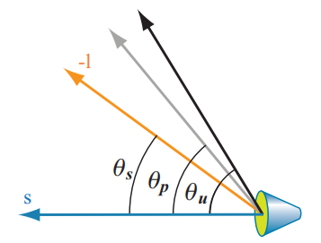

有各种各样的方向衰减函数可以用于聚光灯，但是它们的形式基本都相似。例如：寒霜引擎\[960]中使用的方向衰减函数是$f_{\text {dir}_{F}}(\mathbf{l})$，而three.js（一个浏览器图形库）\[218]所使用的则是$f_{\text {dir}_{T}}(\mathbf{l})$，它们的具体形式如下所示：

$$
\begin{aligned} t & =\left(\frac{\cos \theta_{s}-\cos \theta_{u}}{\cos \theta_{p}-\cos \theta_{u}}\right)^{\mp}, \\ f_{\operatorname{dir}_{\mathrm{F}}}(\mathbf{1}) & =t^{2}, \\ f_{\operatorname{dir}_{\mathrm{T}}}(\mathbf{l}) & =\text { smoothstep }(t)=t^{2}(3-2 t) .\end{aligned}
\tag{5.18} 
$$

回顾一下，我们在章节1.2中提到过，符号$x^{\mp}$代表了会将$x$的值限制到0-1之间。其中的smoothstep函数是一个三次多项式，通常用于着色计算中的平滑插值，在大多数着色语言中，它都是一个内置的函数。

图5.8展示了我们到目前为止讨论过的一些光照类型。

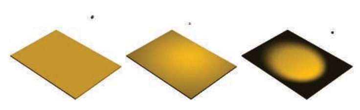

#### 其他精确光源（Other Punctual Lights）

还有很多其他的方式可以让一个精确光源的光线强度$\mathbf{c}_{\text {light }}$发生变化。

$f_{\text {dir }}(\mathbf{l})$函数也不仅仅局限于上面所讨论的简单聚光灯衰减函数，它可以表示任何类型的方向变化，包括从真实世界光源测量而来的复杂表格数据模式。照明工程学会（Illuminating Engineering Society， IES）为此类度量定义了标准的文件格式，这些IES配置文件可以从许多照明设备的制造商处获得，并且已经在游戏《杀戮地带：暗影坠落》\[379, 380]中进行了实际应用，除此之外也在例如虚幻\[861]和寒霜\[960]等游戏引擎中进行了应用。Lagarde给出了一个有关解析和使用该文件格式的良好总结\[961]。

《古墓丽影（2013）》\[953]中有着一类特殊的精确光源，它可以对沿世界方向的$x,y,z$轴应用独立的衰减函数。除此之外，还可以使用自定义编辑的曲线来让光线强度随时间发生变化，例如生成一个闪烁的火炬效果。

在章节6.9中，我们将讨论如何使用纹理贴图来改变光线的强度和颜色。

### 5.2.3 其他光源类型

方向光和精确光源的主要特征是如何计算光线方向$\mathbf{l}$，我们可以使用其他一些方法来计算光线方向，从而定义不同类型的光源。例如：除了上文中所提到的光源类型之外，《古墓丽影（2013）》中还有一种特殊的胶囊光，它使用了一个线段来作为光源，而不是一个点\[953]。对于每个需要进行着色的像素，会将该像素与距离线段上最近点的方向作为光线方向$\mathbf{l}$。

只要着色器使用了光线方向$\mathbf{l}$和光线强度$\mathbf{c}_{\text {light }}$来计算着色方程，那么我们可以使用任何方法来计算这些值。

到目前为止，我们所讨论的光源类型都是抽象的；而在现实世界中，光源具有大小和形状，它们会从多个方向照亮表面上的一个点。在渲染领域中，这种光源类型被称为面光源（area light），它们在实时应用程序中的应用正在稳步增加。面光源渲染技术可以分为两类：一类是模拟光线被部分遮挡，从而导致阴影边缘软化（软阴影）的方法（章节7.1.2）；另一类是模拟面光源对表面着色影响的方法（章节10.1）。第二类光照效果在光滑镜面上体现得最为明显，我们可以通过镜面反射，清晰得看到面光源的大小和形状。尽管方向光和精确光源已经不再像以前那样无处不再了，但是它们也不太可能被废弃。对面光源的近似方法已经有了一定的发展，其实现成本也相对便宜，因此得到了广泛的应用。同时，不断提高的GPU性能也允许使用比过去更加复杂的技术。

## 5.3 实现着色模型

为了在实际中进行应用，这些着色方程和光照方程必须要在代码中进行实现。在本小节中，我们将讨论在设计与编写此类实现时，需要考虑的一些关键注意事项，同时我们还会介绍一个简单的实现案例。

### 5.3.1 计算频率

当设计一个着色实现的时候，我们需要评估它的计算频率（frequency of evaluation），并对计算进行划分。首先，需要确定一个给定的计算结果在整个draw call中是否总为常数。尽管GPU的计算着色器可以用于一些开销很大的计算，但是如果这个计算结果是常数的话，那么可以让应用程序来完成（即在CPU上完成），然后通过统一的着色器输入传递给图形API，这样可以大大减少重复计算量。

即使在这一类常数计算结果中，计算频率也会有很大的变化范围，我们从“只计算一次”开始讨论。最简单的情况就是着色方程中的常数子表达式，这种情况也适用于那些包含极少变化的计算因子，例如硬件配置和安装选项等。这样的着色计算可能会在着色器编译阶段就直接完成了，在这种情况下，我们甚至不需要设置一个统一的着色器输入。又或者，这些计算可以在安装和加载应用程序时，在离线预计算的过程中完成。

另一种情况是，一个着色计算的结果会在应用程序运行的过程中发生变化，但是其变化的频率很慢，因此并不需要每一帧都进行更新。例如：在一个虚拟的游戏世界中，光照效果取决于一天中所处的时间，如果这个计算开销很大的话，则可以将其分摊到多个帧中进行计算。

其他的情况包括每帧仅执行一次的计算，例如连接观察变换和透视变换矩阵；或者每个模型一次的计算，例如对依赖于模型位置信息的光照参数进行更新；或者每个draw call一次的计算，例如更新模型上的材质参数。根据计算频率对统一的着色器输入进行分组，可以大大提高应用程序的效率；还可以通过最小化常量更新，来提升GPU的性能\[1165]。

如果一个着色计算的结果在一次draw call中会发生变化，那么它就无法通过统一的着色器输入来将其传递给着色器。相反，它必须由第3章中所描述的可编程着色器阶段中的一个来进行计算，如果需要的话，还可以使用可变着色器输入，来将其传递给其他的着色器阶段。理论上而言，着色计算可以在任意一个可编程阶段中执行，每个阶段都对应着一个不同的计算频率：

-   顶点着色器（Vertex Shader）——在每个曲面细分前的顶点上进行计算。
-   壳着色器（Hull Shader）——在每个表面面片上进行计算。
-   域着色器（Domain shader）——在每个曲面细分后的顶点上进行计算。
-   几何着色器（Geometry shader）——在每个图元上进行计算。
-   像素着色器（Pixel shader）——在每个像素上进行计算。

在实际实现中，大部分着色计算都是逐像素执行的，虽然这些计算通常都是在像素着色器中完成，但是使用计算着色器来实现的例子也越来越多，我们会在第20章讨论几个例子；而其他的几个阶段主要用于几何操作，例如变换和变形等。为了理解为什么要这么做，我们现在对逐顶点（per-vertex）和逐像素（per-pixel）的着色计算结果进行一些比较。在一些较老的书籍中，这两种不同的着色方式有时被称为Gouraud shading \[578]和Phong shading \[1414]，但是现在这些术语已经不常使用了。这次对比测试使用了一个类似于方程5.1中描述的着色模型，不同之处在于，我们对其进行了修改，使其可以支持多个光源，完整的着色模型会在稍后给出，届时我们会详细介绍这个示例实现。

图5.9展示了在不同顶点密度的模型上，进行逐像素着色和逐顶点着色的结果。对于最底部的龙模型而言，它是一个非常密集的网格，它的顶点数量很大，逐像素着色和逐顶点着色的结果差别很小；但是对于中间的茶壶而言，顶点着色会导致可见的着色错误，例如棱角形状的高光；对于最上面的三角形平面而言，顶点着色的结果是明显错误的。这些错误的原因是由于着色方程中的一部分项（尤其是高光部分），在网格表面上具有非线性变化的值。这使得它们并不适合在顶点着色器中进行实现，因为顶点着色器的计算结果，会在光栅化阶段被线性插值，然后再输入到像素着色器中。

![图5.9：使用 方程5.19 中所描述的着色模型，来对比逐顶点着色和逐像素着色之间的区别，其结果分别显示在了三个不同顶点密度的模型上。最左侧的一列图片展示的是逐像素计算的结果；中间一列图片展示的是逐顶点计算的结果；最右侧一列图片展示了模型的线框渲染结果，用于显示顶点密度。 \[1172\]](images/Chapter-5/20230111193845.png "图5.9：使用 方程5.19 中所描述的着色模型，来对比逐顶点着色和逐像素着色之间的区别，其结果分别显示在了三个不同顶点密度的模型上。最左侧的一列图片展示的是逐像素计算的结果；中间一列图片展示的是逐顶点计算的结果；最右侧一列图片展示了模型的线框渲染结果，用于显示顶点密度。 \[1172]")

原则上来说，我们可以在像素着色器中只计算着色模型的高光（specular highlight）部分，并在顶点着色器中计算着色模型的剩余部分，这样应该就不会产生视觉瑕疵了，而且在理论上会节省一些计算量。但是在实践中，这种混合的实现方式往往并不是最优选择。首先，着色模型线性变化的部分往往是计算成本最小的部分，并且以这种方式将计算过程分离开来，也会带来额外的性能开销，例如重复的计算和额外的可变输入等，从而导致弊大于利。

正如上文中所提到的，在大多数实现中，顶点着色器负责的操作都是非着色的，例如几何变换和变形操作。几何表面上的属性在被转换为合适的坐标空间后，最终会被顶点着色器输出，并在三角形上进行线性插值，然后作为可变着色器输入，被传递到像素着色器中，这些属性通常包含了表面位置、表面法线、以及可选的表面切向量（如果需要进行法线映射的话）等。

需要注意的是，即使顶点着色器总是会输出单位长度的的表面法线，但是光栅化插值也可能会改变它们的长度，如图5.10左侧所示，因此需要在像素着色器中重新将法线进行归一化（将长度缩放为1）。虽然如此，在顶点着色器中输出单位长度的法线仍然十分重要，如果顶点之间的法线长度变化很大的话（例如顶点混合的副作用），这将会使得法线插值的结果发生倾斜，如图5.10的右侧所示。由于这两种影响，因此在实际的实现中，通常会对插值前和插值后的向量都进行归一化，即在顶点着色器和像素着色器中进行归一化。

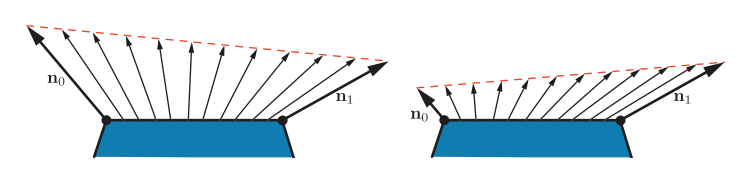

与表面法线不同，指向特定位置的向量（例如观察向量和光线向量），通常并不会进行插值。相反，在像素着色器中， 会使用插值而来的表面位置来计算这些向量。除了对向量进行归一化之外（正如我们所看到的，在任何情况下，像素着色器中的向量在使用之前，都需要进行归一化），这些向量都会使用向量减法来进行计算，这样做的速度很快。如果出于某种原因，我们需要对这些向量进行插值的话，那么在插值之前，一定不要对它们进行归一化，因为这样会得到错误的结果，如图5.11所示。

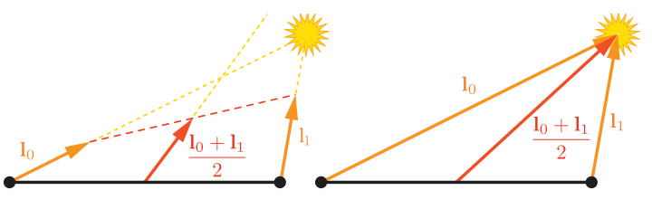

在上文中我们提到，顶点着色器会将表面的几何属性转换到“合适的坐标系”中，最后再输入到像素着色器中。而相机位置和光源位置，通常也需要由应用程序来将其转换到相同的坐标系中，然后再通过统一变量传递给像素着色器。这样做的好处是显而易见的，我们不需要在像素着色器中，再对这些向量进行大量的坐标变换，这样可以最小化像素着色器中的重复计算。但是现在有一个问题，到底哪个坐标系才是“合适的坐标系”呢？可能的坐标系包括全局的世界空间，或者是相机的局部坐标系（观察空间），或者是更为罕见的、当前渲染模型的局部坐标系。这个坐标系的选择，通常需要将整个渲染系统作为一个整体，综合考虑系统的性能、灵活性和简单性。例如：如果渲染场景中包含大量的光源，那么可以选择全局的世界空间来避免改变光源的位置；或者最好是选择相机空间，这样可以优化与观察方向相关的像素着色器操作，并提高渲染精度（详见章节16.6）。

尽管大多数的着色器实现（包括我们即将要讨论的示例实现），都遵循了我们上面描述的大纲，但是当然也有一些例外情况。例如：一些应用程序出于风格上的原因，选择了基于逐图元的着色计算，这样的风格通常被称作平面着色（flat shading），图5.12展示了两个平面着色的例子。

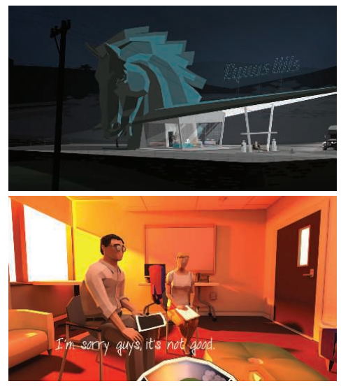

原则上来说，平面着色的效果可以在几何着色器中完成，但是最近的实现通常都是使用顶点着色器来完成的。这是通过将每个图元的属性和第一个顶点绑定起来，同时禁用顶点插值来实现的。禁用顶点插值（可以对每个顶点单独执行）将会导致第一个顶点的属性会被应用到该图元中的每个像素上。

### 5.3.2 实现示例

这里我们将展示一个着色模型的实现示例。在上文中我们提到，我们将要实现的着色模型类似于方程5.1中所描述的Gooch着色模型，不同的是这个模型进行了扩展，可以支持多个光源，其数学描述如下：

$$
\mathbf{c}_{\text {shaded }}=\frac{1}{2} \mathbf{c}_{\text {cool }}+\sum_{i=1}^{n}\left(\mathbf{l}_{i} \cdot \mathbf{n}\right)^{+} \mathbf{c}_{\text {light }_{i}}\left(s_{i} \mathbf{c}_{\text {highlight }}+\left(1-s_{i}\right) \mathbf{c}_{\text {warm }}\right),
\tag{5.19} 
$$

其中的一些中间变量如下所示：

$$
\begin{aligned} \mathbf{c}_{\mathrm{cool}} & =(0,0,0.55)+0.25 \mathbf{c}_{\mathrm{surface}}, \\ \mathbf{c}_{\mathrm{warm}} & =(0.3,0.3,0)+0.25 \mathbf{c}_{\mathrm{surface}}, \\ \mathbf{c}_{\text {highlight }} & =(2,2,2), \\ \mathbf{r}_{i} & =2\left(\mathbf{n} \cdot \mathbf{l}_{i}\right) \mathbf{n}-\mathbf{l}_{i}, \\ s_{i} & =\left(100\left(\mathbf{r}_{i} \cdot \mathbf{v}\right)-97\right)^{\mp} .\end{aligned}
\tag{5.20} 
$$

方程5.19的形式符合我们在方程5.6中描述的多光源结构，为了方便对照，这里我们回顾一下方程5.6的具体形式：

$$
\mathbf{c}_{\text {shaded }}=f_{\text {unlit }}(\mathbf{n}, \mathbf{v})+\sum_{i=1}^{n}\left(\mathbf{l}_{i} \cdot \mathbf{n}\right)^{+} \mathbf{c}_{\mathrm{light}_{i}} f_{\mathrm{lit}}\left(\mathbf{l}_{i}, \mathbf{n}, \mathbf{v}\right) 
$$

对于方程5.19而言，其中的lit项和unlit项分别是：

$$
\begin{aligned} f_{\text {unlit }}(\mathbf{n}, \mathbf{v}) & =\frac{1}{2} \mathbf{c}_{\mathrm{cool}}, \\ f_{\mathrm{lit}}\left(\mathbf{l}_{i}, \mathbf{n}, \mathbf{v}\right) & =s_{i} \mathbf{c}_{\text {highlight }}+\left(1-s_{i}\right) \mathbf{c}_{\text {warm }},\end{aligned}
\tag{5.21} 
$$

调整unlit项中的冷色贡献值，可以让结果看起来更像原来的方程。

在大多数典型的渲染应用程序中，诸如$\mathbf{c}_{\mathrm{surface}}$之类的可变材质属性都会存储在顶点数据中，或者更加常见的做法是存储在一张纹理中（第6章）。这里为了让这个示例的简单易懂，我们假设$\mathbf{c}_{\mathrm{surface}}$在整个模型中都是恒定的。

这个着色模型的实现将会使用着色器的动态分支功能，来所有的光源进行遍历；这是一种很简单直接的方法，它在一些比较简单的场景中可以正常工作，但是对于一些拥有很多光源的大型复杂场景而言，它的效率就很低了。有关如何处理场景中大量光源的渲染技术，将在第20章中进行介绍。此外，为了简单起见，这里我们只会支持点光源这一种光源类型。虽然本小节中的实现非常简单，但是它遵循了前面我们提到的最佳实践原则。

着色模型通常并不是单独实现的，而是在一个更大的渲染上下文框架（context）中实现的。这个示例是在一个简单的WebGL 2应用程序中实现的，它由Tarek Sherif \[1623]所开发的“Phong-shaded Cube”WebGL 2修改而来，虽然它很简单，但是同样的原理也适用于更加复杂的渲染框架。

我们将讨论一些GLSL着色器代码，以及JavaScript WebGL调用的示例，本小节的目的并不是教授WebGL API的细节，而是为了展示通用的实现原则。我们将从“由内而外”的顺序来讲解整个实现过程，首先是从像素着色器开始，然后是顶点着色器，最后是应用程序端的图形API调用。

着色器源文件中应当包含对着色器输出输出的定义，这样的着色器代码才是正确完整的。正如我们在章节3.3所讨论的，使用GLSL的术语来进行描述，即着色器输入会分为两类：第一类是一组统一输入，这些值是由应用程序进行设置的，并且在一次draw call的过程中会保持不变；第二类会包含一系列的可变输入，这些值可以在着色器调用（像素着色器或者顶点着色器）之间发生变化。下面给出了一些像素着色器的可变输入（在GLSL中使用$\mathsf{in}$来进行标记），以及像素着色器的输出值（使用$\mathsf{out}$来进行标记）：

```glsl
in vec3 vPos ;
in vec3 vNormal ;
out vec4 outColor ;
```

这个像素着色器只有一个输出，即最终的着色颜色。而像素着色器的输入与顶点着色器的输出是相匹配的，这些参数在输入像素着色器之前，会在三角形上进行插值。这个像素着色器有两个可变输入：表面位置和表面法线，二者均位于应用程序的世界空间坐标系中。统一输入的数量要大得多，所以简单起见，这里我们只展示两个与光源有关的定义：

```glsl
struct Light {
    vec4 position ;
    vec4 color ;
};
uniform LightUBlock {
    Light uLights [ MAXLIGHTS ];
};
uniform uint uLightCount ;
```

由于这些光源都是点光源，因此每个光源定义中都只包含一个位置和一个颜色。这两个数据都被定义成了$\mathsf{vec4}$类型而不是$\mathsf{vec3}$类型，以符合GLSL $\mathsf{std140}$数据布局标准的限制。虽然在这个例子中，$\mathsf{std140}$布局会浪费一些空间，但是这简化了确保CPU和GPU之间数据布局一致性的任务，这也是为什么我们在这个示例中使用它的原因。$\mathsf{Light}$数组是在一个被标记为$\mathsf{uniform}$的代码块内部定义的，这是GLSL的一个特性，用于将一组统一变量绑定到一个缓冲区对象中，从而加快数据传输的速度。$\mathsf{Light}$数组的长度被定义为应用程序在一次draw call中所允许的最大光源数量。我们将在下文中看到，应用程序会在着色器编译之前，使用正确的数值（在这个例子中是10）来替换着色器源代码中的字符串$\mathsf{MAXLIGHTS}$。统一的整数$\mathsf{uLightCount}$代表了在这次draw call中实际可用的光源数量。

接下来，我们来看一下像素着色器的具体代码：

```glsl
vec3 lit ( vec3 l, vec3 n, vec3 v) {
    vec3 r_l = reflect (-l, n) ;
    float s = clamp (100.0 * dot (r_l , v) - 97.0 , 0.0 , 1.0) ;
    vec3 highlightColor = vec3 (2 ,2 ,2) ;
    return mix ( uWarmColor , highlightColor , s);
}

void main () {
    vec3 n = normalize ( vNormal );
    vec3 v = normalize ( uEyePosition .xyz - vPos );
    outColor = vec4 ( uFUnlit , 1.0) ;
    
    for ( uint i = 0u; i < uLightCount ; i ++) {
        vec3 l = normalize ( uLights [i]. position . xyz - vPos );
        float NdL = clamp ( dot (n, l) , 0.0 , 1.0) ;
        outColor . rgb += NdL * uLights [i]. color . rgb * lit (l,n,v);
    }
}

```

我们有一个计算$\mathsf{lit}$项的函数定义，它会在$\mathsf{main()}$函数中进行调用，总的来说，这是方程5.20和方程5.21的一个简单GLSL实现。请注意，$f_{unlit}()$和$c_{warm}$的值是通过统一变量输出的，由于这些变量的值在一次draw call中都是常数，因此可以由应用程序来计算这些值，从而节省一些GPU的计算周期。

这里展示的像素着色器使用了一些内置的GLSL函数。其中$\mathsf{reflect()}$函数会在第二个输入向量（平面法线）所定义的平面上，将第一个输入向量进行反射；在本例中，被反射的是光线方向。由于我们希望光线向量和反射向量都是指向远离表面的方向，因此我们需要将先光线方向取反，然后再输入到$\mathsf{reflect()}$函数中。$\mathsf{clamp()}$函数有三个输入参数，后两个参数决定了第一个参数被限制的范围。一个特殊的限制范围是0-1之间（对应HLSL中的$\mathsf{saturate()}$函数），这个运算的速度是很快的，对于大多数GPU而言，几乎没有什么开销。这也是我们在这里使用这个函数的原因，尽管我们只需要将这个参数限制到0，因为我们已经知道了它的结果不会超过1。函数$\mathsf{mix()}$同样包含三个输入参数，它会根据第三个参数（位于0-1之间），在前两个参数之间进行线性插值；在这个例子中是根据参数$s$，在暖色和高光颜色之间进行插值。在HLSL中这个函数叫做$\mathsf{lerp()}$，意思是“线性插值（linear interpolation）”。最后，函数$\mathsf{normalize()}$会将输入向量除以这个向量的模长，即将其长度缩放为1。

现在让我们来看看顶点着色器，由于我们已经在像素着色器中看到一些统一定义的例子了，因此这里我们不会再展示顶点着色器的统一定义，但是可变输入和输出的定义还是值得看一下的：

```glsl
layout ( location = 0) in vec4 position ;
layout ( location = 1) in vec4 normal ;
out vec3 vPos ;
out vec3 vNormal ;
```

请注意，我们之前提到过，顶点着色器的输出项是与像素着色器的输入项匹配的。这些输入参数还包括指定如何在顶点数组中排列数据的指令。顶点着色器的代码如下:

```glsl
void main () {
    vec4 worldPosition = uModel * position ;
    vPos = worldPosition.xyz ;
    vNormal = (uModel * normal ).xyz ;
    gl_Position = viewProj * worldPosition ;
}
```

这些都是顶点着色器中的常见操作，它将表面位置和法线转换到世界空间中，并将其传递给像素着色器以用于着色计算。最终，表面位置会被变换到裁剪空间中，并传递给$\mathsf{gl\_Position}$，$ \mathsf{gl\_Position}  $是一个光栅化器所使用的、特殊的系统定义变量，它是任何顶点着色器所必须的输出。

需要注意的是，法线向量并没有在顶点着色器中进行归一化，这是因为原始网格数据中的法线长度就已经为1了，并且应用程序没有执行任何可能会改变法线长度的操作，例如顶点混合或者非均匀缩放等。模型变换矩阵中确实包含一个均匀缩放的比例系数，但是它会按比例改变所有法线的长度，因此并不会导致图5.10右侧所展示的问题。

示例中的应用程序使用WebGL API来进行各种渲染设置和着色器设置。每个可编程的着色器阶段都可以单独进行设置，然后它们会被绑定到一个程序对象上。以下是像素着色器设置的代码：

```javascript
var fSource = document.getElementById ("fragment").text .trim () ;

var maxLights = 10;
fSource = fSource.replace(/MAXLIGHTS/g, maxLights.toString () );

var fragmentShader = gl.createShader(gl.FRAGMENT_SHADER);
gl. shaderSource ( fragmentShader , fSource );
gl. compileShader ( fragmentShader );
```

请注意代码中提到的“片元着色器（fragment shader）”，这个术语被WebGL（以及它所基于的OpenGL）所使用。但是正如本书前面所提到的那样，虽然“像素着色器（pixel shader）”在某些方面确实不那么精确，但是它是更加常见的用法，因此我们会在整本书中都使用像素着色器这个名称。这段代码也将$\mathsf{MAXLIGHTS}$字符串替换为适合的值，大多数渲染框架会都执行类似这样的着色器预编译操作。

还有很多应用程序端的代码会用于设置统一输入变量、初始化顶点数组、清除、绘制等，这些代码可以都可以在示例程序\[1623]中找到，并且有很多API指南它们进行了说明解释。本小节的目标是，了解着色器是如何被视为独立处理器的，以及它们自身独特的编程环境。因此我们有关示例着色程序的讨论到此就结束了。

### 5.3.3 材质系统

渲染框架很少只会实现一个单独的着色器，因此通常需要一个专门的系统，来处理应用程序中用到的各种各样的材质、着色模型和着色器。

正如前面章节中所介绍的那样，着色器是某个GPU可编程着色阶段中的一个程序。因此着色器是一个底层（low-level）的图形API资源，而不是艺术家可以直接进行交互的东西；相比之下，材质（material）对表面的视觉外观进行了封装，它才是直接面向艺术家的资源。材质有时候也会描述一些非视觉方面的内容，例如碰撞特性（物理材质）等，但是我们并不会对其进行进一步讨论，因为它超出了本书的范围。

虽然材质是通过着色器实现的，但是这并不是简单的一对一关系。在不同的渲染场景中，有时候相同的材质可能也会使用不同的着色器，一个着色器也可能会被多种材质所共享。最常见的情况就是参数化材质，在最简单形式中，材质参数化需要两种材质实体：材质模板（material template）和材质实例（material instance）。每个材质模板都描述了一类材质，并且包含了一组参数，根据参数类型的不同，可以为其指定具体的数值、颜色或者纹理贴图等。每个材质实例对应了一个材质模板，以及一组包含所有参数的特定值。一些渲染框架（例如虚幻引擎\[1802]）允许构建一个更加复杂的层次材质结构，其中的材质模板可以由其他的多层次模板派生而来。

这些参数可以在运行时，通过统一输入来传递给着色器程序；或者是在着色器编译阶段，通过替换着色器中的一些值来完成。最常见的编译时参数类型就是一个布尔开关，使用这个布尔值来控制一个给定的材质特性是否会被激活。这样的开关可以由艺术家通过材质GUI中的一个勾选框来进行设置；也可以通过材质系统在程序上进行设置，例如：材质系统可以自动对渲染质量进行调整，来降低远处物体的着色成本，而这个修改在视觉效果上则可以忽略不记。

虽然材质参数可能与着色模型中的参数一一对应，但是情况也并非总是如此的。材质可以对给定的着色模型参数进行修改，例如将表面颜色修改成一个固定的值。又或者，可能会将多个材质参数，以及顶点插值结果和纹理值作为输入，通过一系列复杂的操作，来计算着色模型中的某一个参数。在某些情况下，诸如表面位置、表面朝向甚至是时间等参数，都会对计算产生影响。基于表面位置和表面朝向的着色，在地形材质中尤其常见，例如：可以使用高度和表面法线来控制积雪的效果，具体实现方式是在高海拔的水平表面以及近乎水平的表面上，混合叠加一个白色。基于时间的着色在动画材质中十分常见，例如闪烁的霓虹灯标志。

材质系统最重要的任务之一，就是将各种着色器功能划分为独立的元素，并控制这些元素的组合方式。这种组合是十分有用的，例如以下几种情况：

-   将表面着色和几何处理结合在一起，例如刚体变换、顶点混合、曲面细分、实例化以及裁剪等。这些功能是独立变化的：表面着色依赖于材质，而几何处理则依赖于模型网格。因此，将这些功能分开编写，并使用材质系统对它们进行按需组合是十分方便的。
-   将表面着色和一些合并操作组合在一起，例如像素丢弃（discard）和像素混合（blending），这与移动端的GPU尤其相关，因为其中的混合通常是在像素着色器中执行的。通常我们都希望独立于着色材质来选择这些特殊操作。
-   将计算着色模型参数的操作，与计算着色模型本身的操作组合在一起。这样做可以在计算其他着色模型的时候，复用之前已经实现过的操作和函数。
-   将独立可选的材质特性相互组合，并与逻辑选择、着色器的剩余部分组合在一起。这种方式允许独立编写每个材质特性的实现。
-   将着色模型及其参数计算，与光源计算组合在一起：即计算每个光源在着色点上的颜色$\mathbf{c}_{light}$和方向$\mathbf{l}$。例如延迟渲染等技术（在第20章中进行讨论）可以改变这种组合的结构。在支持多种此类技术的渲染框架中，这增加了额外的复杂性。

如果图形API能提供这种着色器代码模块化的核心功能，那就太方便了。然而悲伤的是，与CPU代码不同，GPU着色器并不允许在编译后再去链接代码片段，即每个着色器阶段的程序都会被编译成一个独立的单元。着色器阶段之间的分离确实提供了有限的模块化，这有点像上述清单中的第一项：将表面着色（通常在像素着色器中执行）与几何处理（通常在其他着色器阶段执行）相结合。但是这种类比是不完美的，因为每个着色器还会执行其他的操作，并且还需要处理其他类型的组合。考虑到这些限制的存在，材质系统能够实现上述这些组合类型的唯一方法，就是在源代码级别进行组合。这主要涉及字符串操作（例如连接和替换），这通常是通过类似于C语言风格的预处理指令来完成，例如$\mathsf{\#include}$，$\mathsf{\#if}$和$\mathsf{\#define}$。

早期的渲染系统包含相对较少的着色器变体，并且通过都是手动编写的。这样做有一定的好处，例如：我们可以在充分了解着色器程序的基础上去，对每个变体都进行优化。但是随着变体数量的不断增加，这种方法很快就变得不切实际了。考虑到着色器中的所有不同部分和选项时，着色器变体的数量可能会十分巨大，这也是为什么模块化和可组合性是如此重要的原因。

当设计一个用于处理着色器变体的系统时，需要解决的第一个问题就是：不同选项之间的选择，是在运行时使用动态分支来完成的，还是在编译时通过条件预处理来完成。在一些较老的GPU硬件上，动态分支通常是不可能的，或者是非常低效的，因此在运行时进行选择是不可取的。因此所有变体都是在编译时进行处理的，包括不同光源类型的所有可能组合\[1193]。

相比之下，当前的GPU硬件可以很好的支持动态分支，尤其是当该分支在一次draw call中对所有的像素做相同处理的时候。如今很多功能变体，例如光源数量，都是在运行时处理的。但是，向着色器中添加大量功能变体会带来另一种不同的开销：寄存器计数的增加，以及占用率的降低，从而导致性能下降（详见章节18.4.5）。因此在编译阶段处理变体仍然是很有价值的，它能够避免包含那些从不被执行的复杂逻辑。

作为一个例子，让我们想象一个支持三种不同类型光源的应用程序。其中有两个光源类型是很简单的：点光源和方向光。第三种光源则是一个广义的聚光灯，它支持表格照明模式以及其他复杂的特性，这需要使用大量的着色器代码来实现。但是这种广义的聚光灯在应用程序中使用的很少，只有大概不到5%。在过去，为了避免动态分支，我们会为三种光源类型的（可能出现的）每种计数组合都生成一个独立的着色器变体。尽管现在可能并不需要这种方式了，但是编译两个独立的变体仍然是很有用的，其中一个用于聚光灯数量大于等于1的情况，另一种用于聚光灯数量恰好为0的情况。第二种情况的着色器代码更加简单，也更加常用（对应95%的使用场景），其寄存器使用量也更低（意味着可以实现更高的占用率），因此具有更好的性能表现。

现代的材质系统会同时使用运行时着色器变体和编译时着色器变体。尽管现在我们并不只在编译阶段进行处理，但是总体的复杂性和变体数量仍在不断增加，因此仍然有大量的着色器变体需要进行编译。例如：在游戏《命运：邪神降临》（命运的一个大型DLC）的某些区域中，在一帧内使用了超过9000个预编译的着色器变体\[1750]。可能存在的变体数量则更为巨大，例如：Unity 渲染系统中有着接近 1000 亿个可能的着色器变体。虽然只有那些实际用到的变体才会进行编译，但是必须要对着色器编译系统进行重新设计，才能处理数量如此巨大的潜在变体\[1439]。

材质系统的设计者采用了不同的策略来解决这些设计目标，虽然这些策略有时候会表现出互斥的系统结构\[342]，但是这些策略确实可以被整合在同一个系统中。这些策略包含以下内容：

-   代码复用——在共享文件中实现可复用的函数，使用预处理指令$\mathsf{\#include}$，可以在任何需要的着色器中访问这些函数。
-   做减法——如果一个着色器中聚合了大量的功能特性，它通常会被称作为“超级着色器（ubershader or supershader）”\[1170, 1784]，灵活使用编译时的预处理指令与动态分支的组合，来移除那些无用的部分，并在互斥的备选方案中进行切换。
-   做加法——将各种单位功能定义成具有输入输出连接器的节点，这些功能节点可以被组合在一起。这有点类似于代码复用策略，但是更加结构化。这些节点的组合可以通过使用文本\[342]或者一个可视化编辑器来完成，后者旨在让非工程师的成员（例如技术美术）更易于编写新的材质模板\[1750, 1802]。但是这种可视化方案也存在一些缺陷，即只能访问部分的着色器，例如：虚幻引擎中的材质图形编辑器，只能作用于着色模型输入参数的相关计算\[1802]，如图5.13所示。
-   基于模板——现在有一个定义好了的接口，只要符合这个接口的定义，那么就可以接入不同的实现。这要比加法策略更加正式一点，通常会用于更大的模块中。这种接口的一个常见例子是，将着色模型参数的计算与着色模型本身的计算分离开来，例如：虚幻引擎\[1802]中有着不同的“材质域（material domain）”，它包含了用于计算着色模型参数的表面域（Surface domain），以及用于计算缩放系数（这个系数用于对一个给定光源的$c_{light}$进行调整）的光照函数域（Light Function domain）。在Unity引擎\[1437]中也存在一个类似的“表面着色器（surface shader）”结构。值得注意的是，延迟渲染技术会使用G-buffer来作为接口，强制要求执行一个类似的着色器结构（即统一的着色模型），我们会在第20章中讨论它。

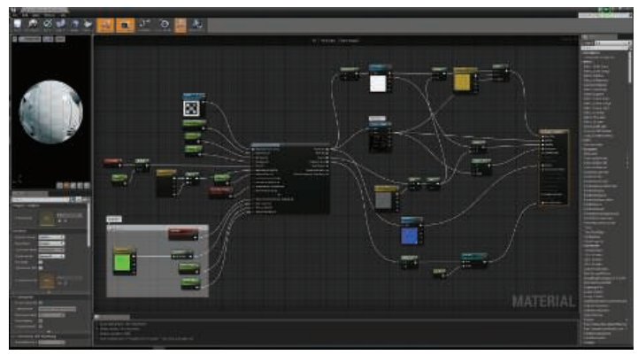

对于更加具体的例子，《WebGL Insights》\[301]这本书中的一些章节，讨论了各种引擎是如何控制其着色器管线的。除了组合之外，现代的材质系统还有几个重要的设计考虑事项，例如：如何以最小的着色器代码重复来支持多个平台。这会产生一些额外的着色器变体，以解决平台、着色器语言以及API之间的性能差异和功能差异。《命运》的着色器系统\[1750]是这类问题的一个代表性解决方案，它使用了一个专门的预处理层，能够使用自定义的着色器语言来进行着色器编写。这允许开发人员编写与平台无关的材质，并将其自动转换为不同的着色语言和着色实现。虚幻引擎\[1802]和Unity引擎\[1436]也都具有类似的系统。

材质系统还需要保证良好的性能，除了专门的着色器变体编译之外，材质系统还可以执行一些常见的其他优化。《命运》和虚幻引擎的着色器系统，会自动检测在一次draw call中结果为常数的计算（例如章节5.3.2示例程序中的暖色和冷色计算），并将其移动到着色器之外进行。另外一个例子是《命运》中所使用的作用域系统（scope system），它用来区分不同更新频率的常量（例如：每帧更新一次，每个光源更新一次，每个物体更新一次），并在适当的时候对每一组常量进行更新，从而减少API的开销。

正如我们所看到的，实现一个着色方程是很简单的，重要的是决定哪些部分是能够简化的，如何计算各种表达式的出现频率，以及用户如何能够对材质外观进行修改和控制。渲染管线最终输出的是一个颜色值和混合值，本章的剩余内容包含了有关抗锯齿、透明度以及图像显示的部分，这些内容会详细介绍如何对这些输出的值进行修改和组合，并最终进行显示。

## 5.4 锯齿和抗锯齿

想象现在有一个巨大的黑色三角形，正在白色的背景上缓缓移动。由于屏幕上的网格单元被三角形所覆盖，因此其像素值的强度应该会平滑的下降。但是通常在各种基础渲染器中发生的情况是，一旦网格单元的中心被三角形所覆盖，这个单元的像素颜色就会立即从白色变为黑色。标准的GPU渲染器也不例外，如图5.14最左侧一列所示。

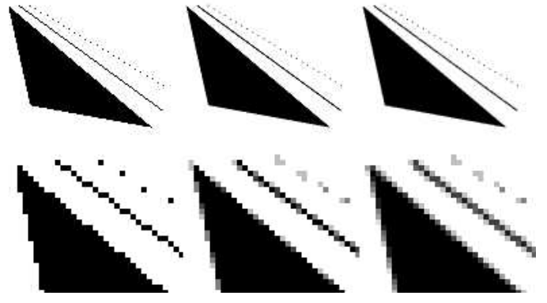

三角形会以像素的形式显示出来，一个网格像素要么被覆盖，要么不被覆盖，绘制出来的线也有类似的问题。由于这个原因，因此三角形和线段的边界会呈现出锯齿状，这个视觉瑕疵被称作为“锯齿（the jaggies）”，当物体运动起来的时候就会变成“爬虫（the crawlies）”。更正式地说，这个问题被称作为“走样（aliasing）”，避免这个问题地技术被称作“反走样（antialiasing）”。（图像领域的走样和反走样，我们会统一翻译为锯齿和抗锯齿）

采样理论（sampling theory）和数字滤波（digital filtering）的话题内容非常巨大，大到已经足够来写另一本书了\[559, 1447, 1729]。由于这是渲染中的一个关键领域，因此下面我们将会介绍有关采样和滤波的基本理论。然后我们会关注当前在实时渲染中，我们能够做些什么来缓解锯齿现象。

### 5.4.1  采样和滤波理论

渲染图像的过程本质上是一个采样任务。这是因为图像的生成实际上就是对三维场景进行采样的过程，从而获得图像（离散像素数组）中每个像素的颜色值。为了能够使用纹理映射技术（第6章），纹素（texel，texture pixel的缩写，和像素的概念类似，是纹理中的基本单元）也必须进行重新采样，从而在不同的条件下都获得良好的效果。为了在动画中生成一系列图像，通常会以一定的时间间隔来进行采样。本小节将会介绍有关采样（sample）、重建（reconstruction）和过滤（filter）的内容。为了简单起见，大部分资料都会以一维形式呈现，这些概念可以很自然的扩展到二维图像上，用于对二维图像进行处理。

图5.15展示了一段连续信号如何以均匀间隔进行采样的过程，这个过程也被叫做离散化（discretized）。采样过程的目标是使用数字方式来表示信息，但是这样做会减少信息量，因此还需要对采样后的信号进行重建，这个重建的过程是通过对采样信号进行滤波实现的。

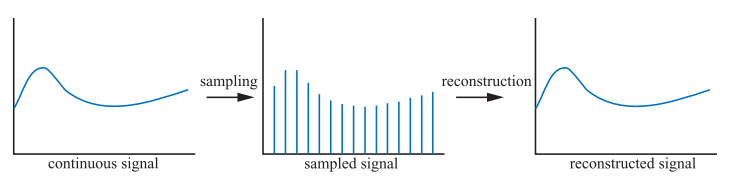

每当进行采样的时候，都可能会发生走样现象，这是我们不希望出现的瑕疵，因此我们需要努力对抗走样，从而生成令人愉悦的图像。在老西部片中有一个经典的走样案例，就是使用电影摄像机来拍摄旋转的马车轮子。由于车轮辐条的旋转速度要比相机记录图像的速度快得多，因此车轮可能会看起来旋转得很慢（向前旋转或者向后旋转），甚至可能会看起来根本没有发生旋转，如图5.16所示。之所以会出现这种现象，是因为车轮图像是在一系列时间步长内进行拍摄的，这种现象被称作时域走样（temporal aliasing）。

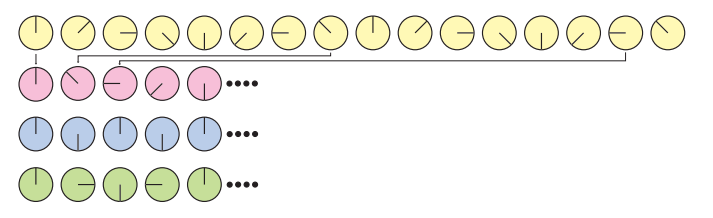

计算机图形学中常见的走样例子，是光栅化线段或者三角形边界上出现“锯齿（jaggies）”；以及当一个具有格子图案的纹理被缩小显示时，会出现被称为“萤火虫（firefly）”的高亮闪烁（摩尔纹）（章节6.2.2）。

当一个信号的采样率过低时，就会出现走样现象（在光栅化游戏中，屏幕的分辨率大体决定了采样率，因此屏幕分辨率越高，走样和锯齿现象就越少）。此时采样信号的频率会比原始信号低，如图5.17所示。为了对一个信号进行正确的采样（即可以从采样出来的样本中，重建原始信号），采样率必须要在采样信号最大频率的两倍以上。这通常被称作采样定理（sampling theorem），对应的采样率叫做Nyquist率\[1447]或者Nyquist极限，它由瑞典科学家Harry Nyquist （1889–1976）在1928发现的。图5.16中同样展示了Nyquist极限的例子。事实上，该定理使用了术语“最大频率”，这意味着原始信号必须是有限频宽（band-limited）的，即没有任何频率会超过这个“最大频率”上限。换而言之，相对于相邻样本之间的间距，信号必须要足够平滑。

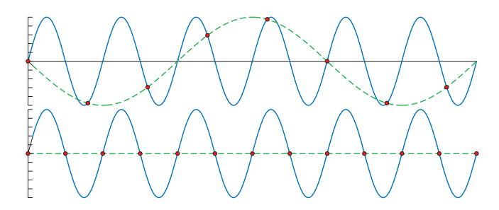

当使用点样本（像素点渲染）对三维场景进行采样的时候，正常情况下是不会有频宽限制的，这是因为三角形的边界，阴影的边界以及其他会产生不连续信号的现象，会导致三维场景中的频率是没有上限的\[252]。此外，无论采样样本排列的有多么紧密，场景中的物体都可以被继续缩小，使得它们根本无法被采样。因此，在使用点样本来渲染场景的时候，我们是无法完全避免走样现象的，而且我们通常都会使用点采样进行采样。但是有时候，我们也可以知道一个信号是有限频宽的，其中一个例子就是在将纹理应用到曲面上的时候。因为我们此时知道了像素的采样率，同时也可以计算出纹理采样的频率，如果这二者之比小于Nyquist极限的话，那么我们就不需要采取什么特殊手段，直接就可以进行正确的纹理采样；但是如果这个比例太高的话，我们就需要利用各种算法，来对纹理采样进行频宽限制（章节6.2.2）。

#### 重建

给定一个有限频宽的采样信号后，现在我们将讨论如何从采样信号中重建原始信号。为了实现这个目的，我们必须使用一个滤波器，图5.18展示了三种常见的滤波器。这里需要注意的是，滤波函数的积分面积应当始终为1，否则重建后的信号就会被放大或者缩小。

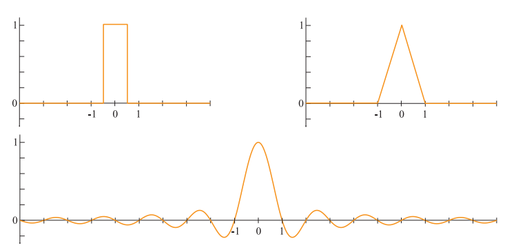

在图5.19中，我们使用了box滤波器（box意味盒子或者方框，这里就不对形状进行翻译了）来对一个采样信号进行重建。这是一种最糟糕的滤波器，因为它重建出来的信号是一段不连续的阶梯状。尽管如此，由于box滤波器非常简单，因此在计算机图形学中也被经常使用。如图5.19所示，我们将box滤波器放置在每个采样点上，然后对其进行缩放，使得滤波器的顶端和采样点重合（因为box滤波器最大值为1），所有这些缩放和平移过后的box函数之和，就是右图中重建出的信号。

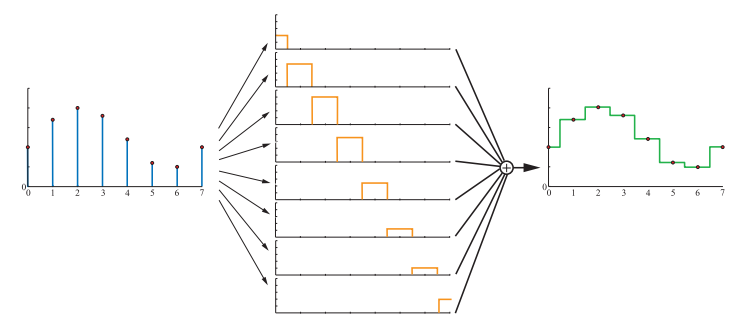

box滤波器也可以使用其他任意的滤波器来进行替换，在图5.20中，使用了tent滤波器（tent意为帐篷，tent滤波器也叫做三角滤波器或者帐篷滤波器）来对采样信号进行重建。请注意，由于tent滤波器实现了相邻采样点之间的线性插值，因此它比box滤波器更好，因为重建之后的信号是连续的。

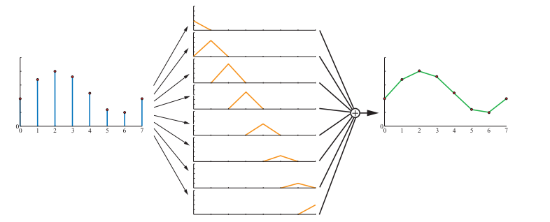

但是，tent滤波器仍然有不足的地方，即重建后信号的平滑性较差，信号会在采样点的位置处发生突变。这与tent滤波器并不是一个完美的重建滤波器有关，为了获得较为完美的重建信号，我们必须使用一个理想的低通滤波器（low-pass filter）。将一个信号进行分解，最终可以表示为若干正弦波（$\sin (2\pi f)$）的组合，其中$f$是该分量的频率。低通滤波器有一个特点，它会移除所有高于某个特定频率的分量，这个特定频率是由低通滤波器本身所决定的。从直观上来看，低通滤波器消除了信号的尖锐特征，即滤波器对信号进行了模糊处理。sinc滤波器是一个理想的低通滤波器（如图5.18底部所示），其数学表达式为：

$$
\operatorname{sinc}(x)=\frac{\sin (\pi x)}{\pi x}
\tag{5.22} 
$$

傅里叶分析理论\[1447]解释了为什么sinc滤波器是一个理想的低通滤波器。简单来说，原因如下：理想的低通滤波器是频域（frequency domain）中的box滤波器，当它与信号相乘的时候，会移除所有超出滤波器宽度的频率。将这个box滤波器从频域转换到空间域（spatial domain），便可以得到一个sinc滤波器。同时频域中的乘法运算也会被转换为卷积（convolution）运算，这是我们在本小节中一直在使用的概念，只是我们并没有实际描述卷积这个术语。

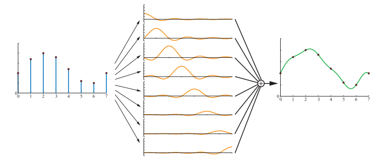

使用sinc滤波器进行信号重建，可以获得更加平滑的结果，如图5.21所示。采样过程会在信号中引入高频分量（在函数图像中则体现为突变点），低通滤波器的任务就是移除这些高频分量。事实上，sinc滤波器消除了所有频率高于采样率$1/2$的正弦波。当采样率为1的时候（即采样信号的最大频率必须小于$1/2$），方程5.22所描述的sinc滤波器便是一个完美的重建滤波器。更加一般的描述是，假设采样率为$f_s /2$（即意味着相邻样本之间的间距为$1 / f_s$），对于这种情况，完美的重建滤波器就是sinc$(f_s x)$，它会消除所有高于$f_s /2$的频率，这对于信号的重采样十分有用（下一小节的内容）。但是由于sinc滤波器的宽度是无限的，而且在某些区域为负，因此在实际中很少会进行使用。

在低质量的box滤波器，tent滤波器和不实用的sinc滤波器之间，还有一个可用的中间区域，最广泛使用的滤波函数\[1214, 1289, 1413, 1793]介于这两个极端之间，所有这些滤波函数都与sinc函数有一些类似，但是不同的是，这些滤波函数所能够影响的像素数量是有限的。与sinc函数类似，这些滤波函数在其部分区域上为负，但是对于应用程序而言，负值滤波器通常是不可取且不实用的，因此我们一般会使用非负波瓣的滤波器（它们通常称为高斯滤波器，因为这些滤波函数要么来自于高斯曲线，要么类似于高斯曲线）\[1402]。在章节12.1中我们会详细讨论滤波函数以及它们的应用。

在使用任意符合要求的滤波器之后，我们便可以得到一个连续的信号；然而，在计算机图形学中，我们并不能直接显示这样的连续信号，因为最终显示在屏幕上的都是离散的点。但是我们可以使用这些重建后的连续信号，即对连续信号进行重采样，将其离散化，即放大或者缩小信号。我们将在下一小节中讨论这个话题。

#### 重采样

重采样（resampling）用于放大或者缩小采样信号。假设原始的采样点位于整数坐标上（0，1，2……），即样本之间具有相同的单位间隔。此外，假设在重采样之后，我们希望新的样本点能够以$a$为间隔均匀分布。当$a > 1$时，则缩小（minification）了采样信号（降采样，dowmsampling），即增大采样间隔，使用了更少的采样点；当$a < 1$时，则放大（magnification）了采样信号（上采样，upsampling），即减小采样间隔，使用了更多的采样点。

信号放大（上采样）是这两种情况中较为简单的一种，因此我们先从它开始讨论。假设采样信号按照上一小节的方式进行重建，从直观上来看，现在的信号已经被完美重建，并且是平滑连续的。我们现在所要做的就是，以期望的间隔对重建后的信号进行重新采样，这个过程如图5.22所示。

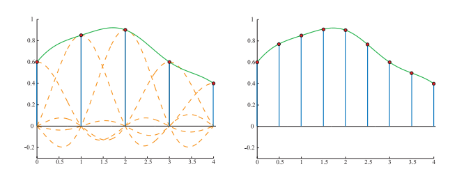

但是当发生信号缩小（下采样）的时候，这种技术就不起作用了，因为原始信号的采样率过高，直接降低采样率导致无法避免走样。相反，应当使用一个$sinc(x/a)$滤波器，来从被采样的信号中创建一个连续信号\[1447, 1661]，然后再按照所需的间隔进行重采样，这个过程如图5.23所示。换而言之，通过在这里使用$sinc(x/a)$来作为滤波器，降低了低通滤波器的采样率，从而去除了更多的高频信号。如图5.23所示，滤波器的重采样率降低为原始采样率的一半。将这个方法与数字图像联系起来，类似于先对图像进行模糊（去除高频内容），然后再以一个较低的分辨率对图像重新采样。

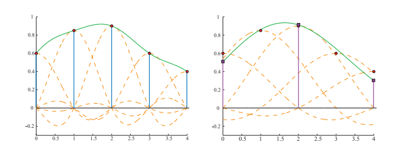

现在我们有了采样理论和滤波理论作为基础，现在可以讨论在实时渲染领域中，用于减少走样（抗锯齿）的各种算法了。

### 5.4.2 基于屏幕的抗锯齿

三角形的边缘如果没有被很好地采样和过滤，就会产生明显的视觉瑕疵。同理，阴影边界、镜面高光以及其他颜色剧烈变化的现象，也会导致类似的问题。本小节所讨论的算法有助于提高这些情况下的渲染质量，这些算法有一个共同点，它们都是基于屏幕的（screen based），即这些算法只会对渲染管线输出的样本进行操作处理。有一点需要注意，不存在最好的抗锯齿算法，每种算法在质量，捕捉尖锐细节（或者其他现象），处理运动物体，内存开销，GPU开销以及速度等方面，都具有不同的优势。

在图5.14的黑色三角形例子中，存在的一个问题就是较低的采样率，即我们只在每个像素网格单元的中心，采样了一个单独的样本，因此我们只能了解到这个像素的中心是否被三角形所覆盖。我们可以在每个屏幕像素网格中使用更多的样本，并以某种方式将这些样本的结果混合起来，这样可以计算出更好的像素颜色。这个过程如图5.24所示。

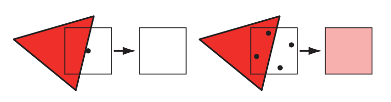

基于屏幕的抗锯齿算法，其通用策略是使用一个针对屏幕的采样模式（即多个采样点），然后对这些样本进行加权求和，最终生成像素的颜色$\mathbf{p}$，其数学表达如下所示：

$$
\mathbf{p}(x, y)=\sum_{i=1}^{n} w_{i} \mathbf{c}(i, x, y)
\tag{5.23} 
$$

其中$n$是一个像素内的样本数量；$\mathbf{c}(i, x, y)$是一个采样颜色；$w_{i}$是一个权重，代表了该样本对像素整体颜色的贡献值，范围是$[0,1]$。样本点的位置可以通过该样本在样本序列$1,……,n$中的序号获得，也可以使用整数标注的亚像素位置$(x,y)$来进行表示。换句话说，对于每个像素网格单元而言，其采样点的位置都是不同的，采样的模式也可以因像素而异。实时渲染系统（以及其他大部分的渲染系统）中的样本通常都是点样本，因此函数$\mathbf{c}$可以看作是两个函数的组合：首先是用一个函数$\mathbf{f}(i,n)$用于检索屏幕上需要采样的位置$(x_f,y_f)$；然后再对屏幕上的这个位置进行采样，即精确检索这个样本点所对应的颜色值。为了计算在特定亚像素位置上的样本，需要事先选择采样方案，并对渲染管线进行配置，这通常是在逐帧（或者是逐程序）进行设置的。

抗锯齿过程中的另一个变量是代表每个样本权重的$w_{i}$，这些权重的和应当为1。实时渲染系统中所使用的大部分抗锯齿方法，都会给每个样本赋予相同的权重，即$w_{i} = \frac{1}{n}$。图形硬件的默认模式是只对像素中心进行一次采样，这是上面抗锯齿方程中最简单的情况。在这种情况下，只有一个样本，该样本对应的权重为1，采样函数$\mathbf{f}$总是会返回被采样像素的中心位置。

对每个像素计算多个完整样本的抗锯齿方法被称为“超采样（supersampling）”方法。在概念上最简单的超采样方法是全屏抗锯齿（full-scene antialiasing，FSAA)，通常也被称为超采样抗锯齿（supersampling antialiasing ，SSAA)。这个方法会以更高的屏幕分辨率来渲染整个场景，然后再通过对相邻像素样本进行滤波（卷积），从而生成一个图像。例如：假设我们现在需要一张分辨率为$1280 \times 1024$的图像，我们使用该方法时，首先需要离屏渲染一张分辨率为$2560 \times 2048$的图像，然后将屏幕上每$2 \times 2$像素区域内的颜色值进行平均，然后再显示到屏幕上；对于最终生成的图像而言，每个像素都对应了四个采样点，并使用一个box滤波器进行过滤。请注意，这个过程对应了图5.25中的$2 \times 2$网格采样。这个方法的开销很大，因为每个子样本都有一个z-buffer深度，它们都需要进行完整的着色和填充，FSAA最大的优点就是实现起来很简单。该方法还有一个低质量的版本，即只在一个屏幕轴向上，以两倍的采样率进行采样，也被称为$1 \times 2$超采样或者$2 \times 1$超采样，但是通常为了简单起见，都会使用2的幂次分辨率和box滤波器。NVIDIA的动态超分辨率（dynamic super resolution）功能是一种更加精细的超采样方法，该方法会以更高的分辨率来渲染场景，并使用包含13个样本的高斯滤波器来生成最终的显示图像\[1848]。

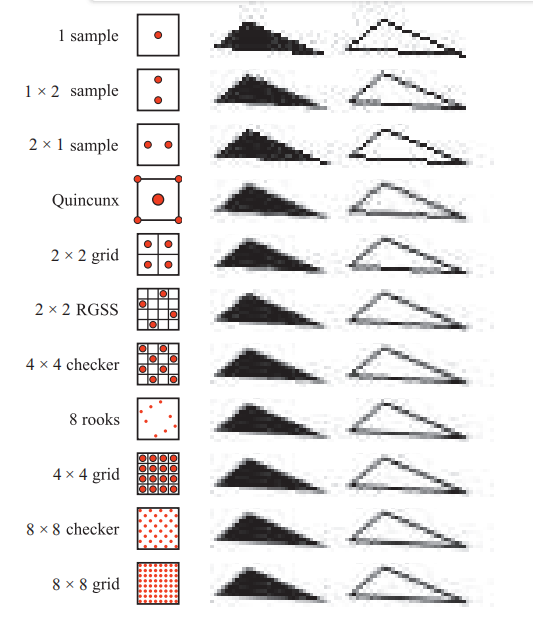

一种与超采样相关的采样方法利用了累积缓冲区（accumulation buffffer）的思想\[637, 1115]，这种方法并不会使用一个巨大的离屏缓冲区，而是使用了一个与所需图像相同分辨率的缓冲区，不同之处在于，这个缓冲区的每个通道中包含了更多的颜色比特。为了对场景进行$2 \times 2$的采样，该方法每帧会生成四张图像，每张图像都是让视图在$ x,y  $方向上分别移动了半个像素距离生成的，这样四张图像便分别对应了像素网格中不同的采样点。这个方法需要每帧预渲染四张图像，并将最终处理好的图像再复制到屏幕上，这些巨大的额外成本使得该方法难以应用于实时渲染系统中。如果不考虑性能的话，这种方法可以用于生成高质量的图像，因为具体累计多少张图像是没有限制的，每个像素中都可以使用任意数量的样本，这些样本也可以位于亚像素的任意位置\[1679]。在过去，累积缓冲区是一个单独的硬件模块，被OpenGL API直接支持，但是在OpenGL 3.0中被弃用了。在现代的GPU中，可以通过在输出缓冲区中使用更高精度的颜色格式，从而在像素着色器中实现这个累积缓冲区的概念。

当物体边缘，镜面高光以及尖锐阴影等现象导致颜色发生突变的时候，就需要使用额外的样本来进行处理。通常会对这些情况进行一些额外处理来避免锯齿，例如：让阴影变得更加柔和，让高光变得更加光滑从而避免锯齿；一些特殊的物体类型（例如电线）可以通过增加尺寸，从而保证它们在沿着其长度的方向上的每个位置，都至少占据一个像素\[1384]。物体边缘的锯齿仍然是一个主要的采样问题，可以采用一些分析方法，在渲染的过程中对物体的边缘进行检测并考虑它带来的影响，但是与直接增加采样点相比，这些检测方法的开销会更大，健壮性也更差。但是，GPU一些新特性打开了抗锯齿的新思路\[327]，例如保守光栅化（conservative rasterization）和光栅器有序视图（rasterizer order view）。

诸如超采样和累积缓冲区等技术，它们生成的新样本与普通像素一样，都会独立完整地进行着色计算并维护深度信息。由于每个样本都需要通过像素着色器，因此这样做的总体收益相对较低，成本相对较高。

多重采样抗锯齿（Multisampling antialiasing，MSAA）通过只进行一次逐像素的表面着色计算，并在多个样本之间共享结果，从而大大降低了计算成本。假设每个屏幕像素的每个片元（fragment）上有四个$(x,y)$子样本位置，每个样本都具有独立的颜色信息和深度信息（z-depth），但是对于该像素的每个片元，像素着色器只会进行一次计算。如果所有的样本位置都被这个片元所覆盖，那么则在像素的中心位置来计算这个着色样本；而如果这个片元只覆盖了部分样本，那么着色样本的选择可以进行移动，从而更好地表示所覆盖的位置。这样做有一些好处，例如可以避免对纹理边缘的着色采样。这个位置调整被叫做质心采样（centroid sampling）或者质心插值（centroid interpolation），如果MSAA的功能被启用的话，那么GPU会自动对样本的位置进行调整。质心采样避免了非三角形的问题，但是可能会导致梯度计算返回不正确的结果\[530, 1041]。如图5.26所示。

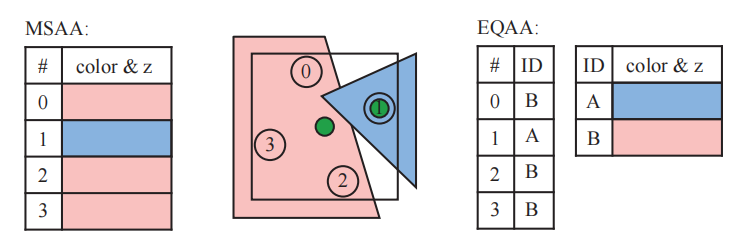

MSAA的速度要比纯超采样的方案快，因为每个片元只会进行一次着色计算，它专注于以更高的速率来对片元覆盖的像素范围进行采样，并共享计算出的着色结果。通过对采样和覆盖的进一步解耦，从而可以节省更多的内存，这反过来也可以使得对抗锯齿进行加速——对内存的访问越少，渲染的速度就越快。NVIDIA在2006年引入了覆盖采样抗锯齿（coverage sampling antialiasing ，CSAA），AMD随后也提出了增强质量抗锯齿（enhanced quality antialiasing ，EQAA）。这些技术以更高的采样率，同时只存储片元所覆盖的范围来进行实现，例如：EQAA的“2f4x”模式只存储了两组颜色和深度信息，这些信息会在四个样本位置之间进行共享。并且这些信息也不再和具体的样本位置相绑定，而是存储在一张额外的表格中，四个样本仅需要各自使用一个bit，来指定哪组颜色深度信息与该位置相关联即可，如图5.26所示。片元所覆盖的样本数量最终决定了该片元对像素颜色的贡献权重。如果此时存储的颜色数量超出了存储上限（两组），那么就会丢弃一个已存储的颜色信息，并将其所关联的样本标记为未知，这些被标记为未知的样本最终不会对像素颜色产生贡献\[382, 383]。对于大多数场景而言，一个像素同时被三个不透明的片元所覆盖，并且这些片元还是以完全不同的方式进行着色的，这种情况发生的概率非常低，因此这个方案在实际应用中表现良好\[1405]。虽然EQAA有着一定的性能优势，但是为了获得最高质量的画面效果，《极限竞速：地平线2（Forza Horizon 2）》还是采用了$ 4 \times  $MSAA \[1002]。

当场景中所有的几何体都被渲染到一个多样本缓冲区（multiple-sample buffer）之后，会进行一个解析（resolve）操作。在这个过程中，会对样本的颜色进行平均化，并最终决定像素的颜色。值得注意的是，当使用高动态范围颜色值（HDR）的时候，使用多重采样可能会导致一些问题，一般在这种情况下，为了避免出现视觉瑕疵，都会在解析之前对颜色值进行色调映射\[1375]。色调映射的开销可能会很大，因此可以使用一个更简单的色调映射近似函数或者其他方法\[862, 1405]。

在默认情况下，MSAA会使用box滤波器进行解析。ATI于2007年引入了自定义滤波器抗锯齿（custom filter antialiasing ，CFAA）技术\[1625]，该项技术允许使用一个更宽或者更窄的tent（帐篷形）滤波器来进行解析，从而可以稍微扩展到周围的像素单元格上。EQAA后续也支持了这种滤波器，CFAA因此被取代了。在现代的GPU上，像素着色器或者计算着色器可以访问MSAA的样本，并使用任何我们所需要的滤波器来进行重建，甚至可以访问周围像素的样本。一个范围更大的滤波器可以减少锯齿和走样，但是它也会失去尖锐的细节。Pettineo发现\[1402, 1405]，使用具有2到3个像素宽度的三次平滑滤波器和B样条滤波器，可以获得最好的整体效果。使用其他类型的滤波器还会引入性能问题，因为在一个自定义着色器中，即使使用默认的box滤波器来进行解析，也需要花费很长的时间，并且使用范围更大的滤波器核（卷积核），意味着需要访问更多的样本，这也会增加开销。

NVIDIA内置的TXAA同样支持使用一个更大范围（超过一个像素范围）的重建滤波器，从而获得更好的抗锯齿效果。TXAA和比较新的MFAA（多帧采样抗锯齿multi-frame antialiasing）都使用了时域抗锯齿（temporal antialiasing ，TAA），TAA是一种通过之前几帧的结果来对当前帧进行优化的抗锯齿技术。从某种程度上来看，这种技术之所以成为可能，是因为它允许程序员设置每帧的MSAA采样模式\[1406]。这种基于时域的抗锯齿技术，可以用于解决旋转车轮的走样问题，也可以提到边缘的的渲染质量。

想象一下我们可以通过“自定义”的采样模式来生成一系列图片，其中每一帧都使用了不同的像素内样本位置来进行采样。这种偏移（offset）是通过在投影矩阵上附加一个微小位移来实现的\[1938]。生成和用于平均的图像数量越多，渲染结果就越好。这种使用多重偏移图像的思路也被用于时域抗锯齿的算法中，可以通过MSAA或者其他方法来生成一张图像，并和之前几帧（一般是2-4帧）的图像进行混合\[382, 836, 1405]。一般越老的图像被赋予的权重就越少\[862]，如果当前的相机和场景没有发生移动的话，这种方法可能会导致闪烁的现象，因此通常只对当前帧和前一帧赋予相同的权重。由于每一帧中的样本都位于不同的像素子位置，因此这些样本的加权和，相较于比单帧加权而言，可以获得更好的边缘覆盖估计。因为上述原因，在一个渲染系统中，使用最新生成的两帧在一起进行平均，可以获得更好的结果，而且最吸引人的是，我们不需要对每一帧进行额外的处理。甚至我们可以使用时域采样来生成一个较低分辨率的图像，然后再将其放大到显示器的分辨率\[1110]。除此之外，一些光照方法或者其他技术往往需要许多样本才能获得一个较好的结果，可以通过将当前结果和之前几帧进行混合，从而在一帧中降低样本的使用数量\[1938]。

虽然基于时域的抗锯齿技术可以在没有增加额外采样成本的情况下，为静态场景提供抗锯齿，但是这类算法也会存在一些问题。例如：如果每一帧的权重不同的话，那么会导致静态场景中的物体出现闪烁现象（shimmer）；场景中快速移动的物体，或者是相机的快速移动，会导致画面出现鬼影（ghosting），即由于之前帧的贡献，会导致物体后面出现拖曳的痕迹。一种解决鬼影现象的方法是，只对缓慢移动的物体使用时域抗锯齿\[1110]。另一个重要的方法是使用重投影（reprojection，章节12.2）来更好地将前一帧中的物体与当前帧中的物体关联起来。在这种方案中，物体会将生成的运动向量（motion vector）存储在“速度缓冲区（velocity buffer ，章节12.5）”中。这些运动向量用于将前一帧和当前帧关联起来，即从当前的像素位置减去对应的向量，从而找到前一帧中该表面位置所对应的彩色像素。当然，在当前帧中不太可能成为表面一部分的样本将会被丢弃\[1912]。由于这类基于时域的抗锯齿算法，并不会引入额外的样本，并且开销相对较小，因此近年来人们对这类算法产生了强烈的兴趣和广泛的使用。其中一部分的人关注时域抗锯齿的原因，是因为延迟渲染技术（章节20.1）并不兼容MSAA和其他的多重采样抗锯齿技术\[1486]。时域抗锯齿的实现方法也各不相同，并且根据应用程序的内容和目标的不同，已经有一系列用于避免瑕疵和改善质量的技术被开发出来了\[836, 1154, 1405, 1533, 1938]。例如：Wihlidal \[1885]展示了如何将EQAA、时域抗锯齿和各种其他采用棋盘格采样模式的滤波技术组合在一起，在保证渲染质量的同时，降低像素着色器调用的次数。 Iglesias-Guitian等人\[796]总结了之前的工作，并提出了了他们自己的方案，使用像素的历史信息并对其进行预测从而最小化滤波瑕疵。Patney等人\[1357]扩展了 Karis和Lottes在虚幻4 \[862]中使用的TAA，将其用于虚拟现实（VR）应用，并增加了可变大小的采样以及对眼睛的运动补偿（章节21.3.2）。

#### 采样模式

高效的采样模式（sampling pattern）是减少瑕疵和时间开销等方面的关键因素。Naiman指出\[1257]，在水平边缘与垂直边缘的附近的锯齿，对人类的视觉影响最大，其次便是倾角接近45度的边缘。旋转网格超采样（rotated grid supersampling ，RGSS）使用了一个旋转后的正方形采样模式来进行采样，可以在像素内提供更多的水平分辨率和垂直分辨率，图5.25展示了这个采样模式的一个例子。

RGSS是一个类似拉丁超立方体（Latin hypercube）和N-rooks采样的模式，其中$n$个采样点被放置在一个$ n \times n
  $的网格内，每行和每列都各有一个样本点\[1626]。在RGSS采样模式中，这四个采样点分别位于$ 4 \times 4
  $子像素网格的单独行和单独列中。与常规的$ 2 \times 2
  $采样模式相比，这种旋转采样的方式尤其适合捕获接近水平或者接近垂直的边缘；而在常规的采样模式中，这些边缘很可能会覆盖偶数个的样本，因此其提供的有效程度较低。

N-rooks采样模式只是创建良好采样模式的基础，其本身还不够好，例如：当N-rooks的采样点集中在亚像素网格的对角线上时，如果此时覆盖像素的边缘几乎平行于对角线，那么N-rooks会给出一个很差的采样结果，如图5.27所示。

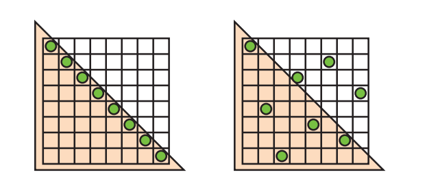

为了更好的进行采样，我们希望避免将两个样本放在一起。同时我们希望将这些样本均匀分布在这个像素区域中。为了获得这样的采样模式，我们可以将例如拉丁超立方体（Latin hypercube）采样的分层抽样（stratified sampling）技术与其他方法相结合，例如抖动（jittering）采样，Halton序列以及泊松圆盘采样（Poisson disk sampling）\[1413, 1758]。

在实践中，GPU生产制造商通常会将这种采样模式进行硬件实现，从而进行多重采样抗锯齿。图5.28展示了一些在实践中使用的MSAA采样模式。对于时域抗锯齿而言，由于每帧之间的样本位置可以发生变化，因此具体的采样覆盖模式是程序员按照自己的设计想法来进行实现的，例如：Karis \[862]发现一个基础的Halton序列，就可以比任何GPU提供的MSAA模式表现得更好。Halton序列在空间中生成的样本是随机的，并且样本之间的差异很小，也就是说，生成的这些样本，它们在空间中分布得很均匀，并且没有聚类（clustered）的现象\[1413, 1938]。

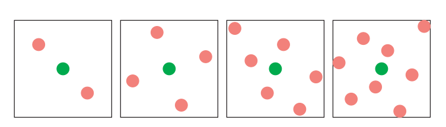

虽然使用亚像素网格模式，可以更好地近似每个三角形是如何覆盖像素网格的，但是它并不是最理想的方法。一个场景可以由屏幕上任意小的物体组成，这意味着没有任何一个采样率可以完美地捕获它们。如果这些微小的物体或者特征形成了某种图案，那么此时以恒定的间隔对其进行采样，就会产生摩尔纹（Moire fringes）和其他的干涉图案。在这种情况下，超采样所使用的网格模式尤其容易产生走样现象。

一种解决方案是使用随机采样（stochastic sampling）（译者注：这里的stochastic 也是随机的意思，一般用于形容一个过程是随机的，而random一般用于形容一个变量是随机的），这种方法可以生成一个更加随机的采样模式，例如图5.28中的所使用的模式。想象现在远处有一把细齿梳子，屏幕上的每个像素都包含了好几个梳齿。若此时采用的采样模式是规则不变的，并且它正好和梳齿出现的频率相对应，那么就会产生严重的瑕疵。而如果我们拥有一个不那么有序的采样模式，就可以避免这种情况发生。使用这种随机化的采样模式，虽然可以避免瑕疵的出现，但是也会引入图像噪声的问题，但是庆幸的是，人类的眼睛对于噪声更加宽容\[1413]。使用几种不同结构的采样模式可以缓解瑕疵，但是如果当采样模式在像素之间重复的话，还是没法避免瑕疵的出现。一种解决方案是在每个屏幕像素上，都使用完全不同的采样模式；或者随着时间的推移，对每个采样位置进行修改。在过去的几十年中，交错采样（interleaved sampling），索引采样（index sampling）偶尔会得到硬件的支持，其中每组像素都可以使用不同的采样方式。例如：ATI的SMOOTHVISION允许每个像素包含16个样本，并且支持多达16种用户自定义的采样模式，这些采样模式可以混合在一个重复出现的模式（例如$ 4 \times 4  $像素块）中。Molnar \[1234]以及Keller、Heidrich \[880]发现，当对每个像素使用相同的模式时，使用交错随机采样（interleaved stochastic sampling）可以最大程度上减少形成的锯齿瑕疵。

其它一些由GPU支持的算法也值得关注。NVIDIA早期提出了一个五点型（Quincunx）方法\[365]，该方法是一种实时抗锯齿方案，它可以让一个样本同时影响多个像素。“Quincunx”指的是五个物体的排列方式，其中四个位于正方形内部，第五个位于正方形的中心，例如六面骰子中五个点的图案。五点型多重采样抗锯齿便使用了这种模式，它将四个外部样本放置在正方形像素的四个角落上，如图5.25所示。每个角落上的样本值，都会被分发给其相邻的四个像素。不同于对每个样本进行平均加权（其他大多数实时方案都采用了这种策略），该方案的中心样本权重为$\frac{1}{2}$，每个角落样本的权重为$\frac{1}{8}$。由于这种共享策略，平均每个像素只需要两个样本，而且其结果要比双样本的FSAA方法要好得多\[1678]。这种五点型的采样策略，优点类似于二维的tent滤波器，如上一小节所描述的那样，它是优于box滤波器的。

通过对每个像素仅使用一个样本，五点采样的策略也可以用于时域抗锯齿\[836, 1677]。每一帧都在前一帧的基础上，在每个轴上偏移半个像素，偏移的方向会在两帧之间交替进行（抖动）。前一帧用于提供角落样本，并使用双线性插值来快速计算每个像素的贡献值，并将结果与当前帧进行平均。每一帧的总权重都是相等的，这意味着在静态视角下也不会出现闪烁瑕疵。但是沿着轴向进行移动的物体仍然会出现一些问题，但是这个方案本身的代码实现十分简单，并且由于一帧中的每个像素仅使用了一个样本，因此可以提供更好的外观表现。

在一帧中，五点型方法通过在像素边界共享样本信息，实际上每个像素只有两个样本的较低开销。RGSS模式可以捕捉到更多接近水平边界和垂直边界的层次信息。首次为移动端开发的FLIPQUAD（字面意思是翻转四边形）采样模式，结合了这两个方法的特点\[22]，其优势在于，每个像素仅进行了两次采样，同时可以获得类似于RGSS（每个像素四次采样）的质量。该采样模式如图5.29所示。Hasselgren等人\[677]探索了其他使用共享样本思路的低开销采样模式。

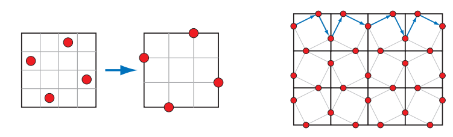

与五点型采样类似，双样本的FLIPQUAD方法也可以用于时域抗锯齿，在两帧之间共享样本。Drobot \[382, 383, 1154]在其混合重建抗锯齿方法（hybrid reconstruction antialiasing，HRAA）中解决了使用哪种双样本采样模式才是最好的问题，他研究了用于时域抗锯齿的不同采样策略，他发现在测试的五种采样策略中，FLIPQUAD是最好的。棋盘格模式也可以用于时域抗锯齿，El Mansouri \[415]讨论了如何使用双样本的MSAA来创建一个棋盘格渲染，从而降低着色器的开销，同时解决瑕疵问题。Jimenez \[836]提供了一种混合式的解决方案，该方案使用了SMAA，时域抗锯齿和一系列其他技术；在该方案中，可以根据引擎的渲染负载，来实时改变抗锯齿的质量。Carpentier和Ishiyama \[231]对边缘进行采样，并将采样网格旋转了45度，他们将这种时域抗锯齿策略和FXAA（稍后会进行讨论）相结合，来提高在高分辨率显示器上的渲染效率。

#### 形态学方法（Morphological Methods）

锯齿通常会在边缘处产生，例如几何图形，尖锐阴影，或者高亮所形成的边缘处，我们可以利用锯齿产生的原因和结构，对其进行针对性的优化，从而获得更好的抗锯齿效果。Reshetov \[1483]于2009年提出了一种类似的算法，称之为形态学抗锯齿（morphological antialiasing ，MLAA）。其中“形态（morphological ）”意味着它与物体的结构或者形状有关。早在1983年，Bloomenthal \[170]就完成了这个领域的早期工作\[830]。Reshetov的论文重新激发了大家对多重采样方法的替代方法的研究，其核心思路是对边缘的搜索和重建\[1486]。

这种形式的抗锯齿是作为一个后处理（post-process）来执行的。也就是说，以通常的方式来渲染一张图像，然后将这个渲染结果输入到一个专门进行抗锯齿处理的过程中。自2009年以来已经发展了多种此类型的技术，这些技术依赖于一些额外的缓冲区（例如深度缓冲和法线缓冲）来生成更好的结果，例如亚像素重建抗锯齿（subpixel reconstruction antialiasing ，SRAA）\[43, 829]，但是它只适用于几何边缘的抗锯齿处理。一些分析方法，例如几何缓冲区抗锯齿（geometry buffer antialiasing，GBAA）和距离边缘抗锯齿（distance-to-edge antialiasing，DEAA）等技术，让渲染器在渲染的过程中计算一些有关三角形边缘的额外信息，例如边缘到像素中心的距离\[829]。

最普通的方法只需要使用颜色缓冲，这意味还可以使用阴影，高亮，以及各种之前应用于后处理阶段的技术（例如描边渲染 ，silhouette edge rendering，详见章节15.2.3），来对边缘效果进行改善，例如：定向局部抗锯齿（directionally localized antialiasing ，DLAA）\[52, 829]基于以下的观察进行实现：接近垂直的边缘应当被水平模糊，同样地，接近水平的边缘应当与其相邻像素进行垂直模糊。

一些更加复杂的边缘检测方法，尝试找到包含任意角度边缘的像素，并确定其覆盖范围。对潜在边缘的相邻像素进行检查，从而尽可能重建原始边缘所在的位置。然后通过考虑边缘对像素的影响，来融合相邻像素的颜色，图5.30展示了这个流程的原理图。

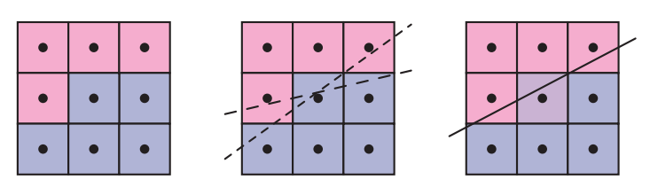

Iourcha等人\[798]通过检查像素中MSAA的样本，来计算更好的结果，从而改进了边缘检测的效果。值得注意的是，基于边缘预测和混合的算法，其结果的精度要比基于样本的算法更高，例如：一种每个像素采样四次的算法，只能给物体边缘混合提供5个不同的级别：即没有样本覆盖，或者有1，2，3，4个样本覆盖。而边缘预测算法所估测出的边缘位置，可以具有更多的位置情况，因此可以提供更好的结果。

在某几种情况下，基于图像的算法可能会导致错误的结果。第一，如果两个物体之间的颜色差异低于该算法的阈值，则可能无法有效检测到这个边缘。第二，如果某个像素被三个或者三个以上的表面所覆盖，那么就很难对这种情况进行边缘预测。第三，具有高对比度或者高频元素的表面，其颜色可能会在像素之间快速变化，从而导致算法遗漏一些边缘。第四，当使用了形态学抗锯齿算法时，画面上的文字质量通常会受到影响。第五，物体的拐角处对于这种算法来说是一个挑战，使用一些算法后，可能会导致这些拐角变成圆角。第六，因为我们一般假设边缘都是直线的，因此弯曲的线段可能会被错误处理。第七，单独一个像素上的变化，就可能会导致边缘重建的方式发生巨大变化，从而在帧与帧之间产生鬼影和瑕疵；可以通过使用MSAA覆盖蒙版来提高边缘检测的准确性，从而改善这一现象\[1484]。

形态学抗锯齿通常只会使用已经提供的信息，例如：某个物体的宽度可能不足一个像素（例如电线或者绳子），只要它没有覆盖到这个像素的中心，那么屏幕上就会出现一个像素的空白。在这种情况下，可以通过增加采样数来提高渲染质量，但是基于图像的抗锯齿算法并不能做到这一点。除此之外，这类算法的执行时间是不确定的，它取决于当前所观察到的内容，例如：一片草地视图，其所需的抗锯齿处理时间，可能是一片天空视野的三倍\[231]。

综上所述，基于图像的方法能够以较小的内存使用和处理开销，来提高抗锯齿效果，因此这类算法被很多应用程序所使用。仅仅使用纯颜色缓冲的算法可以很好地与渲染管线相解耦，使得它们易于修改和禁用，甚至可以暴露为GPU驱动中的选项。其中两种最流行算法分别是快速近似抗锯齿（fast approximate antialiasing ，FXAA）\[1079, 1080, 1084]和亚像素形态学抗锯齿（subpixel morphological antialiasing ，SMAA）\[828, 830, 834]，其中的部分原因是因为，二者都为各种设备平台提供了可靠免费的源代码实现。两种算法都只使用了颜色缓冲，而SMAA的优势在于，它还可以访问MSAA的样本。二者都包含了一系列可选的设置，用于在渲染速度和渲染质量之间进行平衡，其每帧开销基本都在1到2毫秒内，这也是电子游戏愿意花费给抗锯齿处理的时间。最后，这两种算法也可以额外应用时域抗锯齿技术\[1812]。Jimenez \[826]提供了一种改进的SMAA实现，其速度比FXAA更快，并描述了一种时域抗锯齿方案。总而言之，我们推荐读者去阅读Reshetov和Jimenez 所撰写的形态学技术综述\[1486]，以及它们在电子游戏中的应用。

## 5.5 透明度，Alpha，合成

光线通过半透明（semitransparent）物体的方式有很多种，对于半透明渲染算法而言，这些效果可以大致分为基于光线（light-based）的半透明效果与基于视图（view-based）的半透明效果。基于光线的半透明效果是指，半透明物体会导致光线发生衰减和偏移，从而使得场景中的其他物体会被照亮，或者呈现出不同的渲染效果。基于视图的半透明效果是指透明物体自身的渲染效果。

本小节中，我们会讨论最简单形式的基于视图的半透明效果，即半透明物体本身会作为背后物体颜色的衰减器（attenuator）。在后面的章节中，我们会更加详细的讨论基于视图和基于光线的半透明效果，例如毛玻璃（frosted glass）、光线折射、由于透明物体的厚度而导致的光线衰减、以及因视角变化而带来的反射率（reflectivity）变化和透射率（transmission）的变化。

一种产生透明错觉的方法被称作点阵剔除半透明（screen-door transparency）\[1244]，该方法的思路是使用一个像素对齐的棋盘格来对图案进行填充，从而渲染透明效果的三角形。也就是说，每个三角形像素都会被选择性地渲染，从而使得后面得物体变得部分可见。通常来说，如果屏幕上被渲染出来的像素比较紧凑密集，那么棋盘格本身的图案是不可见的。这种方法的主要缺点是，在屏幕上的一个区域内，通常只有一个物体的半透明效果比较令人信服；如果有多个半透明物体重叠在一起的话，这种方法就非常失真了。例如：如果一个红色的透明物体与一个绿色的透明物体，会在一个蓝色物体前面发生重叠的话，那么红绿蓝中的三种颜色中，只有两种可以出现在棋盘格图案上。除此之外，棋盘格的比例一般只能设置到50%，虽然也可以通过使用其他更大的像素蒙版，来给出其他的百分比混合效果，但是这样会导致半透明效果失真\[1245]。

这种点阵剔除的方法，其优点就是十分简单，透明物体可以在任意时间，以任意的顺序出现，并且不需要特殊的硬件支持。通过使得所有物体在棋盘格所覆盖的像素位置上变得不透明，而在其他地方变得透明，从而实现了半透明的效果。同样的思路也可以用于对镂空纹理（cutout texture）的边缘进行抗锯齿处理，不同的是这是在亚像素级别上实现的，使用了一个叫做alpha to coverage（简称A2C）的功能（章节6.6）。

Enderton等人\[423]提出了随机透明度（stochastic transparency）的方法，它将亚像素级别的遮罩和随机采样的方法相结合，通过使用随机点状图案来表示一个片元的alpha覆盖率，可以生成一个合理，但是有噪声的图像，如图5.31所示。为了使得透明效果看起来较为合理，每个像素都需要进行大量的采样，并且每个亚像素样本都需要相当大的内存空间。它吸引人的地方在于，它并不需要进行混合操作，而且抗锯齿，透明度以及其他会创建部分覆盖像素的现象，都可以使用这个算法来实现。

![图5.31：随机透明度。图中放大区域内展示了该算法产生的噪声。 \[1301\]](images/Chapter-5/20230114231421.png "图5.31：随机透明度。图中放大区域内展示了该算法产生的噪声。 \[1301]")

大部分透明度算法都需要将透明物体的颜色，与其背后物体的颜色混合在一起，为此，需要使用alpha混合（alpha blending）的概念。当一个物体渲染到屏幕上时，每个像素都关联了一个RGB颜色和一个z-buffer深度值，我们还会为每个被物体所覆盖的像素，定义一个额外的分量，这个分量被叫做alpha$(\alpha)$。alpha描述了一个给定像素上，片元的透明度和像素覆盖率：当alpha为1.0的时候，意味着这个物体是不透明的，并且完全占据了这个像素内的所有区域；当alpha为0.0的时候，意味着这个像素完全没有被掩盖（obscured），即这个片元是完全透明的。

一个像素的alpha值可以用于表示不透明度，覆盖率或者同时表示这两者，具体需要依情况而定。例如：一个肥皂泡的边缘可能占据了四分之三个像素，即0.75；并且它可能是几乎透明的，例如可以让十分之九的光穿过这个肥皂泡，即透明度为0.1，那么其alpha值为$0.75 \times 0.1 = 0.075$。但是，如果我们使用了MSAA或者类似的抗锯齿方案，那么样本本身就考虑到了对像素的覆盖率，即像素内四分之三的样本都会受到肥皂泡的影响。那么此时对于每个样本，我们将会使用0.1的不透明度来作为其alpha值。

### 5.5.1 混合顺序

为了使得一个物体看起来更加透明，我们需要将alpha小于1的物体渲染在场景的最前面。被这个物体所覆盖的每个像素，都会从像素着色器中接收到一个$\rm RGB\alpha$值（也叫做RGBA）。通过使用$\mathbf{over}$运算符，来将这个片元的值和像素的原始颜色进行混合，其数学形式如下所示：

$$
\mathbf{c}_{o}=\alpha_{s} \mathbf{c}_{s}+\left(1-\alpha_{s}\right) \mathbf{c}_{d} \quad [\mathbf{over} \quad \rm{operator}]
\tag{5.24} 
$$

其中的$\mathbf{c}_{s}$代表透明物体的颜色（被称作源颜色source），$\mathbf{\alpha}_{s}$代表了这个物体的alpha值，$\mathbf{c}_{d}$代表该像素在混合之前的颜色（被称作目标颜色destination），$\mathbf{c}_{o}$代表了将这个透明物体放置在现有场景前（$\mathbf{over}$操作）而生成的结果颜色。当渲染管线此时输入了物体的颜色$\mathbf{c}_{s}$和alpha值$\mathbf{\alpha}_{s}$时，像素的原始颜色$\mathbf{c}_{d}$会被替换为生成的结果颜色$\mathbf{c}_{o}$；如果这个输入的$\rm RGB\alpha$值实际上是一个不透明的颜色（即$\mathbf{\alpha}_{s} = 1.0$）的话，那么方程5.24会简化为直接使用这个输入物体的颜色来替换像素的原始颜色。

**举例：混合**：现在有一个红色的半透明物体被渲染到一个蓝色的背景上，假设物体上某个像素的$\rm RGB$值为$(0.9,0.2,0.1)$，背景的$\rm RGB$值为$(0.1,0.1,0.9)$，同时这个物体的不透明度为0.6。那么这两个颜色的混合计算表达式为：

$$
0.6(0.9,0.2,0.1)+(1-0.6)(0.1,0.1,0.9)
$$

最后生成的结果颜色值为$(0.58,0.16,0.42)$。

这个$\mathbf{over}$运算符可以让一个被渲染的物体具有半透明的外观，这种方式实现的透明效果是可行的，因为从某种意义上来说，只要能透过这个物体看到其背后物体的样子，我们就会认为这个东西是透明的\[754]。例如我们可以使用$\mathbf{over}$运算符来模拟现实世界中轻薄布料（gauzy fabric）的效果，由于布料上的丝线（thread）是不透明的，因此布料背后的物体会被部分模糊。在实际实现中，松散布料的alpha覆盖率会随着视角的变化而变化\[386]。也就是说，这里我们认为alpha值模拟了材质对像素的覆盖程度。

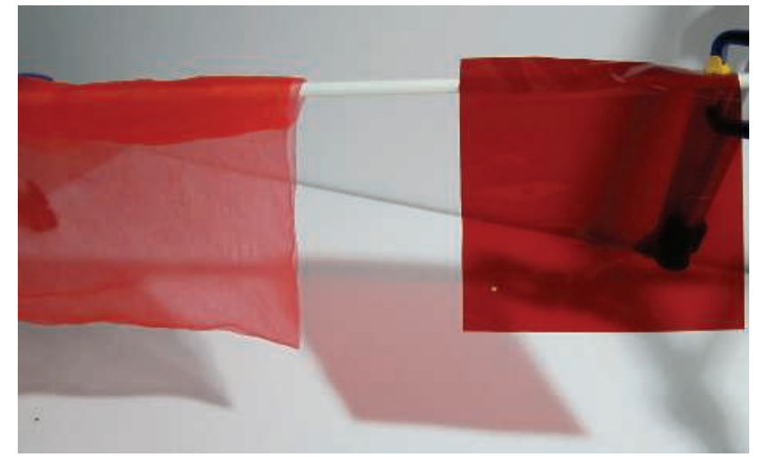

在模拟其他透明效果的时候，尤其是通过彩色玻璃或者彩色塑料来进行观察的情况下，$\mathbf{over}$运算符模拟的效果就不那么令人信服了。在现实世界中，在一个蓝色物体前面放置一个红色滤镜，通常会使得这个蓝色物体变得更暗，因为这个物体所反射出来的光线（蓝色光，波长较短），大部分都无法通过这个红色滤镜（只允许通过红色光，波长较长），由于通过的光线变少了，因此会显得更暗，如图5.32所示。而使用$\mathbf{over}$运算符来进行模拟的时候，其结果是红色的一部分和蓝色的一部分被相加在一起。最好是能够将这两种颜色相乘，再加上透明物体自身的反射颜色，这种基于物理透射率的半透明效果，会在章节14.5.1和章节14.5.2中进行讨论。

在基本的混合阶段运算符中，$\mathbf{over}$是一个常用于透明效果的运算符\[199, 1429]。另一个有一定用途的操作符是叠加混合（additive blending），在这个运算符中，参与混合的两个像素值只是简单的相加，其数学表达式为：

$$
\mathbf{c}_{o}=\alpha_{s} \mathbf{c}_{s}+\mathbf{c}_{d}
\tag{5.25} 
$$

这种混合模式适用于模拟各种发光效果，例如闪电或者火花，这些效果并不会对背后的像素产生影响，而只是使像素本身变得更亮\[1813]。但是这种模式的生产的透明度效果看起来并不正确，因为不透明表面看起来并没有被过滤\[1192]。对于一些层状的半透明表面，例如烟雾或者火焰，这种叠加混合的模式具有饱和现象颜色的效果\[1273]。

为了能够正确的渲染透明物体，我们需要在不透明物体绘制完成之后，再去绘制透明物体。具体的实现方式是先关闭混合操作，渲染所有的不透明物体；然后再启用$\mathbf{over}$运算符，渲染所有的透明物体。理论上来说我们可以一直启用$\mathbf{over}$，因为不透明物体的alpha值为1.0，它并不会导致destination颜色被替换成source颜色；但是这样做增加额外的开销，并且没有实际的收益。

z-buffer存在的一个限制是，每个像素位置上仅会存储距离相机最近的那个深度值，如果有好几个透明物体都重叠在同一个像素上的话，那么就无法通过维护z-buffer来解决所有可见物体的效果了。因此在任意给定像素上叠加透明表面时，通常需要严格按照从后往前的顺序进行渲染，如果不这样进行处理的话，会导致错误的感知暗示。一种实现这种排序的方法是，将透明物体沿着观察方向，按照各自质心到相机的距离大小进行排序。这种粗略的排序可以很好地运行，但是在各种情况下都存在一些问题。首先，这样的排序仅仅是一个近似，位于远处的物体也可能会错误地出现在较近物体的前面；并且相互贯通重叠的物体，无法针对所有视角都进行正确显示，除非将每个网格都划分成单独的块，图5.33左侧图片展示了一个这样的情况。即便是一个凹形的单个网格，也可能会出现沿着观察方向的排序问题，即在屏幕上显示为与自身发生重叠。

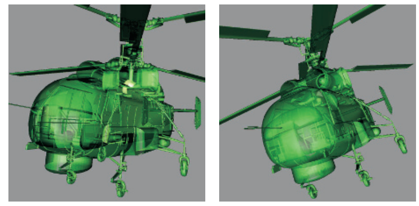

尽管如此，由于这种方法十分简单，速度很快，并且不需要使用额外的内存空间或者特殊的GPU特性，因此这种对透明度物体进行粗略排序的方法仍然被广泛使用。如果使用了这种方法，那么最好是在渲染透明物体的时候，关闭深度缓冲的写入替换功能。也就是说，z-buffer仍然可以用于正常的深度测试，但是通过测试的表面并不会改变已有的z-buffer内容，即最近的不透明表面深度仍然会保持不变。通过使用这种方法，所有后来出现的半透明物体，至少都位于不透明表面前面（深度测试），这样就不会因为旋转相机而导致物体排序出现变化时，造成透明物体突然出现或者突然消失。也有一些其他的技术可以用于改善透明物体的外观，例如将一个透明物体连续渲染两次，先渲染一次背面，然后再渲染一次正面\[1192, 1255]。

我们可以对$\mathbf{over}$运算符的方程进行一些修改，使得从前向后的混合也可以得到相同的结果，这种混合模式被称作为$\mathbf{under}$运算符。

$$
\mathbf{c}_{o}=\dfrac{\alpha_{d} \mathbf{c}_{d}+\left(1-\alpha_{d}\right) \alpha_{s} \mathbf{c}_{s}}{\mathbf{a}_{o}} \quad [\mathbf{over} \quad {\rm operator}]\\\mathbf{a}_{o}=\alpha_{s}\left(1-\alpha_{d}\right)+\alpha_{d}=\alpha_{s}-\alpha_{s} \alpha_{d}+\alpha_{d}
\tag{5.26} 
$$

请注意，$\mathbf{under}$运算符要求目标颜色维护一个alpha值，而$\mathbf{over}$运算符则不需要。换而言之，目标物体（更靠近相机的透明表面）并不是一个不透明物体，因此需要有一个alpha值。$\mathbf{under}$的数学公式与$\mathbf{over}$很像，只是将源（$s$）和目标（$d$）进行了交换。另外需要注意的是，alpha的计算公式是与顺序无关的，因为在我们交换了方程中的源alpha和目标alpha之后，仍然可以得到相同的alpha结果。

计算alpha的方程来自于将片元的alpha值，看作为该片元对像素的覆盖率。Porter和Duff指出\[1429]，由于我们并不知道每个片元覆盖像素区域的形状，因此我们假设每个片元都会按照其alpha的比例，来覆盖另一个片元。例如：如果$\alpha_{s} =0.7$，即意味着这个像素会以某种方式被划分成两个区域，其中有70%的部分被源片元所覆盖，另外30%则没有被覆盖；这里假设目标片元的覆盖率为$\alpha_{d} =0.6$，在没有其他条件的情况下，目标片元将会按照覆盖率与源片元进行重叠。图5.34展示了该公式的几何解释。

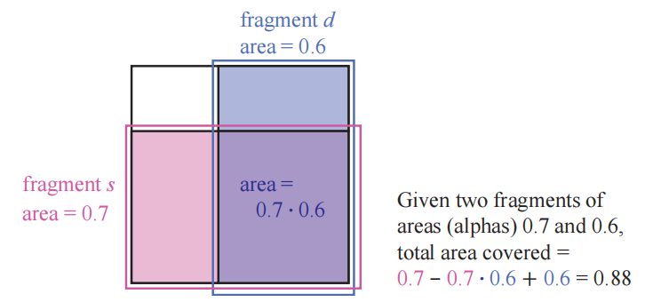

### 5.5.2 顺序无关的透明度算法

$\mathbf{under}$运算符用于将所有透明物体都绘制到一个单独的颜色缓冲中，然后再使用$\mathbf{over}$运算符将这个颜色缓冲合并到场景的不透明视图上。$\mathbf{under}$运算符的另一个用途是执行被称为深度剥离（depth peeling）的算法\[449, 1115]，该算法是一种顺序无关的透明度算法（order-independent transparency，OIT），这里的顺序无关意味着：应用程序不需要对透明物体进行排序。深度剥离的核心思路是使用两个z-buffer和多个pass。首先，第一个pass会将所有表面的z-depth信息记录在第一个z-buffer中，包括所有的透明表面；在第二个pass中，只会渲染所有的透明物体，如果一个透明物体的z-depth与第一个z-buffer中的深度值相匹配，那么我们可以知道，这个透明物体是距离相机最近的，并将其$\rm RGB\alpha$值保存在一个单独的颜色缓冲区中；并且此时我们会进行“剥离”操作，具体方式是使用距离相机第二近的透明物体的z-depth（如果存在的话）来更新第一个z-buffer中的对应位置，此时最靠近相机的那个透明物体便被剥离了出去，代替它的是第二近的透明物体。接下来的一系列pass会继续按照这种方式来剥离透明物体，并在透明物体的颜色缓冲区上，使用$\mathbf{under}$运算符来进行混合。我们会在一定数量的pass操作之后终止算法，然后将透明图像（透明物体的颜色缓冲区）混合到不透明图像上，如图5.35所示。

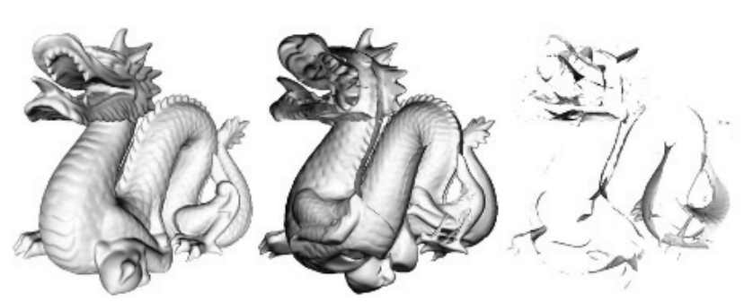

深度剥离算法有好几种变体，例如：Thibieroz \[1763]给出了一种可以从后向前进行渲染的算法，其优势在于可以将透明值进行立即混合，这意味着我们不需使用额外的alpha通道。深度剥离算法的一个问题在于，我们并不知道到底要使用多少个pass才能捕获所有的透明层，一种基于硬件的解决方案是，通过使用一个像素绘制计数器来记录当前pass中写入了多少像素；如果在一个pass中没有任何的像素被写入，那么就说明完成了深度剥离。使用$\mathbf{under}$运算符的优点在于，最重要的那一个透明层（眼睛最先看到的）是最先被渲染的。每个透明表面总是会增加所覆盖像素的alpha值，如果一个像素的alpha值接近1.0的话，意味着这个像素已经接近不透明了，而对于后续需要进行混合的颜色（位于更远处的透明表面的颜色），其影响可以忽略不计\[394]。我们可以通过设置一个固定的pass数量，或者当一个pass所渲染的像素数量低于某个设定的最小值时，将算法终止，从而减少从前到后的剥离次数。但是这种方式不利于从后向前的剥离过程，因为最重要的那一层位于最前面，它通常是最后被绘制的，如果过早终止算法的话，可能会丢失这些最重要的透明信息。

尽管深度剥离算法可以有效渲染透明物体，但是这个算法的效率并不高，因为每次剥离的过程，都是对所有透明物体的一次独立渲染pass。 Bavoil和Myers \[118]提出了一种双重深度剥离算法（dual depth peeling），在每个pass中，会剥离当前最近和最远的两层透明表面，从而使得pass数量减半。Liu 等人\[1056]探索了一种桶排序方法（bucket sort method），可以在一个pass中最多捕获32层透明表面；该方法的一个缺陷在于，它需要一个相当大的内存空间，来维护所有透明层的排序顺序。如果再使用MSAA或者类似的抗锯齿技术的话，会极大增加内存开销。

如何以一个可交互的速率来正确混合透明物体，这个问题的关键不在于我们缺少这样的有效算法，而是在于如何将这些算法在GPU上进行高效实现。Carpenter于1984年提出了A-buffer \[230]，这是多重采样的另一种方式。在A-buffer中，每个被渲染的三角形（片元），都会为其所覆盖地每个屏幕单元格创建一个覆盖掩码（coverage mask），每个像素上都会存储与其相关的所有片元。不透明片元会剔除位于它们后面的片元，就像z-buffer一样；而所有透明表面的片元都会被存储下来。当所有的信息都被构建完成之后，会通过遍历片元和解析样本的方式，来生成最终的结果。

在GPU上创建片元链表（linked list）的想法，是通过DirectX 11中暴露的新特性实现的\[611, 1765]，这些新特性包括章节3.8中提到的无序访问视图（UAV）和原子操作（atomic operation）。基于MSAA的抗锯齿可以通过访问覆盖掩码和计算每个样本的像素着色器结果来实现。该算法的原理是对每个透明表面进行光栅化，并将生成的片元插入到一个长数组中。然后连同颜色信息和深度信息一起，会生成一个单独的指针结构，该结构会将每个片元与该像素的前一个片元相链接。然后会执行一个单独的pass，它会渲染一个填充屏幕的四边形，以便在每个屏幕像素位置上调用像素着色器，这个着色器会根据已有的指针链接，找到每个像素上所有的透明片元；检索到的每个透明片元，都会与前面的片元按照深度进行排序，然后将排序后的链表，按照从后往前的顺序进行混合，从而生成最终的颜色。由于这里的混合操作是通过像素着色器执行的，因此如果需要的话，我们可以为每个像素都指定不同的混合模式。GPU和API的持续发展降低了使用原子操作符的开销\[914]，从而提升了性能表现。

A-buffer的优点在于，只需要为每个像素分配所需的片元即可，不会浪费额外的存储空间，GPU上的链表实现也是如此。但是从某种意义上来说，这也可能是一个缺点，因为在渲染之前，我们并不知道到底需要多少的存储空间（链表可能会很长）；而且对于一个带有头发、烟雾或者其他具有大量重叠透明物体的场景而言，它所能产生的片元数量将会是十分巨大的。Andersson指出\[46]，对于一些复杂的游戏场景，可能会有多达50个透明网格（如树叶）和200个半透明粒子会发生重叠。

![图5.36：左上角执行的是传统的、从后向前的alpha混合，由于错误的排序顺序，会导致渲染出错。右上角使用了A-buffer，给出了一个完美的，非交互式的结果。左下角使用了多层alpha混合的渲染结果。右下角展示了A-buffer和多层alpha混合之间的差异，为了便于观察，将结果颜色放大了四倍 \[1532\] 。](images/Chapter-5/20230120214130.png "图5.36：左上角执行的是传统的、从后向前的alpha混合，由于错误的排序顺序，会导致渲染出错。右上角使用了A-buffer，给出了一个完美的，非交互式的结果。左下角使用了多层alpha混合的渲染结果。右下角展示了A-buffer和多层alpha混合之间的差异，为了便于观察，将结果颜色放大了四倍 \[1532] 。")

GPU通常会有预先分配好的存储资源，例如缓冲区和数组，链表方法也不例外。可以由用户来决定到底使用多少内存，如果内存耗尽的话，则会造成一些很明显的瑕疵。Salvi和Vaidyanathan \[1532]提出了一种解决这个问题的方法，即多层alpha混合（multi-layer alpha blending），它使用了一个由Intel引入的GPU特性，该特性叫做像素同步（pixel synchronization），如图5.36所示。这一特性可以用于实现可编程混合，并且开销要比原子操作小。他们的方法重新定义了存储和混合，以便能够在内存耗尽的时候，适当降低质量。此外，粗略的排序对这种方法也有一定的帮助。DirectX 11.3引入了光栅器有序视图（章节3.8），这是缓冲区的一种类型，它允许在支持该功能的任何 GPU 上实现这种透明方法\[327, 328.。移动设备也有着被称为tile本地存储（tile local storage）的类似技术，允许在这些设备上使用多层alpha混合\[153]。然而这种机制也有一定的性能成本，因此这类算法的开销可能会很大\[1931]。

这种方法建立在Bavoil等人\[115]提出的k-buffer的思想上，其中前几个可见层会被尽可能地保存和排序，而更深的层则会被尽可能地丢弃和合并。Maule等人\[1142]使用了一个k-buffer，并使用加权平均（weighted average）来描述这些较远的透明层。即该算法会保留前面若干个透明层，并对它们进行排序；而对于后续的透明层，会将多个层划分为一组，并使用加权平均的方式进行混合。基于加权求和\[1202]和加权平均\[118]的透明技术，都是顺序无关的，并且都是单pass的，因此可以运行在几乎所有的GPU上。但是它们的问题都在于，没有考虑到物体的前后顺序，例如：使用alpha来表示覆盖率，一条淡红色围巾叠加在一条淡蓝色围巾的上面，会给人一种紫罗兰色的感觉；而正确地结果是一条带有一些蓝色的红色围巾。虽然对于几乎不透明的物体而言，这种方法产生的效果会很差，但是这类算法对于可视化很有用，而且对于高度透明的表面和粒子也很有效，如图5.37所示。

![图5.37：随着不透明度的增加，物体之间的前后顺序会变得越来越重要。 \[394\]](images/Chapter-5/20230120214939.png "图5.37：随着不透明度的增加，物体之间的前后顺序会变得越来越重要。 \[394]")

加权和（weighted sum，WS）透明度的方程为：

$$
\mathbf{c}_{o}=\sum_{i=1}^{n}\left(\alpha_{i} \mathbf{c}_{i}\right)+\mathbf{c}_{d}\left(1-\sum_{i=1}^{n} \alpha_{i}\right)
\tag{5.27} 
$$

其中方程中的$ n  $代表透明表面的数量，$\mathbf{c}_i$和$\alpha_i$代表了第$i$个透明表面的颜色值和alpha值，$\mathbf{c}_d$是场景中不透明部分的颜色。方程中包含两个求和的部分，当透明表面被渲染的时候，这两部分会被分别累加并存储；并且在透明pass的最后，每个像素都会对方程5.27进行计算。这种方法的问题有两个：1，第一个求和式的结果会饱和，即产生超过$(1.0,1.0,1.0)$的颜色；2，由于第二个求和式的结果也可能会大于1，因此背景颜色可能会产生反作用。

由于加权和方程的上述问题，因此通常都会使用加权平均方程：

$$
\begin{aligned} \mathbf{c}_{\mathrm{sum}} & =\sum_{i=1}^{n}\left(\alpha_{i} \mathbf{c}_{i}\right), \quad \alpha_{\mathrm{sum}}=\sum_{i=1}^{n} \alpha_{i}, \\ \mathbf{c}_{\mathrm{wavg}} & =\frac{\mathbf{c}_{\mathrm{sum}}}{\alpha_{\mathrm{sum}}}, \quad \alpha_{\mathrm{avg}}=\frac{\alpha_{\mathrm{sum}}}{n}, \\ u & =\left(1-\alpha_{\mathrm{avg}}\right)^{n}, \\ \mathbf{c}_{o} & =(1-u) \mathbf{c}_{\mathrm{wavg}}+u \mathbf{c}_{d} .\end{aligned}
\tag{5.28} 
$$

第一行代表了在透明渲染的过程中，生成的两个独立缓冲区的结果，每个透明表面对$\mathbf{c}_\mathrm{sum}$的贡献，都会受到其alpha值的影响：越是不透明的表面（alpha越大）所贡献的颜色就越多，越是透明的表面（alpha越小）所贡献的颜色就越少。令$\mathbf{c}_\mathrm{sum}$除以$\alpha_\mathrm{sum}$，我们便可以得到一个加权平均的透明颜色；而$\alpha_\mathrm{avg}$则是所有alpha值的平均值。$u$代表了对于$n$个透明表面而言，将平均alpha应用$n$次之后，对目标（不透明场景）可见性的估计值（即大约有$u\%$的部分不可见，即有$(1-u)\%$的部分可见，即alpha值）。最后一行实际上就是$\mathbf{over}$操作符，其中$(1-u)$代表了源的alpha值。

加权平均有一个限制，即对于具有相同alpha值的透明表面而言，无论它们的顺序如何，加权平均都会均匀混合它们的颜色。McGuire和Bavoil \[1176, 1180]引入了加权混合的顺序无关透明度渲染算法，得到了更加可信的结果。在他们提出方程中，表面到相机的距离也会对权重产生影响，即越靠前的表面会产生越大的影响。此外，方程中的$ u  $不再使用平均alpha值来进行估计，而是用1减去$(1-\alpha_i)$各项相乘的结果，从而给出了这一组透明表面真实的alpha覆盖率。这个方法可以产生在视觉上更加可信的结果，如图5.38所示。

![图5.38：图中展示了在两个不同的相机位置上，观察同一个引擎模型的结果，它们都使用了加权混合的顺序无关透明度算法。按照距离进行加权，有助于弄清哪些表面更加靠近观察者 \[1185\] 。](images/Chapter-5/20230120233740.png "图5.38：图中展示了在两个不同的相机位置上，观察同一个引擎模型的结果，它们都使用了加权混合的顺序无关透明度算法。按照距离进行加权，有助于弄清哪些表面更加靠近观察者 \[1185] 。")

这种按照距离进行加权的方法存在一个缺点，即在一个很大的场景中，彼此靠近的两个物体会拥有几乎相同的权重，这使得最终计算的结果与使用加权平均方法的结果相差不大。除此之外，随着相机到透明物体的距离发生变化，深度权重也可能会发生变化，但是这种变化是平缓的，并不会造成突变的效果。

McGuire和Mara \[1181, 1185]对这种方法进行了扩展，使其包含了合理的颜色透射效果。上文中我们曾经提到，本小节中所讨论的透明度算法，都只是对像素覆盖率进行模拟，从而实现对颜色的混合，而不是对颜色进行过滤。为了得到颜色过滤的效果，需要在像素着色器中获取不透明场景的颜色，将每个透明表面的颜色与它所覆盖的像素颜色相乘，然后将结果存储到第三个缓冲区中。在这个缓冲区中，不透明物体现在会被透明物体染色，并在接下来解析半透明缓冲区的时候，使用第三个缓冲区来代替不透明场景。与使用覆盖率来模拟透明度的方法不同，颜色透射是顺序无关的，因此这个方法也是有效的。

还有一些其他的算法，它们用到了这里所介绍技术的部分元素和思路。例如：Wyman \[1931]按照内存需求、插入和合并的方法、是否使用了alpha覆盖率或者几何覆盖率，以及如何处理被丢失的片元，对之前的透明度算法进行了分类。通过寻找先前研究中的空白与不足，他展示了两种被发现的新方法。其中一种方法叫做随机分层alpha混合（stochastic layered alpha blending），该方法使用了k-buffer，加权平均以及随机透明度；另一种方法是Salvi和Vaidyanathan方法的变体，使用了覆盖掩码来代替了alpha。

考虑到透明物体的类型，渲染方法以及GPU特性，目前还没有一种能够完美渲染透明物体的解决方案。我们推荐感兴趣的读者参考一下Wyman的论文\[1931]以及Maule等人对交互式透明度算法的详细调查\[1141]。McGuire的演讲\[1182]为该领域提供了一个更加开阔的视野，内容贯穿了与透明度相关的各种现象，例如体积照明，颜色透射和折射等，这些内容将会在本书的后续章节中，进行更加深入的讨论。

### 5.3.3 Alpha预乘与合成

$\mathbf{over}$操作符也可以用于将照片或者物体的渲染图混合在一起，这个过程被称为合成（compositing）\[199, 1662]。在这种情况下，每个像素的alpha值会与物体的$\rm RGB$值存储在一起，alpha通道所构成的图像有时候也被称为无光粗糙层（matte，也叫做哑光），它展示了物体的轮廓形状，图6.27展示了该图层的一个例子。这个$\rm RGB \alpha$图像可以用于与其他元素和背景进行混合。

使用合成$\rm RGB \alpha$数据的一种方式是alpha预乘（premultiplied alpha，也被称为关联的alpha），它的意思是在使用这些$\rm RGB$值之前，要先将它们与对应的alpha值相乘。在alpha预乘之后，会使得over方程变得更加高效：

$$
\mathbf{c}_{o}=\mathbf{c}_{s}^{\prime}+\left(1-\alpha_{s}\right) \mathbf{c}_{d}
\tag{5.29} 
$$

其中$\mathbf{c}_{s}^{\prime}$代表了已经alpha预乘过的源通道，它代替了方程5.25中的$\alpha_{s} \mathbf{c}_{s}$项。由于在混合期间已经叠加过了源颜色，因此alpha预乘还可以在不改变混合状态的情况下，直接使用$\mathbf{over}$操作符和叠加混合。请注意，对于已经alpha预乘过的$\rm RGB \alpha$值而言，尽管也可以使用它们来创建一个特别明亮的半透明值，但是其中的$\rm RGB$分量通常并不会大于其alpha值。

渲染合成图像很适合使用预乘alpha的方法，在黑色背景上渲染抗锯齿的不透明物体默认会提供预乘值。假设一个白色$(1,1,1)$的三角形，在其边缘上覆盖了某个像素的$40\%$，这时通过一些抗锯齿方法（非常精确），该像素值会被设置成为0.4的灰度值，即我们会将这个像素值保存为$(0.4,0.4,0.4)$。如果还要存储alpha值的话，那么其alpha值也为0.4，因为这是三角形所覆盖的区域面积。该像素最终的$\rm RGB \alpha$值为$(0.4,0.4,0.4,0.4)$，这是一个预乘过的像素值。

另一种存储图像的方法是使用未相乘的alpha（unmultiplied alpha），也被称为不关联的alpha，甚至是令人费解的术语——未预乘的alpha（nonpremultiplied alpha）。未相乘的alpha就是其字面意思：存储的$\rm RGB$并不乘以其alpha值。在刚才的那个白色三角形的例子中，不相乘的颜色值为$ (1,1,1,0.4)  $。这种表示的方式的好处在于，它存储了三角形的原始颜色，但是这种颜色在被显示之前，还需要再乘以它的alpha值。在执行过滤和混合操作的时候，最好是使用alpha预乘的颜色数据；因为如果使用未相乘的alpha的话，诸如线性插值的一些操作无法正确执行\[108, 164]。物体边缘也会产生黑色条纹状的瑕疵\[295, 648]。章节6.6对此进行了深入讨论。另外，alpha预乘也可以使得理论表达更加整洁\[1662]。

对于图像处理的应用程序而言，使用不关联的alpha可以在不影响图像原始数据的情况下，对照片进行遮罩处理。此外，不关联的alpha意味着可以使用颜色通道的全精度范围；也就是说，在将未相乘的$\rm RGB \alpha$值转换到用于计算机图形计算的线性空间时，需要格外注意转换的正确性。例如：现在没有浏览器可以对其正确转换，也不可能做这样的转换，因为现在的预期结果就是不正确的\[649]。支持alpha通道的文件格式包括PNG（仅支持不关联的alpha），OpenEXR（仅支持关联的alpha）和TIFF（同时支持两种关联类型的alpha）。

一个与alpha通道相关的概念是色键抠像（chroma key）\[199]，这是视频制作中的一个术语，即演员在绿色背景或者蓝色背景前进行拍摄，然后再与其他背景进行混合。在电影工业中这个过程被叫做绿幕（green-screening ）或者蓝幕（blue-screening）。这个技术的核心思路是将某个特定的色调（用于电影工业），或者某个精确的值（用于计算机图形学）看作是透明的，当检测到这个颜色的时候，就会显示背景图像。这项技术允许仅使用$\rm RGB$颜色来标注物体轮廓，并不需要使用额外的alpha通道。这个方案有一个缺点，即图像中的物体要么是完全不透明的，要么就是完全透明的，即alpha只有1.0和0.0两个取值。例如：GIF格式允许将一种颜色指定为透明颜色。

## 5.6 显示编码

在计算光照，纹理效果或者是其他操作的时候，我们会假设所使用的值是线性的（linear）。通俗来讲，线性意味着加法和乘法可以生成预期的效果。但是为了避免各种视觉瑕疵，显示缓冲区和纹理中使用了非线性的编码方式，这是我们必须要考虑到的。一个简单粗略的答案是：将着色器输出的颜色范围设置为$[0,1]$，并将输出的结果缩放为原来的$1/2.2$次方倍，这个过程被称作为伽马矫正（gamma correction）；而对于输入的颜色和纹理则要进行相反的处理，即要乘以2.2次方。在大多数情况下，你可以让GPU来执行这些转换操作，本小节的目的是简要总结如何进行伽马矫正以及为什么要进行伽马矫正。

我们将从阴极射线管（cathode-ray tube，CRT）开始，在数字成像的早期阶段，通常会使用CRT显示器来进行成像。这些设备的显示radiance和输入电压之间具有指数关系。当应用在一个像素上的能量增加时（电压增加），该像素的radiance并不会线性增长，例如：假设电压与发光强度之间的指数比为2，此时将应用于该像素上的电压设置为原来的50%，那么实际的发光强度为$0.5^2=0.25$，即原来的四分之一\[607]。虽然液晶和其他显示技术有着不同于CRT显示器的亮度响应曲线，但是由于它们都是通过转换电路制造的，因此可以模拟CRT显示器的响应方式。

这个指数函数几乎与人类眼睛对亮度的敏感程度相反，这个幸运的巧合也使得这种编码方式符合人类的视觉感知\[1431]。也就是说，在可显示范围内，一对相邻编码值$ N  $和$ N+1  $之间的感知差异大致是恒定的。使用和阈值对比度（threshold contrast）类似的方法进行测量，我们可以在很大范围的条件下，检测到大约1%的亮度差异（即将人眼对亮度的感知曲线以及CRT显示器的响应曲线进行对比）。当颜色存储在有限精度的显示缓冲区中时，这个近似最优的分布能够最大程度地减少条带瑕疵（章节23.6）。对使用相同编码方式的纹理，也可以起到同样的优化效果。

显示转换函数（display transfer function）描述了显示缓冲区中的值与实际显示器发光强度之间的关系，因此它也被称为电光转换函数（electrical optical transfer function ，EOTF）。显示转换函数是硬件的一部分，对于不同类型的显示器而言（例如计算机显示器，电视以及电影放映机），具有不同的标准。对于这一过程的另一端（图像和视频捕获设备）也有一个相应的标准转换函数，它被称为光电转换函数（optical electric transfer function ，OETF）\[672]。

当对用于显示的线性颜色值进行编码时，我们的目标是抵消显示转换函数的影响，这样计算出的任何颜色值才能发出相应水平的亮度，例如：如果我们计算出的结果翻倍了，那么我们希望显示器输出的亮度也能相应的翻倍。为了保证这种关系，我们需要应用显示转换函数的逆，来抵消其非线性效应，这个消除显示器响应曲线的过程也被称作为伽马矫正（gamma correction），关于进行伽马矫正的原因会在接下来进行说明。当对纹理进行编码的时候，我们需要应用显示转换函数来生成用于着色的线性颜色值。图5.39展示了在显示过程中编码和解码的使用。

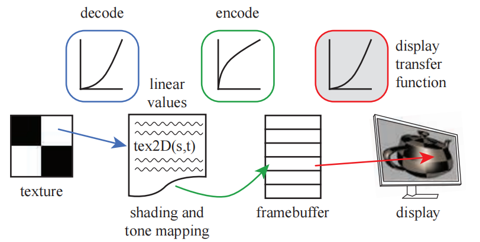

PC显示器的标准转换函数由一个被称为$sRGB$的颜色空间所定义。大部分控制GPU的API可以被设置为：当读取纹理和写入颜色缓冲时，自动完成适当的$ \rm sRGB  $转换\[491]。例如章节6.2.2中所讨论的，mipmap在生成的时候也会采用$ \rm sRGB  $编码。在纹理上进行双线性插值的时候，为了保证插值结果的正确性，首先会将纹理中的颜色值转换为线性值，然后再进行插值计算。alpha混合的时候也是类似的，先将存储在缓存中的值解码为线性值，然后执行混合操作，再对混合结果进行编码和写入。

在渲染的最后阶段，当颜色值被写入帧缓冲中并等待显示的时候，应用这个转换是十分重要的。如果在编码之后再进行一些其他的后处理操作，那么此时是在对非线性的颜色值进行处理，这通常是不正确的，会导致明显的瑕疵。显示编码可以被认为是一个压缩过程，它最大程度上保留了颜色值的感知效果\[491]。有一个很好的方法可以用于理解这个转换过程：我们总是会使用线性值来执行实际的计算，每当要显示结果或者访问可显示的图像（例如彩色纹理）时，我们就需要使用适当的编解码转换，来将数据转换到合适的编码格式中。

如果我们需要手动进行$ \rm sRGB  $转换的话，可以使用标准的转换方程，或者一些简化过的版本。在实际操作中，每个颜色通道的比特数会对显示结果进行控制，例如：对于消费级的显示器而言，一般都是8bit的，它可以提供$[0,255]$共计256个不同的颜色等级。这里我们为了方便讲解，将显示编码的级别表示为$[0.0,1.0]$之间的一个浮点数，线性值也位于这个范围中。我们常用$ x  $来表示线性值，用$y$来表示帧缓冲中的非线性值。为了将线性值$ x  $转换为$ \rm sRGB  $编码的非线性值$y$，我们需要对$x$应用$ \rm sRGB  $显示转换函数的逆，即：

$$
y=f_{\text {sRGB }}^{-1}(x)=\left\{\begin{array}{ll}1.055 x^{1 / 2.4}-0.055, & \text { where } x>0.0031308 \\ 12.92 x, & \text { where } x \leq 0.0031308\end{array}\right.
\tag{5.30} 
$$

其中$x$代表了$ \rm RGB  $值中的一个通道，我们会对每个通道的线性颜色值都应用这个方程，然后由生成的非线性值来驱动显示器。如果我们手动应用这个转换函数的话，那么需要格外的小心，一般会有两个常犯的错误：1，对已经编码过的颜色值（而不是线性值）进行编码处理；2，对一个颜色进行编码两次或者解码两次。

这个变换过程是一个两段函数，两个表达式实际上都是简单的乘法，因为硬件设备需要这个变换是完全可逆的\[1431]。其中第一行表达式包含一个指数运算，它几乎适用于$[0.0,1.0]$的所有范围。考虑到偏移量和尺度，这个函数可以被近似为下面的简单形式\[491]：

$$
y=f_{\text {display }}^{-1}(x)=x^{1 / \gamma}
\tag{5.31} 
$$

其中$\gamma = 2.2$，希腊字母$\gamma$是“伽马矫正”的名称来源。

计算出的数值结果需要进行编码才能正确显示；类似地，使用相机拍摄的图片，在用于计算之前也必须将其转换为线性值。我们在显示器或者电视机上看到的任何颜色，都具有被显示编码过的$ \rm RGB  $三元组，我们可以通过屏幕截图或者颜色选择器来获得具体的数值。这些值会以例如PNG，JPEG，GIF等文件格式来进行存储，这些文件格式可以直接发送到帧缓冲中并显示在屏幕上，而并不需要进行编码转换。换而言之，我们在屏幕上看到的任何图像，都是已经经过显示编码的数据；在使用这些颜色进行着色计算之前，我们都必须将其转换为线性值。将$ \rm sRGB  $格式解码为线性值的方程如下：

$$
x=f_{\mathrm{sRGB}}(y)=\left\{\begin{array}{ll}
\left(\dfrac{y+0.055}{1.055}\right)^{2.4}, & \text { where } y>0.04045, 
\\[3mm] 
\dfrac{y}{12.92}, & \text { where } y \leq 0.04045,
\end{array}\right.
\tag{5.32} 
$$

其中$ y  $代表了归一化的显示通道值，即存储在图像或者帧缓冲中的值，其范围是$[0.0,1.0]$。这个解码函数刚好与之前的$ \rm sRGB  $编码方程相反，这意味着如果我们在一个着色器中读取了一张图片（解码过程），并且不对它进行任何处理直接输出（编码过程）的话，它将和处理之前的结果完全相同。解码函数其实和显示转换函数是完全一样的，因为存储在纹理中的值已经被编码过了，而且它能够正确地显示在显示器上；二者之间不同的是，解码函数将输入转换为一个线性值，而显示转换函数则是将其转换为一个线性响应显示。

更加简单的伽马显示转换函数，是直接将方程5.31取逆：

$$
x=f_{\text {display }}(y)=y^{\gamma}.
\tag{5.33} 
$$

有时我们会看到一组更加简洁的转换函数，特别是在移动和浏览器应用程序中\[1666]：

$$
y=f_{\text {simpl }}^{-1}(x)=\sqrt{x}
\\[2mm]
x=f_{\operatorname{simpl}}(y)=y^{2}
\tag{5.34} 
$$

也就是说，直接对线性值开平方就完成了编码过程，并直接用于显示；反过来，直接取编码值的平方根就完成了解码过程，二者互为反函数。这种转换仅仅是一个很粗略的近似，但是要比完全忽略伽马矫正的过程好上不少。

如果我们不进行伽马矫正的话，那么数值较小的线性值在屏幕上会显得太暗，同时某些颜色的色调可能会发生改变。假设我们设置$\gamma = 2.2$，如果我们希望屏幕上像素的发光强度与计算出来的线性值成正比的话，这意味着要必须要将这个线性值提升到原来的$1/2.2$次方倍。线性值0.1对应的发光强度为0.351，0.2对应0.481，0.5对应0.730。如果我们不进行编码的话，直接将这些线性值输入到显示器中，会导致显示器的发光强度低于所需要的值。需要注意的是，线性值为0.0和1.0在经过编码之后不会有任何改变。在引入伽马矫正之前，场景建模人员通常会手动拉高暗表面的颜色值，从而使得它们在显示变换之后，不至于显得太暗。

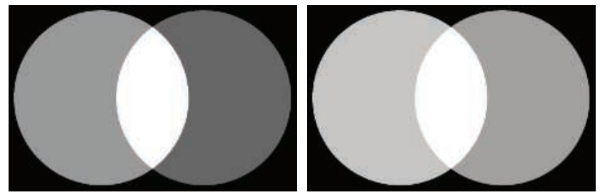

忽略伽马矫正的另一个问题是，对基于物理的线性radiance的正确着色计算，是在非线性值上进行的，图5.40展示了这种情况的一个例子。

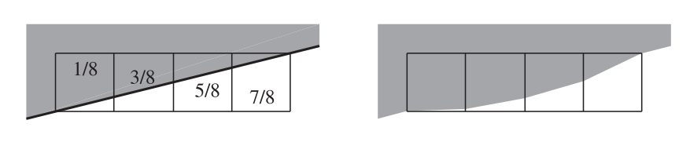

忽略伽马矫正也会影响抗锯齿边缘的质量，例如：假设一个三角形的边界覆盖了四个平面单元格（图5.41），其中三角形的归一化radiance为1（白色），背景的radiance为0（黑色）。从左到右，白色三角形分别占据了单元格的$\frac{1}{8}, \frac{3}{8}, \frac{5}{8},\frac{7}{8}$，假设使用box滤波器来进行抗锯齿处理，我们希望处理后像素的线性radiance分别为0.125，0.375，0.625和0.875。正确的方法是对线性值进行抗锯齿处理，然后再对结果的像素值进行编码处理。如果不这么做的话，边缘像素的radiance会变得很暗，这将导致人眼对于边缘的感知发生变形，如图5.41右侧所示。这种瑕疵被称为扭绳（roping），因为边缘看起来有点像一个扭曲的绳子\[167, 1265]，图5.42展示了这种瑕疵的效果。

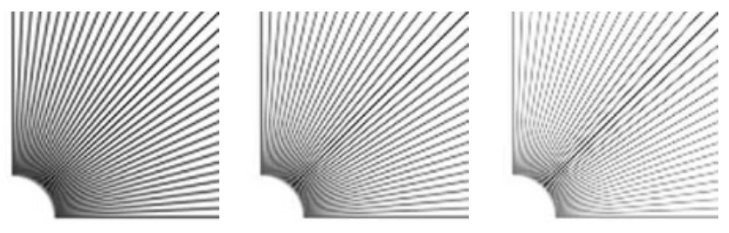

$ \rm sRGB  $标准创建于1996年，现已成为大多数PC显示器的标准。然而这些年来，显示技术有了巨大的发展，出现了亮度更亮，色域更广的显示器。有关色彩显示和亮度的话题在章节8.1.3中进行了讨论；有关高动态显示范围（HDR）的编码方式在章节8.2.1中进行了讨论。Hart的论文\[672]介绍了有关高级显示器的详细内容。

## 补充阅读和资源

Pharr等人\[1413]深入讨论了采样模式和抗锯齿的问题。Teschner的课程讲义\[1758]展示了各种采样模式的生成方法。Drobot \[382, 383]贯穿了之前有关实时抗锯齿的研究，解释了各种抗锯齿技术的特点和性能表现。你可以在 SIGGRAPH课程\[829]中找到各种有关形态学抗锯齿的方法。Reshetov和Jimenez \[1486]提供了游戏中所使用的形态学以及相关时域抗锯齿工作的最新回顾。

对于透明度算法的研究，我们再次向感兴趣的读者推荐McGuire的演讲\[1182]和Wyman的论文\[1931]。Blinn的论文“What Is a Pixel?”\[169]在讨论像素的不同定义时，提供了对计算机图形学多个领域的优秀介绍。Blinn的书籍《Dirty Pixels》和《Notation, Notation, Notation》\[166, 168]包含了一些介绍性的文章，其中涉及滤波和抗锯齿，alpha，合成和伽马校正等内容。Jimenez的演讲\[836]详细介绍了用于抗锯齿的最先进技术（state-of-the-art）。

Gritz和d'Eon \[607]对伽马矫正问题有一个很好的总结。Poynton的书\[1431]对各种媒体文件中的伽玛校正，以及其他与颜色相关的主题进行了详细介绍。Selan的白皮书\[1602]是一个较新的资料来源，它解释了显示编码及其在电影行业中的应用，以及许多其他相关的信息。
