# Chapter 6 Texturing 纹理

## 目录

-   [6.1 纹理管线](#61-纹理管线)
    -   [6.1.1 投影函数](#611-投影函数)
    -   [6.1.2 转换函数](#612-转换函数)
    -   [6.1.3 纹理值](#613-纹理值)
-   [6.2 图像纹理](#62-图像纹理)
    -   [6.2.1 放大](#621-放大)
    -   [6.2.2 缩小](#622-缩小)
        -   [Mipmap](#Mipmap)
        -   [Summed-Area表（SAT）](#Summed-Area表SAT)
        -   [无约束的各向异性过滤](#无约束的各向异性过滤)
    -   [6.2.3 体积纹理](#623-体积纹理)
    -   [6.2.4 立方体贴图](#624-立方体贴图)
    -   [6.2.5纹理表示](#625纹理表示)
    -   [6.2.6纹理压缩](#626纹理压缩)
-   [6.3 程序化纹理](#63-程序化纹理)
-   [6.4 纹理动画](#64-纹理动画)
-   [6.5 材质映射](#65-材质映射)
-   [6.6 Alpha映射](#66-Alpha映射)
-   [6.7 凹凸映射](#67-凹凸映射)
    -   [6.7.1 Blinn方法](#671-Blinn方法)
    -   [6.7.2 法线映射](#672-法线映射)
-   [6.8 视差映射](#68-视差映射)
    -   [6.8.1 视差遮挡映射](#681-视差遮挡映射)
-   [6.9 纹理光源](#69-纹理光源)
-   [补充阅读和资源](#补充阅读和资源)

> Jim Blinn——“All it takes is for the rendered image to look right.”

> 吉姆 布林——“所需要做的就是使渲染出来的图像看起来正确。”（美国计算机图形学专家，Blinn-Phong着色模型；1949—）

表面纹理（texture）是指其外观和给人的视觉感受，就像是一幅油画的图案一样。而在计算机图形学中，纹理化则指的是一个过程，即通过使用一些图像、函数或者其他数据，来对每个表面位置的外观表现进行修改。例如：我们可以将一张砖墙的彩色图像应用于由两个三角形组成的矩形上，而不是去精确表现砖墙的几何结构。当我们观察这个砖墙矩形的时候，对应的彩色图像将会显示在这个矩形所在的位置上，这样可以使得这个矩形看起来很像真实的砖墙。除非相机十分靠近墙壁的话，否则砖墙几何细节的缺乏并不会带来明显的视觉瑕疵。

然而，除了缺乏细致的几何结构之外，一些具有纹理的砖墙也有可能无法令人信服。例如：砖墙的砂浆（砖块和砖块之间粘合物）应当是哑光的（matte），而砖块则应当是有光泽的（glossy），但是观察者会注意到，此时这两种材料表现出的粗糙度（roughness）实际上是相同的。为了产生更加令人信服的视觉表现，我们可以将第二张图像纹理应用到这个表面上，这种纹理并不会改变表面的颜色，而是会根据表面位置来修改墙壁的粗糙度。现在砖块和砂浆从图像纹理中获得了颜色，从新纹理中获得了各自所对应的粗糙度值。

通过上述两张纹理图像，观察者可以看到，现在所有的砖块都是有光泽的，而所有的砂浆都是哑光的。但是现在还有一些问题，那就是每个砖块看起来都非常平整，而真实的砖块表面通常都是坑坑洼洼的，是不规则的。我们可以通过使用凹凸映射（bump mapping），对砖块表面的着色法线进行一些修改，从而使得其在渲染之后看起来并不平整。这类纹理贴图通过对矩形的原始表面法线进行抖动处理，从而改变光照的计算结果。

如果从一个接近平行的角度来观察这个砖墙的话，那么这种崎岖不平的错觉便会露出马脚，因为现实中的砖块要比砂浆更加突出，因此我们应该是看不到砂浆的。而且即使是从一个垂直的视角进行观察，砖块也应当会在砂浆上投射出阴影。视差映射（parallax mapping）会在渲染平面时，使用一个特殊纹理来使其变形；视差遮蔽映射（parallax occlusion mapping）会对高度纹理进行光线投射，从而提高渲染的真实感。位移映射（displacement mapping）通过使用位移贴图，从而对模型的三角形高度进行修改。图6.1展示了一个具有颜色贴图和凹凸贴图的例子。

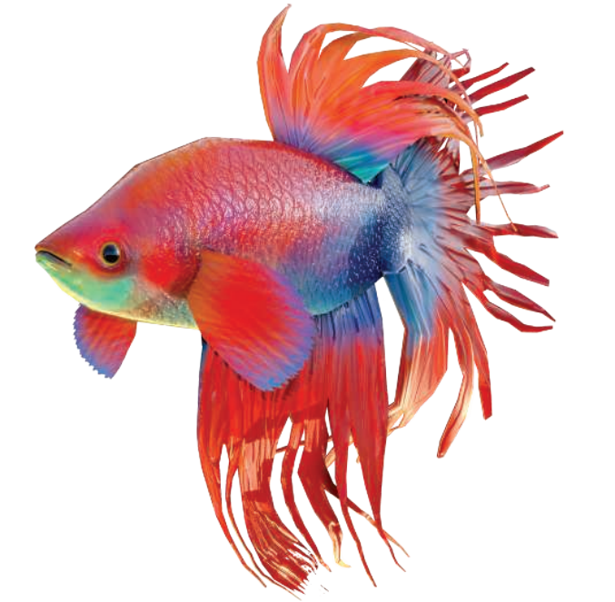

以上所举的例子都可以通过使用纹理技术来解决，它们使用了越来越复杂的算法。在本章节中，我们将详细介绍有关纹理处理的相关技术。首先，我们会给出了纹理化过程的一般框架。然后，我们将重点关注在纹理表面上应用纹理贴图的过程，因为这是实时渲染中最为流行的纹理使用形式。我们也会简要讨论有关程序化纹理的内容，也会介绍一些使用纹理贴图来影响表面的常见方法。

## 6.1 纹理管线

纹理化（texturing）是一种用于描述表面材质以及对表面进行修饰加工的有效技术，一种理解纹理的方法是，思考单个着色像素会如何发生变化。正如前一章中所提到的，着色计算需要考虑材质和光源的颜色，以及其他各种复杂的因素；如果场景中还有透明物体的话，那么还需要考虑透明度对着色计算的影响。纹理的工作原理是通过修改着色方程中所使用的参数，从而对最终的着色结果产生影响，而这些参数通常会随着表面位置的变化而变化。例如：对于上文中的砖墙例子，会根据着色点在表面上的位置信息，将该点的颜色替换为砖墙图像中的对应颜色。为了与屏幕上的像素（pixel）概念有所区别，图像纹理中的像素通常被称为纹素（texel）。粗糙度纹理修改了表面的粗糙度值，凹凸纹理修改了表面着色法线的方向，因此每个纹理都对最终着色方程的计算结果产生了影响。

纹理化的过程可以被描述为一个更加一般的纹理管线。稍后我们将会介绍许多术语，但是请你牢记：我们将会详细描述这个纹理管线中的每个部分。

纹理化的起点首先是空间中的一个具体位置，这个位置可以在世界空间中，但是通常都会放在模型的参考坐标系中，因为当模型发生移动的时候，纹理也会随之移动。这里我们使用Kershaw提出的术语\[884]：这个空间点会应用一个投影函数（projector function）来获得一组数字，它被称为纹理坐标（texture coordinates），这个纹理坐标将用于访问和采样纹理，这个过程被称为纹理映射（texture mapping）。有时候纹理图像本身会被称为纹理贴图（texture map），尽管这并不是严格正确的。

在使用纹理坐标访问纹理之前，还需要使用一个或者多个转换函数（corresponder function），来将纹理坐标转换到纹理空间中。 转换后的纹理空间位置用于在纹理中获取像素值，例如：纹理空间位置可以是图像纹理中的数组索引，从而检索到对应位置上的像素值。检索到的像素值可能还需要使用一个值转换函数（value transform function）来进行转换，最终这些新值会用于对表面的某些属性进行修改，例如材质或者着色法线等。图6.2详细展示了一个纹理的应用过程。这个纹理管线之所以要设计得如此复杂，是因为其中的每个步骤都可以为用户提供一些有用的控制。需要注意的是，并不是每次纹理应用过程都需要激活管线中的所有步骤。

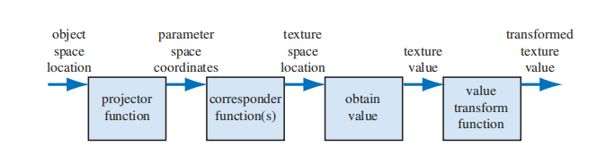

例如：对于一个具有砖墙纹理的三角形，我们在其表面上进行采样时会发生如下情况（如图6.3所示）：首先我们会在该物体的局部参考系中，找到对应的采样位置$(x, y, z)$，这里假设它是$(−2.3,7.1,88.2)$。然后会对这个位置坐标应用一个投影函数，就像世界地图是三维地球的二维投影那样，这里的投影函数通常会将一个三维向量$(x, y, z)$转换为一个二维向量$(u, v)$。本例中所使用的投影函数，实际上与正交投影是等价的（章节2.3.1），它就像幻灯片放映机一样，将砖墙图像投影到三角形表面上；并且为了最后能将图象值返回到墙面上，其表面上的点都会被转换为一个0-1范围内的数值对，这里我们假设转换后的值是$(0.32,0.29)$，这个数值对也被称为纹理坐标或者UV坐标。这个纹理坐标将用于查找纹理贴图在此位置上的颜色值。假设这里我们所使用的砖墙纹理分辨率为$256\times 256$，因此使用转换函数，将纹理坐标$(u, v)$各自乘以256，即$(81.92,74.24)$。在丢弃小数部分之后，我们在砖墙图像中进行检索，找到索引值为$(81,74)$的颜色值，这里假设这个颜色值为$(0.9, 0.8, 0.7)$。同时，我们所使用的纹理颜色位于sRGB颜色空间中，因此如果要在着色方程中使用这个颜色值，还需要将其转换到线性空间中，即$（0.787、0.604、0.448）$（章节5.6）。

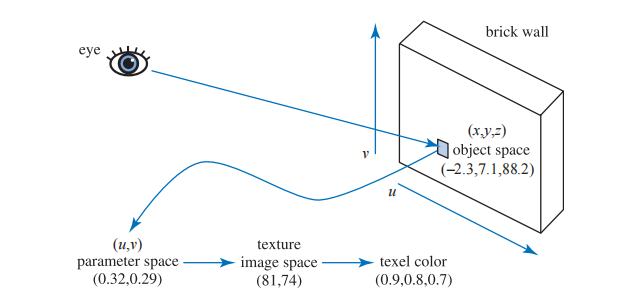

### 6.1.1 投影函数

纹理处理的第一步是获取表面的位置，并将其投影到纹理坐标空间（texture coordinate space）中，这个纹理坐标空间通常是一个二维$(u,v)$空间。常见的建模软件都允许艺术家定义每个顶点的$(u,v)$坐标。这些$(u,v)$坐标可以从投影函数（projector function）或者网格展开算法（mesh unwrapping algorithm）中进行初始化，艺术家也可以像编辑顶点位置那样，对$(u,v)$坐标进行编辑。投影函数的作用通常是将空间中的三维坐标转换为二维纹理坐标，在建模软件中常用的投影函数包括球面投影（spherical）、柱面投影（cylindrical）和平面投影（planar）等\[141, 884, 970]。

投影函数还可以有其他的输入参数，例如：表面法线可以用来选择应用于该表面的平面投影方向（一共六个）。在面片接缝处（即UV接缝）常常会出现纹理匹配的问题，Geiss \[521, 522]讨论了一种将UV接缝混合在一起的技术。Tarini等人\[1740]描述了立方体映射技术（polycube maps），在该方法中，一个模型会被映射到一组立方体投影上，空间中的不同区域会被映射到不同的立方体上。

而其他的一些投影函数实际上根本就不是投影操作，而是隐含在了表面创建和曲面细分中。例如：参数化曲面的定义本身就包含了一组天生的$(u，v)$坐标，如图6.4所示。纹理坐标也可以从其他不同的参数中生成，例如观察方向、表面温度（热力图）或者任何其他可以想象的东西。投影函数的最终目标是生成纹理坐标，将其作为一个与位置有关的函数来进行推导，只是其中的一种方法。

 投影。第二行则展示了这些投影方法应用于同一个物体的结果（不包含自然投影）。")

非交互式的渲染器会经常调用这些投影函数，这是渲染过程本身的一部分。虽然有时候单个投影函数就可以用于整个模型的投影操作，但是艺术家通常会使用一些工具来将模型进行细分，并单独应用不同的投影函数\[1345]，如图6.5所示。

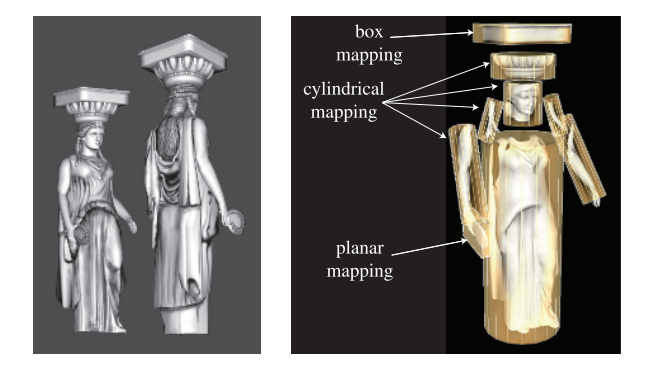

在实时渲染中，通常会在建模阶段使用投影函数，并将结果数据存储在顶点上。但是情况并非总是如此，有时在顶点着色器或者像素着色器中应用投影函数是会带来一些好处，这样做可以提高精度，并有助于实现包括动画（章节6.4）在内的各种效果。有时候一些渲染方法有着自己独特的投影函数，它们会进行逐像素的计算，例如环境映射（environment mapping，章节10.4）

球面投影（spherical projection，图6.4左侧）会将表面点投影到一个以某点为中心的假想球体上，Blinn和Newell在其环境映射方案（章节10.4.1）中所使用的投影方法便是球面投影，方程10.30对这个函数进行了描述。但是这种投影方法与那一小节中所描述的顶点插值方法，都存在相同的问题。

柱面投影（cylindrical projection）计算纹理坐标$u$的方法与球面投影相同，而纹理坐标$v$则是沿圆柱体轴的距离。这种投影方法对于具有中心轴的物体而言十分有用，例如旋转的表面。柱面投影的缺点是，当一个表面几乎垂直于圆柱体的中轴时，就会发生畸变（如柱面投影两端的圆形表面）。

平面投影（planar projection）就像一束$x$射线一样，它会沿着一个方向进行平行投射，并将纹理应用到所有的表面上。平面投影使用了正交投影方法（章节4.7.1）。这种类型的投影在贴花（decal）应用中十分有用（章节20.2)。

与投影方向平齐的表面会发生严重的扭曲，因此艺术家经常需要手动将模型分解成接近平面的小块（即建模流程中的分UV）。有一些工具可以通过对网格进行展开，或者创建一组接近最优的平面投影，来帮助减少这种扭曲现象。我们的目标是，让每个多边形在纹理区域中尽量占据更加公平的份额，同时尽可能多的保持网格连通性。网格的连通性是非常重要的，因为在网格的接缝处很容易出现采样瑕疵。一个具有良好展开效果的网格，可以使得艺术家的后续工作变得更加轻松\[970, 1345]。章节16.2.1中讨论了纹理扭曲是如何对渲染产生负面影响的。图6.6中所展示的UV图和纹理图，与图6.5中的雕像相对应。这个展开过程是一个更大的研究领域（网格参数化，mesh parameterization）的其中一部分，有兴趣的读者可以参考Hormann等人\[774]的SIGGRAPH课程讲义。

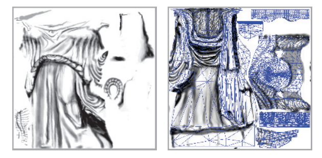

纹理坐标空间并不总是一个二维平面，有时候它也可能是一个三维体积，在这种情况下，纹理坐标会被表示为一个包含三个分量的向量$(u, v, w)$，其中$w$是沿着投影方向的深度。有一些系统会使用多达四个坐标，通常是$ (s, t, r, q)  $\[885]，其中$q$代表了齐次坐标中的第四个值。它的作用类似于电影放映机或者幻灯片投影机，随着投影距离的增加，投影产生的纹理大小也会相应增加。例如，它可以用于在舞台或者其他表面上，投影一个装饰性的聚光灯图案（被称为gobo）\[1597]。

另一类重要的纹理坐标空间是方向性的，纹理空间中的每个点都需要通过输入方向来进行访问。将这种空间进行可视化的一种方法是，将其作为单位球体上的点，每个点位置上的法线代表了用于访问该位置纹理的输入方向。使用这种方向性参数化的、最常见的纹理类型就是立方体贴图（cube map，章节6.2.4）。

值得注意的是，一维的纹理图像和投影函数也有各自的用途。例如：对于一个地形模型而言，它的表面颜色可以由该点对应的高度决定，即低地是绿色的，山峰是白色的。线条同样也可以被纹理化，其中一个应用场景是，将雨渲染为一组带有半透明图像纹理的长线条。这样的纹理也可以用于将一个值转换为另一个值，例如将其作为一个一维查找表（lookup table，LUT）。

由于多个纹理可以被应用到同一个表面上，因此可能需要定义多组纹理坐标。但是无论怎样使用这些纹理坐标，其核心思想都是相同的：这些纹理坐标会在表面上进行插值，并用于检索纹理值。然而，在进行插值之前，这些纹理坐标还需要使用转换函数进行变换。

### 6.1.2 转换函数

转换函数（corresponder function）用于将纹理坐标转换为纹理空间中的具体位置，它们提高了在表面上应用纹理的灵活性。转换函数的其中一个例子是：使用API选择现有纹理中的一部分来进行显示；并且在后续操作中都只会用到这个子图像。

另一类转换函数是矩阵变换，应用于顶点着色器或者像素着色器中，它们允许对表面上的纹理进行平移、旋转、缩放、剪切或者投影操作。正如章节4.1.5中所讨论的，这些变换操作的顺序是很重要的。令人惊讶的是，纹理的变换顺序必须与预期的变换顺序相反，这是因为纹理变换实际上是对决定图像可见位置的遮罩空间产生了影响；图像本身并没有被变换，真正发生变换的是定义图像位置的空间。

另一类转换函数控制了图像的应用方式，我们知道，当纹理坐标$(u, v)$在$[0,1]$范围内时，表面上才会出现图像，但是如果纹理坐标位于这个范围之外呢？转换函数决定了此时会发生什么。在OpenGL中，这种类型的转换函数被称为“包装模式（wrapping mode）”；而在DirectX，则被称为“纹理寻址模式（texture addressing mode）”。这种类型的常见转换函数包括：

-   **wrap**（DirectX），**repeat**（OpenGL）或者**tile**：图像会在表面上进行重复。在算法实现中，纹理坐标的整数部分会被直接丢弃（这使得纹理坐标在$[0,1]$范围不断重复）。这种模式对于让材质图像在表面上不断重复而言十分有用，并且通常都是默认的模式。
-   **mirror**：图像在表面上不断重复，但是每重复一次就会被镜像（翻转）一次。例如：图像在纹理坐标为0-1之间时表现正常，然后在1-2之间时会进行反转，然后在2-3之间时表现正常，然后再反转，以此类推。这种模式可以为纹理边缘提供一些连续性。
-   **clamp**（DirectX）或者**clamp to edge**（OpenGL）：位于$[0,1]$范围外的纹理坐标会被限制在这个范围内。这种模式会导致图像边缘的不断重复，其的优点在于：当在纹理边缘附近发生双线性插值时，这个模式可以避免从纹理的相反边缘处采样\[885]。
-   **border**（DirectX）或者\*\*clamp to border \*\*（OpenGL）：位于$[0,1]$范围外的纹理坐标所采样到的值，会被设定为同一个颜色，它被称为边框颜色（border color），这个边框颜色是可以自己定义的。这种模式可以很好地将贴花渲染到一个单色表面上，因为纹理的边缘颜色会与这个边框颜色进行平滑地混合。

如图6.7所示。每个纹理轴上所分配的转换函数可以是不同的，例如：可以在轴$u$上使用repeat模式，而在轴$v$上则使用clamp模式。在DirectX中还有一个**mirror once**模式，它可以对纹理只进行一次镜像操作，然后再使用clamp模式，这种特殊模式对于对称贴花而言十分有用。

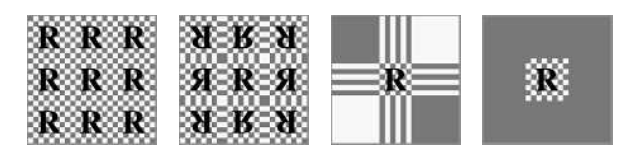

纹理的重复平铺是一种为场景添加更多视觉细节的廉价方法，但是通常来说，这种方法在纹理重复三次之后就看起来不太自然了，因为人眼会识别出这种重复的图案。避免这种周期性（periodicity）问题的一个常见方法是，将纹理值与另一个非重复平铺的纹理相结合。这种方法可以被极大扩展，例如Andersson \[40]所描述的商用地形渲染系统，该系统可以根据地形类型、高度、坡度等因素，对多种纹理进行组合。同时纹理图像也会与几何模型（例如灌木和岩石）在场景中的位置有关。

另一个避免周期性问题的方法是，使用着色器程序来实现一些特殊的转换函数，从而将纹理图案和瓦片（tile）贴图进行随机重组。Wang tiles就是这种方法的一个例子，它是一组边缘匹配的方形瓦片贴图，在纹理化过程中，会对集合中的瓦片贴图进行随机选择\[1860]。Lefebvre和Neyret  \[1016]实现了一个类似的转换函数，来避免纹理图案的重复问题，它使用了依赖纹理读取和纹理表格。

最后一种被应用的转换函数是隐式的，并且与图像的大小有关。纹理通常会应用在$uv$坐标的$[0,1]$范围内。例如砖墙的例子，通过将该范围内的纹理坐标乘以图像的分辨率，便可以得到对应的像素位置。这种将纹理坐标限制在$[0,1]$范围内的优势在于：可以使用不同分辨率的纹理贴图，而且不需要修改存储在模型顶点中的纹理坐标值。

### 6.1.3 纹理值

在使用转换函数生成纹理空间坐标之后，便可以使用这个坐标来获取对应的纹理值。对于图像纹理而言，这是通过检索图像中的纹素信息来完成的，我们将在章节6.2中详细讨论这个话题。在实时渲染中所使用的绝大多数纹理都是图像纹理，但是也可以使用一些函数来程序化生成纹理的内容。在使用程序化纹理的情况下，从纹理空间位置获得纹理值的过程并不涉及内存查找，而是变成了对一个函数进行计算。有关程序化纹理的内容将在章节6.3中进一步描述。

最直接的纹理值就是$RGB$三元组，它可以用于替换或者修改表面的颜色，当然也可以只返回简单的灰度值。另一种可以返回的数据类型是$RGB\alpha$，如章节5.5所述。其中的$\alpha$值（alpha）通常代表了颜色的不透明度，它决定了该颜色对像素的影响程度。纹理贴图中不仅仅可以存储颜色数据，还可以存储任何其他类型的数据，例如表面粗糙度等。在章节6.7中我们讨论了凹凸映射（bump mapping），届时我们会看到纹理贴图中存储的其他类型数据。

从纹理中返回的值可以在使用之前进行选择性地转换，这些转换一般都是在着色器程序中执行的。一个常见的例子是，将数据从无符号范围（0.0到1.0）重新映射到有符号范围（- 1.0到  1.0）内，它可以用来在纹理贴图中存储法线数据。

## 6.2 图像纹理

在图像纹理化的过程中，二维图像被有效地附着在一个或者多个三角形的表面上。在上一小节中，我们讨论了如何根据纹理坐标来计算对应的纹理空间位置；现在我们将解决从给定位置的图像纹理中，获取纹理值的相关问题和算法。在本章节的剩余部分中，我们将图像纹理（image texture）将简称为纹理（texture）；此外，当我们提到像素的单元格（pixel's cell）时，它实际上指的是围绕该像素的屏幕网格单元（screen grid cell）。正如章节5.4.1中所讨论的那样，像素实际上是一个被显示出来的颜色值，它会（而且应该，为了更好的质量）受到与其相关网格单元之外的样本影响。

在本小节中，我们将特别关注于快速采样和过滤纹理图像的方法。章节5.4.2讨论了走样和锯齿问题，尤其是在渲染物体边缘的时候；纹理同样也会遇到采样问题，不同的是，它们会出现在被渲染的三角形内部。

像素着色器可以通过将纹理坐标传给texture2D等函数，并调用它们来访问纹理；这些纹理坐标位于$(u,v)$纹理坐标系中，会通过转换函数来将其映射到$[0.0,1.0]$范围中，然后再由GPU负责将这个值转换为纹素坐标。在不同的图形API中，纹理坐标系统有两个主要的区别。在DirectX中，纹理的左上角对应$(0,0)$，右下角是对应$(1,1)$，这与大多数图像类型存储数据的方式相匹配，因为位于图像顶部的数据会被存储在图像文件的起始位置；而在OpenGL中，左下角的位置对应了$(0,0)$，这刚好是将DirectX的纹理坐标系，按照$y$轴翻转后的结果。纹素具有整数类型的坐标，但是我们会经常想要访问两个纹素之间的位置，并在它们之间进行插值，这就引出了一个问题：像素中心的浮点坐标到底是什么？Heckbert \[692]讨论了两种可能的模式：截断（truncate）和舍入（round）。DirectX 9将每个纹素的中心定义在$(0.0,0.0)$处，它采用了舍入方法。但是这个系统稍微有点混乱，因为对于DirectX左上角像素（原点）而言，该像素的左上角坐标为$(−0.5,−0.5)$  。DirectX 10学习了OpenGL的纹理坐标系统，让每个纹素的中心值为$(0.5,0.5)$，即使用了截断方法，或者更准确地说是向下取整（floor），即小数部分会被丢弃。向下取整是一个更加直观的系统，它可以很好的用语言进行表述，例如：当我们说一个像素位于坐标$(5,9)$时，实际上我们指的是沿$u$轴方向上从5.0-6.0的范围，以及沿$v$轴方向上从9.0-10.0的范围。

依赖纹理读取（dependent texture read）是一个值得解释的术语，它包含两个定义。第一个定义是针对移动设备而言的，当我们使用texture2D或者类似方式访问纹理，并在像素着色器内手动计算纹理坐标，而不是使用从顶点着色器传入的、未修改的纹理坐标时\[66]，就会发生依赖纹理读取。这里提到的手动计算纹理坐标，包括任何对输入纹理坐标的修改，甚至是像交换$u$和$v$这样的简单操作。对于那些不支持OpenGL ES 3.0的老旧移动GPU而言，在没有依赖纹理读取的情况下会具有更高的效率，因为纹理数据可以被预先读取。另一个定义对于早期的桌面GPU十分重要，在这种情况下，当一个纹理坐标依赖于之前的纹理值结果时，就会发生依赖纹理读取。例如：一个纹理可能会改变表面的着色法线，这反过来又会改变用于访问立方体贴图（cube map）的坐标。这种功能在早期的GPU上是受限的，甚至是不存在的。如今绝大部分GPU都支持了这个功能，但是这样的读取操作可能会对性能产生影响，这取决于在一个batch中计算的像素数量，以及其他的一些因素，更多信息详见章节23.8。 &#x20;

GPU所使用的纹理尺寸通常为$2^m ×2^n$ ，其中$m$和$n$为非负整数，这样的纹理被称为2次幂（power-of-two，POT）纹理。现代GPU可以处理任意大小的非2次幂（non-power-of-two，NPOT）纹理，这允许将生成的图像也视为纹理。但是一些老旧的移动端GPU可能并不支持NPOT纹理的mipmap（章节6.2.2）。不同的图形加速器对于纹理尺寸有着不同的上限，例如：DirectX 12允许一个纹理最多包含$16384^2$个纹素。

假设现在我们有一个尺寸为$256 × 256$的纹理，并且我们想将其显示在一个正方形上，只要此时屏幕上投影后正方形尺寸与纹理的尺寸大致相同，那么这个正方形上的纹理看起来就几乎与原始图像一模一样。但是设想一下，如果在投影之后，这个正方形所覆盖的像素尺寸是原始图像的十倍（放大，magnification）；又或者在投影之后，正方形只能覆盖屏幕上的一小部分（缩小，minification），这时会发生什么呢？这个问题的答案取决于我们在这两种不同情况下，使用了什么样的采样方法和过滤方法。

本小节所讨论的图像采样方法和过滤方法，将会应用于每个从纹理读取中的值。然而我们所期望的结果是在最终图像中的避免锯齿和走样的出现，在理论上，这需要对最终的像素颜色进行采样和过滤。这里二者的区别在于，是对着色方程的输入进行过滤，还是对着色方程的输出进行过滤。实际上，只要着色方程的输入和输出是线性相关的（例如颜色），那么对单个纹理值的过滤与对最终颜色的过滤其实是等效的。然而，许多存储在纹理中的着色器输入参数，例如表面法线和粗糙度，与着色器的输出之间具有非线性关系，标准的纹理过滤方法不能很好地处理这些纹理，最终会导致出现走样，章节9.13将对这种纹理的过滤方法进行了讨论。

### 6.2.1 放大

在图6.8中，一个尺寸为$48 × 48$的纹理被纹理化到了一个正方形表面上，相对于纹理尺寸而言，这个正方形到相机的距离非常近，因此底层的图形系统需要将这个纹理进行放大（magnification）。最常见的放大过滤技术是邻近过滤（nearest neighbor，实际使用了box滤波器，详见章节5.4.1）和双线性插值（bilinear interpolation）。还有一种方法叫做三次卷积插值（cubic convolution），它使用了$4 × 4$或者$5 × 5$范围纹素的加权和，它可以实现更高质量的放大。虽然现在的硬件并不原生支持三次卷积插值（也被称为双三次插值，bicubic interpolation），但是它可以在着色器程序中进行执行。

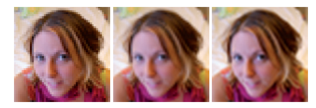

在图6.8的最左侧，我们使用了邻近过滤的方法。这种放大技术的一个特点是，单个纹素可能会变得十分明显。这种效果被称为像素化（pixelation）；因为该方法在放大的时候，会选取距离每个像素中心最近的纹素，从而产生了块状外观。虽然这种方法的质量有时会很差，但是它的好处在于，只需要为每个像素获取一个纹素即可。

在图6.8的中间，我们使用了双线性插值（有时也会叫做线性插值）方法。对于每个像素而言，这种过滤方法需要找到四个相邻的纹素，并在二维上进行线性插值，从而获得混合后的像素值。虽然双线性插值的结果是比较模糊的，但是它并不会像邻近过滤那样出现锯齿。你可以做一个简单的小实验，尝试眯着眼睛来看左边的图像，你就会发现图像的锯齿也消失了，因为这样做（眯着眼睛观察）的效果其实和低通滤波器是大致相同的，并且更能展示面部的特征。

这里我们回到本章一开始提到的砖块纹理例子：在不舍弃小数的情况下，我们会获得坐标$(p_u, p_v) =(81.92, 74.24)$。这里我们使用与OpenGL同样的纹理坐标系，其原点位于左下角，它与标准的笛卡尔坐标系是相匹配的。我们的目标是在四个最近的纹素中心之间，建立一个局部坐标系，并在这四个纹素中心之间进行插值，最终获得该点的像素值，如图6.9所示。为了找到4个最近的相邻像素，我们从采样位置减去像素中心的分数部分$(0.5,0.5)$，得到$(81.42,73.74)$。在去掉中心的小数部分之后，距离最近的4个像素范围即为$(x, y) =(81,73)$到$(x+1, y+1) =(82,74)$。在这个例子中，分数部分$(0.42,0.74)$是该采样点在这个局部坐标系（由相邻的四个纹素中心构成）中的位置，我们将这个位置表示为$\left(u^{\prime}, v^{\prime}\right)$。

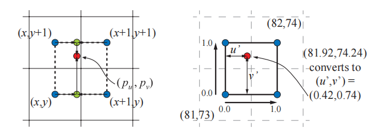

这里我们将纹理访问函数定义为$t(x, y)$，该函数会返回对应纹素的颜色，其中$x$和$y$是整数。那么任意位置$\left(u^{\prime}, v^{\prime}\right)$的双线性插值颜色可以按照以下两步进行计算：首先，使用下方的两个纹素颜色$t (x, y)$和$t (x + 1, y)$，按照参数$u^{\prime}$进行插值，即$(1−u^{\prime})t(x, y) + u^{\prime}t (x + 1, y)$；再使用上方的两个纹素颜色$t (x, y + 1)$和$t (x + 1, y+ 1)$，按照参数$u^{\prime}$进行插值，即$(1−u^{\prime}) t (x, y + 1) +u^{\prime}t (x + 1, y+ 1)$，如图6.9左侧的绿色圆圈。然后对这两个值在竖直方向上，按照参数$v^{\prime}$进行插值，即将上述过程结合起来，最终$(p_u, p_v)$处的双线性插值颜色$\mathbf{b}$为：

$$
\begin{aligned} \mathbf{b}\left(p_{u}, p_{v}\right)= & \left(1-v^{\prime}\right)\left(\left(1-u^{\prime}\right) \mathbf{t}(x, y)+u^{\prime} \mathbf{t}(x+1, y)\right) \\ & +v^{\prime}\left(\left(1-u^{\prime}\right) \mathbf{t}(x, y+1)+u^{\prime} \mathbf{t}(x+1, y+1)\right) \\ = & \left(1-u^{\prime}\right)\left(1-v^{\prime}\right) \mathbf{t}(x, y)+u^{\prime}\left(1-v^{\prime}\right) \mathbf{t}(x+1, y) \\ & +\left(1-u^{\prime}\right) v^{\prime} \mathbf{t}(x, y+1)+u^{\prime} v^{\prime} \mathbf{t}(x+1, y+1) .\end{aligned}
\tag{6.1} 
$$

从直观上来说，距离采样位置越近的纹素，对其最终颜色值的影响也就越大，这也是我们在方程6.1中所描述的。右上角$(x+ 1, y + 1)$处的纹素对其的影响是$u^{\prime}v^{\prime}$。注意这个等价关系：右上角纹素的影响力，等于左下角纹素与采样点之间所形成的矩形面积。回到我们的例子中，这意味着从该纹素上检索到的像素值，会被乘以$0.42 × 0.74$，即$0.3108$。从右上角纹素开始，按照顺时针顺序，其他三个纹素会被分别乘以$0.42 × 0.26$，$0.58 × 0.26$和$0.58 × 0.74$，这四个权重的和为$1.0$。

一种用于解决放大模糊的常见方法是使用细节贴图（detail texture）。这个纹理代表了表面上的精细细节，例如手机上的划痕和地形上的灌木丛等。这些细节会作为一个独立的纹理贴图，以不同的尺度被覆盖在放大后的纹理上。细节贴图中包含了高频的重复图案，它与低频的放大纹理相结合，在视觉效果上类似于使用单张高分辨率的纹理。

双线性插值会在两个方向上进行线性插值，但是有些情况下我们其实并不需要线性插值。例如：一个纹理是由类似于棋盘格的黑白像素组成的，使用双线性插值使得原本的黑白结果变成了平滑的灰度值。这时候我们需要对结果进行通过重新映射，例如我们可以让所有低于0.4的灰色都变成黑色，所有高于0.6的灰色都变成白色，而那些介于两者之间的灰色，则被拉伸用以填补空白，使得纹理看起来更像是原本的棋盘格，同时也在纹理之间进行了一些混合过渡，如图6.10所示。

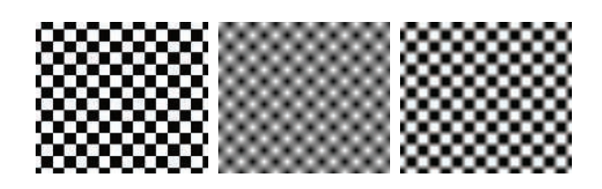

使用一个更高分辨率的纹理也会出现类似重新映射的效果。例如：假设现在每个黑白方格都由$ 4 × 4  $，总计16个像素组成（原本是$1 × 1$），那么在每个方格的中心周围，插值出来的颜色也将是全黑或者全白的。

在图6.8的右侧，我们使用了双三次插值（bicubic filter），它大幅去除了剩余的方块感。需要注意的是，双三次插值比双线性插值的计算成本更高，但是许多的高阶滤波器都可以被表示为重复的线性插值\[1518]（详见章节17.1.1），因此可以通过若干次简单的线性插值，来充分利用纹理单元中用于线性插值操作的GPU硬件。

如果我们觉得双三次插值的计算成本太大的话，那Quilez \[1451]提出了一种更加简单的技术，它在一组$ 2 × 2  $纹素之间，使用了一个平滑的曲线来进行插值。接下来我们首先会先介绍这个平滑曲线，然后再描述这个技术的详细过程。最常用的两个平滑曲线分别是smoothstep曲线和quintic（五次）曲线\[1372]，它们的数学表达如下：

$$
\underbrace{s(x)=x^{2}(3-2 x)}_{\text {smoothstep }} and \underbrace{q(x)=x^{3}\left(6 x^{2}-15 x+10\right)}_{\text {quintic }}
\tag{6.2} 
$$

当我们想从一个值平滑插值到另外一个值时，这些函数是非常有用的。smoothstep曲线具有$s^{\prime}(0) = s^{\prime}(1) = 0$的性质（$C^1$连续），它在0-1之间是非常平滑的。quintic曲线具有类似的性质，唯一不同是$q^{\prime \prime}(0) = q^{\prime \prime}(1) = 0$（$C^2$连续），即曲线在开始和结束处的二阶导数也是0。这两条曲线如图6.11所示。

 （左侧）和quintic曲线 q(x) （右侧）。")

该方法首先会计算出位置$\left(u^{\prime}, v^{\prime}\right)$（与方程6.1和图6.9中使用相同的方法），然后将采样位置与纹理尺寸相乘并加上$0.5$。结果的整数部分暂时先保留，小数部分会存储在$u^{\prime}$和$v^{\prime}$中，它们的取值范围是$[0,1]$。然后再将$\left(u^{\prime}, v^{\prime}\right)$变换为$\left(t_{u}, t_{v}\right)=\left(q\left(u^{\prime}\right), q\left(v^{\prime}\right)\right)$，这个结果仍然在$[0,1]$的范围内；将这个结果减去0.5，再加上原来的整数部分。然后将得到的坐标$u$和坐标$v$分别除以纹理宽度和纹理高度。此时，会将这个新的纹理坐标作为参数，传给GPU提供的双线性插值查找函数。需要注意的是，这种方法在每个纹素上只会给出一个值，这意味着如果纹素位于RGB空间平面上的话，那么这种类型的插值将给出一个平滑的，但仍然是阶梯状的外观，这可能并不总是我们想要的，如图6.12所示。

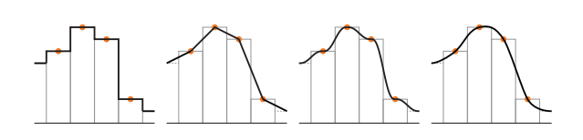

### 6.2.2 缩小

当纹理被压缩时，平面上的一个像素单元格可能会占据好几个纹素，如图6.13所示。为了正确获得这个像素的颜色值，我们应当将这几个纹素对像素的影响整合起来。然而，精确确定某个像素附近所有纹素对其的影响是很难的，而且想要以实时的速度来完美地实现这一点几乎是不可能的。

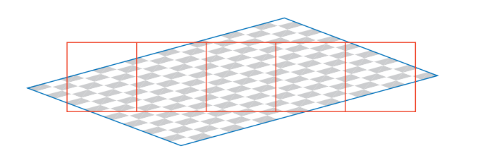

由于上述的一些限制，因此在GPU上使用了一些特殊方法来解决这个问题。其中最简单的方法便是使用邻近过滤（nearest neighbor），其工作原理与用于纹理放大的滤波器完全相同，即直接选择位于像素单元中心可见的纹素值，来作为自身的像素值，但是这个方法可能会产生严重的锯齿问题，如图6.14第一行的图片。因为这种方法只是在影响像素的众多纹素中，选择一个纹素来代表该点的颜色，当表面相对于相机发生移动的时候，这种瑕疵会变得更加明显，这种在运动中所产生的瑕疵也被称为时域锯齿（temporal aliasing）。

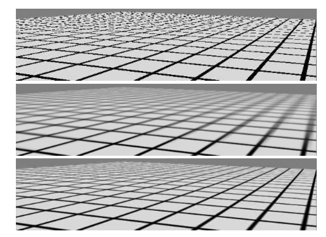

另一个常用的滤波器是双线性插值，其工作原理与上文中的放大滤波器完全相同；但是对于纹理缩小而言，这种方法只比邻近过滤稍微好一点，因为它只能将四个纹素对于像素的影响混合起来；而当一个像素受到超过四个纹素的影响时，双线性插值就会很快失效并产生锯齿。

还有一些更好的解决方法，正如章节5.4.1中所讨论的，走样（锯齿）问题可以通过采样技术和滤波技术来解决。纹理的信号频率取决于纹素在屏幕上的间隔距离，根据Nyquist极限，我们只需要确保纹理的信号频率不大于采样频率的一半即可。例如：假设现在有这样一个图像，它由黑白相间的线条组成，其中每个线条占据了两个纹素，即频率为$\frac{1}{2}$。为了在屏幕上能够正确显示这个纹理，那么采样频率必须至少为$2 \times\frac{1}{2}=1$，即至少一个像素。因此对于纹理而言，一般一个像素应当最多对应一个纹素，这样可以避免走样和锯齿。

根据上面我们的分析，为了实现这个目标，我们要么提高像素的采样频率，要么降低纹理的信号频率。上一章节中我们所讨论的抗锯齿方法，主要是通过提高像素采样率来实现的；但是这些方法能够增加的采样率是有限的。为了更加充分地解决这个问题，我们需要降低纹理的频率，因此提出了各种纹理缩小算法。

所有纹理抗锯齿算法背后的基本思想都是相同的：对纹理进行预处理，创建某种数据结构，从而快速近似计算一组纹素对像素的影响。对于实时渲染而言，这些算法在执行过程中具有使用固定时间开销和资源开销的特点。通过这种方式，每个像素会采集固定数量的样本，并将这些结果组合起来，从而计算大量纹素对像素的影响。

#### Mipmap

mipmap \[1889]是最流行的纹理抗锯齿方法，现如今所有的图形加速器都会支持这种方法。其中Mip是拉丁语（multum in parvo）的缩写，它的意思是“一个很小的地方上有很多东西”，这是一个很好的名字，因为mipmap的过程其实就是将原始纹理反复过滤成更小的图像。

在使用mipmap滤波器的时候，在实际渲染发生之前，原始纹理图像会生成一系列较小尺寸的版本。原始纹理（第0级）会被下采样到原始尺寸的四分之一，每个新生成的纹素值，通常为原始纹理中四个相邻纹素的平均值，这个新生成的纹理（第1级）有时也会被叫做原始纹理的子纹理（subtexture）。这个下采样的过程会被递归执行，直到最终生成的某个纹理的维度为1。这个过程如图6.15所示，这组图片的集合通常被称为一个mipmap链（mipmap chain）。

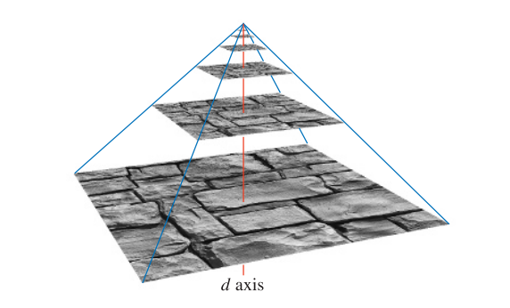

生成高质量mipmap的两个重要因素分别是：使用良好的过滤和伽马校正。生成mipmap的常用方法是将每$2 × 2$的纹素进行平均，从而获得下一级mip所对应的纹素值。具体使用的是一个box滤波器，虽然这可能是最糟糕的一个滤波器，使用box滤波器可能会导致较差的质量，因为它会对低频信息进行模糊，同时保留一些会产生锯齿的高频信息\[172]。最好是使用高斯、Lanczos、Kaiser或者类似的滤波器，这些滤波器的源代码基本都有免费高效的开源实现\[172, 1592]，同时有一些API还支持在GPU上进行过滤操作。在靠近纹理边缘进行过滤的时候的地方，需要注意纹理的包装模式（wrapping mode）。

对于在非线性颜色空间中进行编码的纹理（例如大多数的彩色纹理），在过滤时忽略伽玛校正会修改该层级mipmap的感知亮度\[173, 607]。如果使用了未校正的mipmap，相机距离物体越远，物体整体看起来就会越暗，对比度和表面细节也会受到影响。由于这个原因，因此将这种纹理（例如颜色纹理）从sRGB颜色空间转换到线性颜色空间是十分重要的（章节5.6），我们会在线性空间中完成mipmap的生成和过滤，然后将生产的结果转换回sRGB颜色空间中并进行存储。大多数图形API都支持sRGB纹理，因此可以在线性空间中正确生成mipmap，并将结果存储在sRGB中。当访问sRGB纹理的时候，它们首先会被转换到线性空间中，以便正确地执行放大（magnification）和缩小（minification）操作。

我们在之前提到，一些纹理参数与最终的着色颜色之间具有非线性关系，这会给过滤带来一些问题，而mipmap的生成对这个问题特别敏感，因为在这个过程中，需要对上百或者上千个像素进行过滤。为了获得最佳的结果，通常需要一些专门的mipmap生成方法。这些方法将会在章节9.13中进行详细介绍。

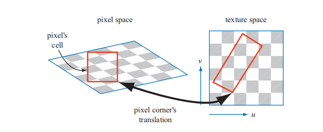

在纹理化时访问mipmap的过程也很简单。由于屏幕像素占据了纹理中的一个区域，因此当某个像素被投影到纹理上时（如图6.16所示），它会包含一个或者多个纹素。这里使用像素单元格的边界并不是严格正确的，使用这种方式只是为了简化表示。位于单元格外的纹素也会对像素的颜色产生影响，详见章节5.4.1，这里的目标是大致确定纹素对像素的影响程度。对于第三个纹理坐标$d$（在OpenGL称之为$\lambda$，也称为纹理细节级别，texture level of detail），有两种常用的计算方法：一种是利用像素单元格投影后所形成的四边形，取其中较长的那个边来对像素的覆盖范围进行近似\[1889]；另一种方法是使用四个梯度中绝对值最大的那个作为度量，这四个梯度分别是$\partial u / \partial x, \partial v / \partial x,\partial u / \partial y,\partial v / \partial y$\[901, 1411]，它们代表了纹理坐标相对于屏幕轴向的变化量，例如$\partial u / \partial x$代表了一个像素所对应的纹理值$u$，沿着屏幕$x$轴的变化量。你可以在Williams \[1889]、Flavell \[473]或者Pharr \[1411]的论文中了解更多有关这些方程的内容。McCormack等人\[1160]讨论了采用最大绝对值方法所引入的走样，并提出了一个替代方程。Ewins等人\[454]对几种质量相当的算法，以及它们所对应的硬件成本进行了分析。

在shader Model 3.0或者更新版本的像素着色器中，可以直接使用这些梯度值。由于这些梯度基于相邻像素值之间的差异，如果像素着色器中包含了受动态流程控制（章节3.8）的部分，那么这部分是无法访问这些梯度信息的。如果我们想要在这部分（例如一个循环）中读取纹理的话，那么就必须提前计算梯度。需要注意的是，顶点着色器并不能访问梯度信息，当需要顶点纹理化操作的时候，才会在顶点着色器中计算梯度或者细节级别等信息，并提供给GPU，以供后续阶段使用。

计算第三个纹理坐标$d$的目的是确定沿着mipmap金字塔轴进行采样的层级，如图6.15所示。我们的目标是使得像素与纹素的比例至少为$1:1$，以达到Nyquist极限。这里计算坐标$d$的重要原则是，当一个像素单元格内包含多个纹素时，就需要增大$d$，从而访问尺寸更小，更模糊的mipmap层级。我们使用三元组$(u, v, d)$来访问纹理的mipmap，其中$d$类似于纹理级别，但$d$并不是一个整数值，而是级别之间距离的分数值。我们会对$d$两侧的miamap分别进行采样，即使用坐标$(u, v)$来从这两个mipmap中分别进行双线性插值，获得两个纹理值。最后按照参数$d$再对这两个纹理值进行一次线性插值。整个过程被称为三线性插值（trilinear interpolation），并且会逐像素地执行。

用户可以通过细节层次偏移（level of detail bias，LOD bias），来对坐标$d$进行一定的控制，这是一个加在坐标$d$上的偏移量，它影响了纹理的相对感知锐度。如果我们将mipmap金字塔向上移动（即增大$d$），那么纹理会看起来更加模糊。对于任何给定的纹理，根据图像类型和使用方式的不同，良好的LOD偏移也是不同的。例如：对于有些模糊的第0级mipmap图像，可以使用一个负偏移量；而对于过滤不良（产生锯齿）的纹理图像则可以使用一个正偏移量。这个偏移量可以针对整个纹理进行指定，也可以在像素着色器中逐像素指定。为了获得更加精细的控制，可以由用户来提供坐标$d$，或者是提供用于计算它的梯度。

mipmap的好处在于，它并不是去单独计算每个纹素对像素的影响，而是对预先生成的纹素集合进行访问和插值，无论纹理压缩的程度如何，这个过程的时间开销是固定的。然而，mipmap也存在几个缺陷\[473]，其中一个主要的问题就是过度模糊（overblurring）。我们假设现在有一个像素单元格，它在$u$方向上覆盖了大量的纹素，而在$v$方向上只覆盖了少量的纹素，这种情况通常发生在相机以一个掠射角度来观察纹理表面的时候。在这种情况下，需要沿着纹理的其中一个轴进行缩小，沿着另一个轴进行放大，这会导致像素在纹理上的投影区域是一个长宽比很大的矩形；而我们在访问mipmap时，只能检索纹理上的正方形投影区域，无法检索矩形投影区域。为了避免走样，我们会选择较长的那个边所形成的正方形，来作为对像素单元格覆盖率的近似度量，这导致检索到的样本往往会相对模糊。这种现象可以在图6.14的mipmap图像中看到，图片右侧向远处延申的线条会变得过度模糊。

#### Summed-Area表（SAT）

另一种能够避免过度模糊的方法是面积积分表（summed-area table，SAT，也可以叫做求和面积表）\[312]，后文中我们会简称为SAT。想要使用这种方法，首先要创建一个尺寸与纹理相同的数组，但是颜色存储的精度要更高（例如：每个红绿蓝颜色分量都会占据16个bit）。

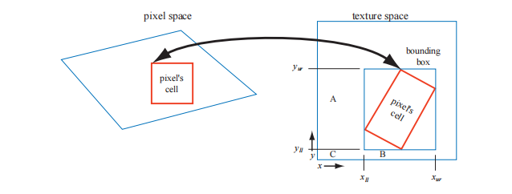

在数组中的每个位置上，该位置上的纹素会和$(0,0)$处的纹素（原点）构成一个矩形，计算并存储区域中所有纹素值的总和。在纹理化的过程中，屏幕上像素在纹理上的投影区域是一个矩形；然后会通过SAT来确定这个矩形区域的平均颜色，并将其作为该像素的纹理颜色。这个计算过程如图6.17所示，具体的平均颜色计算公式如下：

$$
\mathbf{c}=\frac{\mathbf{s}\left[x_{u r}, y_{u r}\right]-\mathbf{s}\left[x_{u r}, y_{l l}\right]-\mathbf{s}\left[x_{l l}, y_{u r}\right]+\mathbf{s}\left[x_{l l}, y_{l l}\right]}{\left(x_{u r}-x_{l l}\right)\left(y_{u r}-y_{l l}\right)}
\tag{6.3} 
$$

其中的$x$和$y$代表了矩形的纹理坐标，$\mathbf{s}\left[x, y\right]$代表了该坐标所对应的SAT值。这个方程的原理是：首先获取右上角到原点这个大矩形的SAT值，然后再根据相邻矩形顶点，获得两个小矩形$A$和小矩形$B$的SAT值，并将它们减去；其中右下角区域$C$的SAT值被减去了两次，因此最后还要再加上一个区域$C$的SAT值。请注意，坐标$(x_{l l}, y_{l l})$位于区域$C$的右上角，即坐标$(x_{l l}+1, y_{l l}+1)$是包围盒的左下角。

图6.14的第三行使用了SAT方法，图像右侧向远处地平线延申的线条变得更加清晰了，但是中间对角相交的线条仍然是很模糊的。这个问题的原因在于，当我们沿着对角线观察纹理的时候，像素投影所生成的区域是一个沿对角线的细长矩形，该矩形对应的包围盒中包含了大量无关的纹素，例如：在图6.17中，想象此时像素的投影区域是一个横跨纹理对角线的细长区域，它所对应的包围盒几乎会占据整个纹理，而真正位于像素投影区域内的纹素数量则很少。此时这种方法会对整个纹理矩形进行平均，这个结果包含了大量的无关纹素值，从而导致模糊的产生。

SAT是各向异性过滤（anisotropic filtering）算法\[691]的其中一个例子，这类算法用于检索非正方形投影区域的纹理值，SAT对于接近水平方向或者竖直方向的投影区域最为有效。还需要注意的是，对于$16 × 16$或者尺寸更小的纹理，SAT需要至少两倍的内存；而对于尺寸更大的纹理，则需要更高的存储精度，因为像素值的和会很大，精度过低可能会导致数值溢出。

SAT可以提供更好的质量，并且额外的内存开销还算合理，因此它在现代的GPU上也被广泛应用\[585]。高质量的过滤方法对于高级渲染技术的质量而言至关重要。例如，Hensley等人 \[718, 719]提出了一个高效的实现，并展示了使用SAT采样来改善glossy反射的方法。其他使用区域采样的算法也可以通过SAT方法进行改进，例如如景深\[585, 719]，阴影贴图\[988]，和模糊反射\[718]等。

#### 无约束的各向异性过滤

对于目前的图形硬件而言，想要进一步改进纹理过滤的质量，最常见的方法就是重用现有的mipmap硬件。其基本思想是将像素单元格反向投影到纹理上，然后再对纹理上的四边形区域进行多次采样，最后将采样的结果整合在一起，作为该像素的颜色。在之前我们所提到的方法中，会在mipmap中的一个正方形区域内进行采样，这可能会导致采样到很多无关纹素，使得表面变得模糊。这里我们将要介绍的算法，并不是使用单个mipmap采样区域来对该投影形成四边形进行近似，而是会使用多个正方形来进行近似。我们使用四边形中较短的那个边来确定$d$的值（而在原始的mipmap中，通常会使用较长的边来确定$d$），这样做会使得每个mipmap样本的平均面积更小（包含了更少的无关像素，因此会减少模糊的出现）。而四边形的长边则被用来创建一条与其平行，并且穿过四边形中点的各向异性线（line of anisotropy）。当各向异性的比例在$1:1$和$2:1$之间时，我们会沿着这条线取两个样本（如图6.18所示）；各向异性的比例越高，沿轴采集的样本就越多。

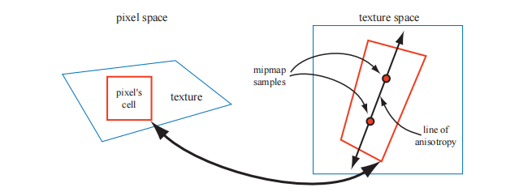

这种方法对各向异性线的方向没有要求，因此它并不会出现类似SAT那样的限制。而且它也不需要比mipmap使用更多的纹理内存，因为它只是在mipmap算法的基础上，对采样方法进行了改进而已，图6.19展示了一个各向异性过滤的例子。

![图6.19：mipmap和各向异性之间的对比。左侧使用了三线性插值的mipmap，右侧使用了 16:1 的各项异性mipmap。在向地平线延申的方向上，各向异性过滤可以提供更加清晰的结果与最少的锯齿。 \[218\]](images/Chapter-6/20230611101334.png "图6.19：mipmap和各向异性之间的对比。左侧使用了三线性插值的mipmap，右侧使用了 16:1 的各项异性mipmap。在向地平线延申的方向上，各向异性过滤可以提供更加清晰的结果与最少的锯齿。 \[218]")

这种沿轴采样的想法最初是由Schilling等人提出的，并应用在了他们的Texram动态存储设备中\[1564]。Barkans描述了该算法在Talisman系统\[103]中的应用；McCormack等人\[1161]提出了一个名为Feline的类似系统。Texram的原始方法是，让沿着各向异性轴的采样点  （也称为探针）具有相同的权重，而Talisman系统则只为轴两端的两个探针赋予一半的权重；Feline系统使用一个高斯滤波核来对一组探针进行加权。这些算法的质量接近于软件采样算法，例如椭圆加权平均（Elliptical Weighted Average，EWA）滤波器，这个滤波器会将像素的影响区域，转换为纹理上的一个椭圆区域，并通过滤波核来对椭圆内的纹素进行加权\[691]。Mavridis和Papaioannou提出了几种可以在GPU上，使用着色器代码实现EWA过滤的方法\[1143]。

### 6.2.3 **体积纹理**

对图像纹理直接进行扩展可以得到三维图像数据，它通过坐标$(u, v, w)$或者$(s, t, r)$来进行访问，例如：医学成像数据可以生成三维网格，通过在网格中移动成像平面，可以看到这些数据的二维切片。一个类似的想法是，使用这种数据形式来表示体积光，通过在体积内部找到该位置所对应的值，并结合光照方向，可以计算出表面上一点的光照。

如今大部分GPU都支持体积纹理（volume texture）的mipmap，由于在体积纹理的单个mipmap级别内，需要使用三线性插值来进行过滤，因此在不同mipmap级别之间，需要四线性插值（quadrilinear interpolation）来进行过滤。由于需要对16个纹素的结果进行求平均，因此可能会导致一些精度不足的问题，这可以通过使用更高精度的体积纹理来进行解决。Sigg和Hadwiger  \[1638]讨论了这个问题以及其他与体积纹理相关的问题，并提供了用于过滤和其他操作的高效方法。

虽然体积纹理对于存储空间的要求比较高，并且过滤的计算成本也比较高，但它确实具有一些特殊的优势。由于可以直接使用纹理坐标来表示三维的空间位置，因此可以跳过为三维网格寻找一个良好二维参数化表示的复杂过程（UV拆分）。这避免了二维参数化时经常出现的扭曲和接缝问题。体积纹理也可以用来表示木材或者大理石等材质的体积结构，具有这种纹理的模型，看起来就像是使用这种材料雕刻出来的一样。

使用体积纹理来对表面进行纹理化操作是非常低效的，因为体积纹理中的绝大部分样本都没有被使用。Benson和Davis \[133]以及DeBry等人\[334]，讨论了将纹理数据存储在稀疏八叉树中的方法，这种方法非常适合交互式的三维绘画系统，因为我们在创建表面的时候，不需要显式地指定它的纹理坐标，同时八叉树结构可以将纹理细节保留到任何我们想要的级别。Lefebvre等人\[1017]讨论了在现代GPU上实现八叉树纹理的细节；Lefebvre和Hoppe \[1018]提出了一种将稀疏体积数据打包成较小纹理的方法。

### 6.2.4 立方体贴图

另一种类型的纹理叫做立方体纹理（cube texture）或者立方体贴图（cube map），它具有六个正方形的纹理，立方体的六个面分别对应了这个六个正方形纹理。访问立方体贴图需要使用一个包含三个分量的纹理坐标向量，这个向量代表了从立方体中心向外发射的射线方向。这个射线与立方体交点的计算过程如下：向量中绝对值最大的那个分量，决定了射线会射向哪个立方体表面（例如：向量$(- 3.2,5.1,−8.4)$代表了射线会射向$−z$面）。将剩余的两个坐标分量分别除以最大分量的绝对值（即$8.4$），此时这两个分量的大小位于$[-1,1]$内，然后再将其重新映射到$[0,1]$中以计算纹理坐标，例如：坐标$(−3.2,5.1)$会被映射为$((−3.2/8.4 + 1)/2，(5.1/8.4 + 1)/2)≈(0.31,0.80)$。立方体贴图对于表示方向函数的值而言非常有用；它们最常用于环境映射中（章节10.4.3）。

### 6.2.5纹理表示

在应用程序中处理大量纹理的时候，有一些方法可以提高性能表现，有关纹理压缩的内容会在章节6.2.6中进行介绍，而本小节的重点则是纹理图集（texture atlas），纹理数组（texture array）以及无绑定的纹理（bindless textures），所有这些技术的目的都是为了在渲染过程中避免纹理的切换，因为切换纹理是有一些额外开销的。在章节19.10.1和章节19.10.2中，我们还会介绍了纹理流（texture streaming）和纹理转码（texture transcoding）。

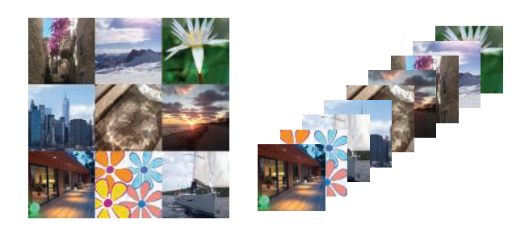

为了能够使得GPU批量处理尽可能多的任务，一般来说最好尽可能地避免改变它的状态（章节18.4.2）。为此，可以将多个图像放入一个尺寸更大的纹理中，这个纹理被叫做纹理图集，如图6.20左侧所示。这里需要注意的是，图集中子纹理的形状和尺寸可以是任意的（如图6.6所示），Noll和Stricker \[1286]提出了用于优化子纹理布局的方法。在生成和访问图集mipmap的时候也需要格外当心，因为mipmap的上一层级中可能会包含几个独立的、不相关的形状；Manson和Schaefer \[1119]提出了一种通过考虑表面参数化来优化mipmap创建的方法，该方法可以生成更好的结果。Burley和Lacewell \[213]提出了一个叫做Ptex的系统，在该系统中，位于细分表面的每个四边形，都具有属于自己的迷你纹理，这样做的优点在于，避免了在网格上分配唯一的纹理坐标，并且在纹理图集不相连接部分的接缝处也不会出现瑕疵。为了能够实现跨四边形的过滤操作，Ptex系统使用一些邻接数据结构（adjacency data structure）。虽然Ptex系统最初的目标是用于渲染，但是Hillesland \[746]提出了packed Ptex，它将每个表面的子纹理都放入一个纹理图集中，在过滤的时候使用相邻表面作为填充从而避免间接取值。Yuksel \[1955]提出了网格颜色纹理（mesh color texture），该方法对Ptex进行了改进。Toth \[1780]实现了一种方法，即当 filter tap超出$[0,1]^2$的范围时，则将它们丢弃，从而为Ptex-like的系统提供了高质量的跨表面过滤。

当使用 wrapping/repeat或者mirror模式的时候，是无法使用纹理图集的，因为这些模式会对整个纹理产生影响，导致我们无法对子纹理进行正确的设置。另一个问题发生在为图集生成mipmap时，图集中的子纹理可能会与另一个子纹理相互混合。当然这个问题也有对应的解决方案，可以将子纹理的分辨率设置为2的整数次幂，然后在将每个子纹理放入纹理图集之前，提前为它们生成mipmap层次结构\[1293]。

对于上述的这些问题，一个更简单的解决方案是使用一种被称为纹理数组（texture array）的API结构，它完全避免了mipmap和repeat模式所带来的问题\[452]，如图6.20右侧所示。一个纹理数组中的所有子纹理都需要具有相同的尺寸、格式、mipmap层次结构和MSAA设置。与纹理图集一样，纹理数组只需要进行一次设置，然后就可以通过着色器中的索引来访问数组中的任何元素，这种方法要比分别绑定每个子纹理快5倍\[452]。

现代图形API对于无绑定纹理（bindless texture）的支持，也有助于避免状态切换所带来的额外开销\[1407]。如果没有无绑定纹理的话，则需要使用API来将纹理绑定到特定的纹理单元中，这会带来很多问题，其中一个问题是纹理单元数量的是有上限的，这使得程序员的工作变得更加复杂。在这种情况下，是由驱动程序来确保纹理驻留在GPU端的。对于无绑定纹理而言，纹理的使用数量是没有上限的，因为每个纹理都只通过一个64位的指针（有时称为句柄handle）来与其数据结构相关联。可以通过多种方式来访问这些句柄，例如通过uniform buffer、可变数据、其他纹理，以及着色器存储缓冲对象（shader storage buffer object，SSBO）等。应用程序需要确保纹理驻留在GPU端。无绑定纹理避免了驱动程序中任何类型的绑定开销，这使得渲染速度更快。

### 6.2.6纹理压缩

固定压缩比的纹理压缩（fixed-rate texture compression）是一种直接解决内存、带宽以及缓存问题的解决方案\[127]。通过让GPU对纹理进行实时的解码压缩，能够使得纹理占据更少的内存，从而增加有效的缓存大小。同样重要的是，这样的纹理使用起来会更加高效，因为在访问纹理时，对于内存带宽的开销变少了。能够对纹理进行压缩，也意味着能够支持更大尺寸的纹理。例如：在$512\times512$的分辨率下，每个纹素使用3个字节的未压缩纹理将会占用768 kB空间；而在使用纹理压缩之后（例如压缩比为$6:1$），一个$1024\times 1024$尺寸的纹理也只需要512 kB的空间。

有许多用于图像文件的压缩格式，例如JPEG和PNG格式，但是在硬件中实现这些图像解码的成本很高（有关纹理转换编码的内容，详见章节19.10.1）。S3开发了一种被称为S3纹理压缩（S3 Texture Compression，S3TC）的方案\[1524]，它被作为DirectX的标准纹理压缩方法，被称为DXTC，在DirectX 10中则被称为BC（块压缩，Block Compression）；此外，它也是OpenGL事实上的标准，因为几乎所有GPU都支持这种纹理压缩方法。这种方法的优点在于，可以创建大小固定的压缩图像，具有独立编码的片段，并且解码过程十分简单（因此速度很快）。图像的每个压缩部分都可以被单独解码，没有共享查找表或者其他依赖关系，这简化了解码过程。

DXTC/BC压缩方案有七种变体，它们之间有一些共同的特性。这种压缩方案的编码是在$4 × 4$范围内的纹素块上（也称为tile）上完成的，每个纹素块都可以进行单独编码；这个编码过程是基于插值的，对于每个编码量，会存储两个参考值（即颜色）。它会在两个参考值之间所构成的直线上选择一个值，即在两个参考颜色之间进行插值。这种压缩方案最终只会存储两个参考颜色，以及每个像素的短索引值。

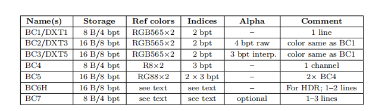

具体的编码方式在七个变体之间有所不同，它们之间的区别如表6.1所示。表中的“DXT”代表了DirectX 9中的名称，而“BC”则代表了DirectX 10及之后的名称。从表中我们可以看出，BC1有两个16 bit的RGB参考值（红色5 bit，绿色6 bit，蓝色5 bit），每个纹素都有一个2 bit的插值因子，用于在参考值或者两个中间值中进行选择；因为2 bit可以代表四个不同的值，其插值结果共有四个，分别是两端的参考值以及两个中间值。与未压缩的24 bit RGB纹理相比，这种压缩方法具有$6:1$的纹理压缩比。

> 另一种DXT1模式为透明像素保留了四个可能的插值因子中的一个，此时由于alpha值的存在，可能的像素颜色数量会被限制为三个——两个参考值及其平均值。

BC2与BC1对于颜色的编码方式是相同的，但是为每个纹素添加了4个bit，用于存储alpha值。到了BC3中，每个纹素块对RGB数据的编码方式与DXT1相同；不同之处在于，BC3的alpha数据使用两个了8 bit的参考值，以及使用了每个纹素3 bit的插值因子进行编码，3 bit可以产生8个不同的值，一共会产生8个插值结果，分别是两端的参考值以及六个中间值，因此每个纹素可以在一个参考alpha值，或者六个中间值中进行选择。BC4只有一个通道，它与BC3中的alpha值使用了相同的编码方式。BC5包含了两个通道，每个通道都与BC3中的alpha值使用了相同的编码方式。

BC6H针对高动态范围（HDR）纹理进行压缩，在这个格式中，每个原始纹素的RGB通道都是一个16 bit的浮点数。BCH6会使用16个byte来存储一个纹素块，即每个纹素8 bit。BC6H具有两种模式，其中一种模式用于单条颜色线（类似于上面的压缩方法），另一种模式用于两条颜色线。在双颜色线模式下，每个纹素块都可以从一小组分区中进行选择。两个参考颜色也可以使用增量编码的方式，从而获得更好的精度表现，并且还可以根据使用的模式，应用不同的精度。在BC7中，每个纹素块可以有1到3条颜色线，每个纹素使用8 bit进行存储；BC7的目标是对8 bit RGB或者RGBA纹理进行高质量压缩。它与BC6H之间具有许多相同的属性，不同之处在于，BC7用于LDR纹理的压缩，而BC6H则用于HDR纹理的压缩。BC6H和 BC7在OpenGL中分别被称为BPTC\_FLOAT和BPTC。这些压缩技术不仅可以应用于二维纹理，同样也可以应用于立方体贴图或者体积纹理的压缩。

这些压缩方案的主要缺点在于，它们都是有损压缩，也就是说，通常我们无法从压缩纹理中还原出原始图像。在BC1-BC5中，我们只使用了4或者8个插值出的值，来表示全部的16个像素。如果一个纹素块中包含大量不同的颜色值，那么就会不可避免的产生一些颜色信息的损失。在实际应用中，如果使用得当，这些压缩方案通常可以提供可接受的图像保真度。

BC1-BC5存在的一个问题是，由于仅仅使用了两个颜色参考值，因此在解码之后，一个纹素块中的所有颜色都会位于RGB空间中的一条直线上，例如：我们无法在一个纹素块中同时表示红色、绿色和蓝色。BC6H和BC7支持更多的颜色线，因此可以提供更高的质量。

OpenGL ES选择了另一种压缩算法，被称为Ericsson纹理压缩（Ericsson texture compression，ETC）\[1714]，这种压缩算法被内置在API中。该方案具有与S3TC相同的特点，即快速解码、随机访问、无间接查找和固定压缩比。它将$4×4$的纹素块编码为64 bit，即每个像素使用4 bit，其基本思想如图6.21所示。每$2 × 4$块（或者$4 × 2$，取决于哪个的质量最好）会存储一个基色（base color）。每个纹素块还会从一个很小的静态查找表中选择四个常量，纹素块中的每个纹素，都可以选择机上其中的一个值，这会逐像素的修改其亮度值。这种压缩算法的图像质量与DXTC相当。

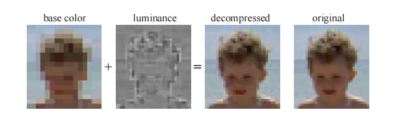

在OpenGL ES 3.0中包含的ETC2 \[1715]中，使用了未使用的bit组合方式，来为原始ETC算法添加更多的模式。其中一个未使用的bit组合是压缩表示（例如：64 bit），它代表了这个纹素块会被解压为与另一个压缩表示完全相同的图像。例如：在BC1中，将两个参考颜色设置为相同颜色是没有意义的，因为这个纹素块中的所有纹素都将具有完全相同的颜色；而现在只要将一个参考颜色设置为该恒定颜色，就可以让整个纹素块都变成这个颜色。在ETC中，一种颜色也可以从第一个有符号颜色中进行增量编码获得，当然计算可能会造成数值溢出，这种情况被用来表示其他压缩模式。ETC2中添加了两个新模式，在第一种模式中，每个纹素块都有四种不同的颜色；第二个模式被称为最终模式，该模式是RGB空间中的一个平面，旨在处理参考颜色之间的平滑过渡。Ericsson alpha压缩（Ericsson alpha compression，EAC）\[1868]用于对只包含一个通道的图像（例如alpha）进行压缩，这种压缩方法类似于基本的ETC压缩，二者的区别在于，前者只针对一个通道进行压缩，最终生成的图像会使用4 bit来存储一个纹素。EAC压缩方法还可以与ETC2相结合；此外，还可以使用两个EAC通道来对法线进行压缩（随后将详细介绍这个话题）。ETC1、ETC2与EAC都是OpenGL 4.0核心配置文件、OpenGL ES 3.0、Vulkan和Metal中的一部分。

对于法线贴图（将在章节6.7.2中进行讨论）的压缩需要注意一些问题，因为针对RGB颜色进行设计的压缩格式，通常并不适用于法线的$xyz$数据。大多数法线贴图的存储方法，都会利用已知法线为单位长度这个事实，并进一步假设其$z$分量为正（对于切线空间法线而言，这是一个合理的假设）。这样我们就可以只存储法线的$x$和$y$分量，然后在运行时计算出$z$分量即可：

$$
n_{z}=\sqrt{1-n_{x}^{2}-n_{y}^{2}}
\tag{6.4} 
$$

这种表示方法本身就带会来一些压缩效果，因为我们最终只需要存储两个分量即可。并且，由于大多数GPU并不原生支持三分量的纹理，一般只会原生支持四分量的纹理，但是这样的话就会浪费一个分量；而将三分量法线转换为两分量进行存储，就可以避免对第四个分量空间的浪费。对$x$分量和$y$分量的进一步压缩，通常是使用BC5或者3Dc格式来实现的，如图6.22所示。由于每个纹素块中的参考值限制了$x$分量和$y$分量的最大值和最小值，因此它们可以被视为在$xy$平面上的轴对齐包围盒。3 bit的插值因子可以产生8个插值数据，即每个轴可以在8个值中任选其一，因此这个包围盒被划分为一个$8 × 8$的潜在法线网格。或者也可以使用两个EAC通道来存储$x$分量和$y$分量，然后再按照方程6.4来计算$z$分量。

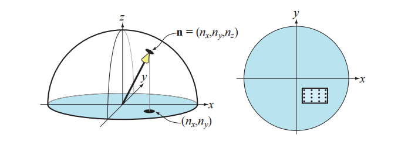

在不支持BC5/3Dc或者EAC压缩格式的硬件上，一种常见的备用方法（fallback）\[1227]是使用DXT5格式纹理，并将两个分量分别存储在绿色和alpha通道中（因为这两个通道的存储精度最高），剩下的红色通道和蓝色通道则没有使用到。

PVRTC \[465]也是一种纹理压缩格式，它可以在Imagination Technologies的硬件（叫做PowerVR）上使用，它最广泛的应用是在iphone和ipad上。它同样也是对$4 × 4$的纹素块进行压缩，同时它对每个纹素都提供了两种存储方案，分别是2 bit或者4 bit。其核心思想是，提供两个图像的低频（平滑）信号，这两个信号是通过对相邻纹素块进行插值获得的，然后在解码图像的时候，每个纹素会使用1 bit或者2 bit的插值因子，来在这两个信号之间进行插值。

自适应可伸缩纹理压缩（Adaptive scalable texture compression，ASTC）\[1302]的不同之处在于，它可以将$n × m$的纹理块压缩成128 bit，其中纹素块的尺寸范围可以从$4 × 4$到$12 × 12$，纹素块尺寸的不同会导致不同的压缩比：当纹素块尺寸为$4 × 4$时，每个纹素会使用8 bit进行存储；当纹素块尺寸为$12 × 12$时，每个纹素仅会使用0.89 bit进行存储。ASTC使用了大量技巧来压缩索引表示，并且纹素块都可以选择不同的颜色线数量和端点（参考值）编码。此外，ASTC可以处理任意1-4通道的纹理，包括LDR纹理和HDR纹理。ASTC是OpenGL ES 3.2及后续版本中的一部分。

上面提到的所有纹理压缩方案都是有损的，而且不同压缩方案所花费的压缩时间也是不同的。花费较长的时间（几秒钟甚至几分钟）来进行压缩，可以获得更好的压缩质量；因此这个纹理压缩的过程通常是离线预处理的，即将压缩好的图像存储起来，并在之后进行使用。或者，我们可以只花费较短的时间（几毫秒）来进行压缩，这样获得的压缩质量通常较低，但是好处在于，我们可以在接近实时的情况下，对纹理进行压缩并立即使用。一个常见的例子是天空盒（章节13.3），当云的移动速度很慢时，天空盒每隔一秒左右才会刷新。纹理的解压缩过程是非常快的，因为它是使用固定功能的硬件来实现的；这种差异被称为数据压缩的不对称性（data compression asymmetry），即数据的压缩过程要比解压过程花费更长的时间。

Kaplanyan \[856]提出了几种可以提高压缩纹理质量的方法：对于包含颜色贴图和法线贴图的纹理，建议每个通道使用16 bit；对于颜色纹理而言，可以对这16个bit进行直方图归一化（histogram renormalization），然后在着色器中使用比例常量和偏移常量（每个纹理）来反转它的效果。直方图归一化是一种将图像中使用的颜色值扩展到整个范围（例如$[0,255]$）的技术，这是一种增强对比度的有效方法。每个分量使用16 bit，可以确保在重新归一化之后，直方图中不会出现未使用的位置，从而减少了许多纹理压缩方案可能会引入的带状瑕疵，如图6.23所示。此外，如果图像中有75%的像素值大于116/255的话，Kaplanyan建议对这种纹理使用线性颜色空间，而不是将纹理存储在sRGB颜色空间中。对于法线贴图而言，他还注意到BC5/3Dc压缩方案通常会独立于$y$分量来压缩$x$分量，这意味着并不总是能找到最佳的法线；相反，他建议对法线使用以下的误差度量：

$$
e=\arccos \left(\frac{\mathbf{n} \cdot \mathbf{n}_{c}}{\|\mathbf{n}\|\left\|\mathbf{n}_{c}\right\|}\right)
\tag{6.5}  
$$

其中$\mathbf{n}$是原始法线，$\mathbf{n}_c$是经过压缩和解压缩的对应法线。

需要注意的是，也可以在不同的颜色空间中来进行纹理压缩，这可以对纹理压缩过程进行加速，一个常用的颜色空间变换是RGB$→$YCoCg \[1112]，其数学形式如下：

$$
\left(\begin{array}{c}Y \\ C_{o} \\ C_{g}\end{array}\right)=\left(\begin{array}{rcr}1 / 4 & 1 / 2 & 1 / 4 \\ 1 / 2 & 0 & -1 / 2 \\ -1 / 4 & 1 / 2 & -1 / 4\end{array}\right)\left(\begin{array}{l}R \\ G \\ B\end{array}\right)
\tag{6.6}  
$$

其中的$Y$是亮度项（luminance），$C_{o}$代表了橙色色度（chrominance），$Cg$代表了绿色色度。这个变换过程的逆变换开销也很低：

$$
G=\left(Y+C_{g}\right), \quad t=\left(Y-C_{g}\right), \quad R=t+C_{o}, \quad B=t-C_{o}
\tag{6.7} 
$$

这两个变换都是线性的，方程6.6是一个矩阵和向量的乘法，这个运算本身就是线性的（详见方程4.1和方程4.2）。这一点十分重要，因为我们可以在纹理中存储YCoCg颜色，而不是RGB颜色；而且纹理硬件同样可以在YCoCg颜色空间中进行过滤操作，然后像素着色器可以根据需要，再将颜色转换回RGB颜色空间中。需要注意的是，这个转换过程本身是有损的，根据情况的不同，这对结果而言可能会很重要，也可能是无关紧要的。

还有一种可逆的RGB$→$YCoCg变换，其数学形式可以总结为：

$$
\left\{\begin{aligned} C_{o} & =R-B \\ t & =B+\left(C_{o} \gg 1\right) \\ C_{g} & =G-t \\ Y & =t+\left(C_{g} \gg 1\right)\end{aligned} \Longleftrightarrow
\left\{
\begin{array}{rl}
t & =Y-\left(C_{g} \gg 1\right) \\
G & =C_{g}+t \\ 
B&=t-\left(C_{o} \gg 1\right) \\ 
R & =B+C_{o}
\end{array}\right.
\right.
\tag{6.8} 
$$

方程中的符号$\gg$代表了位运算中的右移操作，这意味着可以在24 bit的RGB颜色与相应的YCoCg表示之间来回转换，并且不会有任何损失。需要注意的是，如果RGB中的每个分量都有$n$个bit，那么色度值$C_{o}$和$C_g$便会各有$n + 1$个bit，从而保证变换是可逆的；而亮度值$Y$只需要$n$个bit。Van Waveren和Castano \[1852]使用了有损的YCoCg变换，从而在CPU和GPU上实现了对DXT5/BC3格式纹理的快速压缩。它们将$Y$存储在alpha通道中（因为它具有最高的精度），将$C_{o}$和$C_g$存储在RGB的前两个通道中。这个压缩过程非常快，因为$Y$是单独进行压缩和存储的；对于$C_{o}$和$C_g$分量，他们构建一个二维包围盒，并选择能够产生最佳效果的对角线包围盒。请注意，对于在CPU上动态创建的纹理，最好也压缩CPU上对纹理进行压缩；而当纹理是通过GPU渲染创建的时候，通常最好也是在GPU上对纹理进行压缩。YCoCg变换和其他亮度-色度（luminance-chrominance）的变换，在图像压缩中十分常用，其中的色度分量会在$2 × 2$的像素块上进行平均，这样做可以减少50%的存储空间，并且通常效果也很好，因为像素之间的色度变化是十分平缓的。Lee-Steere和Harmon \[1015]将其进一步转换到HSV（hue-saturation-value）颜色空间中，并在$x$和$y$方向上对色调和饱和度进行4倍的下采样，最终将其存储为单通道的DXT1纹理。Van Waveren和 Castano还描述了法线贴图的快速压缩方法\[1853]。

Griffin和Olano \[601]的一项研究表明，当多个纹理应用在一个具有复杂着色模型的几何物体上时，可以使用的质量很低的纹理，同时并不会带来任何可以感知的明显差异。因此，根据纹理使用情况的不同，可以对其质量进行一定程度的降低。Fauconneau \[463]提出了一种DirectX 11纹理压缩格式的SIMD实现。

## 6.3 程序化纹理

上文中我们所提到的方法，都是给定一个纹理空间中的坐标位置，然后在图像中进行查找，从而获得纹理值。还有一种方法是对函数进行求值，然后作为对应位置上的纹理值，这就是程序化纹理（procedural texture）。

在过去，程序化纹理通常运用于离线渲染中，在实时渲染中更加常见的则是图像纹理，这是因为现代GPU中的图像纹理硬件是非常高效的，可以在一秒钟内执行数十亿次的纹理访问操作。然而，目前的GPU架构正在向着更低的计算成本，以及更昂贵（相对）的存储访问发展，也就是说，存储访问和带宽限制越来越成为GPU的性能瓶颈。这些趋势使得程序化纹理在实时渲染中得到了更加广泛的应用。

考虑到体积纹理的高昂存储成本，因此程序化的体积纹理，是过程化生成中一个特别有吸引力的应用。这样的纹理可以通过很多技术进行合成，其中最为常见的一种方法是，使用一个或者多个噪声函数来生成纹理值\[407, 1370, 1371, 1372]，如图6.24所示。这些噪声函数通常都是以连续2次幂的频率进行采样的，这被称为octave（八度）。每个octave都有一个权重，这个权重通常会随着频率的增加而下降，而这些加权样本的总和被称为湍流（turbulence）函数。

![图6.24：两个使用的实时程序化纹理生成的体积纹理。左边的大理石是使用光线步进（ray marching）渲染的半透明体积纹理。右边的物体是使用复杂的程序化木材着色器 \[1054\] 生成的图像，并将其在“真实”环境（背景）中进行了渲染。](images/Chapter-6/20230611101612.png "图6.24：两个使用的实时程序化纹理生成的体积纹理。左边的大理石是使用光线步进（ray marching）渲染的半透明体积纹理。右边的物体是使用复杂的程序化木材着色器 \[1054] 生成的图像，并将其在“真实”环境（背景）中进行了渲染。")

由于计算噪声函数的成本较大，因此三维数组中的点通常都是预先计算好的，并使用这些点进行插值从而获得相应的纹理值。有许多方法可以通过使用颜色缓冲混合，来快速生成这些三维数组\[1192]。Perlin \[1373]提出了一种快速且实用的方法，来对这个噪声函数进行采样，并展示了一些实际用途。Olano \[1319]提供了一种可以允许在存储纹理和执行计算之间进行权衡的噪声生成算法。McEwan等人\[1168]实现了在着色器中计算经典噪声（classic noise）和单纯形噪声（simplex noise）的方法，该方法无需任何查找，并提供了完整的源代码。Parberry \[1353]使用动态规划，来将计算分摊到若干个像素上，从而加快了噪声的计算速度。Green \[587]给出了一种更高质量的方法，它更适用于接近交互式帧率的应用程序，因为它在一次查找中使用了50个像素着色器指令。Perlin提出的原始噪声函数\[1370, 1371, 1372]可以被进一步改进，Cook和DeRose \[290]提出了另一种表示方法，称为小波噪声（wavelet noise），它避免了锯齿问题，同时只略微增加了计算成本。Liu等人\[1054]通过使用各种噪声函数，来模拟不同的木材纹理和表面抛光效果。我们还推荐读者进一步阅读Lagae等人\[956]有关这个主题的最新报告。

其他的程序化方法也是可行的。例如：通过测量从每个位置到一组“特征点”（分散在空间中）的距离，来构建蜂窝状纹理（cellular texture）。还可以用不同的方法对这些生成的最近距离进行映射，例如：改变颜色或者着色法线，从而生成看起来像细胞、石板、蜥蜴皮肤以及其他自然图案的纹理。Griffiths \[602]讨论了如何高效地在GPU上找到最近邻居，并生成蜂窝状纹理的方法。

另一种类型的程序化纹理是物理模拟或者其他交互过程的结果，例如水面波纹或者扩展裂缝。在这种情况下，程序化纹理可以根据动态条件的不同，有效地生产无限种变化。

当生成一个程序化的二维纹理时，参数化问题（UV）可能要比创建纹理更加困难，因为在传统的纹理制作过程中，可以对UV拉伸或者UV接缝进行手动调整，而程序化纹理则不行。一种解决方案是直接在表面上合成纹理，从而完全避免参数化的问题；在复杂表面上执行这种操作，在技术上是具有挑战性的，这也是一个十分活跃的研究领域，详情请参阅Wei等人\[1861]有关该领域的综述。

对程序化纹理的抗锯齿处理，要比图像纹理的抗锯齿既困难和又容易。一方面，类似mipmap这样的预计算方法是不可行的，这会给程序员带来极大的负担。另一方面，在生成程序化纹理的时候，我们实际上已经知道了有关于纹理内容的“内部信息”，因此可以对其进行调整，从而避免锯齿现象。这对于叠加了多个噪声函数的程序化纹理尤其正确，因为每个噪声函数的频率都是已知的，因此我们可以主动丢弃那些会导致锯齿的频率，这实际上会使得计算成本变得更低。对于其他类型的程序化纹理而言，有着各种各样的抗锯齿技术\[407, 605, 1392, 1512]。Dorn等人\[371]对过去的工作进行了讨论总结，并提出了一些重新构造纹理函数的过程，以避免过高的频率，即有限频宽（band-limited）的频率。

## 6.4 纹理动画

应用于表面上的图像纹理也不一定是静态的。例如：视频源（video source）可以用作一种随帧变化的特殊纹理。

纹理坐标也不一定是静态的。无论是在网格数据本身对纹理坐标进行修改，还是通过顶点着色器或者像素着色器中的函数，来对纹理坐标进行修改，应用程序设计人员都可以显式地改变帧与帧之间的纹理坐标。想象一下，现在我们有了一个已经建模好的瀑布模型，并且它已经被一个图像纹理化了，使得它看起来很像瀑布。假设纹理坐标$v$是水流的方向，为了让水流动起来，必须从每一帧的坐标$v$中减去一定的数值。纹理坐标的减法操作会使得纹理本身看起来正在向前移动。

可以通过对纹理坐标应用变换矩阵来生成更加精细的效果。除了平移之外，它还允许其他的线性变换操作，例如缩放、旋转和剪切\[1192, 1904]，图像扭曲（image warping）和变形转换（morphing transforms）\[1729]，以及广义投影\[638]等。通过在CPU或者着色器中应用变换函数，可以生成更复杂的效果。

通过使用纹理混合（texture blending）技术，还可以实现其他的动画效果。例如：从一个大理石纹理出发，将其渐变为一个肉质纹理，从而使得雕像看起来像是活过来一样\[1215]。

## 6.5 材质映射

纹理的一个常见用途是对材质属性进行修改，从而影响着色方程的计算结果。现实世界中的物体通常都会具有不同的表面材质属性，为了模拟这样的物体，像素着色器可以从纹理中读取纹理值，并在计算着色方程之前，使用它们来修改材质的参数。纹理最常修改的参数就是表面是颜色，这种纹理通常被称为反照率颜色贴图（albedo color map）或者漫反射颜色贴图（diffuse color map）。但是，理论上任何参数都可以被纹理进行修改，例如：替换、相乘或者以其他方式等。例如在图6.25中的表面，应用了三种不同的纹理来替换常量值。

![图6.25：金属砖块和灰浆材质。右边的纹理分别代表了表面颜色、粗糙度（越亮越粗糙）和凹凸高度（越亮起伏程度越大）。 \[218\]](images/Chapter-6/20230611101629.png "图6.25：金属砖块和灰浆材质。右边的纹理分别代表了表面颜色、粗糙度（越亮越粗糙）和凹凸高度（越亮起伏程度越大）。 \[218]")

材质的纹理还有更加广泛的用途。纹理还可以用来控制像素着色器本身的流程以及函数功能，而不是简单地修改着色方程中的参数。具有不同着色方程和参数的多个材质，可以同时被应用于一个表面上，通过使用一个特殊纹理，来指定表面的哪些区域具有哪些材质，从而在每个区域上执行不同的着色代码。例如：在具有生锈区域的金属表面上，可以使用一个特殊贴图来指示生锈的位置，根据纹理查找的结果，来决定是执行生锈着色器还是执行闪亮的金属着色器（章节9.5.2）。

着色模型中的一些输入参数（例如表面颜色），与着色器的最终颜色输出具有线性关系。包含类似输入参数的纹理可以使用标准技术来进行过滤，从而避免瑕疵和锯齿。对于包含非线性着色输入参数的纹理而言，例如粗糙度或者凹凸贴图（章节6.7），则需要更多的注意和处理，来避免锯齿和走样的出现。使用将着色方程考虑在内的滤波技术，可以改善这类纹理的结果，这些技术将在章节9.13中进行讨论。

## 6.6 Alpha映射

alpha值可以用于alpha混合或者alpha测试，它们能够实现许多效果，例如树叶渲染、爆炸效果和远处物体等。本小节将讨论如何使用带有alpha通道的纹理，以及这些方法的各种限制和对应的解决方案。

一种与纹理相关的效果是贴花（decal）。例如：假设我们想在茶壶上放置一张花的图片，我们并不需要花的整个画面，只需要花所在的部分即可；对于那些不包含花的纹素，我们可以将它的alpha值设为0，使这些部分变得透明，这样它就没有任何效果了。因此，通过正确设置贴花纹理的alpha值，我们可以使用贴花纹理来替换对应的底层表面，或者将二者混合。通常，我们可以使用一个clamp转换函数与透明边框，将贴花的单个副本（相对于重复纹理）应用到表面上。图6.26展示了贴花实现的示意图，有关贴花技术的更多信息，详见章节20.2。

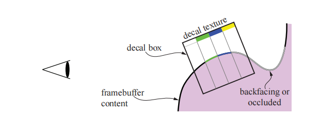

alpha值的另一个类似应用是制作镂空（cutout）效果。假设我们制作了一个灌木的贴花图像，并将其应用到场景中的一个矩形上。这个原理和贴花是相同的，不同之处在于，这个灌木图像并不是和底层表面对应的，而是会绘制在它背后的任何几何图形上。通过这种方式，可以仅仅使用单个矩形，便能够渲染出具有复杂轮廓的物体。

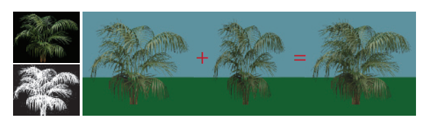

在这个灌木的例子中，如果观察者围绕它进行旋转，这个视觉错觉就会露陷，因为这个灌木矩形实际上并没有厚度。一种解决方案是将这个灌木矩形复制一份，并沿着树干旋转90度，使得两个灌木矩形相互垂直。这两个矩形构成了一个廉价的三维灌木效果，它有时会被称为“交叉树”\[1204]，从地面上进行观察的时候，这种视错觉是相当有效的，如图6.27所示。Pelzer \[1367]讨论了一个类似的配置方法，他使用了三个镂空纹理来表示草。在章节13.6中，我们将讨论一种称为广告牌（billboard）的方法，它仅使用单个矩形便可以实现这种渲染效果。如果观众移动到地面以上，那么这种视错觉也会露陷，因为在灌木上面可以看到两个明显切口，如图6.28所示。为了解决这个问题，可以使用不同的方式来添加更多的镂空纹理（例如切片、分支、层等），从而提供更加令人信服的模型，章节13.6.5中讨论了一种生成此类模型的方法，图19.31则展示了另一种方法。

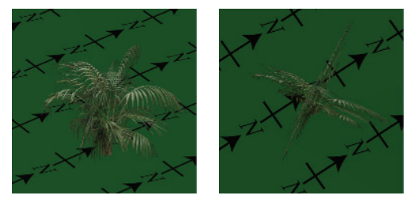

将alpha贴图和纹理动画结合在一起，可以产生令人信服的特殊效果，例如闪烁的火炬，植物生长，爆炸和大气效果等。

使用alpha贴图来渲染物体有几个可选的方式。alpha混合（章节5.5）允许透明度值为小数，从而实现了物体边缘的抗锯齿，以及部分透明物体的渲染。但是alpha混合需要在渲染不透明三角形之后，再去渲染透明的三角形，并且需要严格按照从后向前的顺序进行渲染。一个无法实现的例子是刚才提到的简单交叉树，它包含了两个镂空纹理，在这个例子中，没有任何一个渲染顺序是正确的，因为两个四边形相互交叉，每个四边形都位于另一个四边形的前面。而且，即使在理论上可以对其进行排序并得到正确的渲染顺序，这样做通常也是十分低效的，例如：一块土地上可能会有成千上万的草叶，这些草叶都是用镂空纹理进行表示的。每个网格物体都由多个单独的叶片所组成，因此显式地对每个叶片进行排序是非常不切实际的。

在渲染的时候，有几种不同的方法可以改善这个问题。一种是使用alpha测试，即在像素着色器中丢弃alpha值低于给定阈值的片元，其做法如下：

$$
\mathrm{if (texture.a < alphaThreshold) \quad discard}
\tag{6.9} 
$$

其中$\mathrm{texture.a}$代表了从纹理中检索到的对应alpha值，参数$\mathrm{alphaThreshold}$是用户提供的阈值，它将决定哪些片元会被丢弃。这个二元的可见性测试允许以任意顺序来渲染三角形，因为透明的片元都会被丢弃。通常我们希望对alpha值为$0.0$的任何片元都执行这个操作，将完全透明的片元直接丢弃还有额外的好处，它节省了后续着色器处理和合并的计算成本，同时还可以避免将z-buffer中的像素错误地标记为可见\[394]。而对于镂空纹理而言，我们通常会将这个阈值设置为大于$0.0$的值，比如$0.5$或者更高。或者再进一步，直接忽略alpha值，不使用它们进行混合；这样做可以避免乱序所带来的瑕疵，但是结果的质量会很低，因为只有两个级别的透明度（完全不透明和完全透明）是可用的。另一种解决方案是对每个模型执行两个pass：第一个pass用于渲染实体（不透明）的镂空样本，同时写入z-buffer；另一个pass则用于渲染半透明的样本，此时并不会写入z-buffer。

alpha测试还有另外两个问题，即过度放大\[1374]和过度缩小\[234, 557]，当alpha测试与mipmap一起使用的时候，如果不进行特殊处理，那么效果会很差，如图6.29顶部所示，树木的叶子会比预期变得更加透明。这可以用这样一个例子来进行解释：假设我们现在有一个具有四个alpha值的一维纹理，即$(0.0,1.0,1.0,0.0)$；而在平均之后，下一个mipmap层级所对应的纹素值会变为$(0.5,0.5)$，最高层级mipmap所对应的纹素值为$(0.5)$。现在，假设我们现在使用$\alpha_t = 0.75$来作为alpha测试的阈值。当访问第0级的mipmap时，4个纹素中的1.5个可以通过alpha测试，不会被丢弃。但是，当访问剩下两个mipmap层级时，由于$0.5 < 0.75$，因此所有纹素都会被丢弃。图6.30展示了另一个例子。

Castano \[234]提出了一个作用于mipmap创建过程中的简单解决方案，它工作得很好。对于第$k$个mipmap层级，覆盖范围$c_k$的定义如下：

$$
c_{k}=\frac{1}{n_{k}} \sum_{i}\left(\alpha(k, i)>\alpha_{t}\right)
\tag{6.10} 
$$

其中$n_k$为第$k$级mipmap中的纹素个数，$\alpha(k, i)$为第$k$级mipmap在像素$i$处的alpha值，$\alpha_{t}$为方程6.9中用户提供的alpha阈值。这里我们假设$\alpha(k, i)>\alpha_{t}$的结果为1或者0。需要注意的是，$k=0$代表了最低层级的mipmap，即原始图像。对于每个mipmap层级，我们都会找到一个新的mipmap阈值$\alpha_{k}$，而不是一直使用原始阈值$\alpha_{t}$，这样做可以使得$c_{k}$等于$c_{0}$（或者尽可能得接近），这个过程这可以使用二分查找来实现。最后，使用$\alpha_{t} / \alpha_{k}$来对第$k$级mipmap中所有纹素的alpha值进行缩放，如图6.29的底部所示，NVIDIA的纹理工具也支持这个方法。Golus \[557]给出了一个该方法的变体，该方法并没有对mipmap进行修改，而是随着mipmap层级的增加，在着色器中对alpha进行放大。

![图6.30：第一行是叶子图案不同mipmap层级的结果，更高的mipmap层级放大了叶子的可见性。在第二行中，mipmap进行了阈值为0.5的alpha测试处理，这个过程展示了随着物体与相机距离的增加，其在屏幕上占据像素数量越来越少。 \[557\]](images/Chapter-6/20230611101813.png "图6.30：第一行是叶子图案不同mipmap层级的结果，更高的mipmap层级放大了叶子的可见性。在第二行中，mipmap进行了阈值为0.5的alpha测试处理，这个过程展示了随着物体与相机距离的增加，其在屏幕上占据像素数量越来越少。 \[557]")

Wyman和McGuire \[1933]提出了一种不同的解决方案，其中方程6.9中的代码在理论上被替换为：

$$
\mathrm{ if (texture.a < random()) \quad discard }
\tag{6.11} 
$$

随机函数在$[0,1]$中返回一个均匀的值（0-1均匀分布），这意味着平均而言，这个操作会产生正确的结果。例如：如果检索到的纹理alpha值为$0.3$，那么意味着该片元将会有30%的概率被丢弃。这是随机透明的一种形式，每个像素仅包含一个样本\[423]。在实践中，会将这个随机函数替换为哈希函数，从而避免时空上（temporal，spatial）的高频噪声：

$$
\begin{aligned} \text { float } & \operatorname{hash} 2 D(x, y)\{ 
\\&\operatorname{return} \enspace \operatorname{fract}(1.0 e 4 * \sin (17.0 * x+0.1 * y) \enspace * 
\\& (0.1+\operatorname{abs}(\sin (13.0 * y+x)))) ;
\}\end{aligned}
\tag{6.12}  
$$

通过对上述函数进行嵌套调用，可以创建一个三维哈希，它返回一个位于$[0,1)$内的数字，即：

$$
\mathrm{ float \enspace hash3D(x,y,z)\enspace \{ \enspace return \enspace hash2D(hash2D(x,y),z); \}  }
$$

哈希函数的输入是，物体局部空间坐标除以该坐标相对于屏幕空间（$x$方向和$y$方向）的最大导数，然后再对其进行clamp操作。需要进一步注意来获得在$z$方向上的稳定性，该方法最好与时域抗锯齿技术相结合。这个方法随着距离的增加而渐隐，在近距离时我们根本不会看到任何随机效果。该方法的优点在于，每个片元的结果在平均上都是正确的。Castano的方法\[234]则是为每个mipmap层级都创建一个修正过的阈值$\alpha_{k}$；然而，这个值可能会随着mipmap层级的不同而发生变化，这可能会降低最终的质量，并需要艺术家进行手动调整。

alpha测试会在放大情况下显示出波纹瑕疵（ripple artifact），这可以通过将alpha贴图预先计算为一个距离场\[580]来避免（章节15.5也对这个问题进行了讨论）。

Alpha To Coverage，以及类似的透明度自适应抗锯齿（transparency adaptive antialiasing），这些方法会将片元的透明度值转换为像素内覆盖的样本数\[1250]。这个想法类似于章节5.5中所介绍的点阵剔除半透明方法（screen-door transparency），只不过这里的方法作用于亚像素级别。假设每个像素有四个样本位置，现在有一个片元覆盖了一个像素，但是由于镂空纹理的影响，其透明度为25%（即75%不透明）。Alpha To Coverage模式使得该片元变得完全不透明，尽管它只覆盖了四个样本中的三个。这个模式对镂空纹理而言十分有用，例如重叠的草叶\[887, 1876]。由于绘制的每个样本都是完全不透明的，因此最近的叶子会将以相同的方式，在其边缘处遮挡后面的物体。由于此时关闭了alpha混合，因此不需要进行排序，就可以正确地混合半透明的边缘像素。

Alpha To Coverage对于alpha测试的抗锯齿而言是非常好的，但是在alpha混合的时候，可能会出现瑕疵。例如：两个具有相同alpha覆盖百分比的alpha混合片元，将会使用相同的亚像素模式，这意味着一个片元将会完全覆盖另一个片元，而不是与之混合。Golus \[557]讨论了使用着色器指令$ \text {fwidth()}  $来对边缘进行锐化处理，如图6.31所示。

![图6.31：使用不同技术进行渲染的叶子纹理，在叶子的边缘部分使用了alpha覆盖。从左到右分别是：alpha测试，alpha混合，Alpha To Coverage，Alpha To Coverage+边缘锐化。 \[557\]](images/Chapter-6/20230611101829.png "图6.31：使用不同技术进行渲染的叶子纹理，在叶子的边缘部分使用了alpha覆盖。从左到右分别是：alpha测试，alpha混合，Alpha To Coverage，Alpha To Coverage+边缘锐化。 \[557]")

对于任何alpha映射的使用，理解双线性插值对颜色值的影响原理是很重要的。想象两个相邻的纹素：$rgbα =(255,0,0,255)$代表了不透明红色，其相邻的$rgbα =(0,0,0,2)$代表了几乎完全透明的黑色。那么两个纹素中间位置上的$rgbα$值是多少呢？最简单的插值方法可以获得$(127,0,0,128)$，这个$rgb$值是一个“较暗”的红色。然而，这个结果实际上并没有变暗，它是一个预乘了alpha的全红色。如果我们要对alpha进行插值的话，为了得到正确的插值结果，我们需要确保被插值的颜色在插值之前就已经预乘了alpha。例如：假设刚才那个几乎透明的邻居纹素被设置为$rgbα =(0,255,0,2)$，即几乎完全透明的绿色。这个颜色没有预乘alpha，在插值时得到的结果是$(127,127,0,128)$，这个几乎完全透明的绿色会把结果变成（预乘了alpha）黄色。这个相邻纹素的alpha预乘版本是$(0,2,0,2)$，它会给出正确的预乘颜色结果，即$(127,1,0,128)$。这个结果才是有意义的，因为生成的颜色以红色为主，还有一抹很难察觉的绿色。

如果忽略双线性插值给出的预乘结果，则会导致贴花物体和镂空物体周围出现黑色的边缘。在上文的例子中，插值产生的“暗”红色结果会被渲染管线的后续阶段视为未相乘alpha的颜色，这会使得边缘变成黑色。即使使用了alpha测试，也会看到这种效果。最好的策略就是在进行双线性插值之前，就进行alpha预乘\[490, 648, 1166, 1813]。WebGL API支持这个功能，因为合成对于网页而言十分重要。然而，双线性插值通常是由GPU执行的，而在执行这个操作之前，着色器并不能对纹素值进行操作。图片也无法以PNG等文件格式进行预乘，因为这样做会失去色彩精度。这两个因素结合在一起，会导致在使用alpha映射时，产生默认的黑色边缘。一个常见的解决方法是对镂空纹理进行预处理，将透明的“黑色”纹素涂上来自附近不透明纹素的颜色\[490, 685]。所有透明区域通常都需要使用这种方式来重新进行绘制，这个过程可以手动完成或者自动完成，这样mipmap的各个层级也可以避免边缘问题\[295]。同样值得注意的是，在使用alpha值来生成mipmap的时候，也应当使用alpha预乘的颜色值\[1933]。

## 6.7 凹凸映射

本小节介绍了一大类小尺度细节（small-scale detail）的表现技术，我们统称为凹凸映射（bump mapping）。所有的这些方法，通常都是通过逐像素地修改着色例程来实现的；它们在没有添加任何额外几何形状的前提下，提供了比纹理映射更加立体的外观。

物体表面上的细节可以分为三种尺度：覆盖大量像素的宏观特征（macro-feature）、覆盖几个像素的细观特征（meso-feature，或者叫做介观）以及尺寸远大小于一个像素的微观特征（micro-feature）。这些类别并不是完全固定的，因为在动画或者交互的过程中，观察者可能会在许多不同的尺度上来观察同一个物体。

宏观几何（macrogeometry）由顶点、三角形或者其他几何图元构成。当我们创建一个三维角色时，四肢和头部通常都是在宏观尺度上进行建模的。而微观几何则会被封装在着色模型中，通常在像素着色器中进行实现，并使用纹理贴图作为着色方程的输入参数。着色模型可以用来模拟表面微观几何与光线之间的相互作用，例如：表面有光泽的物体在微观上是光滑的，而漫反射的表面在微观上则是粗糙的。角色的皮肤和衣服看起来具有不同的材质，这是因为它们使用了不同的着色器，或者至少在这些着色器中使用了不同的参数。

细观几何（meso-geometry，介观几何）描述了宏观尺度和微观尺度之间的一切特征。它包含的细节过于复杂，以致于无法使用单个三角形来进行有效地渲染；但是这个尺度对于观察者而言已经足够大了，可以在几个像素上分辨出表面曲率的细微变化。例如：角色脸上的皱纹、肌肉组织的细节、衣服上的褶皱和接缝，都属于细观范畴。一类统称为凹凸映射技术的方法，通常用于建模这样的细观尺度，它们会在像素级别上调整着色参数，使得观众能感知到基础几何形状之外的微小扰动，同时使得基础几何形状保持平坦。不同类型凹凸映射技术的主要区别在于它们表示细节特征的具体方式。细观几何的变化因素包括现实主义水平和细节特征的复杂程度，例如：数字艺术家通常会在模型中雕刻细节，然后使用软件将这些几何元素转换为一个或多个纹理贴图，例如凹凸贴图以及可能的缝隙暗化（crevice-darkening）纹理。

Blinn在1978年提出了在纹理中编码细观尺度细节的想法\[160]。他观察到：如果在着色过程中，我们使用稍微扰动的表面法线来代替真实的表面法线，这样表面看起来就像是具有了小尺度细节一样。他将描述表面法线扰动的数据存储在数组中。

其中最关键的想法是，我们不是使用纹理贴图来改变光照方程中的颜色参数，而是使用纹理贴图来修改表面的法线数据。表面原本的几何法线保持不变；我们只是修改了光照方程中所使用的法线；这个操作并没有物理意义上的等效操作，虽然我们对表面法线进行一些修改，但是表面本身在几何意义上仍然是保持光滑的。就像是每个顶点上都有一个法线会给人一种错觉，即三角形之间的表面全都是光滑的；逐像素地修改法线，会改变对三角形表面本身的感知，但是并不会真正地修改这个三角形的几何形状。

对于凹凸映射而言，表面法线必须相对于某个参照系改变自身的方向。为了实现这个操作，每个顶点都会存储一个切线坐标系（tangent frame），它也称为切线空间基底（tangent-space basis）。这个参考系用于将光线转换到表面着色点的局部空间中（反之亦可），从而计算扰动法线的效果。对于一个应用了法线贴图的多边形表面，除了顶点法线之外，我们还存储了所谓的切线向量（tangent vector）和副切线向量（bitangent vector）。其中副切线有时也被错误地称为副法线（binormal vector）\[1025]。

切线向量和副切线向量代表了物体空间坐标系中，法线贴图本身的坐标轴，因为这里的目标是将光线转换到相对于法线贴图的局部空间中，详见图6.32。

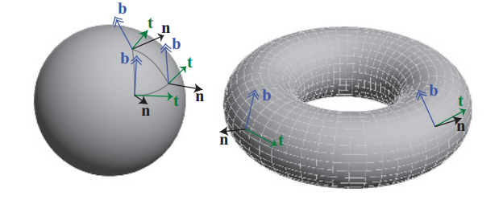

这三个向量，法向量$\mathbf{n}$，切线向量$\mathbf{t}$，和副切线向量$\mathbf{b}$，构成一个基底矩阵：

$$
\left(\begin{array}{cccc}t_{x} & t_{y} & t_{z} & 0 \\ b_{x} & b_{y} & b_{z} & 0 \\ n_{x} & n_{y} & n_{z} & 0 \\ 0 & 0 & 0 & 1\end{array}\right)
\tag{6.13} 
$$

这个矩阵有时会缩写为$TBN$，它用于将光线方向（对于给定顶点）从世界空间转换到切线空间中。这些向量并不需要严格的相互垂直，因为法线贴图本身就可能会被拉伸扭曲，以适应表面。但是使用非正交基会引入纹理的偏移，这也意味着可能需要更多的存储空间，同时还可能对性能产生影响，例如无法通过简单的转置操作来求取逆矩阵\[494]。一种节省存储空间的方法是，只存储顶点的切线和副切线，然后使用它们的叉乘来计算法线；然而，这种方法只有在$TBN$矩阵的手性（handedness）总是相同的情况下才有效\[1226]。但是实践中的很多模型都是对称的，例如：飞机、人体、文件柜以及其他对称物体等。由于纹理会占据大量的存储空间，为了降低对称模型的纹理存储空间，因此它们通常会被镜像到对称模型上；即物体上的纹理只有一半会被存储下来，然后再使用纹理映射，将其应用在模型对称的两侧上。在这种情况下，切空间的手性在对称的两侧是不同的，不满足手性相同的假设。当然还可以在每个顶点上存储额外的bit信息来指示手性，这样也可以避免存储法线。如果存在这个额外的手性bit的话，它会被用来修正切线和副切线的叉乘结果（取反），从而生成正确的法线。如果切线坐标系是正交的，也可以将基底存储为四元数（章节4.3），这样既提高了存储效率，又可以节省每个像素上的一些计算量\[494, 1114, 1154, 1381, 1639]；这样做可能会稍微损失一些质量，尽管在实践中这种质量损失是很难察觉到的。

这种切线空间的思想对于其他算法而言也很重要。正如下一章中所讨论的，虽然许多着色方程只依赖于表面的法线方向，但是拉丝铝或者丝绒等材质，也需要知道观察者与光线相对于表面的相对方向，而切线坐标系则可以用来定义表面上的材质朝向。Lengyel \[1025]和Mittring \[1226]的文章对这一领域进行了广泛的介绍。Schuler提出了一种在像素着色器中，动态计算切线空间基底的方法，从而无需逐顶点地存储预先计算好的切线坐标系。Mikkelsen \[1209]对该技术进行了改进，并推导出了一种不需要任何参数化的方法，而是使用表面位置的导数和高度场的导数来计算扰动法线。然而，与使用标准的切线空间映射相比，这些技术可能会导致更少的显示细节，并且可能会产生与美术工作流相关的问题\[1639]。

### 6.7.1 **Blinn方法**

Blinn原始的凹凸映射方法是，在纹理的每个纹素上存储两个带符号的值，$b_u$和$b_v$。这两个值代表了沿图像$u$轴和$v$轴法线的改变量。也就是说，这个纹理值（通常是双线性插值而来的）用于对两个垂直于法线的向量进行缩放，然后将这两个向量加到法线上，从而来改变法线的方向。$b_u$和$b_v$这两个值描述了表面在该点处的朝向，如图6.33所示。这种类型的凹凸贴图纹理通常被称为偏移矢量凹凸贴图（offset vector bump map）或者偏移贴图（offset map）。

 ，法线 \mathbf{n} 会在 u 和 v 两个方向上被这个值进行修改，最终得到 \mathbf{n}^{\prime} （这个新法线是非归一化的）。右图展示了高度场及其对着色法线的影响，这些法线可以在不同高度之间进行插值，从而获得更加平滑的效果。")

另一种用于表示凸起的方法是，使用高度场来修改表面法线的方向。每个单色的纹理值都代表了一个高度：在纹理中，白色代表较高的区域，黑色则代表较低的区域（反之亦然），如图6.34所示。这是首次创建或者扫描凹凸贴图时所用的格式，它也是由Blinn在1978年提出的。这个由纹理值定义的高度场，用于推导出$u$和$v$的带符号值，类似于第一种方法中使用的值。具体的推导方式是通过相邻列之间的差来得到$u$的斜率，以及相邻行之间的差来得到$v$的斜率\[1567]。一种变体是使用Sobel滤波器，它会为直接相邻的纹素赋予更大的权重\[535]。

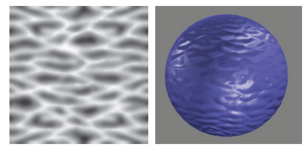

### 6.7.2 法线映射

凹凸贴图的一个常用方法是直接存储法线贴图（normal map），其算法和结果与Blinn的方法在数学上是等价的；二者的不同之处在于存储格式以及像素着色器中的计算操作。

法线贴图将$(x, y, z)$映射到$[−1,1]$中，例如：对于8 bit纹理而言，$x$轴上的值$0$表示$−1.0$，值$255$则表示$1.0$。图6.35给出了一个例子：$[128,128,255]$是一个浅蓝色，具有该颜色值的平面，其法线为$[0,0,1]$。

这种法线贴图的表示方法，最初是作为世界空间法线贴图\[274, 891]引入的，现在在实践中已经很少使用了。对于这种类型的映射而言，扰动方法是直截了当的：在每个像素位置上，从法线贴图中直接检索对应的法线，并使用这个法线方向和光线方向来计算表面上该位置的着色结果。法线贴图也可以在物体的局部坐标系中进行定义，这样模型在旋转之后，法线仍然是有效的。然而，世界空间和模型空间的表示方法，都将法线贴图与特定方向的特定几何形状相绑定，这大大限制了法线贴图的可复用性。

相反，扰动法线通常会在切线空间中进行存储和检索，即相对于表面本身的空间。这允许表面发生形变，以及在最大程度上保证了法线贴图的可复用性。切线空间中的法线映射也可以很好地进行压缩，因为$z$分量（与未受干扰的表面法线相对齐的分量）的符号通常可以假设为正。

法线映射可以很好地增强物体表面的真实感，如图6.36所示。

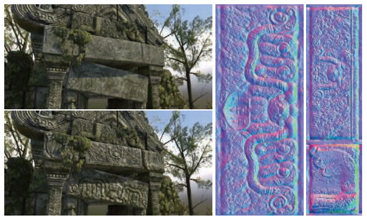

与颜色纹理的过滤相比，对法线贴图的过滤是一个困难的问题。一般来说，法线与着色结果之间的关系并不是线性的，因此标准的滤波方法可能会产生令人讨厌的瑕疵。想象我们正看着由闪闪发光的白色大理石砌成的楼梯。在某些观察角度下，楼梯的顶部或者侧面会反射出明亮的高光。然而，楼梯的平均法线是45度角，当我们从较远处观察这个楼梯时，它的高光将会出现在完全不同的观察角度下，与原来的楼梯截然相反。当带有锐利高光的凹凸贴图没有被正确的过滤时，可能会出现一些分散观察者注意力的闪光效果，这些高光部分的出现和消失，取决于光线镜面反射的着色点法线落在哪里。

Lambertian材质表面是一种特殊情况，法线贴图对着色结果的影响几乎是线性的；Lambertian的着色操作几乎完全是一个点乘，这是一个线性运算。取一组法线的平均值，并对平均后法线进行点乘运算；与取单个法线的点乘结果，然后再进行平均是一样的，其数学形式如下：

$$
\mathbf{l} \cdot\left(\frac{\sum_{j=1}^{n} \mathbf{n}_{j}}{n}\right)=\frac{\sum_{j=1}^{n}\left(\mathbf{l} \cdot \mathbf{n}_{j}\right)}{n}.
\tag{6.14} 
$$

请注意，这个平均法线向量在使用之前并没有进行归一化处理。方程6.14表明，标准的滤波操作和mipmap几乎可以对Lambertian表面产生正确的结果；但是这个结果实际上并不是完全正确的，因为Lambertian着色方程其实并不是一个简单的点乘，而是一个clamp过的点乘，即$\max (\mathbf{l} \cdot \mathbf{n}, 0)$，这个clamp操作使得点积不再线性。如果光线以掠射角度打到表面上，这会使得表面变得过暗，但是在实践中，这通常并不会令人反感。还需要注意的是，一些通常用于法线贴图的纹理压缩方法（例如从另外两个分量中重建$z$分量）并不支持非单位长度的法线，因此使用非归一化的法线贴图可能会造成压缩困难。

在非Lambertian表面的情况下，需要将着色方程的输入参数作为一个整体来进行过滤，而不是单独对法线贴图进行过滤，这样可能会产生更好的效果。相关技术将在章节9.13中进行讨论。

最后，还可以从高度贴图$h(x, y)$中推导出法线贴图，具体的做法如下\[405]：首先，使用中心差分来计算$x$和$y$方向上梯度的近似值：

$$
h_{x}(x, y)=\frac{h(x+1, y)-h(x-1, y)}{2}, \\[2mm]
h_{y}(x, y)=\frac{h(x, y+1)-h(x, y-1)}{2}.
 \tag{6.15}
$$

则在纹素$(x, y)$处的非归一化法线为：

$$
\mathbf{n}(x, y)=\left(-h_{x}(x, y),-h_{y}(x, y), 1\right)
\tag{6.16} 
$$

在进行实际计算的时候需要格外注意纹理的边界。

地平线映射（horizon mapping）\[1027]可以用来进一步增强法线贴图，它可以让凸起的部分在其表面上投射阴影。这是通过预先计算额外的纹理来实现的，每个纹理都与表面平面的方向相关联，在每个纹素中存储该方向上的地平线角度。更多信息详见章节11.4。

## 6.8 视差映射

凹凸映射和法线映射存在的一个问题是，表面上凹凸的位置永远不会随着视角的变化而变化，也不会发生互相遮挡的情况。例如：如果我们以一个掠射视角，沿着真正的砖墙进行观察，从某个角度开始，我们就看不到砖与砖之间的砂浆了，这是因为砂浆相对于砖块而言是凹下去的。墙壁的凹凸贴图永远无法表现这种类型的遮挡关系，因为它仅仅是改变了表面的法线。想要实现这种表面自遮挡效果，最好是让这些凸起对表面上每个像素渲染的位置产生实际影响。

视差映射（parallax mapping）的想法是由Kaneko \[851]于2001年提出的，并由Welsh \[1866]进行了改进和推广。视差（parallax）这个概念指的是，当观察者的位置发送移动时，物体的位置也会相对发生移动；当观察者移动时，凸起部分应当看起来具有高度感。视差映射的核心思想是通过检查可见物体的高度，对像素中应当看到的内容进行有根据的猜测。

![图6.37：左边是视差映射的目标：根据观察向量穿过高度场的位置，找到表面上被观察到的 实际 位置。视差映射通过获取矩形位置上的高度，并使用它来找到新的位置 \mathbf{p}\_{adj} 来对 \mathbf{p}\_{ideal} 进行一阶近似。 \[1886\]](images/Chapter-6/20230611102022.png "图6.37：左边是视差映射的目标：根据观察向量穿过高度场的位置，找到表面上被观察到的 实际 位置。视差映射通过获取矩形位置上的高度，并使用它来找到新的位置 \mathbf{p}_{adj} 来对 \mathbf{p}_{ideal} 进行一阶近似。 \[1886]")

对于视差映射而言，表面的凸起会被存储在一个高度场纹理中。当观察表面上的某个像素时，将会检索该位置对应的高度场值，并将其用于对纹理坐标进行移动，从而对表面上的不同部分进行检索。具体移动多少距离，取决于检索到的高度值以及眼睛到表面上该点的角度，这个过程如图6.37所示。这个高度场值要么存储在一个单独的纹理中，要么被打包在其他纹理未使用的颜色通道或者alpha通道中（在打包不相关纹理的时候必须十分小心，因为这可能会对压缩质量产生负面影响）。在用于移动坐标之前，高度场的值还会被缩放和偏移：缩放的大小取决于高度场在地表之上（或者地表之下）延伸的高度；偏移取决于不发生变化的“海平面”高度。给定纹理坐标位置$\mathbf{p}$，调整后的高度场高度$h$，以及归一化的观察向量$\mathbf{v}$，并且高度值为$v_z$，水平分量为$\mathbf{v}_{xy}$，那么经视差调整后的新纹理坐标$\mathbf{p}_{adj}$为：

$$
\mathbf{p}_{\mathrm{adj}}=\mathbf{p}+\frac{h \cdot \mathbf{v}_{x y}}{v_{z}}
\tag{6.17} 
$$

请注意，与大多数着色方程不同，这里执行计算的空间坐标系是很重要的，因为观察向量需要位于切线空间中。

虽然这只是一个很简单的近似，但是如果凸起高度变化得相对缓慢时，这种移动近似在实践中的效果相当好\[1171]。相邻纹素大概率具有相同的高度，因此使用原始位置的高度来对新位置的高度进行估计，这个想法是有一定道理的。然而，这种方法在掠射视角下会失效，因为当观察向量近乎平行于表面时，一个很小的高度变化，可能就会导致一个相当大的纹理坐标偏移，此时的近似会失效，因为检索到的新位置与原始表面位置的高度相关性很小，或者是根本没有高度相关性。

为了改善这个问题，Welsh \[1866]引入了偏移限制（offset limit）的概念，这样做的目的是对移动量进行限制，使其永远不会大于检索到的高度值，其数学形式为：

$$
\mathbf{p}_{\text {adj }}^{\prime}=\mathbf{p}+h \cdot \mathbf{v}_{x y}
\tag{6.18}  
$$

请注意，这个方程的计算速度要比原来的快。这种方法的几何解释是：该位置的高度定义了一个半径，超过这个半径位置就无法进行移动，如图6.38所示。

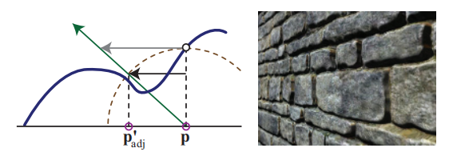

在垂直于表面的观察角度上，由于$v_z$（观察向量的$z$分量）接近于1，因此这个方程几乎与原始方程完全相同。而在掠射观察角度上，偏移量的影响是有限的。从视觉上看，这减小了在掠射观察角度下的凹凸程度，但是相比于对视察纹理进行随机采样（偏移量很大，无法进行控制）要好得多。随着观察视角的变化，还会存在纹理游动（texture swimming）的问题；对于立体渲染而言，观察者会同时感知两个视点，这要求必须提供一致的深度按时\[1171]。即使有着这些缺点，但是具有偏移限制的视差映射，只需要花费一些额外的像素着色器指令即可实现，并且相较于基本的法线映射而言，它可以大幅改善图像的质量。Shishkovtsov \[1631]通过在凹凸贴图的法线方向上，对估计位置进行移动，从而改善视差遮挡的阴影效果。

### 6.8.1 视差遮挡映射

凹凸映射并不会基于高度场来对纹理坐标进行修改，它仅仅是改变了该位置上的着色法线。视差映射提供了一个简单的近似高度场效果，它假设一个像素的高度与其邻居的高度大致相同，但是这个假设很快就会被打破。视差映射所产生的凸起并不会相互遮挡，也不会产生阴影。我们真正想要的是在像素处可见的内容，即观察向量第一次与高度场相交的地方。

为了能够更好地解决这个问题，一些研究人员提出沿着观察向量进行光线步进（ray marching），直到找到与表面高度场的第一个交点（或者近似交点）。这项工作可以在像素着色器中完成，可以通过访问纹理来检索到所需的高度数据。我们将这些方法的研究归类为视差映射技术的一个子集，这些技术以这样或者那样的方式，来利用光线步进解决问题\[192, 1171, 1361, 1424, 1742, 1743]。

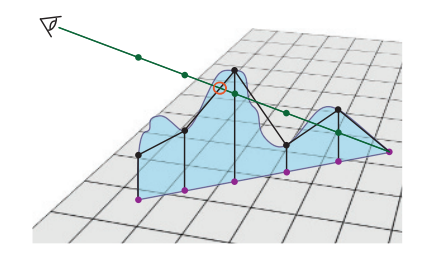

这类算法被称为视差遮挡映射（parallax occlusion mapping，POM）或者浮雕映射（relief mapping）等。其关键思想是：首先沿着观察方向的投影向量，对固定数量的高度场纹理样本进行测试。在掠射观察角度下，通常会生成数量更多的样本，以便不会遗漏这个最近交点\[1742, 1743]。会对沿着光线方向的每个三维样本位置进行检索，并将其转换到纹理空间中进行处理，从而确定该位置是高于该点的高度场，还是低于该点的高度场。一旦找到了一个低于高度场的样本，就使用这个低于高度场的样本，与前一个高于高度差的样本，来找到一个交点位置，如图6.39所示。然后使用额外的法线贴图、颜色贴图以及任何其他纹理，来对该位置进行着色。使用多层高度场，可以用于生产悬垂结构（overhang）、独立的重叠表面和双面浮雕等效果，详见章节13.7。高度场追踪方法也可以用来让凹凸不平的表面在自身上投射阴影，包括硬阴影\[1171, 1424]和软阴影\[1742, 1743]，如图6.40所示。

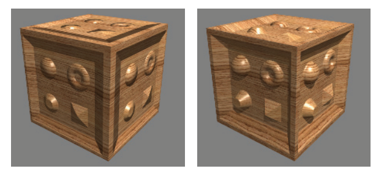

关于这个话题，有着大量的相关文献，虽然所有的这些方法都是沿着一条光线进行步进的，但是它们之间也有一些不同之处。有些方法可以直接使用简单的纹理来检索高度数据，但是也可以使用更加高级的数据结构，以及更加高级的求根方法（寻找交点）。有些技术还可能涉及到着色器丢弃像素或者写入深度缓冲区的操作，这些额外的操作可能会对性能产生影响。下面我们对大量方法进行了总结，但是请你记住，随着GPU的不断发展，最好的方法也会不断发展。这种“最佳”方法取决于生成的效果，以及光线步进过程中所需的步进次数。

确定两个均匀间隔样本之间的交点，实际上是一个求根问题。实际上，在实践中，高度场更多地会被视为深度场，每个纹素的矩形平面代表了改表面的最大高度；这样平面上的初始点会位于高度场之上。在找到了位于高度场表面上方的最后一个点，以及位于表面下方的第一点之后，Tatarchuk \[1742, 1743]使用了一次迭代的割线法（secant method）来找到近似解。Policarpo等人\[1424]在这两个点之间，使用二分查找（binary search）来寻找最近的交点。Risser等人\[1497]使用迭代的割线法来加快收敛速度，这里涉及一个权衡问题：固定间隔的采样可以通过并行完成；迭代方法虽然在整体上会进行较少的纹理访问操作，但是它在执行的过程中必须等待结果的返回，并执行效率较低的依赖纹理读取。暴力求解方法（brute-force methods）总体上表现良好\[1911]。

对于高度场进行足够多的采样是很重要的。McGuire和McGuire \[1171]建议对mipmap查找进行偏移处理，并使用各向异性的mipmap来确保对高频高度场（例如尖刺或者头发）的正确采样。我们也可以用比法线贴图更高的分辨率来存储高度场纹理。一些渲染系统甚至不会去存储法线贴图，它们更喜欢使用交叉滤波器（cross filter），来从高度场中动态生成法线信息\[40]，方程16.1展示了这个方法。

还有一种提高性能和采样精度的方法，即不以固定的间隔来对高度场进行初始采样，而是尝试跳过中间的空白区域，即在光线步进的过程中，动态调整下一次步进的步长。Donnelly \[367]将高度场预处理成一组体素，在每个体素中存储它距离高度场表面的距离，在这种方式下，光线在步进过程中，可以快速跳过中间的空白区域，其代价是增加了每个高度场的存储空间。Wang等人\[1844]使用了五维位移映射（five-dimensional displacement mapping）的方案，来记录从各个方向和各个位置到地面的距离，这种方案支持更加复杂的表面、自阴影以及其他效果，其代价是内存开销会很大。Mehra和Kumar \[1195]使用了定向距离图（directional distance map）来达到类似的目的。Dummer \[393]提出了锥形步进映射（cone step mapping）的思想，Policarpo和Oliveira \[1426]对其进行了改进。这里的核心思想是，为每个高度场位置存储一个圆锥半径（cone radius），这个半径定义了在射线方向上，与高度场最多只有一个交点的区间。尽管这个方法需要依赖纹理读取，但是它允许沿着射线方向进行快速跳跃，并且不会错过任何可能的交点；这种方法的另一个缺点是，它需要进行预计算来生成锥形步进图，这使得该方法无法用于动态变化的高度场。Schroders和Gulik \[1426]提出了四叉树浮雕映射（quadtree relief mapping）方法，这是一种在遍历过程中跳过空间的分层方法。Tevs等人\[1426]使用了“最大化mipmap”来支持动态步长，同时最小化了预计算成本，这里的“最大化mipmap”是指，在生成mipmap的时候，我们并不是取上一级像素颜色的平均值，而是取其中的最大值来作为下一级mipmap的值（译者注：这种结构类似于Hi-z）。Drobot \[377]还使用了存储在mipmap中的类四叉树结构，来遍历进行加速，并提出了一种在不同高度场之间进行混合的方法，它允许一种地形类型转换为另一种地形类型。

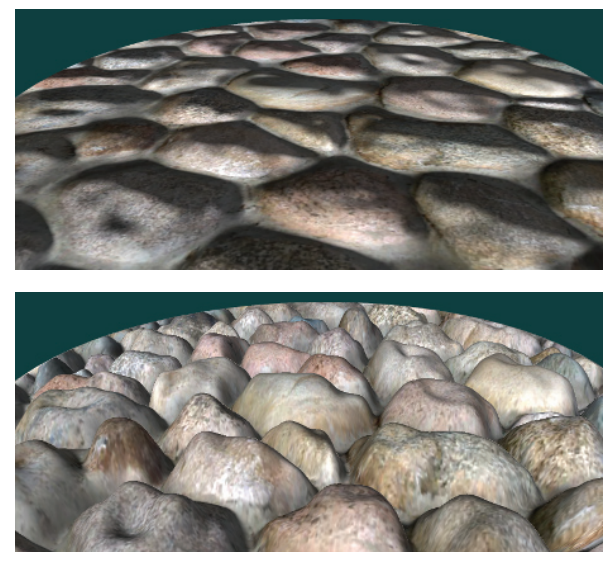

上述所有方法都存在一个问题，即这种视差错觉会在物体的轮廓边缘处消失，转而会显示出原始表面的平滑轮廓，如图6.41所示。这个问题的关键在于，被渲染的三角形仅仅定义了哪些像素应当由像素着色器进行计算，而不是表面上的实际位置，因此位于三角形之外的像素都不会受到视差映射的影响。此外，对于曲面而言，视察映射的轮廓问题将会变得更加复杂。Oliveira和Policarpo \[1325, 1850]描述并开发了一种使用二次轮廓近似技术的方法。Jeschke等人\[824]和Dachsbacher等人\[323]对之前的工作进行了回顾，并给出了一种更加通用且健壮的方法，能够正确处理轮廓和曲面等情况。Hirche \[750]首先提出了将网格中的每个三角形向外挤压形成棱柱（prism）的想法，然后渲染这个棱柱，计算所有可能会出现高度场中的像素。这种类型的方法称为外壳映射（shell mapping），因为向外扩展的网格在原始模型上，形成一个单独的外壳。尽管计算成本很高，但是通过在与光线相交时保持棱柱的非线性特性，可以实现无瑕疵的高度场渲染。图6.42展示了这种令人印象深刻的技术案例。

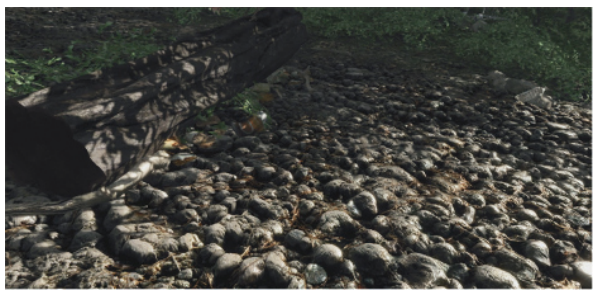

## 6.9 纹理光源

纹理还可以用于为光源添加更加丰富的视觉表现，并且允许光源具有非常复杂的强度分布函数或者聚光灯函数。对于所有光线都限制在一个圆锥（cone），或者一个截锥体（frustum）内的光源而言，投影纹理（projective texture）可以用来调节光线的强度\[1192, 1597, 1904]。这样就可以实现有形状的聚光灯、有图案的光源、甚至是“幻灯片投影仪”效果（如图6.43所示）。这些光源通常被称为gobo或者cookie，这是在专业剧院和电影照明中用于描述cutou镂空（cutout）的术语。在章节7.2节，我们讨论了如何使用类似于投影映射的方法，来实现阴影效果。

。")

对于不局限于截锥体范围，而是照亮所有方向的光源而言，可以使用立方体贴图来调节它的强度，而不是像其他光源一样使用二维的投影纹理。一维纹理可用于定义任意的距离衰减函数；将它与二维角度衰减贴图结合，可以实现复杂的体积照明模式\[353]。一种更加普遍的做法是，使用三维（体积）纹理来控制光线的衰减\[353, 535, 1192]，这种方法可以实现包括光束（light beam）在内的任意体积效果。与其他所有的体积纹理一样，这种技术方案也是内存密集型的。如果光源的体积效果沿三个轴对称的话，那么可以将数据在每个八个象限中进行镜像，从而将内存占用减少到原来的八分之一。

任何类型的光源都可以添加纹理，从而实现额外的视觉效果。纹理光源允许艺术家们，通过对纹理进行编辑和修改，从而很轻松地控制照明效果。

## 补充阅读和资源

Heckbert撰写了一篇关于纹理映射理论的良好综述\[690]，以及一篇有关该主题的、更加深入的报告\[691]。Szirmay-Kalos和Umenhoffer \[1731]对视差遮挡映射和位移（displacement）方法进行了出色而深入的研究。有关法线表示的更多信息，可以在Cigolle等人\[269]和Meyer等人\[1205]的工作中找到。

《Advanced Graphics Programming Using OpenGL》\[1192]一书广泛涵盖了使用纹理算法的各种可视化技术。有关三维程序化纹理的更多信息，你可以参考《Texturing and Modeling: A Procedural Approach》\[407]一书。《Advanced Game Development with Programmable Graphics Hardware》\[1850]一书中包含了很多实现视差遮挡映射的技术细节，Tatarchuk的演讲\[1742, 1743]以及Szirmay-Kalos和Umenhoffer的调查\[1731]也包含了这部分内容。

对于程序化纹理和程序化建模，我们在互联网上最喜欢的网站就是Shadertoy，该网站上展示了许多有价值、并且令人着迷的程序化纹理函数，并且你可以很轻松地修改任何示例，并查看相应的渲染结果。

你还可以访问本书的配套网站[realtimerendering.com](http://realtimerendering.com "realtimerendering.com")，来获取更多的补充资源。
