# Chapter 7 Shadows 阴影

## 目录

-   [7.1 平面阴影](#71-平面阴影)
    -   [7.1.1投影阴影](#711投影阴影)
    -   [7.1.2 软阴影](#712-软阴影)
-   [7.2 曲面上的阴影](#72-曲面上的阴影)
-   [7.3 阴影体算法](#73-阴影体算法)
-   [7.4 阴影贴图](#74-阴影贴图)
    -   [7.4.1 分辨率增强](#741-分辨率增强)
-   [7.5 PCF](#75-PCF)
-   [7.6 PCSS](#76-PCSS)
-   [7.7 过滤阴影贴图](#77-过滤阴影贴图)
-   [7.8 体积阴影技术](#78-体积阴影技术)
-   [7.9 不规则z-buffer](#79-不规则z-buffer)
-   [7.10 其他应用](#710-其他应用)
-   [补充阅读和资源](#补充阅读和资源)

> Tolstoy——“All the variety, all the charm, all the beauty of life is made up of light and shadow.”

> 列夫·托尔斯泰——“属于生命的一切多样性，一切魅力，一切美好，都是由光和影构成的。”（19世纪中期俄国批判现实主义作家；1828—1910）

对于创建逼真的图像、为用户提供物体位置的视觉暗示而言，阴影效果是非常重要的。本章节将重点介绍计算阴影的基本原理和基本思想，并对最重要、最流行的几种实时阴影算法进行介绍。我们还会简要讨论一些不太流行，但是体现了重要原则和重要思想的方法。我们并不会在本章节中花费大量时间来覆盖所有的内容和方法，因为已经有两本非常全面的书籍\[412, 1902]，对阴影领域进行了深入研究和讨论。相反，我们将专注于调查文献（surveying article）和相关技术演讲，这些内容在出现之前，相关方法就已经被提出并实现了。也就是说，本书主要侧重于经过实战检验的阴影技术。

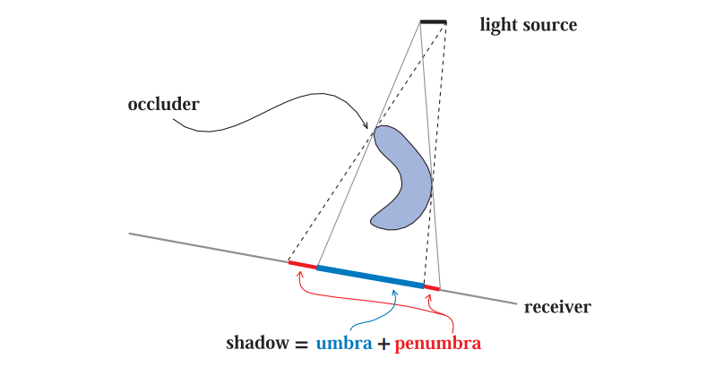

本章节中所使用的相关术语（terminology）如图7.1所示，其中遮挡物（occluder）是指向接收物（receiver）投射阴影的物体。精确光源（定点光源），即那些没有面积的光源，只会产生完全被阴影覆盖的区域（本影），这样的阴影有时候会被称为硬阴影（hard shadow）。如果使用了面光源或者体积光源，那么则会产生软阴影（soft shadow）。每个阴影都有一个完全被阴影覆盖的区域，称为本影（umbra）；以及一个部分被阴影覆盖的区域，称为半影（penumbra）。我们可以通过模糊的阴影边缘，来辨别出软阴影；然而需要注意的是，仅仅使用低通滤波器来对硬阴影的边缘进行模糊，通常是无法正确渲染出软阴影效果的。从图7.2中我们可以看出，一个正确渲染的软阴影应当有这样的现象，即遮挡物越靠近接收物，阴影的边缘就会越清晰。软阴影的本影区域并不等同于由精确光源所产生的硬阴影；相反，软阴影的本影区域会随着光源的变大而减小。如果光源足够大，或者接收物距离遮挡物足够远的话，那么本影区域甚至可能会完全消失。通常我们都更加希望实现软阴影效果，因为半影的边缘会让观众知道这个黑色的区域确实是一个阴影。而硬阴影具有明确的阴影边界，它通常看起来不太真实，有时候甚至会被误解为实际的几何特征，比如表面上的折痕等。然而，硬阴影的渲染速度要比软阴影快得多。

![图7.2：图中包含了硬阴影和软阴影。当遮挡物靠近接收物的时候，箱子所产生的阴影是尖锐的。人所产生的阴影在接触点（脚部）附近是尖锐的，随着与遮挡物之间的距离逐渐增加，阴影边缘也逐渐软化。远处的树枝也会产生柔和的阴影效果。 \[1711\]](images/Chapter-7/20230611111328.png "图7.2：图中包含了硬阴影和软阴影。当遮挡物靠近接收物的时候，箱子所产生的阴影是尖锐的。人所产生的阴影在接触点（脚部）附近是尖锐的，随着与遮挡物之间的距离逐渐增加，阴影边缘也逐渐软化。远处的树枝也会产生柔和的阴影效果。 \[1711]")

比半影效果更加重要的是先有阴影。如果没有阴影作为视觉暗示的话，场景往往看起来会很假，更加难以进行感知。正如Wanger所说的那样\[1846]，有一个不准确的阴影，通常要比完全没有阴影强得多，因为人类的眼睛对于阴影的形状是相当宽容的。例如：在地板上应用一个纹理化的模糊黑色圆圈，就可以让观察者感觉这个人确实在地面上。

在接下来的几个小节中，我们将超越这些简单的建模阴影，介绍一些根据场景中的遮挡物，实时自动计算阴影的方法。第一部分我们首先会先处理在平面上投射阴影的特殊情况，第二部分则会涵盖更加一般的阴影算法，即在任意表面上投射阴影的算法。同样我们会介绍硬阴影和软阴影的实现方法。最后我们会介绍一些适用于各种阴影算法的优化技术。

## 7.1 平面阴影

最简单的情况就是物体在平面上投射阴影。本小节将会介绍几种平面阴影（planar shadow）算法，每种算法在阴影的柔和度和真实感方面都有所不同。

### 7.1.1投影阴影

在这个方法中，三维物体会被渲染两次，其中第二次用于创建阴影。我们可以推导出这样一个矩阵，它将物体的顶点投影到一个平面上\[162, 1759]。考虑图7.3中的情况，光源位于点$\mathbf{l}$，待投影的顶点位于点$\mathbf{v}$，投影后平面上对应的顶点位于点$\mathbf{p}$。这里我们先推导一个特殊情况，即阴影平面位于$y = 0$时的投影矩阵，然后再将这个结果推广到任意平面上。

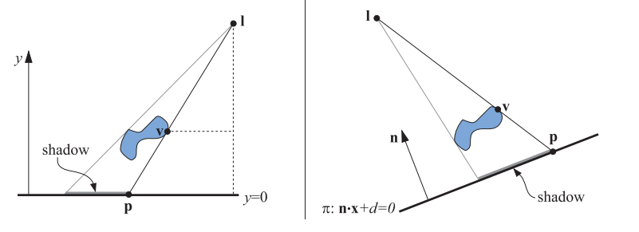

首先我们推导出$x$坐标上的投影操作。根据图7.3左侧的相似三角形，我们可以得到：

$$
\frac{p_{x}-l_{x}}{v_{x}-l_{x}}=\frac{l_{y}}{l_{y}-v_{y}} \quad \Longleftrightarrow \quad p_{x}=\frac{l_{y} v_{x}-l_{x} v_{y}}{l_{y}-v_{y}}.
\tag{7.1} 
$$

同理，$z$坐标为$p_{z}=\left(l_{y} v_{z}-l_{z} v_{y}\right) /\left(l_{y}-v_{y}\right)$，由于投影平面位于$y=0$处，因此投影后顶点的$y$坐标为0。然后我们可以将这些方程转换为投影矩阵$\mathbf{M}$：

$$
\mathbf{M}=\left(\begin{array}{cccc}l_{y} & -l_{x} & 0 & 0 \\ 0 & 0 & 0 & 0 \\ 0 & -l_{z} & l_{y} & 0 \\ 0 & -1 & 0 & l_{y}\end{array}\right)
\tag{7.2}  
$$

我们可以很容易验证$\mathbf{Mv = p}$，这意味着矩阵$\mathbf{M}$确实是个投影矩阵。

在一般情况下，阴影投射到的平面并不是$y = 0$，而是任意平面$π: \mathbf{n}·x + d = 0$，图7.3右侧展示了这种一般情况。我们的目标是找到一个矩阵，来将点$\mathbf{v}$投影到点$\mathbf{p}$。为了实现这个目的，我们让光线从点$\mathbf{l}$发出，经过点$\mathbf{v}$，最终与与平面$π$相交，这样我们就获得了投影点$\mathbf{p}$，这个过程的数学形式如下：

$$
\mathbf{p}=\mathbf{l}-\frac{d+\mathbf{n} \cdot \mathbf{l}}{\mathbf{n} \cdot(\mathbf{v}-\mathbf{l})}(\mathbf{v}-\mathbf{l}).
\tag{7.3} 
$$

方程7.3也可以转换为投影矩阵，如方程7.4所示，这个矩阵也满足$\mathbf{Mv = p}$：

$$
\mathbf{M}=\left(\begin{array}{cccc}\mathbf{n} \cdot \mathbf{1}+d-l_{x} n_{x} & -l_{x} n_{y} & -l_{x} n_{z} & -l_{x} d \\ -l_{y} n_{x} & \mathbf{n} \cdot \mathbf{1}+d-l_{y} n_{y} & -l_{y} n_{z} & -l_{y} d \\ -l_{z} n_{x} & -l_{z} n_{y} & \mathbf{n} \cdot \mathbf{1}+d-l_{z} n_{z} & -l_{z} d \\ -n_{x} & -n_{y} & -n_{z} & \mathbf{n} \cdot \mathbf{l}\end{array}\right)
\tag{7.4} 
$$

按照预期，当投影平面为$y=0$，即$\mathbf{n}=(0,1,0)$，$d=0$时，方程7.4中的矩阵会退化为方程7.2中的矩阵。

想要渲染平面阴影效果，只需要将这个矩阵应用到要在平面$π$上投射阴影的物体上，然后再将投影后的物体渲染为深色，并且不接收光照即可。在实践中，我们还必须采取一些措施，来避免让投影后的三角形被渲染到投影表面之下。一种可行的方法是对投影平面进行一些偏移，使得投影后的三角形总是会渲染在投影平面的前面。

一种更加稳妥安全的方法是，先绘制投影平面，然后在关闭z-buffer的情况下，再去绘制投影后的三角形，然后再像往常一样渲染剩余的几何图形。这样投影后的三角形总是会绘制在投影平面的前面，因为这里我们关闭了深度测试。

如果投影平面存在边界，例如它是一个矩形，那么阴影可能会落在矩形范围之外，这看起来会很奇怪。为了解决这个问题，我们可以使用一个模板缓冲区（stencil buffer），首先将接收物分别绘制到屏幕和模板缓冲区上，然后关闭z-buffer，使用模板缓冲区作为遮罩，只在有颜色的地方绘制投影后的三角形，最后再正常渲染场景的剩余部分。

另一种阴影算法是将三角形渲染到一个纹理中，然后再将其应用到投影平面上。这个纹理其实是一种光照贴图（light map），它可以调节底层表面的强度（详见章节11.5.1）。正如我们将看到的，这种将投影阴影渲染到纹理中的思路，也可以在曲面上产生半影效果和阴影效果。这种技术的一个缺点在于，纹理可能会被放大，使得单个纹素会覆盖多个屏幕像素，从而产生一些阴影锯齿。

如果画面中的阴影情况没有发生变化的话，即光源和遮挡物之间没有发生相对移动，那么这个纹理便可以重复使用。实际上，如果阴影情况没有发生变化的话，大多数阴影技术都可以对中间的计算结果进行重用。

所有的遮挡物必须位于光源和地面接收物之间。如果光源位于遮挡物下方，那么则会出现反阴影（antishadow）现象\[162]，因为遮挡物上的每个顶点，都会通过光源所在的位置进行投影。图7.4展示了正确的阴影效果，以及错误的反阴影效果。如果我们要投影一个位于接收平面以下的物体，此时也会出现错误，因为事实上它不应该会产生阴影。

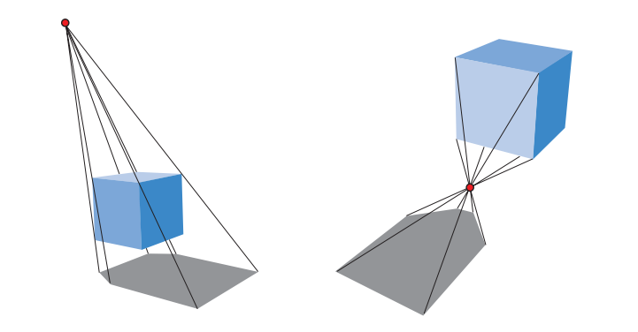

我们可以对生成的阴影三角形进行显式剔除和修剪，从而避免上述的诸多瑕疵。下面我们将介绍一种更加简单的方法，它利用现有的GPU管线来执行带有剔除的投影操作。

### 7.1.2 软阴影

通过使用各种技术，投影阴影也可以变得很柔和。在本小节中，我们将介绍Heckbert和Herf \[697, 722]提出的一种算法，它可以产生软阴影效果。该算法的目标是在地平面上生成一个纹理，这个纹理中包含了一个软阴影。然后，我们还会介绍一种不太准确，但是效率更高的方法。

当光源具有大小和面积时，便会形成软阴影。一种对面光源进行近似的方法是，在其表面上放置几个精确光源，来模拟对面光源的采样。对于每个精确光源，都会单独计算它的光照效果，将其存储在一张图像中，再将图像累积到缓冲区中；这些图像的平均值就是一幅带有软阴影的图像。请注意，在理论上而言，任何可以生成硬阴影的算法都可以用这种累积技术来生成半影效果；但是在实践中，由于应用的交互性限制了每帧画面的生成时间，因此这种方法通常是不可取的，它的效率实在是太低了。

Heckbert和Herf使用一种基于视锥体的方法来生成阴影，这个方法的核心思路是将光源作为一个观察者，将地面作为视锥体的远裁剪平面；这个视锥体足够宽，可以讲所有的遮挡物包含在内。

通过生成一系列地面纹理，并将其累积叠加在一起，便可以形成一个包含软阴影的纹理。我们在面光源表面上进行采样，将每个采样点作为一个精确光源，并在每个光源位置上渲染代表地面的图像，然后将遮挡物投影到该图像上。将所有的这些图像相加并取平均值，便可以生成地面的阴影纹理，如图7.5左侧所示。

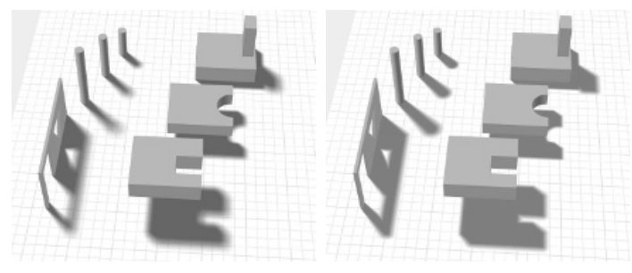

对面光源进行采样，然后逐个生成阴影的方法存在一个问题，它看起来像是几个来自精确光源的阴影相互重叠在一起，而不是面光源自然形成的软阴影。而且，对于$n$个阴影pass，它只能生成$n + 1$个不同的阴影；虽然可以使用大量pass来得到更加准确的结果，但是计算开销实在过高。这种方法可以用于获取ground-truth图像，以便对其他更快算法的质量进行测试对比。

更加高效的方法是使用卷积（即滤波）。在某些情况下，对单个精确光源生成的硬阴影进行模糊，效果就足够了，并且可以生成半透明的纹理，从而与场景中的其他内容进行合成，如图7.6所示。然而，在物体和地面相接触的地方，均匀的模糊看起来可能会很假。

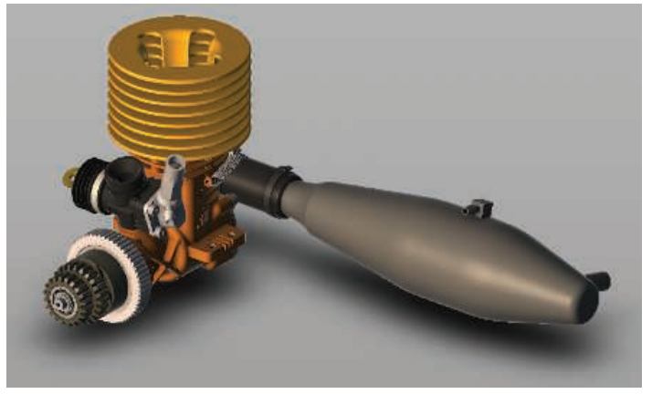

还有许多其他方法可以提供更好的近似软阴影效果，但是需要一些额外的开销。例如：Haines  \[644]从投影生成的硬阴影出发，用从阴影中心（黑色）到阴影边缘（白色）的渐变，来渲染阴影的轮廓边缘，从而生成看起来很真（plausible）的半影效果，如图7.5右侧所示。然而，这些模拟出来的半影效果在物理上是不正确的，因为它们还应当延伸到轮廓边缘内的区域中。Iwanicki \[356, 806]借鉴了球谐函数（spherical harmonic）的思想，使用椭球体来对遮挡物进行近似，从而产生柔和的阴影。所有的这些方法，都使用了各种不同的近似方法，也都有各自的缺点，但是相比于对大量阴影图像进行平均，这些算法要高效得多。

## 7.2 曲面上的阴影

可以将平面阴影的思想和方法扩展到曲面上，其中一个简单的方法是，将生成的阴影图像作为一个投影纹理 \[1192, 1254, 1272, 1597]。我们可以从光源的角度来理解阴影，凡是可以被光源看见的物体都会被照亮，而光源看不到的区域就是阴影区域。假设遮挡物从光源的视角被渲染为黑色纹理（而不是白色），然后这个黑白纹理可以被投影到接收阴影的表面上。实际上，接收物上的每个顶点，都会为其计算一个$(u, v)$纹理坐标，并将阴影纹理应用在其表面上，接收物上的这些纹理坐标可以由应用程序显式计算而来。这与上一小节中的地面阴影纹理有一些不同，在上一小节中，物体会被投影到特定的物理平面上；而在本小节的方法中，这些阴影图像是由光源渲染形成的，就像放映机中的一帧底片一样。

在渲染的时候，投影后的阴影纹理会对接收物的表面进行修改，它也可以与其他的阴影方法结合使用，有时候，它主要是用于帮助感知物体的位置。例如：在一个平台跳跃游戏中，即使角色完全处于阴影中\[1343]，其下方可能总是会存在一个下落阴影，这个阴影主要是用来帮助玩家感知角色的位置。一些更加复杂精细（elaborate）的算法可以生成更好的结果，例如：Eisemann和Decoret \[411]预设了一个矩形的顶光源，并生成了一个包含物体水平切片的阴影图像栈，然后再将其转换为mipmap或者类似的结构。通过使用mipmap，每个切片的对应区域（即对应的mipmap层级）与其到接收物的距离成正比，这意味着越远的切片将会投射出更加柔和的阴影（mipmap层级越高越模糊）。

当然，纹理投影方法存在着一些严重的缺陷。首先，应用程序必须识别出哪些物体是遮挡物，哪些物体是阴影的接收物。同时，应用程序必须保证接收物要比遮挡物到光源的距离更远，否则阴影便会“向后投射”，即上一节中提到的反阴影现象。此外，这里的遮挡物是无法遮挡自己的，也就是说无法产生自阴影效果。在接下来的两个小节中，我们将介绍生成正确阴影的算法，它们并不需要这种干预或者限制。

值得注意的是，各种光源的照明模式可以通过使用预先创建的投影纹理来进行定义。例如聚光灯的投影纹理是一个简单的正方形，里面有一个圆来定义光源的照明范围。可以使用由水平线构成的投影纹理，来生成百叶窗（venetian blind）效果。这种类型的纹理被称为光线衰减遮罩（light attenuation mask）、cookie纹理或者gobo贴图。还可以简单地将两个纹理进行相乘，从而将预先构建的光照模式，与动态创建的投影纹理相结合，此类光源在章节6.9中进行了深入讨论。

## 7.3 阴影体算法

基于Crow的阴影体（shadow volume）思想\[311]，Heidmann于1991年提出了一种改进的方法\[701]，该方法巧妙地利用了模板缓冲区，可以在任意物体上投射阴影。它可以在任何GPU上进行使用，因为该方法的唯一要求就是，GPU要支持模板缓冲区。该方法并不是基于图像的（与下一小节中所描述shadow map算法不同），因此它避免了采样的问题，可以在各处产生正确且锐利的阴影效果。有时候，这反而可能是一个缺点，例如：角色的衣服上可能会有褶皱，它们会产生薄而硬的阴影。由于该算法的计算成本难以预测\[1599]，因此现在已经很少使用阴影体算法了。在这里，我们将对该算法进行简要介绍，因为该算法涉及了一些重要原理，我们将在此基础上进行后续的讨论。

首先，让我们想象一个点和一个三角形，将这个点和三角形的顶点相连接，并延伸到无穷远处，这样就形成了一个底面无穷远的三面金字塔。位于三角形下方的部分（即不包括这个点的部分），是一个被截断的无限金字塔；而位于三角形上方的部分，则只是一个简单的金字塔，如图7.7所示。现在我们假设这个点实际上是一个点光源，任何位于截断金字塔内部（在三角形下方）的物体都处于阴影中，这个空间便被称为shadow volume，一般叫做阴影体或者阴影锥。

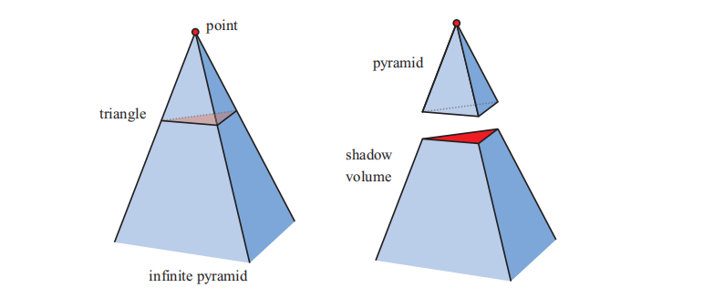

假设我们现在正在观察某个场景，沿着从眼睛发出并穿过一个像素的光线，直到这个光线击中了要显示在屏幕上的场景物体。在光线从发出到与场景物体相交的过程中，每当光线穿过了阴影体的正面（即面向观察者的一面）时，我们就让计数器加1；也就是说，每当光线进入阴影区域时，计数器就会增加。以同样的方式，每当光线穿过截断金字塔的背面时，我们便将相同的计数器减1，这代表了光线从阴影区域中射出。我们会一直持续这个过程，增加或者减少计数器的值，直到光线击中了场景中的物体。此时，如果计数器大于0，则说明该像素位于阴影中；如果计数器小于0，则说明该像素位于阴影之外。当场景中有多个三角形投射阴影时，这个原则也同样适用，如图7.8所示。

，计数加2。最终的计数结果不为0，因此该点位于阴影中。这两种方法都可以对可见表面上的点，给出相同的计数结果。")

使用射线来完成这件事是很耗时的\[701]，有一个更加聪明的解决方案，即使用模板缓冲区，模板缓冲区可以帮助我们完成这个计数过程。第一步，清空模板缓冲区。第二步，将场景中使用无光材质的物体渲染到帧缓冲中，并将着色结果写入颜色缓冲区中，将深度信息写入到z-buffer中。第三步，关闭对z-buffer和颜色缓冲的更新（当然我们仍然会使用z-buffer来进行深度测试），然后我们绘制阴影体的正面三角形。在这个过程中，我们将模板操作被设置为：在绘制三角形的地方，模板缓冲区中对应位置上的值加1。第四步，使用模板缓冲区来执行另一个pass，这次我们只绘制阴影体的背面三角形。在这个pass中，我们将模板操作被设置为：在绘制三角形的地方，模板缓冲区中对应位置上的值减1。只有当阴影体各个表面上的像素可以被相机看见时（即没有被其他几何图形遮挡），模板缓冲区中的值才会增加和减少。在这个pass完成之后，模板缓冲区中保存了屏幕上每个像素的阴影状态（即是否位于阴影区域中）。最后，我们再次渲染整个场景，这次只会渲染使用受光材质的物体，并且渲染的结果只会显示在模板缓冲区中值为0的地方，值为0代表了光线离开阴影体与它进入阴影体的次数相等，也就是说，这个像素位置位于阴影之外，它会被光源照亮。

这种计数方法是阴影体算法背后的基本思想。图7.9展示了一个由阴影体算法生成的阴影。还有一些更加高效的方法，可以在一个pass中实现这个算法\[1514]。然而，当场景物体穿过相机的近裁剪平面时，会出现计数错误的问题；还有一种被称为z-fail的解决方法，它会对隐藏在可见表面后面（而不是前面）的交点进行计数\[450, 775]。图7.8对这个方法进行了简要概述。

![图7.9：阴影体算法。左图中的角色投射了一个影子，右边展示了这个模型所产生的阴影体三角形。 \[1280\]](images/Chapter-7/20230611111532.png "图7.9：阴影体算法。左图中的角色投射了一个影子，右边展示了这个模型所产生的阴影体三角形。 \[1280]")

由于阴影体金字塔有三个面，也就是说，对于每个会能够阴影的三角形而言，我们都要为其创建三个四边形（对应截断金字塔的四个面），这会导致大量的过度绘制（overdraw）。一个由1000个三角形组成的球体，会创建3000个四边形，并且每个四边形都可能会横跨整个屏幕。一种解决方案是，只沿着物体的轮廓边缘来绘制这些四边形，例如：上述这样一个球体可能只有50条轮廓边缘\[1702]，因此只需要生成50个四边形即可。我们可以使用几何着色器，来自动生成这样的轮廓边缘。一些剔除和clamp技术，也可以用于降低填充成本\[1061]。

然而，阴影体算法有着一个严重的缺点，那就是极端的不稳定性。想象现在场景中有一个简单的小三角形，如果相机和光源位于同一位置，那么此时阴影体算法的开销是最小的，因为它所形成的四边形不会覆盖屏幕上的任何像素，它们都侧面朝向相机，完全不可见；只有这个三角形本身会影响渲染结果。假设现在相机围绕这个三角形进行旋转，并让它一直处于视野中。随着相机远离光源，阴影体的四边形将会变得越发可见，覆盖更多的屏幕像素，从而导致需要更多的计算开销。如果相机恰好移动到这个三角形所形成阴影区域中，那么阴影体将会覆盖整个屏幕；与我们最初的观察视野相比，这种情况需要花费大量的时间来进行阴影计算。这种不稳定性使得阴影体算法在交互式应用中几乎无法使用，因为对于这些应用而言，稳定的帧率是非常重要的。相机看向光源的方向也可能会导致算法的计算成本发生不可预测的陡增，其他的一些场景也会出现这种情况。

由于上述的这些原因，如今的应用程序在很大程度上都放弃了阴影体算法。然而，考虑到在GPU上访问数据的新方法正在不断发展，以及研究人员对于这些功能的巧妙再利用，阴影体算法可能会在未来的某一天重新被广泛使用。例如，Sintorn等人\[1648]对改进效率的阴影体算法进行了综述，并提出了他们自己的分层加速结构。

下一小节中我们会介绍一种新算法，它叫做阴影映射（shadow mapping），它具有更加可预测的计算开销，非常适合GPU执行；它也是许多应用程序中生成阴影的基础算法。

## 7.4 阴影贴图

1978年，Williams \[1888]提出了一种通用的、基于z-buffer的渲染器，它可以在任意物体上快速生成阴影。其核心想法是从光源的位置出发，使用z-buffer来渲染整个场景，然后再生成阴影效果。能够被光源“看见”的任何物体都会被照亮，光源“看不见”的物体则都处于阴影中。实际上在图像渲染的时候，我们最终只需要这个z-buffer即可，即我们只需要场景的深度信息；因此在这个特殊的场景渲染中，我们可以关闭光照、纹理等选项，也不用向颜色缓冲写入任何值。

在从光源视角渲染整个场景之后，z-buffer中的每个像素现在代表了最靠近光源的物体深度值。我们将这个z-buffer中的内容叫做阴影贴图（shadow map），有时候也会称为阴影深度图（shadow depth map）或者阴影缓冲区（shadow buffer）等。为了使用这个阴影贴图来生成阴影效果，我们会从相机的位置来对场景进行第二次渲染。在渲染每个图元的时候，对于该图元所覆盖的每个像素位置，我们都会将其与阴影贴图进行深度比较：如果着色点比阴影贴图中对应位置到光源的距离更远，则说明该点位于阴影中，否则该点不在阴影中。该算法是利用纹理映射实现的，如图7.10所示。阴影映射是一种十分流行的算法，因为它的计算成本相对来说是可预测的。创建阴影贴图的开销，与需要渲染的图元数量大致呈线性关系，并且访问时间是常量。在光源和物体不发生移动的场景中（例如一些计算机辅助设计应用CAD中），我们可以只生成一次阴影贴图，并在每一帧中进行重复使用。

当只生成单个z-buffer的时候，光源只能“看”向一个特定的方向，就像相机一样。对于一个遥远的方向光来说（例如太阳），这个光源的视野会非常大，对于相机能够看到的任何物体，该光源都可以让其产生阴影。这样的光源会使用正交投影来进行渲染，其视野需要在$x$方向上足够宽，在$y$方向上足够高，才能保证“看到”场景中的这些物体。局部光源也需要尽可能地进行类似的调整，如果局部光源距离 shadow caster（能够投射阴影的物体）足够远的话，那么一个视锥体就足以包含这些物体了；如果局部光源是一个聚光灯的话，那么它有一个与光照范围天然关联的视锥体，位于视锥体之外的一切物体都不会被照亮。

如果一个局部光源位于场景内部，并且被 shadow caster所包围，一种典型的解决方案是使用一个六视图立方体（six-view cube），这类似于环境映射\[865]中所使用的立方体贴图（cube map），它被称为全向阴影贴图（omnidirectional shadow map）。全向阴影贴图的主要挑战在于，需要避免在两个独立阴影贴图接缝处出现瑕疵。King和Newhall \[895]深入分析了这个问题并提供了解决方案，Gerasimov \[525]则提供了一些实现上的细节。Forsyth \[484, 486]提出了一种通用的、适用于全向光源的多视锥体分割方案，该方案可以在需要的方向上提供更高分辨率的阴影贴图。Crytek \[1590, 1678, 1679]根据每个视图的投影视锥体在屏幕空间中的覆盖率，从而为点光源的六个视图分别设定阴影贴图分辨率，并将所有贴图存储在一个很大的纹理图集中。

并不是场景中的所有物体都需要被渲染到光源的视野中。首先，只有能够投射阴影的物体才需要进行渲染，我们将其称为shadow caster（遮挡物，能够投射出阴影的物体）。例如：如果我们事先知道了地面只能够接收阴影，但是无法投射阴影，那么它就不需要被渲染到阴影贴图中。

根据定义，shadow caster是指那些位于光源视锥体内部的物体，这个视锥体可以通过一些方法来进行扩张或者收缩，这使得我们可以安全地忽略掉场景中的一些shadow caster \[896, 1812]。想象一组可以被相机看见的shadow caster，这组物体位于沿着光源观察方向的最大距离内，任何超出这个最大距离的物体，都无法在阴影接收物上投下阴影，无论这个接收物是可见的还是不可见的。同样的，对于一组可见的阴影接收物，其位置也可能会小于光源的原始视图边界（在$x$方向上和$y$方向上），如图7.11所示。另一种情况是，如果光源位于相机视锥体的范围内，那么位于相机视锥体外的任何物体，都无法在接收物上投下阴影。只对相关物体进行渲染，不仅仅可以节省渲染时间，还可以减少光源视锥体所需的大小，提高阴影贴图的有效分辨率，从而提高阴影贴图的质量。此外，让光源视锥体的近裁剪平面尽可能地远离光源，同时让远裁剪平面尽可能地靠近光源，对于提升阴影贴图的质量也有一定帮助，因为这样做可以提高z-buffer的有效精度\[1792]（详见章节4.7.2）。

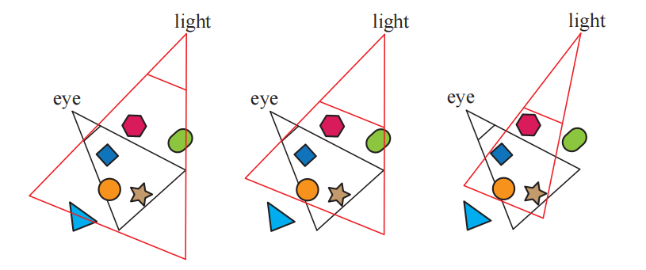

阴影贴图的一个缺点是：阴影质量取决于阴影贴图的分辨率（单位为像素）以及z-buffer的数值精度。由于在进行深度比较的时候，需要对阴影贴图进行采样，因此该算法容易受到锯齿问题的影响，尤其是在物体之间的接触点附近。一个常见的问题是自阴影锯齿（self-shadow aliasing），即一个三角形错误地对自身投射阴影，这个现象通常会被称为“表面痤疮（surface acne）”或者“阴影痤疮（shadow acne）”。产生这个问题主要有两个原因：其中一个原因是处理器精度的数值限制；另一个原因是几何上的，由于受到阴影贴图分辨率的限制，因此一个点状样本的值会被用来代表一个小范围区域的深度。也就是说，为光源生成的样本，几乎永远不会与屏幕样本位于相同的位置（例如：像素通常会在屏幕样本的中心进行采样）。当光源的存储深度值与观察表面的深度值进行比较时，光源的值可能会略低于表面的值，从而导致自阴影现象的发生。图7.12展示了这些错误所带来的影响。

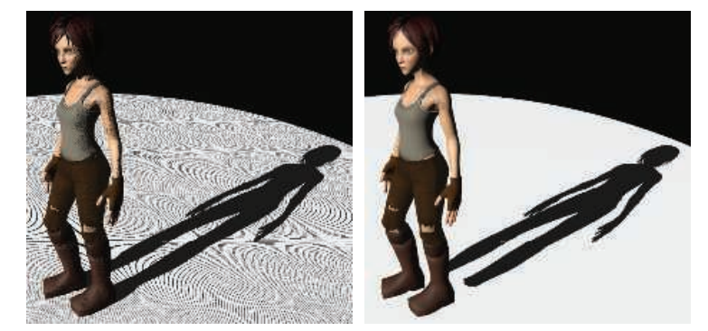

一种帮助避免（但并不总是能消除）各种阴影贴图瑕疵的常见方法是引入偏移量因子。当对阴影贴图中检索到的深度，与待测位置的深度进行比较时，可以从接收物的深度中减去一个很小的偏移量，如图7.13所示。这个偏移量可以是一个恒定的值\[1022]，但是当接收物并没有完全面对光源的时候（表面法线与光线方向之间的夹角很大），这样做可能会失败。一种更加有效的方法是，使用接收物相对于光源的角度，来对偏移量进行修正，从而避免这个问题，即表面相对于光源的倾斜角度越大，所应用的偏移量也就越大。这种偏移量称为斜率修正的偏移（slope scale bias）。这两种偏移量都可以通过使用相应的命令（例如OpenGL的$\text {glPolygonOffset}$），来让每个多边形稍稍远离光源。请注意，当表面正对光源的时候，并不会因斜率修正偏移而向后移动，即此时的斜率修正偏移为0。因此，为了避免可能的精度误差，我们会将斜率修正偏移与一个恒定偏移结合在一起使用。斜率修正偏移也经常会被clamp到某些最大值，因为当表面和光源呈掠射夹角时（接近90度），此时的正切值会很大。

Holbert \[759, 760]引入了法线补偿偏移（normal offset bias），它将接收物的世界空间位置，沿着其表面法线的方向稍稍移动一点，移动的距离与光源方向和表面法线之间夹角的正弦值成正比，如图7.24所示。这个操作不仅改变了样本的深度值，还改变了它在阴影贴图上进行深度测试的$xy$坐标。当光线与表面之间的角度更加接近掠射角度时，这个偏移量就会增加，因为此时我们希望样本距离表面足够远，从而避免自阴影现象。这种方法可以理解为将样本移动到阴影接收物上方的“虚拟表面”上。这个偏移量是一个世界空间下的距离，因此Pettineo \[1403]建议可以根据阴影贴图的深度范围，来对这个偏移量进行缩放。Pesce \[1391]提出了沿相机观察方向进行偏移的想法，这也可以通过调整阴影贴图中的坐标来实现。其他的一些偏移方法将在章节7.5中进行讨论，因为这些阴影方法还需要对几个相邻样本进行深度测试。

过大的偏移量会导致所谓的漏光（light leak）或者Peter Panning问题，即物体看起来像是悬浮在表面上方一样。这种瑕疵的出现，是因为物体接触点下方的区域（例如脚下的地面），被向前偏移得太多，因此并没有接收到阴影。

避免自阴影问题的一种方法是，只将物体背面渲染到阴影贴图中，这种方法被称为第二深度阴影映射（second-depth shadow mapping）\[1845]，它在许多情况下都表现良好，尤其是对于那些无法手动调整偏移量的渲染系统。但是当物体是双面渲染的、非常薄的、或者是相互接触时，这种方法就会出现问题。如果一个模型是双面渲染的，也就是说其网格两侧都是可见的（例如：一个棕榈叶或者一张纸），那么此时就可能会发生自阴影现象，因为背面和正面位于相同的位置。同样地，如果不进行偏移，那么在模型轮廓边缘处，或者很薄的物体附近也可能会出现问题，因为在这些地方，模型的背面和正面靠得很近。此时进行一点点偏移，可以帮助避免表面阴影痤疮，但是这样会更容易漏光，因为在接收物和遮挡物的接触点上，接收物并没有与遮挡物的背面相分离，如图7.14所示。具体选择哪种方案可以视情况而定，例如：Sousa等人\[1679]发现，使用正面深度来生成太阳的阴影，使用背面深度来生成室内灯光的阴影，这种方案对于他们的应用而言效果最好。

需要注意的是，对于阴影映射而言，能够投射阴影的物体必须是“水密的（watertight）”（或者被称为流形manifold、封闭closed、或者固体solid，详见章节16.3.3），或者换句话说，它必须能够将自己的正面和背面都渲染到阴影贴图中，否则这个物体可能无法投射一个完整的阴影。Woo \[1900]提出了一种通用方法，该方法试图在使用正面深度或者背面深度进行阴影处理之间，找到一个折衷的方法。其核心想法是，将固体对象渲染到阴影贴图中，并追踪两个最靠近光源的表面，这个过程可以通过深度剥离（depth peeling），或者其他与透明相关的技术来实现。两个物体之间的平均深度会形成一个中间层，我们使用这个中间层的深度来作为阴影贴图，这种方法有时会称为双重阴影贴图（dual shadow map）\[1865]。如果物体足够厚的话，那么可以最小化自阴影和漏光所带来的瑕疵。Bavoil等人\[116]讨论了处理潜在瑕疵的方法，以及其他的实现细节。这种方法的主要缺点在于，它使用了两个阴影贴图，这会带来额外的开销（计算开销和存储开销）。Myers \[1253]讨论了一种由艺术家来控制遮挡物和接收物之间深度层的方案。

随着相机在场景中的移动，光源的视野范围也会随着shadow caster的变化而变化，这种变化反过来又会导致阴影在帧与帧之间略有不同。这是因为光源的阴影贴图从光源处采样了一组方向，这些采样方向与上一帧中的采样方向略有不同。对于方向光而言，对应的解决方案是，对每个后续生成的阴影贴图进行限制，使得它们在世界空间中保持相同的相对纹素位置\[927, 1227, 1792, 1810]。也就是说，我们可以将阴影贴图视为在整个世界中，强加上一个二维网格的参考网格，每个网格单元都代表了阴影贴图上的一个像素样本。当我们在场景中移动的时候，阴影贴图会为这些相同的网格单元生成不同的样本集合。换句话说，光源的视图投影会被限制到这个网格中，从而保持帧与帧之间的一致性。

### 7.4.1 分辨率增强

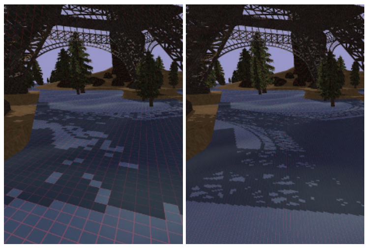

与纹理的使用方式相类似，在理想情况下，我们希望阴影贴图中的一个纹素，大约能够覆盖屏幕上的一个像素。如果我们有一个与相机位置相同的光源，那么此时阴影贴图中的纹素可以和屏幕空间上像素完美地一一对应（并且我们看不见任何阴影，因为相机所观察到的物体，都会被这个光源照亮）。一旦光源的方向有所改变，那么阴影贴图中一个纹素所占据的屏幕像素比例就会发生改变，此时就可能会产生一些瑕疵和锯齿。如图7.15所示，图中的阴影是块状的，并且轮廓也很不清晰，因为阴影贴图中的每个纹素都关联了大量的前景像素，这种不匹配的现象被称为透视走样（perspective aliasing）。当一个表面几乎与光线平行，并且它刚好面向观察者时，单个阴影贴图的纹素也会覆盖大量像素，这个问题被称为投影走样（projective aliasing）\[1792]，如图7.16所示。提高阴影贴图的分辨率可以减少块状阴影的出现，但是需要额外的内存开销和处理开销。

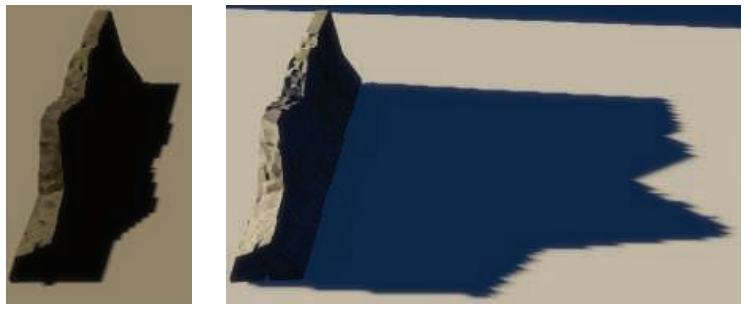

还可以使用另一种方法来创建光源的采样模式，使其更加接近相机的采样模式，这是通过改变场景向光源的投影方式来实现的。通常我们认为观察区域是对称的，观察方向位于视锥体的中心。然而观察方向仅仅决定了视图平面的朝向，并没有决定哪些像素会被采样。定义视锥体的窗口可以在这个平面上进行移动、倾斜或者旋转，从而创建一个四边形，提供一种完全不同的、从世界空间到观察空间的映射方式。这个四边形仍然会以固定的间隔进行采样，这是由在GPU中使用的线性变换矩阵的本质特点所决定的。但是我们可以通过改变光源的观察方向以及观察窗口的边界，来改变不同位置上的采样率，如图7.17所示。

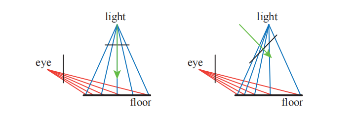

将光源的观察视图映射到人眼的观察视图，大概有22个自由度\[896]，对这个解空间的探索引出了好几种不同的算法，这些算法试图将光源的采样率与相机的采样率进行更好地匹配。这些方法包括透视阴影贴图（perspective shadow map，PSM）\[1691]、梯形阴影贴图（trapezoidal shadow maps，TSM）\[1132]和光源空间透视阴影贴图（light space perspective shadow map，LiSPSM）\[1893, 1895]，具体示例详见图7.15和图7.26。这类技术被统称为透视变形（perspective warping）方法。

这些矩阵扭曲（matrix-warping）算法的一个优点是，除了对光源的投影矩阵进行修改之外，不需要进行其他额外的工作。每种方法都有自己的优缺点\[484]，因为每种方法都可以在某些特定的几何情况和照明情况下，来帮助匹配采样率，但是在其他场景情况下的采样率会发生恶化。Lloyd等人\[1062, 1063]分析了PSM、TSM和LiSPSM之间的等价性，并对这些方法的采样和锯齿问题进行了很好的概述。当光源方向垂直于观察方向时（例如头顶上的光源），这些方案的效果最好，因为在这种情况下，在对光源的透视变换进行修正之后，可以在靠近眼睛的地方放置更多的样本。

当光源位于相机前方并且指向相机的时候，这些矩阵扭曲技术就会失效。这种情况被称为视锥决斗（dueling frusta），因为光源的视锥体和相机的视锥体相对；或者更加通俗的说法是“车灯下的鹿（deer in the headlights）”（译者注：这是一句英语俗语，意思是慌张、呆若木鸡）。在这种情况下，在靠近相机的位置处依然需要更多的阴影贴图样本，但是这种线性扭曲的方法只会让情况变得更加糟糕\[1555]。上述这些问题以及其他的一些问题，例如阴影质量的突变\[430]，相机运动过程中阴影质量的不稳定性\[484, 1227]，使得这些方法不再受大家欢迎。

在靠近观察者的位置上添加更多的样本，这是一个很好的想法，基于这种思路，有一些算法会为给定的视图生成多张阴影贴图。当Carmack在2004年的Quakecon大会上发表相关主题演讲时，这个思路的第一次提出就产生了显著影响。Blow独立实现了这样的一个系统\[174]，其核心想法很简单：生成一组固定数量的阴影贴图（它们的分辨率可能是不同的）来覆盖场景中的不同区域。在Blow的方案中，生成了四张阴影贴图，它们嵌套在了观察者周围；通过这种方式，位于观察者附近的物体就可以获得更高分辨率的阴影贴图，而位于远处的物体则会获得较低分辨率的阴影贴图。Forsyth \[483, 486]提出了一个类似的想法，即为不同集合的可见物体，生成不同的阴影贴图；在这种方法中，不需要对跨越两个阴影贴图边界的物体过渡问题进行处理，因为每个物体有且只有一个与其关联的阴影贴图。Flagship工作室开发了一个系统，它将这两种理念相融合：第一个阴影贴图用于观察者附近的动态物体，第二个阴影贴图用于观察者附近的静态对象，第三个阴影贴图用于整个场景中的静态物体。每帧只需要重新生成第一个阴影贴图即可，另外两个阴影贴图只需要生成一次，因为它们所包含的光源和几何物体都是静态的。虽然上述这些渲染系统现在都已经很老了，但是为不同物体和不同情况生成多个阴影贴图的思想，从那时起就成为了阴影映射算法的共同主题，其中，这些阴影贴图有些是预计算生成的，有些则是动态生成。

![图7.18：左图中，相机的视锥体被划分成了四个区域。右图中，为每个划分后的视锥体区域创建了对应的包围盒，图中的方向光会生成四个阴影贴图，每个包围盒决定了该阴影贴图的渲染范围。 \[430\]](images/Chapter-7/20230611111808.png "图7.18：左图中，相机的视锥体被划分成了四个区域。右图中，为每个划分后的视锥体区域创建了对应的包围盒，图中的方向光会生成四个阴影贴图，每个包围盒决定了该阴影贴图的渲染范围。 \[430]")

2006年Engel \[430]、Lloyd等人\[1062, 1063]、Zhang等人\[1962, 1963]，根据这个相同的基本思想，独立进行了各自的研究；这个想法是在观察方向的垂直方向上，将视锥体划分成若干个区域，如图7.18所示。

> Tadamura等人\[1735]早在七年前就提出了这个想法，但是直到其他研究人员发现了这个想法的实用性之后，它才真正产生了巨大影响。

随着深度（距离相机的距离）的增加，每个视锥体区域的深度范围大约是前一个区域的2到3倍\[430, 1962]。对于每个划分后的视锥体区域，光源都可以生成一个紧密包裹该区域的视锥体，然后根据这个视锥体来生成阴影贴图。通过使用纹理图集（texture atlas）或者纹理数组（texture array），可以将不同区域的阴影贴图打包成一个较大的纹理对象，从而减少缓存访问所带来的延迟。图7.19展示了这种方法所带来的质量提升。Engel将这种算法的命名为级联阴影贴图（cascade shadow maps，CSM），Zhang则将其称为平行分割阴影贴图（parallel-split shadow maps），这两个名词都在相关文献中都出现过，它们实际上是完全等价的\[1964]，但是一般CSM会更加常用一些 。

![图7.19：左图：场景的可见区域很大，导致单张阴影贴图使用了 2048 \times 2048 的分辨率，从而避免透视走样（锯齿）。右图：在观察方向上使用了四个 1024 \times 1024 的阴影贴图，大大提高了阴影的质量 \[1963\] 。上图红框中展示了围栏前角的放大结果，可以看到右侧的阴影质量更高。](images/Chapter-7/20230611111822.png "图7.19：左图：场景的可见区域很大，导致单张阴影贴图使用了 2048 \times 2048 的分辨率，从而避免透视走样（锯齿）。右图：在观察方向上使用了四个 1024 \times 1024 的阴影贴图，大大提高了阴影的质量 \[1963] 。上图红框中展示了围栏前角的放大结果，可以看到右侧的阴影质量更高。")

这种算法的实现起来十分简单，它能够覆盖较大范围的场景区域，并且可以得到合理的阴影结果，具有较强的健壮性。“视锥决斗（dueling frusta）”的问题也可以通过在靠近相机的位置上使用更高的采样率来解决，并且这种算法没有严重的最坏情况问题，也就是说，它在几乎所有的光照条件和场景条件下都表现良好。由于上述的这些优点，级联阴影映射被广泛应用在各种图形程序中。

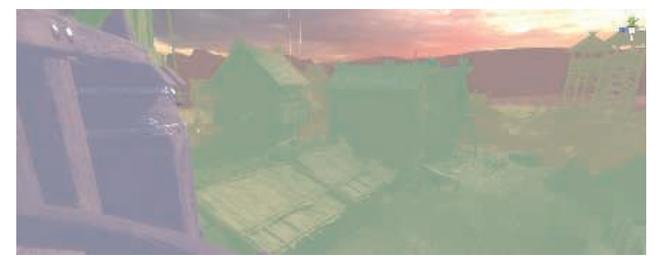

虽然可以使用透视变形，来将更多的样本打包到单个阴影贴图的细分区域中，但是通用的做法是为每个级联（cascade）使用单独的阴影贴图\[1783]。如图7.18和图7.20所示，从相机的视角来看，每个阴影贴图所覆盖的区域是不同的。较小的观察空间对应了更近的阴影贴图，它需要提供更多的样本。在不同的阴影贴图之间划分$z$深度的范围，这可能是一件既简单又复杂的任务，这个任务被称为$z$划分（z-partitioning）\[412, 991, 1791]。其中一种方法是使用对数划分方法\[1062]，即对于每个级联阴影贴图而言，其远裁剪平面与近裁剪平面的距离之比是相同的，这个比例如下：

$$
r=\sqrt[c]{\dfrac{f}{n}}
\tag{7.5} 
$$

其中$n$是整个场景视锥体的近裁剪平面，$f$是整个场景视锥体的远裁剪平面；$c$是阴影贴图的数量，$r$是最终生成的比例。例如：如果场景中最靠近相机的物体深度为1米，最远离相机的物体深度为1000米，一共划分为三个阴影贴图，那么这个比例是$r=\sqrt[3]{1000 / 1}=10$。也就是说，最近区域所对应的远近裁剪平面的深度分别是1和10，下一个区域是10和100，最后是100和1000米。初始的近裁剪平面深度，对这种划分方法有着很大的影响，如果近裁剪平面的深度仅为0.1米，那么10000的立方根将会达到21.54，这是一个相当高的比例，最终的深度划分为：0.1，2.154，46.42，1000。这意味着最后一个阴影贴图需要覆盖更大范围的区域，从而降低了精度和阴影的质量。在实际应用中，这种划分方法可以为近裁剪平面附近的区域提供了更大的阴影贴图分辨率（采样率），但是如果该区域中没有物体的话，那么这个更大分辨率的阴影贴图就会被浪费。避免这种问题的一种方法是，将划分距离设置为对数分布（logarithmic distribution）和等距分布（equidistant distribution）的加权混合\[1962, 1963]；如果我们能够确定场景的紧密视图包围盒的话就更好了。

这个问题的困难之处在于如何设置近裁剪平面的深度。如果将近裁剪平面设置得距离相机太远，那么可能会错误地剔除某些靠近相机的物体，这会产生非常严重的视觉瑕疵。对于过场动画而言，艺术家可以提前精确设定这个值\[1590]，但是对于一般的交互式场景而言，这个问题就变得十分具有挑战性了。Lauritzen等人\[991, 1403]提出了一种叫做样本分布阴影贴图（sample distribution shadow maps，SDSM）的方法，它使用了前一帧中的深度划分值，然后通过两种方法中的其中一种，来确定一个更好的划分方式。

第一种方法是遍历深度（深度缓冲）的最小值和最大值，并使用它们来设置远近裁剪平面的深度。这是使用GPU上的reduce操作来完成的，其中计算着色器或者其他的着色器，会对一系列越来越小的缓冲区进行分析，输出的缓冲区又会被作为输入，重新送入这个着色器中，直到最终留下一个$1 \times 1$大小的缓冲区。通常情况下，会根据场景中物体的移动速度，对这些值进行一点调整。如果不采取纠正措施的话，从屏幕边缘进入画面的物体，可能会对当前帧产生一些一些影响和问题，尽管这个问题在下一帧中就会被很快纠正。

第二种方法同样会对深度缓冲中的深度值进行分析，并生成一个直方图，其中记录了深度值的分布。这个直方图除了用于寻找最合适（紧密包裹场景中需要渲染的物体）的远近裁剪平面之外，还应当存在一些不包含任何物体和深度的间隙。通常会在实际包含物体的深度区间中进行划分，从而为级联阴影贴图提供更多的深度精度。

在实践中通常会使用第一种方法，它的速度很快（通常在每帧1毫秒内），并且能够生成较好的结果，因此它在很多应用中都被采纳\[1405, 1811]，如图7.21所示。

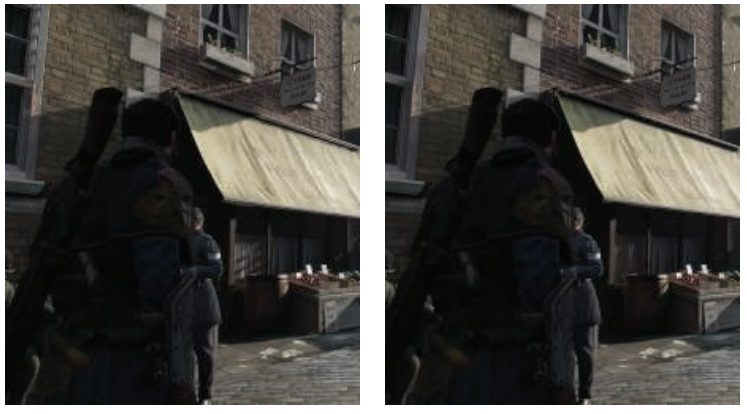

级联阴影贴图与使用单个阴影贴图具有一些相同的问题，由于光线样本会在帧与帧之间发生变化，从而产生闪烁瑕疵，并且当物体在级联之间进行移动的时候，这种问题可能会变得更加严重。有很多方法可以用来在世界空间中保持稳定的采样点，每种方法都有各自的优点\[41, 865, 1381, 1403, 1678, 1679, 1810]。当一个物体跨域两个级联阴影贴图的公共边界时，阴影的质量会发生突变，一种解决方法是让划分的深度区域稍微重叠，位于重叠区域的样本会收集相邻阴影贴图的结果，并对其进行混合\[1791]；或者也可以使用抖动法（dithering），来在该区域内采集单个样本\[1381]。

由于级联阴影贴图技术十分流行，人们投入了相当大的努力来进一步提高算法的效率和质量\[1791, 1964]。如果阴影贴图的视锥体内没有发生任何变化，那么就不需要重新计算该阴影贴图。对于每个光源而言，可以通过预先计算，找到光源视锥体中的哪些物体是可见的，其中又有哪些物体会产生阴影，从而构建一个shadow caster的列表\[1405]。由于人眼很难精确判断生成的阴影是否是物理正确的，因此我们可以在级联阴影映射和其他阴影算法中，采取一切取巧的方法（trick）。其中一种方法是使用低层级细节（LOD）的模型来作为实际投射阴影的代理模型\[652, 1812]；另一种方法是移除那些很小的遮挡物\[1381, 1811]。位于较远处的阴影也不需要每帧都进行更新，因为在理论上而言，这类阴影对于视觉感知的重要性很低；但是当一些很大的物体在远处移动时，这个想法可能会产生一些瑕疵，因此需要小心使用\[865, 1389, 1391, 1678, 1679]。Day \[329]提出了一种将远处阴影贴图在帧与帧之间进行重复使用的想法，这个想法的依据是，静态阴影贴图中的大部分内容，在帧与帧之间都是相同的，可以重复使用，只有阴影的边缘部分可能会发生变化，因此这部分需要重新渲染。诸如《毁灭战士（2016）》这样的游戏，维护了一个巨大的阴影贴图图集，只在物体发生移动的地方重新生成阴影贴图即可\[294]。而对于更远的级联阴影贴图，可以让其完全忽略动态物体，因为这些物体的阴影对于场景感知的贡献很少。在某些场景中，可以使用一个高分辨率的静态阴影贴图，来代替这些位于较远位置的级联阴影贴图，这样可以显著减少工作量\[415, 1590]。对于一些大场景而言，可能会有一个十分巨大的静态阴影贴图，在这种情况下，可以使用一个稀疏纹理系统（sparse texture system）（章节19.10.1）\[241, 625, 1253]。级联阴影贴图还可以与烘焙的光照贴图结合使用，或者是与其他更适合某些特定场景的阴影技术结合使用\[652]。Valient \[1811]的演讲是十分值得关注的，他介绍了在各种电子游戏中所使用的自定义阴影系统，以及相关的技术。在章节11.5.1中详细讨论了预计算的光照和阴影算法。

生成若干个独立的阴影贴图意味着要为每个贴图都渲染一组几何图形。有个想法是在单个pass中，将遮挡物渲染到一组阴影贴图中，有许多提高效率的方法都是建立在这个想法上的。可以使用几何着色器来复制物体数据，并将其发送到多个视图中\[41]；实例化的几何着色器允许一个物体输出到多达32个深度纹理中\[1456]。多视口扩展（multiple-viewport extensions）可以执行诸如将物体渲染到特定纹理数组切片中之类的操作\[41, 154, 530]，章节21.3.1在虚拟现实的背景下，对其进行了更加详细地讨论。视图共享技术的一个可能的缺点是，用于生成阴影贴图的所有遮挡物（无论这些阴影贴图是否会用到它们）都必须要发送到管线中执行，而不是只发送与当前阴影贴图有关的遮挡物\[1791, 1810]。

现实中的我们正处于来自世界各处数十亿光源的阴影中，其中只有少数光源会照射到我们的身上。而在实时渲染中，如果所有的光源都处于启用状态，那么一些具有多个光源的大型场景可能直接会被计算量所淹没。如果视锥体中的一个区域是相机看不见的，那么就不需要对该区域所接收到的阴影进行计算\[625, 1137]。Bittner等人\[152]使用相机的遮挡剔除（occlusion culling）（章节19.7），来找到所有可见的阴影接收物，然后再从光源的角度，将所有潜在的阴影接收物渲染到一个模板缓冲区中，这个蒙版记录了光源可以看到的全部阴影接收物。为了生成阴影贴图，他们从光源的视角出发，使用遮挡剔除来渲染物体，并使用之前生成的蒙版来剔除那些没有阴影接收物的物体。相机所使用的各种的剔除技术也同样适用于这里的光源。由于irradiance会随着距离的平方而衰减，因此通常会在一定的阈值距离后将光源剔除。例如：章节19.5中所介绍的入口剔除（portal culling）技术，可以发现是哪些光源会对单元格产生了影响。这是一个相当活跃的研究领域，因为它所带来的性能提升是相当客观的\[1330, 1604]。

## 7.5 PCF

对阴影贴图技术进行简单的扩展，我们就可以获得质量不错的伪软阴影效果。当单个光源样本覆盖了许多屏幕像素的时候，会导致阴影看起来呈现块状，本小节中所介绍的方法，还可以帮助改善阴影贴图的分辨率问题。这个方法类似于章节6.2.1中所介绍的纹理放大技术，我们在对阴影贴图进行检索的时候，并不是简单地从阴影贴图中取出对应的单个样本，而是会检索4个最近的样本。不同的是，这里的所提到的方法并不会在这些深度值之间进行插值，而是先将它们与表面深度进行比较，然后在对比较的结果进行插值。也就是说，这四个纹理样本的深度会先与表面深度进行比较，然后确定每个样本点到底是位于光照区域还是阴影区域。我们使用0来代表位于阴影区域，1来代表位于光照区域，然后再对这个0-1结果进行双线性插值，从而计算光源对于该表面位置的实际贡献有多大。这种过滤的结果会产生人为的软阴影，这些半影效果的变化取决于阴影贴图的分辨率、相机的位置以及其他的一些因素，例如：阴影贴图使用更高的分辨率，会使得阴影边缘变得更加柔和。尽管这种软阴影并非是物理正确的，但是有一点半影和平滑的效果，总比没有要好得多。

这种从阴影贴图中检索多个样本，并将结果进行混合的想法被称为百分比接近滤波（Percentage-Closer Filtering，PCF）\[1475]。我们已经知道，面光源可以产生柔和的软阴影效果，到达表面上某个位置的光线数量，与该位置所能看见的光源面积大小成比例。而PCF算法试图通过反转这个过程，来对一个精确光源或者方向光的软阴影进行近似。PCF并没有从一个表面位置上来计算光源可见区域的面积，而是从靠近该位置的一组表面位置上，来计算精确光源的可见性，如图7.22所示。PCF的名称“percentage-closer filtering”就表明了算法的最终目标，即找到光源可见样本所占的百分比。我们使用这个百分比来近似照射到表面位置的光线数量。

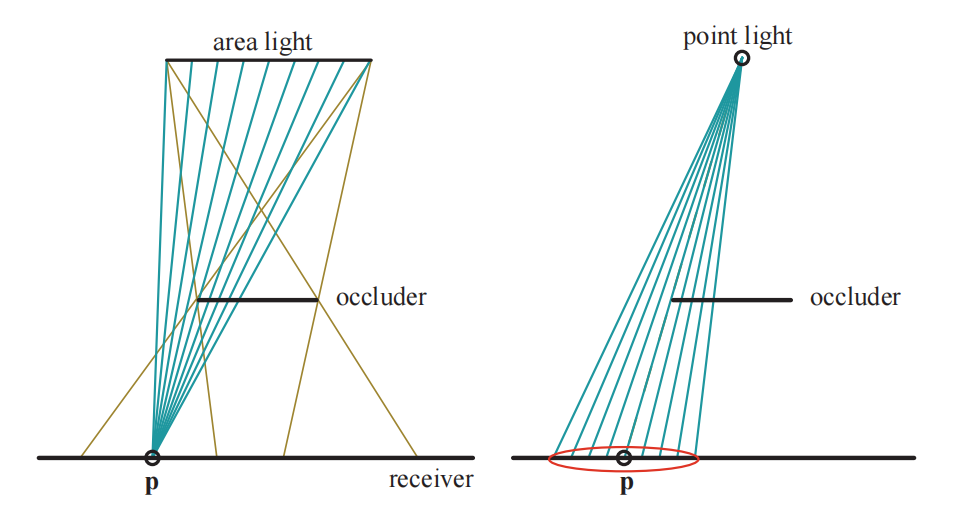

在PCF算法中，这些计算光源可见性的样本位置在原始位置附近生成的，它们都具有大致相同的深度值，但是对应了阴影贴图中不同位置的纹素。会在这些位置上计算光源的可见性，然后再对生成的布尔结果（被光源照亮或者不会被光源照亮）进行混合，从而获得软阴影的效果。需要注意的是，这个过程并不是物理正确的：我们并没有直接对光源进行采样，而是对表面本身进行采样，再计算可见性百分比。由于表面与遮挡物之间的距离并不会对阴影结果产生影响，因此所生成的软阴影都具有尺寸相似的半影区域。尽管如此，这种方法在大多数情况下都可以提供一个合理的近似效果。

一旦确定了采样区域的宽度，下一个重要的问题是，如何以避免锯齿瑕疵的方式来进行采样。如何对附近的阴影贴图位置进行采样和过滤，有很多可以调整的参数选项，例如：采样区域的宽度、采集的样本数量、采样的模式以及如何对结果进行加权等。在图形API支持功能较少的情况下，可以采用一种类似于双线性插值的特殊纹理采样模式，通过访问相邻的4个位置来加速采样过程。在获得样本值之后，我们首先会将各个样本值与一个给定的值进行比较，计算通过测试的比例，然后再对结果进行混合\[175]。然而，以一个规则的网格模式来对最近邻居纹素进行采样，会产生肉眼可见的锯齿和瑕疵；可以使用一个联合双边滤波，来对结果进行模糊处理，同时将物体的边缘信息作为联合双边滤波的权重，这样可以在提高阴影质量的同时，避免阴影泄漏到其他表面上\[1343]。有关这种过滤技术的更多信息，详见章节12.1.1。

DirectX 10为PCF引入了单指令双线性滤波的支持，从而给出了一个更加平滑的结果\[53, 412, 1709, 1790]。与上文提到的最近邻居采样方法相比，它提供了相当大的视觉改进，但是规则采样所带来的锯齿瑕疵仍然无法解决。为了最小化规则采样所带来的问题，其中一种解决方案是使用一个预先计算好的泊松分布模式来对区域进行采样，如图7.23所示；泊松分布会将样本分散开来，使它们既不相互靠近，也会不处于规则模式。我们知道，无论使用什么样的分布来进行采样，对每个像素使用相同的采样位置，都会产生这种规则的采样模式\[288]。因此我们需要给每个像素上的采样位置添加一点随机性，通过将采样位置绕像素中心进行随机旋转，从而避免产生规则采样所带来的瑕疵，但是代价是会产生噪声问题。Castano指出\[235]，泊松采样所产生的噪声十分平滑，并且具有一定的特殊风格，因此在画面上会显得特别明显；他在双线性采样的基础上，提出了一种高效的高斯加权采样方法。

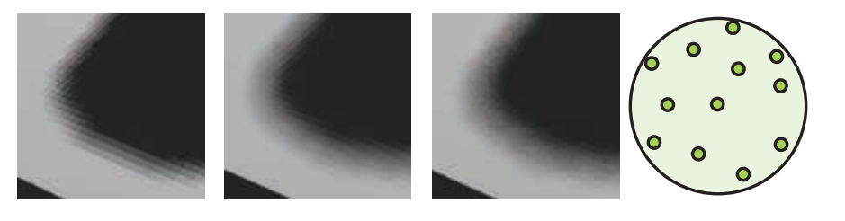

自阴影问题和漏光问题，即阴影痤疮和Peter Panning，在PCF中会变得更加糟糕。假设样本在阴影贴图上所占据的大小不超过一个纹素，那么斜率修正偏移仅仅会根据表面与光源的夹角，来使得表面稍稍远离光源。此时如果表面上单个位置在更大的区域内进行采样，会导致一些测试样本被真实表面所遮挡。

人们提出了一些不同的额外偏移因子，可以在一定程度上减少自阴影问题出现的概率。Burley \[212]提出了偏移锥（bias cone）的想法，每个测试样本都会根据自身与原始样本的距离，来成比例地向光源进行移动。Burley建议将比例系数设置为2.0，并添加一个较小的恒定偏移量，如图7.24所示。

Schuler \[1585]、Isidoro \[1585]和Tuft \[1790]所提出的技术基于了这样一个观察：接收物表面本身的斜率，应当用于调整剩余样本的深度值。在这三位学者的方法中，Tuft的方程\[1790]最容易应用于级联阴影贴图。Dou等人\[373]对这个概念进行了完善和扩展，他解释了z-depth是如何以一种非线性的方式进行变化的。这些方法都基于了这样一个假设，即邻近的样本位置位于三角形所定义的同一平面上。这类技术被称为接收物平面深度偏移（receiver plane depth bias）或者其他类似的术语，它在许多情况下都十分精确，因为位于这个假想平面上的样本位置确实位于表面上；如果模型是凸的话，那么这个假想平面会位于原始表面的前方（法线方向）。如图7.24所示，位于凹陷表面附近的样本可能会被遮挡隐藏起来。将常量偏移、斜率修正偏移、接收物平面偏移、视图偏差和法线偏移组合使用，可以有效解决自阴影问题，但是对每个场景进行手动调整，仍然是有必要的\[235, 1391, 1403]。

PCF算法存在这样的一个问题，由于每个采样区域的宽度保持不变，因此阴影会表现出均匀柔和的外观，即所有阴影区域都具有相同的半影宽度。它在某些情况下是可以接受的，但是在遮挡物和接收物相接触的地方，会表现得不太正确，如图7.25所示。

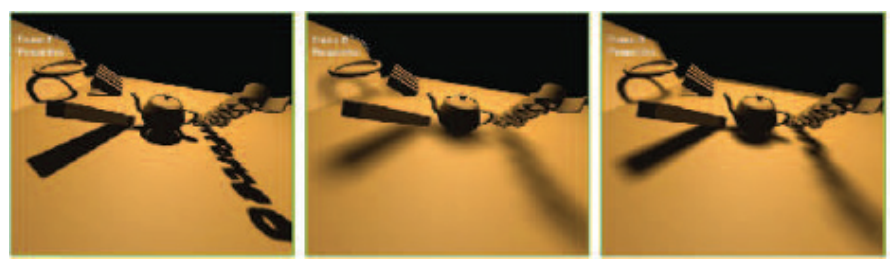

## 7.6 PCSS

2005年，Fernando \[212, 467, 1252]提出了一种具有影响力的方法，它被称为百分比接近软阴影（percentage-closer soft shadow，PCSS）。它试图通过对阴影贴图上的附近区域进行搜索，来找到所有可能的遮挡物，并使用这些遮挡物与表面位置的平均距离，来决定采样区域的宽度，其方程如下：

$$
w_{\text {sample }}=w_{\text {light }} \frac{d_{r}-d_{o}}{d_{o}}
\tag{7.6} 
$$

其中$d_r$是接收物到光源的距离，$d_o$是遮挡物到光源的平均距离。换句话说，随着遮挡物到接收物的平均距离越远（遮挡物距离光源越来越近，$d_o$变小），表面采样区域的宽度就越大。我们可以重新观察图7.22，想象一下如果此时遮挡物发生移动会产生什么效果，然后再来理解一下方程7.6的含义。图7.2、图7.25和图7.26都展示了这样的例子。

如果没有发现遮挡物，那么该位置会被光源完全照亮，不需要任何进一步的处理；同样的，如果该位置被完全遮挡，那么也不需要进行后续处理。在其他情况下，我们需要对感兴趣的区域进行采样，并计算光源的近似贡献。为了降低计算成本，我们可以根据采样区域的宽度，来动态调整采样的数量。也可以使用一些其他的技术，例如：位于较远位置的软阴影对于视觉感知而言没有那么重要，因此可以使用较低的采样率。

PCSS的一个缺点是，它需要在阴影贴图中一个较大的区域范围内进行采样，从而寻找遮挡物的平均深度。使用上一小节中提到的旋转泊松圆盘采样模式，可以帮助隐藏欠采样导致的锯齿瑕疵\[865, 1590]。Jimenez \[832]注意到，泊松采样在运动情况下可能是不稳定的，他还发现使用介于抖动和随机之间的函数所形成的螺旋模式，在运动情况下具有更好的表现。

Sikachev等人\[1641]详细讨论了如何使用SM 5.0中的特性，来更快地实现PCSS，这个特性是由AMD引入的，它通常被称为接触硬化阴影（contact hardening shadows，CHS）。这个新版本的算法还解决了基础PCSS的另一个问题，即半影区域的大小会受到阴影贴图分辨率的影响，如图7.25所示。可以通过首先生成阴影贴图的mipmap，然后选择最接近于（由用户定义）世界空间尺度的mipmap层级，来最小化这个问题。该算法会对$8 × 8$的区域进行采样，从而找到平均遮挡物深度，这个操作只需要16次$\text {GatherRed()}$纹理调用即可。一旦计算出了半影区域的估计，就可以使用较高分辨率的mipmap来渲染较硬的阴影，使用较低分辨率的mipmap来渲染较软的阴影。

CHS算法已经被大量的电子游戏所采用\[1351, 1590, 1641, 1678, 1679]，并且对它的研究还在继续。例如：Buades等人\[206]提出了可分离的软阴影映射（separable soft shadow mapping，SSSM），其中对网格采样的PCSS过程被划分为了可分离的部分，可以在像素之间尽可能地重复使用相关元素，从而进一步提高效率。

对于那些每个像素采样多个样本（多spp）的算法，有一个已被证明的、可以用于加速计算的概念是分层最小/最大阴影贴图（hierarchical min/max shadow map）。虽然阴影贴图的深度通常无法被平均，但是每个mipmap层级的最小值和最大值，对于算法加速而言还是很有用的。也就是说，可以生成两组mipmap，其中一个用于保存每个区域中的最大z-depth（这个mipmap有时会称为HiZ，层次z缓冲），另一个则用于保存每个区域中的最小z-depth。对于给定的采样位置、深度以及采样区域，这两个mipmap可以用于快速判断待测样本是完全光照的还是完全阴影的。例如：如果待测样本的z-depth，大于mipmap相应区域中存储的最大z-depth，那么则说明该样本一定位于阴影中，因此不需要对其进行后续的采样。这种类型的阴影贴图可以使得计算光源可见性的任务变得更加高效\[357, 415, 610, 680, 1064, 1811]。

PCF方法通过对附近的接收物位置进行采样，来计算光照百分比，从而模拟软阴影效果。PCSS方法通过找到附近遮挡物的平均深度，从而决定测试样本的采样区域宽度。这些算法并不会直接去考虑光源的表面面积，而是会对着色点附近的表面进行采样，这些算法都会受到阴影贴图分辨率的影响。PCSS背后的主要假设是：平均遮挡物深度是一个对半影区域大小的合理估计。但是当两个遮挡物（例如路灯和远处的山）都部分遮挡了同一个像素时，上述假设就不成立了，并且可能会导致瑕疵。在理想情况下，我们希望能够确定从单个表面位置上，能够看到多少面光源。一些研究人员使用GPU来实现反向投影（backprojection），这个方法的思路是：将接收物的每个表面位置都视为一个观察点，将面光源视为观察平面的一部分，并尝试将遮挡物投影到这个平面上。Schwarz和Stamminger \[1593]以及Guennebaud等人\[617]对之前的工作进行了总结，并提出了他们自己的改进方法。Bavoil等人\[116]采用了一个不同的方法，他们使用深度剥离来创建多层阴影贴图。反向投影算法可以生成很好的结果，但是其逐像素的计算开销实在太大，因此它们还没有（到目前为止）在交互式应用程序中进行使用。

## 7.7 过滤阴影贴图

Donnelly和Lauritzen提出了方差阴影贴图（variance shadow map，VSM）\[368]，该方法允许对生成后的阴影贴图进行过滤操作。该算法将原始深度值存储在一个贴图中，并将原始深度值的平方存储在另一个贴图中。在生成这些贴图的时候，可以使用MSAA或者其他的抗锯齿技术。这些贴图可以被模糊化、生成mipmap、放入面积积分表（SAT）\[988]中或者应用其他方法。将这些贴图视为可过滤的纹理具有巨大的好处，因为当从贴图中检索数据的时候，可以使用一系列成熟的采样和过滤技术。

这里我们将稍微深入地介绍一下VSM算法，以便大致了解它是如何工作的；此外，对这类算法中的所有方法，都使用了相同类型的测试。有兴趣进一步了解该领域信息的读者，可以阅读相关的参考资料，同时我们也推荐读者阅读Eisemann等人\[412]所撰写的书，它对这个话题进行了广泛的介绍和讨论。

首先，VSM算法会在接收物的表面位置处，对深度图进行一次采样，从而返回最近遮挡物的平均深度，我们将这个平均深度称为一阶矩（first moment），记作$M_1$。当$M_1$大于阴影接收物$t$的深度时，则认为该接收物位置完全处于光照中；当$M_1$小于阴影接收物$t$的深度时，则使用以下方程：

$$
p_{\max }(t)=\frac{\sigma^{2}}{\sigma^{2}+\left(t-M_{1}\right)^{2}}
\tag{7.7} 
$$

其中$p_{\max }$代表了位于光照下的样本最大百分比，$\sigma^{2}$代表了方差，$t$是阴影接受物的深度，$M_1$阴影贴图中的平均期望深度。上文中我们提到VSM还会生成一个贴图用于存储阴影贴图深度值的平方，我们将这个贴图中的样本称为二阶矩（second moment），记作$M_2$，我们使用$M_1$和$M_2$来计算方差，方程如下：

$$
\sigma^{2}=M_{2}-M_{1}^{2}
\tag{7.8}  
$$

$p_{\max }$代表了接收物可见性百分比的上界，实际使用的光照百分比$p$不能大于这个值。这个上界来自于Chebyshev's inequality（切比雪夫不等式）的单侧变体，这个方程试图使用概率论中的方法，来估计表面位置上的遮挡物分布有多少超出了表面到光源的距离。Donnelly和Lauritzen证明了，对于具有固定深度的平面遮挡物和平面接收物而言，$p=p_{\max }$；因此方程7.7可以作为对许多真实阴影的良好近似。

Myers \[1251]对这种方法的有效性建立了一种直观理解。阴影边缘附近的深度方差会增加，深度值差异越大，方差也越大。方程7.7分母中的$(t-M_{1})^{2}$，是可见性百分比的重要决定因素，如果这个值略高于零，就意味着平均遮挡物深度会稍微靠近光源一些（相较于接收物而言），并且值$p_{\max }$会接近于1（完全被照亮），这种情况会发生在半影完全被光源照亮的边缘处。随着向半影区域内部不断移动，平均遮挡物深度会越来越靠近光源，因此$(t-M_{1})^{2}$项会变大，$p_{\max }$会减小。与此同时，方差本身在半影区域内也会发生变化，方差在半影边缘处接近于零，当遮挡物深度不同且面积相等时，方差会达到最大。这些项相互制衡抵消，会在半影区域内形成一个线性变化的阴影，图7.26展示了VSM与其他算法的对比结果。

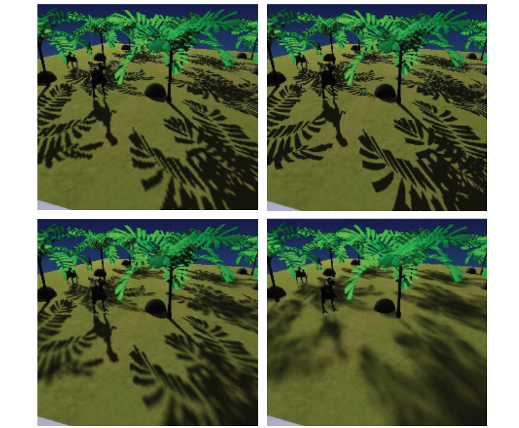

VSM的一个重要特点是，它可以以一种十分优雅的方式，来处理由几何形状导致的表面偏差问题。Lauritzen \[988]给出了如何使用表面斜率，来修改二阶矩的推导过程。VSM的一个缺点是，数值稳定性可能会导致一些偏差和其他问题，例如：方程7.8中使用一个相似的值来减去另一个较大的值，这种类型的计算往往会加剧数值精度不足的问题，可以通过使用浮点纹理来避免这个问题。

总的来说，由于GPU的纹理能力（专门优化过的）得到了有效利用，VSM算法可以在处理时间相同的情况下，显著提高阴影质量。PCF需要更多的测试样本，从而避免在生成软阴影的时候产生噪声，但是这也会花费更多的时间；而VSM可以只使用单个高质量的样本，来确定整个区域的可见性百分比，并产生平滑的半影效果。这意味着在算法的限制范围内，可以在不增加额外开销的前提下，对阴影进行任意软化。

与PCF一样，滤波核的宽度决定了半影区域的宽度。通过寻找接收物和最近遮挡物之间的距离，来动态调整滤波核的宽度，从而生成令人信服的软阴影。对于宽度缓慢增加的半影区域，mimap生成的样本对于半影区域覆盖率的估计结果较差，会产生方形锯齿。Lauritzen \[988]详细介绍了如何使用SAT（面积积分表）来生成质量更好的阴影，如图7.27所示。

![图7.27：方差阴影映射（VSM），其中遮挡物到光源的距离，从左到右逐渐增加。 \[1300\]](images/Chapter-7/202306121125987.png "图7.27：方差阴影映射（VSM），其中遮挡物到光源的距离，从左到右逐渐增加。 \[1300]")

当两个或者两个以上的遮挡物覆盖同一个接收物，并且其中一个遮挡物十分靠近接收物时，方差阴影映射的半影区域会失效。上文中提到的切比雪夫不等式，将会产生一个与正确的光照百分比无关的最大光照百分比。由于最近遮挡物只能遮挡部分光线，从而使得方程近似值出现较大误差，这会导致漏光问题，即被完全遮挡的区域仍然能够接收到光线，如图7.28所示。通过在更小的区域上采集更多的样本，可以将VSM转化为PCF的形式，从而解决这个问题。与PCF一样，这需要对性能和质量进行权衡，但是对于较低阴影深度复杂度的场景而言，VSM的效果已经很好了。Lauritzen \[988]提出了一种由艺术家控制的方法来改善这个问题，即将较低光照百分比的区域视为完全位于阴影中，然后再将其余百分比范围重新映射到0%-100%之间，这种方法以半影区域的缩小为代价，从而减少了漏光现象。虽然漏光是一个严重的限制问题，但是VSM很适合用于从地形中生成阴影，因为这种类型的阴影很少会涉及多个遮挡物\[1227]。

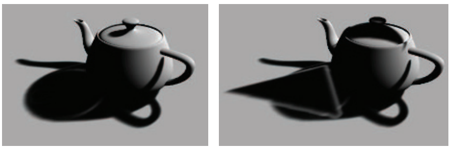

由于能够使用滤波技术来快速生成平滑的阴影，因此滤波阴影映射（filtered shadow mapping）引起了人们的强烈兴趣，该技术最主要的挑战就是解决各种漏光问题。Annen等人\[55]提出了卷积阴影贴图（convolution shadow map），它对Soler和Sillion平面阴影算法\[1673]背后的思想进行了扩展，其核心思路是在傅里叶展开中，对阴影深度进行编码。与VSM算法一样，这种贴图也可以被过滤，这个方法最终会收敛到正确的阴影效果，从而减少了漏光问题。

卷积阴影映射的一个缺点是，它需要对若干项进行计算和访问，这大大增加了计算成本和存储成本\[56, 117]。Salvi \[1529, 1530]和Annen等人\[56]同时并独立地提出了基于指数函数来使用单个项的想法，这种方法被称为指数阴影贴图（exponential shadow map，ESM），这种方法会将深度值的指数，及其二阶矩存储到两个缓冲区中。指数函数更接近于阴影贴图测试时的阶跃函数（即在光照中或者不在光照中），因此它可以显著降低漏光瑕疵。同时，它避免了卷积阴影映射中另一个被称为ringing的问题，即在刚刚超过原始遮挡物深度时，可能会发生轻微的光线泄漏，从而导致环状漏光。

存储指数会由一个限制，就是其二阶矩的数值可能会非常大，有可能会超出浮点数的范围。为了提高精度，并让指数函数下降得更快，可以生成z-depth，因为这个深度值是线性的\[117, 258]。

与VSM相比，指数阴影映射（ESM）的质量有所提高；并且与卷积阴影贴图相比，它所占用的存储空间更低，性能更好，因此在这三种滤波方法中，指数阴影映射方法引起了人们的最大兴趣。Pettineo \[1405]提出了一些其他方面的改进方法，例如使用MSAA来改善结果，并让其具备一些有限的透明度能力等，他还描述了如何使用计算着色器来提高过滤的性能。

Peters和Klein \[1398]最近提出了矩阴影映射（moment shadow mapping）。它可以提供更好的阴影质量，代价是使用了四个或者更多数量的矩，增加了存储成本。可以通过使用16 bit整数来存储这些矩，从而降低开销。Pettineo \[1404]实现了这种新方法，并将其与另一种方法指数方差阴影贴图（exponential variance shadow map，EVSM）进行了比较，他还提供了一个包含多种变体的代码库。

级联阴影贴图技术也可以应用于滤波贴图，从而提高精度\[989]。与标准的级联阴影贴图相比，级联ESM的一个优点在于，可以为所有级联设置相同的偏移因子\[1405]。Chen和Tatarchuk \[258]详细介绍了级联ESM会遇到的各种漏光问题和其他瑕疵，并提出了一些解决方案。

滤波贴图可以被认为是一种廉价形式的PCF，它只需要很少的样本；与PCF一样，这样产生的阴影具有恒定的半影宽度。这些滤波方法还可以与PCSS一起使用，从而提供可变宽度的半影效果\[57, 1620, 1943]。一种对矩阴影映射的扩展方法，还可以提供光线散射和透明等效果\[1399]。

## 7.8 体积阴影技术

透明物体会衰减并改变光线的颜色。对于某些类型透明物体，可以使用类似于章节5.5中所讨论的技术来模拟这种效果。例如：在某些情况下可以生成第二种类型的阴影贴图，将透明物体渲染到这个阴影贴图中，并且存储最近的深度值，以及颜色或者alpha覆盖率。如果一个接收物没有被不透明阴影贴图所遮挡的话，则进一步将其与透明的阴影贴图进行测试，如果这个物体被透明阴影贴图所遮挡的话，则根据需要来检索贴图中对应位置的颜色或者覆盖率\[471, 1678, 1679]。这个想法让人想起章节7.2中的阴影投影和光源投影，存储下来的深度值会避免在透明物体与光源之间的接收物上进行投影。但是这种技术无法用于透明物体本身的渲染。

自阴影问题对于头发、云等物体的真实感渲染而言至关重要，因为这些物体要么是很小的，要么是半透明的，单一深度的阴影贴图无法用于处理这些情况。Lokovic和Veach \[1066]首先提出了深度阴影贴图（deep shadow map）的概念，其中阴影贴图的每个纹素，都存储了光线随着深度的增加，如何进行衰减的函数。这个函数通常会由不同深度的一系列样本来近似，其中每个样本都有一个不透明度值。对于给定位置的深度，会使用阴影贴图中的两个样本（一个深度大于该位置，一个深度小于该位置）来计算阴影的效果。而GPU所面临的挑战是，如何高效地生成和计算这些函数。与一些顺序无关的透明算法相同（章节5.5），这些算法使用了类似的方法，并且也会遇到类似的挑战，例如：如何使用一些紧凑的数据存储形式，来准确表示每个函数。

Kim和Neumann \[894]首先提出了一种基于GPU的方法，他们称之为不透明度阴影贴图（opacity shadow map），在一组固定的深度值中生成仅存储不透明度的贴图。Nguyen和Donnelly \[1274]给出了一种这种方法的改进版本，生成了如图17.2所示的图像。然而，由于深度切片是平行且均匀的，因此需要使用大量的切片，来隐藏因线性插值而产生的不透明度瑕疵。Yuksel和Keyser \[1953]通过创建更加贴合模型形状的不透明度图，来提高效率和质量；这样做可以减少所需的深度切片层数，因为这种方法中的每一层都更具代表性，对于最终图像的计算更加重要。

为了避免使用固定的切片设置，人们提出了一系列的自适应技术。Salvi等人\[1531]提出了自适应体积阴影贴图（adaptive volumetric shadow map），其中阴影贴图的每个纹素，都存储了不透明度和切片深度。使用像素着色器的一些操作来对光栅化后数据流（例如表面不透明度）进行有损压缩，这样可以避免需要大量内存来收集所有样本，并能够在一个集合中对它们进行处理。该技术类似于深度阴影贴图\[1066]，但是压缩步骤是在像素着色器中动态完成的。将函数表示限制为一个较小的、固定数量的不透明度-深度值对，可以使得GPU上的压缩操作和检索操作效率更高\[1531]。这样做的成本要比简单的混合高，因为曲线需要进行读取、更新和回写，而且它还取决于用来表示曲线的控制点数量。在这种情况下，该技术还需要硬件支持UAV和ROV功能（详见章节3.8末尾）。图7.29展示了使用这种技术的一个例子。

![图7.29：使用自适应体积阴影贴图来渲染的头发和烟雾阴影。 \[1531\]](images/Chapter-7/202306121618565.png "图7.29：使用自适应体积阴影贴图来渲染的头发和烟雾阴影。 \[1531]")

在游戏《GRID2》中，使用了自适应体积阴影映射方法，来渲染逼真的烟雾，其平均成本在每帧2毫秒以内\[886]。Furst等人\[509]对他们为电子游戏实现的深度阴影贴图技术进行了描述，并提供了实现代码，他们使用链表来存储深值度和alpha值，并使用指数阴影映射，来生成光照区域和阴影区域之间的柔和过度。

对阴影算法的探索仍在继续，将各种算法和技术综合在一起使用变得越来越普遍。例如：Selgrad等人\[509]研究了如何使用链表来存储多个透明样本，并使用分散写入的计算着色器来生成贴图。他们将深度阴影贴图、滤波贴图以及其他一些技术元素结合在一起，为高质量的软阴影效果提供了一个更加通用的解决方案。

## 7.9 不规则z-buffer

之所以各种各样的阴影贴图方法那么流行，有以下几个原因。第一，这类算法的成本是可预测的，并且随着场景大小的不断增加，它们的成本也不会发生暴涨，最坏的情况就是与图元数量成线性相关。第二，这类算法可以很好地被映射到GPU上，因为它们依赖于光栅化来对光源的观察视野进行规则采样。然而正是因为这种离散采样，问题就出现了，因为相机所看到的位置与光源所看到的位置并不是一一对应的。当光源对表面的采样频率低于相机的采样频率时，就会出现各种锯齿问题。即使二者的采样率比较合适，也会存在偏移问题，因为光源对表面的采样位置，与相机所看到的位置略有不同。

阴影体（shadow volume）算法提供了一个精确的、解析的解决方案，光源与表面的相互作用会生成一组三角形，对于任何的给定位置，它都可以判断该位置被光源照亮，还是位于阴影区域中。当在GPU上实现该算法时，它有一个严重的缺点，那就是不可预测的、不稳定的计算成本。近年来对这类算法的探索和改进\[1648]是相当诱人的，但是到目前为止，它还没有在任何商业应用中进行使用。

从长远来看，另一种阴影测试的方法十分具有潜力：光线追踪。它的基本思想很简单，尤其是对于阴影效果而言，我们将在章节11.2.2中对其进行详细介绍。我们会从阴影接收物的表面位置出发，向光源发射一条射线，如果有物体阻挡了光线，则说明该表面位置位于阴影中。许多光线追踪渲染器的大部分代码，都在构建和使用分层的加速结构，从而最小化每条光线所需测试的物体数量。在动态场景中逐帧构建并更新这些加速结构，是一个在几十年前就被提出的话题，同时它现在也是一个持续研究的领域。

另一种方法是使用GPU的光栅化硬件来观察场景，除了存储$z$深度之外，还会存储每个网格单元中，光源遮挡物的额外边缘信息\[1003, 1607]。例如：假设在阴影贴图的每个纹素上，都存储一个与网格单元重叠的三角形列表，这样的三角形列表可以通过保守光栅化（conservative rasterization）来生成，在保守光栅化中，如果三角形的任何部分与像素发生重叠（而不仅仅是与像素中心重叠，详见章节23.1.2），就会生成一个片元。这种方案的一个问题是，通常需要对每个纹素所存储的数据量进行限制，这反过来又可能会导致对每个接收物表面位置状态判定的不准确。考虑到GPU的现代链表原理\[1943]，在每个像素上存储更多的数据当然是可能的。然而，除了物理内存的限制之外，在每个纹素列表中存储可变大小的数据，会导致GPU的并行处理变得十分低效，因为一个warp中可能只有几个片元线程需要进行检索和计算，而其余的片元线程都处于空闲状态，没有任何任务可以执行。在构造着色器的时候，避免由于动态“if”语句和循环而导致的线程发散，对于性能而言至关重要。

上述的方法都是在阴影贴图中存储三角形或者其他数据，然后再利用这些数据来检测接收物的位置，还有一种选择是将问题反转过来，即我们在阴影贴图中存储接收物的位置，然后再用三角形对其进行检测。这种将接收物位置存储下来的想法，首先由Johnson等人\[839]、Aila和Laine \[14]提出，它被称为不规则z-buffer（irregular z-buffer，IZB）。这个名字实际上有些误导人，因为这个缓冲本身是一个正常的、规则形状的阴影贴图。相反，缓冲区中所包含的内容是不规则的，因为阴影贴图中的每个纹素，将会存储一个或者多个接收物的位置，又或者是根本没有存储任何数据，如图7.30所示。

![图7.30：不规则z-buffer。左上角：相机视野在像素中心处生成了一组点，图中展示了两个三角形所形成的一个立方体面。右上角：从光源视角生成了这些点。左下角：在这些点上覆盖了一个阴影贴图网格，对于每个纹素而言，会根据其网格单元内的所有点来生成一个列表。右下角：通过使用保守光栅化，来对红色三角形进行阴影测试，与其发生重叠的每个纹素被显示为浅红色，这些纹素列表中的所有点，都会和三角形进行测试，从而计算光照的可见性。 \[14\]](images/Chapter-7/202306121721496.png "图7.30：不规则z-buffer。左上角：相机视野在像素中心处生成了一组点，图中展示了两个三角形所形成的一个立方体面。右上角：从光源视角生成了这些点。左下角：在这些点上覆盖了一个阴影贴图网格，对于每个纹素而言，会根据其网格单元内的所有点来生成一个列表。右下角：通过使用保守光栅化，来对红色三角形进行阴影测试，与其发生重叠的每个纹素被显示为浅红色，这些纹素列表中的所有点，都会和三角形进行测试，从而计算光照的可见性。 \[14]")

使用Sintorn等人\[1645]和Wyman等人\[1645]所提出的方法，使用一个多pass的算法来创建IZB，并对其内容在光源下的可见性进行测试。首先，会从相机视角来对场景进行渲染，从而找到可见表面的$z$深度。这些表面点会被转换到光源的视角下，并根据它们来生成光源的视锥体，使得这个视锥体紧密包裹这些点。然后将这些点存储在光源的IZB中，即每个点都会被放入对应纹素的列表中。需要注意的是，有些列表可能是空的，因为光源所看到的空间和物体表面，相机并不一定会看到。最后使用保守光栅化，来将遮挡物渲染到光源的IZB中，从而判断是否有任何点会被遮挡，被遮挡的点位于阴影中。这里使用了保守光栅化，它能够确保即使一个三角形并没有覆盖到纹素的中心，但是这个纹素中所包含的点也会用于对光源的可见性进行测试。

这个可见性测试会在像素着色器中进行。测试本身可以看作是光线追踪的一种形式，它会从图像点的位置处，向光源发射一条光线。如果这个光线与三角形平面的交点位于这个三角形内部，并且这个待测点的位置距离光源更远，那么就说明它会被遮挡。当所有的遮挡物都被光栅化之后，光源的可见性结果将会被用于表面着色。这个测试过程也被称为截锥体追踪（frustum tracing），因为这个三角形可以被认为是定义了一个截锥体，它会对位于截锥体内部的点进行检查。

想要使得这种方法在GPU上很好地运行，需要格外仔细地编写代码。Wyman等人\[1930, 1932]指出，他们最终版本的代码，要比最初的原型快了两个数量级。这种性能提升的部分原因是对算法的直接改进，例如：剔除表面法线背对光源的图像点（因为它们永远不会被这个光源照亮）；同时避免为空纹素生成片元。其他的一些性能提升，来自对GPU数据结构的改进，以及在每个纹素中使用较短的、长度相似的点列表，来最小化线程发散所带来的效率降低。为了便于说明算法原理，图7.30展示了一个较低分辨率的阴影贴图，其中有一些纹素具有很长的点列表，而最理想的情况是，每个列表中仅包含一个图像点。使用更高分辨率的阴影贴图可以生成较短的列表，但是这也增加了用于遮挡物测试的片元数量。

从图7.30的左下角可以看出，由于透视效应，左侧地面上可见点的密度要明显高于右侧。使用级联阴影贴图有助于降低这些区域的列表长度，这主要是通过在更靠近相机的区域，使用较高分辨率的阴影贴图来实现的。

这种方法避免了其他方法会有的采样问题和偏移问题，并且可以提供完美的尖锐阴影。出于审美和感知的原因，通常我们都更希望实现软阴影的效果，但是这可能会与附近的遮挡物产生偏移问题，例如Peter Panning。Story和Wyman \[1711, 1712]对混合的阴影技术进行了探索，其核心思想是利用遮挡物的距离，来对IZB和PCSS所产生的阴影进行混合，当遮挡物距离较近时，则使用硬阴影；当遮挡物距离较远时，则使用软阴影，如图7.31所示。阴影质量对于附近物体而言通常是最重要的，因此，可以通过仅在选定的物体子集上使用这个技术，来降低IZB的成本。这种方法已经成功地应用在了电子游戏中，本章节最开始的地方，就展示了这种技术渲染的结果，如图7.2所示。

![图7.31：左图：PCF会为所有物体都生成均匀的软阴影。中间：PCSS会根据与遮挡物的距离，来对阴影进行软化，但是与板条箱左下角重叠的树枝阴影，会产生一些瑕疵。右图：将来自IZB的尖锐阴影与来自PCSS的柔和阴影进行混合，给出了一个改进的结果。 \[1711\]](images/Chapter-7/202306121817335.png "图7.31：左图：PCF会为所有物体都生成均匀的软阴影。中间：PCSS会根据与遮挡物的距离，来对阴影进行软化，但是与板条箱左下角重叠的树枝阴影，会产生一些瑕疵。右图：将来自IZB的尖锐阴影与来自PCSS的柔和阴影进行混合，给出了一个改进的结果。 \[1711]")

## 7.10 其他应用

将阴影贴图视为空间体积的一种定义来区分明暗，也有助于确定物体的哪些部分位于阴影区域中。Gollent \[555]介绍了CD Projekt的地形阴影系统，是如何计算每个区域被遮挡的最大高度的，这个最大高度信息不仅可以用于生成地形阴影，还可以用来对树木和场景中的其他元素进行阴影处理。为了找到每个区域的最大遮挡高度，会从太阳的视角来生成可见区域的阴影贴图，然后会在每个地形高度场的位置上，检查对太阳上的能见度。如果某个高度位于阴影中，那么会在这个高度的基础上，增加一个固定的步长，继续对可见性进行检查，直到太阳进入视野中，然后再使用二分搜索来找到准确的最大遮挡高度。换句话说，我们会沿着一条垂直于地面的线前进，通过迭代来找到这个垂线与阴影贴图表面相交的位置，这里我们将阴影贴图看作是一个高度场表面，该表面会将光照区域和阴影区域分开。相邻位置的高度会通过插值生成，以便能够在任何位置上找到这个遮挡高度。图7.32展示了一个使用这种技术来生成地形高度场的软阴影的例子。我们将在第14章中看到更多光线步进穿越明暗区域的用法。

![图7.32：每个高度场位置都会计算第一次看见太阳时的高度，然后使用这个高度信息来渲染地形的阴影。请注意阴影边缘的树木，是如何被正确渲染出阴影的。 \[555\]](images/Chapter-7/202306121918382.png "图7.32：每个高度场位置都会计算第一次看见太阳时的高度，然后使用这个高度信息来渲染地形的阴影。请注意阴影边缘的树木，是如何被正确渲染出阴影的。 \[555]")

最后一个值得一提的方法是渲染屏幕空间阴影（screen-space shadow）。由于分辨率的限制，阴影贴图通常无法在较小的几何形状上产生准确的遮挡。尤其是在渲染人脸的时候，因为我们会特别容易注意到人脸上的任何视觉瑕疵，例如：由于错误的遮挡关系，可能会导致鼻孔内部被照亮，这看起来会非常不和谐。当然我们也可以使用更高分辨率的阴影贴图，或者针对感兴趣区域使用单独的阴影贴图，这样做都缓解这个问题，但是还可以换一个思路，使用已经存在的数据结果来生成阴影。在大多数现代渲染引擎中，来自相机视角的深度缓冲，会在较早的pass中生成，它在后续的渲染阶段中都是可以使用的。存储在深度缓冲的数据可以被视为一个场景高度场。通过对这个深度缓冲的迭代采样，我们可以执行一个光线步进的过程（详见章节6.8.1），并检查到光源的方向是否会被遮挡。由于这个过程涉及到对深度缓冲的重复采样，因此其计算成本很高，但是这样做可以为过场动画中的特写镜头提供高质量的渲染结果，因此在这方面额外花费几毫秒通常也是合理的。这种方法由Sousa等人\[1678]提出，并且在今天的许多游戏引擎中被广泛使用\[384, 1802]。

这里我们对本章节中的内容进行简要总结，其中阴影映射算法是目前为止最为常用的，它可以将阴影投射到任意表面上。当阴影投射在一个较大的区域时（例如室外场景），使用级联阴影贴图（CSM）可以提高采样质量。通过SDSM算法，来为近裁剪平面找到一个合适的最大距离，可以进一步提高精度。PCF可以在一定程度上软化阴影；PCSS及其变体方法，可以赋予阴影接触硬化的特点，即让shadow caster在接触处的阴影变得尖锐；而IZB可以提供精确的硬阴影效果。滤波阴影贴图可以快速计算的软阴影效果，并且当遮挡物距离接收物较远时（例如地形），它的效果特别好。最后，屏幕空间中的相关技术可以提高精度，但是其计算成本较高。

在本章节中，我们重点介绍了当前应用程序所使用的关键概念和关键技术。每种方法都有自己的优势，具体选择使用哪种方法，取决于场景的尺度大小、物体类型（静态物体还是动态物体）、材质类型（不透明、透明、头发或者烟雾）、光源的数量和光源的类型（静态光源还是动态光源；局部光源还是方向光；点光源、聚光灯还是面光源），以及诸如底层纹理如何隐藏瑕疵和锯齿等因素。随着GPU能力的不断发展和提高，因此我们期望在未来几年里，能够看到与硬件相匹配的新算法出现。例如：章节19.10.1中所描述的稀疏纹理技术，已经应用在了阴影贴图的存储方面，它可以提高阴影贴图的分辨率\[241, 625, 1253]。Sintorn，Kampe和其他人\[850, 1647]使用了一种创造性的方法，来将二维阴影贴图转换为三维体素集合（有关体素的内容详见章节13.10）。使用体素的一个优点是，每个体素都可以被划分为光照状态或者阴影状态，因此需要最少的存储空间。一个高度压缩的稀疏体素八叉树表示，可以为大量的光源和静态遮挡物存储阴影信息。Scandolo等人\[1546]将他们的压缩技术与基于双重阴影贴图的区间方案相结合，从而获得更高的压缩比。Kasyan \[865]使用了体素锥形追踪（详见章节13.10），来从面光源中生成软阴影，图7.33展示了这样的一个例子。图13.33展示了更多锥形追踪阴影的效果。

![图7.33：第一行图片是使用基本的软阴影近似技术生成的。第二行图片展示了基于体素的面光源阴影效果，它是在一个体素化的场景中，使用锥形追踪来生成的。请注意观察两幅图片中汽车的漫反射阴影。第二行图片中的光照效果还可以随着一天中时间的变化而变化。 \[865\]](images/Chapter-7/202306121955358.png "图7.33：第一行图片是使用基本的软阴影近似技术生成的。第二行图片展示了基于体素的面光源阴影效果，它是在一个体素化的场景中，使用锥形追踪来生成的。请注意观察两幅图片中汽车的漫反射阴影。第二行图片中的光照效果还可以随着一天中时间的变化而变化。 \[865]")

## 补充阅读和资源

本章节中所介绍的算法，都基于了这样一个原则，即阴影算法需要具有什么样的特点才能用于交互式渲染中，答案是：可预测的、稳定的质量和性能。我们尽可能避免在渲染的这一子领域中，对所做的研究进行详尽分类和详尽介绍，因为已经有两本优秀的书籍关注了这个主题。Eisemann等人\[412]的《Real-Time Shadows》一书，关注了在交互式渲染中所使用的阴影算法，它对各种算法及其优势和成本进行了讨论。SIGGRAPH 2012的一个课程提供了本书的摘录，同时引用了一些较新的工作和算法\[413]。他们在SIGGRAPH 2013课程中的演讲，可以在他们的网站[www.realtimeshadows.com](www.realtimeshadows.com "www.realtimeshadows.com")中找到。Woo和Poulin的书《Shadow Algorithms Data Miner》\[1902]对交互式渲染和批量渲染中所用到的各种阴影算法进行了综述。这两本书都提供了相应的参考文献，包含了该领域中的数百篇研究论文。

Tuft的两篇文章\[1791, 1792]对常用的阴影映射技术，以及其中涉及的相关问题进行了很好的综述。Bjørge \[154]提出了一系列适用于移动设备的流行阴影算法，并对各种算法生成的图像进行了对比。Lilley的演讲\[1046]对实用阴影算法进行了坚实且广泛的综述，其关注的重点是地理信息系统（GIS）中的地形渲染。Pettineo \[1403, 1404]和Castano \[235]的博客文章中，包含了大量的实用技巧和解决方案，以及一个demo代码库，因此特别具有使用价值。Scherzer等人\[1558]针对硬阴影的工作进行了简短总结。Hasenfratz等人\[675]对软阴影算法进行了调研，虽然这个调研如今已经过时了，但是它在一定程度上，涵盖了大量软阴影算法的早期工作。
