# Chapter 8 Light and Color 光与颜色

## 目录

-   [8.1 光量](#81-光量)
    -   [8.1.1 辐射度量学](#811-辐射度量学)
    -   [8.1.2 光度学](#812-光度学)
    -   [8.1.3 色度学](#813-色度学)
    -   [8.1.4 使用RGB颜色进行渲染](#814-使用RGB颜色进行渲染)
-   [8.2 从场景到屏幕](#82-从场景到屏幕)
    -   [8.2.1 HDR显示编码](#821-HDR显示编码)
    -   [8.2.2 色调映射](#822-色调映射)
        -   [色调再现变换](#色调再现变换)
        -   [曝光](#曝光)
    -   [8.2.3 颜色分级](#823-颜色分级)
    -   [补充阅读和资源](#补充阅读和资源)

> John Keats——“Unweave a rainbow, as it erewhile made. The tender-person’d Lamia melt into a shade.”

> 约翰·济慈——“如刚才拆解彩虹那般，让光鲜娇嫩的Lamia 黯然失色。”（19世纪初期英国浪漫派诗人；1795—1821）

在前几章中我们所讨论的许多RGB颜色值，都代表了光线的强度和着色。而在本章节中，我们将学习由这些值所度量的各种物理光量，为后续章节从一个更加物理的角度来讨论渲染，打下坚实的基础。我们还将了解更多有关渲染过程中经常被忽视一部分内容，即：将表示场景线性光量的颜色，转换为最终要进行显示的颜色。

## 8.1 光量

任何基于物理的渲染方法，其第一步都是以一种精确的方式，来对光进行量化（quantify）。在本小节中，我们首先会介绍辐射度量学（radiometry），因为它与光线的物理传输过程紧密相关。然后我们紧接着会讨论光度学（photometry），它会根据人眼的灵敏度，对光线值进行加权。我们对颜色的感知，实际上是一种心理物理学（psychophysical）现象，即对物理刺激的心理感知。有关颜色感知的内容将在色度学（colorimetry）一节中进行讨论。最后，我们会讨论使用RGB颜色值来进行渲染的有效性。

### 8.1.1 辐射度量学

辐射度量学（radiometry）研究的是对电磁辐射（electromagnetic radiation）的测量，这种辐射会以波的形式进行传播，我们将在章节9.1中进行更加详细地讨论。具有不同波长的电磁波，往往会具有不同的特性。波长是指两个具有相同相位的相邻点之间的距离，例如两个相邻峰值之间的距离。在自然界中，电磁波的波长范围很广，既有长度不到百分之一纳米的伽马波，也有到长达数万公里的极低频（extreme low frequency，ELF）无线电波。人眼所能看到的电磁波，实际上只占据这个范围中的很一小部分，从大约从400纳米的紫光延伸到700多纳米的红光，如图8.1所示。

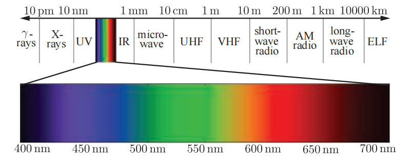

各个辐射量（radiometric quantity）的存在是为了对电磁辐射的各个方面进行测量和度量，例如：总能量、功率（随时间变化的能量）以及相对于面积、方向或者二者的功率密度等，表8.1对这些物理量进行了总结。

在辐射度量学中，最基本的单位是辐射通量（radiant flux）$Φ$，辐射通量是指辐射能量随时间的流动变化，又叫做功率（power），其单位为瓦特(watts，W)。

> （译者注：在后文中，irradiance和radiance都不会进行翻译，中文翻译容易混淆）

辐照度（irradiance）是辐射通量相对于面积的密度，即$d \Phi / d A$。irradiance是相对于一个面积来进行定义的，这个面积可能是空间中的一个假想区域，但是在渲染中一般都是物体的表面。irradiance的单位是瓦特每平方米（$W/m^2$）。

在我们讨论下一个物理量之前，我们首先需要介绍一下立体角（solid angle）的概念，它是对二维角度概念的三维扩展。角度可以被认为是对平面上连续方向集合大小的度量，其弧度值等于这组方向与半径为1的封闭圆相交，所产生圆弧的长度。类似地，立体角是三维空间中连续方向集合大小的度量，其单位为立体弧度（steradians，缩写为sr），它由这组方向与半径为1的封闭球体相交，所产生面片的面积进行定义的\[544]。立体角使用符号$ω$表示。

在二维空间中，弧度值为$2π$的角度（$360^{\circ}$）可以覆盖整个单位圆。将其扩展到三维空间中，立体弧度值为$4π$的立体角，将会覆盖整个单位球体的面积。图8.2展示了一个立体弧度为1的立体角。

现在我们可以引入辐射强度（radiant intensity）$I$，即辐射通量相对于方向的密度，更准确地说，是相对于立体角的密度（$(d \Phi / d \omega)$）。它的单位是瓦特每立体弧度（$W/sr$）。

最后，辐射度（radiance）$L$是对单条光线中电磁辐射的度量。更精确地说，它是辐射通量相对于面积和立体角的密度（$d^{2} \Phi / d A d \omega$）。这里的面积位于垂直于光线的平面上，如果想要在其他方向上对表面施加辐射，则必须使用余弦因子进行校正。我们可能还会遇到一些其他对于radiance的定义，它们使用了术语“投影面积”来代表这个校正因子。

radiance是传感器（例如眼睛或者相机）所直接测量的对象（更多细节详见章节9.2），因此它对渲染而言至关重要。计算着色方程的目的就是沿着给定的光线，计算从着色点到相机的radiance；沿着这条光线计算出来的结果$L$，与第5章中的$\mathbf{c}_{\text {shaded}}$在物理上是等价的。radiance的公制单位是瓦特每平方米每立体弧度（$W/m^2sr$）。

环境中的radiance可以被认为是五个变量（或者六个变量，将波长考虑在内）的函数，它被称为辐射分布（radiance distribution）\[400]；其中有三个变量指定了位置，另外两个变量指定了方向，这个分布函数描述了在空间中任何地方传播的任何光线。根据上面的描述，我们可以这样来理解渲染过程：将眼睛和屏幕定义为一个点和一组方向（例如从眼睛出发，穿过每个像素的光线），然后使用这个函数，在这组方向上对眼睛所在的位置进行评估。章节13.4中所讨论的基于图像的渲染，使用了一个与之相关的概念，被称为光场（light field）。

在着色方程中，radiance通常会以$L_{o}(\mathbf{x}, \mathbf{d})$或者$L_{i}(\mathbf{x}, \mathbf{d})$的形式出现，它代表了从点$x$发出，或者进入点$x$的radiance具体是多少。方向向量$\mathbf{d}$表示了光线的方向，按照惯例，它总是会指向远离着色点$x$的方向。虽然这种惯例在$L_i$的情况下，可能有点令人困惑，因为此时光线方向$\mathbf{d}$与光线实际的传播方向相反，之所以这样进行设计，是因为它对点乘之类的运算十分方便。

radiance的一个重要特性是，在忽略了雾等大气效应影响的前提下，radiance不会受到传播距离的影响。换句话说，无论一个表面与相机的距离有多远，它们都将具有相同的radiance。当距离相机越远时，这个表面所覆盖的像素就越少，但是来自表面上每个像素的radiance是恒定的。

大多数光波中都包含了许多不同波长的单色光，这通常可以被可视化为一个光谱功率分布（spectral power distribution，SPD），它是一个展示了光线能量如何在不同波长之间分布的图片，图8.3给出了三个SPD的例子。值得注意的是，尽管图8.3第二行和第三行所展示SPD具有很大的差异，但是它们被人眼所感知到的颜色是相同的。很显然，人眼是一种精度很差的光谱分析仪。我们将在章节8.1.3中详细讨论有关颜色视觉的内容。

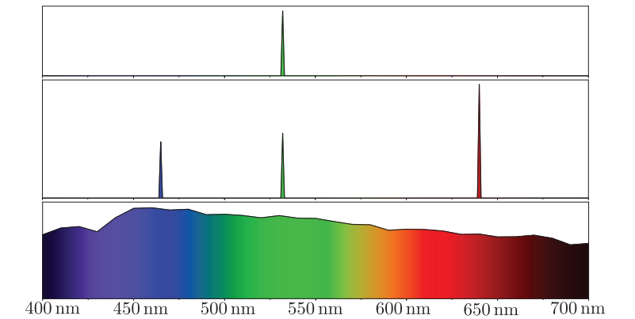

之前我们介绍的所有辐射量都具有光谱分布。由于这些分布是波长上的能量密度，因此它们的单位是各个辐射量原始单位再除以纳米。例如：irradiance光谱分布的单位是瓦特每平方米每纳米（$W/m^2ns$）。

完整的SPD对于渲染而言十分笨重，尤其是在交互式速率下；因此在实际应用中，这些辐射量会使用RGB三元组来进行表示。在章节8.1.3中，我们将会解释这些三元组与光谱分布之间的关系。

### 8.1.2 光度学

辐射度量学仅仅对物理量进行了研究，它完全没有考虑人眼的感知。与此相关的一个领域被称为光度学（photometry），它与辐射度量学类似，不同之处在于，它会根据人眼的敏感度，对辐射度量学中的一切事物进行加权处理。通过乘以CIE光度曲线（CIE photometric curve），辐射度量学中的计算结果可以被转换为相应的光度单位。CIE光度曲线是一条以555纳米为中心的钟形曲线，它代表了人眼对各种波长光线的响应程度\[76, 544]，如图8.4所示。

> 更加完整、准确的名称应当是“CIE感光光谱照明效率曲线”（CIE photopic spectral luminous efficiency curve）。其中“phototopic”一词指的是每平方米亮度超过3.4坎德拉的照明条件，在这种照明条件下，人眼的视锥细胞（cone cell）会活跃起来。有一个与之对应的“scotopic”CIE曲线，其中心在507纳米左右，这是当人眼适应黑暗（低于0.034坎德拉每平方米）之后对应的情况，即没有月亮的夜晚或者更暗的照明条件，在这种照明条件下，人眼的视杆细胞（rod cell）会活跃起来。

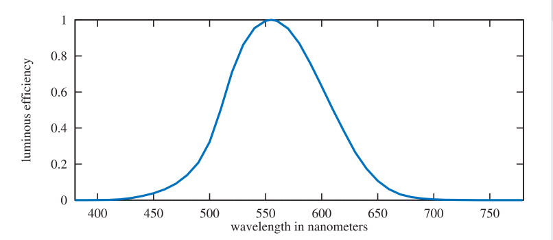

这个转换曲线与测量单位，是光度学理论和辐射度量学理论之间的唯一区别。每个辐射物理量都有一个对应的光度学物理量，表8.2给出了它们的名称和单位。这些光度学物理量的单位都有预期的对应关系（例如：lux的单位是lumen每平方米）。虽然逻辑上来讲，lumen（流明）应该是个基本单位，但是在历史上，candela（坎德拉）则被定义为基本单位，而其他单位都是从坎德拉中派生出来的。在北美，照明设计师仍然会使用已被废弃的英制测量单位，而不是使用lux（勒克斯），这个英制单位叫做英尺烛光（foot-candle，fc）。无论哪种情况，大多数测光仪都会对illuminance进行测量，这个单位在照明工程（illumination engineering）中十分重要。

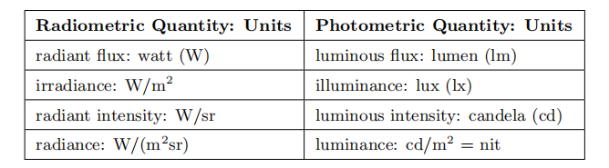

Luminance通常用来描述平面的亮度。例如：高动态范围（high dynamic range，HDR）电视屏幕的峰值亮度通常在500到1000尼特（nit）之间。相比之下，晴朗天空的亮度大约为8000尼特，60瓦的电灯泡约为12万尼特，地平线上的太阳约为60万尼特\[1413]。

### 8.1.3 色度学

在章节8.1.1中我们已经看到，人眼对于颜色的感知与光线的SPD（光谱功率分布）密切相关。同时我们还知道了，二者之间并不是简单的一一对应关系。图8.3第二行和第三行所展示的SPD完全不同，但给人的感知却是完全相同的。色度学（colorimetry）研究的就是SPD和颜色感知之间的关系。

人眼可以分辨大约1000万种不同的颜色。对于颜色感知，人眼的视网膜上有着三种不同类型的视锥感受器（细胞），每种感受器对于不同波长的光线都有不同的反应。其他动物的眼睛则有着不同数量的颜色感受器，有些动物的眼睛甚至多达15个\[260]。因此，对于一个给定的SPD，我们的大脑只会从这些感受器中接收到三种不同的信号，这就是为什么只用三个数字就可以精确地表示任何颜色的原因\[1707]。

但是具体使用哪三个数字来表示一个特定的颜色呢？CIE（Commission Internationale d'Eclairag）提出了一套测量颜色的标准条件，并根据这些标准条件进行了配色实验（color-matching）。在配色实验中，将三种颜色的光源投射在一个白色的屏幕上，并使它们的颜色叠加在一起，形成一个色块。一个用于匹配的待测颜色会投影在这个色块旁边，这个待测颜色是只有一个波长的单色光（激光）。然后观察者可以使用校准到$[- 1,1]$加权范围内的旋钮，来调整这三种颜色的灯光，直到与待测颜色相匹配为止。为了和某些特殊颜色相匹配，有时可能会需要一个负权重，这样的权重意味着，对应的光源会被添加到待测颜色的色块中。图8.5展示了三种光源（被叫做$r$、$g$和$b$）的一组测试结果，这三个光源几乎是单色的，每个光源的能量分布都狭窄地聚集在以下波长的附近：$r$为645纳米, $g$为526纳米, $b$为444纳米。将每组匹配权重与待测波长的颜色相关联的函数，被称为颜色匹配函数（color-matching function）。

![图8.5： r 、 g 和 b 的二度颜色匹配曲线，来自Stiles和Burch \[1703\] 。这些颜色匹配曲线，不能与配色实验中所使用的纯波长光源的光谱分布曲线相混淆。](images/Chapter-8/202306131833645.png "图8.5： r 、 g 和 b 的二度颜色匹配曲线，来自Stiles和Burch \[1703] 。这些颜色匹配曲线，不能与配色实验中所使用的纯波长光源的光谱分布曲线相混淆。")

这些函数可以将一个SPD转换为三个值。对于给定的单一波长的光源，可以从曲线图中读取到三种颜色光的权重，通过设置对应旋钮，调节后的叠加色块在屏幕上可以和另一个色块给人相同的颜色感知。对于任意的SPD，可以将其与颜色匹配函数相乘；每条结果曲线下的面积（即积分）便给出了三种颜色光的相对数量，然后对三种颜色的光进行调节，从而与该SPD产生的感知颜色相匹配。完全不同的SPD也可能会解析成相同的三个权重值，即这些SPD在人眼看起来是完全相同的。给出相同权重的不同SPD，被称为同色异谱（metamer）。

3个加权的$r$、$g$、$b$光源无法直接表示所有人眼可见的颜色，因为它们的颜色匹配函数在某些波长上具有负权重。CIE提出了三种不同的假想光源，这些光源的颜色匹配函数在所有可见光波长范围内都为正。这些光源的颜色匹配函数，是原始$r$、$g$和$b$颜色匹配函数的线性组合。新的颜色匹配函数要求其光源的SPD在某些波长上为负，这在物理上是不可能发生的，因此这些光源都是无法实现的数学抽象光源。它们的颜色匹配函数分别被表示为$\bar{x}(\lambda)$，$\bar{y}(\lambda)$和$\bar{z}(\lambda)$，如图8.6所示。其中颜色匹配函数$\bar{y}(\lambda)$与上文所提到的光度曲线（图8.4）相同，通过该曲线，可以将光线的radiance转换为luminance。

与前一组颜色匹配函数一样，使用$\bar{x}(\lambda)$，$\bar{y}(\lambda)$和$\bar{z}(\lambda)$，通过乘法和积分可以将任意的SPD $s(\lambda)$转换为三个数字：

$$
X=\int_{380}^{780} s(\lambda) \bar{x}(\lambda) d \lambda, \quad Y=\int_{380}^{780} s(\lambda) \bar{y}(\lambda) d \lambda, \quad Z=\int_{380}^{780} s(\lambda) \bar{z}(\lambda) d \lambda
\tag{8.1} 
$$

这些$X$、$Y$、$Z$三色值（tristimulus values）是定义在CIE XYZ空间中的权重。通常来说，将颜色划分为亮度（luminance）和色度（chromaticity）是很方便的。其中色度是与亮度无关的颜色特征，例如：两种蓝色（一种深，一种浅）可以具有相同的色度，但是它们的亮度不同。

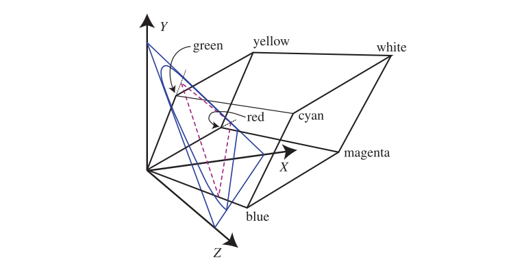

为此，CIE通过将颜色投影到平面$X+Y+Z = 1$上，从而定义了一个二维的色度空间，如图8.7所示。该色度空间中的坐标称为$x$和$y$，其计算方法如下：

$$
\begin{array}{l}x=\frac{X}{X+Y+Z}, \\[2mm]
y=\frac{Y}{X+Y+Z}, \\[2mm]
z=\frac{Z}{X+Y+Z}=1-x-y .\end{array}
\tag{8.2}  
$$

这里的$z$值并不会提供额外的信息，因此通常会被省略。使用色度坐标（chromaticity coordinate）$x$和$y$值绘制的图片，被称为CIE 1931色度图（chromaticity diagram），如图8.8所示。图中弯曲的黑色轮廓线代表了可见光谱颜色所覆盖的范围，连接光谱两端的直线称为紫色线（purple line）。图中的黑点代表了D65光源的色度，它是一种常用的白点（white point），常用于定义白色或者无色（achromatic）的色度值。

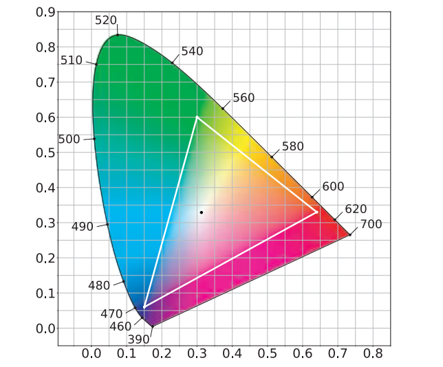

总而言之，我们从一个颜色匹配实验开始，使用三种单一波长的光源，并测量了每种光源需要多大的权重，才能与其他波长的光在视觉感知上相匹配。有些情况下可能会出现负数权重，此时这三种纯色光还必须被添加到待测光源中，才能相互匹配。这个实验给出了一组颜色匹配函数，将它们进行一定的线性组合，从而生成一个不包含负数权重的新颜色匹配函数。有了这个非负的颜色匹配函数集合，我们可以将任意SPD转换为一组定义颜色的色度和亮度的XYZ坐标值，还可以在保持亮度不变的前提下，进一步使用$xy$来描述颜色的色度值。

对于一个给定的颜色点$(x, y)$，画一条从白点穿过该颜色点的线，并与区域边界（光谱线或者紫色线）相交。该颜色点与区域边界的相对距离，代表了颜色的激发纯度（excitation purity）；而区域边界上的交点，则定义了主导该颜色的主波长（dominant wavelength）。这些色度学中的术语在图形学中很少使用，相反，我们通常会使用饱和度（saturation）和色调（hue）这两个术语，其中饱和度与颜色的激发纯度有关，色调与颜色的主波长有关，但是需要注意的是，它们之间并不是强相关的。你可以在Stone \[1706]以及其他人\[456, 789, 1934]所撰写的书中，找到有关饱和度和色调的精确定义。

色度图仅仅描述了一个平面，它仅包含了颜色的色调信息，想要完整地描述一个颜色，还需要第三个维度$Y$，即亮度luminance。这三个坐标在一起，定义了所谓的$xyY$坐标系。色度图对于理解颜色在渲染中的使用，以及理解渲染系统中的限制而言非常重要。电视或者计算机显示器会通过使用$R$、$G$、$B$颜色值来呈现颜色，每个颜色通道都会控制一个显示原色（display primary），这个原色会发出具有特定SPD的光线。三种原色都会按其各自的颜色值进行缩放，这些颜色值被叠加在一起，从而生成一个被观众所感知的单一SPD。

色度图中的三角形代表了电视或者计算机显示器中的色域，这个三角形的三个顶点分别对应了三原色，即屏幕上所能显示的、饱和度最高的红色、绿色和蓝色。色度图的一个重要属性是，可以将这些限制颜色（三原色）用直线连接起来，从而展示整个显示系统的颜色限制。这里的直线代表了通过将这三种原色进行混合，所能够显示的颜色范围。色度图中的白点代表了显示系统在$R$、$G$、$B$颜色值相等时所产生的色度。你需要时刻注意，一个显示系统的完整色域实际上是一个三维空间，而色度图只展示了这个空间在二维平面上的投影。更多信息请参阅Stone撰写的书籍\[1706]。

在图形渲染中有几个值得关注的RGB色域空间，每个空间都由$R$、$G$、$B$三原色和一个白点进行定义。为了对它们进行比较，我们将使用一种不同类型的色度图，它被称为CIE 1976 UCS （uniform chromaticity scale）色度图。它是CIELUV颜色空间的一部分，CIE将CIELUV颜色空间（以及另一个颜色空间CIELAB）作为XYZ颜色空间的替代方案\[1707]，其目的是提供更加均匀的视觉感知。在CIE XYZ颜色空间中，在视觉感知上具有相同差异的一对颜色，它们之间的距离可能会相差20倍；CIELUV在此基础上进行了改进，将这个比例降低到最多4倍。这种增强的感知均匀性，使得1976年的色度图在比较RGB空间的色域方面，要比1931年的好得多。对感知均匀色彩空间的持续研究，最近诞生了$\mathrm{IC}_{\mathrm{T}} \mathrm{C}_{\mathrm{P}}$\[364]颜色空间和$\mathrm{J}_{\mathrm{z}} \mathrm{a}_{\mathrm{z}} \mathrm{b}_{\mathrm{z}}$颜色空间\[1527]，这些颜色空间在视觉感知上，要比CIELUV颜色空间更加均匀，尤其是对于现代高亮度和高饱和度的显示器而言。然而，基于这些颜色空间的色度图还没有被广泛采纳，因此我们将在本章节中继续使用CIE 1976 UCS色度图，如图8.9所示。

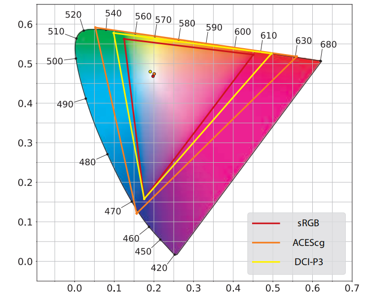

在图8.9所展示的三个RGB颜色空间中，sRGB是目前在实时渲染中最常用的。需要注意的是，在本小节中，我们所使用的“sRGB颜色空间”，指的是具有sRGB三原色和白点的线性颜色空间，而不是章节5.6中所讨论的非线性sRGB颜色编码。大多数计算机显示器都是为sRGB颜色空间所设计的，同样的三原色和白点也适用于Rec. 709颜色空间，这个颜色空间常用于高清电视显示器，因此它对主机游戏非常重要。然而，越来越多的显示器正在拥有更宽的色域，一些用于照片编辑的计算机显示器，常常会使用Adobe 1998色彩空间（未显示在图8.9中）。DCI-P3色彩空间最初是为电影制作开发的，现在也被广泛使用，从iPhone到Mac，苹果的产品线都采用了这种颜色空间，其他的设备制造商也在效仿这种做法。虽然超高清（ultra-high definition，UHD）内容和显示器，都会指定使用具有极宽色域的Rec. 2020来作为色彩空间，但是在许多情况下，DCI-P3实际上也会被用作UHD的色彩空间。Rec. 2020颜色空间并没有在图8.9中展示，但是它的色域图与第三个颜色空间ACEScg非常接近。ACEScg色彩空间是由美国电影艺术与科学学院（Academy of Motion Picture Arts and Sciences，AMPAS）开发的，它专门用于剧情片电影（feature film）的计算机图形渲染。ACEScg并不打算用作实际显示的颜色空间，而是专门用于在渲染中的工作颜色空间（working color space），在渲染完成之后，会将颜色转换到适当的显示颜色空间中。

虽然目前sRGB颜色空间在实时渲染中无处不在（ubiquitous），但是以后可能会逐渐使用具有更宽色域的颜色空间。对于那些针对高色域显示器开发的应用程序，使用更高色域的颜色空间可以增强颜色表现\[672]，但是即使是使用sRGB或者Rec. 709颜色空间的显示器，在应用程序中使用更高色域的颜色空间也能带来相当的好处。当在不同的颜色空间中执行乘法等常规渲染操作时，会得到不同的结果\[672, 1117]；有证据表明，在DCI-P3或者ACEScg等高色域颜色空间中执行这些操作，生成的结果要比在线性的sRGB颜色空间中更加准确\[660, 975, 1118]。

从RGB空间到XYZ空间的转换是线性的，可以根据RGB空间的三原色和白点生成一个矩阵\[1048]；通过矩阵求逆和相乘运算，派生出的矩阵可以从XYZ空间转换到任意的RGB空间，或者在两个不同的RGB空间之间进行转换。需要注意的是，转换后的RGB颜色值可能是一个负数，也有可能会大于1。这些颜色值是位于颜色空间色域外的颜色，换句话说，这样的颜色在目标RGB空间中是不可能出现的；当然有各种方法可以将这些颜色映射到目标RGB色域中\[785, 1241]。

一种常用的转换操作是将RGB颜色转换为灰度亮度值（grayscale luminance value），由于这个亮度值与系数$Y$实际上是相同的，因此这个操作只是将RGB颜色转换到XYZ的“Y部分”。换句话说，它是RGB系数向量与RGB-to-XYZ转换矩阵中间一行之间的点乘。对于sRGB和Rec. 709颜色空间而言，这个灰度转换方程为\[1704]：

$$
Y=0.2126 R+0.7152 G+0.0722 B
\tag{8.3} 
$$

方程8.3又让我们想起了图8.4中所展示的光度曲线（photometric curve），这个光度曲线代表了标准观察者的眼睛，对于不同波长光线的反应程度，将其与三种原色光的光谱功率分布相乘，再对相乘的结果在可见光波长范围内进行积分，最终生成的结果就是方程8.3中的三个权重值。之所以这个灰度强度值并不直接等于红、绿、蓝三原色的值，是因为人睛对于不同波长的光线具有不同的敏感程度。

色度学可以告诉我们两种颜色对于人眼的刺激程度是否匹配，但是无法预测它们表现出来的颜色外观。对于给定XYZ颜色的刺激条件，其视觉外观在很大程度上取决于照明条件、周围的颜色以及人眼之前所接受到的颜色刺激等因素。颜色外观模型（color appearance model，CAM），例如CIECAM02试图解决这些问题，并对最终的感知到的颜色外观进行预测\[456]。

颜色外观建模是更广泛的视觉感知领域中的一部分，其中还包括遮罩（masking）等效果\[468]。在这种情况下，使用高频、高对比度的图案往往可以掩盖瑕疵（flaw）。换句话说，类似波斯地毯这样的纹理，将有助于掩饰色带以及其他着色瑕疵，这也意味着我们可以花费较少的渲染精力来处理这种表面。

### 8.1.4 使用RGB颜色进行渲染

严格来说，RGB颜色值代表的是感知量，而不是真实的物理量，使用RGB颜色值来进行基于物理的渲染，在技术上来说是一个分类错误。正确的方法应当是在光谱物理量上执行所有的渲染计算，然后通过密集采样或者是投影到适当的基底上，并在最后将其转换为用于屏幕输出的RGB颜色值。

例如：渲染中最常见的操作之一，就是计算物体表面的反射光线。正如表面的光谱反射率曲线（spectral reflectance curve）所描述的那样，物体表面对于不同波长的光线，具有不同的反射率，对于某些特定波长的光线，表面对其的反射率要明显高于其他波长的光线。计算反射光线颜色的严格正确方法，应当是将入射光的SPD与各个波长的光谱反射率相乘，从而得到反射光的SPD，然后再将其转换为RGB颜色。相反，在一个RGB渲染器中，会将光线和表面的RGB颜色相乘，从而得到反射光的RGB颜色。在一般情况下，这种做法并不会给出正确的结果；为了说明这一点，我们下面将会看到一个极端的例子，如图8.10所示。

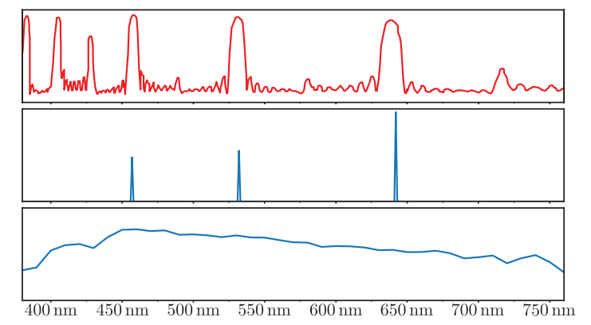

图8.10展示了一种用于激光投影仪屏幕的材料，它在激光投影仪光线波长的窄带处，具有较高的反射率，而在其他大多数波长上的反射率都较低。这使得这个屏幕表面会反射投影仪所发出的大部分光线，同时会吸收来自其他光源的大部分光线。在这种情况下，RGB渲染器将会产生严重的渲染错误。

但是好在图8.10所展示的情况只是一个极端例子，并非普遍情况。我们在实际中所遇到表面，其光谱反射率曲线要平滑得多，如图8.11所示。而现实生活中常见的光源SPD都类似于D65光源，激光投影仪的SPD只是极少数的情况。当光源的SPD与表面的光谱反射率都比较光滑的时候，RGB渲染所引入的误差相对比较小。

![图8.11：黄色香蕉的光谱反射率。 \[544\]](images/Chapter-8/202306141034547.png "图8.11：黄色香蕉的光谱反射率。 \[544]")

在预测性渲染（predictive rendering）应用程序中，这些细微的错误可能会十分重要。例如：两个光谱反射率曲线在某个光源下可能会具有相同的颜色外观，但是在另一个光源下可能会具有完全不同的颜色外观。这个问题被称为同色异谱失效（metameric failure）或者光源异色（illuminant metamerism），当使用油漆来修复汽车车身表面的时候，这可能会成为一个十分严重的问题，因为当光照条件发生变化时，经过修复的汽车表面所反射出的颜色，可能会和原始颜色不同。对于试图预测这种类型效果的应用程序而言，并不适合使用RGB来进行渲染。

然而，对于大多数渲染系统而言，尤其是那些并不是用于预测模拟的交互式应用程序而言，RGB渲染的效果得出奇的好\[169]。即使是动画电影的离线渲染中，也只是在最近才开始使用光谱渲染，而且只是少数情况，大部分离线渲染仍然使用的是RGB渲染\[660, 1610]。

本小节只介绍了一些颜色科学的基础知识，主要是想让读者意识到光谱与颜色三元组之间的关系，并简要讨论设备的局限性。我们将在下一小节中，讨论一个与之相关的话题，即场景的渲染颜色到显示颜色的转换过程。

## 8.2 从场景到屏幕

在接下来的几个章节中，我们将集中讨论基于物理的渲染问题。对于一个给定的虚拟场景，基于物理的渲染有着这样一个目标，即计算场景中可能存在的真实radiance。然而计算完成之后，渲染的工作还远未完成，我们仍然需要确定最终的结果，即显示器帧缓冲中的像素值。在本小节中，我们将讨论与此有关的一些因素。

### 8.2.1 HDR显示编码

章节5.6介绍了有关显示编码的内容，本小节的内容将建立在其基础上。之所以我们决定将高动态范围（high dynamic range，HDR）显示的内容推迟到本小节，因为想要理解这部分内容需要一定的背景知识，例如色域等概念，在本章之前，我们还没有对这些内容进行介绍和讨论。

章节5.6讨论了标准动态范围（standard dynamic range，SDR）显示器和电视机的显示编码，前者（显示器）通常会使用sRGB显示标准，后者（电视机）则会使用Rec. 709和Rec. 1886显示标准。这些标准都具有相同的RGB色域和白点（D65光源），同时具有相似（但不完全相同）的非线性显示编码曲线。它们也具有大致相似的参考白色亮度水平（sRGB为80 $\mathrm{80cd/m^2}$，Rec. 709/1886为$\mathrm{100 cd/m^2}$)。但是这些标准的亮度规格实际上并没有被显示器和电视制造商严格遵守，它们会倾向于制造更亮白色水平的显示器\[1081]。

HDR显示器通常会使用Rec. 2020和Rec. 2100标准。其中Rec. 2020定义了一个具有更宽色域的颜色空间，如图8.12所示，并且它与Rec. 709和sRGB色彩空间具有相同的白点（D65）。Rec. 2100则定义了两种非线性显示编码函数：感知量化曲线（perceptual quantizer，PQ）\[1213]和混合对数伽马曲线（hybrid log-gamma，HLG）。其中HLG编码在渲染领域中并不常用，因此我们这里将重点关注PQ，它定义了一个$\mathrm{10,000 cd/m^2}$的峰值亮度。

虽然峰值亮度（peak luminance）和色域规格（gamut specification）对于编码而言十分重要，但是对于实际的显示设备而言，它们多少有些不切实际（aspirational）。在撰写本文的时候，很少会有消费级HDR显示器的峰值亮度水平超过$\mathrm{1500 cd/m^2}$，实际的显示色域也要更加接近DCI-P3颜色空间（而不是Rec. 2020），如图8.12所示。因此，HDR显示器会在内部执行从标准规格到实际显示功能的色调映射（tone mapping）与色域映射（gamut mapping）。这个映射过程也可能会受到应用程序所传递过来的原始数据的影响，这些原始数据可能会指明实际的动态范围和色域范围\[672, 1082]。

从应用程序端来看，有3条路径可以将图像传输到HDR显示器上。但是根据实际显示器和操作系统的不同，并不是所有的三种路径都是可用的。这三种路径分别是：

1.  HDR10——被PC和主机操作系统的HDR显示器广泛支持。帧缓冲格式为每个像素32 bit，其中RGB通道各自占据10个无符号整数bit，alpha通道占据2个bit。它采用了PQ非线性编码和Rec. 2020颜色空间。每个HDR10显示模型都有各自的色调映射方案，没有被标准化或者文档化。
2.  scRGB（线性变体）——仅支持Windows操作系统。名义上，它使用sRGB三原色和白点，但是这两者都可以被超越，因为这个标准支持小于0和大于1的RGB值。其帧缓冲的格式为每个RGB通道16 bit，并存储线性的RGB值。它可以在任何的HDR10显示器上工作，因为驱动程序可以将其自动转换为HDR10。scRGB十分有用，因为它使用方便，同时向后兼容sRGB颜色空间。
3.  杜比视界（Dolby Vision）——一种专有格式，截止到本文撰写时，尚未在显示器或者任何主机上得到广泛支持。其帧缓冲使用了自定义的每通道12 bit，并使用了PQ非线性编码和Rec. 2020颜色空间。显示器内部的色调映射是标准化的（但是并没有相关文档）。

Lottes \[1083]指出，实际上还有第四种选择。如果仔细调整曝光和颜色，那么HDR显示器也可以通过常规的SDR信号路径进行驱动，并且能够取得良好的效果。

除了scRGB之外，作为显示编码步骤中的一部分，应用程序还需要将像素RGB值从渲染的工作空间中转换到Rec. 2020，这个过程需要一个$3 × 3$的矩阵变换，并且需要应用PQ编码函数，这个PQ编码函数要比Rec. 709或者sRGB的编码函数复杂一些，计算成本也要更高\[497]。Patry \[1360]给出了PQ编码函数曲线的一个廉价近似。在HDR显示器上合成用户界面（user interface，UI）元素时需要特别注意，需要确保用户界面清晰可见（legible），并且具有一个舒适的亮度水平\[672]。

### 8.2.2 色调映射

在章节5.6和章节8.2.1中，我们讨论了显示编码的话题，即将线性的radiance值，转换为用于显示设备的非线性编码值的过程。显示编码所使用的函数是显示器光电转换函数（electrical optical transfer function，EOTF）的逆函数，它确保了输入的线性值与显示器发出的线性radiance相匹配。在我们前面的讨论中，忽略了发生在渲染和显示编码之间的一个重要步骤，下面我们将对这个步骤进行介绍和讨论。

这个步骤叫做色调映射（tone mapping）或者色调再现（tone reproduction），它是指将场景的radiance转换为显示器radiance的过程。在这个步骤中所应用的转换函数称为端到端转换函数（end-to-end transfer function）或者场景到屏幕转换函数（scene-to-screen transform）。图像状态（image state）的概念是理解色调映射的关键\[1602]，有两种基本的图像状态：场景参考（scene-referred）图像是根据场景中的radiance进行定义的，显示参考（display-referred）图像是根据显示器的radiance进行定义的。图像状态与编码无关，在这两种状态下的图像，都可以进行线性编码或者非线性编码。图8.13展示了图像状态、色调映射和显示编码是如何在成像管线中进行组合的，这个成像管线用于将最初渲染生成的颜色值，转换为最终用于显示的颜色值。

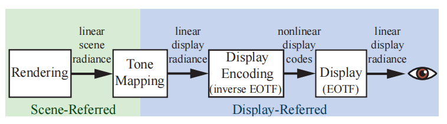

关于色调映射的目标，有几个常见的误解。首先，它不能确保从场景到屏幕的变换是一个恒等变换，不一定能够在显示器上完美再现场景的radiance。其次，它也不是要把场景高动态范围中的每一个bit信息，都“塞入”到低动态范围的显示器中，尽管考虑场景渲染和显示器之间的动态范围差异确实具有十分重要的作用。

为了更好地理解色调映射的目的，最好将其视为图像再现（image reproduction）的一个实例\[757]。图像再现的目标是创建一个显示参考图像，在给定显示属性和观看条件的情况下，尽可能地再现观看者在观察原始场景时所产生的感知印象，如图8.14所示。

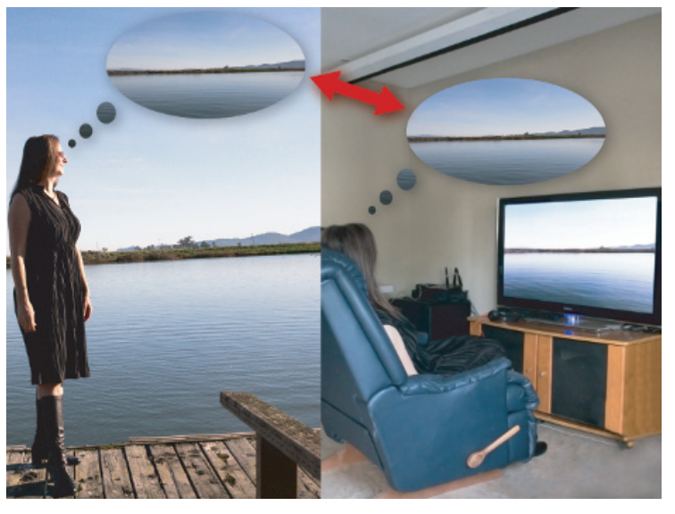

有一种类型的图像再现，具有略微不同的目标，它叫做择优图像再现（preferred image reproduction）。它旨在创建一个比原始场景看起来更好的显示参考图像，我们将在章节8.2.3中讨论这个话题。

在实际的渲染场景中，其亮度范围可能要比显示器的显示能力高出几个数量级，因此再现与原始场景相似的感知印象，是一个具有挑战性的目标。场景中一些颜色的饱和度（纯度）也可能会远远超出显示器的能力。尽管如此，正如文艺复兴时期的画家一样，摄影、电视和电影确实在设法生成令人信服的、与原始场景相似的感知印象。通过利用人类视觉系统的某些特性，是可以实现这个目标的。

人类的视觉系统会对绝对亮度的差异进行补偿，这种能力被称为适应性（adaptation）。由于这种能力的存在，因此在一个昏暗的房间里，屏幕上再现的室外场景可以产生与原始场景相似的感知体验，尽管此时再现场景的亮度（屏幕的亮度）可能还不到原始场景的1%。但是，这种适应性所提供的补偿并不是完美的，在较低的亮度水平下，人眼对于画面对比度的感知能力会有所下降（Stevens效应），所感知到的“色彩度”也会下降（Hunt效应）。

还有其他一些因素会影响再现图像的实际对比度或者感知对比度。显示器周围的环境（显示器屏幕外的亮度水平，例如房间照明的明亮程度）可能增强或者减弱感知到的对比度（Bartleson-Breneman效应）。显示耀斑（display flare）是指通过显示器缺陷或者屏幕反射而叠加到显示器图像上的多余光线，会使得屏幕中的部分区域变得异常明亮，这种现象会在相当大的程度上降低图像的实际对比度。由于这些效应和现象的存在，如果我们想要保持与原始场景相似的感知效果的话，那么就必须提高显示参考图像的对比度和饱和度\[1418]。

然而，这种对比度的增加，会加剧一个已经存在的问题。由于场景的动态范围通常要比显示器的动态范围大得多，因此我们必须选择一个狭窄的亮度值窗口来显示图像，而位于这个亮度值窗口两侧的值，会被裁剪为黑色或者白色。提高对比度会进一步缩小这个亮度值窗口的宽度。为了部分抵消暗值（小于亮度值窗口）和亮值（大于亮度值窗口）的裁剪，可以让这个亮度值窗口进行柔和的滚动，从而带回一些阴影和高光细节。

上述的这些因素会导致一个S型（sigmoid）的色调再现曲线，这与光化学胶片（photochemical film）\[1418]所提供的曲线类似。这并非是一个偶然现象，柯达和其他公司的研究人员，对光化学胶片乳液的性质进行了仔细的调整，从而生成了有效且令人满意的图像再现。由于这些原因，“filmic”这个形容词经常会出现在有关色调映射的讨论中。

曝光（exposure）是一个色调映射中至关重要的概念。在摄影中，曝光是指对照射在胶片或者传感器上的光量进行控制。然而在渲染中，曝光是指在应用色调再现变换（tone reproduction transform）之前，对场景参考图像进行的线性缩放操作。曝光的棘手之处在于，很难确定究竟使用多大的缩放因子。色调再现变换和曝光是紧密联系在一起的，色调变换的对象，通常就是以某种方式进行曝光的场景参考图像。

通过曝光对亮度进行缩放，然后再应用色调再现变换，这个过程是一种全局色调映射（global tone mapping），会对图像中所有的像素，都应用相同的映射操作。相比之下，局部色调映射（local tone mapping）过程会基于周围像素以及其他因素，在像素与像素之间使用不同的映射方式。在实时应用程序中，几乎只会使用全局色调映射（除了少数例外\[1921]），因此我们将重点讨论这种映射类型。首先我们会讨论色调再现变换，然后再讨论曝光。

需要时刻牢记的是，场景参考图像与显示参考图像在根本上是不同的。相关物理操作只有在场景参考图像上执行时才是有效的。由于显示器的限制，以及上文中我们讨论过的各种感知效应，因此在这两个图像状态之间，总是需要一个非线性变换来进行转换。

#### 色调再现变换

色调再现变换（tone reproduction transform）通常会被表示为一维曲线，它将场景参考的输入值，映射到显示参考的输出值。这些曲线可以独立应用于R、G、B值或者亮度值。对于RGB颜色值，转换后的结果将自动处于显示器的色域中，因为每个显示参考的RGB通道值都将介于0-1之间。然而，在RGB通道上执行非线性操作（尤其是裁剪），可能会导致饱和度和色相（hue）发生变化，而不是我们想要的亮度变化。Giorgianni和Madden指出\[537]，这种饱和度上的变化对于感知是有益的。大多数色调再现变换为了抵消Stevens效应（以及显示器环境效应和耀斑效应），会增强对比度，这也会使得饱和度被相应提高，从而抵消Hunt效应。然而，色相上的变化通常被认为是不受欢迎的，因此现代的色调变换试图在应用色调曲线之后，通过添加额外的颜色调整来减少色调上的变化。 &#x20;

通过将色调曲线应用于亮度值，可以避免色相和饱和度的变化（或者至少减少这种变化）。然而，最终生成的显示参考颜色，可能会超出显示器的RGB色域，在这种情况下，还需要将其映射回去。

色调映射的一个潜在问题是，将非线性函数应用于场景参考的像素颜色，可能会导致某些抗锯齿技术出现问题，有关这个问题（以及相应的解决方法）的内容，在章节5.4.2中进行了讨论。

Reinhard色调再现算子\[1478]是早期用于实时渲染中的色调变换之一。在这个映射方法中，较暗的值基本保持不变，而较亮的值则会渐变为白色。Drago等人\[375]提出了一种类似的色调映射算子，它具有调整输出显示亮度的能力，更加适合HDR显示器。Duiker创建了一种近似于柯达胶片的响应曲线\[391, 392]，并将其应用在了电子游戏中；这条曲线后来被Hable \[628]进一步修改，添加了更多的用户控制选项，并应用在了游戏《神秘海域2》中。Hable关于该曲线的演讲十分具有影响力，并导致许多游戏都使用了这个“Hable电影曲线（Hable filmic curve）”。Hable \[634]后来又提出了一种新的曲线，和他早期的工作相比，这个新曲线具有许多优点。

Day \[330]提出了一种S形的色调映射曲线，它被Insomniac Games所采用，并应用在了《使命召唤：高级战争》中。Goanda \[571, 572]提出一些了色调变换曲线，用于模拟胶片和数码相机传感器的响应曲线，《星之海洋4》和其他一些游戏都采用了这种方法。Lottes \[1081]指出，显示耀斑对于显示器的有效动态范围具有十分显著的影响，并且高度依赖于室内的照明条件。由于这个原因，向用户提供色调映射的调整选项是很重要的。他提出了一种支持这种调整选项的色调再现变换方法，它可以同时使用在SDR显示器以及HDR显示器上。

学院色彩编码系统（Academy Color Encoding System，ACES）是由美国电影艺术与科学学院（AMPAS）下属的科学技术委员会提出的，作为电影和电视行业色彩管理的建议标准。ACES系统将场景到屏幕的转换过程分为两个部分。第一部分是参考渲染转换（reference rendering transform，RRT），它将场景参考值转换为一个与设备无关的、标准输出空间中的显示参考值，这个输出空间叫做输出颜色编码规范（output color encoding specification，OCES）。第二部分是输出设备转换（output device transform，ODT），它将来自OCES的颜色值，转换为最终的显示器编码。有许多不同的ODT，每一个都是为特定的显示设备和观察条件而设计的。RRT与适当的ODT组合在一起，便构成了整个转换过程，这种模块化的结构便于处理各种显示器类型和观察条件。对于那些需要同时支持SDR显示器和HDR显示器的应用程序，Hart \[672]建议使用ACES色调映射变换。

虽然ACES最初是为电影和电视设计的，但它的转换过程在实时渲染中的应用越来越多。虚幻引擎\[1802]默认启用了ACES色调映射，Unity引擎\[1801]也同样支持这一功能。对于ACES RRT和SDR、HDR的ODT转换过程，Narkowicz \[1260, 1261]和Patry \[1359]都给出了廉价的拟合曲线。Hart \[672]提出了一种ACES ODT的参数化版本，它可以支持许多显示设备。

HDR显示器的色调映射需要一些额外注意，因为许多显示器也会应用一些自己的色调映射。Fry \[497]介绍了一组在寒霜引擎中所使用的色调映射变换方法，它们在SDR显示器中使用了相对激进的色调再现曲线；对于使用HDR10信号路径（根据显示器的峰值亮度有一些变化）的显示器，则使用了不那么激进的色调再现曲线；对于使用杜比视界（Dolby Vision）路径的显示器，则没有应用任何色调映射，也就是说，它们依赖于显示器内置的杜比视界色调映射。寒霜引擎中色调再现变换的设计是中性的，即没有显著的对比度变化或者色相变化；这一设计的目的是，可以通过应用颜色分级（color grading，详见章节8.2.3），来获得任何想要的对比度或者色相修改。为此，应当在$\mathrm{IC}_{\mathrm{T}} \mathrm{C}_{\mathrm{P}}$颜色空间中进行色调再现变换\[364]，$\mathrm{IC}_{\mathrm{T}} \mathrm{C}_{\mathrm{P}}$颜色空间中的色度轴（chrominance）和亮度轴（luminance）是正交的，而且是感知均匀的。寒霜引擎中的色调映射会随着亮度的下降，逐渐降低色度的饱和度，直到显示为白色，这种方案提供了一个没有色相变化的干净变换。

具有讽刺意味的是（Ironically），随着越来越多的资源（例如火焰效果）在早期的变换中利用了色相变化，寒霜引擎最终对变换过程进行了修改，使得用户能够在显示参考颜色中重新引入一定程度的色相变换。图8.15展示了寒霜引擎的变换，以及与本节中提到的其他几种变换的对比。

![图8.15：同一个场景使用了四种不同的色调变换。这些结果的差异主要体现在图中的绿色圆圈区域，因为那里的场景像素值特别高。左上角：直接裁剪（同时使用了sRGB OETF）；右上角：Reinhard方法 \[1478\] ；左下角：Duiker方法 \[392\] ；右下角：寒霜方法（保持色相的版本） \[497\] 。Reinhard，Duiker和寒霜的变换，都可以保留因裁剪而丢失的高光信息。然而，Reinhard曲线倾向于降低图像中较暗部分的饱和度 \[628, 629\] ，而Duiker变换则增加了较暗区域的饱和度，后者有时会被认为是更好的特性 \[630\] 。通过一些特殊设计，寒霜变换保持了饱和度和色相，避免了强烈的色相偏移，请仔细观察其他三张图片左下角的圆圈区域。](images/Chapter-8/202306141749023.png "图8.15：同一个场景使用了四种不同的色调变换。这些结果的差异主要体现在图中的绿色圆圈区域，因为那里的场景像素值特别高。左上角：直接裁剪（同时使用了sRGB OETF）；右上角：Reinhard方法 \[1478] ；左下角：Duiker方法 \[392] ；右下角：寒霜方法（保持色相的版本） \[497] 。Reinhard，Duiker和寒霜的变换，都可以保留因裁剪而丢失的高光信息。然而，Reinhard曲线倾向于降低图像中较暗部分的饱和度 \[628, 629] ，而Duiker变换则增加了较暗区域的饱和度，后者有时会被认为是更好的特性 \[630] 。通过一些特殊设计，寒霜变换保持了饱和度和色相，避免了强烈的色相偏移，请仔细观察其他三张图片左下角的圆圈区域。")

#### 曝光

计算曝光（exposure）的常用技术依赖于对场景参考的亮度值进行分析。为了避免出现停顿，这种分析通常是对前一帧进行采样来完成。

根据Reinhard等人\[1478]的建议，早期实现中使用的一个指标是场景亮度值的对数平均（log-average scene luminance），通常曝光是通过计算前一帧的对数平均值来确定的\[224, 1674]。通过执行一系列的下采样后处理pass，来计算这个对数平均值，直到最后仅剩下单个值为止。

我们知道，平均值往往对某些异常值过于敏感，例如：少量过于明亮的像素可能会影响整个图像的曝光，后续的实现方法通过使用亮度直方图来改善这个问题。直方图可以允许我们计算中位数，这要比平均值更加健壮稳定，不会受到少数异常值的影响。直方图中的额外数据点，还可以用于对结果进行进一步的改进，例如：在Valve的《The Orange Box》中，使用了基于95%和中位数的启发式方法来确定曝光\[1821]。Mittring描述了如何使用计算着色器来生成亮度直方图\[1229]。

到目前为止我们所讨论的曝光技术，它们都是使用像素亮度来确定曝光的，这并不是物理正确的。如果我们看看摄影实践，例如Ansel Adams的区域系统\[10]；以及如何使用入射光的物理量来确定曝光，就可以清楚地看到，最好是单独使用光照（不受表面反照率的影响）来确定曝光\[757]。这样做之所以有效，简单来说就是摄影中的曝光是用来抵消光照的，这样生成的印刷品（例如照片）主要显示的才是物体真正的表面颜色，这与人类视觉系统的颜色恒定性（color constancy）相符合。以这种方式来处理曝光，还可以确保将正确的值传递给色调变换函数，例如：电影或者电视行业中所使用的大多数色调变换，旨在将曝光后的场景参考值0.18映射到显示参考值0.1，这里的0.18代表了主场景照明中的18%灰卡（译者注：中性灰度测试卡，具有18%的反射率）\[1418, 1602]。

虽然这种曝光方法在实时应用程序中还不常见，但是它已经开始被采用了，例如：游戏《合金装备V：原爆点》就有一个基于光照强度的曝光系统\[921]。在许多游戏中，曝光水平是静态的，美术人员会根据已知的场景照明值，来为环境的不同部分手动设置曝光水平，这样做可以避免曝光水平发生意外的动态变化。

### 8.2.3 颜色分级

在章节8.2.2中，我们提到了择优图像再现（preferred image reproduction）的概念，即生成在某种意义上看起来比原始场景更好的图像。它通常会涉及到对图像颜色的创造性处理，这个过程被称为颜色分级（color grading），或者调色、校色等，它们的含义实际上都是一样的。

数字颜色分级已经在电影工业中使用了一段时间，早期的例子包括电影《逃狱三王（O Brother, Where Art Thou？）》（2000）和《天使爱美丽（Amelie）》（2001）。颜色分级通常是通过交互式的操作，来对场景图像的颜色进行调整，直到实现想要的创意“外观”，然后再将相同的操作序列，重新应用到一个镜头或者一个序列中的所有图像上。颜色分级技术从电影传播到游戏领域中，现在在游戏中被广泛应用\[392, 424, 756, 856, 1222]。

Selan \[1601]展示了如何将来自一个颜色分级，或者图像编辑应用的任意颜色转换，“烘焙”到一个三维颜色查找表（LUT）中。通过将RGB颜色值作为xyz坐标输入，来从这个表中快速查找对应的新颜色；这种方式可以用于从颜色到颜色的任何映射，不过这个过程会受到LUT分辨率的限制。Selan的烘焙过程从一个相同LUT开始，这个LUT会将每个输入的颜色，映射到相同的输出颜色，然后再将其“切片”从而创建一个二维图像。然后将这个切片的LUT图像加载到一个颜色分级应用程序中，并对其应用定义目标创意外观所需要的操作。需要注意的是，只能对LUT应用颜色操作，需要避免模糊等空间操作。然后将编辑好的LUT保存下来，“打包”到一个三维GPU纹理中，并在渲染的过程中进行使用，从而动态地对渲染像素应用相同的颜色转换。Iwanicki \[806]提出了一种聪明的方法，当在LUT中存储颜色变换的时候，可以使用最小化的最小二乘法，来减少采样误差。

在后来的出版物中，Selan \[806]对两种执行颜色分级的方法进行了区分。第一种方法是对显示参考的图像数据进行颜色分级操作。第二种方法通过显示变换，对结果进行预览，然后再对场景参考的数据进行颜色分级操作。虽然显示参考的颜色分级方法更加容易操作和实现，但是对场景参考的数据进行颜色分级操作，可以生成更高保真度（fidelity）的结果。

当实时应用程序首次使用颜色分级技术时，显示参考方法占据了主导地位\[756, 856]。然而，场景参考方法由于其更高的视觉质量，而获得了更多的关注\[198, 497, 672]，如图8.16所示。对场景参考的图像数据应用颜色分级操作，还可以将色调映射曲线烘焙到颜色分级LUT中\[672]，从而节省一些计算量，就像在游戏《神秘海域4》中所做的那样\[198]。

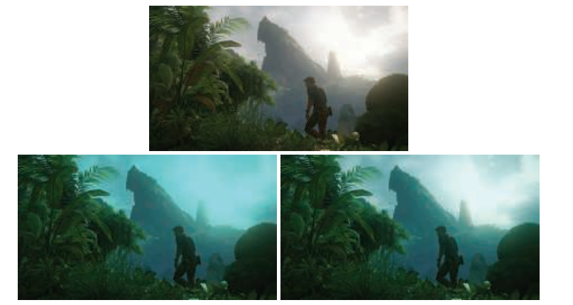

在进行LUT查找之前，还必须将场景参考的数据重新映射到$[0,1]$范围中\[1601]。在寒霜引擎\[497]中，使用了感知量化曲线OETF来实现这个目的，尽管可以使用一些更加简单的曲线。Duiker \[392]使用了一个对数曲线，而Hable \[635]则建议使用一次或者两次的平方根运算来实现。

Hable \[635]对常见的颜色分级操作，以及实现中的注意事项进行了很好的综述。

### 补充阅读和资源

Wyszecki和Stiles \[1934]所撰写的《Color Science》，是色度学和颜色科学领域的“圣经”。其他一些较好的色度学参考资料包括：Hunt \[789]撰写的《Measuring Colour》和Fairchild \[456]撰写的《Color Appearance Models》。

Selan的白皮书\[1602]很好地概述了图像再现和“从场景到屏幕”的问题。如果读者想要进一步了解这个主题，可以参考Hunt \[788]撰写的《Reproduction of Colour》，以及Giorgianni 和Madden \[537]撰写的《Digital Color Management》。《Ansel Adams Photography Series》中有三本书\[9, 10, 11]，特别是《The Negative》，详细阐释了电影摄影中的艺术和科学，是如何影响到如今图像再现的理论和实践的。最后，Reinhard和其他人\[1480]共同撰写的《Color Imaging: Fundamentals and Applications》一书，对整个研究领域进行了全面的概述和讨论。
