# Chapter 9 Physically Based Shading 基于物理的着色

## 目录

-   [9.1 光的物理学](#91-光的物理学)
    -   [9.1.1 粒子](#911-粒子)
    -   [9.1.2 介质](#912-介质)
    -   [9.1.3 表面](#913-表面)
    -   [9.1.4 次表面散射](#914-次表面散射)
-   [9.2 相机](#92-相机)
-   [9.3 The BRDF](#93-The-BRDF)
-   [9.4 光照（Illumination）](#94-光照Illumination)
-   [9.5 菲涅尔反射](#95-菲涅尔反射)
    -   [9.5.1 外反射](#951-外反射)
    -   [9.5.2 典型的菲涅尔反射值](#952-典型的菲涅尔反射值)
        -   [电介质的菲涅尔反射率](#电介质的菲涅尔反射率)
        -   [金属的菲涅尔反射率](#金属的菲涅尔反射率)
        -   [半导体的菲涅尔反射值](#半导体的菲涅尔反射值)
        -   [水中的菲涅尔反射率](#水中的菲涅尔反射率)
        -   [参数化的菲涅尔值](#参数化的菲涅尔值)
    -   [9.5.3 内反射](#953-内反射)
-   [9.6 微观几何（Microgeometry）](#96-微观几何Microgeometry)
-   [9.7 微表面理论](#97-微表面理论)
-   [9.8 表面反射的BRDF模型](#98-表面反射的BRDF模型)
    -   [9.8.1 法线分布函数](#981-法线分布函数)
        -   [各项同性法线分布函数](#各项同性法线分布函数)
        -   [各项异性法线分布函数](#各项异性法线分布函数)
    -   [9.8.2 多次反弹的表面反射](#982-多次反弹的表面反射)
-   [9.9 次表面散射的BRDF模型](#99-次表面散射的BRDF模型)
    -   [9.9.1 次表面反照率](#991-次表面反照率)
    -   [9.9.2 次表面散射和粗糙的尺度](#992-次表面散射和粗糙的尺度)
    -   [9.9.3 光滑表面的次表面模型](#993-光滑表面的次表面模型)
    -   [9.9.4 粗糙表面的次表面模型](#994-粗糙表面的次表面模型)
-   [9.10 布料的BRDF模型](#910-布料的BRDF模型)
    -   [9.10.1 经验布料模型](#9101-经验布料模型)
    -   [9.10.2 微表面布料模型](#9102-微表面布料模型)
    -   [9.10.3 微圆柱体布料模型](#9103-微圆柱体布料模型)
-   [9.11波动光学的BRDF模型](#911波动光学的BRDF模型)
    -   [9.11.1 衍射模型](#9111-衍射模型)
    -   [9.11.2 薄膜干涉模型](#9112-薄膜干涉模型)
-   [9.12 分层材质](#912-分层材质)
-   [9.13 混合和过滤材质](#913-混合和过滤材质)
    -   [9.13.1过滤法线与法线分布](#9131过滤法线与法线分布)
-   [补充阅读和资源](#补充阅读和资源)

> John Constable ——“There is nothing ugly; I never saw an ugly thing in my life: for let the form of an object be what it may, — light, shade, and perspective will always make it beautiful.”

> 约翰·康斯太勃尔——“没有什么是丑陋的；我一生中从未见过丑陋的东西，因为不管一个物体的形状如何，光、影和透视总是会使它变得美丽。”（英国风景画家；1776—1837）

在本章节中，我们将从各个方面介绍有关基于物理的着色。首先我们会在章节9.1中介绍光与物质交互的物理原理；在章节9.2-9.4中，我们将展示这些物理原理是如何转换到着色过程中的；章节9.5-9.7介绍了一些构建模块，它们专门用于基于物理的着色模型；章节9.8-9.12介绍了包含一系列材质类型的着色模型；最后，在章节9.13中，我们描述了各种材质是如何混合在一起的，并介绍了一些避免瑕疵、保持材质外观的过滤方法。

## 9.1 光的物理学

光与物质的相互作用，是基于物理的着色的理论基础，理解这些相互作用的原理，有助于帮助我们建立一个对光本质的基础理解。

在物理光学（physical optic）中，光被认为是一种电磁横波（electromagnetic transverse wave），它使得电场（electric field）和磁场（magnetic field）在其传播方向的垂直面上来回振荡。电场和磁场的振荡是耦合的，二者的矢量相互垂直，并且长度之比也是固定的，这个比值等于相位速度（phase velocity），我们将在稍后进行讨论。

图9.1展示了一个简单的光波，事实上，这是最简单的一种，即一个完美的正弦函数。这个波只有一个波长（wavelength），使用希腊字母$\lambda$进行表示。在章节8.1中我们提到，人眼所感知到的颜色，与光线的波长密切相关，因此，具有单一波长的光被称为单色光（monochromatic light）。然而在实践中所遇到的大多数光都是多色光（polychromatic light），即它们包含了许多不同的波长。

之所以我们说图9.1所展示的光波是简单的，是因为它是线性偏振（linearly  polarized）的。这意味着对于空间中的一个不动点，电场和磁场都沿着一条直线来回运动；相比之下，在这本书中，我们所关注的是更加普遍的非偏振光（unpolarized light）。在非偏振光中，电场和磁场会在垂直于传播方向的所有方向上均匀分布。尽管这种单色的、线性偏振的光波是很简单的，但是理解它们的行为仍然十分有用，因为任何光波都可以被分解成这种简单波的组合。

如果我们以一个给定的相位（例如偏振峰值），对波上的一个点进行追踪，我们将看到它会以一个恒定的速度在空间中进行移动，这就是波的相位速度（phase velocity）。对于真空中的光波而言，其相位速度为$c$，通常被称为光速，大约是每秒30万公里。

在章节8.1.1中，我们讨论了可见光的波长分布，单个波长的大小大约在400纳米-700纳米，这个长度大约是一根蜘蛛丝的一半到三分之一左右，而一根蜘蛛丝还不到人类头发直径的五分之一，如图9.2所示。在光学中，通常都会使用相对于波长的尺度来描述尺寸大小，例如：我们会说蜘蛛丝的宽度大约为$2\lambda - 3\lambda$（即2-3倍的波长），头发的宽度为$100\lambda - 200\lambda$。

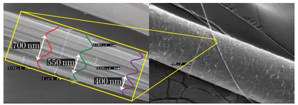

光波会携带能量，这个能量流的强度等于电场强度和磁场强度的乘积，由于电场和磁场交替振荡，二者强度是成比例的，因此光线能量流的强度与电场强度的平方成正比。这里我们会关注电场，这是因为电场对物质的影响要比磁场大得多。在渲染中，我们关注的是随着时间变化的平均能量流，它与振幅的（amplitude）平方成正比，这个平均能量流的强度就是irradiance，通常使用字母$E$来进行表示。我们在章节8.1.1中介绍了irradiance和其他光量的关系。

光波会以线性的方式进行叠加，总体波是各个分量波之和。然而，由于irradiance和振幅的平方成正比，这似乎导致了一个悖论，例如：将两个相同的光波进行叠加，会不会导致irradiance“1+1=4”的情况？由于irradiance描述的是能量流，这会不会违反能量守恒能量？对于这两个问题，前者的答案是“有时会”，而后者的答案则是“不会”。

为了对刚才的两个问题进行说明，我们来看看以下这个简单的例子：现在有$n$个单色光要进行叠加，除了相位之外，其他的属性完全相同。这$n$个波的振幅均为$a$，使用$E_1$来表示每个波的irradiance，$E_1$和$a^2$成正比，也就是说，$E_1=ka^2$，其中$k$是常数。

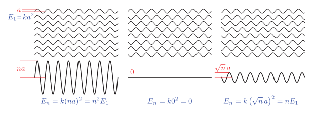

图9.3展示了三种不同的叠加情况。左图中，所有的波都具有相同的相位，叠加之后会相互加强，其irradiance是单个波的$n^2$倍，是$n$个独立波irradiance之和的$n$倍，这种情况被称为相长干涉（constructive interference）。在中间的图中，每一对波都处于相反的相位，两两相互抵消，叠加之后的振幅和irradiance均为0，这种情况被称为相消干涉（destructive interference）。

相长干涉和相消干涉是两种特殊的相干叠加（coherent addition），即波峰和波谷以一种一致的方式进行排列。根据相对相位关系的不同，$ n  $个相同波相干叠加生成的组合波，其irradiance为单个波的$0-n^2$倍。

然而通常来说，波都是以不相干的的方式进行叠加的（incoherent addition），这意味着它们的相位都是相对随机的，如图9.3右侧所示。在这种情况下，组合波的振幅为$\sqrt{n}a$，其irradiance等于$n$个独立波的irradiance线性叠加，这正如我们所期望的那样。

看起来相长干涉和相消干涉违反了能量守恒定律，但实际上并没有。这是因为图9.3并没有展示完整的情况——它仅仅展示了波在一个位置上的相互作用。当波在空间中进行传播的时候，它们之间的相位关系会发生变化，如图9.4所示。在某些位置上会发生相长干涉，组合波的irradiance会大于单个波irradiance之和；而在某些位置上则会发生相消干涉，组合波的irradiance会小于单个波irradiance之和。这并不违反能量守恒定律，因为通过相长干涉而获得的能量，与通过相消干涉而损失的能量是相等的。

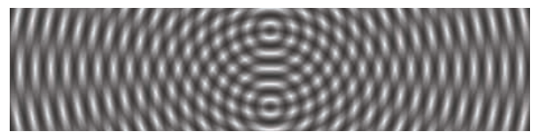

当物体中的电荷发生振荡时，就会发出电磁波，而引起振荡的部分能量（热能、电能、化学能）会被转化为光能，然后从物体上辐射出去。在渲染中，这样的物体会被视为光源，我们在章节5.2中首次讨论了光源，在第10章中，它们将从一个更加基于物理的角度，来对其进行描述。

当光波被发射出来之后，它们穿过空间，直到遇到一些可以相互作用的物质。大多数光与物质交互作用，其核心现象都很简单，与上面所讨论的发射情况非常类似。振荡的电场会推动和拉动物质中的电荷，使它们也依次发生振荡。振荡的电荷会发射出新的光波，这个过程会将入射光波的一些能量重新定向到新的方向。这个作用过程被称为散射（scattering），它是各种光学现象的基础。

散射出的光波与原始光波具有相同的频率。通常情况下，当原始光波包含多个频率的光波时，每个频率的光波都会单独与物质发生作用。而对于某个频率的入射光，也不会对其他频率的散射光产生能量贡献，除了一些特定和相对罕见的情况之外，例如荧光（fluorescence）和磷光（phosphorescence），我们不会在本书中讨论这些情况。

一个孤立的分子会使光波向着各个方向进行散射，并使光的强度发生一些方向性的变化。但是更多的光线还是会沿着接近原始传播轴的方向进行散射，包括向前的方向或者向后的方向。分子作为散射体（scatterer）的有效性（分子附近的光波被散射的可能性），会随着波长的变化而发生很大的改变。

在渲染中，我们主要关心的是包含许多分子的集合，光线在与这些聚集体发生相互作用的时候，其结果可能会与孤立分子的情况有所不同。从附近分子散射出的光波通常是相干的，因此会相互干涉，因为它们大概率都具有相同的入射波。本小节的剩余部分将专门讨论若干种多分子散射的特殊情况。

### 9.1.1 粒子

在理想气体（ideal gas）中，分子之间互不影响，即它们的相对位置是完全随机且不相关的，虽然这是一种抽象概念，但是对于标准大气压下的空气而言，这是一个相当好的模型。在这种情况下，从不同分子散射出的波，其相位差异是随机且不断变化的，因此这些散射波是不相干的，其能量呈线性叠加，如图9.3右侧所示。即从$n$个分子散射出的总光能，是单分子散射的$n$倍。

相反，如果分子紧密地排列在比光波长小得多的团簇（cluster）中，那么每个团簇中的散射光波都是同相位的，即会发生相长干涉，如图9.3左侧所示。即从由$n$个分子组成的团簇散射出的总光强，是单分子散射的$ n^2  $倍，也是相同数量分子在理想气体散射中的$n$倍。这种关系意味着，对于一种密度恒定的物质，将分子聚集成团簇，将会显著增加散射光的强度。在保持整体分子密度不变的情况下，增加每个团簇的大小，将会进一步增加散射光的强度，直到团簇的直径接近光的波长，当超过这个临界值的时候，额外增加团簇的大小将并不会进一步增加散射光的强度\[469]。

这个过程解释了为什么云和雾的散射光是如此强烈。因为这两种现象都是由冷凝（condensation）产生的，所谓冷凝，是指空气中的水分子聚集成越来越大的团簇的过程。这会显著增加光的散射，即使水分子的总体密度并没有发生变化。有关云渲染的内容，将在章节14.4.2中进行讨论。

当我们在讨论光线散射的时候，粒子（particle）这个术语同时代表了孤立的分子与包含多个分子的团簇。由于直径小于波长的多分子粒子散射，是孤立分子散射的增强版本（由于相长干涉），因此它会表现出相同的方向性变化和波长依赖性。这种类型的散射在大气粒子中被称为瑞利散射（Rayleigh scattering），在固体中则被称为丁达尔散射（Tyndall scattering）。

> 译者注：丁达尔效应（[Tyndall effect - Wikipedia](https://en.wikipedia.org/wiki/Tyndall_effect "Tyndall effect - Wikipedia")）不是简单的瑞利散射或者简单的米氏散射，它特指胶体中发生的一种光学现象，即波长较长的光会更多地沿着光线方向进行传播，而波长较短的光则会被更多地散射。瑞利散射一般发生在粒子尺度小于十分之一可见光波长的情况下（[Rayleigh scattering - Wikipedia](https://en.wikipedia.org/wiki/Rayleigh_scattering "Rayleigh scattering - Wikipedia")）；米氏散射一般发生在粒子尺度接近或者大于可见光波长的情况下（[Mie scattering - Wikipedia](https://en.wikipedia.org/wiki/Mie_scattering "Mie scattering - Wikipedia")）。

当粒子的大小超过光波长的时候，散射波在不再是同相的，这会改变散射的性质。散射光的方向越来越倾向于前向（即光波的原始传播方向），此时波长的依赖性会降低，直到所有的可见光波长都被均匀散射，这种类型的散射被称为米氏散射（Mie scattering）。章节14.1会对瑞利散射和米氏散射进行了更加详细的描述。

### 9.1.2 介质

光在均匀介质（homogeneous medium）中进行传播是另一种重要的情况，均匀介质是指一个充满均匀分布的相同分子的空间。这里所说的均匀分布，并不是指分子间距要像晶体一样完全规则，如果液体和非晶体是纯净物（所有的分子都是相同的），并且没有间隙或者气泡的话，也可以认为它们在光学上是均匀的。

在均匀介质中，散射波会整齐排列，除了沿着最初的传播方向之外，它们会在所有方向上都会产生相消干涉。当原始波与所有的单分子散射波结合之后，最终的结果与原始波基本相同，只有相位速度和振幅（在某些情况下）会有所不同。最后叠加的结果并不会表现出任何散射现象，因为散射现象已经被相消干涉有效抑制了。

原始波和新波的相位速度之比，决定了介质的光学特性，这被称为折射率（index of refraction，IOR），通常使用字母$n$来进行表示。有些介质是具有吸收性的（absorptive），它们会将部分光能转换为热量，这会导致光波的振幅随着距离呈指数级下降，这个下降率由衰减率（attenuation index）定义，使用希腊字母$\kappa (kappa)$来进行表示。$n$和$\kappa$通常会随波长的变化而变化；这两个数字在一起，完整定义了一个介质会如何影响给定波长的光，它们通常被组合成一个复数$n+i\kappa$，称为复折射率（complex index of refraction）。折射率对分子级别上的光相互作用细节进行了抽象，使得介质可以被视为一个连续的空间体积，这大大简化了模型的复杂度。

虽然光的相位速度并不会直接影响物体外观，但是相位速度的变化则会对外观产生影响，我们稍后会进行解释。另一方面，光的吸收会对视觉效果产生直接影响，因为它降低了光的强度，并且也可以改变光的颜色（如果波长发生变化的话）。图9.5展示了一些光线吸收的例子。

非均匀介质通常可以建模为嵌有散射粒子的均匀介质。相消干涉抑制了均匀介质中的散射现象，这是由分子的均匀排列所引起的；非均匀介质中的粒子排列并不均匀，从而会导致它们产生散射光波。分子分布中的任何局部变化，都将打破相消干涉的模式，从而允许散射光波进行传播；这种局部变化可以是一个不同分子类型的分子团，或者是气隙、气泡、密度变化等；在任何情况下，它都会像前面讨论的粒子那样，对光波进行散射，其散射性质同样取决于分子团的大小。即使是气体也可以这样进行建模，在气体情况下，“散射粒子”是由分子持续运动所引起的瞬态密度涨落（transient density fluctuation）。这个模型可以为气体建立一个具有意义的折射率$n$，这有利于理解它们的光学性质。图9.6展示了几种光线散射的例子。

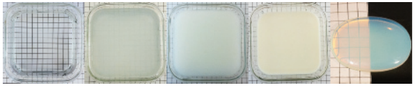

散射和吸收现象都与尺度有关。在小场景中不产生任何明显散射的介质，在较大的尺度上也可能会有相当明显的散射现象。例如：当在房间内观察一杯水时，光在空气中的散射与在水中的吸收是几乎不可见的；然而在一个较大尺度的环境中，这两种效果可能都会十分显著，如图9.7所示。

在一般情况下，介质的外观由散射作用和吸收作用的某种组合所决定，如图9.8所示。散射的程度决定了灰暗的程度，较高的散射会产生不透明的外观。除了一些比较罕见的情况之外（如图9.6中的乳白色玻璃），固体介质和液体介质中的粒子尺寸，往往大于光的波长，并且倾向于均匀散射所有可见波长的光，因此，物体的颜色通常都是由吸收作用的波长依赖性所引起的。而介质的亮度则是由光线散射和光线吸收这两种现象共同作用的结果。特别是白色，它是高散射和低吸收结合的结果。我们将在章节14.1中进行更详细的讨论。

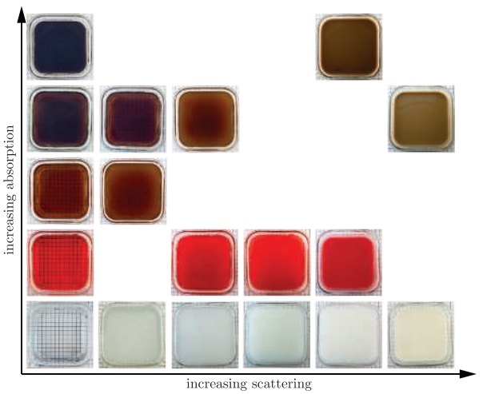

### 9.1.3 表面

从光学角度来看，物体的表面（surface）是一个二维界面，它分隔了具有不同折射率的空间体积。在一般的渲染情况下，由空气组成的外部空间，其折射率约为1.003，为简单起见，通常假设空气的折射率为1；而内部空间的折射率则取决于构成物体的物质。

当光波遇到一个表面的时候，该表面的两个因素会对结果产生重要的影响：两侧的物质和表面的几何形状。我们先关注两侧物质所带来的影响，因此假设此时的表面几何形状是一个完美的平面。我们将“外部”（入射方向或者入射波产生的那一侧）折射率表示为$ n_1  $，将“内部”（光波通过该表面后将发生传播的一侧）折射率表示为$n_2$。

我们在前一小节中提到过，当光波遇到材料组成不连续或者密度不连续的时候（即两个区域的折射率不同时），它们就会发生散射。分离不同折射率物体的平面，是一种特殊类型的不连续，它会以一种特定的方式来对光进行散射。这个平面边界要求平行于表面的电场分量是连续的，换句话说，表面两侧的电场矢量，到表面平面上的投影必须相匹配。这有以下几个含义：

1.  在表面上的任何散射波，与入射波要么是同相位的，要么是$180 \degree$反相位的。因此，在这个表面上的散射波，其峰值必须与入射波的峰值或者波谷相一致。这限制了散射波只能向两个可能的方向进行移动，一个继续向前进入表面，另一个则远离表面；前者被称为透射波（transmitted wave），后者被称为反射波（reflected wave）。
2.  散射波和入射波具有相同的频率。这里我们假设的是一个单色波，但是这个原理可以应用于任何波，其对应的单色分量会具有相同的频率。
3.  当光波从一个介质移动到另一个介质时，其相位速度（即波通过介质的速度）与相对折射率$(n_1/n_2)$成比例变化。由于光波的频率是固定的，因此波长也与相对折射率$(n_1/n_2)$成比例变化。

 成正比，本例中为0.5。相位沿着表面排列，因此间距的变化会弯曲（折射）透射波的方向。图中三角形的构造展示了Snell定律的推导过程。为了清晰起见，右上方的图显示了反射波的情况，它与入射波具有相同的波间距，因此其方向与表面法线具有相同的夹角。右下方展示了入射波、透射波和反射波方向的矢量图。")

最终结果如图9.9所示。反射波和入射波的方向，与表面法线之间具有相同的夹角$\theta_i$；透射波的方向会以$\theta_t$的角度进行弯曲（折射），它与$\theta_{i}$的关系如下：

$$
\sin \left(\theta_{t}\right)=\frac{n_{1}}{n_{2}} \sin \left(\theta_{i}\right).
\tag{9.1} 
$$

这个折射方程被称为Snell定律（折射定律），它被用于全局折射效应，这将在章节14.5.2中进一步讨论。

虽然折射现象通常会与玻璃、晶体等透明材质联系在一起，但是它也会发生在不透明物体的表面上；当不透明物体发生折射时，光会在物体的内部进行散射和吸收。光会与物体的介质相互作用，就像图9.8中的装有各种液体的容器一样。对于金属而言，其内部包含了许多自由电子（不与分子结合的电子），它们会“吸收”折射光的能量，并将其重定向到反射波中，这就是为什么金属会具有较高的吸收率和较高的反射率的原因。

我们刚才所讨论的表面折射现象（反射和折射），需要折射率在小于单一波长的距离上发生突变。而折射率的逐渐变化并不会对光进行散射，而是会导致光路发生弯曲，就像折射时出现的不连续弯曲一样；当空气密度因温度不同而发生变化的时候，可以看到这种效应，例如海市蜃楼（mirage）和热变形（heat distortion，也叫做热浪），如图9.10所示。

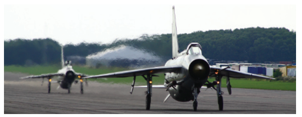

即使是一个具有明确边界的物体，如果它被浸没在一个具有相同折射率的物质中，那么也将没有可见的表面。因为在没有折射率变化的情况下，就不会发生反射现象和折射现象。图9.11展示了这样的一个例子。

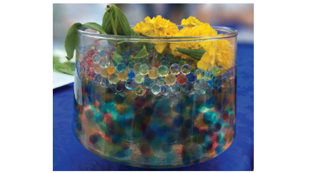

到目前为止，我们一直关注的都是表面两侧的物质对光的影响，现在我们将讨论影响表面外观的另一个重要因素：几何形状。严格地说，一个完美平坦的平面表面是不可能存在的，每个表面都具有某种程度的不规则性，即使该表面只由单个原子组成。然而，比波长小得多的不规则表面，对光的行为没有影响；而比波长大得多的不规则表面，虽然会使这个表面在宏观上看起来变得倾斜，但是并不会影响其微观局部的平坦性。只有位于1-100个波长范围内的不规则表面，才会导致这个表面与平面具有不同的外观表现，这种现象被称为衍射现象（diffraction），将在章节9.11中进一步讨论。

在渲染中，我们通常会基于几何光学（geometrical optics），它忽略了光作为一种波所产生的效应，例如干涉和衍射。这相当于假设所有表面的不规则性，要么小于光的波长，要么比光的波长大得多（100倍以上）。在几何光学中，光会被建模为一条射线，而不是一种波，当一条射线与表面相交时，相交点的局部区域会被视为一个平面。图9.9右下角的图像，可以看作是反射现象和折射现象的几何光学表示；而图9.9其他部分所展示的，是光作为一种波所发生的现象。从这里开始，直到章节9.11为止，我们将一直会在几何光学的领域中进行讨论（会将光译作光线），章节9.11中将专门讨论基于波动光学的着色模型。

正如我们前面所提到的，比波长大得多的表面不规则性，会改变表面的局部朝向。当这些不规则性太小以致于无法进行渲染的时候（小于一个像素），我们则将其称为微观几何图形（microgeometry，微表面）；表面的反射方向和折射方向取决于该表面的法线，而这些微表面会改变表面上不同点处的法线，从而改变光线的反射方向和折射方向。

虽然不规则表面上的每个点，都只会在一个方向上反射光线，但是屏幕上的每个像素都覆盖了许多的表面点，这些点会在不同方向上反射光线，因此这个表面的外观，是由所有不同反射方向的光线的聚合结果所决定的。图9.12展示了两个在宏观尺度上具有相似形状，但是微观几何形状显著不同的表面，其外观也具有明显的差异。

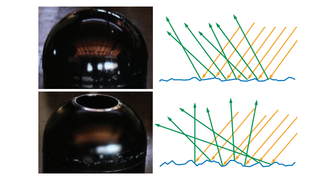

在渲染中，我们并不会对微观几何形状进行明确的建模，而是会以一种统计的方式对其进行处理，将该表面视为一个具有微观结构法线的随机分布。因此，我们将表面建模为，会在一个连续方向上（译者注：一定的立体角范围内），对光线进行反射和折射。其中这个连续方向的宽度（锥形范围的大小，或者是立体角的大小），以及反射细节和折射细节的模糊程度，取决于微观几何法线的统计方差，即表面微尺度的粗糙度（roughness），如图9.13所示。

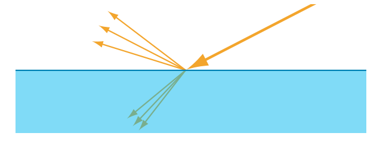

### 9.1.4 次表面散射

进入物体内部的折射光线，会继续与内部物质发生相互作用。前面我们提到，金属具有较高的吸收率和较高的反射率，即金属表面会反射大部分的入射光线，进入金属内部的折射光线也会被迅速吸收；相比之下，非金属物体则会表现出广泛的散射行为和吸收行为，这与我们在图9.8中所看到的液体容器类似。透明材料具有低散射和低吸收的特性，进入物体内部的任何折射光线，最终都会从物体中折射出来。我们在章节5.5中讨论过一些简单的透明物体渲染方法；有关透明物体的折射问题，将在章节14.5.2中进行讨论。在本小节中，我们将重点关注不透明的物体，在这些物体中，透射光线在经历多次散射和吸收之后，最终有一部分会从表面重新发射出来，并被人眼观察到，如图9.14所示。

这种次表面散射（subsurface scatter）的光线，会以相对于入射点的不同距离从表面射出，这个进出距离（entry-exit distances）的分布取决于材料中散射粒子的密度和性质，这些距离与着色尺度（像素的大小，以及着色样本之间的距离）之间的关系是很重要的。如果这个进出距离比着色尺度要小，那么可以假定它们为零，这样我们就可以将次表面散射与表面反射整合到同一个局部着色模型中，即某个着色点上的出射光线，只依赖于该点的入射光线。由于次表面散射与表面反射具有明显不同的外观表现，因此可以很容易地将它们划分为单独的着色选项，使用镜面项（specular term）控制表面反射现象，使用漫反射项（diffuse term）控制局部次表面散射（local subsurface scattering）现象。

如果这个进出距离比着色尺度要大，那么就需要专门的渲染技术，来表现光线在某一点进入表面，并从另一点离开表面的视觉效果。章节14.6详细介绍了这些全局次表面散射（global subsurface scattering）技术。局部次表面散射和全局次表面散射之间的差异如图9.15所示。

值得注意的是，局部次表面散射技术和全局次表面散射技术模拟的是完全相同的物理现象。每种情况下的最佳选择（即到底使用哪种模型和技术），不仅取决于材质的属性，还取决于观察的尺度。例如：当渲染一个孩子在玩塑料玩具的场景时，我们很可能需要使用全局次表面散射技术来准确地渲染孩子的皮肤，而对于塑料玩具而言，可能一个局部的漫反射着色模型就足够了。这是因为皮肤中的散射距离，要比在塑料中的散射距离大得多，但是如果相机足够远的话，皮肤的散射距离也可能会小于一个像素，此时局部的着色模型对于儿童和玩具而言都是十分准确的。相反，在一个极端的特写镜头中，塑料也可能会表现出明显的非局部次表面散射现象，这时候就需要全局次表面散射技术来对玩具进行准确地渲染。

## 9.2 相机

如章节8.1.1所述，在渲染的时候，我们会计算从表面着色点到相机位置的radiance。这模拟了一个简化了的成像系统，例如胶片相机、数码相机或者人眼。

这类成像系统中，包含了一个由许多离散小传感器组成的传感器表面。例如：眼睛中的视杆细胞和视锥细胞、数码相机中的光电二极管（photodiode）、或者胶片中的染料颗粒，这些传感器可以检测到其表面上的irradiance，并生成一个颜色信号。这些irradiance传感器本身并不能产生图像，因为它们对来自所有入射方向的光线都进行了平均处理。因此，完整的成像系统还应当包括一个具有小孔（aperture，光圈）的不透光外壳，它对光线进入和撞击传感器的方向进行了限制；放置在光圈处的透镜会将光线进行聚焦，这样每个传感器就只能接收来自一小部分入射方向的光线（小孔成像原理）。外壳、光圈和透镜的综合作用，使得这些传感器具有了特定的方向性（directionally specific），即只会对分布在一小块区域和一小组入射方向上的光线进行平均。正如我们在章节8.1.1中所看到的，这些传感器量化了来自各个方向光流的表面密度，即测量了平均radiance，而不是测量平均irradiance；换句话说，传感器量化记录了单条光线的亮度和颜色。

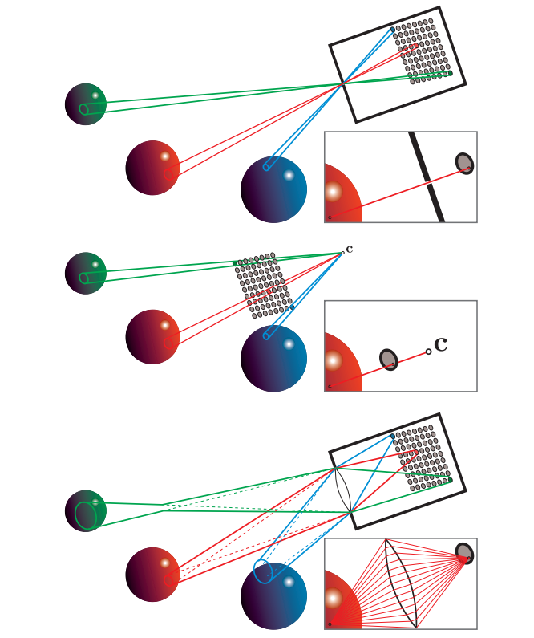

在历史上，渲染模拟了一种特别简单的成像传感器，它被称为针孔相机（pinhole camera），如图9.16的第一行所示。针孔相机没有镜头，并且具有一个非常小的光圈（在理想的情况下，它是一个没有大小的数学抽象点）。这个小光圈对传感器进行了限制，即传感器表面上的每个点都只能收集一束光线，而一个单独传感器中包含了若干个这样的点，也就是说，每个小传感器都会收集一个锥形区域内的光线，这个圆锥的底（base）覆盖了传感器的表面，圆锥的顶点（apex）位于光圈处。图形渲染系统以一种略有不同（但是是等价的）的方式，对针孔相机进行了建模，如图9.16的第二行所示。针孔光圈的位置用点$c$进行表示，通常被称为“相机位置”或者“眼睛位置”。这个点也是透视变换的投影中心（章节4.7.2）。

在渲染时，每个着色样本都对应了一条光线，即对应于传感器表面上的一个采样点。而抗锯齿的过程（章节5.4）则可以理解为，对每个离散传感器表面收集到的信号进行重建。然而，由于图形渲染并不会受到物理传感器的限制，因此我们可以对这个过程进行更加一般化的处理，即从离散的着色样本中，重建出连续的图像信号。

虽然真正的针孔相机可以很容易地制造出来，但是对于大多数实践中所使用的相机，以及人眼来说，针孔相机都是一个糟糕的模型，其实用价值并不高。图9.16第三行展示了一个使用镜头的成像系统模型，这个模型中包含了一个镜头，这允许相机使用一个更大的光圈，大大增加了成像传感器所收集的光量。但是它也会导致相机的景深（depth of field）是有限的（章节12.4），太近或者太远的物体都会被模糊（大光圈的时候，景深效果尤其明显）。

镜头除了会限制景深之外，还有一些其他的影响。传感器上的每个点（包括完美聚焦的点）都会接收一个锥形区域内的光线；而在理想化的模型中，每个着色样本都只会对应唯一的观察射线，这样处理有时候会引入数学奇异点（即无法定义的点）、数值不稳定性或者视觉瑕疵；当我们在渲染图像的时候，将真实的物理模型牢记于心，有助于我们识别和解决这些问题。

## 9.3 The BRDF

最终，基于物理的渲染可以归结为沿着一组观察射线，计算进入相机的radiance。这里我们使用章节8.1.1中所介绍的入射radiance的符号表示，对于一个给定的观察射线，我们需要计算的是$L_{i}(\mathbf{c},-\mathbf{v})$，其中$\mathbf{c}$是相机的位置，$-\mathbf{v}$是沿着观察射线的方向。这里我们使用$-\mathbf{v}$是由于两个符号约定：第一，$L_{i}()$中的方向向量，总是指向远离给定点的方向，在这里就是指向远离相机位置的方向。第二，观察向量$\mathbf{v}$总是会指向相机。

在渲染中，场景通常会被建模为彼此之间具有介质的物体集合（“介质”一词实际上来自于拉丁语，它的意思是“在中间”）。通常我们所讨论的介质是适量且相对干净的空气，它并不会对光线的radiance产生明显地影响，因此在渲染中可以被忽略。但是有时候，光线所穿过的介质会通过吸收或者散射等方式，对光线的radiance产生明显影响，这样的介质被称为参与介质（participating media），因为它们参与了光线在场景中的传播过程。我们将在第14章中详细介绍有关参与介质的话题。而在本章节中，我们暂时假设没有参与介质的存在，因此进入相机的radiance，与其观察方向上离开最近物体表面的radiance是相等的，即：

$$
L_{i}(\mathbf{c},-\mathbf{v})=L_{o}(\mathbf{p}, \mathbf{v})
\tag{9.2} 
$$

其中，$\mathbf{p}$是观察射线与最近物体表面的交点。

根据方程9.2，我们的新目标是计算$L_{o}(\mathbf{p}, \mathbf{v})$。我们在章节5.1中曾讨论过简单的着色模型，而这里的计算过程则是其物理版本。有时候一些表面也会直接发出radiance，但是更加常见的情况是，离开这个表面的radiance来自于其他地方，并通过章节9.1中所描述的物理作用，最终被反射到相机中。在本章节中，我们将不考虑透明物体（章节5.5和章节14.5.2）和全局次表面散射（章节14.6）的情况；换句话说，我们所关注的是局部反射现象，它将照射到当前着色点的光线，重新发射回外部，这些现象包括表面反射以及局部次表面散射，它们只依赖于入射光方向$\mathbf{l}$和指向外部的观察方向$\mathbf{v}$。双向反射分布函数（bidirectional reflectance distribution function，BRDF）描述了着色点表面的局部反射系数，记为$f(\mathbf{l}, \mathbf{v})$。

在原始推导中\[1277]，BRDF是针对均匀表面进行定义的。也就是说，我们会假设表面上各处的BRDF都是相同的。然而，对于现实世界中的物体（以及渲染场景中的物体）而言，很少会有表面具有完全相同的材质属性。即使是由单一材料组成的物体（例如银质雕像），其表面上也会有划痕、暗斑、污渍或者其他的一些变化，从而导致两个不同的着色点具有不同的视觉特性。从技术上来讲，根据空间位置捕获BRDF变化的函数，被称为空间变化的BRDF（spatially varying BRDF，SVBRDF）或者空间BRDF（spatial BRDF，SBRDF）。然而，这种情况在实践中非常普遍，因此通常还是会使用BRDF这个较短的术语来进行描述，我们会默认假定BRDF与表面位置有关。

光线的入射方向和出射方向各有两个自由度。一种常用的参数化表示包括两个角度：相对于表面法线$\mathbf{n}$的仰角$\theta$，以及相对于表面法线$\mathbf{n}$的方位角（即水平旋转）$\phi$。在一般情况下，BRDF是一个包含四个标量变量的函数。各向同性（Isotropic）BRDF是一个重要的特例，当光线入射方向和出射方向围绕表面法线$\mathbf{n}$旋转的时候，各项同性BRDF会保持不变，并保持它们之间的相对角度不变。图9.17展示了这两种情况下所使用的输入变量。各向同性BRDF是一个包含三个标量变量的函数，因为我们只需要光线绕表面法线$\mathbf{n}$的旋转角度，或者相机的旋转角度$\phi$即可。也就是说，如果将一个具有均匀各向同性材质的物体放置在转盘上，并旋转它的话，在给定的光线和相机条件下，这个物体表面在所有旋转角度上看起来都是相同的。

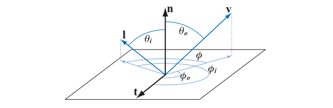

由于我们忽略了荧光（fluorescence）和磷光（phosphorescence）等现象，因此我们可以假设，给定波长的入射光会以相同的波长被反射出来。反射光的光量会根据其波长发生变化，可以使用以下两种方法来进行模拟：第一种是将波长视为BRDF的额外输入变量；第二种则是将BRDF视为会返回一个光谱分布的值。虽然第一种方法有时会用于离线渲染\[660]，但是在实时渲染中，总是会使用第二种方法。由于实时渲染器一般将光谱分布表示为一个RGB三元组，这意味着BRDF会返回一个RGB值。

为了计算着色点的出射光线$L_{o}(\mathbf{p}, \mathbf{v})$，我们将BRDF项合并到反射方程（reflectance equation）中：

$$
L_{o}(\mathbf{p}, \mathbf{v})=\int_{\mathbf{l} \in \Omega} f(\mathbf{l}, \mathbf{v}) L_{i}(\mathbf{p}, \mathbf{l})(\mathbf{n} \cdot \mathbf{l}) d \mathbf{l}
\tag{9.3} 
$$

积分符号的下标$\mathbf{l} \in \Omega$意味着是，我们对位于表面单位半球（以着色点为球心，以表面法线$\mathbf{n}$为半球方向）上的入射光方向$\mathbf{l}$进行积分。请注意，入射光方向$\mathbf{l}$会在半球范围内进行连续扫描，也就是说，它并不是某个特定的“光线方向”。这个想法的核心是：来自任何入射方向的光线，都会（通常会）产生一些radiance。我们用$d\mathbf{l}$来表示入射光方向$\mathbf{l}$周围单位立体角的微分（有关立体角的内容在章节8.1.1讨论过）。

总而言之，反射方程表明，出射的radiance等于入射radiance乘以BRDF项，再乘以表面法线$\mathbf{n}$和入射光方向$\mathbf{l}$点积的积分（其中入射光方向$\mathbf{l}$来自半球范围$\Omega$）。

为了简化表述，在本章节的剩余部分中，我们将从$L_i()$，$L_o()$和反射方程中省略表面着色点$\mathbf{p}$，即：

$$
L_{o}(\mathbf{v})=\int_{\mathbf{l} \in \Omega} f(\mathbf{l}, \mathbf{v}) L_{i}(\mathbf{l})(\mathbf{n} \cdot \mathbf{l}) d \mathbf{l}
\tag{9.4}  
$$

在计算反射方程的时候，通常会使用球坐标$\phi$和$\theta$来对半球进行参数化。在这个参数化表示下，微分立体角$d\mathbf{l}$就等于$\sin \theta_{i} d \theta_{i} d \phi_{i}$。利用这种球坐标系参数化，我们可以推导出方程9.4的二重积分形式：

$$
L_{o}\left(\theta_{o}, \phi_{o}\right)=\int_{\phi_{i}=0}^{2 \pi} \int_{\theta_{i}=0}^{\pi / 2} f\left(\theta_{i}, \phi_{i}, \theta_{o}, \phi_{o}\right) L\left(\theta_{i}, \phi_{i}\right) \cos \theta_{i} \sin \theta_{i} d \theta_{i} d \phi_{i}
\tag{9.5}   
$$

回顾一下，方程9.4中的$(\mathbf{n} \cdot \mathbf{l}) = \cos \theta_i$，有关$\theta_{i}, \phi_{i}, \theta_{o}, \phi_{o}$的几何意义如图9.17所示。

在某些情况下，我们使用一些稍微不同的参数化表示会变得更加方便，即使用仰角的余弦值$\mu_{i}=\cos \theta_{i} , \mu_{o}=\cos \theta_{o}$，而不是仰角本身$\theta_{i}, \theta_{o}$。对于这种参数化表示，微分立体角$d\mathbf{l}$就等于$d \mu_{i} d \phi_{i}$。使用$(\mu,\phi)$这种参数化，表示可推导出以下的积分形式:

$$
L_{o}\left(\mu_{o}, \phi_{o}\right)=\int_{\phi_{i}=0}^{2 \pi} \int_{\mu_{i}=0}^{1} f\left(\mu_{i}, \phi_{i}, \mu_{o}, \phi_{o}\right) L\left(\mu_{i}, \phi_{i}\right) \mu_{i} d \mu_{i} d \phi_{i}
\tag{9.6}    
$$

BRDF仅在光线方向和观察方向都位于表面上方时才有定义。对于光线方向在表面下方的情况，可以通过将BRDF乘以零，或者首先不计算这些方向的BRDF来避免这种情况。但是对表面下方的观察方向呢？换句话说就是，当点积$\mathbf{n} \cdot \mathbf{v}$为负的时候会发生什么情况？从理论上来说，这种情况永远都不会发生，因为此时表面是背对相机的，是不可见的。然而，在实时应用中十分常见的顶点法线插值和法线映射等操作，会在实践中产生这样的情况。可以将$\mathbf{n} \cdot \mathbf{v}$的值限制到0，或者使用$\mathbf{n} \cdot \mathbf{v}$的绝对值，来避免BRDF对表面下方的观察方向进行计算，但是这两种方法都会产生一些瑕疵。寒霜引擎使用$\mathbf{n} \cdot \mathbf{v}$的绝对值再加上一个很小的数字（0.0001），来避免发生除以0的情况\[960]。另一种可能的方法是“soft clamp”，这意味着随着$\mathbf{n} ,\mathbf{v}$之间的夹角超过$90^{\circ}$时，$\mathbf{n} \cdot \mathbf{v}$的值会逐渐趋于0。

物理定律对任何的BRDF都有两个约束。第一个约束是Helmholtz互易性（Helmholtz reciprocity），这意味着交换入射角和出射角后，其函数值相同，即：

$$
f(\mathbf{l}, \mathbf{v})=f(\mathbf{v}, \mathbf{l})
\tag{9.7}   
$$

在实践中，用于渲染的BRDF经常会违反Helmholtz互易性，而且并不会出现明显的瑕疵，除非是一些特别需要Helmholtz互易性的离线渲染算法，例如双向路径跟踪（bidirectional path tracing）。然而，当在确定某种BRDF在物理上是否可信时，Helmholtz互易性是一个有效的鉴别工具。

第二个约束是能量守恒（conservation of energy）——即出射的能量不能大于入射的能量（这里不包含自发光表面，它将作为一个特殊情况进行处理）。离线渲染算法（例如path tracing）需要能量守恒来保证收敛性；而对于实时渲染来说，我们并不需要严格保证能量守恒，但是近似的能量守恒还是很重要的。使用一个明显违背能量守恒的BRDF对表面进行渲染，它会看起来过亮，不太真实。

定向半球反射率（directional-hemispherical reflectance）$R(\mathbf{l})$是一个与BRDF有关的函数，它可以用来衡量BRDF的能量守恒程度。尽管它的名字有点令人生畏，但是定向半球反射率实际上是一个很简单的概念。对于一个给定方向的入射光线，$R(\mathbf{l})$测量了这个入射光线被反射到半球方向内的数量。本质上，$R(\mathbf{l})$测量了给定入射方向上的能量损失。这个函数的输入是入射方向$\mathbf{l}$，$R(\mathbf{l})$的定义如下：

$$
R(\mathbf{l})=\int_{\mathbf{v} \in \Omega} f(\mathbf{l}, \mathbf{v})(\mathbf{n} \cdot \mathbf{v}) d \mathbf{v}
\tag{9.8}  
$$

需要注意的是，这里的观察方向$\mathbf{v}$，就像反射方程中的入射光方向$\mathbf{l}$一样，它扫过了整个半球范围，并不是代表单一的观察方向。

还有一个与$R(\mathbf{l})$类似，但是某种意义上相反的函数——半球定向反射率$R(\mathbf{v})$（hemispherical-directional reflectance），其定义与$R(\mathbf{l})$类似：

$$
R(\mathbf{v})=\int_{\mathbf{l} \in \Omega} f(\mathbf{l}, \mathbf{v})(\mathbf{n} \cdot \mathbf{l}) d \mathbf{l} \tag{9.9}
$$

如果BRDF满足互易性的话（即交换入射方向和出射方向，结果不变），那么半球定向反射率和定向半球反射率实际上是相等的，可以使用同一个函数来计算其中的任意一个。在二者可以交换使用的时候，可以使用定向反照率（directional albedo）这个术语来作为两个反射率的统称。

由于能量守恒，因此定向半球反射率$R(\mathbf{l})$的值必须始终在$ 
[0,1]  $范围内。反射率为0代表着所有的入射光线都被吸收，或者以其他方式丢失；反射率为1代表着所有的入射光线都会被反射。在大多数情况下，$R(\mathbf{l})$的值将介于这二者之间。与BRDF一样，$R(\mathbf{l})$的值也会随着波长的变化而变化，因此$R(\mathbf{l})$被表示为一个RGB向量，以便用于渲染。由于RGB的每个分量（红、绿、蓝）都被限制在$[0,1]$的范围内，因此$R(\mathbf{l})$也可以被认为是一个颜色。需要注意的是，这个约束不适用于BRDF。BRDF作为一个分布函数，如果其描述的分布高度是不均匀的话，那么它在某些方向上，可以具有任意高的值（例如高光中心）。对BRDF能量守恒的要求是，对于所有可能的入射方向$\mathbf{l}$，$R(\mathbf{l})$都不大于1。

最简单的BRDF是Lambertian，它对应于章节5.2中简要讨论的Lambertian着色模型。Lambertian BRDF具有一个恒定值，著名的、用于区分Lambertian着色模型的$ (\mathbf{n} \cdot \mathbf{l})
  $项并不是BRDF的一部分，而是方程9.4的一部分。尽管Lambertian BRDF很简单，但是它经常用于实时渲染中，以表示局部次表面散射（尽管它正在被更加精确的模型所取代，详见章节9.9）。Lambertian表面的定向半球反射率也是一个常数，将方程9.8中$f(\mathbf{l}, \mathbf{v})$项作为一个常数，可以计算得到定向半球反射率$R(\mathbf{l})$，并将其作为BRDF:

$$
R(\mathbf{l})=\pi f(\mathbf{l}, \mathbf{v})
\tag{9.10} 
$$

Lambertian BRDF的恒定反射率通常被称为漫反射颜色（diffuse）$c_{diff}$，或者反照率（albedo）$\rho$。在本章节中，为了强调它与次表面散射现象的联系，我们将这个量称为次表面反照率（subsurface albedo）$\rho_{ss}$。有关次表面反照率的内容，将会在章节9.9.1中详细讨论。由方程9.10得到的BRDF可以推导出如下结果:

$$
f(\mathbf{l}, \mathbf{v})=\frac{\rho_{\mathrm{ss}}}{\pi} \tag{9.11}
$$

其中包含了$1/\pi$项，这是因为对余弦项在整个半球范围内进行积分的结果是$\pi$，这些项经常出现在BRDF中。

> 译者注：反照率albedo是一个行星物理学术语，用于描述天体的反射能力，其数学定义是反射辐射和入射辐射之比，是一个无量纲量。而反射率reflectance用于表示某一种波长光线的反射辐射和入射辐射之比。当只存在漫反射，不存在镜面反射时，albedo才等于diffuse，其取值范围在$[0,1]$之间。

理解BRDF的一种方法是保持输入方向不变，将其可视化，如图9.18所示。对于给定的入射光方向，会在所有出射方向上展示BRDF的值。围绕着色点的半球部分对应了漫反射分量，因为radiance会在半球范围内被均匀反射。其中的椭球片对应了镜面波瓣（specular lobe），这个波瓣代表了入射光线的出射方向，波瓣的厚度、大小与反射的模糊程度相对应。根据互易性原则，这些BRDF的可视化也可以被认为是不同入射方向对单个出射方向的贡献大小。

![图9.18：BRDF的一些例子。图中右侧的绿色实线代表了入射光线的方向，中间的白色实线代表了表面法线，绿色虚线代表了理想状态下的反射方向。在第一行中，左侧展示了一个Lambertian BRDF（一个简单半球）；中间展示了在Lambertian项中添加了Blinn-Phong高光的结果；右侧展示了Cook-Torrance BRDF  \[285, 1779\] ，值得注意的是，镜面高光并不是最强的反射方向。在第二行中，左侧是Ward各向异性模型的特写，在这种情况下，反射方向是一个倾斜的镜面波瓣；中间展示了Hapke/Lommel-Seeliger“月面（lunar surface）”BRDF  \[664\] ，它具有强烈的后反射；右侧展示了 Lommel-Seeliger散射，尘埃表面会将光线散射到掠射角上（grazing angle）。](images/Chapter-9/20230611105147.png "图9.18：BRDF的一些例子。图中右侧的绿色实线代表了入射光线的方向，中间的白色实线代表了表面法线，绿色虚线代表了理想状态下的反射方向。在第一行中，左侧展示了一个Lambertian BRDF（一个简单半球）；中间展示了在Lambertian项中添加了Blinn-Phong高光的结果；右侧展示了Cook-Torrance BRDF  \[285, 1779] ，值得注意的是，镜面高光并不是最强的反射方向。在第二行中，左侧是Ward各向异性模型的特写，在这种情况下，反射方向是一个倾斜的镜面波瓣；中间展示了Hapke/Lommel-Seeliger“月面（lunar surface）”BRDF  \[664] ，它具有强烈的后反射；右侧展示了 Lommel-Seeliger散射，尘埃表面会将光线散射到掠射角上（grazing angle）。")

## 9.4 光照（Illumination）

反射方程（方程9.4）中的$L_i(\mathbf{l})$项（入射radiance），代表了从场景其他部分照射到着色点表面的光线。全局光照（global illumination）算法通过模拟光线在场景中的传播和反射，来计算这个$L_i(\mathbf{l})$项，这些算法会使用到渲染方程（rendering equation）\[846]，其中反射方程就是渲染方程的一个特殊例子。有关全局光照的内容将在第11章进行讨论，而在本章节（第9章）和下一章（第10章）中，我们将关注局部光照（local illumination），它使用反射方程来计算每个表面点的局部着色情况。在这些局部光照算法中，$L_i(\mathbf{l})$项是默认已知的，因此不需要进行计算。

在现实场景中，$L_i(\mathbf{l})$包括了来自各个方向的非零radiance，无论这些radiance是直接从光源发射出的，还是从其他表面反射出的。与章节5.2中所讨论的方向光和精确光源不同，现实世界的光源一个是覆盖了非零立体角的面光源（area light）。在本章节中，我们将假定使用有限形式的$L_i(\mathbf{l})$，它仅由方向光和精确光源组成，而更加一般的光照环境将留到第10章进行讨论。有了这个限制前提，可以使得本章节的讨论更加集中有效。

虽然方向光和精确光源都是非物理的抽象光源，但是它们可以作为对物理光源的近似。这样的推导其实是很重要的，因为这样做我们可以将这些光源合并到一个基于物理的渲染框架中，同时能够把握近似所带来的误差。

假设现在我们取一个很小的、很远的面光源，并定义向量$\mathbf{l}_{c}$指向该面光源的几何中心；同时，我们将该面光源的颜色$\mathbf{c}_{light}$定义为：从正对（$\mathbf{n}=\mathbf{l}_{c}$）该光源的白色Lambertian表面所反射出的radiance。这是一个很直观的定义，因为光线的颜色直接对应了它所产生的视觉效果。

有了以上这些定义，我们可以推导出方向光的一种极限情况：即在保持光源颜色$\mathbf{c}_{light}$不变的情况下，将面光源的大小缩小到零\[758]。在这种情况下，反射方程（方程9.4）中的积分可以简化为一个BRDF计算，这个计算成本要低得多：

$$
L_{o}(\mathbf{v})=\pi f\left(\mathbf{l}_{c}, \mathbf{v}\right) \mathbf{c}_{\text {light }}\left(\mathbf{n} \cdot \mathbf{l}_{c}\right)
\tag{9.12} 
$$

上述方程中的$\left(\mathbf{n} \cdot \mathbf{l}_{c}\right)$通常会被限制到0，从而避免表面下方的光线对这个着色点产生贡献，即：

$$
L_{o}(\mathbf{v})=\pi f\left(\mathbf{l}_{c}, \mathbf{v}\right) \mathbf{c}_{\text {light }}\left(\mathbf{n} \cdot \mathbf{l}_{c}\right)^{+}
\tag{9.13}  
$$

方程9.13中的符号$x^{+}$代表了将$x$限制到0，我们在章节1.2中讨论过。

精确光源同样也可以这样进行处理，二者唯一的区别在于，面光源不需要距离着色点很远，同时$\mathbf{c}_{light}$的值会随着到光源的距离，发生平方反比衰减，如方程5.11所示。当场景中存在多个光源的时候，我们可以多次计算方程9.12，并对结果求和，即：

$$
L_{o}(\mathbf{v})=\pi \sum_{i=1}^{n} f\left(\mathbf{l}_{c_{i}}, \mathbf{v}\right) \mathbf{c}_{\text {light }_{i}}\left(\mathbf{n} \cdot \mathbf{l}_{c_{i}}\right)^{+}
\tag{9.14}  
$$

其中$\mathbf{l}_{c_{i}}$代表了第$i$个光源的方向，$\mathbf{c}_{\text {light }_{i}}$代表了第$i$个光源的颜色。请注意方程9.14和方程5.6之间的相似性。

方程9.14中的$\pi$，会和BRDF中经常出现的$1/\pi$相抵消（例如方程9.11）。这种抵消可以将除法操作移出着色器，并且使得着色方程更加易于阅读。然而，在将学术论文中的BRDF用于实时着色方程时，必须谨慎处理这一点，通常情况下，BRDF在使用之前需要乘以$\pi$。

## 9.5 菲涅尔反射

在章节9.1中，我们从一个较高的层次讨论了光与物质的相互作用。在章节9.3中，我们介绍了如何使用数学形式，来表达这些相互作用的基本机制：BRDF和反射方程。现在我们准备开始深入研究一些特定的光学现象，并对这些现象进行量化描述，以便可以在着色模型中使用它们。我们将从章节9.1.3中首次讨论的平面反射开始。

物体的表面是指周围介质（通常是空气）与内部物质之间的分界面，光与两种物质之间的平面分界面的相互作用，遵循菲涅尔方程（Fresnel equation），它是由 Augustin-Jean Fresnel（1788 - 1827）提出的。根据几何光学的假设，菲涅尔方程需要一个平面分界面才能生效；也就是说，我们会假设这个表面在1-100倍光线波长的范围内不存在任何不规则性。小于这个范围的不规则性对光线没有影响，而大于这个范围的不规则性，会明显改变表面的倾斜程度，但是并不影响表面局部的平坦性。

照射到平面上的光线会分为反射和折射两个部分。反射光线的方向（$\mathbf{r}_i$）与表面法线$\mathbf{n}$之间的夹角，入射光线方向（$\mathbf{l}$）和表面法线$\mathbf{n}$之间的夹角，这两个夹角是完全相同的，记为$\theta_i$。反射向量$\mathbf{r}_i$可以由表面法线$\mathbf{n}$和入射光方向$\mathbf{l}$计算得出：

$$
\mathbf{r}_{i}=2(\mathbf{n} \cdot \mathbf{l}) \mathbf{n}-1 \tag{9.15}
$$

如图9.19所示。反射光的光量（入射光的一部分）由菲涅尔反射率（Fresnel reflectance）$F$来描述，它取决于入射角度$\theta_i$。

 \mathbf{n} ；然后我们将入射光 \mathbf{l} 取反，加上两个刚才的投影向量，最终可以获得反射向量 \mathbf{r}_i 。")

如章节9.1.3所讨论的，反射和折射会受到表面两侧物质折射率的影响，我们将继续使用前面讨论时所用到过的一些符号表示。$n_1$代表了表面“上方”物质的折射率，即入射光和反射光传播的那一侧；$n_2$代表了表面“下方”物质的折射率，即折射光传播的那一侧。

菲涅尔方程描述了$F$对入射角度$\theta_i$、折射率$n_1$，$n_2$的依赖关系，这些方程本身有些复杂，下面我们将描述菲涅尔反射的重要特征，而不是直接给出其数学表达式。

### 9.5.1 外反射

外反射（external reflection）是指$n_1 < n_2$的情况，也就是说，光线是从折射率较低的那一侧表面发出来的。在大多数情况下，表面的这一侧都是空气，其折射率约为1.003。为了简单起见，我们假设$n_1 =1$。与外反射相反，光线从物体内部传播到空气中的反射过程被称为内反射（internal reflection），稍后将在章节9.5.3中进行讨论。 &#x20;

对于一种给定的物质，菲涅尔方程可以被解释为一个仅依赖于入射光角度的反射率函数$F\left(\theta_{i}\right)$。原则上来说，$F\left(\theta_{i}\right)$的值会在可见光谱上连续变化，但是出于渲染目的，这个函数的输出会被视为一个$RGB$向量。函数$F\left(\theta_{i}\right)$具有以下特征：

-   当$\theta_{i}=0^{\circ}$，即当光线垂直于表面（$\mathbf{l}=\mathbf{n}$）时，$F\left(\theta_{i}\right)$的值反映了物质本身的属性。这个特殊值$F_0$，可以被认为是物质特有的镜面颜色。我们将$\theta_{i}=0^{\circ}$的情况称为法线反射（normal incidence）（或者是法向入射，垂直入射等）。
-   随着$\theta_{i}$的不断增大，入射光线会以越来越大的掠射角度照射到表面上，$F\left(\theta_{i}\right)$的值将不断增加，当$\theta_{i}=90^{\circ}$时，对于任何频率的入射光，$F\left(\theta_{i}\right)$都会输出1（即白色）。&#x20;

图9.20以几种不同的方式可视化展示了几种物质的$F\left(\theta_{i}\right)$函数。这些曲线是高度非线性的——当$\theta_{i}$较小的时候，它们几乎没有变化；直到$\theta_{i}=90^{\circ}$左右，函数值会迅速增长为1。大部分物质的$F\left(\theta_{i}\right)$函数会从$F_0$单调增长到1，但是有些特殊物质（例如图9.20中的铝）在变白（1）之前会有轻微的下降。

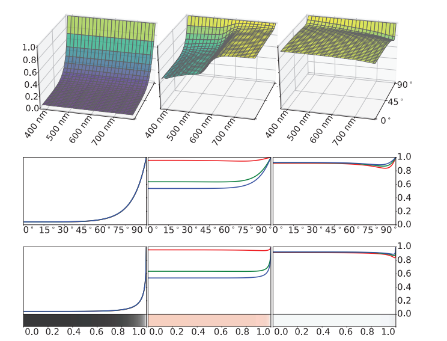

在镜面反射（mirror reflection）的情况下，光线的出射角与入射角完全相同，这意味着与表面呈掠射角度的入射光线（$\theta_{i}$的值接近90◦），其出射光线也与表面呈掠射角度，并最终进入相机或者眼睛，因此反射率的增加主要会出现在物体的边缘处。此外，从相机的视角来看，表面反射率增加最剧烈的部分会被透视缩短（foreshortened），因此这部分所占用的像素数量相对较少。为了展示菲涅尔曲线的不同部分与其视觉突出程度（prominence）成比例，图9.22和图9.20的下半部分所展示的菲涅尔反射率曲线和色条，都是使用$\sin \left(\theta_{i}\right)$作为参数进行绘制的，而不是直接使用$\theta_{i}$作为参数。图9.21则说明了为什么$\sin \left(\theta_{i}\right)$是一个更加合适的参数选择。

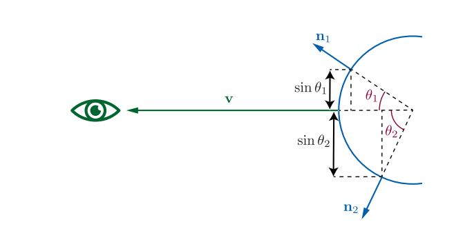

从现在开始，为了强调所涉及的向量，我们使用符号$F(\mathbf{n}, \mathbf{l})$而不是$F\left(\theta_{i}\right)$来表示菲涅尔函数。回想一下，$\theta_{i}$是表面法线$\mathbf{n}$和入射光方向$\mathbf{l}$之间的夹角。当菲涅尔函数被整合为BRDF的一部分时，通常会使用一个不同的向量来代替表面法线$\mathbf{n}$，详见章节9.8。

在有关渲染的出版物中，在掠射角度处反射率剧烈增加的现象，通常被称为菲涅尔效应（Fresnel effect）(而在其他领域中，该术语则具有不同的含义，它与无线电波的传输有关）。我们可以通过一个简单的小实验，来亲眼看到菲涅尔效应。带上你的智能手机，坐在光线明亮的地方（比如电脑显示器前）。在不打开手机屏幕显示的情况下，首先将手机靠近胸口，低头看手机，并将手机略微倾斜，使得手机屏幕能够反射出显示器。此时手机屏幕上会有一个相对较弱的显示器反射，这是因为玻璃的法线入射反射率很低。现在将手机向上抬起，使其大致位于眼睛和显示器之间，并再次调整屏幕的角度，使其能够反射出显示器。现在显示器在手机屏幕上的反射，应当几乎与显示器本身一样明亮清晰。

除了非常复杂之外，菲涅尔方程还有一些其他的特性，这些特性使得菲涅尔方程很难直接用于渲染。它需要在可见光谱上采样折射率值，这些值可能会是复数。图9.20中的曲线展示了一种基于特征高光颜色$F_0$的简化方法。Schlick \[1568]给出了菲涅尔反射率的近似值，如下所示：

$$
F(\mathbf{n}, \mathbf{l}) \approx F_{0}+\left(1-F_{0}\right)\left(1-(\mathbf{n} \cdot \mathbf{l})^{+}\right)^{5}
\tag{9.16} 
$$

这个函数实际上就是在白色和$F_0$之间进行RGB插值，尽管它很简单，但是这个近似还是相当准确的。

图9.22展示了几种偏离Schlick曲线的物质，它们（第二行）在变白之前会表现出明显的“下降”。事实上，之所以选择这些物质进行展示，就是因为它们在很大程度上偏离了Schlick近似。但是即使对于这些物质而言，Schlick近似所带来的误差也相当微小，如图中每个曲线下面的颜色条。在极少数情况下，我们可能需要精确模拟这些材料的菲涅尔反射，那么此时可以使用Gulbrandsen \[623]给出的另一种近似方法，这种近似方法可以精确近似金属的菲涅尔方程，但是计算开销要高于Schlick近似。一个更加简单的选择是对Schlick近似进行修改，使得它可以将最后一项提高到5次幂以上（方程9.18）。这种修改会改变过渡到白色的“速度”，从而使得近似更加精确。Lagarde \[959]对菲涅尔方程以及几种近似方法进行了总结。

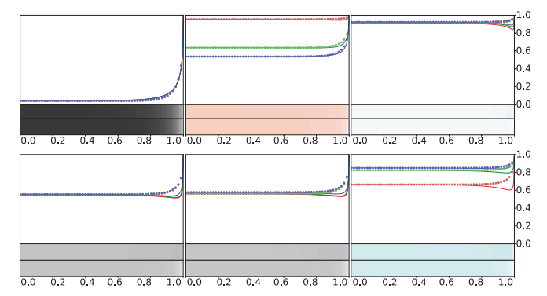

当我们使用Schlick近似时，$F_0$是控制菲涅尔反射的唯一参数。这种方式十分方便，因为$F_0$在$[0,1]$中有一个定义良好的有效值范围，很容易使用标准的颜色选择界面进行设置，并且可以使用为颜色设计的纹理格式来进行纹理化操作。此外，还可以使用许多现实世界材料的属性来作为$F_0$的参考值。$F_0$也可以通过折射率计算得出，通常假设空气折射率的近似值$n_1 = 1$，用$n$代替$n_2$，来表示物体的折射率。简化之后可以获得如下方程：

$$
F_{0}=\left(\frac{n-1}{n+1}\right)^{2}
\tag{9.17}  
$$

如果使用复数结果的话，这个方程甚至适用于复数折射率（例如金属的折射率）。在可见光谱中折射率变化较大的情况下，计算$F_0$的精确RGB值，需要首先计算密集采样波长下的$F_0$，然后再使用章节8.1.3种所描述的方法，将得到的光谱矢量转换为RGB值。

在一些应用中\[732, 947]使用了Schlick近似的更一般形式：

$$
F(\mathbf{n}, \mathbf{l}) \approx F_{0}+\left(F_{90}-F_{0}\right)\left(1-(\mathbf{n} \cdot \mathbf{l})^{+}\right)^{\frac{1}{p}}
\tag{9.18}  
$$

这个方程可以让我们控制菲涅尔曲线在$90^{\circ}$时所过渡到的颜色，以及过渡的“速度”。使用这种更加一般的形式，通常是为了增加艺术可控性，但是在某些情况下，它也可以对现实进行更加精确的近似。上面我们提到，修改幂次可以使得某些材质更加接近现实。此外，对于一些材质而言，菲涅耳方程无法很好地描述它们，而将$F_{90}$设置为白色以外的颜色，则可以帮助对它们的近似，例如被细尘覆盖的表面，这些细尘颗粒的大小与单个光波的大小相当。

### 9.5.2 典型的菲涅尔反射值

物质根据其光学特性可以分为三大类，它们分别是电介质（dielectric），也就是绝缘体（insulator）；金属（metal），它们是导体（conductor）；半导体（semiconductor），它的性质介于电介质和金属之间。

#### 电介质的菲涅尔反射率

我们日常生活中遇到的大多数材料都是电介质——玻璃、皮肤、木材、头发、皮革、塑料、石头和混凝土等等。水也是电介质，这可能会让你感到惊讶，因为我们知道，日常生活中的水是可以导电的，但是实际上纯水是不导电的，这种导电性是由于水中含有的各种杂质所产生的。电介质具有相当低的$F_0$值，通常为0.06或者更低。法线反射时的低反射率，会使得菲涅尔效应在电介质中尤为明显。电介质的光学特性在可见光谱上的变化很小，从而会导致无色的反射率值。几种常见电介质的$F_0$值如表9.1所示，表中的数值都是标量而不是RGB值，这是因为这些材质的RGB通道并没有显著的差异。为了方便起见，表9.1中包含了线性值，以及用sRGB转换函数编码的8 bit值（通常在纹理绘制应用中会使用这种形式）。

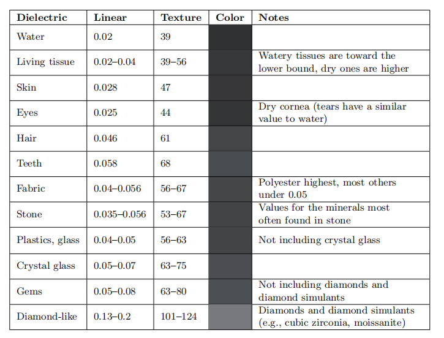

其他电介质的$F_0$值可以通过查看表中的类似物质推断出来。对于未知的电介质而言，0.04是一个合理的默认值（译者注：metallic工作流中，非金属的$F_0$值一般为0.04），这与大多数常见材料的$F_0$值相差不大。

一旦光线进入了电介质内部，那么它就有可能会被进一步散射或者吸收。章节9.9将详细讨论这个过程的模型。如果物体的材质是透明的，光线将继续传播，直到“从内部”照射到物体表面，我们将在章节9.5.3中进行详细讨论。

#### 金属的菲涅尔反射率

金属的$F_0$值普遍很高，几乎都在0.5以上。一些金属的光学特性会在可见光谱上发生较大的变化，从而会产生彩色的反射值。几种金属的$F_0$值如表9.2所示。

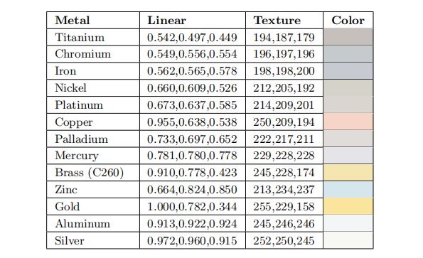

与表9.1类似，表9.2中包含了线性值以及用于纹理的8 bit sRGB编码值。然而不同之处在于，这里我们给出了RGB各个分量的详细数值，因为许多金属都具有彩色的菲涅尔反射。这些RGB值是使用sRGB原色（与Rec. 709，电影电视行业所使用的一种色域）和白点定义的。黄金的$F_0$值有些不太寻常，它有着非常强烈的反射颜色，其红色通道值略高于1（刚刚超出sRGB/Rec.709色域），其蓝色通道值则特别低（表9.2中唯一一个显著低于0.5的）。黄金也是最亮的金属之一，从它在表中的位置可以看出，因为表格是按照亮度进行排序的。黄金明亮且强烈的反射率，可能有助于其在历史上独特的文化意义和经济意义。

回顾一下，金属会立即吸收任何透射光线，因此它们并不会表现出任何的次表面散射或者透明度。金属的所有可见颜色都来自于其$F_0$值。

#### 半导体的菲涅尔反射值

正如人们所料，半导体的$F_0$值介于最亮的电介质和最暗的金属之间，如表9.3所示。在实践中我们很少需要渲染这样的物质，因为大多数渲染场景中并没有散落着的晶体硅块。出于实践目的，应当避免使用0.2-0.45之间的$F_0$值，除非您有意尝试建模一个奇异的或者非真实的材质。

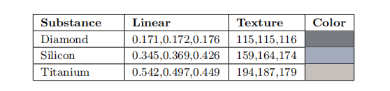

#### 水中的菲涅尔反射率

在我们有关外反射的讨论中，我们假设要渲染的表面被空气包围。如果实际情况不是这样的话，那么反射率就会改变，因为它取决于表面两侧折射率的比值。如果我们不能假设$n_1 = 1$的话，则需要将方程9.17中的$n$替换为相对折射率$n_1/n_2$。即下面这个更加一般化的方程：

$$
F_{0}=\left(\frac{n_{1}-n_{2}}{n_{1}+n_{2}}\right)^{2}
\tag{9.19}  
$$

$n_1 \ne 1$最常见的情况就是水下场景，由于水的折射率大约是空气的1.33倍，因此水下的$F_0$值是完全不同的，电介质的这种效应要比金属更强，如表9.4所示。

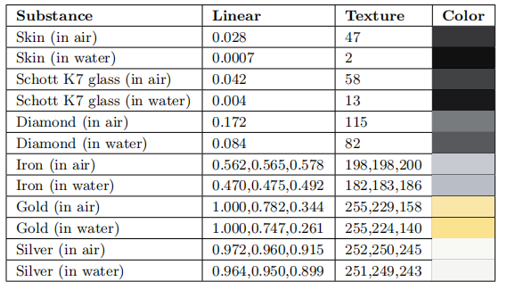

#### 参数化的菲涅尔值

一个常用的参数化是将镜面颜色（specular color）$F_0$和漫反射颜色（diffuse color）$\rho_{ss}$结合在一起（漫反射颜色将在章节9.9中进一步讨论）。这种参数化利用了以下的观察结果：金属材质没有漫反射颜色，而电介质可能存在的$F_0$值是一个有限集合。这种参数化表示包含一个$RGB$表面颜色$\mathbf{c}_{surf}$和一个标量参数$m$，这个参数被称为“metallic”或者“metalness”，即金属度。如果$m=1$，则说明该材质是金属，则将$\mathbf{c}_{surf}$设置为$F_0$，$\rho_{ss}$设置为黑色；如果$m=0$，则说明该材质是非金属，则将介电值（常数，或者由其他附加参数进行控制）设置为$F_0$，$\mathbf{c}_{surf}$设置为$\rho_{ss}$。

这个“金属度”参数最初是作为布朗大学（Brown University）\[1713]使用的早期着色模型中的一部分出现的；而目前形式的参数化，则首次被皮克斯（Pixar）用于电影《机器人总动员（Wall-E）》\[1669]。对于迪士尼动画电影《无敌破坏王（Wreck-It Ralph）》系列中使用的迪士尼原则着色模型，Burley添加了一个额外的标量“镜面（specular）”参数，来将电介质的$F_0$值控制在一个有限的范围内\[214]。虚幻引擎\[861]同样使用了这种形式的参数化，而寒霜引擎所使用的形式则有一些不同，它允许电介质使用较大范围的$F_0$值\[960]。游戏《使命召唤：无限战争》则使用了一种变体，它将这些金属度参数和镜面参数打包成一个单一的值\[384]，从而节省了内存空间。

对于那些使用这种金属度参数化，而不是直接使用$F_0$和$\rho_{ss}$的渲染程序，其动机包括方便用户使用，节省纹理存储空间或者G-buffer存储空间等。在游戏《使命召唤：无限战争》中，这种参数化以一种独特的方式进行使用。艺术家为$F_0$和$\rho_{ss}$绘制纹理，程序会自动执行一种压缩方法，将其转换为金属度参数化形式。

使用这种金属度参数化有一些缺点，即它无法表示某些特殊类型的材质，例如一个具有彩色$F_0$值的金属，其表面涂有一层电介质，在金属和电介质之间的边界上，可能会出现瑕疵\[960, 1163]。

一些实时应用程序使用了另一种参数化技巧，它基于这样的一个事实：除了特殊的抗反射涂层（anti-reflective coating）之外，没有任何材料的$F_0$值低于0.02。这个技巧可以用来抑制表面上某些代表空腔或者空洞的镜面高光。$F_0$低于0.02的值被用来“关闭”菲涅尔的边缘增亮效果，而不是使用单独的镜面遮挡纹理进行控制。这种技术最初是由Schuler \[1586]提出的，它现在被应用于虚幻引擎\[861]和寒霜引擎\[960]中。

### 9.5.3 内反射

虽然外反射在渲染中更加常见，但是内反射有时候也会很重要。当$n_1 > n_2$的时候，就会发生内反射，也就是说，当光线在透明物体的内部传播，并“从内部”打到物体表面上时，就会发生内反射，如图9.23所示。

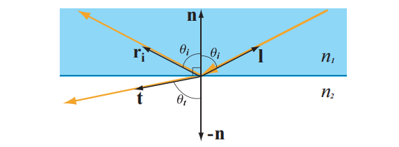

Snell定律表明，对于内反射，有$\sin \theta_{t}>\sin \theta_{i}$；由于$\theta_{t},\theta_{i}$都在$0^{\circ}$-$90^{\circ}$之间，因此也意味着$\theta_{t}>\theta_{i}$，如图9.23所示。而在外反射的情况下，角度大小的情况正好相反（可以与图9.9进行比较），二者之间的不同之处是理解内反射和外反射差异的关键所在。在外反射中，对于0-1之间的任意一个$\sin \theta_{i}$，都存在一个有效的（较小的）$\sin \theta_{t}$值。但是内反射则不是这样的，在内反射中存在一个临界角$\theta_{c}$，对于大于这个临界角的入射角$\theta_{i}$，根据Snell定律我们能推导出表明$\sin \theta_{t}>1$，即$\theta_{t}> 90^{\circ}$，这是不可能发生的。在这种情况下，$\theta_{t}$实际上是不存在的，即当$\theta_{i}>\theta_{c}$的时候，不会发生光线透射，入射光将会被全部反射。这种现象被称为全内反射（total internal reflection）。

菲涅尔方程是对称的，也就是说入射向量和透射向量是可以相互交换的，并且反射率保持不变。结合Snell定律，这种对称性意味着，内反射的$F\left(\theta_{i}\right)$曲线将类似于外反射曲线的“压缩”版本。即内外反射的$F_0$的值是相同的，但是内反射曲线会在临界角$\theta_{c}$处就提前达到完美反射，而外反射曲线则会在$90^{\circ}$处才达到完美反射，如图9.24所示。从曲线中我们还可以看出，内反射的平均反射率更高，这就是为什么在水下看到的气泡，会具有高度反射的银色外观的原因。

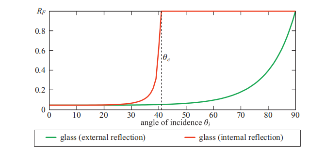

内反射只会发生在电介质中，因为金属和半导体会迅速吸收在其内部传播的任何光线\[285, 286]。由于电介质的折射率都在实数范围内，因此通过折射率或者$F_0$来计算内反射临界角是很简单的：

$$
\sin \theta_{c}=\frac{n_{2}}{n_{1}}=\frac{1-\sqrt{F_{0}}}{1+\sqrt{F_{0}}}
\tag{9.20}  
$$

方程9.16展示的Schlick近似，对于外反射而言是正确的，通过使用透射角$\theta_{t}$来代替入射角$\theta_{i}$，它也可以用于内反射中。如果此时已经有了透射方向$\mathbf{t}$（例如：用于渲染折射，详见章节14.5.2），那么可以用它来计算透射角$\theta_{t}$。或者可以使用Snell定律，利用入射角$\theta_{i}$来计算透射角$\theta_{t}$，但是这个计算成本会很高，并且需要两侧物质的折射率参数，而折射率可能是无法获得的。

## 9.6 微观几何（Microgeometry）

我们在章节9.1.3中讨论过，比单个像素小得多的不规则表面无法被显式建模，因此BRDF会转而对它们的总体效应进行统计建模。目前，我们的讨论仍然停留在几何光学领域，它假设这些不规则表面要么小于光的波长（即对光的行为没有影响），要么比光的波长大得多。而有关“波动光学”领域中的不规则表面（大约1-100波长大小）的影响，将在章节9.11中进行讨论。

每个可见的表面点上都包含了许多微表面法线（microsurface normal），这些法线将入射光向着不同方向进行反射。由于单个微表面的朝向在某种程度上来说是随机的，因此将它们建模为某种统计分布是十分有道理的。对于大多数表面而言，其微观几何的表面法线是一个连续分布，而在宏观的表面法线处则存在一个很强的峰值。这种分布的“紧密程度”是由表面粗糙度所决定的。表面越粗糙，微观几何表面的法线分布就会越“分散”。

增加微观尺度的粗糙度，其宏观的视觉效果就是反射的环境细节会变得更加模糊。在一个小且明亮的光源下，这种模糊会导致范围更宽、颜色更暗的高光。而那些来自粗糙表面的反射光线则会更暗，因为光线会被发散到了一个更宽的锥形方向上。这一现象可以在图9.12中看到。

图9.25展示了单个微观尺度表面细节的聚合反射，是如何产生宏观可见反射的。这一组图像展示了一个由单一光源照亮的曲面，每个曲面上的凸起大小逐渐减小，直到最后一张图像中的表面凸起比单个像素还要小得多。许多个微小高光以一种统计模式，最终聚合成了宏观的高光。例如：外围单个高光的相对稀疏程度在聚合之后，就变成了远离高光中心点的相对暗度。

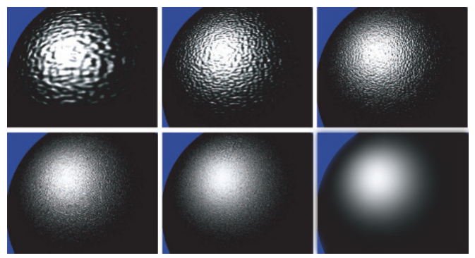

对于大多数表面而言，微尺度表面法线的分布是各向同性的，这意味着它是旋转对称的，不具备任何固有的方向属性。而有一些表面则具有各向异性（anisotropic）的微观结构，这样的表面具有各向异性的表面法线分布，这会导致反射和高光的定向模糊，如图9.26所示。

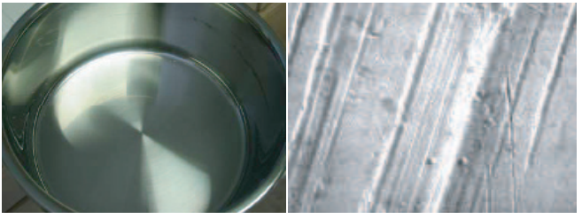

有一些表面具有高度结构化的微观几何形状，这产生了各种微观尺度的法线分布和表面外观。纤维织物就是一个常见的例子——天鹅绒和绸缎的独特外观，就是由它们的微观几何结构所决定的\[78]。有关纤维织物的模型，将在章节9.10中进行讨论。

虽然多重表面法线是微观几何对反射率的主要影响因素，但是其他影响因素有时候也很重要。其中遮蔽（shadowing）是指部分微尺度表面细节对光源的遮挡，使得光线无法照射到另一部分表面上，如图9.27左侧所示。而遮挡（masking）是指微尺度表面细节对相机的遮挡，使得相机无法看见一些表面，如图9.27中间所示。（译者注：后文中就不翻译shadowing和masking了，容易混淆）

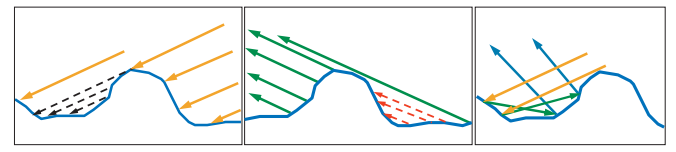

如果微观几何的高度与表面法线之间存在相关性的话，那么shadowing和masking就能够有效地改变表面的法线分布。例如：想象这样的一个表面，该表面上凸起的部分因为风化或者其他过程而变得十分光滑，而凹陷的部分仍然十分粗糙。在掠射视角下，表面的凹陷部分往往会被shadowing或者masking，从而生成一个十分光滑的表面。如图9.28所示。

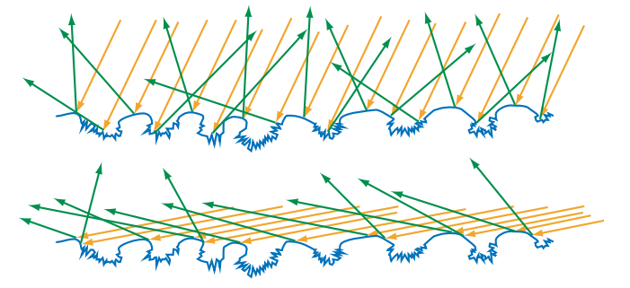

对于所有的表面类型而言，不规则表面的可见尺寸会随着光线入射角$\theta_i$与表面法线之间夹角的增加而减小。在极端的掠射角度下，这种效应可以将观察到的不规则表面尺寸，减小到比光的波长还要短，从而使得这些不规则表面对于光线的传播行为没有任何影响。这两种效应与菲涅尔效应相结合，使得表面看起来具有很高的反射率，就像镜子一样，因为此时的观察角度和光线角度接近$90^{\circ}$\[79, 1873, 1874]。

我们可以自己做个小实验。将一张没有光泽的纸卷成一根长管，并将它对准明亮的窗户或者电脑屏幕；当我们的视角几乎与纸张平行的时候，我们会在纸张上看到窗户或者屏幕的尖锐反射。只有这个纸质长管和电脑屏幕（或者明亮的窗户）之间的角度非常接近$90^{\circ}$时，才能看到这种效果。

被微尺度表面细节遮挡的光线并不会消失，它可能会被反射到其他的微观几何上。光线在最终到达眼睛之前，可能会经历多次这种类型的反射，图9.27右侧就展示了这种相互反射现象。由于光线在每次反弹时都会被菲涅尔反射衰减，因此电介质中的相互反射往往都不易察觉（subtle）。而在金属材质中，这种多次弹射是任何可见的漫反射的来源，这是因为金属没有次表面散射现象。有色金属的多次反射颜色要比一次反射的更深，因为它们是光线与表面多次相互作用的结果。

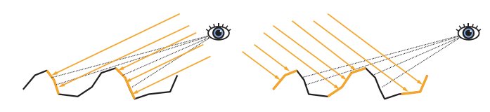

到目前为止，我们已经讨论了微观几何对镜面反射率（表面反射率）的影响。在某些情况下，微尺度的表面细节也会对次表面反射率产生影响。如果微观几何的不规则性大于次表面散射发生距离的话，那么shadowing和masking就会导致逆反射（retroreflection）效应，即光线被优先反射回入射方向。这种效应的发生原因是：当观察方向和光照方向相差很大时，shadowing和masking会遮挡被光线照射到的区域，如图9.29所示。逆反射往往会使粗糙表面表现出平坦的外观，如图9.30所示。

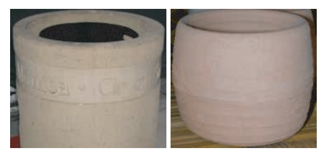

## 9.7 微表面理论

有关微观几何对反射率影响的数学分析，被称为微表面理论（microfacet theory），许多BRDF模型都是建立在这个理论之上的。这个工具最初是由光学界的研究人员提出的\[124]，1977年由Blinn \[159]引入了计算机图形学，1981年由Cook和Torrance \[285]再次引入。该理论的基础是，将微观几何建模为一组微表面的集合。

每个微表面都是平坦的，它具有一个微表面法线$\mathbf{m
}$；这些微表面会根据micro-BRDF$f_{\mu}(\mathbf{l}, \mathbf{v}, \mathbf{m})$来对光线进行分别反射，将所有微表面的反射率加起来，就是整个表面的BRDF。通常的做法是将每个微表面都当成一个完美的菲涅尔镜面，这会产生镜面的微表面BRDF，用于模拟表面反射。当然，其他选择也是可行的，例如：漫反射的micro-BRDF可以用于生成一些局部的次表面散射模型\[574, 657, 709, 1198, 1337]；衍射的micro-BRDF可以用于创建一个结合几何光学和波动光学效果的着色模型\[763]。

微表面模型的一个重要性质是微表面法线$\mathbf{m
}$的统计分布。这个分布是由表面的法线分布函数（normal distribution function，NDF）所定义的。为了避免与高斯正态分布（Gaussian normal distribution）相混淆，有些文献则使用了术语“法线的分布（distribution of normal）”。这里我们将使用$D(\mathbf{m})$来表示方程中的NDF项。

(\mathbf{n} \cdot \mathbf{m}) 进行积分，将微表面区域投影到宏表面平面上，可以得到宏表面的面积（在这个侧视图中则体现为长度），按照约定是1。右侧：对 D(\mathbf{m})(\mathbf{v} \cdot \mathbf{m}) 进行积分，将微表面区域投影到垂直于观察方向 \mathbf{v} 的平面上，可以获得宏表面在该平面上的投影，即 \cos \theta_{o} 或者 (\mathbf{v} \cdot \mathbf{n}) 。当多个微表面的投影相互重叠的时候，背面微表面的负投影区域会和对应的正面微表面的正投影区域相互抵消。")

NDF项$D(\mathbf{m})$是微表面法线在微观几何区域上的统计分布。在整个微表面法线球面上对$D(\mathbf{m})$进行积分，即可获得这个微表面的面积\[708]。更加有用的是，对$D(\mathbf{m})(\mathbf{n} \cdot \mathbf{m})$进行积分，即将$D(\mathbf{m})$投影到宏表面平面上，所得到的宏表面面片的面积为1（按照约定），如图9.31左侧所示。换句话说，投影$D(\mathbf{m})(\mathbf{n} \cdot \mathbf{m})$是归一化的：

$$
\int_{\mathbf{m} \in \Theta} D(\mathbf{m})(\mathbf{n} \cdot \mathbf{m}) d \mathbf{m}=1
\tag{9.21} 
$$

本章节之前的积分，都是在以$\mathbf{n}$为中心的半球内进行的，使用符号$\Omega$来表示；而这里是对整个球面的法线进行积分，因此使用符号$\Theta$来表示。大多数图形出版物中都使用了这种符号，但是也有少部分参考文献\[708]使用了符号$\Omega$来表示完整的球体。在实践中，图形学中所使用的微观结构模型大多数是高度场（heightfield），这意味着在$\Omega$以外的所有方向$\mathbf{m
}$上，$D(\mathbf{m})=0$。但是，方程9.21对于非高度场的微观结构也是有效的。

更一般地说，微表面（microsurface）和宏表面（macrosurface）在垂直于观察方向$\mathbf{v
}$的平面上的投影是相等的，即：

$$
\int_{\mathbf{m} \in \Theta} D(\mathbf{m})(\mathbf{v} \cdot \mathbf{m}) d \mathbf{m}=\mathbf{v} \cdot \mathbf{n}
\tag{9.22} 
$$

方程9.21和方程9.22中的点积没有限制到0，图9.31的右侧子图解释这个原因。方程9.21和方程9.22 强制要求$D(\mathbf{m})$必须是一个合法的NDF。

从直观上来看，NDF就好像是微表面法线的直方图。它在微表面法线更可能指向的方向上，具有更高的值。大多数表面的NDF都在宏观表面法线$\mathbf{n}$处，具有很强的峰值。章节9.8.1将介绍在渲染中常用的几个NDF模型。

让我们再看一下图9.31的右侧子图。虽然有许多微表面的投影相互重叠了，但是对于渲染而言，我们只关心能够被相机看见的那些微表面，即在每个重叠集合中最接近相机的那个微表面。根据这个事实，可以提出另一种方法，来将投影后的微表面区域与宏观区域联系起来：可见微表面的投影面积之和 = 宏表面的投影面积。我们可以通过定义遮挡函数（masking function）$G_{1}(\mathbf{m}, \mathbf{v})$，以数学的方式来表达这一点，$G_{1}(\mathbf{m}, \mathbf{v})$给出了沿观察方向$\mathbf{v}$，具有法线$\mathbf{m}$的可见微表面的比例。$G_{1}(\mathbf{m}, \mathbf{v})D(\mathbf{m})(\mathbf{n} \cdot \mathbf{m})^+$的球面积分，则给出了在垂直于观察方向$\mathbf{v
}$的平面上，宏表面的投影面积，即：

$$
\int_{\in \Theta} G_{1}(\mathbf{m}, \mathbf{v}) D(\mathbf{m})(\mathbf{v} \cdot \mathbf{m})^{+} d \mathbf{m}=\mathbf{v} \cdot \mathbf{n}
\tag{9.23}  
$$

图9.32展示了方程所描述的过程。与方程9.22有所不同的是，方程9.23中的点积被限制到0，我们在章节1.2中介绍过这个操作，使用符号$x^+$来进行表示。位于背面的微表面是不可见的，所以在这种情况下它们并不会被计算在内。向量$G_{1}(\mathbf{m}, \mathbf{v}) D(\mathbf{m})$与可见法线的分布（distribution of visible normal）有关\[708]。

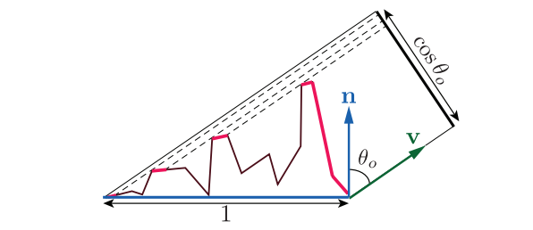

虽然方程9.23对$G_{1}(\mathbf{m}, \mathbf{v})$施加了一些约束，但是却无法唯一地决定它。对于给定的微表面法线分布$D(\mathbf{m})$\[708]，存在无数个masking函数满足约束条件。这是因为$D(\mathbf{m})$并不能完全决定微表面的全部细节，它仅仅告诉了我们有多少个微表面的法线指向了这个方向，但是却没有告诉我们这些法线具体的排列方式。

尽管多年来已经提出了各种形式的$G_{1}$函数，但直到Heitz的一篇优秀论文\[708]，才解决了（至少目前）到底使用哪种函数这一困境（dilemma）。Heitz讨论了Smith masking函数，这个函数最初是为高斯正态分布而推导出来的\[1665]，后来才推广到了任意的NDF上\[202]。Heitz表明，在文献中提到的各种masking函数中，只有Smith函数和Torrance-Sparrow“V-cavity”函数\[1779]服从方程9.23，即在数学上是有效合法的。他进一步表明，Smith函数要比Torrance-Sparrow函数更加接近随机微表面的表现。Heitz还证明了Smith masking函数是唯一一个可能既服从方程9.23，又具有法线-masking独立性的函数。这意味着函数$G_{1}(\mathbf{m}, \mathbf{v})$并不依赖于微表面法线$\mathbf{m}$的方向，只要这个$\mathbf{m}$不朝向背面即可，即只要$\mathbf{m} \cdot \mathbf{v} \ge 0$即可。Smith$G_{1}$函数的数学形式如下：

$$
G_{1}(\mathbf{m}, \mathbf{v})=\frac{\chi^{+}(\mathbf{m} \cdot \mathbf{v})}{1+\Lambda(\mathbf{v})}
\tag{9.24}  
$$

其中$\chi^{+}$是正特征函数：

$$
\chi^{+}(x)=\left\{\begin{array}{ll}1, & \text { where } x>0, \\ 0, & \text { where } x \leq 0 .\end{array}\right.
\tag{9.25}  
$$

每个NDF的$\Lambda$（lambda）函数都是不同的。Walter等人\[1833]和Heitz \[708]在出版物中，描述了为给定NDF推导$\Lambda$函数的过程。

Smith masking函数确实存在一些缺点。从理论的角度来看，它的函数需求与实际的表面结构并不一致\[708]，甚至可能在物理上无法实现\[657]。从实践的角度来看，虽然它对随机表面的模拟是相当准确的，但是对于法线方向和masking之间具有较强依赖性的表面（如图9.28所展示的表面），尤其是当该表面具有一些重复结构的时候（例如大多数织物），Smith masking函数的准确性预计会下降。然而，在找到更好的替代方案之前，它还是大多数渲染程序的最佳选择。

对于一个给定的微观几何描述，它包括以下几部分：micro-BRDF项$f_{\mu}(\mathbf{l}, \mathbf{v}, \mathbf{m})$，法线分布函数$D(\mathbf{m})$，以及遮挡函数$G_{1}(\mathbf{m}, \mathbf{v})$。据此可以推导出宏表面的BRDF \[708, 1833]，即：

$$
f(\mathbf{l}, \mathbf{v})=\int_{\mathbf{m} \in \Omega} f_{\mu}(\mathbf{l}, \mathbf{v}, \mathbf{m}) G_{2}(\mathbf{l}, \mathbf{v}, \mathbf{m}) D(\mathbf{m}) \frac{(\mathbf{m} \cdot \mathbf{l})^{+}}{|\mathbf{n} \cdot \mathbf{l}|} \frac{(\mathbf{m} \cdot \mathbf{v})^{+}}{|\mathbf{n} \cdot \mathbf{v}|} d \mathbf{m}.
\tag{9.26}  
$$

这个积分在以法线$\mathbf{n}$为中心的半球$\Omega$上进行的，从而避免计算从表面下方照射来的光线贡献。方程9.26使用了联合masking-shadowing函数（joint masking-shadowing function）$G_{2}(\mathbf{l}, \mathbf{v}, \mathbf{m})$，来代替遮挡函数$G_{1}(\mathbf{m}, \mathbf{v})$。这个函数是从$G_{1}$中推导出来的，它给出了在两个方向上具有法线$\mathbf{m}$的可见微表面的比例，这两个方向分别是观察方向$\mathbf{v}$和光线方向$\mathbf{l}$。通过引入$G_{2}$函数，方程9.26使得BRDF能够同时考虑shadowing和masking对着色的影响，但是它并没有考虑微表面之间的相互反射情况（详见图9.27）。从方程9.26推导出的所有BRDF都有一个共同的局限性，即没有考虑微表面之间的相互反射，这样的BRDF看起来要比真实情况暗一些。在章节9.8.2和章节9.9中，我们将讨论为解决这一局限性而提出的一些方法。

Heitz \[708]讨论了$G_{2}$函数的几个版本，其中最简单的是可分离形式，其中的shadowing和masking分别使用$G_{1}$函数进行评估，并将计算结果相乘：

$$
G_{2}(\mathbf{l}, \mathbf{v}, \mathbf{m})=G_{1}(\mathbf{v}, \mathbf{m}) G_{1}(\mathbf{l}, \mathbf{m}).
\tag{9.27}  
$$

这种形式的$G_{2}$函数相当于假设shadowing和masking是两个不相关的事件，但是在现实中它们并非如此，并且这种假设会导致使用该$G_{2}$函数的BRDF过暗。

举一个极端的例子，当观察方向与光线方向相同时，在这种情况下，$G_{2}$应当等于$G_{1}$，因为没有任何一个可见的微表面被shadowing，但是根据方程9.27，$G_{2}$将等于$G_{1} ^2$。

如果微表面是一个高度场的话（在渲染中通常会使用高度场来作为微表面模型），那么每当观察方向$\mathbf{v}$和光线方向$\mathbf{l}$之间的相对方位角$\phi$等于$0^{\circ}$时（如图9.17中的$\phi$），$G_{2}(\mathbf{l}, \mathbf{v}, \mathbf{m})$应当等于$\min(G_{1}(\mathbf{v}, \mathbf{m}),G_{1}(\mathbf{l}, \mathbf{m}))$。这种关系提出了一种通用的方法，来解释shadowing和masking之间的关系，并且可以应用于任何$G_{1}$函数：

$$
\begin{aligned}{}
G_{2}(\mathbf{l}, \mathbf{v}, \mathbf{m})&=\lambda(\phi) G_{1}(\mathbf{v}, \mathbf{m}) G_{1}(\mathbf{l}, \mathbf{m})\\
&+(1-\lambda(\phi)) \min \left(G_{1}(\mathbf{v}, \mathbf{m}), G_{1}(\mathbf{l}, \mathbf{m})\right)
\end{aligned}{}
\tag{9.28}   
$$

其中$\lambda(\phi)$是某种随着角$\phi$的增大，从0逐渐增加到1的函数。Ashikhmin等人\[78]建议采用标准差为$15^{\circ}$（约为0.26弧度）的高斯分布：

$$
\lambda(\phi)=1-e^{-7.3 \phi^{2}}
\tag{9.29}   
$$

van Ginneken等人\[534]提出了一种不同的$\lambda$函数：

$$
\lambda(\phi)=\frac{4.41 \phi}{4.41 \phi+1}
\tag{9.30}  
$$

无论观察方向和光线方向是否对齐，在给定表面点上的shadowing和masking仍然是相关的，这还有另一个原因，即二者都与表面点相对于曲面其他部分的高度有关。对于高度较低的表面点而言，它被shadowing或者masking的概率都会增加。如果使用Smith masking函数的话，那么二者的相关性可以用Smith高度相关的masking-shadowing函数来精确地解释：

$$
G_{2}(\mathbf{l}, \mathbf{v}, \mathbf{m})=\frac{\chi^{+}(\mathbf{m} \cdot \mathbf{v}) \chi^{+}(\mathbf{m} \cdot \mathbf{l})}{1+\Lambda(\mathbf{v})+\Lambda(\mathbf{l})}
\tag{9.31} 
$$

Heitz同样描述了一种结合了方向相关性和高度相关性的Smith $G_2$函数：

$$
G_{2}(\mathbf{l}, \mathbf{v}, \mathbf{m})=\frac{\chi^{+}(\mathbf{m} \cdot \mathbf{v}) \chi^{+}(\mathbf{m} \cdot \mathbf{l})}{1+\max (\Lambda(\mathbf{v}), \Lambda(\mathbf{l}))+\lambda(\mathbf{v}, \mathbf{l}) \min (\Lambda(\mathbf{v}), \Lambda(\mathbf{l}))}
\tag{9.32} 
$$

其中的函数$\lambda(\mathbf{v}, \mathbf{l})$可以是一个经验函数，如方程9.29和方程9.30所描述的函数，也可以是一个专门为给定的NDF 推导出来的函数\[707] 。

在这些替代方案中，Heitz \[708]推荐了Smith函数的高度相关形式（方程9.31），因为它与高度不相关形式的Smith函数，具有相似的开销和更好的准确性。这种形式在实践中使用得最为广泛\[861, 947, 960]，其他一些从业者使用了可分离形式的Smith函数（方程9.27）\[214, 1937]。

方程9.26中所描述的微表面BRDF并不会直接用于渲染，而是在给定micro-BRDF$f_{\mu}$的情况下，推导出一个封闭形式的解（精确解或者近似解）。我们将在下一小节中，展示这种派生类型的第一个例子。

## 9.8 表面反射的BRDF模型

除了少数例外情况，在基于物理的渲染中所使用的镜面BRDF项，都来源于微表面理论。在镜面反射的情况下，每个微表面都是一个完美光滑的菲涅尔镜面，回顾一下，这样的镜面会将每束入射光线，都反射到一个单一的反射方向上。这就意味着除非观察方向$\mathbf{v}$刚好与光线的出射方向平行，不然每个表面的micro-BRDF$f_{\mu}(\mathbf{l}, \mathbf{v}, \mathbf{m})$都等于零。而对于给定的观察方向$\mathbf{v}$和光线入射方向$\mathbf{l}$，这种情况相当于微表面的法线$\mathbf{m}$，与$\mathbf{v}$和$\mathbf{l}$的中间向量对齐，这个中间向量被称为半向量（half vector）$\mathbf{h}$，如图9.33所示。半向量$\mathbf{h}$是通过将观察方向$\mathbf{v}$和光线入射方向$\mathbf{l}$相加，并将结果进行归一化计算而来的：

$$
\mathbf{h}=\frac{1+\mathbf{v}}{\|\mathbf{l}+\mathbf{v}\|}
\tag{9.33} 
$$

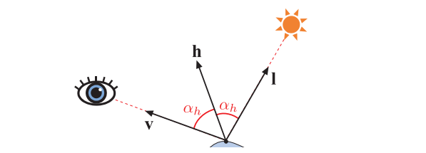

菲涅尔镜面的micro-BRDF$f_{\mu}(\mathbf{l}, \mathbf{v}, \mathbf{m})$对于所有$\mathbf{m} \ne \mathbf{h}$时的情况都为零，当我们从方程9.26中推导高光微表面模型的时候，这个事实是十分方便的，因为它将原本的积分形式退化为了在$\mathbf{m} = \mathbf{h}$处，对被积函数进行求值。这样就做可以得到高光BRDF项：

$$
f_{\text {spec }}(\mathbf{l}, \mathbf{v})=\frac{F(\mathbf{h}, \mathbf{l}) G_{2}(\mathbf{l}, \mathbf{v}, \mathbf{h}) D(\mathbf{h})}{4|\mathbf{n} \cdot \mathbf{l}||\mathbf{n} \cdot \mathbf{v}|}
\tag{9.34} 
$$

有关这个推导的详细过程，可以在Walter等人\[1833]、Heitz \[708]和Hammon \[657]的出版物中找到。Hammon还给出了一种BRDF实现的优化方法，即在不计算半向量$\mathbf{h}$本身的情况下，通过直接计算$\mathbf{n} \cdot \mathbf{l}$和$\mathbf{n} \cdot \mathbf{v}$来降低计算量。

我们使用符号$f_{\text {spec }}$来表示方程9.34中的BRDF项，代表了它模拟了表面反射（镜面反射）现象。在一个完整的BRDF实现中，它可能还会加上一个用于模拟次表面（漫反射）着色的额外项。

为了更加直观地理解方程9.34，我们可以这样认为：只有那些法线与半向量碰巧对齐（$\mathbf{m} = \mathbf{h}$）的微表面，才能正确地将光线从入射方向$\mathbf{l}$反射到观察方向$\mathbf{v}$上，如图9.34所示。因此，反射光线的数量取决于微表面法线$\mathbf{m}$与半向量$\mathbf{h}$的对齐程度，这个值是通过$D(\mathbf{h})$项给出的；$G_{2}(\mathbf{l}, \mathbf{v}, \mathbf{h})$给出了从光线入射方向和相机观察方向都可见的微表面比例；$F(\mathbf{h}, \mathbf{l})$给出了每个微表面反射光线的比例。这里在计算菲涅尔函数的时候，使用了半向量$\mathbf{h}$来代替表面法线，例如计算方程9.16中的Schlick近似函数时。

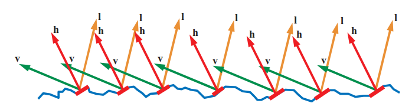

在masking-shadowing函数中使用的半向量还可以稍微简化一下，由于所涉及的角度永远不会超过$90^{\circ}$，因此可以移除方程9.24，方程9.31，方程9.32中的$\chi^{+}$项。

### 9.8.1 法线分布函数

法线分布函数（normal distribution function，NDF）对于要渲染的表面外观具有十分重要的影响。NDF的形状（将其绘制在微平面法线的球体上）决定了反射光锥（镜面波瓣）的宽度和形状，反过来又决定了高光的大小和形状。NDF影响了表面粗糙度的整体感知，以及一些更加微妙的视觉表现，例如高光是否具有明显的边缘，还是具有一个模糊（haze）的边缘。

然而，镜面波瓣（specular lobe）并不是NDF形状的简单复制。镜面波瓣（也就是高光形状）被扭曲的程度还取决于表面曲率和观察视角。如图9.35所示，当从掠射视角观察平面的时候，这种畸变（distortion）会尤其强烈。Ngan等人\[1271]对这种畸变背后的原因进行了分析。

#### 各项同性法线分布函数

在渲染中所使用的大多数NDF都是各向同性的（isotropic），即关于宏表面法线$\mathbf{n}$旋转对称。在这种情况下，NDF的变量只有一个，即宏表面法线$\mathbf{n}$与微表面法线$\mathbf{m}$之间的夹角$ \theta _m
  $。在理想情况下，NDF可以写成一个关于$ \cos \theta _m
  $的表达式，可以通过计算$\mathbf{n}$和$\mathbf{m}$之间的点乘来快速获得$ \cos \theta _m
  $。

Beckmann NDF \[124]是光学界开发的、第一个微表面模型中所使用的法线分布函数，它至今仍被该社区广泛使用。它也是Cook-Torrance BRDF所选择使用的NDF \[285, 286]。归一化Beckmann 分布的数学形式如下：

$$
D(\mathbf{m})=\frac{\chi^{+}(\mathbf{n} \cdot \mathbf{m})}{\pi \alpha_{b}^{2}(\mathbf{n} \cdot \mathbf{m})^{4}} \exp \left(\frac{(\mathbf{n} \cdot \mathbf{m})^{2}-1}{\alpha_{b}^{2}(\mathbf{n} \cdot \mathbf{m})^{2}}\right)
\tag{9.35}  
$$

其中的$\chi^{+}(\mathbf{n} \cdot \mathbf{m})$项确保了所有指向宏表面下方的微表面法线的NDF值为0，这个性质告诉我们，与我们将在本小节所讨论的其他所有NDF一样，这个NDF描述了一个高度场微表面。方程中的参数$\alpha_{b}$控制了表面的粗糙度，它与微观几何表面的均方根（root mean square，RMS）斜率成正比，即$\alpha_{b} = 0$代表了一个完全光滑的表面。

为了推导出Beckmann NDF的Smith $G_2$函数，我们需要相应的$  \Lambda $函数，然后将其代入方程9.24（使用可分离形式的$G_2$函数），或者方程9.31（使用高度相关形式的$G_2$函数），或者方程9.32（使用方向相关和高度相关的$G_2$函数）。

Beckmann NDF是形状不变的（shape-invariant），这简化了$  \Lambda $函数的推导。根据Heitz \[708]的定义，如果其粗糙度参数的影响相当于对微表面进行缩放（或者拉伸）的话，那么这个各向同性NDF就是形状不变的，形状不变的NDF可以写成如下形式：

$$
D(\mathbf{m})=\frac{\chi^{+}(\mathbf{n} \cdot \mathbf{m})}{\alpha^{2}(\mathbf{n} \cdot \mathbf{m})^{4}} g\left(\frac{\sqrt{1-(\mathbf{n} \cdot \mathbf{m})^{2}}}{\alpha(\mathbf{n} \cdot \mathbf{m})}\right)
\tag{9.36} 
$$

其中的$g$代表了一个任意的单变量函数。对于一个任意的各向同性NDF，$  \Lambda $函数取决于两个变量：第一个变量是粗糙度$\alpha$，第二个变量是计算$  \Lambda $的向量入射角（$\mathbf{v}$或者$\mathbf{l}$）。然而，对于形状不变的NDF而言，$  \Lambda $函数只依赖于变量$a$：

$$
a=\frac{\mathbf{n} \cdot \mathbf{s}}{\alpha \sqrt{1-(\mathbf{n} \cdot \mathbf{s})^{2}}}
\tag{9.37} 
$$

其中的向量$\mathbf{s}$代表了观察方向$\mathbf{v}$或者光线方向$\mathbf{l}$，在这种情况下，$  \Lambda $函数只依赖于一个变量，这十分利于实现，因为单变量函数可以更加容易地使用近似曲线来进行拟合，并且可以在一维数组中打表。

Beckmann NDF的$  \Lambda $函数为：

$$
\Lambda(a)=\frac{\operatorname{erf}(a)-1}{2}+\frac{1}{2 a \sqrt{\pi}} \exp \left(-a^{2}\right)
\tag{9.38}  
$$

计算方程9.38的开销很高，因为它包含了一个误差函数$\operatorname{erf}$。因此，通常会使用近似值\[1833]来进行代替：

$$
\Lambda(a) \approx\left\{\begin{array}{ll}\frac{1-1.259 a+0.396 a^{2}}{3.535 a+2.181 a^{2}}, & \text { where } a<1.6, \\ 0, & \text { where } a \geq 1.6 .\end{array}\right.
\tag{9.39}   
$$

下一个我们要讨论的NDF是Blinn-Phong NDF，它在过去被广泛应用于计算机图形学中，尽管在最近，它在很大程度上已经被其他的法线分布所取代了。Blinn-Phong NDF仍然被用于一些算力受限的情况（例如移动设备上），因为相比于本小节所讨论的其他NDF，Blinn-Phong NDF具有更低的计算成本。

Blinn-Phong NDF是由Blinn \[159]提出的，作为对Phong着色模型（非基于物理的）的一个修改\[1414]：

$$
D(\mathbf{m})=\chi^{+}(\mathbf{n} \cdot \mathbf{m}) \frac{\alpha_{p}+2}{2 \pi}(\mathbf{n} \cdot \mathbf{m})^{\alpha_{p}}
\tag{9.40} 
$$

方程中的幂次$\alpha_{p}$是Phong NDF的粗糙度参数，较高的$\alpha_{p}$代表了较为光滑的表面，而较低的$\alpha_{p}$则代表较为粗糙的表面。我们可以将$\alpha_{p}$的值设置得任意高，从而创建一个极其光滑的表面，而一个完美的镜面则需要令 $\alpha_{p} =\infty$。通过将$\alpha_{p}$设置为0，可以得到一个随机程度最大的曲面（即均匀NDF）。参数$\alpha_{p}$不便于直接进行操作，因为它的视觉效果是高度非均匀的：当$\alpha_{p}$较小时，它对数值变化十分敏感，一点点很小的数值变化，就会在视觉效果上产生很大的变化；当$\alpha_{p}$较大时，它对数值变化则不太敏感，一个很大的数值变化，才能让视觉效果发生一点点变化。因此，$\alpha_{p}$通常是通过一个非线性映射，从用户控制的参数推导出来的，例如$\alpha_{p} = m^s$，其中$s$是一个介于0-1之间的参数，$m$是$\alpha_{p}$在给定应用程序中的最大上界。许多游戏都使用了这种映射方式，例如《使命召唤：黑色行动》，其中的$m$被设置为8192 \[998]。

当BRDF参数的行为在感知上不均匀时，这种“接口映射（interface mappings）”的方式通常是十分有用的。用户通过滑动条（slider）进行设置，或者是直接在纹理中绘制参数，这些映射可以用于对这些用户参数进行解释。

通过等价变换$\alpha_{p}=2 \alpha_{b}^{-2}-2$\[1833]，可以找到Beckmann和Blinn-Phong粗糙度参数的等效值。当参数通过这种方式进行匹配时，这两个分布会非常接近，尤其是对于相对光滑的表面而言，如图9.36左上角所示。

Blinn-Phong NDF并不是形状不变的，其$  \Lambda $函数不存在解析形式。Walter等人\[1833]建议将Beckmann $  \Lambda $函数与等价变换$\alpha_{p}=2 \alpha_{b}^{-2}-2$结合起来使用。

在1977年的同一篇论文中\[159]，通过将Phong着色函数应用到一个微表面NDF中，Blinn提出了另外两种NDF。在这三种法线分布中，Blinn建议使用Trowbridge和Reitz \[1788]所推导出来的一种分布，但是这个建议并没有得到广泛的重视，直到30年后，Trowbridge-Reitz分布被Walter等人\[1833]独立地重新发现，并将其命名为GGX分布。这一次，种子终于生根发芽了。在几年内，GGX分布开始在电影行业\[214, 1133]和游戏行业\[861, 960]中快速普及，而如今它可能是这两个行业中最常用的法线分布，Blinn的建议似乎超前了30年。虽然严格来说，“Trowbridge-Reitz分布”才是这个分布正确的名称，但是我们在本书中仍然会使用GGX这个名称，因为它已经十分成熟并且广为流传了。

GGX分布的数学表达形式如下：

$$
D(\mathbf{m})=\frac{\chi^{+}(\mathbf{n} \cdot \mathbf{m}) \alpha_{g}^{2}}{\pi\left(1+(\mathbf{n} \cdot \mathbf{m})^{2}\left(\alpha_{g}^{2}-1\right)\right)^{2}}
\tag{9.41} 
$$

参数$\alpha_{g}$提供了与Beckmann 分布中参数$\alpha_{b}$类似的粗糙度控制。在Disney原则着色模型中，Burley \[214]通过$\alpha_{g}=r^{2}$，将粗糙度控制暴露给用户，其中$r$是用户可以控制的粗糙度参数，其取值范围在0-1之间。将$r$作为一个滑动条值暴露出来，意味着其视觉效果的变化更加线性，大多数使用GGX分布的应用都采用了这种映射方式。

GGX分布是形状不变的，其$  \Lambda $函数相对比较简单：

$$
\Lambda(a)=\frac{-1+\sqrt{1+\frac{1}{a^{2}}}}{2}
\tag{9.42} 
$$

在方程9.42中，变量$a$只会以$a^2$的形式出现，这是十分便于计算的，因为这样我们避免了方程9.37中的平方根运算。

由于GGX分布和Smith masking-shadowing函数的流行，因此人们一直致力于优化这两者的组合。Lagarde观察到\[960]，在GGX中使用高度相关的Smith$  G_2 $函数（方程9.31），在与镜面微表面BRDF的分母（方程9.34）结合时，有几项会被消掉，合并后的项可以简化为如下形式：

$$
\frac{G_{2}(\mathbf{l}, \mathbf{v})}{4|\mathbf{n} \cdot \mathbf{l}||\mathbf{n} \cdot \mathbf{v}|}=\frac{0.5}{\mu_{o} \sqrt{\alpha^{2}+\mu_{i}\left(\mu_{i}-\alpha^{2} \mu_{i}\right)}+\mu_{i} \sqrt{\alpha^{2}+\mu_{o}\left(\mu_{o}-\alpha^{2} \mu_{o}\right)}}
\tag{9.43} 
$$

为了简化表达，这个方程使用了以下两个变量替换：$\mu_{i}=(\mathbf{n} \cdot \mathbf{l})^{+}$和$\mu_{o}=(\mathbf{n} \cdot \mathbf{v})^{+}$。Karis \[861]提出了在GGX中使用的Smith $  G_1 $函数的近似形式：

$$
G_{1}(\mathbf{s}) \approx \frac{2(\mathbf{n} \cdot \mathbf{s})}{(\mathbf{n} \cdot \mathbf{s})(2-\alpha)+\alpha},
\tag{9.44} 
$$

方程9.44中的$\mathbf{s}$，可以用向量$\mathbf{l}$或者向量$\mathbf{v}$进行替换。Hammon表明\[657]，这种近似形式的 $  G_1 $函数，可以对由高度相关的Smith$  G_2 $函数和镜面微表面BRDF分母组成的组合项进行有效地近似：

$$
\frac{G_{2}(\mathbf{l}, \mathbf{v})}{4|\mathbf{n} \cdot \mathbf{l}||\mathbf{n} \cdot \mathbf{v}|} \approx \frac{0.5}{\operatorname{lerp}(2|\mathbf{n} \cdot \mathbf{l}||\mathbf{n} \cdot \mathbf{v}|,|\mathbf{n} \cdot \mathbf{l}|+|\mathbf{n} \cdot \mathbf{v}|, \alpha)},
\tag{9.45} 
$$

方程9.45使用了线性插值运算符，即$\operatorname{lerp}(x, y, s)=x(1-s)+y s$。

当比较图9.36中的GGX分布和Beckmann分布时，很明显二者具有完全不同的形状。GGX的峰值比Beckmann更窄，而围绕这些峰值的“尾巴”则更长。在图9.36底部的渲染图中，我们可以看到，GGX较长的拖尾在高光的核心区域周围，产生了一个模糊（haze）或者微光（glow）外观。

真实世界中的许多材质都具有类似的模糊高光，其尾部通常还要比GGX分布的尾部更长 \[214]，详见图9.37。这种基于真实世界的观察认知对GGX分布的日益流行，以及探索能够更加准确地模拟被测材质的新分布，都做出了很大的贡献。

![图9.37：MERL数据库中各种NDF对金属铬的匹配程度。左侧图中展示了相对于夹角 \theta \_m 的镜面峰值，三条曲线分别代表金属铬（黑色）、GGX分布（红色，其中 \alpha\_{g}= 0.006  )，Beckmann分布（绿色，其中 \alpha\_{g}= 0.013 ），Blinn-Phong分布（蓝色虚线，其中 n = 12000 ）。右侧展示了金属铬、GGX分布，Beckmann分布的高光渲染结果。 \[214\]](images/Chapter-9/20230611105924.png "图9.37：MERL数据库中各种NDF对金属铬的匹配程度。左侧图中展示了相对于夹角 \theta _m 的镜面峰值，三条曲线分别代表金属铬（黑色）、GGX分布（红色，其中 \alpha_{g}= 0.006  )，Beckmann分布（绿色，其中 \alpha_{g}= 0.013 ），Blinn-Phong分布（蓝色虚线，其中 n = 12000 ）。右侧展示了金属铬、GGX分布，Beckmann分布的高光渲染结果。 \[214]")

Burley \[214]提出了广义的Trowbridge-Reitz （GTR） NDF，其目标是对NDF的形状进行更多的控制，尤其是分布的拖尾，其数学表达如下：

$$
D(\mathbf{m})=\frac{k(\alpha, \gamma)}{\pi\left(1+(\mathbf{n} \cdot \mathbf{m})^{2}\left(\alpha_{g}^{2}-1\right)\right)^{\gamma}}
\tag{9.46}  
$$

参数$\gamma$控制了尾部的形状：当$\gamma=2$时，GTR分布与GGX分布完全相同；当$\gamma$值减小时，分布的尾部会变长；当$\gamma$值增大时，分布的尾部会变短。当$\gamma$值较大时，GTR分布类似于Beckmann分布。方程中的$k(\alpha, \gamma)$项是归一化系数，由于它要比其他NDF的归一化系数更加复杂，因此我们单独给出它的数学表达式：

$$
k(\alpha, \gamma)=\left\{\begin{array}{ll}\frac{(\gamma-1)\left(\alpha^{2}-1\right)}{\left(1-\left(\alpha^{2}\right)^{(1-\gamma)}\right)}, & \text { where } \gamma \neq 1 \text { and } \alpha \neq 1 \\ \frac{\left(\alpha^{2}-1\right)}{\ln \left(\alpha^{2}\right)}, & \text { where } \gamma=1 \text { and } \alpha \neq 1 \\ 1, & \text { where } \alpha=1 .\end{array}\right.
\tag{9.47} 
$$

GTR分布并不是形状不变的，这使得寻找它的Smith $  G_2 $函数变得相当复杂。在这个NDF发表3年后，$G_2$函数的解决方案才得以发表\[355]；这个$  G_2 $函数的解相当复杂，它只给出了某些$\gamma$值对应的解析解表（而其他中间值则必须使用插值获得）。GTR的另一个问题是参数$\alpha$和$\gamma$，会以一种很不直观的方式影响人们所感知到的粗糙度和“微光”效果。

Student t分布（Student’s t-distribution，STD）\[1491]和指数幂分布（exponential power distribution，EPD）\[763]，这两个NDF中包含了形状控制参数。与GTR相比，这些函数相对于它们的粗糙度参数是形状不变的。在撰写本文的时候，它们才刚刚发布，因此尚不清楚它们在应用程序中的实用性。

> 译者注：关于Student t分布，其中Student是英国统计学家W. S. Gosset在1908年发布论文时所用的笔名。

为了更好地对被测材质进行模拟，一种替代方案是使用多个镜面波瓣，而不是增加单个NDF的复杂性，这个想法是由Cook和Torrance提出的\[285, 286]。Ngan \[1271]对其进行了实验测试，他发现对于许多材质，添加第二个波瓣确实可以显著改善匹配度。皮克斯的PxrSurface材质\[732]中包含一个“粗糙镜面（roughspecular）”波瓣，它便是用于这个目的（与主镜面波瓣结合在一起）。这个额外的波瓣是一个具有所有相关参数和构成项的镜面微表面BRDF。Imageworks采用了一种更加精确的方法\[947]，它使用了两个GGX分布的混合，并将它们作为一个扩展的NDF暴露给用户，而不是作为一整个单独的镜面BRDF项。在这种情况下，只需要两个额外参数即可，分别是第二个粗糙度值和二者之间的混合量（用于控制插值）。

#### 各项异性法线分布函数

虽然大多数材质的表面都是各向同性的，但有一些材料的微观结构具有显著的各向异性，这大大地影响了它们的材质外观，例如图9.26所示。为了准确地渲染这些材质，我们需要具有各向异性NDF的BRDF。

与各向同性的NDF不同，各向异性的NDF不能仅仅使用单独的夹角$\theta _m$进行描述，它还需要额外的方向信息。一般情况下，我们需要将微表面法线$\mathbf{m}$变换到由法线$\mathbf{n}$、切线（tangent）向量$\mathbf{t}$、副切线（bitangent）向量$\mathbf{b}$所定义的局部坐标系或者切线空间中，详见图6.32。在实践中，这个变换通常被表示为三个独立的点积：$\mathbf{m} \cdot \mathbf{n}$，$\mathbf{m} \cdot \mathbf{t}$和$\mathbf{m} \cdot \mathbf{b}$。

当我们将法线映射与各向异性BRDF相结合时，最重要的一点是，确保法线映射在变换法线的同时，也会对切线和副切线进行变换。通常来说，这个过程是通过对扰动法线$\mathbf{n}$，以及顶点插值而来的切线$\mathbf{t}_0$和副切线$\mathbf{b}_0$，应用改进的Gram-Schmidt过程来完成的。其数学表达如下（假设$\mathbf{n}$已经被事先归一化了）：

$$
\begin{array}{l}\mathbf{t}^{\prime}=\mathbf{t}_{0}-\left(\mathbf{t}_{0} \cdot \mathbf{n}\right) \mathbf{n} \quad \Longrightarrow \mathbf{t}=\frac{\mathbf{t}^{\prime}}{\left\|\mathbf{t}^{\prime}\right\|}, \\ \left.\begin{array}{rl}\mathbf{b}^{\prime} & =\mathbf{b}_{0}-\left(\mathbf{b}_{0} \cdot \mathbf{n}\right) \mathbf{n}, \\ \mathbf{b}^{\prime \prime} & =\mathbf{b}^{\prime}-\left(\mathbf{b}^{\prime} \cdot \mathbf{t}\right) \mathbf{t}\end{array}\right\} \Rightarrow \mathbf{b}=\frac{\mathbf{b}^{\prime \prime}}{\left\|\mathbf{b}^{\prime \prime}\right\|} \\\end{array}
\tag{9.48} 
$$

或者也在第一行之后，通过$\mathbf{n}$和$\mathbf{t}$的叉乘来得到正交向量$\mathbf{n}$。

在实现拉丝金属和卷发等效果的时候，需要对切线方向进行逐像素的修改，一般是通过一张切线贴图（tangent map）来实现的。这个纹理贴图存储了逐像素的切线信息，类似于法线贴图中存储的逐像素法线信息。切线贴图通常存储的是切线向量在垂直于法线的平面上的二维投影。这种数据表示方法可以很好地与纹理过滤进行工作，并且也可以像法线贴图一样进行压缩。有些应用程序存储的是一个标量旋转角度，用于将切线向量围绕法线$\mathbf{n}$进行旋转。虽然这种数据表示方式更加紧凑，但是当旋转角度突然从$360^{\circ}$切换到$0^{\circ}$的时候，很容易产生纹理滤波的瑕疵。

创建各向异性NDF的一种常见方法是，将现有的各向同性NDF进行推广，这种一般性的方法可以应用于任何形状不变的各向同性NDF \[708]，这也是形状不变的NDF更加实用的另一个原因。这里我们回顾一下，形状不变的各向同性NDF可以写成下面的形式：

$$
D(\mathbf{m})=\frac{\chi^{+}(\mathbf{n} \cdot \mathbf{m})}{\alpha^{2}(\mathbf{n} \cdot \mathbf{m})^{4}} g\left(\frac{\sqrt{1-(\mathbf{n} \cdot \mathbf{m})^{2}}}{\alpha(\mathbf{n} \cdot \mathbf{m})}\right)
\tag{9.49}  
$$

方程中的函数$g$是一个代表NDF形状的一维函数。方程9.49的其各向异性版本是：

$$
D(\mathbf{m})=\frac{\chi^{+}(\mathbf{n} \cdot \mathbf{m})}{\alpha_{x} \alpha_{y}(\mathbf{n} \cdot \mathbf{m})^{4}} g\left(\frac{\sqrt{\frac{(\mathbf{t} \cdot \mathbf{m})^{2}}{\alpha_{x}^{2}}+\frac{(\mathbf{b} \cdot \mathbf{m})^{2}}{\alpha_{y}^{2}}}}{(\mathbf{n} \cdot \mathbf{m})}\right)
\tag{9.50} 
$$

方程中的参数$\alpha_{x}$和$\alpha_{y}$，分别代表了沿$\mathbf{t}$方向和$\mathbf{b}$方向的粗糙度。如果$\alpha_{x}=\alpha_{y}$的话，方程9.50还可以退化为各向同性的形式。

各向异性NDF的$  G_2 $ masking-shadowing函数，与各向同性中的基本相同，除了变量$a$（用于传递给$\Lambda$函数）的计算有所不同：

$$
a=\frac{\mathbf{n} \cdot \mathbf{s}}{\sqrt{\alpha_{x}^{2}(\mathbf{t} \cdot \mathbf{s})^{2}+\alpha_{y}^{2}(\mathbf{b} \cdot \mathbf{s})^{2}}}
\tag{9.51}  
$$

其中方程9.51中的向量$\mathbf{s}$，代表了相机的观察方向$\mathbf{v}$或者光线的入射方向$\mathbf{l}$。

利用这种方法，我们可以推导出各向异性版本的Beckmann NDF：

$$
D(\mathbf{m})=\frac{\chi^{+}(\mathbf{n} \cdot \mathbf{m})}{\pi \alpha_{x} \alpha_{y}(\mathbf{n} \cdot \mathbf{m})^{4}} \exp \left(-\frac{\frac{(\mathbf{t} \cdot \mathbf{m})^{2}}{\alpha_{x}^{2}}+\frac{(\mathbf{b} \cdot \mathbf{m})^{2}}{\alpha_{y}^{2}}}{(\mathbf{n} \cdot \mathbf{m})^{2}}\right)
\tag{9.52}   
$$

以及各向异性版本的GGX NDF，二者的效果如图9.38所示：

$$
D(\mathbf{m})=\frac{\chi^{+}(\mathbf{n} \cdot \mathbf{m})}{\pi \alpha_{x} \alpha_{y}\left(\frac{(\mathbf{t} \cdot \mathbf{m})^{2}}{\alpha_{x}^{2}}+\frac{(\mathbf{b} \cdot \mathbf{m})^{2}}{\alpha_{y}^{2}}+(\mathbf{n} \cdot \mathbf{m})^{2}\right)^{2}}
\tag{9.53} 
$$

虽然将各向异性NDF参数化的最直接方法，就是将各向同性的粗糙度参数化表示使用两次，一次用于$\alpha_{x}$，一次用于$\alpha_{y}$，但有时也会使用其他形式的参数化表示。在Disney原则着色模型中\[214]，各向同性的粗糙度参数$ r  $会与另一个范围为$[0,1]$的标量参数$k_{aniso}$相结合，然后通过以下方式来计算出$\alpha_{x}$和$\alpha_{y}$的值：

$$
\begin{aligned} k_{\text {aspect }} & =\sqrt{1-0.9 k_{\text {aniso }}}, \\ \alpha_{x} & =\frac{r^{2}}{k_{\text {aspect }}}, \\ \alpha_{y} & =r^{2} k_{\text {aspect }} .\end{aligned}
\tag{9.54} 
$$

方程中的0.9将长宽比限制为$10:1$。

Imageworks \[947]使用了另一种不同形式的参数化方法，它允许构建任意程度的各向异性：

$$
\begin{array}{l}\alpha_{x}=r^{2}\left(1+k_{\text {aniso }}\right), \\ \alpha_{y}=r^{2}\left(1-k_{\text {aniso }}\right) .\end{array}
\tag{9.55} 
$$

### 9.8.2 多次反弹的表面反射

正如章节9.7中所提到的，微表面BRDF理论并没有考虑到在微表面间进行多次反弹（bounce）的那部分光线。这种简化会导致一些能量损失和表面变暗，尤其是对于那些具有粗糙表面的金属而言\[712]。

Imageworks \[947]所使用的技术，将之前工作进行结合\[811, 878]，创建了一个可以被添加到BRDF中的项，从而对多次反弹的表面反射进行模拟：

$$
f_{\mathrm{ms}}(\mathbf{l}, \mathbf{v})=\frac{\bar{F} \overline{R_{\mathrm{sF} 1}}}{\pi\left(1-\overline{R_{\mathrm{sF} 1}}\right)\left(1-\bar{F}\left(1-\overline{\left.R_{\mathrm{sF} 1}\right)}\right)\right.}\left(1-R_{\mathrm{sF} 1}(\mathbf{l})\right)\left(1-R_{\mathrm{sF} 1}(\mathbf{v})\right)
\tag{9.56} 
$$

其中$R_{\mathrm{sF} 1}$是指$f_{\mathrm{sF} 1}$上的定向反照率（directional albedo）（详见章节9.3），也就是当$F_0 = 1$时的镜面BRDF项。函数$R_{\mathrm{sF} 1}$依赖于粗糙度$\alpha$和仰角$\theta$，这个函数是相对平滑的，因此可以对它进行预计算（使用方程9.8或者方程9.9），并将结果存储在一个尺寸很小的二维纹理中，Imageworks发现使用$32 × 32$的分辨率就足够了。

函数$  \overline{R_{\mathrm{sF} 1}} $是$R_{\mathrm{sF} 1}$在半球上的余弦加权平均值，这消除了仰角$\theta$带来的变化，使得$  \overline{R_{\mathrm{sF} 1}} $只依赖于粗糙度$\alpha$，因此可以将其存储在一个一维纹理中，或者是使用一个便于计算的曲线来对其进行近似。由于$R_{\mathrm{sF} 1}$是关于表面法线$\mathbf{n}$旋转对称的，因此可以用一个一维积分来计算$  \overline{R_{\mathrm{sF} 1}} $，这里我们还使用了换元法$\mu=\cos \theta$来进行推导（详见方程9.6）：

$$
\begin{aligned} \overline{R_{\mathrm{sF} 1}} & =\frac{\int_{\mathbf{s} \in \Omega} R_{\mathrm{sF} 1}(\mathbf{s})(\mathbf{n} \cdot \mathbf{s}) d \mathbf{s}}{\int_{\mathbf{s} \in \Omega}(\mathbf{n} \cdot \mathbf{s}) d \mathbf{s}}=\frac{1}{\pi} \int_{\phi=0}^{2 \pi} \int_{\mu=0}^{1} R_{\mathrm{sF} 1}(\mu) \mu d \mu d \phi \\ & =2 \int_{\mu=0}^{1} R_{\mathrm{sF} 1}(\mu) \mu d \mu .\end{aligned}
\tag{9.57}  
$$

最后，方程9.56中的$  \overline{F} $代表了菲涅尔项的余弦加权平均值，可以用同样的方法来计算它：

$$
\bar{F}=2 \int_{\mu=0}^{1} F(\mu) \mu d \mu
\tag{9.58} 
$$

Imageworks提供了一个方程9.58的封闭解，即$F$的广义Schlick形式（方程9.18）：

$$
\bar{F}=\frac{2 p^{2} F_{90}+(3 p+1) F_{0}}{2 p^{2}+3 p+1}
\tag{9.59} 
$$

如果使用原始形式的Schlick近似（方程9.16），那么这个解可以简化为以下形式：

$$
\bar{F}=\frac{20}{21} F_{0}+\frac{1}{21}
\tag{9.60} 
$$

在各向异性的情况下，Imageworks使用了介于$\alpha_{x}$和$\alpha_{y}$之间的中间粗糙度来计算$f_{ms}$。这种近似策略可以避免增加$R_{\mathrm{sF} 1}$查找表的维度，同时引入的误差很小。

Imageworks多次反弹的高光项结果如图9.39所示。

![图9.39：每一行的表面粗糙度从左到右递增。上面两行展示的是一种金色的金属材质，其中第一行在渲染的时候并没有使用Imageworks多次反弹项，而第二行在渲染的时候则使用了多次反弹项。二者之间的差异，对于表面粗糙度较高的球体而言最为明显。接下来的两行是黑色的电介质材质，其中第三行在渲染的时候没有使用多次反弹项，而第四行则使用了多次反弹项。第三行和第四行的差异更加细微，因为它们的镜面反射率要低得多。 \[947\]](images/Chapter-9/20230611110006.png "图9.39：每一行的表面粗糙度从左到右递增。上面两行展示的是一种金色的金属材质，其中第一行在渲染的时候并没有使用Imageworks多次反弹项，而第二行在渲染的时候则使用了多次反弹项。二者之间的差异，对于表面粗糙度较高的球体而言最为明显。接下来的两行是黑色的电介质材质，其中第三行在渲染的时候没有使用多次反弹项，而第四行则使用了多次反弹项。第三行和第四行的差异更加细微，因为它们的镜面反射率要低得多。 \[947]")

## 9.9 次表面散射的BRDF模型

在上一小节中，我们讨论了表面反射（surface reflection），或者叫做镜面反射（specular reflection）；而在这一小节中，我们将讨论反射问题的另一方面，即在表面以下的折射光线会发生什么。正如我们在章节9.1.4中讨论的那样，这些折射光线经历了某种散射作用（scatter）和吸收作用（absorption）的组合，其中一部分光线最终会被重新发射回原始表面。在本小节中，我们将重点讨论不透明电介质中的局部次表面散射，以及它们的BRDF模型。这里我们并不会讨论有关金属材质的话题，因为金属材质并没有任何明显的次表面光线作用（因为金属的对光线的吸收作用很强）。有关透明电介质材质，以及表现出全局次表面散射的电介质材质的话题，将在第14章进行讨论。

我们将首先从漫反射模型开始讨论，介绍漫反射颜色的相关特性，以及真实世界中漫反射材质可能具有的颜色值。而在接下来的几个小节中，我们会解释表面粗糙度是如何对漫反射着色产生影响的；以及对于给定的材质表面，到底是选择使用光滑表面还是粗糙表面的着色模型，以及这个选择的标准。在最后两个小节中，我们会主要关注光滑表面模型和粗糙表面模型本身。

### 9.9.1 次表面反照率

不透明电介质的次表面反照率（subsurface albedo）$\rho_{ss}$指的是从表面逃逸的光线能量，与进入物质内部的光线能量之比。$\rho_{ss}$的值在0（光线被全部吸收）到1（没有任何光线被吸收）之间，并且与波长有关，因此$\rho_{ss}$在渲染中被表示为一个RGB向量。对于艺术家创作而言，$\rho_{ss}$通常会被称为表面的漫反射颜色（diffuse color），就像是法线入射的菲涅尔反射率$F_0$，通常会被称为镜面颜色（specular color）一样。次表面反照率与章节14.1中所讨论的散射反照率密切相关。

对于电介质而言，由于大部分光线都会透射进物质内部，而不是在表面上直接被反射出去，因此这些材质的次表面反照率$\rho_{ss}$通常会更加明亮，在视觉上要比高光颜色$F_0$更加重要。与表面的菲涅尔反射不同，光线在物质内部的吸收是一个独特的物理过程，因此$\rho_{ss}$通常具有与$F_0$不同的光谱分布（即不同的RGB颜色）。例如：彩色塑料是由透明的基板和嵌入在其内部的颜料颗粒组成的，光线照射到彩色塑料表面上，所产生的镜面反射光线是无色的，而漫反射光线有一部分（特定波长）会被颜料颗粒吸收，因此剩余被反射出来的光线会具有某种颜色。比如我们能够看到在一个红色的塑料球上看到一个白色的高光。

次表面反照率可以被认为是光线吸收与光线散射之间“相互竞争”所产生的结果，即光线到底是先被散射出物体，还是先被吸收？这也就是为什么液体上的泡沫，要比液体本身亮得多的原因：起泡过程并不会改变液体对光线的吸收率，但是所产生的大量气液界面会大大增加光线的散射量，这使得大部分入射光线在被吸收之前，会先被散射出去，最终导致了较高的次表面反照率和明亮的材质外观。新鲜的积雪是高反照率物质的另一个例子：新鲜的积雪十分蓬松，内部充满了空气，雪花颗粒与空气之间界面的散射量很大，吸收量很少，从而导致次表面反照率在可见光谱上可以达到0.8或者更大。白色油漆的次表面反照率要稍少小一些，约为0.7。日常生活中遇到的许多物质，例如混凝土、石头、土壤等，反照率大约在0.15 \~ 0.4之间。而煤炭是一种次表面反照率极低的物质，接近0.0。

和液体泡沫的例子相反，许多物质在潮湿之后反而会变得更暗。如果一个材料表面是多孔的，那么水就会渗入到原本充满空气的空间。相比于空气的折射率，电介质材料的折射率要更加接近于水。表面两侧相对折射率的下降，会降低物体内部的散射率，这使得光线在逃逸出物质之前，需要传播的平均距离更长。这种变化会导致更多的光线被吸收，从而使得次表面反照率变得更暗\[821]。

有一个常见的误解，即真实感材质的$\rho_{ss}$永远不应该低于0.015-0.03的下限（在8 bit非线性sRGB编码中为30-50），这个误解甚至出现在了一些广受好评的材质创作指南中\[1163]。然而，这个下限所基于的颜色测量，包含了表面反射（specular）和次表面反射（diffuse）两部分，因此是过高的。实际材质可以有更低的$\rho_{ss}$值。例如：联邦规范中的“OSHA Black”涂料标准 \[524]，其$Y$值为0.35（最大为100）。考虑到测量条件和表面光泽效应，这个$Y$所对应的$\rho_{ss}$值约为0.0035（在8 bit非线性sRGB编码中为11）。

当从真实世界的表面材质获取点值或者纹理时，从中分离镜面反射是十分重要的，这种提取操作可以通过精确控制光照和偏振滤光器\[251, 952]来完成。为获得更加准确的颜色数据，还应当进行校准\[1153]。

并不是每个RGB三元组都代表一个合理（或者是物理上可能存在的）的$\rho_{ss}$值。反射光谱的功率分布所受到的限制，要比发射光谱严格得多：对于任何波长的光线而言，它们的值永远都不能超过1，并且这些值的分布通常是相当平滑的。这些限制在颜色空间中定义了一个区域，其中包含了所有可能的$\rho_{ss}$所对应的RGB值。即使是相对较小的sRGB色域，也包含了其中所有的颜色，因此在设置$\rho_{ss}$的值时需要格外小心，避免指定那些不自然的、饱和且明亮的颜色。除了会降低画面的真实感之外，在预计算全局光照的时候，这些不合理的颜色可能会导致过于明亮的二次反射（详见章节11.5.1）。Meng等人\[1199]于2015年的论文，是一个对于本主题很好的参考资料。

### 9.9.2 次表面散射和粗糙的尺度

一些用于局部次表面散射的BRDF模型，考虑了表面粗糙度所带来的影响（通常使用了带有漫反射micro-BRDF$f_{\mu}$的微表面理论），而有些则没有这些影响。具体使用哪种类型的模型，并不是简单取决于表面有多粗糙（虽然这是一个常见的误解），正确的决定因素应当是表面不规则性与次表面散射距离的相对大小。

如图9.40所示，如果微观几何的不规则性大于次表面散射的距离（图9.40左上），那么次表面散射将会表现出一些与微观几何有关的效果（microgeometry-related effects），例如逆反射（详见图9.29）。对于这种类型的表面，应当使用一个粗糙表面的漫反射模型。如上所述，这类模型一般都基于微表面理论，它将次表面散射现象视为每个微表面的局部散射（即将此表面散射视为微表面的局部现象），即只会对micro-BRDF$f_{\mu}$产生影响。

如果次表面散射的距离都大于表面的不规则性（图9.40右上），那么在模拟次表面散射现象的时候，应该认为表面是平坦的，不会出现逆反射等效应。此时次表面散射对于微表面而言，并不是一个局部现象，因此无法使用微表面理论来进行描述。在这种情况下，应当使用一个光滑表面的漫反射模型。

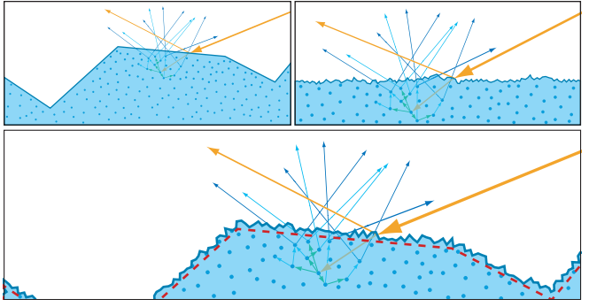

而在其他中间情况下，即表面在比散射距离更大或者更小的尺度上都具有一定的粗糙度，那么这时应当使用一个粗糙表面的漫反射模型，但是其有效表面（effective surface）只包含那些比散射距离更大的不规则性。在这种情况下，漫反射和镜面反射都可以使用微表面理论来进行建模，但是二者的粗糙度值是不同的：其中高光项将会使用一个基于实际表面粗糙度的值；而漫反射项将会使用一个较低的值，它基于的是有效表面的粗糙度。

观察尺度也与此相关，因为它决定了“微观几何”的具体含义。例如：一个应当使用粗糙表面漫反射模型的经典例子是月球，因为它表现出了明显的逆反射效应。当我们从地球上观察月球的时候，观察尺度非常大，以至于月球表面上一个五英尺高的巨石都可以算是“微观几何”。因此，我们能够观察到粗糙表面的漫反射效应（例如后反射）也就并不奇怪了。

### 9.9.3 光滑表面的次表面模型

本小节我们将讨论光滑表面的次表面模型（smooth-surface subsurface model）。这些方法适用于对表面不规则性小于次表面散射距离的材质进行建模，这些材质的表面粗糙度并不会直接影响它们的漫反射着色，但是如果漫反射项和高光项是耦合的（本小节中一些模型是这样的），那么表面粗糙度可能会对漫反射着色产生间接影响。

如章节9.3中所提到的，实时渲染程序通常会使用Lambertian项来对局部次表面散射现象进行建模，在这种情况下，BRDF的漫反射项是次表面反照率$\rho_{ss}$除以$\pi$：

$$
f_{\mathrm{diff}}(\mathbf{l}, \mathbf{v})=\frac{\rho_{\mathrm{ss}}}{\pi}
\tag{9.61} 
$$

Lambertian模型并没有考虑到这样一个事实，即表面反射的光线并不能用于次表面散射。为了对这个模型进行改进，应当在表面反射项（镜面反射项）和次表面反射项（漫反射项）之间进行能量权衡。菲涅尔效应表明，这种表面-次表面之间的能量权衡，应当随着入射光角$ \theta_i
  $的变化而变化。随着光线入射角度（尤其是靠近掠射角度时）的增大，漫反射率会减小，镜面反射率会增大。实现这种平衡的最基本方法是，将漫反射项乘以1减去镜面项的菲涅尔部分（$F$项）\[1626]。如果某个高光项是由平坦镜面所产生的话，那么对应产生的漫反射项为：

$$
f_{\mathrm{diff}}(\mathbf{l}, \mathbf{v})=(1-F(\mathbf{n}, \mathbf{l})) \frac{\rho_{\mathrm{ss}}}{\pi}
\tag{9.62}  
$$

如果镜面反射项是一个微表面BRDF项的话，那么对应产生的漫反射项为：

$$
f_{\mathrm{diff}}(\mathbf{l}, \mathbf{v})=(1-F(\mathbf{h}, \mathbf{l})) \frac{\rho_{\mathrm{ss}}}{\pi}
\tag{9.63}  
$$

方程9.62最终会生成均匀分布的出射光线，因为这个BRDF的结果并不依赖于出射方向$\mathbf{v}$。这种光线行为是有一定道理的，因为光线在重新发射出表面之前，通常都会经历多次散射事件，因此其最终的出射方向将会是随机的。然而，存在有两个理由使得我们怀疑其实出射光线的分布并不是完全均匀的。首先，由于方程9.62中的漫反射BRDF项会随光线入射方向的变化而变化，Helmholtz互易性意味着，它也会随着出射方向的变化而变化。第二，光线在最终射出表面的时候会发生折射，根据光线折射的性质，这些最终射出的光线会具有一定的方向性，即会偏向于某些方向。

Shirley等人提出了一种用于平坦表面的耦合漫反射项，它解决了菲涅尔效应与表面-次表面反射之间的权衡问题，同时它还满足能量守恒和Helmholtz互易性\[1627]。推导中假设菲涅尔反射使用了Schlick近似方法\[1568]（方程9.16），其数学形式如下：

$$
f_{\mathrm{diff}}(\mathbf{l}, \mathbf{v})=\frac{21}{20 \pi}\left(1-F_{0}\right) \rho_{\mathrm{ss}}\left(1-\left(1-(\mathbf{n} \cdot \mathbf{l})^{+}\right)^{5}\right)\left(1-\left(1-(\mathbf{n} \cdot \mathbf{v})^{+}\right)^{5}\right)
\tag{9.64} 
$$

方程9.64只适用于镜面反射为完美菲涅尔镜面的表面。Ashikhmin和Shirley \[77]提出了一个广义的版本，它可以用来计算一个可逆的（reciprocal）、低计算开销的漫反射项，并且它可以与任何高光项结合使用。Kelemen和Szirmay-Kalos \[878]对其进行了进一步完善：

$$
f_{\mathrm{diff}}(\mathbf{l}, \mathbf{v})=\rho_{\mathrm{ss}} \frac{\left(1-R_{\mathrm{spec}}(\mathbf{l})\right)\left(1-R_{\mathrm{spec}}(\mathbf{v})\right)}{\pi\left(1-\overline{R_{\mathrm{spec}}}\right)}
\tag{9.65} 
$$

方程中的$R_{\mathrm{spec}}$是高光项的定向反照率（directional albedo，详见章节9.3），而$\overline{R_{\mathrm{spec}}}$则是它在半球上的余弦加权平均值。值$R_{\mathrm{spec}}$可以使用方程9.8或者方程9.9预计算出来，并将结果存储在一个查找表中。平均值$\overline{R_{\mathrm{spec}}}$的计算方法与我们之前所遇到的$\overline{R_{\mathrm{sF1}}}$相同（方程9.57）。

方程9.65在形式上与方程9.56有一些明显的相似之处，这并不奇怪，因为Imageworks的多次弹射高光项，就是从Kelemen-Szirmay-Kalos耦合漫反射项中推导出来的。然而，二者之间有一个重要的区别：在这里我们使用的是$R_{\mathrm{spec}}$而不是$R_{\mathrm{sF1}}$，即使用了包含菲涅尔项、多次弹射高光项$f_{ms}$（如果使用了的话）在内的、完整的镜面反射BRDF项的定向反照率。这种差异增加了$R_{\mathrm{spec}}$查找表的维度，因为它不仅取决于粗糙度$\alpha$和仰角$\theta$，还取决于菲涅尔反射率。

在Imageworks对Kelemen-Szirmay-Kalos耦合漫反射项的实现中，他们使用了一个三维查找表，其中的第三个维度是折射率\[947]。他们发现，在积分中使用多次弹射项，可以使$R_{\mathrm{spec}}$变得比$R_{\mathrm{sF1}}$更加平滑，因此$16\times 16$$ \times  $$16$查找表很足够了，图9.41展示了相应的结果。

![图9.41：第一行和第三行图片展示了在一个Lambertian项中添加高光项的渲染结果。第二行和第四行图片使用了Kelemen-Szirmay-Kalos耦合漫反射项，并添加了一个相同的高光项。上面两行的粗糙度值要比下面两行低。在每一行中，粗糙度从左到右递增。 \[947\]](images/Chapter-9/20230611110136.png "图9.41：第一行和第三行图片展示了在一个Lambertian项中添加高光项的渲染结果。第二行和第四行图片使用了Kelemen-Szirmay-Kalos耦合漫反射项，并添加了一个相同的高光项。上面两行的粗糙度值要比下面两行低。在每一行中，粗糙度从左到右递增。 \[947]")

如果BRDF使用Schlick Fresnel近似方法，但是不包含多次反弹高光项的话，那么$F_0$的值可以从积分中提取出来。这样我们就可以只使用一个二维的$R_{\mathrm{spec}}$查找表，而不是Karis \[861]所讨论的三维表。此外，Lazarov \[999]提出了一个用于拟合$R_{\mathrm{spec}}$的解析函数，我们同样将系数$F_0$从积分中提取出来，从而对拟合函数进行简化。

Karis和Lazarov都将镜面定向反照率$R_{\mathrm{spec}}$用在了其他的地方，这与基于图像的照明（image-based lighting，IBL）有关。有关IBL的技术细节，我们将在章节10.5.2中进行讨论。如果一个应用程序同时实现了这两种技术，那么则可以使用同一个查找表，从而提高效率。

上述这些模型，是通过考虑表面反射（高光项）和次表面反射（漫反射项）之间的能量守恒而建立的；而其他的模型则是根据物理原理发展而来的，其中许多模型都依赖于Subrahmanyan Chandrasekhar（1910-1995）的工作，他提出了一个半无限的、各向同性的散射体BRDF模型。Kulla和Conty \[861]证明了，如果平均自由程（mean free path，译者注：一个物理概念，指某个分子连续两次与其它分子发生相撞的平均距离）足够短，那么这个BRDF模型可以完美匹配任意形状的散射体积（scattering volume）。有关Chandrasekhar BRDF的内容，可以在他的书中找到\[253]，不过在Dupuy等人\[397]的一篇论文中，其中的方程30和方程31也对其进行了描述，它使用了我们熟悉的渲染符号，更加容易理解。

由于Chandrasekhar BRDF并不包含折射项，因此它只能用于建模折射率匹配的表面，这里的折射率匹配，指的是表面两侧的折射率完全相同，如图9.11所示。为了对折射率不匹配的表面进行建模，必须对BRDF进行一定的修改，将光线进入和离开表面的折射现象考虑在内。这种修改正是Hanrahan和Krueger \[662]以及Wolff \[1898]的核心工作。

### 9.9.4 粗糙表面的次表面模型

作为迪士尼原则着色模型的一部分，Burley \[214]引入了一个漫反射BRDF项，用于匹配被测材质的粗糙度效果：

$$
f_{\mathrm{diff}}(\mathbf{l}, \mathbf{v})=\chi^{+}(\mathbf{n} \cdot \mathbf{l}) \chi^{+}(\mathbf{n} \cdot \mathbf{v}) \frac{\rho_{\mathrm{ss}}}{\pi}\left(\left(1-k_{\mathrm{ss}}\right) f_{\mathrm{d}}+1.25 k_{\mathrm{ss}} f_{\mathrm{ss}}\right)
\tag{9.66} 
$$

其中：

$$
\begin{aligned} 
f_{\mathrm{d}} & =\left(1+\left(F_{\mathrm{D} 90}-1\right)(1-\mathbf{n} \cdot \mathbf{l})^{5}\right)\left(1+\left(F_{\mathrm{D} 90}-1\right)(1-\mathbf{n} \cdot \mathbf{v})^{5}\right), \\[1mm]
 F_{\mathrm{D} 90} & =0.5+2 \sqrt{\alpha}(\mathbf{h} \cdot \mathbf{l})^{2}, \\
  f_{\mathrm{Ss}} & =\left(\frac{1}{(\mathbf{n} \cdot \mathbf{l})(\mathbf{n} \cdot \mathbf{v})}-0.5\right) F_{\mathrm{SS}}+0.5, \\
   F_{\mathrm{SS}} & =\left(1+\left(F_{\mathrm{SS} 90}-1\right)(1-\mathbf{n} \cdot \mathbf{l})^{5}\right)\left(1+\left(F_{\mathrm{SS} 90}-1\right)(1-\mathbf{n} \cdot \mathbf{v})^{5}\right), \\[1mm]
    F_{\mathrm{SS} 90} & =\sqrt{\alpha}(\mathbf{h} \cdot \mathbf{l})^{2},\end{aligned}
    \tag{9.67}  
$$

方程9.67中的$\alpha$是镜面粗糙度，在各向异性的情况下，则使用$\alpha_x$和$ \alpha_y  $之间的中间值。这个方程通常被称为迪斯尼漫反射模型（Disney diffuse model）。

次表面项$f_{ss}$的灵感来自于Hanrahan-Krueger BRDF \[662]，用于作为对远处物体的全局次表面散射现象的廉价近似。这个漫反射模型会基于用户控制的参数$k_{ss}$，将$f_{ss}$与粗糙漫反射项$f_{d}$混合在一起。

迪士尼漫反射模型被广泛应用于电影\[214]和游戏\[214]（尽管没有次表面项）中。完整的迪斯尼漫反射BRDF还包含一个光泽（sheen）项，这主要是为了对纤维织物进行建模，同时也有助于补偿因缺乏多次弹射高光项而造成的能量损失。有关迪士尼光泽项的内容将在章节9.10中进行讨论。几年后，Burley提出了一个更新后的模型\[215]，旨在对全局次表面散射的渲染技术进行整合。

由于迪斯尼漫反射模型使用了与镜面BRDF相同的粗糙度参数，因此在对某些材质进行建模的时候，可能会遇到困难，详见图9.40。然而，可以通过一个很小的修改，从而使用一个单独的漫反射粗糙度值。

其他大多数粗糙表面的漫反射BRDF都是基于微表面理论开发的，它们具有不同的NDF、micro-BRDF$f_{\mu}$以及masking-shadowing函数$G_2$。其中最著名的模型是由Oren和Nayar提出的\[1337]。Oren-Nayar BRDF使用了Lambertian的micro-BRDF、球面高斯NDF以及Torrance-Sparrow“V-cavity”的masking-shadowing函数。完整形式的BRDF模型了对二次反弹也进行了建模。Oren和Nayar还在他们的论文中引入了一个简化的“定性”模型。多年来，人们提出了一些对Oaren-Nayar模型的改进方法\[573]，包括对“定性”模型进行优化调整，使其在不增加额外成本的前提下，尽可能地接近完整模型\[504]；以及将micro-BRDF更改为一个更加精确的光滑表面漫反射模型\[574, 1899]。

Oren-Nayar模型假设了一个全新的微表面，与当前镜面模型所使用的微表面相比，它具有完全不同的法线分布和masking-shadowing函数。利用各向同性的GGX NDF和高度相关的Smith masking-shadowing函数，可以推导出两种不同的漫反射微表面模型。第一个模型是由Gotanda \[574]提出的，他使用了方程9.64所描述的镜面耦合漫反射项来作为micro-BRDF，再对通用的微表面方程（方程9.26）进行数值积分，最后使用一个解析函数来对数值积分的数据进行拟合。Gotanda提出的BRDF并没有考虑微表面之间的相互反射，并且拟合函数也相对复杂。

使用与Gotanda BRDF相同的NDF、masking-shadowing函数和micro-BRDF，Hammon \[657]对BRDF进行了数值模拟，同时将相互反射考虑在内。他指出，相互反射对于这种微表面结构而言十分重要，对于粗糙表面来说，相互反射大约占据了总反射中的一半。Hammon发现第二次反弹几乎包含了所有丢失的能量（即考虑更多的反弹次数，对最终结果的贡献并不大），因此他使用了两次反弹模拟的数据。 此外，可能是因为添加了相互反射，使得数据变得更加平滑，因此Hammon能够使用一个相当简单的函数，来对模拟结果进行拟合，最终的数学表达如下：

$$
f_{\mathrm{diff}}(\mathbf{l}, \mathbf{v})=\chi^{+}(\mathbf{n} \cdot \mathbf{l}) \chi^{+}(\mathbf{n} \cdot \mathbf{v}) \frac{\rho_{\mathrm{ss}}}{\pi}\left(\left(1-\alpha_{g}\right) f_{\mathrm{smooth}}+\alpha_{g} f_{\mathrm{rough}}+\rho_{\mathrm{ss}} f_{\mathrm{multi}}\right)
\tag{9.68}  
$$

其中：

$$
\begin{aligned} f_{\text {smooth }} & =\frac{21}{20}\left(1-F_{0}\right)\left(1-(1-\mathbf{n} \cdot \mathbf{l})^{5}\right)\left(1-(1-\mathbf{n} \cdot \mathbf{v})^{5}\right), \\ f_{\text {rough }} & =k_{\text {facing }}\left(0.9-0.4 k_{\text {facing }}\right)\left(\frac{0.5+\mathbf{n} \cdot \mathbf{h}}{\mathbf{n} \cdot \mathbf{h}}\right), \\ k_{\text {facing }} & =0.5+0.5(\mathbf{l} \cdot \mathbf{v}), \\ f_{\text {multi }} & =0.3641 \alpha_{g},\end{aligned}
\tag{9.69} 
 
$$

方程中的$\alpha_{g}$是GGX镜面粗糙度。为了清楚起见，这里所使用术语与Hammon的陈述略有不同。请注意，方程9.69中的$ f_{\text {smooth }}  $，其实就是方程9.64中不含$\rho_{\mathrm{ss}} / \pi$因子的耦合漫反射BRDF，因为这个因子被包含在了方程9.68中。Hammon讨论了一些“混合”BRDF，即使用其他光滑表面的漫反射BRDF来替代$ f_{\text {smooth }}  $，从而提高性能表现，或者改进旧着色模型下的资产兼容性。

总的来说，尽管Hammon并没有给出与测量数据的比较，但是他提出漫反射BRDF的计算开销很低，并且建立在可靠的理论原理之上。需要注意的是，表面不规则性大于散射距离的这个假设，是BRDF推导的基础，这可能会对它能够准确建模的材质类型有所限制，详见图9.40。

方程9.61中展示的简单Lambertian项仍然被许多实时渲染程序所采用，除了较低的计算成本之外，与其他的漫反射模型相比，它可以更加容易地和间接烘焙光照一起使用；与更加复杂的着色模型相比，二者之间的视觉差异通常是不易察觉的\[251, 861]。然而，对于真实感的持续追求，正在推动精确模型的广泛使用。

## 9.10 布料的BRDF模型

布料往往具有不同于其他类型材质的微观几何结构，根据织物类型的不同，它可能还会具有高度重复的编织微观结构、从表面垂直突出的圆柱体（线），又或是二者都有。由于布料表面独特的特征外观，因此通常需要使用专门的着色模型来进行渲染，这些独特外观包括：各向异性的镜面高光，粗糙散射\[919]（光线在突出的、半透明的纤维中发生散射，从而导致边缘明亮的效果）， 甚至颜色也会随着观察方向的变化而变化（这是由织物中不同颜色的线所引起的）。

除了BRDF之外，大多数织物还具有高频空间变化，这也是生成令人信服的布料材质的关键因素\[825]，如图9.42所示。

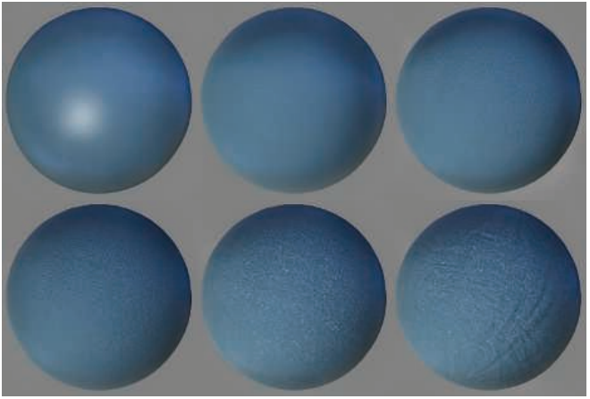

布料的BRDF模型主要分为三大类：根据观察建立的经验模型、基于微表面理论的模型、微圆柱体模型。我们将从每个类别中分别举出一些值得注意的例子。

### 9.10.1 经验布料模型

在游戏《神秘海域2》\[631]中，布料表面使用了以下的漫反射BRDF项：

$$
f_{\mathrm{diff}}(\mathbf{l}, \mathbf{v})=\frac{\rho_{\mathrm{ss}}}{\pi}\left(k_{\mathrm{rim}}\left((\mathbf{v} \cdot \mathbf{n})^{+}\right)^{\alpha_{\mathrm{rim}}}+k_{\text {inner }}\left(1-(\mathbf{v} \cdot \mathbf{n})^{+}\right)^{\alpha_{\text {inner }}}+k_{\text {diff }}\right)
\tag{9.70} 
$$

其中$k_{rim}$是边缘光项（rim）的比例系数，$k_{inner}$是正面（内部，inner）亮度项的比例系数，$k_{diff}$是Lambertian项的比例系数。此外，$\alpha_{\mathrm{rim}}$和$\alpha_{\mathrm{inner}}$分别控制了边缘项和内部项的衰减。这种行为并不是物理正确的，因为这些效果只与观察方向有关，与入射光线的方向无关。

相比之下，《神秘海洋4》\[825]中的布料材质使用了微表面模型或者微圆柱体模型，具体使用哪一种模型，取决于布料的高光项（会在之后的两个小节中进行详细描述），并且使用了一种叫做“环绕光照（wrap lighting）”的经验次表面散射方法，来对漫反射项进行近似：

$$
f_{\mathrm{diff}}(\mathbf{l}, \mathbf{v})(\mathbf{n} \cdot \mathbf{l})^{+} \Rightarrow \frac{\rho_{\mathrm{ss}}}{\pi}\left(\mathbf{c}_{\mathrm{scatter}}+(\mathbf{n} \cdot \mathbf{l})^{+}\right)^{\mp} \frac{(\mathbf{n} \cdot \mathbf{l}+w)^{\mp}}{1+w}
\tag{9.71} 
$$

这里我们使用了章节1.2中介绍过的符号$(x)^{\mp}$，它表示0-1之间的限制操作。左侧这个奇怪的符号$f_{\mathrm{diff}}(\mathbf{l}, \mathbf{v})(\mathbf{n} \cdot \mathbf{l})^{+} \Rightarrow \dots$代表了这个模型会影响光照和BRDF，并使用箭头右边的项来取代左边的项。用户指定的参数$c_{scatter}$是一种散射颜色；值$w$的范围为$[0,1]$，用于控制环绕光照的宽度。

对于布料材质的建模，迪士尼将他们的漫反射BRDF项 \[214]（详见章节9.9.4）和一个光泽项相结合，从而对粗糙散射（asperity scattering）进行模拟：

$$
f_{\text {sheen }}(\mathbf{l}, \mathbf{v})=k_{\text {sheen }} \mathbf{c}_{\text {sheen }}\left(1-(\mathbf{h} \cdot \mathbf{l})^{+}\right)^{5}
\tag{9.72} 
$$

其中$k_{sheen}$是用于调节光泽项强度的用户参数。光泽颜色$c_{hsheen}$会在白色和亮度归一化的$\rho_{ss}$之间进行插值（由另一个用户参数进行控制）。这里的亮度归一化是指用$\rho_{ss}$除以其亮度值，从而分离它的色相（hue）和饱和度（saturation）。

### 9.10.2 微表面布料模型

Ashikhmin等人\[78]提出使用一个逆高斯NDF来模拟天鹅绒（velvet）材质。这个NDF在后续工作中\[81]又进行了一些微调，同时还提出了一种用于模拟一般材质的微表面BRDF变体，这个变体没有 masking-shadowing项，也没有对分母进行修改。

在游戏《教团：1886》\[1266]所使用的布料BRDF中，结合了改进的微表面BRDF、Ashikhmin和Premoze在后续报告\[81]中提到的天鹅绒NDF的一般化形式、以及方程9.63中的漫反射项。天鹅绒NDF的一般化形式如下：

$$
D(\mathbf{m})=\frac{\chi^{+}(\mathbf{n} \cdot \mathbf{m})}{\pi\left(1+k_{\mathrm{amp}} \alpha^{2}\right)}\left(1+\frac{k_{\mathrm{amp}} \exp \left(\frac{(\mathbf{n} \cdot \mathbf{m})^{2}}{\alpha^{2}\left((\mathbf{n} \cdot \mathbf{m})^{2}-1\right)}\right)}{\left(1-(\mathbf{n} \cdot \mathbf{m})^{2}\right)^{2}}\right)
\tag{9.73} 
$$

其中，$\alpha$控制了逆高斯分布的宽度，$k_{amp}$控制了逆高斯分布的振幅。完整形式的布料BRDF如下：

$$
f(\mathbf{l}, \mathbf{v})=(1-F(\mathbf{h}, \mathbf{l})) \frac{\rho_{\mathrm{ss}}}{\pi}+\frac{F(\mathbf{h}, \mathbf{l}) D(\mathbf{h})}{4(\mathbf{n} \cdot \mathbf{l}+\mathbf{n} \cdot \mathbf{v}-(\mathbf{n} \cdot \mathbf{l})(\mathbf{n} \cdot \mathbf{v}))}
\tag{9.74} 
$$

在游戏《神秘海域4》\[825]中使用了这种BRDF的变体，用于模拟羊毛和棉花等粗糙纤维织物。

Imageworks \[947]在光泽项中使用了一个不同的逆NDF，同时这个光泽项可以被添加到任何BRDF中，这个NDF的形式如下：

$$
D(\mathbf{m})=\frac{\chi^{+}(\mathbf{n} \cdot \mathbf{m})\left(2+\frac{1}{\alpha}\right)\left(1-(\mathbf{n} \cdot \mathbf{m})^{2}\right)^{\frac{1}{2 \alpha}}}{2 \pi}
\tag{9.75} 
$$

尽管对于这个NDF而言，并不存在Smith masking-shadowing函数的闭式解，但是Imageworks使用了一个解析函数来逼近其数值解。Estevez和Kulla \[442]讨论了masking-shadowing函数的细节，以及光泽项和BRDF其余部分之间的能量守恒。图9.43展示了一些使用Imageworks光泽项进行渲染的样例。

![图9.43：将Imageworks光泽高光项添加到一个红色漫反射项中。从左到右的光泽粗糙度值分别为 \alpha = 0.15，0.25，0.40，0.65，1.0。 \[442\]](images/Chapter-9/20230611110225.png "图9.43：将Imageworks光泽高光项添加到一个红色漫反射项中。从左到右的光泽粗糙度值分别为 \alpha = 0.15，0.25，0.40，0.65，1.0。 \[442]")

到目前为止，我们所看到的各种布料模型，都仅限于对特定类型的布料进行模拟，而在下一节中讨论的模型则试图以一种更加一般的方式来对布料进行建模。

### 9.10.3 微圆柱体布料模型

用于布料材质的微圆柱体模型（micro-cylinder model），与用于头发材质的微圆柱体模型非常相似，因此章节14.7.2中有关头发模型的讨论，可以帮助你更好的理解这类模型。这类模型背后的思想是假设表面被很多一维线段所覆盖。Kajiya和Kay针对该假设建立了一个简单的BRDF模型\[847]，Banks也为该模型提供了坚实的理论基础\[98]，因此它也被称为Kajiya-Kay BRDF或者Banks BRDF。这个理念基于了这样的一个观察：一个由一维直线所组成的曲面，它在任何给定位置上都具有无限多的法线，这些法线是由垂直于该位置切向量$\mathbf{t}$的法线平面（normal plane）所定义的。虽然从这个理论框架中开发出了许多新的微圆柱体模型，但是由于其简单性，因此原来的Kajiya-Kay模型仍然有一些用途。例如：在游戏《神秘海域4》\[825]中，Kajiya-Kay BRDF用于表示丝绸和天鹅绒等闪亮织物的高光项。

Dreamworks \[348, 1937]使用了一种相对简单的、艺术家可控的微圆柱体模型来模拟布料材质，这个模型允许使用纹理用来改变粗糙度、颜色和线的方向，其中线的方向还可以指向表面以外，从而模拟天鹅绒以及其他类似的织物。这个模型还可以对经纬线（横向和竖向的线）设置不同的参数，从而模拟更加复杂的变色织物，例如闪光丝绸（shot silk）。

Sadeghi等人\[1526]提出了一种基于织物样品和单根纤维测量的微圆柱体模型，这个模型还考虑了线和线之间的masking和shadowing效应。

在某些情况下，头发的BSDF模型（章节14.7）也可以用于布料模拟。RenderMan的PxrSurface材质\[732]有一个“模糊”波瓣，它使用了来自Marschner等人\[1128]提出的头发模型中的$R$项（章节14.7）。Wu和Yuksel \[1924, 1926]在实时布料渲染系统中所实现的模型之一，就是源自迪士尼动画电影\[1525]中所使用的头发模型。

## 9.11波动光学的BRDF模型

我们在前几个节中所讨论的模型都依赖于几何光学，它把光的传播看作成一种射线而不是波。几何光学基于了这样的假设：任何表面的不规则性要么小于一个波长，要么大于100倍波长（大约）。

而现实世界中的表面并没有那么理想，它们在所有尺度上都具有不规则性，包括1-100倍波长范围内。我们将1-100倍波长范围内的不规则性称为纳米几何（nanogeometry），来与前几节所讨论的微观几何区分开来，前文中所讨论的微观几何，虽然它们的尺寸很小，无法单独进行绘制，但是却都大于100倍波长。纳米几何对于反射率的影响无法使用几何光学来进行模拟。因为这些影响取决于光的波动性，需要使用波动光学（wave optics，也称为物理光学，physical optics）来对它们进行建模。

厚度接近于光波长的表面或者薄膜，会产生与光的波动性有关的现象。

在本小节中，我们将涉及诸如衍射（diffraction）和薄膜干涉（thinfilm interference）之类的波动光学现象，并讨论它们在真实感渲染中的重要性（有时效果会令人十分惊讶），虽然这些材质可能看起来十分普通。

### 9.11.1 衍射模型

纳米几何会引起一种叫做衍射（diffraction）的现象，为了解释这种现象，我们使用了Huygens-Fresnel原理，它假设波前（wavefront，指具有相同波相位的一组点）上的每一个点都可以看作是新球面波的源，如图9.44所示。

当波遇到障碍物的时候，根据Huygens-Fresnel原理，它们会在拐角处轻微弯曲，这就是衍射的一个例子，这种现象是无法使用几何光学来预测的。当光线打到平面上时，几何光学确实可以正确预测光线在单一方向上的反射；也就是说，Huygens-Fresnel原理提供了更多的见解和认识（insight）。这个原理表明，当表面上的球面波恰好排列成一条直线时，会形成反射波前，所有其他方向的波都会通过相消干涉被抵消。当我们在观察具有纳米级不规则性的表面时，这种认识会变得非常重要。由于各个表面点的高度是不同的，因此表面上的球面波不会排列得那么整齐，如图9.45所示。

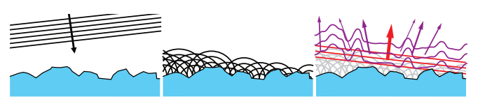

正如上述两张图片中展示的那样，光会被散射到不同的方向上，其中一部分光会发生镜面反射，即在反射方向上叠加成一个平面波前。而剩余的光则会以一种定向模式衍射出来，这取决于纳米几何结构的具体特性。镜面反射光和衍射光的划分取决于纳米几何凸起的高度，或者更加准确地说，取决于高度分布的方差。衍射光在镜面反射方向上的扩散角度，取决于光的波长与纳米几何凸起的相对大小。然而有点违背直觉的是，更大尺度的不规则性反而会导致更小的扩散角度，如果这个不规则性大于100倍波长的话，那么衍射光和镜面反射光之间的角度会很小，几乎可以忽略不计。 不规则性的尺寸减小会导致衍射光扩散到更大的范围内，直到表面的不规则性小于光的波长，此时该点上也就不会有衍射现象发生了。

在具有周期性纳米几何结构的表面上，衍射现象是最清晰可见的，因为重复的表面结构通过相长干涉会增强衍射光，从而产生彩虹颜色，这种现象可以在CD、DVD光盘以及一些某些昆虫中观察到。虽然衍射现象也可以发生在非周期性表面上，但是多年来计算机图形学界一直认为这种情况下的衍射现象是十分轻微的。出于这个原因，除了少数情况之外\[89, 366, 686, 1688]，多年来计算机图形学文献大多都忽略了衍射现象。

然而，在最近Holzschuch和Pacanowski \[762]对测量材质的分析表明，在许多材质中存在着显著的衍射效应，这也许可以解释为什么当前的模型一直很难和这些材质与相匹配。Holzschuch和Pacanowski的后续工作\[763]提出了一种结合微表面理论和衍射理论的模型，他们在通用的微表面BRDF（方程9.26）中，使用了一个考虑衍射现象的micro-BRDF。同时，Toisoul和Ghosh \[1772, 1773]提出了一种用于捕捉由周期性纳米几何结构所产生的彩虹色衍射效果的方法，并且可以使用点光源和基于图像的照明来实时渲染这些效果。

### 9.11.2 薄膜干涉模型

薄膜干涉（Thin-film interference）是一种波动光学现象，当一个薄电介质层的顶部反射和底部反射的光路相互干扰时，就会发生这种现象，如图9.46所示。

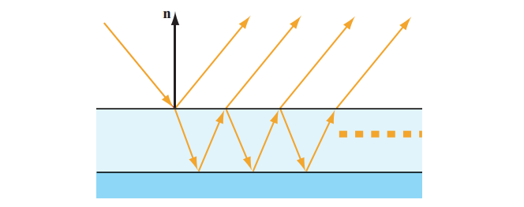

不同波长的光会发生相长干涉或者相消干涉，具体取决于波长和路径长度差之间的关系。由于路径之间的长度差异会随着角度的变化而变化，因此最终产生的结果是偏移了的彩虹颜色，因为不同波长的光会在相长干涉和相消干涉之间不断切换。

薄膜之所以需要很薄才能产生这种效果，其原因与相干长度（coherence length）的概念有关。这个长度是指光波的副本在移动之后，仍然可以与原始光波发生干涉的最大距离。这个最大长度与光的带宽（bandwidth）成反比，光的带宽是指其光谱功率分布（SPD）延申的波长范围。激光具有极窄的带宽，因此其相干长度也极长；根据激光类型的不同，相干长度甚至可以达到几英里。这种关系是有道理的，因为一个很简单的正弦波在被许多不同波长的波取代之后，仍然会和原始波发生干涉。如果一个激光是完全单色的话（只包含一种波长的光），那么它就会具有一个无限大的相干长度，但是现实中的激光总会有一个不为0的带宽。相反，带宽极大的光将具有非常混乱无序的波形，具有这样一个波形的光波副本，只需要移动一段很短的距离，就会停止与原始波的干涉。

在理论上，理想的白光是由所有波长的光混合叠加而来的，其相干长度应当为0。然而，对于可见光而言，人类视觉系统的带宽（仅能感知波长在400纳米-700纳米范围内的光）最终决定了相干长度，大约为1微米。所以在大多数情况下，如果有人问你：“一层薄膜要多厚才不会引起可见的干涉现象？”这个问题的答案是：“大约1微米。”

与衍射现象类似，多年来，薄膜干涉被认为是一种特殊效应，只会发生在肥皂泡和油渍等表面。然而，Akin指出\[27]，薄膜干扰确实会给许多常见的表面带来一些微妙的色彩变化，模拟这种效果可以大大增加真实感，如图9.47所示。他的论文引起了人们对基于物理的薄膜干涉的极大兴趣，包括RenderMan的PxrSurface材质\[732]以及Imageworks的着色模型\[947]在内的各种着色模型，现在都已经支持了这种效果。

![图9.47：左侧的皮革材质没有薄膜干涉，右侧的皮革材质有薄膜干涉。由薄膜干涉所引起的高光变色，增强了图像的真实感。 \[27\]](images/Chapter-9/20230611110328.png "图9.47：左侧的皮革材质没有薄膜干涉，右侧的皮革材质有薄膜干涉。由薄膜干涉所引起的高光变色，增强了图像的真实感。 \[27]")

适合于实时渲染的薄膜干涉技术已经存在一段时间了。Smits和Meyer \[1667]提出了一种有效的方法，来考虑一阶光路和二阶光路之间的薄膜干涉。他们观察到，最终产生的颜色主要是一个与路径长度差异有关的函数，这可以通过薄膜厚度、观察角度和折射率计算出来。他们的实现需要一个具有RGB颜色的一维查找表，这个表中的数据可以使用密集光谱采样（dense spectral sampling）预先计算，并将其转换为RGB颜色进行存储，这使得该技术运行起来效率很高。在游戏《使命召唤：无限战争》中，使用了一种不同的快速薄膜近似方法，它被作为分层材质系统\[386]的其中一部分。这些技术无法模拟光在薄膜中的多次反射，也不能模拟其他的物理现象。Belcour和Barla \[129]提出了一种更加精确的技术，虽然计算成本变高了，但是仍然可以用于实时渲染。

## 9.12 分层材质

在现实生活中，表面的材质通常是相互重叠的。这些表面可能被灰尘、水、冰、雪所覆盖；也可能是出于装饰或者保护的原因，表面会被涂上漆或者其他涂层；又或是它可能包含了多层基本结构，例如许多生物材料。

其中最简单和最具视觉重要性的分层案例之一就是透明涂层（clear coat，也叫做清漆材质），它指的是涂在其他材质基底上的光滑透明层。例如：在一个粗糙的木材表面涂上一层光滑的清漆。迪士尼原则着色模型\[214]便包含了一个透明涂层项，虚幻引擎\[1802]、RenderMan的PxrSurface材质\[732]、以及Dreamworks Animation \[1937]和Imageworks \[947]所使用的着色模型，都包含这个透明涂层项。

透明涂层最显著的视觉效果，就是由光从透明涂层处反射与从底层基板处反射而产生的二次反射。当基底是金属材质的时候，这种二次反射的效果最为显著，因为此时透明电介质涂层和基底之间的折射率差异最大。当基底是电介质的时候，其折射率与透明涂层的折射率相近，因此第二次反射会相对较弱，这种效果类似于水下的材质，详见表9.4。

透明涂层也可以有颜色。从物理角度来看，这种着色是光线被部分吸收的结果。根据Beer-Lambert定律（章节14.1.2），光线被的吸收数量取决于穿过透明涂层的光路长度。而这个路径的长度则取决于观察视角、入射光的角度、以及材质的折射率。一些更加简单的透明涂层的实现，例如迪士尼原则模型和虚幻引擎，则没有对这种视角依赖性进行建模；而其他的实现则考虑到了这一点，例如PxrSurface材质，以及Imageworks和Dreamworks所使用的着色模型。Imageworks的模型还允许任意数量的、不同类型的层叠加在一起。

一般情况来说，不同的层（透明涂层和基板）可以有不同的表面法线。例如水流流过平坦的路面、凹凸不平的土壤表面上铺上一层光滑的冰、或者在纸板箱上盖上皱巴巴的保鲜膜等。电影行业中所使用的大多数分层模型，都支持为每一层设置单独的法线，而这种做法在实时图形应用中则并不常见，但是也有一些例外，例如虚幻引擎中的透明图层材质在实现上，将逐层的独立法线作为一个可选的特性。

Weidlich和Wilkie \[1862, 1863]提出了一种分层的微表面模型，它假设表面层的厚度要比微表面的的尺寸小。他们所提出的模型支持任意数量的涂层相互叠加在一起，并且可以追踪从顶层到底层，再到顶层的反射事件和折射事件。它对于实时应用来说足够简单\[420, 573]，计算成本也不是很高，但是这个模型并没有考虑层与层之间的多次反弹。Jakob等人\[811, 812]提出了一个全面而准确的框架模型用来模拟分层材质，这个框架还支持层与层之间的多次反弹；虽然它并不适合用于实时渲染，但是作为ground-truth而言还是十分好用的，而且它所使用的思想理念可能会对未来的实时分层材质有所启发。

游戏《使命召唤：无限战争》中所使用的分层材质系统\[386]尤其引人注目，它允许用户将任意数量的材质层叠加在一起。该分层材质系统还支持折射、散射以、基于路径长度的层间吸收、以及逐层的表面法线。结合高效的实现方式，这个系统能够实现前所未有的复杂实时材质，尤其是对一个运行在60 Hz的游戏而言，如图9.48所示。

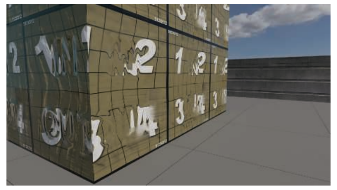

## 9.13 混合和过滤材质

材质混合（material blending）是指将多种材质的属性（即BRDF参数）结合在一起的过程。例如：为了模拟一个带有锈迹的金属材质，我们可以绘制一个蒙版纹理来控制铁锈出现的位置，并使用它来混合铁锈和金属的材质属性（高光颜色$F_0$，漫反射颜色$\rho_{ss}$和粗糙度$\alpha$）。材质的参数都存储在纹理中，每种材质的属性也都可以在空间上发生变化。可以通过提前创建新的纹理来实现材质混合（这个过程通常称为“烘焙”），或者也可以在着色器中进行实时处理。虽然表面法线$\mathbf{n
}$从技术上来说并不是一个BRDF参数，但是表面法线的空间变化对于材质外观的影响是非常重要的，因此材质混合通常也包括法线贴图的混合。

材质混合是很多实时渲染应用的关键。例如：游戏《教团：1886》就有一个十分复杂的材质混合系统\[1266, 1267, 1410]，它允许美术人员从扩展库中获取素材，并创建任意深度的材质堆栈，并使用各种空间蒙版来进行控制。大多数材质混合都是离线预处理完成的，但是其中一些合成操作可以根据需要，延迟到运行时完成，这种运行时处理通常用于环境材质，用于为平铺纹理添加一些独特变化。广泛流行的材质创作工具Substance Painter和Substance Designer便使用了类似的方法来进行材质合成，Mari纹理绘画工具也是如此。

将纹理元素动态混合在一起，可以实现很多种效果，同时节省内存开销，游戏应用基于各种目的使用了材质混合技术，例如：

-   展示建筑物、载具和生物（或不死生物）的动态伤害效果。 \[201, 603, 1488, 1778, 1822]
-   允许用户自定义游戏中的装备和服装。 \[604, 1748]
-   增加角色\[603, 1488]和环境\[39, 656, 1038]的视觉多样性，如图20.5所示。

有时，材质会以一种半透明的方式（即该层的不透明度小于100%）混合在另一种的材质上；但即使是完全不透明的混合材质，在蒙版边界上也存在一些像素（或者纹素texel，如果烘焙成纹理的话）需要进行部分混合。在任何一种情况下，正确的方法都是计算每种材质的着色模型，并将着色结果进行混合。但是这样需要计算两次着色过程，速度是很慢的，更快的方法是直接将BRDF的参数混合在一起，然后只计算一次着色。在材质属性与最终着色颜色之间具有线性关系或者近似线性关系的情况下（例如漫反射颜色和高光颜色），这种插值所引入的误差很小，或者根本没有误差。在很多情况下，即使材质参数与最终的着色颜色之间是高度非线性的（例如镜面粗糙度），在蒙版边界处所引入的误差也是可以接受的。

法线贴图的混合需要一些特殊考虑。通常可以从法线贴图中派生出高度贴图（height map），然后对高度贴图进行混合，从而获得不错的效果\[1086, 1087]。在其他情况下，例如在一个基础表面上叠加细节法线贴图（detail normal map），也可以使用其他形式的混合方法\[106]。

材质过滤（material filtering）是一个与材质混合密切相关的话题。材质的属性通常都会存储在纹理贴图中，并通过GPU双线性滤波和mipmap等机制进行过滤。然而，这些机制都基于了这样一个假设，即被过滤的参数（着色方程的输入）与最终的颜色（着色方程的输出）之间存在着线性关系。但是这种线性关系只适用于某些参数，并不适用于所有的情况。在法线贴图上使用线性mipmap方法，或者是在包含非线性BRDF参数的纹理上（例如粗糙度）使用线性mipmap方法，都会产生瑕疵。这些瑕疵可能会表现为高光锯齿（闪烁高光）；或者是由于表面与相机之间的距离发生变化，从而导致表面光泽度和亮度的意外变化。在这两种瑕疵中，高光锯齿是更加明显的，消除这些瑕疵的技术通常被称为高光抗锯齿（specular antialiasing）技术，下面我们将讨论其中的几个方法。

### 9.13.1过滤法线与法线分布

大部分材质过滤的瑕疵（主要来自高光锯齿），以及最常用的解决方案，都与法线和法线分布函数的过滤有关。由于这部分十分重要，因此我们将对这个话题进行一些深入讨论。

为了理解这些瑕疵发生的原因以及解决它们的方法，这里我们回顾一下NDF，它是指亚像素表面结构的统计学描述。当相机与表面之间的距离增加时，之前在图像上覆盖多个像素的表面结构，现在只能覆盖若干个亚像素，即从凹凸贴图的控制领域转移到了NDF的控制领域中。这个转换过程与mipmap密切相关，mipmap可以将纹理细节压缩到亚像素尺度上。

现在让我们思考一下物体是如何进行建模和渲染的，例如图9.49中左侧的圆柱体。对材质外观的建模总会预设一定的观察尺度：宏观尺度（macroscale）下的几何图形会被建模为三角形网格，细观尺度（mesoscale）下的几何图形会被建模为纹理，而小于单个像素的微观尺度下的（microscale）几何图形则会通过BRDF进行建模。

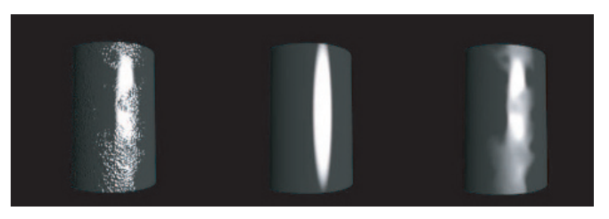

根据图9.49所给定的观察尺度，将圆柱体建模为光滑网格（宏观尺度），并使用法线贴图（细观尺度）来表示凸起是较为合适的，同时使用了具有固定粗糙度$\alpha_b$的Beckmann NDF来模拟微观尺度上的法线分布。这种组合表示方法在这个尺度上对圆柱体的外观进行了很好地模拟。但是，当观察尺度发生改变时会发生什么呢?

如图9.50所示，第一行展示了表面的其中一小部分，这部分表面被四个法线贴图的纹素所覆盖。假设我们按照这样的一个比例来渲染表面，使得法线贴图中的每个纹素刚好被一个画面像素所覆盖。对于法线贴图中的每个纹素而言，图中的红色箭头代表了法线（法线分布的平均值），它被Beckmann NDF（黑色箭头）所包围。法线和NDF隐式表达了表面的微观几何结构，如图9.50第一行表面的横截面所示。中间的主要突起代表了法线贴图所定义的凸起，而周围的小摆动则代表了微观尺度的表面结构。法线贴图中的每个纹素，结合对应的粗糙度，可以被看作是，在这个纹素所覆盖的表面上收集到的法线分布。

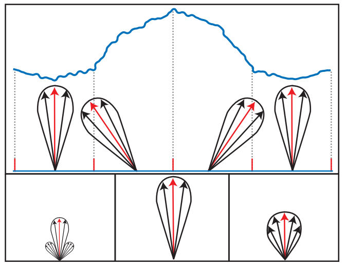

现在我们假设相机到物体的距离变远了，此时屏幕上的一个像素只能覆盖四个法线贴图的纹素。在这个分辨率下，一个理想的表面表达方式应当是：能够准确表示该区域内所有法线的分布。这个分布可以通过计算上层mipmap中的，四个对应纹素的NDF的平均值来获得。图9.50左下角展示了这种理想的法线分布。这个平均后的法线结果如果用于渲染的话，可以最准确地代表在较低分辨率下的表面外观。

图9.50底部中间的图展示了分别对法线（法线分布的平均值）和粗糙度（对应了法线分布的扩散角度）进行平均的结果。最终的结果具有正确的平均法线分布（红色箭头），但是法线分布太窄了，这个误差会使得表面看起来过于光滑。更加严重的是，由于NDF太窄，因此将很容易造成瑕疵（闪烁高光）。

我们无法直接使用Beckmann NDF来表示理想的法线分布。但是如果我们额外使用一个粗糙度图的话，那么Beckmann粗糙度$\alpha_a$就可以在不同的纹素之间发生变化。想象一下，对于每个理想的NDF，我们都要找到与其最匹配的定向Beckmann波瓣，无论是在方向上还是总体扩散角度上。我们将Beckmann波瓣的中心方向（即法线分布的平均值）存储在法线贴图中，将粗糙度值存储在粗糙度贴图中。最终结果如图9.50右下角所示，这个NDF更加接近理想中的情况。与简单的平均方法（图9.50底部中间的图）相比，使用这种方法可以更加真实地表示圆柱体的外观，如图9.49所示。

为了获得最佳的效果，应当对法线分布应用过滤操作（例如mipmap），而不是对法线或者粗糙度值单独应用过滤操作，这样做意味着，需要使用一种稍微不同的方式来思考NDF和法线之间的关系。通常来说，NDF定义在由法线贴图的逐像素法线所确定的局部切线空间中，然而，在过滤不同法线的NDF时，可以将法线贴图和粗糙度贴图的组合，看作是定义在底层几何表面的切线空间中的倾斜NDF，这样来进行思考是十分有帮助的。

早期解决NDF过滤问题的尝试\[91, 284, 658]是通过使用数值优化方法，来将一个或者多个NDF波瓣拟合到平均分布中。这种方法存在健壮性和速度上的问题，目前已经使用得不多了。相反，目前所使用的大部分技术，都是通过计算法线分布的方差来实现的。Toksvig \[1774]观察到了这样一个事实：如果对法线进行平均化的而不是重新归一化的话，那么法线的平均长度与法线分布的宽度成反比。也就是说，原始法线分布的扩散角度越大，平均后得到的法线就越短。据此，他提出了一种基于法线长度来修改NDF粗糙度参数的方法，并使用修正后的粗糙度参数来重新计算BRDF，从而对过滤后的法线扩散效果进行近似。

Toksvig的原始方程是用于Blinn-Phong NDF的，其数学形式如下：

$$
\alpha_{p}^{\prime}=\frac{\|\overline{\mathbf{n}}\| \alpha_{p}}{\|\overline{\mathbf{n}}\|+\alpha_{p}(1-\|\overline{\mathbf{n}}\|)}
\tag{9.76} 
$$

其中$\alpha_{p}$是原始的粗糙度值，$\alpha_{p}^{\prime}$是修正后的粗糙度值；$\|\overline{\mathbf{n}}\|$是平均法线的长度。这个方程也可以使用等效替换$\alpha_{p}=2 \alpha_{b}^{-2}-2$（来自Walter等人\[1833]）来得到Beckmann NDF，因为这两个NDF的形状十分类似。使用GGX分布的方法就不太直接了，因为GGX和Blinn-Phong（以及Beckmann）之间并没有明确的等价关系。一种方法是强行让$\alpha_g$和$\alpha_b$相等，这样做的结果是，虽然高光中心的值是相同的，但是高光的外观却大不相同。更加麻烦的是，GGX分布中并没有定义法线分布的方差，因此在与GGX分布一起使用的时候，这种基于方差的技术并没有扎实的理论基础。尽管有这些理论上的困难，但是在GGX分布中使用方程9.76的情况是相当普遍的，通常是令$\alpha_{p}=2 \alpha_{g}^{-2}-2$，这样做在实践中还是相当有效的。

Toksvig方法的优点是在GPU纹理过滤中引入了法线方差，它也适用于最简单的法线mipmap方案（即对法线进行不归一化的线性平均）。这个特性对于那些动态生成的法线贴图（例如水面波纹）而言特别有用，因为对于这些法线贴图而言，它们的mipmap必须在运行过程中生成。但是这个方法对于静态的法线贴图而言并不是很好，因为它无法与常见的法线贴图压缩算法一起使用，原因在于这些压缩算法都要求法线是单位长度的。而Toksvig的方法依赖于平均法线的长度，这个长度是会发生变化的，因此使用这种方法的法线贴图必须要保持未压缩状态。但是即使这样，存储变短的法线也会导致精度问题。

Olano与Baker的LEAN映射技术\[1320]基于的是法线分布协方差矩阵的映射，与Toksvig的方法一样，它可以很好地兼容GPU纹理过滤和线性mipmap，同时它还支持各向异性的法线分布。与Toksvig的方法类似，LEAN映射技术可以很好地处理动态生成的法线，但是为了避免精度不足的问题，因此在处理静态法线的时候需要大量的存储空间。Hery等人\[731, 732]独立提出了一种类似的技术，并在皮克斯动画电影中被用于渲染亚像素级别的细节，例如金属薄片（metal flakes）和小划痕等。CLEAN映射\[93]是LEAN映射的一个简化变体，它不支持各向异性的法线，但好处是降低了存储空间。LEADR映射\[395, 396]对LEAN映射进行了扩展，同时也考虑了位移映射（displacement mapping）的可见性影响。

实时图形应用中所使用的大多数法线贴图都是静态的，并不是动态生成的，对于这种贴图而言，通常会使用方差映射技术。这些技术会在生成法线贴图mipmap的时候，会计算法线平均化所带来的方差损失。Hill指出\[739]，Toksvig技术、LEAN映射和CLEAN映射等技术，都可以使用这种方法来预先计算方差，从而消除这些技术在原始形式下的许多缺点。在某些情况下，预计算出来的方差值会单独存储在方差纹理以及它的mipmap中。通常，这些值会用于修改现有粗糙度贴图的mipmap。例如：游戏《使命召唤：黑色行动》\[998]中的方差映射技术便采用了这种方法。修正后的粗糙度值是通过将原始粗糙度值转换为方差，并加入法线贴图的方差，最终转换回粗糙度计算而来的。在游戏《教团：1886》中，Neubelt和Pettineo \[1266, 1267]以一种类似方法使用了Han \[658]提出的技术，他们将法线贴图中存储的NDF与BRDF镜面项的NDF进行卷积，并将结果转换为粗糙度，最终将其存储在粗糙度贴图中。

还可以通过使用一些额外的存储空间来进一步改善结果，即在纹理空间的$xy$方向上分别计算方差，并将其存储在一个各向异性的粗糙度贴图中\[384, 740, 1823]。这项技术本身局限于轴向的各向异性，这在一些人造表面中是很常见的，但是在自然形成表面中就不太常见了。还可以通过再多存储一个值，从而支持定向的各向异性（oriented anisotropy）\[740]。

与原始形式的Toksvig、LEAN映射和CLEAN映射不同，方差映射技术并没有考虑由于GPU纹理过滤所引入的方差。为了弥补这一点，在方差映射的实现中通常会使用一个较小的滤波器\[740, 998]，对法线贴图的顶级mip进行卷积。当组合多个法线贴图的时候（例如细节法线贴图）\[106]，需要注意对法线贴图的方差进行正确组合\[740, 960]。

模型的高曲率几何结构（高频信息）或者法线贴图会引入法线方差，前面我们所讨论的这些技术并不能缓解这种由方差所带来的的画面瑕疵，但是也有一些方法可以解决这些问题。如果在几何体上存在着唯一的纹理映射的话（通常是角色模型，较少与环境有关），那么模型的几何曲率可以被“烘焙”到粗糙度贴图中\[740]。曲率还可以使用像素着色器中的导数指令来实时计算得出\[740, 857, 1229, 1589, 1775, 1823]。如果可以使用法线缓冲的话，那么这种计算可以在几何体的渲染阶段中进行，或者是在处理后阶段中进行。

到目前为止，我们所讨论的方法主要集中在镜面反射上，但是法线方差同样也会影响到漫反射的着色。考虑法线方差对$\mathbf{n} \cdot \mathbf{l}$项的影响，可以帮助提高漫反射着色和镜面反射着色结果的准确性，因为二者在反射率积分中都会乘上这一项\[740]。

方差映射技术将法线分布近似为光滑的高斯波瓣，如果每个像素中包含数十万个凸起的话，那么这种近似是合理的，因为它们可以被很平滑的平均。但是在大部分情况下，一个像素只能覆盖几百个或者几千个凸起，这会导致表面具有“闪闪发光（sparkly）”的材质外观，我们可以在图9.25中看到这样的例子，它包含了一系列图像，不同图像中球体上的凸起会逐渐减小。其中右下角图像中球体的凸起非常小，它们被平均后形成了十分平滑的高光；但是对于左下角和底部中心的图像而言，虽然球体的凸起小于一个像素，但是还不足以被很平滑地平均，不足以产生平滑的高光。如果这些小球动起来的话，那么充满噪声的高光会表现为一帧一帧的不断闪烁。

如果我们将这样一个曲面的NDF渲染出来的话，那么它看起来会像图9.51左侧那样。当球体运动起来的时候，半向量$\mathbf{h}$会在NDF上不断移动，穿过明亮和黑暗的区域，从而导致“闪闪发光”的外观。如果我们在这样的表面上使用方差映射技术，那么它会用一个类似于图9.51右侧的平滑NDF，来对左侧的NDF进行近似，从而失去闪烁细节。

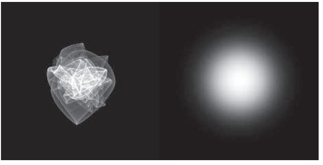

在电影行业中，这个问题通常会使用大幅的超采样来解决，但是这在实时渲染应用中是不可行的，甚至在离线渲染中也是不可取的。但是已经出现了一些用于解决这个问题的技术，其中有一些并不适合实时渲染使用，但是却为未来可能出现的技术提供了研究方向\[84, 810, 1941, 1942]。在这些方法中，有两种实现是用于实时渲染的。Wang和Bowles \[187, 1837]提出了一种技术，用于在游戏《迪士尼无限3.0（Disney Infinity 3.0）》中渲染闪闪发光的雪花。这个技术的目的是产生一种看似闪亮的外观，而不是真的去模拟特定的NDF，它适用于具有稀疏闪光的材质，例如雪花等。Zirr和Kaplanyan \[1974]的技术模拟了多个尺度上的法线分布，它可以用于更加广泛的材质外观，并且在空间上和时间上都是稳定的，

在本小节中，我们没有足够的篇幅来囊括所有有关材质过滤的文献，因此在这里我们将着重提及一些值得注意的参考文献。Bruneton等人\[204]提出了一种用于渲染海洋表面的技术，它支持环境光照，其中方差处理的尺度可以从几何到BRDF。Schilling \[1565]讨论了一种类似于方差映射的技术，该技术支持环境贴图的各向异性着色。Bruneton和Neyret \[205]则对该领域的早期工作进行了全面概述。

## 补充阅读和资源

McGuire的《Graphics Codex》\[1188]和Glassner的《数字图像合成原理》\[543, 544]对于本章节中所涉及的许多主题而言，都是一个非常好的参考资料。虽然Dutre的《Global Illumination Compendium》\[399]中的一些部分有点过时（尤其是BRDF模型部分），但是它是渲染数学非常好的参考资料（例如球形积分和半球积分）。其中Glassner和Dutre的参考资料都可以在网上免费获取。

对于想要更多了解光和物质相互作用的读者，我们非常推荐Feynman的讲座\[469]（可以在网上找到），其中的内容对于对于我们在撰写这一章的物理部分而言十分宝贵。另一个十分有用的参考资料是Fowles的《Introduction to Modern Optics》\[492]，这是一个是简短易懂的入门文章。Born和Wolf \[177]的《Principles of Optics》是一本更“重”（字面意思上也是）书，它包含了对光学的深入讲解。Nassau \[1262]的《Physics and Chemistry of Color》描述了物体颜色背后的物理现象，非常彻底且详细。
