# Chapter 14 Volumetric and Translucency Rendering 体积与半透明渲染

## 目录

-   [14.1 光线散射理论](#141-光线散射理论)
    -   [14.1.1 参与介质材质](#1411-参与介质材质)
    -   [14.1.2 透光率](#1412-透光率)
    -   [14.1.3 散射事件](#1413-散射事件)
    -   [14.1.4 相位函数](#1414-相位函数)
        -   [瑞利散射](#瑞利散射)
        -   [米氏散射](#米氏散射)
        -   [几何散射](#几何散射)
-   [14.2 特殊的体渲染](#142-特殊的体渲染)
    -   [14.2.1 大规模雾](#1421-大规模雾)
    -   [14.2.2 简单的体积光](#1422-简单的体积光)
-   [14.3 通用的体渲染](#143-通用的体渲染)
    -   [14.3.1 体积数据可视化](#1431-体积数据可视化)
    -   [14.3.2 参与介质渲染](#1432-参与介质渲染)
-   [14.4 天空渲染](#144-天空渲染)
    -   [14.4.1 天空和空气透视](#1441-天空和空气透视)
    -   [14.4.2 云](#1442-云)
        -   [将云作为粒子](#将云作为粒子)
        -   [将云作为参与介质](#将云作为参与介质)
        -   [多重散射的近似](#多重散射的近似)
        -   [云与大气的相互作用](#云与大气的相互作用)
-   [14.5 半透明表面](#145-半透明表面)
    -   [14.5.1 覆盖率和透光率](#1451-覆盖率和透光率)
    -   [14.5.2 折射](#1452-折射)
    -   [14.5.3 焦散和阴影](#1453-焦散和阴影)
-   [14.6 次表面散射](#146-次表面散射)
    -   [14.6.1 环绕光照](#1461-环绕光照)
    -   [14.6.2 法线模糊](#1462-法线模糊)
    -   [14.6.3 预积分皮肤着色](#1463-预积分皮肤着色)
    -   [14.6.4 纹理空间扩散](#1464-纹理空间扩散)
    -   [14.6.5 屏幕空间扩散](#1465-屏幕空间扩散)
    -   [14.6.6 深度贴图技术](#1466-深度贴图技术)
-   [14.7 毛发和皮毛](#147-毛发和皮毛)
    -   [14.7.1 几何和Alpha](#1471-几何和Alpha)
    -   [14.7.2 毛发](#1472-毛发)
    -   [14.7.3 皮毛](#1473-皮毛)
-   [14.8 统一方法](#148-统一方法)
-   [补充阅读和资源](#补充阅读和资源)

> Leonardo Da Vinci——“Those you wish should look farthest away you must make proportionately bluer；thus，if one is to be fifive times as distant，make it fifive times bluer.”

> 列奥纳多·达·芬奇——“那些你希望看得最远的事物，你必须按比例把它画得更蓝；因此，如果一个人比你远五倍，就要把他画得蓝五倍。”（意大利文艺复兴时期画家、自然科学家；1452—1519）

参与介质（participating media）是一个术语，它用来描述充满颗粒的体积。同时顾名思义，它们是参与光线传输的介质，换句话说，它们通过散射作用或者吸收作用，来影响穿过它们的光线。在渲染虚拟世界的时候，我们通常关注的是简单或者复杂的实体表面，这些表面看起来是不透明的，因为它们是密度很大的参与介质，会对光线进行反射，例如通常使用BRDF进行建模的电介质或者金属。生活中充满了密度较小的参与介质，例如水、雾、蒸汽，甚至是由稀疏分子所组成的空气。根据组成成分的不同，介质与光线的相互作用也会有所不同，光线穿过介质并被介质中的粒子所反射，这类事件通常会被称为光线散射（light scattering）。介质中粒子的密度可以是同质的（homogeneous，均匀的），例如空气或者水；也可以是异质的(heterogeneous，不均匀的，随空间位置而变化)，例如云或者蒸汽。一些致密的材料通常呈现为固体表面，表现出较高水平的光线散射，例如皮肤或者蜡烛的蜡。如章节9.1中所介绍的那样，漫反射表面着色模型是光线在微观层面发生散射的结果。任何事物都会发生散射（Everything is scattering）。

## 14.1 光线散射理论

在本小节中，我们将介绍光线在参与介质中的模拟和渲染。我们曾在章节9.1.1和章节9.1.2中讨论过光线的散射和吸收，而本小节将讨论的是对这些物理现象的定量处理。许多作者在多重散射路径追踪的背景下描述了辐射的传输方程\[479, 743, 818, 1413]。而在本小节中，我们将专注于单次散射（single scattering），并对其工作原理建立起一个良好直觉。单次散射只会考虑光线在粒子（构成参与介质的粒子）上的一次反射；而多重散射则会对每条光路上的多次弹射进行追踪，因此要复杂得多\[243, 479]。使用多重散射和不使用多重散射的对比结果，可以在图14.51中看到。表14.1给出了用于表示散射方程中参与介质属性的符号和单位。请注意，本章节中的许多物理量，例如$\sigma_{a}, \sigma_{s}, \sigma_{t}, p, \rho, v, T_{r}$，都与光线的波长有关，这意味着在实践中它们都是RGB量。

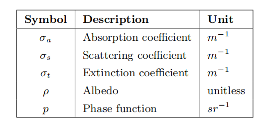

### **14.1.1 参与介质材质**

有四种类型的事件可以影响沿着光线进行传播并穿过介质的radiance。图14.1中给出了这些函数的图示说明：


可以将其总结为：

-   **吸收Absorption**（$\sigma_{a}$的函数）——光子被介质吸收并转化为热量或者其他形式的能量。
-   **外散射Out-scattering**（$\sigma_{s}$的函数）——光子被介质中的粒子反弹，并从介质中散射出去。该事件的发生概率，取决于描述光线反射方向分布的相位函数$p$。
-   **发射Emission**——当介质达到较高温度时，例如火焰的黑体辐射（black-body radiation），可以从介质中发射光线。有关发射的更多细节，详见Fong等人的课程讲义 \[479]。
-   **内散射In-scattering**（$\sigma_{s}$的函数）——来自任何方向的光子，在被介质粒子反弹之后都可以散射到当前的光路中，并对最终的radiance产生一定的贡献。在给定方向上内散射进来的光量，也取决于该光线方向的相位函数$p$。

综上所述，在一个路径中加入光子是内散射$\sigma_{s}$和发射的函数；而移除光子则是消光系数（extinction）$\sigma_{t}=\sigma_{a}+\sigma_{s}$的函数，它代表了吸收和外散射。由辐射传输方程（radiative transfer equation）可知，系数集合代表了位置$\mathbf{x}$和方向$\mathbf{v}$上的radiance相对于$L(\mathbf{x}, \mathbf{v})$的导数。这也就是为什么这些系数的值都在范围$[0,+\infty]$内，详见Fong等人\[479]的说明。其中的散射系数和吸收系数决定了该介质的反照率$\rho$，其定义如下：

$$
\rho=\frac{\sigma_{s}}{\sigma_{s}+\sigma_{a}}=\frac{\sigma_{s}}{\sigma_{t}}
\tag{14.1} 
$$

反照率$\rho$代表了在可见光谱范围内，介质中散射作用相对于吸收作用的重要程度，即介质的整体反射率。$\rho$的值位于$[0,1]$范围内，接近0意味着大部分光线都会被吸收，这会产生一种浑浊的介质，例如黑色的排烟。接近1意味着大部分光线都会被散射而不是被吸收，这会产生一种更加明亮的介质，例如空气、云或者地球的大气层。

正如章节9.1.2中所描述的，介质的外观表现是其散射特性和吸收特性的组合结果。现实世界中很多参与介质的系数，都已经进行了测量和发布\[1258]。例如：牛奶具有很高的散射值，因此会产生浑浊且不透明的外观；并且由于牛奶具有较高的反照率$\rho > 0.999$，因此牛奶看起来也是白色的。 另外一个例子：红酒的特点是几乎没有散射作用，但是具有较高的吸收作用，这使得它具有半透明且彩色的外观。如图14.2中渲染的液体，并将其与图9.8中拍摄的真实液体进行比较。

![图14.2：葡萄酒和牛奶在不同浓度下具有不同的吸收特性和散射特性，图中展示了不同浓度下葡萄酒和牛奶的渲染结果。 \[1258\]](images/Chapter-14/202308222045583.png "图14.2：葡萄酒和牛奶在不同浓度下具有不同的吸收特性和散射特性，图中展示了不同浓度下葡萄酒和牛奶的渲染结果。 \[1258]")

这些性质和事件都与光线的波长相关。这种相关性意味着，在给定的介质中，不同频率的光线可能会以不同的概率被吸收或者倍散射。从理论上来说，为了从根本上解决这个问题，我们应当在渲染过程中使用光谱值。但是为了效率起见，因此在实时渲染中（在离线渲染中也有少数例外情况\[660]）我们依然会使用RGB值。在可能的情况下，应当使用颜色匹配函数（color-matching function）（详见章节8.1.3）来从光谱数据中预先计算出诸如$\sigma_{a}$和$\sigma_{s}$等物理量所对应的RGB值。

在之前的章节中，由于并不存在参与介质，因此我们可以假设进入相机的radiance与离开最近表面的radiance相同。更准确地说，我们假设$L_{i}(\mathbf{c},-\mathbf{v})=L_{o}(\mathbf{p}, \mathbf{v})$，其中$\mathbf{c}$是相机位置，$\mathbf{p}$是与最近表面与观察光线的交点，$\mathbf{v}$是指向从点$\mathbf{p}$指向点$\mathbf{c}$的单位观察向量。

一旦引入了参与介质，上述假设就不再成立了，我们需要考虑沿着观察光线的radiance变化。作为一个例子，我们现在将描述在评估来自精确光源（由单个无穷小点所表示的光源，详见章节9.4）的散射光线时所涉及的计算：

$$
L_{i}(\mathbf{c},-\mathbf{v})=T_{r}(\mathbf{c}, \mathbf{p}) L_{o}(\mathbf{p}, \mathbf{v})+\int_{t=0}^{\|\mathbf{p}-\mathbf{c}\|} T_{r}(\mathbf{c}, \mathbf{c}-\mathbf{v} t) L_{\mathrm{scat}}(\mathbf{c}-\mathbf{v} t, \mathbf{v}) \sigma_{s} d t
\tag{14.2} 
$$

其中$T_{r}(\mathbf{c}, \mathbf{x})$是给定点$\mathbf{x}$与相机位置$\mathbf{c}$之间的透光率（章节14.1.2）；$L_{\mathrm{scat}}(\mathbf{x}, \mathbf{v})$是沿着观察射线，在给定点$\mathbf{x}$处散射的光线（章节14.1.3）。这个方程中的各个计算部分如图14.3所示，我们将在接下来的几个小节中对其进行解释。关于如何从辐射传输方程中推导出方程14.2的更多细节，可以在Fong等人\[479]的课程说明中找到。

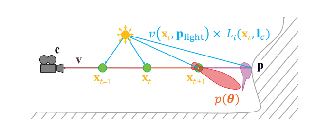

### **14.1.2 透光率**

透光率$T_r$代表了光线在一定距离内能够通过介质的比例，其数学定义为：

$$
T_{r}\left(\mathbf{x}_{a}, \mathbf{x}_{b}\right)=e^{-\tau}, \quad \tau=\int_{\mathbf{x}_{=} \mathbf{x}_{a}}^{\mathbf{x}_{b}} \sigma_{t}(\mathbf{x})\|d \mathbf{x}\|
\tag{14.3} 
$$

这种关系也被称为Beer-Lambert定律。方程中的光学深度$\tau$是没有单位的，它代表了光线的衰减量。消光（extinction）系数或者传播距离越大，光学深度$\tau$也就越大，反过来则说明通过介质的光线就越少。光学深度$\tau =1$将会移除大约$60\%$的光线。例如：如果在RGB中$\sigma_{t}=(0.5,1,2)$，光线能通过的深度$ d  $为 1米，则透光率$T_{r}=e^{-d \sigma_{t}} \approx(0.61,0.37,0.14)$，如图14.4所示。需要对$(i)$不透明表面的radiance $L_{o}(\mathbf{p}, \mathbf{v})$；$  (ii) $内散射事件所产生的radiance $L_{\mathrm{scat}}(\mathbf{x}, \mathbf{v})$；以及$(iii)$从散射事件到光源的每条路径都应用这个透光率$T_r$。从视觉上看，$(i)$将导致一些雾状的表面遮挡；$(ii)$将导致散射光线的遮挡，从而提供一种有关介质厚度的视觉暗示（如图14.6所示）；$(iii)$将导致参与介质的体积自阴影现象（如图14.5所示）。由于$\sigma_{t}=\sigma_{a}+\sigma_{s}$，因此透光率可能会同时受到吸收和外散射的影响

 不变时，透光率是一个关于深度的函数。正如预期的那样，红色分量的消光系数越低，因此最终透射出的红色也就越多。")

### **14.1.3 散射事件**

对于场景中给定位置$\mathbf{x}$和方向$\mathbf{v}$的精确光源，对其内散射事件进行积分可以这样做：

$$
L_{\text {scat }}(\mathbf{x}, \mathbf{v})=\pi \sum_{i=1}^{n} p\left(\mathbf{v}, \mathbf{l}_{c_{i}}\right) v\left(\mathbf{x}, \mathbf{p}_{\text {light }_{i}}\right) c_{\text {light }_{i}}\left(\left\|\mathbf{x}-\mathbf{p}_{\text {light }_{i}}\right\|\right)
\tag{14.4} 
$$

方程中$n$是光源的数量，$p()$是相位函数，$v()$是可见度函数，$\mathbf{l}_{c_{i}}$是第$i$个光源的方向向量，$\mathbf{p}_{\text {light }_{i}}$是第$i$个光源的位置。此外$c_{\text {light }_{i}}$是第$i$个光源的radiance到位置$\mathbf{x}$距离的函数，这里使用了章节9.4中所定义，以及章节5.2.2中的平方反比衰减函数。可见性函数$v\left(\mathbf{x}, \mathbf{p}_{\text {light }_{i}}\right)$代表了从光源位置$\mathbf{p}_{\text {light }_{i}}$处发出的光线最终到达位置$\mathbf{x}$的比例，其数学形式如下：

$$
v\left(\mathbf{x}, \mathbf{p}_{\text {light }_{i}}\right)=\operatorname{shadowMap}\left(\mathbf{x}, \mathbf{p}_{\text {light }_{i}}\right) \cdot \operatorname{vol\operatorname {Shad}}\left(\mathbf{x}, \mathbf{p}_{\text {light }_{i}}\right)
\tag{14.5} 
$$

其中方程中的$\operatorname{volShad}\left(\mathbf{x}, \mathbf{p}_{\text {light }_{i}}\right)=T_{r}\left(\mathbf{x}, \mathbf{p}_{\text {light }_{i}}\right)$。在实时渲染中，阴影是由两种类型的遮挡所产生的：不透明遮挡和体积遮挡。计算来自不透明物体的阴影（$\operatorname{shadowMap}$）通常会使用阴影映射或者第7章中所介绍的其他技术。

方程14.5中的体积阴影项$\operatorname{volShad}\left(\mathbf{x}, \mathbf{p}_{\text {light }_{i}}\right)$代表了从光源位置$\mathbf{p}_{\text {light }_{i}}$到采样点$\mathbf{x}$的透光率，其取值范围为$[0,1]$。由体积所产生的遮挡效果是体渲染中的重要组成部分，其中体积元素可以产生自阴影，或者是在其他场景元素上投射阴影，如图14.5所示。这个结果通常是这样获得的：沿着从眼睛出发，到达第一个表面的主光线（primary ray）进行光线步进；然后再沿着从各个样本点到每个光源的二次光线（secondary ray）进行光线步进。这里所提到的“光线步进（ray marching）”是指，使用$n$个样本对两点之间的路径进行采样，从而对沿途的散射光线和透光率进行积分。有关这种采样方法的更多细节，详见章节6.8.1，在该章节所使用的光线步进是用来渲染高度场的。光线步进的思想与三维体积有点类似，每条光线会一步一步地前进，并在沿途的每个样本点上对体积材质或者光照进行采样。如图14.3所示，主光线使用红色进行表示，二次阴影光线使用蓝色进行表示，而绿色则代表了主光线上的样本点。有许多其他出版物也对光线步进方法进行了详细描述 \[479, 1450, 1908]。

![图14.5：体积阴影示例，其中的Stanford兔子由参与介质所构成 \[744\] 。左：没有体积自阴影；中：有体积自阴影；右：将阴影投射在其他场景元素上。](images/Chapter-14/202308231551818.png "图14.5：体积阴影示例，其中的Stanford兔子由参与介质所构成 \[744] 。左：没有体积自阴影；中：有体积自阴影；右：将阴影投射在其他场景元素上。")

光线步进的时间复杂度为$O(n^2)$，其中$n$是每条路径上的样本数量，因此光线步进的计算开销上涨得会很快。为了在质量和性能之间的进行权衡（trade-off），可以使用一些特定的体积阴影表示技术来存储光线出射方向上的透射率。这些技术将在本章节剩余小节中的适当部分进行解释。

为了直观地了解光线在参与介质中的散射（scattering）行为和消光（extinction）行为，我们假设$\sigma_{s}=(0.5,1,2)$和$\sigma_{a}=(0,0,0)$。对于介质中的较短光路，内散射事件将会占据主导地位（相对于消光事件）；而在我们所假设的这个例子下，外散射事件将会占据主导地位，由于深度较小，因此$T_r≈1$。这个材质将会呈现蓝色，因为蓝色通道的$\sigma_{s}$值最高。光线在介质中穿透得越深，就会由于消光作用，最终通过的光子数量就越少。在这种情况下，来自消光作用的透射颜色将开始占主导地位。这可以用$\sigma_{t}=\sigma_{s}$来进行解释，因为$\sigma_{a}=(0,0,0)$。因此，与散射光线随光学深度$d \sigma_{s}$的线性积分（方程14.2）相比，透光率$T_{r}=e^{-d \sigma_{t}}$的下降速度要快得多。对应在本例中，由于红色通道在通过介质时被消光的概率较小（因为该通道的$\sigma_{t}$值最小），因此红光将会占据主导地位。这种现象如图14.6所示，这也正是大气层和天空中所发生的情况。当太阳角度较高时（例如：直穿大气层的短光路，该光路垂直于地面），蓝色光线会发生更多的散射，从而使得天空呈现自然的蓝色。然而，当太阳位于地平线角度时，太阳光线在地球大气中具有一条很长的光线路径，更多的红光会被透射，因此天空会显得更红。而在这两种情况之间，便是我们都知道的日出和日落的过渡。有关大气材质组成的更多细节，详见章节14.4.1。有关这个效果的另一个例子，详见图9.6右侧的乳白色玻璃。

 。")

### **14.1.4 相位函数**

参与介质由半径不同的粒子所组成。相对于光线的向前传播方向，这些粒子大小的分布将会影响光线在给定方向上发生散射的概率。章节9.1对这种行为背后的物理原理进行了解释。

在评估内散射事件的时候，可以使用一个相位函数，来在宏观层面上描述散射方向的概率和分布，如方程14.4所示。图14.7对此进行了图示，其中相位函数使用红色进行表示，相位函数有一个参数$\theta$，它代表光线的向前传播路径（蓝色）与外散射方向$\mathbf{v}$（绿色）之间的夹角。注意在这个相位函数的例子中存在两个主要的波瓣：一个与光路方向相反的、较小的后向散射波瓣，一个与光路方向相同的、较大的前向散射波瓣。相机B位于较大的前向散射波瓣的方向上，因此与相机A相比，它将会接收到更多的散射radiance。为了保证能量守恒，相位函数在单位球体上的积分必须为1。

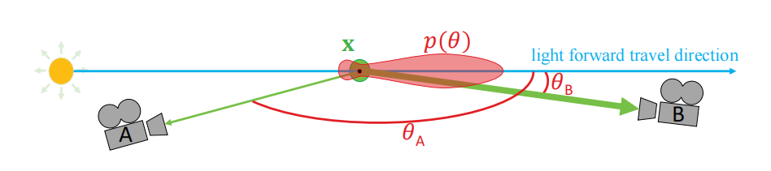

相位函数会根据到达该点的定向radiance信息，来相应改变该点上的内散射。最简单的相位函数是各向同性的：即光线将在各个方向上发生均匀散射。这种完美但不符合实际的行为可以使用下面的方程进行描述：

$$
p(\theta)=\frac{1}{4 \pi}
\tag{14.6} 
$$

其中参数$\theta$是入射光线与外散射方向之间的夹角，$4 \pi$是单位球的表面积大小。

基于物理的相位函数依赖于粒子的相对尺寸$s_p$，即：

$$
s_{p}=\frac{2 \pi r}{\lambda}
\tag{14.7} 
$$

其中$r$是粒子的半径，$\lambda$的光线是波长\[743]。根据相对尺寸$s_p$大小的不同，会发生以下不同类型的散射：

-   当$s_{p} \ll 1$时，发生瑞利散射（Rayleigh scattering），例如空气。
-   当$s_{p} \approx 1$时，发生米氏散射（Mie scattering）。
-   当$s_{p} \gg 1$时，发生几何散射（geometric scattering）。

#### 瑞利散射

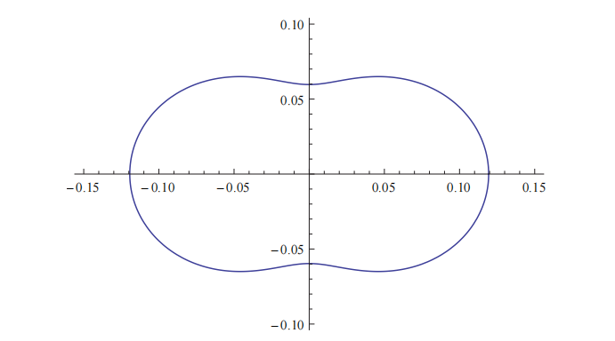

瑞利（Lord Rayleigh, 1842-1919）提出了空气分子散射光线的术语。在很多应用领域中，这些表达式被用于描述地球大气中的光线散射现象。这个相位函数包含两个波瓣（如图14.8所示），即相对于光线方向的后向散射（backward scattering）与前向散射（forward scattering）。这个函数只有一个参数$\theta$，$\theta$是入射光线和外散射方向之间的夹角。该相位函数的数学形式如下：

$$
p(\theta)=\frac{3}{16 \pi}\left(1+\cos ^{2} \theta\right)
\tag{14.8} 
$$

瑞利散射与光线的波长高度相关。如果将瑞利散射视作波长$\lambda$的函数的话，那么瑞利散射的散射系数$\sigma_{s}$将与波长$\lambda$的四次方成反比：

$$
\sigma_{s}(\lambda) \propto \frac{1}{\lambda^{4}}
\tag{14.9} 
$$

这种关系意味着，相较于波长较长的红光而言，波长较短的蓝光或者紫光会更容易被散射。方程14.9的光谱分布可以通过光谱颜色匹配函数（章节8.1.3）来将其转换为RGB值，即$\sigma_{s}=(0.490,1.017,2.339)$。这个值被归一化为亮度1，并且应当根据所需要的散射强度来对其进行缩放。有关蓝光在大气中被更多地散射，从而产生的视觉效果将在章节14.4.1中进行解释。

#### 米氏散射

米氏散射\[776]是一种当粒子大小与光线波长大致相同时可以使用的模型。这种类型的散射与光线的波长无关。软件MiePlot可以用来模拟这种现象\[996]。特定粒子尺寸的米氏相位函数通常是一个十分复杂的分布，它具有强烈且尖锐的定向波瓣，也就是说，相对于光子的运动方向，光子在某些特定方向上的散射概率会很高。计算这种用于体积着色的相位函数具有很高的计算成本，但幸运的是我们很少会使用到它。介质通常都会具有连续的粒子尺寸分布。对所有这些不同尺寸的米氏相位函数求平均值，便得到整个介质的平滑平均相位函数。因此，可以使用一些相对光滑的相位函数来表示米氏散射。

常用于描述米氏散射的一种相位函数是Henyey-Greenstein （HG）相位函数，它最初的目的是用来模拟星际尘埃中的光线散射\[721]。这个函数无法精确捕捉真实世界中每个散射的复杂行为，但是它可以很好地匹配相位函数的其中一个波瓣\[1967]，即主散射方向上的波瓣。它可以用来表示任何烟、雾或者灰尘状的参与介质，这类介质通常会表现出强烈的后向散射或者前向散射，从而在光源附近产生巨大的视觉光晕。常见的例子包括：雾中的聚光灯；太阳方向上的云，其边缘会呈现出强烈的银边效应（silver-lining effect）。

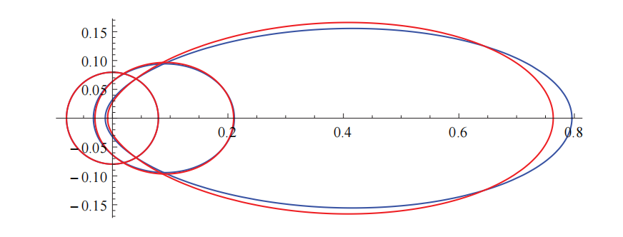

HG相位函数可以表示比瑞利散射更加复杂的行为，其数学形式如下：

$$
p_{h g}(\theta, g)=\frac{1-g^{2}}{4 \pi\left(1+g^{2}-2 g \cos \theta\right)^{1.5}}
\tag{14.10} 
$$

这个相位函数可以生成各种形状，如图14.9所示。方程中参数$g$可以用来表示后向散射（$g < 0$）、各向同性散射（$g = 0$）或者前向散射（$g > 0$），其中参数g的范围在$[−1,1]$范围内。使用HG相位函数的散射结果如图14.10所示。

一种可以获得与HG相位函数相似结果，但是速度更快的方法是使用Blasi等人\[157]提出的近似相位函数，这个相位函数通常会以第三作者的名字进行命名，即Schlick相位函数：

$$
p(\theta, k)=\frac{1-k^{2}}{4 \pi(1+k \cos \theta)^{2}}, \quad where \quad k \approx 1.55 g-0.55 g^{3}
\tag{14.11}  
$$

方程14.11中不包含任何复杂的幂函数，仅仅只有一个平方函数，因此计算起来要快得多。为了将这个函数映射到原始HG相位函数上，需要从参数$g$中计算参数$k$。而对于具有恒定$g$值的参与介质，只需要进行一次计算即可。在实际应用中，Schlick相位函数是一个很好的节能近似（计算量更少，更环保），如图14.9所示。

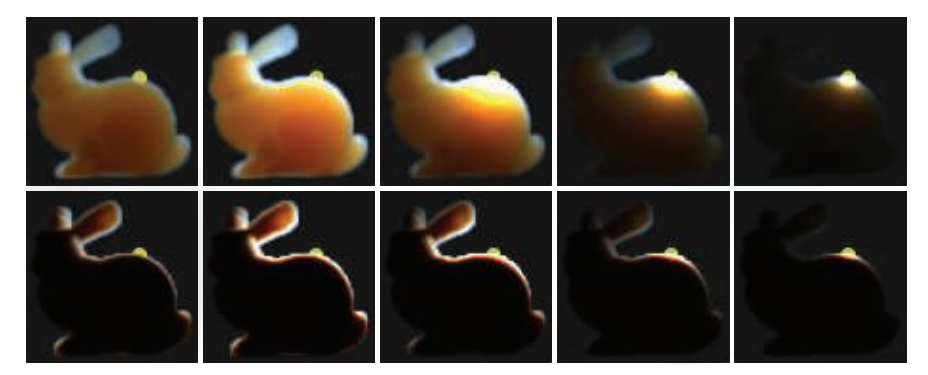

为了表达更加复杂的一般相位函数范围，也可以将多个HG或者Schlick相位函数进行混合。这种方法使得我们能够表达这样一个相位函数\[743]，它同时具有强烈的前向散射波瓣和后向散射波瓣，类似于云的散射行为，详见章节14.4.2中的描述和说明。

#### 几何散射

当粒子尺寸明显大于光线波长的时候，就会发生几何散射（geometric scattering）。在这种情况下，光线可以在每个粒子上发生折射和反射。这种行为可能需要一个更加复杂的散射相位函数才能在宏观层面上对其进行模拟。光线的偏振（polarization）也会影响到这种类型的散射现象，例如：现实生活中的一个常见例子就是彩虹效果，彩虹是由空气中水分粒子内部的光线反射所引起的，使得太阳光线在一个小视角（大约3度）内的反向散射中被分解成可见光谱。这种复杂的相位函数可以使用MiePlot软件进行模拟\[996]。在章节14.4.2中就描述了这样一个相位函数。

## 14.2 特殊的体渲染

在本小节中，会介绍一些基本的、有限的体渲染算法。有些人甚至会说，这些算法都是老一套的把戏，它们往往会依赖于特定的模型。之所以会在这里依然介绍和使用它们，是因为这些算法仍然工作良好且表现良好。

### **14.2.1 大规模雾**

雾可以近似地表示为一种基于深度的效果。其最基本的形式是，根据与相机之间的距离来对场景顶部的雾进行alpha混合，这种雾通常被称为深度雾（depth fog）。这种类型的效果是一种对观察者的视觉暗示。第一，它可以增加真实感和戏剧感，如图14.11所示。

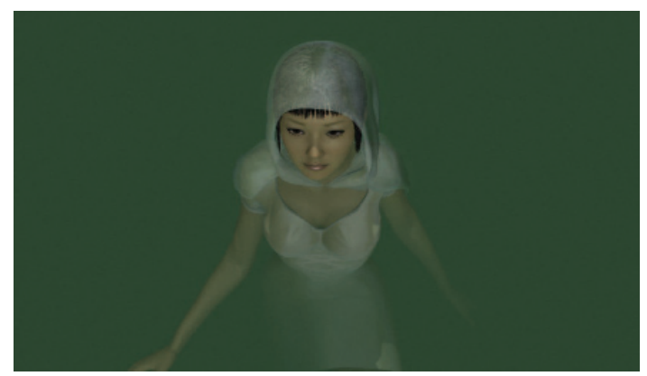

第二，它是一个重要的深度暗示，可以帮助场景中的观察者来确定物体的位置大概有多远，如图14.12所示。第三，它可以作为遮挡剔除的一种形式，如果物体位于太远的位置时，它可能会被雾完全挡住，此时可以安全地跳过这些物体的渲染，从而提高应用程序的性能表现。

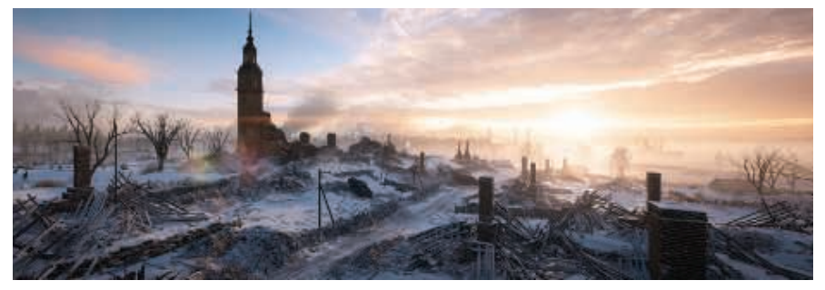

一种表示雾量（amount of fog）的方法，是使用范围在$[0,1]$中的$f$来表示透光率，当$f = 0.1$时，则代表有10%的背景表面是可见的。假设背景表面的输入颜色为$\mathbf{c}_{i}$，雾的颜色为$\mathbf{c}_{f}$，则最终颜色$\mathbf{c}$为：

$$
\mathbf{c}=f \mathbf{c}_{i}+(1-f) \mathbf{c}_{f}
\tag{14.12} 
$$

可以使用许多不同的方法来评估$f$的值。随着深度线性增长的雾可以使用如下方程：

$$
f=\frac{z_{\text {end }}-z_{s}}{z_{\text {end }}-z_{\text {start }}}
\tag{14.13} 
$$

其中$z_{\text {start }}$和$z_{\text {end }}$是用户控制的参数，它们决定了雾在哪里开始，以及在哪里结束（这里的结束是指变得完全雾蒙蒙）；$z_s$是从观察者到待计算雾表面的线性深度。关于如何计算雾的透光率，一种物理正确的方法是使其随距离呈指数级增长，即遵循透光率的Beer-Lambert定律（章节14.1.2）。这种效果可以通过使用以下方程来进行实现：

$$
f=e^{-d_{f} z_{s}}
\tag{14.14} 
$$

其中标量$d_f$是控制雾密度的用户参数。这种传统的、大尺度的雾，是对光线在大气中的散射和吸收的一种粗略近似（章节14.4.1），但是它仍然被如今的游戏所应用，并且效果很好，如图14.12所示。

这就是硬件雾在OpenGL和DirectX API中的暴露方式。对于移动设备等硬件上的简单情景而言，考虑使用这些模型来实现雾效是仍然具有价值的。如今的许多游戏都依赖于更加高级的后处理来实现大气效果，例如雾和光线散射。透视视图中的雾具有一个问题，即深度缓冲中的深度值是以一种非线性的方式进行计算的（章节23.7）。我们需要使用逆投影矩阵，来将非线性的深度缓冲值转换会线性深度$z_s$ \[1377]。然后可以使用像素着色器来将雾应用为一个全屏pass，从而实现一些更加高级的结果，例如高度相关的雾或者水下着色等。

高度雾（height fog）使用一个参数化的高度和厚度，来表示一个由参与介质构成的简单平板（slab）。对于屏幕上的每个像素，会使用一个将观察射线到达表面前穿过slab的距离作为参数的函数，来评估雾的密度和散射光线。Wenzel \[1871]提出了一个封闭形式的解，用于评估slab内部参与介质的指数衰减。这样做可以在slab边缘附近产生一个平滑的过渡雾效，这在图14.12左侧的背景雾中是很明显的。

深度雾和高度雾有很多种可能的变体。雾的颜色$\mathbf{c}_{f}$可以是一个单一的颜色，可以使用观察向量来对立方体贴图进行采样，甚至也可以是复杂大气散射的结果，即使用一个逐像素的相位函数，来对颜色进行方向性的修改\[743]。还可以使用$f = f_df_h$，来将深度雾$f_d$和高度雾$f_h$的透光率结合起来，并在场景中将这两种类型的雾效交织在一起。

深度雾和高度雾是大范围的雾效。人们可能想要渲染更多的局部现象，例如分离的雾区，又例如：在洞穴或者墓地中的几个坟墓的周围渲染一些雾。我们可以使用椭球或者box等形状来在需要的地方添加一些局部雾效\[1871]。这些雾元素使用各自的包围盒，按照从后往前的顺序进行渲染。在像素着色器中计算每个形状与观察向量的前后交点，其中前交点记为$d_f$，后交点记为$d_b$。使用体积深度$d = \max(0,\min (z_s, d_b)−d_f)$来计算透光率$T_r$（章节14.1.2），覆盖率则为$\alpha= 1.0−T_r$，其中$z_s$代表了最近的不透明表面的线性深度。在场景顶部添加的散射光量$\mathbf{c}_{f}$可以用$\alpha\mathbf{c}_{f}$进行表示。为了允许从网格模型中评估更多不同的雾效形状，Oat和Scheuermann \[1308]给出了一种巧妙的单pass方法，来计算体积中最近的入口点和最远的出口点。他们将表面距离$d_s$保存在表面的一个通道中，将$1-d_s$保存在另一个通道中。通过设置alpha的混合模式来保存找到的最小值，在体积渲染之后，第一个通道中将具有最近的值$d_f$，第二个通道将具有最远的值$d_b$，以$1-d$的方式进行编码，我们可以从这个编码中恢复$d$的值。

水体是一种参与介质，因此会表现出相同类型的、基于深度的颜色衰减。沿海水域的透光率约为$(0.3,0.73,0.63)$每米\[261]，因此利用方程14.23，我们可以计算出$\sigma_{t}=(1.2,0.31,0.46)$。当使用一个不透明表面来渲染黑暗的水体时，可以在相机位于水面以下的时候启用雾效渲染，而在相机位于水面以上时关闭雾效渲染。Wenzel \[1871]提出了一种更加先进的解决方案。当相机位于水下时，散射和透光率会被积分在一起，直到击中一个固体或者水面。如果相机位于水面以上，那么仅仅会对从水面到海底固体几何物体之间的距离进行积分。

### **14.2.2 简单的体积光**

&#x20;参与介质中的光线散射可能会很难评估。但值得庆幸的是，有许多有效的技术，可以在各种情况下对这种散射进行令人信服地近似。

想要获得体积效果，最简单的方法就是在帧缓冲上直接渲染透明网格并进行混合。我们将其称为溅射（splatting）方法（章节13.9）。而想要渲染穿过窗户、茂密森林或者来自聚光灯的光束，一种解决方案是使用相机对齐的粒子，每个粒子上都带有一个纹理。每个带有纹理的四边形，都会在光束的方向上被拉伸，同时始终保持面向相机（圆柱体约束）。

![图14.13：利用下面GLSL代码片段的解析积分，对光源的体积光线散射进行评估计算。它可以作为一种后处理效果应用在均匀介质（左）上，或者应用在粒子上（右），其中每个粒子都是一个具有深度的体积。 \[1098\]](images/Chapter-14/202308240918487.png "图14.13：利用下面GLSL代码片段的解析积分，对光源的体积光线散射进行评估计算。它可以作为一种后处理效果应用在均匀介质（左）上，或者应用在粒子上（右），其中每个粒子都是一个具有深度的体积。 \[1098]")

网格溅射方法的缺点在于，累积大量的透明网格将会增加所需要的内存带宽，这可能会导致性能瓶颈，并且这些面向相机的纹理化四边形有时候可能会被观察者注意到。为了解决这个问题，人们提出了利用光线单次散射的封闭形式解来进行后处理的方法。我们假设一个同质的、球形的均匀相位函数，并假设路径上具有一个恒定的参与介质，我们可以对散射光线和正确的透光率进行积分，结果如图14.13所示。下面的GLSL着色器代码片段，展示了这种技术的一个示例实现\[1098]：

```glsl
float inScattering (vec3 rayStart , vec3 rayDir ,vec3 lightPos , float rayDistance )
{
    // Calculate coefficients .
    vec3 q = rayStart - lightPos ;
    float b = dot( rayDir , q);
    float c = dot(q, q);
    float s = 1.0f / sqrt (c - b*b);
    // Factorize some components .
    float x = s * rayDistance ;
    float y = s * b;
    return s * atan ( (x) / (1.0 + (x + y) * y));
}
```

其中rayStart是光线的起始位置，rayDir是光线的归一化方向，rayDistance是沿着光线的积分距离，lightPos是光源的位置。Sun等人\[1722]的解还额外考虑了散射系数$\sigma_{s}$，这个解还描述了漫反射radiance和镜面radiance在Lambertian表面上和Phong表面上的反弹还会受到这样一个事实的影响：即光线在到达任何表面之前，都会在非直线的路径上进行散射。为了考虑透光率和相位函数，可以使用一个更加ALU-heavy的解决方案\[1364]。所有这些模型在它们所做的事情上都是有效的，但是它们并没有考虑来自深度贴图或者非同质参与介质的阴影。

依靠一种被称为泛光的技术，可以近似地计算屏幕空间中的光线散射\[539, 1741]。对帧缓冲进行模糊处理，并以一个较小的百分比再将模糊后的结果叠加到帧缓冲上，从而使得每个明亮的物体会将自身radiance泄漏到附近范围内\[44]。这种技术通常用于对相机镜头中的缺陷进行近似，但是在某些环境中，它也是一种适用于较短距离的、非遮挡散射的良好近似。章节12.3中对泛光效果进行了详细描述。

Dobashi等人\[359]提出了一种方法，通过使用一系列平面来对体积进行采样，从而渲染大规模的大气效果。这些采样平面垂直于观察方向，并按照从后向前的顺序进行渲染。Mitchell \[1219]也提出了同样的方法来渲染聚光灯的效果，并使用阴影贴图投射来自不透明物体的体积阴影。章节14.3.1详细描述了使用溅射切片（splatting slice）来渲染体积的方法。

Mitchell \[1225]、Rohleder和Jamrozik \[1507]提出了一种在屏幕空间中运行的替代方法，如图14.14所示，它可以用来渲染来自遥远光线（例如太阳）的光束。首先，该方法会将缓冲区清除为黑色，在远平面上渲染一个围绕太阳虚假明亮物体，并使用一个深度缓冲进行深度测试，从而接收未被遮挡的像素。其次，在图像上应用定向模糊，以便从太阳处向外泄漏之前积累下来的radiance。可以使用一个两pass的可分离滤波技术（章节12.1），其中每个pass都使用了$n$个样本，从而获得与$n^2$个样本相同的模糊结果，并且具有更快的渲染速度\[1681]。最后，将最终的模糊缓冲区添加到场景缓冲区中。这个技术是有效的，尽管只有屏幕上能够看见的光源才可以投射出光束，但是它以一个较小的成本却能够提供显著的视觉效果。

![图14.14：使用屏幕空间后处理渲染的光束。 \[1225\]](images/Chapter-14/202308241013245.png "图14.14：使用屏幕空间后处理渲染的光束。 \[1225]")

## 14.3 通用的体渲染

在本小节中，我们将介绍更多基于物理的体渲染技术，即尝试表示介质与光源之间的相互作用（章节14.1.1）。通用的体渲染技术会涉及到空间变化的参与介质，这类参与介质通常会使用体素来进行表达（章节13.10），体积光的相互作用会在视觉上产生复杂的散射现象和阴影现象。通用的体渲染方案还必须考虑体积与其他场景元素的正确组合，例如不透明表面或者透明表面。这种空间变化的介质属性，在游戏环境中可能会体现为烟雾效果和火焰效果，以及体积光和阴影的相互作用等。此外，我们可能还希望将固体材质表示为半透明体积，用在诸如医学可视化等应用中。

### **14.3.1 体积数据可视化**

体积数据可视化（volume data visualization）是一种用于显示体积数据和分析体积数据的工具，这些体积数据通常都是标量字段。计算机断层扫描（computer tomography，CT）和磁共振图像（magnetic resonance image，MRI）技术可以用来创建人体内部结构的临床诊断图像。一个数据集中可能会包含很多体素（例如$256^3$个体素），每个体素位置上都包含一个或者多个值。这些体素数据可以用来构成一个三维图像。体素渲染可以展示一个实体模型，或者使各种材质（例如皮肤和颅骨）来表现部分透明或者完全透明的效果。切割面可以用于显示源数据的其中一个子空间或者部分数据。体渲染除了用于医学和石油勘探等不同领域的可视化之外，还可以生成照片级逼真的图像。

有许多的体素渲染技术\[842]。在复杂的光照环境下，可以使用常规的路径追踪或者光子映射（photon mapping）来对体积数据进行可视化。人们已经提出了几种开销较低的方法，来达到实时级别的性能表现。

对于实体物体，可以使用隐式曲面技术（详见章节17.3）来将体素表示转换为多边形曲面。对于半透明现象，体积数据集可以通过垂直于观察方向的一组等间距切片来进行采样，图14.15展示了其工作原理。也可以使用这种方法来渲染不透明表面\[797]。在这种情况下，当体素密度大于给定阈值时，我们就认为该体素是固体体积，并且可以使用法线$\mathbf{n}$来评估密度场的三维梯度。

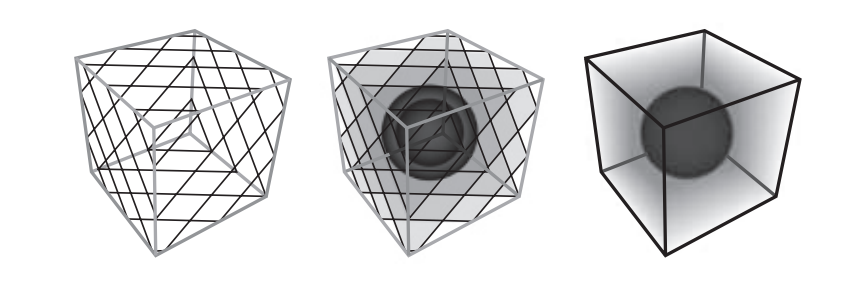

对于半透明数据，可以在每个体素内存储各自的颜色和不透明度。为了减少内存占用，并使得用户能够控制可视化，因此提出了传输函数（transfer function）。第一个解决方案是使用一个一维的传输纹理，来将体素的标量密度值映射到颜色和不透明度。然而，这种方法并不能识别特定的材质转变，例如：从人类鼻窦骨到空气，或者骨骼组织到软组织，对这些不同的组织独立使用不同的颜色进行着色。为了解决这个问题，Kniss等人\[912]建议使用基于密度$d$和密度场梯度长度$\|\nabla d\|$来进行索引的二维传输函数。发生变化的区域会具有较高的梯度大小时，这种方法使得基于密度转换的着色更有意义，如图14.16所示。

![图14.16：使用一维（左）传输函数和二维（右）传输函数来计算体积的材质和不透明度 \[912\] 。在第二种情况下，可以保持树干的棕色，不让树干被叶子密度较轻的绿色所覆盖。图像底部为对应使用的传输函数， x 轴代表密度， y 轴代表密度场的梯度长度 \\|\nabla d\\| 。 \[912\]](images/Chapter-14/202308241142624.png "图14.16：使用一维（左）传输函数和二维（右）传输函数来计算体积的材质和不透明度 \[912] 。在第二种情况下，可以保持树干的棕色，不让树干被叶子密度较轻的绿色所覆盖。图像底部为对应使用的传输函数， x 轴代表密度， y 轴代表密度场的梯度长度 \\|\nabla d\\| 。 \[912]")

Ikits等人\[797]对这种技术和相关问题进行了深入讨论。Kniss等人\[913]则对这种方法进行了扩展，该方法使用半角（half-angle）来进行切片。切片仍然是从后往前进行渲染的，但是这些切片的朝向会介于光线方向和观察方向之间。使用这种方法，可以从光源方向来渲染radiance和遮挡信息，并在观察空间中累积每个切片。切片纹理可以作为渲染下一个切片时的输入，使用光源方向的遮挡信息来评估体积阴影，并使用radiance来估计多次散射，即光线在到达眼睛之前在介质中的多次反弹。由于之前的切片是根据圆盘内的多个样本进行采样的，因此这个技术只能模拟锥体范围内前向散射所引起的次表面现象。这种方法最终生成的图像质量很高，如图14.17所示。Schott等人\[1577, 1578]对这种半角方法进行了扩展，以计算环境光遮蔽和景深模糊等效果，从而提高了用户在查看体素数据时对深度和体积的感知。

![图14.17：基于半角切片的前向次表面散射体渲染。 \[797\]](images/Chapter-14/202308271659656.png "图14.17：基于半角切片的前向次表面散射体渲染。 \[797]")

如图14.17所示，半角切片方法可以渲染高质量的次表面散射现象。然而，由于需要对每个切片进行光栅化，因此会带来很高的内存带宽成本。Tatarchuk和Shopf \[1744]在着色器中使用光线步进来进行医学成像，因此只需要进行一次光栅化即可，大大降低了带宽成本。有关光照和阴影的内容，可以按照下一小节中所描述的方式进行实现。

### **14.3.2 参与介质渲染**

实时图形应用程序可以通过渲染参与介质，来描绘更加丰富的场景。当涉及到时间、天气或者环境变化（例如建筑物破坏）的时候，这些效果的渲染要求会变得更高。例如：森林中的雾在中午时分或者黄昏时分看起来会有所不同；在树木之间的光束，应当与太阳变化的方向和颜色相适应。光束也应当根据树木的运动来进行相应的动画，例如：爆炸会移除场景中的一些树木，从而导致该区域内的散射光线发生变化，因为此时的遮挡物变少了，并且产生了大量灰尘。篝火、手电筒和其他光源也会在空气中产生散射现象。在本小节中，我们将讨论能够实时模拟这些动态视觉现象效果的技术。

一些技术专注于渲染单一来源的大规模阴影散射。Yusov \[1958]对其中一种方法进行了深入的描述，它基于对沿极线（epipolar line，核线）的内散射进行采样，这里的极线指的是投射到相机图像平面单一直线上的光线。使用从光源视角进行渲染的深度贴图来确定一个样本是否位于阴影中。这个算法会从相机位置开始执行光线步进，同时会使用一个沿着光线的最小/最大（min/max）层次结构来跳过空白的空间，并且仅在深度不连续的地方进行光线步进，即只在真正需要准确计算体积阴影的地方进行光线步进。通过渲染由光源空间深度贴图所生成的网格，也可以在观察空间中进行采样，而不是沿着极线来对这些不连续性进行采样\[765]。在观察空间中，只需要计算正面和背面之间的体积就可以对最终的散射radiance进行计算。为此，计算内散射的方法是将正面散射的radiance添加到视图中，然后再减去背面散射的radiance。

这两种方法都能有效地再现由于不透明表面遮挡而产生单次散射事件，并能够生成阴影\[765, 1958]。然而，这两种方法都无法表示异质（heterogeneous）的参与介质，因为它们都假设参与介质是恒定均质的。另外，这些技术无法生成来自透明表面的体积阴影，例如：来自参与介质的自阴影或者来自粒子的透明阴影（章节13.8）。但是这些方法仍然在游戏中发挥着巨大的作用，因为它们可以在较高的分辨率下进行渲染，而且渲染速度很快，这要归功于在光线步进的过程中跳过了空白区域\[1958]。

研究人员提出了溅射方法（splatting），用于处理更加一般的异质介质，这种方法会沿着光线来对体积材质进行采样。Crane等人\[303]在不考虑任何输入照明的情况下，使用溅射方法来渲染烟雾、火焰和水，这些都是流体模拟的结果。在烟雾和火焰的情况下，会在每个像素处生成一条光线，这条光线会在体积内进行步进，以固定的间隔来收集材质的颜色信息和遮挡信息。在渲染水体的时候，一旦光线与水面相交，便会终止体积采样；在每个样本位置处，会使用密度场梯度来评估表面法线。为了保证水面的平滑，会使用三次插值来对密度值进行过滤。图14.18展示了这些技术的使用案例。

![图14.18：在GPU上使用体渲染与流体模拟相结合的技术来渲染烟雾和水体。 \[303\]](images/Chapter-14/202308271954429.png "图14.18：在GPU上使用体渲染与流体模拟相结合的技术来渲染烟雾和水体。 \[303]")

将太阳光（平行光）、点光源和聚光灯考虑在内，Valient \[1812]将每个光源的散射包围体渲染到一个半分辨率的缓冲区中。每个光照体积都会使用光线步进来进行采样，并在光线步进的开始位置应用一个逐像素的随机偏移量。这样做会增加一些噪点，但是它的优点在于可以消除由均匀步进而产生的带状瑕疵。这种在每一帧中使用不同的噪声值，是一种隐藏瑕疵的常用手段。在对前一帧进行重投影，并与当前帧进行混合之后，这些噪点将会被平均，从而消失。通过将平面粒子体素化成一个三维纹理，再以八分之一的屏幕分辨率将这个三维纹理映射到相机的视锥体上，从而来渲染异质介质。这个体积数据会在光线步进期间作为材质的密度信息。半分辨率的散射结果可以通过使用双边高斯模糊，然后再使用双边上采样滤波器，并考虑像素之间的深度差异，来将其叠加合成到全分辨率的主缓冲上\[816]。当深度差异与中心像素相比过高时，这个样本将会被丢弃。这个高斯模糊在数学上是不可分离的（章节12.1），但是在实践中的效果很好。这个算法的复杂度取决于溅射在屏幕上的光照体积数量，因为这个复杂度与其像素覆盖率有关。

这种方法可以通过使用蓝噪声（blue noise）来进行扩展，蓝噪声更擅长在一帧中的像素上产生均匀分布的随机值\[539]。这样做的结果是，使用双边滤波器进行上采样以及在空间中混合样本的时候，能够产生更加平滑的视觉效果。半分辨率缓冲的上采样操作也可以通过将四个随机样本混合在一起来进行实现。这样生成的结果仍然会有一些噪点，但是由于它给出了逐像素的全分辨率噪声，因此可以很容易地通过一个时域抗锯齿的后处理（章节5.4）来进行解决。

所有这些方法的缺点在于，有序深度的体积元素与其他任何透明表面混合在一起，将无法给出一个视觉上正确的渲染顺序。这里的透明表面可以是大型非凸的透明网格，也可以是大规模的粒子效果。当涉及到在透明表面上应用体积光照时，所有的这些算法都需要进行一些特殊的处理，例如在一个体素数据中包含内散射和透光率的体积\[1812]。那么，为什么我们不从一开始就使用基于体素的表示方法呢？这样不仅可以表示空间变化的参与介质属性，还可以表示由光线散射和透光率所引起的radiance分布。实际上，这样的技术在电影工业中使用已久\[1812]。

Wronski \[1917]提出了一种方法，该方法会将场景中来自太阳和光源的散射radiance，体素化为一个映射在裁剪空间中的三维体积纹理$V_0$。在每个体素中心的世界空间位置上来计算散射radiance，其中体积的$x$轴和$y$轴与屏幕坐标相对应，而$z$坐标则映射到相机视锥体的深度。这个体积纹理的分辨率要比最终图像的分辨率低得多。这种技术的一种典型实现使用了这样的一个体素分辨率，即$x$轴和$y$轴的分辨率为屏幕分辨率的八分之一。而$z$坐标的细分则取决于质量和性能的权衡，其中64个切片是一个典型的选择。这个纹理包含了存储在RGB通道的内散射radiance$L_{\text {scat }_{\text {in }}}$，以及存储alpha通道的消光系数$\sigma_{t}$。根据这个输入数据，按照从近到远的顺序迭代每个切片，从而生成最终的散射体积$V_f$：

$$
V_{f}[x, y, z]=\left(L_{\text {scat }}^{\prime}+T_{r}^{\prime} L_{\text {scat }_{\text {in }}} d_{s}, T_{r_{\text {slice }}} T_{r}^{\prime}\right)
\tag{14.15} 
$$

其中：

$$
L_{\text {scat }}^{\prime}=V_{0}[x, y, z-1]_{r g b}
\\[2mm]
T_{r}^{\prime}=V_{0}[x, y, z-1]_{a}
\\[2mm] 
T_{r_{\text {slice }}}=e^{-\sigma_{t} d_{s}} 
$$

这将在世界空间的切片深度$d_s$上，从前一个切片$z−1$的数据中来更新切片$z$的数据。这样做将会导致散射体积$V_f$包含到达观察者的散射radiance，以及背景中每个体素的透光率。在方程14.15中，我们可以注意到$L_{\text {scat }_{\text {in }}}$仅会受到前一个切片透光率$T_{r}$的影响。这种行为实际上是不正确的，因为$L_{\text {scat }_{\text {in }}}$也应当受到当前切片内$\sigma_{t}$所产生的透光率的影响。

Hillaire \[742, 743]对这个问题进行了讨论。对于在给定深度上具有恒定消光系数$\sigma_{t}$的情况，他提出了$L_{\text {scat }_{\text {in }}}$积分的一个解析解：

$$
V_{f}[x, y, z]=\left(L_{\text {scat }}^{\prime}+\frac{L_{\text {scat }_{\text {in }}}-L_{\text {scat }_{\text {in }}} T_{r_{\text {slice }}}}{\sigma_{t}}, T_{r_{\text {slice }}} T_{r}^{\prime}\right)
\tag{14.16} 
$$

一个radiance为$L_s$的不透明表面，其最终像素的radiance$L_o$将由$V_f$中的散射radiance $L_{\text {scat }}$和透光率$T_r$进行修正，并使用裁剪空间的坐标进行采样，即$L_{o}=T_{r} L_{s}+L_{\text {scat }}$。由于$V_f$是比较的粗糙的，因此它可能会受到相机运动、高频强光或者阴影的影响，从而产生一些瑕疵。可以将前一帧中的$V_f$进行重投影，并使用一个指数移动平均（exponential moving average，EMA），来将其与新的$V_f$结合起来\[742]。

![图14.19：艺术家将一个参与介质的体积放置在关卡中，将这个参与介质体素化到相机的视锥体空间中 \[742, 1917\] 。左侧是一个三维纹理，在这个例子中该三维纹理代表了一个球体形状，这个球体形状被映射到了体积中。这个纹理定义了体积的外观，类似于三角形上的纹理。在右侧，通过考虑它的世界变换，这个体积被体素化到了相机的视锥体中。使用一个计算着色器来将贡献累积到该体积所包含的每个体素中。最终得到的材质可以用来评估每个体素中的光线散射作用 \[742\] 。请注意，在映射到相机的裁剪空间时，每个体素会被压成截锥体的形状，它称为froxel。](images/Chapter-14/202308272108705.png "图14.19：艺术家将一个参与介质的体积放置在关卡中，将这个参与介质体素化到相机的视锥体空间中 \[742, 1917] 。左侧是一个三维纹理，在这个例子中该三维纹理代表了一个球体形状，这个球体形状被映射到了体积中。这个纹理定义了体积的外观，类似于三角形上的纹理。在右侧，通过考虑它的世界变换，这个体积被体素化到了相机的视锥体中。使用一个计算着色器来将贡献累积到该体积所包含的每个体素中。最终得到的材质可以用来评估每个体素中的光线散射作用 \[742] 。请注意，在映射到相机的裁剪空间时，每个体素会被压成截锥体的形状，它称为froxel。")

在此框架的基础上，Hillaire \[742]提出了一种基于物理的方法来定义参与介质的材质，即：散射$\sigma_{s}$，吸收$\sigma_{a}$，相位函数参数$g$和发射的radiance $L_e$。这个材质会被映射到相机的视锥体中，并存储到一个参与介质的材质体积纹理$V_{pm}$中，这是一个存储不透明表面材质的、三维版本的G-buffer（章节20.1）。Hillaire表示，如果只考虑单次散射的话，尽管进行了离散的体素化操作，使用这种基于物理的材质表示能够产生接近于路径追踪的视觉效果。与网格类似，位于世界中的参与介质体积也会被体素化为$V_{pm}$（如图14.19所示）。在每个体积中都定义了一种材质，并添加了一些变化，得益于从三维纹理中采样获得的密度，从而可以生成异质的参与介质，生成的结果如图14.20所示。同样的方法也在虚幻引擎中进行了实现\[1802]，但是不同之处在于，虚幻引擎并没有使用box体积来作为参与介质的来源，而是使用了粒子，即它假设了一个球形的体积而不是一个box形状的体积。也可以使用一个稀疏结构来表示材质体积纹理\[1191]，即让某些体素为空，或者是让某些体素指向一个包含更细粒度材质数据的体积。

![图14.20：上面的场景没有体积光和体积阴影，下面的场景有体积光和体积阴影。场景中的每一个光源都与参与介质进行了相互作用。每个光源的radiance、IES配置（IES描述文件，一种描述光源的光照分布的文件格式）和阴影贴图都会用于累积其散射光线的贡献 \[742\] 。](images/Chapter-14/202308272125167.png "图14.20：上面的场景没有体积光和体积阴影，下面的场景有体积光和体积阴影。场景中的每一个光源都与参与介质进行了相互作用。每个光源的radiance、IES配置（IES描述文件，一种描述光源的光照分布的文件格式）和阴影贴图都会用于累积其散射光线的贡献 \[742] 。")

这个基于摄像机视锥体的方法，其唯一的缺点在于：为了在性能较弱的平台上达到可接受的性能（并使用合理的内存开销），需要使用较低的屏幕空间分辨率\[742, 1917]。这就是前面所介绍的溅射方法的优点，因为它们可以生成清晰的视觉细节。前面我们提到，溅射方法需要更多的内存带宽，并且无法提供统一的解决方案，例如：溅射方法很难在其他透明表面上进行应用，因为会产生排序问题；溅射方法也无法让参与介质在自身上投射体积阴影。

不仅仅是直射光，那些经过反射或者散射的光线也可以进一步被参与介质散射。与Wronski \[1917]的方法类似，虚幻引擎可以烘焙体积光照贴图（volume light map），来将irradiance存储在体积中，并在观察空间进行体素化的时候将其散射回介质中\[1802]。为了在参与介质中实现动态全局光照，也可以使用光照传播体积（light propagation volume，LPV）\[143]。

体积阴影是一个重要的特性。如果没有体积阴影的话，浓雾场景的最终图像可能会看起来过于明亮和平坦\[742]。此外，阴影也是一种重要的视觉暗示，它们有助于观察者对深度和体积的感知\[1846]，从而产生更加逼真的图像，带来更好的沉浸感。Hillaire \[742]提出了一种实现体积阴影的统一解决方案。根据clipmap分布方案，参与介质的体积和粒子会被体素化成围绕相机的三个级联体积，它们被称为消光体积（extinction volume）\[1777]。这些体积包含了用于计算$T_r$的消光系数$\sigma_{a}$，并代表了一个统一的数据源，以便使用不透明的阴影贴图来实现体积阴影\[742, 894]，如图14.21所示。这样的解决方案使得粒子和参与介质能够产生自阴影，能够相互投射阴影，并能够在场景中其他不透明和透明的元素上投射阴影。

![图14.21：左上角的场景没有体积阴影，右上角的场景有体积阴影。左下角是体素化粒子消光的调试视图，右下角是体素化体积阴影的调试视图。其中绿色越深，意味着透光率越少 \[742\] 。](images/Chapter-14/202308272149619.png "图14.21：左上角的场景没有体积阴影，右上角的场景有体积阴影。左下角是体素化粒子消光的调试视图，右下角是体素化体积阴影的调试视图。其中绿色越深，意味着透光率越少 \[742] 。")

体积阴影可以使用不透明阴影贴图来进行表示。然而，如果需要较高分辨率来捕捉细节的话，使用体积纹理可能很快就会成为限制。因此，为了能够更加有效地表示$T_r$，研究人员提出了一些替代的表示方法，例如使用函数的正交基，如傅里叶变换（Fourier transform）\[816]或者离散余弦变换（discrete cosine transform）\[341]，详见章节7.8。

## 14.4 天空渲染

想要渲染一个真实效果的世界，当然需要渲染行星的天空、大气效果和云。地球上的蓝天，实际上就是太阳光在大气参与介质中散射的结果。至于为什么白天的天空是蓝色的，而太阳在地平线上时天空是红色的，这在章节14.1.3中进行了解释。大气也是一个十分关键的视觉暗示，因为大气的颜色与太阳的方向有关，而太阳的方向与一天中的时间有关。同时，有时候大气是雾蒙蒙，这个外观有助于观众感知场景中元素的相对距离、相对位置和相对大小。准确渲染这些效果组件是非常重要的，因为越来越多的游戏和其他应用程序用到了这些组件，这些应用程序通常具有一天内的动态时间、不断变化的天气（影响云的形状），以及可供探索、驾驶甚至飞行的大型开放世界。

### **14.4.1 天空和空气透视**

为了渲染大气效果，我们需要考虑两个主要的组成部分，如图14.22所示。第一，我们需要模拟太阳光线与空气粒子之间的相互作用，产生与波长相关的瑞利散射。这将会产生天空的颜色和天空中的薄雾，这也称为空气透视（aerial perspective）。第二，我们需要研究集中在地面附近的大颗粒对太阳光线所产生的影响，这些大颗粒的浓度则取决于天气条件和空气污染水平等因素。这些大颗粒会引起与波长无关的米氏散射，这种现象会在太阳周围形成明亮的光晕，尤其是在粒子浓度较高的情况下。

![图14.22：两种不同类型的大气光线散射：第一行图片只有瑞利散射；第二行图片既有常规的瑞利散射，也有米氏散射。从左到右分别是：密度为0，常规密度 \[203\] ，夸张密度。 \[743\]](images/Chapter-14/202308272206922.png "图14.22：两种不同类型的大气光线散射：第一行图片只有瑞利散射；第二行图片既有常规的瑞利散射，也有米氏散射。从左到右分别是：密度为0，常规密度 \[203] ，夸张密度。 \[743]")

第一个基于物理的大气模型\[1285]，是从太空来渲染地球以及地球的大气层，它模拟了太阳光线的单次散射。使用O 'Neil提出的方法也可以得到类似的结果\[1333]。这个方法可以在一个单pass的着色器中，使用从地面到太空的光线步进来渲染地球。在渲染天空穹顶（sky dome）的时候，需要使用昂贵的逐顶点光线步进来整合米氏散射和瑞利散射。这个视觉上的高频相位函数是在像素着色器中进行计算的，这使得地球大气的外观较为平滑，避免了由于插值而暴露天空的实际几何形状。也可以将散射结果存储在纹理中，并将计算分散在几帧中进行，这样也实现相同的结果，在带来一定更新延迟的情况下，可以获得更好的性能表现\[1871]。

分析技术使用了拟合的数学模型，这个模型基于对真实天空radiance的测量\[1443]，或者基于大气光线散射路径追踪所生成的参考图像\[778]。与参与介质的材质参数相比，这个输入参数的集合通常是有限的。例如：使用浑浊度（turbidity）来代表粒子对米氏散射的贡献，而不是参与介质的系数$\sigma_{s}$和$\sigma_{t}$。Preetham等人\[1443]所提出的这种模型利用浑浊度和太阳高度，来在任何方向上对天空radiance进行评估计算。通过增加对光谱输出的支持、对太阳周围散射radiance更好的方向性以及一个新的地面反照率输入参数，可以对这个方法进行改进\[778]。这种分析天空模型的计算速度很快。然而，这种方法仅限于在地面上的视角，同时我们无法对大气参数进行修改，也就是说，这个方法无法对外星行星进行模拟，也无法实现特定的、艺术驱动（art-driven）的视觉效果。

渲染天空的另一种方法是假设地球是完美的球形，在其周围有一层由异质参与介质所组成的大气层。Bruneton和Neyret \[203]，以及Hillaire \[743]对大气的组成做了进行了广泛且详细的描述。利用这些物理事实，可以根据当前的视图高度$r$、观察向量相对于天顶的余弦值$\mu_{v}$、太阳方向相对于天顶的余弦值$\mu_{s}$、以及观察向量相对于方位平面上太阳方向的余弦值，来在预计算表格中存储透光率和散射率。例如：从视点到大气边界的透光率可以使用两个参数$r$和$\mu_{v}$来进行参数化。在预计算步骤中，透光率可以在大气中进行积分，并存储在一个二维的查找表（LUT）纹理贴图中，并在运行过程中使用相同的参数化来对其进行采样。这个纹理可以将大气透光率应用在各种天空元素上，例如太阳，星星，或者其他天体。

通过将散射现象考虑在内，Bruneton Neyret \[203]描述了一种方法，这种方法可以将散射结果存储在一个由上述所有参数进行参数化的四维LUT $S_{\text {lut}}$中。他还提供了一种可以通过$n$次迭代来评估$n$阶多次散射的方法：$(i)$计算单次散射表$S_{\text {lut}}$，$(ii)$使用$S_{\text {lut}}^{n-1}$来计算$S_{\text {lut}}^{n}$，$(iii)$将结果添加到$S_{\text {lut}}$中。重复执行$n-1$次的步骤$(ii)$和$(iii)$。Bruneton和Neyret提供了有关该过程的更多细节和源代码\[203]，图14.23展示了这种方法生成的结果。Bruneton和Neyret 的参数化方法有时会在地平线上表现出一些视觉瑕疵。Yusov \[1957]提出了一种改进的转换方法，也可以通过忽略参数$ν$ \[419]，只使用一个三维的LUT；使用这种方法的话，地球将不会在大气中投下阴影，这是一种可以接受的权衡。这种方法的优点在于，这个三维的LUT会小得多，更新和采样的成本也会更低。

![图14.23：使用查找表方法，分别从地面（左）和太空（右）来实时渲染地球大气。 \[203\]](images/Chapter-14/202308281032867.png "图14.23：使用查找表方法，分别从地面（左）和太空（右）来实时渲染地球大气。 \[203]")

EA的寒霜引擎使用了最后一种的三维LUT方法，并被许多即时游戏所采用，例如《极品飞车》、《镜之边缘：催化剂》和《FIFA》\[743]。在这种情况下，艺术家可以对这些基于物理的大气参数进行调整，从而达到目标天空的视觉效果，甚至可以模拟地球外的大气效果，如图14.24所示。当大气参数发生变化的时候，这个LUT必须重新进行计算。为了能够更加高效地更新这些LUT，也可以使用一个函数来对大气中的材质积分进行近似，而不是使用光线步进\[1587]。通过将LUT和多次散射的计算分摊在多帧中，可以将LUT的更新代价平摊到原来的6%。对于给定的散射阶$n$，我们可以只更新$S_{\text {lut}}^{n}$中的一部分，并对最后两个求解的LUT进行插值，从而实现将计算分摊在几帧中进行，这样做的代价也只是会有几帧的延迟而已。为了避免对每个像素的不同LUT进行多次采样，米氏散射和瑞利散射会被烘焙到相机视锥体映射（camera-frustum-mapped）的低分辨率体积纹理的体素中，这是另外一种优化方法。为了在太阳周围生成平滑的散射光晕，可以在像素着色器中来计算视觉上的高频相位函数。使用这种类型的体积纹理，允许我们在场景中的任何透明物体上应用逐顶点的空气透视。

![图14.24：使用全参数化模型的实时渲染，可以对地球大气层（上） \[203\] 和其他行星的大气层进行模拟，例如火星上的蓝色日落（下） \[743\] 。](images/Chapter-14/202308281048284.png "图14.24：使用全参数化模型的实时渲染，可以对地球大气层（上） \[203] 和其他行星的大气层进行模拟，例如火星上的蓝色日落（下） \[743] 。")

### **14.4.2 云**

云是天空中的复杂元素。当代表即将到来的风暴时，天空中的云看起来会很有威胁性；云还可以会是小巧的、史诗般的、单薄的或者厚重的。云的变化速度很慢，其大尺度的形状和小尺度的细节都会随着时间的推移而逐渐发生变化。具有天气和时间变化的大型开放世界游戏要更加复杂，需要动态的云渲染解决方案。根据目标性能和视觉质量的不同，可以使用不同的技术来渲染天空中的云。

云是由水滴组成的，它具有较高的散射系数以及复杂的相位函数，这些物理特点使得云有着特定的外观。如章节14.1所述，云通常会被表示为参与介质，其材质具有较高的单次散射反照率$\rho=1$，消光系数$\sigma_{t}$在层云（stratus，底层的、水平的云层）中的范围为$[0.04,0.06]$，在积云（cumulus，孤立的、低层的、像棉花一样蓬松的云）的范围内为$[0.05,0.12]$ \[743]，如图14.25所示。鉴于$\rho$接近于1，因此我们可以假设$\sigma_{s}=\sigma_{t}$。

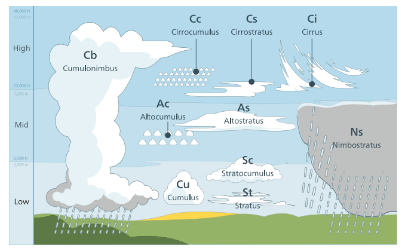

云渲染的一个经典方法是，使用alpha混合来在天空上叠加一个全景纹理（panoramic texture），这种方法在渲染静态天空的时候很方便。Guerrette \[620]提出了一种视觉上流动的技术，这种方法可以给人一种错觉，就好像天空中的云受到了一个全局的风向影响，看起来就像是云在天空中运动一样。这是一种十分有效的方法，它对静态的全景云纹理方法进行了改进。但是，这种方法无法表达云的形状变化和光照变化。

#### 将云作为粒子

Harris将云作为粒子和impostor体积来进行渲染\[670]，详见章节13.6.2和图13.9。

Yusov \[1959]提出了另一种基于粒子的云渲染方法。他所使用的渲染图元被称为体积粒子（volume particle）。每个体积粒子都被表示为一个四维LUT，每个体积粒子都是一个面向视图的四边形粒子，该方法允许对粒子上的散射光线和透光率进行检索，这是一个与太阳光线方向和观察方向有关的函数，如图14.26所示。这种方法非常适合渲染层积云（stratocumulus cloud），层积云如图14.25所示。

![图14.26：将云作为粒子体积来进行渲染。 \[1959\]](images/Chapter-14/202308281159187.png "图14.26：将云作为粒子体积来进行渲染。 \[1959]")

将云作为粒子来进行渲染，有时可以看到一些离散化现象和突然出现的瑕疵，尤其是在围绕云进行视角旋转的时候。这些问题可以通过使用体积感知混合（volume-aware blending）来进行避免。这种能力是通过使用一种被称为光栅器有序视图（rasterizer order view，ROV，章节3.8）的GPU功能来进行实现的。体积感知混合可以使得每个图元的像素着色器操作在资源上进行同步，同时允许确定性的自定义混合操作。最近的$n$个粒子的深度层会被保存在一个缓冲区中，这个缓冲区与我们的渲染目标具有相同的分辨率。这个缓冲区在后续步骤中会进行读取，并通过考虑交叉深度来对当前渲染的粒子进行混合，然后再次写入下一个要进行渲染的粒子。该方法的渲染结果如图14.27所示。

![图14.27：左边：云粒子以常规的方式进行渲染。右边：使用体积感知混合来进行粒子渲染。 \[1959\]](images/Chapter-14/202308281200166.png "图14.27：左边：云粒子以常规的方式进行渲染。右边：使用体积感知混合来进行粒子渲染。 \[1959]")

#### 将云作为参与介质

Bouthors等人\[184]将云视为孤立的元素，使用两个组成部分来表示云：一个网格，用于表现云的整体形状；一个超纹理（hypertexture）\[1371]，用于在网格表面到云内部一定深度的范围内添加高频细节。使用这种表示方式，云的边缘可以使用精细的光线步进来收集细节，而云的内部则可以被认为是同质的。光线在对云的内部结构进行光线步进时，会对radiance进行积分，同时会根据散射顺序，使用不同的算法来收集散射radiance。利用章节14.1中所描述的解析方法，可以对单次散射的光线进行积分。利用位于云表面的圆盘状光线收集器，可以对传输函数表进行离线预计算，从而加速多重散射的计算速度。最终生成的结果具有很高的视觉质量，如图14.28所示。

![图14.28：使用网格和超纹理进行渲染的云。 \[184\]](images/Chapter-14/202308281302109.png "图14.28：使用网格和超纹理进行渲染的云。 \[184]")

除了将云作为孤立的元素进行渲染，还可以将它们建模为大气中的一层参与介质。Schneider和Vos基于光线步进，提出了一种高效的云渲染方法\[1572]。这种方法只需要几个参数，就可以在动态光照下渲染复杂的、动画化的、详细的云形状，如图14.29所示。这个参与介质的云层是使用两级程序化噪声（procedural noise）来构建的。其中第一层给出了云的基本形状。第二层通过对这个形状进行腐蚀来添加细节。在这种情况下，Perlin噪声\[1373]和Worley噪声\[1907]的混合噪声，被认为可以很好的表现菜花状（cauliflower-like）的积云和以及类似形状的云。生成这种噪声纹理的源代码和相关工具都是开源的\[743, 1572]。通过使用在云层中沿着观察射线分布的样本，对来自太阳的散射光线进行积分，从而实现了光照效果。

![图14.29：使用Perlin-Worley噪声和光线步进进行渲染的云层，它具有动态的体积光照和体积阴影。 \[1572\]](images/Chapter-14/202308281309469.png "图14.29：使用Perlin-Worley噪声和光线步进进行渲染的云层，它具有动态的体积光照和体积阴影。 \[1572]")

体积阴影可以通过对云层内若干样本的透光率进行评估，并朝向太阳进行二次光线步进来进行实现\[743, 1572]。对于这些阴影样本的噪声纹理，可以对较低层级的mipmap进行采样，从而实现更好的性能表现，同时还可以在样本数量较少时，消除因样本不足所带来的瑕疵。通过每一帧在纹理中对来自太阳的透光率曲线进行编码（有许多技术可以实现这一点，详见章节13.8），可以避免对每个样本进行第二次的光线步进。例如：在游戏《最终幻想15》\[416]中使用的透光率函数映射（transmittance function mapping） \[341]。

如果我们想要捕捉到云的每个微小细节，那么可以在高分辨率下使用光线步进来渲染云，其开销可能会很大。为了获得更好的性能表现，可以在一个较低的分辨率下来渲染云。一种方法是只对每个$4×4$块中的单个像素进行更新，并通过重投影前一帧中的数据来填充其余的部分像素\[1572]。Hillaire \[743]提出了一种变体方法，该方法总是会以固定的低分辨率来进行渲染，并在观察射线步进的起始位置上添加噪声扰动。并将前一帧的结果进行重投影，然后使用指数移动平均（EMA）的方法来与当前帧进行结合\[862]。这种方法的渲染分辨率较低，但是收敛速度更快。

云的相位函数是十分复杂的\[184]。这里我们将介绍两种可以实时计算它们的方法。可以将函数编码为一个纹理，并基于$\theta$来对其进行采样。如果这样做会占据太多内存带宽的话，可以将章节14.1.4中的两个Henyey-Greenstein相位函数结合在一起\[743]，来对该函数进行近似，其数学形式如下：

$$
p_{\text {dual }}\left(\theta, g_{0}, g_{1}, w\right)=p_{\text {dual }_{0}}+w\left(p_{\text {dual }_{1}}-p_{\text {dual }_{0}}\right)
\tag{14.17} 
$$

其中两个最主要的参数，散射离心率（scattering eccentricity）$g_0$和$g_1$，以及混合因子$w$，都可以由艺术家进行控制。这些参数在表现前向散射和后向散射时很重要，可以在远离光源或者朝向光源（例如太阳或者月亮）时展现云中的细节，如图14.30所示。

![图14.30：使用光线步进渲染的云层，并使用Hillaire所描述的 \[743\] 参与介质的物理表示方法，来实现动态光照和动态阴影。](images/Chapter-14/202308281340704.png "图14.30：使用光线步进渲染的云层，并使用Hillaire所描述的 \[743] 参与介质的物理表示方法，来实现动态光照和动态阴影。")

有许多方法可以在云中对环境光照的散射光线进行近似。一个最直接的解决方案就是使用单一的radiance输入，从天空渲染一个立方体贴图纹理。还可以使用一个自下而上的、从暗到亮的渐变，来对环境光照进行缩放，从而近似云层本身的遮挡效果。也可以将这个输入的radiance分为底部和顶部两部分，例如地面和天空\[416]。然后，我们假设云层内的介质密度是恒定的，再对两种贡献的环境光散射进行解析积分\[1149]。

#### 多重散射的近似

云看起来是明亮的和白色的，这种外观是光线在其内部发生多重散射的结果。如果没有多重散射的话，那么一个很厚的云，只会在其体积的边缘处被照亮，而在云的其他地方将会显得十分黑暗。之所以云看起来与烟雾、浓雾不同，其中多重散射是一个关键的组成部分。使用路径追踪来计算多重散射效果是十分昂贵的。Wrenninge \[1909]提出了一种在光线步进时，对多重散射现象进行近似的方法。它对散射的$o$个八度（octave）进行了积分，并将它们进行求和：

$$
L_{\text {multiscat }}(\mathbf{x}, \mathbf{v})=\sum_{n=0}^{o-1} L_{\text {scat }}(\mathbf{x}, \mathbf{v})
\tag{14.18}  
$$

当在计算$L_{\text {scat }}$的时候，进行了以下替换（例如使用$\sigma_{s}^{\prime}$来替换$\sigma_{s}$）：

$$
\sigma_{s}^{\prime}=\sigma_{s} a^{n}, \quad \sigma_{e}^{\prime}=\sigma_{e} b^{n}, \quad p^{\prime}(\theta)=p\left(\theta c^{n}\right)
$$

其中$a、b、c$的范围位于$[0,1]$中，它们是用户可以控制的参数，这些参数将会使得光线穿透参与介质。当这些参数接近0时，云看起来会更加柔和。在计算$L_{\text {multiscat }}(\mathbf{x}, \mathbf{v})$的时候，为了确保这种方法是能量守恒的，我们必须保证$a \leq b$，不然会导致更多的光线被散射，此时方程$\sigma_{t}=\sigma_{a}+\sigma_{s}$将不再成立，因为$\sigma_{s}$可能会大于$\sigma_{t}$。这种解决方案的优点在于，它可以在光线步进的同时，对每个不同八度的散射光线进行实时积分。图14.31展示了改进后的视觉效果。这种解决方案的缺点在于，当光线可以向任何方向进行散射时，这种方法不能很好的模拟复杂的多重散射行为。但是使用这种方法，云的外观质量的确得到了改善，这种方法还允许光照艺术家们可以通过几个参数来轻松地控制云的视觉效果，这得益于该方法能够实现广泛的渲染效果。通过使用这种方法，光线可以穿透介质，展现更多内部细节。

![图14.31：使用 方程14.18 对多重散射进行近似，并据此渲染的云。从左到右，n分别为1、2、3。这使得太阳光能够以一种可信的方式穿透云层。 \[743\]](images/Chapter-14/202308281420583.png "图14.31：使用 方程14.18 对多重散射进行近似，并据此渲染的云。从左到右，n分别为1、2、3。这使得太阳光能够以一种可信的方式穿透云层。 \[743]")

#### **云与大气的相互作用**

在渲染有云的场景时，为了保证视觉上的一致性，考虑云与大气散射之间的相互作用是十分重要的，如图14.32所示。

![图14.32：对于完全覆盖天空的云，在渲染的时候需要考虑大气散射的影响 \[743\] 。左：没有应用在云上的大气散射，这样会导致不连贯的视觉效果。中：有大气散射，但是没有阴影，这样会使得环境显得太亮。右：云层遮挡了天空，影响了光线在大气中的散射，从而生成连贯的视觉效果。 \[743\]](images/Chapter-14/202308281427401.png "图14.32：对于完全覆盖天空的云，在渲染的时候需要考虑大气散射的影响 \[743] 。左：没有应用在云上的大气散射，这样会导致不连贯的视觉效果。中：有大气散射，但是没有阴影，这样会使得环境显得太亮。右：云层遮挡了天空，影响了光线在大气中的散射，从而生成连贯的视觉效果。 \[743]")

由于云本身是一种大范围的场景元素，因此应当对其应用大气散射。通过在云层中采集的每个样本，可以对章节14.4.1中所述的大气散射进行计算，但是这样做的开销会迅速变大。相反，可以根据一个代表云层平均深度和平均透光率的单一深度，来将大气散射应用在云上\[743]。

如果想要通过增加云的覆盖面积来模拟阴雨天，则应当减少云层下大气的太阳光线散射。只有穿过云层散射的光线，才会在云层下的大气中发生散射。可以通过减少天空对空气透视的照明贡献，并增加散射回大气中的光线，来对光照效果进行修改\[743]。图14.32展示了改善后的视觉效果。

总而言之，可以通过基于物理的材质表示方式和光照来实现先进的云渲染效果。利用程序化噪声可以生成逼真的云层形状和云层细节。最后，正如本小节中所描述的，为了获得连贯一致的视觉效果，还需要牢记一些全局的相互作用，例如云与天空之间的交互。

## 14.5 半透明表面

半透明（translucent）表面通常指的是具有高吸收系数和低散射系数的材质。这些材质包括玻璃杯、水或者图14.2中的葡萄酒。此外，本小节还将讨论具有粗糙表面的半透明玻璃（毛玻璃）材质。在许多出版物中也详细介绍了这些主题\[1182, 1185, 1413]。

译者注：下面对一些容易混淆的、光学领域中的透明概念进行一些解释，来自于[Transparency and translucency - Wikipedia](https://en.wikipedia.org/wiki/Transparency_and_translucency# "Transparency and translucency - Wikipedia")：

-   **Transmittance**（透光率，n）：透射出的光谱能量与入射的光谱能量之比。材质的透光率与光线波长有关，不同波长的光线具有不同的透光率，因此使用RGB数据进行表示，包含三个分量。
-   **Transparency**（透明度，n），**Transparent**（透明的，adj）：允许光线通过材质，但是不产生明显的散射现象，整体外观通常只有一种颜色。材质内部由均匀折射率的物质组成。在宏观上遵循Snell定律。
-   **Translucency**（半透明度，n），**Translucent**（半透明的，adj）：允许光线通过材质，但是会产生明显的散射现象，整体外观通常会有颜色变化。材质内部由非均匀折射率的物质组成。在宏观上不一定遵循Snell定律。
-   **Opacity**（不透明度，n），**Opaque**（不透明的，adj）：不会发生光线投射现象，光线无法穿过这种材质。

### **14.5.1 覆盖率和透光率**

正如章节5.5中所讨论的，半透明表面可以被视为一个具有覆盖率（coverage）$\alpha$的覆盖物，例如：不透明的织物或者纤维组织，可以视为以一定的百分比隐藏了背后的物体。而对于玻璃和其他材质，我们想要计算它们的半透明度，对于不同波长的光线，它允许一定百分比的光线穿过自身的固体体积，就像是背景上的过滤器一样，这个透明度是一个与透光率（transmittance）$T_r$（章节14.1.2）有关的函数。假设输出颜色为$\mathbf{c}_{o}$，表面radiance为$\mathbf{c}_{s}$，背景颜色为$\mathbf{c}_{b}$，此时将表面的透明度视为覆盖率，其混合操作为：

$$
\mathbf{c}_{o}=\alpha \mathbf{c}_{s}+(1-\alpha) \mathbf{c}_{b}
\tag{14.19} 
$$

而在半透明表面的情况下，混合操作将是：

$$
\mathbf{c}_{o}=\mathbf{c}_{s}+\mathbf{T}_{r} \mathbf{c}_{b}
\tag{14.20} 
$$

其中$\mathbf{c}_{s}$包含了固体表面的镜面反射，即玻璃或者凝胶（gel）。需要注意的是，$T_r$是一个包含三个分量的透光率颜色向量。为了实现彩色的半透明效果，可以使用任何现代图形API中的双源（dual-source）颜色混合功能，以便指定这两种输出颜色与目标缓冲中的颜色$\mathbf{c}_{b}$进行混合。根据给定表面的反射和透光率是否为彩色，Drobot \[386]提供了不同的混合操作。

在一般情况下，可以为同时指定了覆盖率和半透明的表面使用一个共同的混合操作\[1185]。在本例中所使用的混合函数为：

$$
\mathbf{c}_{o}=\alpha\left(\mathbf{c}_{s}+\mathbf{T}_{r} \mathbf{c}_{b}\right)+(1-\alpha) \mathbf{c}_{b}
\tag{14.21}  
$$

当物体的厚度发生变化时，可以使用方程14.3来计算透射光量，该方程可以简化为：

$$
\mathbf{T}_{r}=e^{-\sigma_{t} d}
\tag{14.22} 
$$

其中$d$是光线穿过材质体积的距离。物理消光参数$\sigma_{t}$代表了光线在穿过介质时衰减的比例。为了方便艺术家们的直观创作，Bavoil \[115]将目标颜色$\mathbf{t}_{c}$设置为在给定距离$d$处的透光率大小。这样我们可以使用下列方程来重建消光系数$\sigma_{t}$：

$$
\boldsymbol{\sigma}_{t}=\frac{-\log \left(\mathbf{t}_{c}\right)}{d}
\tag{14.23}  
$$

例如：当目标透光率颜色$\mathbf{t}_{c} =(0.3, 0.7, 0.1)$，距离$d = 4.0$米时，我们可以使用方程14.23计算消光系数$\sigma_{t}$：

$$
\boldsymbol{\sigma}_{t}=\frac{1}{4}(-\log 0.3,-\log 0.7,-\log 0.1)=(0.3010,0.0892,0.5756)
\tag{14.24} 
$$

请注意，当透光率为0时，需要作为一个特殊情况来进行处理。一种解决方案是从$T_r$的每个分量中减去一个很小的，接近0数（epsilon），例如$0.000001$。图14.33展示了颜色过滤的效果。

![图14.33：一个网格具有多层不同的吸收因子，所形成的半透明效果 \[115\] 。](images/Chapter-14/202308281538284.png "图14.33：一个网格具有多层不同的吸收因子，所形成的半透明效果 \[115] 。")

对于一个空壳网格，其表面由一层薄薄的半透明材质组成，背景颜色会被这个半透明材质所遮挡，具体的遮挡效果是一个与光线在介质中传播路径长度$d$有关的函数。因此，沿着表面的法线方向或者切线方向进行观察，会导致不同的背景遮挡效果，因此光线的路径长度$d$是一个与表面厚度$t$和入射角度有关的函数，因为光线路径的长度也会随着入射角度而发生变化。Drobot \[386]提出了这样的一种方法，其中透光率$T_r$使用以下方程进行计算：

$$
\mathbf{T}_{r}=e^{-\sigma_{t} d}, \quad where \quad d=\frac{t}{\max (0.001, \mathbf{n} \cdot \mathbf{v})}
\tag{14.25} 
$$

图14.34显示了渲染结果。有关薄膜表面和多层表面的更多细节，详见章节9.11.2。

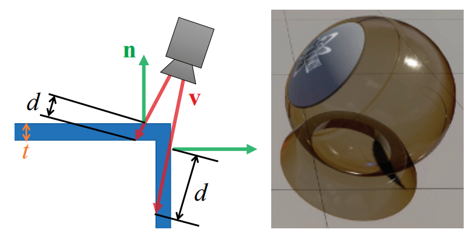

对于半透明的实体网格，有很多种方法可以计算光线穿过透射介质的实际距离。一个常见的方法是，首先渲染观察射线离开体积的表面。这个表面可以是水晶球的背面，也可以是海底（即水体的尽头），同时会将该表面的深度信息或者位置信息存储下来。然后再正常渲染这个体积的表面。在着色器中，访问刚才存储下来的出口深度，并计算它与当前像素表面之间的距离，然后使用这个距离来计算应用在背景上的透光率。

如果能够保证这个体积是封闭的且凸面的话，即每个像素一定会有一个入口点和一个出口点，就像水晶球一样，那么这种方法就是有效的。我们刚才提到的海床例子也是有效的，因为一旦我们离开水体，就会遇到一个不透明的表面，而在不透明表面中不会发生透射现象。对于其他更加复杂精细的模型（例如玻璃雕塑或者其他带有凹面的物体），会存在两个或者多个独立的界面跨度（span），他们都可能会吸收入射光线。使用章节5.5中所讨论的深度剥离（depth peeling）技术，我们可以精确地按照从后到前的顺序来渲染体积的表面。当每个正面表面被渲染的时候，我们会计算此时穿过体积的距离，并使用这个距离来计算透光率。按照这种思路，交替使用这两种方法便可以得到适当的最终透光率。请注意，如果所有的体积都是由相同浓度的相同材质所构成，同时如果表面没有反射分量的话，那么这个透光率只需要在最后使用求和距离计算一次就可以了。在最近的GPU上，直接在单个pass中存储物体片元的A-buffer或者K-buffer方法，也可以用于进一步提高效率\[115, 230]。图14.33展示了多层透光率的例子。

对于场景中的大规模海水效果，可以直接使用场景的深度缓冲来表示底部的海床。同时在渲染透明表面的时候，必须要考虑菲涅尔效应，有关菲涅尔效应的话题，我们在章节9.5中进行了详细讨论。由于大多数传输介质的折射率都要明显高于空气的折射率，因此在掠射角度下，所有的入射光线都会从界面反射出来，不会有光线发生透射。图14.35展示了这种效果，当我们直接看向水中的时候，可以看到水下的物体；但是当我们以掠射角度看向更远地方的时候，水面基本上会隐藏波浪以下的物体。有几篇文章解释了如何处理大型水体的反射、吸收和折射现象\[261, 977]。

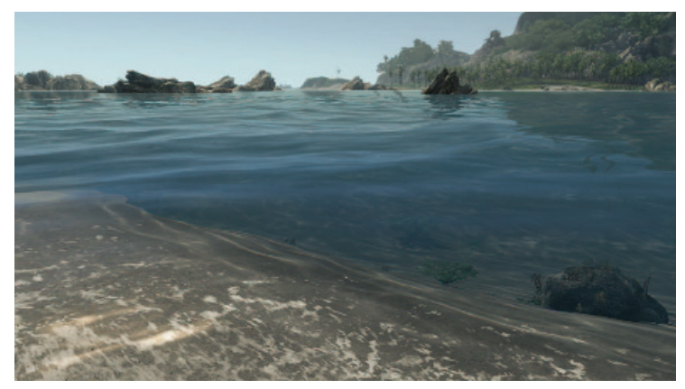

### **14.5.2 折射**

对于上一小节中所描述的透光率，我们会假设入射光线都来自于网格体积之外，并且沿着直线穿过这个网格体积。当网格的前后表面是平行的，并且厚度不是很大的时候（例如：窗户玻璃），这个假设是相对合理的。而对于其他透明介质而言，折射率（index of refraction）起着十分重要的作用。我们在章节9.5中描述了Snell定律（折射定律），它描述了光线在遇到网格表面时，其方向会如何发生改变。

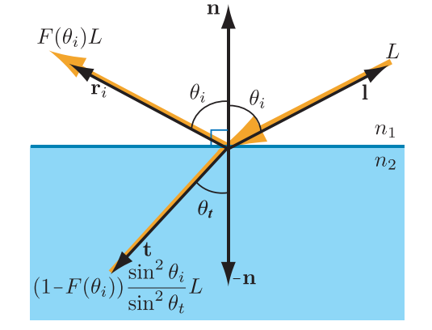

由于能量守恒，任何未被反射的光线都将被透射，即透射通量（transmitted flux）与入射通量（incoming flux）的比例为$1 - f$，其中$f$是反射光量。透射radiance与入射radiance的比例是不同的，由于入射光线和透射光线的投影面积和立体角不同，因此二者的radiance关系为：&#x20;

$$
L_{t}=\left(1-F\left(\theta_{i}\right)\right) \frac{\sin ^{2} \theta_{i}}{\sin ^{2} \theta_{t}} L_{i}
\tag{14.26} 
$$

图14.36展示了这种行为。Snell定律与方程14.26相结合，可以得到透射radiance的另一种表达形式：

$$
L_{t}=\left(1-F\left(\theta_{i}\right)\right) \frac{n_{2}^{2}}{n_{1}^{2}} L_{i}
\tag{14.27} 
$$

Bec \[123]提出了一种计算折射向量的有效方法。为了便于阅读（因为在Snell方程中，通常会使用$n$来表示折射率），这里我们定义$ 
\mathbf{N}
  $为表面法线，$\mathbf{l}$为指向光源的方向：

$$
\mathbf{t}=(w-k) \mathbf{N}-n \mathbf{l}
\tag{14.28} 
$$

其中$n=n_{1} / n_{2}$为相对折射率，$w$和$k$分别代表：

$$
\begin{aligned} w & =n(\mathbf{l} \cdot \mathbf{N}), \\ k & =\sqrt{1+(w-n)(w+n)} .\end{aligned}
\tag{14.29} 
$$

最终计算得到的折射向量$\mathbf{t}$会被归一化。水的折射率约为1.33，玻璃的折射率一般在1.5左右，而空气的折射率则约为1.0。

折射率会随着波长的变化而变化。透明介质会以不同的角度来弯曲各种颜色的光线，即不同颜色的光线在通过同一种透明介质的时候，各发生折射的角度各不相同。这种现象被称为光的色散（dispersion），它解释了为什么棱镜可以将白光扩散成彩虹色的光锥，以及为什么会出现彩虹现象。色散会导致透镜出现色差（chromatic aberration）问题。在摄影领域，这种现象会被称为紫边（purple fringing），在日光下沿着高对比度的边缘，这种现象会变得尤其明显。而在计算机图形学中，我们通常会忽略这种影响，因为通常而言，紫边是一种需要避免的瑕疵。为了正确地模拟这种效果，我们还需要进行一些额外的计算，因为进入透明表面的每一根光线，在色散之后都会产生一组光线，我们必须对这些光线进行追踪。因此，通常我们只会使用一根折射光线。值得注意的是，一些虚拟现实渲染器会应用一个逆色差变换（inverse chromatic aberration transform），来对头戴显示器的棱镜进行补偿\[1423, 1823]。

想要模拟折射现象，一般方法是在折射物体的位置上生成一个立方环境贴图（cubic environment map，EM）。当在渲染这个物体的时候，可以通过计算正面表面的折射方向来访问这个EM，图14.37展示了这样一个例子。Sousa \[1675]提出了一种基于屏幕空间的方法，该方法并没有使用EM。第一，场景会像往常一样被渲染到一个场景纹理$\mathbf{s}$中，其中不包含任何的折射物体。第二，将场景纹理$\mathbf{s}$的alpha通道清除为1，然后再将折射物体渲染到$\mathbf{s}$的alpha通道中；如果某个像素通过了深度测试，则向对应位置的alpha通道写入0。第三，完整渲染折射物体，并在像素着色器中，根据像素在屏幕上的位置，并添加一个扰动偏移，来对场景纹理$\mathbf{s}$进行采样，从而对折射现象进行模拟，例如：对表面法向切线的$xy$分量进行扰动缩放。在这种情况下，只有当$\alpha= 0$时，我们才会考虑对样本的颜色进行扰动。这个测试目的是为了避免使用来自折射物体前方的样本，否则将会导致错误的顺序，即将这些样本的颜色扭曲进来，就像是它们位于折射物体后面一样。需要注意的是，也可以不用将$\alpha$设置为0，可以使用场景的深度贴图，来比较当前像素着色器与扰动样本的深度差异\[294]。如果距离中心像素比较远的话，那么样本偏移的距离就会比较近；也可以忽略这种扰动，直接使用常规的场景样本，就好像没有发生折射一样。

![图14.37：左图：使用立方体环境贴图来模拟玻璃天使的折射现象，这个贴图本身也被用作天空盒的背景 \[218\] 。右图：玻璃球的反射现象和折射现象，具有色差效应 \[1696\] 。](images/Chapter-14/202308291052829.png "图14.37：左图：使用立方体环境贴图来模拟玻璃天使的折射现象，这个贴图本身也被用作天空盒的背景 \[218] 。右图：玻璃球的反射现象和折射现象，具有色差效应 \[1696] 。")

这些技术可以给人一种折射的错觉，但是实际上它们与现实世界中的折射现象差距非常大。在我们刚才所描述的技术中，当光线进入透明固体的时候，光线的方向会发生改变；而当光线离开透明固体的时候，此时它并不会发生第二次弯曲，而现实世界中的光线则会再次发生弯曲。即在这些技术中，这个出口界面永远不会起到作用。这个缺陷有时候并不重要，因为人眼具有很强的包容性，可以忍受这些不太真实的现象\[1185]。

许多游戏都会通过一个单独的图层来表现折射现象。对于粗糙的折射表面，会根据材质的粗糙度来对背景进行模糊处理，从而模拟由微观几何法线分布所引起的折射光线方向的扩散。在游戏《毁灭战士（2016）》中\[1682]，场景首先会按照正常的方式进行渲染。然后将其降采样到一半的分辨率，并进一步降低到4个不同的mipmap层级。每个mipmap层级都会根据模仿GGX BRDF波瓣的高斯模糊来进行将采样。最后一步，在全分辨率的场景上渲染折射物体\[294]。通过采样场景的mipmap纹理，并将材质粗糙度映射到对应的mipmap级别，从而将背景合成在折射表面的后面 。折射表面越粗糙，背景就越模糊。Drobot \[386]也提出了相同的方法，他使用了一般的材质表示方法。在McGuire和Mara \[1185]的统一透明框架中也使用了类似的技术。在这种情况下，可以使用一个高斯点扩散函数（Gaussian point-spread function），在单个pass中对背景进行采样，如图14.38所示。


也可以通过多个图层来处理更加复杂的折射情况。其中的每一层都可以使用存储在纹理中的深度信息和法线信息来进行渲染。然后可以使用一个基于浮雕映射原则（章节6.8.1）的程序，来对穿过图层的光线进行追踪。存储在纹理中的深度会被视为一个高度场，每条光线都会进行光线步进，直到找到一个交点。Oliveira和Brauwers \[1326]提出了这样的一个框架，来处理穿过网格背面的折射。此外，附近的不透明物体还可以被转换为颜色贴图和深度贴图，提供最后的一个不透明层\[1927]。所有这些基于图像空间的折射方案，它们都具有一个共同的限制，即屏幕边界以外的内容无法被折射。

### **14.5.3 焦散和阴影**

计算由折射光线和衰减光线所产生的阴影现象和焦散现象，是一项十分复杂的任务。在离线渲染环境中，有许多方法可以实现这一目标，例如双向路径追踪（bidirectional path tracing）或者光子映射（photon mapping）\[822, 1413]。幸运的是，有许多方法提供了这种现象的实时近似值。

焦散（caustic）是指光线偏离其直线路径的视觉现象，例如光线通过玻璃表面或者水面之后的发散。光线偏离并发散的结果是，光线会在某些区域内散焦（defocused），从而产生阴影区域；并在其他一些区域内聚焦（focused），使得光线路径会变得更加密集，从而产生更强的入射光线。具体的光线路径和焦散现象，取决于光线所遇到的曲面。一个经典的反射焦散例子是在咖啡杯内部能够看到的心形焦散。而折射焦散的现象则更加明显，例如：光线通过水晶饰品、透镜或者一杯水，会发生聚焦和散焦，从而形成明显的明暗区域，如图14.39所示。光线在被弯曲的水面反射和折射之后，会在水面上和水面下都产生焦散现象。当光线汇聚时，光线将集中在不透明表面上，并产生焦散。当在水面以下时，汇聚的光路将在水中变得可见。并且由于水体粒子对光子的散射，还会导致光束的出现。焦散是一个单独的现象因素，来自体积边界的菲涅尔效应与穿过体积时的透光率会导致光线减少，而焦散现象与这种光线减少无关。

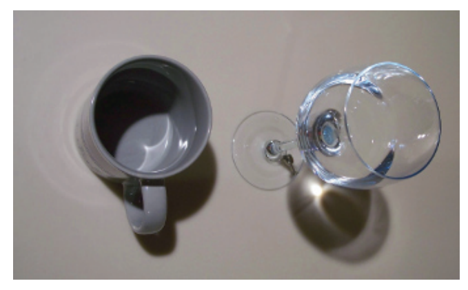

为了在水面上生成焦散效果，可以离线生成焦散的动画纹理，并将其作为一个光照贴图应用到水面上。一般来说，这个焦散光照贴图会叠加在其他的光照贴图之上。许多游戏都采用了这种方法来模拟水面焦散效果，例如基于CryEngine开发的《孤岛危机3》\[1591]。一个关卡中的水面区域，是通过水体（water volume）来进行控制的。这个水体的顶部表面可以使用凹凸贴图的纹理动画或者物理模拟来生成动态的水面效果。可以利用凹凸贴图生成的法线信息，当在水面上或者水面下进行垂直投影的时候，从可以将其法线方向映射到一个radiance贡献上，从而生成焦散效果。使用艺术家创作的、基于高度的最大影响距离来控制因传播距离而发生的衰减。还可以对水面进行模拟，使得水面能够对世界中的物体运动做出反应，从而生成与环境情况相匹配的焦散事件。图14.40展示了一个水中的焦散例子。

![图14.40：展示水中焦散效果的Demo。 \[1831\]](images/Chapter-14/202308291732992.png "图14.40：展示水中焦散效果的Demo。 \[1831]")

在水下环境中，同样的动画水面技术也可以用于模拟水体介质中的焦散效果。Lanza \[977]提出了一种生成光束的两步方法。首先，从光源的视角进行渲染，将光线的位置和折射方向存储到一个纹理中。从水面的位置开始，对线条进行光栅化，在视图中沿着折射方向进行延伸。通过叠加混合将这些线条累积起来，最后使用一个后处理模糊来对结果进行模糊处理，从而掩盖因线条数量不足所产生的瑕疵。

Wyman \[1928, 1929]提出了一种用于渲染焦散的图像空间技术。该方法的工作原理是，首先通过透明物体的正面和背面，来计算折射后的光子位置和入射方向。这可以通过使用章节14.5.2中介绍的背景折射技术来实现\[1927]。然而，由于菲涅尔效应的存在，因此会将场景的交点位置、折射后的入射方向和透光率存储在纹理中，而不是在纹理中存储折射后的radiance。纹理中的每个纹素都会存储一个光子，然后可以将这些光子以正确的强度溅射回视图中。为了实现这一目标，有两种可能的方法：在观察空间中或者在光源空间中，以高斯衰减的方式，将光子作为四边形进行溅射（splat），结果如图14.41所示。McGuire和Mara \[1185]提出了一种更加简单方法来处理焦散状的阴影，即根据透明表面的法线来对透光率进行修正，由于菲涅尔效应的存在，如果垂直于入射表面，那么会具有更高的透过率，反之透过率会更低。章节7.8中还介绍了其他的体积阴影技术。

![图14.41：在左边，佛像（Buddha）折射了附近的物体和周围的天空盒 \[1927\] 。在右边，通过类似于阴影贴图的分层贴图来生成的焦散效果 \[1929\] 。](images/Chapter-14/202308291742091.png "图14.41：在左边，佛像（Buddha）折射了附近的物体和周围的天空盒 \[1927] 。在右边，通过类似于阴影贴图的分层贴图来生成的焦散效果 \[1929] 。")

## 14.6 次表面散射

次表面散射（subsurface scattering，SSS）是一种复杂的物理现象，它存在于具有较高散射系数的固体材质中（详见章节9.1.4）。这类材质包括蜡、人体皮肤和牛奶等，如图14.2所示。

章节14.1中对一般的光线散射理论进行了介绍。在某些情况下，对于那些具有较高光学深度（optical depth）的介质，光线在其内部发生散射的尺度相对较小，例如人体皮肤。散射光线会从其原始入射点附近的表面处重新发射出来。这种位置上的偏移意味着我们无法使用一个BRDF（章节9.9）来对次表面散射进行建模。也就是说，当散射尺度大于一个像素距离的时候，它将具有更加全局的性质。必须使用一些特殊的方法来渲染这种效果。

图14.42展示了光线在物体中被散射的情况。这种散射现象将会导致入射光线具有许多不同的路径。单独模拟每个光子的行为是不现实的（即使对于离线渲染而言也是如此），因此必须通过对可能的光线路径进行积分，或者对这样的积分进行近似，才可能解决这个问题。除了散射现象之外，光线在穿过材质的时候还会被部分吸收。

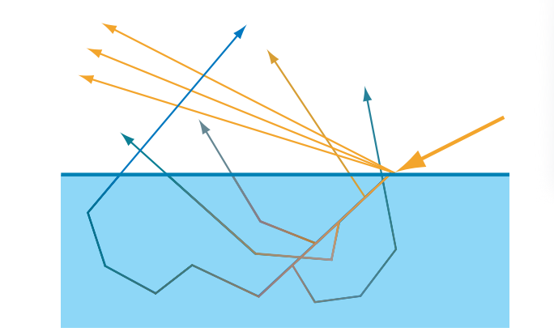

有一个重要因素可以用于区分图14.42中所示的各种光路，即散射事件发生的数量。对于某些光线路径而言，光线在一次散射后便可以离开材质；而对于另一些光线路径而言，光线则被散射了两次、三次或者更多次。我们通常会将散射路径划分为单次散射（single scattering）和多次散射（multiple scattering）。对于不同类型的光线路径，会使用不同的渲染技术来进行模拟。对于某些材质而言，单次散射在总体效果中所占据的比重较少，即多次散射占据了主导地位，例如皮肤。由于这些原因的存在，因此许多次表面散射的渲染技术都侧重于对多次散射进行模拟。在本小节中，我们将介绍几种次表面散射的近似技术。

### 14.6.1 环绕光照

环绕光照（wrap lighting）\[193]可能是最简单的次表面散射方法。我们在章节10.1中介绍过这个技术，当时是为面光源的一种近似。当环绕光照用于近似次表面散射的时候，我们可以添加一个颜色偏移\[586]，这个颜色偏移代表了光线在通过材质的时候，部分波长的光线会被材质吸收。例如：在渲染皮肤的时候，可以使用一个红色的偏移。

当以这种方式进行使用的时候，环绕照明试图模拟多重散射对曲面着色的影响。光线从相邻点“泄露”到当前的着色点上，软化了从亮到暗的过渡区域，其中较暗的区域意味着该处表面会向着远离光源的方向进行弯曲。Kolchin指出\[922]，这种效应取决于表面的曲率（curvature），并且他推导出了一个基于物理的版本。虽然他推导出的表达式具有很高的计算成本，但是其背后的思想却是十分有用的。

### **14.6.2 法线模糊**

Stam指出\[1686]，多次散射可以被建模为一个扩散（diffusion）过程。Jensen等人\[823]进一步发展了这一思想，并推导出了一个解析的双向表面散射分布函数（bidirectional surface scattering distribution function，BSSRDF）模型。BSSRDF是BRDF在全局次表面散射情况下的推广版本\[1277]。这个扩散过程对出射的radiance具有空间模糊效应。

这种模糊只适用于漫反射，因为镜面反射发生在材质的表面处，它不受次表面散射的影响。由于法线贴图经常用于编码小尺度上的表面变化，因此对于次表面散射而言，一个十分有用的技巧是只对镜面反射应用法线贴图\[569]。而漫反射则采用光滑的、无扰动的法线。由于这种技巧并不会带来额外的计算开销，因此在使用其他次表面散射方法的时候，同样可以使用这个技巧。

对于许多材质而言，多次散射通常只会发生在相对较小的距离内。皮肤是其中的一个重要例子，对于皮肤这样的材质，大多数次表面散射都会发生在距离表面几毫米的范围内。对于这样的材质，使用无扰动的漫反射着色法线就足够了。Ma等人\[1095]基于实际测量的数据，对这种方法进行了扩展。他们求解了来自散射物体的反射光线，并发现镜面反射是基于几何表面法线的，而由于次表面散射现象的存在，会使得漫反射看起来像是使用了模糊过的表面法线一样。此外，在可见光谱的范围内，不同波长光线的模糊程度会有所不同。他们提出了一种实时的着色技术，在这个技术中，对于镜面反射项以及漫反射项的$R,G,B$通道，都会使用独立获取的法线贴图\[245]。为每个通道都使用不同的法线贴图将会导致颜色溢出现象。由于这些漫反射法线贴图通常类似于镜面法线贴图的模糊版本，因此可以对这个技术进行一些修改，即使用单个法线贴图，同时调整该法线贴图的mipmap层级，使用模糊版本的法线贴图来用于漫反射着色，这样做的代价是失去了颜色偏移效果，因为现在每个通道所使用的法线都是相同的。

### 14.6.3 预积分皮肤着色

Penner \[1369]将环绕光照（wrap lighting）和法线模糊（normal blurring）的思路结合起来，提出了一种预积分的皮肤着色解决方案。

材质的散射率和透光率会被预先积分，并存储在一个二维查找表中。这个LUT的第一个轴是基于$\mathbf{n} \cdot \mathbf{l}$进行索引的；第二个轴是基于$1 / r=\|\partial n / \partial p\|$进行索引的，它代表了表面的曲率。表面的曲率越高，对透射颜色和散射颜色的影响就越大。由于网格上每个三角形的曲率都是恒定的，因此这些表面曲率值必须进行离线烘焙和平滑处理。

为了处理次表面散射对小尺度表面细节的影响，Penner对Ma等人提出的技术进行了修改，Ma等人\[1095]所提出的技术在上一小节中进行了讨论。Penner并没有为漫反射的$R,G,B$通道使用单独的法线贴图，而是根据每个颜色通道中次表面材质的扩散配置，来对原始的法线贴图进行模糊，从而生成所需的独立法线贴图。由于使用了四个独立的法线贴图，因此该方法是内存密集型的（memory intensive），为了对其进行一些优化处理，Penner使用了一个单一的平滑法线贴图，并与每个颜色通道的顶点法线相混合。

这种技术会忽略光线在阴影边界上的扩散，因为在默认情况下，它只会依赖于曲率来对着色进行调整。为了使得散射配置（scattering profile）能够跨越阴影边界，可以使用阴影的半影配置来对LUT坐标进行偏移。通过应用上述的改进，这种十分快速的技术在质量上能够近似于下一小节中将介绍的高质量方法\[345]。

### **14.6.4 纹理空间扩散**

对漫反射法线进行模糊处理可以实现多重散射的一些视觉效果，但是无法实现其他的效果，例如软化的阴影边缘等。可以使用纹理空间扩散（texture-space diffusion）的相关技术来解决这些限制。这个想法最早是由Lensch等人\[1032]提出的，当时是作为另一种技术的其中一部分，但是后续Borshukov和Lewis \[178, 179]所提出的版本所具有的影响力最大。他们将多重散射的想法形式化为一个模糊过程。首先，将表面的irradiance（漫反射光照）渲染到一个纹理中，这是通过在光栅化阶段使用纹理坐标来作为渲染位置实现的。真实的位置会单独进行插值，从而可以在着色阶段使用。这个纹理会被进行模糊处理（滤波），并在后续渲染时用于计算漫反射着色。模糊处理中所使用的滤波器，其形状和大小取决于材质和波长。例如：对于皮肤材质而言，$R$通道所使用的滤波器要比$G$通道或者$B$通道更宽，这会使得在靠近阴影边缘的附近变红。对于大多数材质而言，用于模拟次表面散射的适当滤波器通常都具有一个较窄的中心尖峰，以及一个宽而浅的底部。这项技术最初被应用于离线渲染中，但是NVIDIA \[345, 586]和ATI \[568, 569, 803, 1541]的研究人员，很快就提出了基于GPU的实时实现。

在d'Eon和Luebke的演讲展示中\[345]，他们介绍了此类技术中最完整的解决方案（之一），该方法支持复杂的滤波器，可以用于模拟多层次表面结构的效果。Donner和Jensen表明\[369]，这样的结构可以生成最为真实的皮肤渲染效果。这个完整的NVIDIA皮肤渲染系统由d'Eon和Luebke提出，它可以生成出色的效果（如图14.43所示），但是其计算开销很高，需要大量的模糊pass。但是，该系统可以很容易地缩减计算规模，从而提高性能表现。

![图14.43：纹理空间的多层扩散。利用RGB权重来对6种不同的模糊图像进行组合。最终的图像会在这个线性组合的基础上，再加上一个高光项。 \[345\]](images/Chapter-14/202308301122365.png "图14.43：纹理空间的多层扩散。利用RGB权重来对6种不同的模糊图像进行组合。最终的图像会在这个线性组合的基础上，再加上一个高光项。 \[345]")

Hable \[631]提出了一个包含12个样本的滤波核，用于取代多个高斯pass。这个滤波器可以作为一种预处理应用于纹理空间中；也可以在进行网格光栅化的时候，应用于像素着色器中。这种方法可以使得人脸渲染的速度变得更快，但是代价是会损失一些真实感。当靠近人脸进行观察的时候，较低次数的采样会产生肉眼可见的色带。但是在中等距离上进行观察的时候，这种方法所带来的质量损失可以忽略不计。

### **14.6.5 屏幕空间扩散**

对场景中的所有网格渲染一个光照贴图，并对其进行模糊处理，这样做的开销会很大，无论是计算开销还是内存开销。此外，在一帧的渲染中，场景中的网格需要进行两次渲染，一次是在光照贴图中，另一次则是在相机视图中。同时这个光照贴图还需要具有一个合理的分辨率，从而能够在小尺度的细节中表现次表面散射现象。

为了解决这些问题，Jimenez提出了一种基于屏幕空间的方法\[831]。

1.  像往常一样渲染一遍场景，而场景中需要表现次表面散射现象的网格（例如人脸），将会在模板缓冲区（stencil buffer）中进行标注。
2.  对于存储下来的radiance，应用一个两pass的屏幕空间处理，来模拟次表面散射现象，并通过使用模板测试，从而只在需要进行次表面散射的地方（包含半透明材质的像素）应用这个开销很大的算法。

在额外的两个pass中，会在水平方向上和垂直方向上应用两个一维的双边模糊滤波核。彩色的模糊滤波核是可分离的，但是由于以下两个原因，它无法以一种完全分离的方式来进行应用。

1.  必须要考虑线性的观察深度，从而根据表面距离来将模糊核拉伸到正确的宽度。
2.  双边滤波避免了不同深度材质中的光线泄漏，即光线不应当在不发生相互作用的表面之间进行泄露。

此外，为了使得这个模糊滤波器不仅能够应用于屏幕空间中，而且还能够应用于表面的切线空间中，它必须还要考虑表面的法线方向。最后，虽然由于以上这些原因，使得模糊滤波器的可分离性成为一种近似，但是最终的结果仍然是高质量的。后来提出了一种改进的可分离滤波器\[833]。由于该算法依赖于屏幕上的材质区域面积，因此对于渲染人脸特写而言开销很大。但是这种成本在某种意义上来说是合理的，因为我们期望的就是这些区域内可以有很高质量的次表面渲染效果。当场景包含多个角色的时候，这个算法尤其有价值，因为场景中的人物角色会被同时处理，如图14.44所示。

![图14.44：高质量渲染的扫描人脸模型。屏幕空间中的次表面散射可以在单个后处理中，对多个角色进行处理，渲染逼真的人体皮肤材质。 \[831\]](images/Chapter-14/202308301315015.png "图14.44：高质量渲染的扫描人脸模型。屏幕空间中的次表面散射可以在单个后处理中，对多个角色进行处理，渲染逼真的人体皮肤材质。 \[831]")

为了进一步优化处理过程，可以将线性深度存储在场景纹理的alpha通道中。由于这个一维模糊只依赖于少量的样本，因此会在近距离的人脸特写上看到欠采样的现象。为了避免这个问题，可以将这个滤波核进行逐像素的旋转，这样做能够隐藏之前的鬼影瑕疵，代价是会出现一些噪声\[833]。可以使用时域抗锯齿（章节5.4.2）来显著降低这个噪声。

在实现屏幕空间扩散的时候，我们需要格外注意，只对irradiance进行模糊处理，而不是漫反射反照率（albedo）或者镜面光照（高光）。一种实现这个目标的方法是，将irradiance和镜面光照渲染到独立的屏幕空间缓冲区中。如果使用延迟渲染（章节20.1）技术的话，那么G-buffe中自然就包含了漫反射反照率。为了减少内存带宽的压力，Gallagher和Mittring \[512]建议使用棋盘格模式（checkerboard pattern），来将irradiance和镜面光照存储在单个缓冲区中。在irradiance被模糊之后，通过将漫反射反照率与模糊的irradiance相乘起来，并在上面叠加镜面光照，从而合成最终图像。

在这个屏幕空间的算法框架内，还可以渲染大尺度的次表面散射现象，例如：穿过鼻子或者耳朵的光线。在渲染网格的漫反射照明时，Jimenez等人\[827]所提出的技术还通过利用反向的表面法线$\mathbf{-n}$，对来自背面的入射光线进行采样，从而增加了来自背面次表面传输的贡献。最终的计算结果会通过透光率来进行修正，这个透光率是通过对一个传统的阴影贴图（从光源的视角进行渲染）进行采样来计算的，这类似于Dachsbacher和Stamminger \[320]的方法，我们将在下一小节中对其进行介绍。为了表现光线在一个圆锥体范围内的前向散射，可以对阴影贴图进行多次采样。为了能够使用一个较低的像素样本数来降低渲染成本，可以使用两个逐像素随机偏移或者随机旋转的阴影样本。这样做将会产生许多不必要的视觉噪声。但是值得庆幸的是，我们会在屏幕空间中使用次表面模糊滤波核来实现半透明的次表面光线扩散，而噪声会在这个过程中被自动过滤掉。因此，在每个光源只有一个额外深度贴图样本的情况下，可以模拟光线通过面部较薄的部分时，在圆锥体中的前向散射，从而实现高质量的半透明效果。

### **14.6.6 深度贴图技术**

到目前为止我们所讨论的技术，都是在相对较小的距离上来模拟光线散射，例如皮肤。对于表现出大尺度光线散射的材质，我们还需要其他技术来进行模拟，例如：光线在手中的传播。其中的许多技术都着重关注单次散射的情况，因为这要比多次散射更加容易建模。

图14.45左侧展示了大尺度单次散射的理想模拟结果。由于折射现象的存在，因此光线在进入和离开物体时都会改变传播方向。我们需要将所有路径的效果叠加起来，才能为单个表面点进行着色。同时还需要考虑光线的吸收效应，每条路径的光线吸收量取决于该路径在材质内部的长度。即使对于离线渲染器而言，对单个着色点追踪所有的折射光线也是非常昂贵的，因此我们通常会忽略进入材质时的折射现象，只考虑光线在离开材质时的方向变化\[823]。由于我们总是会在入射光线的方向上来投射射线，因此Hery指出\[729, 730]，我们可以直接使用光源空间的深度贴图（通常用于渲染阴影）来找到这个入射光线的方向，而不需要进行真正的光线投射操作，如图14.45的中间部分所示。对于根据相位函数来对光线进行散射的介质，光线的散射角度同样也会影响散射光线的数量。

![图14.45：左图展示了最理想的情况，光线会在进入物体和离开物体的时候发生折射；通过材质内的光线步进，对离开物体时光线折射的散射贡献进行正确收集。同时在计算消光系数 \sigma\_{t} 的时候，考虑每条光线路径的长度。这可以通过路径追踪或者一些实时近似方法来进行实现 \[320\] 。中间的图像则展示了一种计算起来更加简单的情况，即光线只会在离开物体的时候发生折射。这是实时渲染中常用的近似方法，因为想要从折射的采样点（黄色）找到对应的光线入口点（红色）是一件很困难的事情。右图展示了一个更加简化的近似方法，其计算速度更快，这种近似方法只考虑了一条光线，并没有考虑沿着折射光线进行多次采样 \[586\] 。](images/Chapter-14/202308301419446.png "图14.45：左图展示了最理想的情况，光线会在进入物体和离开物体的时候发生折射；通过材质内的光线步进，对离开物体时光线折射的散射贡献进行正确收集。同时在计算消光系数 \sigma_{t} 的时候，考虑每条光线路径的长度。这可以通过路径追踪或者一些实时近似方法来进行实现 \[320] 。中间的图像则展示了一种计算起来更加简单的情况，即光线只会在离开物体的时候发生折射。这是实时渲染中常用的近似方法，因为想要从折射的采样点（黄色）找到对应的光线入口点（红色）是一件很困难的事情。右图展示了一个更加简化的近似方法，其计算速度更快，这种近似方法只考虑了一条光线，并没有考虑沿着折射光线进行多次采样 \[586] 。")

执行深度贴图的查找操作，其速度要比光线投射更快，但是由于Hery的方法需要检索多个样本，因此对于大多数的实时渲染应用程序而言，这个方法的速度还是太慢了。Green \[586]提出了一个更快的近似方法，如图14.45右侧所示。虽然这种方法并不是基于物理的，但是生成的结果还是令人信服的。该方法的一个问题在于，物体背面的细节会被显示出来，因为物体的厚度变化会直接影响着色结果的颜色。尽管如此，Green的近似方法仍然足够有效，皮克斯将其应用在了《美食总动员》等电影中\[609]。皮克斯将这种技术称为软糖光源（gummi light）。Hery方法的另一个问题是，深度贴图无法包含多个物体，也无法包含高度非凸（non-convex）的物体。这是因为我们假设着色点（蓝色）和物体交点（红色）之间的整个光线路径都位于物体内部。皮克斯通过使用一种深度阴影贴图（deep shadow map）的方法来解决这个问题\[1066]。

由于每个表面点都可能会受到来自其他表面点的光线影响，因此想要实时模拟大尺度的多重散射是相当困难的。Dachsbacher和Stamminger \[320]提出了一种阴影映射的扩展方法来模拟多重散射现象，这个方法被称为半透明阴影映射（translucent shadow mapping）。该方法会将一些额外信息存储在光源空间的贴图中，例如irradiance和表面法线等。然后从这些纹理（包括深度贴图）中提取几个样本，并将其结合起来，从而形成对散射radiance的估计。在NVIDIA的皮肤渲染系统中\[345]，使用了这种技术的一种改进版本。Mertens等人\[1201]提出了类似的方法，不同之处在于，该方法使用了屏幕空间中的纹理，而不是光源空间中的纹理。

树叶也表现出强烈的次表面散射效应，当光线从树叶背面入射进来的时候，树叶会呈现出明亮的绿色。除了反照率纹理和法线纹理之外，还可以将存储树叶体积透光率$T_r$的纹理映射到树叶表面上\[1676]。然后，可以使用一个特殊（ad hoc）的模型来近似光线的额外次表面贡献。由于树叶是比较薄的场景元素，因此可以使用负的表面法线，来近似树叶背面的法线$\mathbf{n}$。此时背面光线的贡献可以计算为：$(\mathbf{l} \cdot-\mathbf{n})^{+} \cdot(-\mathbf{v} \cdot \mathbf{l})^{+}$，其中$\mathbf{l}$是光线方向，$\mathbf{v}$是观察方向。然后将其与表面反照率相乘，并叠加到直接光照的贡献上。

以类似的方式，Barre-Brisebois和Bouchard \[105]提出了一种廉价的特定近似方法，该方法可以网格上模拟大尺度的次表面散射效果。首先，对于每个网格，他们会生成一个存储平均局部厚度（averaged local thickness）的灰度纹理（grayscale texture），这个平均局部厚度的值，等于1减去使用内法线$-\mathbf{n}$计算的环境光遮蔽值。这个纹理被称为$t_{\text{ss}}$，可以将其认为是一种透光率的近似值，可以将其应用在从表面背面入射来的光线上。最后将次表面散射添加到常规的表面光照中，这里的次表面散射可以使用如下方程进行计算：

$$
t_{\mathrm{ss}} \mathbf{c}_{\mathrm{ss}}\left((\mathbf{v} \cdot-\mathbf{l})^{+}\right)^{p}
\tag{14.30} 
$$

方程中的$\mathbf{l}$是归一化的光线向量，$\mathbf{v}$是归一化的观察向量，$p$为用于近似相位函数的指数（如图14.10所示），$\mathbf{c}_{\mathrm{ss}}$为次表面反照率。然后将这个表达式与光线的颜色、光线的强度和随距离的衰减相乘在一起。这个近似模型并不是基于物理的，也不是能量守恒的，但是它能够在一个pass中，快速渲染看起来较为合理的（plausible）次表面光照效果，如图14.46所示。

![图14.46：左侧展示了为Hebe雕像生成的局部厚度纹理。中间展示了使用这个局部厚度纹理来生成的次表面光线散射效果。右边展示了另一个半透明的立方体场景，这些立方体使用了相同的次表面散射技术进行渲染。 \[105\]](images/Chapter-14/202308301528017.png "图14.46：左侧展示了为Hebe雕像生成的局部厚度纹理。中间展示了使用这个局部厚度纹理来生成的次表面光线散射效果。右边展示了另一个半透明的立方体场景，这些立方体使用了相同的次表面散射技术进行渲染。 \[105]")

## 14.7 毛发和皮毛

毛发（hair）是指从哺乳动物的真皮层生长出来的蛋白质细丝。就人类而言，毛发分散在身体的不同部位上，包括头顶、胡须（beard）、眉毛（eyebrow）和睫毛（eyelash）等。而其他哺乳动物通常都会被皮毛（fur，浓密的、有限长度的毛发）所覆盖，动物身上不同部位的皮毛往往会具有不同的属性。头发可以是直的（straight）、波浪的（wavy）、或者卷曲的（curly），每一种头发都有着不同的强度和粗糙度。天然的头发可以是黑色、棕色、红色、金色、灰色或者白色，还可以被人工染成彩虹中的所有颜色（成功率不同）。

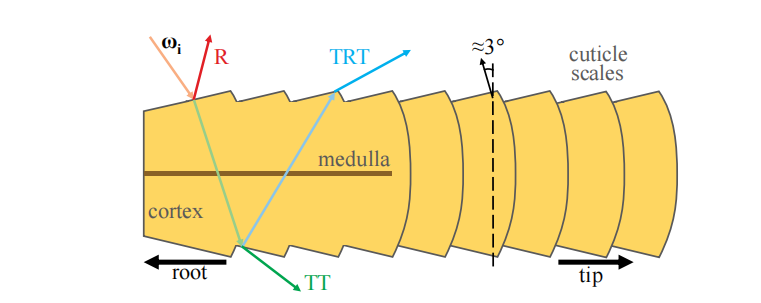

> 译者注：这里引用了两篇论文，其中论文1052是闫令琪老师的。

毛发（hair）和皮毛（fur）的结构基本上是一样的，它由3层组成\[1052, 1128]，如图14.47所示：

-   最外面是角质层（cuticle），它代表纤维的表面。这个表面是粗糙的，它由重叠的鳞片所组成，与毛发的方向相比，倾斜角大约为$\alpha=3^{\circ}$，这使得其法线会向着毛发的根部倾斜。
-   中间的是皮层（cortex），它含有黑色素，为毛发纤维赋予了颜色\[346]。其中一种色素是真黑素（eumelanin），它负责产生棕色，$\sigma_{a, e}= (0.419,0.697,1.37)$；另一种色素是棕黑色素（pheomelanin），它负责产生红色，$\sigma_{a, p}=(0.187,0.4,1.05)$。
-   最内层是髓质（medulla）。髓质很小，在建模人类毛发时通常会被忽略\[1128]。但是髓质在动物皮毛中的占比更大，具有更大的意义，在建模动物皮毛的时候不能忽略\[1052]。

我们可以将毛发纤维视为类似于粒子的东西，即一个体积的离散化表示，不同之处在于这里我们使用曲线代替点。利用双向散射分布函数（bidirectional scattering distribution function，BSDF），我们可以描述毛发纤维与光线之间的相互作用。BSDF与BRDF相对应，不同之处在于，BSDF会将光线在球面区域内进行积分，而不仅仅是在半球范围内。BSDF通过不同的层，聚集了毛发纤维内发生的所有相互作用，它在章节14.7.2中进行了详细介绍。光线会在纤维中发生散射，同时也会被其他纤维所反射，在这个多重散射现象中会产生复杂的彩色radiance。此外，由于纤维会吸收光线，这是一个与其材质和色素有关的函数，因此在毛发内部表现体积自阴影现象也很重要。在本小节中，我们对最近的技术进行介绍，这些技术使得我们能够渲染较短的毛发，例如胡须，头毛和皮毛等。

### **14.7.1 几何和Alpha**

毛发可以被渲染为一个压扁的毛发四边形（hair quad），围绕由艺术家绘制的毛发引导曲线（hair guide curves），会在顶点着色器中生成一个四边形的丝带（ribbon）。每条四边形丝带都会沿着对应的毛发引导曲线，从而代表一束毛发，并按照特定的方向跟随皮肤一起运动\[863, 1228, 1560]。这种方法非常适合模拟胡须，或者是模拟长度较短、且大部分都是静态的毛发。这种方法的效率也很高，因为较大的四边形会占据更多视野面积，因此只需要少量的丝带就足以覆盖整个头部，这反过来又提高了性能表现。如果需要表现更多的细节，则可以渲染数千条更薄更细的四边形丝带，例如：通过物理模拟生成又细又长的头发。在这种情况下，最好是使用沿着毛发曲线切线的圆柱体约束，来使得生成的四边形面向观察方向\[36]。即使只使用很少毛发引导线来模拟毛发，也可以通过对周围毛发引导线的属性进行插值，来实例化新的头发\[1954]。

所有这些四边形丝带元素，都可以被渲染为alpha混合的几何图形。如果使用alpha混合的话，就需要保证正确的毛发渲染顺序，不然会出现透明度瑕疵（章节5.5）。为了缓解这个问题，可以使用预先排序的索引缓冲区（index buffer），首先渲染那些靠近头部的毛发，然后再那些渲染远离头部的毛发。这种策略适用于较短的、静态的毛发，不适合用于渲染长的、相互交错的、动态的毛发。可以使用alpha测试和深度测试来解决这个排序问题；但是这样可能会导致高频几何图形和纹理出现严重的锯齿问题。可以使用MSAA来对每个样本进行alpha测试\[1228]，相应的代价是额外的样本和更大的内存带宽。另外，也可以使用任何顺序无关的透明度方法，例如章节5.5中所介绍的方法。例如：TressFX存储了$k = 8$个最近的片元\[36]，并在像素着色器中进行更新，来保证前7层是有序的，从而实现多层alpha混合\[1532]。

另一个问题是来自mipmap过程中的alpha缩小（章节6.6），这会导致alpha测试出现瑕疵。有两种方法可以解决这个问题，第一种是执行更加智能的mipmap生成，从而保证alpha不出现错误。第二种是使用一个更加高级的哈希alpha测试\[1933]。在渲染细长毛发的时候，也可以根据毛发的像素覆盖率来对不透明度进行修改\[36]。

诸如胡须、睫毛和眉毛这样的细小毛发，要比头发更加容易渲染。睫毛和眉毛甚至可以被处理成几何皮肤，拥有真实的网格，从而配合头部和眼睑的运动。这些小元素上的毛发表面可以使用一个不透明的BRDF材质来进行光照计算。当然也可以使用一个BSDF来对毛发进行着色，我们将在下一小节中进行介绍。

### \*\*14.7.2 \*\*毛发

Kajiya和Kay \[847]开发了一个BRDF模型，用于渲染一个由有组织的、无限小的圆柱形纤维所组成的体积。我们在章节9.10.3中讨论过这个模型，它最初是用于在一个代表表面密度的体积纹理上，通过光线步进来渲染毛茸茸的元素。这个BRDF代表了体积对镜面光照和漫反射光照的响应，它也可以用于毛发的渲染。

Marschner等人\[1128]进行了一项开创性的工作，他们测量了人类毛发纤维中的光线散射，并根据这些观察结果提出了一个模型。他们在一根毛发中观察到了不同的散射分量，如图14.47所示。

1.  首先，$R$分量代表了光线在角质层（空气/纤维界面）上的反射，这会导致一个向毛发根部偏移的白色镜面峰值。
2.  其次，$TT$分量代表了光线通过毛发纤维的传播路径，第一次从空气折射到毛发材质中，第二次从毛发材质折射回空气中。
3.  最后，$TRT$分量代表了光线首先经过折射，在毛发纤维中进行传播，然后被纤维的另一面所反射，最后再次经过折射，在毛发材质外进行传播。

这些变量名中的“$R$”代表一次内反射（internal reflection），“$T$”代表一次透射。$TRT$分量可以被认为是一个次级镜面高光，它与$R$相比发生了位移，并且由于光线在穿过纤维材质时被部分吸收，因此具有了颜色。

在视觉上，$R$分量看起来是毛发上的无色镜面反射。当大量毛发从背后被照亮时，$TT$分量看起来是一个明亮的亮点。而$TRT$分量对于真实的毛发渲染而言至关重要，因为它会导致毛发上的偏心闪烁，也就是说，在现实生活中，毛发的横截面并不是一个完美的圆形，而是一个椭圆形。这种闪烁对于真实感而言非常重要，因为它们可以使得毛发看起来没有那么均匀，如图14.48所示。

![图14.48：左侧金色头发的参考图像是使用路径追踪进行渲染的。右侧棕色头发是实时渲染的，由于纤维的偏心而呈现出镜面闪烁效果。 \[346\]](images/Chapter-14/202308301743583.png "图14.48：左侧金色头发的参考图像是使用路径追踪进行渲染的。右侧棕色头发是实时渲染的，由于纤维的偏心而呈现出镜面闪烁效果。 \[346]")

Marschner等人\[1128]提出了一组函数，它将$R$、$TT$和$TRT$分量建模为毛发BSDF的一部分，用于表示毛发纤维对光线的响应。这个模型还恰当地考虑了透射和反射时的菲涅尔效应，但它忽略了$TRRT$、$TRRRT$以及其他更长、更复杂的光线路径。

然而，这个原始模型并不是能量守恒的，d'Eon等人\[346]对其进行了研究和修正。通过更好地考虑粗糙度和高光锥形范围的收缩，对BSDF进行了重新设计，并保证了能量守恒。同时对这些分量也进行了扩展，可以包含更长的光线路径，例如$TR*T$。透射率也可以通过测量获得的黑色素（melanin）消光系数来进行控制。与Marschner等人\[1128]的工作类似，他们的模型能够很好地表现偏心线段上的闪烁。Chiang等人\[262]提出了另一种能量守恒的模型。这个模型给出了参数化的粗糙度和多重散射颜色，这对艺术家来说更加直观，可以很方便地控制毛发的视觉表现，而不是让他们去调整高斯分布的方差或者黑色素的浓度系数。

艺术家们可能想要为角色的毛发创建一个特殊的镜面效果，例如通过改变粗糙度参数等。使用一个基于物理的、能量守恒的模型，毛发体积深处的散射光线也会发生一些变化。为了提供更多的艺术控制选项，可以将前几个散射路径（$R$，$TT$，$TRT$）和多重散射项分开进行处理\[1525]。这可以通过维护第二组BSDF参数来进行实现，这组参数仅用于多重散射路径。此外，BSDF的$R$，$TT$和$TRT$分量可以使用简单的数学形状来进行表示，这些数学形状可以被艺术家们理解，艺术家们通过调整这些形状，来对毛发的外观进行直观的控制。根据入射方向和出射方向来对BSDF进行归一化处理，使得整个系统仍然能够保持能量守恒。

上面所给出的每个BSDF模型都很复杂，计算成本也很高，并且它们主要用于电影制作中，一般使用路径追踪来进行渲染。值得庆幸的是，也存在一些可以实时计算的BSDF模型。Scheuermann提出了一种特别的BSDF模型\[1560]，这个模型易于实现，渲染速度很快，并且在将毛发渲染为较大的四边形丝带的时候，看起来令人信服。更进一步，通过将BSDF存储在一个LUT纹理中，并使用输入方向和输出方向作为参数进行索引\[1274]，可以在实时环境中使用Marschner的模型\[1128]。然而，这种方法很难渲染具有空间变化的毛发外观。为了避免这个问题，最近有一个基于物理的实时模型\[863]，它使用简化的数学表达来对之前工作中的分量进行近似，从而获得了令人信服的渲染结果，如图14.49所示。然而，与离线渲染的结果相比，所有这些实时的毛发渲染模型，在质量上还存在一定的差距。这些简化的实时算法通常不具备高级的体积阴影或者多重散射。而这两种效果对于吸收率低的毛发而言尤其重要，例如金色头发。

![图14.49：实时渲染的毛发， R ， TT ， TRT 以及多重散射分量。 \[863, 1802\]](images/Chapter-14/202308301935822.png "图14.49：实时渲染的毛发， R ， TT ， TRT 以及多重散射分量。 \[863, 1802]")

在考虑体积阴影的情况下，最近的一些解决方案\[36, 863]依赖于一个透光率值，根据恒定的吸收率$\sigma_{a}$，使用$d$来作为沿着光线方向上从遇到的第一根毛发到当前纤维的距离，来计算这个透光率值。这种方法十分实用且直接，因为它仅仅依赖于引擎中任何可用的阴影贴图即可。然而，这种方法无法表达由毛发团块所引起的局部密度变化，这个密度变化对于明亮的毛发而言尤其重要，如图14.50所示。为了解决这个问题，可以使用一个体积阴影的表示方法（详见章节7.8）。

![图14.50：左：使用与第一个遮挡物不同的深度以及恒定的消光系数，会导致过于平滑的体积阴影。中间：使用深度阴影贴图 \[1953\] 可以实现更多的透光率变化，并使这个变化的透光率与毛发体积内的聚集程度相匹配。右：基于到第一个遮挡物的距离，将深度阴影贴图与PCSS相结合，可以实现更加平滑的体积阴影效果（更多细节详见 章节7.6 ）。 \[781\]](images/Chapter-14/202308301937275.png "图14.50：左：使用与第一个遮挡物不同的深度以及恒定的消光系数，会导致过于平滑的体积阴影。中间：使用深度阴影贴图 \[1953] 可以实现更多的透光率变化，并使这个变化的透光率与毛发体积内的聚集程度相匹配。右：基于到第一个遮挡物的距离，将深度阴影贴图与PCSS相结合，可以实现更加平滑的体积阴影效果（更多细节详见 章节7.6 ）。 \[781]")

在渲染毛发的时候，多重散射效果是计算开销很大的一项，适合用于实时实现的解决方案并不多。Karis \[863]提出了一种近似多重散射的方法，这个特别的模型使用了假法线（类似于环境法线bent normal）与环绕漫反射光照，并且在将毛发的基本颜色与光照相乘之前，将其提高到一个与深度相关的幂次，从而对光线散射通过许多股头发后的颜色饱和度进行近似。

Zinke等人\[1972]提出了一种更加先进的双重散射（dual-scattering）技术，其渲染结果如图14.51所示。这种方法之所以是双重（dual）的，是因为它会根据两个因素来计算散射光线的数量。第一，在着色像素与光源位置之间，将每根毛发束的BSDF结合起来，来计算一个全局的透光率因子$\Psi^{G}$，这个因子$\Psi^{G}$给出了着色位置上入射radiance的透光率。可以在GPU上统计毛发的数量，以及计算光线路径上的平均发束方向来计算这个值$\Psi^{G}$，后者（平均发束方向）会对BSDF产生影响，因此它也对透光率产生影响。可以使用深度不透明度映射\[1953]，或者占用率贴图\[1646]来对这些数据进行积累统计。第二，局部散射分量$\Psi^{L}$对这样一个事实进行了近似，即着色位置处的透射radiance将在当前位置周围的毛发纤维中发生散射，并对其radiance产生贡献。这两项都以$\Psi^{G}+\Psi^{G} \Psi^{L}$的形式进行添加，并通过像素链的BSDF来累积光源贡献。这种技术的开销更大，但它是一个对毛发体积中的多重散射现象的精确且实时的近似。它同样也可以与本章中所介绍的任何BSDF一起使用。

![图14.51：前两幅图像是使用路径追踪进行渲染的毛发，来作为三个毛发散射分量（ R ， TT ， TRT ）的参考，第二幅图像还添加了多重散射效果。最后两幅图像展示了使用双重散射近似的渲染结果：第三幅是路径跟踪的渲染结果，第四幅是在GPU上的实时渲染结果。 \[1953\]](images/Chapter-14/202308302104173.png "图14.51：前两幅图像是使用路径追踪进行渲染的毛发，来作为三个毛发散射分量（ R ， TT ， TRT ）的参考，第二幅图像还添加了多重散射效果。最后两幅图像展示了使用双重散射近似的渲染结果：第三幅是路径跟踪的渲染结果，第四幅是在GPU上的实时渲染结果。 \[1953]")

对于动画的半透明材质，环境光照是另一个难以计算的输入项。从球谐函数中来采样irradiance是很常见的操作。还可以在从毛发的静止位置上，计算非定向的、预积分的环境光遮蔽，来对光照进行加权修正\[1560]。使用与多重散射相同的假法线方法，Karis提出了一个用于处理环境光照的特殊模型\[863]。

想要了解更多有关实时毛发渲染的信息，Yuksel和Tariq \[1954]提供了一个全面的在线课程。在阅读相关研究论文和学习更多细节之前，这个在线课程将教给你有关毛发渲染的许多领域，例如模拟、碰撞、几何、BSDF、多重散射和体积阴影等内容。在如今的实时渲染应用中，头发看起来已经相当逼真了，但是仍然需要更多的研究，来更好地近似基于物理的环境光照和毛发中的多重散射。

### 14.7.3 皮毛

与毛发（hair）相反，皮毛（fur）在动物身上十分常见，它指的是那些较短的、半有组织（semi-organized）的发束。与用于体渲染的多层纹理相关的一个概念是体积纹理（volumetric texture），它是由多层二维半透明纹理进行表示的体积描述方法\[1203]。

例如：Lengyel等人\[1031]使用一组包含8个纹理的集合来表示表面上的皮毛。每个纹理都代表了在距离表面一定距离处的毛发切片。这个模型会被渲染8次，使用一个顶点着色器程序，每次都会沿着顶点法线将每个三角形稍微向外移动一点。通过这种方式，每个连续的模型都描绘了表面上的一个不同高度。以这种方式创建的嵌套模型被称为壳（shell）。这种渲染方法会在沿着物体轮廓边缘的地方失效崩溃，因为毛发会随着图层的展开而分解成点。为了隐藏这个瑕疵，还会通过在轮廓边缘处生成的鳍片（fin）上，应用不同的毛发纹理来表示皮毛，如图14.52和图19.28所示。这种沿着轮廓挤压出鳍片的想法，还可以为其他类型的模型创建一些视觉复杂性。例如：Kharlamov等人\[887]使用鳍片和浮雕映射，来生成具有复杂轮廓的树木网格。

![图14.52：使用体积纹理渲染的毛皮。这个模型被渲染了8次，每个pass都会将表面都向外扩展一点。左边是八个pass的渲染结果。注意轮廓上断裂的毛发。中间展示了鳍片渲染的结果。右边是最终的渲染结果，同时使用了鳍片和壳。 \[1300\]](images/Chapter-14/202308310925224.png "图14.52：使用体积纹理渲染的毛皮。这个模型被渲染了8次，每个pass都会将表面都向外扩展一点。左边是八个pass的渲染结果。注意轮廓上断裂的毛发。中间展示了鳍片渲染的结果。右边是最终的渲染结果，同时使用了鳍片和壳。 \[1300]")

几何着色器的引入，使得被皮毛覆盖表面可以挤出真正的折线毛发（polyline hair）。《失落的星球（Lost Planet）》\[1428]便使用了这种技术。渲染一个表面，并将每个像素的值保存下来：皮毛颜色、长度和角度。然后使用几何着色器对这个图像进行处理，使得图像上的每个像素都变成一个半透明的折线。通过为每个像素都创建一个覆盖该像素的毛发，因此可以自动维护LOD。皮毛通过两个pass进行渲染。在屏幕空间中指向下方的皮毛将首先被渲染，并按照从屏幕底部到屏幕顶部的顺序进行渲染。通过这种方式，可以将渲染的皮毛按照从后到前的正确顺序进行混合。在第二个pass中，剩余的皮毛此时都指向上方，并按照从上到下的顺序进行渲染，同样也可以被正确混合。随着GPU的不断发展，使得更多的新技术成为可能，并且效果很好。

也可以使用前面几小节中所介绍的技术。可以从皮肤表面挤出一些特定的几何形状，来作为一束毛发的渲染替代，例如游戏《星球大战：前线》中的Chewbacca，或者是TressFX的Rat demo \[36]。在将毛发渲染为细丝的时候，Ling-Qi（闫令琪）等人\[1052]已经证明了，仅仅是将毛发建模成均匀的圆柱体是不够的。对于动物皮毛而言，其最内层的髓质要比毛发更大、更暗，它会减少光线散射的影响。因此，他们提出了一种双圆柱体的纤维BSDF模型，可以模拟更多类型的毛发和皮毛\[1052]。这个BSDF模型考虑了更加详细的光线路径，例如$TttT$，$TrRrT$，$TttRttT$等，其中小写字母$t$和$r$，代表了光线与髓质之间的相互作用。这种复杂的方法能够生成更加逼真的视觉效果，尤其是对于粗糙皮毛和精细散射效果的模拟效果非常好。这种皮毛渲染技术涉及对大量毛发束实例的光栅化，因此任何能够帮助减少渲染时间的技术都是十分受欢迎的。Ryu提出\[1523]，可以根据运动幅度和距离来减少毛发束实例的数量，从而作为一种LOD控制。这种方法被用于离线的电影渲染中，并且看起来很容易应用到实时应用程序中。

## 14.8 统一方法

随着硬件和软件的发展，我们现在已经能够在实时应用中实现体渲染了。那么未来还可能会实现什么新特性呢？

在本章的开头我们曾说过：“万物都在散射（everything is scattering）”。对于参与介质的材质，我们可以使用一个很高的散射系数$\sigma_{s}$来实现不透明介质。这与定义漫反射响应和镜面响应的复杂各向异性相位函数一起，将会产生一个不透明的表面材质。鉴于此，是否有一种表示方法可以统一实体材质和体积材质呢？

到目前为止，体积渲染和不透明材质的渲染是分开的，因为当前GPU的计算能力有限，这迫使我们只能针对不同情景使用特定的方法。我们使用网格来表示不透明表面，使用alpha混合的网格来表示透明材质，使用粒子广告牌来表示烟雾体积，并使用光线步进来模拟参与介质内部的体积光照效果。

正如Dupuy等人\[397]所暗示的那样，使用统一的表示方法来同时表示固体和参与介质是可能的。一种可能的表示方法是使用对称GGX（symmetrical GGX，SGGX）\[710]，我们在章节9.8.1中介绍过GGX法线分布函数，SGGX是对GGX的扩展。在这种情况下，在一个体积内表示定向片状颗粒（oriented flake particle）的微片理论（microflake theory），取代了用于表示表面法线分布的微表面理论（microfacet theory）。从某种意义上来说，与网格表示方法相比，这种微片表示中的LOD将会变得更加实用，因为这里的LOD就是对材质属性的体积过滤。这将会导致更加连贯的光照效果，以及更加连贯的大型世界，同时还能够保持应用在背景上的光照、形状、遮挡、或者透光率等。例如：如图14.53所示，使用体积过滤的树木表示方法来渲染一片森林，我们将再也看不到树木网格的LOD切换过程；这种表示方法可以对较薄的几何物体提供平滑的过滤效果，能够避免由树枝所引起的锯齿，同时还可以考虑到每个体素内的底层树木几何，从而提供正确的遮挡值。

![图14.53：上面是使用SGGX进行渲染的森林，从左到右的LOD依次递减。下面显示的是未经过滤的原始体素。 \[710\]](images/Chapter-14/202308311031568.png "图14.53：上面是使用SGGX进行渲染的森林，从左到右的LOD依次递减。下面显示的是未经过滤的原始体素。 \[710]")

## 补充阅读和资源

进一步阅读的补充资源在整个章节中都有提及，但是在这里还是值得特别强调一下。在Fong等人\[479]的课程讲义中解释了通用的体渲染技术，并提供了大量的背景理论、优化细节和电影制作中所使用的解决方案。对于天空和云的渲染，本章节内容建立在Hillaire的课程讲义\[743]之上，其中还有非常多的细节内容，我们无法在这里面面俱到。有关体积材质的动画技术并不在本书的讨论范围之内，我们建议读者阅读一些有关实时模拟的论文\[303, 464, 1689]，尤其是Bridson的书\[197]。McGuire的演讲\[1182]，以及McGuire和Mara的论文\[1185]，让人们对于透明度相关的效果，以及可以用于各种元素的策略和算法，有了更加广泛深刻的理解。对于毛发和皮毛的渲染和模拟，我们再次向读者推荐Yuksel和Tariq的课程讲义\[1954]。
