# Chapter 17 Curves and Curved Surfaces 曲线和曲面

## 目录

-   [17.1 参数化曲线](#171-参数化曲线)
    -   [17.1.1 Bezier曲线](#1711-Bezier曲线)
        -   [使用Bernstein多项式的Bezier曲线](#使用Bernstein多项式的Bezier曲线)
        -   [有理Bezier曲线](#有理Bezier曲线)
    -   [17.1.2 GPU上的有界Bezier曲线](#1712-GPU上的有界Bezier曲线)
    -   [17.1.3 曲线的连续性与分段Bezier曲线](#1713-曲线的连续性与分段Bezier曲线)
    -   [17.1.4 三次Hermite插值](#1714-三次Hermite插值)
    -   [17.1.5 Kochanek-Bartels曲线](#1715-Kochanek-Bartels曲线)
    -   [17.1.6 B-样条](#1716-B-样条)
-   [17.2 参数化曲面](#172-参数化曲面)
    -   [17.2.1 Bezier面片](#1721-Bezier面片)
        -   [有理Bezier面片](#有理Bezier面片)
    -   [17.2.2 Bezier三角形](#1722-Bezier三角形)
    -   [17.2.3 连续性](#1723-连续性)
    -   [17.2.4 PN三角形](#1724-PN三角形)
    -   [17.2.5  Phong曲面细分](#1725--Phong曲面细分)
    -   [17.2.6 B-样条曲面](#1726-B-样条曲面)
-   [17.3 隐式表面](#173-隐式表面)
-   [17.4 细分曲线](#174-细分曲线)
-   [17.5 细分表面](#175-细分表面)
    -   [17.5.1 Loop细分](#1751-Loop细分)
    -   [17.5.2 Catmull-Clark细分](#1752-Catmull-Clark细分)
    -   [17.5.3 分段平滑细分](#1753-分段平滑细分)
    -   [17.5.4 位移（Displaced ）细分](#1754-位移Displaced-细分)
    -   [17.5.5 法线、纹理和颜色插值](#1755-法线纹理和颜色插值)
-   [17.6 高效曲面细分](#176-高效曲面细分)
    -   [17.6.1分数曲面细分](#1761分数曲面细分)
    -   [17.6.2自适应曲面细分](#1762自适应曲面细分)
        -   [终止自适应曲面细分](#终止自适应曲面细分)
        -   [分割和骰子方法](#分割和骰子方法)
    -   [17.6.3 快速Catmull-Clark曲面细分](#1763-快速Catmull-Clark曲面细分)
        -   [近似方法](#近似方法)
        -   [特征自适应细分和OpenSubdiv](#特征自适应细分和OpenSubdiv)
        -   [自适应四叉树](#自适应四叉树)
-   [补充阅读和资源](#补充阅读和资源)

> Johannes Kepler——“Where there is matter, there is geometry.”

> 约翰内斯·开普勒——“哪里有物质，哪里就有几何学。”（德国天文学家，数学家；1571—1630）

三角形是一个基本的原子渲染图元，三角形会被图形硬件快速转换为着色片元，并放入帧缓冲区中。然而，在建模系统中创建的一些物体和动画路径，可能会具有许多不同的底层几何描述方法。曲线（curve）和曲面（curved surface）可以使用方程进行精确地描述。对这些方程进行计算，并创建一组三角形，然后再将其发送到管线中进行渲染。

曲线和曲面的美妙之处至少有以下四点：

1.  它们的表示方式要比一组三角形更加紧凑。
2.  它们可以提供具有可伸缩性的（scalable）几何图元。
3.  它们所提供的图元，要比直线与平面三角形更加平滑、更加连续。
4.  使用它们进行动画和碰撞检测，会变得更加简单，同时也更快。

这种紧凑的曲线表示方法，可以为实时渲染提供几个优势。首先，可以节省用于存储模型的内存（因此也可以提高内存缓存的效率）。这对于游戏主机而言尤其有用，因为这些游戏主机的内存空间通常没有PC那么大。相较于对网格表面进行变换操作，对曲面进行变换通常只需要较少的矩阵乘法即可。如果图形硬件可以直接接收这样的曲面描述，那么CPU发送给图形硬件的数据量，通常要比发送三角形网格少得多。

诸如PN三角形、细分曲面等曲面模型的描述方法具有这样一个重要的属性，即一个具有较少多边形的模型看起来会更加逼真，更加令人信服。单个多边形会被视为曲面，因此会在表面上创建更多数量的顶点。较高的顶点密度，其结果就是表面和silhouette边缘的光照质量会更高，如图17.1所示。

曲面的另一个主要优点在于它们是可伸缩的。一个曲面描述可以变成2个三角形或者2000个三角形。曲面是动态LOD建模的一种天然形式：当距离曲面物体很近时，可以对其进行更加密集地采样分析，并生成更多的三角形。对于动画来说，曲面的优点在于，需要进行动画的顶点数量要少得多。这些特征点可以用来形成一个曲面，然后再根据这个曲面生成一个更加光滑的细分曲面。此外，碰撞检测也可以变得更加高效和准确\[939, 940]。

曲线和曲面的主题贯穿了整本书\[458, 777, 1242, 1504, 1847]。我们的目标是对实时渲染中常用的曲线和曲面进行全面介绍。

## 17.1 参数化曲线

在本小节中，我们将介绍参数化曲线（parametric curve）。参数化曲线会在许多不同的环境中进行使用，并且会使用许多不同的方法来进行实现。对于实时图形程序而言，参数化曲线通常会用于沿着预定义的路径，对相机或者某些物体进行移动。这可能会同时涉及到位置和方向的改变。然而在本章节中，我们只考虑那些改变位置的参数化路径。有关方向插值的内容，详见章节4.3.2。参数化曲线的另一个用途是毛发渲染，如图17.2所示。

![图17.2：使用细分立方曲线来渲染头发。 \[1274\]](images/Chapter-17/202309081915395.png "图17.2：使用细分立方曲线来渲染头发。 \[1274]")

假设我们想在一定的时间内，将相机从一个点移动到另一个点，并且这个执行时间和执行速度与底层硬件的性能无关。举个例子：假设相机应当在一秒内完成这次移动，而渲染一帧需要50 ms。这意味着我们可以在这一秒中渲染20帧画面。而在一个性能更强的计算机上，渲染一帧画面可能只需要25 ms，相当于每秒40帧画面，因此我们希望将相机在这一秒内，移动到40个不同的位置上。使用参数化曲线可以很轻松地找到这一组位置。

一条参数化曲线可以使用某种参数$t$的函数，从而对这些点进行描述。在数学上，我们将其写成$\mathbf{p}(t)$，这意味着该函数会为每个$t$值都返回一个点坐标。这个参数$t$可能会属于某个区间，这个区间被称为定义域（domain），例如$t \in[a, b]$。这个参数化曲线生成的点坐标是连续的，即当$\epsilon \rightarrow 0$时，有$\mathbf{p}(t+\epsilon) \rightarrow \mathbf{p}(t)$。粗略地说，如果$\epsilon$是一个非常小的数，那么点$\mathbf{p}(t)$和点$\mathbf{p}(t+\epsilon)$会非常靠近。

在下一小节中，我们将从Bezier曲线的直观描述和几何描述开始（Bezier曲线是一种常见形式的参数化曲线），然后再使用数学语言对其进行精确描述。再然后，我们会讨论如何使用分段Bezier曲线，并介绍曲线的连续性概念。在章节17.1.4和章节17.1.5中，我们将介绍另外两条十分有用的曲线，即三次Hermite样条（cubic Hermite spline）和Kochanek-Bartels样条。最后，我们将在章节17.1.2中介绍如何使用GPU来渲染Bezier曲线。

### 17.1.1 Bezier曲线

线性插值（linear interpolation）可以在点$\mathbf{p}_0$和点$\mathbf{p}_1$之间画出一条直线，这是很简单的，如图17.3左侧的插图所示。给定两个端点，我们可以使用下面的函数来描述一个线性插值点$\mathbf{p}(t)$，其中$t$是曲线参数，$t \in[0, 1]$：

$$
\mathbf{p}(t)=\mathbf{p}_{0}+t\left(\mathbf{p}_{1}-\mathbf{p}_{0}\right)=(1-t) \mathbf{p}_{0}+t \mathbf{p}_{1}
\tag{17.1} 
$$

其中的参数$t$控制了点$\mathbf{p}(t)$在直线上的具体位置；$\mathbf{p}(0)=\mathbf{p}_{0}$，$\mathbf{p}(1)=\mathbf{p}_{1}$；而$0<t<1$则给出了点$\mathbf{p}_0$和点$\mathbf{p}_1$之间线段上的一点。这样一来，如果我们想要在一秒内，将相机以20步从点$\mathbf{p}_0$线性移动到点$\mathbf{p}_1$，那么我们可以令$t_i = i/(20−1)$，其中$i$代表了第几帧画面（$i$从0开始，并在19结束）。

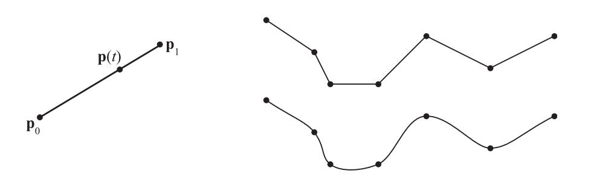

如果我们只需要在两个点之间进行插值，那么线性插值可能就足够了，但是如果路径上存在更多的点，那么线性插值通常就不太行了。例如：在对多个点进行线性插值的时候，会形成一条折线，在连接两个线段的点（也称为关节joint）上会出现突然变化，这通常是很难接受的，如图17.3的右侧所示。

为了解决这个问题，我们将线性插值的方法向前推进了一步，即进行多次线性插值。这样做我们就得到了Bezier曲线（读作贝塞尔）的几何结构。这里插播一个历史趣闻，Bezier曲线是由Paul de Casteljau和Pierre Bezier独立开发的，并应用于法国的汽车工业。这个曲线之所以被称为Bezier曲线，因为Bezier在de Casteljau之前就公开了他的研究工作，尽管de Casteljau在Bezier之前就已经写下了他的技术报告\[458]。

=\mathbf{f} 。")

首先，为了能够重复进行插值，我们必须添加更多的点。例如：可以使用三个点$\mathbf{a}$、$\mathbf{b}$、$\mathbf{c}$，它们被称为控制点（control point）。假设我们想找到点$\mathbf{p}(1/3)$，也就是$t = 1/3$时曲线上的点。我们使用$t = 1/3$，对$\mathbf{a} \& \mathbf{b}$和$\mathbf{b} \& \mathbf{c}$分别进行线性插值，并计算出两个新的顶点$\mathbf{d}$和$\mathbf{e}$，如图17.4所示。最后，我们再次使用$t = 1/3$，对点$\mathbf{d}$和点$\mathbf{e}$进行线性插值来计算点$\mathbf{f}$。这里我们定义$\mathbf{p}(t)=\mathbf{f}$，使用这种方法，我们可以得到以下数学关系：

$$
\begin{aligned} \mathbf{p}(t) & =(1-t) \mathbf{d}+t \mathbf{e} \\ & =(1-t)[(1-t) \mathbf{a}+t \mathbf{b}]+t[(1-t) \mathbf{b}+t \mathbf{c}] \\ & =(1-t)^{2} \mathbf{a}+2(1-t) t \mathbf{b}+t^{2} \mathbf{c},\end{aligned}
\tag{17.2} 
$$

这是一条抛物线，因为参数$t$的最大次数为2。事实上，给定$n + 1$个控制点，则曲线的自由度即为$n$。这意味着控制点的数量越多，曲线的自由度就越大。一次曲线是一条直线（称为linear），二次曲线被称为quadratic，三次曲线被称为cubic，四次曲线被称为quartic，等等。

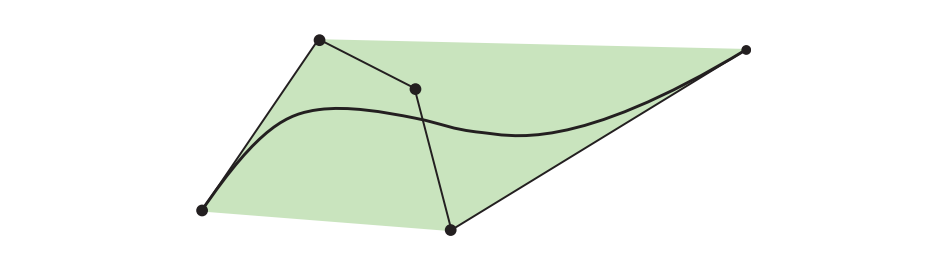

这种重复或者递归的线性插值，通常被称为de Casteljau算法\[458, 777]。图17.5中展示了使用5个控制点时的效果。为了进行一般化的表示，这里并没有使用点$\mathbf{a}-\mathbf{f}$，而是使用下面的表示法，即将第$i$个控制点记为$\mathbf{p}_i$，因此在图17.4的例子中，$\mathbf{p}_0 = \mathbf{a}$，$  \mathbf{p}_1 = \mathbf{b} $， $\mathbf{p}_2 = \mathbf{c}$。同时，在经过$k$次线性插值之后，可以得到中间控制点$\mathbf{p}_i^k$，因此在图17.4的例子中$\mathbf{p}_0^1 = \mathbf{d}$，$\mathbf{p}_1^1 = \mathbf{e}$，$\mathbf{p}_0^2 = \mathbf{f}$。

包含$n + 1$个控制点的Bezier曲线可以使用如下的递归公式进行描述，其中$\mathbf{p}_{i}^{0}=\mathbf{p}_{i}$为初始控制点：

$$
\mathbf{p}_{i}^{k}(t)=(1-t) \mathbf{p}_{i}^{k-1}(t)+t \mathbf{p}_{i+1}^{k-1}(t), \quad\left\{\begin{array}{l}k=1 \ldots n, \\ i=0 \ldots n-k\end{array}\right.
\tag{17.3} 
$$

请注意，该曲线上的一个点使用$\mathbf{p}(t)=\mathbf{p}_{0}^{n}(t)$来进行描述，这并不像它看起来那样复杂。再次思考一下，当我们从三个点$\mathbf{p}_0$, $\mathbf{p}_1$，$\mathbf{p}_2$来构造Bezier曲线时会发生什么，这三个点实际上就等价于$\mathbf{p}_0^0$，$\mathbf{p}_1^0$和$\mathbf{p}_2^0$。现在我们有3个控制点，这意味着$n = 2$。为了对公式简化表示，有时候我们会把“$(t)$”从“$\mathbf{p}$”中去掉。在第一步中$k = 1$，我们可以得到：

$$
\mathbf{p}_{0}^{1}=(1-t) \mathbf{p}_{0}+t \mathbf{p}_{1} \\ \mathbf{p}_{1}^{1}=(1-t) \mathbf{p}_{1}+t \mathbf{p}_{2}
$$

最后，当$k = 2$时，我们可以得到：

$$
\mathbf{p}_{0}^{2}=(1-t) \mathbf{p}_{0}^{1}+t \mathbf{p}_{1}^{1}
$$

这与直接求$\mathbf{p}(t)$的结果是相同。图17.6展示了它的运作原理。

![图17.6：这个图说明了Bezier曲线是如何使用重复线性插值来运行的。在这个例子中，展示了一个四次曲线的插值过程。四次曲线意味着存在5个控制点，即 \mathbf{p}\_{i}^{0} ，其中  i = 0, 1, 2, 3, 4 ，这5个控制点位于金字塔的最底部。这个图应当从下往上看，即点 \mathbf{p}\_{0}^{0} 的权重为 1 - t ，点 \mathbf{p}\_{1}^{0} 的权重为 t ，两个点之间进行线性插值，从而形成点 \mathbf{p}\_{0}^{1} 。这个过程会不断重复，直到形成最顶部的点 \mathbf{p}(t) 。 \[551\]](images/Chapter-17/202309082036130.png "图17.6：这个图说明了Bezier曲线是如何使用重复线性插值来运行的。在这个例子中，展示了一个四次曲线的插值过程。四次曲线意味着存在5个控制点，即 \mathbf{p}_{i}^{0} ，其中  i = 0, 1, 2, 3, 4 ，这5个控制点位于金字塔的最底部。这个图应当从下往上看，即点 \mathbf{p}_{0}^{0} 的权重为 1 - t ，点 \mathbf{p}_{1}^{0} 的权重为 t ，两个点之间进行线性插值，从而形成点 \mathbf{p}_{0}^{1} 。这个过程会不断重复，直到形成最顶部的点 \mathbf{p}(t) 。 \[551]")

现在我们已经掌握了Bezier曲线是如何运行的基础知识，现在我们可以看看对Bezier曲线更加数学的描述。

#### **使用Bernstein****多项式****的**Bezier**曲线**

如方程17.2所示，二次Bezier曲线可以使用一个代数公式来进行描述。事实证明，每条Bezier曲线都可以使用这样一个代数公式来进行描述，这意味着我们不需要真的执行这个重复插值的过程。方程17.4中展示了这个公式，它可以产生与方程17.3相同的曲线。Bezier曲线的这种描述方法，被称为Bernstein形式：

$$
\mathbf{p}(t)=\sum_{i=0}^{n} B_{i}^{n}(t) \mathbf{p}_{i}
\tag{17.4} 
$$

方程17.4中包含了一个Bernstein多项式，它有时也被称为Bezier基函数，这个多项式的数学形式如下：

$$
B_{i}^{n}(t)=\left(\begin{array}{c}n \\ i\end{array}\right) t^{i}(1-t)^{n-i}=\frac{n !}{i !(n-i) !} t^{i}(1-t)^{n-i}
\tag{17.5} 
$$

方程17.5中的第一项$\left(\begin{array}{c}n \\ i\end{array}\right)$，被称为二项式系数（binomial coefficient），在第1章的方程1.6中进行了定义。Bernstein多项式的有如下两个基本性质：

$$
B_{i}^{n}(t) \in[0,1], \quad \text{when} \quad t \in[0,1], 
\\[2mm]
\quad \sum_{i=0}^{n} B_{i}^{n}(t)=1
\tag{17.6} 
$$

方程17.6中的第一个公式意味着，当$t$的范围为$[0,1]$时，Bernstein多项式的结果也在范围$[0,1]$内。第二个公式意味着，无论方程17.4中的Bezier曲线次数为多少，Bernstein多项式的求和结果均为1（如图17.7所示）。粗略地说，这个性质意味着最终的Bezier曲线，将保持“靠近”控制点$\mathbf{p}_i$。事实上，根据方程17.4和方程17.6，整个Bezier曲线都位于控制点所形成的凸包中（convex hull，详见在线网站的线性代数附录）。这个性质在计算曲线的包围面积或者包围体积时，是一个十分有用的属性。图17.5展示了这样的一个例子。

![图17.7：从左到右分别是 n = 1 ，  n = 2 ，  n = 3 时的Bernstein多项式。左侧是线性插值，中间是二次插值，右边是三次插值。这些是Bernstein形式的Bezier曲线中所使用的混合函数。因此，想要计算 t 值处的二次曲线值（中），只需在 x 轴上找到这个 t 值，然后进行垂直移动，依次与三条曲线相遇，这三个交点的 y 坐标就是这三个控制点所对应的权重。注意当 t \in \[0,1\] 时，才有 B\_{i}^{n}(t) \geq 0 ；同时，这些混合函数都具有对称性，即 B\_{i}^{n}(t)=B\_{n-i}^{n}(1-t) 。](images/Chapter-17/202309082116568.png "图17.7：从左到右分别是 n = 1 ，  n = 2 ，  n = 3 时的Bernstein多项式。左侧是线性插值，中间是二次插值，右边是三次插值。这些是Bernstein形式的Bezier曲线中所使用的混合函数。因此，想要计算 t 值处的二次曲线值（中），只需在 x 轴上找到这个 t 值，然后进行垂直移动，依次与三条曲线相遇，这三个交点的 y 坐标就是这三个控制点所对应的权重。注意当 t \in \[0,1] 时，才有 B_{i}^{n}(t) \geq 0 ；同时，这些混合函数都具有对称性，即 B_{i}^{n}(t)=B_{n-i}^{n}(1-t) 。")

图17.7中展示了$n = 1$、$n = 2$、$n = 3$时的Bernstein多项式。它们也称为混合函数（blending function）。当$n = 1$（线性插值）时，情况是显而易见的，它给出了$y = 1 - t$和$y = t$这两条直线。这意味着当参数$t = 0$时，$\mathbf{p}(0)=\mathbf{p}_{0}$；当参数$t$逐渐增加时，点$\mathbf{p}_{0}$的混合权重将会降低，而点$\mathbf{p}_{1}$的混合权重将会增加，并保持二者的权重之和为1。最后，当参数$t = 1$时，$\mathbf{p}(1)=\mathbf{p}_{1}$。一般来说，对于所有的Bezier曲线，$\mathbf{p}(0)=\mathbf{p}_{0}$和$\mathbf{p}(1)=\mathbf{p}_{n}$都是成立的，即端点也会被插值（即在曲线上）。同样，在$t = 0$时，Bezier曲线会与向量$\mathbf{p}_{1}-\mathbf{p}_{0}$相切；在$t = 1$时，Bezier曲线会与向量$\mathbf{p}_{n}-\mathbf{p}_{n-1}$相切。另一个十分有用的特性是，我们在对Bezier曲线进行旋转操作的时候，不需要先计算Bezier曲线上的点，然后再旋转曲线；而是先旋转形成Bezier曲线的控制点，然后再直接计算曲线上的点即可。曲线上的控制点通常要比生成的点少，因此先对控制点进行变换的效率会更高。

这里我们举一个例子，来了解Bernstein版本的Bezier曲线是如何运行的。这里我们假设$n = 2$，即一个二次Bezier曲线。此时方程17.4为：

$$
\begin{aligned} \mathbf{p}(t) & =B_{0}^{2} \mathbf{p}_{0}+B_{1}^{2} \mathbf{p}_{1}+B_{2}^{2} \mathbf{p}_{2} \\ & =\left(\begin{array}{l}2 \\ 0\end{array}\right) t^{0}(1-t)^{2} \mathbf{p}_{0}+\left(\begin{array}{l}2 \\ 1\end{array}\right) t^{1}(1-t)^{1} \mathbf{p}_{1}+\left(\begin{array}{l}2 \\ 2\end{array}\right) t^{2}(1-t)^{0} \mathbf{p}_{2} \\ & =(1-t)^{2} \mathbf{p}_{0}+2 t(1-t) \mathbf{p}_{1}+t^{2} \mathbf{p}_{2},\end{aligned}
\tag{17.7} 
$$

方程17.7和方程17.2实际上是一样的。请注意方程17.7中的混合函数$(1−t)^2$、$2t(1−t)$和$t^2$，它们实际上就是图17.7中间所展示的函数。以同样的方式，一个三次Bezier曲线被化简为：

$$
\mathbf{p}(t)=(1-t)^{3} \mathbf{p}_{0}+3 t(1-t)^{2} \mathbf{p}_{1}+3 t^{2}(1-t) \mathbf{p}_{2}+t^{3} \mathbf{p}_{3}
\tag{17.8} 
$$

方程17.8可以写成矩阵形式，有时对于数学化简十分有用：

$$
\mathbf{p}(t)=\left(\begin{array}{llll}1 & t & t^{2} & t^{3}\end{array}\right)\left(\begin{array}{rrrr}1 & 0 & 0 & 0 \\ -3 & 3 & 0 & 0 \\ 3 & -6 & 3 & 0 \\ -1 & 3 & -3 & 1\end{array}\right)\left(\begin{array}{l}\mathbf{p}_{0} \\ \mathbf{p}_{1} \\ \mathbf{p}_{2} \\ \mathbf{p}_{3}\end{array}\right)
\tag{17.9} 
$$

通过收集方程17.4中构成$t^k$的项，我们可以看出，每条Bezier曲线都可以写成如下的形式，它被称为幂形式（power form），其中$\mathbf{c}_{i}$是通过收集这些项而得到的点：

$$
\mathbf{p}(t)=\sum_{i=0}^{n} t^{i} \mathbf{c}_{i}
\tag{17.10} 
$$

为了得到Bezier曲线的导数，我们需要对方程17.4进行求导，这个求导过程是很简单的。对推导过程进行重新整理和化简之后，可以得到如下的结果\[458]：

$$
\frac{d}{d t} \mathbf{p}(t)=n \sum_{i=0}^{n-1} B_{i}^{n-1}(t)\left(\mathbf{p}_{i+1}-\mathbf{p}_{i}\right)
\tag{17.11} 
$$

实际上，这个导数同样也是一条Bezier曲线，但是要比原本的$\mathbf{p}(t)$低一阶。

Bezier曲线的一个潜在的缺点是，这条曲线并不会经过所有的控制点（除了两侧的端点之外）。另一个问题在于，随着控制点数量的增加，方程的次数也在增加，从而使得计算过程越来越昂贵。一个解决这个问题的方法是，在每对控制点之间使用一条简单的低阶曲线，并确保这种分段插值具有足够高的连续性，这是章节17.1.3到章节17.1.5的主题。

#### 有理Bezier曲线

虽然Bezier曲线对许多事情都十分有用，但是实际上Bezier曲线的自由度并不是很高，因为只有控制点的位置可以进行自由控制。而且，并不是所有的曲线都可以使用Bezier曲线来进行描述的。例如：一个圆形通常被认为是一个十分简单的形状，但是这个简单的圆形无法使用一条或者一组Bezier曲线来进行定义。另一种选择是有理Bezier曲线（rational Bezier curve），该类曲线的描述方程如下所示：

$$
\mathbf{p}(t)=\frac{\sum_{i=0}^{n} w_{i} B_{i}^{n}(t) \mathbf{p}_{i}}{\sum_{i=0}^{n} w_{i} B_{i}^{n}(t)}
\tag{17.12} 
$$

其中方程中的分母是Bernstein多项式的加权和，而分子则是标准的Bezier曲线（方程17.4）的加权版本。对于这种类型的曲线，用户可以使用权重$w_i$来添加额外的自由度。有关这些曲线的更多信息，详见Hoschek和Lasser所撰写的书\[777]，以及Farin所撰写的书\[458]。Farin还描述了如何使用三条有理Bezier曲线来描述一个圆。

### 17.1.2 GPU上的有界Bezier曲线

本小节将介绍一种在GPU上绘制Bezier曲线的方法\[1068, 1069]。具体来说，目标的目标是“有界Bezier曲线（bounded Bezier curve）”，其中这个Bezier曲线本身与首尾控制点之间的直线构成了一个封闭区域，这个区域会被填充。有一种十分简单的方法可以实现这一点，那就是使用一个专门的像素着色器来渲染一个三角形。

这里我们使用一个二次曲线（quadratic curve），即二次Bezier曲线，相应的控制点为$\mathbf{p}_0$, $\mathbf{p}_1$，$\mathbf{p}_2$。如果我们将这些顶点的纹理坐标设置为$t_0 =(0,0)$、$t_1 =(0.5, 0)$、$t_2 =(1,1)$，那么在渲染三角形$\Delta \mathbf{p}_{0} \mathbf{p}_{1} \mathbf{p}_{2}$的时候，这些纹理坐标会像往常一样进行插值。我们还会对三角形内的每个像素都计算下面这个标量函数，其中$u$和$v$是插值出的纹理坐标：

$$
f(u, v)=u^{2}-v
\tag{17.13} 
$$

然后像素着色器会根据函数$f(u, v)$的正负性，来判断像素位于曲线内部（$f(u, v)<0$），还是位于曲线外部（$f(u, v)>0$），如图17.8所示。当使用这个像素着色器来渲染一个透视投影的三角形时，同样我们会得到一个相应的投影Bezier曲线。Loop和Blinn对此给出了证明\[1068, 1069]。

 \ge 0 来丢弃曲线外部的像素，则可以获得右图浅蓝色区域的渲染结果。")

这种类型的技术可以用于渲染TrueType字体，如图17.9所示。Loop和Blinn还展示了如何渲染有理二次曲线和有理三次曲线，以及如何使用这种表示方法进行抗抗锯齿处理。由于文本渲染的重要性，因此这一领域的研究工作一直在继续，相关文本算法详见章节15.5。

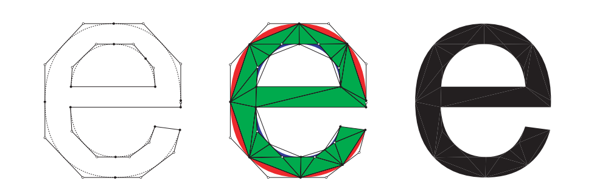

### 17.1.3 曲线的连续性与分段Bezier曲线

假设现在我们有两条三次Bezier曲线，三次Bezier曲线也就意味着每条曲线由四个控制点进行定义。其中第一条曲线由控制点$\mathbf{q}_i$进行定义，第二条曲线由控制点$\mathbf{r}_i$进行定义，其中$i = 0,1,2,3$。为了连接这两条曲线，我们可以设定$\mathbf{q}_{3}=\mathbf{r}_{0}$，这个点被叫做关节（joint）。然而如图17.10所示，使用这种简单的连接技术，关节处不可能变得很光滑。由若干条曲线片段（在这个例子中为两条）所组成的复合曲线被称为分段Bezier曲线（piecewise Bezier curve），在这里记为$\mathbf{p}(t)$。进一步地，假设我们希望$\mathbf{p}(0)=\mathbf{q}_{0}$，$\mathbf{p}(1)=\mathbf{q}_{3}=\mathbf{r}_{0}$，$\mathbf{p}(3)=\mathbf{r}_{3}$。因此，这个符合曲线到达点$\mathbf{q}_0$、$\mathbf{q}_{3}=\mathbf{r}_{0}$、$\mathbf{r}_3$的时间（参数）分别为$t_0 = 0.0$、$t_1 = 1.0$、$t_2 = 3.0$，如图17.10中的标记。

 ， (1.0,\mathbf{q}_3) ， (3.0,\mathbf{r}_3) 。对于 C^0 连续的情况，连接处会有一个突然的抖动（其中 \mathbf{q}_{3}=\mathbf{r}_{0} ）。对于 G^1 连续的情况，通过使得连接处的切线相互平行（且长度相等）来改善平滑性。然而，由于 3.0−1.0 \ne 1.0−0.0 ，因此仅仅是切线平行还无法提供 C^1 连续。我们可以在连接处观察到（第二行中间），样本点的密度突然增大。为了得到 C^1 连续，要使得连接处右侧两个控制点的差向量，其长度必须是左侧两个控制点差向量的两倍，即与参数差相对应。")

从上一小节中我们知道，一条Bezier曲线对于$t\in[0,1]$才有定义，因此对于控制点$\mathbf{q}_i$所定义的第一段曲线而言，这是符合要求的，因为$\mathbf{q}_0$处的时间为$0.0$，$\mathbf{q}_3$处的时间为$1.0$。但是当$1.0<t \le3.0$时会发生什么呢？答案很简单：我们必须使用第二段曲线，然后将第二段曲线的参数区间从$[t_1, t_2]$平移并缩放到$[0,1]$范围内。这可以通过使用下面的公式来完成：

$$
t^{\prime}=\frac{t-t_{1}}{t_{2}-t_{1}}
\tag{17.14} 
$$

因此，对于由控制点$\mathbf{r}_i$所定义的Bezier曲线，$t^{\prime}$才是真正的参数。使用这种方法，可以很容易地将好几个Bezier曲线拼接在一起。

现在我们构建的分段曲线在关节处的平滑性很差，一种连接曲线的更好方法基于了这样的一个事实：在Bezier曲线的第一个控制点处，曲线与直线$\mathbf{q}_{1}-\mathbf{q}_{0}$相切（章节17.1.1）；同样地，在最后一个控制点处，三次曲线会与$\mathbf{q}_{3}-\mathbf{q}_{2}$相切，这种特性可以在图17.5中看到。因此，为了使得两条曲线在连接处相切，第一条曲线的切线应当与第二条曲线的切线在该点处平行。更正式地说，应当遵循以下方程：

$$
\left(\mathbf{r}_{1}-\mathbf{r}_{0}\right)=c\left(\mathbf{q}_{3}-\mathbf{q}_{2}\right) \enspace \text{ for} \enspace c>0
\tag{17.15} 
$$

方程17.15意味着，关节处的入射切线$\mathbf{q}_{3}-\mathbf{q}_{2}$应当与出射切线$\mathbf{r}_{1}-\mathbf{r}_{0}$的方向相同。

在方程17.15中使用由方程17.16所定义的系数$c$，可以实现更好的连续性（$C^1$连续）\[458]。

$$
c=\frac{t_{2}-t_{1}}{t_{1}-t_{0}}
\tag{17.16} 
$$

图17.10中也展示了这一点。如果我们设$t_2 = 2.0$，那么有$c = 1.0$；也就是说，当两侧曲线段上的时间间隔相等时，那么入射切向量和出射切向量的长度也应当是相同的。但是，当$t_2 = 3.0$时，切向量的长度相等就不行了。虽然曲线看起来好像是一样的，但是$\mathbf{p}(t)$在复合曲线上的移动速度（采样点的密度）并不是平滑的。使用方程17.16中的常数c可以解决这个问题。

使用分段曲线的优点在于，可以使用一些低阶曲线进行表示，并且最终得到的曲线将会经过一组控制点。在上面的例子中，每个曲线段都是一个三次Bezier曲线。通常都会使用一个三次Bezier曲线，因为它是可以描述一个S形曲线的最低次曲线（被称为inflection）。最终得到的曲线$\mathbf{p}(t)$会经过点$\mathbf{q}_0$，$\mathbf{q}_{3}=\mathbf{r}_{0}$，$\mathbf{r}_3$。

这里我们将通过一个实际例子来介绍两种重要的连续性指标，下面是曲线连续性概念的一种稍微数学化的表述。对于曲线而言，我们通常会使用符号$C^n$来区分关节处不同类型的连续性。$C^n$意味着整个曲线上的前$n$阶导数都应当是连续且非零的。$C^0$连续意味着线段应当在同一点相连接，线性插值就可以满足这个条件了，本小节中所介绍的第一个例子就是这种情况。$C^1$连续意味着，如果我们在曲线上的任何一点（包括关节处）都进行一次求导操作，那么求导的结果（一阶导数）也应当是连续的。本小节中所介绍的第三个例子就是这样的，它使用了方程17.16来进行修正。

还有一个指标，记为$G^n$，这里我们以$G^1$连续（几何连续）为例。对于$G^1$连续的情况，在关节处相交的曲线段，两侧的切向量应当是平行的，并且方向相同，但是并没有对长度的要求。换句话说，$G^1$连续要比$C^1$连续更弱，$C^1$连续的曲线总是$G^1$连续的，除非两条曲线在连接点处的的速度（velocity ）趋近于0，并且在连接点之前还具有不同的切线。几何连续性的概念可以推广到更高的维度，图17.10中间的插图展示了$G^1$连续的情况 。

### **17.1.4 三次Hermite插值**

Bezier曲线很好地描述了光滑曲线构造背后的理论，但是有时候它的控制性无法很好地进行预测。在小本节中，我们将介绍三次Hermite插值，这样的曲线往往会更加容易控制。其原因在于，一条三次Bezier曲线是通过使用四个控制点来进行描述的，而三次Hermite曲线则使用了起点$\mathbf{p}_0$和终点$\mathbf{p}_1$，以及起点切线$\mathbf{m}_0$和终点切线$\mathbf{m}_1$来进行定义的。这里我们同样将Hermite插值记为$\mathbf{p}(t)$，其中$t\in[0,1]$，其数学定义如下：

$$
\mathbf{p}(t)=\left(2 t^{3}-3 t^{2}+1\right) \mathbf{p}_{0}+\left(t^{3}-2 t^{2}+t\right) \mathbf{m}_{0}+\left(t^{3}-t^{2}\right) \mathbf{m}_{1}+\left(-2 t^{3}+3 t^{2}\right) \mathbf{p}_{1}
\tag{17.17} 
$$

我们也将$\mathbf{p}(t)$称为一个Hermite曲线段或者一个三次样条段。这是一个三次插值，因为是方程17.17中混合函数的最高次数为$t^3$。这条曲线有以下性质：

$$
\mathbf{p}(0)=\mathbf{p}_{0}, \quad \mathbf{p}(1)=\mathbf{p}_{1}, \quad \frac{\partial \mathbf{p}}{\partial t}(0)=\mathbf{m}_{0}, \quad \frac{\partial \mathbf{p}}{\partial t}(1)=\mathbf{m}_{1}
\tag{17.18} 
$$

这意味着Hermite曲线在起点$\mathbf{p}_0$和终点$\mathbf{p}_1$之间进行了插值，并且这两点处的切线为$\mathbf{m}_0$和$\mathbf{m}_1$。图17.11中展示了由方程17.17得到的混合函数，这些混合函数也可以由方程17.4和方程17.18中推导出。

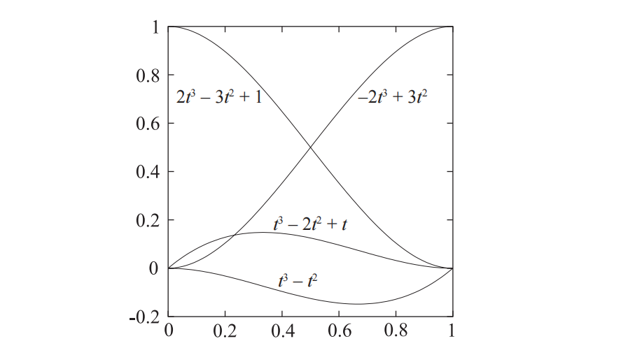

图17.12中展示了一些三次Hermite插值的例子，所有这些例子都对相同的起点和终点进行了插值，但是它们具有不同的切线。请注意图中切线的长度，不同长度的切线会给出不同的结果，更长的切线将会对整体形状产生更大的影响。

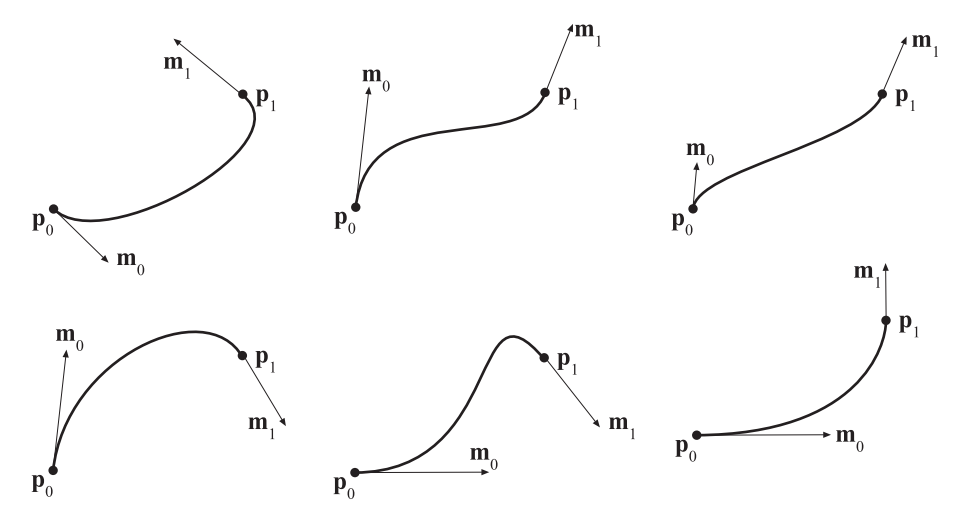

在Nalu的Demo中\[1274]，使用了三次Hermite插值来渲染毛发，详见图17.2。一个粗糙（coarse）控制的毛发会用于动画和碰撞检测，然后会计算切线，并对三次曲线进行细分和渲染。

### 17.1.5 Kochanek-Bartels曲线

当在多个点之间进行插值的时候，可以将若干条Hermite曲线连接起来。然而在我们这样做的时候，在选择共享切线上具有一定的自由度，选择不同的切线会提供不同的曲线外观。在这里，我们将介绍一种计算这种切线的方法，它被称为Kochanek-Bartels曲线。假设现在我们有$n$个点，即$\mathbf{p}_{0}, \ldots, \mathbf{p}_{n-1}$，则需要插值$n−1$个Hermite曲线段。这里我们假设在每个点上只会存在一条切线，现在我们可以观察一下这些“内部”切线，即$\mathbf{m}_{1}, \ldots, \mathbf{m}_{n-2}$。点$\mathbf{p}_{i}$处的切线可以使用两个弦（chord）的组合来进行计算\[917]：$\mathbf{p}_{i}-\mathbf{p}_{i-1}$和$\mathbf{p}_{i+1}-\mathbf{p}_{i}$，如图17.13左侧所示。

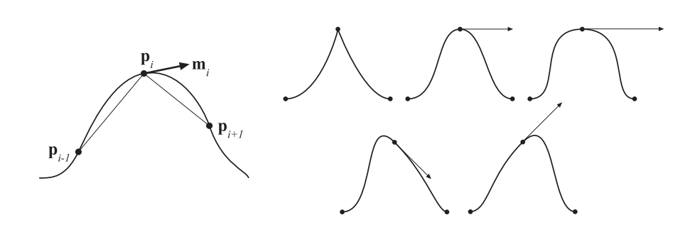

首先，我们引入一个张力（tension）参数$a$，来对切向量的长度进行修正。它控制了关节处曲线的尖锐程度。切线的计算方法为：

$$
\mathbf{m}_{i}=\frac{1-a}{2}\left(\left(\mathbf{p}_{i}-\mathbf{p}_{i-1}\right)+\left(\mathbf{p}_{i+1}-\mathbf{p}_{i}\right)\right)
\tag{17.19} 
$$

图17.13的右侧第一行，展示了不同的张力参数所带来的外观表现。这个张力参数的默认值是$a = 0$；更高的张力参数可以带来更加尖锐的弯曲（如果$a>1$，则会在关节处形成一个环），一个负值会使得关节附近的曲线不那么紧绷（taut）。其次，我们引入一个偏移（bias）参数$b$，它会影响切线的方向（同时间接影响切线的长度）。同时使用张力参数$a$和偏移参数$b$，我们可以得到新的法线：

$$
\mathbf{m}_{i}=\frac{(1-a)(1+b)}{2}\left(\mathbf{p}_{i}-\mathbf{p}_{i-1}\right)+\frac{(1-a)(1-b)}{2}\left(\mathbf{p}_{i+1}-\mathbf{p}_{i}\right)
\tag{17.20} 
$$

其中偏移参数的默认值是$b = 0$。一个正的偏移量会使得弯曲更倾向于弦$\mathbf{p}_{i}-\mathbf{p}_{i-1}$；一个负的偏移量会使得弯曲更倾向于弦$\mathbf{p}_{i+1}-\mathbf{p}_{i}$。如图17.13右侧第二行所示。用户可以自行设置张力参数和偏移参数，或者是让它们保持默认值，这通常会产生所谓的Catmull-Rom样条\[236]。曲线段的第一个点和最后一个点的切线，也可以使用这些公式进行计算，直接让其中一个弦的长度为0即可。

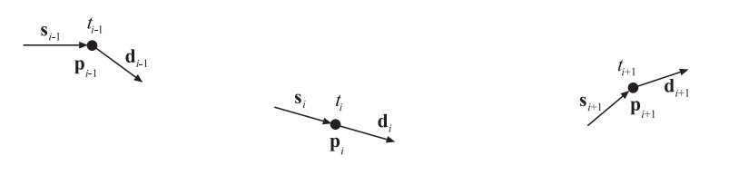

另外一个控制关节处行为的参数（$c$）可以被合并到切线方程中\[917]。然而，这需要在每个关节处引入两条切线，其中一条切线代表入射切线，记为$\mathbf{s}_{i}$（source）；另外一条切线代表出射切线，记为$\mathbf{d}_{i}$（destination），如图17.14所示。请注意，在$\mathbf{p}_{i}$和$\mathbf{p}_{i+1}$之间的曲线段上，使用了切线$\mathbf{d}_{i}$和$\mathbf{s}_{i+1}$。切线的计算方法如下，其中$c$是连续性（continuity）参数：

$$
\begin{aligned} \mathbf{s}_{i} & =\frac{1-c}{2}\left(\mathbf{p}_{i}-\mathbf{p}_{i-1}\right)+\frac{1+c}{2}\left(\mathbf{p}_{i+1}-\mathbf{p}_{i}\right), \\ \mathbf{d}_{i} & =\frac{1+c}{2}\left(\mathbf{p}_{i}-\mathbf{p}_{i-1}\right)+\frac{1-c}{2}\left(\mathbf{p}_{i+1}-\mathbf{p}_{i}\right) .\end{aligned}
\tag{17.21} 
$$

同样地，这个连续性参数的默认值为$c = 0$，即$\mathbf{s}_{i}=\mathbf{d}_{i}$。如果$c =−1$，我们会得到$\mathbf{s}_{i}=\mathbf{p}_{i}-\mathbf{p}_{i-1}$，$\mathbf{d}_{i}=\mathbf{p}_{i+1}-\mathbf{p}_{i}$，这会在关节处产生一个尖角，此时只满足$C^0$连续。不断增大$c$的值，会使得$\mathbf{s}_{i}$和$\mathbf{d}_{i}$越来越相似，当$c = 0$，有$\mathbf{s}_{i}=\mathbf{d}_{i}$。当$c = 1$时，我们会得到$\mathbf{s}_{i}=\mathbf{p}_{i+1}-\mathbf{p}_{i}$，$\mathbf{d}_{i}=\mathbf{p}_{i}-\mathbf{p}_{i-1}$。因此，这个连续性参数$c$可以给予用户更多的控制权，如果需要的话，使用这个参数可以在连接处获得一个尖角。

将张力参数、偏移参数和连续性参数组合在一起，其中默认的参数值为$a = b = c = 0$：

$$
\begin{aligned} \mathbf{s}_{i} & =\frac{(1-a)(1+b)(1-c)}{2}\left(\mathbf{p}_{i}-\mathbf{p}_{i-1}\right)+\frac{(1-a)(1-b)(1+c)}{2}\left(\mathbf{p}_{i+1}-\mathbf{p}_{i}\right), \\[2mm] \mathbf{d}_{i} & =\frac{(1-a)(1+b)(1+c)}{2}\left(\mathbf{p}_{i}-\mathbf{p}_{i-1}\right)+\frac{(1-a)(1-b)(1-c)}{2}\left(\mathbf{p}_{i+1}-\mathbf{p}_{i}\right)\end{aligned}
\tag{17.22} 
$$

只有当所有的曲线段都使用相同长度的时间间隔时，方程17.20和方程17.22才有效。考虑到不同曲线段的时间长度往往会不同，因此可能还需要对切线进行调整，类似于章节17.1.3中所做的那样。将调整后的切线记为$\mathbf{s}_{i}^{\prime}$和$\mathbf{d}_{i}^{\prime}$，其数学表达如下，其中$\Delta_{i}=t_{i+1}-t_{i}$：

$$
\mathbf{s}_{i}^{\prime}=\mathbf{s}_{i} \frac{2 \Delta_{i}}{\Delta_{i-1}+\Delta_{i}} \quad \text{and} \quad \mathbf{d}_{i}^{\prime}=\mathbf{d}_{i} \frac{2 \Delta_{i-1}}{\Delta_{i-1}+\Delta_{i}}
\tag{17.23} 
$$

### 17.1.6 B-样条

在这里，我们将对B样条（B-spline）的主题进行简要介绍，并特别关注三次均匀B样条。一般来说，B样条和Bezier曲线十分相似，B样条可以表示为一个$t$（使用移位基函数）、$\beta_{n}$（由控制点进行加权）和$c_k$的函数，例如：

$$
s_{n}(t)=\sum_{k} c_{k} \beta_{n}(t-k)
\tag{17.24} 
$$

在这种情况下，上述方程会构成一条曲线，其中参数$t$是$x$轴坐标，$s_{n}(t)$是$y$轴坐标，同时控制点只是均匀间隔的$y$值。想要了解更多内容，详见the Killer B \[111]、Farin \[458]、Hoschek和Lasser \[777]的文章。

在这里，我们将遵循Rujters等人\[1518]的介绍方式，并给出均匀三次B样条的特殊情况。这个三次基函数$\beta_{3}(t)$由三部分拼接而成：

$$
\beta_{3}(t)=\left\{\begin{array}{ll}0, & |t| \geq 2 
\\[2mm] \frac{1}{6}(2-|t|)^{3}, & 1 \leq|t|<2 
\\[2mm] \frac{2}{3}-\frac{1}{2}|t|^{2}(2-|t|), & |t|<1\end{array}\right.
\tag{17.25} 
$$

图17.15展示了这个基函数的构造方式。这个函数每一处都具有$C^2$连续性，这意味着如果将几个B样条曲线拼接在一起的话，那么所形成的复合曲线也将具有$C^2$连续性。一条三次曲线具有$C^2$连续性，而一条$n$次曲线一般可以具有$C^{n-1}$连续性。一般来说，可以按照如下方式来创建一组基函数。$\beta_{0}(t)$是一个“方形（box）”函数，即：如果$|t|<0.5$，则$\beta_{0}(t)=1$；如果$|t|=0.5$，则$\beta_{0}(t)=0.5$；对于剩余的$t$，有$\beta_{0}(t)=0$。下一个基函数$\beta_{1}(t)$是通过使用$\beta_{0}(t)$与$\beta_{0}(t)$进行卷积得到的，它是一个“帐篷（tent）”函数。同样地，之后的基函数$\beta_{2}(t)$是通过使用$\beta_{1}(t)$与$\beta_{0}(t)$进行卷积得到的，它是一个更加平滑的函数，也就是具有$C^1$连续性。重复这个过程还可以得到$C^2$连续性，以此类推。

![图17.15：左：基函数 \beta\_{3}(t) 是一条很粗的黑色曲线，它由两条分段三次函数所构成（红色和绿色）。当 |t| < 1 时使用绿色曲线，当 1≤|t| < 2 时使用红色曲线，其他地方的曲线均为零。右：使用四个控制点 c\_k （ k\in{i−1,i, i + 1, i + 2} ）来创建一段曲线，我们只会得到点 c\_i 与 c\_{i + 1} 之间的那一段曲线。将 \alpha 输入 w 函数来计算基函数，然后将这些值乘以相应的控制点，最后再将所有值加在一起，就可以得到曲线上的一个点。详见 图17.16 。 \[1518\]](images/Chapter-17/202309091407684.png "图17.15：左：基函数 \beta_{3}(t) 是一条很粗的黑色曲线，它由两条分段三次函数所构成（红色和绿色）。当 |t| < 1 时使用绿色曲线，当 1≤|t| < 2 时使用红色曲线，其他地方的曲线均为零。右：使用四个控制点 c_k （ k\in{i−1,i, i + 1, i + 2} ）来创建一段曲线，我们只会得到点 c_i 与 c_{i + 1} 之间的那一段曲线。将 \alpha 输入 w 函数来计算基函数，然后将这些值乘以相应的控制点，最后再将所有值加在一起，就可以得到曲线上的一个点。详见 图17.16 。 \[1518]")

曲线段的求值方法如图17.15右侧所示，其数学公式为：

$$
s_{3}(i+\alpha)=w_{0}(\alpha) c_{i-1}+w_{1}(\alpha) c_{i}+w_{2}(\alpha) c_{i+1}+w_{3}(\alpha) c_{i+2}
\tag{17.26} 
$$

请注意，方程17.26在任何时候都只会使用四个控制点，这意味着曲线具有局部支持性（local support），即只需要有限数量的控制点就可以定义一段曲线。方程17.26中的函数$w_k(\alpha)$是使用三次基函数$\beta_{}(t)$进行定义的：

$$
\begin{array}{ll}w_{0}(\alpha)=\beta_{3}(-\alpha-1), & w_{1}(\alpha)=\beta_{3}(-\alpha), \\[2mm] w_{2}(\alpha)=\beta_{3}(1-\alpha), & w_{3}(\alpha)=\beta_{3}(2-\alpha) .\end{array}
\tag{17.27} 
$$

Ruijters等人\[1518]表明，方程17.27可以重写为以下形式：

$$
\begin{array}{ll}w_{0}(\alpha)=\frac{1}{6}(1-\alpha)^{3}, & w_{1}(\alpha)=\frac{2}{3}-\frac{1}{2} \alpha^{2}(2-\alpha), \\[2mm] w_{2}(\alpha)=\frac{2}{3}-\frac{1}{2}(1-\alpha)^{2}(1+\alpha), & w_{3}(\alpha)=\frac{1}{6} \alpha^{3} .\end{array}
\tag{17.28} 
$$

在图17.16中，我们展示了将两条均匀三次B样条曲线拼接为一条曲线的结果。这样做的一个主要的优点在于，拼接后的曲线是连续的，它具有与基函数$\beta(t)$相同的连续性，在三次B样条的情况下为$C^2$连续性。从图中我们可以看到，我们无法保证曲线会通过每个控制点。请注意，我们还可以为$x$坐标创建一个B样条，这将会在平面上给出一条一般化曲线（而不仅仅是函数）。由此产生的二维点为$\left(s_{3}^{x}(i+\alpha), s_{3}^{y}(i+\alpha)\right)$，这实际上是对方程17.26的两次求值，一次使用$x$进行计算，一次使用$y$进行计算。

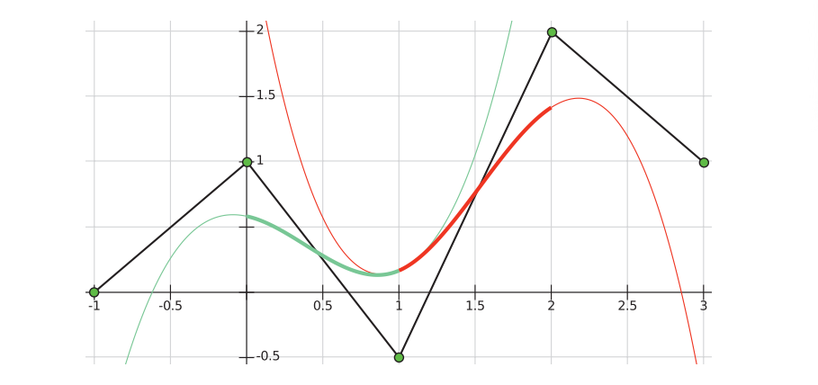

我们仅仅展示了如何使用均匀的B样条，如果控制点之间的间距是不均匀的，那么方程将会变得更加复杂，同时控制效果也会更加灵活\[111, 458, 777]。

## 17.2 参数化曲面

对参数化曲线的概念进行扩展，我们可以得到参数化曲面。打个比方，三角形和多边形是对线段的扩展，我们从一维的线进入到了二维的面。参数化表面可以用于对曲面物体进行建模，一个参数化表面是由少量控制点进行定义的。参数化表面的细分是一个在若干位置上计算表面表示的过程，并将它们连接起来形成三角形，从而对真实表面进行近似。这样做是因为图形硬件可以高效地渲染三角形。在运行过程中，参数化表面可以被细分成任意数量的三角形；因此，参数化曲面非常适合在质量和性能之间进行权衡，因为更多的细分三角形需要更多的时间来进行渲染，但同时能够提供更好的着色效果和轮廓外观。参数化表面的另一个优点在于，这些用于定义表面的控制点可以被动画化，然后再对表面进行细分。与直接对一个巨大的三角形网格进行动画相比，后者的开销会更大。

本小节首先会介绍Bezier面片（Bezier patch），它是一个具有矩形定义域的曲面，它们同样也被称为张量积Bezier曲面（tensor-product Bezier surface）。然后我们会介绍具有三角形定义域的Bezier三角形（Bezier triangle），并在章节17.2.3中讨论其连续性。在章节17.2.4和章节17.2.5中，我们会介绍两种方法，来将输入的三角形替换为Bezier三角形。这两个技术分别被称为PN三角形和Phong曲面细分。最后，在章节17.2.6中介绍了B样条面片。

### 17.2.1 Bezier面片

我们在章节17.1.1中介绍了的Bezier曲线的概念，它只具有一个参数$t$，实际上我们可以将其扩展到使用两个参数，这样形成的就不再是一条曲线了，而是一个曲面。我们首先会将线性插值（linear interpolation）扩展为双线性插值（bilinear interpolation）。现在，我们不再使用两个点进行插值，而是使用四个点进行插值，分别将其称为点$\mathbf{a},\mathbf{b},\mathbf{c},\mathbf{d}$，如图17.17所示。

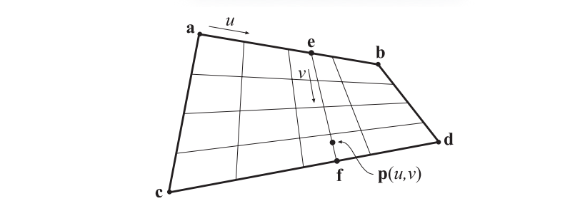

同时我们不再使用单个参数$t$，而是使用两个参数$(u, v)$。使用参数$u$对$\mathbf{a} \& \mathbf{b}$，$\mathbf{c} \& \mathbf{d}$分别进行线性插值，从而得到点$\mathbf{e}$和点$\mathbf{f}$：

$$
\mathbf{e}=(1-u) \mathbf{a}+u \mathbf{b}, \quad \mathbf{f}=(1-u) \mathbf{c}+u \mathbf{d}
\tag{17.29} 
$$

同理，再使用参数$v$对点$\mathbf{e}$和点$\mathbf{f}$在另一个方向上进行线性插值，这样就得到了一个双线性插值的结果：

$$
\begin{aligned} \mathbf{p}(u, v) & =(1-v) \mathbf{e}+v \mathbf{f} \\ & =(1-u)(1-v) \mathbf{a}+u(1-v) \mathbf{b}+(1-u) v \mathbf{c}+u v \mathbf{d} .\end{aligned}
\tag{17.30} 
$$

请注意，这与用于纹理映射的双线性插值（方程6.1）实际上是相同原理的。方程17.30描述了一个最简单的非平面参数化表面，使用不同的$(u, v)$参数值可以在表面上生成不同的点。其定义域（有效值集合）为$(u, v)\in[0,1]×[0,1]$，即参数$u$和$v$都位于$[0,1]$范围内。当区域为矩形时，这样得到的表面通常会称为面片（patch）。

为了从线性插值扩展到一条Bezier曲线，需要添加更多的控制点并进行重复线性插值，同样的策略可以用于生成面片。这里假设我们使用了9个点，这9个控制点排列在一个$3 × 3$的网格中，如图17.18所示，图中还进行了相应地标记。为了从这些控制点中构建一个双二次（biquadratic）Bezier 面片，我们首先需要进行四次双线性插值，从而创建出四个中间点，如图17.18所示。然后使用这四个中间点，再次进行双线性插值，从而得到最终的表面点。

=\mathbf{p}_{00}^{2} 。")

上面所描述的重复双线性插值，实际上是de Casteljau算法在面片上的扩展。这里我们需要对一些符号进行定义。表面的阶数（次数，自由度）为$n$，控制点为$\mathbf{p}_{i,j}$，其中$i,j \in[0 \ldots n]$。因此，$(n + 1)^2$个控制点可以构建出一个$n$次Bezier 面片。请注意，这些原始控制点的上标应该是$0$，即$\mathbf{p}_{i,j}^0$，但是它通常会被省略；有时候我们会直接使用$_{ij}$来表示下标，而不是使用$_{i,j}$，这样可以避免混淆。使用de Casteljau算法的Bezier 面片可以使用如下方程进行描述：

**de Casteljau \[面片]：**

$$
\begin{aligned} \mathbf{p}_{i, j}^{k}(u, v) & =(1-u)(1-v) \mathbf{p}_{i, j}^{k-1}+u(1-v) \mathbf{p}_{i, j+1}^{k-1}+(1-u) v \mathbf{p}_{i+1, j}^{k-1}+u v \mathbf{p}_{i+1, j+1}^{k-1} \\ k & =1 \ldots n, \quad i=0 \ldots n-k, \quad j=0 \ldots n-k\end{aligned}
\tag{17.31} 
$$

与Bezier曲线类似，Bezier 面片上$(u, v)$处的点为$\mathbf{p}_{i, j}^{n}(u, v)$。Bezier 面片也可以使用Bernstein多项式进行描述，这被称为Bernstein形式，如方程17.32所示：

**Bernstein \[面片]：**

$$
\begin{aligned} \mathbf{p}(u, v) & =\sum_{i=0}^{m} B_{i}^{m}(u) \sum_{j=0}^{n} B_{j}^{n}(v) \mathbf{p}_{i, j}=\sum_{i=0}^{m} \sum_{j=0}^{n} B_{i}^{m}(u) B_{j}^{n}(v) \mathbf{p}_{i, j}, \\ & =\sum_{i=0}^{m} \sum_{j=0}^{n}\left(\begin{array}{c}m \\ i\end{array}\right)\left(\begin{array}{c}n \\ j\end{array}\right) u^{i}(1-u)^{m-i} v^{j}(1-v)^{n-j} \mathbf{p}_{i, j} .\end{aligned}
\tag{17.32} 
$$

请注意，在方程17.32中，表面的自由度有两个参数$m$和$n$。这个“复合”自由度有时候会表示为$m × n$。在大多数情况下都会进行一些简化，即$m = n$。假设我们现在$m > n$，其结果相当于是先进行$n$次双线性插值，然后再进行$m - n$次线性插值，结果如图17.19所示。

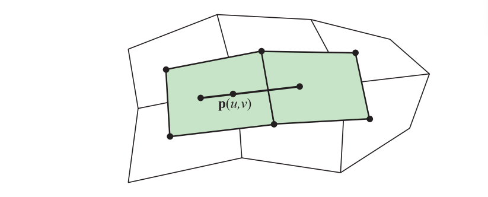

还可以对方程17.32进行改写，从而构建另一种理解方式：

$$
\mathbf{p}(u, v)=\sum_{i=0}^{m} B_{i}^{m}(u) \sum_{j=0}^{n} B_{j}^{n}(v) \mathbf{p}_{i, j}=\sum_{i=0}^{m} B_{i}^{m}(u) \mathbf{q}_{i}(v)
\tag{17.33} 
$$

其中：

$$
\mathbf{q}_{i}(v)=\sum_{j=0}^{n} B_{j}^{n}(v) \mathbf{p}_{i, j} ,\enspace i=0 \ldots m
$$

从这两个方程中我们可以看出，当我们固定一个$v$值不变时，这实际上就是一条Bezier曲线。我们假设$v = 0.35$，则可以从Bezier曲线中计算出点$\mathbf{q}_{i}(0.35)$，而方程17.33实际上就描述了当$v = 0.35$时，这个Bezier表面上的一条Bezier曲线。

接下来，我们将介绍Bezier面片的一些有用属性。通过将参数$(u, v) = (0,0)$，$  (u, v) = (0,1) $，$  (u, v) = (1,0) $， $(u, v) =(1,1)$带入到方程17.32中，可以很容易地证明Bezier 面片会穿过这些拐角处的控制点，即点$\mathbf{p}_{0,0}$，$\mathbf{p}_{0,n}$，$\mathbf{p}_{n,0}$和$\mathbf{p}_{n,n}$。此外，这个面片的每条边界都由对应边界控制点形成的$n$次Bezier曲线所定义。因此，这些拐角控制点处的切线，同样也由这些边界Bezier曲线所定义。每个拐角控制点都有两条切线，分别位于$u$方向上和$v$方向上。与Bezier曲线的情况一样，这个Bezier面片同样也位于其控制点所形成的凸包内部，并且：

$$
\sum_{i=0}^{m} \sum_{j=0}^{n} B_{i}^{m}(u) B_{j}^{n}(v)=1
\tag{17.34} 
$$

其中$(u, v)\in[0,1]×[0,1]$。最后，先对这些控制点进行旋转，然后再在面片上生成新的点；与先在面片上生成点，然后再对这些点进行旋转，二者在数学上是完全相同的，但是通常前者的操作会更快。

对方程17.32求偏导（偏微分，partially differentiate）\[458]，可以得到：

**Derivatives \[面片]：**

$$
\begin{array}{l}\frac{\partial \mathbf{p}(u, v)}{\partial u}=m \sum_{j=0}^{n} \sum_{i=0}^{m-1} B_{i}^{m-1}(u) B_{j}^{n}(v)\left[\mathbf{p}_{i+1, j}-\mathbf{p}_{i, j}\right] \\[2mm] \frac{\partial \mathbf{p}(u, v)}{\partial v}=n \sum_{i=0}^{m} \sum_{j=0}^{n-1} B_{i}^{m}(u) B_{j}^{n-1}(v)\left[\mathbf{p}_{i, j+1}-\mathbf{p}_{i, j}\right] .\end{array}
\tag{17.35} 
$$

从方程17.35中可以看出，面片的自由度在被微分的方向上减少了1。根据方程17.35计算表面的偏导数，可以计算得到非归一化的表面法线：

$$
\mathbf{n}(u, v)=\frac{\partial \mathbf{p}(u, v)}{\partial u} \times \frac{\partial \mathbf{p}(u, v)}{\partial v}
\tag{17.36} 
$$

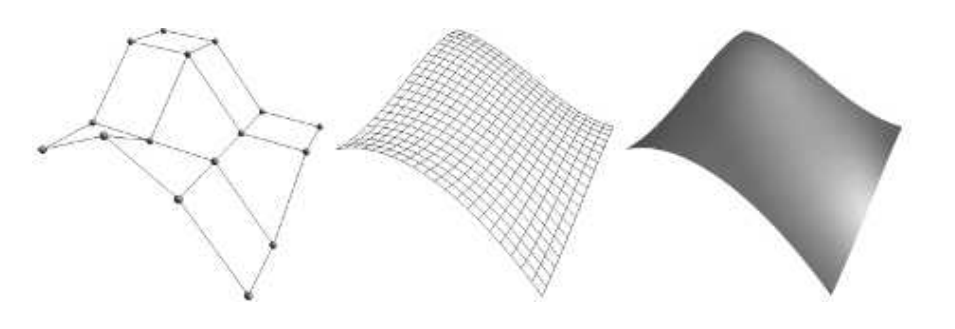

图17.20展示了实际的Bezier 面片与相应的控制网格。图17.21展示了移动控制点所产生的效果。

#### 有理Bezier面片

一条Bezier曲线可以被扩展为一条有理Bezier曲线（章节17.1.1），从而引入更多的自由度。同理，一个Bezier面片也可以被扩展为一个有理Bezier面片：

$$
\mathbf{p}(u, v)=\frac{\sum_{i=0}^{m} \sum_{j=0}^{n} w_{i, j} B_{i}^{m}(u) B_{j}^{n}(v) \mathbf{p}_{i, j}}{\sum_{i=0}^{m} \sum_{j=0}^{n} w_{i, j} B_{i}^{m}(u) B_{j}^{n}(v)}
\tag{17.37} 
$$

有关这种类型面片的更多信息，请参阅Farin的书籍\[458]，以及Hochek和Lasser的书籍\[777]。类似地，有理Bezier三角形是对Bezier三角形的扩展，我们将在下一小节中进行讨论。

### 17.2.2 Bezier三角形

虽然通常三角形会被认为是比矩形更加简单的几何图元，但是当涉及到Bezier曲面的时候，情况却并非如此：Bezier三角形并不像Bezier面片那么简单。但是这种类型的面片仍然是值得进行研究和表示的，因为它可以用于形成PN三角形和Phong曲面细分，这是两种快速且简单的算法。请注意，一些常见游戏引擎，例如虚幻引擎、Unity引擎和Lumberyard引擎，都支持Phong曲面细分和PN三角形。

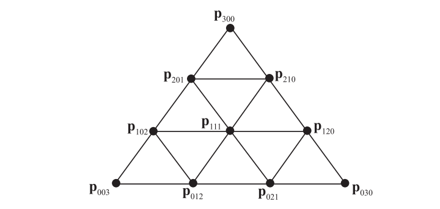

如图17.22所示，Bezier三角形的控制点位于一个三角形网格内部。Bezier三角形的自由度为$n$，这意味着每条边上都有$n + 1$个控制点。我们将这些控制点记为$\mathbf{p}_{i, j, k}^{0}$，有时也简写为$\mathbf{p}_{ijk}$。请注意，$i + j + k = n$，并且所有控制点的下标都要满足$i, j, k\ge0$。因此，控制点的总数为:

$$
\sum_{x=1}^{n+1} x=\frac{(n+1)(n+2)}{2}
\tag{17.38} 
$$

毫无疑问，Bezier三角形也是基于重复插值的。然而，由于其定义域的形状是一个三角形，这里必须使用重心坐标（章节22.8）来进行插值。回想一下，现在有一个位于三角形$\Delta \mathbf{p}_{0} \mathbf{p}_{1} \mathbf{p}_{2}$内部的一个点，它可以表示为：

$$
\begin{aligned}{}
\mathbf{p}(u, v)
&=\mathbf{p}_{0}+u\left(\mathbf{p}_{1}-\mathbf{p}_{0}\right)+v\left(\mathbf{p}_{2}-\mathbf{p}_{0}\right)\\[1mm]
&= (1-u-v)\mathbf{p}_{0} + u\mathbf{p}_{1}+v\mathbf{p}_{2}

\end{aligned}{} 
$$

其中$(u, v)$就是重心坐标。对于三角形内的点，必须保证：

$$
u \ge 0,v \ge0 \\[1mm]
1-(u+v) \geq 0 \Leftrightarrow u+v \leq 1
$$

在此基础上，Bezier三角形的de Casteljau算法为：

**de Casteljau \[三角形]：**

$$
\begin{aligned} \mathbf{p}_{i, j, k}^{l}(u, v) & =u \mathbf{p}_{i+1, j, k}^{l-1}+v \mathbf{p}_{i, j+1, k}^{l-1}+(1-u-v) \mathbf{p}_{i, j, k+1}^{l-1}, \\ l & =1 \ldots n, \quad i+j+k=n-l .\end{aligned}
\tag{17.39} 
$$

Bezier三角形在$(u, v)$处的最终点为$\mathbf{p}_{000}^{n}(u, v)$。Bernstein形式的Bezier三角形为：

**Bernstein \[三角形]：**

$$
\mathbf{p}(u, v)=\sum_{i+j+k=n} B_{i j k}^{n}(u, v) \mathbf{p}_{i j k}
\tag{17.40} 
$$

现在Bernstein多项式的计算依赖于两个参数$u$和$v$，因此计算方式有所不同，如下所示：

$$
B_{i j k}^{n}(u, v)=\frac{n !}{i ! j ! k !} u^{i} v^{j}(1-u-v)^{k}, \quad i+j+k=n
\tag{17.41} 
$$

Bernstein形式的Bezier三角形的偏导数为\[475]：

**Derivatives \[三角形]：**

$$
\begin{array}{l}\frac{\partial \mathbf{p}(u, v)}{\partial u}=\sum_{i+j+k=n-1} n B_{i j k}^{n-1}(u, v)\left(\mathbf{p}_{i+1, j, k}-\mathbf{p}_{i, j, k+1}\right), \\[2mm] \frac{\partial \mathbf{p}(u, v)}{\partial v}=\sum_{i+j+k=n-1} n B_{i j k}^{n-1}(u, v)\left(\mathbf{p}_{i, j+1, k}-\mathbf{p}_{i, j, k+1}\right) .\end{array}
\tag{17.42} 
$$

与Bezier面片一样，Bezier三角形同样具有一些类似的特性，这并不令人惊讶，例如：Bezier三角形会穿过三个拐角控制点；并且每条边界都是一条Bezier曲线，并由该边界上的控制点所定义；同时，该Bezier三角形位于控制点形成的凸包内部。图17.23展示了一个Bezier三角形。

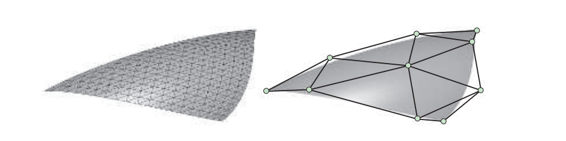

### 17.2.3 连续性

当使用Bezier曲面来构建一个复杂物体时，人们通常都想要将几个不同的Bezier曲面拼接在一起，从而形成一个复合表面。为了得到一个好看（平滑过度）的结果，我们必须要确保表面上能够获得合理的连续性。这一点与章节17.1.3中的曲线是一样的。

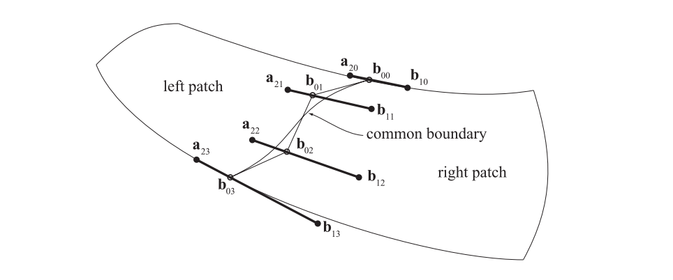

假设我们想要将两个双立方（bicubic）Bezier面片应该拼接在一起。其中每个Bezier面片都有$4 × 4$个的控制点。如图17.24所示，其中左侧面片具有控制点$\mathbf{a}_{ij}$，右侧具有控制点$\mathbf{b}_{ij}$，其中$0\le i, j\le3$。首先为了保证$C^0$连续性，每个面片在边界上必须共享相同的控制点，也就是说，两侧面片对应的控制点需要重合，即$\mathbf{a}_{3 j}=\mathbf{b}_{0 j}$。

然而，仅仅保证$C^0$的连续性，这还不足以获得一个好看的复合表面。这里我们将介绍一种简单的技术，它可以保证$C^1$的连续性\[458]。为了实现这一点，我们必须对靠近共享边界的两行控制点的位置进行约束。这两行控制点分别是$\mathbf{a}_{2j}$和$\mathbf{b}_{1j}$，对于$j\in[0,3]$，点$\mathbf{a}_{2j}$、点$\mathbf{b}_{0 j}$、点$\mathbf{b}_{1j}$必须要保持共线，也就是说它们会位于同一条直线上。并且，它们之间的长度比值也必须相同，即$\left\|\mathbf{a}_{2 j}-\mathbf{b}_{0 j}\right\|=k\left\|\mathbf{b}_{0 j}-\mathbf{b}_{1 j}\right\|$。这里的比例系数$k$是一个常数，对所有$j$都必须相等。如图17.24和图17.25所示。

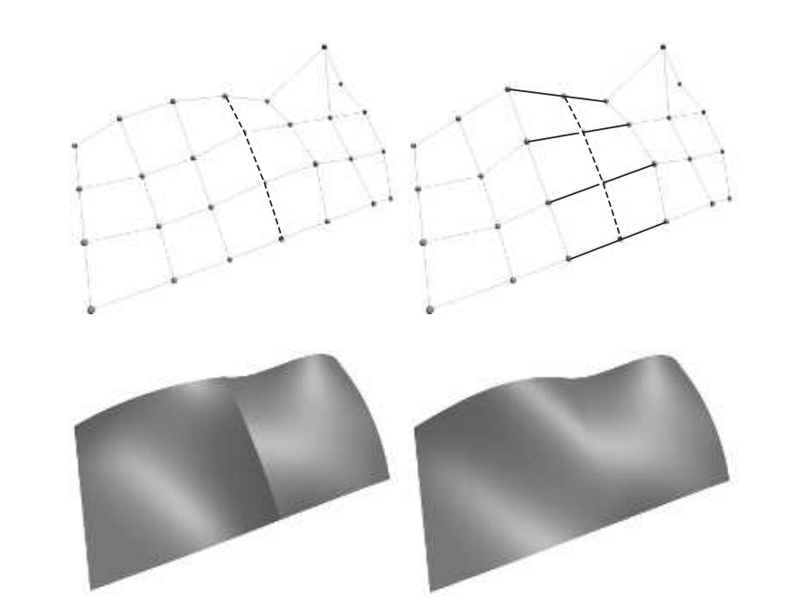

这种构造方式消耗了许多设置控制点的自由度，当我们将四个面片（共用一个拐角点）拼接在一起时，可以更加清楚地看到这一点。图17.26展示了这个构造过程，图的右侧展示了构造的结果，并展示了共享控制点（公共拐角点）周围的8个控制点位置。这9个点必须位于在同一个平面上，并且这9个点本身还必须能够形成一个双线性面片，如图17.17所示。如果想要让这个拐角点满足$G^1$连续性（只在这个拐角点处满足），则令这个9个控制点共面即可。这样不会损失那么多的自由度。

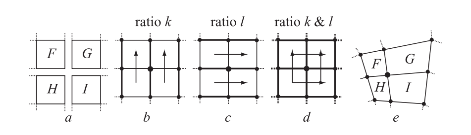

Bezier三角形的连续性通常要更加复杂，Bezier面片和Bezier三角形的$G^1$连续性也十分复杂\[458, 777]。当构造一个具有许多Bezier曲面的复杂对象时，通常很难保证它在所有边界上都获得合理的连续性。为了解决这个问题，一种方法是转向使用细分曲面，我们将在章节17.5中进行讨论。

请注意，想要获得一个良好的跨边界纹理外观，$C^1$连续是必需的。对于反射和着色而言，在$G^1$连续的条件下就能够获得较为合理的结果。如果满足$C^1$或者更高的连续性，则可以获得更好的结果。图17.25展示了这样的一个例子。

在接下来的两个小节中，我们将会介绍两种方法，它们利用三角形的顶点法线，来将每个输入的三角形（平面）转换为一个Bezier三角形。

### 17.2.4 PN三角形

给定一个具有逐顶点法线的三角形网格，Vlachos等人\[1819]提出了一个叫做PN三角形的方案，其目标是构建一个比仅仅使用三角形更加美观的表面。其中的字母“PN”是“Point and Normal”的缩写，因为这是生成曲面所需要使用到的关键数据是顶点位置和顶点法线，它们有时也称为N-面片（N-patch）。这个方案试图通过为每个三角形都创建一个替代曲面，从而来改善三角形网格的着色效果和轮廓外观。相关的曲面细分硬件能够动态地生成每个表面，因为曲面细分是根据每个三角形的顶点和法线生成的，并不需要相邻图元的信息，图17.27展示了这样的一个例子。本文所介绍的算法基于van Overveld和Wyvill的工作\[1341]。

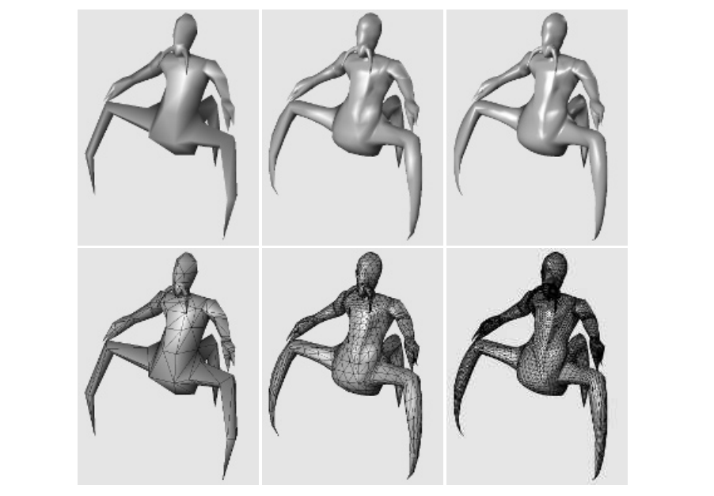

假设现在我们有一个三角形，三个顶点分别是$\mathbf{p}_{300}$，$\mathbf{p}_{030}$，$\mathbf{p}_{003}$，对应的三条法线分别是$\mathbf{n}_{200}$，$\mathbf{n}_{020}$，$\mathbf{n}_{002}$。最基本思想是使用这些信息，为每个原始三角形都创建一个三次Bezier三角形，并根据这个Bezier三角形，从中生成任意数量的三角形。

为了简化表示，我们设$w = 1−u−v$。一个三次Bezier三角形的定义如下：

$$
\begin{aligned} \mathbf{p}(u, v)= & \sum_{i+j+k=3} B_{i j k}^{3}(u, v) \mathbf{p}_{i j k} \\[2mm] = & u^{3} \mathbf{p}_{300}+v^{3} \mathbf{p}_{030}+w^{3} \mathbf{p}_{003}+3 u^{2} v \mathbf{p}_{210}+3 u^{2} w \mathbf{p}_{201} \\[2mm] & +3 u v^{2} \mathbf{p}_{120}+3 v^{2} w \mathbf{p}_{021}+3 v w^{2} \mathbf{p}_{012}+3 u w^{2} \mathbf{p}_{102}+6 u v w \mathbf{p}_{111} .\end{aligned}
\tag{17.43} 
$$

如图17.22所示。为了确保两个PN三角形边界处的$C^0$连续性，可以根据角控制点和角法线来确定边界上的控制点。（假设相邻三角形之间共享法线）。

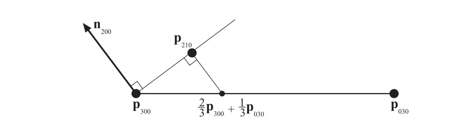

假设我们想要使用控制点$\mathbf{p}_{300}$，$\mathbf{p}_{030}$以及点$\mathbf{p}_{300}$处的法线$\mathbf{n}_{200}$，来计算边界控制点$\mathbf{p}_{210}$，如图17.28所示。简单地取点$\frac{2}{3} \mathbf{p}_{300}+\frac{1}{3} \mathbf{p}_{030}$，并将其投影到由点$\mathbf{p}_{300}$和法线$\mathbf{n}_{200}$所定义的切平面上\[457, 458, 1819]。假设这里采用都是归一化法线，那么点$\mathbf{p}_{210}$的计算结果为：

$$
\mathbf{p}_{210}=\frac{1}{3}\left(2 \mathbf{p}_{300}+\mathbf{p}_{030}-\left(\mathbf{n}_{200} \cdot\left(\mathbf{p}_{030}-\mathbf{p}_{300}\right)\right) \mathbf{n}_{200}\right)
\tag{17.44} 
$$

其他的边界控制点都可以按照类似方法来进行计算。下面我们还需要计算内部的控制点$\mathbf{p}_{111}$，它可以使用下面的方程进行计算，它遵循一个二次多项式\[457, 458]：

$$
\mathbf{p}_{111}=\frac{1}{4}\left(\mathbf{p}_{210}+\mathbf{p}_{120}+\mathbf{p}_{102}+\mathbf{p}_{201}+\mathbf{p}_{021}+\mathbf{p}_{012}\right)-\frac{1}{6}\left(\mathbf{p}_{300}+\mathbf{p}_{030}+\mathbf{p}_{003}\right).
\tag{17.45} 
$$

我们可以通过方程17.42来计算表面上的两条切线，并根据切线计算表面法线。但是Vlachos等人\[1819]没有这样做，而是选择对已有法线进行二次插值，如下所示：

$$
\begin{aligned} \mathbf{n}(u, v) & =\sum_{i+j+k=2} B_{i j k}^{2}(u, v) \mathbf{n}_{i j k} \\ & =u^{2} \mathbf{n}_{200}+v^{2} \mathbf{n}_{020}+w^{2} \mathbf{n}_{002}+2\left(u v \mathbf{n}_{110}+u w \mathbf{n}_{101}+v w \mathbf{n}_{011}\right) .\end{aligned}
\tag{17.46} 
$$

这可以被认为是一个二阶Bezier三角形，其中6个控制点就是6个不同的法线。在方程17.46中，所使用的次数是二次，这是很自然的，因为导数的次数要比实际的Bezier三角形低一次；同时简单的线性插值无法描述一个弯曲变化的法线，如图17.29所示。

![图17.29：这幅图说明了为什么需要对法线进行二次插值，以及为什么仅仅使用线性插值是不够的。左边一列展示了使用线性插值的情况。当被插值的法线描述一个凸表面时（左上），线性插值表现良好；但是当表面出现一个弯曲变化时（左下），线性插值就失效了。右边一列展示了二次插值的情况。 \[1342\]](images/Chapter-17/202309100948109.png "图17.29：这幅图说明了为什么需要对法线进行二次插值，以及为什么仅仅使用线性插值是不够的。左边一列展示了使用线性插值的情况。当被插值的法线描述一个凸表面时（左上），线性插值表现良好；但是当表面出现一个弯曲变化时（左下），线性插值就失效了。右边一列展示了二次插值的情况。 \[1342]")

为了能够使用方程17.46，我们还需要计算法线控制点$\mathbf{n}_{110}$、$\mathbf{n}_{101}$和$\mathbf{n}_{011}$。一种直观但有缺陷的解决方案是，直接使用$\mathbf{n}_{200}$和$\mathbf{n}_{020}$（原始三角形顶点的法线）的平均值来计算$\mathbf{n}_{110}$。然而，当$ \mathbf{n}_{200} =\mathbf{n}_{020}  $的时候，就会遇到图17.29左下角所示的问题。正确的构造方法是，先获取法线$\mathbf{n}_{200}$和$\mathbf{n}_{020}$的平均值，然后在平面$\pi$上反射这个法线，如图17.30所示。平面$\pi$的法线与控制点$\mathbf{p}_{300}$和$\mathbf{p}_{030}$之间的差向量平行。由于这个法线只会在平面$\pi$上被反射，也就是说，法线与平面上的位置无关，因此我们可以假设这个平面穿过原点。另外请注意，每个法线都应当被归一化。使用数学方程进行描述，法线$\mathbf{n}_{110}$的非归一化版本可以表示为\[1819]：

$$
\mathbf{n}_{110}^{\prime}=\mathbf{n}_{200}+\mathbf{n}_{020}-2 \frac{\left(\mathbf{p}_{030}-\mathbf{p}_{300}\right) \cdot\left(\mathbf{n}_{200}+\mathbf{n}_{020}\right)}{\left(\mathbf{p}_{030}-\mathbf{p}_{300}\right) \cdot\left(\mathbf{p}_{030}-\mathbf{p}_{300}\right)}\left(\mathbf{p}_{030}-\mathbf{p}_{300}\right)
\tag{17.47} 
 
$$

最初，van Overveld和Wyvill使用系数$3/2$来代替方程17.47中的$2$。从最终生成的图像上来看，很难判断到底使用哪个值比较好，但是使用系数2符合平面上的真实反射规律。

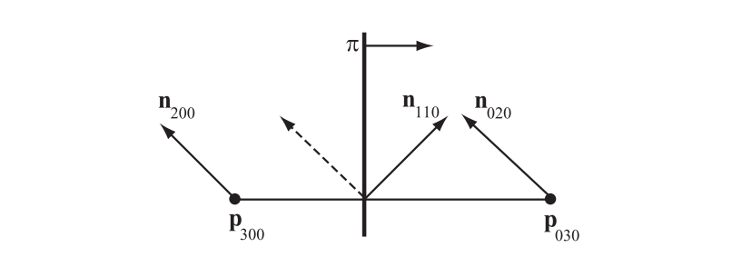

至此，这个三次Bezier三角形的所有Bezier控制点，以及二次插值的所有法线都已经计算完成了。只需要在这个Bezier三角形上创建三角形，让它们可以被渲染即可。这种方法的优点在于，表面能够以一个相对较低的成本，获得更好的轮廓和形状。

下面是一种指定细节级别的方法。可以将原始的三角形数据认为是LOD 0，随着三角形边界上新引入的顶点数量不断增加，LOD数也会相应增长。因此可以这样认为，LOD 1在三角形的每条边上引入了一个新顶点，从而在这个Bezier三角形上创建四个子三角形；而LOD 2则在每条边上引入两个新顶点，从而生成了九个子三角形。以此类推，LOD n便生成$(n + 1)^2$个子三角形。为了防止Bezier三角形之间出现裂缝，网格中的每个三角形都必须使用相同的LOD级别进行细分。实际上这是一个严重的缺点，因为那些很小的三角形也会像大三角形一样被细分。可以使用自适应曲面细分（章节17.6.2）和分数曲面细分（章节17.6.1）等技术来避免这些问题。

PN三角形的一个问题在于，难以控制折痕的生成，通常需要在折痕附近插入额外的三角形。虽然这些Bezier三角形之间的连续性只有$C^0$，但是在许多情况下，它们看起来都还可以接受。这主要是因为三角形之间的法线是连续的，因此这一组PN三角形模拟了一个$G^1$连续的表面。Boubekeur等人\[181]提出了一种更好的解决方案，即一个顶点可以同时拥有两条法线，两个这样的顶点相连接，便可以生成一条折痕边缘。需要注意的是，如果想要获得表现良好的纹理效果，则三角形（或者面片）之间的边界需要满足$C^1$连续性。同样值得了解的是，如果两个相邻的三角形之间不共享相同的法线，那么就会出现裂缝。Grun \[614]描述了一种方法，可以进一步提高PN三角形的连续性质量。Dyken等人\[401]提出了一种受到PN三角形启发的技术，在该技术中，只有被观察者所看到的轮廓（silhouette）才会被自适应细分，因此会变得更加弯曲，这些silhouette曲线的推导方法与PN三角形曲线相似。为了获得平滑的过渡效果，他们在粗糙轮廓和细分轮廓之间进行了混合。为了对连续性进行改善，Funzig等人\[505]提出了PNG1三角形，它是对PN三角形的改进，可以保证处处都满足$G^1$连续性。McDonald和Kilgard \[1164]提出了PN三角形的另一种扩展方法，它可以对相邻三角形上的不同法向量进行处理。

### 17.2.5  Phong曲面细分

Boubekeur和Alexa \[182]提出了一种叫做Phong曲面细分（Phong tessellation）的表面构造，它与PN三角形有许多相似之处，但是它的计算速度更快，实现更加简单。这里我们将基底三角形的顶点命名为$\mathbf{p}_0$，$\mathbf{p}_1$和$\mathbf{p}_2$，对应的归一化法线分别为$\mathbf{n}_0$，$\mathbf{n}_1$和$\mathbf{n}_2$。首先，回顾一下，三角形上的一个点，其重心坐标为$(u, v)$，那么它的实际坐标为：

$$
\mathbf{p}(u, v)=(u, v, 1-u-v) \cdot\left(\mathbf{p}_{0}, \mathbf{p}_{1}, \mathbf{p}_{2}\right)
\tag{17.48} 
$$

在Phong着色中，法线会在整个平面三角形上进行插值，同样是使用上方程17.48完成的，不同之处在于使用法线来代替了顶点。Phong曲面细分尝试使用重复插值，来创建一个Phong着色法线插值的几何版本，最终会生成一个Bezier三角形，图17.31展示了这个过程。

 只是 u 的函数，而不是 (u, v) 的函数，对于函数 \mathbf{t}_{i} 也是如此。 \mathbf{p}(u) 首先会被投影到两个切平面上，从而生成了点 \mathbf{t}_{0} 和点 \mathbf{t}_{1} 。然后再对点 \mathbf{t}_{0} 和点 \mathbf{t}_{1} 进行线性插值，从而生成 \mathbf{p}^{*}(u) 。最后，使用一个形状因子 \alpha ，来将基底三角形和 \mathbf{p}^{*}(u) 进行混合。在这个例子中，我们使用了 \alpha = 0.75 。")

第一步是创建一个函数，来将基底三角形上的点$\mathbf{q}$投影到一个切平面上，这个平面由一个顶点和一个法线所定义。这个函数的数学形式如下：

$$
\mathbf{t}_{i}(\mathbf{q})=\mathbf{q}-\left(\left(\mathbf{q}-\mathbf{p}_{i}\right) \cdot \mathbf{n}_{i}\right) \mathbf{n}_{i}
\tag{17.49} 
$$

这里我们不再使用三角形的顶点来执行线性插值（方程17.48），而是使用这个函数$\mathbf{t}_{i}$来完成线性插值，其结果为：

$$
\mathbf{p}^{*}(u, v)=(u, v, 1-u-v) \cdot\left(\mathbf{t}_{0}(u, v), \mathbf{t}_{1}(u, v), \mathbf{t}_{2}(u, v)\right)
\tag{17.50} 
$$

为了增加一些控制灵活性，因此在基底三角形和方程17.50之间添加了一个形状因子$\alpha$，从而得到 Phong曲面细分的最终公式：

$$
\mathbf{p}_{\alpha}^{*}(u, v)=(1-\alpha) \mathbf{p}(u, v)+\alpha \mathbf{p}^{*}(u, v)
\tag{17.51} 
$$

其中$\alpha = 0.75$是一个比较推荐的值\[182]。想要生成这样的一个表面，所需的唯一信息就是基底三角形的顶点和法线，以及用户提供的形状因子$\alpha$，这使得该表面的计算速度很快。最终得到的三角形路径是二次的，这个次数要低于PN三角形（三次）。其中三角形的表面法线是通过简单线性插值而生成的，就像是标准的Phong着色所做的那样。图17.32展示了 Phong曲面细分应用到网格上的效果。

### **17.2.6 B-样条曲面**

我们在章节17.1.6中简要介绍了B样条曲线，这里我们将同样对B样条曲面进行介绍。我们对方程17.24进行推广，可以得到B样条面片：

$$
\mathbf{s}_{n}(u, v)=\sum_{k} \sum_{l} \mathbf{c}_{k, l} \beta_{n}(u-k) \beta_{n}(v-l)
\tag{17.52} 
$$

方程17.52与Bezier 面片的方程17.32非常相似。请注意，$\mathbf{s}_{n}(u, v)$是表面上的一个三维顶点。如果将这个函数用于纹理过滤，那么方程17.52描述的就是一个高度场，即$ \mathbf{c}_{k, l}  $代表的是一维高度。

对于双三次B样条面片，方程17.25中的$\beta_{3}(t)$函数可以用于方程17.52中。即总共需要$4×4$个控制点$ \mathbf{c}_{k, l}  $，方程17.52所描述的面片实际上位于最内层的$2 × 2$控制点范围内，如图17.33所示。同时，双三次B样条面片对于Catmull-Clark细分曲面算法也是必不可少的（章节17.5.2）。关于B样条曲面，有很多非常好的参考书籍（详见书中连接）\[111, 458, 777]。

 的定义域如右侧所示，它是一个单位正方形，位于最内部控制点所构成的范围内。")

## 17.3 隐式表面

到目前为止，我们只讨论了参数化曲线和参数化曲面，而隐式表面（implicit surface）则是表示模型的另一个有效方法。隐式表面并不会使用一些参数（例如$u$和$v$）来显式地描述表面上的一个顶点，而是会使用以下形式的函数来进行描述，它被称为隐式函数（implicit function）：

$$
f(x, y, z)=f(\mathbf{p})=0
\tag{17.53} 
$$

对于隐式表面和隐式函数，可以这样进行理解：当我们将一个点$\mathbf{p}$代入到隐式函数$f$中时，如果函数值为零，则说明点$\mathbf{p}$位于这个隐式表面上。隐式表面通常会用于与射线的相交测试（章节22.6—章节22.9），因为它们要比相应的参数化表面（如果有的话）更加容易求交。隐式表面的另一个优点是，一些构造实体几何（constructive solid geometry）算法可以很容易地应用在隐式表面上，也就是说，物体之间可以相减或者相加，在逻辑上是$\text{AND:ed}$或者$\text{OR:ed}$。此外，隐式表面对象还可以很容易地进行混合和变形。

下面是一些常见的隐式表面，它们都位于原点处：

$$
\begin{array}{ll}f_{s}(\mathbf{p}, r)=\|\mathbf{p}\|-r, & \text { sphere; } \\[1mm] f_{x z}(\mathbf{p})=p_{y}, & \text { plane in } x z \\[1mm] f_{r b}(\mathbf{p}, \mathbf{d}, r)=\|\max (|\mathbf{p}|-\mathbf{d}, 0)\|-r, & \text { rounded box. }\end{array}
\tag{17.54} 
$$

这些方程看起来都很生硬，需要对其进行一些解释。其中球面（sphere）就是点$\mathbf{p}$到原点的距离，然后再减去半径。所以如果点$\mathbf{p}$位于半径为$r$的球面上，那么$f_{s}(\mathbf{p}, r)=0$；否则，将会返回一个带符号的距离值，负数代表点$\mathbf{p}$位于球体内部，正数代表点$\mathbf{p}$位于球体外部。因此，这些函数有时也会被称为符号距离函数（signed distance function，SDF）。平面$f_{x z}(\mathbf{p})$实际上就是点$\mathbf{p}$的$y$坐标，即$y$轴正半轴的那一侧。对于圆角方框（rounded box）的表达式，我们假设向量的绝对值（$|\mathbf{p}|$）和最大值是按照每个分量进行计算的。其中的$\mathbf{d}$是方框的半边向量，如图17.34所示，图中还对这个公式进行了文字说明。如果想要获得一个非圆角方框（non-rounded box），只需设置$r = 0$即可。

\\| ，其中点 \mathbf{p} 为待测点，向量 \mathbf{d} 的代表了box的半边长度。请注意，绝对值运算 |\mathbf{p}| 使得其余的计算都发生在右上角象限中（这里使用2D进行说明）。 |\mathbf{p}|-\mathbf{d} 意味着，如果点 \mathbf{p} 沿 x 轴方向上位于box内部，那么 \left|p_{x}\right|-d_{x} 将会是一个负值，其他轴向上也是如此。这里只有正值会被保留，而负值会被 \max() 限制为0。因此， \\|\max (|\mathbf{p}|-\mathbf{d}, 0)\\| 实际上计算了点 \mathbf{p} 到box边缘的最近距离，这意味着如果在计算 \max() 后有多个值为正数，那么box外的符号距离场将会变成圆角。右：一个非圆角方框减去 r ，可以得到一个圆角方框，即让这个box向所有方向上都扩展半径 r 的长度。")

隐式表面的法线由偏导数（partial derivative）进行描述，它被称为梯度（gradient），记为$\nabla f$：

$$
\nabla f(x, y, z)=\left(\frac{\partial f}{\partial x}, \frac{\partial f}{\partial y}, \frac{\partial f}{\partial z}\right)
\tag{17.55}  
$$

为了能够精确计算，方程17.55中的隐式函数$f$必须是可微的（differentiable），因此也是连续的（continuous）。在实践中，人们经常使用一种被称为中心差分（central difffference）的数值技术，它使用场景函数$f$进行采样\[495]：

$$
\nabla f_{x} \approx \frac{ f\left(\mathbf{p}+\epsilon \mathbf{e}_{x}\right)-f\left(\mathbf{p}-\epsilon \mathbf{e}_{x}\right)}{2\epsilon}
\tag{17.56} 
$$

同理，$\nabla f_{y}$与$\nabla f_{z}$也可以这样计算出来。回顾一下，方程17.56中的$\mathbf{e}_{x}=(1,0,0)$， $\mathbf{e}_{y}=(0,1,0)$，$\mathbf{e}_{z}=(0,0,1)$；而$\epsilon$则是一个很小的数。

想要使用方程17.54中的基本类型来构建出一个复杂场景，需要使用并集运算符$\cup$（union operator）。例如：隐式表面$f(\mathbf{p})=f_{s}(\mathbf{p}, 1) \cup f_{x z}(\mathbf{p})$，它代表了由一个球面和一个平面所组成的场景。并集运算符有两个操作数，它通过取其中较小那个来实现，因为我们想要找到最接近点$\mathbf{p}$的表面。如果想要对物体进行平移变换，可以在调用符号距离函数之前，先对点$\mathbf{p}$进行平移，例如$f_{s}(\mathbf{p}-\mathbf{t}, 1)$代表了一个被$\mathbf{t}$平移的球面。旋转变换和其他类型变换也可以使用相同的方式来实现，即先对点$\mathbf{p}$进行逆变换，再调用隐式函数。通过使用$\mathbf{r}=\bmod (\mathbf{p}, \mathbf{c})-0.5 \mathbf{c}$来代替点$\mathbf{p}$，将$\mathbf{r}$作为符号距离函数的参数，还可以在整个空间中不断重复这个物体。

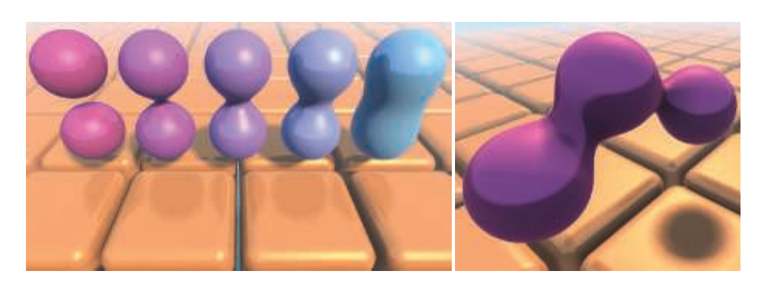

隐式表面的混合是一个很好的特性，可以被用于blobby建模\[161]、软体对象、或者元球（metaball）\[67, 558]，图17.35展示了这样的一些例子。其基本思想是使用几个简单的几何图元（例如球体、椭球体或者其他一些可用形状），并将它们进行平滑地混合。其中每个物体都可以被看作是一个原子（atom），混合之后可以得到包含原子的分子（molecule）。混合的方法有很多种，其中一种常用的方法\[1189, 1450]是对两个距离$d_1$和$d_2$进行混合，以及一个混合半径$r_b$：

$$
\begin{array}{l}h=\min \left(\max \left(0.5+0.5\left(d_{2}-d_{1}\right) / r_{b}, 0.0\right), 1.0\right), \\[1mm] d=(1-h) d_{2}+h d_{1}-r_{b} h(1-h),\end{array}
\tag{17.57} 
$$

方程17.57中的$d$为混合距离。虽然这个函数只能对两个物体之间的最短距离进行混合，但是可以重复使用这个函数，来混合更多的物体（如图17.35的右侧部分所示）。

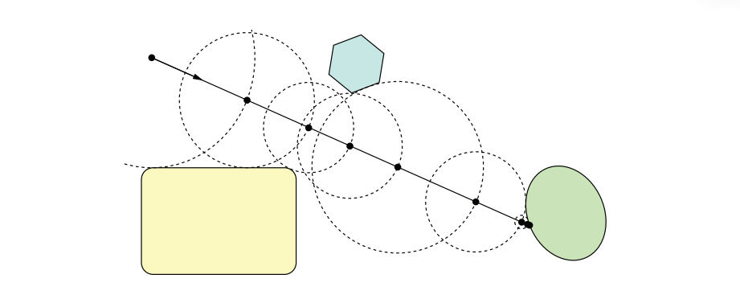

为了对一组隐式函数进行可视化，通常所使用的方法是光线步进\[673]。一旦我们可以对一个场景进行光线步进，之后也就能够生成阴影、反射、环境光遮蔽以及其他的一些效果。图17.36展示了在一个符号距离场（signed distance field）内的光线步进。在光线的第一个点$\mathbf{p}$处，我们计算点$\mathbf{p}$到场景的最短距离$d$。这个最短距离$d$，可以理解成在点$\mathbf{p}$处存在一个半径为$d$的球体，而在这个球体内部不存在其他任何物体。此时我们可以沿着射线方向向前步进$d$个单位，直到我们在某个设定的误差范围（$\epsilon$）内与表面相交；或者到达了预定义的最大步进次数，在这种情况下，我们可以认为光线击中了背景。图17.37展示了两个很好的例子。

每个隐式表面也可以转化为由三角形所组成的网格表面，有几种算法可以实现这一点\[67, 558]。章节13.10中所介绍的移动立方体（marching cube）算法就是一个著名的例子。使用Wyvill和Bloomenthal算法来执行多边形化的代码可以在网络上获取到\[171]；de Araujo等人\[67]对隐式表面多边形化的最新技术进行了调研。Tatarchuk和Shopf \[1744]描述了一种技术，他们称之为移动四面体（marching tetrahedra），在该技术中，可以使用GPU来在一个三维数据集合中找到等值面。图3.13展示了一个使用几何着色器来提取等值面的例子。Xiao等人\[1936]提出了一个流体模拟系统，在该系统中，GPU会对10w个粒子的位置进行计算，并使用这些粒子来渲染等值面，所有这些计算都是以交互式速率进行的。

## 17.4 细分曲线

细分技术（subdivision technique）可以用于创建光滑的曲线和表面。细分技术被应用于建模的其中一个原因是，它们在离散表面（三角形网格）和连续表面（例如一组Bezier面片）之间建立了联系，因此可以用于LOD技术（章节19.9）。在章节17.4和章节17.5中，我们将首先描述细分曲线（subdivision curve）的工作原理，然后再去讨论更加流行的细分表面（subdivision surface）。

想要对细分曲线进行一些解释，最好的一个例子就是切角（corner cutting），如图17.38所示。图中左侧多边形的角会被切掉，并创建了一个新的多边形，这个新多边形的顶点数是原始多边形的两倍。

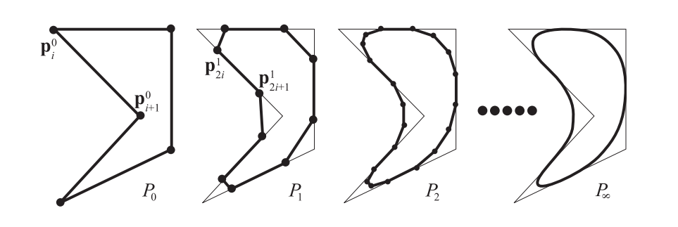

然后，这个新多边形的角会被再次切掉，生成一个新的多边形，以此类推，可以一直切下去（或者更加实际地说，直到我们看不到任何差异为止）。最终所得到的曲线被称为极限曲线（limit curve）或者临界曲线，这是一个十分光滑的曲线，因为所有尖锐的角都被切掉了。这个过程也可以被认为是一个低通滤波器（low-pass filter），因为所有的尖角（高频信号）都被去除了。这个过程通常被写做$P_{0} \rightarrow P_{1} \rightarrow P_{2} \cdots \rightarrow P_{\infty}$，其中$P_0$为初始多边形，也被称控制多边形（control polygon），最后的$P_{\infty}$为极限曲线。

这种细分过程可以使用很多种不同的方式来完成，每种方式都有一个独特的细分方案。图17.38所展示的方案称为Chaikin方案\[246]，其工作原理如下。假设多边形的$n$个初始顶点分别是$P_0=\left\{\mathbf{p}_{0}^{0}, \ldots, \mathbf{p}_{n-1}^{0}\right\}$，其中顶点的上标代表了其细分层次。Chaikin的方案会在原始多边形的每对顶点之间创建两个新的顶点，记作$\mathbf{p}_{i}^{k}$和$\mathbf{p}_{i+1}^{k}$，这个过程的数学表达如下：

$$
\mathbf{p}_{2 i}^{k+1}=\frac{3}{4} \mathbf{p}_{i}^{k}+\frac{1}{4} \mathbf{p}_{i+1}^{k} \quad and \quad \mathbf{p}_{2 i+1}^{k+1}=\frac{1}{4} \mathbf{p}_{i}^{k}+\frac{3}{4} \mathbf{p}_{i+1}^{k}
\tag{17.58} 
$$

可以看到，方程17.58中的上标从$k$变为$k+1$，这意味着我们从一个细分层级进入到了下一个细分层级，即$P_{k} \rightarrow P_{k+1}$。在一次细分完成之后，原始顶点会被丢弃，新的顶点会被重新连接。图17.38中展示了这种行为，在距离原始顶点$1/4$处创建了新的顶点。细分方案的美妙之处在于可以快速生成光滑的曲线，并且简单优雅。然而，我们并不会像章节17.1中那样，能够立即获得这条新曲线的参数化形式，虽然确实可以证明Chaikin算法生成了一个二次B样条\[111, 458, 777, 1847]。同时，到目前为止，我们所提出的方案也只能处理多边形（封闭），但是大多数方案也都可以进行一些扩展，从而可以对折线（开放）进行处理。对于Chaikin的方案，唯一的区别在于，折线的两个端点会每个细分步骤中保持不变（而不是被丢弃）。这使得最终生成的曲线会依次经过每个端点。

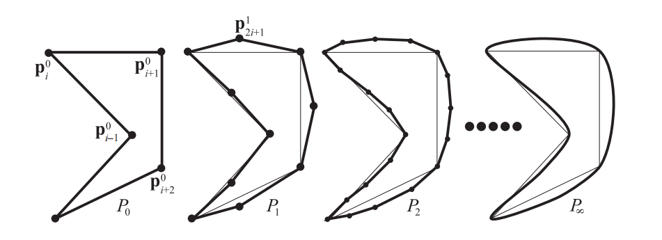

有两种不同的细分方案，分别是近似细分（approximating）和插值细分（interpolating）。Chaikin的方案是一种近似细分，因为最终生成的极限曲线一般并不会经过初始多边形的顶点。这是因为在细分过程中，原始顶点都被丢弃了（或者被更新了）。相反，插值细分会保留之前细分步骤中的所有顶点，因此极限曲线$P_{\infty}$会依次经过$P_0$，$P_1$，$P_2$等的所有顶点，这意味着插值细分会对初始多边形进行插值。图17.39展示了一个插值细分的方案，其中所使用的多边形与图17.38中的完全相同。该方案使用最近的4个顶点来创建一个新的顶点\[402]，这个过程的数学描述如下：

$$
\begin{aligned} \mathbf{p}_{2 i}^{k+1} & =\mathbf{p}_{i}^{k}, \\[1mm] \mathbf{p}_{2 i+1}^{k+1} & =\left(\frac{1}{2}+w\right)\left(\mathbf{p}_{i}^{k}+\mathbf{p}_{i+1}^{k}\right)-w\left(\mathbf{p}_{i-1}^{k}+\mathbf{p}_{i+2}^{k}\right) .\end{aligned}
\tag{17.59} 
$$

方程17.59中的第一行，意味着我们会保留上一步中的顶点，并且不会改变它们（即不进行插值）；第二行则会在点$\mathbf{p}_{i}^{k}$和点$\mathbf{p}_{i+1}^{k}$之间创建一个新的顶点。其中的$w$被称为张力参数（tension parameter），当$w = 0$，结果是线性插值的；当$w = 1/16$时，我们可以得到如图17.39所示的行为。可以证明\[402]，当$0 <w<1/8$时，所得到的曲线是$C^1$连续的。对于开放的折线（即首尾不相连），我们会在端点处遇到一些问题，因为我们需要在新顶点的两侧各有两个顶点，而折线情况下我们只有一个。我们可以将端点旁边的那个顶点，以端点为中心对称到另一边，从而解决这个问题。即在折线的起点处，点$\mathbf{p}_{1}$通过点$\mathbf{p}_{0}$，反射得到点$\mathbf{p}_{-1}$，然后在细分过程中使用这个顶点。图17.40展示了点$\mathbf{p}_{-1}$的创建过程。

=2 \mathbf{p}_{0}-\mathbf{p}_{1} 。")

另一种近似细分方案使用了以下的细分规则：

$$
\begin{aligned} \mathbf{p}_{2 i}^{k+1} & =\frac{3}{4} \mathbf{p}_{i}^{k}+\frac{1}{8}\left(\mathbf{p}_{i-1}^{k}+\mathbf{p}_{i+1}^{k}\right), \\[2mm] \mathbf{p}_{2 i+1}^{k+1} & =\frac{1}{2}\left(\mathbf{p}_{i}^{k}+\mathbf{p}_{i+1}^{k}\right) .\end{aligned}
\tag{17.60} 
$$

其中方程17.60的第一行会对现有顶点进行更新；第二行会计算两个相邻顶点的中点。这个近似细分方案会生成一个三次B样条曲线（章节17.1.6）。有关这些细分曲线的更多信息，请参阅SIGGRAPH的细分课程\[1977]；the Killer B的书\[111]；Warren和Weimer的细分书籍\[1847]；或者Farin的CAGD书籍\[458]。

给定一个点$\mathbf{p}$及其相邻顶点，也可以直接将这个点“推（push）”到极限曲线上，即确定点$\mathbf{p}$在曲线$P_{\infty}$上的坐标。同样，这对于切线也是可能的。Joy在对这个主题进行了在线介绍\[843]。

细分曲线中的许多概念同样也适用于细分曲面，我们将在下一小节中进行介绍。

## 17.5 细分表面

细分曲面是一种有效方法，它可以从具有任意拓扑结构的网格中，定义光滑、连续、无裂纹的表面。与本章节中的其他曲面一样，细分曲面也可以提供无限的LOD。也就是说，我们可以生成任意数量的三角形或者多边形，同时保持紧凑的原始表面表示。图17.41展示了一个表面被细分的例子。细分表面的另一个优点在于，这些细分规则都很简单并且易于实现。细分表面的缺点在于，对表面连续性的分析常常会涉及到很多数学。然而，这种连续性分析，通常只有那些希望创建新细分方案的人才会兴趣，并且这个话题也超出了本书的涵盖范围。有关这些细节，请参阅Warren和Weimer的书\[1847]，以及SIGGRAPH有关细分的课程\[1977]。

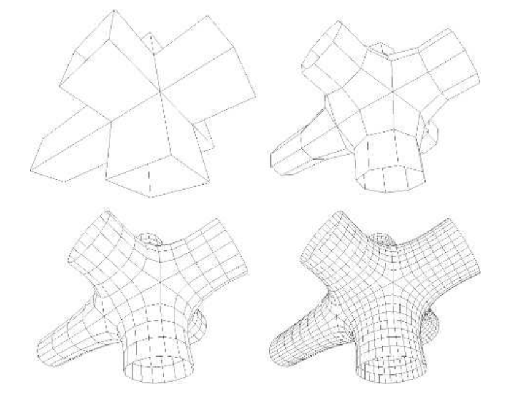

一般来说，曲面的细分（以及曲线的细分）可以被认为是一个两阶段的过程\[915]。我们从一个多边形网格出发，这个初始的多边形网格被称为控制网格（control mesh）或者控制笼（control cage）。第一阶段称为细化阶段（refinement phase），该阶段会创建新的顶点，并将这些顶点重新连接，以构建新的、更小的三角形。第二个阶段称为平滑阶段（smoothing phase），通常会对网格中部分顶点或者全部顶点的新位置进行计算，如图17.42所示。在这两个阶段中的具体执行细节，便是一个细分方案的最主要特征。在第一阶段中，我们可以使用各种不同的方式来对多边形进行分割（split）；而在第二阶段中，具体细分规则的选择将会给出不同的网格特征，例如连续性水平、表面是近似细分还是插值细分等，这些属性在章节17.4中进行了描述。

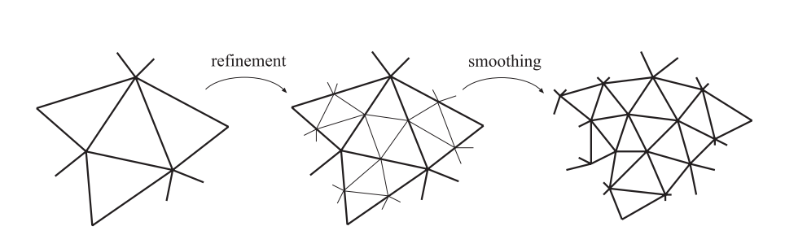

细分方案（subdivision scheme）的特征可以被分为稳定的（stationary）或者不稳定的（non-stationary）；均匀的（uniform）或者非均匀的（nonuniform）；以及基于三角形的（triangle-based）还是基于多边形的（polygon-based）。一个稳定的方案会在每个细分步骤中都使用相同的细分规则；而一个不稳定的方案可能会根据当前正在处理的步骤来动态改变细分规则；我们下面所介绍的方案都是稳定的。一个均匀的方案会对每个顶点或者边都使用相同的规则；而非均匀的方案可能会对不同的顶点或者边使用不同的规则，例如：对于表面边界处的边，通常都会使用一组不同的细分规则。基于三角形的方案只能对三角形进行操作，同样也只能生成三角形；而基于多边形的方案则可以对任意多边形进行操作。

接下来我们将介绍几种不同的细分方法。在那之后，我们还会介绍两种使用细分曲面的扩展技术，以及对法线、纹理坐标和颜色进行细分的方法。最后会介绍一些实用的细分算法和渲染算法。

### 17.5.1 Loop细分

Loop的方法\[767, 1067]是第一个针对三角形的细分方案，该方案类似于章节17.4中的最后一个方案，因为Loop细分是一种近似细分，它会对每个现有的顶点进行更新，并为每条边都创建一个新的顶点。这种方案的连通性如图17.43所示，从图中我们可以看到，每个三角形会被细分为4个新的三角形，因此在经过$n$次细分步骤之后，最初的一个三角形会被细分为$4^n$个三角形。

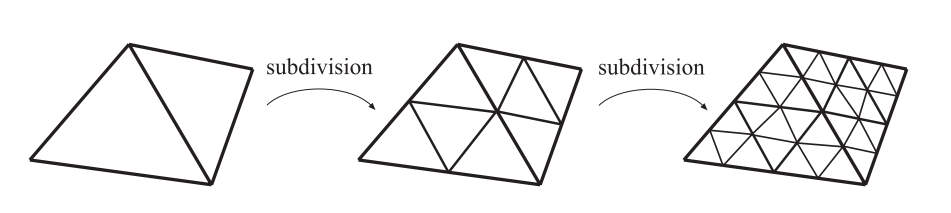

首先，在一个细分算法中，我们关注的是一个已存在的顶点$\mathbf{p}^{k}$，其中$k$是细分步骤的数量。这也就意味着，点$\mathbf{p}^{0}$其实就是原始控制网格中的顶点。

在经过一次细分之后，点$\mathbf{p}^{0}$变成了点$\mathbf{p}^{1}$。在一般情况下，$\mathbf{p}^{0} \rightarrow \mathbf{p}^{1} \rightarrow \mathbf{p}^{2} \rightarrow \cdots \rightarrow \mathbf{p}^{\infty}$，其中$\mathbf{p}^{\infty}$是极限点。如果点$\mathbf{p}^{k}$存在$n$个相邻顶点，即$\mathbf{p}^{k}_i,i \in\{0,1, \ldots, n-1\}$，那么我们就说点$\mathbf{p}^{k}$的价（valence）为$n$。图17.44中展示了上述这些符号和标记。另外，我们将一个6价的顶点称为规则顶点（regular）或者普通顶点（ordinary）；否则，它会被称为不规则顶点（irregular）或者异常顶点（extraordinary）。

 。")

下面我们将给出Loop方案的细分规则，其中第一个方程表示将一个已存在的顶点$\mathbf{p}^{k}$更新为$\mathbf{p}^{k+1}$的规则；第二个方程表示是在点$\mathbf{p}^{k}$和每个相邻点$\mathbf{p}^{k}_i$之间创建一个新的顶点$\mathbf{p}^{k+1}_i$。同样，$n$是点$\mathbf{p}^{k}$的价。这个方程具体如下：

$$
\begin{aligned} \mathbf{p}^{k+1} & =(1-n \beta) \mathbf{p}^{k}+\beta\left(\mathbf{p}_{0}^{k}+\cdots+\mathbf{p}_{n-1}^{k}\right), \\[2mm] \mathbf{p}_{i}^{k+1} & =\frac{3 \mathbf{p}^{k}+3 \mathbf{p}_{i}^{k}+\mathbf{p}_{i-1}^{k}+\mathbf{p}_{i+1}^{k}}{8}, i=0 \ldots n-1 .\end{aligned}
\tag{17.61} 
$$

请注意，这里的下标$i$是对$n$取模计算的，也就是说：如果$i = n−1$，那么对于$i + 1$，我们使用索引$0$；同样地，当$i = 0$时，对于$i−1$，我们使用索引$n−1$。这些细分规则可以很容易地被可视化为遮罩（mask），也称为模板（stencil），如图17.45所示（译者注：以下统一翻译为模板）。

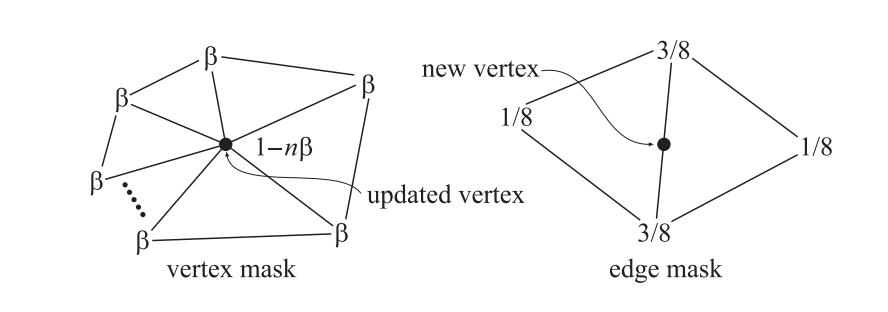

这些模板可视化的主要用途是，只需要使用一个简单的插图，就可以传达几乎整个细分方案。请注意，每个模板的权重之和为1。这是一个适用于所有细分方案的特性，这样做的原因是，一个新的顶点应当位于加权点的邻域内部。在方程17.61中的常数$β$，实际上是一个关于$n$的函数，其数学表达如下：

$$
\beta(n)=\frac{1}{n}\left(\frac{5}{8}-\frac{(3+2 \cos (2 \pi / n))^{2}}{64}\right)
\tag{17.62} 
$$

Loop对于函数$β$的建议方案\[1067]，可以在每个规则顶点（6阶）上实现$C^2$连续性，在其他地方（所有不规则顶点上）实现$C^1$连续性\[1976]。由于在细分过程中我们只会创建规则顶点，因此在原始控制网格中存在不规则顶点的地方，表面只有$C^1$连续性。图17.46展示了一个使用Loop方案对网格进行细分的例子。Warren和Weimer给出了方程17.62的一个变体\[1976]，该变体避免了使用三角函数：

$$
\beta(n)=\frac{3}{n(n+2)}
\tag{17.63} 
$$

使用方程17.63，在规则顶点处具有$C^2$连续性，而在其他地方只有$C^1$连续性。由此生成的表面很难与常规的Loop表面区分开来。但是对于一个未封闭的网格，我们就无法使用上述的细分规则了；相反，必须对这种边界使用一些特殊规则。对于Loop的方案，我们可以使用方程17.60中的反射规则，这也将在章节17.5.3中进行讨论。

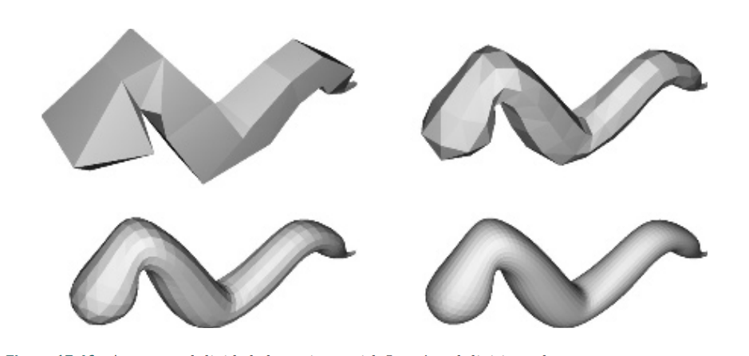

经过无限次细分的表面称为极限表面（limit surface）。极限表面上的顶点和切线可以使用封闭形式的表达式进行计算。其中顶点的极限位置\[767, 1977]可以使用方程17.61中的第一个公式进行计算，并将$\beta (n)$替换为：

$$
\gamma(n)=\dfrac{1}{n+\dfrac{3}{8 \beta(n)}}
\tag{17.64} 
$$

顶点$\mathbf{p}^{k}$处的两条极限切线，可以通过对相邻的顶点（这些顶点被称为1-环顶点或者1-邻域顶点）进行加权来计算\[767, 1067]，如下所示：

$$
\mathbf{t}_{u}=\sum_{i=0}^{n-1} \cos (2 \pi i / n) \mathbf{p}_{i}^{k}, \quad \mathbf{t}_{v}=\sum_{i=0}^{n-1} \sin (2 \pi i / n) \mathbf{p}_{i}^{k}
\tag{17.65} 
$$

有了某点上的两条切线，我们当然可以计算出法线，这里的法线是$\mathbf{n}=\mathbf{t}_{u} \times \mathbf{t}_{v}$。需要注意的是，章节16.3中我们介绍过一种计算相邻三角形法线的方法，但是这里的方法开销更低\[1977]。更重要的是，它可以给出该点的精确法线。

近似细分方案的一个主要优点在于，最终所得到的表面会趋于均匀（fair）。粗略地讲，这里的均匀与曲线或者表面弯曲的平滑程度有关\[1239]，更高程度的均匀意味着更加平滑的曲线或者表面。近似细分方案另一个优点在于，其收敛速度要比插值细分方案更快。然而，这也会意味着网格的形状通常会缩小。对于四面体这样的小型凸面网格而言，这一点尤其明显，如图17.47所示。一种减弱这种影响的方法是，在控制网格中使用更多数量的顶点，也就是说，在建模的时候必须要谨慎。Maillot和Stam提出了一种结合多种细分方案的框架\[1106]，从而可以控制这种收缩。还有一个特性可能会发挥巨大优势，即Loop细分表面会被包裹在原始控制点所形成的凸壳内部\[1976]。

![图17.47：一个四面体被细分了5次，分别使用了Loop方案； \sqrt{3} 方案；改进的butterfly （modified butterfly，MB）方案 \[1975\] 。其中Loop方案和 \sqrt{3} 方案 \[915\] 都是近似细分方案，而MB则是插值细分方案，插值细分意味着初始网格顶点会位于最终的表面上。本书中我们只会介绍近似细分方案，因为它们在游戏和离线渲染中十分流行。](images/Chapter-17/202309102026585.png "图17.47：一个四面体被细分了5次，分别使用了Loop方案； \sqrt{3} 方案；改进的butterfly （modified butterfly，MB）方案 \[1975] 。其中Loop方案和 \sqrt{3} 方案 \[915] 都是近似细分方案，而MB则是插值细分方案，插值细分意味着初始网格顶点会位于最终的表面上。本书中我们只会介绍近似细分方案，因为它们在游戏和离线渲染中十分流行。")

Loop细分方案生成了一种广义的三向四次box样条曲线（three-directional quartic box spline）。

> 这些样条曲面的内容超出了本书的讨论范围。请读者自行查阅Warren的书籍\[1847]，SIGGRAPH课程\[1977]，以及Loop的论文\[1067]。

因此，对于那些仅由规则顶点所构成的网格，我们实际上可以将其描述为一种样条表面。然而，对于存在不规则顶点的网格而言，这种样条描述方式是不可能的。能够从任意的网格顶点中生成光滑的曲面，这是细分方法的优点之一。在后续的章节17.5.3和章节17.5.4中，我们还会对使用Loop方案进行曲面细分的扩展方法进行介绍。

### **17.5.2 Catmull-Clark细分**

有很多细分方案可以处理多边形网格（而不仅仅是三角形网格），其中最著名的两个是Catmull-Clark \[239]和Doo-Sabin \[370]。

> 顺便说一句，这两篇文章发表在同一期刊的同一期上。

这里我们只对前者进行简要介绍。Catmull-Clark表面被广泛应用于皮克斯的动画片中，包括动画短片《棋逢对手（Geri’s Game）》\[347]、《玩具总动员2》以及之后皮克斯所有的动画故事片。这种细分方案也经常用于制作游戏模型，并且可能是其中最受欢迎的一种。DeRose等人\[347]指出，Catmull-Clark方法倾向于生成更加对称的表面。例如：一个长方形的box，会生成一个对称的椭球状表面，这与直觉一致。相比之下，基于三角形的细分方案会将立方体的每个表面都视为两个三角形，因此会根据正方形的三角形划分方式产生不同的结果。

图17.48展示了Catmull-Clark表面的基本思想，图17.41展示了使用Catmull-Clark细分的一个实际例子。从图中可以看出，该方案只会生成具有4个顶点的面。实际上，在完成第一步细分后，之后的每个细分步骤中只会生成4价的顶点，因此这样的顶点同样也被称为普通顶点或者规则顶点（在三角形面中则为6价）。

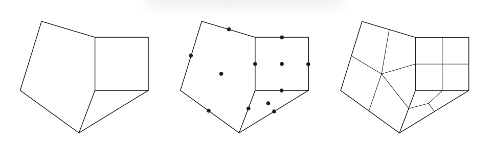

遵循Halstead等人\[655]的符号表示，我们仅仅关注一已经存在的顶点$\mathbf{v}^{k}$，它周围有$n$个边缘点$\mathbf{e}^{k}_i$，其中$i = 0 \cdots n−1$，如图17.49所示。现在，对于每个多边形面，我们都会计算一个新的面点$\mathbf{f}^{k+1}$，并将其作为这个面的质心（centroid），即这个面上所有点的平均值。基于这些条件，具体的细分规则如下\[239, 655, 1977]：

$$
\begin{array}{l}\mathbf{v}^{k+1}=\dfrac{n-2}{n} \mathbf{v}^{k}+\dfrac{1}{n^{2}} \sum_{j=0}^{n-1} \mathbf{e}_{j}^{k}+\dfrac{1}{n^{2}} \sum_{j=0}^{n-1} \mathbf{f}_{j}^{k+1}, \\[4mm] \mathbf{e}_{j}^{k+1}=\dfrac{\mathbf{v}^{k}+\mathbf{e}_{j}^{k}+\mathbf{f}_{j-1}^{k+1}+\mathbf{f}_{j}^{k+1}}{4} .\end{array}
\tag{17.66} 
$$

我们可以看到，顶点$\mathbf{v}^{k+1}$在进行计算的时候，会考虑到原始顶点、边缘点的平均值，以及新创建的面点平均值。另一方面，新的边缘点$\mathbf{e}_{j}^{k+1}$在计算的时候，会考虑原始顶点、原本的边缘点、以及两个新创建的面点，这两个面点分别是共享这条边的两个相邻面上的面点（平均值）。

![图17.49：在这一步细分之前，我们有了蓝色的顶点以及相应的边面。在经过一步Catmull-Clark细分之后，我们得到了新的红色顶点，所有的新面都是四边形 \[655\] 。](images/Chapter-17/202309110900898.png "图17.49：在这一步细分之前，我们有了蓝色的顶点以及相应的边面。在经过一步Catmull-Clark细分之后，我们得到了新的红色顶点，所有的新面都是四边形 \[655] 。")

Catmull-Clark表面实际上描述了一个广义的双三次B样条表面。因此，对于那些仅由规则顶点（4价）所构成的网格，我们实际上可以将表面描述为一个双三次B样条表面（章节17.2.6）\[1977]。然而，这对于包含不规则顶点的网格来说是不可能的，能够使用曲面细分来对这类网格进行处理是该方案的优势之一。同样顶点的极限位置和极限切线也可以进行计算，甚至可以使用显式方程来对任意的参数值进行计算\[1687]。Halstead等人\[655]描述了一种计算极限顶点位置和极限顶点法线的不同方法。

章节17.6.3中介绍了一组高效技术，它可以使用GPU来渲染Catmull-Clark的细分表面。

### **17.5.3 分段平滑细分**

从某种意义上说，曲面可能会被认为是十分无聊的，因为它们缺乏表面细节。有两种方法可以对曲面细节进行改进，分别是使用凹凸贴图或者位移贴图（章节17.5.4）。在这里我们将介绍第三种方法，即分段平滑细分（piecewise smooth subdivision）方法，其基本思想是在表面上改变细分规则，从而允许出现褶皱（dart）、拐角（corner）和折痕（crease）。这样可以扩大曲面能够建模和表达的范围。Hoppe等人\[767]首先对Loop细分曲面应用了这种方法。图17.50展示了标准Loop细分曲面与分段光滑细分曲面的比较。

为了能够在表面上实现这样的特征，我们需要知道哪些部分是尖锐的边缘，并将这部分进行标记，这样我们就知道在哪里进行细分了。我们将一个顶点上的尖锐边缘数量记为$s$，然后我们将顶点划分为光滑顶点（$s = 0$）、褶皱顶点（$s = 1$）、折痕顶点（$s = 2$）以及拐角顶点（$s>2$）。因此，折痕是表面上的一条曲线，该曲线的连续性为$C^0$。褶皱是一个非边界（non-boundary）顶点，它指的是一个会平滑融入表面的折痕。最后，拐角是三个或者更多折痕聚集在一起的顶点。可以对每个边界进行相应地标记，从而定义边界。

在对各种顶点类型进行分类后，Hoppe等人使用了一个表格，来确定对各种组合具体使用哪个模板。他们还展示了如何计算表面上的极限顶点和极限切线。Biermann等人\[142]提出了几种改进的细分规则。例如：当异常顶点出现在边界上时，之前的一些细分规则可能会导致出现间隙，而新的细分规则可以避免这种情况的发生。此外，这些规则使得在顶点处指定法线成为可能，并且生成的表面将会适应在该点处获得的法线。DeRose等人\[347]提出了一种创建软折痕（soft crease）的技术，该技术允许一条边首先被尖锐细分若干次（包括分数次），然后再使用标准细分。

### **17.5.4 位移（Displaced ）细分**

凹凸映射（章节6.7）是一种为光滑表面添加细节的方法。然而，这只是一个错觉技巧（illusionary trick），它仅仅改变了每个像素位置上的法线信息或者局部遮挡信息。无论有没有使用凹凸贴图，物体的轮廓看起来都是一样的。位移映射（displacement mapping）是对凹凸映射（bump mapping）的自然扩展\[287]，在位移映射中，表面会被实际位移，这种位移通常是沿着法线方向进行的。因此，如果表面上有一个点$\mathbf{p}$，其归一化法线为$\mathbf{n}$，那么位移表面上的对应点是：

$$
\mathbf{s}(u, v)=\mathbf{p}(u, v)+d(u, v) \mathbf{n}(u, v)
\tag{17.67} 
$$

其中标量$d$是点$\mathbf{p}$的位移距离，当然这个位移也可以是一个向量\[938]。

在本小节中，我们将介绍位移细分表面（displaced subdivision surface）\[1006]。这个移位表面的一般想法是，将一个粗糙的控制网格细分为一个光滑的表面，然后再沿着法线进行标量位移。在一个位移细分表面的描述中，方程17.67中的点$\mathbf{p}$为（粗糙控制网格的）细分表面上的极限点，$\mathbf{n}$为点$\mathbf{p}$处的归一化法线，其计算方式为：

$$
\mathbf{n}=\frac{\mathbf{n}^{\prime}}{\left\|\mathbf{n}^{\prime}\right\|}, \text{where} \enspace \mathbf{n}^{\prime}=\mathbf{p}_{u} \times \mathbf{p}_{v}
\tag{17.68} 
$$

方程17.68中的$\mathbf{p}_{u}$和$\mathbf{p}_{v}$是细分表面的一阶导数，即它们是点$\mathbf{p}$处的两条切线。Lee等人\[1006]对原始的粗糙控制网格使用了Loop细分曲面，其切线可以使用方程17.65进行计算。需要注意的是，这里的符号表示略有不同，方程17.65中使用了$\mathbf{t}_{u}$和$\mathbf{t}_{v}$来代表切线，这里我们则使用了$\mathbf{p}_{u}$和$\mathbf{p}_{v}$，它们的含义是一样的。方程17.67描述了结果表面中的位移位置，这里我们还需要该点处的法线$\mathbf{n}_{s}$才能正确渲染这个位移细分表面。法线和位移细分表面的解析计算如下所示\[1006]：

$$
\begin{array}{l}\mathbf{n}_{s}=\mathbf{s}_{u} \times \mathbf{s}_{v}, \text { where } \\[2mm] \mathbf{s}_{u}=\dfrac{\partial \mathbf{s}}{\partial u}=\mathbf{p}_{u}+d_{u} \mathbf{n}+d \mathbf{n}_{u} \\[3mm] \mathbf{s}_{v}=\dfrac{\partial \mathbf{s}}{\partial v}=\mathbf{p}_{v}+d_{v} \mathbf{n}+d \mathbf{n}_{v} \end{array}
\tag{17.69} 
$$

为了简化计算，Blinn \[160]建议在位移量较小的情况下，可以忽略方程17.69中的第三项。否则，可以使用下列表达式来计算$\mathbf{n}_{v}$（同理还有$\mathbf{n}_{v}$）\[1006]：

$$
\begin{aligned} \overline{\mathbf{n}}_{u} & =\mathbf{p}_{u u} \times \mathbf{p}_{v}+\mathbf{p}_{u} \times \mathbf{p}_{u v}, \\[2mm] \mathbf{n}_{u} & =\frac{\overline{\mathbf{n}}_{u}-\left(\overline{\mathbf{n}}_{u} \cdot \mathbf{n}\right) \mathbf{n}}{\left\|\mathbf{n}^{\prime}\right\|} .\end{aligned}
\tag{17.70} 
$$

请注意，方程17.70中的$\overline{\mathbf{n}}_{u}$并不是什么新的符号标记，它只是计算过程中的一个“临时”变量。对于一个普通顶点（6价）而言，其一阶导数和二阶导数的计算方法很简单。它们的计算模板如图17.51所示。对于一个异常顶点（非6价），方程17.69中第一行和第二行的第三项会被省略。图17.52展示了一个使用Loop细分方案的位移映射结果。

![图17.51：Loop细分方案中普通顶点的模板。请注意，在使用这些模板之后，结果需要除以权重之和。 \[1006\]](images/Chapter-17/202309111003937.png "图17.51：Loop细分方案中普通顶点的模板。请注意，在使用这些模板之后，结果需要除以权重之和。 \[1006]")

当一个位移表面距离观察者很远时，可以使用标准的凹凸映射来产生这种位移的错觉，这样做可以节省一些几何处理的开销。有一些凹凸映射方案，需要在顶点处使用切线空间坐标系，可以使用以下方法来产生一个切线空间基底$(\mathbf{b}, \mathbf{t}, \mathbf{n})$，其中：

$$
\mathbf{t}=\mathbf{p}_{u} /\left\|\mathbf{p}_{u}\right\|
\\[1mm]
\mathbf{b}=\mathbf{n} \times \mathbf{t} 
$$

Nießner和Loop提出了一种方法\[1281]，该方法与Lee等人所提出的方法相类似，不同之处在于他们使用了Catmull-Clark表面，并使用位移函数上的导数来直接进行求值，计算速度更快。他们还使用了基于硬件的曲面细分管线（章节3.6）来进行快速曲面细分。

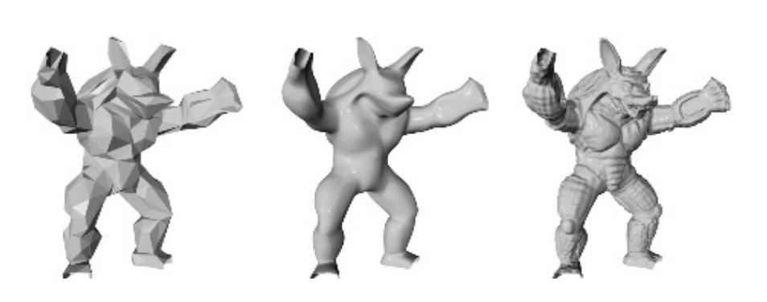

### **17.5.5 法线、纹理和颜色插值**

在本小节中，我们将介绍一些不同的策略，来分别处理法线、纹理坐标和逐顶点颜色的插值。

章节17.5.1中我们介绍了Loop细分方案，它可以显式地计算极限切线和极限法线，不过这些计算会涉及到三角函数，其计算开销可能会很高。Loop和Schaefer \[1070]提出了一种近似技术，该方法使用双三次Bezier曲面来近似Catmull-Clark曲面（章节17.2.1）。对于法线计算，会导出两个切线面片，其中一个在$u$方向上，另一个在$v$方向上，使用这些向量的叉乘来计算法线。一般来说，可以使用方程17.35来计算一个Bezier 面片的导数。然而，由于导出的Bezier面片近似于Catmull-Clark表面，因此这两个切线面片并不会形成连续的法线场。有关如何克服这些问题，详见Loop和Schaefer的论文\[1070]。Alexa和Boubekeur \[29]认为，就每次计算的质量而言，对法线进行细分可以更加高效，同时也会在着色中提供了更好的连续性表现。有关对法线进行细分的细节，请参考他们的论文（详见书中链接）。在Ni等人的SIGGRAPH课程\[1275]中，也可以找到更多类型的近似方案。

假设网格中的每个顶点都有一个纹理坐标和一个颜色。为了能够将这些数据用于细分表面，我们还必须为每个新生成的顶点都创建相应的纹理坐标和颜色。其中最显而易见的方法就是，使用与多边形网格相同的细分方案。例如：我们可以将颜色视为一个四维向量（RGBA），并对这个四维向量进行细分，从而为新顶点创建颜色。这是一种合理的方法，因为这样生成的颜色将会有一个连续的导数（假设细分方案至少有$C^1$连续性），这样可以避免表面上出现突然的颜色变化。同样的方法也可以用于纹理坐标的生成\[347]，但是当纹理空间中存在边界时，则需要小心处理，例如：假设现在我们有两个面片共享同一条边缘，但是沿着这条边缘具有不同的纹理坐标。几何网格会像往常一样使用表面规则进行细分，但是在这种情况下，纹理坐标应当使用边界规则来进行细分。

Piponi和Borshukov \[1419]给出了一种复杂的纹理化细分曲面的方案。

## 17.6 高效曲面细分

为了能够在一个实时渲染环境中显示曲面，我们通常需要为曲面创建一个三角形网格，这个过程被称为曲面细分（tessellation）。其中最简单的曲面细分形式被称为均匀曲面细分（uniform tessellation）。假设现在我们有一个参数化的Bezier 面片$\mathbf{p}(u, v)$，详见方程17.32中的描述。我们想为每个面片的边都计算11个顶点，从而对这个面片进行细分，总共会得到$10 × 10 × 2 = 200$个三角形。最简单的方法就是对$uv$空间进行均匀采样。因此，我们对所有的$\left(u_{k}, v_{l}\right)=(0.1 k, 0.1 l)$，都计算一遍$\mathbf{p}(u, v)$，其中$k$和$l$是0-10范围内的任何整数。这个操作可以通过两个嵌套的for循环来实现。每四个表面点$\mathbf{p}\left(u_{k}, v_{l}\right)$，$\mathbf{p}\left(u_{k+1}, v_{l}\right)$，$\mathbf{p}\left(u_{k+1}, v_{l+1}\right)$和$\mathbf{p}\left(u_{k}, v_{l+1}\right)$可以创建两个三角形。

这种方法虽然很简单很直接，但是还有一些更快的方法。相比于先将曲面细分成三角形网格，然后再将这个三角形网格通过总线从CPU发送到GPU，将这个曲面表示直接发送到GPU中，并由GPU来处理这个数据扩展的过程要更有意义，效率会更高。我们在章节3.6中描述了管线的曲面细分阶段，这里我们快速回顾一下，详见图17.53。

曲面细分器中可以使用分数曲面细分（fractional tessellation）技术，我们将在下一小节中进行介绍。然后我们会介绍有关自适应曲面细分（adaptive tessellation）的部分。最后，我们会介绍如何使用曲面细分硬件来高效渲染Catmull-Clark表面和位移映射表面。

### 17.6.1分数曲面细分

为了使得参数化表面获得更加光滑的LOD，Moreton引入了分数曲面细分因子（fractional tessellation factor）\[1240]。这些分数因子使得有限形式的自适应曲面细分成为可能，因为可以在参数化表面的不同区域使用不同的曲面细分因子。下面我们将介绍这些技术的工作原理。

![图17.54：左：普通的曲面细分，在行方向上使用一个因子，在列方向上使用另一个因子。右：在所有的四个边上，都使用独立的曲面细分因子。 \[1240\]](images/Chapter-17/202309111427101.png "图17.54：左：普通的曲面细分，在行方向上使用一个因子，在列方向上使用另一个因子。右：在所有的四个边上，都使用独立的曲面细分因子。 \[1240]")

在图17.54中，左侧展示了每行每列都使用恒定的曲面细分因子，右侧展示了所有四条边界都使用的独立曲面细分因子。请注意，一条边上的曲面细分因子是这条边上生成顶点的数量减1。在图17.54的右侧面片中，上下两边缘的内部都使用了顶部和底部细分因子中较大的那个；同样，左右两边缘的内部也使用了左边和右边细分因子中较大的那个。因此，面片内部的基本曲面细分率为$4 × 8$，而对于细分因子较小的边界，则会沿着边界来填充三角形。Moreton \[1240]更加详细地描述了这个过程。

分数曲面细分因子的概念如图17.55所示。对于整数曲面细分因子$n$，会在$k/n$处生成$n + 1$个点，其中$k = 0,…, n$。对于分数曲面细分因子$r$, 会在$k/r$处生成$\lceil r\rceil$个点，其中$k = 0,…,\lfloor r\rfloor$。其中运算符$\lceil r\rceil$代表了$r$的上限（ceiling），即将$r$向上舍入；$\lfloor r\rfloor$代表了$r$的下限（floor），即将$r$向下舍入。这样，最右边的点会被“固定（snapped）”到最右侧的端点处。我们从图17.55的第二行插图可以看出，这种模式是非对称的。这可能会导致出现一些问题，因为相邻的面片可能会在另一个方向上生成顶点，从而在表面之间产生裂缝。Moreton通过创建一个对称的点模式来解决这个问题，如图17.55第三行所示，图17.56也展示了一个例子。

![图17.56：矩形区域的分数细分面片。 \[1240\]](images/Chapter-17/202309111441339.png "图17.56：矩形区域的分数细分面片。 \[1240]")

到目前为止，我们已经看到了对一个矩形区域（例如Bezier面片）进行曲面细分的方法。同样地，也可以对三角形进行分数曲面细分\[1745]，如图17.57所示。就像上文中的四边形一样，也可以对每个三角形边分别指定独立的分数曲面细分率。使用这种方法可以实现自适应的曲面细分（章节17.6.2），如图17.58所示，其中渲染了一个位移映射的地形。一旦我们创建了三角形或者四边形，就可以将它们转发到管线的下一个阶段中，这将在下一小节中进行介绍。

![图17.57：三角形的分数曲面细分，旁边显示了对应的曲面细分因子。请注意，这个曲面细分因子可能会与实际曲面细分硬件所产生的因子并不完全对应。 \[1745\]](images/Chapter-17/202309111446763.png "图17.57：三角形的分数曲面细分，旁边显示了对应的曲面细分因子。请注意，这个曲面细分因子可能会与实际曲面细分硬件所产生的因子并不完全对应。 \[1745]")

### 17.6.2自适应曲面细分

如果使用足够高的采样率，那么均匀曲面细分就已经能够得到很好的结果了，然而，表面上的某些区域可能并不需要如此高程度的曲面细分。这可能是因为表面上的某些区域弯曲程度更大，因此需要更高的曲面细分来进行处理；而表面上的其他部分几乎都是平坦的或者遥远的，因此只需要几个三角形就可以很好地近似它们了。使用均匀曲面细分会生成很多不必要的三角形，其中一个解决方案是使用自适应曲面细分（adaptive tessellation），它指的是根据表面上的某些指标（例如曲率、三角形边的长度或者某些屏幕尺寸指标）来动态调整曲面细分率的算法。图17.58展示了一个使用自适应曲面细分的地形例子。

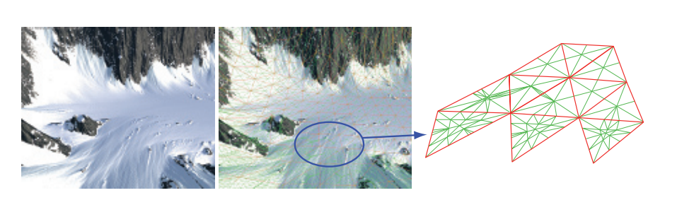

在不同的细分区域之间，需要注意避免出现裂缝，如图17.59所示。当使用分数曲面细分的时候，边缘的曲面细分因子通常会基于边缘本身的信息，因为这个边缘是两个相连片元之间共享的所有数据。这是一个很好的开始，但是由于浮点数本身的不准确性，仍然可能会出现裂痕。Nießner等人\[1279]讨论了如何使得计算过程完全无懈可击（fully watertight），例如：确保对于一条边，无论从$\mathbf{p}_0$到$\mathbf{p}_1$是否进行曲面细分，返回的都是完全相同的点，反之亦然。

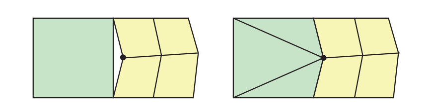

在本小节中，我们将介绍一些通用技术，它们可以用来计算分数的曲面细分因子；或者决定什么时候停止进一步的曲面细分；以及什么时候将一个较大的面片细分成一组较小的面片。

#### 终止自适应曲面细分

为了能够提供自适应的曲面细分效果，我们需要确定何时来停止曲面细分，即如何计算这个分数曲面细分因子。我们可以仅仅使用一条边的信息来确定是否应当终止曲面细分，同样也可以使用来自整个三角形或者其他组合的信息来决定是否终止。

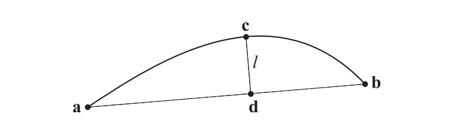

还应当注意的是，在使用自适应曲面细分的时候，如果某个边缘上的曲面细分因子在两帧之间变化过大，则可能会在两帧之间出现一些游动的（swimming）或者突变（popping）的瑕疵，这也是在计算曲面细分因子时要考虑到的一个因素。给定一条边($\mathbf{a}$,$\mathbf{b}$)和一条相关的曲线，即面片的边缘曲线，我们可以尝试估计点$\mathbf{a}$和点$\mathbf{b}$之间曲线的平坦程度，如图17.60所示。在参数化空间中找到点$\mathbf{a}$和点$\mathbf{b}$之间的中点，并计算其三维空间中的对应点$\mathbf{c}$。然后将点$\mathbf{c}$投影到$\mathbf{a}$，$\mathbf{b}$所在的直线上，形成点$\mathbf{d}$，并计算线段$\mathbf{cd}$的长度$l$。这个长度$l$可以用于确定这段曲线是否足够平坦。如果这个$l$足够小，则可以认为这段曲线是平坦的。但是请注意，这种方法可能会将一段S形曲线错认为是平坦的。一种解决这个问题的方法是，可以对参数化样本点进行随机扰动\[470]。与只使用投影线段长度$l$相比，另一种选择是使用一个比值$l /\|\mathbf{a}-\mathbf{b}\|$，它可以给出一个相对度量\[404]。这种判断曲线平坦程度的方法同样也可以扩展到三角形面片上，我们只需要计算三角形面片中间的表面点，并计算从该点到三角形平面的距离即可。为了确保这种算法能够终止，通常需要对细分的数量设定一个上限，当达到这个上限时就终止细分。对于分数曲面细分，可以将点$\mathbf{c}$到点$\mathbf{d}$的向量投影到屏幕上，并依据这个屏幕长度来决定曲面细分率的大小。

到目前为止，我们已经讨论了如何仅从表面的形状来确定一个合理的曲面细分率。还有一些其他用于动态曲面细分的因素，例如：顶点的局部邻域是否为\[769, 1935]：

1.  位于视锥体内。
2.  位于模型的正面。
3.  占据屏幕空间中的一大片面积。
4.  靠近物体的轮廓。

在这里我们将依次讨论这些因素。对于视锥体剔除而言，可以放置一个球体来包围这条边，然后在视锥体上对这个球体进行测试。如果这个球体位于视锥体外部，那么我们就不再细分这条边了。

对于正面剔除（face culling），可以从表面描述中计算得到点$\mathbf{a}$，点$\mathbf{b}$，以及可能的点$\mathbf{c}$处的法线。这三条法线和点$\mathbf{a}$、$\mathbf{b}$、$\mathbf{c}$一起，定义了三个平面。如果这三个平面全部都是朝向后的，那么很可能不需要对该边缘进行细分。

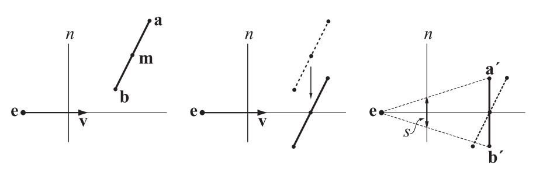

实现屏幕空间覆盖率（screen-space coverage）的方法有很多（详见章节19.9.2）。所有的这些方法都是将一些简单的对象投影到屏幕上，并估计投影在屏幕空间中的长度或者面积。较大的面积或者较长的长度意味着需要进行曲面细分。图17.61展示了一条从点$\mathbf{a}$到点$\mathbf{b}$的线段，以及它在屏幕空间中投影的快速估计。首先，对这条线段进行平移，使其中点位于观察射线上。然后，假设这条线段平行于近裁剪平面$n$，并根据这条线段来计算屏幕空间中的投影$s$。使用图17.61右侧线段上的点$\mathbf{a}^{\prime}$和点$\mathbf{b}^{\prime}$，这个屏幕空间中投影$s$的计算方法如下：

$$
s=\frac{\sqrt{\left(\mathbf{a}^{\prime}-\mathbf{b}^{\prime}\right) \cdot\left(\mathbf{a}^{\prime}-\mathbf{b}^{\prime}\right)}}{\mathbf{v} \cdot\left(\mathbf{a}^{\prime}-\mathbf{e}\right)}
\tag{17.71} 
$$

方程17.71中的分子部分就是线段的长度，将其除以眼睛（点$\mathbf{e}$）到线段中点的距离。然后将计算出的屏幕空间投影$s$与表示屏幕空间中最大边缘长度的阈值$t$进行比较。可以对方程17.71进行一些改写，从而避免计算平方根，如果满足以下条件，则继续进行曲面细分：

$$
s>t  \Longleftrightarrow \left(\mathbf{a}^{\prime}-\mathbf{b}^{\prime}\right) \cdot\left(\mathbf{a}^{\prime}-\mathbf{b}^{\prime}\right)>t^{2}\left(\mathbf{v} \cdot\left(\mathbf{a}^{\prime}-\mathbf{e}\right)\right)^{2}
\tag{17.72} 
$$

方程中的$t^2$是一个常数，因此可以进行预先计算。对于分数曲面细分而言，可以使用方程17.71中的$s$，并对其进行一些缩放来作为实际使用的曲面细分率。另一种测量投影边缘长度的方法是，在这条边的中心处放置一个球体，使这个球体的半径为边缘长度的一半，然后再使用球体的投影作为这条边上的曲面细分因子\[1283]。这个球体测试与面积成正比，而上面的测试则与边长成正比。

增加轮廓处的曲面细分率是很重要的，因为它们对于物体的感知质量起着主要作用。可以将点$\mathbf{a}$处的法线与从眼睛指向点$\mathbf{a}$的向量进行点积，并判断点积结果是否接近于零，从而确定这个三角形是否靠近轮廓边缘。如果这个条件对点$\mathbf{a}$、$\mathbf{b}$或$\mathbf{c}$中的任何一个都成立，则应当对这个三角形进行进一步的曲面细分。

对于位移细分，Nießner和Loop \[1281]对每个基底网格顶点$\mathbf{v}$都使用了下列因子中的其中一个，这个顶点$\mathbf{v}$连接了$n$个边向量$\mathbf{e}_{i}$，其中 $i\in\{0,1,…,n−1\}$，这些因子的计算方法为：

$$
\begin{aligned} f_{1} & =k_{1} \cdot\|\mathbf{c}-\mathbf{v}\|, \\ f_{2} & =k_{2} \sqrt{\sum \mathbf{e}_{i} \times \mathbf{e}_{i+1}}, \\ f_{3} & =k_{3} \max \left(\left\|\mathbf{e}_{0}\right\|,\left\|\mathbf{e}_{1}\right\|, \ldots,\left\|\mathbf{e}_{n-1}\right\|\right),\end{aligned}
\tag{17.73} 
$$

其中$i$是循环索引，对连接到点$\mathbf{v}$的所有$n$条边$\mathbf{e}_{i}$进行了遍历；点 $\mathbf{c}$是相机所在的位置；$k_i$是用户提供的常数。在方程17.73中，因子$f_1$仅仅基于了从相机到顶点的距离，$f_2$计算连接到点$\mathbf{v}$的四边形的面积，$f_3$则使用了最大的边缘长度。然后会分别对边缘上的两个顶点，计算上述这些顶点的曲面细分因子，最终这两个顶点所使用的曲面细分因子为6个（$3\times2$）曲面细分因子中的最大值。同时，可以使用对边的曲面细分因子中的最大值，来作为内部的曲面细分因子。这种方法可以与本小节中所介绍的任何边缘曲面细分因子方法一起使用。

值得注意的是，Nießner等人\[1279]建议对字符使用单个的全局曲面细分因子，并根据相机到字符的距离来计算这个因子。具体的细分数量为$\left\lceil\log _{2} f\right\rceil$，其中$f$是每个字符的曲面细分因子，可以使用上述任何一种方法进行计算。

很难说有哪一种方法适用于所有的应用程序，因此最好是对现有的几种启发式方法，以及它们的组合方法都进行实际测试。

#### 分割和骰子方法

Cook等人\[289]引入了一种被称为分割和骰子（split and dice）的方法，该方法的目标是对曲面进行细分，并使得每个三角形的大小与像素的大小相同，从而避免几何锯齿。为了能够实时进行处理，应当增大这个曲面细分的阈值使得GPU能够进行实时处理。首先，每个面片会被递归地分割成一组子面片并同时进行估计，直到对某个子面片使用均匀曲面细分能够得到所需大小的三角形位置。因此，这也是一种自适应的曲面细分。

想象现在有一个较大的面片被用作景观表示。一般来说，分数曲面细分是无法适应这种情况的，例如：在靠近相机的地方应当有更高的曲面细分率，而在远离相机的地方应当有较低的曲面细分率。这种分割和骰子方法的核心思想对于实时渲染可能会很有用，即使在现在的情况下（性能不够），我们的目标曲面细分率是创建比像素尺寸更大的三角形。

接下来，我们将介绍实时图形场景中分割和骰子的一般方法。这里我们假设使用的是矩形面片。然后在整个参数化域上，即从$(0,0)$到$(1,1)$的方块，开始执行一个递归程序。使用刚才描述的自适应终止准则来判断当前表面是否被足够细分，如果是，则终止曲面细分；如果不是，则将该定义域划分为四个大小相同的正方形，并对每个子正方形继续调用这个递归程序。持续执行这个过程，直到当前表面被充分细分，或者是达到预定的递归级别。该算法的本质是在曲面细分的过程中，递归地创建四叉树结构。然而，如果相邻的子方块被细分到不同的层次水平，很可能会产生裂缝。标准的解决方案是，确保两个相邻的子方块最多只相差一个细分级别，这种结构被称为受限四叉树（restricted quadtree）。然后使用图17.59中所展示的技术来填充这些裂缝。这种方法的缺点在于，会涉及较多的统计工作（bookkeeping）。

![图17.62：对一条三次Bezier曲线应用分数分割。每条曲线旁都显示了对应的曲面细分率 t 。图中的黑色圆点是分裂点，它从曲线的右侧出发，向着曲线的中心进行移动。为了能够对三次曲线进行分数分割，这个分裂点会平滑地移向曲线的中心，并使用两段三次Bezier曲线来代替原始曲线，它们共同组成了原始曲线。在右侧，同样的概念被用于分割面片，它被分割成四个更小的子面片，其中 1.0 代表分割点位于边缘的中心点上， 0.0 代表分割点位于面片的拐角处。 \[1044\]](images/Chapter-17/202309111653167.png "图17.62：对一条三次Bezier曲线应用分数分割。每条曲线旁都显示了对应的曲面细分率 t 。图中的黑色圆点是分裂点，它从曲线的右侧出发，向着曲线的中心进行移动。为了能够对三次曲线进行分数分割，这个分裂点会平滑地移向曲线的中心，并使用两段三次Bezier曲线来代替原始曲线，它们共同组成了原始曲线。在右侧，同样的概念被用于分割面片，它被分割成四个更小的子面片，其中 1.0 代表分割点位于边缘的中心点上， 0.0 代表分割点位于面片的拐角处。 \[1044]")

Liktor等人\[1044]提出了分割和骰子的变体方法，可以使用GPU来执行这个过程。当在执行过程中突然决定要再分裂一次，其关键在于要避免出现游动瑕疵和突变效果，例如：相机已经移动到了一个更加接近表面的位置。为了解决这个问题，他们使用了分数分割（fractional split）方法，其灵感来自分数曲面细分，如图17.62所示。由于这个分裂是从曲线的一侧平滑引入的，并逐渐过度到曲线的中心（或者面片的中心），因此可以避免出现游动瑕疵和突变瑕疵。当达到自适应曲面细分的终止标准时，GPU也会使用分数曲面细分来对每个剩余的子面片进行细分。

### 17.6.3 快速Catmull-Clark曲面细分

Catmull-Clark表面（章节17.5.2）经常被用于建模软件和电影渲染中，因此，能够利用图形硬件来高效渲染这些表面是很有吸引力的。Catmull-Clark曲面的快速曲面细分方法是近年来一个十分活跃的研究领域。这里我们将介绍其中的一些方法。

#### 近似方法

Loop和Schaefer \[1070]提出了一种技术，可以将Catmull-Clark曲面转换为一种表示形式，这种表示可以在域着色器中进行快速计算，并且不需要知道多边形的相邻信息。

在章节17.5.2中我们提到，当多边形网格中的所有顶点都是普通顶点的时候，Catmull-Clark表面可以被描述为许多较小的B样条曲面。Loop和Schaefer将原始Catmull-Clark细分网格中的四边形（quad）转换为一个双立方Bezier曲面（章节17.2.1）。这种做法对于非四边形来说是不可能的，因此这里我们假设不存在这样的多边形（回顾一下，在第一步细分之后，Catmull-Clark表面中的多边形都是四边形）。如果一个多边形网格中包含非4价的顶点，那么就无法创建一个与Catmull-Clark表面弯曲相同的双三次Bezier面片。因此，他们提出了一种近似表示方法，这个方法适用于4价顶点的四边形，并且在其他地方与Catmull-Clark表面十分接近。为了达到这个目的，我们会同时使用几何面片（geometry patch）和切线面片（tangent patch），下面将对此进行描述。

几何面片是一个简单的双三次Bezier面片，它具有$4 × 4$个控制点。这里我们将描述这些控制点是如何进行计算的。一旦我们有了这样一个双三次Bezier面片，我们就可以对这个面片进行细分，使用域着色器可以在任何参数化坐标$(u, v)$处对Bezier面片进行快速计算。因此，假设现在有一个仅由4价顶点四边形所组成的网格，我们想要计算网格中某个四边形所对应的Bezier面片控制点。为此，我们需要知道这个四边形的相邻四边形的信息。这一操作的标准方法如图17.63所示，其中给出了三种不同的模板。这些模板可以进行可以旋转和反射，从而创建所有的16个控制点。请注意，在实践中，模板的权重之和应该为1，这里为了清楚起见，省略了这个归一化过程。

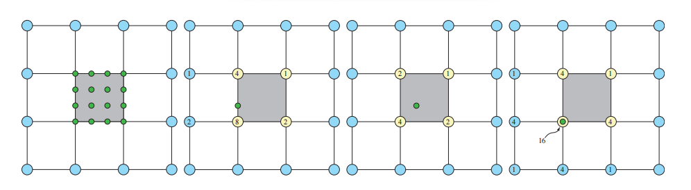

上述技术是计算一个Bezier 面片的普通情况。当网格中存在一个异常顶点的时候，我们会计算一个异常面片\[1070]。图17.64展示了这种情况下的模板，其中灰色四边形的左下角顶点就是一个特殊顶点。

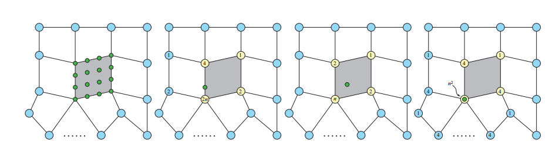

请注意，这将产生一个近似于Catmull-Clark细分表面的面片，并且在特殊顶点的边缘处只有$C^0$连续性。当对这种表面进行着色的时候，出现的一些小瑕疵可能会分散观众的注意力，因此建议使用类似于N面片的技巧（章节17.2.4）。然而，为了降低计算的复杂度，我们推导出了两个切线面片：一个在$u$方向上，另一个在$v$方向上。而表面法线就是这些向量的叉乘结果。一般来说，Bezier 面片的导数可以使用方程17.35进行计算。然而，由于生成的Bezier面片近似于Catmull-Clark表面，因此切线面片之间并不会形成连续的法线场。关于如何克服这些问题，详见Loop和Schaefer的论文\[1070]。图17.65展示了一类可能会发生的瑕疵。

Kovacs等人\[931描述了如何对上述方法进行扩展，从而来处理折痕和拐角（章节17.5.3），并在Valve的起源（Source）引擎中实现这些扩展方法。

#### 特征自适应细分和OpenSubdiv

皮克斯展示了一个名为OpenSubdiv的开源系统，它实现了一套被称为特征自适应细分（feature adaptive subdivision，FAS）的技术\[1279, 1280, 1282]。其基本方法与前面所讨论的技术有很大不同。这项工作的基础在于，对于规则表面的细分相当于双三次B样条面片（章节17.2.6），这里的规则表面是指网格中的四边形顶点都是规则的（4价）。因此，只会对非规则表面进行递归细分，直到达到某个预设的最大细分层级为止，如图17.66左侧所示。FAS还可以处理折痕和半光滑的折痕\[347]，并且FAS算法也需要对这些折痕进行细分，如图17.66右侧所示。其中的双三次B样条面片可以使用曲面细分管线直接进行渲染。

![图17.66：左：围绕着一个特殊顶点进行递归细分，这个位于最中间的特殊顶点具有三条边。随着细分递归的进行，它会留下一组规则面片（包含四个顶点，每个顶点都为4价）。右：中间的加粗线条代表了对这个平滑折痕周围的细分。 \[1279\]](images/Chapter-17/202309112015029.png "图17.66：左：围绕着一个特殊顶点进行递归细分，这个位于最中间的特殊顶点具有三条边。随着细分递归的进行，它会留下一组规则面片（包含四个顶点，每个顶点都为4价）。右：中间的加粗线条代表了对这个平滑折痕周围的细分。 \[1279]")

该方法首先使用CPU创建一个表格，这个表格将细分过程中需要访问的顶点索引编码到一个指定的级别中。由于索引与顶点位置无关，因此这个基本网格可以被动画化。一旦生成了一个双三次B样条面片，就不再需要递归了，这意味着这个表格通常会相对较小。这个基本网格、带有索引和附加顶点价信息的表格、以及折痕数据只需要上传到GPU中一次即可。

![图17.67：图中的红色方块是过渡区域，它具有四个相邻的区域，分别是蓝色区域（当前细分层）和绿色区域（下一个细分层）。这幅插图展示了可能发生的五种情况，以及它们是如何被拼接在一起的。 \[1279\]](images/Chapter-17/202309112033490.png "图17.67：图中的红色方块是过渡区域，它具有四个相邻的区域，分别是蓝色区域（当前细分层）和绿色区域（下一个细分层）。这幅插图展示了可能发生的五种情况，以及它们是如何被拼接在一起的。 \[1279]")

为了对网格进行一步细分，首先要计算新的表面点，然后计算新的边缘点，最后再对顶点进行更新，每种类型的点都使用一个计算着色器来执行。对于渲染而言，要对完整面片（full patch，FP）和过渡面片（transition patch，TP）进行区分。一个完整面片只与相同细分水平的面片共享边缘，同时一个规则的完整面片会直接使用GPU的曲面细分管线，将其渲染为一个双三次B样条面片，否则将会继续进行细分。这个自适应细分过程会确保相邻面片之间最多只有一个细分级别的差异。而一个过渡面片则对至少一个邻居具有细分级别上的差异。为了获得没有裂缝的渲染效果，每个过渡面片会被划分成若干个子面片，如图17.67所示。这样，细分顶点就会沿着每条边缘的两侧相匹配。每种类型的子面片都会使用不同的壳着色器和实现了插值变体的域着色器来进行渲染。例如：对于图17.67中最左边的情况，它会被渲染为三个三角形B样条补丁。而在异常顶点周围则会使用另一个域着色器，并使用Halstead等人\[655]的方法来计算极限位置和极限法线。图17.68展示了一个使用OpenSubdiv的Catmull-Clark表面渲染的结果。

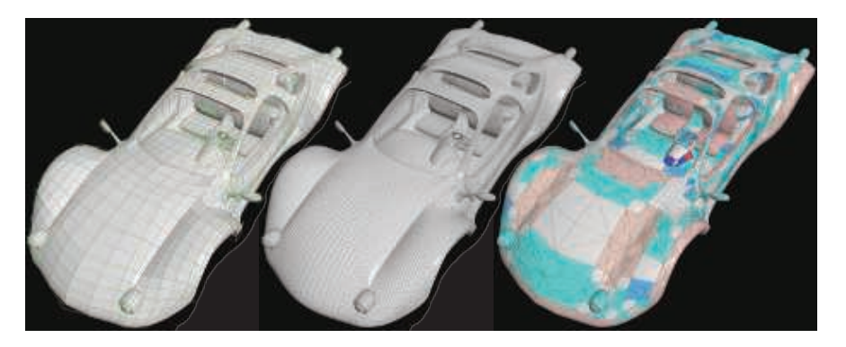

FAS算法可以处理折痕、半平滑折痕、分层细节以及自适应LOD。我们推荐参考FAS的论文\[1279]，以及Nießner的博士论文\[1282]来了解更多细节。Schafer等人\[1547]提出了FAS的一种变体，被称为DFAS，其速度更快。

#### 自适应四叉树

Brainerd等人\[190]提出了一种被称为自适应四叉树（adaptive quadtree）的方法。它类似于Loop和Schaefer \[1070]的近似方案，即在原始基础网格的每个四边形上都提交一个细分图元。此外，该方法还预计算了一个细分计划，这是一个四叉树结构，它从一个输入表示来编码分层细分（类似于特征自适应细分），直到某个最大细分层级。这个细分计划同样还包含细分表面所需要的控制点模板列表。

在渲染过程中会遍历这个四叉树，这使得可以将$(u, v)$坐标映射到一个细分层次结构中的面片，这个面片可以直接进行计算。这个四叉树的叶子节点是原始表面域的一个子区域，该子区域中的表面可以使用模板中的控制点直接进行计算。会使用一个迭代循环来遍历域着色器中的四叉树，这个域着色器的输入是一个参数化的$(u, v)$坐标。需要持续进行遍历，直到到达$(u, v)$坐标所在的叶子节点。。根据所到达的四叉树节点类型会采取不同的操作，例如：当到达一个可以直接进行计算的子区域时，它所对应的双三次B样条面片的16个控制点会被检索，然后着色器继续对这个面片进行计算。

![图17.69：左：根据特征自适应细分（FAS）进行分层细分，其中每个三角形和每个四边形都会被渲染为单独的细分图元。右：使用自适应四叉树进行分层细分，其中整个四叉会被渲染为单个细分图元。 \[190\]](images/Chapter-17/202309112052009.png "图17.69：左：根据特征自适应细分（FAS）进行分层细分，其中每个三角形和每个四边形都会被渲染为单独的细分图元。右：使用自适应四叉树进行分层细分，其中整个四叉会被渲染为单个细分图元。 \[190]")

图17.1展示了一个使用这种技术进行渲染的例子。该方法是迄今为止速度最快的，并且能够准确地渲染Catmull-Clark细分曲面的方法，同时还能够处理折痕以及其他拓扑特征。图17.69展示了使用自适应四叉树相对于FAS的另一个优势，图17.70进一步说明了这一点。自适应四叉树还能够提供更加均匀的细分结果，因为每个提交的四叉树与细分图元之间具有一对一的映射关系。

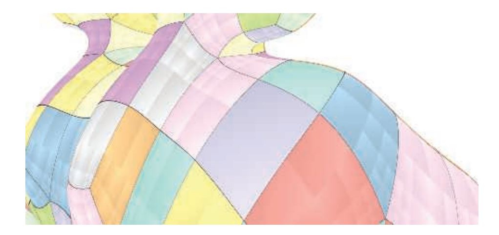

## 补充阅读和资源

曲线和曲面是一个巨大的主题，想要获得更多有用的信息，最好是参考一些专门讨论这个主题的书籍。Mortenson的书籍\[1242]很好地介绍了几何建模。Farin的书籍\[458, 460]，以及Hoschek和Lasser的书籍\[777]都是概括性的，这些书籍讨论了计算机辅助几何设计（Computer Aided Geometric Design，CAGD）的许多方面。对于隐式表面，请参阅Gomes等人\[558]的书籍，以及de Araujo等人\[67]的最新论文。有关细分曲面的更多信息，请参阅Warren和Heimer的书籍\[1847]，以及Zorin等人\[1977]有关“建模和动画的细分（Subdivision for Modeling and Animation）”的SIGGRAPH课程说明。Ni等人\[1275]的关于细分曲面替代品（substitute）的课程也是一个十分有用的资源。Nießner等人\[1283]的调研，以及Nießner的博士论文\[1282]，对于使用GPU实时渲染细分表面很有帮助。

对于样条插值，除了上述Farin\[458]、Hoschek和Lasser的书籍\[777]之外，我们还建议感兴趣的读者参考the Killer B的书籍\[111]。对于曲线和曲面，Bernstein多项式的许多性质都是由Goldman \[554]给出的。几乎所有你需要知道的，关于三角形Bezier曲面的知识，都可以在Farin的文章\[457]中找到。另一类有理曲线和有理曲面是非均匀的有理B样条（nonuniform rational B-spline，NURBS）\[459, 1416, 1506]，它常用于CAD领域中。
